# InHand VG710 Series In-Vehicle Gateway User's Manual

## Declaration

Thank you for choosing our product. Before using the product, read this manual carefully.

The contents of this manual cannot be copied or reproduced in any form without the written permission of InHand. Due to continuous updating, InHand cannot promise that the contents are consistent with the actual product information, and does not assume any disputes caused by the inconsistency of technical parameters. The information in this document is subject to change without notice. InHand reserves the right of final change and interpretation.

© 2020 InHand Networks. All rights reserved.

## Conventions

| Symbol | Indication | Example |
|:---:|------|------|
| `< >` | Indicates a variable or parameter to be replaced with an actual value | `<IP address>` indicates a specific IP is required |
| `" "` | Indicates a window name or menu name | Click the "Save" button |
| `>>` | Separates a multi-level menu | File >> New >> Folder |
| `>` | Indicates a button name | Click the >OK< button |
|  | Reminds readers to be careful. Improper action may result in loss of data or device damage. | - |
|  | Notes contain detailed descriptions and helpful suggestions. | - |

## Technical Support

3650 Concorde Pkwy Suite 200  Chantilly, VA, 20151

T: +1 (703) 348-2988

<www.inhandnetworks.com>

Inquiry: <info@inhandnetworks.com> | Support: <support@inhandnetworks.com>

## How to Use This Manual

**Finding the Right Section**:

- First-time users: Read sequentially: "Getting to Know the Device" >> "Installation and First Use" >> "Common Scenarios" >> "Feature Descriptions and Parameter Reference"
- Existing device users: Refer directly to "Feature Descriptions and Parameter Reference" or "Appendix A Troubleshooting"
- Cloud platform users: Refer to the cloud platform sections under "Common Scenarios"

**Quick Navigation by Task**:

| Task | Chapter | Estimated Time |
|------|----------|----------|
| Learn about VG710 appearance and interfaces | [1 Getting to Know the Device](#1-getting-to-know-the-device) | ~5 min |
| Install SIM card and antennas | [2 Installation and First Use](#2-installation-and-first-use) | ~10 min |
| First login to web management interface | [2 Installation and First Use](#2-installation-and-first-use) | ~5 min |
| Configure cellular network access | [3.1 Cellular Networking](#31-scenario-1-cellular-networking) | ~5 min |
| Configure Wi-Fi network access | [3.2 Wi-Fi Networking](#32-scenario-2-wi-fi-networking) | ~5 min |
| Configure VPN remote networking | [3.3 IPsec VPN Tunnel](#33-scenario-3-ipsec-vpn-tunnel) | ~10 min |
| Connect to cloud management platform | [3.4 Cloud Platform](#34-scenario-4-connecting-to-the-cloud-management-platform) | ~5 min |
| OBD vehicle diagnostics | [3.5 OBD Diagnostics](#35-scenario-5-obd-vehicle-diagnostics) | ~3 min |
| View feature parameter details | [4 Feature Descriptions](#4-feature-descriptions-and-parameter-reference) | As needed |
| Troubleshoot network issues | [Appendix A Troubleshooting](#appendix-a-troubleshooting) | As needed |

# 1 Getting to Know the Device

## 1.1 Overview

The InHand VG710 series is a new-generation 4G/5G in-vehicle gateway oriented at the Internet of Vehicles (IoV). It provides fast and secure networks for automobiles and transport service vehicles, meeting the requirements of police vehicles, emergency command vehicles, engineering vehicles, medical vehicles, and logistics vehicles for fast mobile networks. It is used with a cloud-based remote vehicle management platform to provide ubiquitous accessible networks and uninterrupted operation supervision for logistics management, asset tracking, mobile office, and government security.

<p align="center">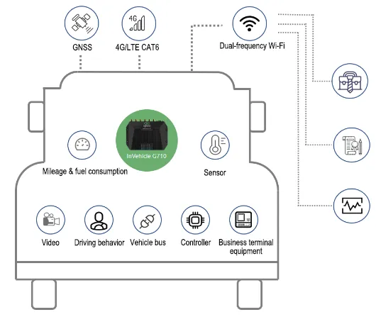</p>

<p align="center"><strong>Figure 1.1 VG710 Application Case</strong></p>

## 1.2 Appearance and Interfaces

### 1.2.1 VG710-H 5G Version

<p align="center">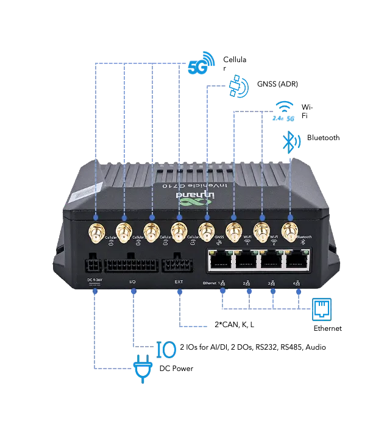</p>

<p align="center"><strong>Figure 1.2 VG710-H 5G Version Panel Interfaces</strong></p>

**IO 20PIN Definition**

| PIN | 1 | 2 | 3 | 4 | 5 | 6 | 7 | 8 | 9 | 10 |
| :---: | :---: | :---: | :---: | :---: | :---: | :---: | :---: | :---: | :---: | :---: |
| Def. | L_Channel | Mic IN | RS485A | GND | RS232_TX | 1Wire | DO1 | GND | AI1/DI1 | AI3/DI3/FWD* |
| PIN | 11 | 12 | 13 | 14 | 15 | 16 | 17 | 18 | 19 | 20 |
| Def. | R_Channel | GND | RS485B | GND | RS232_RX | GNSS_1PPS | DO2 | GND | AI2/DI2 | AI4/DI4/WHEELTICK* |

*Support GNSS ADR model is FWD and WHEEL TICK function.

**EXT 10PIN Definition**

| PIN | 1 | 2 | 3 | 4 | 5 |
| :---: | :---: | :---: | :---: | :---: | :---: |
| Def. | K_LINE | CAN1_H | GND | CAN2_H | J1708_A |
| PIN | 6 | 7 | 8 | 9 | 10 |
| Def. | L_LINE | CAN1_L | GND | CAN2_L | J1708_B |

### 1.2.2 VG710 4G Version

<p align="center">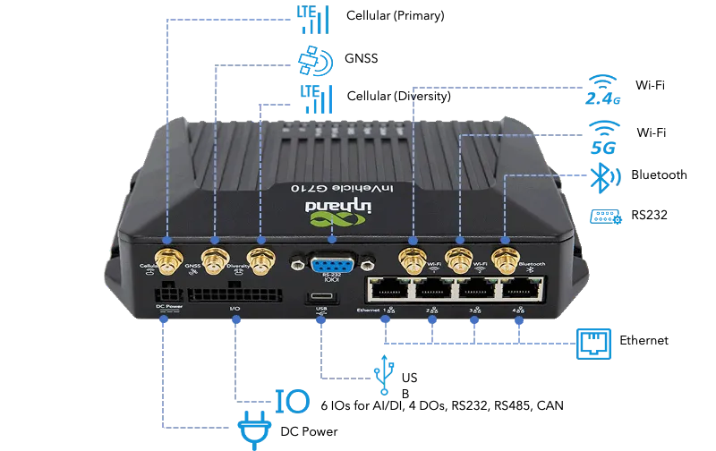</p>

<p align="center"><strong>Figure 1.3 VG710 4G Version Panel Interfaces</strong></p>

**IO 20PIN Definition**

| PIN | 1 | 2 | 3 | 4 | 5 | 6 | 7 | 8 | 9 | 10 |
| :---: | :---: | :---: | :---: | :---: | :---: | :---: | :---: | :---: | :---: | :---: |
| Def. | RS485B | CAN1_L | 1-Wire | DO4 | DO2 | GND | AI/DI6 | AI/DI4 | AI/DI2 | GND |
| PIN | 11 | 12 | 13 | 14 | 15 | 16 | 17 | 18 | 19 | 20 |
| Def. | RS485A | CAN1_H | GND | DO3 | DO1 | GND | AI/DI5 | AI/DI3 | AI/DI1 | GND |

### 1.2.3 VG710-M Version

<p align="center"></p>

<p align="center"><strong>Figure 1.4 VG710-M Version Panel Interfaces</strong></p>

The VG710-M power connector features an 8-pin design, including VIN+, VIN-, CAN-H, CAN-L, and AI/DI. There is no IGT/ACC signal available. Once the device is connected to the positive and negative terminals of a direct current power supply, it can operate normally.

<p align="center">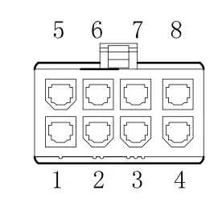</p>

<p align="center"><strong>Figure 1.5 VG710-M Power Cable Connector</strong></p>

To power the VG710-M Version: Connect the red wire of cable P2 to the positive terminal of the DC power supply, and the black wire to the negative terminal. The acceptable voltage range is 9 to 36V DC.

**Power Connector Pin Definition**

| PIN | 5 | 6 | 7 | 8 |
| :---: | :---: | :---: | :---: | :---: |
| Def. | V- | AI/DI | GND | CAN-L |
| PIN | 1 | 2 | 3 | 4 |
| Def. | V+ | IGT | GND | CAN-H |

> **Note**: IGT is the vehicle ignition signal. If during an office test, connect IGT to the positive pole (V+) of the power supply.

## 1.3 Indicator Description

| Indicator | Status | Definition |
|--------|------|------|
| System | Steady off | The device is powered off |
|  | Steady red | The system is starting |
|  | Steady blue | The IGT signal is not connected |
|  | Blinking green | The system operates properly |
|  | Blinking red | The system is faulty |
|  | Blinking blue | The system is being upgraded |
| Cellular | Steady off | The dialup function is disabled |
|  | Blinking green | Dialup is in progress |
|  | Steady green | Dialup succeeds |
|  | Blinking red | Dialup fails (no module or SIM card detected) |
| Signal | Steady off | No signal |
|  | Steady red | Weak signals (≤ 9 asu) |
|  | Steady blue | Moderate signals (10–19 asu) |
|  | Steady green | Strong signals (≥ 20 asu) |
| GNSS | Steady off | GNSS is disabled |
|  | Blinking green | Positioning is in progress |
|  | Steady green | Positioning is completed |
| Wi-Fi 2.4G | Steady off (AP) | The AP is disabled |
|  | Blinking green (AP) | The AP operates properly |
|  | Steady off (STA) | STA disabled, or no AP associated |
|  | Steady green (STA) | Wrong password after AP associated |
|  | Blinking green (STA) | An AP is associated |
| Wi-Fi 5G | Steady off (AP) | The AP is disabled |
|  | Blinking blue (AP) | The AP operates properly |
|  | Steady off (STA) | STA disabled, or no AP associated |
|  | Steady blue (STA) | Wrong password after AP associated |
|  | Blinking blue (STA) | An AP is associated |
| U1 | Steady off | The APP is disabled |
|  | Steady green | The APP is enabled |
| U2 | Steady off | The VPN is disabled or abnormal |
|  | Steady green | The VPN operates properly |

## 1.4 Restoring Default Settings

To restore default settings via the Reset button:

1. Power on the device and immediately press and hold the Reset button. After about 15s, only the System indicator is steady red.
2. When the System indicator turns off and becomes red again, immediately release the Reset button.
3. When the System indicator turns off, press the Reset button (ensure that it blinks red twice) and then release it. The device is restored to the default settings.

## 1.5 Default Settings

| No. | Function | Default Settings |
| :---: | --- | --- |
| 1 | Cellular dialup | − Enabled (Cellular indicator is steady green after dialup succeeds.)<br/>Dual-SIM is disabled by default; SIM1 is enabled. |
| 2 | Satellite positioning and inertial navigation | − Enabled (GNSS indicator is steady green after positioning succeeds.)<br/>− Inertial navigation is enabled. |
| 3 | On-board diagnostics (OBD) | − Enabled<br/>− CANbus baud rate: auto-detected<br/>− OBD protocol: auto-detected<br/>− OBD data: auto-scanned |
| 4 | Wi-Fi | − Wi-Fi 2.4G AP enabled. SSID: VG710-XXXXXX<br/>− Wi-Fi 5G AP enabled. SSID: VG710-5G-XXXXXX<br/>− Authentication: WPA2-PSK<br/>− Password: last 8 digits of SN |
| 5 | Ethernet | − Four LAN ports enabled<br/>− IP: 192.168.2.1, Mask: 255.255.255.0<br/>− DHCP server enabled, pool: 192.168.2.2–192.168.2.100 |
| 6 | Network access control | − HTTP (80) and HTTPS (443) enabled<br/>− Telnet and SSH disabled<br/>− Cellular network: HTTPS only |
| 7 | Credentials | − **adm/123456** (super administrator) |
| 8 | Power management | − shutdown-delay: 30s<br/>− standby-mode: enabled<br/>− standby-check-interval: 20<br/>− standby-voltage: 9V<br/>− standby-resume-voltage: 10.5V |
| 9 | IO | − 4 DO channels: low level, pull-up disabled<br/>− 6 DI channels: pull-up disabled |
| 10 | Serial port | − RS232: 9600/8/N/1<br/>− RS485: 9600/8/N/1 |

# 2 Installation and First Use

## 2.1 Pre-Installation Preparation

| Item | Purpose | Description |
|------|------|------|
| SIM card | Cellular access | Activated with the carrier |
| Cellular antenna | Signal Tx/Rx | Diversity antenna for poor signal |
| GNSS antenna | Positioning | For GPS/BeiDou |
| Wi-Fi antenna | Wireless access | If Wi-Fi is needed |
| Power cable | Power supply | 9–36V DC |
| Ethernet cable | PC connection | For initial config |
| PC | Management | Edge/Firefox/Chrome recommended |

> **Note**: Before inserting or removing the SIM card, unplug the power cable; otherwise, data loss or gateway damage may occur.

## 2.2 Installation Guide

### 2.2.1 Hardware Connection

1. Insert the SIM card, connect the GNSS and cellular antennas, and connect the power supply and PC. Insert the diversity dialup antenna when the dialup card has poor signals.

<p align="center">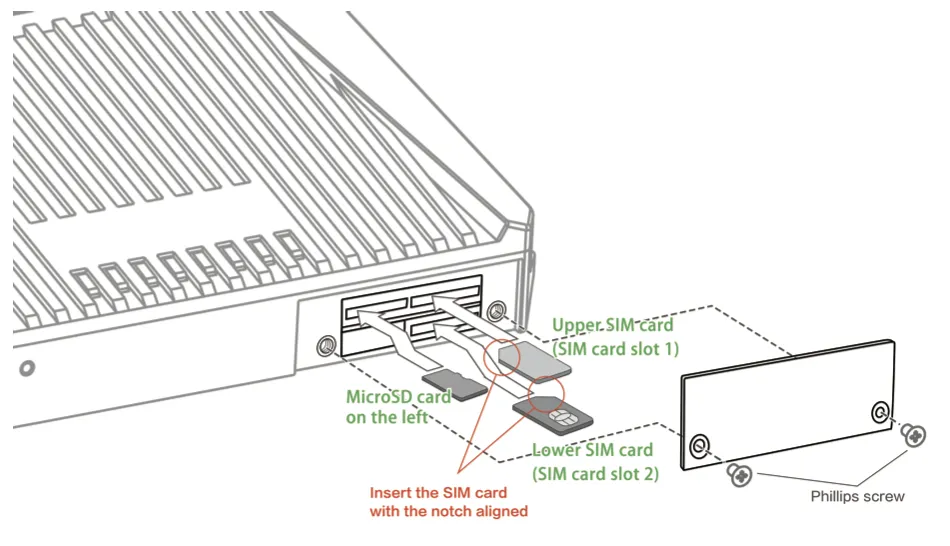</p>

<p align="center"><strong>Figure 2.1 VG710 Hardware Connection (Front)</strong></p>

<p align="center">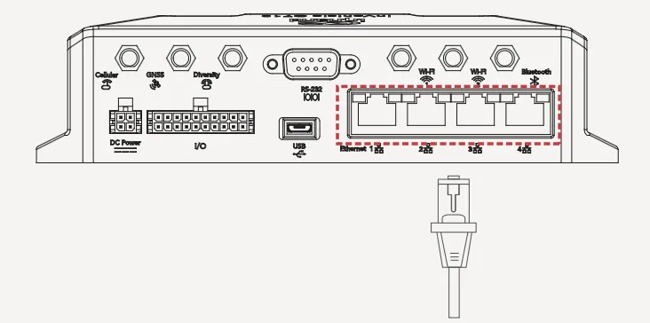</p>

<p align="center"><strong>Figure 2.2 VG710 Hardware Connection (Wiring)</strong></p>

|  Note:<br/>Before inserting or removing the SIM card, unplug the power cable; otherwise, data loss or gateway damage may occur. |
| :--- |

### 2.2.2 PC IP Address Configuration

Assign an IP address on the same network segment as the gateway to the PC:

**Method 1**: Enable automatic IP address acquisition (recommended).

**Method 2**: Configure a fixed IP: Select "Use the following IP address", enter an IP in 192.168.2.2–192.168.2.254, subnet mask 255.255.255.0, default gateway 192.168.2.1, then click OK.

<p align="center">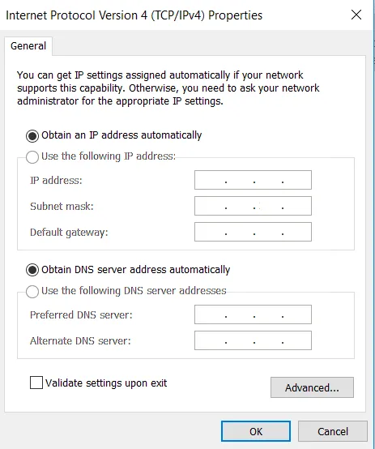</p>

<p align="center"><strong>Figure 2.3 Obtain an IP Address Automatically</strong></p>

<p align="center">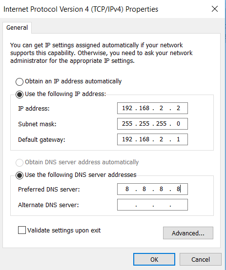</p>

<p align="center"><strong>Figure 2.4 Use a Fixed IP Address</strong></p>

### 2.2.3 Logging In to the Web Management Interface

**Method 1: Via Ethernet Cable**

1. Open the browser, enter 192.168.2.1, and press Enter. (Edge, Firefox, or Chrome recommended)

<p align="center"></p>

<p align="center"><strong>Figure 2.5 Accessing the Gateway Address</strong></p>

2. Log in (if a security prompt appears, click "Advanced >> Continue"). Enter username **adm** and password **123456**.

<p align="center">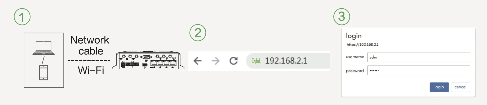</p>

<p align="center"><strong>Figure 2.6 Web Login Page</strong></p>

**Method 2: Via Wi-Fi**

1. Connect via Ethernet or Wi-Fi (SSID and key on the nameplate). Wi-Fi indicator should be steady green or blinking.
2. Enter 192.168.2.1 in the browser address bar.
3. Enter username **adm** and password **123456**.

### 2.2.4 Cellular Network Quick Configuration

1. Navigate to Network >> Cellular, check "Enable", and click Apply & Save. If status is "Connected" with an IP address, the SIM card is connected. (Set APN parameters for a private-network card.)

<p align="center">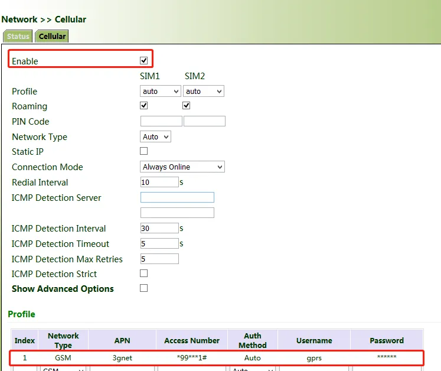</p>

<p align="center"><strong>Figure 2.7 Cellular Network Configuration</strong></p>

<p align="center">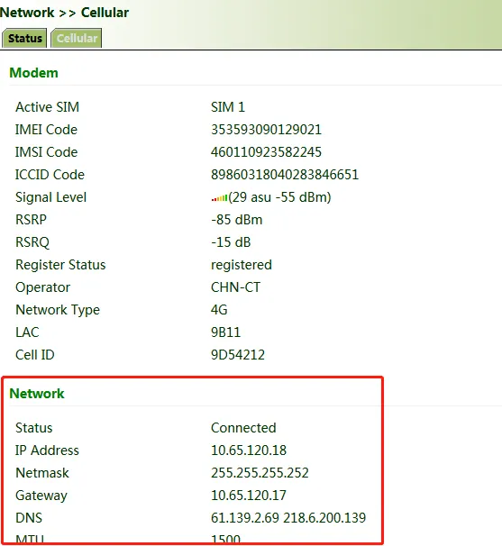</p>

<p align="center"><strong>Figure 2.8 Cellular Network Connection Status</strong></p>

2. Use Ping to test connectivity. If data is transmitted, the device is connected.

<p align="center">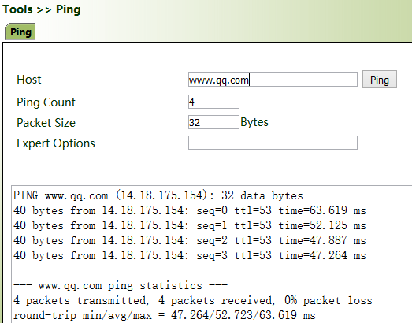</p>

<p align="center"><strong>Figure 2.9 Ping Connectivity Test</strong></p>

3. Enable the dual-SIM function when two SIM cards are used.

<p align="center">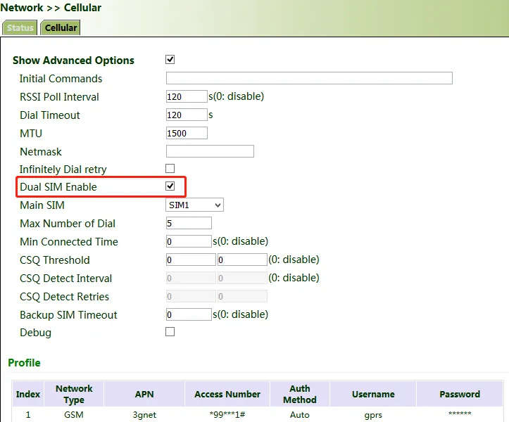</p>

<p align="center"><strong>Figure 2.10 Dual-SIM Function</strong></p>

### 2.2.5 Wi-Fi Network Access

1. Screw the Wi-Fi antenna into the panel Wi-Fi antenna interface. Connect via Ethernet or Wi-Fi (SSID and key on nameplate).

<p align="center">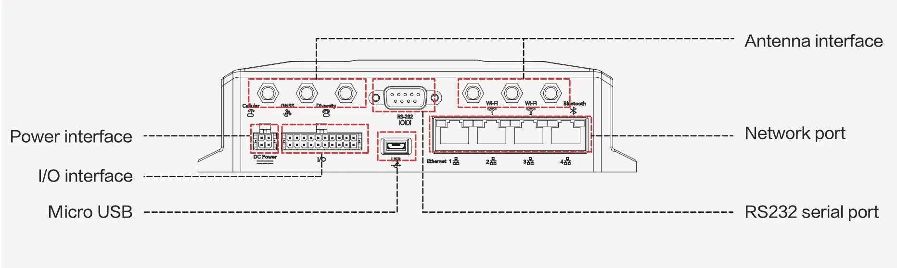</p>

<p align="center"><strong>Figure 2.11 Wi-Fi Antenna Connection</strong></p>

2. Assign an IP to the PC on the same segment and log in (see 2.2.2 and 2.2.3).

3. Navigate to Network >> Wi-Fi, select Wi-Fi 2.4G or Wi-Fi 5G as a client. Enter the AP name, authentication method, and key. Click Apply & Save.

<p align="center">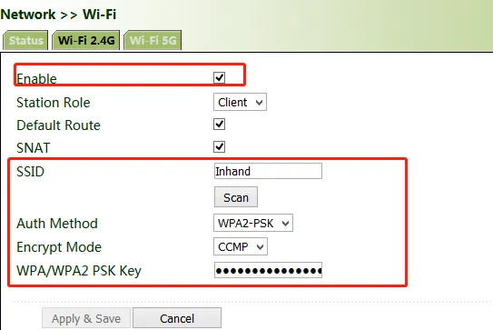</p>

<p align="center"><strong>Figure 2.12 Wi-Fi Client Configuration</strong></p>

4. On the "Status" page, if status is "Connected" with an IP address, the device is connected via Wi-Fi.

<p align="center">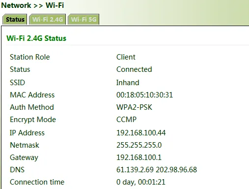</p>

<p align="center"><strong>Figure 2.13 Wi-Fi Connection Status</strong></p>

## 2.3 Quick Check

| No. | Check Item | Criteria |
|:---:|--------|----------|
| 1 | SIM card inserted | Slot seated correctly |
| 2 | Cellular antenna connected | Connector tightened |
| 3 | GNSS antenna connected | Connector tightened (if needed) |
| 4 | Power cable connected | 9–36V DC range |
| 5 | System indicator | Blinking green = normal |
| 6 | Cellular indicator | Steady green = dialup success |
| 7 | Signal indicator | Steady green = strong signal |
| 8 | Web interface accessible | 192.168.2.1 opens login page |

# 3 Common Scenarios

## 3.1 Scenario 1: Cellular Networking

**Objective**: Access the Internet via a 4G/5G cellular network.

**Prerequisites**: A SIM card has been inserted and antennas have been installed. The device is powered on and the user has logged in to the device via the web interface.

**Estimated Time**: Approximately 5 minutes.

**Steps**:

1. Navigate to **Network > Cellular**, check "Enable", and click **Apply & Save**. If the network connection status shows "Connected" and an IP address has been allocated, the SIM card has been successfully connected to the network.

   > **Note**: If using a private-network SIM card, the APN (Access Point Name) parameters must be configured. Obtain the APN parameters from the carrier.

<p align="center"></p>

<p align="center"><strong>Figure 3.1 Cellular network configuration page</strong></p>

<p align="center"></p>

<p align="center"><strong>Figure 3.2 Cellular network connected status</strong></p>

2. (Optional) If two SIM cards are installed in the device, the dual-SIM function must be enabled. Navigate to **Network > Cellular**, enable the dual-SIM function, and click **Apply & Save**.

<p align="center"></p>

<p align="center"><strong>Figure 3.3 Dual SIM function configuration</strong></p>

**Verification**:

1. Navigate to **System > Network Tools** and use the Ping tool to test connectivity to a public network address. If data is transmitted and received, the device has been successfully connected to the Internet.

<p align="center"></p>

<p align="center"><strong>Figure 3.4 Ping connectivity test result</strong></p>

**Common Issues**:

- Cellular network connection failure: Verify that the SIM card is correctly inserted into the card slot, that the antenna is securely connected, and that the APN parameters match the information provided by the carrier.
- Frequent disconnections due to poor signal quality: Confirm the antenna type is correct (primary antenna / diversity antenna) and try adjusting the position of the device or antenna to improve signal reception.
- Connected but unable to access the Internet: Use the Ping tool to test different target addresses (such as the carrier DNS or a public IP address) to systematically determine whether the issue is a DNS resolution problem or a routing problem.

## 3.2 Scenario 2: Wi-Fi Networking

**Objective**: Access the Internet by connecting to an external wireless access point (AP) via Wi-Fi.

**Prerequisites**: A Wi-Fi antenna has been installed. The device is powered on and the user has logged in to the device via the web interface.

**Estimated Time**: Approximately 5 minutes.

**Steps**:

1. Complete the Wi-Fi antenna installation. Screw the Wi-Fi antenna into the Wi-Fi antenna interface on the panel, and connect to the device through a network cable or Wi-Fi (see the SSID and key on the nameplate). If connecting via Wi-Fi, the Wi-Fi indicator should be steady on in green or blinking.

<p align="center"></p>

<p align="center"><strong>Figure 3.5 Wi-Fi antenna connection diagram</strong></p>

2. Assign an IP address to the PC on the same network segment as the gateway, and log in to the device web management interface. For login instructions, refer to [2 Installation and First Use](#2-installation-and-first-use).

3. Navigate to **Network > Wi-Fi**, select Wi-Fi 2.4G or Wi-Fi 5G, and set the station role to "Client". Enter the name, authentication method, and key of the target wireless access point (AP), and click **Apply & Save**.

<p align="center"></p>

<p align="center"><strong>Figure 3.6 Wi-Fi client configuration page</strong></p>

**Verification**:

1. Click the "Status" page to check the current network status. If the status shows "Connected" and an IP address has been obtained, the device has been successfully connected to the network via Wi-Fi.

<p align="center"></p>

<p align="center"><strong>Figure 3.7 Wi-Fi connection status page</strong></p>

**Common Issues**:

- Wi-Fi connection failure: Verify that the Wi-Fi antenna is correctly installed, and confirm that the SSID and key of the target AP are entered correctly.
- Unable to obtain an IP address: Confirm that the DHCP service on the target AP is enabled, or try switching the Wi-Fi frequency band (2.4G/5G).
- Unstable connection: Check the distance and obstacles between the device and the AP, and adjust the device position as needed to improve signal quality.

## 3.3 Scenario 3: IPsec VPN Tunnel

**Objective**: Establish an IPsec VPN encrypted tunnel between two gateways to enable secure communication between subnets.

**Prerequisites**: Both gateways are connected to the network. The public IP address and subnet information of the peer gateway are known.

**Estimated Time**: Approximately 10 minutes.

### 3.3.1 Scenario Description

Data is transmitted between the subnet (192.168.1.0/24) of headquarters A and the subnet (172.16.1.0/24) of customer branch B through gateway A and gateway B. The transmission channels between gateway A and gateway B are encrypted over IPsec to protect the security of data transmission and prevent data leakage and eavesdropping.

IPsec is a group of open network security protocols developed by IETF. At the IP layer, the data source authentication, data encryption, data integrity, and anti-replay functions are used to ensure the security of data transmission between communication parties on the Internet.

<p align="center"></p>

<p align="center"><strong>Figure 3.8 IPsec VPN network topology</strong></p>

### 3.3.2 Parameter Configuration Reference

The following table lists the IPsec parameter configuration for gateway A and gateway B:

| **Gateway A** | | | **Gateway B** | |
| :--- | :--- | :--- | :--- | :--- |
| **Set IKEv1/v2 parameters** | | | **Set IKEv1/v2 parameters** | |
| ID | Custom | | ID | Custom |
| Encryption algorithm | AES128 | | Encryption algorithm | Same as that of gateway A |
| Hash algorithm | SHA1 | | Hash algorithm | |
| Diffie-Hellman key exchange | Group2 | | Diffie-Hellman key exchange | |
| Lifecycle | 86400 | | Lifecycle | |
| **IPsec policy** | | | **IPsec policy** | |
| Name | Custom | | Name | Custom |
| Encapsulation | ESP | | Encapsulation | Same as that of gateway A |
| Encryption algorithm | AES128 | | Encryption algorithm | |
| Authentication method | SHA1 | | Authentication method | |
| IPsec mode | Tunnel mode | | IPsec mode | |
| **IPsec tunnel configuration** | | | **IPsec tunnel configuration** | |
| Peer address | Address where gateway B establishes the IPsec service | | Peer address | Address where gateway A establishes the IPsec service |
| Interface | Interface for establishing the IPsec service | | Interface | Interface for establishing the IPsec service |
| IKE version | IKE version used | | IKE version | Same as that of gateway A |
| Authentication method | Shared key | | Authentication method | |
| Local subnet | IP address of the subnet of gateway A | | Local subnet | IP address of the subnet of gateway B |
| Peer subnet | IP address of the subnet of gateway B | | Peer subnet | IP address of the subnet of gateway A |

> **Note**: The IKE parameters, IPsec policy parameters, and IKE version on gateway B must be consistent with those on gateway A; otherwise, the tunnel cannot be established.

### 3.3.3 Steps

**Step 1: Configure IKE Policy and IPsec Policy**

On both gateway A and gateway B, add IKE and IPsec policies according to the parameters in the table above, and click **Apply & Save**.

<p align="center">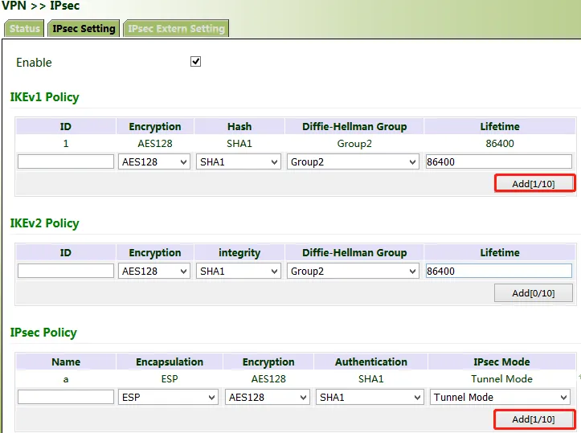</p>

<p align="center"><strong>Figure 3.9 IKE and IPsec policy configuration page</strong></p>

**Step 2: Configure IPsec Tunnel**

On both gateway A and gateway B, add an IPsec tunnel, fill in the peer address, local subnet, peer subnet, and other parameters, and click **Apply & Save**.

<p align="center">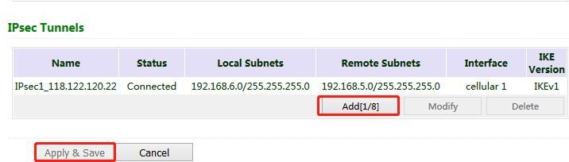</p>

<p align="center"><strong>Figure 3.10 IPsec tunnel configuration page</strong></p>

### 3.3.4 Verification

Access the IPsec status page. If the page is displayed as shown in the following figure, the IPsec VPN tunnel has been established successfully.

<p align="center">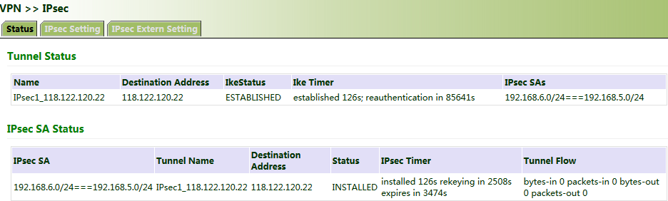</p>

<p align="center"><strong>Figure 3.11 IPsec VPN connection status</strong></p>

### 3.3.5 Common Issues

- IPsec tunnel cannot be established: Verify that the IKE parameters (encryption algorithm, hash algorithm, Diffie-Hellman group, lifecycle) are identical on both ends.
- Unable to communicate after the tunnel is established: Verify that the local subnet and peer subnet configurations are correct, and confirm that the subnet addresses on both ends are not reversed.
- Tunnel frequently disconnects and reconnects: Verify that the public IP addresses of both gateways are stable and that the lifecycle parameters match.
- Pre-shared key mismatch: Confirm that the pre-shared keys configured on both gateways are identical. Note that the key is case-sensitive.

## 3.4 Scenario 4: Connecting to the Cloud Management Platform

**Objective**: Connect the VG710 gateway to the InHand Device Manager cloud management platform to enable remote device monitoring and management.

**Prerequisites**: The device is connected to the network (cellular or Wi-Fi). An account has been registered on the Device Manager platform (global site: https://iot.inhandnetworks.com).

**Estimated Time**: Approximately 5 minutes.

**Steps**:

1. Navigate to **Administration > Device Manager > Device Manager** and check "Device Manager Enable".

2. Configure the following parameters:
   - Service Type: Select "Device Manager"
   - Server Address: Enter "iot.inhandnetworks.com" (if a privately deployed Device Manager cloud platform is used, enter the private server IP or domain name and set the server type to "Customer")
   - Secure Channel: Check this option to use SSL encrypted transmission
   - Registered Account: Enter the email address of the account registered in step 1
   - Site Name and Asset Number: Customize as needed

3. Ensure the VG710 is connected to the Internet, then click **Apply & Save**.

<p align="center">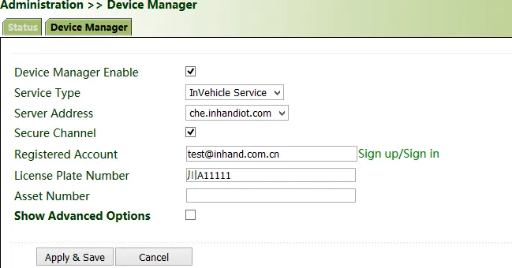</p>

<p align="center"><strong>Figure 3.12 Cloud platform connection configuration page</strong></p>

<p align="center">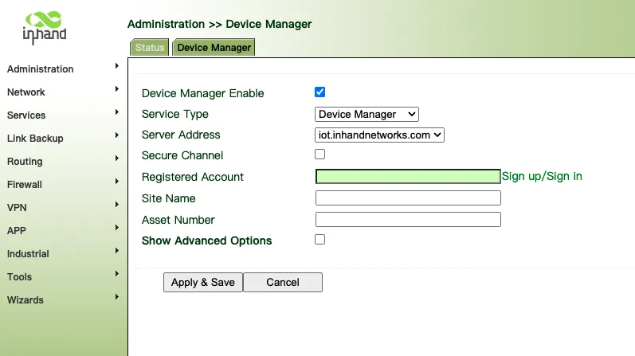</p>

<p align="center"><strong>Figure 3.13 Device Manager configuration details</strong></p>

**Verification**:

1. Click the "Status" page. If the status shows "Connected", the gateway has been successfully connected to the cloud platform.
2. Log in to the Device Manager cloud platform and check whether the VG710 device is online in the gateway list.

<p align="center">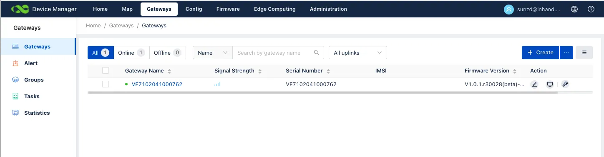</p>

<p align="center"><strong>Figure 3.14 Device Manager gateway list</strong></p>

**Common Issues**:

- Device cannot connect to the cloud platform: Confirm that the device is properly connected to the network (cellular or Wi-Fi), verify that the server address is entered correctly, and confirm that the registered account is valid.
- Connection status shows "Disconnected": Check whether the secure channel (SSL) is enabled, and confirm that firewall or ACL rules are not blocking the device from accessing the cloud platform server.
- Device not displayed on the cloud platform: Wait a few minutes and refresh the page. Confirm that the device serial number (SN) has been correctly registered on the platform.

## 3.5 Scenario 5: OBD Vehicle Diagnostics

**Objective**: Collect vehicle condition data, emission information, and diagnostic trouble codes via the OBD (On-Board Diagnostics) interface.

**Prerequisites**: The gateway is connected to the vehicle diagnostic port via an OBD-II or J1939 cable, and the device is powered on. The cable type can be selected or customized during purchasing. For details about the wiring method, refer to Section 4.4 in the *VG710 Quick Start Guide*.

**Estimated Time**: Approximately 3 minutes (the OBD service is automatically enabled after the gateway starts).

> **Note**: The power supply and OBD cable of the gateway shall be installed when the vehicle is off.

**Steps**:

1. Confirm that the gateway is connected to the vehicle diagnostic port via the I/O interface over the OBD cable, and that the device has completed power-on startup.
2. Log in to the gateway web management interface and navigate to the OBD status page. Check the following connection parameters:
   - **CAN Link Status**: "ERROR-ACTIVE" indicates that the gateway has successfully connected to the diagnostic port of the vehicle. Other status values indicate that the connection is abnormal or the diagnostic port is not identified.
   - **CAN Bitrate**: In OBD mode, the CAN bitrate is automatically adapted, generally 250 kbps or 500 kbps.
   - **CAN Bind**: Displays "OBD" (default) or "Custom".
   - **OBD Connection Status**: "Connected" indicates the OBD connection has been established; "Connecting" indicates the connection is in progress; "Disconnected" indicates no connection.
   - **OBD Protocol Type**: Displays the current protocol type (OBD-II or J1939).

<p align="center">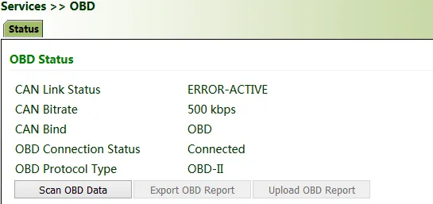</p>

<p align="center"><strong>Figure 3.15 OBD status page</strong></p>

3. Review the **OBD Data Stream** section to confirm that real-time vehicle condition data is displayed correctly. The data stream includes key parameters such as fuel level, mileage, driving speed, engine speed, engine load, coolant temperature, and brake pressure, as well as emission post-processing information such as AdBlue volume, exhaust sensors, and diesel particle filter (DPF) status.

<p align="center">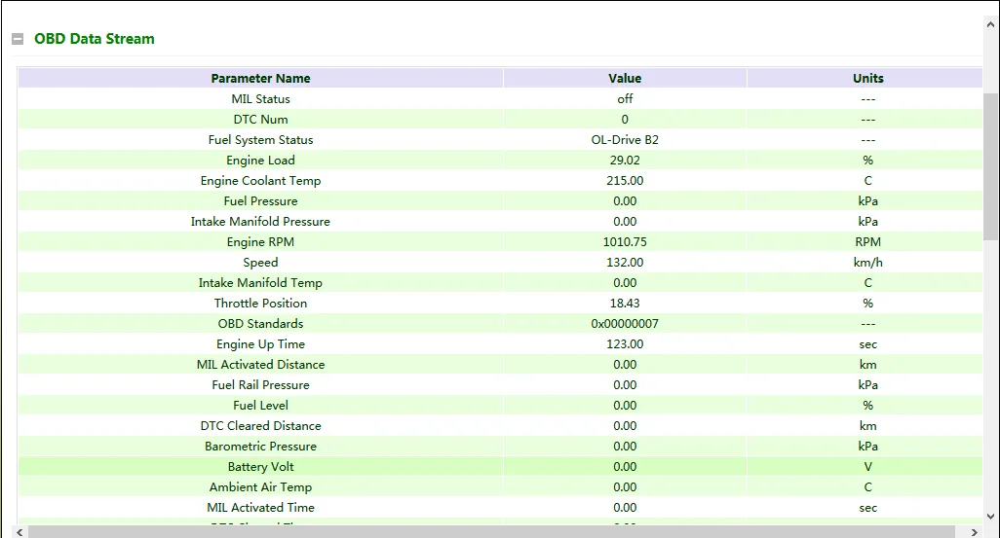</p>

<p align="center"><strong>Figure 3.16 OBD data stream page</strong></p>

4. Click the **Scan OBD Data** button to generate an OBD data report containing vehicle condition data and diagnostic information. To save the report locally, click the **Export OBD Report** button.
5. Review the **OBD Ability** section to confirm the following information:
   - OBD ability version
   - OBD protocol type
   - VIN (Vehicle Identification Number)
   - Valid variables and reference values that can be collected by the gateway

<p align="center">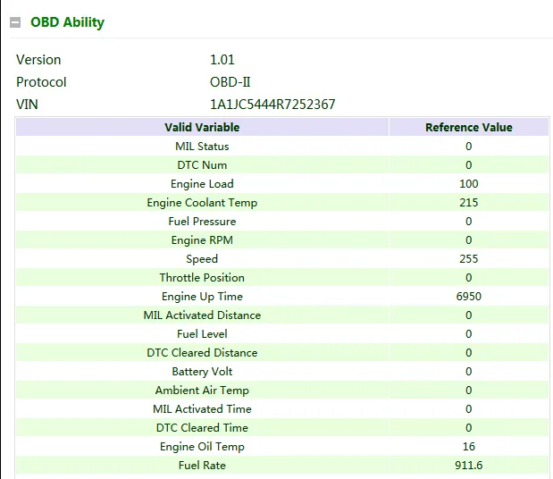</p>

<p align="center"><strong>Figure 3.17 OBD Ability page</strong></p>

**Verification**:

1. On the OBD status page, confirm that "CAN Link Status" shows "ERROR-ACTIVE" and "OBD Connection Status" shows "Connected".
2. Confirm that the OBD Data Stream section displays real-time data updates.
3. Click "Scan OBD Data" to verify that a report is generated successfully.

**Common Issues**:

- OBD connection status shows "Disconnected": Verify that the OBD cable is securely connected to the vehicle diagnostic port, and confirm that the cable type (OBD-II or J1939) matches the vehicle.
- CAN Link Status is not "ERROR-ACTIVE": Verify that the vehicle is started (some vehicles require ignition before the diagnostic port becomes active), and confirm that the cable is not damaged.
- No data or abnormal data in the data stream: Confirm that the OBD protocol type matches the vehicle, and try restarting the gateway to reinitialize the OBD service.

# 4 Feature Descriptions and Parameter Reference

In parameter settings, a green text box 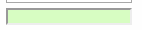 indicates a mandatory item, and a pure white text box  indicates an optional item.

## 4.1 Network

### 4.1.1 Cellular Interface

<p align="center">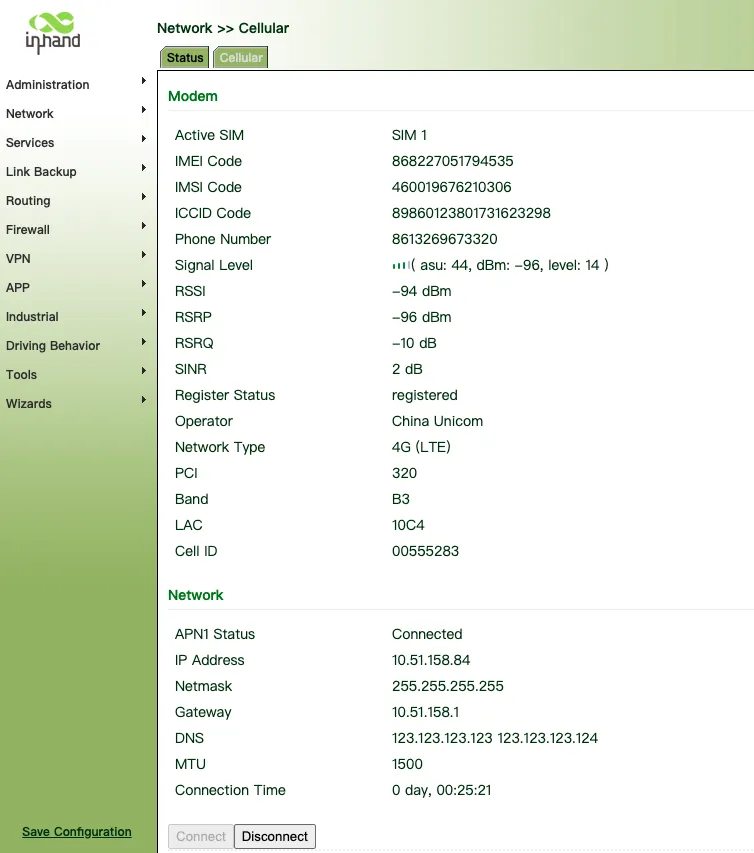</p>

<p align="center"><strong>Figure 4.1 Cellular Interface Status</strong></p>

| Parameter | Description |
| --- | --- |
| **Active SIM** | The SIM card currently in use. SIM1 or SIM2 |
| **IMEI Code** | The International Mobile Equipment Identity (IMEI) number of the device. |
| **IMSI Code** | The International Mobile Subscriber Identity (IMSI) number associated with the SIM card. |
| **ICCID Code** | The Integrated Circuit Card Identifier (ICCID) of the SIM card. |
| **Phone Number** | The phone number associated with the SIM card. |
| **Signal Level** | The strength of the cellular signal received by the device. ASU is an Arbitrary Strength Unit, which can be seen as a relative value of signal strength. The Level **0-31 signal value** (often called **ASU** in engineering menus) and **dBm** are linearly converted using this formula: **ASU = RSRP (dBm) + 14.** |
| **RSSI** | The Received Signal Strength Indicator (RSSI) of the signal strength. |
| **RSRP** | The Reference Signal Received Power (RSRP) of the signal strength. |
| **RSRQ** | The Reference Signal Received Quality (RSRQ) of the signal quality. |
| **SINR** | The Signal to Interference plus Noise Ratio (SINR) of the signal quality. |
| **Register Status** | Whether the device is registered to the network. |
| **Operator** | The name of the network operator. e.g. China Unicom |
| **Network Type** | The type of cellular network being used. |
| **PCI** | The Physical Cell Identity (PCI) of the cell within the network. |
| **Band** | The frequency band used for the cellular connection. |
| **LAC** | The Location Area Code (LAC) of the location area within the network. |
| **Cell ID** | The unique identifier for the cell. |
| **APN Status** | The status of the APN connection. |
| **IP Address** | The IP address assigned to the device. e.g. 10.51.158.84 |
| **Netmask** | The netmask of the network. |
| **Gateway** | The gateway IP address. e.g. 10.51.158.1 |
| **DNS** | The DNS server addresses. |
| **MTU** | The Maximum Transmission Unit (MTU) size of the data packet that can be transmitted. |
| **Connection Time** | The duration of the current connection. |

### 4.1.2 Signal Quality Reference

| **Level (ASU Range)** | **RSRP (dBm)** | **Real-World Performance** |
| --- | --- | --- |
| 28-31 | -112 to -109 | Excellent (HD video) |
| 24-27 | -116 to -113 | Good (stable browsing) |
| 20-23 | -120 to -117 | Fair (basic web) |
| 16-19 | -124 to -121 | Weak (call drops) |
| 0-15 | -140 to -125 | Unusable (no service) |

### 4.1.3 Cellular Network Configuration Guide

This guide will walk you through the process of configuring your VG710 gateway's cellular network settings. Follow these steps to ensure your device is correctly set up for cellular connectivity.

<p align="center">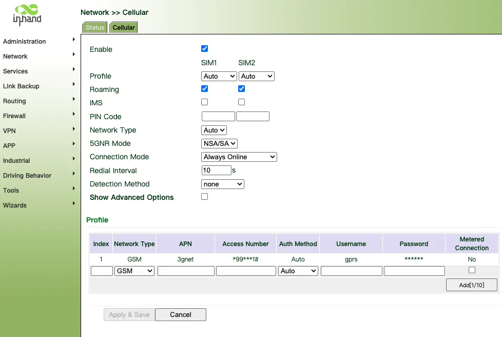</p>

<p align="center"><strong>Figure 4.2 Cellular Configuration Page</strong></p>

**Step 1: Accessing the Cellular Configuration Page**

1. Log in to your VG710 gateway's web interface.
2. Navigate to the **Network** section in the left-hand menu.
3. Click on **Cellular** to access the cellular configuration settings.

**Step 2: General Cellular Settings**

- **Enable**: Check this box to activate the cellular connection.
- **SIM1 / SIM2**: Select the SIM card you want to use for the cellular connection. You can choose either SIM1 or SIM2.
- **Profile**: Choose the profile you want to apply. The default setting is "Auto", which allows the device to automatically select the best settings.
- **Roaming**: Check this box if you want the device to enable roaming when necessary.
- **IMS**: Leave this unchecked unless you have specific requirements for IMS (IP Multimedia Subsystem) services.
- **PIN Code**: Enter the PIN code for your SIM card if required.
- **Network Type**: Select the type of network you want to connect to. The options include "Auto", "GSM", "3G", "4G", "5G", etc. Recommend setting it to Auto.
- **5GNR Mode**: Choose the mode for 5G connectivity. Options include "NSA/SA".
- **Connection Mode**: Select how you want the device to maintain its connection. "Always Online" ensures the device stays connected at all times.
- **Redial Interval**: Set the time interval (in seconds) for the device to attempt reconnecting if the connection is lost. The default is 10 seconds.
- **Detection Method**: Choose the method for detecting network availability. "none" is the default setting.
- **Show Advanced Options**: Uncheck this box unless you need to configure advanced settings.

**Step 3: Configuring Profiles**

In the **Profile** section, you can set up different profiles for various network types:

- **Index**: The order of the profiles. Lower numbers have higher priority.
- **Network Type**: Select the type of network (e.g., GSM, 3G).
- **APN**: Enter the Access Point Name provided by your network operator.
- **Access Number**: Enter the access number if required by your network operator.
- **Auth Method**: Choose the authentication method. "Auto" allows the device to automatically select the best method.
- **Username**: Enter the username for the APN if required.
- **Password**: Enter the password for the APN if required.
- **Metered Connection**: Check this box if your connection is metered (i.e., limited by data usage).

**Step 4: Applying and Saving Settings**

1. After configuring the settings, click on **Apply & Save** to apply the changes.
2. Click **Cancel** if you want to discard any changes made.

> **Note**: Ensure that the SIM card is properly inserted and activated by your network operator. Regularly check for updates to the firmware of your VG710 gateway to ensure optimal performance and security.

### 4.1.4 Enabling Advanced Options

<p align="center">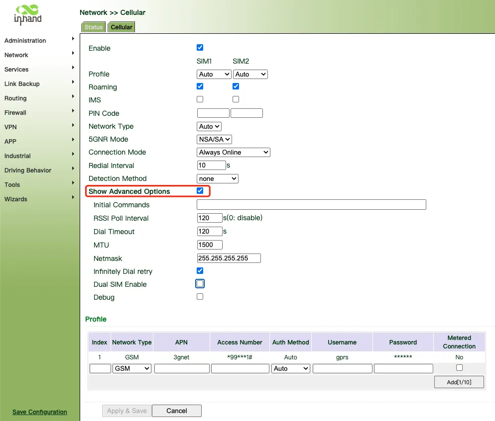</p>

<p align="center"><strong>Figure 4.3 Advanced Cellular Options</strong></p>

1. **Access Advanced Options**: On the "Cellular" configuration page, check the "Show Advanced Options" checkbox. This will display additional advanced settings that allow for more detailed configuration.
2. **Configure Advanced Options**:
    - **Initial Commands**: In this field, you can enter initial commands that the device needs to execute upon startup. This is often used for specific network configurations or device initialization.
    - **RSSI Poll Interval**: Set the polling interval for the Received Signal Strength Indicator (RSSI). The default is 120 seconds, which you can adjust as needed. Setting it to 0 disables this feature.
    - **Dial Timeout**: Set the dial timeout duration. The default is 120 seconds, which you can adjust based on network conditions.
    - **Infinitely Dial Retry**: Check this option to allow the device to retry dialing indefinitely upon failure. This is useful for ensuring the device always attempts to connect to the network.
    - **Dual SIM Enable**: Check this option to enable dual SIM functionality, allowing the device to use two SIM cards for network connectivity.

### 4.1.5 Enabling Dual SIM Functionality

<p align="center">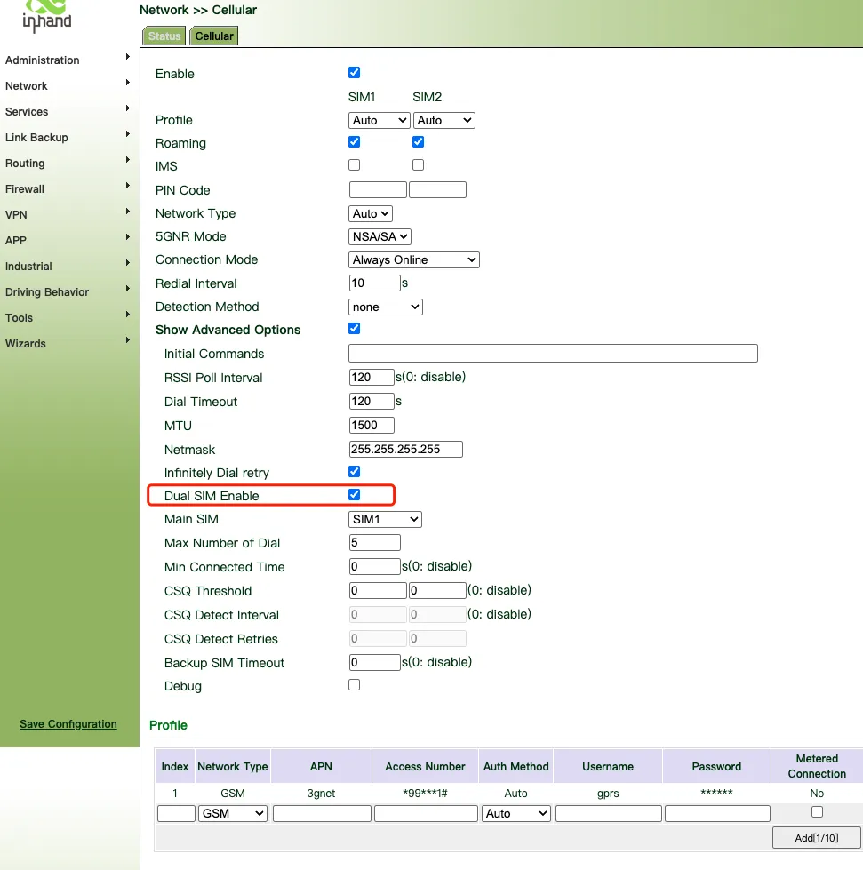</p>

<p align="center"><strong>Figure 4.4 Dual SIM Configuration</strong></p>

1. **Enable Dual SIM**: Check the "Dual SIM Enable" checkbox to activate the dual SIM feature. This allows the device to use two SIM cards for network connectivity.
2. **Configure Primary SIM**: In the "Main SIM" dropdown menu, select the primary SIM card. The primary SIM card is typically used for the main network connection and data transmission.
3. **Configure Secondary SIM**: If necessary, you can configure the secondary SIM to automatically switch when the primary SIM is unavailable. This provides additional network redundancy and stability.
4. **Set Dial Attempt Limit**: In the "Max Number of Dial" field, set the maximum number of dial attempts the device should make. The default is 5 times, which you can adjust as needed.
5. **Set Minimum Connection Time**: In the "Min Connected Time" field, set the minimum time the device must stay connected before attempting to redial. The default is 0, indicating this feature is disabled.

After completing all configurations, click the **Apply & Save** button to apply and save your settings.

> **Note**: Ensure both of your SIM cards are activated and have sufficient credit. Regularly check and update your network configurations to ensure optimal network performance and compatibility. If you encounter any connection issues, contact your network service provider or technical support team.

### 4.1.6 Bridge Port

A bridge port is intended to connect two different physical LANs over a bridge, to enable storage and forwarding across LANs at the link layer.

**Method for modifying the IP address of a bridge port and bridge members:**

1. Click "Network >> Bridge" and select "Bridge >> Modify".

<p align="center">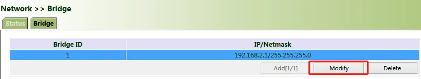</p>

<p align="center"><strong>Figure 4.5 Bridge Port List</strong></p>

2. Modify the IP address of the bridge port or bridge members. Among the bridge members, dot11radio1 and dot11radio2 are Wi-Fi 2.4G and Wi-Fi 5G ports respectively.

<p align="center">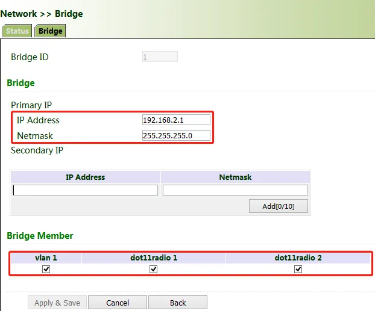</p>

<p align="center"><strong>Figure 4.6 Bridge Port Configuration</strong></p>

### 4.1.7 VLAN Port

A virtual LAN (VLAN) comprises a group of logical devices and users. These devices and users are not limited by physical locations, but can be organized based on functions, departments, applications, and other factors. They communicate with each other as if they are on the same network segment, which contributes to the name of VLAN.

**Method for adding a port of VLAN 2:**

1. Click "Network >> VLAN >> Configure VLAN Parameters >> Add". Set the virtual IP address of the port of VLAN 2 and select the member port of VLAN 2 as required. Click Apply & Save.

<p align="center">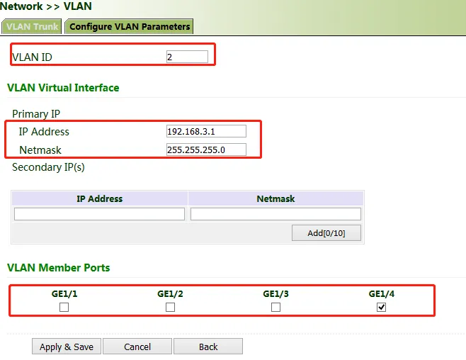</p>

<p align="center"><strong>Figure 4.7 VLAN Configuration</strong></p>

2. Return to the VLAN list. The port of VLAN 2 has been successfully added.

<p align="center">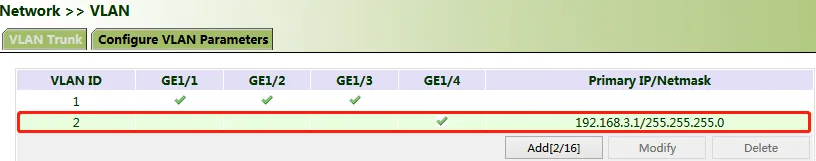</p>

<p align="center"><strong>Figure 4.8 VLAN List</strong></p>

Currently, VLAN ports of the device support two link types: access and trunk. An access port belongs to only one VLAN and is generally connected to a computer. A trunk port can be used for multiple VLANs and can receive messages from or send messages to multiple VLANs. It can be connected to a switch or a user's computer. You can select the link type as required on the "VLAN Trunk" page.

<p align="center">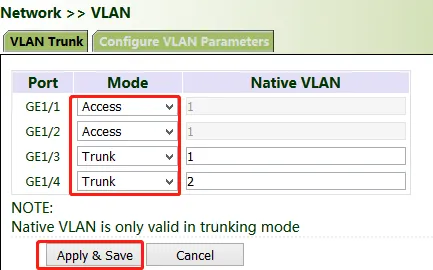</p>

<p align="center"><strong>Figure 4.9 VLAN Trunk Configuration</strong></p>

### 4.1.8 ADSL Dialup (PPPoE)

**Method for connecting the gateway to the PPPoE server:**

1. Click "Network >> ADSL Dialup (PPPoE)", select the VG710 interface for connecting to the PPPoE server in the "Dial Pool" bar, and click Add.

2. Enter the user name, password, and pool ID of the PPPoE server in the "PPPoE List" bar. The pool ID must be the same as that in the "Dial Pool" bar. Click Add, and then click Apply & Save.

<p align="center">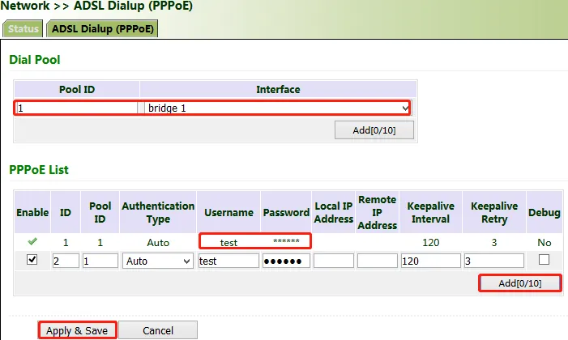</p>

<p align="center"><strong>Figure 4.10 PPPoE Configuration</strong></p>

### 4.1.9 Wi-Fi

The gateway can be used as an AP or a client. When it is used as an AP, other users can access the Internet through the gateway via Wi-Fi. When it is used as a client, the gateway connects to an AP for Internet access. The status bar shows the current Wi-Fi connection status of the gateway.

<p align="center">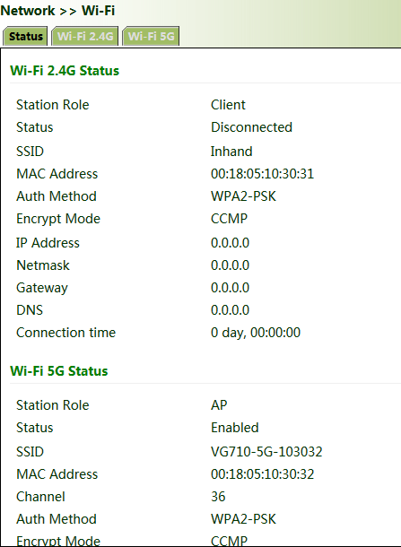</p>

<p align="center"><strong>Figure 4.11 Wi-Fi Status</strong></p>

**Method for providing network access services for wireless terminals when the gateway is used as an AP:**

Click "Wi-Fi >> Wi-Fi 2.4 or Wi-Fi 5G" and select "AP" for "Station Role". Enter the SSID, authentication method, and key consistent with those of the wireless AP. Click Apply & Save.

<p align="center">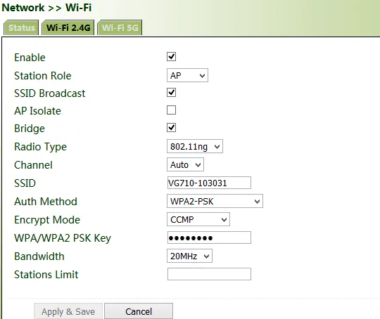</p>

<p align="center"><strong>Figure 4.12 Wi-Fi AP Configuration</strong></p>

**Method for connecting to an AP for Internet access when VG710 is used as a client:**

Select "Client", enter the Wi-Fi SSID and key, and click Apply & Save.

<p align="center">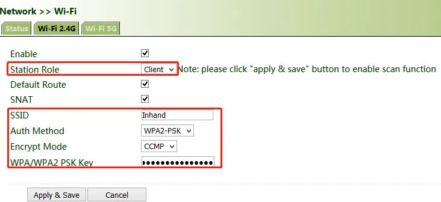</p>

<p align="center"><strong>Figure 4.13 Wi-Fi Client Configuration</strong></p>

### 4.1.10 Loopback Port

**Method for adding multiple loopback ports:**

Click "Network >> Loopback >> Multi-IP Settings", configure any IP address for the gateway, click Add, and then click Apply & Save.

<p align="center">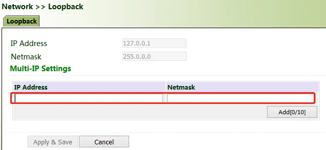</p>

<p align="center"><strong>Figure 4.14 Loopback Port Configuration</strong></p>

### 4.1.11 Layer 2 Switch

Check the network connection status of GE 1 to GE 4. LINK UP indicates that the network is connected. LINK DOWN indicates that the network is disconnected.

<p align="center">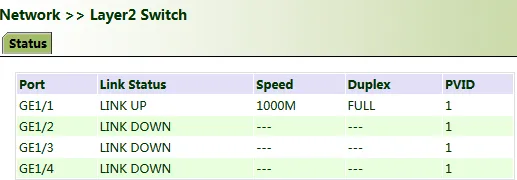</p>

<p align="center"><strong>Figure 4.15 Layer 2 Switch Status</strong></p>

## 4.2 OBD

OBD is used to collect vehicle condition data, obtain emission information, and perform fault diagnosis in real time. Vehicle condition data includes key parameters such as the fuel level, mileage, driving speed, engine speed, engine load, coolant temperature, and brake pressure. Emission information includes the volume of AdBlue, the operating and monitoring status of various exhaust post-processing sensors (such as the exhaust gas sensor and diesel particle filter) and catalysts, etc. In fault diagnosis, standard fault codes of vehicles and description information can be obtained in real time, so that vehicle maintenance personnel can learn the vehicle health status in time and locate the faults.

To collect vehicle data, the gateway is connected to the diagnostic port of the vehicle through the I/O port of the gateway over the OBD-II or J1939 cable. The cable accessories can be selected or customized during purchasing. For details about the access method, see Section 4.4 in the *VG710 Quick Start Guide*. After the gateway starts, the OBD service is automatically enabled to collect key vehicle condition data and fault code information.

|  Note: The power supply and OBD cable of the gateway shall be installed when the vehicle is off. |
| :--- |

The vehicle status information is displayed on the OBD status page.

**OBD Status:**

- **CAN Link Status**: ERROR-ACTIVE indicates that the gateway has successfully connected to the diagnostic port of the vehicle. Other status indicates that the connection is abnormal or the diagnostic port of the vehicle is not identified.
- **CAN Bitrate**: In OBD, the CAN bitrate is automatically adapted, generally 250 kbps or 500 kbps.
- **CAN Bind**: "OBD" (default) or "Custom".
- **OBD Connection Status**: "Disconnected", "Connecting", or "Connected".
- **OBD Protocol Type**: OBD-II or J1939.

<p align="center"></p>

<p align="center"><strong>Figure 4.16 OBD Status Page</strong></p>

**Scan OBD Data and Export OBD Report:**

Click the Scan OBD Data button to generate an OBD data report containing detailed vehicle condition data and diagnostic information. Click the Export OBD Report button to save the generated OBD data report to the local storage.

**OBD Data Stream:** The real-time vehicle condition data is displayed.

<p align="center"></p>

<p align="center"><strong>Figure 4.17 OBD Data Stream</strong></p>

**OBD Ability:**

- Version of the OBD ability
- Type of the OBD protocol
- Vehicle identification number (VIN)
- Valid variables and reference values that can be collected by the gateway

<p align="center"></p>

<p align="center"><strong>Figure 4.18 OBD Ability</strong></p>

## 4.3 VPN

The VPN is intended to establish a private network on the public network for encrypted communication. A VPN gateway enables remote access by encrypting data packets and converting the destination address of data packets. The VPN can be realized by a server, hardware, or software, or in other ways. Compared with the traditional DDN private line or frame relay, the VPN provides a more secure and convenient remote access solution.

**Common VPN application scenario:** For example, an employee on a business trip accesses the enterprise's intranet. The employee connects to the enterprise's VPN server and then accesses the enterprise's intranet through the VPN server. Communication data between the VPN server and the client is encrypted and can be regarded as being transmitted on a dedicated data network. This ensures data security.

### 4.3.1 IPsec

IPsec is a group of open network security protocols developed by IETF. At the IP layer, the data source authentication, data encryption, data integrity, and anti-replay functions are used to ensure the security of data transmission between communication parties on the Internet. This reduces the risk of leakage and eavesdropping, ensures the integrity and confidentiality of data, and ensures the security of service transmission for users.

**Scenario:** Data is transmitted between the subnet (192.168.1.0/24) of headquarters A and the subnet (172.16.1.0/24) of customer branch B through gateway A and gateway B. The transmission channels of gateway A and gateway B are encrypted over IPsec, to protect the security of data transmission between headquarters A and customer branch B.

<p align="center"></p>

<p align="center"><strong>Figure 4.19 IPsec VPN Topology</strong></p>

**Method for encrypting the transmission channels of gateway A and gateway B over IPsec:**

**Parameter settings:**

| **Gateway A** | | | **Gateway B** | |
| :--- | :--- | :--- | :--- | :--- |
| **Set IKEv1/v2 parameters** | | | **Set IKEv1/v2 parameters** | |
| ID | Custom | | ID | Custom |
| Encryption algorithm | AES128 | | Encryption algorithm | Same as that of gateway A |
| Hash algorithm | SHA1 | | Hash algorithm | |
| Diffie-Hellman key exchange | Group2 | | Diffie-Hellman key exchange | |
| Lifecycle | 86400 | | Lifecycle | |
| **IPsec policy** | | | **IPsec policy** | |
| Name | Custom | | Name | Custom |
| Encapsulation | ESP | | Encapsulation | Same as that of gateway A |
| Encryption algorithm | AES128 | | Encryption algorithm | |
| Authentication method | SHA1 | | Authentication method | |
| IPsec mode | Tunnel mode | | IPsec mode | |
| **IPsec tunnel configuration** | | | **IPsec tunnel configuration** | |
| Peer address | Address where gateway B establishes the IPsec service | | Peer address | Address where gateway A establishes the IPsec service |
| Interface | Interface for establishing the IPsec service | | Interface | Interface for establishing the IPsec service |
| IKE version | IKE version used | | IKE version | Same as that of gateway A |
| Authentication method | Shared key | | Authentication method | |
| Local subnet | IP address of the subnet of gateway A | | Local subnet | IP address of the subnet of gateway B |
| Peer subnet | IP address of the subnet of gateway B | | Peer subnet | IP address of the subnet of gateway A |

**Detailed configuration steps:**

1. Configure gateway A and gateway B.

   (1) Add IKE and IPsec policies, and click Apply & Save.

   (2) Add IPsec tunnels and click Apply & Save.

<p align="center"></p>

<p align="center"><strong>Figure 4.20 IKE and IPsec Policy Configuration</strong></p>

<p align="center"></p>

<p align="center"><strong>Figure 4.21 IPsec Tunnel Configuration</strong></p>

2. Access the IPsec status page. The IPsec VPN is established successfully if the page is shown as below.

<p align="center"></p>

<p align="center"><strong>Figure 4.22 IPsec VPN Status</strong></p>

|  Note: The IPsec profile does not need to be configured for establishing an IPsec VPN, but needs to be configured for establishing a DM VPN. |
| :--- |

### 4.3.2 GRE

The Generic Routing Encapsulation (GRE) protocol can be used to encapsulate datagrams of some network layer protocols, so that these encapsulated datagrams can be transmitted on the IPv4 network.

**Scenario:** GRE is enabled for VG710_A and VG710_B through the public network.

<p align="center">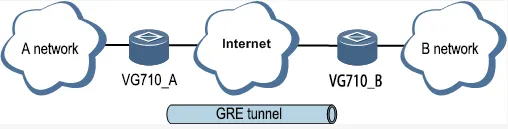</p>

<p align="center"><strong>Figure 4.23 GRE Topology</strong></p>

**Method for enabling GRE for transmission channels of VG710_A and VG710_B:**

1. Click "VPN >> GRE" and then click Add.

<p align="center">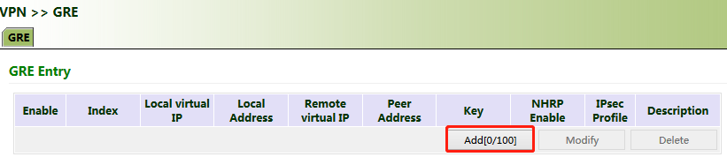</p>

<p align="center"><strong>Figure 4.24 GRE Configuration - Add</strong></p>

2. Set "Index" as required. Select "Point to Point" or "Subnet" for "Network Type". Set "Local Virtual IP" and "Peer Virtual IP", ensuring that they are on the same network segment. Enter the source and peer IP addresses or interfaces and the key. Click Apply & Save.

<p align="center">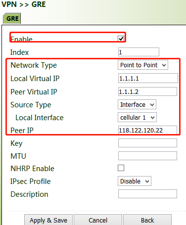</p>

<p align="center"><strong>Figure 4.25 GRE Configuration - Parameters</strong></p>

3. Set VG710_B in the same way. The virtual and peer IP addresses of VG710_B must correspond to those of VG710_A, and the key must be the same as that of VG710_A.

### 4.3.3 L2TP

The Layer 2 Tunneling Protocol (L2TP) is an industrial-standard Internet tunneling protocol used to encrypt network data streams.

**Method for settings when the gateway is used as an L2TP client:**

1. Click "VPN >> L2TP >> L2TP Client >> L2TP Class", enter a name of an L2TP class, and click Add.

<p align="center">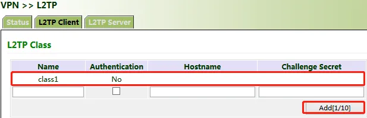</p>

<p align="center"><strong>Figure 4.26 L2TP Class Configuration</strong></p>

2. Configure the pseudowire class: Enter a name of any pseudowire class. "L2TP Class" is the same as that on the "L2TP Class" page. Set "Source Interface" to the interface connecting to the server. Select L2TPV2 for "Protocol" and click Add.

<p align="center">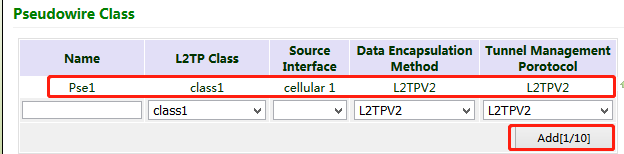</p>

<p align="center"><strong>Figure 4.27 Pseudowire Class Configuration</strong></p>

3. Set L2TPV2 tunnel parameters: Enter the server's domain name or IP address for "L2TP Server". "Pseudowire Class" is the same as that on the "Pseudowire Class" page. Enter the user name and password created on the server. Set other parameters as required. Click Apply & Save.

<p align="center">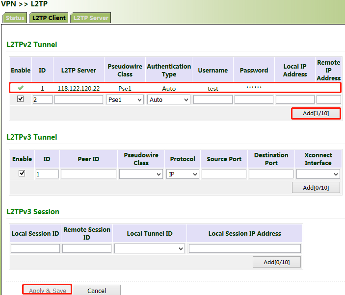</p>

<p align="center"><strong>Figure 4.28 L2TPV2 Tunnel Parameters</strong></p>

4. After gateway A and gateway B are configured, access the L2TP status page to view the L2TP connection status.

<p align="center">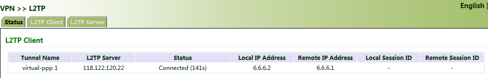</p>

<p align="center"><strong>Figure 4.29 L2TP Connection Status</strong></p>

### 4.3.4 OpenVPN

OpenVPN is realized based on the application-layer VPN of the OpenSSL library. It supports multiple authentication methods such as the certificate, key, and user name/password. Compared with the traditional VPN, it is simpler and easier to use.

**Authentication methods:**

| **Authentication method** | **Operation on the web page** |
| --- | --- |
| **None** | No authentication is required. |
| **User name/password** | Enter the user name and password created on the OpenVPN server, click "VPN >> Certificate Management", and import the CA certificate, public key, and private key for authentication. |
| **Pre-shared key** | Enter the pre-shared key created on the OpenVPN server. |
| **Digital certificate** | Click "VPN >> Certificate Management" and import the CA certificate, public key, and private key. |
| **Digital certificate/user name/password** | Enter the user name and password created on the OpenVPN server, click "VPN >> Certificate Management", and import the CA certificate, public key, and private key for authentication. |
| **Digital certificate/TLS authentication** | Enter the pre-shared key created on the OpenVPN server, click "VPN >> Certificate Management", and import the CA certificate, public key, and private key for authentication. |
| **Digital certificate/TLS authentication/user name/password** | Enter the pre-shared key, user name, and password created on the OpenVPN server, click "VPN >> Certificate Management", and import the CA certificate, public key, and private key for authentication. |

**Method for settings when the gateway is connected to the OpenVPN server as a client:**

OpenVPN can be configured manually, or OpenVPN configurations can be imported. In the following example, the authentication type is a digital certificate.

1. Set the OpenVPN parameters for the gateway as shown in the figure below, ensuring that the network parameters at both ends of the tunnel are consistent. Click Apply & Save.

<p align="center">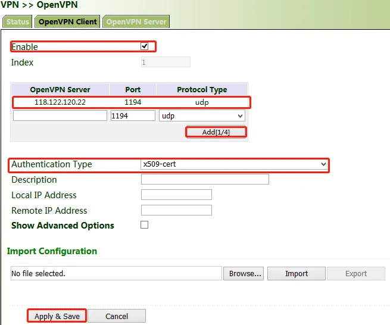</p>

<p align="center"><strong>Figure 4.30 OpenVPN Configuration</strong></p>

2. Select a digital certificate for "Authentication Type", click "VPN >> Certificate Management", and import the CA certificate, public key, and private key.

3. Click Apply & Save. Return to the "Status" page and view the tunnel status.

<p align="center">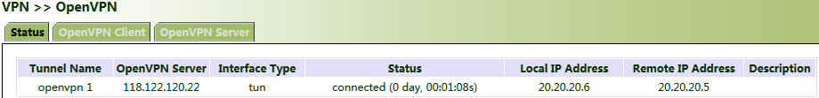</p>

<p align="center"><strong>Figure 4.31 OpenVPN Status</strong></p>

### 4.3.5 Certificate Management

Certificates can be imported or exported on this page. Certificates are used for IPsec and OpenVPN services.

**Method for importing a certificate:**

Click "VPN >> Certificate Management >> Browse", select the certificate obtained from the certificate server, click Import *XX* Certificate, and then click Apply & Save.

<p align="center">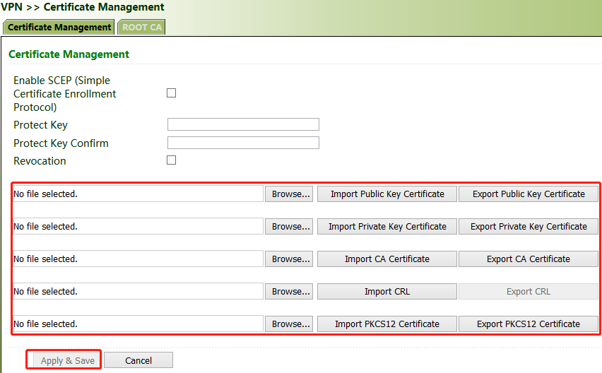</p>

<p align="center"><strong>Figure 4.32 Certificate Import</strong></p>

<p align="center">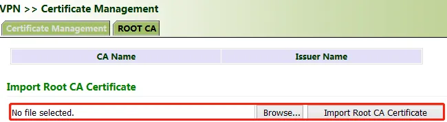</p>

<p align="center"><strong>Figure 4.33 Certificate List</strong></p>

If no local certificate is available, check "Enable SCEP (Simple Certificate Enrollment Protocol)" to apply for a certificate online.

**Method for applying for a certificate for the gateway online:**

1. Click "VPN >> Certificate Management". Check "Enable SCEP (Simple Certificate Enrollment Protocol)" and "Force to re-enroll". Enter the certificate protection key and confirm it. Enter the URL of the certificate server, the certificate name, and the FQDN. Click Apply & Save.

2. After the server issues the certificate, check the application status. If the application status is "Completion", the certificate application succeeds.

<p align="center">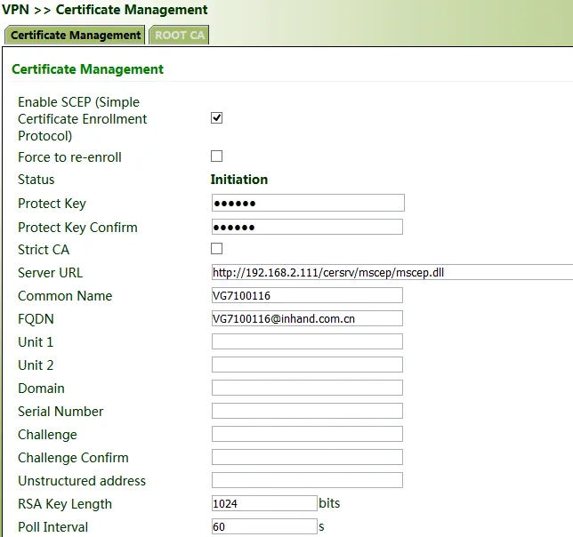</p>

<p align="center"><strong>Figure 4.34 SCEP Certificate Application Status</strong></p>

## 4.4 Services

### 4.4.1 DHCP (Automatic IP Address Allocation)

DHCP uses the client/server communication mode. The client submits a configuration application to the server, and the server returns the IP address assigned to the client to realize the dynamic configuration of the IP address.

**The DHCP server and DHCP forwarding function are mutually exclusive.**

**Method for settings when the gateway is used as a DHCP server:**

Click "Services >> DHCP >> DHCP Server". In the "DHCP Server" bar, check "Enable", select an interface, set the start and end IP addresses, click Add, and then click Apply & Save.

<p align="center">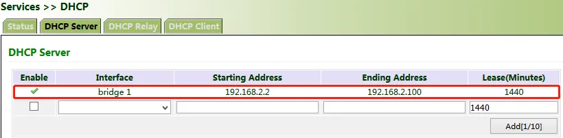</p>

<p align="center"><strong>Figure 4.35 DHCP Server Configuration</strong></p>

**Method for settings when the gateway is used as a DHCP client:**

Click "Services >> DHCP >> DHCP Client", select the gateway interface, and click Apply & Save.

<p align="center">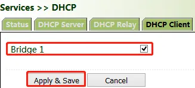</p>

<p align="center"><strong>Figure 4.36 DHCP Client Configuration</strong></p>

**Method for enabling DHCP forwarding for the gateway:**

DHCP forwarding is also referred to as a DHCP relay agent. It can process and forward DHCP information between different subnets and physical network segments.

Click "Services >> DHCP >> DHCP Relay", check "Enable", enter the server address, select the gateway interface, and click Apply & Save.

<p align="center">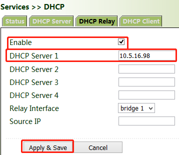</p>

<p align="center"><strong>Figure 4.37 DHCP Relay Configuration</strong></p>

### 4.4.2 DNS

The domain name service (DNS) is a distributed network directory service mainly used for mutual conversion between a domain name and an IP address.

**Method for enabling the DNS server for the gateway:**

Click "Services >> DNS >> DNS Server", enter the address of the DNS server, and click Apply & Save.

<p align="center">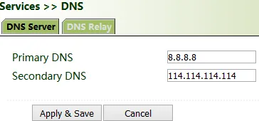</p>

<p align="center"><strong>Figure 4.38 DNS Server Configuration</strong></p>

**Method for enabling DNS forwarding for the gateway:**

As a DNS agent, the gateway forwards DNS request and response messages between the DNS client and the DNS server, and replaces the DNS client for domain name resolution.

**If the DHCP service is enabled for the gateway, DNS forwarding is enabled by default and cannot be disabled.**

Click "Services >> DNS >> DNS Relay", check "Enable DNS Relay", set the mapping between the domain name and the IP address, click Add, and then click Apply & Save. After the settings are completed, when a DNS client on the LAN requests a host domain name in the list, the DNS agent server returns the corresponding IP address to the client.

<p align="center">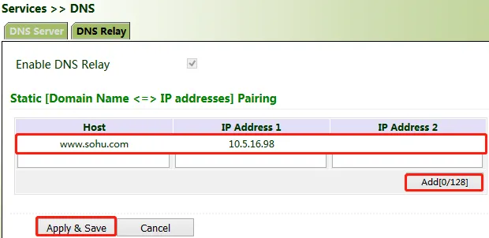</p>

<p align="center"><strong>Figure 4.39 DNS Relay Configuration</strong></p>

### 4.4.3 DDNS

The dynamic domain name server (DDNS) maps the dynamic IP address of the gateway to a fixed DNS. Each time a user connects to the Internet, the client program transmits the dynamic IP address of the host to the server program on the server host through information transfer. The server program provides the DDNS service and realizes dynamic domain name resolution. In this way, you can access the Internet by entering the domain name, even if the IP address is changed.

**Method for enabling the DDNS service for the gateway:**

1. If the Custom service is used, set "Method Name" as required, select "Custom" for "Service Type", and enter the DDNS expression of the server for "Url". This expression is only for reference. The actual URL is provided by the service provider (usually available on the official website of the service provider). Click Add.

   If a common domain name server other than the Custom service is used, set "Method Name" and "Service Type" as required, enter the user name, password, and host name obtained from the server, and click Add.

   If "Disable" is selected, the DDNS service is not used.

2. Select the gateway interface, enter the name of the DDNS update method, click Add, and then click Apply & Save to apply the DDNS update method to the gateway interface.

<p align="center">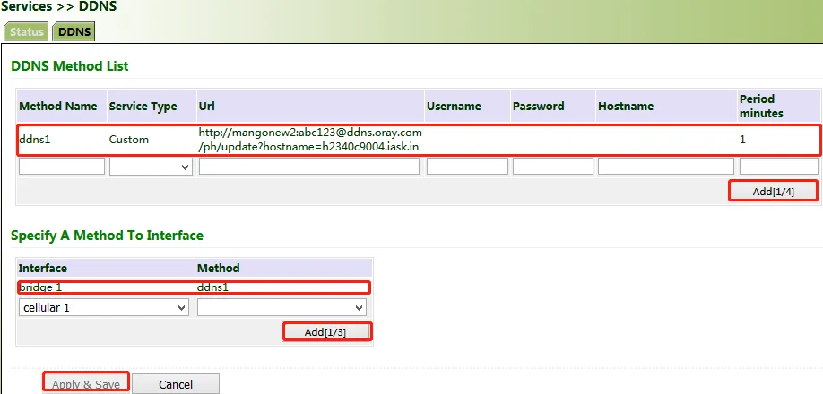</p>

<p align="center"><strong>Figure 4.40 DDNS Configuration</strong></p>

3. Wait several minutes after the DDNS settings are applied and saved. Then ping the host name (domain name) of the domain name server to confirm the successful application of the DDNS service.

<p align="center">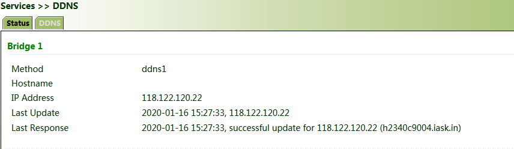</p>

<p align="center"><strong>Figure 4.41 DDNS Verification</strong></p>

<p align="center">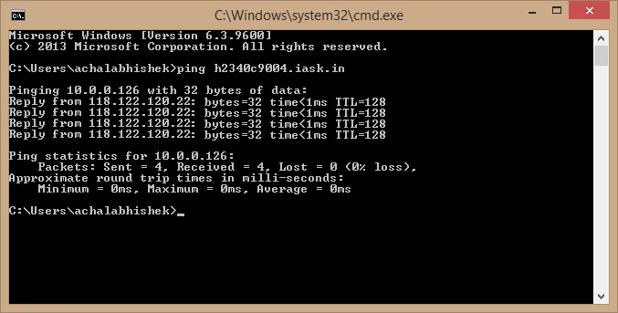</p>

<p align="center"><strong>Figure 4.42 DDNS Verification - Ping Test</strong></p>

### 4.4.4 SMS

The short message service (SMS) is enabled for gateway restart and manual dialup via SMS messages. Some gateways can receive alarm information in the SMS whitelist.

**Method for controlling gateway restart and manual dialup via SMS messages:**

Click "Services >> SMS" and check "Enable". In the "SMS Access Control" bar, set "ID" as required, select "permit" for "Action", enter the phone number, and click Apply & Save. When you activate the dialup port via SMS, after the configuration is completed, you can send the **reboot** command to restart the gateway by using the mobile phone number, or send the **cellular 1 ppp up/down** command to make the gateway redial or interrupt the dialup.

<p align="center">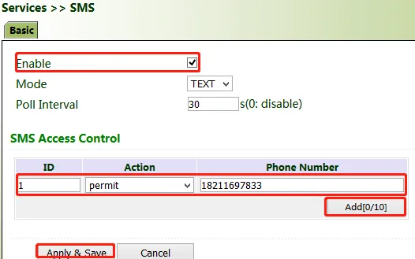</p>

<p align="center"><strong>Figure 4.43 SMS Configuration</strong></p>

### 4.4.5 GPS

**Position:** You can view the current positioning information.

<p align="center">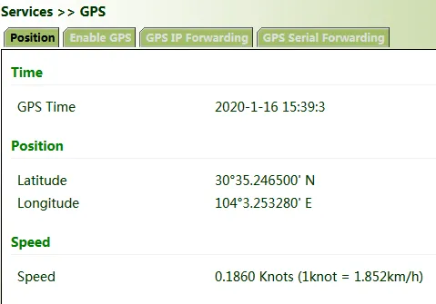</p>

<p align="center"><strong>Figure 4.44 GPS Position Information</strong></p>

**Method for enabling GPS for the gateway:**

Click "Services >> Enable GPS", check "Enable", and click Apply & Save. By default, GPS is enabled for the gateway.

<p align="center">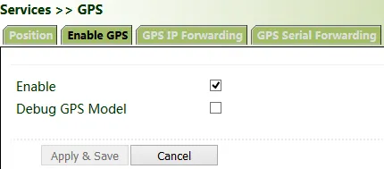</p>

<p align="center"><strong>Figure 4.45 GPS Enable Configuration</strong></p>

**Method for forwarding GPS data to the server over IP when VG710 is used as a client:**

Click "Services >> GPS IP Forwarding", check "Enable", select "Client" for "Type", enter the server address and port in the "Destination IP Address" bar, click Add, and then click Apply & Save.

<p align="center">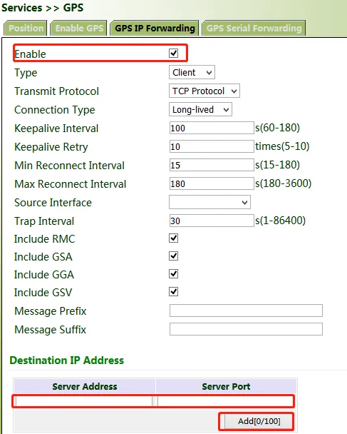</p>

<p align="center"><strong>Figure 4.46 GPS IP Forwarding - Client Mode</strong></p>

**Method for forwarding GPS data over IP when VG710 is used as a server:**

Click "Services >> GPS IP Forwarding", check "Enable", select "Server" for "Type", and click Apply & Save.

<p align="center">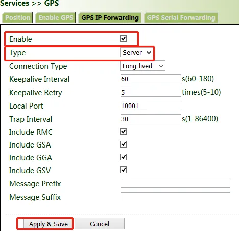</p>

<p align="center"><strong>Figure 4.47 GPS IP Forwarding - Server Mode</strong></p>

**Method for forwarding GPS data by VG710 through a serial port:**

Click "Services >> GPS Serial Forwarding", check "Enable", and select a serial port type based on the data transmission port used. Ensure that the baud rate, data bits, parity bit, and stop bit are the same as the current settings. Click Apply & Save.

<p align="center">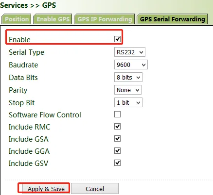</p>

<p align="center"><strong>Figure 4.48 GPS Serial Forwarding</strong></p>

### 4.4.6 QoS

Quality of service (QoS) is a network security mechanism that enables a network to provide better services for designated network communication by using various basic technologies. It is a technology for solving problems such as network delays and blocking.

**Method for setting the egress maximum bandwidth for the gateway through QoS control:**

Click "QoS >> Traffic Control >> Apply QoS", select the gateway interface, enter the egress maximum bandwidth, click Add, and then click Apply & Save.

<p align="center">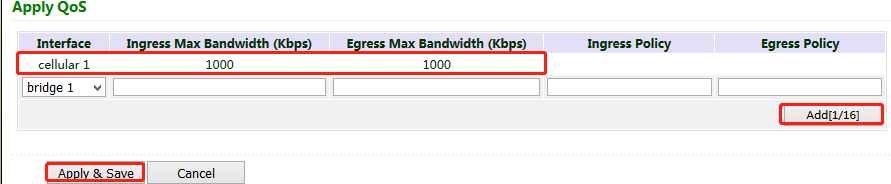</p>

<p align="center"><strong>Figure 4.49 QoS Bandwidth Control</strong></p>

**Method for applying the ingress and egress policies for the gateway through QoS control:**

1. Add a network link classifier. Click "QoS >> Traffic Control >> Classifier", check "Any Packets", set the source and destination addresses of the link, select transmit protocols for QoS control, and click Add.

2. Set transmission policies. Click "QoS >> Traffic Control >> Policy", enter a custom policy name for "Name", enter the classifier name for "Classifier", set the guaranteed bandwidth, maximum bandwidth, and policy priority, and click Add.

3. Click "QoS >> Traffic Control >> Apply QoS", select the gateway interface, enter the policy name for "Ingress Policy" and "Egress Policy", click Add, and then click Apply & Save.

<p align="center">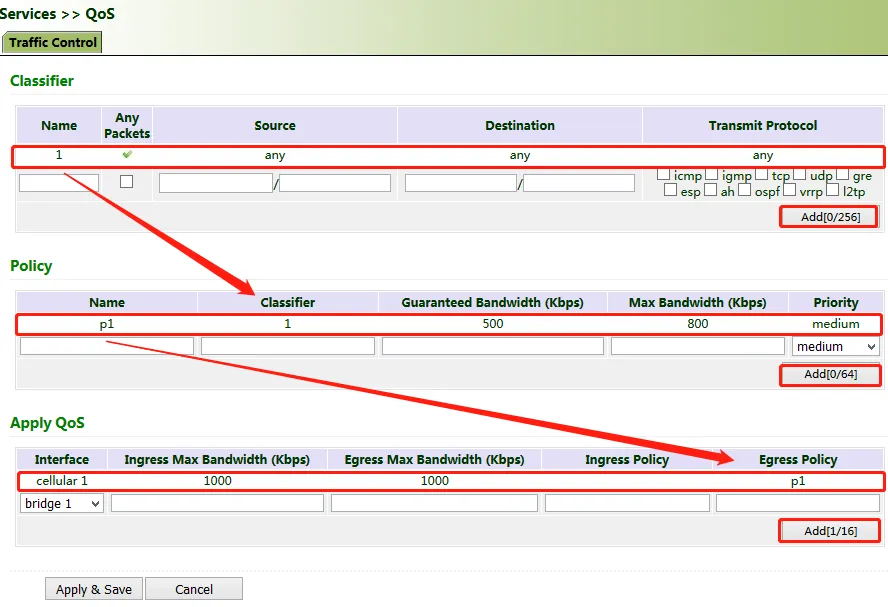</p>

<p align="center"><strong>Figure 4.50 QoS Policy Configuration</strong></p>

### 4.4.7 Traffic Control

**Method for enabling traffic control for the gateway:**

Click "Services >> Traffic Control", enable traffic control, set traffic control parameters, and click Apply & Save. After the settings are completed, the system generates an alarm, stops forwarding, or disables the interface when the traffic exceeds the limit according to the settings on this page.

<p align="center">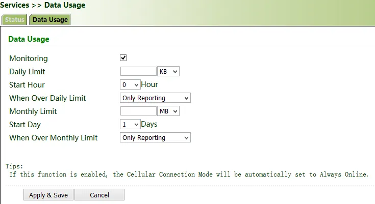</p>

<p align="center"><strong>Figure 4.51 Traffic Control Configuration</strong></p>

## 4.5 Firewall

### 4.5.1 ACL

The access control list (ACL) is an access control technology based on packet filtering. It can filter the packets on the interface based on preset conditions and allow them to pass or discard them.

**Common scenario:** By default, all devices on the LAN (bridge 1) can access the Internet, except the device with the IP address of 192.168.2.100.

**Method for setting VG710:**

1. Click "Firewall >> ACL >> Add". Enter the ID and sequence number. A smaller sequence number indicates a higher priority. Select "deny" for "Action". Set "Source IP" to "192.168.2.100" and "Source Wildcard" to "0.0.0.0". Leave "Destination IP" empty, which indicates 0.0.0.0/0, that is, all IP addresses. Click Apply & Save.

<p align="center">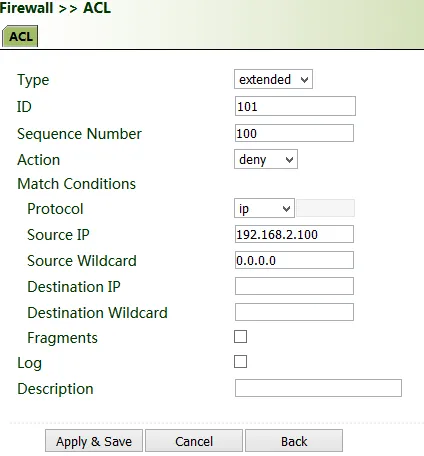</p>

<p align="center"><strong>Figure 4.52 ACL Rule Configuration</strong></p>

2. Return to the ACL page, add the rule with the ID of 101 to the management rule of bridge 1, and click Add. Click Apply & Save.

<p align="center">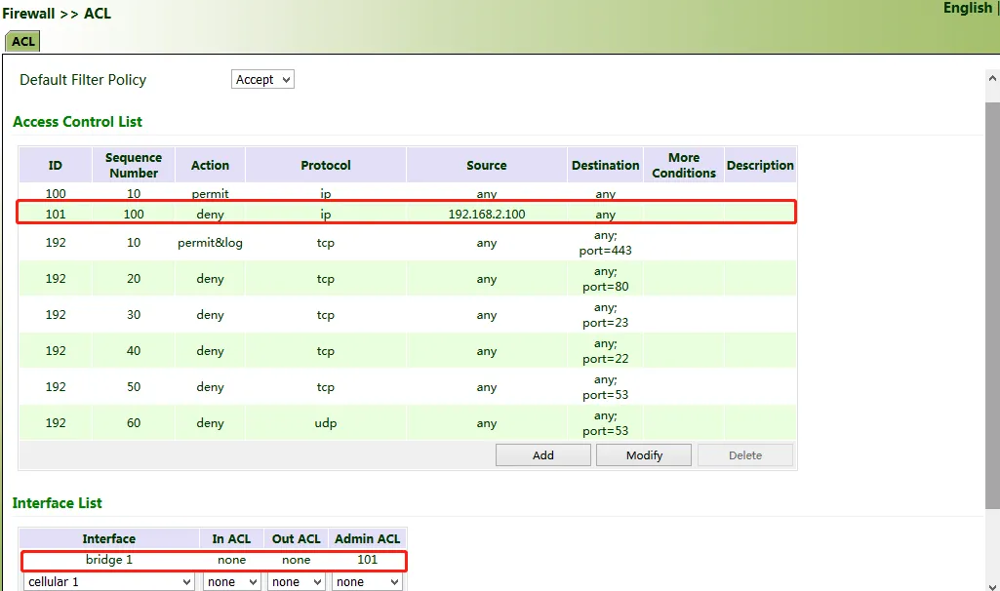</p>

<p align="center"><strong>Figure 4.53 ACL Rule Application</strong></p>

### 4.5.2 NAT

Network address translation (NAT) can be used when some hosts on a private network have been assigned with local IP addresses (that is, private IP addresses used only on the private network), but expect to communicate with hosts on the Internet (without encryption).

**Common scenario:** A user expects to access a camera on the LAN of the device through the public network to view the current driving conditions of the vehicle. The camera address is 192.168.2.100, and the open port 18000 provides video services.

1. Click "Firewall >> NAT", and select "DNAT" for "Action", and "Outside" for "Source Network". Select "IP PORT to IP PORT" or "INTERFACE PORT to IP PORT" for "Translation Type". The public IP address obtained through dial-up is not fixed, so "INTERFACE PORT to IP PORT" is more convenient. Select "TCP" for "Transmit Protocol" because video services are transmitted over TCP. Select "cellular 1" (dialup interface for the cellular network) for "Interface" and set "Port" to "20000". Set "IP Address" and "Port" under "Translated Address" to "192.168.2.100" and "18000" respectively. Click Apply & Save.

   The gateway redirects the TCP service destined for port 20000 of the cellular 1 interface to the internal IP address 192.168.2.100 and port 18000, to enable access to the internal services.

<p align="center">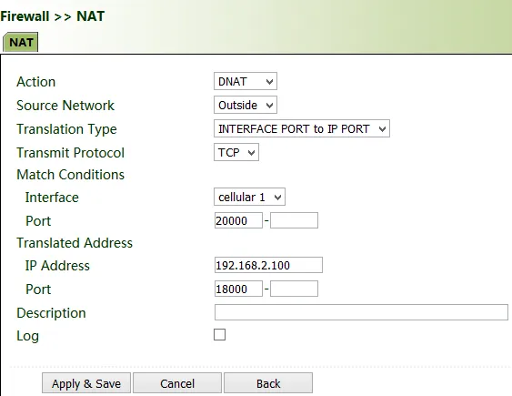</p>

<p align="center"><strong>Figure 4.54 NAT DNAT Configuration</strong></p>

### 4.5.3 MAC-IP Binding

After MAC-IP binding, the PC can access the public network through the gateway only by using the IP address bound to the MAC address of the PC.

**Method for binding the MAC address and IP address of a connected device:**

1. Click "Firewall >> ACL" and select "Block" for "Default Filter Policy".

<p align="center">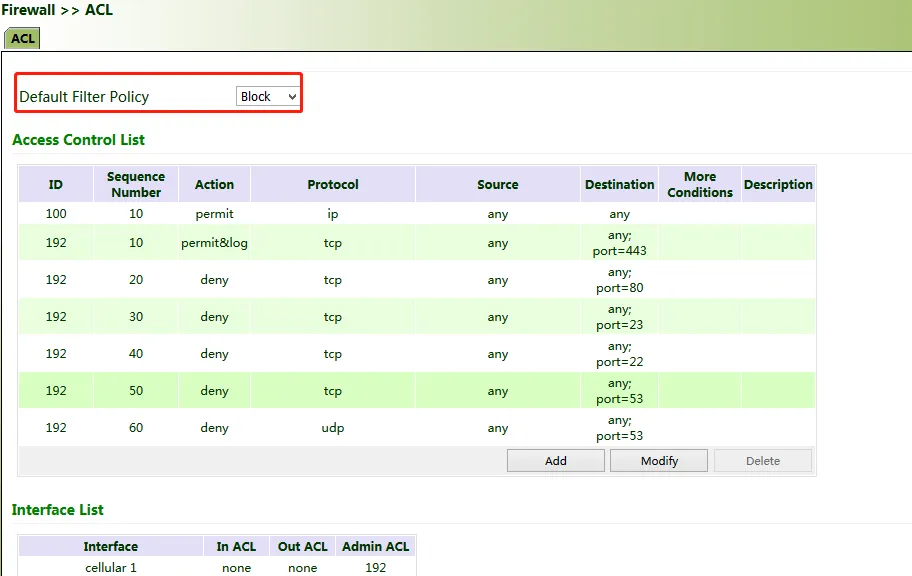</p>

<p align="center"><strong>Figure 4.55 ACL Default Filter Policy</strong></p>

2. Click "Firewall >> MAC-IP Binding", check "Enable", enter the MAC address and IP address of the connected device, click Add, and click Apply & Save.

<p align="center">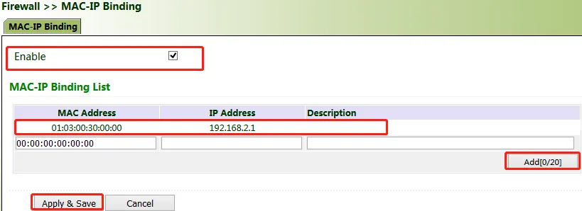</p>

<p align="center"><strong>Figure 4.56 MAC-IP Binding Configuration</strong></p>

## 4.6 Routing

### 4.6.1 Static Routing

Set the destination network, subnet mask, and interface or gateway as required.

<p align="center">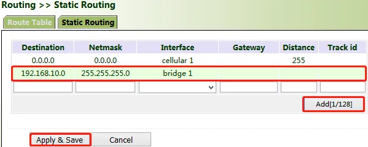</p>

<p align="center"><strong>Figure 4.57 Static Routing Configuration</strong></p>

### 4.6.2 Dynamic Routing

**Scenario:** Enable dynamic routing between two LANs for mutual communication between them. The topology is shown below.

<p align="center">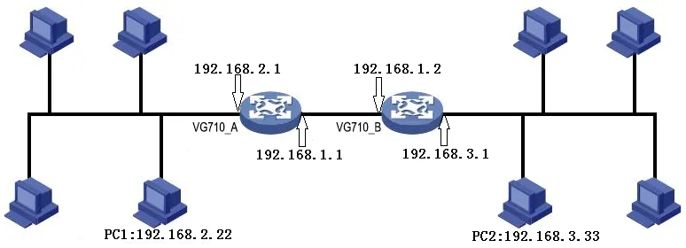</p>

<p align="center"><strong>Figure 4.58 Dynamic Routing Topology</strong></p>

**RIP**

The Routing Information Protocol (RIP) is a simple internal dynamic routing protocol mainly used on small-scale networks.

**Method for enabling dynamic routing between VG710_A and VG710_B over RIP in the scenario:**

1. Configure VG710_A. Click "Routing >> Dynamic Routing >> RIP", check "Enable", and configure VG710_A in the "Network" bar to announce the routing entry of VG710_A.

<p align="center">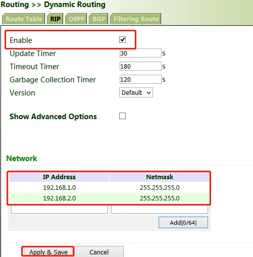</p>

<p align="center"><strong>Figure 4.59 RIP Configuration - VG710_A</strong></p>

2. Configure VG710_B.

<p align="center">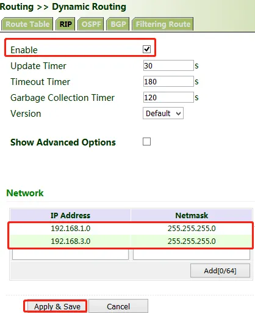</p>

<p align="center"><strong>Figure 4.60 RIP Configuration - VG710_B</strong></p>

3. After the configuration is completed, check whether PC 1 can communicate with PC 2. If yes, the dynamic route is added successfully. The RIP route learned by VG710_B is shown in the figure below.

<p align="center">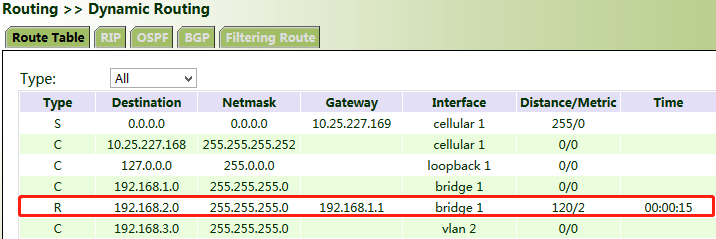</p>

<p align="center"><strong>Figure 4.61 RIP Route Learned by VG710_B</strong></p>

**OSPF**

The Open Shortest Path First (OSPF) protocol is a link-status-based internal gateway protocol mainly used on large-scale networks.

**Method for enabling dynamic routing between VG710_A and VG710_B over OSPF in the scenario:**

1. Configure VG710_A. Click "Routing >> Dynamic Routing >> OSPF", check "Enable", enter a valid IP address for "Router ID", and configure VG710_A in the "Network" bar to announce the routing entry of VG710_A.

<p align="center">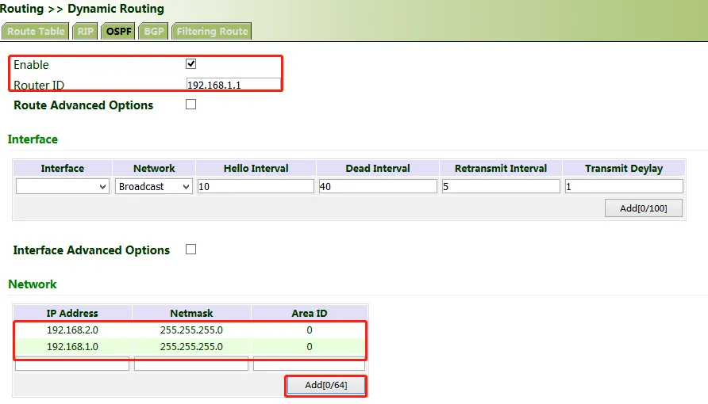</p>

<p align="center"><strong>Figure 4.62 OSPF Configuration - VG710_A</strong></p>

2. Set parameters for VG710_B.

<p align="center">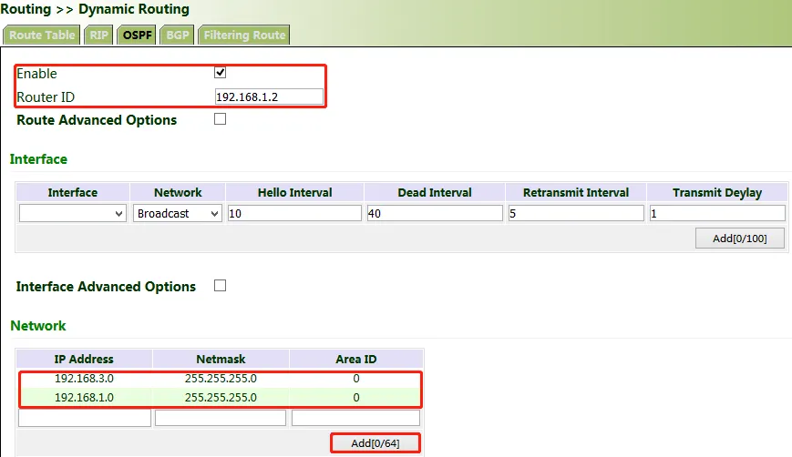</p>

<p align="center"><strong>Figure 4.63 OSPF Configuration - VG710_B</strong></p>

3. After the configuration is completed, check whether PC 1 can communicate with PC 2. If yes, the dynamic route is added successfully. The OSPF route learned by VG710_B is shown in the figure below.

<p align="center">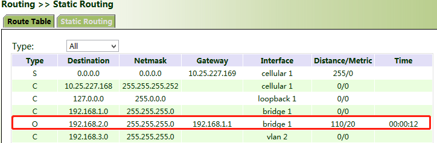</p>

<p align="center"><strong>Figure 4.64 OSPF Route Learned by VG710_B</strong></p>

**BGP**

**Method for enabling dynamic routing between VG710_A and VG710_B over BGP in the scenario:**

1. Configure VG710_A. Click "Routing >> Dynamic Routing >> BGP", check "Enable", and set "AS number" as required.

<p align="center">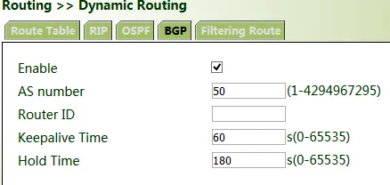</p>

<p align="center"><strong>Figure 4.65 BGP Configuration - VG710_A</strong></p>

2. In the "Neighbor" bar, click Add, enter the IP address 192.168.1.2 of VG710_B, set "AS number" as required, and click Apply & Save.

<p align="center">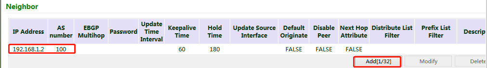</p>

<p align="center"><strong>Figure 4.66 BGP Neighbor Configuration</strong></p>

3. Enter a valid IP address for "Router ID", configure VG710_A in the "Network" bar, and click Add, to announce the routing entry of VG710_A. Then click Apply & Save.

<p align="center">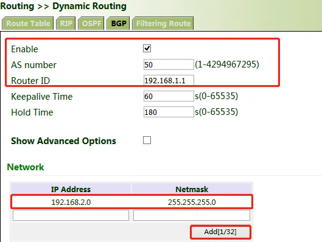</p>

<p align="center"><strong>Figure 4.67 BGP Network Announcement</strong></p>

4. Set parameters for VG710_B. The parameters are the same as or corresponding to those of VG710_A.

<p align="center">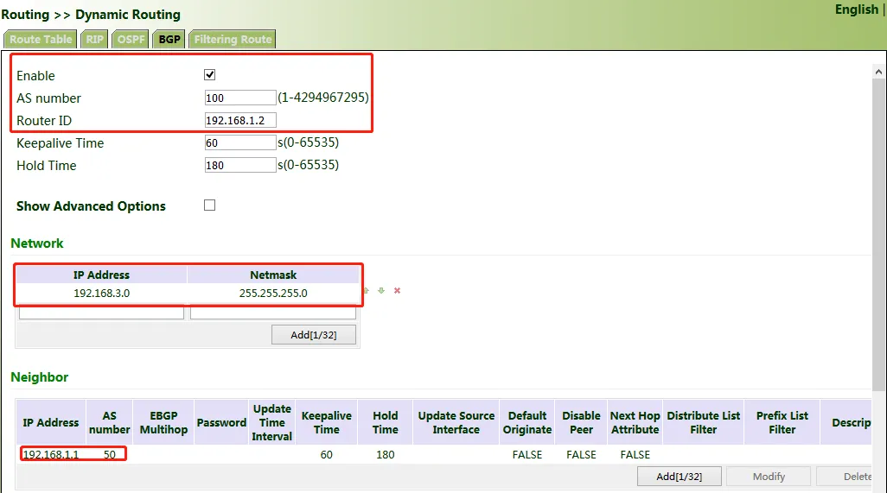</p>

<p align="center"><strong>Figure 4.68 BGP Configuration - VG710_B</strong></p>

5. After the configuration is completed, check whether PC 1 can communicate with PC 2. If yes, the dynamic route is added successfully. The BGP route learned by VG710_B is shown in the figure below.

<p align="center">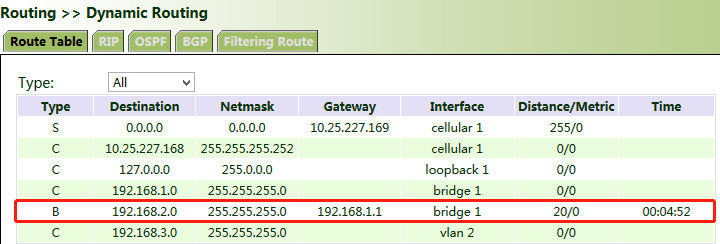</p>

<p align="center"><strong>Figure 4.69 BGP Route Learned by VG710_B</strong></p>

## 4.7 Link Backup

### 4.7.1 SLA

The service level agreement (SLA) is used to detect whether the link between the gateway and the ISP fails.

**Method for adding an SLA entry for the gateway:**

Click "Link Backup >> SLA >> Add", enter the detected IP address for "Destination Address", set other parameters as required, click Add, and then click Apply & Save.

**Timeout (ms)** indicates the duration for determining a detection failure. **Consecutive** indicates the number of detection failures resulting in a link failure.

<p align="center">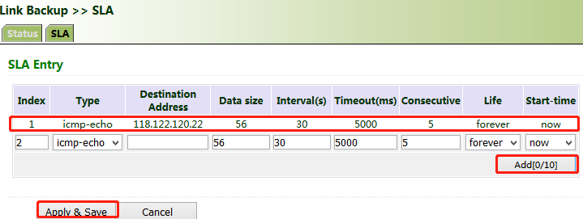</p>

<p align="center"><strong>Figure 4.70 SLA Configuration</strong></p>

### 4.7.2 Track

Currently, linkage is enabled between the track module and the following application modules: VRRP, static routing, and interface backup. If detection succeeds, the corresponding track entry is in the Positive state. If detection fails, the corresponding track entry is in the Negative state.

**Method for adding a track entry for VG710:**

Click "Link Backup >> Track >> Track", set "Index" as required, select "sla", "interface", or "vrrp" for "Type", set "SLA/VRRP ID" based on the ID in the SLA list, set "Negative Delay (s)" and "Positive Delay (s)" as required, click Add, and then click Apply & Save.

**Negative Delay (s):** In case of an abnormal state, switching can be delayed based on the delay setting (0 indicates immediate switching).

**Positive Delay (s):** When a failure is recovered, switching can be delayed based on the delay setting (0 indicates immediate switching).

<p align="center">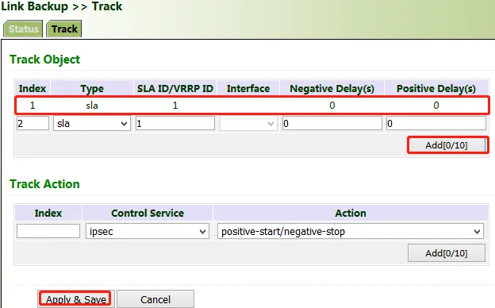</p>

<p align="center"><strong>Figure 4.71 Track Configuration</strong></p>

**Method for adding an IPsec track entry for VG710:**

Click "Link Backup >> Track >> Track" and set "Index" as required. "positive-start/negative-stop" means starting the IPsec service when the track detection state is Positive and stopping the IPsec service when the track detection state is Negative.

<p align="center">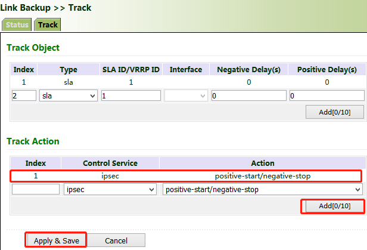</p>

<p align="center"><strong>Figure 4.72 IPsec Track Configuration</strong></p>

### 4.7.3 VRRP

**Scenario:** Multiple gateways are connected to a network at the same time. Gateway A acts as the host, and gateway B acts as a backup for gateway A. When gateway A fails, gateway B temporarily replaces gateway A as the host.

**1. Networking requirement**

Host A uses the VRRP backup group comprising gateway A and gateway B as its default gateway to access host B on the Internet.

Information of the VRRP backup group:

- The backup group ID is 1.
- The IP address of the virtual gateway of the backup group is 10.5.16.88.
- Gateway A acts as the master gateway.
- Gateway A acts as a backup gateway that can be preempted.

**2. Networking diagram**

<p align="center"></p>

<p align="center"><strong>Figure 4.73 VRRP Networking Diagram</strong></p>

| **Gateway** | **Ethernet port connected to host A** | **IP address of the port connected to host A** | **Priority** | **Work mode** | |
| :---: | :---: | :---: | :---: | :---: | --- |
| VG710_A | bridge 1 | 10.5.16.80 | 110 | | Preemption |
| VG710_B | bridge 1 | 10.5.16.81 | 100 | | Preemption |

**Method for settings when VG710_A acts as the master gateway and VG710_B as a backup gateway:**

1. Configure VG710_A.

   Click "Link Backup >> VRRP", set "Virtual Route ID" as required, select the gateway interface of VG710_A, enter the virtual IP address, set the interface priority to 110, and click Add.

<p align="center">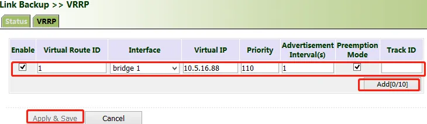</p>

<p align="center"><strong>Figure 4.74 VRRP Configuration - VG710_A</strong></p>

   In the navigation tree, click "Link Backup >> VRRP >> Status" and view the VRRP status.

<p align="center">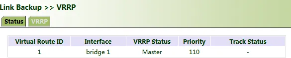</p>

<p align="center"><strong>Figure 4.75 VRRP Status - VG710_A</strong></p>

2. Configure VG710_B.

   Click "Link Backup >> VRRP", set the interface priority to 100, and click Add.

<p align="center">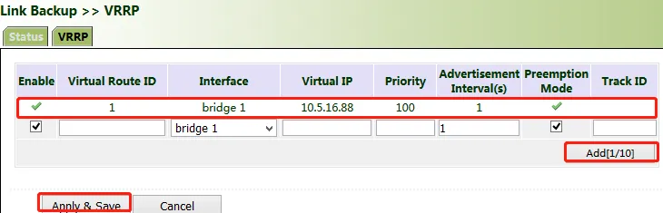</p>

<p align="center"><strong>Figure 4.76 VRRP Configuration - VG710_B</strong></p>

   In the navigation tree, click "Link Backup >> VRRP >> Status" and view the VRRP status.

<p align="center">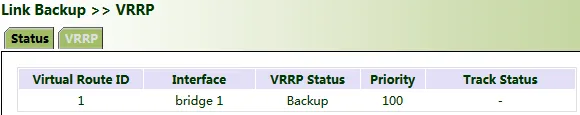</p>

<p align="center"><strong>Figure 4.77 VRRP Status - VG710_B</strong></p>

Under normal circumstances, VG710_A performs gateway functions. When VG710_A is shut down or fails, VG710_B performs gateway functions. The preemption mode is intended to enable VG710_A to continue to act as the master gateway after it recovers.

### 4.7.4 Interface Backup

**Scenario:** VG710 accesses the Internet via Wi-Fi, and an interface backup is created to enable VG710 to access the Internet through dial-up upon Wi-Fi failure. The topology is shown below.

<p align="center">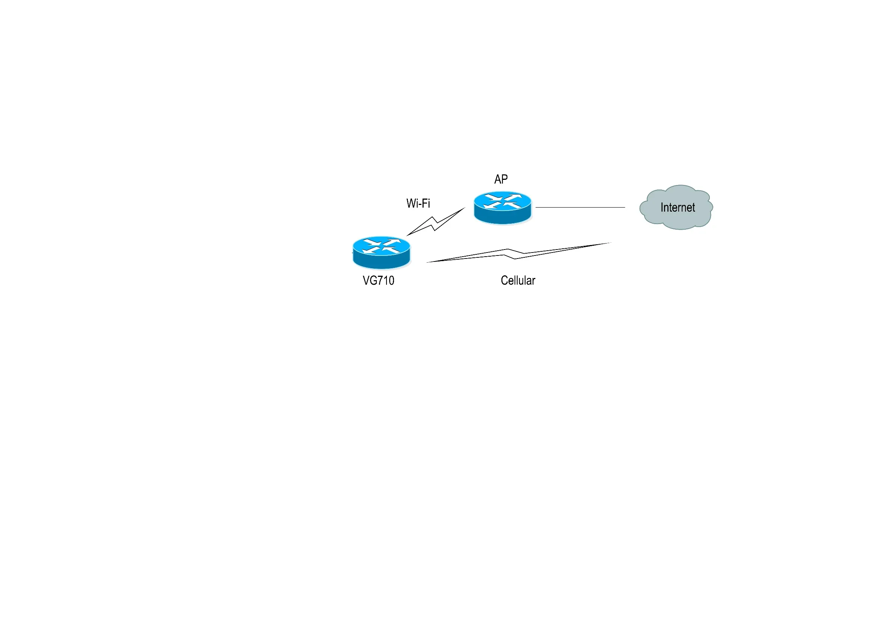</p>

<p align="center"><strong>Figure 4.78 Interface Backup Topology</strong></p>

**Method for creating an interface backup for the gateway:**

1. Enable VG710 to access the Internet via Wi-Fi.

<p align="center">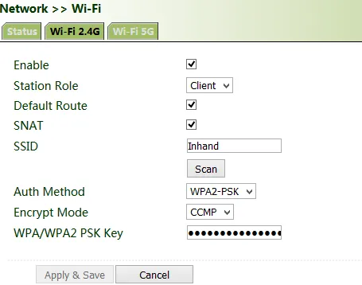</p>

<p align="center"><strong>Figure 4.79 Wi-Fi Internet Access</strong></p>

2. Click "Link Backup >> SLA >> SLA >> Add" to add an ICMP detection entry. Set the IP address to the host address that can be detected over ICMP on the public or private network, for example, the public IP address 118.122.120.22. Click Apply & Save.

<p align="center">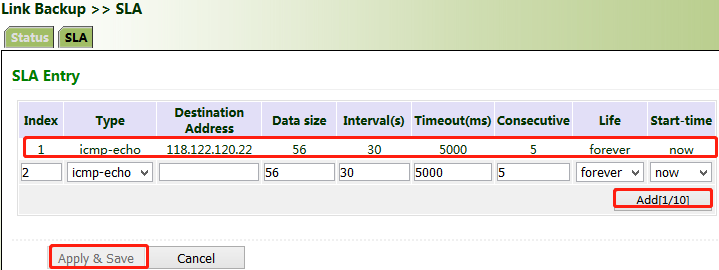</p>

<p align="center"><strong>Figure 4.80 SLA ICMP Detection Entry</strong></p>

3. Click "Link Backup >> Track >> Track >> Add" to add a track entry. Select "sla" for "Type" and "dot11radio1" for "Interface", click Add, and then click Apply & Save.

<p align="center"></p>

<p align="center"><strong>Figure 4.81 Track Entry for Interface Backup</strong></p>

4. Click "Link Backup >> Interface Backup >> Add", select "dot11radio1" for "Main Interface" and "cellular1" for "Backup Interface", and click Apply & Save.

<p align="center">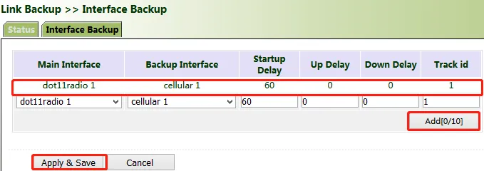</p>

<p align="center"><strong>Figure 4.82 Interface Backup Configuration</strong></p>

5. Click "Routing >> Static Routing >> Add" and add two routes for network access through the "dot11radio1" and "cellular1" interfaces. A smaller value of "Distance" indicates a higher priority.

<p align="center">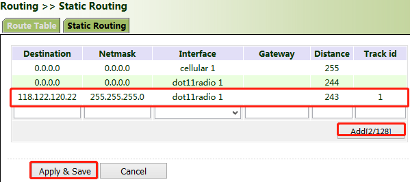</p>

<p align="center"><strong>Figure 4.83 Static Routes for Interface Backup</strong></p>

6. Trigger a Wi-Fi failure. According to the preset link detection policy, VG710 accesses the Internet through dial-up via the cellular port, and when Wi-Fi recovers, immediately switches to Wi-Fi for Internet access.

## 4.8 Bluetooth

<p align="center">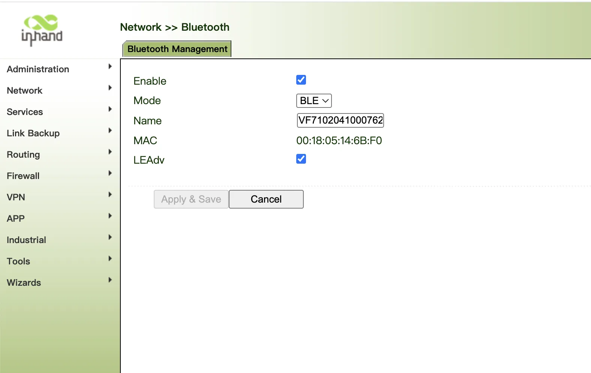</p>

<p align="center"><strong>Figure 4.84 Bluetooth Configuration</strong></p>

## 4.9 Wizards

The "Wizards" module incorporates some common communication parameters, simplifying the operations.

### 4.9.1 New Cellular

After a common network interface card (NIC) is inserted, click "Wizards >> New Cellular >> Apply & Save" and access the status page to view the network connection status of the device. The device is connected to the network.

<p align="center">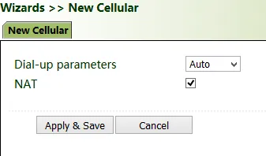</p>

<p align="center"><strong>Figure 4.85 New Cellular Wizard</strong></p>

<p align="center">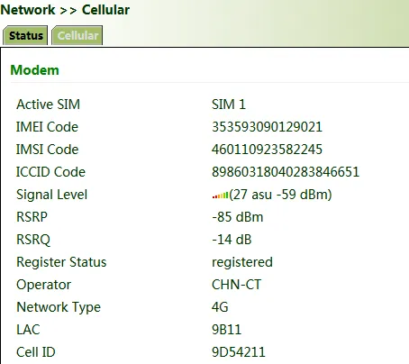</p>

<p align="center"><strong>Figure 4.86 Cellular Connection Status</strong></p>

### 4.9.2 New IPsec Tunnel

A dedicated virtual tunnel is established between the gateway and other devices or cloud platforms on the network.

**Method for establishing an IPsec tunnel for the gateway:**

Click "Wizards >> New IPsec Tunnel", set "Map Interface" to an interface ("bridge": bridge interface; "cellular": dialup interface; "dot11radio": Wi-Fi interface) for which you want to establish a tunnel, enter the peer IP address for "Destination Address", and enter the subnet IP addresses and masks at both ends of the tunnel. In Phase 1, enter the IDs at both ends of the tunnel and the connection key, and click Apply & Save.

<p align="center">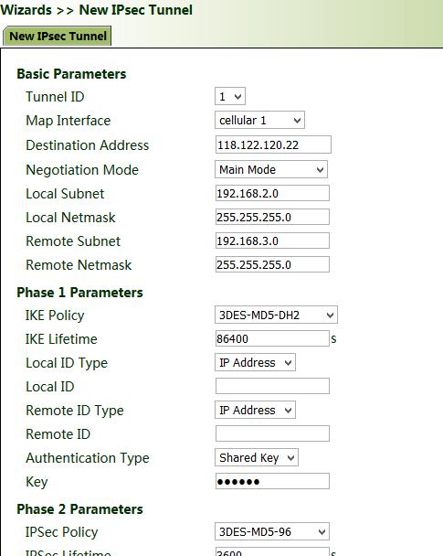</p>

<p align="center"><strong>Figure 4.87 IPsec Tunnel Wizard</strong></p>

### 4.9.3 IPsec Experts' Configuration

This function is available only for specific users. To activate this function, contact the technical support personnel.

### 4.9.4 New L2TPv2 Tunnel

**Method for creating an L2TPv2 tunnel for the gateway:**

Set the parameters of the L2TP server and the local/remote addresses. Click Apply & Save.

<p align="center">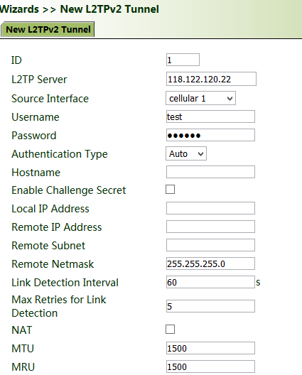</p>

<p align="center"><strong>Figure 4.88 L2TPv2 Tunnel Wizard</strong></p>

### 4.9.5 New Port Mapping

Port mapping is to map a port of a host on the intranet to a port of a host on the extranet to provide corresponding services. When a user accesses the port on the extranet, the server automatically maps the request to the internal machine on the corresponding LAN.

**Scenario:** Users on the extranet cannot directly access a web server on the intranet. In this case, a port mapping can be created on the gateway so that the gateway automatically transfers the data to port 80 of the web server on the intranet when a user on the extranet accesses port 1000 via the cellular interface of the gateway.

<p align="center">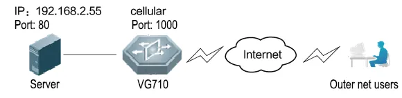</p>

<p align="center"><strong>Figure 4.89 Port Mapping Scenario</strong></p>

**Method for creating a port mapping for the gateway:**

Click "Wizards >> New Port Mapping". Enter the gateway interface for "Outside Interface", gateway port for "Service Port", IP address of the internal host for "Internal Address", and port ID of the internal host for "Internal Port". Click Apply & Save.

<p align="center">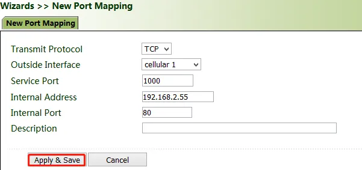</p>

<p align="center"><strong>Figure 4.90 Port Mapping Configuration</strong></p>

## 4.10 APP Management

App function is an important part of the gateway to realize edge computing. The prerequisite for using this feature is to install the Python SDK.

### 4.10.1 APP

Step 1: Click "APP >> APP Management >> Open Python App Management", click Apply & Save.

Export and import the compiled app installation package. After importing the app installation package, the system will automatically decompress and install it.

<p align="center">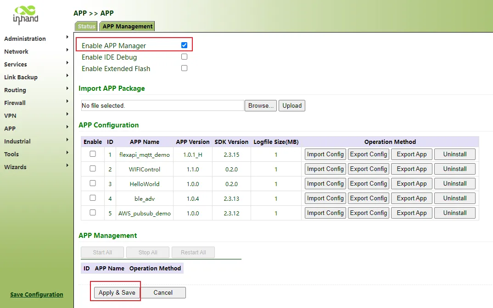</p>

<p align="center"><strong>Figure 4.91 APP Management</strong></p>

Step 2: Click running status. If the app management running status is running, the operation is successful.

<p align="center">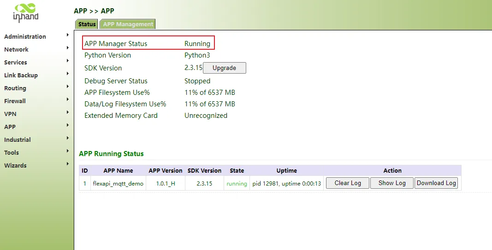</p>

<p align="center"><strong>Figure 4.92 APP Running Status</strong></p>

### 4.10.2 Docker

The Docker SDK is installed before using the Docker function.

Step 1: Click "APP >> Docker >> Enable", enter the user name, password and port number in the input box, click Apply & Save.

<p align="center">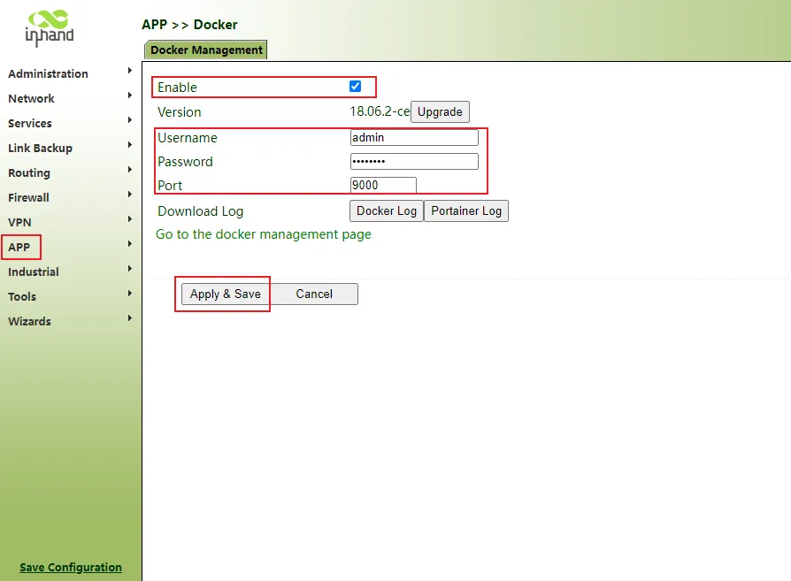</p>

<p align="center"><strong>Figure 4.93 Docker Configuration</strong></p>

### 4.10.3 Third Party Cloud Platform

The gateway device connects to the cloud platform as a client to realize communication, and obtains data in real time according to the corresponding configuration of the gateway device to achieve the purpose of data interaction.

**MQTT Protocol Connection to Cloud Platform**

Step 1: Click "APP >> Third Party Cloud Platform >> MQTT >> Enable", select the address and port of the cloud platform server, click Apply & Save.

Which fields are sent to the platform by default, and the FlexAPI config can be modified.

<p align="center">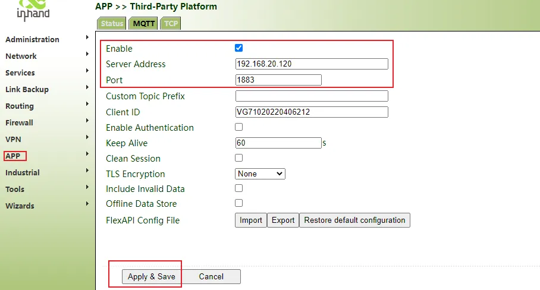</p>

<p align="center"><strong>Figure 4.94 MQTT Configuration</strong></p>

Step 2: Click status. If the connection status is connected, the connection is successful.

<p align="center">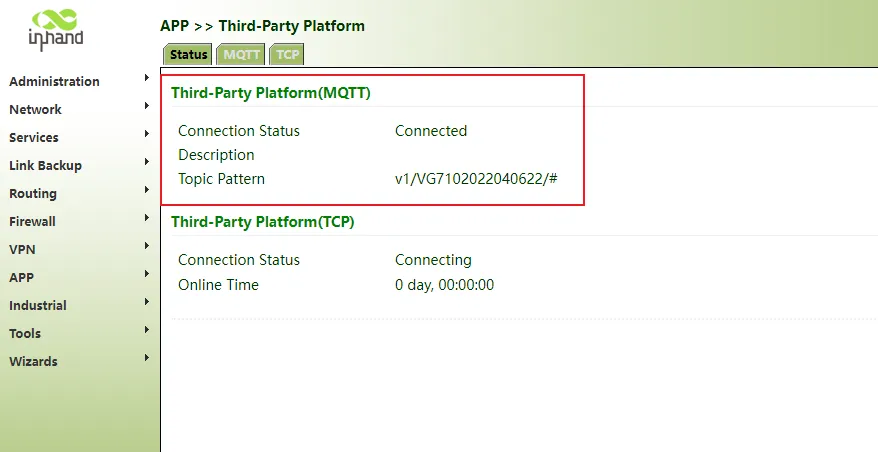</p>

<p align="center"><strong>Figure 4.95 MQTT Connection Status</strong></p>

> **Note**: If the server needs authentication and encryption, it needs to be enabled correspondingly. Click "APP >> Third Party Cloud Platform >> MQTT >> Enable", select the address and port of the cloud platform server, and enable MQTT authentication and TLS encryption.

<p align="center">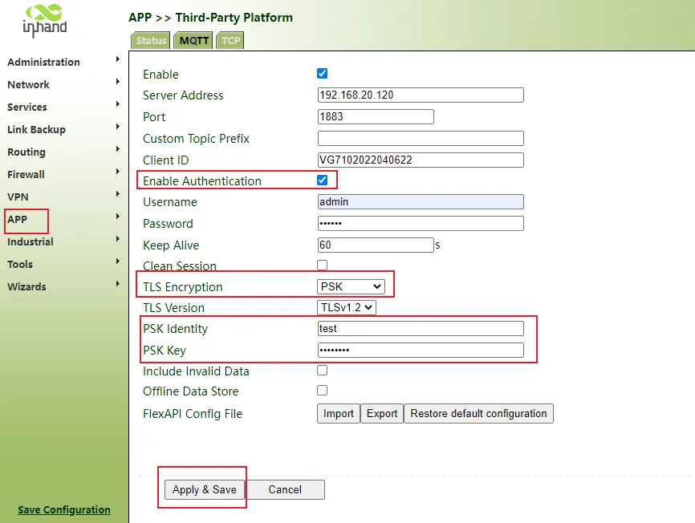</p>

<p align="center"><strong>Figure 4.96 MQTT Authentication and TLS Encryption</strong></p>

**TCP Protocol Connection to Cloud Platform**

Step 1: Click "APP >> Third Party Cloud Platform >> TCP >> Enable", select the address and port of the cloud platform server, click Apply & Save.

<p align="center">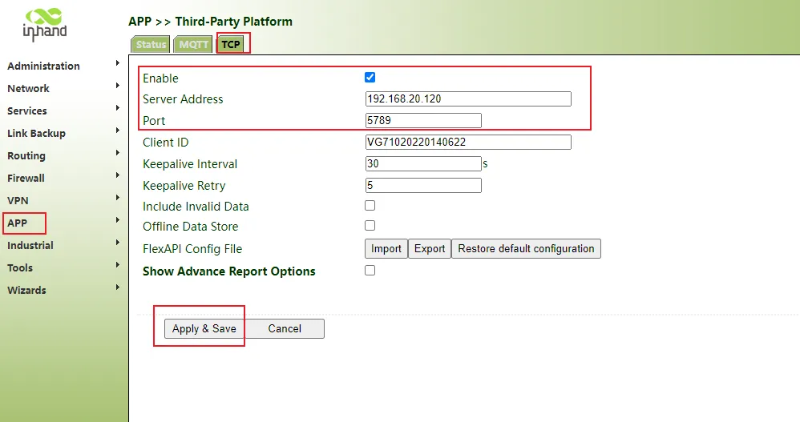</p>

<p align="center"><strong>Figure 4.97 TCP Configuration</strong></p>

Step 2: Click status. If the connection status is connected, the connection is successful.

<p align="center">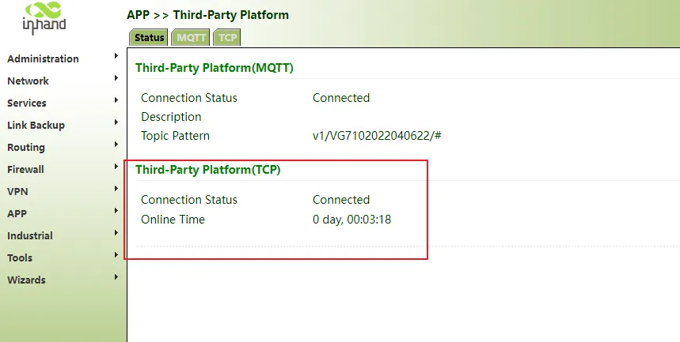</p>

<p align="center"><strong>Figure 4.98 TCP Connection Status</strong></p>

### 4.10.4 Local MQTT Agent

The gateway device acts as an MQTT server to proxy messages. When users need messages, they use the MQTT client to subscribe to information. Python App or Docker program use gateway info, subscribe to messages from the local MQTT agent.

Step 1: Click "APP >> Local MQTT Agent >> Enable Local / Local & LAN", click Apply & Save.

<p align="center">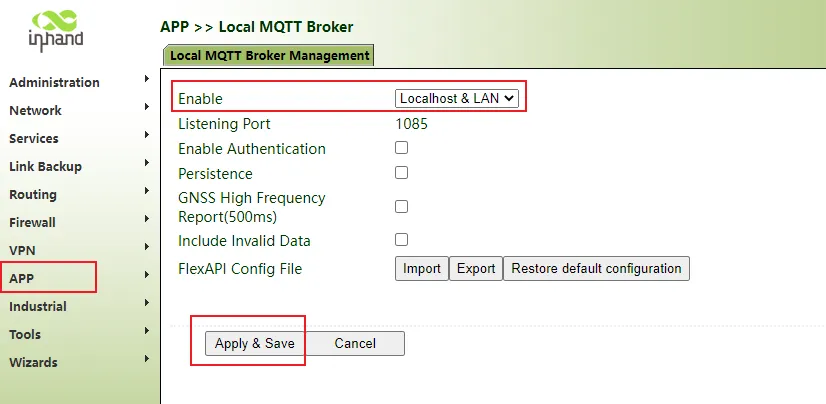</p>

<p align="center"><strong>Figure 4.99 Local MQTT Agent Configuration</strong></p>

Step 2: Use MQTT client information: server address, port, authentication and other information. This document uses MQTT FX test tool as an example.

<p align="center">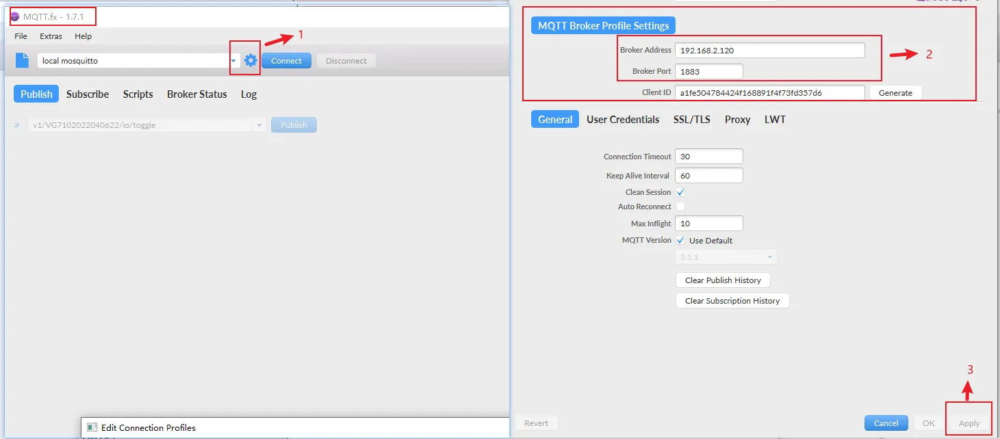</p>

<p align="center"><strong>Figure 4.100 MQTT FX Test Tool</strong></p>

Step 3: Click Connect. If the icon turns green, it means the connection is successful. Then subscribe to the information according to the topic document. The gateway will return data in JSON format. For example, subscribe to cellular information.

<p align="center">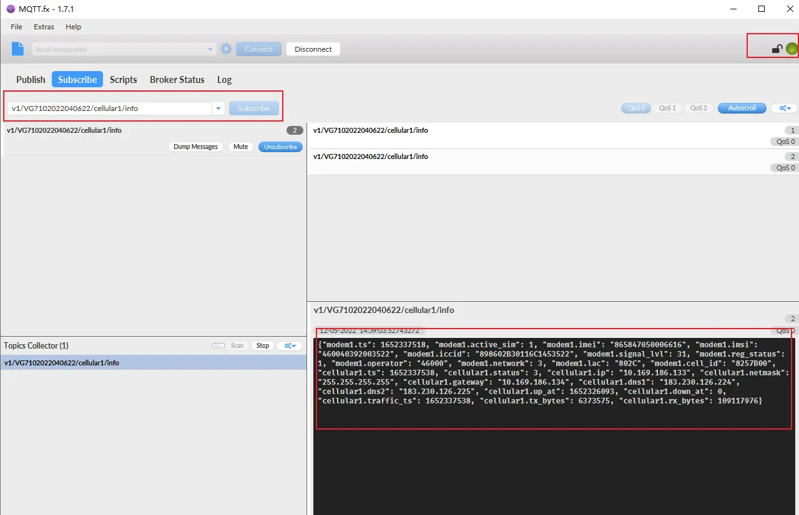</p>

<p align="center"><strong>Figure 4.101 MQTT Subscription Result</strong></p>

### 4.10.5 REST API

In addition to using MQTT and TCP to obtain data, users can also use REST APIs to call data according to interface documents.

Step 1: Click "APP >> REST API >> Enable", select the address and port of the cloud platform server, click Apply & Save.

<p align="center">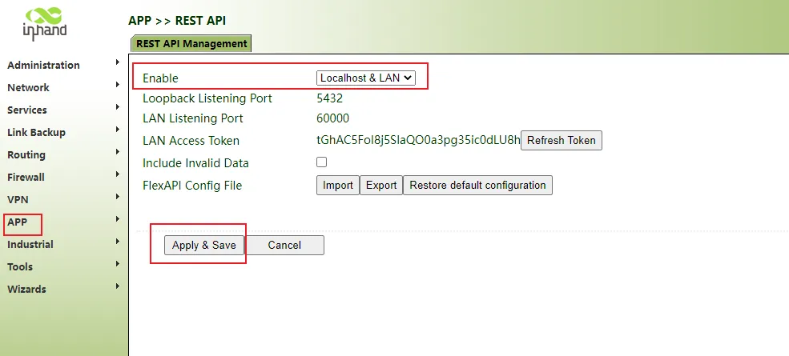</p>

<p align="center"><strong>Figure 4.102 REST API Configuration</strong></p>

Step 2: Use tools such as Postman according to the interface document to call the interface to obtain data.

1. Fill in the URL, token, etc. in the interface document, and note whether it is a GET or POST request.
2. Click Send.
3. Finally, the gateway device will return the corresponding data results in JSON format.

<p align="center">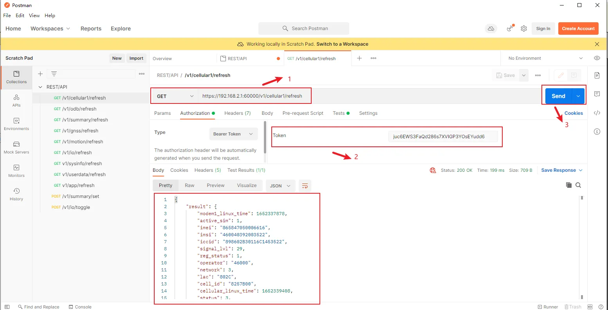</p>

<p align="center"><strong>Figure 4.103 REST API Postman Example</strong></p>

### 4.10.6 Azure IoT Edge

Click "APP >> Azure IoT Edge >> Enable", click Apply & Save.

<p align="center">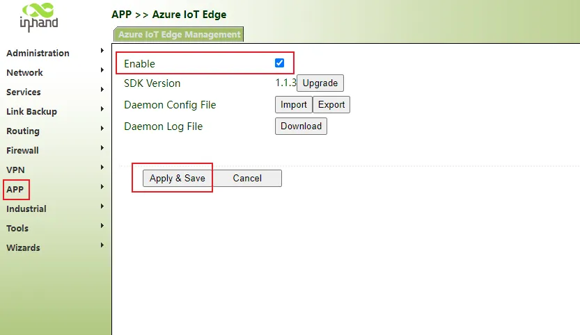</p>

<p align="center"><strong>Figure 4.104 Azure IoT Edge Configuration</strong></p>

> **Note**: This function item depends on Docker. The Docker function should be opened before opening Azure IoT Edge.

### 4.10.7 User Data

Step 1: Click "APP >> User Data >> User Data Management", then enter the name and corresponding value, click Add, and finally click Apply & Save.

<p align="center">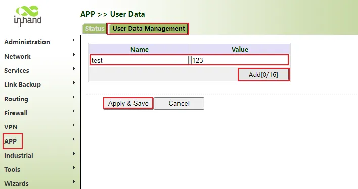</p>

<p align="center"><strong>Figure 4.105 User Data Management</strong></p>

Step 2: Click "Status". If the data exists in the status bar, it means that the addition is successful.

<p align="center">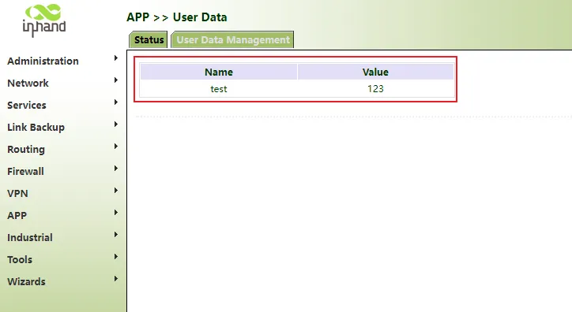</p>

<p align="center"><strong>Figure 4.106 User Data Status</strong></p>

## 4.11 Cloud Platform Connection

1. Click "Administration >> Device Manager >> Device Manager", check "Device Manager Enable", select the server address of the cloud platform, enter the registered account and license plate number of the cloud platform, and click Apply & Save.

<p align="center"></p>

<p align="center"><strong>Figure 4.107 Cloud Platform Configuration</strong></p>

2. Click "Status". "Connected" indicates that the gateway is successfully connected to the cloud platform.

### 4.11.1 Device Manager

Device Manager provides a visualization user interface and simple operation steps. The Device Manager platform enables you to manage and monitor InHand's hardware devices, such as routers and gateways with convenience. It can quickly integrate devices and manage them with just a few clicks. The cloud deployment delivers easy-to-use experience, allowing you to focus on your core business and empowering your growth.

Step 1: Register a user on the global site: [https://iot.inhandnetworks.com](https://iot.inhandnetworks.com)

<p align="center">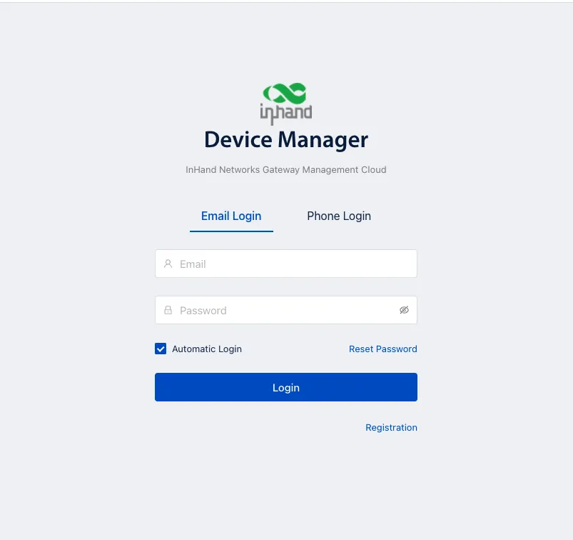</p>

<p align="center"><strong>Figure 4.108 Device Manager Registration</strong></p>

Step 2:

- Config Service Type "Device Manager"
- Server Address "iot.inhandnetworks.com". If you have already privatized the deployed Device Manager Cloud, fill in the private deployment server IP or domain name. Server Type select "Customer".
- Secure Channel: After checking, it will be transmitted with SSL encryption.
- Registered Account: Use step 1 registered account email address.
- Site name and Asset Number: customer defined.
- Make sure the VG710 is connected to the Internet.

<p align="center"></p>

<p align="center"><strong>Figure 4.109 Device Manager Configuration</strong></p>

Step 3:

- Login Device Manager cloud.
- Check Gateways, VG710 will auto login server.
- For more usage reference manuals:

<p align="center"></p>

<p align="center"><strong>Figure 4.110 Device Manager Gateway List</strong></p>

<p align="center">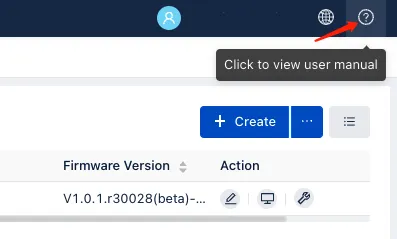</p>

<p align="center"><strong>Figure 4.111 Device Manager Dashboard</strong></p>

### 4.11.2 InConnect Service

The InConnect is a simple "plug & play" service which builds secure remote networks for your machines (IPCs, servers, IP cameras, PLCs, HMIs, RTUs, controllers, etc.). Featuring user-friendly interfaces and simple operation, the SaaS-based solution enables you to access your devices anytime from anywhere, and stay connected with your business. It supports VPN networking in the way of subnet to subnet.

Step 1: Register a user on the global site: [https://ics.inhandnetworks.com](https://ics.inhandnetworks.com/user/register)

Step 2:

- Config Service Type "InConnect Service"
- Server Address "ics.inhandnetworks.com". If you have already privatized the deployed Device Manager Cloud, fill in the private deployment server IP or domain name. Server Type select "Customer".
- Secure Channel: After checking, it will be transmitted with SSL encryption.
- Registered Account: Use step 1 registered account email address.
- Site name and Asset Number: customer defined.
- Make sure the VG710 is connected to the Internet.

<p align="center">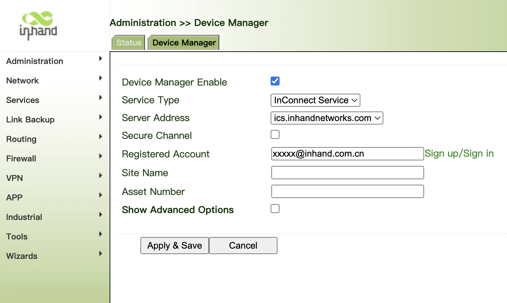</p>

<p align="center"><strong>Figure 4.112 InConnect Configuration</strong></p>

Step 3:

- Login InConnect service.
- Check Gateways, VG710 will auto login server.
- Add VG710 SN to Server:

<p align="center">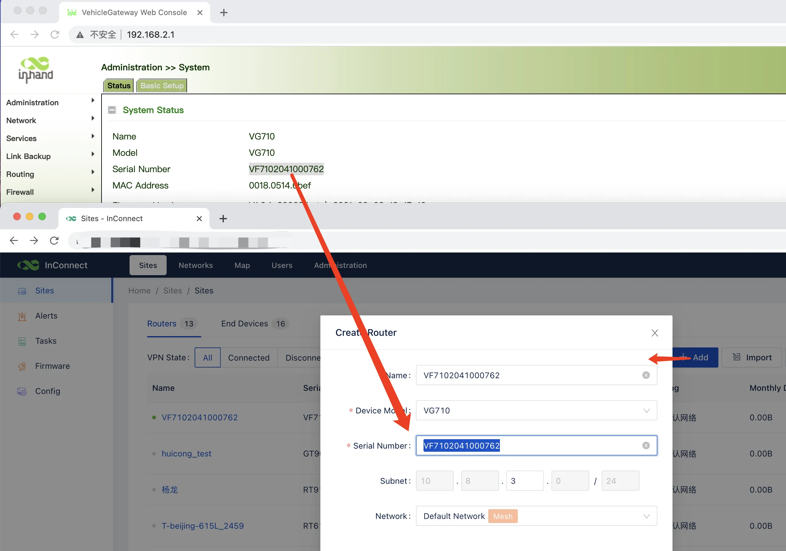</p>

<p align="center"><strong>Figure 4.113 InConnect Gateway List</strong></p>

<p align="center">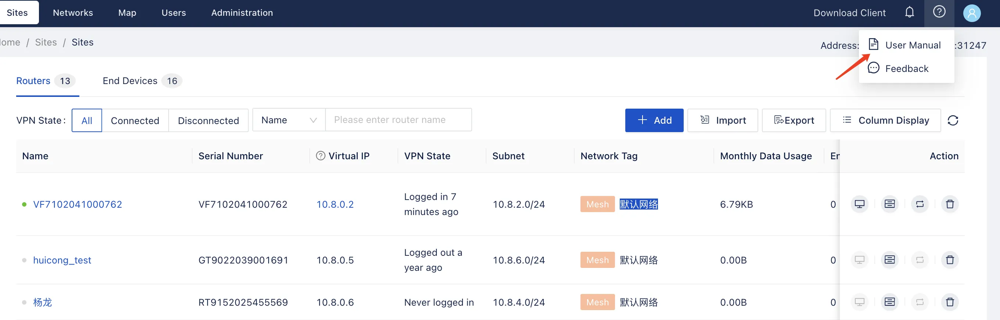</p>

<p align="center"><strong>Figure 4.114 InConnect Dashboard</strong></p>

### 4.11.3 Smart Fleet Service

InHand Smart Fleet Cloud Platform, referred to as Smart Fleet, is a business platform that provides enterprise-level vehicle monitoring and management services for enterprise customers. Smart Fleet can help you manage vehicles intelligently and efficiently, break down vehicle data barriers, and realize multi-data joint analysis, vehicle full life cycle management and control, intelligent vehicle operation and maintenance, and help the informatization construction and digital transformation of engineering vehicles.

Smart Fleet can connect multiple vehicles to the same network. You can centrally monitor and manage vehicles, issue configurations, and upgrade firmware in a unified manner.

Step 1: Register a user on the global site: [https://smartfleet.cloud](https://smartfleet.cloud/user/login)

Step 2:

- Config Service Type "InVehicle Service"
- Server Address "smartfleet.cloud". If you have already privatized the deployed Device Manager Cloud, fill in the private deployment server IP or domain name. Server Type select "Customer".
- Secure Channel: After checking, it will be transmitted with SSL encryption.
- Registered Account: Use step 1 registered account email address.
- License Plate Number is required.
- Asset Number Group ID is customer defined.
- Other interface information of the gateway can be reported to the platform in seconds.
- Make sure the VG710 is connected to the Internet.

<p align="center">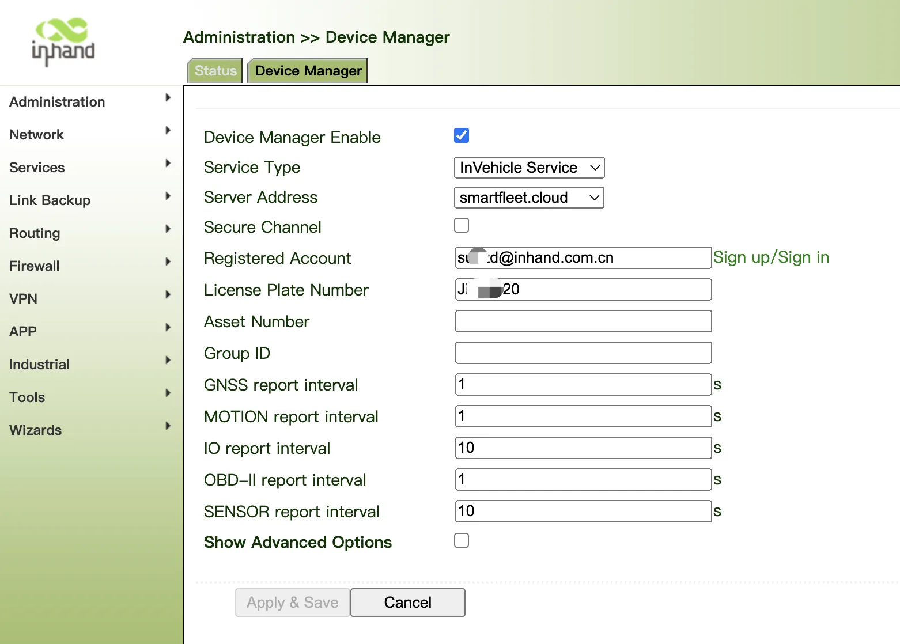</p>

<p align="center"><strong>Figure 4.115 Smart Fleet Configuration</strong></p>

Step 3:

- Login Smart Fleet service.
- Check Gateways, VG710 will auto login server.

<p align="center">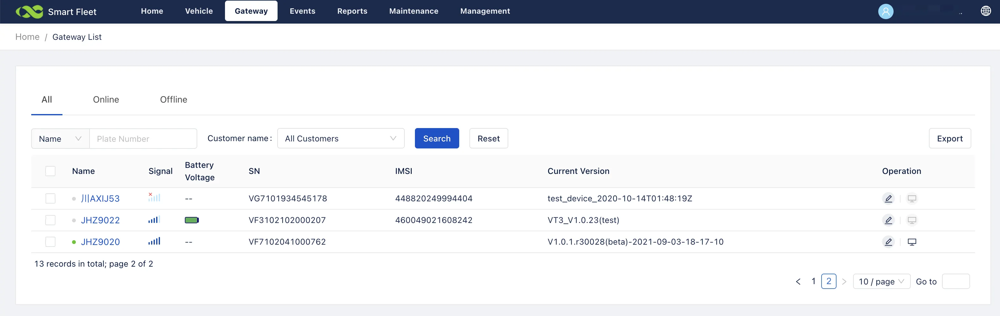</p>

<p align="center"><strong>Figure 4.116 Smart Fleet Gateway List</strong></p>

## 4.12 Industrial Ports (Serial Ports)

The industrial ports of VG710 include RS232 serial ports, RS485 serial ports, and IO ports.

### 4.12.1 DTU

RS232 provides full-serial communication, enabling hardware-based traffic control.

RS485 provides half-duplex communication, enabling remote transmission of serial communication data.

**Method for setting web pages when the gateway is used as a DTU:**

1. Enable DTU 1 (RS232) or DTU 2 (RS-485).

2. Set the connection parameters of the gateway interface and industrial device. Communication is available only when the parameters at both ends of the network link are consistent.

<p align="center">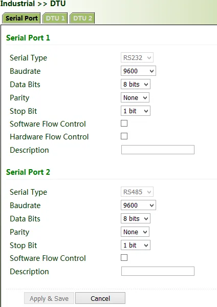</p>

<p align="center"><strong>Figure 4.117 DTU Serial Configuration</strong></p>

3. Set the IP address and transmit protocol (TCP or UDP) of the server.

<p align="center">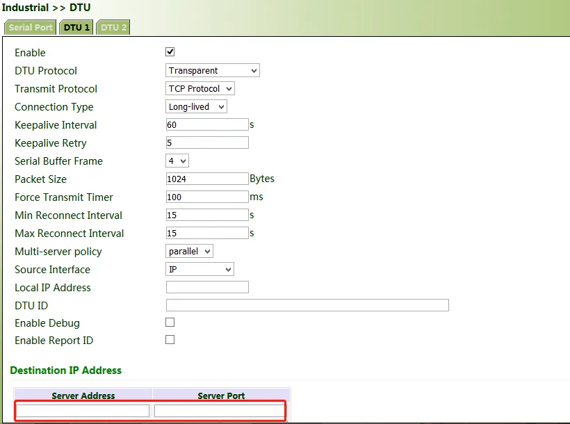</p>

<p align="center"><strong>Figure 4.118 DTU Server Configuration</strong></p>

4. Check that the gateway-connected PC and the server exchange data through DTU.

<p align="center">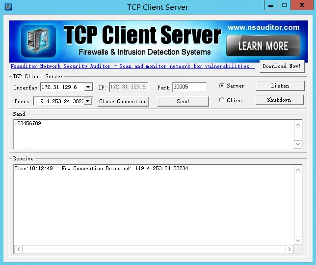</p>

<p align="center"><strong>Figure 4.119 DTU Data Exchange Verification</strong></p>

### 4.12.2 IO Ports

IO ports provide six analog inputs, six digital inputs, and four digital outputs. The analog and digital inputs share the ports. The digital parameters correspond to two states: HIGH (1) and LOW (0).

Dry Connect: determines the I/O interface status based on whether the input is on or off.

Wet Connect: determines the I/O interface status based on the input voltage.

| **No.** | **Function** | |
| :---: | --- | --- |
| **1** | **DI** | When the digital input mode is wet contact, the voltage of +2.7 V to +36 V maps to state 1. When the digital input mode is wet contact, the voltage of +0 V to +1 V maps to state 0. |
| **2** | **AI** | The analog input status is determined based on the current or voltage obtained from the analog input interface. Voltage range: +0.5 V ~ +36 V. Analog input current detection is not supported. |
| **3** | **DO** | Default: Low state, not pull-up. Set Low pull-up or not pull-up, no voltage. Set High state and pull-up, output power supply voltage. Set High state and not pull-up, high resistance state. |

<p align="center">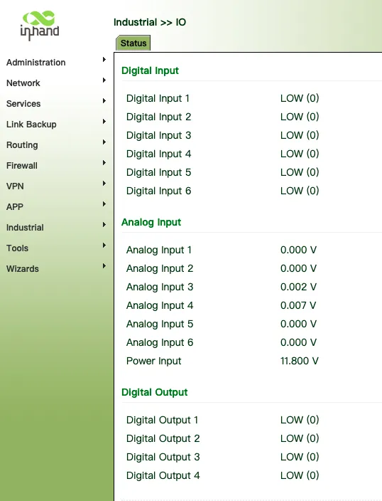</p>

<p align="center"><strong>Figure 4.120 IO Port Configuration</strong></p>

DO: the power supply voltage limit is the maximum voltage; the maximum input voltage is DC 36V; typical input current can reach 300mA.

DO: When DO is used as open drain output, the typical perfusion current can reach 300mA.

When DO pull-up is used as output, it can output high-level signal. The open circuit test voltage is the same as the power supply voltage. The pull-up resistance is 20K ohm and has no load capacity.

## 4.13 System Management

### 4.13.1 System Status

Click "Administration >> System >> Status" and view the current system and network status of the device.

<p align="center">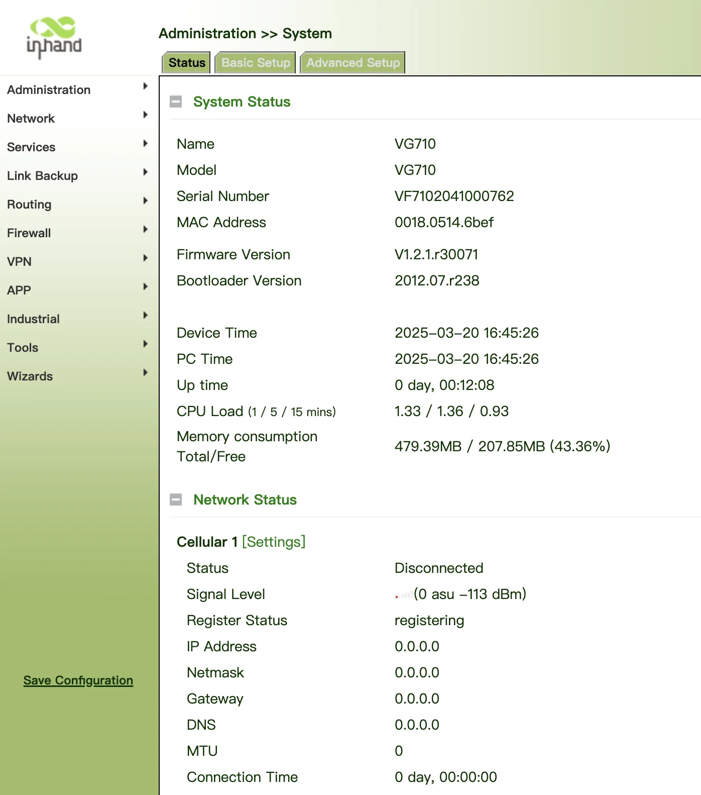</p>

<p align="center"><strong>Figure 4.121 System Status</strong></p>

### 4.13.2 Basic Setup

Click "Basic Setup" and modify the system language and device name.

<p align="center">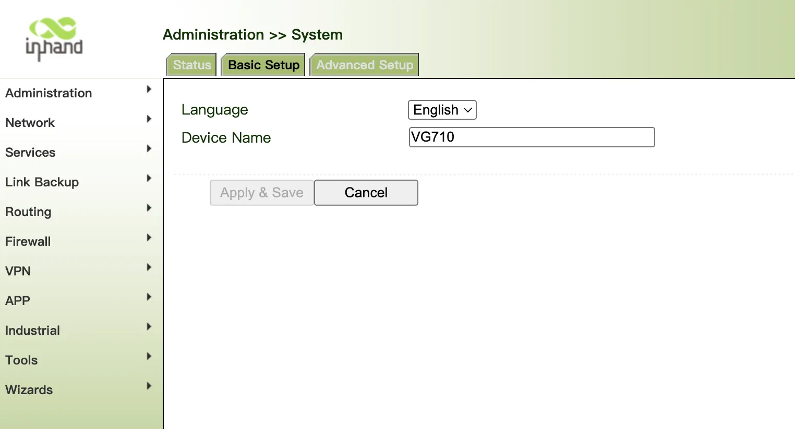</p>

<p align="center"><strong>Figure 4.122 Basic Setup</strong></p>

### 4.13.3 Advanced Setup

1. **Shortcut Forward Engine**

   After enabling the fast forwarding engine function, it will significantly improve the upload and download speed of 5G cellular networks. However, please note that network address translation (NAT) penetration, quality of service (QoS), and client traffic statistics will not be available under this setting.

2. **ITxPT**

   After enabling DI1 (Industrial >> IO >> Digital Input 1) is used for low battery state detection. After turning on ITxPT, if DI1 is not connected to low battery detection, the device will enter **sleep state**.

3. **FlexAPI Interface Compatible**

   Starting from version V1.2.1.r30062.bin, FlexAPI field updates have been implemented. The "FlexAPI Interface Compatible" option is enabled by default to maintain compatibility with previous versions. If you uncheck this option and save changes, a system reboot will be required to take effect. This action will also clear the cache and third-party platform database stored locally on the gateway.

   **Important Notes:**

   This operation is irreversible. Once new API fields are applied, you cannot roll back to previous configurations in Web config page. Enter CLI configuration mode and use command:

   ```
   VG710(config)#advanced-option flexapi compatible
   VG710(config)#write
   VG710(config)#reboot
   ```

<p align="center">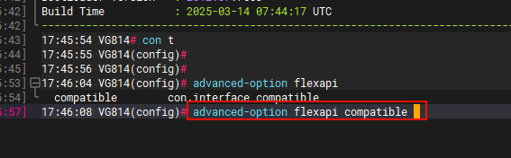</p>

<p align="center"><strong>Figure 4.123 Advanced Setup - FlexAPI Compatible</strong></p>

   For the latest FlexAPI field specifications, refer to the **FlexAPI User Manual** available on official website.

<p align="center">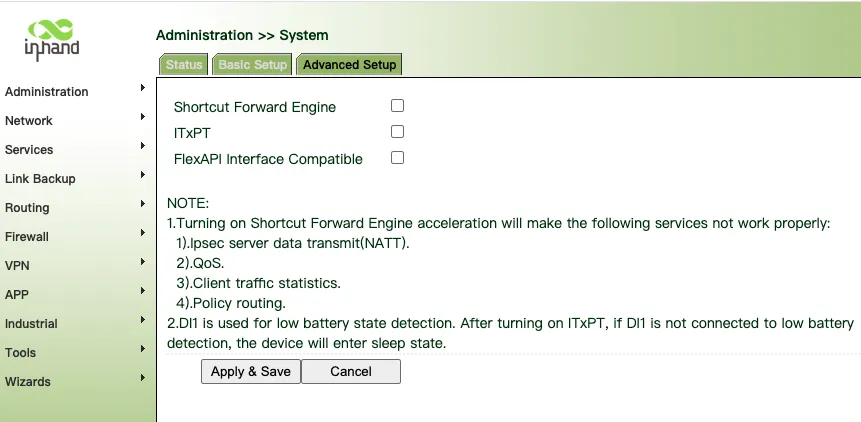</p>

<p align="center"><strong>Figure 4.124 Advanced Setup</strong></p>

### 4.13.4 System Time

To ensure the coordination between the device and other devices, set the system time accurately.

**Manual time synchronization:** Click "Administration >> System Time >> System Time >> Sync Time" to ensure consistency between the gateway time and host time.

<p align="center">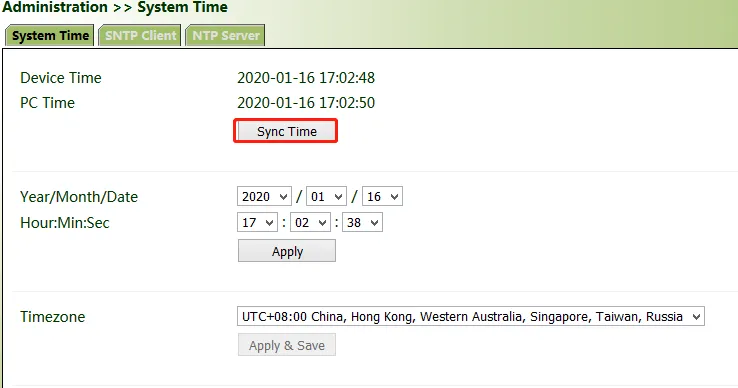</p>

<p align="center"><strong>Figure 4.125 System Time - Manual Synchronization</strong></p>

Alternatively, click "Administration >> System >> Status" to synchronize the time.

<p align="center">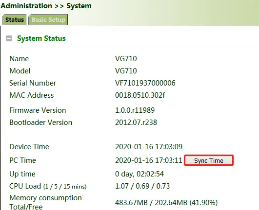</p>

<p align="center"><strong>Figure 4.126 System Time Sync from Status Page</strong></p>

**Automatic time synchronization:** Click "Administration >> System Time >> SNTP Client or NTP Server" and check "Enable" to synchronize the time between the gateway and the SNTP or NTP server.

After NTP is enabled, the gateway can synchronize time for all devices on the network.

<p align="center">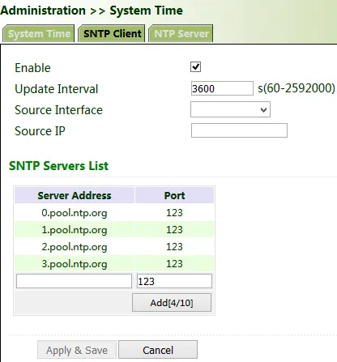</p>

<p align="center"><strong>Figure 4.127 NTP/SNTP Configuration</strong></p>

### 4.13.5 Management Services

When the gateway requires the HTTP, HTTPS, TELNET, and SSH functions, click "Administration >> Management Services", enable the services, and click Apply & Save.

<p align="center">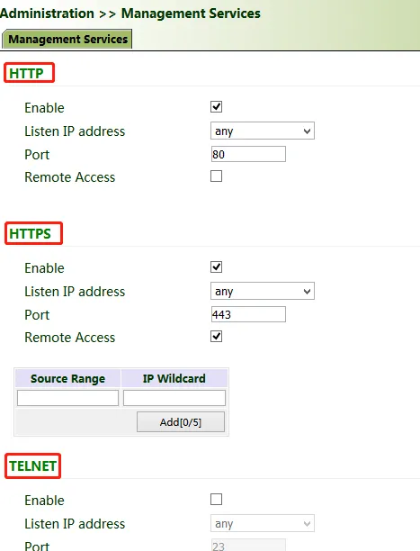</p>

<p align="center"><strong>Figure 4.128 Management Services</strong></p>

<p align="center">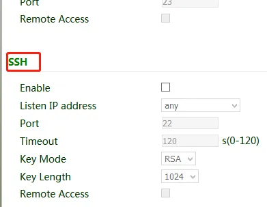</p>

<p align="center"><strong>Figure 4.129 Management Services - Access Control</strong></p>

### 4.13.6 User Management

Click "Administration >> User Management" and create users, modify passwords, or delete users on the user management page.

**Superuser and common user:**

- Superuser: By default, only one superuser is automatically created by the system, with the user name of **adm** and the default password of **123456**. It has full access rights for the gateway.
- Common user: A common user is created by the superuser. It can view or modify gateway configurations.

> **Note**: You cannot delete the superuser (**adm**) or modify its user name, but can modify its password.

### 4.13.7 AAA

Authentication, authorization, and accounting (AAA) is a security management mechanism for access control in network security, which provides three security services: authentication, authorization, and accounting.

It provides modular methods for the following services:

- Authentication: Verify whether a user has the right for network access.
- Authorization: Authorize a user to use specific services.
- Accounting: Record network resource usage of a user.

You can use only one or two of the security services provided by AAA. For example, if a company only expects to authenticate employees when they access specific resources, the network administrator only needs to configure the authentication server. However, if the company expects to record the network usage of employees, the accounting server must be configured.

AAA usually works in the client/server structure, which is highly scalable and is convenient for centralized management of user information.

<p align="center"></p>

<p align="center"><strong>Figure 4.130 AAA Architecture</strong></p>

> **Note**: **Radius**, **Tacacs+**, and **LDAP** indicate authentication and authorization servers. **Local** indicates the local user name and password of the gateway.

**Radius**

The Remote Authentication Dial In User Service (Radius) is a distributed information exchange protocol based on the client/server structure. It protects the network from unauthorized access, and is usually used in various network environments that require high security and allow remote user access.

**Method for enabling the Radius server for the gateway:**

Click "Administration >> AAA >> Radius". In "Server List", enter the server address (domain name/IP address), port ID, and authentication key, click Add, and then click Apply & Save.

<p align="center">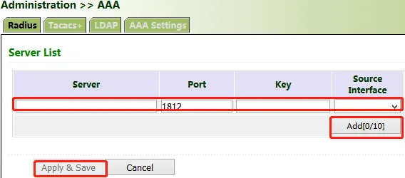</p>

<p align="center"><strong>Figure 4.131 Radius Configuration</strong></p>

**Tacacs+**

The Terminal Access Controller Access Control System + (Tacacs+) protocol is similar to the Radius protocol. It uses the client/server mode for communication between the network access server (NAS) and the Tacacs+ server. However, Tacacs+ works based on TCP, and Radius works based on UDP.

The Tacacs+ protocol is mainly used for AAA of end users and Point-to-Point Protocol (PPP) and virtual private dial-up network (VPDN) access users. Its typical application is to authenticate, authorize, and perform accounting for an end user who needs to log in to the device for operations.

**Method for enabling the Tacacs+ server for the gateway:**

Click "Administration >> AAA >> Tacacs+". In "Server List", enter the server address (domain name/IP address), port ID, and authentication key, click Add, and then click Apply & Save.

<p align="center">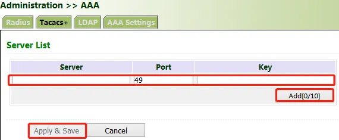</p>

<p align="center"><strong>Figure 4.132 Tacacs+ Configuration</strong></p>

**LDAP**

The main advantage of the Lightweight Directory Access Protocol (LDAP) lies in its quick response to users' search operations. LDAP is equivalent to one table, and requires only the user name and password, with some other parameters, which is quite simple. It can meet the authentication requirement regarding the efficiency and structure.

**Method for enabling the LDAP server for the gateway:**

Click "Administration >> AAA >> LDAP". In "Server List", enter any name for "Name", enter the server address (domain name/IP address) and port ID, and enter the base DN obtained from the server. Set the user name and password for accessing the server. Select "None", "SSL", or "StartTLS" for "Security". Click Add, and then click Apply & Save.

<p align="center">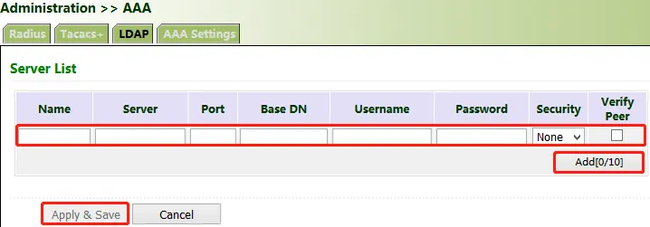</p>

<p align="center"><strong>Figure 4.133 LDAP Configuration</strong></p>

**AAA Authentication**

**AAA authentication methods:**

- No authentication (**none**): No validity check is performed. Generally, this method is not used.
- Local authentication (**local**): User information is configured on the NAS. Local authentication is fast, which can reduce the operational costs, but the information storage amount is limited by hardware.
- Remote authentication: User information is configured on the authentication server. Remote authentication is supported over Radius, Tacacs+, and LDAP.

**AAA authorization methods:**

- No authorization (**none**): No authorization is performed for users.
- Local authorization (**local**): Authorization is performed based on the properties configured by the NAS for the local account.
- Tacacs+ authorization: Users are authorized by the Tacacs+ server.
- Authorization after successful Radius authentication: Authorization is bound to authentication, and cannot be performed independently over Radius.
- LDAP authorization

**Method for enabling authentication and authorization for the gateway:**

Click "Administration >> AAA >> AAA Settings". 1, 2, and 3 are corresponding to Radius, Tacacs+, and LDAP respectively. Authentication entries 1, 2, and 3 must be corresponding to authorization entries 1, 2, and 3 respectively. When all of **radius**, **tacacs+**, and **local** are set, the priority sequence is as follows: 1 > 2 > 3.

<p align="center">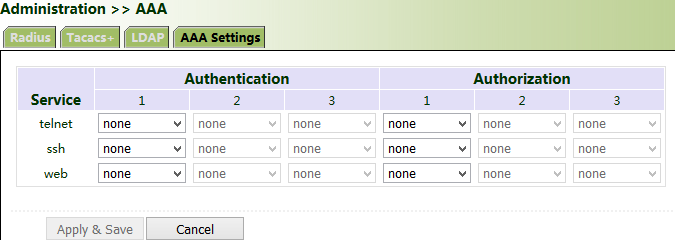</p>

<p align="center"><strong>Figure 4.134 AAA Settings</strong></p>

### 4.13.8 Configuration Management

**Method for importing configurations:** Click "Administration >> Config Management >> Config Management >> Browse", select a configuration file, and click Import to import the configuration file to the gateway.

**Method for backing up current running configurations to the PC (common)**: Click Backup running-config.

**Method for backing up the startup file to the PC:** Click Backup startup-config.

**Method for restoring default configurations:** Click Restore default configuration and then click OK.

<p align="center">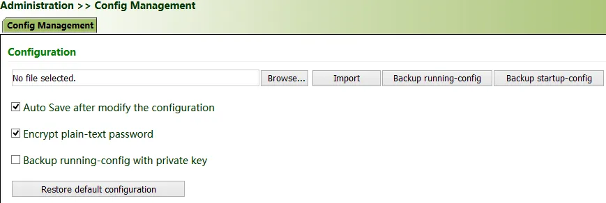</p>

<p align="center"><strong>Figure 4.135 Configuration Management</strong></p>

### 4.13.9 SNMP

Currently, the SNMP Agent of VG710 supports SNMPv1, SNMPv2c, and SNMPv3.

- SNMPv1 and SNMPv2c use community names for authentication.
- SNMPv3 uses user names and passwords for authentication.

**Method for enabling SNMP for VG710:**

Click "Administration >> SNMP >> SNMP", check "Enable", select "v1c" or "v2c" for "SNMP Version", and click Apply & Save.

<p align="center">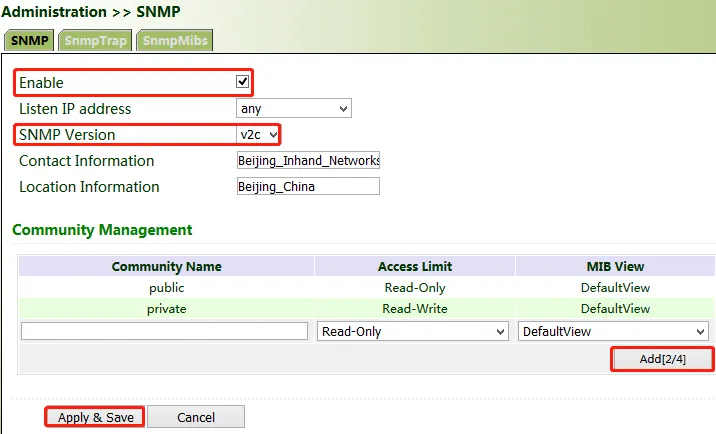</p>

<p align="center"><strong>Figure 4.136 SNMP Configuration</strong></p>

If v3c is selected, the corresponding user and user group need to be configured. Enter any name for "Groupname", select a security level, and click Add. Enter any name for "Username", select the new group name for "Groupname", set "Authentication" and "Authentication password", click Add, and then click Apply & Save.

<p align="center">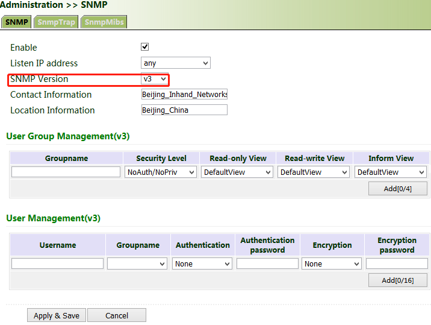</p>

<p align="center"><strong>Figure 4.137 SNMPv3 User and Group Configuration</strong></p>

**SNMP Trap (Alarm)**

The SNMP trap is a type of entrance. When this entrance is reached, the SNMP managed devices actively notify the NMS, instead of waiting for the polling of NMS. On an SNMP-enabled network, the agents on managed devices can report errors to the NMS anytime, without the need of waiting for the polling of NMS. The errors are reported to the NMS through traps.

**Method for enabling SNMP Trap for the gateway:**

Click "Administration >> SNMP >> SnmpTrap". Enter the IP address of the NMS. Enter the corresponding group name when v1c or v2c is selected, or the corresponding user name when v3c is selected, ensuring that the name consists of 1-32 characters. By default, the UDP port ID ranges from 1 to 65535.

<p align="center">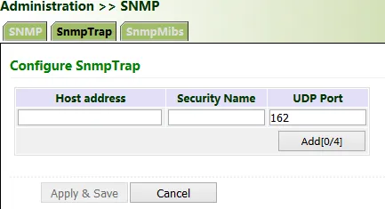</p>

<p align="center"><strong>Figure 4.138 SNMP Trap Configuration</strong></p>

**SNMP MIBs**

In SNMP messages, management variables are used to describe the managed objects on the device. To uniquely identify the managed objects on the device, SNMP uses a hierarchical naming scheme to identify the managed objects. The entire hierarchical structure is like a tree. The nodes of the tree represent the managed objects. Each node can be uniquely identified by a path starting from the root.

<p align="center">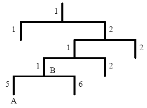</p>

<p align="center"><strong>Figure 4.139 SNMP MIB Tree Structure</strong></p>

The management information base (MIB) is used to describe the hierarchical structure of the tree. It is a set of standard variable definitions for the monitored network device. Managed objects can be uniquely determined based on a string of numbers (OID).

**Method for downloading a SNMP MIBs file to the PC via the gateway:**

Click "Administration >> SNMP >> SnmpMibs", select a folder, and click download to download it to the PC. Find the folder on the PC and import it to the NMS.

<p align="center">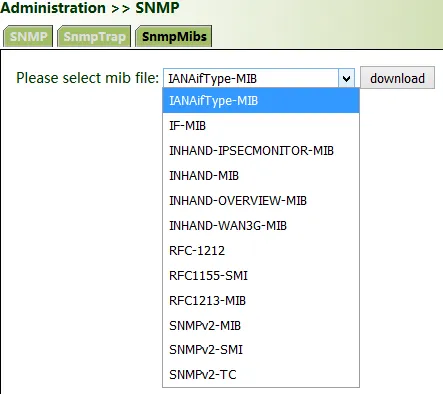</p>

<p align="center"><strong>Figure 4.140 SNMP MIBs Download</strong></p>

### 4.13.10 Alarm

The alarm function enables users to identify gateway abnormalities in time. When an abnormality occurs, the gateway reports an alarm. You can select system-defined abnormalities and choose an appropriate notification way to obtain the abnormality information. All alarms are recorded in alarm logs so that users can identify abnormalities and perform troubleshooting in time.

**Alarm states:**

- **Raise**: indicates that the alarm has been generated but not been confirmed.
- **Confirm**: indicates that the alarm cannot be solved currently.
- **All**: indicates all generated alarms.

**Alarm levels:**

- **EMERG**: The device undergoes a serious error that causes a system reboot.
- **CRIT**: The device undergoes an unrecoverable error.
- **WARN**: The device undergoes an error that affects system functions.
- **NOTICE**: The device undergoes an error that affects system performance.
- **INFO**: A normal event occurs.

(1) **Status**: Click "Administration >> Alarm >> Status" and view all alarms generated in the system since power-on.

<p align="center">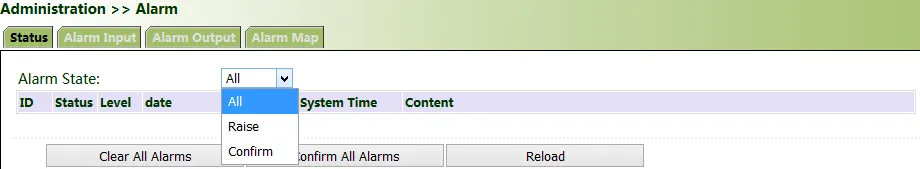</p>

<p align="center"><strong>Figure 4.141 Alarm Status</strong></p>

(2) **Alarm Input**: Select an alarm type as required. When this item is abnormal, an alarm is generated.

(3) **Alarm Output**: When an alarm is generated, the system automatically sends the alarm content to the destination email address via an email. This function is not available for common users. Set the sender mail address in "Email Alarm" and the receiver mail address in "Mail Address". "Mail Server IP/Name" can be found on the browser (for example, enter "smtp.exmail.qq.com" if you use a Tencent Enterprise mailbox.)

<p align="center">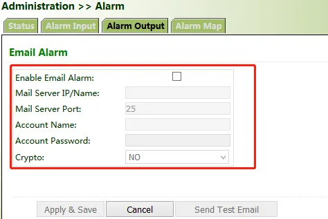</p>

<p align="center"><strong>Figure 4.142 Alarm Output Configuration</strong></p>

(4) **Alarm Map**: Alarms can be received in two ways: command line interface (CLI) (console interface) and Email. Some devices support SMS alarms. To enable email-based mapping, enable and set the email address on the "Alarm Output" page.

### 4.13.11 System Logs

**Method for viewing system logs:**

Click "Administration >> System Log" to view system logs.

This page also provides the following operations: "Clear Log", "Download Log File", "Download Diagnose Data", "Clear History Log", and "Download History Log". History logs are those stored for extended time as specified on the "System Log" page.

The diagnose data file is encrypted, because the gateway configuration information is downloaded together with the diagnose data. You need to decrypt the file with the decryption tool provided by InHand.

<p align="center">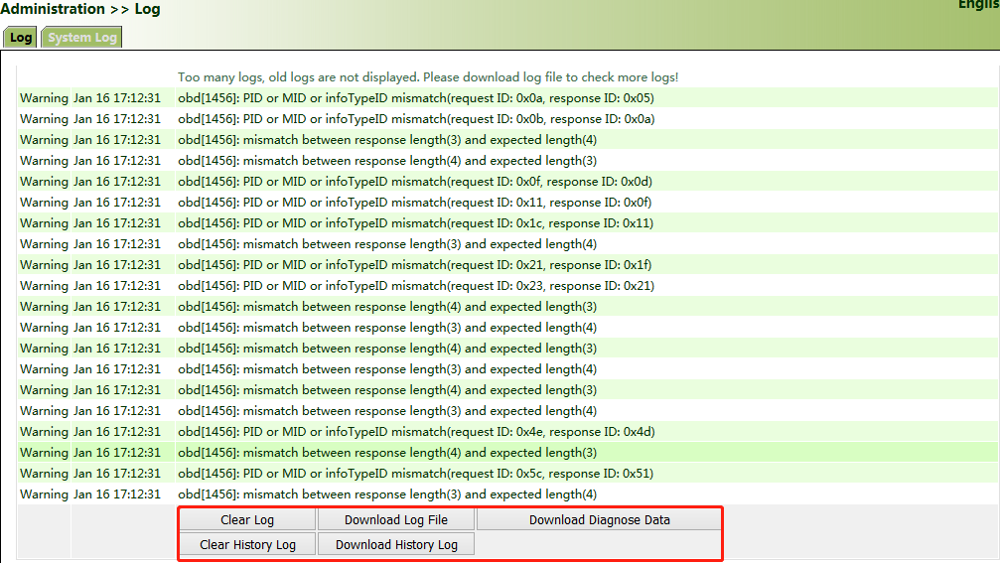</p>

<p align="center"><strong>Figure 4.143 System Logs</strong></p>

The storage capacity of the gateway is limited (512 KB by default). To save all the logs, you need to use a remote log server (for example, Kiwi Syslog Daemon). Set the address and port of the log server on the web page. The gateway uploads all the system logs to the remote log server.

<p align="center">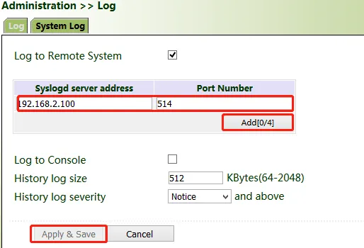</p>

<p align="center"><strong>Figure 4.144 Remote Log Server Configuration</strong></p>

### 4.13.12 System Upgrade

Click "Administration >> Upgrade >> Browse", select an upgrade file, and click Upgrade. Restart the system after the upgrade is completed.

<p align="center">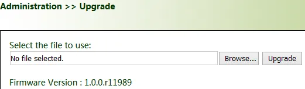</p>

<p align="center"><strong>Figure 4.145 System Upgrade</strong></p>

|  Note: During the software upgrade, do not perform any operation on the web page; otherwise, the software upgrade may be interrupted. |
| :--- |

### 4.13.13 System Reboot

Click "Administration >> Reboot >> OK" to reboot the system.

<p align="center">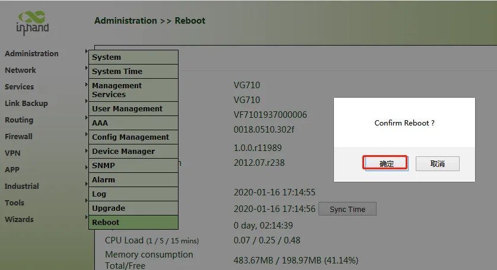</p>

<p align="center"><strong>Figure 4.146 System Reboot</strong></p>

## 4.14 Diagnostic Tools

Diagnostic tools are used to detect the network connection of the gateway: **Ping**, **Traceroute**, **Tcpdump**, and **Link Speed Test**.

**Ping:** It is used to detect the external network connection of the device. Enter any common website for "Host" and click "Ping". If data transmission occurs, the network is connected properly.

<p align="center">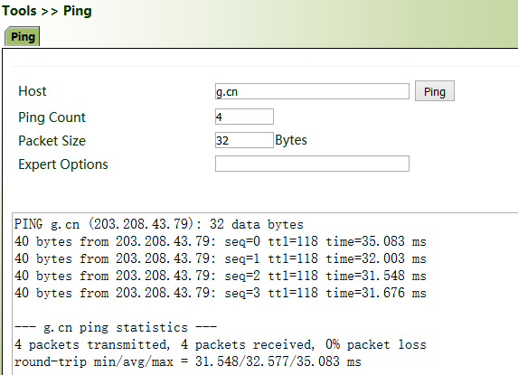</p>

<p align="center"><strong>Figure 4.147 Ping Tool</strong></p>

**Traceroute:** Enter the IP address of the peer host and click "Trace" to detect the route connection.

<p align="center">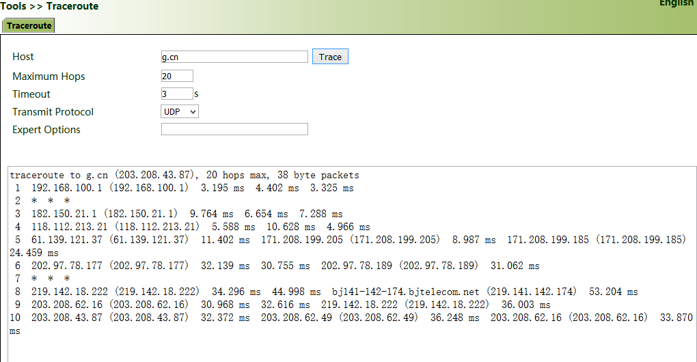</p>

<p align="center"><strong>Figure 4.148 Traceroute Tool</strong></p>

**Tcpdump:**

Select an interface ("any" or "bridge1"), set "Capture Number", and click Start Capture >> Stop Capture >> Download Capture File.

<p align="center">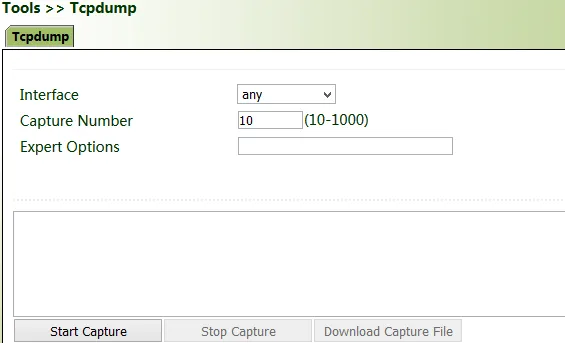</p>

<p align="center"><strong>Figure 4.149 Tcpdump Tool</strong></p>

Download Wireshark from the browser to open the downloaded file and analyze the messages to understand the network connection of the interface.

<p align="center">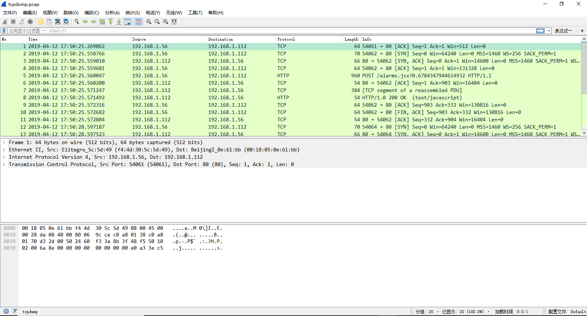</p>

<p align="center"><strong>Figure 4.150 Wireshark Packet Analysis</strong></p>

**Link Speed Test:** Upload and download files to test the link speed.

<p align="center">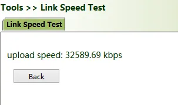</p>

<p align="center"><strong>Figure 4.151 Link Speed Test</strong></p>

# 5 Edge Computing

Powerful edge computing capabilities facilitate the development of custom applications. The remote fleet management platform enables easy secondary development for third-party software developers. With an open cloud ecosystem that supports Microsoft Azure and AWS, the VG710 offers more options for application developers. It supports Node-RED Docker image low code edge computing solutions.

<p align="center">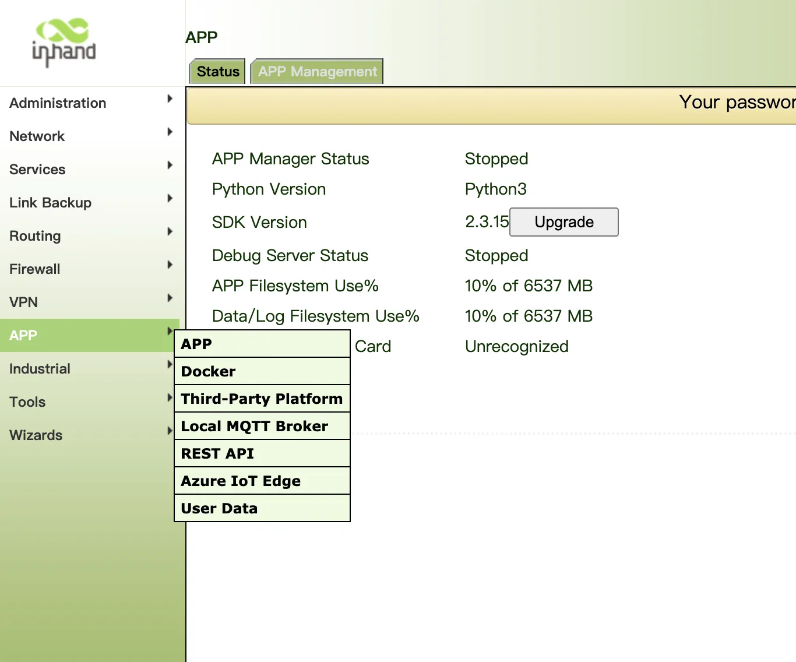</p>

<p align="center"><strong>Figure 5.1 Edge Computing Architecture</strong></p>

For more documentation: [https://github.com/inhandnet/InVehicle-Docs/tree/main/PDF](https://github.com/inhandnet/InVehicle-Docs/tree/main/PDF)

# Appendix A Accessories

## VG710 4G Version Accessories

| **Product Name** | **MLFB** | **Specifications** | | **Product Pictures** |
| --- | --- | --- | --- | --- |
| VG710 Power Cable | **SCAB000216** | This cable has A and B ends: A end has 4 pins, is to connect to VG710; B end is bare wire ends. Suitable for field engineering projects. To perform indoor testing, a power adapter needs to be prepared separately. Cable length 3000mm. | Required |  |
| 5G/4G Antenna | **AANT110016** | Antenna - 5G 3M adhesive-backed antenna, cable length 2000+/-20mm, SMA connector | Optional |  |
| GNSS Antenna | **AANT040006** | GPS/GALILEO: 1575.42+/-1.023 MHz, GLONASS: 1602+/-8 MHz, Dimensions: 55.6x50.5mm, cable length 2000mm | Optional | 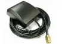 |
| Wi-Fi Antenna | **AANT060018** | 2400~2500MHz/4900~5850MHz, cable length 2000mm | Optional |  |
| VG710-4G 20 PIN Extension Cable | **SCAB000219** | This cable has A and B ends: A end has 20 pins, is to connect to VG710; B end is bare wire ends. Suitable for field engineering projects and testing. Cable length 500mm. | Optional |  |
| VG710 OBD-II Cable | **SCAB000215** | This cable has A, B, C and D ends: A end has 20 pins, female; B end is OBD female, C end replicates A end but is male, D end is OBD male. Suitable for field engineering projects and testing. Cable length 5000mm. | Optional |  |
| VG710 J1939 9PIN Cable | **SCAB000235** | P1 is 20PIN; P3 is OBD-II male; P4 is I/O open end, suitable for engineering projects; P5 is ignition signal cable, please connect to the ignition signal of the vehicle before use. | Optional | 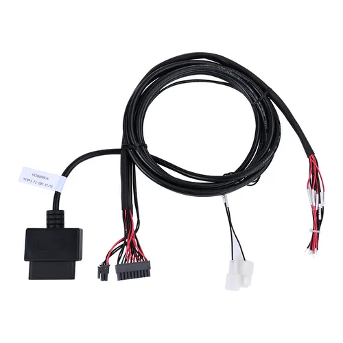 |
| VG710-4G J1939 9PIN All-in-one Cable | **SCAB000234** | P1 is 20PIN; P3 is J1939 9PIN female; P4 is I/O open end, suitable for engineering projects; P5 is ignition signal cable, please connect to the ignition signal of the vehicle before use. | Optional | 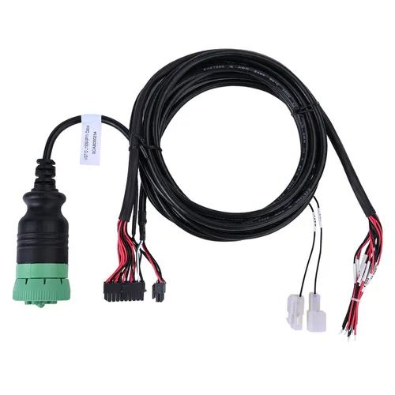 |
| VG710 J1939 6PIN Cable | **SCAB000233** | P1 is 20PIN; P3 is J1939 6PIN female; P4 is I/O open end, suitable for engineering projects; P5 is ignition signal cable, please connect to the ignition signal of the vehicle before use. | Optional | 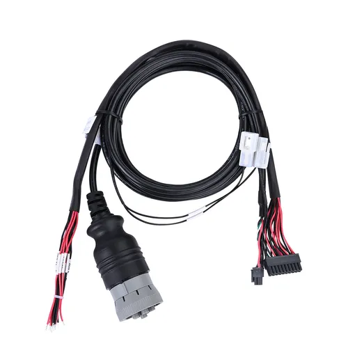 |
| VG710-4G M12 5PIN to OBD CAN Cable | **SCAB000394** | M12 5PIN to 20PIN CAN-H/L design of grounding screw hole with shielding layer | Optional |  |

## VG710-H 5G Version Accessories

| **Product Name** | **MLFB** | **Specifications** | | **Product Pictures** |
| --- | --- | --- | --- | --- |
| VG710 Power Cable | **SCAB000216** | This cable has A and B ends: A end has 4 pins, is to connect to VG710; B end is bare wire ends. Suitable for field engineering projects. To perform indoor testing, a power adapter needs to be prepared separately. Cable length 3000mm. | Required |  |
| 5G Antenna | **AANT110016** | Antenna - 5G 3M adhesive-backed antenna, cable length 2000+/-20mm, SMA connector | Optional |  |
| Wi-Fi Antenna | **AANT060018** | 2400~2500MHz/4900~5850MHz. Cable length 2000mm. | Optional |  |
| Bluetooth Antenna | **AANT060017** | 2.4GHz, peak gain 3dBI | Optional |  |
| VG710-H 20 PIN IO All-in-one Cable | **SCAB000390** | VG710-5G with 3.5mm earphone microphone 20PIN. Cable length 1000mm | Optional |  |
| VG710-H 10PIN EXT All-in-one Extension Cable | **SCAB000400** | VG710-H 2CAN, LINE, J1708 Interface Cable length 1000mm | Optional | 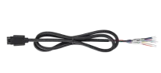 |
| Cable-OBD 16PIN Extension Cable | **SCAB000399** | OBD Cable 16PIN 1500mm | Optional |  |

## VG710-M Version Accessories

| **Product Name** | **MLFB** | **Specifications** | | **Product Pictures** |
| --- | --- | --- | --- | --- |
| VG710-M12 Version Power Cable | **SCAB000564** | VG710-M12 Version Power Cable, 8PIN, Cable length 2000mm | Required | 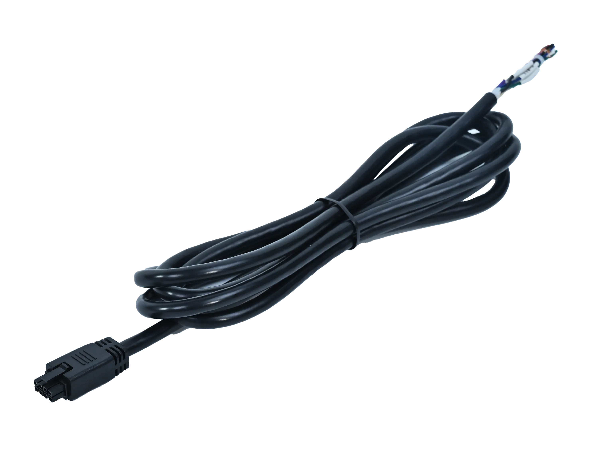 |
| 4G FAKRA Antenna | **AANT090038** | 4G Antenna FAKRA Purple connector, Cable length 2000mm | Optional |  |
| 5G FAKRA Antenna | **AANT110017** | 5G Antenna FAKRA Purple connector, Cable length 2000mm | Optional |  |
| Wi-Fi FAKRA Antenna | **AANT060024** | Wi-Fi/BLE 2.4-2.5GHz 5-5.8GHz Antenna FAKRA Beige connector. Cable length 2000mm. | Optional |  |
| GNSS FAKRA Antenna | **AANT040013** | GPS L1 1575.42MHZ & BD 1561.098MHz & GLONASS 1602MHz. Cable length 2000mm. | Optional |  |
| Network Cable M12 X Male to RJ45 | **AETH050002** | Network Cable M12 X to RJ45, Cable length 1000mm | Optional |  |

## Public Accessories

| **Product Name** | **MLFB** | **Specifications** | | **Product Pictures** |
| --- | --- | --- | --- | --- |
| Quick terminal - 3in3out | **ECON060255** | Rated voltage 600V, rated current 30A, 40x18.6x14.5mm, Flame retardant grade V0. | Optional |  |
| OBD 16PIN Test Cable | **SCAB000399** | OBD 16PIN interface test line, Cable standard UL2464, wire length 1500mm | Optional | 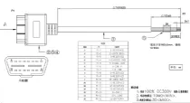 |
| J1939 6PIN Test Cable | **SCAB000409** | J1939 6PIN interface test line, Cable standard UL2464, wire length 1500mm | Optional | 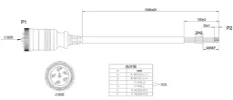 |
| J1939 9PIN Test Cable | **SCAB000410** | J1939 9PIN interface test line, Cable standard UL2464, wire length 1500mm | Optional | 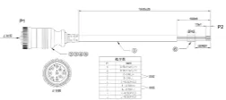 |
| DC 5.5*2.1mm Female Connector | **ECON000047** | Power connector - DC 5.5 * 2.1mm female head welding free | Optional | 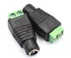 |
| USB to 485 / 232 connector | **ASER010009** | USB to 485 / 232 connector | Optional | 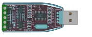 |
| Switching power (American standard) | **APWR000122** | Switching power supply - 12V/2A - round connector - horizontal - DC line length 1.5M - single magnetic ring | Optional | 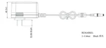 |
| Power adapter 12V/2A (European standard) | **APWR000121** | Switching power supply - 12V/2A - round connector - vertical - DC line length 1.5M - single magnetic ring | Optional |  |
| Power adapter 12V/2A (UK standard) | **APWR000138** | Switching power supply - 12V/2A - round connector - vertical - DC line length 1.5M - single magnetic ring | Optional | 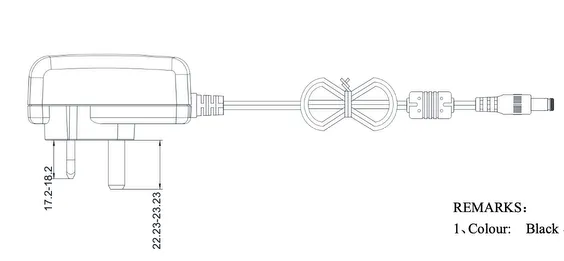 |
