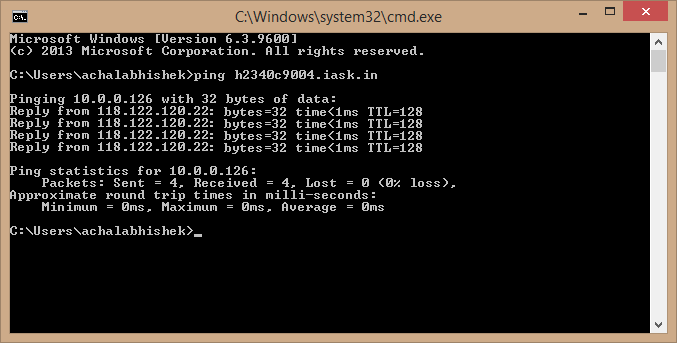
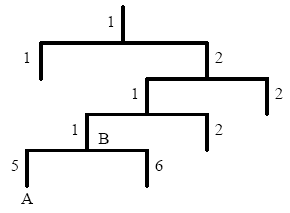

# InHand VG814 User's Manual V1.2

About The Document

Revision History

| **Version** | Data | Auther | Descripition |
| --- | --- | --- | --- |
| 1.0  | 2022-5-10 | Sun Zhandong | Creation of the document |
| 1.2 | 2022-8-15 | Sun Zhandong | Add Product picture into document |

**Declaration**

Thank you for choosing our product. Before using the product, read this manual carefully.

The contents of this manual cannot be copied or reproduced in any form without the written permission of InHand.

Due to continuous updating, InHand cannot promise that the contents are consistent with the actual product information and does not assume any disputes caused by the inconsistency of technical parameters. The information in this document is subject to change without notice. InHand reserves the right of final change and interpretation.

© 2020 InHand Networks. All rights reserved.

Conventions

| Symbol | Indication |
| --- | --- |
| > | Indicates a button name, for example, the OK button. |
| "" | Indicates a window name or menu name, for example, the pop-up window "New User". |
| >> | Separates a multi-level menu. For example, the multi-level menu File >> New >> Folder indicates the menu item "Folder" under the sub-menu "New", which is under the menu "File". |
|  | Reminds readers to be careful. Improper action may result in loss of data or device damage. |
|  | Notes contain detailed descriptions and helpful suggestions. |

Technical support:

Support: <support@inhandnetworks.com>

Inquiry: <info@inhandnetworks.com>

T: +1 (703) 348-2988

43671 Trade Center Place, Suite 100, Dulles, VA 20166

## Overview

InHand VG814 is a new-generation 4G in-vehicle gateway oriented at the Internet of Vehicles (IoV). It provides fast and safe networks for automobiles and transport service vehicles, meeting the requirements of police vehicles, emergency command vehicles, engineering vehicles, medical vehicles, and logistics vehicles for fast mobile networks. It is used with a cloud-based remote vehicle management platform to provide ubiquitous accessible networks and uninterrupted operation supervision for logistics management, asset tracking, mobile office, and government security.


 Application

## Hardware

### 2.1 Indicator Description

| VG814 Indicator | Status and Definition |
| --- | --- |
| System | Steady off --- The device is powered off.<br/>Steady red --- The system is starting.<br/>Steady blue --- IGT is not correctly installed.<br/>Blinking green --- The system operates properly.<br/>Blinking red --- The system is faulty.<br/>Blinking blue --- The system is being upgraded. |
| Cellular | Steady off --- The dialup function is disabled.<br/>Blinking green --- Dialup is in progress.<br/>Steady green --- Dialup succeeds.<br/>Blinking red --- Dialup fails (no module or SIM card is detected). |
| Signal | Steady off --- The current dialup card has no signal.<br/>Steady red --- The current dialup card has weak signals (signal strength: ≤ 9 asu).<br/>Steady blue --- The current dialup card has moderate signals (signal strength: 10–19 asu).<br/>Steady green --- The current dialup card has strong signals (signal strength: ≥ 20 asu). |
| GNSS | Steady off --- GNSS is disabled.<br/>Blinking green --- Positioning is in progress.<br/>Steady green --- Positioning is completed. |
| Wi-Fi 2.4G | Used as an AP:<br/>Steady off --- The AP is disabled.<br/>Blinking green --- The AP operates properly.<br/>Used as a STA:<br/>Steady off --- The STA is disabled, or no AP is associated.<br/>Steady green --- Connection fails due to a wrong password after an AP is associated.<br/>Blinking green --- An AP is associated. |
| Wi-Fi 5G | Used as an AP:<br/>Steady off --- The AP is disabled.<br/>Blinking blue --- The AP operates properly.<br/>Used as a STA:<br/>Steady off --- The STA is disabled, or no AP is associated.<br/>Steady blue --- Connection fails due to a wrong password after an AP is associated.<br/>Blinking blue --- An AP is associated. |

### 2.2 Restoring Default Settings via the Reset Button


To restore default settings via the Reset button, perform the following steps:

1. Power on the device and immediately press and hold the Reset button. After about 15s, only the System indicator is steady red.

2. When the System indicator turns off and becomes red again, immediately release the Reset button.

3. When the System indicator turns off, press the Reset button (ensure that it blinks red twice) and then release it. The device is restored to the default settings.

### 2.3 Panel interface introduction

### 2.3.1 VG814 Road（Bus） version


Antenna Panel

| Antenna and SIM | |
| --- | --- |
| GNSS Connector | FAKRA C-coded male |
| Wi-Fi Connector | FAKRA I-coded male |
| Cellular Connector | 4G version 2*FAKRA D-coded male<br/>5G version 4* FAKRA D-coded male |
| SIM | 2* Mini SIM 2FF |

| Interface Info | |
| --- | --- |
| Gigabit Ethernet | M12 X-Coded female |
| FMS | M12 A-Coded female |
| Power | M12 A-Coded male |
| ETX | 20 Pin industrial segment |
| AUX | 18 Pin industrial segment |


| PIN | 1 | 2 | 3 | 4 | 5 | 6 | 7 | 8 | 9 | 10 |
| :---: | :---: | :---: | :---: | :---: | :---: | :---: | :---: | :---: | :---: | :---: |
| Signal | GND | DO2 | DO4 | WHEELTICK | GND | RS232_RX1 | L- Channel | GND | CAN1_L | RS485_A |
| PIN | 11 | 12 | 13 | 14 | 15 | 16 | 17 | 18 | 19 | 20 |
| Signal | GND | DO3 | PPS | FWD | GND | RS232_TX1 | R- Channel | Mic In | CAN1_H | RS485_B |


| PIN | 1 | 2 | 3 | 4 | 5 | 6 | 7 | 8 | 9 |
| --- | --- | --- | --- | --- | --- | --- | --- | --- | --- |
| Signal | DI1 | DI2 | DI3 | DI4 | DI5 | DI6 | DI7 | DI8 | GND |
| PIN | 10 | 11 | 12 | 13 | 14 | 15 | 16 | 17 | 18 |
| Signal | GND | GND | GND | GND | DI9 | DO1 | DI10 | DI11 | GND |

### 2.3.2 VG814 Rail version


Antenna Panel

| Antenna and SIM | |
| --- | --- |
| GNSS Connector | TNC Female |
| Wi-Fi Connector | TNC Female |
| Cellular Connector | TNC Female |
| SIM | 2* Mini SIM 2FF |


Interface Panel

| Interface Info | |
| --- | --- |
| Gigabit Ethernet | M12 X-Coded female |
| FMS | M12 A-Coded female |
| Power | M12 A-Coded male |
| ETX | 20 Pin industrial segment |
| AUX | 18 Pin industrial segment |


| PIN | 1 | 2 | 3 | 4 | 5 | 6 | 7 | 8 | 9 | 10 |
| --- | --- | --- | --- | --- | --- | --- | --- | --- | --- | --- |
| Signal | GND | DO2 | DO4 | DO6 | GND | RS232_RX1 | RS232_RX2 | GND | CAN_L | RS485_A |
| PIN | 11 | 12 | 13 | 14 | 15 | 16 | 17 | 18 | 19 | 20 |
| Signal | GND | DO3 | DO5 | DO7 | GND | RS232_TX1 | RS232_TX2 | GND | CAN_H | RS485_B |


| PIN | 1 | 2 | 3 | 4 | 5 | 6 | 7 | 8 | 9 |
| --- | --- | --- | --- | --- | --- | --- | --- | --- | --- |
| Signal | DI1 | DI2 | DI3 | DI4 | DI5 | DI6 | DI7 | DI8 | GND |
| PIN | 10 | 11 | 12 | 13 | 14 | 15 | 16 | 17 | 18 |
| Signal | GND | GND | GND | GND | DI9 | DO1 | DI10 | DI11 | GND |

### 2.3.3 Power and FMS

VG814 Road / Bus version and Railway verion Power connector and FMS are same.


| PWR PIN | Signal |
| --- | --- |
| 1 | VIN+ |
| 2 | IGT（ACC） |
| 3 | VIN- |
| 4 | NC |

When testing the VG814 in the office, the red V+ wire and the white IGT wire shall be simultaneously connected to the positive pole of the DC power supply. The black V- wire shall be connected to the negative pole of the DC power supply.


| FMS PIN | Signal |
| --- | --- |
| 1 | CAN_H |
| 2 | CAN_L |
| 3 | GND |
| 4 | NC |

### Definition of Ethernet Interface

VG814 Ethernet  port definition.


In case M12 is implemented as cable end, cable connectors shall be of type inner

screw with male housing and male pin:


| M12 PINs | T568B Colour | Data |
| --- | --- | --- |
| 1 | white/orange stripe  | TxRx A +  |
| 2 | orange solid  | TxRx A -  |
| 3 | white/green stripe  | TxRx B + |
| 8 | blue solid  | TxRx C +   |
| 7 | white/blue stripe  | TxRx C - |
| 4 | green solid  | TxRx B - |
| 5 | white/brown stripe  | TxRx D + |
| 6 | brown solid  | TxRx D - |

## Default Settings

| No. | Function | Default Settings |
| --- | --- | --- |
| 1 | Dialup over the cellular network | − Enabled (The Cellular indicator is steady green after dialup succeeds.)<br/>By default, the dual-SIM function is disabled, and SIM1 is enabled. |
| 2 | Satellite positioning and inertial navigation service | − Enabled (The GNSS indicator is steady green after positioning succeeds.)<br/>− The inertial navigation function is enabled. |
| 3 | On-board diagnostics (OBD) | − Enabled<br/>− The CANbus baud rate is automatically detected.<br/>− The OBD protocol is automatically detected.<br/>− OBD data is automatically scanned. |
| 4 | Default settings of Wi-Fi | − The Wi-Fi 2.4G AP is enabled. The SSID starts with VG814-, followed by six digits.<br/>− The Wi-Fi 5G AP is enabled. The SSID starts with VG814-5G-, followed by six digits.<br/>− WPA2-PSK is used for authentication.<br/>− The password contains the last eight digits of the SN. |
| 5 | Default settings of Ethernet | − Four LAN ports are enabled.<br/>− The IP address is 192.168.2.1.<br/>− The subnet mask is 255.255.255.0.<br/>− The DHCP server is enabled. The IP address pool is 192.168.2.2–192.168.2.100, and IP addresses can be automatically allocated to downstream devices. |
| 6 | Network access control for the gateway | − HTTP and HTTPS are enabled, with the port numbers of 80 and 443 respectively.<br/>− Telnet is disabled.<br/>− SSH is disabled.<br/>− Access from the cellular network is allowed only over HTTPS. |
| 7 | Username and password | − adm/123456 (super administrator) |
| 8 | Power management | − shutdown-delay 30: The power-off delay is 30s.<br/>− standby-mode 1: The power-off function is enabled.<br/>− standby-check-interval 20 indicates the power check interval in standby mode.<br/>− standby-voltage 90: The standby threshold voltage is 9 V.<br/>− standby-resume-voltage 105: The threshold voltage for resuming normal operating in standby mode is 10.5 V. |
| 9 | IO | − Four digital output channels generate output at low level by default, and the pull-up resistor is disabled.<br/>− The pull-up resistor for six digital input channels is disabled. |
| 10 | Serial port | − RS232<br/>Baud rate: 9600<br/>Data bits: 8 bits<br/>Parity bit: none<br/>Stop bit: 1 bit<br/>− RS485<br/>Baud rate: 9600<br/>Data bits: 8 bits<br/>Parity bit: none<br/>Stop bit: 1 bit |

### Power ON

When testing the VG814 in the office, the red V+ wire and the white IGT wire shall be simultaneously connected to the positive pole of the DC power supply. The **black V-** wire shall be connected to the negative pole of the DC power supply.


VG814 power cable design diagram：

[附件: SCAB000339 Power Cable 9 VG814 M12 A Code 4PIN-EN.pdf](./attachments/TFRyisVs9_mw-DgG/SCAB000339 Power Cable 9 VG814 M12 A Code 4PIN-EN.pdf)

## Login and Network Access

### 4.1 Network Access via the Dialup Card

1. Insert the SIM card, connect the GNSS and cellular antennas, and connect the power supply and PC. Insert the diversity dialup antenna when the dialup card has poor signals.


VG814 railway version, appearance drawing of single cellular network module

| Note:<br/>Before inserting or removing the SIM card, unplug the power cable; otherwise, the operation will cause data loss or damage the gateway. |
| --- |

1. Assign an IP address to the PC, which is on the same network segment as the IP address of the gateway.

Method 1: Enable the PC to obtain an IP address automatically (recommended).

Method 2: Configure a fixed IP address on the same network segment as the gateway address for the PC.

Step: Select "Use the following IP address", enter any IP address in the range of 192.168.2.2 to 192.168.2.254 (different from the initial IP address 192.168.2.1 of the gateway), the subnet mask 255.255.255.0, and the default gateway address 192.168.2.1, and then click OK.


Obtain an IP address automatically Use a fixed IP address

1. Open the browser, enter the default IP address 192.168.2.1 of the gateway in the address bar, and press Enter.


1. Log in (if a blocking prompt is displayed, click "Advanced >> Continue").

Default Username adm Password 123456


1. Click "Network >> Cellular", check "Enable", and click Apply & Save. If the network connection status is "Connected" and an IP address has been allocated, the SIM card has been connected to the network.

(Set the APN parameters for a private-network card.)


1. Ping a common website in China with a ping detection tool. If there is data transmission, the device has been successfully connected to the network.


1. Enable the dual-SIM function when two SIM cards are used.


### 4.2 Network Access via Wi-Fi

1. Complete the connection shown in the following figure. Please connect the Wi-Fi antenna before logging in to the device.


1. Assign an IP address to the PC, which is on the same network segment as the IP address of the gateway. Log in to the web page. For details, see 4.1 Network Access via the Dialup Card.

2. Click " Network >> Wi-Fi" and select Wi-Fi 2.4G or Wi-Fi 5G as a client. Enter the name, authentication method, and key of an available wireless access point (AP). Click Apply & Save.


1. Click "Status". The current network status is "Connected", and an IP address is obtained successfully, indicating that the device has been successfully connected to the network via Wi-Fi.


## Network Management

In parameter settings, a green text box  indicates a mandatory item, and a pure white text box  indicates an optional item.

### Celluar Interface


| Parameter | Description |
| --- | --- |
| **Active SIM** | The SIM card currently in use. SIM1 or SIM2 |
| **IMEI Code** | The International Mobile Equipment Identity (IMEI) number of the device. |
| **IMSI Code** | The International Mobile Subscriber Identity (IMSI) number associated with the SIM card. |
| **ICCID Code** | The Integrated Circuit Card Identifier (ICCID) of the SIM card. |
| **Phone Number** | The phone number associated with the SIM card. |
| **Signal Level** | The strength of the cellular signal received by the device.ASU is an Arbitrary Strength Unit, which can be seen as a relative value of signal strength. The Level **0-31 signal value** (often called **ASU** in engineering menus) and **dBm** are linearly converted using this formula:**ASU = RSRP (dBm) + 14.** |
| **RSSI** | The Received Signal Strength Indicator (RSSI) of the signal strength. |
| **RSRP** | The Reference Signal Received Power (RSRP) of the signal strength. |
| **RSRQ** | The Reference Signal Received Quality (RSRQ) of the signal quality. |
| **SINR** | The Signal to Interference plus Noise Ratio (SINR) of the signal quality. |
| **Register Status** | Whether the device is registered to the network. |
| **Operator** | The name of the network operator. e.g. China Unicom |
| **Network Type** | The type of cellular network being used. |
| **PCI** | The Physical Cell Identity (PCI) of the cell within the network. |
| **Band** | The frequency band used for the cellular connection. |
| **LAC** | The Location Area Code (LAC) of the location area within the network. |
| **Cell ID** | The unique identifier for the cell. |
| **APN Status** | The status of the APN connection. |
| **IP Address** | The IP address assigned to the device. e.g. 10.51.158.84 |
| **Netmask** | The netmask of the network. |
| **Gateway** | The gateway IP address. e.g. 10.51.158.1 |
| **DNS** | The DNS server addresses. |
| **MTU** | The Maximum Transmission Unit (MTU) size of the data packet that can be transmitted. |
| **Connection Time** | The duration of the current connection. |

### **Signal Quality Reference**

| **Level (ASU Range)** | **RSRP (dBm)** | **Real-World Performance** |
| --- | --- | --- |
| 28–31 | -112 to -109 | Excellent (HD video) |
| 24–27 | -116 to -113 | Good (stable browsing) |
| 20–23 | -120 to -117 | Fair (basic web) |
| 16–19 | -124 to -121 | Weak (call drops) |
| 0–15 | -140 to -125 | Unusable (no service) |

### Cellular Network Configuration Guide

This guide will walk you through the process of configuring your VG814 gateway's cellular network settings. Follow these steps to ensure your device is correctly set up for cellular connectivity.


### Step 1: Accessing the Cellular Configuration Page

1. Log in to your VG814 gateway's web interface.
2. Navigate to the **Network** section in the left-hand menu.
3. Click on **Cellular** to access the cellular configuration settings.

### Step 2: General Cellular Settings
- **Enable**: Check this box to activate the cellular connection.
- **SIM1 / SIM2**: Select the SIM card you want to use for the cellular connection. You can choose either SIM1 or SIM2.
- **Profile**: Choose the profile you want to apply. The default setting is "Auto", which allows the device to automatically select the best settings.
- **Roaming**: Check this box if you want the device to enable roaming when necessary.
- **IMS**: Leave this unchecked unless you have specific requirements for IMS (IP Multimedia Subsystem) services.
- **PIN Code**: Enter the PIN code for your SIM card if required.
- **Network Type**: Select the type of network you want to connect to. The options include "Auto", "GSM", "3G", etc.
- **5GNR Mode**: Choose the mode for 5G connectivity. Options include "NSA/SA".
- **Connection Mode**: Select how you want the device to maintain its connection. "Always Online" ensures the device stays connected at all times.
- **Redial Interval**: Set the time interval (in seconds) for the device to attempt reconnecting if the connection is lost. The default is 10 seconds.
- **Detection Method**: Choose the method for detecting network availability. "none" is the default setting.
- **Show Advanced Options**: Uncheck this box unless you need to configure advanced settings.

### Step 3: Configuring Profiles

In the **Profile** section, you can set up different profiles for various network types:

- **Index**: The order of the profiles. Lower numbers have higher priority.
- **Network Type**: Select the type of network (e.g., GSM, 3G).
- **APN**: Enter the Access Point Name provided by your network operator.
- **Access Number**: Enter the access number if required by your network operator.
- **Auth Method**: Choose the authentication method. "Auto" allows the device to automatically select the best method.
- **Username**: Enter the username for the APN if required.
- **Password**: Enter the password for the APN if required.
- **Metered Connection**: Check this box if your connection is metered (i.e., limited by data usage).

### Step 4: Applying and Saving Settings

1. After configuring the settings, click on **Apply & Save** to apply the changes.
2. Click **Cancel** if you want to discard any changes made.

#### Additional Tips
- Ensure that the SIM card is properly inserted and activated by your network operator.
- Regularly check for updates to the firmware of your VG814 gateway to ensure optimal performance and security.

### Enabling Advanced Options


1. **Access Advanced Options**:
    - On the "Cellular" configuration page, check the "Show Advanced Options" checkbox. This will display additional advanced settings that allow for more detailed configuration.
2. **Configure Advanced Options**:
    - **Initial Commands**: In this field, you can enter initial commands that the device needs to execute upon startup. This is often used for specific network configurations or device initialization.
    - **RSSI Poll Interval**: Set the polling interval for the Received Signal Strength Indicator (RSSI). The default is 120 seconds, which you can adjust as needed. Setting it to 0 disables this feature.
    - **Dial Timeout**: Set the dial timeout duration. The default is 120 seconds, which you can adjust based on network conditions.
    - **Infinitely Dial Retry**: Check this option to allow the device to retry dialing indefinitely upon failure. This is useful for ensuring the device always attempts to connect to the network.
    - **Dual SIM Enable**: Check this option to enable dual SIM functionality, allowing the device to use two SIM cards for network connectivity.

### Enabling Dual SIM Functionality


1. **Enable Dual SIM**:
    - Check the "Dual SIM Enable" checkbox to activate the dual SIM feature. This allows the device to use two SIM cards for network connectivity.
2. **Configure Primary SIM**:
    - In the "Main SIM" dropdown menu, select the primary SIM card. The primary SIM card is typically used for the main network connection and data transmission.
3. **Configure Secondary SIM**:
    - If necessary, you can configure the secondary SIM to automatically switch when the primary SIM is unavailable. This provides additional network redundancy and stability.
4. **Set Dial Attempt Limit**:
    - In the "Max Number of Dial" field, set the maximum number of dial attempts the device should make. The default is 5 times, which you can adjust as needed.
5. **Set Minimum Connection Time**:
    - In the "Min Connected Time" field, set the minimum time the device must stay connected before attempting to redial. The default is 0, indicating this feature is disabled.

### Applying and Saving Settings

1. After completing all configurations, click the "Apply & Save" button to apply and save your settings.
2. Click the "Cancel" button to discard any unsaved changes.

#### Notes
- Ensure both of your SIM cards are activated and have sufficient credit.
- Regularly check and update your network configurations to ensure optimal network performance and compatibility.
- If you encounter any connection issues, contact your network service provider or technical support team.

### Network

### Bridge Port

A bridge port is intended to connect two different physical LANs over a bridge, to enable storage and forwarding across LANs at the link layer.

Method for modifying the IP address of a bridge port and bridge members:

1. Click "Network >> Bridge" and select "Bridge >> Modify".


1. Modify the IP address of the bridge port or bridge members. Among the bridge members, dot11radio1 and dot11radio2 are Wi-Fi 2.4G and Wi-Fi 5G ports respectively.


### VLAN Port

A virtual LAN (VLAN) comprises a group of logical devices and users. These devices and users are not limited by physical locations, but can be organized based on functions, departments, applications, and other factors. They communicate with each other as if they are on the same network segment, which contributes to the name of VLAN.

Method for adding a port of VLAN 2:

1. Click "Network >> VLAN >> Configure VLAN Parameters >> Add". Set the virtual IP address of the port of VLAN 2 and select the member port of VLAN 2 as required. Click Apply & Save.


1. Return to the VLAN list. The port of VLAN 2 has been successfully added.


Currently, VLAN ports of the device support two link types: access and trunk. An access port belongs to only one VLAN and is generally connected to a computer. A trunk port can be used for multiple VLANs and can receive messages from or send messages to multiple VLANs. It can be connected to a switch or a user's computer. You can select the link type as required on the "VLAN Trunk" page.


### ADSL Dialup (PPPoE)

Method for connecting the gateway to the PPPoE server:

1. Click "Network > > ADSL Dialup (PPPoE)", select the VG814 interface for connecting to the PPPoE server in the "Dial Pool" bar, and click Add.

2. Enter the user name, password, and pool ID of the PPPoE server in the "PPPoE List" bar. The pool ID must be the same as that in the "Dial Pool" bar. Click Add, and then click Apply & Save.


### Wi-Fi

The gateway can be used as an AP or a client. When it is used as an AP, other users can access the Internet through the gateway via Wi-Fi. When it is used as a client, the gateway connects to an AP for Internet access. The status bar shows the current Wi-Fi connection status of the gateway.


Method for providing network access services for wireless terminals when the gateway is used as an AP:

Click "Wi-Fi >> Wi-Fi 2.4 or Wi-Fi 5G" and select "AP" for "Station Role". Enter the SSID, authentication method, and key consistent with those of the wireless AP. Click Apply & Save.


Method for connecting to an AP for Internet access when VG814 is used as a client:

Select "Client", enter the Wi-Fi SSID and key, and click Apply & Save.


### Loopback Port

Method for adding multiple loopback ports:

Click "Network >> Loopback >> Multi-IP Settings", configure any IP address for the gateway, click Add, and then click Apply & Save.


### Layer 2 Switch

Check the network connection status of GE 1 to GE 4. LINK UP indicates that the network is connected. LINK DOWN indicates that the network is disconnected.


### OBD

OBD is used to collect vehicle condition data from CAN or LIN, obtain emission information, and perform fault diagnosis in real time. Vehicle condition data includes key parameters such as the fuel level, mileage, driving speed, engine speed, engine load, coolant temperature, and brake pressure. Emission information includes the volume of AdBlue, the operating and monitoring status of various exhaust post-processing sensors (such as the exhaust gas sensor and diesel particle filter) and catalysts, etc. In fault diagnosis, standard fault codes of vehicles and description information can be obtained in real time, so that vehicle maintenance personnel can learn the vehicle health status in time and locate the faults.

To collect vehicle data, the gateway is connected to the diagnostic port of the vehicle through the I/O port of the gateway over the OBD-II or J1939 cable. The cable accessories can be selected or customized during purchasing. For details about the access method, see Section 4.4 in the VG814 Quick Start Guide. After the gateway starts, the OBD service is automatically enabled to collect key vehicle condition data and fault code information.

| Note:<br/>The power supply and OBD cable of the gateway shall be installed when the vehicle is off. |
| --- |

The vehicle status information is displayed on the OBD status page.

OBD Status:

CAN Link Status (ERROR-ACTIVE indicates that the gateway has successfully connected to the diagnostic port of the vehicle. Other status indicates that the connection is abnormal or the diagnostic port of the vehicle is not identified.)

CAN Bitrate (In OBD, the CAN bitrate is automatically adapted, generally 250 kbps or 500 kbps.)

CAN Bind ("OBD" (default) or "Custom")

OBD Connection Status ("Disconnected", "Connecting", or "Connected")

OBD Protocol Type (OBD-II or J1939)


Scan OBD Data and Export OBD Report:

Click the Scan OBD Data button to generate a OBD data report containing detailed vehicle condition data and diagnostic information. Click the Export OBD Report button to save the generated OBD data report to the local storage.

OBD Data Stream: The real-time vehicle condition data is displayed.


OBD Ability:

Version of the OBD ability;

Type of the OBD protocol;

Vehicle identification number (VIN);

Valid variables and reference values that can be collected by the gateway.


### VPN Application

The VPN is intended to establish a private network on the public network for encrypted communication. A VPN gateway enables remote access by encrypting data packets and converting the destination address of data packets. The VPN can be realized by a server, hardware, or software, or in other ways. Compared with the traditional DDN private line or frame relay, the VPN provides a more secure and convenient remote access solution.

Common VPN application scenario: For example, an employee on a business trip accesses the enterprise's intranet. The employee connects to the enterprise's VPN server and then accesses the enterprise's intranet through the VPN server. Communication data between the VPN server and the client is encrypted and can be regarded as being transmitted on a dedicated data network. This ensures data security.

### IPsec

IPsec is a group of open network security protocols developed by IETF. At the IP layer, the data source authentication, data encryption, data integrity, and anti-replay functions are used to ensure the security of data transmission between communication parties on the Internet. This reduces the risk of leakage and eavesdropping, ensures the integrity and confidentiality of data, and ensures the security of service transmission for users.

Scenario: Data is transmitted between the subnet (192.168.1.0/24) of headquarters A and the subnet (172.16.1.0/24) of customer branch B through gateway A and gateway B. The transmission channels of gateway A and gateway B are encrypted over IPsec, to protect the security of data transmission between headquarters A and customer branch B.


Method for encrypting the transmission channels of gateway A and gateway B over IPsec:

Parameter settings:

| Gateway A | |  | Gateway B |
| --- | --- | --- | --- |
| Set IKEv1/v2 parameters | |  | Set IKEv1/v2 parameters |
| ID | Custom |  | ID | Custom |
| Encryption algorithm | AES128 |  | Encryption algorithm | Same as that of gateway A |
| Hash algorithm | SHA1 |  | Hash algorithm | |
| Diffie-Hellman key exchange | Group2 |  | Diffie-Hellman key exchange | |
| Lifecycle | 86400 |  | Lifecycle | |
| IPsec policy | |  | IPsec policy |
| Name | Custom |  | Name | Custom |
| Encapsulation | ESP |  | Encapsulation | Same as that of gateway A |
| Encryption algorithm | AES128 |  | Encryption algorithm | |
| Authentication method | SHA1 |  | Authentication method | |
| IPsec mode | Tunnel mode |  | IPsec mode | |
| IPsec tunnel configuration | |  | IPsec tunnel configuration |
| Peer address | Address where gateway B establishes the IPsec service |  | Peer address | Address where gateway A establishes the IPsec service |
| Interface | Interface for establishing the IPsec service |  | Interface | Interface for establishing the IPsec service |
| IKE version | IKE version used |  | IKE version | Same as that of gateway A |
| Authentication method | Shared key |  | Authentication method | |
| Local subnet | IP address of the subnet of gateway A |  | Local subnet | IP address of the subnet of gateway B |
| Peer subnet | IP address of the subnet of gateway B |  | Peer subnet | IP address of the subnet of gateway A |

Detailed configuration steps:

1. Configure gateway A and gateway B.

(1) Add IKE and IPsec policies, and click Apply & Save.

(2) Add IPsec tunnels and click Apply & Save.


1. Access the IPsec status page. The IPsec VPN is established successfully if the page is shown as below.


| Note:<br/>The IPsec profile does not need to be configured for establishing an IPsec VPN, but needs to be configured for establishing a DM VPN. |
| --- |

### GRE

The Generic Routing Encapsulation (GRE) protocol can be used to encapsulate datagrams of some network layer protocols, so that these encapsulated datagrams can be transmitted on the IPv4 network.

Scenario: GRE is enabled for VG814_A and VG814_B through the public network.


Method for enabling GRE for transmission channels of VG814_A and VG814_B:

1. Click "VPN >> GRE" and then click Add.


1. Set "Index" as required. Select "Point to Point" or "Subnet" for "Network Type". Set "Local Virtual IP" and "Peer Virtual IP", ensuring that they are on the same network segment. Enter the source and peer IP addresses or interfaces and the key. Click Apply & Save.


1. Set VG814_B in the same way. The virtual and peer IP addresses of VG814_B must correspond to those of VG814_A, and the key must be the same as that of VG814_A.

### 5.3.3 L2TP

The Layer 2 Tunneling Protocol (L2TP) is an industrial-standard Internet tunneling protocol used to encrypt network data streams.

Method for settings when the gateway is used as an L2TP client:

1. Click "VPN >> L2TP >> L2TP Client >> L2TP Class", enter a name of an L2TP class, and click Add.


1. Configure the pseudowire class: Enter a name of any pseudowire class. "L2TP Class" is the same as that on the "L2TP Class" page. Set "Source Interface" to the interface connecting to the server. Select L2TPV2 for "Protocol" and click Add.


1. Set L2TPV2 tunnel parameters: Enter the server's domain name or IP address for "L2TP Server". "Pseudowire Class" is the same as that on the "Pseudowire Class" page. Enter the user name and password created on the server. Set other parameters as required. Click Apply & Save.


1. After gateway A and gateway B are configured, access the L2TP status page to view the L2TP connection status.


### 5.3.4 OpenVPN

OpenVPN is realized based on the application-layer VPN of the OpenSSL library. It supports multiple authentication methods such as the certificate, key, and user name/password. Compared with the traditional VPN, it is simpler and easier to use.

Authentication methods:

| Authentication method | Operation on the web page |
| --- | --- |
| None | No authentication is required. |
| User name/password | Enter the user name and password created on the OpenVPN server, click "VPN >> Certificate Management", and import the CA certificate, public key, and private key for authentication. |
| Pre-shared key | Enter the pre-shared key created on the OpenVPN server. |
| Digital certificate | Click "VPN >> Certificate Management" and import the CA certificate, public key, and private key. |
| Digital certificate/user name/password | Enter the user name and password created on the OpenVPN server, click "VPN >> Certificate Management", and import the CA certificate, public key, and private key for authentication. |
| Digital certificate/TLS authentication | Enter the pre-shared key created on the OpenVPN server, click "VPN >> Certificate Management", and import the CA certificate, public key, and private key for authentication. |
| Digital certificate/TLS authentication/user name/password | Enter the pre-shared key, user name, and password created on the OpenVPN server, click "VPN >> Certificate Management", and import the CA certificate, public key, and private key for authentication. |

Method for settings when the gateway is connected to the OpenVPN server as a client:

OpenVPN can be configured manually, or OpenVPN configurations can be imported. In the following example, the authentication type is a digital certificate.

1. Set the OpenVPN parameters for the gateway as shown in the figure below, ensuring that the network parameters at both ends of the tunnel are consistent. Click Apply & Save.


1. Select a digital certificate for "Authentication Type", click "VPN >> Certificate Management", and import the CA certificate, public key, and private key.

2. Click Apply & Save. Return to the "Status" page and view the tunnel status.


### 5.3.5 Certificate Management

Certificates can be imported or exported on this page. Certificates are used for IPsec and OpenVPN services.

Method for importing a certificate:

Click "VPN >> Certificate Management >> Browse", select the certificate obtained from the certificate server, click Import XX Certificate, and then click Apply & Save.


If no local certificate is available, check "Enable SCEP (Simple Certificate Enrollment Protocol)" to apply for a certificate online.

Method for applying for a certificate for the gateway online:

1. Click "VPN >> Certificate Management". Check "Enable SCEP (Simple Certificate Enrollment Protocol)" and "Force to re-enroll". Enter the certificate protection key and confirm it. Enter the URL of the certificate server, the certificate name, and the FQDN. Click Apply & Save.

2. After the server issues the certificate, check the application status. If the application status is "Completion", the certificate application succeeds.


### Services

### DHCP (Automatic IP Address Allocation)

DHCP uses the client/server communication mode. The client submits a configuration application to the server, and the server returns the IP address assigned to the client to realize the dynamic configuration of the IP address.

The DHCP server and DHCP forwarding function are mutually exclusive.

Method for settings when the gateway is used as a DHCP server:

Click "Services >> DHCP >> DHCP Server". In the "DHCP Server" bar, check "Enable", select an interface, set the start and end IP addresses, click Add, and then click Apply & Save.


Method for settings when the gateway is used as a DHCP client:

Click "Services >> DHCP >> DHCP Client", select the gateway interface, and click Apply & Save.


Method for enabling DHCP forwarding for the gateway:

DHCP forwarding is also referred to as a DHCP relay agent. It can process and forward DHCP information between different subnets and physical network segments.

Click "Services >> DHCP >> DHCP Relay", check "Enable", enter the server address, select the gateway interface, and click Apply & Save.


### DNS

The domain name service (DNS) is a distributed network directory service mainly used for mutual conversion between a domain name and an IP address.

Method for enabling the DNS server for the gateway:

Click "Services >> DNS >> DNS Server", enter the address of the DNS server, and click Apply & Save.


Method for enabling DNS forwarding for the gateway:

As a DNS agent, the gateway forwards DNS request and response messages between the DNS client and the DNS server, and replaces the DNS client for domain name resolution.

If the DHCP service is enabled for the gateway, DNS forwarding is enabled by default and cannot be disabled.

Click "Services >> DNS >> DNS Relay", check "Enable DNS Relay", set the mapping between the domain name and the IP address, click Add, and then click Apply & Save. After the settings are completed, when a DNS client on the LAN requests a host domain name in the list, the DNS agent server returns the corresponding IP address to the client.


### DDNS

The dynamic domain name server (DDNS) maps the dynamic IP address of the gateway to a fixed DNS. Each time a user connects to the Internet, the client program transmits the dynamic IP address of the host to the server program on the server host through information transfer. The server program provides the DDNS service and realizes dynamic domain name resolution. In this way, you can access the Internet by entering the domain name, even if the IP address is changed.

Method for enabling the DDNS service for the gateway:

1. If the Custom service is used, set "Method Name" as required, select "Custom" for "Service Type", and enter the DDNS expression "<http://user> name:[password@ddns.oray.com/ph/update?hostname=](mailto:password@ddns.oray.com/ph/update?hostname=)host name" of the server for "Url". This expression is only for reference. The actual URL is provided by the service provider (usually available on the official website of the service provider). Click Add.

If a common domain name server other than the Custom service is used, set "Method Name" and "Service Type" as required, enter the user name, password, and host name obtained from the server, and click Add.

If "Disable" is selected, the DDNS service is not used.

1. Select the gateway interface, enter the name of the DDNS update method, click Add, and then click Apply & Save to apply the DDNS update method to the gateway interface.


1. Wait several minutes after the DDNS settings are applied and saved. Then ping the host name (domain name) of the domain name server to confirm the successful application of the DDNS service.




### SMS

The short message service (SMS) is enabled for gateway restart and manual dialup via SMS messages. Some gateways can receive alarm information in the SMS whitelist.

Method for controlling gateway restart and manual dialup via SMS messages

Click "Services >> SMS" and check "Enable". In the "SMS Access Control" bar, set "ID" as required, select "permit" for "Action", enter the phone number, and click Apply & Save. When you activate the dialup port via SMS, after the configuration is completed, you can send the reboot command to restart the gateway by using the mobile phone number, or send the cellular 1 ppp up/down command to make the gateway redial or interrupt the dialup.


### GPS

Position: You can view the current positioning information.


Method for enabling GPS for the gateway:

Click "Services >> Enable GPS", check "Enable", and click Apply & Save. By default, GPS is enabled for the gateway.


Method for forwarding GPS data to the server over IP when VG814 is used as a client:

Click "Services >> GPS IP Forwarding", check "Enable", select "Client" for "Type", enter the server address and port in the "Destination IP Address" bar, click Add, and then click Apply & Save.


Method for forwarding GPS data over IP when VG814 is used as a server:

Click "Services >> GPS IP Forwarding", check "Enable", select "Server" for "Type", and click Apply & Save.


Method for forwarding GPS data by VG814 through a serial port:

Click "Services >> GPS Serial Forwarding", check "Enable", and select a serial port type based on the data transmission port used. Ensure that the baud rate, data bits, parity bit, and stop bit are the same as the current settings. Click Apply & Save.


### QoS

Quality of service (QoS) is a network security mechanism that enables a network to provide better services for designated network communication by using various basic technologies. It is a technology for solving problems such as network delays and blocking.

Method for setting the egress maximum bandwidth for the gateway through QoS control:

Click "QoS >> Traffic Control >> Apply QoS", select the gateway interface, enter the egress maximum bandwidth, click Add, and then click Apply & Save.


Method for applying the ingress and egress policies for the gateway through QoS control:

1. Add a network link classifier. Click "QoS >> Traffic Control >> Classifier", check "Any Packets", set the source and destination addresses of the link, select transmit protocols for QoS control, and click Add.

2. Set transmission policies. Click "QoS >> Traffic Control >> Policy", enter a custom policy name for "Name", enter the classifier name for "Classifier", set the guaranteed bandwidth, maximum bandwidth, and policy priority, and click Add.

3. Click "QoS >> Traffic Control >> Apply QoS", select the gateway interface, enter the policy name for "Ingress Policy" and "Egress Policy", click Add, and then click Apply & Save.


### Traffic Control

Method for enabling traffic control for the gateway:

Click "Services >> Traffic Control", enable traffic control, set traffic control parameters, and click Apply & Save. After the settings are completed, the system generates an alarm, stops forwarding, or disables the interface when the traffic exceeds the limit according to the settings on this page.


### Firewall

### ACL

The access control list (ACL) is an access control technology based on packet filtering. It can filter the packets on the interface based on preset conditions and allow them to pass or discard them.

Common scenario: By default, all devices on the LAN (bridge 1) can access the Internet, except the device with the IP address of 192.168.2.100.

Method for setting VG814:

1. Click "Firewall >> ACL >> Add". Enter the ID and sequence number. A smaller sequence number indicates a higher priority. Select "deny" for "Action". Set "Source IP" to "192.168.2.100" and "Source Wildcard" to "0.0.0.0". Leave "Destination IP" empty, which indicates 0.0.0.0/0, that is, all IP addresses. Click Apply & Save.


1. Return to the ACL page, add the rule with the ID of 101 to the management rule of bridge 1, and click Add. Click Apply & Save.


### NAT

Network address translation (NAT) can be used when some hosts on a private network have been assigned with local IP addresses (that is, private IP addresses used only on the private network), but expect to communicate with hosts on the Internet (without encryption).

Common scenario: A user expects to access a camera on the LAN of the device through the public network to view the current driving conditions of the vehicle. The camera address is 192.168.2.100, and the open port 18000 provides video services.

1. Click "Firewall >> NAT", and select "DNAT" for "Action", and "Outside" for "Source Network". Select "IP PORT to IP PORT" or "INTERFACE PORT to IP PORT" for "Translation Type". The public IP address obtained through dial-up is not fixed, so "INTERFACE PORT to IP PORT" is more convenient. Select "TCP" for "Transmit Protocol" because video services are transmitted over TCP. Select "cellular 1" (dialup interface for the cellular network) for "Interface" and set "Port" to "20000". Set "IP Address" and "Port" under "Translated Address" to "192.168.200" and "18000" respectively. Click Apply & Save.

The gateway redirects the TCP service destined for port 20000 of the cellular 1 interface to the internal IP address 192.168.2.100 and port 18000, to enable access to the internal services.


### MAC-IP Binding

After MAC-IP binding, the PC can access the public network through the gateway only by using the IP address bound to the MAC address of the PC.

Method for binding the MAC address and IP address of a connected device:

1. Click "Firewall >> ACL" and select "Block" for "Default Filter Policy".


1. Click "Firewall >> MAC-IP Binding", check "Enable", enter the MAC address and IP address of the connected device, click Add, and click Apply & Save.


### Routing

### Static Routing

Set the destination network, subnet mask, and interface or gateway as required.


### Dynamic Routing

Scenario: Enable dynamic routing between two LANs for mutual communication between them. The topology is shown below.


#### RIP

The Routing Information Protocol (RIP) is a simple internal dynamic routing protocol mainly used on small-scale networks.

Method for enabling dynamic routing between VG814_A and VG814_B over RIP in the scenario:

1. Configure VG814_A. Click "Routing >> Dynamic Routing >> RIP", check "Enable", and configure VG814_A in the "Network" bar to announce the routing entry of VG814_A.


1. Configure VG814_B.


1. After the configuration is completed, check whether PC 1 can communicate with PC 2. If yes, the dynamic route is added successfully. The RIP route learned by VG814_B is shown in the figure below.


#### OSPF

The Open Shortest Path First (OSPF) protocol is a link-status-based internal gateway protocol mainly used on large-scale networks.

Method for enabling dynamic routing between VG814_A and VG814_B over OSPF in the scenario:

1. Configure VG814_A. Click "Routing >> Dynamic Routing >> OSPF", check "Enable", enter a valid IP address for "Router ID", and configure VG814_A in the "Network" bar to announce the routing entry of VG814_A.


1. Set parameters for VG814_B.


1. After the configuration is completed, check whether PC 1 can communicate with PC 2. If yes, the dynamic route is added successfully. The OSPF route learned by VG814_B is shown in the figure below.


#### BGP

Method for enabling dynamic routing between VG814_A and VG814_B over BGP in the scenario:

1. Configure VG814_A. Click "Routing >> Dynamic Routing >> BGP", check "Enable", and set "AS number" as required.


1. In the "Neighbor" bar, click Add, enter the IP address 192.168.1.2 of VG814_B, set "AS number" as required, and click Apply & Save.


1. Enter a valid IP address for "Router ID", configure VG814_A in the "Network" bar, and click Add, to announce the routing entry of VG814_A. Then click Apply & Save.


1. Set parameters for VG814_B. The parameters are the same as or corresponding to those of VG814_A.


1. After the configuration is completed, check whether PC 1 can communicate with PC 2. If yes, the dynamic route is added successfully. The BGP route learned by VG814_B is shown in the figure below.


### Link Backup

### SLA

The service level agreement (SLA) is used to detect whether the link between the gateway and the ISP fails.

Method for adding an SLA entry for the gateway:

Click "Link Backup >> SLA >> Add", enter the detected IP address for "Destination Address", set other parameters as required, click Add, and then click Apply & Save.

Timeout (ms) indicates the duration for determining a detection failure. Consecutive indicates the number of detection failures resulting in a link failure.


### Track

Currently, linkage is enabled between the track module and the following application modules: VRRP, static routing, and interface backup. If detection succeeds, the corresponding track entry is in the Positive state. If detection fails, the corresponding track entry is in the Negative state.

Method for adding a track entry for VG814:

Click "Link Backup >> Track >> Track", set "Index" as required, select "sla", "interface", or "vrrp" for "Type", set "SLA/VRRP ID" based on the ID in the SLA list, set "Negative Delay (s)" and "Positive Delay (s)" as required, click Add, and then click Apply & Save.

Negative Delay (s): In case of an abnormal state, switching can be delayed based on the delay setting (0 indicates immediate switching).

Positive Delay (s): When a failure is recovered, switching can be delayed based on the delay setting (0 indicates immediate switching).


Method for adding an IPsec track entry for VG814:

Click "Link Backup >> Track >> Track" and set "Index" as required. "positive-start/negative-stop" means starting the IPsec service when the track detection state is Positive and stopping the IPsec service when the track detection state is Negative.


### VRRP

Scenario: Multiple gateways are connected to a network at the same time. Gateway A acts as the host, and gateway B acts as a backup for gateway A. When gateway A fails, gateway B temporarily replaces gateway A as the host.

1. Networking requirement

Host A uses the VRRP backup group comprising gateway A and gateway B as its default gateway to access host B on the Internet.

Information of the VRRP backup group:

● The backup group ID is 1.

● The IP address of the virtual gateway of the backup group is 10.5.16.88.

● Gateway A acts as the master gateway.

● Gateway A acts as a backup gateway that can be preempted.

1. Networking diagram


| Gateway | Ethernet port connected to host A | IP address of the port connected to host A | Priority | Work mode |
| --- | --- | --- | --- | --- |
| VG814_A | bridge 1 | 10.5.16.80 | 110 | Preemption |
| VG814_B | bridge 1 | 10.5.16.81 | 100 | Preemption |

Method for settings when VG814_A acts as the master gateway and VG814_B as a backup gateway:

1. Configure VG814_A.

Click "Link Backup >> VRRP", set "Virtual Route ID" as required, select the gateway interface of VG814_A, enter the virtual IP address, set the interface priority to 110, and click Add.


In the navigation tree, click "Link Backup >> VRRP >> Status" and view the VRRP status.


1. Configure VG814_B.

Click "Link Backup >> VRRP", set the interface priority to 100, and click Add.


In the navigation tree, click "Link Backup >> VRRP >> Status" and view the VRRP status.


Under normal circumstances, VG814_A performs gateway functions. When VG814_A is shut down or fails, VG814_B performs gateway functions. The preemption mode is intended to enable VG814_A to continue to act as the master gateway after it recovers.

#### Interface Backup

Scenario: VG814 accesses the Internet via Wi-Fi, and an interface backup is created to enable VG814 to access the Internet through dial-up upon Wi-Fi failure. The topology is shown below.


Method for creating an interface backup for the gateway:

1. Enable VG814 to access the Internet via Wi-Fi.


1. Click "Link Backup >> SLA >> SLA >> Add" to add an ICMP detection entry. Set the IP address to the host address that can be detected over ICMP on the public or private network, for example, the public IP address 118.122.120.22. Click Apply & Save.


1. Click "Link Backup >> Track >> Track >> Add" to add a track entry. Select "sla" for "Type" and "dot11radio1" for "Interface", click Add, and then click Apply & Save.


1. Click "Link Backup >> Interface Backup >> Add", select "dot11radio1" for "Main Interface" and "cellular1" for "Backup Interface", and click Apply & Save.


1. Click "Routing >> Static Routing >> Add" and add two routes for network access through the "dot11radio1" and "cellular1" interfaces. A smaller value of "Distance" indicates a higher priority.


1. Trigger a Wi-Fi failure. According to the preset link detection policy, VG814 accesses the Internet through dial-up via the cellular port, and when Wi-Fi recovers, immediately switches to Wi-Fi for Internet access.

### Wizards

The "Wizards" module incorporates some common communication parameters, simplifying the operations.

New Cellular

After a common network interface card (NIC) is inserted, click "Wizards >> New Cellular >> Apply & Save" and access the status page to view the network connection status of the device. The device is connected to the network.


### New IPsec Tunnel

A dedicated virtual tunnel is established between the gateway and other devices or cloud platforms on the network.

Method for establishing an IPsec tunnel for the gateway:

Click "Wizards >> New IPsec Tunnel", set "Map Interface" to an interface ("bridge": bridge interface; "cellular": dialup interface; "dot11radio": Wi-Fi interface) for which you want to establish a tunnel, enter the peer IP address for "Destination Address", and enter the subnet IP addresses and masks at both ends of the tunnel. In Phase 1, enter the IDs at both ends of the tunnel and the connection key, and click Apply & Save.


### IPsec Experts' Configuration

This function is available only for specific users. To activate this function, contact the technical support personnel.

### New L2TPv2 Tunnel

Method for creating an L2TPv2 tunnel for the gateway:

Set the parameters of the L2TP server and the local/remote addresses. Click Apply & Save.


### New Port Mapping

Port mapping is to map a port of a host on the intranet to a port of a host on the extranet to provide corresponding services. When a user accesses the port on the extranet, the server automatically maps the request to the internal machine on the corresponding LAN.

Scenario: Users on the extranet cannot directly access a web server on the intranet. In this case, a port mapping can be created on the gateway so that the gateway automatically transfers the data to port 80 of the web server on the intranet when a user on the extranet accesses port 1000 via the cellular interface of the gateway.


Method for creating a port mapping for the gateway:

Click Wizards >> New Port Mapping". Enter the gateway interface for "Outside Interface", gateway port for "Service Port", IP address of the internal host for "Internal Address", and port ID of the internal host for "Internal Port". Click Apply & Save.


### Captive Portal


At present, the implementation of VG710/VG814 Captive Portal adopts a combination of WiFi dog open source project and Captive Portal application program. WiFidog mainly handles network level related content, such as intercepting any requests from unverified clients, whitelist processing, and port 80

HTTP request redirection, related iptables rules distribution, and billing related content (such as receiving and sending statistics).

The Captive Portal service has enabled an HTTP server, which mainly cooperates with Wifido to handle authentication related processing logic and configure access rules

(Based on time and traffic).


## 6. Edge computing and app functions

App function is an important part of the gateway to realize edge computing. The prerequisite for using this feature is to install the python SDK.

### 6.1 APP Status

This page is to upgrade the SDK of Python to view the edge computing environment.


### 6.1.2 APP Management

This page opens app management to manage Python apps.

If you need to link the gateway for development, you need to Enable the IDE debug function


Open the imported app, check it in the app list, and then click button Apply & Save button


For more guidance on app development, please refer to the development documentation. [https://www.inhandnetworks.com/downlist/cid-114](https://www.inhandnetworks.com/downlist/cid-114)

### 6.2 APP Docker function

Enable the docker function of the gateway.


Click the “Go to the docker management page” default username admin password 12345678

Enter the docker management page.


For container management tools, visit: [https://www.portainer.io/](https://www.portainer.io/)

### 6.3 Third party cloud platform

The gateway device connects to the cloud platform as a client to realize communication, and obtains data in real time according to the corresponding configuration of the gateway device to achieve the purpose of data interaction.

### 6.3.1 MQTT protocol connection to cloud platform

Step 1: click "APP>> third party cloud platform > >mqtt>> enable", select the address and port of the cloud platform server, click apply and save.

Which fields are sent to the platform by default, and the FlexAPI config can be config.


Step 2: click status. If the connection status is connected, the connection is successful.


Note: if the server needs authentication and encryption, it needs to be enabled correspondingly. Click "app>> third party cloud platform > >mqtt>> enable", select the address and port of the cloud platform server, and enable mqtt authentication and TLS encryption.


### 6.3.2 TCP protocol connection to cloud platform

Step 1: click "app>> third party cloud platform > >tcp>> enable", select the address and port of the cloud platform server, click apply and save


Step 2: click status. If the connection status is connected, the connection is successful.


### 6.4 Local MQTT Agent

The gateway device acts as an mqtt server to proxy messages. When users need messages, they use the mqtt client to subscribe to information. Python App or Doker program use gateway info, Subscribe to messages from the local mqtt agent.

Step 1: click "app>> local mqtt agent > > enable local / local &amp; Lan", click apply and save


Step 2: use mqtt client information: server address, port, authentication and other information

This document uses mqtt Take FX test tool as an example.


Step 3: click Connect. If the icon turns green, it means the connection is successful. Then subscribe to the information according to the topic document. The gateway will return data in JSON format. For example, subscribe to cellular information


### 6.5 REST API

In addition to using mqtt and TCP to obtain data, users can also use rest APIs to call data according to interface documents

Step 1: click "app>>rest api>> enable", select the address and port of the cloud platform server, click apply and save


Step 2: use tools such as postman according to the interface document to call the interface to obtain data.

1. Fill in the URL, token, etc. in the interface document, and note whether it is a get or post request;

2. Click send;

3. Finally, the gateway device will return the corresponding data results in JSON format;


### 6.6 Azure IoT Edge

Click "APP>>Azure IOT edge>> enable", click apply and save


Note: this function item depends on docker. The docker function should be opened before opening

### 6.7 User Data

Step 1: click "APP>> User Data> > User Data Management", then enter the name and corresponding value, click add, and finally click apply and save.


Step 2: click "status". If the data exists in the status bar, it means that the addition is successful.


## 7. Connecting the Gateway to a Cloud Platform

1. Click "Administration >> Device Manager >> Device Manager", check "Device Manager Enable", select the server address of the cloud platform, enter the registered account and license plate number of the cloud platform, and click Apply & Save.


1. Click "Status". "Connected" indicates that the gateway is successfully connected to the cloud platform.

## 8. Industrial Ports (Serial Ports)

The industrial ports of VG814 include RS232 serial ports, RS485 serial ports, and IO ports.


VG814 Rail version

| PIN | 1 | 2 | 3 | 4 | 5 | 6 | 7 | 8 | 9 | 10 |
| --- | --- | --- | --- | --- | --- | --- | --- | --- | --- | --- |
| Signal | GND | DO2 | DO4 | DO6 | GND | RS232_RX1 | RS232_RX2 | GND | CAN_L | RS485_A |
| PIN | 11 | 12 | 13 | 14 | 15 | 16 | 17 | 18 | 19 | 20 |
| Signal | GND | DO3 | DO5 | DO7 | GND | RS232_TX1 | RS232_TX2 | GND | CAN_H | RS485_B |

VG814 Road version

| PIN | 1 | 2 | 3 | 4 | 5 | 6 | 7 | 8 | 9 | 10 |
| :---: | :---: | :---: | :---: | :---: | :---: | :---: | :---: | :---: | :---: | :---: |
| Signal | GND | DO2 | DO4 | WHEEL TICK* | GND | RS232_RX1 | L-Channel | GND | CAN0_L | RS485_B |
| PIN | 11 | 12 | 13 | 14 | 15 | 16 | 17 | 18 | 19 | 20 |
| Signal | GND | DO3 | PPS | FWD* | GND | RS232_TX1 | R-Channel | Mic In | CAN0_H | RS485_A |

### 8.1 DTU

1. Method for setting web pages when the gateway is used as a DTU:

Enable DTU 1 (RS232-1) DTU 2 (RS232-2) or DTU 3 (RS-485). Set the connection parameters of the gateway interface and industrial device.

1. Communication is available only when the parameters at both ends of the network link are consistent.


1. Set the IP address and transmit protocol (TCP or UDP) of the server.


1. Check that the gateway-connected PC and the server exchange data through DTU.


### 8.2 IO Ports

The AUX port has 11 digital inputs，ETX port has 7 digital inputs. The digital parameters correspond to two states: HIGH (1) and LOW (0).


VG814 railway version:

Power input range: DC 9V ~ 36V.

DI: at present, this version takes the power supply voltage limit as the maximum voltage, that is, the input voltage range is DC 0V ~ 36V; It is determined as low (L) below 5V and high (H) above 7.2V.

DO: at present, this version takes the power supply voltage limit as the maximum voltage, that is, the maximum input voltage is DC 36V; The typical input current can reach 450mA.

Supplement:

1.The above DIis the voltage range given for the external wet contact. At this time, the internal pull-up of VG814 cannot be used.

1. When the di external is connected to the dry contact, the vg814 can provide 12V pull-up level internally, and the pull-up resistance is 20K Ω.

2. When do is used as open drain output, the typical perfusion current can reach 450mA.

3. When do pull-up is used as output, it can output high-level signal. The open circuit test voltage is 12V, and the pull-up resistance is 20K Ω. It has no load capacity.

VG814 vehicle version

Power input range: DC 9V ~ 48V.

DI: at present, this version takes the power supply voltage limit as the maximum voltage, that is, the input voltage range is DC 0V ~ 48V; It is determined as low below 1V and high above 2.7V.

DO: at present, this version takes the power supply voltage limit as the maximum voltage, that is, the maximum input voltage is DC 48V; The typical input current can reach 450mA.

Supplement:

1. The above DI is the voltage range given for the external wet contact. At this time, the internal pull-up of vg814 cannot be used.

2. When Di external dry contact is connected, vg814 can provide the same pull-up level as the power supply voltage internally, and the pull-up resistance is 20K Ω.

3. When do is used as open drain output, the typical perfusion current can reach 450mA.

4. When do pull-up is used as output, it can output high-level signal. The open circuit test voltage is the same as the power supply voltage. The pull-up resistance is 20K Ω and has no load capacity.

### 8.2.1 IO link mode

Wet node link mode, need config : DI1 disable pull up use CLI. Off is 0, On is 1.


Dry node link mode, need config : DI1 pull up use CLI. On is 1, Off is 0.


Dry node link mode, need config : DO1 pull up use CLI. On is 1, Off is 0.


## 9. System Management

### 9.1 System

Click "Administration >> System >> Status" and view the current system and network status of the device.


Click "Basic Setup" and modify the system language and device name.


### 9.2 System Time

To ensure the coordination between the device and other devices, set the system time accurately.

Manual time synchronization: Click "Administration >> System Time >> System Time >> Sync Time" to ensure consistency between the gateway time and host time.


Alternatively, click "Administration >> System >> Status" to synchronize the time.


Automatic time synchronization: Click "Administration >> System Time >> SNTP Client or NTP Server" and check "Enable" to synchronize the time between the gateway and the SNTP or NTP server.

After NTP is enabled, the gateway can synchronize time for all devices on the network.


### 9.3 Management Services

When the gateway requires the HTTP, HTTPS, TELNET, and SSH functions, click "Administration >> Management Services", enable the services, and click Apply & Save.


### 9.4 User Management

Click "Administration >> User Management" and create users, modify passwords, or delete users on the user management page.

Superuser and common user:

● Superuser: By default, only one superuser is automatically created by the system, with the username of adm and the default password of 123456. It has full access rights for the gateway.

● Common user: A common user is created by the superuser. It can view or modify gateway configurations.

| Note: You cannot delete the superuser (adm) or modify its username, but can modify its password. |
| --- |

### 9.5 AAA

Authentication, authorization, and accounting (AAA) is a security management mechanism for access control in network security, which provides three security services: authentication, authorization, and accounting.

It provides modular methods for the following services:

● Authentication: Verify whether a user has the right for network access.

● Authorization: Authorize a user to use specific services.

● Accounting: Record network resource usage of a user.

You can use only one or two of the security services provided by AAA. For example, if a company only expects to authenticate employees when they access specific resources, the network administrator only needs to configure the authentication server. However, if the company expects to record the network usage of employees, the accounting server must be configured.

AAA usually works in the client/server structure, which is highly scalable and is convenient for centralized management of user information, as shown in the figure below.


|  Note: Radius, Tacacs+, and LDAP indicate authentication and authorization servers. Local indicates the local user name and password of the gateway. |
| --- |

### 9.5.1 Radius

The Remote Authentication Dial In User Service (Radius) is a distributed information exchange protocol based on the client/server structure. It protects the network from unauthorized access, and is usually used in various network environments that require high security and allow remote user access.

Method for enabling the Radius server for the gateway:

Click "Administration >> AAA >> Radius". In "Server List", enter the server address (domain name/IP address), port ID, and authentication key, click Add, and then click Apply & Save.


### 9.5.2 Tacacs+

The Terminal Access Controller Access Control System + (Tacacs+) protocol is similar to the Radius protocol. It uses the client/server mode for communication between the network access server (NAS) and the Tacacs+ server. However, Tacacs+ works based on TCP, and Radius works based on UDP.

The Tacacs+ protocol is mainly used for AAA of end users and Point-to-Point Protocol (PPP) and virtual private dial-up network (VPDN) access users. Its typical application is to authenticate, authorize, and perform accounting for an end user who needs to log in to the device for operations. As a Tacacs+ client, the device sends the user name and password to the Tacacs+ server for verification. After authentication and authorization, the user can log in to the device for operations.

Method for enabling the Tacacs+ server for the gateway:

Click "Administration >> AAA >> Tacacs+". In "Server List", enter the server address (domain name/IP address), port ID, and authentication key, click Add, and then click Apply & Save.


### 9.5.3 LDAP

The main advantage of the Lightweight Directory Access Protocol (LDAP) lies in its quick response to users' search operations. For example, massive user authentication operations may be performed concurrently. If a database is used, because the database is divided into various tables, to meet this simple authentication requirement, the database must be searched each time, along with synthesis and filtering. This results in low efficiency. LDAP is equivalent to one table, and requires only the user name and password, with some other parameters, which is quite simple. It can meet the authentication requirement regarding the efficiency and structure.

Method for enabling the LDAP server for the gateway:

Click "Administration >> AAA >> LDAP". In "Server List", enter any name for "Name", enter the server address (domain name/IP address) and port ID, and enter the base DN obtained from the server. Set the user name and password for accessing the server. Select "None", "SSL", or "StartTLS" for "Security". Click Add, and then click Apply & Save.


### 9.5.4 AAA Authentication

AAA authentication methods:

● No authentication (none): No validity check is performed. Generally, this method is not used.

● Local authentication (local): User information is configured on the NAS. Local authentication is fast, which can reduce the operational costs, but the information storage amount is limited by hardware.

● Remote authentication: User information is configured on the authentication server. Remote authentication is supported over Radius, Tacacs+, and LDAP.

AAA authorization methods:

● No authorization (none): No authorization is performed for users.

● Local authorization (local): Authorization is performed based on the properties configured by the NAS for the local account.

● Tacacs+ authorization: Users are authorized by the Tacacs+ server.

● Authorization after successful Radius authentication: Authorization is bound to authentication, and cannot be performed independently over Radius.

● LDAP authorization

Method for enabling authentication and authorization for the gateway:

Click "Administration >> AAA >> AAA Settings". 1, 2, and 3 are corresponding to Radius, Tacacs, ad LDAP respectively. Authentication entries 1, 2, and 3 must be corresponding to authorization entries 1, 2, and 3 respectively. When all of radius, tacacs+, and local are set, the priority sequence is as follows: 1 > 2 > 3.


### 9.6 Configuration Management

Method for importing configurations: Click "Administration >> Config Management >> Config Management >> Browse", select a configuration file, and click Import to import the configuration file to the gateway.

Method for backing up current running configurations to the PC (common): Click Backup running-config.

Method for backing up the startup file to the PC: Click Backup startup-config.

Method for restoring default configurations: Click Restore default configuration and then click OK.


### 9.7 Device Manager of InHand Cloud

Click "Administration >>Device Manger>>Device Manger" config InHand Cloud service.

### 9.7.1 Config DeviceManger

Device ManagerWith a visualization user interface and simple operation steps, the Device Manager platform enables you to manage and monitor InHand’s hardware devices, such as routers and gateways with convenience. It can quickly integrate devices and manage them with just a few clicks. The cloud deployment delivers easy-to-use experience, allowing you to focus on your core business and empowering your growth.

Step1: Register a user Global site [https://iot.inhandnetworks.com](https://iot.inhandnetworks.com/user/login)


Step2:

- Config Service Type "Device Manager"
- Server Address "iot.inhandnetworks.com" If you have already privatized the deployed Device Manager Cloud, fill in the private deployment server IP or domain name. Server Typy select "Coustomer".
- Secure Channel , After checking, it will be transmitted with SSL encryption.
- Registered Account : Use step 1 registed account email address.
- Site name and Asset Number customer defined.
- Make sure the VG710 is connected to the Internet.


Step3:

- Login Device Manager cloud.
- Check Gateways, VG710 will auto login server.
- For more usage reference manuals:


- For more usage reference manual.


### 9.7.1 InConnect Service

The InConnect is a simple “plug & play” service which builds secure remote networks for your machines (IPCs, servers, IP cameras, PLCs, HMIs, RTUs, controllers, etc.). Featuring user-friendly interfaces and simple operation, the SaaS (Software as a Service) based solution enables you to access your devices anytime from anywhere, and stay connected with your business and with the world – especially in these challenging times when normal working routines have been disrupted. Support VPN networking in the way of subnet to subnet.

Step1: Register a user Global site [hthttps://ics.inhandnetworks.com](https://ics.inhandnetworks.com/user/register)

Step2:

- Config Service Type "InConnect Service"
- Server Address "ics.inhandnetworks.com" If you have already privatized the deployed Device Manager Cloud, fill in the private deployment server IP or domain name. Server Typy select "Coustomer".
- Secure Channel , After checking, it will be transmitted with SSL encryption.
- Registered Account : Use step 1 registed account email address.
- Site name and Asset Number customer defined.
- Make sure the VG710 is connected to the Internet.


Step3:

- Login InConnect service.
- Check Gateways, VG710 will auto login server.
- Add VG710 SN to Server:


- For more usage reference manuals:


### 9.7.1 Smart Fleet Service

InHand Smart Fleet Cloud Platform, referred to as Smart Fleet, is a business platform that provides enterprise-level vehicle monitoring and management services for enterprise customers. Smart Fleet can help you manage vehicles intelligently and efficiently, break down vehicle data barriers, and realize multi-data joint analysis, vehicle Full life cycle management and control, intelligent vehicle operation and maintenance, help the informatization construction and digital transformation of engineering vehicles.

Smart Fleet can connect multiple vehicles to the same network. You can centrally monitor and manage vehicles, issue configurations, and upgrade firmware in a unified manner.

Smart Fleet helps users to quickly build an IoT network and master vehicle operation data in real time, allowing you to easily implement centralized monitoring and management of vehicles and gateways through the cloud platform. Effectively solve the problems of data isolation, collaboration bottlenecks, and lack of management.

Step1: Register a user Global site [https://smartfleet.cloud](https://smartfleet.cloud/user/login)

Step2:

- Config Service Type "InVehicle Service"
- Server Address "smartfleet.cloud" If you have already privatized the deployed Device Manager Cloud, fill in the private deployment server IP or domain name. Server Typy select "Coustomer".
- Secure Channel , After checking, it will be transmitted with SSL encryption.
- Registered Account : Use step 1 registed account email address
- License Plate Number is  required.
- Asset Number Group ID is customer defined.
- Other interface information of the gateway can be reported to the platform in seconds.
- Make sure the VG710 is connected to the Internet.


Step3:

- Login InConnect service.
- Check Gateways, VG710 will auto login server.


### 9.8 SNMP

### 9.8.1 SNMP

Currently, the SNMP Agent of VG814 supports SNMPv1, SNMPv2c, and SNMPv3.

● SNMPv1 and SNMPv2c use community names for authentication.

● SNMPv3 uses user names and passwords for authentication.

Method for enabling SNMP for VG814:

Click "Administration >> SNMP >> SNMP", check "Enable", select "v1c" for "v2c" for "SNMP Version", and click Apply & Save.


If v3c is selected, the corresponding user and user group need to be configured. Enter any name for "Groupname", select a security level, and click Add. Enter any name for "Username", select the new group name for "Groupname", set "Authentication" and "Authentication password", click Add, and then click Apply & Save.


### 9.8.2 SnmpTrap (Alarm)

The SNMP trap is a type of entrance. When this entrance is reached, the SNMP managed devices actively notify the NMS, instead of waiting for the polling of NMS. On an SNMP-enabled network, the agents on managed devices can report errors to the NMS anytime, without the need of waiting for the polling of NMS. The errors are reported to the NMS through traps.

Method for enabling SnmpTrap for the gateway:

Click "Administration >> NMP >> SnmpTrap". Enter the IP address of the NMS. Enter the corresponding group name when v1c or v2c is selected, or the corresponding user name when v3c is selected, ensuring that the name consists of 1–32 characters. By default, the UDP port ID ranges from 1 to 65535.


### 9.8.3 SnmpMibs

In SNMP messages, management variables are used to describe the managed objects on the device. To uniquely identify the managed objects on the device, SNMP uses a hierarchical naming scheme to identify the managed objects The entire hierarchical structure is like a tree. The nodes of the tree represent the managed objects, as shown in the figure below. Each node can be uniquely identified by a path starting from the root.



The management information base (MIB) is used to describe the hierarchical structure of the tree. It is a set of standard variable definitions for the monitored network device. In the above figure, managed object B can be uniquely determined based on a string of numbers {1.2.1.1}, which form the object identifier (OID) of the managed object.

Method for downloading a SnmpMibs file to the PC via the gateway:

Click "Administration >> SNMP >> SnmpMibs", select a folder, and click download to download it to the PC. Find the folder on the PC and import it to the NMS.


### 9.10 Alarm

The alarm function enables users to identify gateway abnormalities in time. When an abnormality occurs, the gateway reports an alarm. You can select system-defined abnormalities and choose an appropriate notification way to obtain the abnormality information. All alarms are recorded in alarm logs so that users can identify abnormalities and perform troubleshooting in time.

Alarm states:

● Raise: indicates that the alarm has been generated but not been confirmed.

● Confirm: indicates that the alarm cannot be solved currently.

● All: indicates all generated alarms.

Alarm levels:

● EMERG: The device undergoes a serious error that causes a system reboot.

● CRIT: The device undergoes an unrecoverable error.

● WARN: The device undergoes an error that affects system functions.

● NOTICE: The device undergoes an error that affects system performance.

● INFO: A normal event occurs.

(1) Status: Click "Administration >> Alarm >> Status" and view all alarms generated in the system since power-on.


(2) Alarm Input: Select an alarm type as required. When this item is abnormal, an alarm is generated.

(3) Alarm Output: When an alarm is generated, the system automatically sends the alarm content to the destination email address via an email. This function is not available for common users. Set the sender mail address in "Email Alarm" and the receiver mail address in "Mail Address". "Mail Server IP/Name" can be found on the browser (for example, enter "smtp.exmail.qq.com" if you use a Tencent Enterprise mailbox.)


(4) Alarm Map: Alarms can be received in two ways: command line interface (CLI) (console interface) and Email. Some devices support SMS alarms. To enable email-based mapping, enable and set the email address on the "Alarm Output" page.

### 9.11 System Logs

Method for viewing system logs:

Click "Administration >> System Log" to view system logs.

This page also provides the following operations: "Clear Log", "Download Log File", "Download Diagnose Data", "Clear History Log", and "Download History Log". History logs are those stored for extended time as specified on the "System Log" page.

The diagnose data file is encrypted, because the gateway configuration information is downloaded together with the diagnose data. You need to decrypt the file with the decryption tool provided by InHand.


The storage capacity of the gateway is limited (512 KB by default). To save all the logs, you need to use a remote log server (for example, [Kiwi Syslog Daemon](#_Kiwi_Syslog_Ademon)). Set the address and port of the log server on the web page. The gateway uploads all the system logs to the remote log server.


### 9.12 System Upgrade

Click "Administration >> Upgrade >> Browse", select an upgrade file, and click Upgrade. Restart the system after the upgrade is completed.


Firmware degradation:

Downgrading from V1.2.X to 1.2.1.r300xx (X is greater than 2).

```plain
//Telnet or SSH login VG814
VG814 login: adm
Password: 


                     Welcome to INOS console

                Copyright (c)2001-2024 InHand Networks Co., Ltd.
                     http://www.inhandnetworks.com
--------------------------------------------------------------------------------
Model                : 814
Serial Number        : VF8102041000762
Firmware Version     : V1.2.5
Bootloader Version   : 2012.07.r238
--------------------------------------------------------------------------------
VG814#enable
VG814#fwsign disable
VG814#verify disable  //Turn off version validation
VG814#
```

Log in to the Web page again to upload firmware.

| Note:<br/>During the software upgrade, do not perform any operation on the web page; otherwise, the software upgrade may be interrupted. |
| --- |

### 9.13 System Reboot

Click "Administration >> Reboot >> OK to reboot the system.


## 10. Diagnostic Tools

Diagnostic tools are used to detect the network connection of the gateway: Ping, Traceroute, Tcpdump, and Link Speed Test.

Ping: It is used to detect the external network connection of the device. Enter any common website in China for "Host" and click "Ping". If data transmission occurs, the network is connected properly.


Traceroute: Enter the IP address of the peer host and click "Trace" to detect the route connection.


Tcpdump:

Select an interface ("any" or "bridge1"), set "Capture Number", and click Start Capture >> Stop Capture >> Download Capture File.


Download wireshark from the browser to open the downloaded file and analyze the messages to understand the network connection of the interface.


Link Speed Test: Upload and download files to test the link speed.


## 11. Hardware installation

The installation position is recommended to be installed in the air conditioning duct of the vehicle：


## 12. More reference documents

[https://github.com/inhandnet/InVehicle-Docs](https://github.com/inhandnet/InVehicle-Docs)

For 3rd party platform integration:

FlexAPI_Reference_for_3rd_party_platform_v1.0.8.pdf FlexAPI_Reference_for_3rd_party_platform_TCP_version_v1.0.2.pdf For LAN Edge computing application: FlexAPI_Reference_for_LAN_application_v1.0.8.pdf FlexAPI_Reference_for_LAN_application_REST_API_Version_v1.0.5.pdf

#

#
