# Vehicle Telematics 200 User Manual V1.0

About The Document

Revision History

| Version | Data | Auther | Descripition |
| :--- | :--- | :--- | :--- |
| 1.0  | 2022-12-10 | Sun Zhandong | Creation of the document |

## Chapter I Product Introduction and Preparation

## 1. Introduction

### 1.1 Overview

The VT200 series vehicle tracking gateway is an asset tracking product that features cost-effectiveness, rich interfaces and strong performance. It is suitable for industries such as logistics and transportation, engineering vehicle monitoring and so on. It offers precise positioning with GNSS, tracking and monitoring the status, history track, geofencing, abnormity alarm and other functions of vehicles and drivers, combined with the vehicle network cloud platform, can realize remote vehicle management, asset tracking, preventive maintenance, helping fleet operators save costs and improve efficiency. The device provides sub-models that support wireless network access of various speeds such as LTE CatM1, Cat1, Cat4, etc.

## 2. Start to use VT200

### 2.1 Check out some necessary accessories

Different accessories need to be ordered when purchasing the product. You can also purchase it yourself.

In order to help customers test and log in the equipment in the office, InHand provides test kits: 12V adapter or AC to DC 12V power supply, RS232 to USB as shown in the table below.

| Product Name | MLFB |  |
| :--- | :--- | --- |
| 20PIN All-in-one Test Cable  | SCAB000381 |  |
| DC 5.5*2.1mm Female Connector | ECON000047 |  |
| Power adapter 12V/2A | APWR000122/121 |  |

### 2.2 About VT200 interface

### 2.2.1 RS232 Serial Port

VT200's RS232 serial port is used for data transfer only, not for configuring the device. Configuration device requires USB-Type C. Connect the USB-Type C of the VT200 can configuration the device like RS232 serial port.

### 2.2.2 Digital Input (DI)

The DI can detect the switching value, such as whether the button is pressed or bounced, and whether the switch is on or off. The VT200 provides configurable pull-up. The DI has a default 10kΩ resistor pulled down to GND. When the DI is configured to pull up, there is a 20kΩ resistor pull up to the power supply voltage. When using DI, it is necessary to distinguish between pull-up and no pull-up.

When the DI has no pull-up power supply, the external circuit is connected as follows:

When the DI has a pull-up power supply, the external circuit is connected as follows:

### 2.2.3 Digital Output (DO)

The DO can output DC voltage. The DO is an open-leakage output that supports a current of 300mA and usually works with relays.

### 2.2.4 Analog Input (AI)

The AI can detect DC voltage, and customers can directly access the analog quantity of voltage. External circuit is connected as follows:

### 2.2.5 1-Wire

The 1-Wire is usually used for small communication equipment, such as digital thermometers and iButton devices. Before use, the customer needs to connect the DQ pin (signal line) of the 1-Wire device to the VT200 PIN13, and connect the VDD and GND pins of the 1-Wire device to the GND of the VT200. The sensor is the DS18B20 type. The following picture shows the water temperature detection wires of the 32 digital temperature sensor probe.

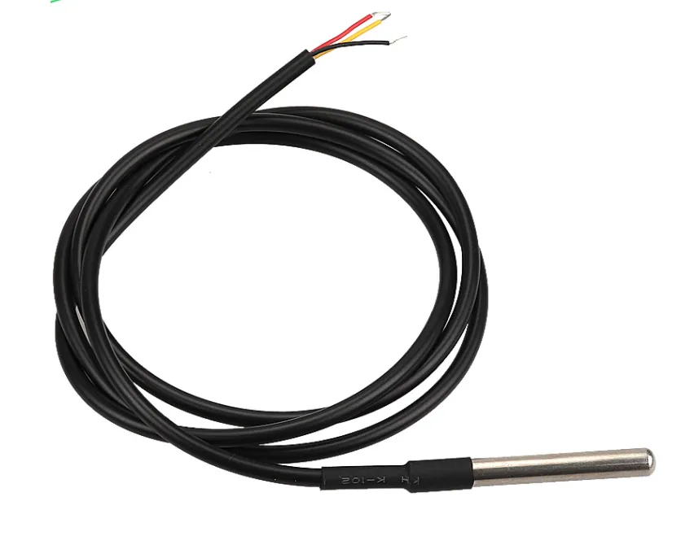

### 2.2.6 Ignition Sense

IGT(Ignition sense): IGT is used to connect to the Ignition switch of the vehicle. The VT200 can detect whether the connected vehicle is ignited. When using the 20PIN cable for testing, connect the IGT cable and V+ cables to DC power supply.

## 3. Start the VT200

After the customer completes the installation according to the above steps, the device can be started for debugging. The condition of the device can be told through the status indicator. To avoid consumption of battery power during transportation, the device is under transportation mode in the factory state. The VT200 needs to be activated by external power supply or the vehicle diagnostic interface.

### 3.1  Steps for usage

Steps:

1. Insert the 20PIN female head of P1 into the VT200;
2. Connect PIN20 CONN-X-V- and  PIN10 CONN-X-V+ to the negative and positive poles of the power adapter respectively. PIN9 CONN-X-IGT and V + are both connected to the positive side of the power supply;

1. Conneted USB-Type C to Debug and to configuation VT200. Download the configuration tool and connect the computer and VT200 with USB-Type C. See "Chapter II Login and Device Configuration" to configuration.

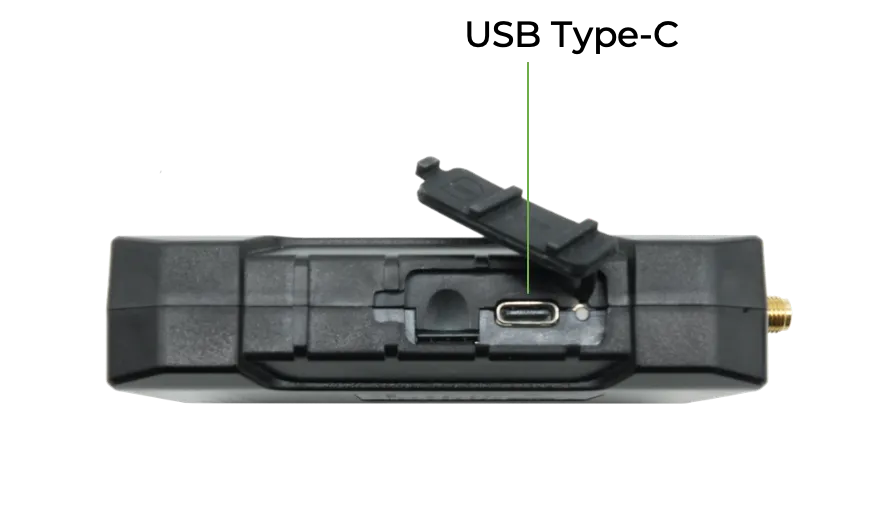

1. Insert Micro-SIM card as shown. Make sure that Micro-SIM card cut-off corner is pointing forward to slot.

1. For external antenna models, please connect the 4G antenna to the ANT antenna interface of the device. The GNSS antenna is connected to the GNSS antenna interface of the device.
2. After configuration, attach device top and bottom cover back.

### 3.2 GNSS Status Light

| Indicator Status | Function status |
| :--- | :--- |
| Long annihilation | The device is not started or the GNSS function is disabled. |
| Flash (frequency: 0.5Hz) | GNSS Time service succeeded GNSS delivery successful |
| Slow flash (frequency: 1Hz) | GNSS function enabled |
| Solid | Location success |

### 3.3 Cellular Status Light

| Indicator status | Function status |
| :--- | :--- |
| Long annihilation | The device is disabled or the dialing function is disabled. |
| Flash (frequency: 0.5Hz) | Dialed successfully |
| Slow flash (frequency: 1Hz) | Dialing enabled |

## Chapter II Login and Device Configuration

## 1. Install the Configuration Tool

The tool software supports the installation OS environment: **Windows 10 **and** Windows 11;**

⚠️ Not support Windows 7.

### 1.1 Download Configuration Tools

Enter the Download Center of InHand's [Website](https://doc-center.inhandnetworks.com/Mobility/InVehicleTelematicsGateways/VT200), and download the tool from the VT200 >>VT3_Installer_V1.x.x

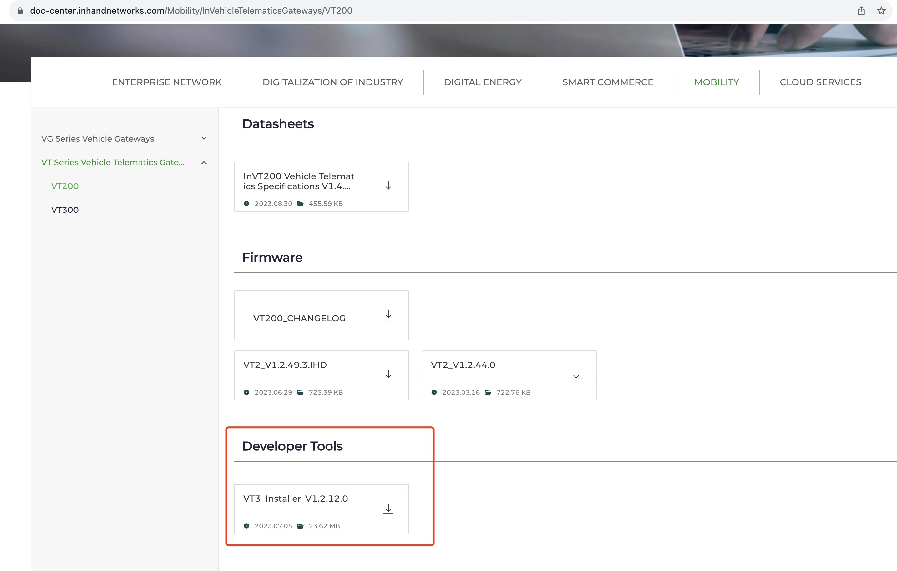

Download the configuration tool installation package in the product documentation. Select the default path to complete the installation, as is shown below.

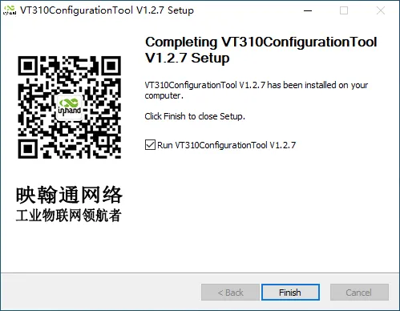

- If the following error occurs after installation, choose "Run as administrator" to open the software, as is shown below.

### 1.2 Search for the COM Port Number

Power the VT200 with an external adapter through the 20PIN all-in-one test cable. The VT200 is connected to the computer through a USB-Type C cable. If the GNSS or cellular light flickers, the device is started successfully.

Enter the device management page of the computer and observe the COM slogan in the "device manager"> "ports (COM and LPT)" of the computer, as is shown below.

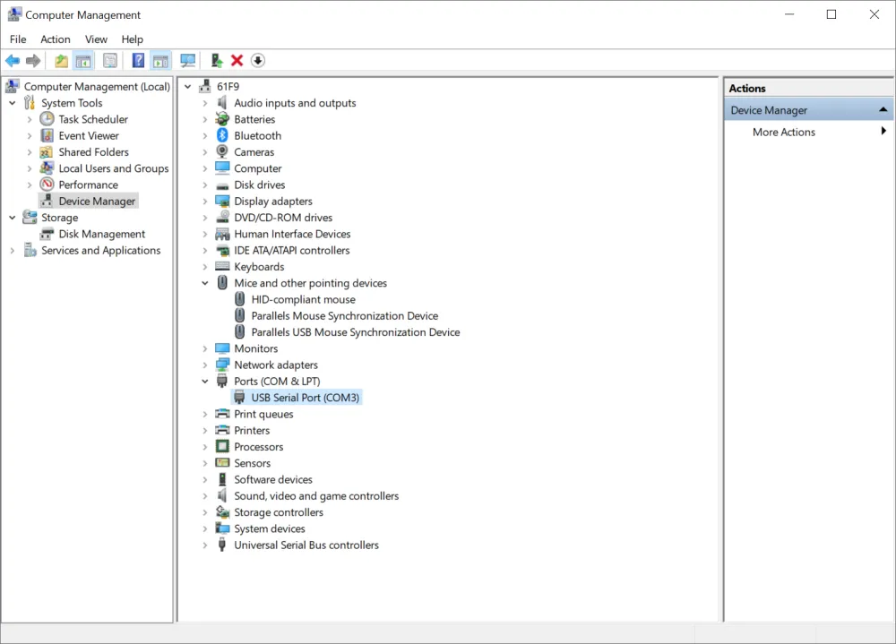

### 1.3 Login to the Device

Open the VT310 configuration tool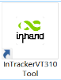. ⚠️ If an error message appears, open it as an administrator.

Click "Connect device", enter the user name and password (default: admin/123456), select the recorded serial port, baud rate (default: 115200), and click "connect", as is shown below.

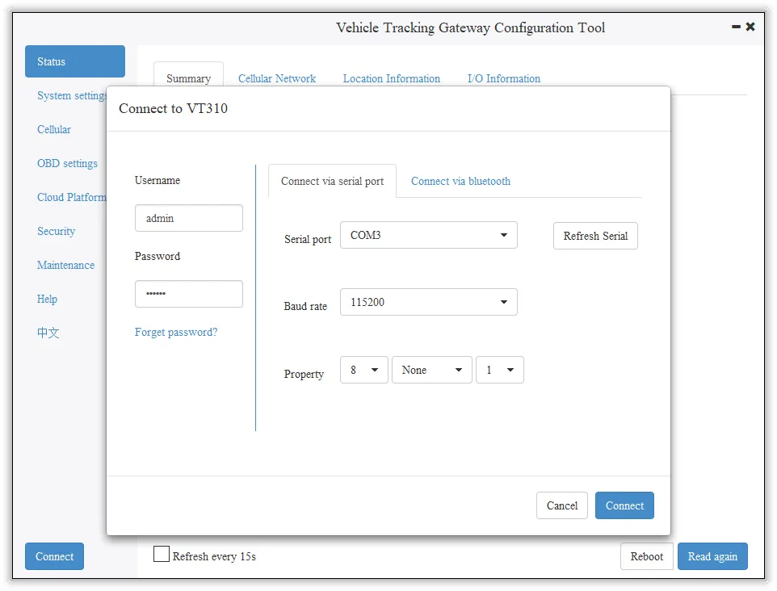

In the dialog box that pops up, you can view the device status and perform operations on the device. Click OK to preview or modify the configuration, as is shown below.

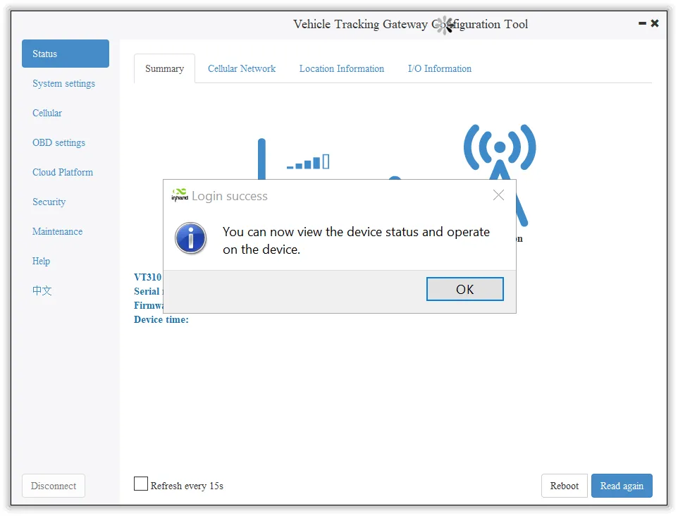

Login succeeded

## 2. Inquire Status Information

### 2.1 Cellular Network Parameters

On this page are mobile network link parameters, which are used mainly to check whether the wireless network link is normal. All parameters read when the SIM is not inserted are default parameters. After the device is connected to the Internet through the SIM card, it can obtain the IP address for data transmission. For configuration of mobile network parameters, please refer to Section 4 Configure the Cellular Network.

| Parameter | Description |
| --- | --- |
| Signal value | Indicates the signal strength of the connected wireless network. Valid values: 0 to 31. |
| MCC/NMC | MCC (mobile country code), MNC (mobile network code), read from the SIM card |
| SIM card status | Normal/Unidentified |
| IMEI | The International Mobile device identification code (International Mobile Equipment Identity) is the built-in dialing module code of the vehicle gateway. |
| Registration | Registered/Not registered |
| LAC | LAC(Location area code ) , obtain this parameter from the base station after dialing successfully |
| IMSI | IMSI(International Mobile Subscriber Identity) this parameter is read from the SIM card |
| CELL ID | This parameter is obtained from the base station after dialing successfully. |
| ICCID | The ID of the integrated circuit card is the SIM card number and ICCID (integrated circuit card identity). This parameter is read from the SIM card. |
| IP ADDRESS | After the dialing is successful, the carrier assigns the IP address of the network access. |
| Cellular status | Connected/Not connected |
| Authentication method | CHAP/PAP |

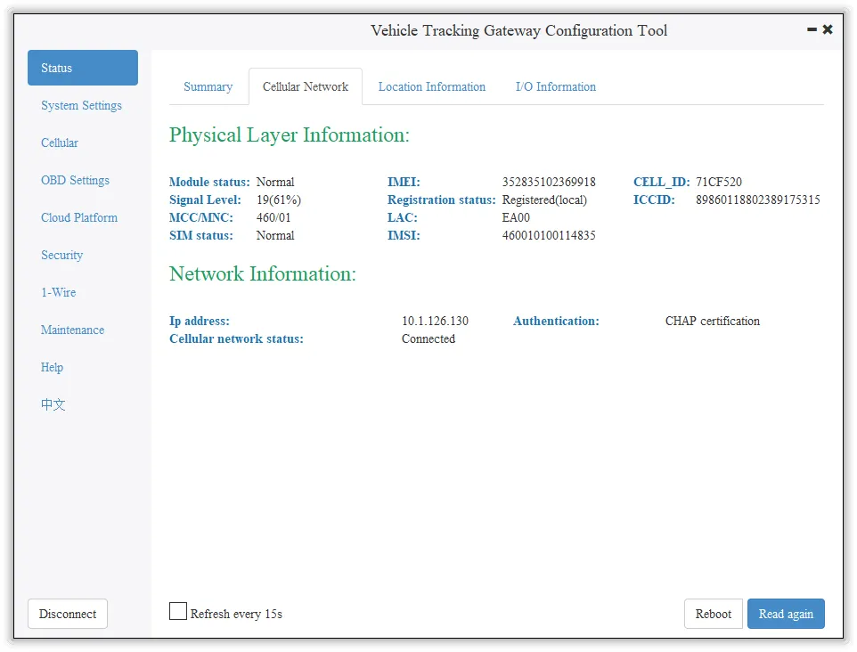

### 2.2 Location Information

The location information page shows the latest parameters obtained by the GNSS module. It includes location information and related parameters of the inertial sensor. As is shown below.

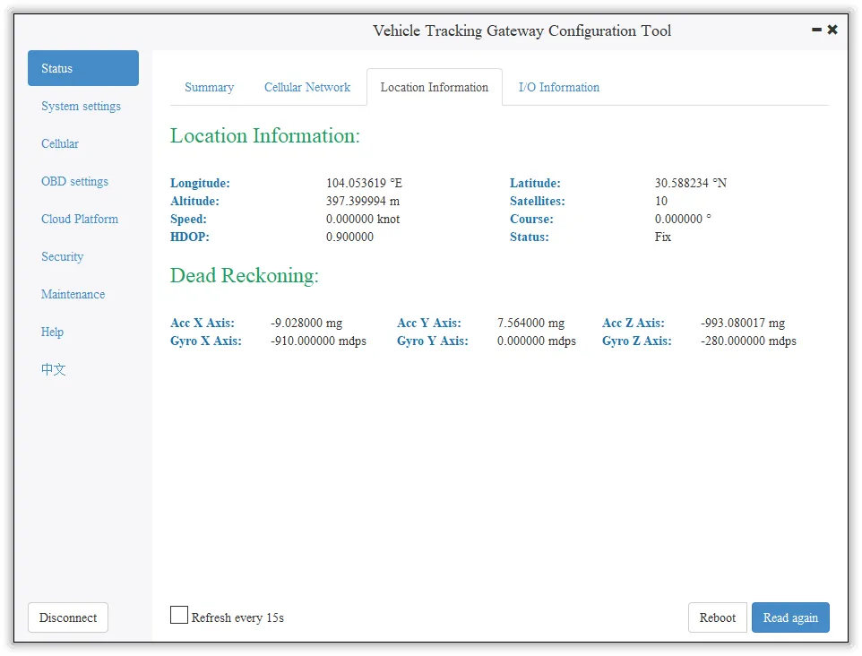

### 2.3 I/O Information

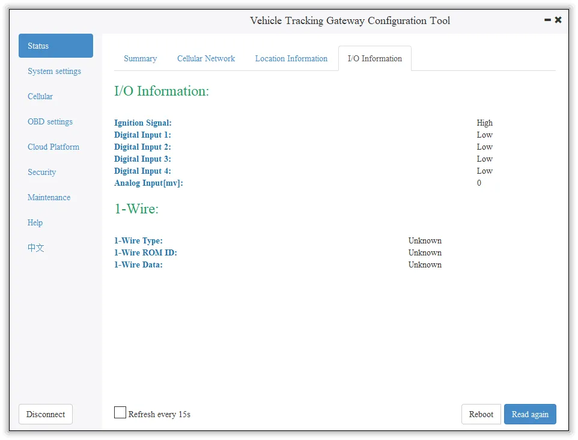

## 3. System Settings

### 3.1 Sleep Mode

The sleep mode ensures the battery life after flameout, providing continuous guarantee for special environments. The state machine is as follows:

Description of the state machine:

Run, Sleep, and Temp run represent normal running status, sleep status, and temporary running status respectively.

① Corresponding to the state machine, the condition from Run to Temp run is that the power supply voltage is less than sleep voltage (6V by default) or IGT OFF (IGT needs to be enabled in the configuration), by default, the device continues to run for 15Stemp (for reporting information) and then enters Sleep;

② Corresponding to the state machine, the condition of entering Sleep from the Temp run is that after the device runs a wake-up runtime cycle in the Temp run or after the device runs Temp Run for 15s from run;

③ Corresponding to the state machine, the condition from Sleep to Run is that the power supply voltage is greater than Sleep voltage or IGT ON (IGT needs to be enabled in configuration);

④ Corresponding to the state machine, the condition of entering the Temp run from Sleep is that after the device runs a wake-up interval in Sleep;

⑤ Corresponding to the state machine, the condition from Temp run to Run is that the power supply voltage is greater than sleep voltage or IGT ON (IGT needs to be enabled in configuration);

Configure the sleep mode:

| Parameter | Description |
| :--- | :--- |
| Enable IGT | After IGT is enabled, the device uses the IGT status as the condition for entering or exiting Sleep. The IGT status is not ticked by default. |
| Wake-up interval | The interval between the device automatically wakes up in Sleep, whose default value is 120 minutes. |
| Wake-up time | The interval between the time when the device enters the next Sleep, whose default value is 5 minutes. |

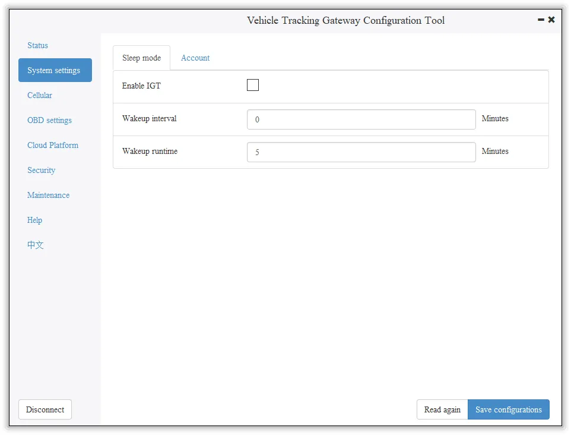

### 3.2 Account Settings

This function allows the device administrator to modify the device administrator login information. The default administrator account is admin, password 123456. The device administrator can modify the configuration options if necessary. After the modification, the device prompts a restart. Click OK to restart the device and log in with the modified administrator account and password. As is shown below.

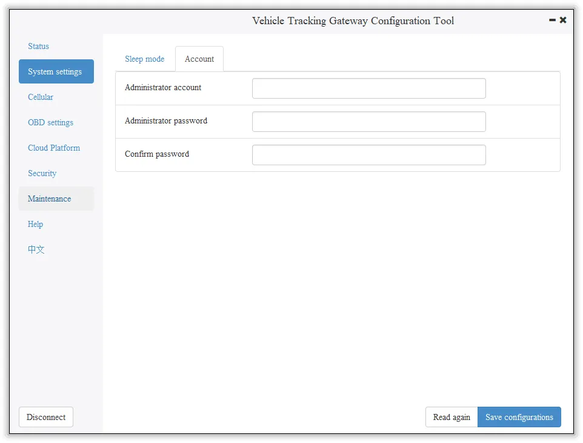

## 4. Configure the Cellular Network

Click "Cellular" to enter the configuration page. Generally, customers only need to configure "Network Access Point Name (APN)", "Network dialing user name", "Network dialing password" and "Authentication mode" and click "Save configuration". The device takes effect after restarting.

If the customer has special trial scenarios, click "Show Advanced Options" to see hidden configuration items. Configure the network dial number, PIN, and default host APN as needed. As is shown below.

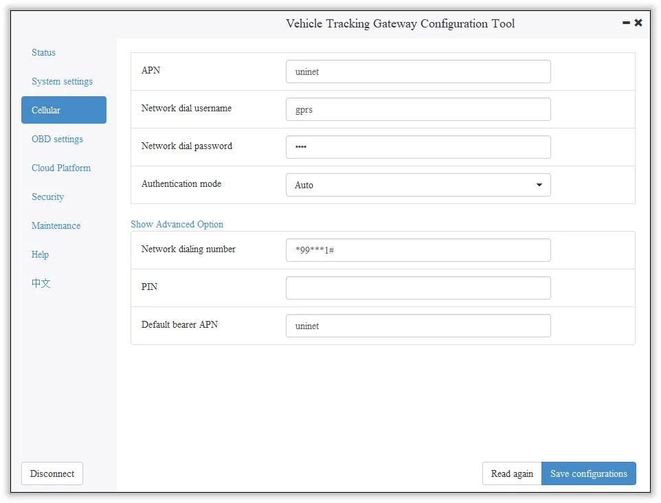

| Parameter | Description |
| :--- | :--- |
| APN | This parameter is required when the APN private network is connected to the mobile network. Most public network service SIM cards do not authenticate APN when dialing. |
| Network dialing username | The default parameter is "gprs". When the private network is AAA certified, the mobile network operator needs to provide this parameter. |
| Network dialing password | The default parameter is “gprs”. This is required by the carrier during the AAA certification for the private network. |
| Authentication mode | Automatic/CHAP/PAP. This parameter is required when the private network is AAA certified. Automatic: take turns to use PAP and CHAP authentication to dial (pap authentication is used for the first power-on, if dialing fails, chap authentication is used for dialing again, and pap authentication is used for the next dialing, and so on. If the authentication mode is not automatic, but PAP or CHAP, use only PAP or CHAP authentication to dial. |
| Network dial number | The default parameter is * 99 *** 1#, which is required by mobile network operators. |
| PIN | PIN (Personal Identification Number) refers to the Personal Identification password of the SIM card. When the SIM card is enabled for PIN verification, does it fill in the corresponding PIN of the SIM card. This parameter is required for mobile network operators. |
| Default carrier APN | This parameter is provided by the carrier. |

**⚠️** The default host setting is a function for special data transmission required by some carriers, which generally does not need configuration. If configuration is required, please inquire from your carrier.**

## 5. Configuration of Vehicle Diagnostic Interface

The on-board diagnostic interface is the South interface of the tracker and the configuration option of the protocol.

### 5.1 Configure OBD Interface

In the configuration tool, select OBD as the diagnostic protocol. The OBD protocol is the CAN interface of the vehicle tracker. VT200 only one CAN.

|  | Parameter | Description | Others |
| --- | --- | --- | --- |
| Protocol Type | AUTO(J1939/J1979) | OBD CAN2 interface protocol, corresponding to physical layer PIN CAN0_L(PIN 11) and CAN0_H(PIN 1) | OBD default configuration |
|  | J1939 | OBD CAN interface protocol, corresponding to physical layer PIN CAN0_L(PIN 11) and CAN0_H(PIN 1) |  |
|  | J1939 | OBD CAN2 interface protocol, corresponding to physical layer PIN CAN0_L(PIN 11) and CAN0_H(PIN 1) |  |
|  | Disable | Disable OBD CAN |  |
| Mode | Active mode |  |  |
|  | Passive mode |  |  |
| Baudrate | default |  |  |
|  | 250K |  |  |
|  | 500K |  |  |
| Data Upload Format |  |  |  |
|  |  |  |  |
|  |  |  |  |
| Scan Interval |  |  |  |
| BLE Data Forward |  |  |  |

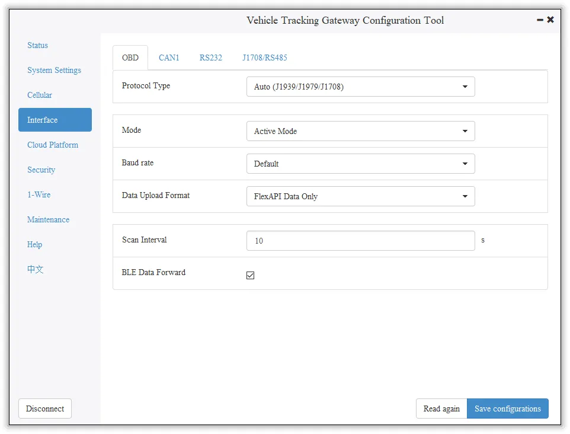

## 6. Configuration of the Cloud Platform

The configuration of the cloud platform is the North-direction interface and protocol configuration option of the vehicle tracker. The VT200 can only be connected to one cloud platform at a time. The configuration of the platform takes effect only after the device is restarted. Click "Platform" to enter the configuration page. Click "Modify" to enter the configuration page. As is shown below.

### 6.1 SmartFleet Platform

The SmartFleet platform is a SaaS platform for the Internet of Vehicles market launched by InHand Networks. It mainly includes vehicle profile, alarms, driving behavior monitoring, statistical analysis of driving information, electronic fence and other functions. Through the visual user interface and simple operation, you can manage and monitor your hardware devices such as the InVehicle Gateway with speed and ease. Deployment in the cloud allows you to focus on your core business. Login address: [smartfleet.cloud](https://smartfleet.cloud). For more information about the platform, please visit [https://www.inhandnetworks.com](https://www.inhandnetworks.com/) and chat with us.

Cloud Platform >> Platform Type: SmartFleet, [smartfleet.cloud](https://smartfleet.cloud).

Cloud Platform >> Domain name: smartfleet.cloud

Cloud Platform >> Account (Enter the platform's registered account)

Cloud Platform >> License Plate Number

Click "Show Advanced Options" to show hidden configuration items. Configure the LBS reporting interval, traffic reporting interval, and heartbeat reporting interval as needed. The reporting interval is measured in seconds, as is shown below. Click "Save configuration" and restart the device. As is shown below.

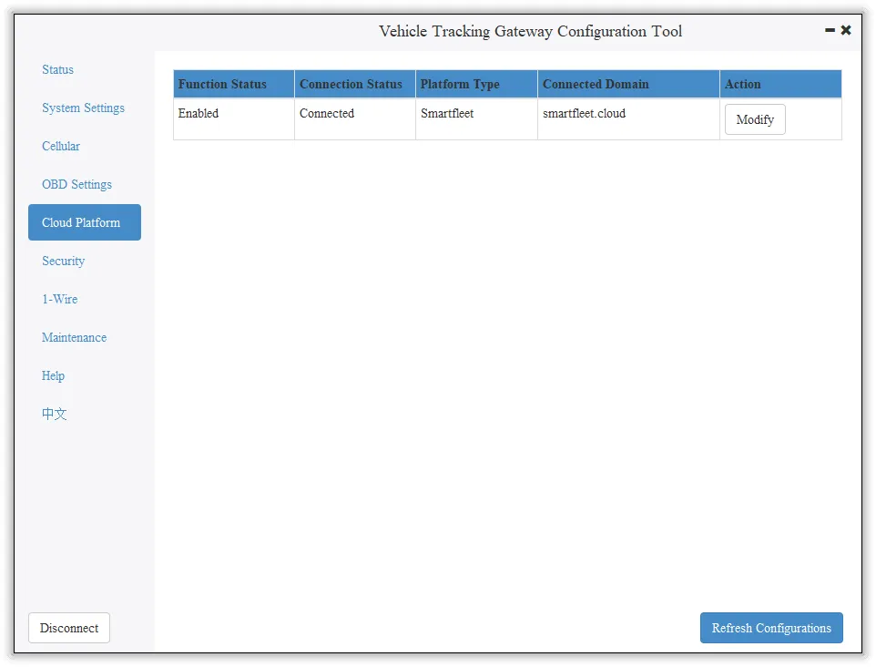

On the Cloud Platfrom homepage, view the link status of the platform. The link status is "linked". As is shown below.

Log in the platform and choose Gateways >> Gateway List. You can see if the vehicle tracker is online. As is shown below.

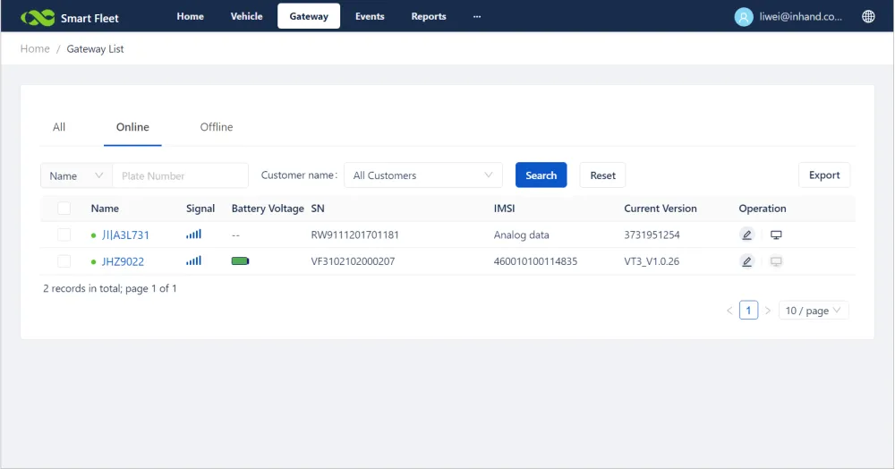

### 6.2 Wialon Platform

Wialon has more than 18 years of best practice in software engineering in the area of GPS vehicle tracking and a team of talented specialists committed to the common goal. The community is united by continuous advancement of the proprietary products and five offices around the world – the headquarters and development center in Minsk and sales offices in Moscow, Boston, Dubai and Buenos Aires. Nowadays solutions by Gurtam take up about 36% of the CIS commercial carrier market and are actively expanding to Europe, the Middle East, the USA, South America, Africa and Australia, with even New Zealand market tapped. For more information, visit [https://gurtam.com/en/wialon](https://gurtam.com/en/wialon). To test the Wialon platform, you can contact manager Sun, <sunzd@inhand.com.cn>, for more support.

Cloud Platform >> Platform Type: Wialon,

Cloud Platform >> Domain name: nlgpsgsm.rog

Cloud Platform >> Port : 21000

To adjust the reporting frequency, click "Show Advanced Options" to show hidden configuration items. Set the reporting interval reporting interval in seconds.

If you have obtained an independent domain name provided by Wialon, enter the custom domain name and port number. As is shown below.

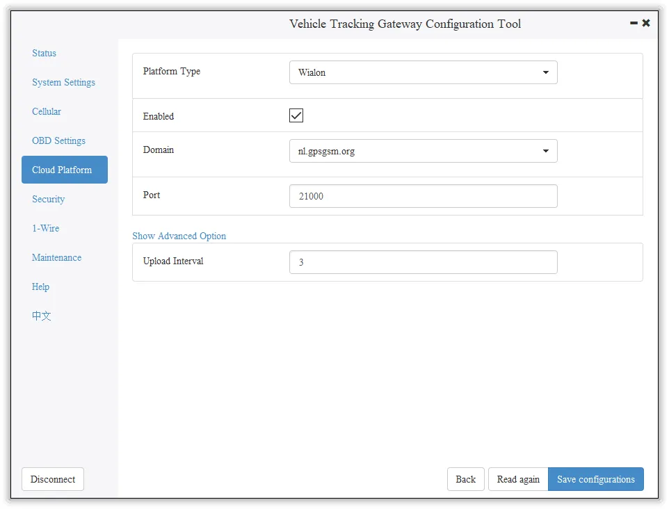

### 6.2.1 Configuration on Wialon Platform

Platform website: [https://hosting.wialon.com](https://hosting.wialon.com)

New devices:

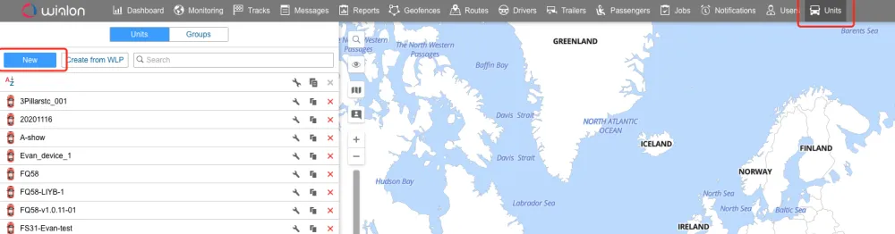

The device configuration information is as follows:

- Name: Custom

- Device Type: Select "Wialon Combine"

- Unique ID: Enter the device serial number. View the serial number of the device or the serial number on the status page of the configuration tool. The information shown in the following figure is for example only.

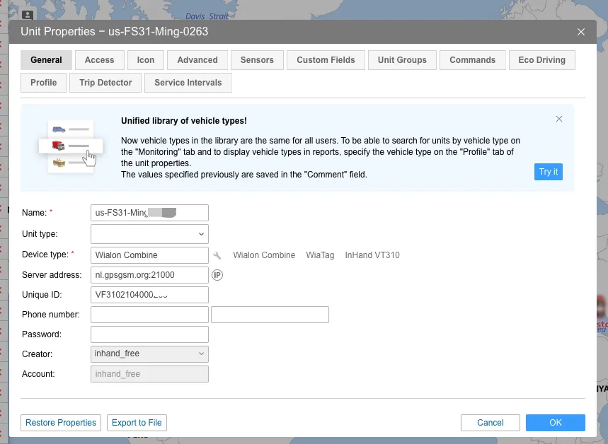

### 6.2.2 View Data Uploaded by Devices

① Select "Message";

② Select the name of the target device to be viewed;

③ Select the time range of interest;

④ Select the data type. Currently the colelcted I/O data is viewed through Raw Data;

⑤ Click the "Execute" button to view the information of the target device at the position of ⑥, as is shown below.

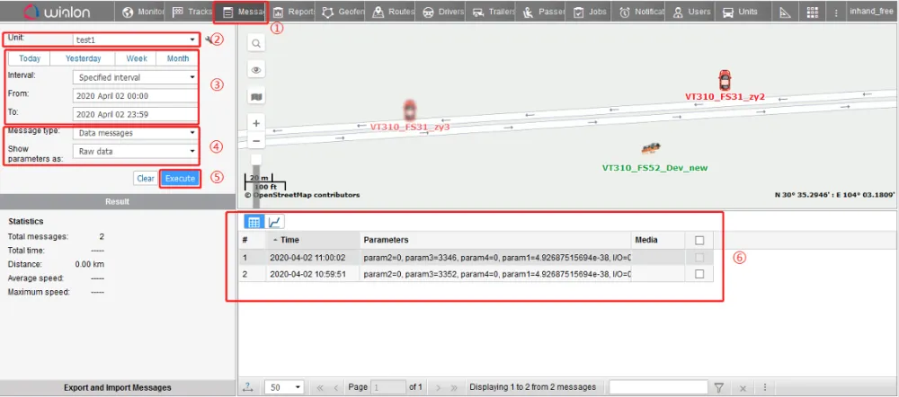

Note: The information display of the target device can be selected by clicking the configuration method, as is shown below.

### 6.3 Azure IoT Hub

Azure IoT builds IoT applications that offer highly secure and reliable two-way communication between IoT applications and their managed devices. Azure IoT Center provides the back end of cloud hosting solutions, which can connect to almost any device. The solution is extended from the cloud to the edge through authentication, built-in device management, and extended configuration of each device. For more information, visit [https://azure.microsoft.com/zh-cn/services/iot-hub](https://azure.microsoft.com/zh-cn/services/iot-hub)

Cloud Platform >> Platform Type: Azure IoT

Cloud Platform >> Connect String

The Connect String is created from Microsoft IoT platform. See in the next section.

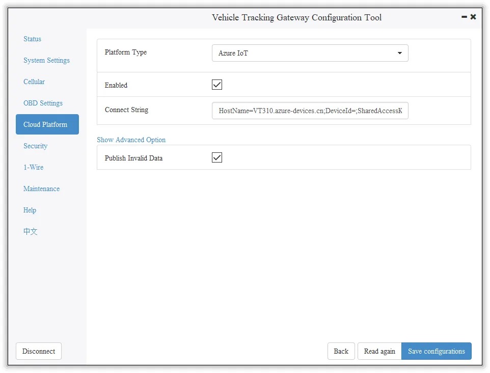

### 6.3.1 Configure Azure IoT Platform

1. Before configuring the Connect String, log in the Azure IoT platform to create a device. In the left-side navigation pane of the IoT Center, choose "IoT devices", and then select "New". As is shown below.

1. On the "Create a device" page, provide the name of the new device, such as myDeviceId, and then select "Save". This creates a device identifier for IoT Center. As is shown below.

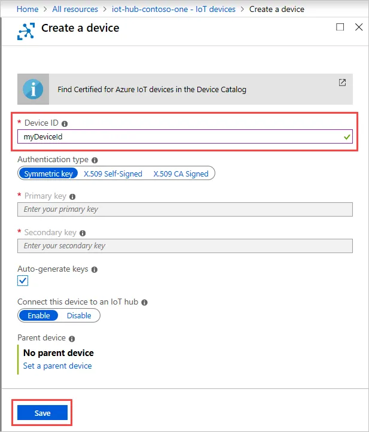

1. After creating the device, open the device in the "IoT devices" pane. Copy the "Primary Connection String" and later paste to the "Connection String" of the configuration tool ". As is shown below.

### 6.4 AWS IoT Platform

With the AWS IoT Core, you can connect your IoT devices to the AWS cloud without configuring or managing the server. The AWS IoT Core supports billions of devices and trillions of messages, and can process those messages before routing them to AWS terminal nodes and other devices with security and reliability. With the AWS IoT Core, your applications can track all devices and communicate with them anytime, even if those devices are not connected. Build your IoT applications with AWS services, so that you can collect, process and analyze data generated by connected devices and take action without managing any infrastructure. For more information, please visit [https://aws.amazon.com/iot-core/](https://aws.amazon.com/iot-core/).

### 6.4.1 Configure AWS IoT Platform

#### Method 1: Creat A Thing for link

1. Go to the Amazon IoT console >> Things page, and click "Create", as is shown below.

Amazon IoT >> Things >> Create a single thing

Amazon IoT >> Things >> Create a single thing >> Add your device to the thing registry >> Add certificate On this page, create a certificate for the thing just created, as is shown below.

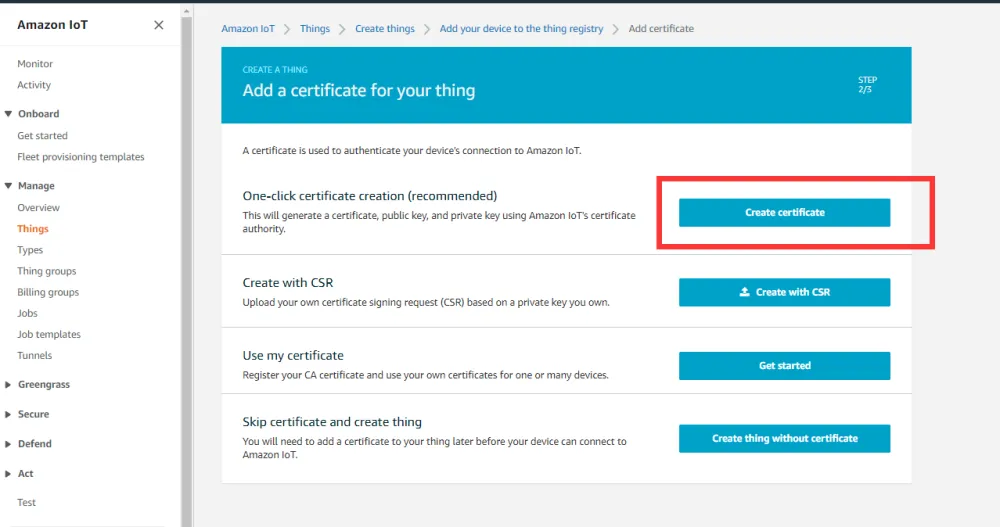

1. Download certificate file

- Download certificate >> A certificate for the things >> Download the file format is as follows: ***.cert.pem;

- Download private >> A private key >> Download. The file format is: ***.private.key;

- AWS CA files have been download in the vehicle tracker, so you do not need to Download CA files. If you need to update, click "A root CA for Amazon IoT Download";

- Click "Activate" to activate the certificate of the thing;

- Click the "Attache a policy", enter additional policy page. As shown in the following illustration.

- On the "Attach a policy" page, config additional policy for the certificate and click "Register Thing" to register the item, as is shown below.

- 

1. Use the configuration tool to import the certificate file to the tracker

- Security >> Import digital certificate >> Select a certificate (select the downloaded digital certificate ***.cert.pem in the displayed dialog box); click "Import certificate"

- Security>> Import private key certificate >> Select a file (select the downloaded digital certificate ***. private.key in the dialog box that appears); click "Import file";

- As the AWS CA files have been built into the vehicle tracker, there is no need to download them. If you need to update them, go to Security >> Import CA certificate >> Select a file (select the downloaded digital certificate ***. private.key in the dialog box that appears); click import certificate, as is shown below.

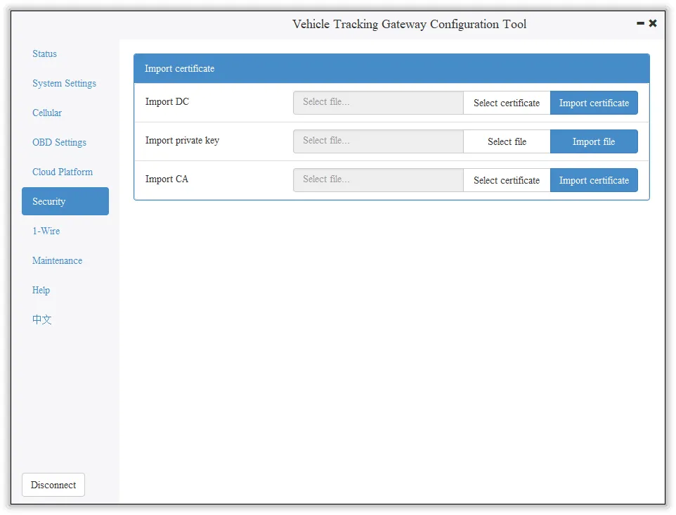

1. Enable AWS Platform

Cloud Platform >> Platform Type: AWS IoT

Cloud Platform >> Domain name

Cloud Platform >> Port: 8883

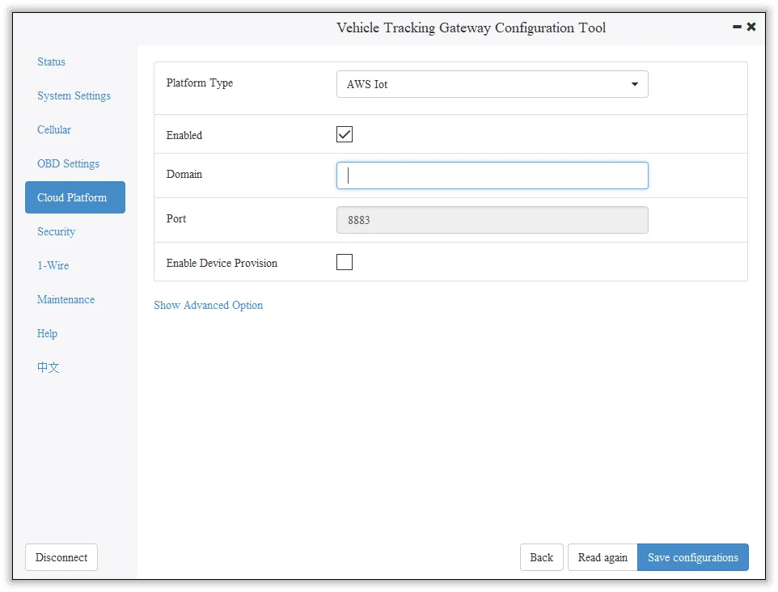

“Cloud Platform >> Domain name” AWS IoT >> Things >> “Select the created things” >> Interact Copy this domain name paste to “Cloud Platform >> Domain name”

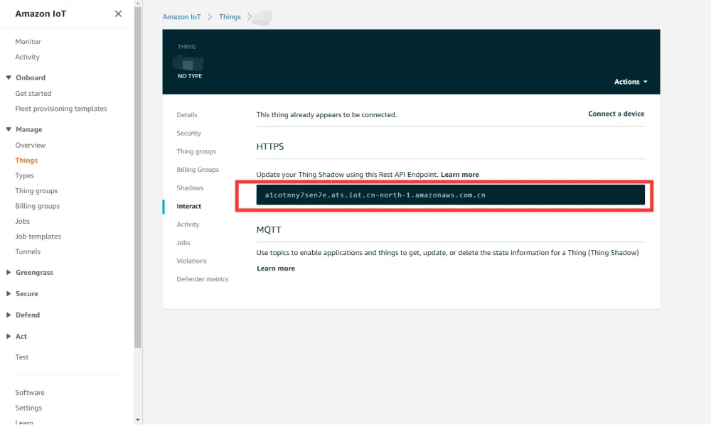

Save the configuration and restart the device. On the Cloud Plateform Cloud Platform page, check the connection status:

#### Method 2：Create a provisioning template connection for AWS

1. Create a prefabricated templet: Amazon IoT >> Fleet provisioning templates >> Create, as is shown below.

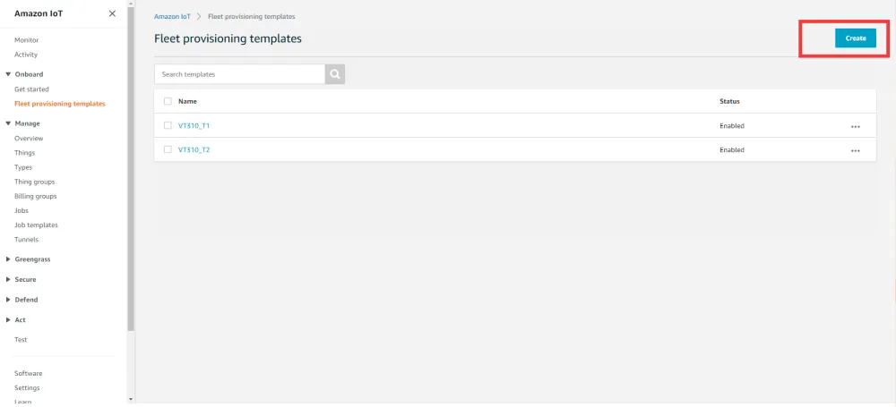 Creat Certificate: Amazon IoT >> Certificates

Amazon IoT >> Things >> Create a single things >> Add your device to the thing registry >> Add certificate

On this page, create a certificate for the thing just created, as is shown below.

1. Download a certificate file

- Download a public key file >> A certificate for the things >> Download. The file format is ***.cert.pem;

- Download the private key file >> A private key >> Download. The file format is ***.private.key;

- As the AWS CA files have been built into the tracker, there is no need to download them. If you need to update, click“A root CA for Amazon IoT Download”;

- Click Activate to activate the certificate;

- Click the "Attach a policy", enter additional policy page, as is shown below.

- On the previous window, click "Activate" to enter the certificate list. Click "Done" and complete certification.

- On the previous window, click "Attach a policy" to enter the Amazon IoT >> Policy list to add a policy, as is shown below.

1. Use the configuration tool to import the certificate file to the vehicle tracker

- Security >> Import digital certificate >> Select a certificate (select the downloaded digital certificate ***.cert.pem in the displayed dialog box), click "Import certificate"

- Security >> Import private key certificate >> Select a file (select the downloaded digital certificate \\. private.key in the dialog box that appears); click "Import file";

- As the tracker already has a built-in AWS CA file, the CA file is not required. If you need to update the CA file, go to Security >> Import CA certificate >> Select a file (select the downloaded digital certificate ***.cert in the pop-up dialog box), click "Import certificate";

1. Enable AWS

Cloud Platform >> Platform Type: AWS IoT

Cloud Platform >> Domain name

Cloud Platform >> Port : 8883

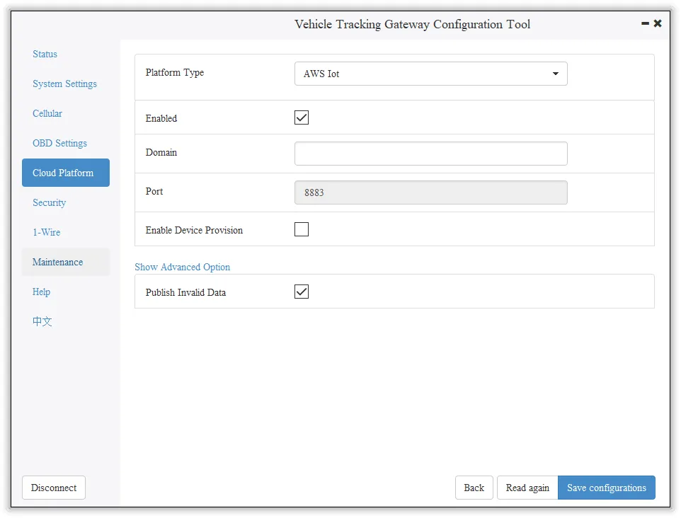

⚠️ If you create a preset template on AWS, you need to enable device preset in the configuration tool. Tick ☑️ to enable it, and enter the preset template name. The template name can be found in AWS IoT >>[Fleet provisioning templates](https://bv5df8.yuque.com/bv5df8/manual/ndntpl#krcDJ).

Domain:

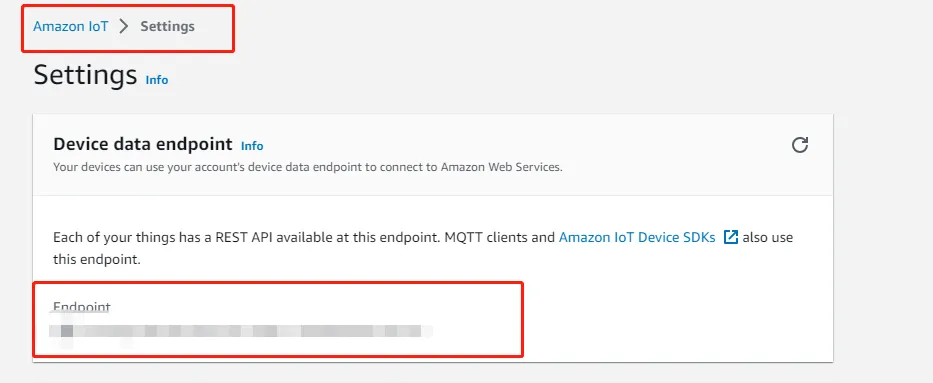

Save the configuration and restart the device. On the Cloud Platform Cloud Platform page, check the connection status:

### 6.4.2 Subscription and Publishing of AWS

#### 1. Subscribe to messages reported and published by VT200

Amazon IoT >> Test

Amazon IoT >> Test >> enter the published topic in the Subscription topic text box, as is shown below.

For example: v1/VT200's SN/motion/info

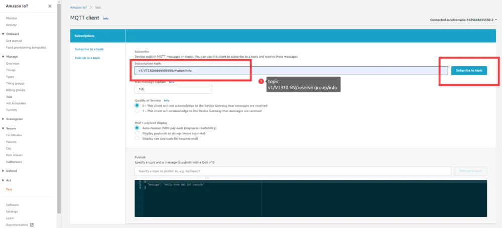

By default, the VT200 reports messages from the retention groups of GNSS, Sysinfo, Motion, Cellular1, IO, and OBD. You only need to subscribe to topics to receive messages, as is shown below.

For more information, see API documentation.《FlexAPI_over_MQTT_Reference_for_3rd_party_platform_VT310.pdf》

### 6.5 Aliyun IoT

The Alibaba Cloud Enterprise IoT platform provides fully-hosted instance services. It allows you to easily access and manage devices without building IoT infrastructure by yourself. It features low costs, high reliability, high performance, and easy operation and maintenance. With powerful data processing capabilities, it can better analyze and visualize device data. Real-time security threat detection ensures that each instance is secure and reliable. It is the first choice for each enterprise device to migrate to the cloud. For more information, visit the Alibaba Cloud product page. [https://www.aliyun.com/product/iot](https://www.aliyun.com/product/iot).

#### Method 1: Unique Certificate Per Device

For more information: [https://help.aliyun.com/document_detail/74006.html](https://help.aliyun.com/document_detail/74006.html)

1. Go to the Alibaba Cloud Console IoT Platfrom >> Device >> Devices >> Device Details. Create a Device and view the Device Secret, as is shown below.

The Device Certificate of the replication Device includes three parameters: Product Key, Device Name, and Device Secret, as is shown below.

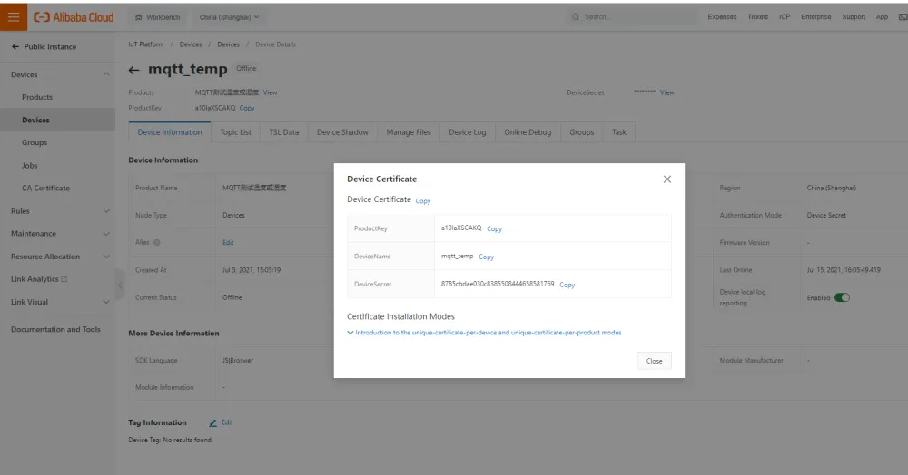

1. Config Aliyun IoT

Cloud Platform >> Platform Type: Aliyun IoT

Cloud Platform >> Device Name:

Cloud Platform >> Product Key

Cloud Platform >> Authentication Mode： Unique Certificate Per Device

Cloud Platform >> Device Secert

Tick ☑️ to enable Secure Certification Mode: Unique Certificate Per Device.

The three parameters from Alibaba Cloud ProductKey, DeviceName, and DeviceSecret. Enter the corresponding parameters in the configuration tool. In the upper-left corner of the IoT platform console, view the region where your service is located. For more information about the Region ID values, see [Region and zone](https://help.aliyun.com/document_detail/40654.htm#concept-2459516).

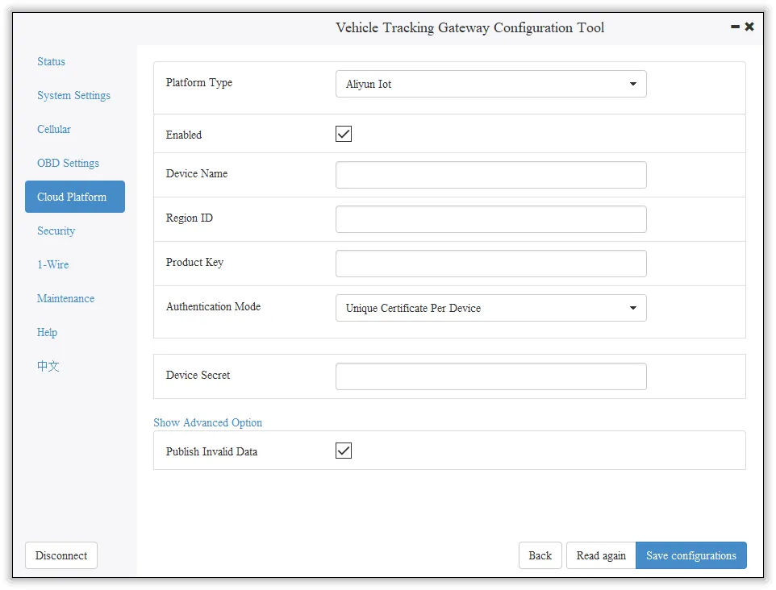

#### Method 2: Unique Certificate Per Model

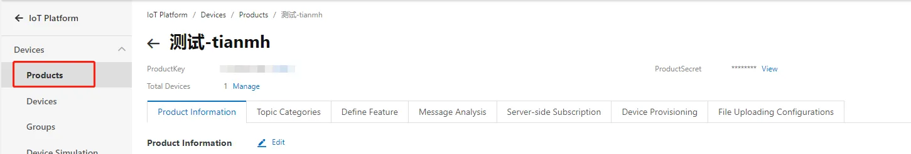

Tick ☑️ to enable Secure Certification Mode: Unique Certificate Per Model.

### 6.6 Configuration of MQTT Platform Link

MQ Telemetry Transport (MQTT) is a lightweight proxy-based message transmission protocol for Publishing/Subscribing. It is designed to be open, simple, lightweight, and easy to implement. These features make it suitable for restricted network environments, including but not limited to high-costs, low-bandwidth and unreliable networks. CPU and memory resources are limited for embedded devices. This protocol provides one-to-many message publishing and discoupling applications using the publish/subscribe message mode. It supports transmission of messages blocked by load content with TCP/IP. Open-source software that supports MQTT, such as ThingsBoard and EMQ, allows customers to develop their own IoT platforms.

### 6.6.1 MQTT Broker

Cloud Platform >> Platform Type >> Mqtt Broker: Enable, configure domain name, port, username, and password ". Click "Save configuration" and restart, as is shown below.

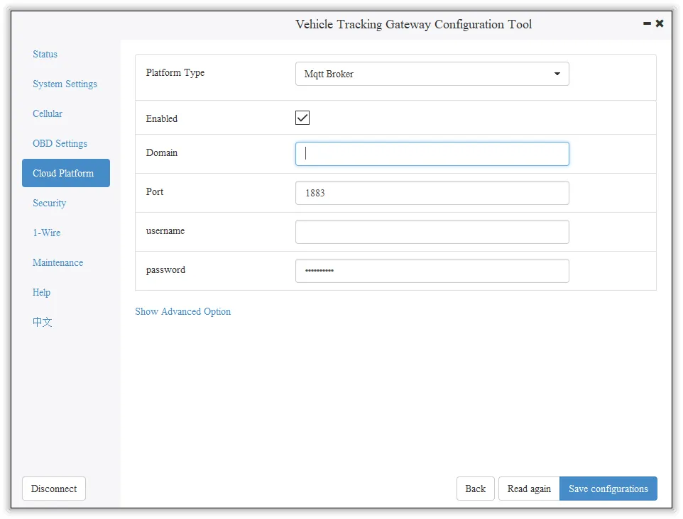

### 6.6.2 Configure ThingBoard Open-source IoT Platform

ThingsBoard is an open-source IoT platform where you can quickly develop, manage, and expand IoT projects. It is an open-source IoT platform for data collection, processing, visualization, and device management. It connects devices through the industry-standard IoT protocols - MQTT, CoAP, and HTTP, and supports cloud and local deployment. For more information, go to [https://thingsboard.io](https://thingsboard.io/).

ThingsBoard Architecture

1. Register an account and add a device. After adding a device, use the open Device Device Credentials >> MQTT Basic to enter the Client ID, User Name, and Password parameters. For more information, visit [https://thingsboard.io/docs/getting-started-guides](https://thingsboard.io/docs/getting-started-guides).

Platform Device Parameters

1. In the configuration tool, enter the thingsboard.cloud, port number 1883, username User Name, Password, Password of the device parameters added by the platform.

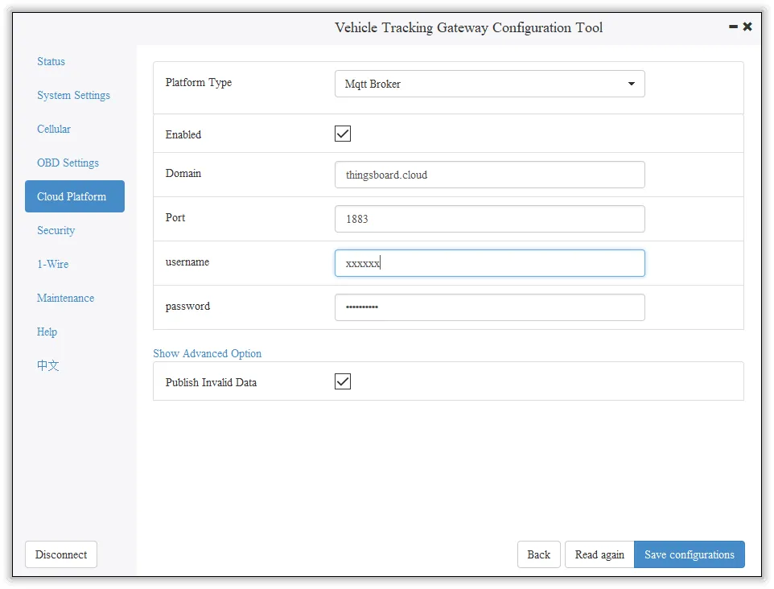

## 7. Maintenance

You can upgrade the firmware with the local upgrade configuration tool, xshell, or through OTA. OTA upgrading includes Alibaba Cloud standard OTA upgrading, SmartFleet platform OTA upgrading and FlexAPI upgrading. Now we will only introduce how to upgrade with local configuration tools. For more information about upgrading, please contact technical support of InHand Networks.

### 7.1 Firmware Upgrade

Step 1: Go to Maintenance >> Upgrade firmware, as is shown below:

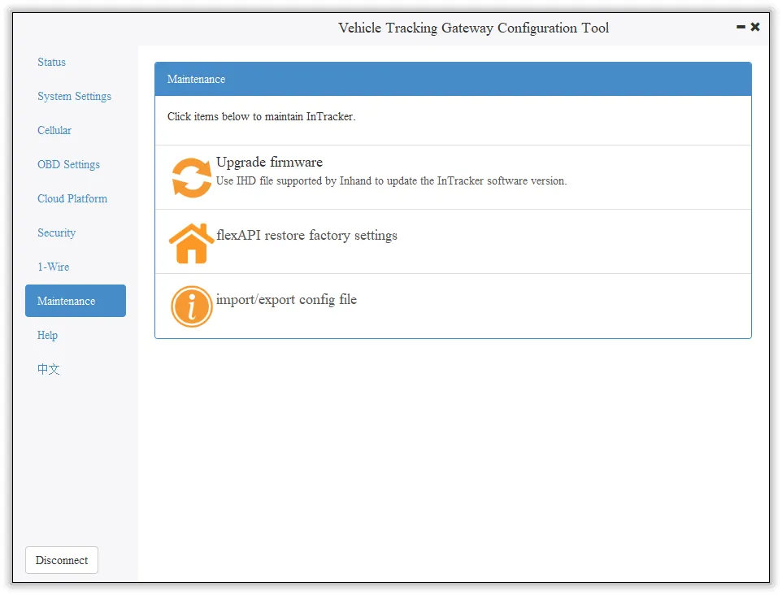

Step 2: Click "Browse file" to select the firmware. Click "Upgrade" and wait for firmware installation, as is shown below:

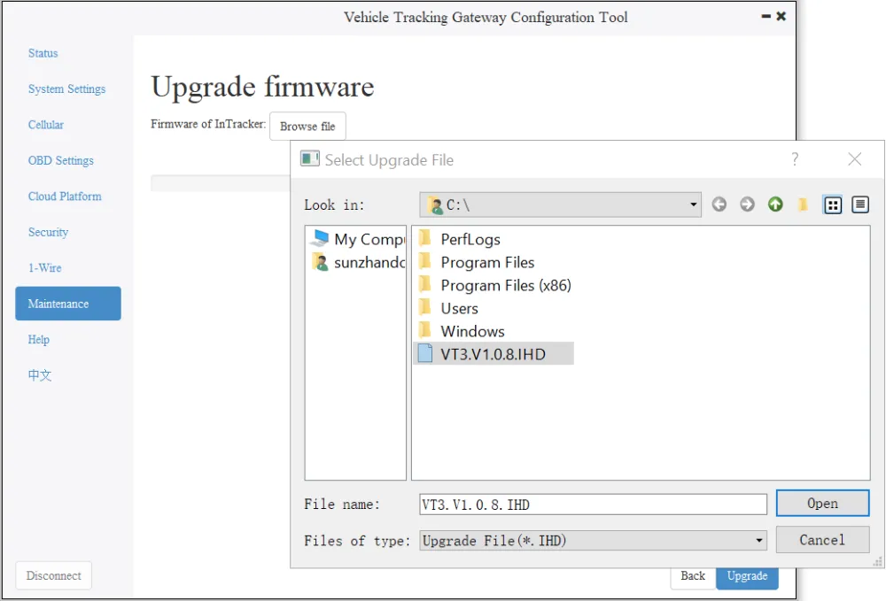

When a prompt box says "Will switch to the new version after restarting VT310", new firmware has been imported successfully. Click "Restart" to upgrade the firmware.

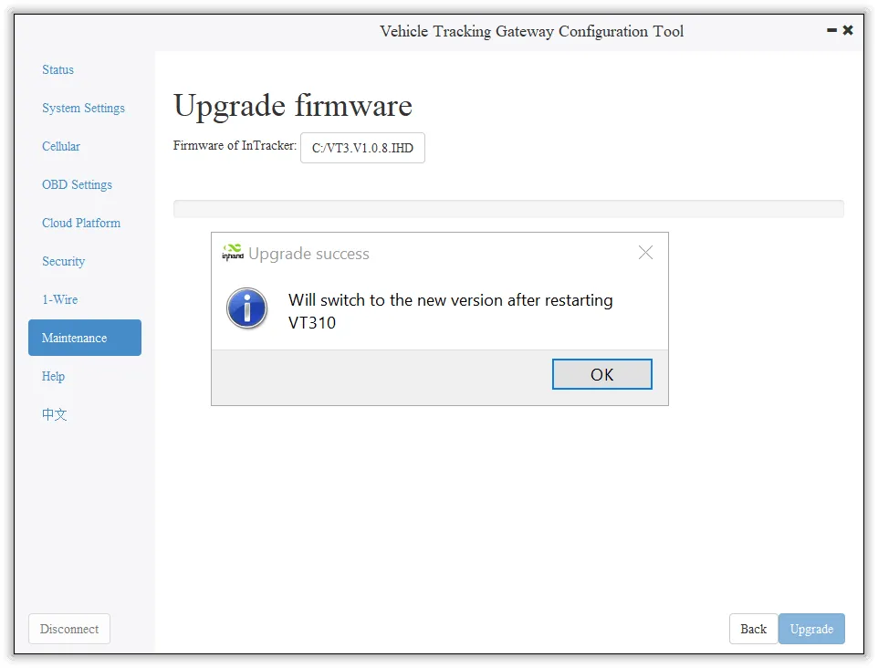

Note: After the device is upgraded, restart the device and then configure it.

### 7.3 Import/Export Configuration

To back up and import configuration, go to Maintenance >> Import/export congifuration file, as is shown below. Click "Export configuration" to back up configuration, and click "Import configuration" to load the configuration file.

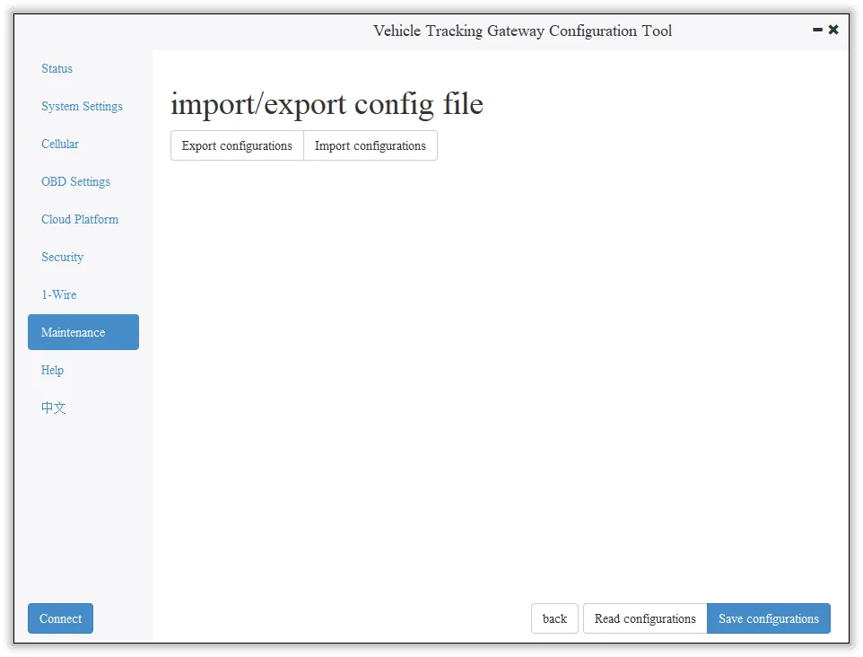

To back up configuration, click "Export configuration". The configuration tool can read device configuration and pop up file storage window. Enter the name of the backup file, and click "Open".

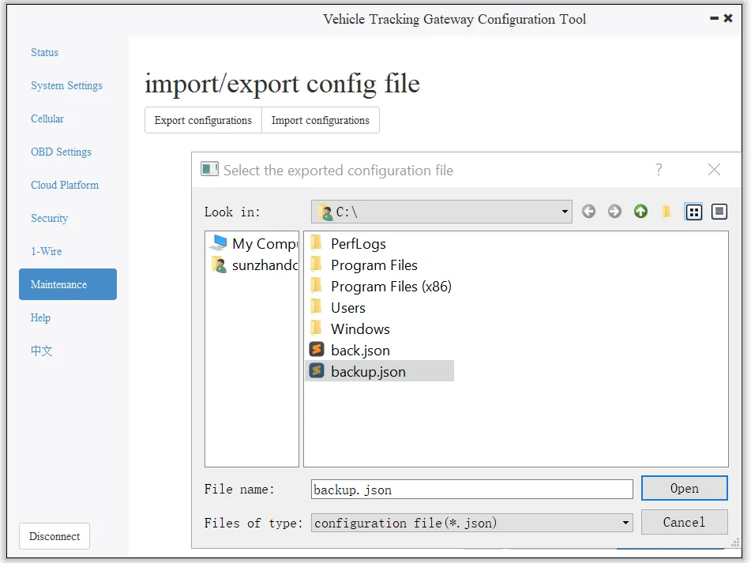

⚠️ In the exported configuration file, Username and Password are not available. If you hope to import the modified username and password to the new device, you can modify them in the exported file. Replace the admin characters with a new admin account, and input in the password of the new account. After the modified configuration file is saved, import it into the new device and restart the device. Log in the new device with the new admin account and password.

⚠️ In the exported configuration file, Username and Password are not available. If you hope to import the modified username and password to the new device, you can add them in the exported configuration file. Enter your admin account in "" of "user:":"", and enter the password in "" of "passwd":"". After the modified configuration file is saved, import it into the new device and restart the device. Log in the new device with the new admin account and password.

## 8. Restoration of the Default Account and Password for Hardware

Because configuration usually involves the device certificate file, when the device is restored to the factory via hardware, only the username and password are restored to admin/123456. As is shown in the following picture, press the Reset button with a screwdriver or other tools for more than 8 seconds, and then loosen it.

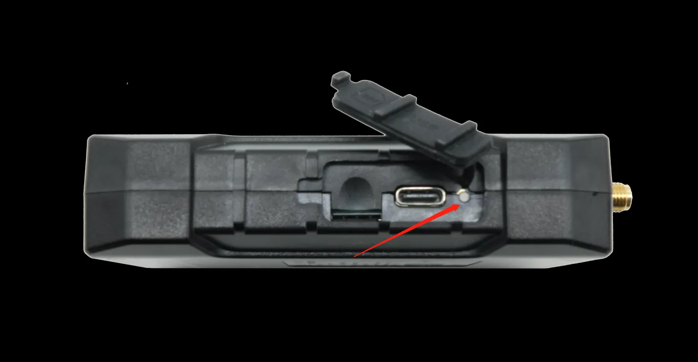

ps: By double-clicking "Reset", you can restart the device when it goes wrong.

## 9. How to Get the Device Log

Make sure that the computer is connected to the VT200 through USB-Type C, and open a serial port connection tool such as the serial port debugging software. The software can be downloaded in Mircrosoft Store.

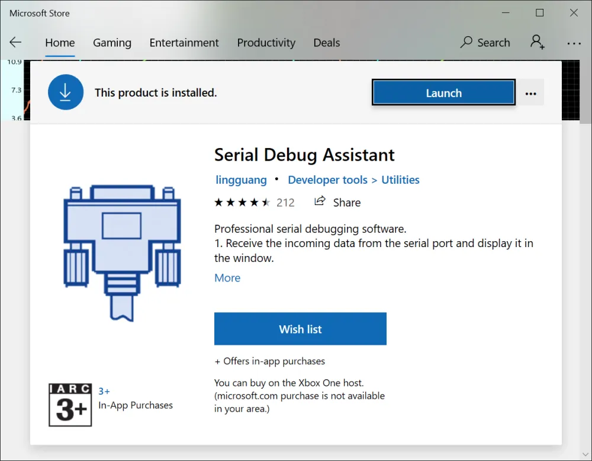

1. Open the serial port debugging software and select the link serial port. The default baud rate of the serial port is 115200/8/n/1. Click "Open serial port". Note that the Character encoding mode (Character encoding) is ASCII, and the line break mode (Linet break) is \n(LF).

Enter the Username admin (press the enter key), click "Send", enter the password 123456 (press the enter key), and click send to enter the command line mode.

1. Enable the log function. In the send text box, enter “log console enable” (press the enter key) and click "Send". The following screenshot shows the log information in the receive window.

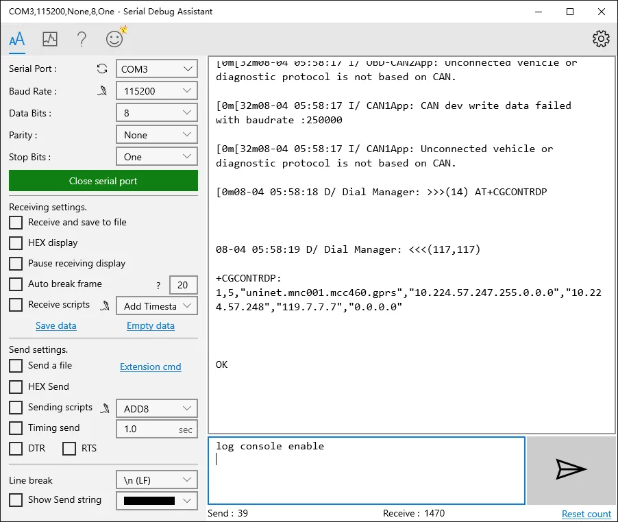

1. Close log function, write “log console disable” (press the enter key) in the send text box and click "Send". The receive window stops receiving logs.

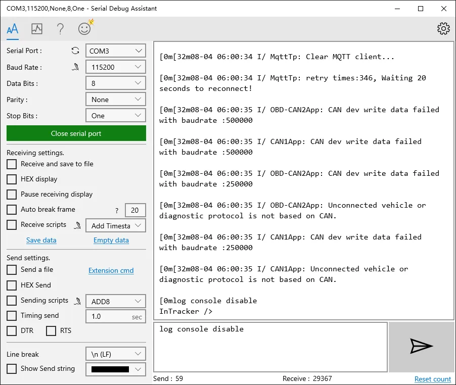

1. If you need to link the configuration tool after exiting the serial port, write “exit” (press the enter key) in the send text box, click "Send" (used to exit the CLI mode), and then close the serial port. Or you wait for 180 seconds when the device automatically exits the CLI mode.
