# Vehicle Telematics 200 User Manual (Standard Edition) V1.0

## Front Matter

### Copyright and Conventions

This user manual contains copyrighted content, and the copyright belongs to InHand Networks and its licensors. Without written permission, no organization or individual may excerpt, copy any part of the content of this manual, or distribute it in any form.

Due to ongoing updates in product technology and specifications, the company cannot guarantee that the information in the user manual is entirely consistent with the actual product. Therefore, no disputes arising from any discrepancies between the actual technical parameters and the user manual are accepted. Any changes to the product will not be notified in advance, and the company reserves the right to make the final changes and interpretations.

### Conventions

| Symbol | Indication |
| --- | --- |
| > | Indicates a button name |
| "" | Indicates a window name or menu name |
| >> | Separates a multi-level menu |
| Cautions | Points to note during operation; improper actions may result in data loss or device damage |
| Note | Supplement and provide necessary explanations for the description of the operation |

### Technical Support

For more information, visit [www.inhandnetworks.com](https://www.inhandnetworks.com/).

### How to Use This Manual

**Find Your Path**

- First-time users: Read in order: "Know the Device" → "Installation and First Use" → "Common Scenarios" → "Function Reference"
- Existing users: Go directly to "Function Reference" or "Appendix A Troubleshooting"

**Quick Jump by Task**

| Task | Section | Est. Time |
|------|---------|-----------|
| Know the device and interfaces | [1. Know the Device](#1-know-the-device) | ~3 min |
| Power on and connect config tool | [2. Installation and First Use](#2-installation-and-first-use) | ~10 min |
| Configure cellular network | [3.1 Cellular Configuration](#31-cellular-configuration) | ~5 min |
| Connect to cloud platform | [3.2 Cloud Platform Connection](#32-cloud-platform-connection) | ~10 min |
| Configure OBD, Sleep, etc. | [4. Function Reference](#4-function-reference) | As needed |
| Troubleshooting | [Appendix A Troubleshooting](#appendix-a-troubleshooting) | As needed |

---

## 1. Know the Device

### 1.1 Overview

The VT200 series vehicle tracking gateway is an asset tracking product that features cost-effectiveness, rich interfaces and strong performance. It is suitable for industries such as logistics and transportation, engineering vehicle monitoring and so on. It offers precise positioning with GNSS (Global Navigation Satellite System, can be understood as: satellite-based positioning system for location and time), tracking and monitoring the status, history track, geofencing, abnormity alarm and other functions of vehicles and drivers. Combined with the vehicle network cloud platform, it can realize remote vehicle management, asset tracking, preventive maintenance, helping fleet operators save costs and improve efficiency. The device provides sub-models that support wireless network access of various speeds such as LTE CatM1, Cat1, Cat4, etc.

### 1.2 Accessories and Test Kit

Different accessories need to be ordered when purchasing the product. InHand provides test kits for office testing: 12 V adapter or AC-to-DC 12 V power supply, RS232 to USB cable.

| Product Name | MLFB |
| --- | --- |
| 20PIN All-in-one Test Cable | SCAB000381 |
| DC 5.5×2.1 mm Female Connector | ECON000047 |
| Power adapter 12 V/2 A | APWR000122/121 |

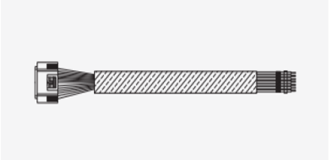

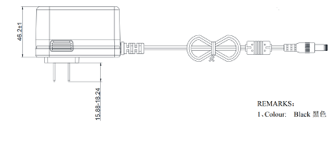

**Fig. 1-1 Test Kit Accessories**

### 1.3 Interface Overview

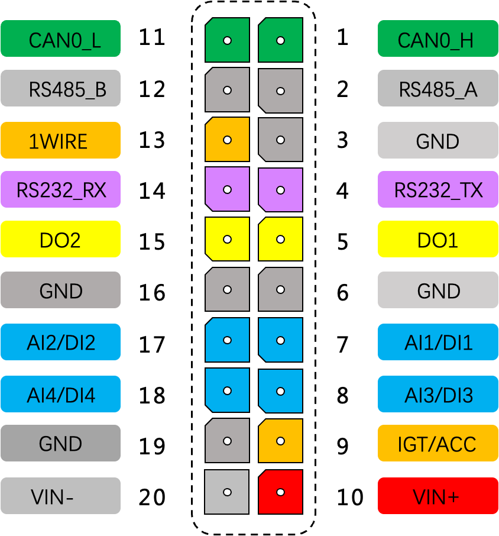

**Fig. 1-2 VT200 Interface**

### 1.4 Interface Details

#### RS232 Serial Port

The VT200 RS232 serial port is used for data transfer only, not for configuring the device. Configuration requires USB-Type C. Connecting the USB-Type C of the VT200 can configure the device like an RS232 serial port.

#### Digital Input (DI)

The DI can detect switching values, such as whether a button is pressed or released, and whether a switch is on or off. The VT200 provides configurable pull-up. The DI has a default 10 kΩ resistor pulled down to GND. When the DI is configured to pull up, there is a 20 kΩ resistor pulled up to the power supply voltage.

**Fig. 1-3 DI Without Pull-up**

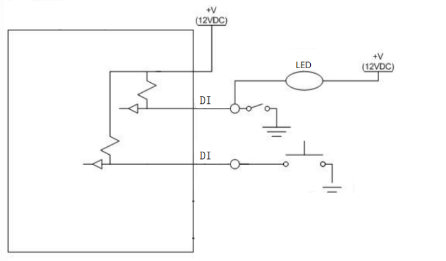

**Fig. 1-4 DI With Pull-up**

#### Digital Output (DO)

The DO can output DC voltage. The DO is an open-drain output that supports a current of 300 mA and usually works with relays.

**Fig. 1-5 DO Connection**

#### Analog Input (AI)

The AI can detect DC voltage. External circuit is connected as follows:

**Fig. 1-6 AI Connection**

#### 1-Wire

The 1-Wire is usually used for small communication equipment, such as digital thermometers and iButton devices. Before use, connect the DQ pin (signal line) of the 1-Wire device to VT200 PIN 13, and connect the VDD and GND pins of the 1-Wire device to the GND of the VT200. The sensor is the DS18B20 type.

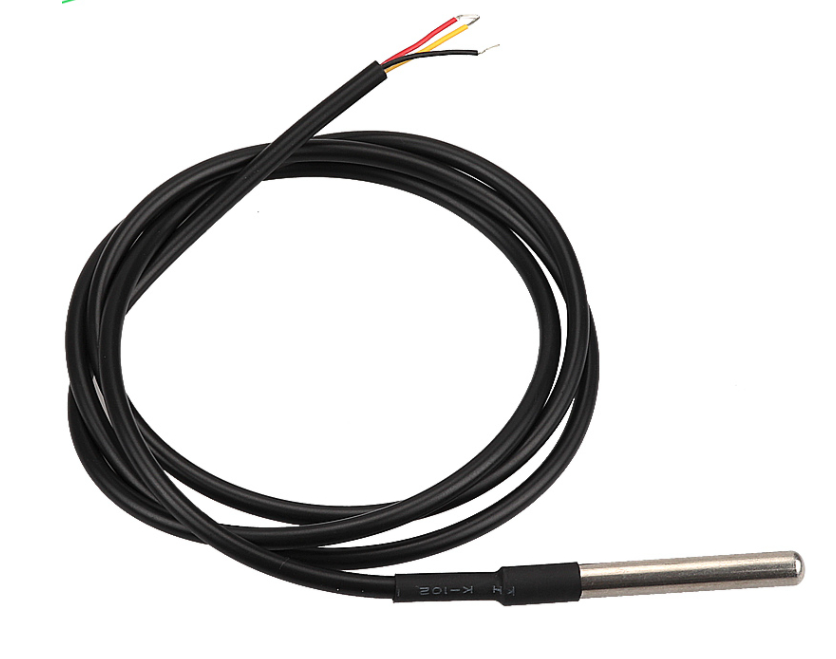

**Fig. 1-7 1-Wire Water Temperature Detection**

#### Ignition Sense (IGT)

IGT is used to connect to the ignition switch of the vehicle. The VT200 can detect whether the connected vehicle is ignited. When using the 20PIN cable for testing, connect the IGT cable and V+ cables to the DC power supply.

### 1.5 LED Indicators

#### GNSS Status Light

| Indicator Status | Function Status |
| --- | --- |
| Long off | Device not started or GNSS disabled |
| Flash (0.5 Hz) | GNSS time service succeeded; GNSS delivery successful |
| Slow flash (1 Hz) | GNSS function enabled |
| Solid | Location success |

#### Cellular Status Light

| Indicator Status | Function Status |
| --- | --- |
| Long off | Device disabled or dialup disabled |
| Flash (0.5 Hz) | Dialup succeeded |
| Slow flash (1 Hz) | Dialup enabled |

### 1.6 Restore Default Account and Password

When the device is restored to factory via hardware, only the username and password are restored to admin/123456 (device certificate file is not restored). Press the Reset button with a screwdriver or other tool for more than 8 s, then release.

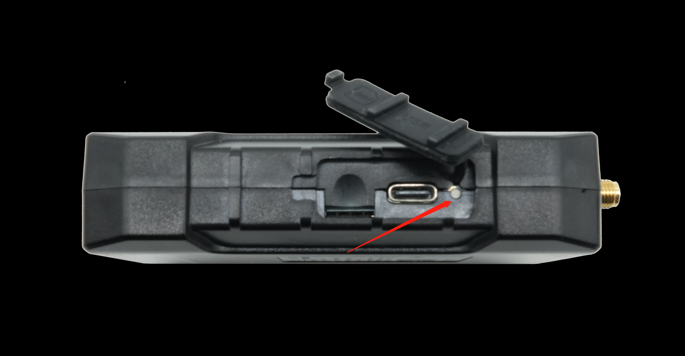

**Fig. 1-8 Reset Button**

**Note:** Double-clicking "Reset" can restart the device when it malfunctions.

### 1.7 Default Settings

| No. | Function | Default |
| --- | --- | --- |
| 1 | Username/Password | admin / 123456 |
| 2 | Serial port baud rate | 115200 |
| 3 | Sleep voltage | 6 V (default) |
| 4 | Wake-up interval | 120 min |
| 5 | Wake-up time | 5 min |

---

## 2. Installation and First Use

### 2.1 Start the VT200

The device is under transportation mode in the factory state. The VT200 needs to be activated by external power supply or the vehicle diagnostic interface.

**Steps:**

1. Insert the 20PIN female head of P1 into the VT200.
2. Connect PIN 20 CONN-X-V- and PIN 10 CONN-X-V+ to the negative and positive poles of the power adapter respectively. Connect PIN 9 CONN-X-IGT and V+ both to the positive side of the power supply.

**Fig. 2-1 Power Connection**

3. Connect USB-Type C to Debug port to configure the VT200. Download the configuration tool and connect the computer and VT200 with USB-Type C.
4. Insert Micro-SIM card as shown. Ensure the Micro-SIM card cut-off corner is pointing forward to the slot.
5. For external antenna models, connect the 4G antenna to the ANT antenna interface and the GNSS antenna to the GNSS antenna interface.
6. After configuration, attach the device top and bottom cover back.

### 2.2 Install Configuration Tool

The tool supports **Windows 10** and **Windows 11**. Windows 7 is not supported.

1. Enter the InHand [Download Center](https://doc-center.inhandnetworks.com/Mobility/InVehicleTelematicsGateways/VT200), and download the tool from VT200 >> VT3_Installer_V1.x.x.
2. Select the default path to complete the installation. If an error occurs after installation, choose "Run as administrator" to open the software.

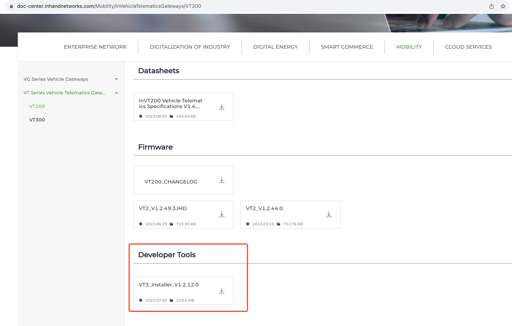

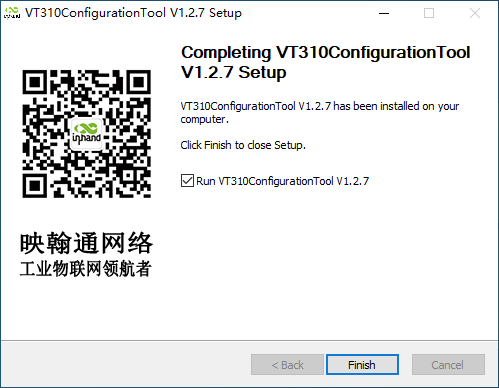

**Fig. 2-2 Download and Install Configuration Tool**

### 2.3 Search COM Port and Login

1. Power the VT200 with an external adapter through the 20PIN all-in-one test cable. Connect the VT200 to the computer through a USB-Type C cable. If the GNSS or cellular light flickers, the device has started successfully.
2. Enter the device management page of the computer and observe the COM port number in "Device Manager" >> "Ports (COM and LPT)".
3. Open the VT310 configuration tool. Click "Connect device", enter the username and password (default: admin/123456), select the recorded serial port, baud rate (default: 115200), and click "Connect".

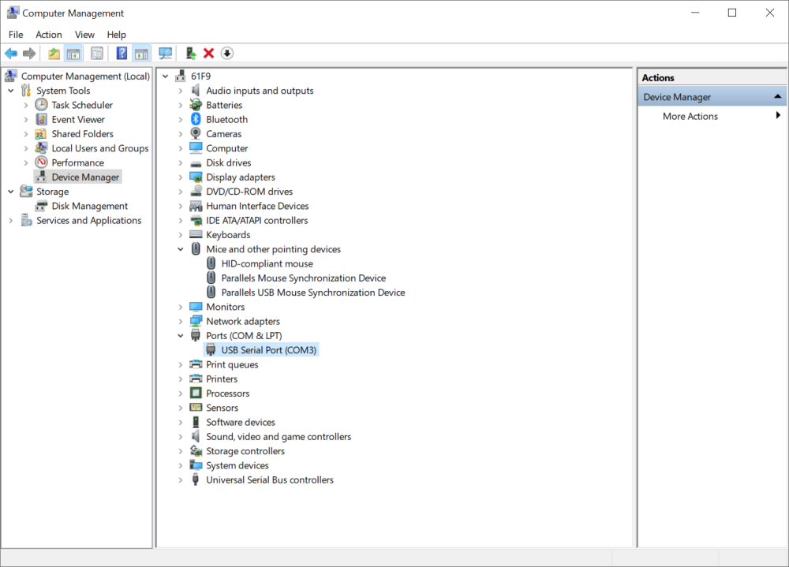

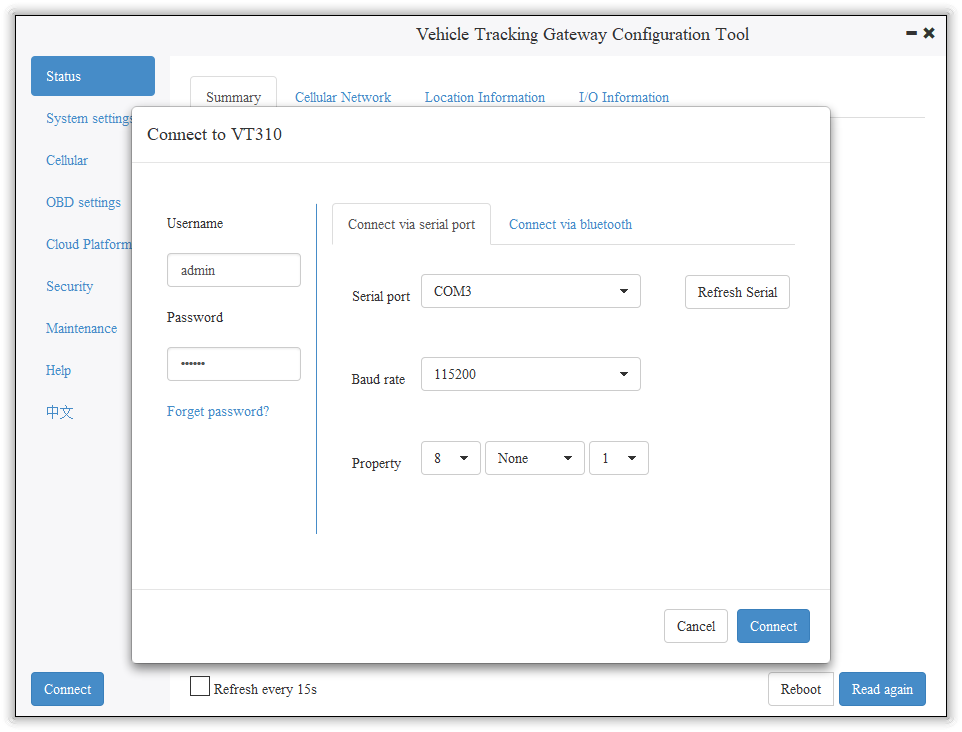

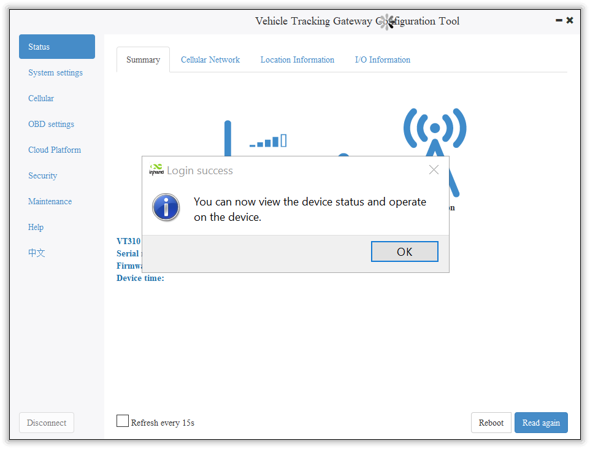

**Fig. 2-3 COM Port and Login**

---

## 3. Common Scenarios

### 3.1 Cellular Configuration

**Goal:** Configure the cellular network for data transmission.  
**Prerequisites:** SIM card inserted, device powered on, config tool connected.  
**Est. time:** ~5 min.

1. Click "Cellular" to enter the configuration page.
2. Generally, configure "Network Access Point Name (APN)", "Network dialing user name", "Network dialing password", and "Authentication mode", then click "Save configuration". The device takes effect after restarting.
3. For private-network cards, set APN (Access Point Name, can be understood as: the operator network's "address plate" that tells the device which entry to use for the mobile network) as required. For special scenarios, click "Show Advanced Options" to configure network dial number, PIN, and default host APN.

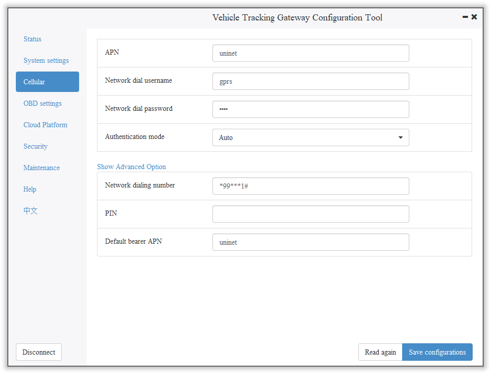

**Fig. 3-1 Cellular Configuration**

### 3.2 Cloud Platform Connection

**Goal:** Connect the VT200 to a cloud platform for data reporting.  
**Prerequisites:** Cellular network connected, platform account created.  
**Est. time:** ~10 min.

The VT200 can only be connected to one cloud platform at a time. Supported platforms include SmartFleet, Wialon, Azure IoT Hub, AWS IoT, Aliyun IoT, and MQTT Broker (e.g., ThingsBoard). Platform configuration takes effect only after the device is restarted.

**SmartFleet:** Platform Type: SmartFleet; Domain: smartfleet.cloud; enter the platform's registered account and license plate number. Login address: [smartfleet.cloud](https://smartfleet.cloud).

**Wialon:** Platform Type: Wialon; Domain: nlgpsgsm.rog; Port: 21000. For custom domain, enter the domain name and port provided by Wialon.

**Azure IoT Hub:** Platform Type: Azure IoT; enter the Connect String created from the Microsoft IoT platform.

**AWS IoT:** Platform Type: AWS IoT; Domain and Port 8883; import certificate and private key via Security >> Import digital certificate / Import private key certificate.

**Aliyun IoT:** Platform Type: Aliyun IoT; enter Product Key, Device Name, Device Secret; select Unique Certificate Per Device or Unique Certificate Per Model.

**MQTT Broker:** Platform Type: MQTT Broker; configure domain name, port, username, and password.

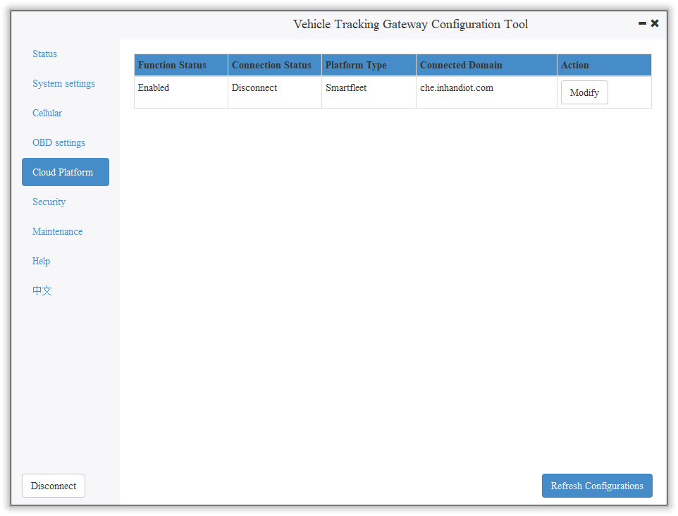

**Fig. 3-2 Cloud Platform Configuration**

---

## 4. Function Reference

This section summarizes the main functions of the VT200. Full parameter tables and configuration details are in the original document.

### 4.1 Status Information

Includes Cellular Network Parameters, Location Information, and I/O Information. Used to check whether the wireless network link is normal and view GNSS and I/O status.

**Entry:** Config tool >> Status pages

### 4.2 System Settings

**Sleep Mode:** Ensures battery life after flameout. Parameters include Enable IGT, Wake-up interval (default 120 min), Wake-up time (default 5 min).

**Account Settings:** Modify the device administrator login information. Default: admin/123456. After modification, the device prompts a restart.

**Entry:** Config tool >> System Settings

### 4.3 Cellular Network

Configure APN, network dialing username/password, authentication mode. Advanced options: network dial number, PIN, default carrier APN.

**Entry:** Config tool >> Cellular

### 4.4 OBD Interface

Configure the vehicle diagnostic interface. Protocol types: AUTO (J1939/J1979), J1939, J1979, or Disable. Mode: Active or Passive. Baudrate: default, 250K, or 500K. OBD CAN interface corresponds to physical layer PIN CAN0_L (PIN 11) and CAN0_H (PIN 1).

**Entry:** Config tool >> OBD

### 4.5 Cloud Platform

Configure SmartFleet, Wialon, Azure IoT Hub, AWS IoT, Aliyun IoT, or MQTT Broker. Each platform has specific parameters (domain, port, credentials, certificates).

**Entry:** Config tool >> Platform

### 4.6 Maintenance

**Firmware Upgrade:** Maintenance >> Upgrade firmware >> Browse file >> Upgrade. Restart after upgrade.

**Import/Export Configuration:** Maintenance >> Import/export configuration file. Export to back up; Import to load. Username and password are not included in the exported file; they can be added manually for import to a new device.

**Entry:** Config tool >> Maintenance

**See also:** [4.3 Cellular Network](#43-cellular-network) | [4.5 Cloud Platform](#45-cloud-platform)

---

## 5. Typical Applications

(Original document does not specify; to be supplemented)

---

## Appendix A Troubleshooting

| Symptom | Possible Cause | Steps | Section |
|---------|----------------|-------|---------|
| Cannot connect to config tool | Wrong COM port or baud rate | Check Device Manager for COM port; use baud rate 115200 | [2.3 Search COM Port and Login](#23-search-com-port-and-login) |
| Config tool error after install | Permission | Run as administrator | [2.2 Install Configuration Tool](#22-install-configuration-tool) |
| Cellular not connected | SIM, APN, authentication | 1. Check SIM insertion 2. Configure APN for private network 3. Set username/password and authentication mode | [3.1 Cellular Configuration](#31-cellular-configuration) |
| Cloud platform not linked | Wrong domain, port, credentials | Verify domain, port, account, license plate (SmartFleet), or certificate (AWS/Azure) | [3.2 Cloud Platform Connection](#32-cloud-platform-connection) |
| Forgot admin password | — | Press Reset button >8 s to restore admin/123456 | [1.6 Restore Default Account and Password](#16-restore-default-account-and-password) |
| Device not started | Transportation mode | Activate by external power or vehicle diagnostic interface | [2.1 Start the VT200](#21-start-the-vt200) |

---

## Appendix B Security Precautions

1. Use the original or compatible power adapter (12 V/2 A) to avoid damage.
2. Do not install the device in strong electromagnetic interference environments.
3. Ensure the operating environment meets the temperature and humidity requirements in the specification.
4. When inserting or removing the SIM card, follow the correct orientation (cut-off corner pointing forward).
5. Do not disassemble or modify the device; this may cause safety risks and void the warranty.
6. Exported configuration files do not contain username and password; add them manually if importing to a new device with custom credentials.

---

## Appendix C Get Device Log (CLI)

For users who need to obtain device logs via serial port. Connect the computer to the VT200 through USB-Type C, open a serial port tool (e.g., from Microsoft Store), select the COM port, baud rate 115200/8/n/1. Character encoding: ASCII; Line break: \n (LF). Send username admin and password 123456 to enter CLI mode. Enter "log console enable" to enable logs; "log console disable" to disable. Enter "exit" to exit CLI mode (or wait 180 s for auto exit).

---

**Note:** Full descriptions of Sleep Mode state machine, OBD parameters, SmartFleet/Wialon/Azure/AWS/Aliyun/MQTT/ThingsBoard configuration steps, certificate import, firmware upgrade, and configuration import/export, including screenshots, are in the original document.
