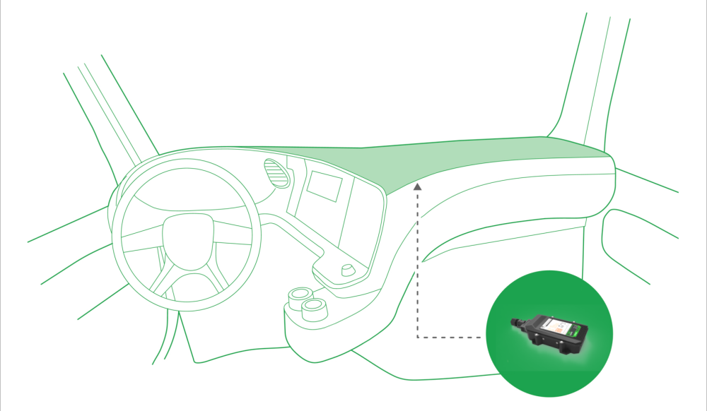

# Vehicle Telematics Mounting recommendations V 1.1

## Vehicle Telematics Mounting recommendations V 1.1

**Connecting Wires**

• Wires should be connected while module is not plugged in.

• Wires should be fastened to the other wires or non-moving parts. Try to avoid heat emitting and moving objects near the wires.

• The connections should not be seen very clearly. If factory isolation was removed while connecting wires, it should be applied again.

• If the wires are placed in the exterior or in places where they can be damaged or exposed to heat, humidity, dirt, etc., additional isolation should be applied.

• Wires cannot be connected to the board computers or control units.

**Connecting Power Source**

• Be sure that after the car computer falls asleep, power is still available on chosen wire. Depending on car, this may happen in 5 to 30 minutes period.

• When module is connected, be sure to measure voltage again if it did not decrease.

• It is recommended to connect to the main power cable in the fuse box.

• Use 3A, 125V external fuse.

**Connecting Ignition Wire**

• Be sure to check if it is a real ignition wire – power does not disappear while starting the engine.

• Check if this is not an ACC wire (when key is in the first position, most electronics of the vehicle are available).• Check if power is still available when you turn off any of vehicles devices.• Ignition is connected to the ignition relay output. As alternative, any other relay, which has power output, when ignition is on, may be chosen.**Connecting Ground Wire**

• Ground wire is connected to the vehicle frame or metal parts that are fixed to the frame.

• If the wire is fixed with the bolt, the loop must be connected to the end of the wire.

• For better contact scrub paint from the place where loop is connected.

*PAY ATTENTION! Connecting the power supply must be carried out in a very low impedance point on-board vehicle network. These points in the car are the battery terminals. Therefore, we recommend connecting the power of FMB640 (wire GND and POWER) directly to the battery terminals. Another valid option is to connect the wires to the main POWER cable inside the fuse box (if there is none, then to the power supply where the fuses of vehicle’s computer are), wire GND must be connected in a special point, designed to connect GND vehicle computer. Connecting the GND at an arbitrary point to the mass of the car is unacceptable, as static and dynamic potentials on the line GND will be unpredictable, which can lead to unstable FMB640 and even its failure.*

**Connecting Antennas**

• Gently connect antennas to device by hands, without using additional equipment like pliers. The tightening torque for fixing the connector must be up to 0.5 – 0.7 Nm (‘handtightened’).• When placing antennas avoid easily reached places.

• Avoid GNSS antenna placement under metal surfaces.

• Avoid placing Vehicle Telematics  device near car radio, speakers or alarm systems.

• GNSS antenna must be placed so its state is as horizontal as possible (if antenna is leant more than 30 degrees, it is considered incorrect mounting).• GNSS antenna cable cannot be bent more than 80 degrees.

• GNSS antenna must be placed sticker facing down.

It is recommended to place GNSS antenna behind dashboard as close to the window as possible. A good example of GNSS antenna placement is displayed in a picture below (area colored blue).

**Module Installation**

• Module should not be seen or easily reached.

• Module should be firmly fixed to the surface or cables.

• Module cannot be fixed to heat emitting or moving parts.

• SIM card should be inserted in the module while the connector is plugged off (while module has no power).
