# Vehicle Telematics VT310/320 User Manual

Revision History

| Version | Data | Auther | Descripition |
| :--- | :--- | :--- | :--- |
| 1.0  | 2021-5-10 | Sun Zhandong | Creation of the document |
| 1.2 | 2021-8-15 | Sun Zhandong | Add VT320 Product into document |
| 1.3 | 2024-5-30 | Tian Minghui | Update the new tool picture |
| 1.4 | 2024-12-05 | Tian Minghui | Update |

## Chapter I Product Introduction and Preparation

## 1. Introduction

### 1.1 Overview

The VT300/320 series vehicle tracking gateway is an asset tracking product that features cost-effectiveness, rich interfaces and strong performance. It is suitable for industries such as logistics and transportation, engineering vehicle monitoring and so on. It offers precise positioning with GNSS, tracking and monitoring the status, history track, geofencing, abnormity alarm and other functions of vehicles and drivers, combined with the vehicle network cloud platform, can realize remote vehicle management, asset tracking, preventive maintenance, helping fleet operators save costs and improve efficiency. The device provides sub-models that support wireless network access of various speeds such as LTE CatM1, Cat1, Cat4, etc.

## 1.2 Packing List

### 1.2.1 VT310 Standard Packing List

Standard product guarantee, including 1 device and 4 screws. Accessories need to be purchased separately.

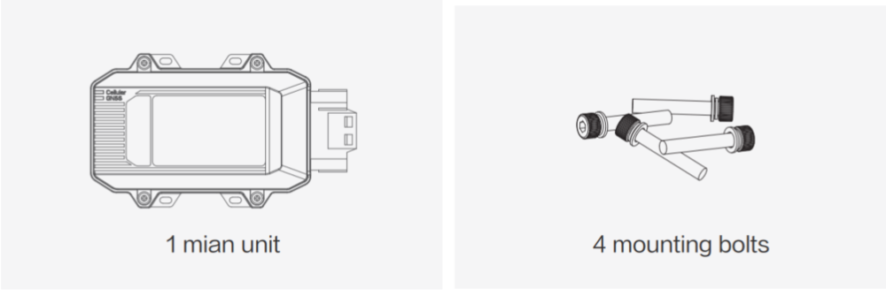

### 1.2.2 VT310 Optional Accessories

Optional accessories are not included in the default equipment package and need to be selected according to the actual situation.

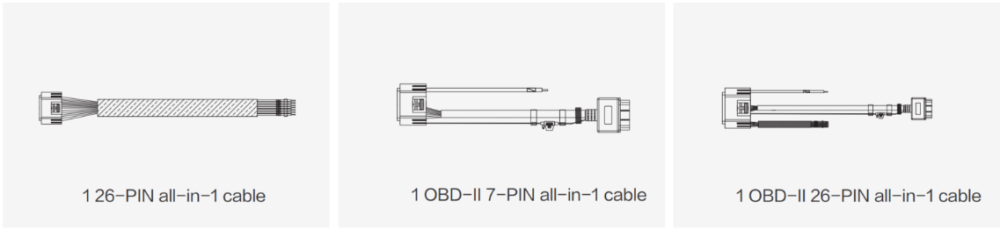

| Product Name | MLFB | Specifications |
| :--- | :--- | :--- |
| 26PIN all-in-one test cable  | SCAB000229 | The cable has P1 and P2 ends: P1 is 26PIN female, connected to VT; P2 is open end, which requires a 9-48V adaptor. Suitable for engineering environments and indoor tests.  |
| OBD-II7 PIN all-in-one cable | SCAB000231 | The cable has P1, P2 and P3 ends: P1 is 26PIN female connected to VT; P2 is OBD-II male connected to the vehicle; P3 is ignition signal terminal connected to the ignition on/off. Suitable for heavy trucks with OBD-II vehicle diagnostic interfaces, and powers VT through interfaces. |
| OBD-II 26 PIN all-in-one cable | SCAB000232  | This cable has P1, P2, P3 and P4 ends: P1 is 26PIN female connected to VT; P2 is OBD-II male connected to the vehicle; P3 is open end that includes I/O, RS232-1 and 1-Wire; P4 is ignition signal terminal connected to the ignition on/off. Suitable for heavy trucks with OBD-II vehicle diagnostic interfaces, and powers VT through interfaces. Recommended for customers who need DI, DO, AI, 1-Wire devices or vehicle-mounted controllers. |

- *InHand can customize different cables for customers. Customers need to contact the sales manager.*

### 1.2.3 VT320 Optional Accessories

| Product Name | MLFB | Specifications | | | |
| :--- | :--- | :--- | --- | --- | --- |
| 26PIN All-in-one Test Cable | SCAB000370 | The cable has P1 and P2 ends: P1 is 26PIN female, connected to VT320; P2 is open end, which requires a 9-48V adaptor. Suitable for engineering environments and indoor tests. 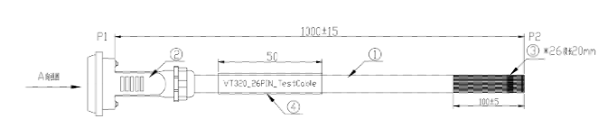 | | | |

### 1.2.3 Optional Accessories

Initial test, the user can select different accessories according to the form of the vehicle diagnosis interface.

OBD cable and J1939 cable can use VT series product.

| Product Name | MLFB | Specifications | | | |
| :--- | :--- | :--- | --- | --- | --- |
| OBD 16PIN Test Cable | SCAB000399  | OBD 16PIN interface test line,Cable standard UL2464,wire length 1500mm 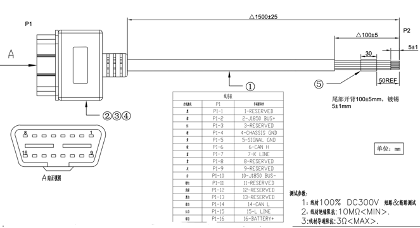 | | | |
| J1939 6PIN Test Cable | SCAB000409 | J1939 6PIN interface test line,Cable standard UL2464, wire length 1500mm 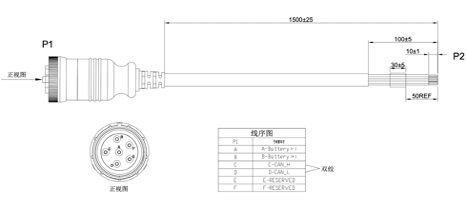 | | | |
| J1939 9PIN Test Cable | SCAB000410 | J1939 9PIN interface test line,Cable standard UL2464, wire length 1500mm 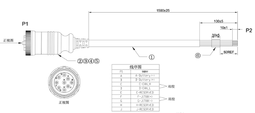 | | | |

## 1.3 Product Appearance

### 1.3.1 VT310 Product Appearance Introduction

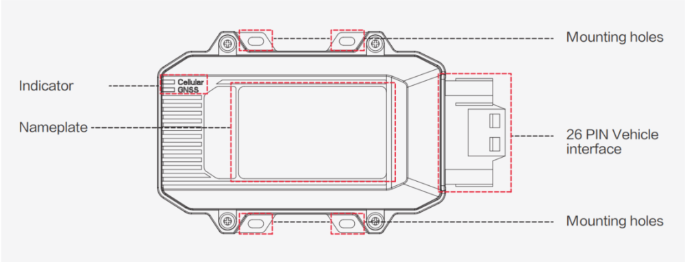

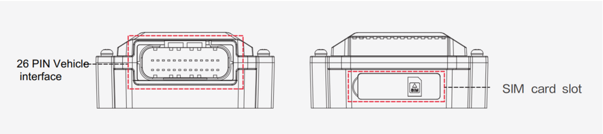

### 1.3.2 VT320 Product Dimensions

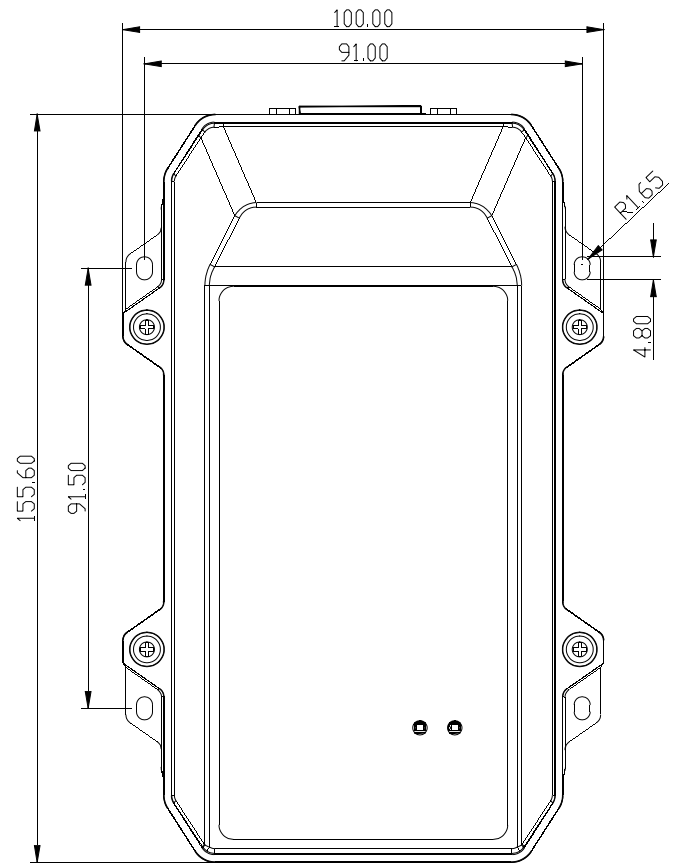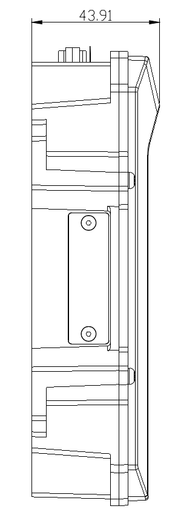

VT320 Dimension (Uint mm)

## 2. SIM and Cable Installation

For general cases, the device can be used after mounted onto the vehicle, with SIM card inserted and cable installed.

### 2.1 Install SIM Card

In the case of dial-up Internet access, a SIM card is needed. The VT will dial automatically once it is powered and started. Open the waterproof baffle on the downside of the VT and insert the SIM card into the slot in the direction shown in the picture.

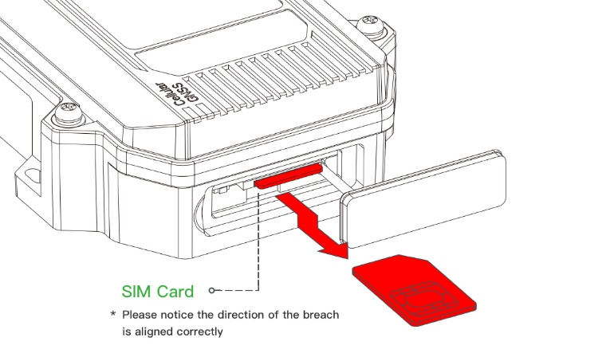

### 2.2 Mount the Tracker

Customers can fix the VT onto the vehicle with installation bolts. It is recommended that the tracker be installed under the front windshield of the vehicle, where GPS signal is better received and connection to the OBD-II diagnostic interface is easier.

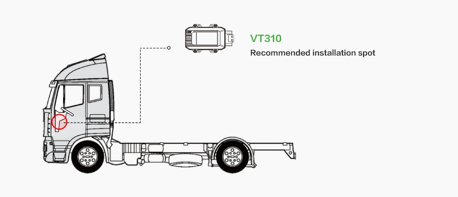

### 2.3 Introduction and Use of Cables

We offer three types of cables for different application scenarios. Wiring methods of them will be shown below respectively.

### 2.3.1 VT310 26PIN All-in-one Test Cable Link

In order to help customers test and log in the equipment in the office, InHand provides test kits: 9-48V adapter or AC to DC 9~48V power supply, RS232 to USB as shown in the table below.

| Product Name | MLFB |  |
| :--- | :--- | :--- |
| DC 5.5*2.1mm Female Connector | ECON000047 | 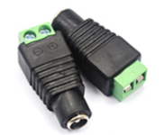 |
| Power adapter 12V/2A | APWR000122/121 |  |
| USB to 485 / 232 connector | ASER010009 | 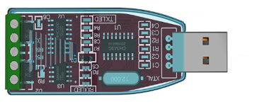 |
| 26PIN All-in-one Test Cable | SCAB000229 |  |

From left to right: Power supply module DB9-RS232 female connector, USB to serial port line.

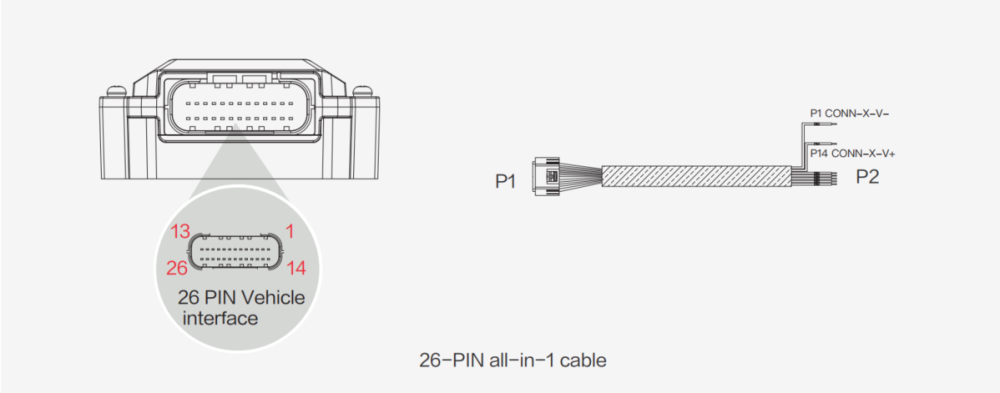

Steps:

1. Insert the 26PIN female head of P1 into the VT310;
2. Connect P1 CONN-X-V- and P14 CONN-X-V+ to the negative and positive poles of the power adapter respectively. P15 CONN-X-IGT and V + are both connected to the positive side of the power supply;

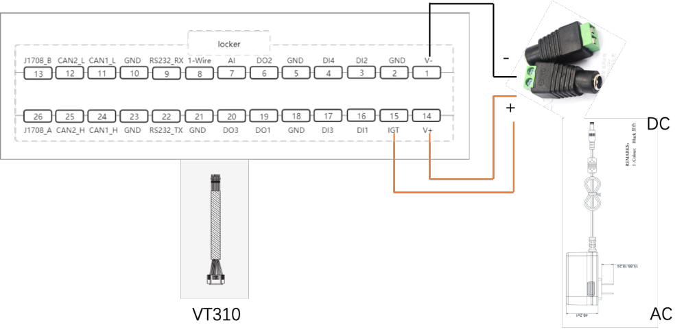

1. Connect the CONN-RS232-RX1, CONN-RS232-TX1 and GND (any) of the cable to the TXD, RXD and GND holes of the DB9 connector or USB 232 connector. Then connect the USB to DB9 cable to the computer, as is shown below.

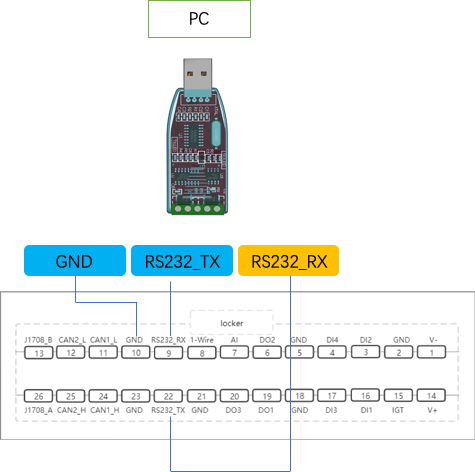

### 2.3.2 VT310 OBD-II 7PIN All-in-one Test Cable

Suitable for heavy trucks with OBD-II diagnostic interfaces. The VT310 is powered by the OBD diagnostic interface, so the vehicle needs to be started to get the VT310 working.

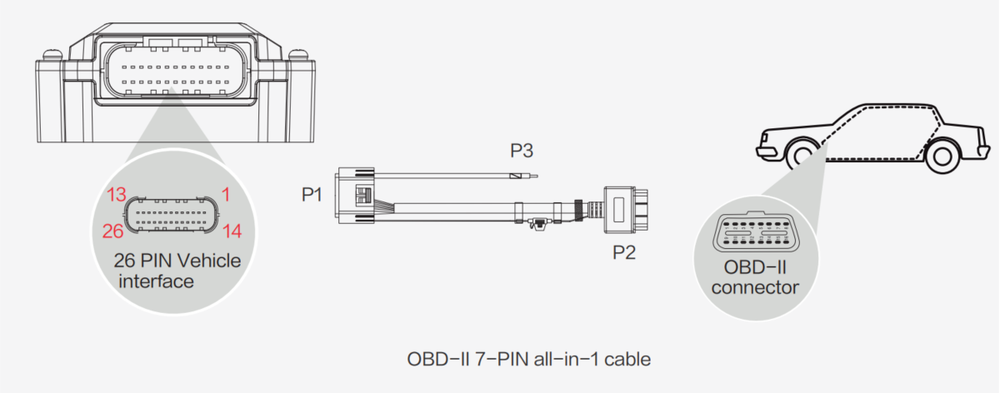

Steps:

1. Insert the 26PIN female head of cable P1 into the VT;
2. Connect P2 to the OBD-II diagnostic interface of the vehicle;
3. If you need to judge whether the vehicle is ignited, you can connect P3 to the ignition switch of the vehicle.

### 2.3.3 VT310 OBD-II 26PIN All-in-one Test Cable

Suitable for heavy trucks with OBD-II diagnostic interfaces. The VT310 is powered by the diagnostic interface, so the vehicle needs to be started to get the VT310 working.

Compared with the OBD-II 7-pin all-in-one test cable, a 19-pin I/O bare wire end is added. This is recommended for customers with demand for I/O or 1-Wire hardware access.

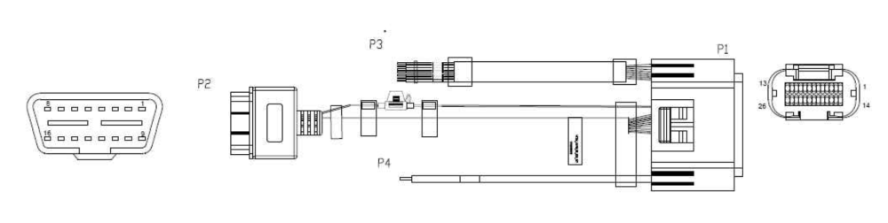

Steps:

1. Insert the 26PIN female head of cable P1 into the VT310 interface;
2. Connect P2 to the OBD-II diagnostic interface of the vehicle;
3. If you need to judge whether the vehicle is ignited, you can connect P3 to the ignition switch of the vehicle;
4. For P3 bare wire, you can connect your I/O devices according to your needs, which will be described later.

### 2.3.4 VT320 26PIN All-in-one Test Cable Link

This cable is suitable for indoor testing and the tracker login. A 9-48V adapter or 9-48V AC/DC power supply, a DB9-RS232 serial port female connector and a USB to serial port line are required, as are shown below.

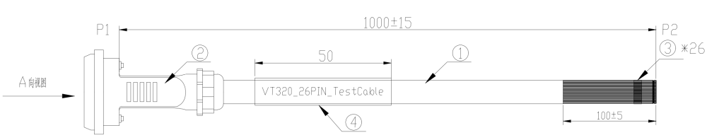

Steps:

1. Insert the 26PIN female head of P1 into the VT320;

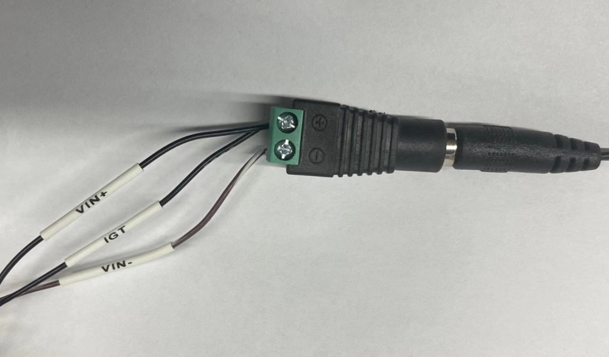

1. Connect P2 VIN+ and VIN- to the negative and positive poles of the power adapter respectively. IGT and VIN+ are both connected to the positive side of the power supply; （ ECON000047 Power connector - DC 5.5 * 2.1mm female and AC/DC Power adapter 12V/2A . New customers can purchase with InHand ）

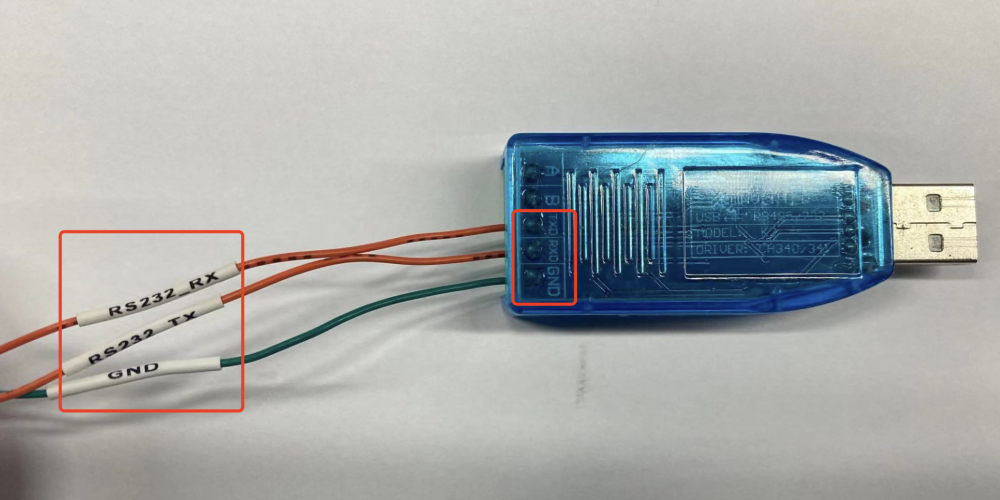

1. Connect the RS232-RX, RS232-TX and GND (any) of the cable to the TXD, RXD and GND holes of the USB 232 connector. (ASER010009 USB to 485/232 connector. New customers can purchase with InHand)

### 2.4 VT310 Connect to the I/O Interface

The I/O interface is integrated into the 26PIN vehicle interface, providing 3 digital outputs (max. current 300mA), 4 digital inputs, 1 analog input, 1 1-Wire, an RS232 serial port and an ignition signal. Following is an example of how to use the I/O interface.

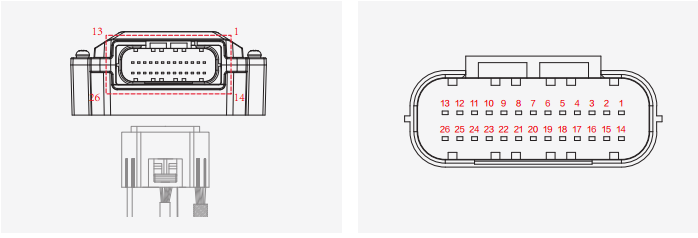

### 2.4.1 VT310 Definition of 26PIN Interface

| PIN | Name | PIN | Name | PIN | Name | PIN | Name |
| :--- | :--- | :--- | :--- | :--- | :--- | :--- | :--- |
| 1 | V- | 8 | 1-Wire | 14 | V+ | 21 | GND |
| 2 | GND | 9 | RS232_RX | 15 | IGT | 22 | RS232_TX |
| 3 | DI2 | 10 | GND | 16 | DI1 | 23 | GND |
| 4 | DI4 | 11 | CAN_1L | 17 | DI3 | 24 | CAN_1H |
| 5 | GND | 12 | CAN_2L | 18 | GND | 25 | CAN_2H |
| 6 | DO2 | 13 | J1708_B | 19 | DO1 | 26 | J1708_A |
| 7 | AI | | | 20 | DO3 | | |

### 2.4.3 VT320 Definition of 26PIN Interface

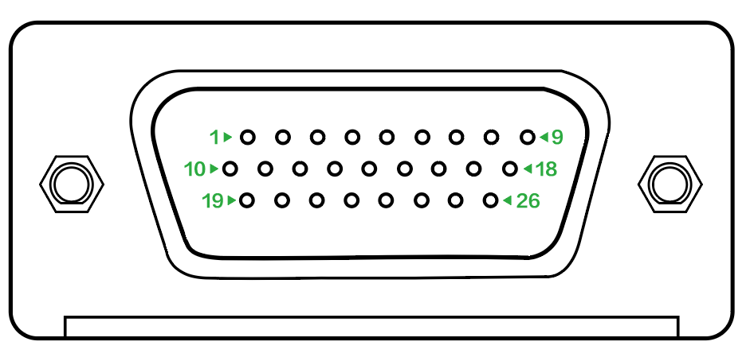

| PIN | Definition | colour | Description | |
| --- | :---: | :---: | --- | --- |
| 1 | DI1 | Blue | Digital input port 1 | Status "1" 2.7V~48V / "0" 0~1V |
| 2 | DI2 | Blue/White | Digital input port 2 | |
| 3 | DI3 | Yellow | Digital input port 3 | |
| 4 | DI4 | Green | Digital input port 4 | |
| 5 | GND | Purple | Ground | |
| 6 | DO1 | White | Digital output port 1 | Staus "0" 0~0.3V / Hi-Z |
| 7 | DO2 | Brown | Digital output port 2 | |
| 8 | DO3 | Orange | Digital output port 3 | |
| 9 | 1WIRE | Gray | One Wire Bus | |
| 10 | VIN- | Black | Negative electrode | |
| 11 | GND | Black/White | Ground | |
| 12 | AI | Red | Analog input | 0.5～ 48V |
| 13 | GND | Red/White | Ground | |
| 14 | J1708_B | Blue | J1708 bus B | |
| 15 | J1708_A | Blue/White | J1708 bus A | |
| 16 | RS232_RX | Yellow | Serial RS232 Recive | |
| 17 | RS232_TX | Green | Serial RS232 Send | |
| 18 | GND | Purple | Serial RS232 Ground | |
| 19 | VIN+ | White | Positive electrode | |
| 20 | IGT | Brown | Igntion singal | |
| 21 | GND | Orange | Ground | |
| 22 | CAN1_H | Gray | CAN1 bus H | |
| 23 | CAN1_L | Black | CAN1 bus L | |
| 24 | GND | Black/White | Ground | |
| 25 | CAN2_L | Red | CAN2 bus H | |
| 26 | CAN2_H | Red/White | CAN2 bus L | |

### 2.4.2 RS232 Serial Port

The RS232 serial port is used for debugging. Connect the RS232_RX, RS232_TX, and GND of the VT to TXD, RXD, and GND of the DB-9 serial port. Use RS232 to USB cable to connect with DB-9 serial port.

### 2.4.3 Digital Input (DI)

The DI can detect the switching value, such as whether the button is pressed or bounced, and whether the switch is on or off. The VT provides configurable pull-up. The DI has a default 10kΩ resistor pulled down to GND. When the DI is configured to pull up, there is a 20kΩ resistor pull up to the power supply voltage. When using DI, it is necessary to distinguish between pull-up and no pull-up.

When the DI has no pull-up power supply, the external circuit is connected as follows:

When the DI has a pull-up power supply, the external circuit is connected as follows:

### 2.4.4. Digital Output (DO)

The DO can output DC voltage. The DO is an open-leakage output that supports a current of 300mA and usually works with relays.

### 2.4.5. Analog Input (AI)

The AI can detect DC voltage, and customers can directly access the analog quantity of voltage. External circuit is connected as follows:

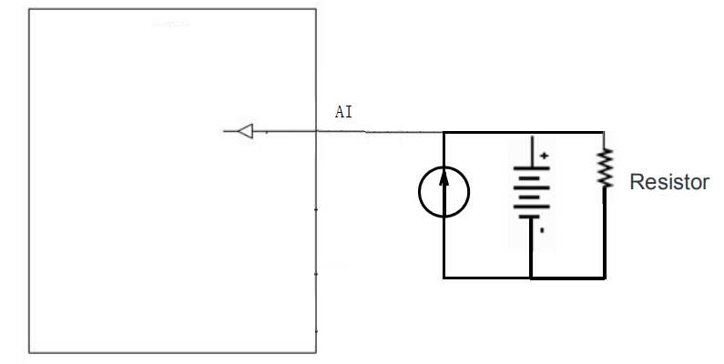

- **AI Input Voltage Range: 0.5 to 48V, Detection Accuracy: ±0.015V, Maximum Operating Current: 2μA  
**

### 2.4.6. 1-Wire

The 1-Wire is usually used for small communication equipment, such as digital thermometers and iButton devices. Before use, the customer needs to connect the DQ pin (signal line) of the 1-Wire device to the VT PIN8, and connect the VDD and GND pins of the 1-Wire device to the GND of the VT. The sensor is the less02b type. The following picture shows the water temperature detection wires of the 32 digital temperature sensor probe.

### 2.4.7 Ignition Sense

IGT(Ignition sense): IGT is used to connect to the Ignition switch of the vehicle. When IGT enable, the VT/VT320 can detect whether the connected vehicle is ignited. When using the 20PIN cable for testing, connect the IGT cable and V+ cables to DC power supply.

## 3. Start the VT300/200

After the customer completes the installation according to the above steps, the device can be started for debugging. The condition of the device can be told through the status indicator. To avoid consumption of battery power during transportation, the device is under transportation mode in the factory state, so the VT battery needs to be activated by external power supply or the vehicle diagnostic interface and the VT320 battery need to open battery switch to activate.

### 3.1 GNSS Status Light

| Indicator Status | Function status |
| :--- | :--- |
| Long annihilation | The device is not started or the GNSS function is disabled. |
| Flash (frequency: 0.5Hz) | GNSS Time service succeeded GNSS delivery successful |
| Slow flash (frequency: 1Hz) | GNSS function enabled |
| Solid | Location success |

### 3.2 Cellular Status Light

| Indicator status | Function status |
| :--- | :--- |
| Long annihilation | The device is disabled or the dialing function is disabled. |
| Flash (frequency: 0.5Hz) | Dialed successfully |
| Slow flash (frequency: 1Hz) | Dialing enabled |

## Chapter II Login and Device Configuration

## Install the Configuration Tool

The tool software supports the installation OS environment: **Windows 10, Windows 11;**

### Download Configuration Tools

Enter the Download Center of InHand's [Website](https://www.inhand.com/en/resources-center/#/Mobility/InVehicleTelematicsGateways/VT300), and download the configuration tool installation package.

Select the default path to complete the installation, as is shown below.

Select the installation user:

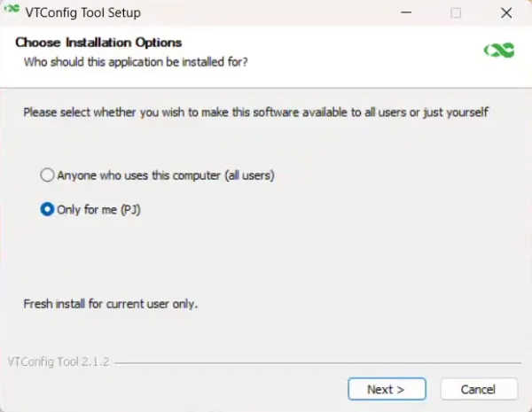

Select the installation path. By default, do not change the installation path. Click Install and wait until the installation is complete.

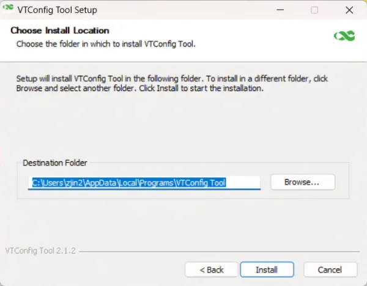

complete the installation.

### Search for the COM Port Number

Power the VT with an external adapter through the 26PIN all-in-one test cable. The VT is connected to the computer through a USB to serial port cable. If the GNSS or cellular light flickers, the device is started successfully.

Enter the device management page of the computer and observe the COM slogan in the "device manager"> "ports (COM and LPT)" of the computer, as is shown below.

### Login to the Device

The VT310 and VT320 software have the same functions and configuration methods.

Open the VT config tool. If an error message appears, open it as an administrator.

Click connect to connect to serial port. If you have logged in to the device for the first time or have never changed the user name and password, keep the default values. The serial port number must be correct. If the baud rate has not been changed, the factory default is 115200bps.

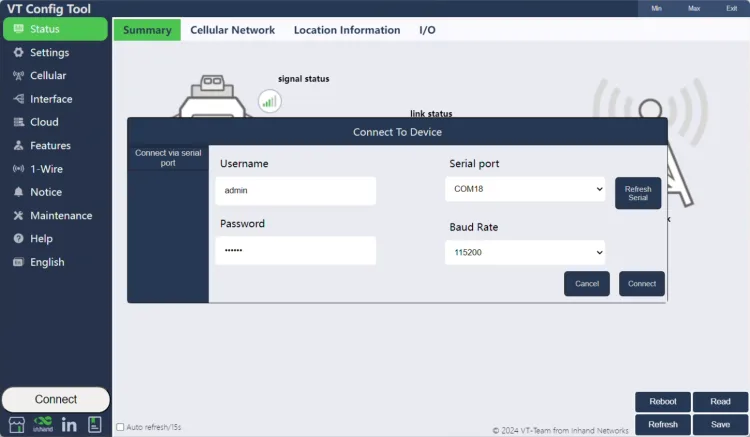

**Login success:**

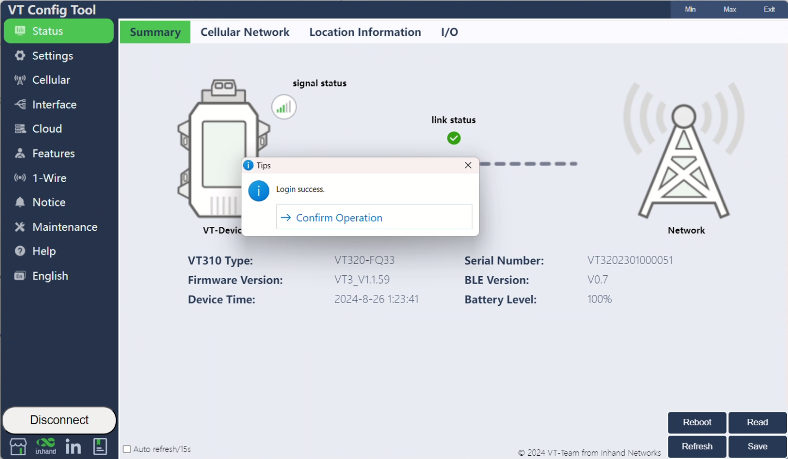

**Login to device failed, check user name or password:**If you need to check whether the baud rate is correct, switch the baud rate and reconnect. If the user name and password of the device have been changed, use the correct user name and password.

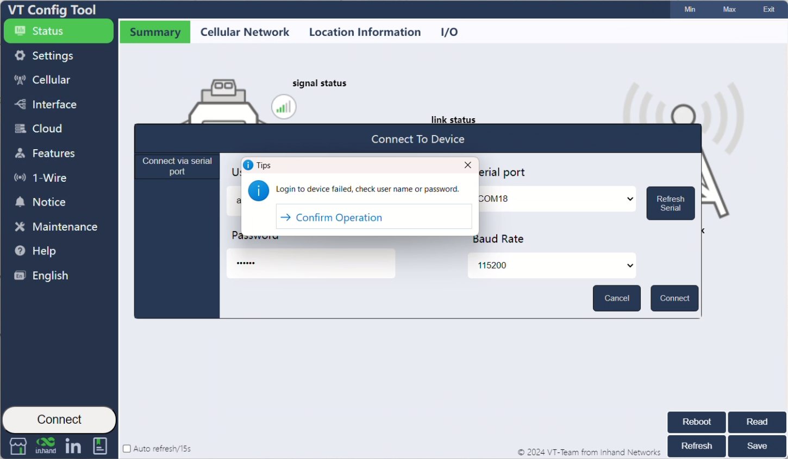

## Status

Basic device information and operating status of the device.

### Summary

The summary page displays the basic information and status information of InVehicle Telematics equipment, including: device model, serial number, firmware version, Bluetooth version, device time, battery level, network connection status and network signal value. At present, the configuration tool supports connected InVehicle Telematics including VT300 series, VT200 series; Serial number is set when the equipment is delivered, as the unique identification of the equipment; Firmware version for the current device firmware version number, available from [Website](https://www.inhand.com/en/resources-center/#/Mobility/InVehicleTelematicsGateways/VT300) The latest firmware version is recommended. The Bluetooth version is the Bluetooth firmware version of the device. If the device model does not support Bluetooth, it is unknown. The battery power is the remaining power of the current device. If no battery is installed, it will be displayed as unknown.

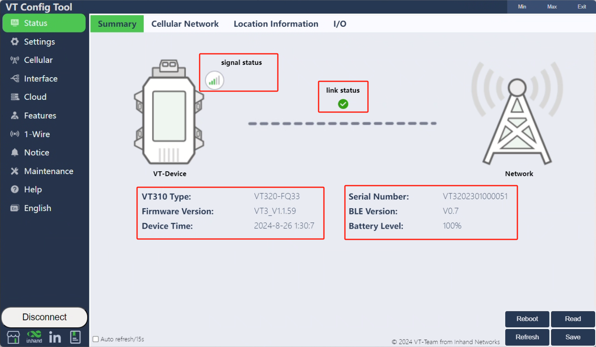

### Mobile Network Parameters

On this page are mobile network link parameters, which are used mainly to check whether the wireless network link is normal. All parameters read when the SIM is not inserted are default parameters. After the device is connected to the Internet through the SIM card, it can obtain the IP address for data transmission. For configuration of mobile network parameters, please refer to Configure the Cellular Network.

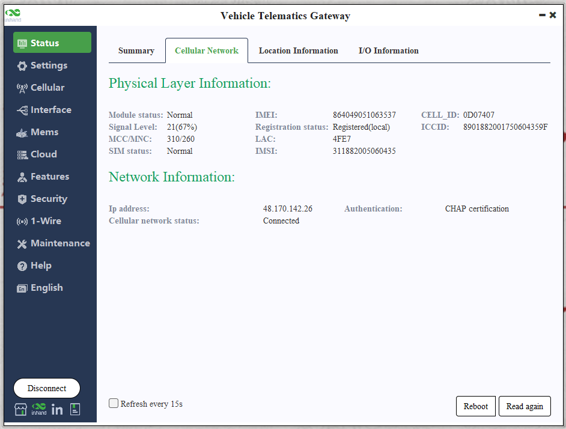

| Parameter | Description |
| --- | --- |
| Module status | Normal/Unidentified |
| Signal value | Indicates the signal strength of the connected wireless network. Valid values: 0 to 31. |
| MCC/NMC | MCC (mobile country code), MNC (mobile network code), read from the SIM card |
| SIM status | Normal/Unidentified |
| IMEI | The International Mobile device identification code (International Mobile Equipment Identity) is the built-in dialing module code of the vehicle gateway. |
| Registration status | Registered/Not registered |
| LAC | LAC(Location area code ) , obtain this parameter from the base station after dialing successfully |
| IMSI | IMSI(International Mobile Subscriber Identity) this parameter is read from the SIM card |
| CELL_ID | This parameter is obtained from the base station after dialing successfully. |
| ICCID | The ID of the integrated circuit card is the SIM card number and ICCID (integrated circuit card identity). This parameter is read from the SIM card. |
| IP ADDRESS | After the dialing is successful, the carrier assigns the IP address of the network access. |
| Cellular status | Connected/Not connected |
| Authentication method | CHAP/PAP |

### Location Information

The location information page shows the latest parameters obtained by the GNSS module. It includes location information and related parameters of the inertial sensor. As is shown below.

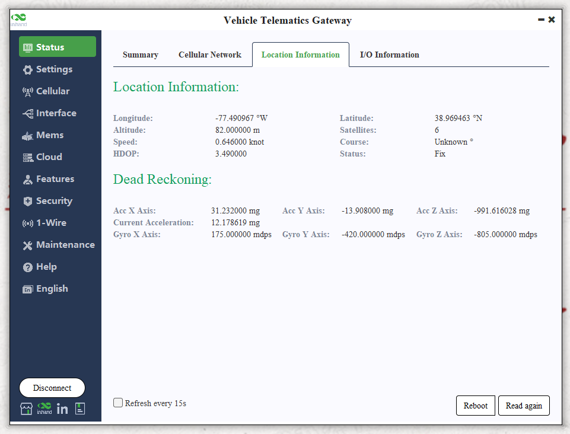

### I/O

The I/O status page displays the input status of external digital signals and analog signals; Including ignition signal (IGT), digital input 1, digital input 2, digital input 3, digital input 4 and analog input.

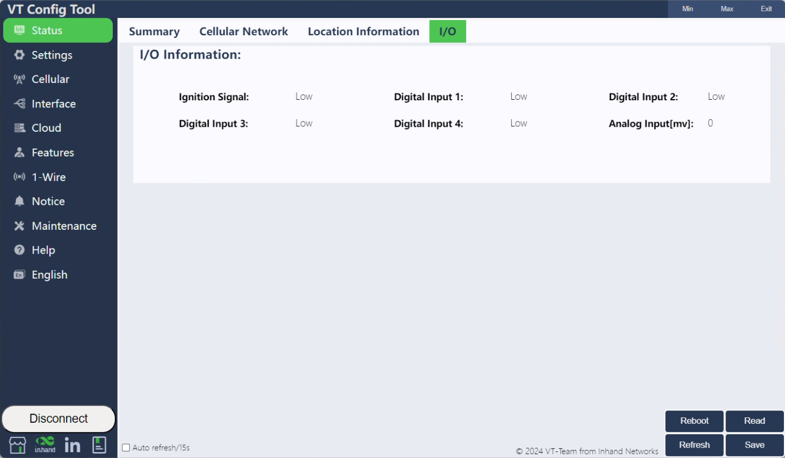

## System Settings

Set sleep mode and wake up working modes of InVehicle Telematics. Set Wakeup interval, Wakeup Running time and Sleep Delay time to meet different low-power operation modes, which can ensure normal and stable operation of basic functions of the system and save power.

You need to enter the correct user name and password to log in to the device through this tool. You can change the user name and password through the account setting.

### Sleep Mode

The sleep mode ensures the battery life after flameout, providing continuous guarantee for special environments. The state machine is as follows:

Description of the state machine:

Run, Sleep, and Temp run represent normal running status, sleep status, and temporary running status respectively.

① Corresponding to the state machine, the condition from Run to Temp run is that the power supply voltage is less than sleep voltage (6V by default) or IGT OFF (IGT needs to be enabled in the configuration), by default, the device continues to run for 15S temp (for reporting information) and then enters Sleep;

② Corresponding to the state machine, the condition of entering Sleep from the Temp run is that after the device runs a wake-up runtime cycle in the Temp run or after the device runs Temp Run for 15s from run;

③ Corresponding to the state machine, the condition from Sleep to Run is that the power supply voltage is greater than Sleep voltage or IGT ON (IGT needs to be enabled in configuration);

④ Corresponding to the state machine, the condition of entering the Temp run from Sleep is that after the device runs a wake-up interval in Sleep;

⑤ Corresponding to the state machine, the condition from Temp run to Run is that the power supply voltage is greater than sleep voltage or IGT ON (IGT needs to be enabled in configuration);

Configure the sleep mode:

| Parameter | Description |
| :--- | :--- |
| Enable IGT | After IGT is enabled, the device uses the IGT status as the condition for entering or exiting Sleep. The IGT status is not ticked by default. |
| Wake-up interval | The interval between the device automatically wakes up in Sleep, whose default value is 120 minutes. When the value is 0, device will do not enter sleep mode. |
| Wake-up time | The interval between the time when the device enters the next Sleep, whose default value is 5 minutes. |
| Sleep Delay | Wait time for enter sleep. |

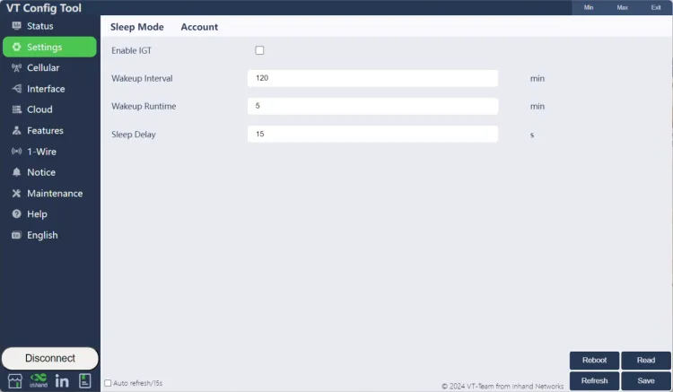

ps：When device in Temp run and sleep, light is off.

### Account Settings

If you need to change the password, set the administrator account and password to manage the permission to log in to the device. After changing the password, you need to restart the device to take effect. You need to log in to the device with the new password when connecting to the device again.

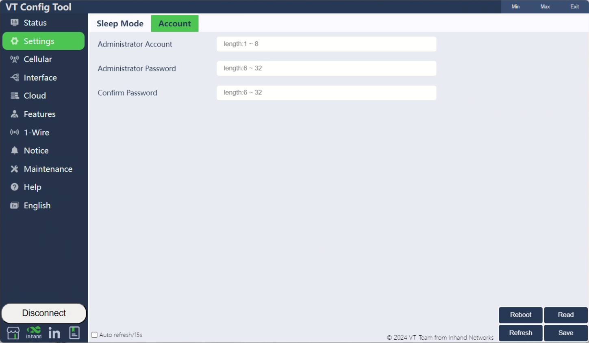

## Configure the Cellular Network

Set the working parameters of the Cellular.

### Network

Click "Cellular" to enter the configuration page. Generally, customers only need to configure "Network Access Point Name (APN)", "Network dialing user name", "Network dialing password" and "Authentication mode" and click "Save configuration". The device takes effect after restarting.

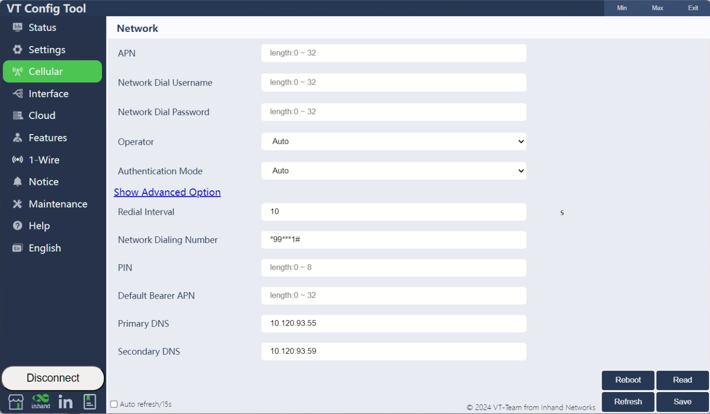

| Parameter | Description |
| :--- | :--- |
| APN | This parameter is required when the APN private network is connected to the mobile network. Most public network service SIM cards do not authenticate APN when dialing. |
| Network dialing username | When the private network is AAA certified, the mobile network operator needs to provide this parameter. |
| Network dialing password | This is required by the carrier during the AAA certification for the private network. |
| Authentication mode | Automatic/CHAP/PAP. This parameter is required when the private network is AAA certified. Automatic: take turns to use PAP and CHAP authentication to dial (pap authentication is used for the first power-on, if dialing fails, chap authentication is used for dialing again, and pap authentication is used for the next dialing, and so on. If the authentication mode is not automatic, but PAP or CHAP, use only PAP or CHAP authentication to dial. |
| Network dial number | The default parameter is * 99 *** 1#, which is required by mobile network operators. |
| PIN | PIN (Personal Identification Number) refers to the Personal Identification password of the SIM card. When the SIM card is enabled for PIN verification, does it fill in the corresponding PIN of the SIM card. This parameter is required for mobile network operators. |
| Default carrier APN | This parameter is provided by the carrier. |

**⚠️** The default host setting is a function for special data transmission required by some carriers, which generally does not need configuration. If configuration is required, please inquire from your carrier.**

### Band

Band can configure the bands supported by the module. Currently, only VT310-FQ02 and VT200-FQ02 are supported.

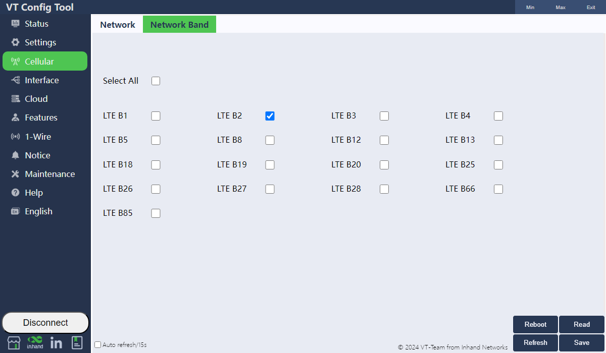

## Interface

Set the protocol and working mode of the communication interface supported by InVehicle Telematics. Communication interfaces include: CAN interface, RS232 interface, J1708 interface, RS485 interface, digital input interface (DI) and digital output interface (DO).

### CAN1

CAN1 is based on the CAN2.0A and CAN2.0B protocols. CAN1 Can be configured with the following parameters: protocol type, mode, baud rate, data reporting format, data query interval, and Bluetooth data forwarding.

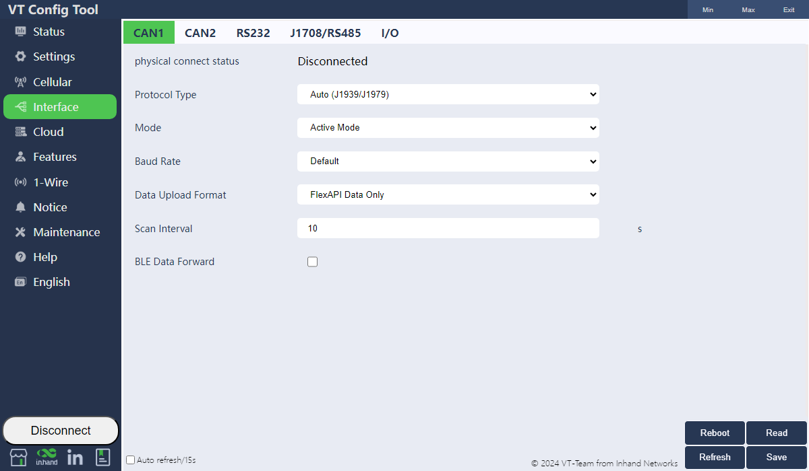

|  | Parameter | Description | Others |
| --- | --- | --- | --- |
| physical connect status | Connected/Disconnected | connect status |  |
| Protocol Type | J1939/J1979 | CAN1 interface protocol, corresponding to physical layer PIN CAN_1L(PIN 11) and CAN_1H(PIN 24) | CAN1 default configuration |
|  | J1939 | CAN1 interface protocol, corresponding to physical layer PIN CAN_1L(PIN 11) and CAN_1H(PIN 24) |  |
|  | J1939 | CAN1 interface protocol, corresponding to physical layer PIN CAN_1L(PIN 11) and CAN_1H(PIN 24) |  |
|  | Disable | Disable CAN1 |  |
| Mode | Active mode/Passive mode/Silent mode | mode of CAN1 |  |
| Baudrate | Default/250K/500K | Default is auto baudrate |  |
| Data Upload Format |  | Raw data can upload CAN raw data to platform |  |
| Scan Interval |  | Interval of scan CAN data |  |
| BLE Data Forward |  |  |  |

### CAN2

The configuration mode of the CAN2 interface is the same as that of CAN1.

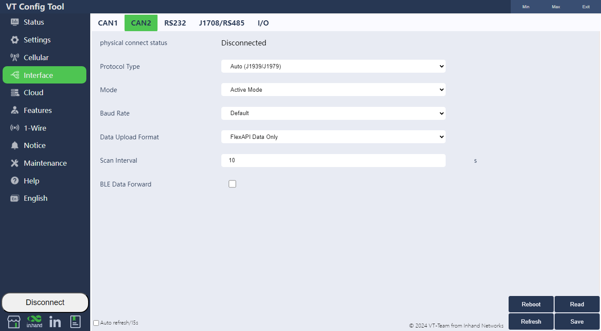

### 5.3 How to use ELD?

After ELD is enabled, the data read by CAN, OBD and J1708 will be forwarded as Bluetooth notification.

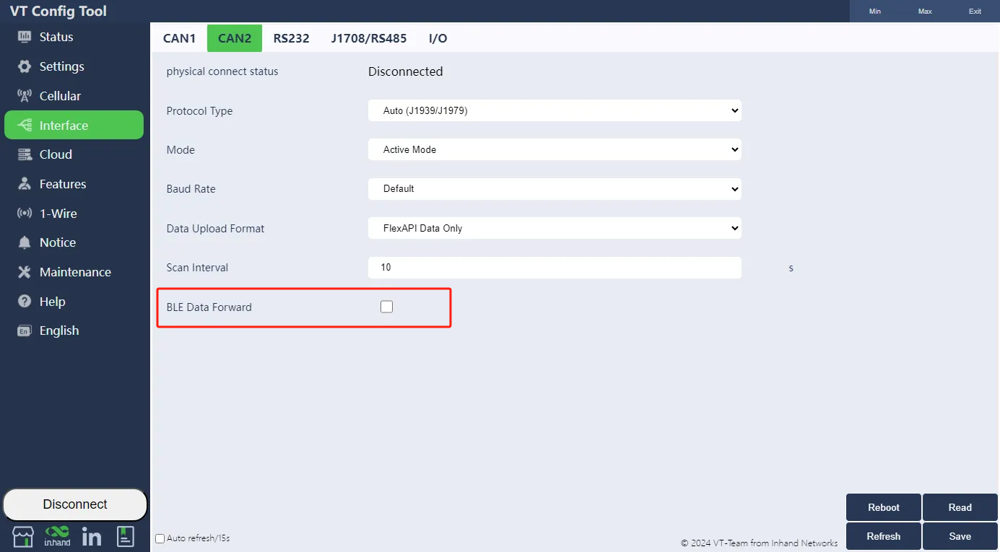

Download Bluetooth LE Explorer from the Microsoft Store to connect to VT.

Click Start to search VT. The bluetooth name is the same as SN.

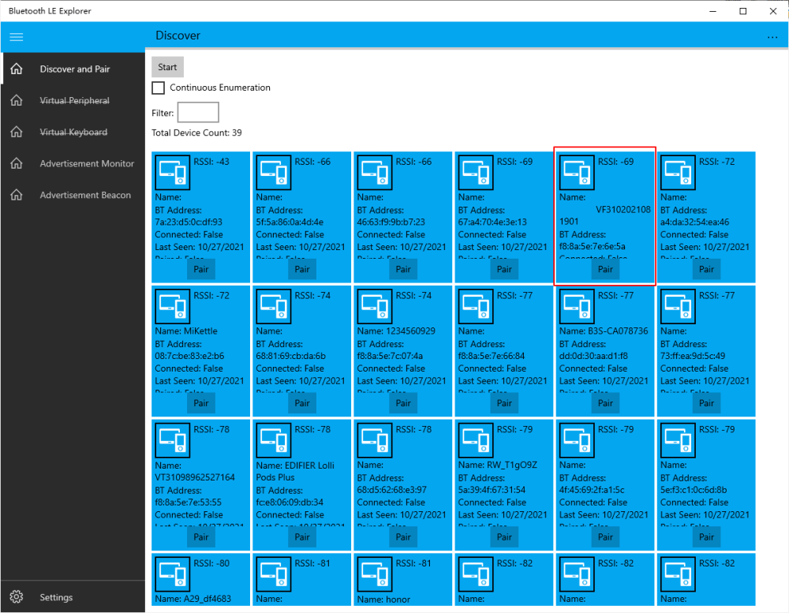

Then select the last one to read the Bluetooth notification.

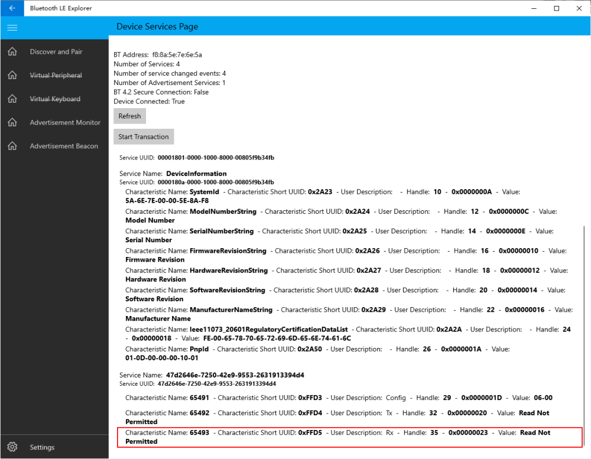

Turn on Notify (Ignore error messages). Bluetooth notification messages is in Read Value. Data format:

<ESN|VIN|SPEED|ODOMETER|ENGINEHOURS|RPM>

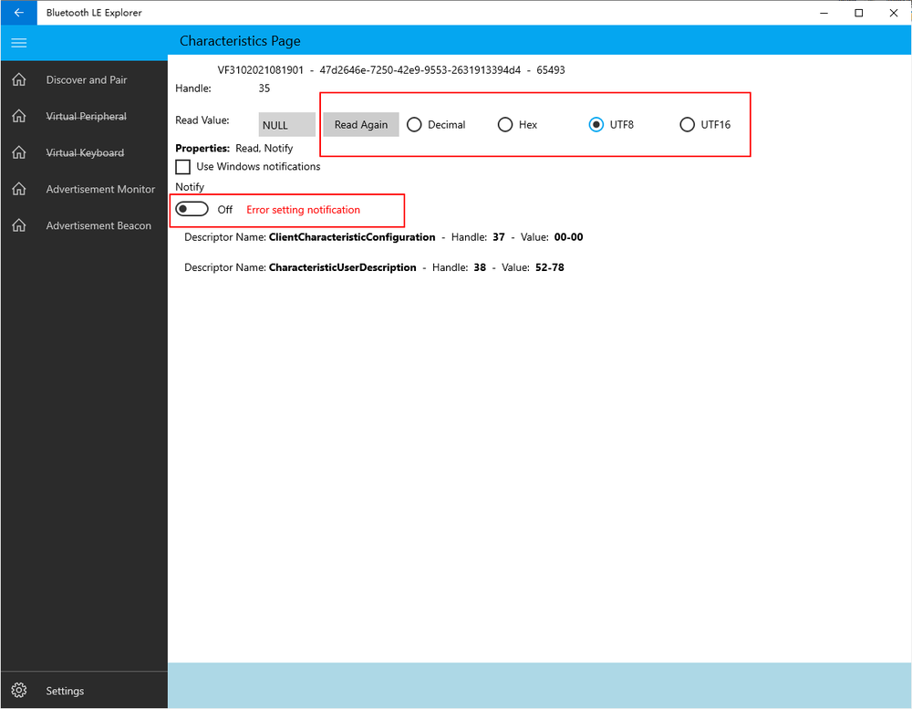

### RS232

Connection parameters of the RS232 serial port are configured, including function selection, baud rate, data bit, stop bit, and check bit Settings.

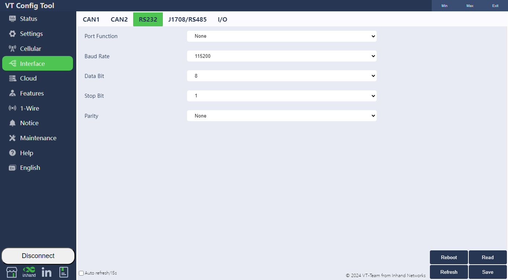

### J1708/RS485

The VT300 series RS485 is multiplexed with J1708.

### J1708

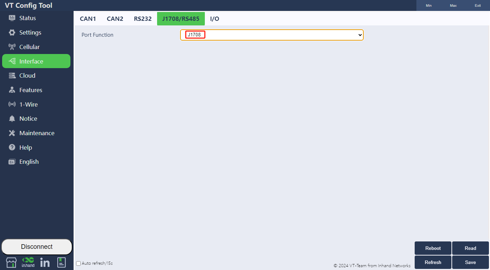

### RS485

Port function choose is RS485, you need to configure the baud rate, data bit, stop bit, and parity bit of the interface.

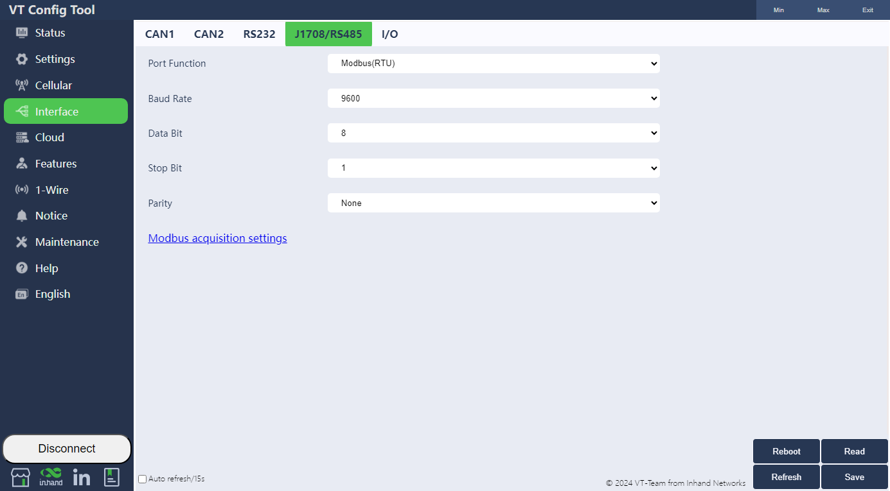

#### Modbus acquisition settings

This section describes how to set data collection parameters for the modbus interface by configuring the modbus point table. A point table consists of a single or multiple configurations, each of which includes the slave address, function code, register address, and query interval. Currently, the point table supports a maximum of 20 configurations. The point table is a.csv file. You can export the point table to a local PC by pressing the Export File button. Point table files can also be imported to InVehicle Telematics by importing files.

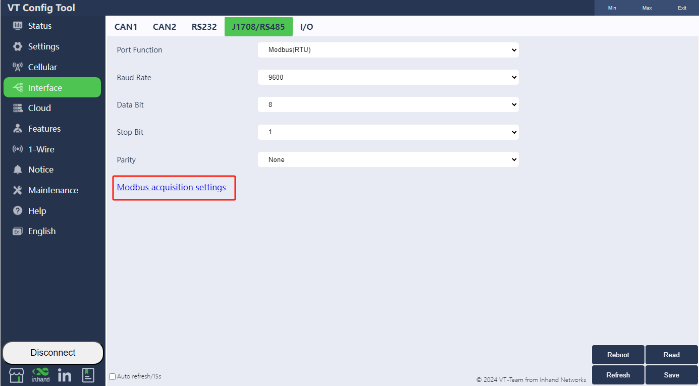

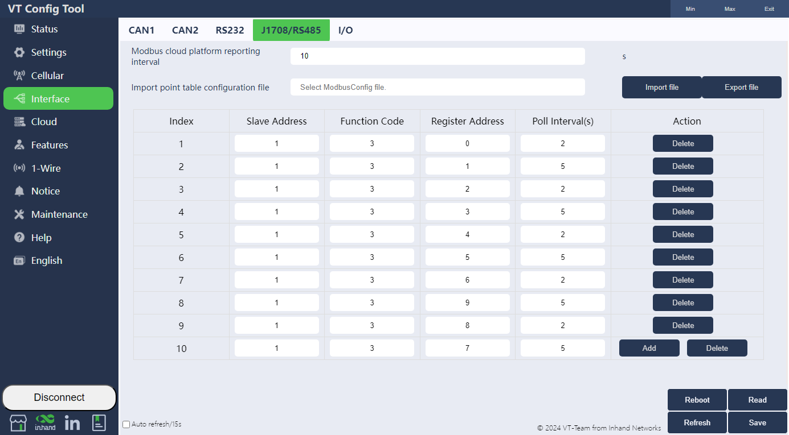

### I/O

Configure the high or low level of the output signal and enable the pull-up function of the corresponding input signal in this page. Also can flexibly configure the high or low level of the output signal and the required input signal detection according to the actual application scene.

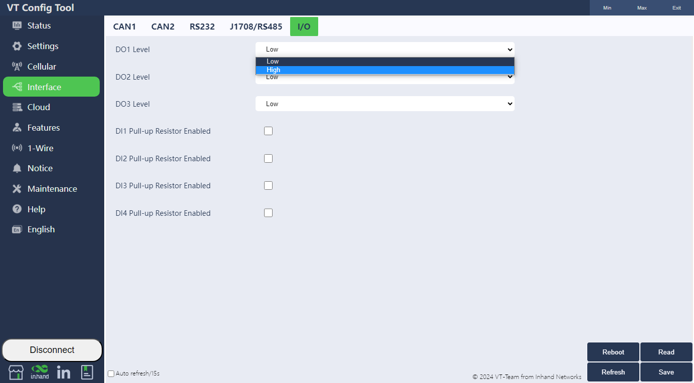

## Cloud

InVehicle Telematics supports the use of Mqtt, TCP and other protocols to connect to different cloud platforms, including the smartfleet cloud platform and some third-party platforms. InVehicle Telematics can only act as a client. InVehicle Telematics uses FlexaAPI to define a series of data formats and operations such as user-defined group configuration, data group escalation intervals, remote configuration, and upgrades.

### Cloud

Show parameters and select the cloud platform to be configured.


### smartFleet

Requires a domain name, account number, and license plate number to connect to the smartfleet cloud platform. Through [smatfleet.cloud](https://smatfleet.cloud).


### Azure Iot

Requires a connection string to connect to Azure Iot. Through [https://azure.microsoft.com/zh-cn/products/iot-hub/.](https://azure.microsoft.com/zh-cn/products/iot-hub/.)

### Wialon

The domain name, port, and reporting interval are required to connect to the Wialon cloud platform. Through [https://hosting.wialon.com/.](https://hosting.wialon.com/.)


view the device：

### Mqtt Broker

The config items include whether to use an encrypted connection (TLS1.2), username, password, security item, domain name, port, client ID, and topic prefix.


|  | Parameter | Description | Others |
| --- | --- | --- | --- |
| **MQTT Use TLS1.2** |  | MQTT can Use TLS1.2. |  |
| **Security** |  | Import CA certificates, digital certificates, and private key files to devices. |  |
| **Username/Password** |  | Username and Password |  |
| **Client ID** |  | The default is SN. |  |
| **Topic Prefix** |  | Prefix for topic |  |

### TCP/UDP Server

Need to configure the domain and port for connecting to the TCP/UDP server.


### AWS Iot

The default AWS Iot port is 8883. The certificate import is the same as the Mqtt certificate import mode. Through [https://aws.amazon.com/iot-core/.](https://aws.amazon.com/iot-core/.)


### Aliyun IoT

Aliyun Iot parameters include Device Name, Region ID, Product Key, security authentication mode Device Secret, and Product Secret. These parameters can be obtained from the Aliyun platform. Through [https://www.aliyun.com/product/iot.](https://www.aliyun.com/product/iot.)

**Unique-certificate-per-product:**

Required parameters to be obtained from the Aliyun Iot:


**Unique-certificate-per-device Authentication:**


Required parameters to be obtained from the Aliyun Iot:


The Device Certificate of the replication Device includes three parameters: Product Key, Device Name, and Device Secret, as is shown below.

### GEOTAB

The communication between the InVehicle device and the GEOTAB cloud platform is conducted in https mode. The configurable items of GEOTAB only include Geotab Username and GeotabPassword, which are obtained from GEOTAB officials. The rest of the items are all parameters obtained from GEOTAB, which can be used to view the authorization parameters necessary for the current device to communicate with Geotab, and these parameters are automatically obtained, automatically refreshed, and not configurable during the communication process, where Geotab SN represents the unique serial number ID assigned to the InVehicl device after the InVehicl device is registered with Geotab, which is in communication security considerations, and Geotab Bearer The Bearer Token is the bearer token for data communication, the Geotab Bearer Token Expire is the validity period of the bearer token, and the Geotab Refresh Token is the refresh token, which is used to obtain a new bearer token and refresh token when the bearer token expires or is about to expire.


### Disable


### Settings of FlexAPI

The FlexAPI reserve group interval can config in this page and also can reset the FlexAPI config. Custom group config can config by Import file.

gnss upload interval is AUTO by default, also can config to a fixed value.


## Features

InVehicle Telematics cuses GPS and six-axis inertial sensors to judge and identify some driving behaviors and vehicle status. Use these features by configuring the relevant parameters.

### Vehicle Status Detection

### Max Cornering

InVehicle Telematics can detect whether the vehicle has Turn left or Turn right, and upload to the cloud platform. The configuration value is related to precision.

### Max Acceleration, Max Braking, and Possible Accident Detection

InVehicle Telematics can detect whether the vehicle has harsh acceleration, harsh deceleration, and COLLISION, and upload to the cloud platform. The configuration value is related to precision.


### IDLE Duration

IDLE Duration can detect the idle start, idle time, idle end of the vehicle during the entire journey, and upload to the cloud platform.


### Speed Monitoring

Speed monitoring can monitor in real time whether the vehicle is speeding on the road for a long time. By configuring the maximum travel speed and maximum travel speed duration, when a speeding behavior occurs, InVehicle Telematics will upload a speeding event and report the event to the cloud platform.


## 1-Wire

This page can view the ROM ID, Device name, and current temperature value of the temperature and humidity sensor or iButton of the 1-wire connected to InVehicle Telematics.


|  | Parameter | Description | Others |
| --- | --- | --- | --- |
| **Data Upload Time** |  | Interval for reporting data to the cloud platform. |  |
| **Temp Data Refresh Time** |  | Temp data refresh interval. |  |

## Notice

Events generated by InVehicle Telematics can be pushed to the user's phone number via SMS, or upload to the cloud platform, so that users can monitor the device status in real time.

### SMS Notice

By config phone number and enable the Radio button, the event to upload to user via SMS when it is occur.


### FlexAPI Notice

By enable the Radio button, the event to upload to Cloud platform when it is occur.


## Maintaince

Export, Import device configurations and upgrade firmware.

### **Import file/Export file**

Export file can export a configuration file cover the items that have been configured by the configuration tool from the device or use it as a template for import file. When you configure a new device, you can use the configuration file to quickly configure the new device. The configuration file is in json format.

**Export file:** Emport the configuration file to a local json file.


**Import file:** Import the configuration file that has been exported locally to the device.


### Upgrade firmware

To upgrade devices, choose . IHD format file, follow the steps to execute, select firmware, click upgrade, wait for the upgrade to complete; If you want to cancel the upgrade, click Cancel to cancel the upgrade.


After the upgrade progress is complete, click the pop-up window one by one to end the upgrade, and wait for the device to restart.


## Help

When you encounter problems with the InVehicle Telematics config tool, you can obtain help documents through this page, visit the InHand's [Website](https://www.inhand.com/en/resources-center/#/Mobility/InVehicleTelematicsGateways/VT300), and view the config tool user manual.


## Restoration of the Default Account and Password for Hardware

Because configuration usually involves the device certificate file, when the device is restored to the factory via hardware, only the username and password are restored to default. As is shown in the following picture, press the Reset button with a screwdriver or other tools for more than 8 seconds, and then loosen it.

ps: By double-clicking "Reset", you can restart the device when it goes wrong.

## How to Get the Device Log

Make sure that the computer is connected to the VT through USB to serial port through configuration wire, and open a serial port connection tool such as the serial port debugging software. The software can be downloaded in Mircrosoft Store.

1. Open the serial port debugging software and select the link serial port. The default baud rate of the serial port is 115200/8/n/1. Click "Open serial port". Note that the Character encoding mode (Character encoding) is ASCII, and the line break mode (Linet break) is \n(LF).

1. Enter +++ in the content sending serial port or not to activate the CLI mode, as is shown below;

1. Enter the Username (press the enter key), click "Send", enter the password (press the enter key), and click send to enter the command line mode.


1. Enable the log function. In the send text box, enter “log console enable” (press the enter key) and click "Send". The following screenshot shows the log information in the receive window.

1. Close log function, write “log console disable” (press the enter key) in the send text box and click "Send". The receive window stops receiving logs.

1. If you need to link the configuration tool after exiting the serial port, write “exit” (press the enter key) in the send text box, click "Send" (used to exit the CLI mode), and then close the serial port. Or you wait for 180 seconds when the device automatically exits the CLI mode.
