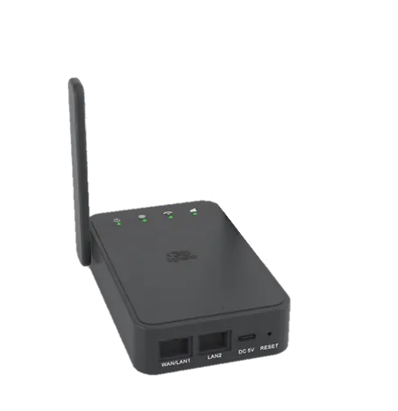
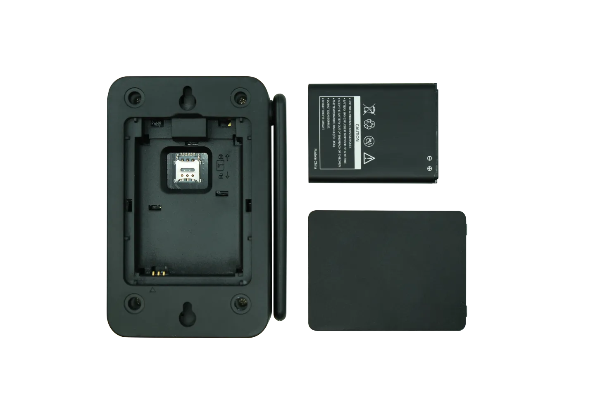
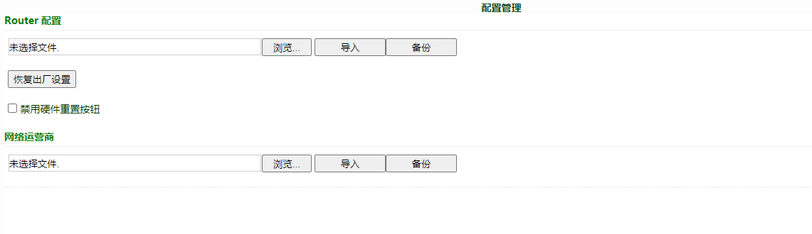

# CR202-Lite 快速安装手册

---

# 第一部分：快速装机（图文整体流程）

> **您需要先做：** 开箱 → 固定设备 → 接电源与网线 →（若用蜂窝）**断电**装 SIM、接天线 → 上电 → PC 同网段 → 浏览器打开 Web。
> **再做：** 翻到下方 **第二部分**，按需查阅装箱、灯义、壁挂、接口说明等。

## 必读摘要（接线、上电前）

| 项目 | 要求 |
|------|------|
| 供电 | **5 V / 2 A**，Type-C 接口；请使用标配 USB 转 Type-C 转接线。 |
| SIM 卡 | **须断电**安装或拔出；**不可热插拔**。 |
| 蜂窝天线 | 3G/4G LTE 天线按壳体丝印拧紧到 **Cellular** 天线柱。 |
| 安装环境 | 避免阳光直射，远离发热源或强电磁干扰区域；工作温度 **-10℃～50℃**。 |

## 步骤 1：对照实物，确认面板与接口区域

您先对照设备实物，确认前面板的接口与指示灯布局。CR202-Lite 提供 WAN 口、LAN 口、Type-C 供电口、SIM 卡槽（拆开后盖可见）及蜂窝天线柱。

各接口位置与指示灯含义详见 §2.2、§2.3。

## 步骤 2：将设备固定到墙面或柜内

根据现场环境，选择合适位置固定设备。设备支持壁挂安装，需使用包装内的膨胀螺丝。

> 壁挂方式及注意事项详见 §2.4。

## 步骤 3：连接电源与以太网

1. 将网线一端接入设备的 **LAN** 口，另一端接入 PC。
2. 若使用有线上联，将外网网线接入 **WAN** 口。
3. 使用标配 USB 转 Type-C 转接线为设备供电。

> 以太网接口说明详见 §2.5.1，供电要求详见 §2.5.2 与 §2.6。

## 步骤 4：（若使用蜂窝）断电装 SIM，并接好天线

1. 确保设备**已下电**。
2. 拆开后盖，取出电池（如有），在图示位置放入 **Nano SIM** 卡。
3. 装回电池与后盖。
4. 将 3G/4G LTE 天线按壳体丝印拧紧到 **Cellular** 天线柱。

> **警告：更换或插拔 SIM 卡时，必须断电重启，以免造成数据丢失或设备损坏。**
>
> 蜂窝详细说明见 §2.5.6。

## 步骤 5：上电，确认设备已就绪

接通 Type-C 电源后，观察前面板指示灯：

- **系统灯绿色闪烁** — 设备启动中
- **系统灯绿色常亮** — 设备正常运行

> 各指示灯状态定义详见 §2.3.1。

## 步骤 6：PC 与浏览器登录 Web

1. 将 PC 网口设置为 **DHCP 自动获取**（推荐），或手动配置固定 IP：
   - IP 地址：`192.168.2.2` ~ `192.168.2.254` 中任意值
   - 子网掩码：`255.255.255.0`
   - 网关：`192.168.2.1`
2. 打开浏览器，地址栏输入 `http://192.168.2.1`。
3. 在登录页面输入设备铭牌上的默认用户名和密码。
4. 若浏览器提示网页不安全，请点击"高级"或"显示详情"，选择"继续前往"。

> 登录后如需配置外网接入（WAN 口、Cellular 拨号、Wi-Fi STA 等），请参见《CR202-Lite 用户手册》。
>
> 恢复出厂设置方法见 §2.7。

## 装完自检

- ☐ 设备已固定（壁挂）。
- ☐ 电源、网线已接好；若用蜂窝，SIM 与天线已就位。
- ☐ **系统灯绿色常亮**。
- ☐ 浏览器已能打开 Web 登录页并完成登录。

若无法登录，请检查 PC IP 是否与设备同网段；若仍异常，可尝试硬件恢复出厂（见 §2.7）。

---

# 第二部分：详细说明

## 2.1 装箱清单

### 标准配件

| 序号 | 名称 | 数量 | 单位 | 备注 |
| :---: | --- | :---: | :---: | --- |
| 1 | CR202-Lite 4G 路由器 | 1 | 台 | — |
| 2 | 网线 | 1 | 根 | 1 m |
| 3 | USB 转 Type-C 转接线 | 1 | 根 | 5 V / 2 A |
| 4 | 膨胀螺丝 | 2 | 颗 | 用于壁挂安装 |

### 可选配件

| 序号 | 名称 | 数量 | 单位 | 备注 |
| :---: | --- | :---: | :---: | --- |
| 1 | 电池 | 1 | 块 | 仅带电池型号的产品有；见《规格书》订购信息 |

## 2.2 产品结构与标识

### 正面板

## 2.3 指示灯与复位键

### 2.3.1 运行状态指示灯

#### CR202-Lite（无电池版本）

| 指示灯 | 状态 | 含义 |
| :---: | --- | --- |
| 系统 | 灭 | 设备未上电 |
| | 绿色闪烁 | 设备启动 |
| | 绿色常亮 | 设备正常运行 |
| | 黄色闪烁 | 升级中 |
| 联网 | 灭 | 设备未启动或禁用拨号 |
| | 绿色闪烁 | 拨号中 |
| | 绿色常亮 | 拨号成功 |
| | 黄色闪烁 | 拨号异常 |
| | 红色闪烁 | 未插卡、SIM 卡或模组异常 |
| Wi-Fi | 灭 | Wi-Fi 未启动 |
| | 绿色闪烁 | Wi-Fi 工作，有数据传输 |
| | 绿色常亮 | Wi-Fi 开启 |
| 信号 | 灭 | 拨号未启动 |
| | 绿色常亮 | 信号值 ≥ 20，信号良好 |
| | 黄色常亮 | 19 ≥ 信号值 ≥ 10 |
| | 红色常亮 | 信号值 ≤ 9，信号差，不足以拨号 |

#### CR202-Lite（有电池版本）

| 指示灯 | 状态 | 含义 |
| :---: | --- | --- |
| 系统 | 灭 | 设备未上电 |
| | 绿色闪烁 | 设备启动 |
| | 绿色常亮 | 设备正常运行 |
| | 黄色闪烁 | 升级中 |
| 联网 | 灭 | 设备未启动或禁用拨号 |
| | 绿色闪烁 | 拨号中 |
| | 黄色闪烁 | 拨号异常 |
| | 红色闪烁 | 未插卡、SIM 卡或模组异常 |
| | 绿色常亮 | 拨号成功，信号值 ≥ 20 |
| | 黄色常亮 | 拨号成功，19 ≥ 信号值 ≥ 10 |
| | 红色常亮 | 拨号成功，信号值 ≤ 9 |
| Wi-Fi | 灭 | Wi-Fi 未启动 |
| | 绿色闪烁 | Wi-Fi 工作，有数据传输 |
| | 绿色常亮 | Wi-Fi 开启 |
| 电池 | 闪烁 | 电池充电中 |
| | 常亮 | 电池放电中 |
| | 绿色 | 80% ＜ 电量 ≤ 100% |
| | 黄色 | 20% ＜ 电量 ≤ 80% |
| | 红色 | 0 ＜ 电量 ≤ 20% |

> 闪烁频率定义：**常亮/常灭** — 至少保持约 3 s；**慢闪** — 约 1 Hz；**快闪** — 约 5 Hz。

### 2.3.2 复位键

Reset 键位于设备正面板（见 §2.2 示意图）。作用：硬件恢复出厂设置。

恢复出厂的详细步骤见 §2.7.2。

## 2.4 机械安装

### 2.4.1 壁挂

设备支持壁挂安装，使用包装内标配的 2 颗膨胀螺丝。

## 2.5 连接与布线

### 2.5.1 以太网

CR202-Lite 提供 WAN 口与 LAN 口。LAN2 口默认开启 DHCP Server 功能。

### 2.5.2 电源

- 供电方式：Type-C 接口
- 输入规格：**5 V / 2 A**
- 请使用标配 USB 转 Type-C 转接线

### 2.5.6 蜂窝 SIM 与天线

#### SIM 卡

- 卡座数量：1 个 Nano SIM 卡槽
- 支持 eSIM
- 位置：拆开后盖，取出电池（如有）后可见
- **必须断电**安装或拔出

#### 天线

- 3G/4G LTE 天线接到 Cellular 天线柱
- 按壳体丝印拧紧

## 2.6 供电与环境

| 项目 | 规格 |
| --- | --- |
| 输入电压 | **5 V DC**（Type-C，2 A） |
| 工作温度 | **-10℃ ～ 50℃** |
| 存储温度 | **-20℃ ～ 60℃** |
| 安装环境 | 避免阳光直射，远离发热源或有强烈电磁干扰的区域 |

## 2.7 首次登录与恢复出厂

### 2.7.1 Web 登录

1. 将 PC 网口设置为 **DHCP 自动获取**（推荐），或手动配置固定 IP：
   - IP 地址：`192.168.2.2` ~ `192.168.2.254` 中任意值
   - 子网掩码：`255.255.255.0`
   - 网关：`192.168.2.1`
2. 打开浏览器，地址栏输入 `http://192.168.2.1`。
3. 在登录页面输入设备铭牌上的默认用户名和密码。
4. 若浏览器提示网页不安全，请点击"高级"或"显示详情"，选择"继续前往"。

> 登录后如需配置外网接入（WAN 口、Cellular 拨号、Wi-Fi STA 等），请参见《CR202-Lite 用户手册》。

### 2.7.2 恢复出厂（RESET）

Reset 键位置见 §2.2。

1. 设备上电，立即按下 Reset 键 3~5 秒，直到系统灯黄色常亮。
2. 松开 Reset 键，系统灯黄色闪烁。
3. 再次按住 Reset 键，系统灯黄色常亮后松开 Reset 键，系统灯绿色闪烁，设备恢复出厂成功。

> 也可通过 Web 页面恢复出厂：导航至"系统 >> 配置管理"，单击"恢复出厂设置"按钮并确认，重启后生效。
>
> 

## 2.8 相关文档

| 需求 | 去向 |
|------|------|
| 产品介绍、USB/SD 详解、配置与排障、远程管理平台 | 《CR202-Lite 用户手册》 |
| 订购与天线型号 | 《CR202-Lite 产品规格书》 |
| 软件与公告 | [映翰通官网](https://www.inhand.com.cn) |

## 2.9 法律信息

### 版权声明

© 北京映翰通网络技术股份有限公司 版权所有。

### 联系方式

电话：86-10-84170010
传真：86-10-84170089
地址：北京市朝阳区紫月路18号院3号楼501
邮编：100102
网址：https://www.inhand.com.cn
邮箱：support@inhand.com.cn
