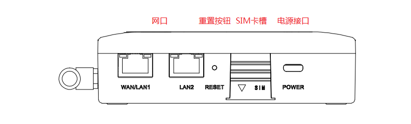
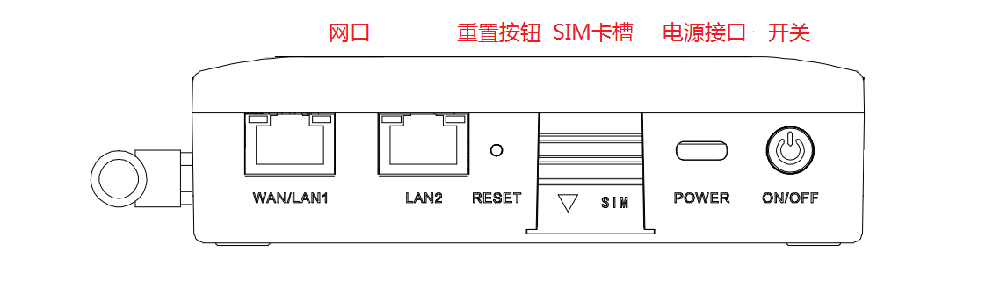
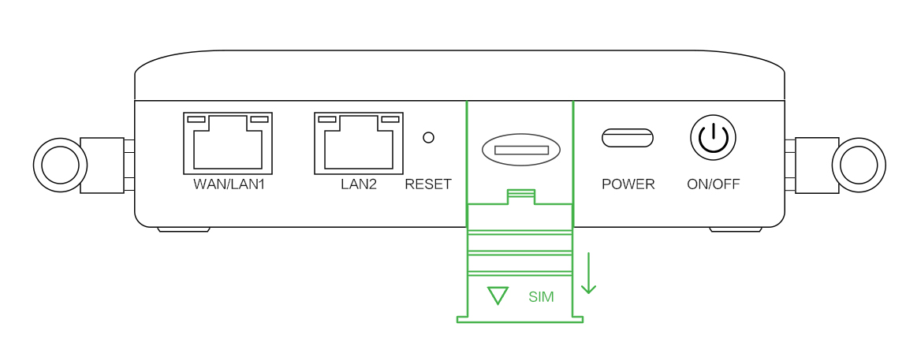
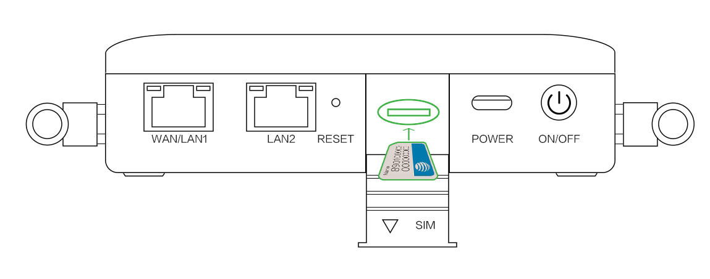
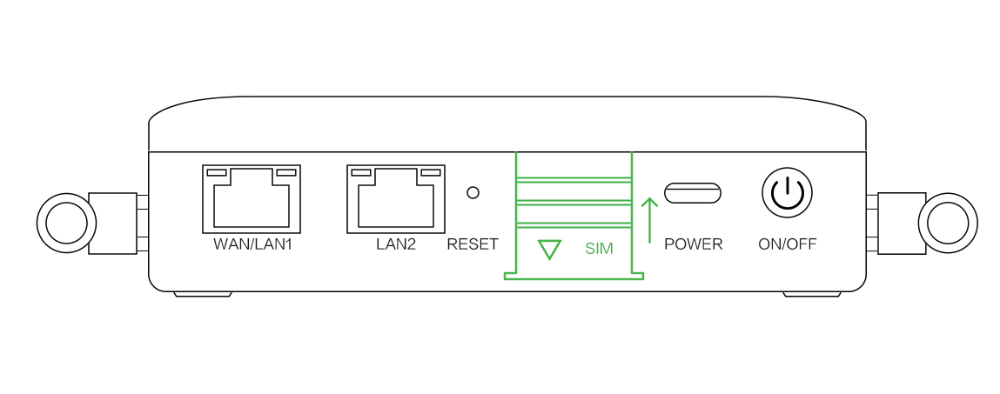
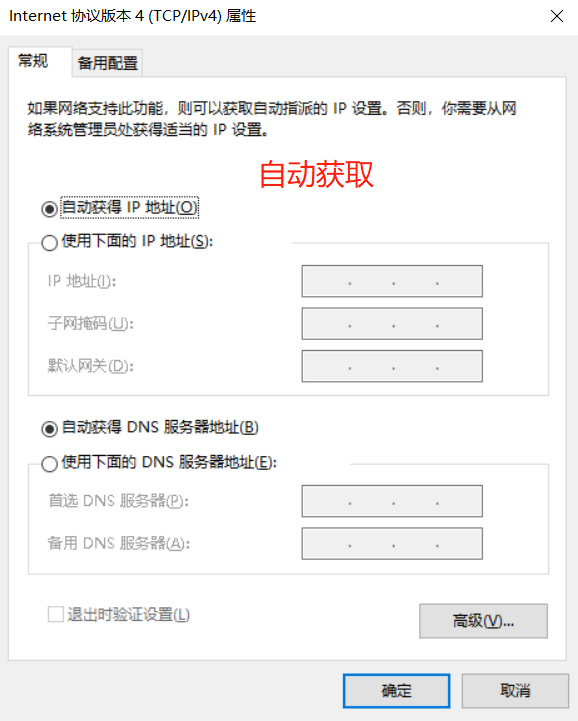
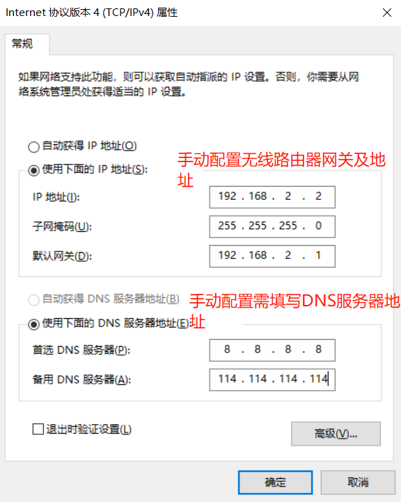
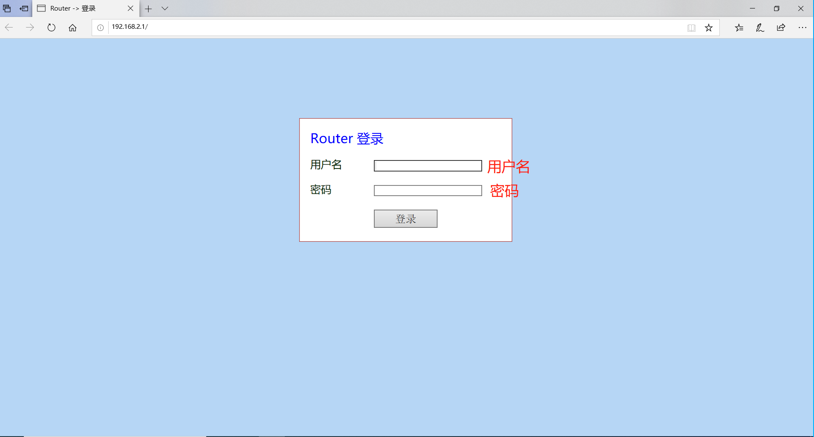

# CR202 快速安装手册

# 第一部分：快速装机（图文整体流程）

> **您需要先做：** 开箱 → 固定设备 → 接电源与网线 →（若用蜂窝）**断电**装 SIM、接天线 → 上电 → PC 同网段 → 浏览器打开 Web。  
> **再做：** 翻到下方 **第二部分**，按需查阅装箱、灯义、壁挂、接口说明等。

## 必读摘要（接线、上电前）

| 项目 | 要求 |
|------|------|
| 供电 | **5V / 2A**，Type-C 接口；**系统灯绿色常亮**表示设备正常运行。 |
| SIM 卡 | **须断电**安装或拔出；**不可热插拔**。 |
| 蜂窝 / Wi-Fi 天线 | 按壳体**丝印**（Cellular / Wi-Fi）顺时针拧紧；标配含 **1 根 4G 天线**。 |
| 安装环境 | 避免阳光直射，远离发热源或强电磁干扰区域；工作温度 **-10℃～50℃**。 |

---

## 步骤 1：对照实物，确认面板与接口区域

请根据您收到的型号，确认设备前面板布局：

**无电池版本 CR202-CNC4-WLAN**

**有电池版本 CR202-CNC4-WLAN-B**

---

## 步骤 2：将设备固定到墙面或柜内

CR202 支持通过随箱支架进行壁挂安装。您可先将支架用螺钉固定到设备，再用螺钉将设备固定到墙面或柜体。

---

## 步骤 3：连接电源与以太网

1. 将 Type-C 电源线接入设备电源口，另一端连接 **5V / 2A** 电源适配器。
2. 将 WAN 口网线接入上级网络（光猫 / 交换机），LAN 口网线接入您的 PC。

> 以太网接口说明见 **§2.5.1**，供电规格见 **§2.6**。

---

## 步骤 4：（若使用蜂窝）断电装 SIM，并接好天线

**⚠️ 必须先断开电源，再进行 SIM 卡操作。**

1. 向下推开 SIM 卡保护壳。
2. 根据提示方向插入 nano SIM 卡并按压到位；再次按压即可弹出。

3. 将 4G 天线对准 Cellular 丝印天线柱，沿**顺时针方向**轻轻转动金属接口至不能转动（此时看不到天线连接线外螺纹）。**不要握住黑色胶套用力拧天线。**
4. 若使用 Wi-Fi，将 Wi-Fi 天线对准 Wi-Fi 丝印天线柱，同样顺时针拧紧。

> SIM 卡座与天线详细说明见 **§2.5.6**。

---

## 步骤 5：上电，确认设备已就绪

接通电源后，观察设备指示灯：

- **系统灯绿色闪烁** → 设备启动中
- **系统灯绿色常亮** → 设备正常运行

> 完整灯义见 **§2.3**。若系统灯长时间异常，请检查供电并参考 **§2.7** 恢复出厂。

---

## 步骤 6：PC 与浏览器登录 Web

1. 将 PC 网口与设备 LAN 口相连，确保 PC 与设备处于同一网段：
   - **推荐**：PC 设置为 DHCP 自动获取地址。
   - **手动**：PC IP 设置为 `192.168.2.2`～`192.168.2.254` 中任意值，网关 `192.168.2.1`，子网掩码 `255.255.255.0`。

   

   

2. 打开浏览器，地址栏输入设备默认地址：

   | 端口角色 | 默认 IP |
   | :------: | :-----: |
   | LAN | **192.168.2.1** |

3. 输入设备铭牌上的默认用户名和密码，进入 Web 管理界面。若浏览器提示"网页不安全"，请点击"高级"并选择"继续前往"。

   

> 若无法登录，请检查网线连接和 PC 网段设置；恢复出厂方法见 **§2.7**。

---

## 装完自检

- ☐ 设备已固定（壁挂支架已安装到位）。
- ☐ 电源、网线已接好；若用蜂窝，SIM 卡与天线已就位。
- ☐ **系统灯绿色常亮**，表示设备正常运行。
- ☐ 浏览器已能打开 `192.168.2.1` 并完成登录。

**排障提示**：
- 若登录后需要使用蜂窝拨号上网，请在 Web 界面"网络 >> Cellular"中确认拨号接口已启用；若禁用拨号，设备将停止拨号。
- 若忘记密码或配置异常，请使用 RESET 键恢复出厂，详见 **§2.7**。
- 详细的 WAN 口配置、Wi-Fi 配置、云平台接入等操作，请查阅《CR202 用户手册》。

---

# 第二部分：详细说明

## 2.1 装箱清单

### 标准配件

| 序号 | 名称 | 数量 | 单位 | 备注 |
|:----:|------|:----:|:----:|------|
| 1 | CR202 主机 | 1 | 台 | 根据订单为无电池版或有电池版 |
| 2 | 网线 | 1 | 根 | 1 m |
| 3 | 电源适配器 | 1 | 个 | 5V / 2A，Type-C |
| 4 | 4G 天线 | 1 | 根 | Cellular 天线 |
| 5 | 产品保修卡 | 1 | 张 | 电池保修期 1 年；设备保修期 1 年 |
| 6 | 合格证 | 1 | 张 | — |
| 7 | 快速安装手册（QSG） | 1 | 个 | — |
| 8 | 壁挂支架 | 1 | 个 | 支持壁挂安装 |

---

## 2.2 产品结构与标识

### 正面板（无电池版本 CR202-CNC4-WLAN）

### 正面板（有电池版本 CR202-CNC4-WLAN-B）

> 设备背面可查看序列号及产品铭牌（含默认用户名、密码）。

---

## 2.3 指示灯与复位键

### 2.3.1 运行状态指示灯

**无电池版本 CR202-CNC4-WLAN**

| 指示灯 | 状态 | 含义 |
|:------:|------|------|
| **系统** | 灭 | 设备未上电 |
| | 绿色闪烁 | 设备启动中 |
| | 绿色常亮 | 设备正常运行 |
| | 黄色闪烁 | 升级中 |
| **联网** | 灭 | 设备未启动或禁用拨号 |
| | 绿色闪烁 | 拨号中 |
| | 绿色常亮 | 拨号成功 |
| | 黄色闪烁 | 拨号异常 |
| | 红色闪烁 | 未插卡、SIM 卡或模组异常 |
| **Wi-Fi** | 灭 | Wi-Fi 未启动 |
| | 绿色闪烁 | Wi-Fi 工作，有数据传输 |
| | 绿色常亮 | Wi-Fi 开启 |
| **信号** | 灭 | 拨号未启动 |
| | 绿色常亮 | 信号值 ≥ 20，信号良好 |
| | 黄色常亮 | 10 ≤ 信号值 ≤ 19 |
| | 红色常亮 | 信号值 ≤ 9，信号差，不足以拨号 |

**有电池版本 CR202-CNC4-WLAN-B**

| 指示灯 | 状态 | 含义 |
|:------:|------|------|
| **系统** | 灭 | 设备未上电 |
| | 绿色闪烁 | 设备启动中 |
| | 绿色常亮 | 设备正常运行 |
| | 黄色闪烁 | 升级中 |
| **联网** | 灭 | 设备未启动或禁用拨号 |
| | 绿色闪烁 | 拨号中 |
| | 黄色闪烁 | 拨号异常 |
| | 红色闪烁 | 未插卡、SIM 卡或模组异常 |
| | 绿色常亮 | 拨号成功，信号值 ≥ 20 |
| | 黄色常亮 | 拨号成功，10 ≤ 信号值 ≤ 19 |
| | 红色常亮 | 拨号成功，信号值 ≤ 9 |
| **Wi-Fi** | 灭 | Wi-Fi 未启动 |
| | 绿色闪烁 | Wi-Fi 工作，有数据传输 |
| | 绿色常亮 | Wi-Fi 开启 |
| **电池** | 闪烁 | 电池充电中 |
| | 常亮 | 电池放电中 |
| | 绿色 | 80% ＜ 电量 ≤ 100% |
| | 黄色 | 20% ＜ 电量 ≤ 80% |
| | 红色 | 0 ＜ 电量 ≤ 20% |

> **闪烁频率定义**：常亮/常灭为至少保持约 3 s；慢闪约 1 Hz；快闪约 5 Hz。

### 2.3.2 复位键

RESET 键位于设备前面板（详见 §2.2 示意图）。

- **作用**：硬件恢复出厂设置。
- **操作方法**：详见 **§2.7**。

---

## 2.4 机械安装

### 2.4.3 壁挂

CR202 可通过随箱支架实现壁挂安装。先将支架用螺钉固定在设备上，再用螺钉将设备固定到墙面或柜体。拆卸时逆序松开墙面螺钉，再取下支架。

---

## 2.5 连接与布线

### 2.5.1 以太网

设备提供 WAN 口与 LAN 口：

- **WAN 口**：连接上级外网（光猫 / 交换机 / 路由器）。
- **LAN 口**：连接本地 PC 或下级设备；LAN2 口默认开启 DHCP Server 功能。

### 2.5.2 电源

- **供电方式**：Type-C 接口，**5V / 2A** 电源适配器。
- **上电指示**：系统灯绿色闪烁表示启动中，绿色常亮表示正常运行。

### 2.5.6 蜂窝 SIM 与天线

#### SIM 卡

- **卡座数量**：1 个
- **卡类型**：nano SIM
- **安装位置**：设备正面 SIM 卡槽（带保护壳）
- **关键要求**：**须断电**安装或拔出，不可热插拔。

#### 天线

| 丝印 | 名称 | 说明 |
|:----:|------|------|
| Cellular | 4G LTE 天线 | 标配 1 根，顺时针拧紧至金属接口不能转动 |
| Wi-Fi | Wi-Fi 天线 | 对准 Wi-Fi 丝印天线柱，顺时针拧紧 |

> **注意**：拧天线时请转动金属接口可活动部分，**不要握住黑色胶套用力拧天线**。

---

## 2.6 供电与环境（速查）

| 项目 | 规格 |
|------|------|
| 输入电压 | **5V DC**（Type-C，5V / 2A） |
| 工作功耗 | （原稿未详，待补充） |
| 工作温度 | **-10℃ ～ 50℃** |
| 存储温度 | **-20℃ ～ 60℃** |

---

## 2.7 首次登录与恢复出厂

### Web 登录

1. 将 PC 网口与设备 LAN 口相连，确保 PC 与设备处于同一网段：
   - **推荐**：PC 设置为 DHCP 自动获取地址。
   - **手动**：PC IP 设置为 `192.168.2.2`～`192.168.2.254` 中任意值，网关 `192.168.2.1`，子网掩码 `255.255.255.0`。

   

   

2. 打开浏览器，地址栏输入设备默认地址：

   | 端口角色 | 默认 IP |
   | :------: | :-----: |
   | LAN | **192.168.2.1** |

3. 输入设备铭牌上的默认用户名和密码，进入 Web 管理界面。若浏览器提示"网页不安全"，请点击"高级"并选择"继续前往"。

   

> 若遗忘密码，请通过 RESET 键恢复出厂。

### 恢复出厂（RESET）

RESET 键位置见 **§2.2** 示意图。

**硬件恢复出厂步骤**：

1. 设备上电，立即按下 RESET 键 **3～5 秒**，直到系统灯**黄色常亮**。
2. 松开 RESET 键，系统灯**黄色闪烁**。
3. 再次按住 RESET 键，系统灯**黄色常亮**后松开 RESET 键，系统灯**绿色闪烁**，设备恢复出厂成功。

---

## 2.8 相关文档

| 需求 | 去向 |
|------|------|
| 产品介绍、WAN / Wi-Fi / Cellular 详细配置、Device Manager 云平台接入、导入导出配置、日志与诊断 | 《CR202 用户手册》 |
| 订购信息、完整技术规格、天线型号 | 《CR202 产品规格书》 |
| 软件下载与公告 | [映翰通官网](https://www.inhand.com.cn) |

---

## 2.9 法律信息

### 版权声明

© 北京映翰通网络技术股份有限公司 版权所有。

### 联系方式

电话：86-10-84170010
传真：86-10-84170089
地址：北京市朝阳区紫月路18号院3号楼501
邮编：100102
网址：https://www.inhand.com.cn
邮箱：support@inhand.com.cn
