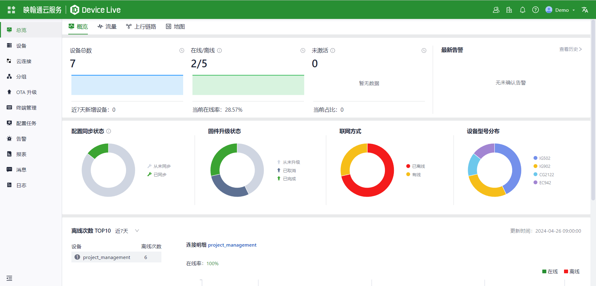
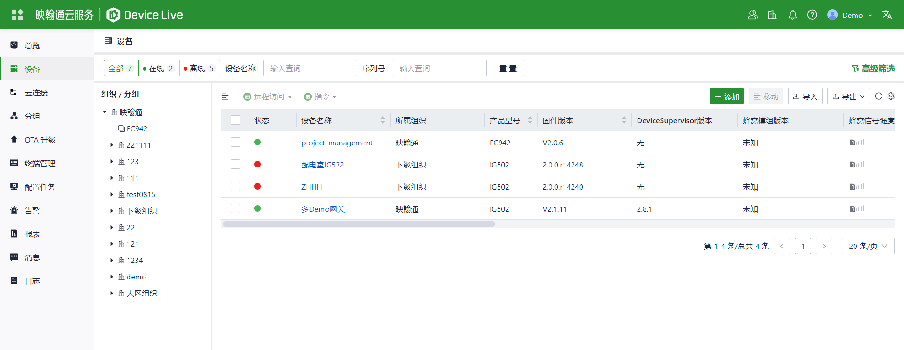
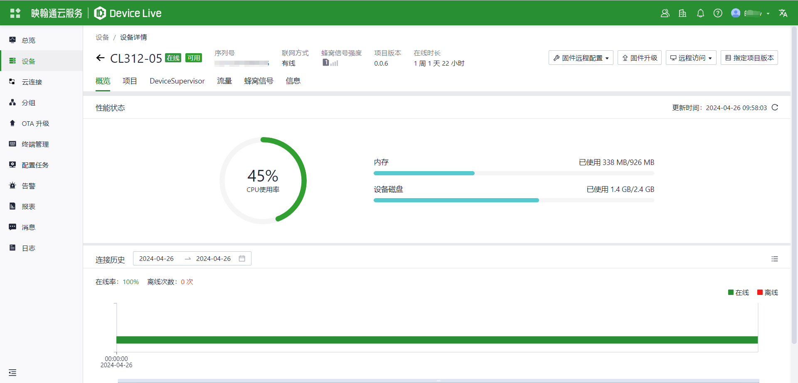
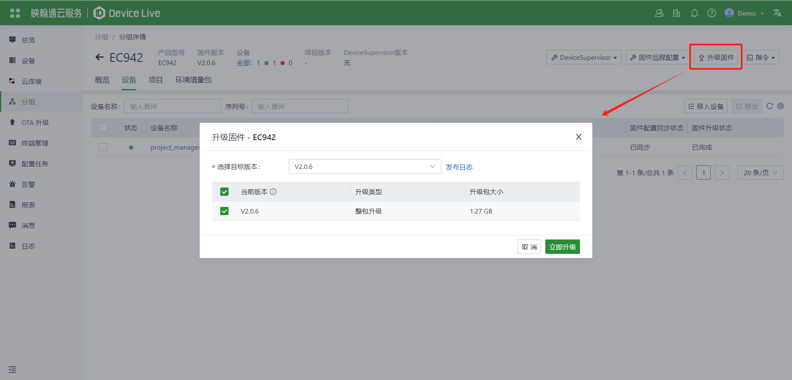
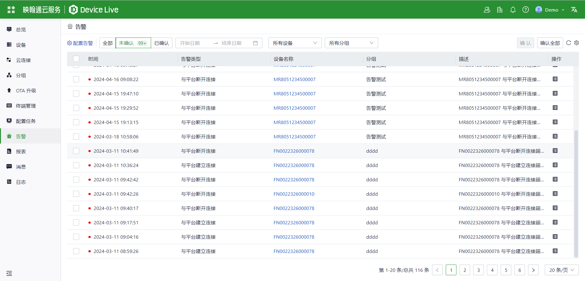

  

    

      
    

    

      物联网设备管理运营平台
    

  

  

    

      DeviceLive
    

    

      

        
· 设备管理

        
· 远程监控

      

      

        
· 边缘计算

        
· 远程运维

      

    

  

# 1. 产品概述

**云端运维物联网 — 智能边缘，集中管控**

**DeviceLive** 是面向工业物联网的设备管理运营平台。搭配映翰通边缘智能硬件，帮助企业快速构建智能边缘网络。平台具备**设备管理、远程监控、边缘计算应用管理、终端远程维护**四大核心能力，通过云边协同实现智能边缘部署与升级、边缘数据采集与预处理，以及状态可视化监控。

物联网的快速发展带来了海量设备与业务数据。工业领域应用数字技术与信息技术，实现 **IT/OT 融合**，以提高生产效率、优化生产流程并改进产品质量。DeviceLive 采用云端部署，无需本地服务器，用户可通过任意浏览器随时随地访问并管理全部已接入设备。

**产品特点：**

- **零接触部署：** 设备上云后自动同步配置；支持批量导入与分组策略
- **集中云管理：** 设备、分组、OTA、配置任务统一管理，无需逐台登录设备 Web
- **可视化监控：** Dashboard、流量、上行链路、地图分布与蜂窝信号一目了然
- **远程运维：** 远程访问设备 Web、诊断工具，以及批量固件/配置下发
- **边缘与终端：** 高级版支持边缘应用管理及 Cloud Connect 下连终端远程维护
- **协作与权限：** 多组织、多角色、内外部用户与 MFA，支撑并行项目管理
- **安全与合规：** 加密传输、告警（邮件/短信/Webhook）、许可证管理与操作可追溯

# 2. 运维挑战：分散现场资产难管

传统工业现场设备运维常见痛点：

| 集成商 / 运维方痛点 | 企业客户痛点 |
| -------------------------- | ------------------------ |
| 站点分散 — 上门与差旅成本高、响应慢 | 设备成百上千 — 状态困在本地界面，缺少全局视图 |
| 批量配置/固件与分组版本不一致导致同步「挂起」— 排查困难 | 从故障到根因链路长 — 生产连续性承压 |
| 高级能力（Cloud Connect 连 PLC、边缘应用发布）依赖现场或自建系统 | 告警与许可证到期易遗漏 — 业务影响发现滞后 |
| 多客户/多项目 — 组织与权限隔离复杂 | 边缘数据难整合 — OTA 与远程访问重复建设 |

# 3. 核心管理能力

## 设备管理与远程访问

**设备**菜单集中管理全部网关：列表与详情、在线时通过**远程访问**打开设备本地 Web、增删导入导出、跨组织/分组移动，以及远程重启/恢复出厂等指令。

- **设备详情：** 概览、项目、DeviceSupervisor、蜂窝信号、基本信息、任务与配置状态
- **远程配置：** 编辑、查看、清除配置，并可将配置复制到其他设备
- **单设备固件升级：** 指定目标版本；设备上线后可补升

**典型场景：** 偏远站点边缘网关需调整蜂窝参数 — 运维人员通过 DeviceLive 打开设备 Web，在云端完成修改并同步，无需上门。

## 远程诊断与维护

针对在线设备，内置诊断能力，减少现场接线：

- **Ping / Traceroute：** 连通性与路径分析
- **抓包 / 诊断日志：** 流量与关键事件分析
- **远程指令：** 单台或批量重启、恢复出厂

当设备固件与分组要求不一致时，配置同步将进入**挂起**状态，直至版本对齐。

## 分组、OTA 与批量操作

**分组**将同系列设备归类，统一固件策略、远程配置与指令；在授权范围内支持项目版本、环境差异包及分组级 DeviceSupervisor 管理。**OTA 升级**与**配置任务**可规模化下发固件与配置，并跟踪进度与历史。

- **分组：** 批量固件升级、远程配置、分组指令、项目/容器部署（视机型与许可证）
- **OTA：** 创建任务、选择升级模式、取消任务、查看历史
- **配置任务：** 批量配置下发与任务管理

**典型场景：** 全国 80 台 EC 系列网关需统一固件 — 运维人员发起分组批量升级，并在平台跟踪每台设备状态。

## 告警管理

告警规则可按分组配置。触发后可通过**邮件、短信或 Webhook** 通知指定用户；未配置通知用户时，告警仅在平台内展示。告警列表集中呈现时间、类型、设备、分组与描述，便于审计与响应。

| 类别 | 典型告警类型 |
| -------- | ------------------- |
| 通用 | 平台连接/断开、配置同步失败、本地配置变更、重启、固件变更 |
| 通用 | 许可证即将到期/已过期、蜂窝流量阈值、CPU/内存过高、掉电、蜂窝信号弱 |
| 网络 | 主上行类型变更、SIM 切换、有线/蜂窝/Wi-Fi 上下线、环路检测、运营商切换 |

## Cloud Connect 与终端远程维护

> **高级版**

**Cloud Connect** 构建 VPN，使现场设备、下连终端与工程师客户端处于同一虚拟网络 — 可远程访问设备局域网内的 PLC、HMI、工控机等（区别于单设备**远程访问**打开网关 Web）。配合**终端管理**与 DeviceTouch 客户端，工程师可减少上门次数完成终端接入。

- 配置网络、设备、终端与用户账号
- 支持工控机、服务器、摄像机、PLC、HMI、控制器及其他以太网终端

## 边缘计算应用管理

> **高级版**

针对边缘智能硬件，DeviceLive 可管理并部署**容器与原生应用**，无需用户自建 OTA 服务。集中参数配置、容器管理与边缘应用升级，配合统一部署包与规则，实现对分布式现场的可控发布。

## DSA 与数据上云

映翰通设备出厂内置 **DeviceSupervisor™ Agent（DSA）**。平台与分组可查看版本、远程配置、升级与状态。支持本地预处理，以及 Modbus、OPC UA、ISO-on-TCP 等工业协议，并可对接 AWS、Microsoft Azure、阿里云等 IoT 平台。

- DSA 远程配置、升级与状态查看（基础版与高级版均支持）
- 降低上行流量；边缘采集与业务系统联动

# 4. 平台价值与效率提升

| 任务 | 传统方式 | DeviceLive 方式 |
| ---- | -------------------- | ------------------- |
| 月度设备巡检 | 逐台登录设备 Web，耗时数天 | Dashboard + 报表 — 数分钟掌握全局 |
| 离线故障排查 | 逐页翻看本地界面 | 在线历史、信号、告警与诊断集中呈现 |
| 批量配置 / 升级 | 逐台手工操作，进度不透明 | 分组 / OTA / 配置任务，状态可追溯 |
| 远程访问现场终端 | 上门或自建 VPN | Cloud Connect + DeviceTouch（高级版） |
| 边缘应用部署 | 现场 U 盘或自建 OTA | 集中容器/原生部署（高级版） |
| 许可证合规 | 到期后才发现受限 | 平台主动推送许可证到期告警 |

**降低人力成本：** 批量操作与集中监控缩短日常维护时间；新人可通过 Web 界面快速上手。

**减少上门次数：** 远程访问、诊断与批量升级，多数问题可在云端解决。

**支撑 MSP / 集成商规模化：** 组织隔离、外部用户与报表，提升单工程师可服务客户与站点数量。

# 5. 安全与合规

DeviceLive 从账号、权限、传输与通知等环节保护设备与数据。

| 机制 | 说明 |
| --------- | ----------- |
| 数据加密 | 平台与设备间通信加密 |
| MFA | 可选双因素认证 |
| 组织与角色 | 租户/组织隔离；基于角色的菜单与操作控制 |
| 内外部用户 | 邀请外部用户并限定权限范围 — 避免共用账号 |
| 告警与 Webhook | 邮件/短信/Webhook，便于对接 SOC 流程 |
| 许可证管理 | 按设备订阅，到期告警 |
| 账号规范 | 强密码、定期更换、离开时注销、按用户授权 |

# 6. 边缘智能生态

DeviceLive 与映翰通边缘硬件协同，形成现场到云端的端到端方案。

**多功能边缘硬件**

- **CPU**：从单核到多核 ARM
- **AI 算力**：约 1～26 TOPS，适用于边缘人脸/语音/视觉识别
- **接口：** 以太网、串口、USB、I/O、CAN、HDMI、LVDS 等

**发行版 Linux 与二次开发**

- 标准 Linux 开发环境与社区资源

**DeviceSupervisor™ Agent**

- 出厂预装；简单配置即可数据上云、本地预处理、工业协议与公有云对接

# 7. 行业应用

适用于需要对分布式边缘设备进行集中管理的各类场景。

| 行业 | 典型场景 | 核心价值 |
| -------- | ------------------ | ---------- |
| **工业制造** | 产线网关、远程 PLC/数据采集 | 批量配置与 OTA；Cloud Connect 访问终端 |
| **智慧能源** | 电厂、矿山、新能源场站 | 弱网下云端运维；信号/上行/地图监控 |
| **公共事业** | 分散站点、市政数字化资产 | 告警与远程诊断 — 减少巡检上门 |
| **数字工厂** | 预测性维护、边缘预处理 | DSA + 集中边缘应用（高级版） |
| **交通与安防** | 路侧与移动边缘节点 | 分组、批量固件、GIS |
| **MSP / 集成商** | 多客户托管运维 | 组织隔离、外部用户、报表、批量工具 |

**案例：全国分布式边缘网关运维**（站点网关用于采集、协议转换与上云）

| 场景 | 传统方式 | DeviceLive |
| -------- | ----------- | ---------- |
| 站点断连 | 派人上门或电话指导逐台排查 | 告警 + 上行/信号 + 远程诊断 |
| 月度健康巡检 | 数天逐台登录 | Dashboard + 报表，数分钟完成 |
| 安全固件 — 数十台设备 | 逐台升级、无进度可见性 | 分组/OTA 批量升级，任务状态实时可见 |
| 现场 PLC 维护 | 差旅 + 本地接线 | 高级版 Cloud Connect 直连终端 |

# 8. 软件规格与功能清单

## 核心参数速览

| 项目 | 规格 |
| ---- | ------------- |
| 产品形态 | 工业物联网设备管理运营云平台 |
| 平台地址 | [device.inhandcloud.cn](https://device.inhandcloud.cn) |
| 版本 | 基础版 / 高级版（终端远程维护与边缘计算管理仅高级版提供） |
| 客户端 | DeviceLive APP（扫码开局、网络状态监控） |
| 适配硬件 | 映翰通边缘路由器与边缘智能网关（见第 6 章） |

## 平台功能清单

<table style="width:100%;">
  <colgroup>
    <col style="width:35%;">
    <col style="width:47%;">
    <col style="width:9%;">
    <col style="width:9%;">
  </colgroup>
  <tr>
    <th align="left">特性</th>
    <th align="left">描述</th>
    <th align="center">基础版</th>
    <th align="center">高级版</th>
  </tr>
  <tr><td>设备批量远程配置</td><td>远程配置设备</td><td align="center">√</td><td align="center">√</td></tr>
  <tr><td>设备批量固件升级</td><td>远程升级设备固件，支持灵活排程</td><td align="center">√</td><td align="center">√</td></tr>
  <tr><td>设备分组管理</td><td>按业务需要归类设备，灵活管理</td><td align="center">√</td><td align="center">√</td></tr>
  <tr><td>远程控制指令</td><td>远程重启、恢复出厂</td><td align="center">√</td><td align="center">√</td></tr>
  <tr><td>连接状态统计</td><td>监控连接状态与网络类型</td><td align="center">√</td><td align="center">√</td></tr>
  <tr><td>网络状态分析</td><td>监控接口、链路状态与流量消耗</td><td align="center">√</td><td align="center">√</td></tr>
  <tr><td>网络质量监控</td><td>蜂窝信号；时延、抖动、丢包与吞吐率</td><td align="center">√</td><td align="center">√</td></tr>
  <tr><td>DSA 管理</td><td>DSA 远程配置、升级与状态查看</td><td align="center">√</td><td align="center">√</td></tr>
  <tr><td>远程诊断工具</td><td>诊断日志、Ping、Traceroute、抓包、事件分析</td><td align="center">√</td><td align="center">√</td></tr>
  <tr><td>地理位置管理</td><td>GPS/基站/手动定位；地图纵览设备分布</td><td align="center">√</td><td align="center">√</td></tr>
  <tr><td>状态告警通知</td><td>多种告警策略；短信、邮件与 APP 通知</td><td align="center">√</td><td align="center">√</td></tr>
  <tr><td>终端远程维护</td><td>快速建立远程通道，访问控制下连终端</td><td align="center">—</td><td align="center">√</td></tr>
  <tr><td>边缘计算管理</td><td>容器/原生应用与边缘 APP 部署</td><td align="center">—</td><td align="center">√</td></tr>
  <tr><td>MFA</td><td>账号多因素认证</td><td align="center">√</td><td align="center">√</td></tr>
  <tr><td>DeviceLive APP</td><td>APP 扫码配置设备，监控网络状态</td><td align="center">√</td><td align="center">√</td></tr>
</table>

| 类别/参数 | 规格 |
| --- | --- |
| **设备管理** | |
| 设备信息 | SN、机型、固件、同步状态、信号、IMSI、流量、在线统计 |
| 远程访问 | 在线设备一键打开本地 Web |
| 配置与升级 | 远程配置、单台/分组/OTA 固件、配置任务 |
| DeviceSupervisor | 版本、远程配置与升级（视机型） |
| **监控与告警** | |
| 概览 | 在线/离线、流量、上行、地图、TOP 统计 |
| 告警 | 规则；邮件/短信/Webhook；告警列表 |
| 报表 | 按设备/分组与时间段的历史报表 |
| **高级能力** | |
| Cloud Connect | VPN 访问下连终端（高级版） |
| 边缘计算 | 容器/原生部署与升级（高级版） |
| **系统管理** | |
| 组织与用户 | 多级组织、角色、内外部用户、MFA |
| 许可证 | 按设备订阅与到期告警 |

# 9. 联系我们

- **官网：** [映翰通官网](https://www.inhand.com.cn)
- **版权声明：** © 映翰通网络 保留所有权利
