# EAP600 快速安装手册

---

## 第一部分：快速装机（图文整体流程）

> **您需要先做：** 开箱 → 固定设备 → 接电源与网线 → 上电 → PC 连接设备 Wi-Fi → 浏览器打开 Web。  
> **再做：** 翻到下方 **第二部分**，按需查阅装箱、灯义、吸顶安装、接口引脚等。

### 必读摘要（接线、上电前）

| 项目 | 要求 |
|------|------|
| 供电 | **PoE**（IEEE 802.3af/at）或 **12V DC** 电源适配器；**PWR 绿灯闪烁**表示系统启动中。 |
| 网线 | PoE 供电请使用 **CAT5e 及以上**网线。 |
| 环境 | 工作温度 **0℃ ~ 45℃**；避免直射阳光，远离热源或强电磁干扰。确认安装位置足够坚固。 |

### 步骤 1：对照实物，确认面板与接口区域

请取出 EAP600，对照以下描述确认设备外观与接口：

- **正面板**：设有 **PWR**、**WAN**、**Wi-Fi 2.4GHz**、**Wi-Fi 5GHz** 四颗状态指示灯。
- **背面/底部**：设有 RJ-45 以太网接口、DC 电源插孔、**Reset** 复位按钮，以及印有 Wi-Fi SSID 和二维码的铭牌。

> 各指示灯含义详见 §2.3，接口引脚与供电规格详见 §2.5。

### 步骤 2：将设备固定到天花板

EAP600 采用吸顶安装方式。

1. 使用钻头或适当的工具在标记位置预钻孔。确保开孔尺寸与您使用的膨胀螺钉匹配。将螺钉穿过吸顶支架并将其固定到天花板开孔中，以确保天花板支架牢固地安装在天花板上。

   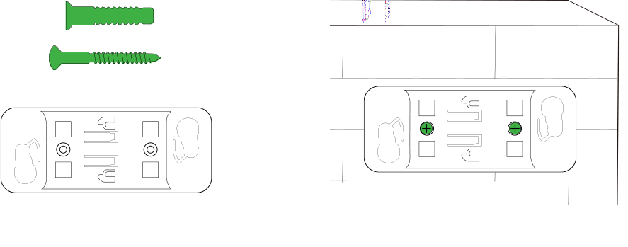

2. 将设备底部安装件对准吸顶支架上的孔位推入，然后顺时针旋转设备，直至固定到位。

   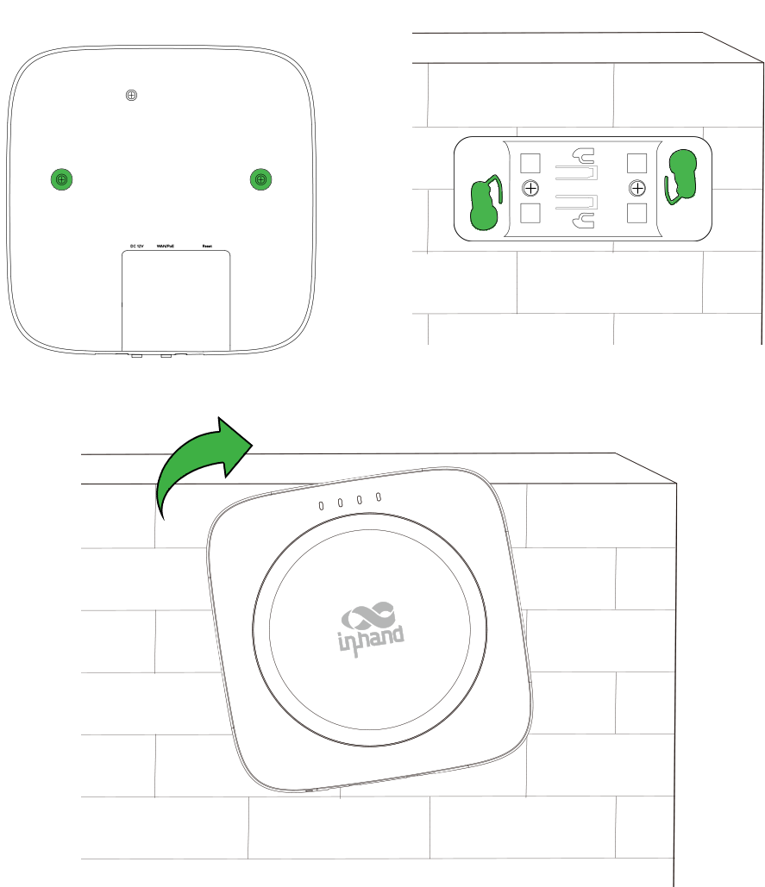

> 吸顶安装的详细说明与注意事项见 §2.4。

### 步骤 3：连接电源与以太网

EAP600 支持两种供电方式，请任选其一：

**方式一：PoE 供电（推荐）**

EAP600 支持 IEEE 802.3af/at 标准受电，仅用一根以太网线即可同时完成供电和数据传输。

- 将以太网线缆的水晶头插入设备上的 RJ-45 接口；将以太网线的另一端接入符合 802.3af/at 标准供电的 PoE 设备。

  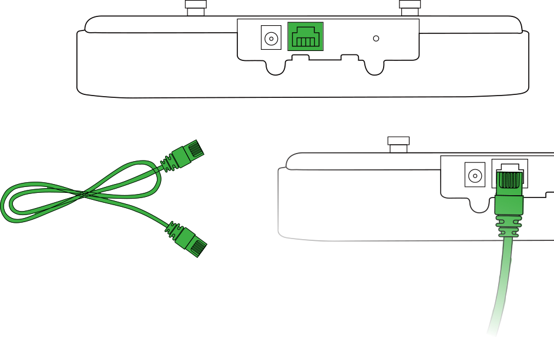

**方式二：电源适配器供电**

- 将 12V DC 电源适配器的圆孔插头一端插入设备电源插孔，另一端插入电源插座。

  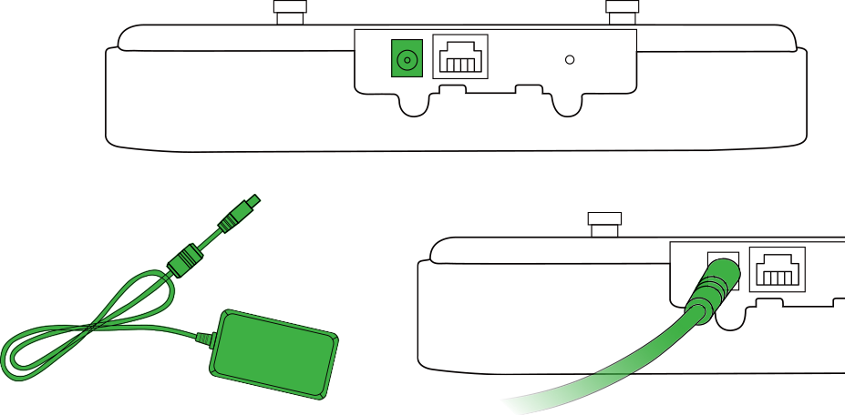

> 供电规格与环境要求详见 §2.6，以太网接口说明详见 §2.5.1。

### 步骤 5：上电，确认设备已就绪

上电后，请观察设备正面板指示灯：

- **PWR 绿色闪烁** → 系统启动中。
- **WAN 绿色闪烁** → 网线连接正常。

> 指示灯状态详解与异常判断见 §2.3。

### 步骤 6：连接设备
有两种方式可以连接到设备，用户可以自行选择通过手机APP或通过PC连接。

**通过手机APP连接**

1.设备上电后，在手机上登录小星云管家APP。

2.进入小星云管家APP后，点击界面底部导航栏中“设备”菜单，进入“设备”界面后，点击右上角的“+”号，然后选择“添加设备”。进入扫码界面后，将取景框对准EAP600上的二维码以添加设备。

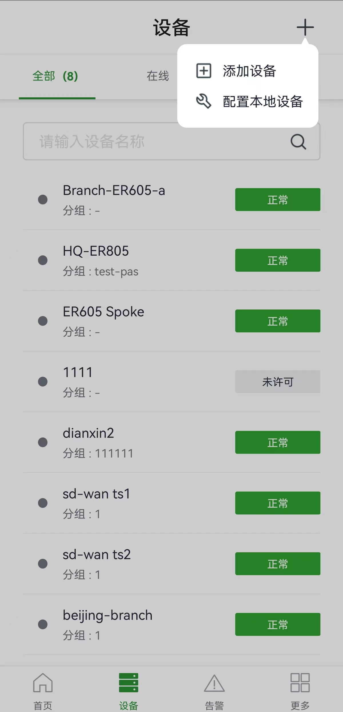

3.识别到设备后，继续配置设备名称，序列号，以及描述等信息。

4.扫描本机铭牌上的二维码，应用程序将自动与 AP 建立 Wi-Fi 连接。

5.建立连接后，应用程序将登录设备，您将被定向到网络配置界面。确认信息，然后单击“提交”。

**通过PC连接**

1. 在 PC 的 Wi-Fi 列表中，找到并连接至 EAP600 **背面铭牌上标注的 SSID**。
2. 打开浏览器，在地址栏输入管理地址 **192.168.10.1**。
3. 在登录页面输入用户名 **adm**，密码 **123456**，点击登录。

   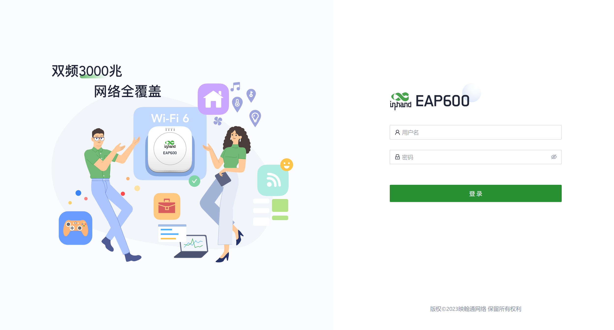

> **注意**：将 PC 与 EAP600 的 WAN 口用网线直连**无法**访问到 EAP600。  
> 如需通过手机 APP 添加设备，请使用小星云管家 APP 扫描设备背面二维码。  
> 首次登录的完整步骤说明与证书告警处理见 §2.7。  
> 如需修改 WAN 工作模式（DHCP/静态 IP），请参考《EAP600 用户手册》。

### 步骤 7：接入网络

EAP600有1个WAN口用于流量上行，可以在“配置>WAN”界面将WAN口的工作方式配置为DHCP或静态IP方式。

- DHCP：设备WAN口默认开启DHCP功能，在此模式下，EAP600将自动从上行设备获取IP地址。

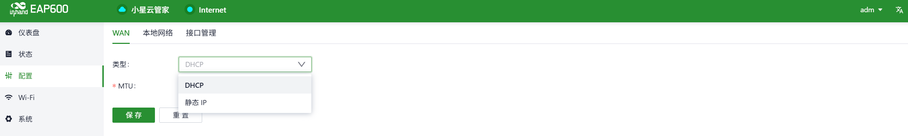

- 静态IP：用户可以手动分配从ISP或上游网络设备获取的静态IP地址。

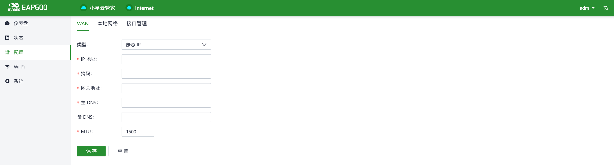

要验证有线网络的连接状态，请跳转到位于“仪表板”中的“接口状态”部分。当“WAN”接口图标变为绿色时，表示设备已成功连接至互联网。您可以点击此端口图标来查看工作模式，IP地址，DNS服务器等信息。

### 装完自检

- ☐ 吸顶支架已牢固固定，设备已顺时针旋转到位。  
- ☐ 以太网线已接好；若使用 PoE，对应端口已开启 PoE 功能（或电源适配器已插好）。  
- ☐ **PWR 绿灯闪烁**（系统启动中）且 **WAN 绿灯闪烁**（网线连接正常）。  
- ☐ PC 已连接设备 Wi-Fi，浏览器已能打开 **192.168.10.1** 并完成登录。

> 若指示灯异常或无法登录，请检查供电与网线连接；仍无法解决时，可尝试硬件恢复出厂设置（见 §2.7.2）。

---

## 第二部分：详细说明

### 2.1 装箱清单

**标准配件**

| 序号 | 名称 | 数量 | 单位 | 备注 |
| :---: | --- | :---: | :---: | --- |
| 1 | EAP600 设备本体 | 1 | 台 | |
| 2 | 吸顶安装件 | 1 | 个 | |

**可选配件**

| 序号 | 名称 | 数量 | 单位 | 备注 |
| :---: | --- | :---: | :---: | --- |
| 1 | 12V DC 电源适配器 | 1 | 个 | 选配 |
| 2 | 1.5M 以太网线 | 1 | 条 | 选配 |

> 具体订购信息见《EAP600 产品规格书》。

### 2.2 产品结构与标识

EAP600 为吸顶式无线 AP，主要接口与标识分布如下：

- **正面板**：PWR、WAN、Wi-Fi 2.4GHz、Wi-Fi 5GHz 四颗 LED 状态指示灯。
- **背面/底部**：
  - RJ-45 以太网接口（WAN）
  - DC 12V 电源插孔
  - Reset 复位按钮
  - 设备铭牌（含序列号、MAC 地址、Wi-Fi SSID 及二维码）

### 2.3 指示灯与复位键

#### 2.3.1 运行状态指示灯

| 指示灯 | 状态 | 含义 |
| :---: | --- | --- |
| **PWR** | 常灭 | 设备未上电 |
| | 绿色闪烁 | 系统启动中 |
| | 绿色快闪 | 系统启动异常 |
| | 绿色闪烁 | 系统升级中 |
| **WAN** | 常灭 | 网络未连接 |
| | 绿色闪烁 | 网线连接正常 |
| **Wi-Fi 2.4GHz** | 常灭 | AP 禁用 |
| | 常亮 | 其余异常情况 |
| | 绿色快闪 | 设备作为 AP 正常工作 |
| **Wi-Fi 5GHz** | 常灭 | AP 禁用 |
| | 常亮 | 其余异常情况 |
| | 绿色快闪 | 设备作为 AP 正常工作 |

闪烁频率定义：
- **常亮/常灭**：至少保持约 3 s
- **慢闪**：约 1 Hz
- **快闪**：约 5 Hz

#### 2.3.2 复位键

- Reset 按钮位于设备上（具体位置参考实物）。
- 作用：硬件恢复出厂设置。
- 恢复出厂的详细步骤见 §2.7.2。

### 2.4 机械安装

#### 2.4.1 吸顶安装

1. 使用钻头或适当的工具在标记位置预钻孔。确保开孔尺寸与您使用的膨胀螺钉匹配。将螺钉穿过支架并将其固定到天花板开孔中，以确保天花板支架牢固地安装在天花板上。

   

2. 将设备底部安装件对准吸顶支架上的孔位推入，然后顺时针旋转设备，直至固定到位。

   

### 2.5 连接与布线

#### 2.5.1 以太网

- EAP600 配有 **1 个 RJ-45 WAN 口**，支持 10M/100M 速率。
- 支持 **IEEE 802.3af/at** 标准 PoE 受电。
- PoE 供电时，请使用 **CAT5e 及以上**网线。

#### 2.5.2 电源

- **PoE 供电**：通过 RJ-45 接口同时传输数据与电力，符合 IEEE 802.3af/at 标准。
- **DC 供电**：使用 12V DC 电源适配器（选配），圆孔插头插入设备电源插孔。

> 供电规格详见 §2.6。

### 2.6 供电与环境（速查）

| 项目 | 规格 |
| --- | --- |
| 输入电压 | PoE：802.3af/at；DC：**12V** |
| 工作温度 | **0℃ ~ 45℃** |
| 存储温度 | **-40℃ ~ 70℃** |
| 环境要求 | 避免直射阳光，远离热源或强电磁干扰 |

### 2.7 首次登录与恢复出厂

#### 2.7.1 Web 登录

1. 设备默认网口模式为 WAN。初次上电后，使用 PC 连接至 EAP600 **背面铭牌上标注的 SSID**。
2. 打开浏览器，在地址栏输入管理地址 **192.168.10.1**。
3. 在登录页面输入用户名 **adm**，密码 **123456**。

   

4. 如页面显示安全警告，请点击"隐藏"或"高级"按钮，并选择"继续"。

> **注意**：将 PC 与 EAP600 的 WAN 口用网线直连**无法**访问到 EAP600。

#### 2.7.2 手机APP登录
1.设备上电后，在手机上登录小星云管家APP。

2.进入小星云管家APP后，点击界面底部导航栏中“设备”菜单，进入“设备”界面后，点击右上角的“+”号，然后选择“添加设备”。进入扫码界面后，将取景框对准EAP600上的二维码以添加设备。

3.识别到设备后，继续配置设备名称，序列号，以及描述等信息。

4.扫描本机铭牌上的二维码，应用程序将自动与 AP 建立 Wi-Fi 连接。

5.建立连接后，应用程序将登录设备，您将被定向到网络配置界面。确认信息，然后单击“提交”。

#### 2.7.3 恢复出厂设置（RESET）

1. 设备上电后 10 秒内，长按 Reset 按钮，直到 PWR 指示灯快速闪烁。
2. 当 PWR 指示灯快闪时，松开 Reset 按钮，此时设备开始恢复出厂设置，此过程中设备会自动重启。
3. 恢复出厂后，设备将使用默认网络参数重新启动。

   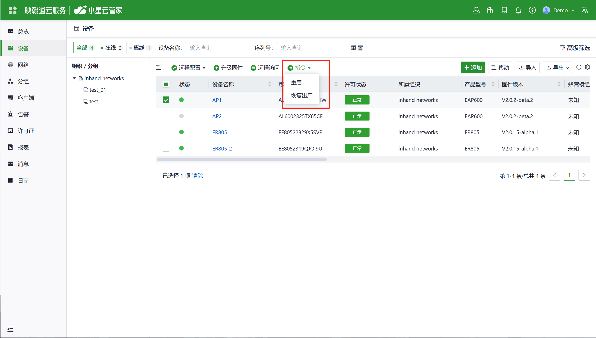
   
### 2.8 远程管理平台

#### 2.8.1 小星云管家

**登录到小星云管家平台**

1.打开您的浏览器,访问网址:https://star.inhandcloud.cn/.  等待页面进入小星云管家注册和登录页面（推荐使用Chrome浏览器）。

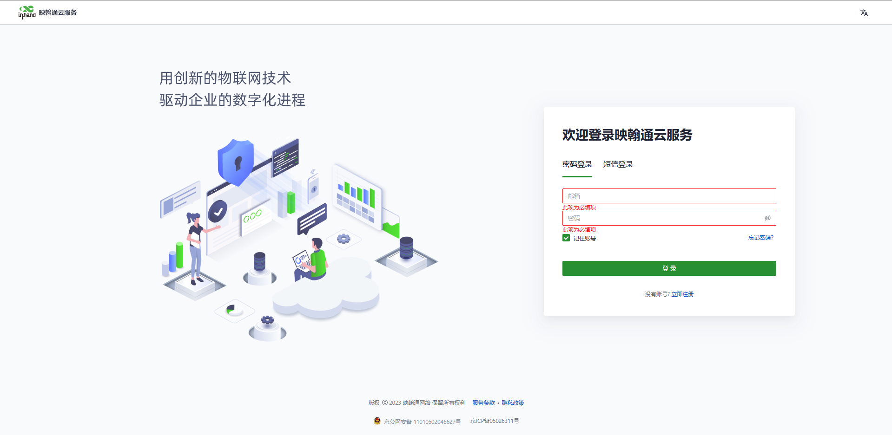

2.完成注册后,使用您所注册的邮箱地址登录云平台。导航到"安全设置"页面,您可以更改密码并绑定您的手机号码,您可以将其用于将来登录云平台。

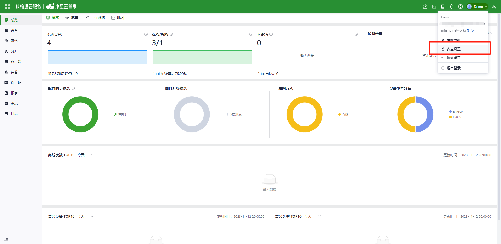

**添加设备**

登录小星云管家平台，点击“设备”，然后单击导航菜单中的“添加”并填写设备的序列号和MAC地址。

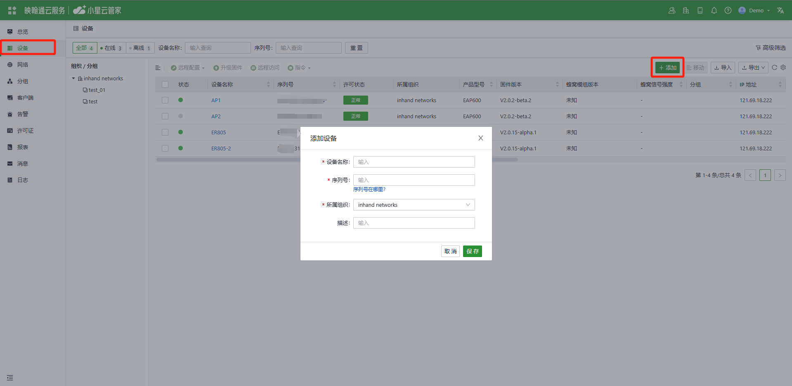

### 2.9 相关文档

| 需求 | 去向 |
| --- | --- |
| 产品介绍、详细配置、USB/SD 详解、排障 | 《EAP600 用户手册》 |
| 订购信息、天线型号、完整规格 | 《EAP600 产品规格书》 |
| 远程管理、云平台、日志与诊断 | [小星云管家](https://star.inhandcloud.cn) |
| 软件下载与公告 | [映翰通官网](http://www.inhand.com.cn) |

### 2.10 法律信息

- **版权声明**：本手册包含受版权保护的内容，版权归北京映翰通网络技术股份有限公司及其许可者所有。未经书面许可，任何单位和个人不得擅自摘抄、复制本手册的部分或全部内容，且不得以任何形式传播。
- **免责声明**：由于产品技术和规格不断更新，本公司不能承诺手册中的资料与实际产品完全一致。因此，不承担由于实际技术参数与本手册不符而引起的任何争议。任何关于产品的改动恕不提前通知，本公司保留最终更改权和解释权。
- **版权信息**：本手册内容受版权法律保护，版权归北京映翰通网络技术股份有限公司及其许可者所有，保留一切权利。未经书面许可，不得擅自使用、复制或传播本手册的内容。
