# EC312-LoRaWAN 快速安装手册

---

# 第一部分：快速装机（图文整体流程）

> **您需要先做：** 开箱 → 固定设备 → 接电源与网线 →（若用蜂窝）**断电**装 SIM、接天线 → 上电 → PC 同网段 → 浏览器打开 Web。
> **再做：** 翻到下方 **第二部分**，按需查阅装箱、灯义、壁挂、各接口引脚等。

## 必读摘要（接线、上电前）

| 项目 | 要求 |
|------|------|
| 供电 | **9～48 V DC**，双引脚端子 **V+ / V−**（或规格适配器）；**PWR 红灯常亮**表示已上电。 |
| SIM 卡 | **须断电**安装或拔出；**不可热插拔**。 |
| 蜂窝 / Wi-Fi / GPS / LoRa 天线 | 按壳体**丝印**拧紧；标配数量因型号而异（见《规格书》订购信息）。 |
| USB 存储 | 断开前执行 **sync** 命令并退出挂载目录，防止数据丢失。 |

---

## 步骤 1：对照实物，确认面板与接口区域

拿到设备后，先对照以下三处面板确认接口位置：

- **正面板**：PWR、STATUS、WARN、NET 指示灯，User1～User4 可编程指示灯，2 个以太网口，USB 口，Micro SD 卡槽。
- **左面板**：DC 电源端子（V+ / V−）、串口端子（COM1/COM2）、SIM 卡座。
- **右面板**：ANT1、ANT2、GPS、Wi-Fi、LoRa 五个 SMA 天线接口。

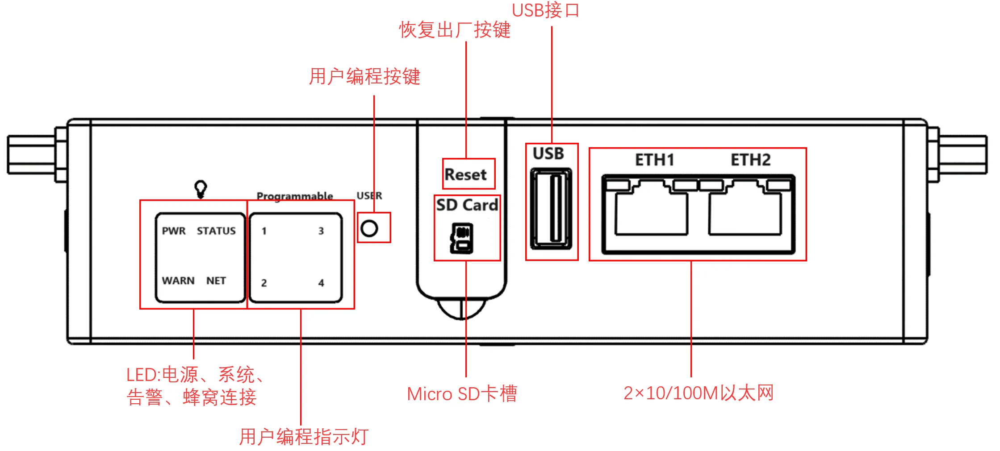

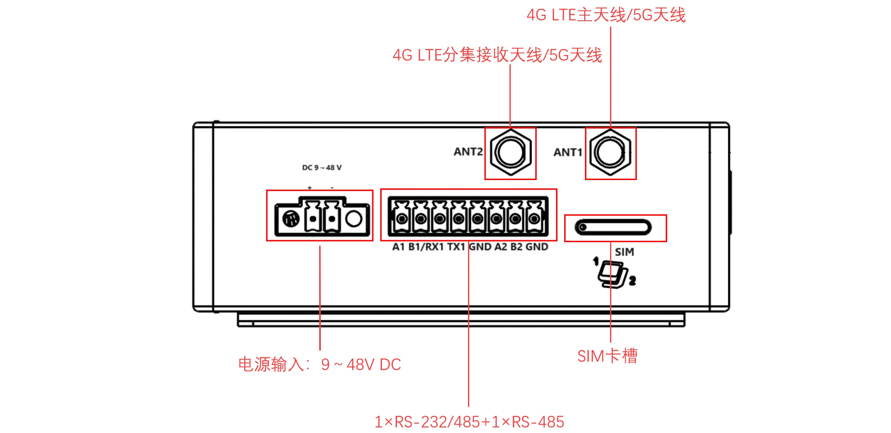

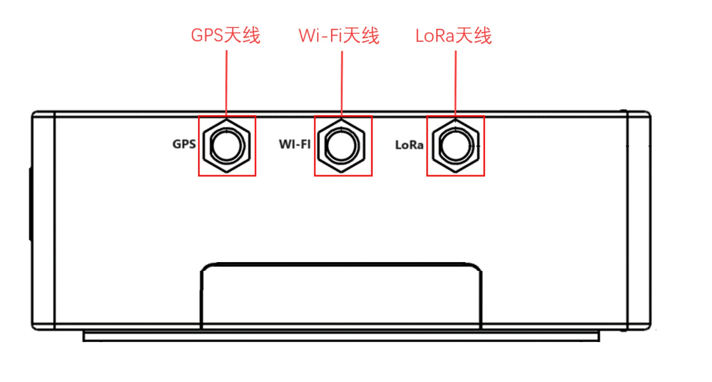

> 指示灯含义详见 §2.3；各接口引脚定义详见 §2.5。

---

## 步骤 2：将设备固定到导轨或柜内

您可以选择 **DIN 导轨** 安装或 **壁挂** 安装。

- **DIN 导轨**：设备后面板自带安装板（6 个 M3 螺钉固定）。将安装板上方挂钩卡入导轨顶端，再向支架方向推入，直到底端卡入到位。拆卸时反向拉出即可。
- **壁挂**：先用 M3 螺钉将壁挂套件固定在设备背面，再用螺钉将设备固定到墙面或柜体。拆卸时逆序松开墙面螺钉，再取下套件。

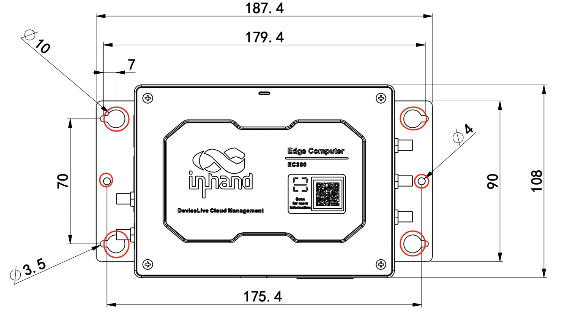

> 详细安装/拆卸步骤见 §2.4。

---

## 步骤 3：连接电源与以太网

1. 将电源适配器端子插入设备左面板的 DC 端口（**V+ / V−**），**暂不接通电源**。
2. 用网线将 PC 与设备的 **ETH1** 或 **ETH2** 口连接。

> 电源规格见 §2.6；RJ45 引脚定义见 §2.5.1；串口引脚见 §2.5.2。

---

## 步骤 4：若使用蜂窝/Wi-Fi/GPS/LoRa，断电装 SIM 并接好天线

> **警告：此步骤必须先断开设备电源，严禁热插拔。**

1. 用取卡针（出厂自带）将 SIM 卡座从左面板取出。
2. 插入 NANO SIM 卡（卡座有上下两个卡槽，按需求选择）。
3. 推回卡座。
4. 按壳体丝印，将对应天线拧紧到 **ANT1、ANT2、GPS、Wi-Fi、LoRa** 接口。

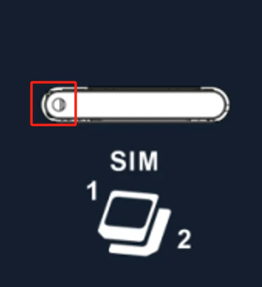

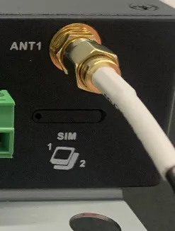

> SIM 卡座位置与天线丝印对照详见 §2.5.6。

---

## 步骤 5：上电，确认设备已就绪

接通电源，观察前面板指示灯：

- **PWR 常亮** → 已上电。
- **STATUS 闪烁** → 系统正常启动。
- 若 STATUS **长灭**，说明启动异常或恢复出厂尚未完成。
- 若 **WARN 闪烁**，表示存在警告异常（如恢复出厂未完成、拨号异常等）。

> 全部灯态定义与闪烁频率见 §2.3.1。

---

## 步骤 6：PC 与浏览器登录 Web

1. 将 PC 网口 IP 设置为与设备同网段（例如接 ETH1 时设为 `192.168.3.x`，接 ETH2 时设为 `192.168.4.x`）。
2. 浏览器访问以下地址：

| 端口 | 默认 IP |
| :---: | :---: |
| ETH 1 | 192.168.3.100 |
| ETH 2 | 192.168.4.100 |

3. 地址格式为 `https://<默认 IP>:9100`，例如：
   - ETH1：`https://192.168.3.100:9100`
   - ETH2：`https://192.168.4.100:9100`
4. 首次访问会出现证书告警，请选择**继续前往**。
5. 使用初始账号 **adm**、密码 **123456** 登录。

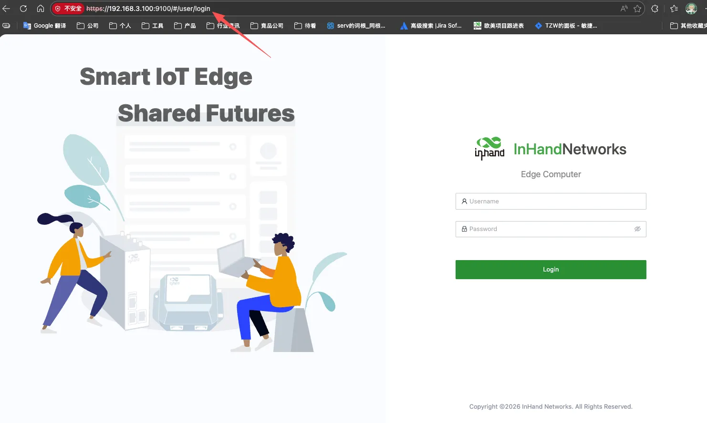

> 详细登录步骤、SSH 方式及恢复出厂说明见 §2.7。
> 
> **注意：** 并非所有型号都支持 WEB 界面管理，具体支持情况请查看《EC312-LoRaWAN 系列边缘计算机产品规格书》中"订购信息"部分。

---

## 装完自检

- ☐ 设备已固定（导轨或壁挂）。
- ☐ 电源、网线已接好；若用蜂窝/Wi-Fi/GPS/LoRa，SIM 与天线已就位。
- ☐ **PWR 常亮**且 **STATUS 闪烁**。
- ☐ 浏览器已能打开 Web 登录页并完成登录。

若无法登录，请检查 PC IP 是否与设备同网段、网线是否接好。如需恢复出厂，请参见 §2.7。

---

# 第二部分：详细说明

## 2.1 装箱清单

### 标准配件

| 序号 | 名称 | 数量 | 单位 | 备注 |
| :---: | --- | :---: | --- | --- |
| 1 | EC312-LoRaWAN 主机 | 1 | 台 | — |
| 2 | Wi-Fi 天线 | 1 | 个 | 标配（根据型号而定） |
| 3 | GPS 天线 | 1 | 个 | 标配（根据型号而定） |
| 4 | 蜂窝天线 | 1 | 个 | 标配（根据型号而定） |
| 5 | LoRa 天线 | 1 | 个 | 标配（根据型号而定） |
| 6 | 取卡针 | 1 | 个 | — |
| 7 | 产品保修卡 | 1 | 张 | — |

### 可选配件

| 序号 | 名称 | 数量 | 单位 | 备注 |
| :---: | --- | :---: | --- | --- |
| 1 | 电源适配器 | 1 | 个 | 选配 |

> 不同型号标配天线数量不同，具体请参见《EC312-LoRaWAN 系列边缘计算机产品规格书》中"订购信息"部分。

---

## 2.2 产品结构与标识

### 2.2.1 正面板

正面板包含 PWR、STATUS、WARN、NET 指示灯，User1～User4 可编程指示灯，2 个 RJ45 以太网口，1 个 USB 2.0 Host 接口，以及 Micro SD 卡槽（带保护盖）。

### 2.2.2 左面板

左面板包含 DC 电源端子（V+ / V−）、串口端子（COM1/COM2）、SIM 卡座，以及用户可编程按键（可通过 API 检测按键状态）。

### 2.2.3 右面板

右面板为 5 个 SMA 天线接口，丝印分别为 ANT1、ANT2、GPS、Wi-Fi、LoRa。

---

## 2.3 指示灯与复位键

### 2.3.1 运行状态指示灯

| 标识 | 名称 | 定义 |
| :---: | --- | --- |
| PWR | 电源指示灯 | 上电常亮 |
| STATUS | 系统运行状态指示灯 | 系统正常启动后闪烁；启动阶段异常导致启动失败，或恢复出厂尚未完成时，STATUS 长灭 |
| WARN | 警告指示灯 | 系统发生警告异常时闪烁。警告异常包括：恢复出厂尚未完成、拨号异常（需开启蜂窝功能） |
| User1 | 用户可编程指示灯 1 | 默认熄灭，可由用户编程控制 |
| User2 | 用户可编程指示灯 2 | 默认熄灭，可由用户编程控制 |
| User3 | 用户可编程指示灯 3 | 默认熄灭，可由用户编程控制 |
| User4 | 用户可编程指示灯 4 | 默认熄灭，可由用户编程控制 |
| NET | 蜂窝网连接状态指示灯 | 拨号成功后常亮 |

**闪烁频率定义：**

- **常亮 / 常灭**：至少保持约 3 s
- **慢闪**：约 1 Hz
- **快闪**：约 5 Hz

### 2.3.2 复位键

用于系统恢复出厂设置。

（设备恢复出厂的详细步骤请参见 §2.7）

---

## 2.4 机械安装

### 2.4.1 DIN 导轨

设备后面板自带 DIN 轨安装板（采用 6 个 M3 螺钉固定）。

1. 将 DIN 轨安装板的上方挂钩卡入到 DIN 轨支架的顶端。
2. 缓慢向 DIN 轨支架方向向前推动设备，使得 DIN 轨底端卡入到位。

### 2.4.2 壁挂

壁挂套件需要单独购买。安装步骤如下：

- **步骤一**：使用螺钉（M3）将壁挂套件固定在 EC312-LoRaWAN 的背面板上。

- **步骤二**：当壁挂套件成功固定到设备以后，采用螺钉将 EC312-LoRaWAN 固定在墙面或柜子上。

拆卸时逆序松开墙面螺钉，再取下套件。

---

## 2.5 连接与布线

### 2.5.1 以太网

EC312-LoRaWAN 配备 2 个 RJ45 以太网口，支持 10M/100M 自适应速率。

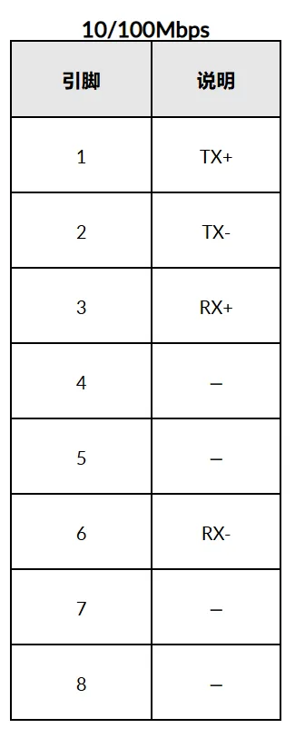

### 2.5.2 电源与串口

**供电**

EC312-LoRaWAN 支持 **9–48 VDC** 供电，通过左面板双引脚端子（V+ / V−）接入。当 PWR 电源指示灯长亮则代表设备已经正常上电。

**串口**

EC312-LoRaWAN 最多支持四路串口：两路标配串口和两路可扩展串口。

- **COM1（标配）**：RS-232 / RS-485（RX1 TX1 / A1 B1）。在同一时刻，只能选择接入 RS-232 或者 RS-485，不能同时接入工作。
- **COM2（标配）**：RS-485（A2 B2）

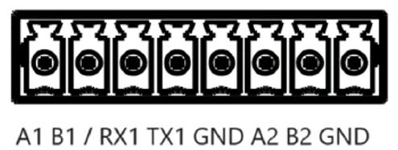

**引脚定义表**

| 引脚 | COM1 RS-232 | COM1 RS-485 | COM2 RS-485 |
| :---: | :---: | :---: | :---: |
| A1 | — | A+ | — |
| B1 | — | B− | — |
| RX1 | RX | — | — |
| TX1 | TX | — | — |
| GND | 接地 | 接地 | — |
| A2 | — | — | A+ |
| B2 | — | — | B− |
| GND | — | — | 接地 |

### 2.5.3 蜂窝 SIM 与天线

**SIM 卡**

EC312-LoRaWAN 配备一个用于蜂窝通信的 SIM 卡座，位于左面板下方，支持 2 个 NANO SIM 卡（分别位于抽屉式卡座的上方和下方）。

> **警告：SIM 卡必须在断电情况下安装或拔出，严禁热插拔。**

**天线**

EC312-LoRaWAN 共有 5 个天线接口，不同型号标配的天线数量不同。

| 标识 | 名称 |
| :---: | :---: |
| ANT1 | 4G LTE 主天线 / 5G 天线 |
| ANT2 | 4G LTE 分集接收天线 / 5G 天线 |
| GPS | GPS 天线 |
| Wi-Fi | Wi-Fi 天线 |
| LoRa | LoRa 天线 |

将天线按壳体丝印拧入相应的 SMA 天线接口完成安装。

> 具体型号对应的天线支持情况可参见《EC312-LoRaWAN 系列边缘计算机产品规格书》中"订购信息"部分。

### 2.5.4 USB 与 Micro SD

**USB**

EC312-LoRaWAN 提供 1 个 USB 2.0 Host 接口，主要用于扩展存储设备，支持 USB 存储设备热插拔。

> **注意：** 在断开 USB 大容量存储设备之前，请记住输入 **sync** 同步命令，以防止数据丢失。当您断开存储设备的连接时，请从挂载目录下退出。

**Micro SD**

EC312-LoRaWAN 配备一个用于扩展存储的 SD 卡槽，位于正面板下方。使用前请先打开保护盖，并将 SD 卡插入到 SD 卡槽中。

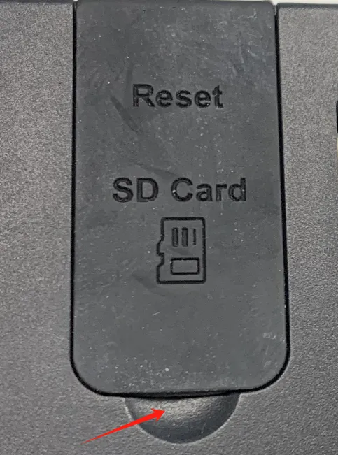

---

## 2.6 供电与环境（速查）

| 项目 | 规格 |
| --- | --- |
| 输入电压 | 9–48 VDC（双引脚端子，V+、V−） |
| 电源功耗 | 6 W |
| 工作温度 | −20～70 ℃（−4 °F～158 °F） |
| 存储温度 | −40～85 ℃（−40 °F～185 °F） |
| 环境湿度 | 5–95%（无凝霜） |

---

## 2.7 首次登录与恢复出厂

### Web 登录

使用以下默认 IP 地址连接到 EC312-LoRaWAN：

| 端口 | 默认 IP |
| :---: | :---: |
| ETH 1 | 192.168.3.100 |
| ETH 2 | 192.168.4.100 |

**步骤一：将 PC 和 EC312-LoRaWAN 互联**

将网线一端插入到 EC312-LoRaWAN 的网口，另一端插入到电脑的网口，同时将电脑的 IP 地址设置为设备接口同网段地址。

**步骤二：通过浏览器进行管理**

EC312-LoRaWAN 支持基于 IEOS 的 WEB 界面管理方式。IEOS 使用 **9100** 端口号作为 HTTPS 连接的端口，不支持通过 HTTP 访问；当用户使用 HTTP 访问 Web 时，会自动跳转到 HTTPS。

- 登陆地址：`https://192.168.3.100:9100`（以 ETH1 为例）
- 初始登陆账号：**adm**
- 初始登陆密码：**123456**

首次访问会出现证书告警，请选择继续前往。

> **注意：** 并非所有 EC312-LoRaWAN 的型号都支持 WEB 界面管理功能，具体支持情况可查看《EC312-LoRaWAN 系列边缘计算机产品规格书》中"订购信息"部分。

### SSH 登录（可选）

方式一：使用 Linux 原生的命令进行网络管理和系统管理。

下载 PuTTY（免费软件），在 Windows 环境下以 SSH 命令的方式建立与 EC312-LoRaWAN 的连接。登录的默认用户名在设备的背板上。

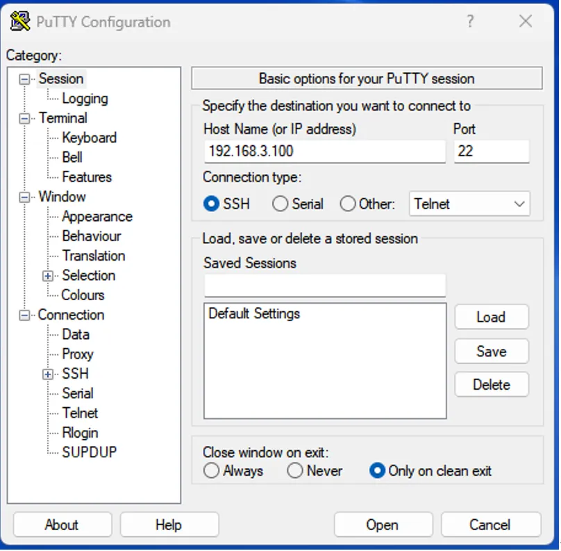

### 恢复出厂（RESET）

（1）长按RESET按钮10-20s，看到警告灯为常亮状态。

（2）当警告灯常亮时，释放恢复出厂设置按钮。

### 访问内置 LNS（可选）

如需访问内置 LoRaWAN Network Server：

1. 点击 **Network** → **LoRaWAN**，然后在该页面点击 **Go to the Network Server manage page**。

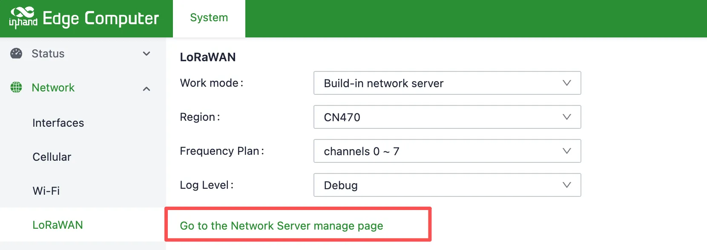

2. 输入您的用户名和密码登录（admin / admin）。

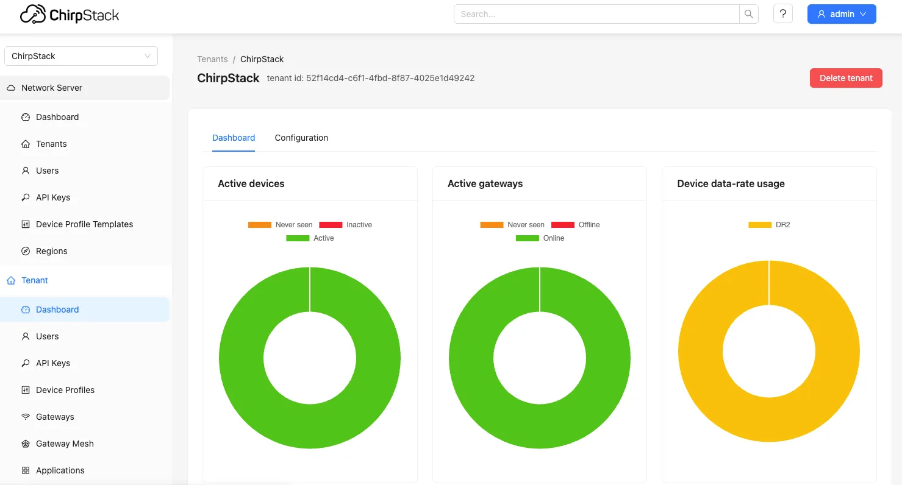

---

## 2.8 相关文档

| 需求 | 去向 |
|------|------|
| 产品介绍、USB/SD 详解、配置与排障 | 《EC312-LoRaWAN 用户手册》 |
| 订购与天线型号 | 《EC312-LoRaWAN 系列边缘计算机产品规格书》 |
| 软件与公告 | [www.inhand.com.cn](http://www.inhand.com.cn) |

---

## 2.9 法律信息

**版权声明**

© 2026 映翰通网络 保留所有权利。

**商标**

InHand 标志是映翰通网络的注册商标。

本手册中的所有其他商标或注册商标属于其各自的制造商。

**免责声明**

本公司保留对此手册更改的权利，产品后续相关变更时，恕不另行通知。对于任何因安装、使用不当而导致的直接、间接、有意或无意的损坏及隐患概不负责。
