# EC312 快速安装手册

---

# 第一部分：快速装机（图文整体流程）

> **您需要先做：** 开箱 → 固定设备 → 接电源与网线 →（若用蜂窝）**断电**装 SIM、接天线 → 上电 → PC 同网段 → 浏览器打开 Web。
> **再做：** 翻到下方 **第二部分**，按需查阅装箱、灯义、壁挂、各接口引脚等。

## 必读摘要（接线、上电前）

| 项目 | 要求 |
|------|------|
| 供电 | **9～48 V DC**，端子 **V+ / V−**（或电源适配器）；**PWR 红灯常亮**表示已上电。 |
| SIM / Micro SD | SIM **须断电**安装或拔出；**不可热插拔**。Micro SD 位于正面板下方。 |
| 蜂窝 / Wi-Fi / GPS / LoRa 天线 | 按壳体**丝印**拧紧；标配数量因型号而异（见《规格书》订购信息）。 |
| USB 存储 | 断开前须输入 **sync** 命令并退出挂载目录，防止数据丢失。 |

## 步骤 1：对照实物，确认面板与接口区域

将设备拿到手后，先对照实物熟悉各面板位置：

- **正面板**：电源接口、以太网口、串口、USB、Micro SD 卡槽等。详见 §2.2。
- **左面板**：SIM 卡座、天线 SMA 接口。详见 §2.2。
- **右面板**：扩展接口。详见 §2.2。


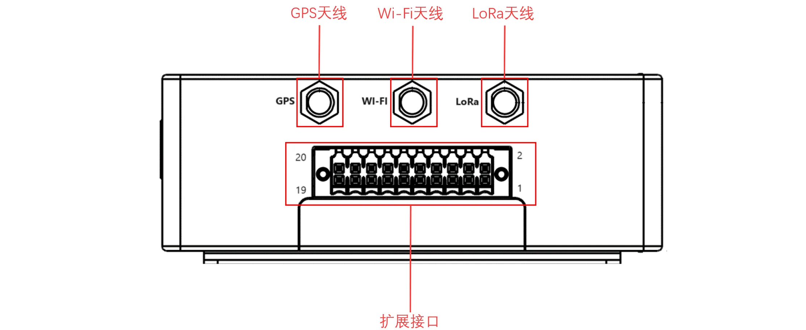

> 各接口详细引脚定义见 §2.5。

## 步骤 2：将设备固定到导轨或柜内

**DIN 导轨安装（推荐）：**

1. 将设备背面 DIN 轨安装板的**上方挂钩**卡入导轨顶端。
2. 缓慢向前推设备，使导轨底端卡入到位。

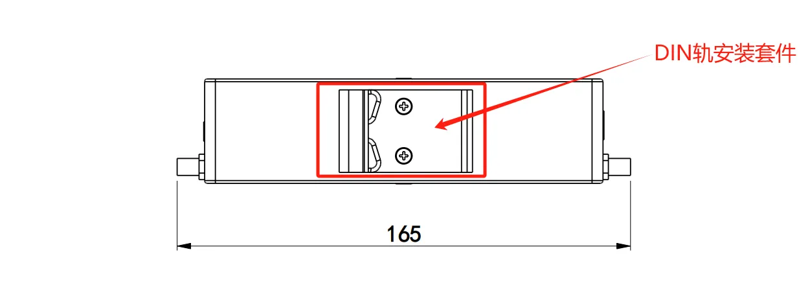

**壁挂安装（需另购套件）：**

1. 用螺钉（M3）将壁挂套件固定在设备背面。
2. 再用螺钉将设备固定到墙面或柜体。

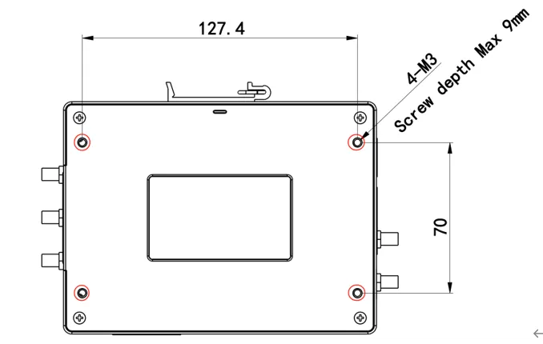


> 详细拆卸步骤及壁挂方式见 §2.4。

## 步骤 3：连接电源与以太网

**连接电源：**

将电源适配器端子插入设备的 DC 端口（**V+ / V−**），或接入 9～48 V DC 直流电源。

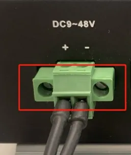

**连接以太网：**

将网线插入 ETH1 或 ETH2 口。EC312 提供 **2 个 RJ45 口**，支持 10M/100M 自适应。

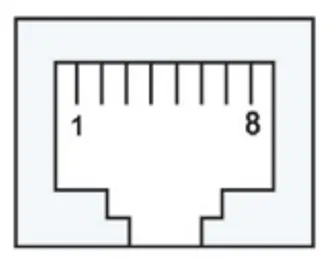


> 电源与串口引脚定义详见 §2.5.2。

## 步骤 4：（若使用蜂窝）断电装 SIM，并接好天线

**⚠️ 必须断电操作！**

1. **断开设备电源**。
2. 用取卡针将左面板的 SIM 卡座取出。
3. 将 NANO SIM 卡插入卡座（上下两个卡槽，根据需求选择）。
4. 将卡座推回设备。
5. 按壳体丝印将蜂窝天线拧紧到对应 SMA 接口（ANT1 / ANT2）。


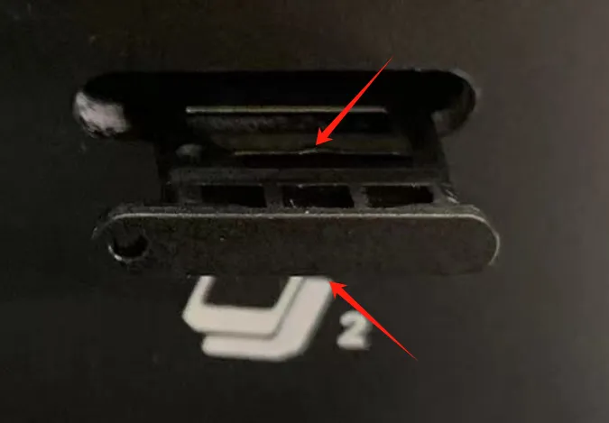


> SIM 卡座位置、天线丝印对照表详见 §2.5.6。

## 步骤 5：上电，确认设备已就绪

接通电源后，观察正面板指示灯：

- **PWR 常亮** → 已上电。
- **STATUS 闪烁** → 系统正常启动。
- **WARN 闪烁** → 系统发生警告异常（如拨号异常，需开启蜂窝功能）。
- **NET 常亮** → 蜂窝拨号成功。

> 各灯状态详细定义见 §2.3。

## 步骤 6：PC 与浏览器登录 Web

**1. 设置 PC 网段**

将 PC 网线连接到 ETH1 或 ETH2，并将 PC 的 IP 地址设置为与设备接口同网段。

| 端口角色 | 默认 IP |
| :---: | :---: |
| ETH 1 | 192.168.3.100 |
| ETH 2 | 192.168.4.100 |

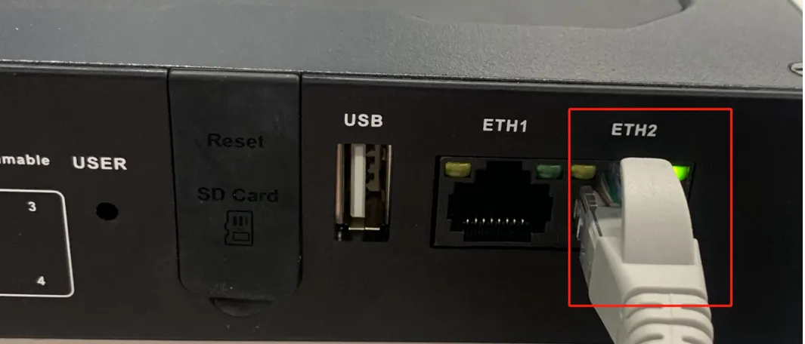

**2. 浏览器访问 Web**

在浏览器地址栏输入 `https://<默认IP>:9100`，例如：

```
https://192.168.4.100:9100
```

- 端口：**9100**（HTTPS）
- 初始账号：**adm**
- 初始密码：**123456**

> 不支持 HTTP 访问，使用 HTTP 会自动跳转到 HTTPS。

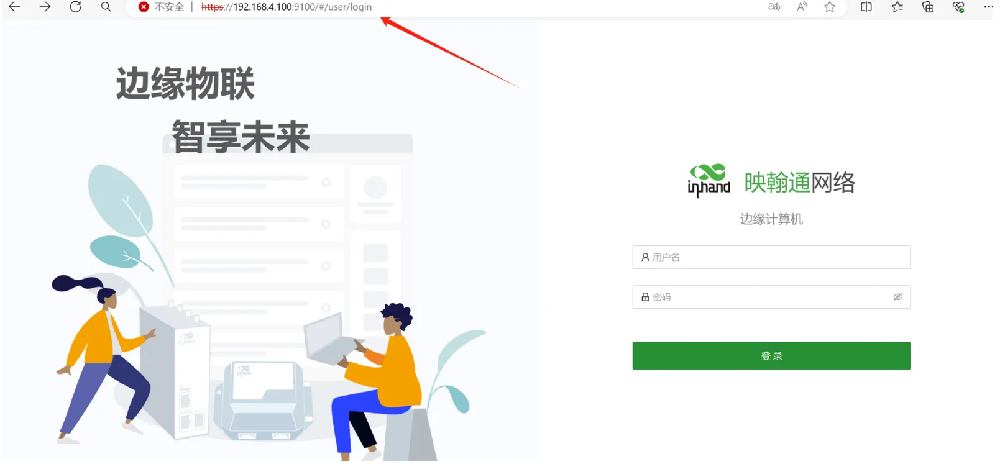

> 并非所有型号均支持 Web 界面，具体支持情况见《规格书》订购信息。  
> 首次登录详细步骤及证书告警处理见 §2.7。

---

## 装完自检

- ☐ 设备已固定（导轨或壁挂）。
- ☐ 电源、网线已接好；若用蜂窝，SIM 与天线已就位。
- ☐ **PWR 常亮**且 **STATUS 闪烁**。
- ☐ 浏览器已能打开 Web 登录页并完成登录。

**排障提示：**

- 若 STATUS 长灭，检查供电或观察是否启动失败。详见 §2.3.1。
- 若无法登录 Web，确认 PC 与设备同网段，并检查是否使用 HTTPS 及 9100 端口。
- 恢复出厂操作见 §2.7。

---

# 第二部分：详细说明

## 2.1 装箱清单

**标准配件**

| 序号 | 名称 | 数量 | 单位 | 备注 |
| :---: | :---: | :---: | :---: | --- |
| 1 | EC312 主机 | 1 | 台 | — |
| 2 | 取卡针 | 1 | 个 | — |
| 3 | 产品保修卡 | 1 | 张 | — |

**可选配件**

| 序号 | 名称 | 数量 | 单位 | 备注 |
| :---: | :---: | :---: | :---: | --- |
| 1 | 电源适配器 | 1 | 个 | 选配 |
| 2 | Wi-Fi 天线 | 1 | 个 | 标配（根据型号而定） |
| 3 | GPS 天线 | 1 | 个 | 标配（根据型号而定） |
| 4 | 蜂窝天线 | 1 | 个 | 标配（根据型号而定） |

> 不同型号标配天线数量不同，详见《EC312 系列边缘计算机产品规格书》“订购信息”。

## 2.2 产品结构与标识

### 正面板


### 左面板


### 右面板


### 扩展接口

EC312 支持接口扩展，已支持的扩展模块如下：

| 扩展模块 | 功能 |
| :---: | :---: |
| NAAD | 2× 4-20mA 模拟量输入 + 4× DI + 4× DO |
| N44C | 2× RS-485 + 1× CAN FD |
| N4CC | 1× RS-485 + 2× CAN FD |
| N44D | 2× RS-485 + 4× DI + 4× DO |

扩展接口定义：

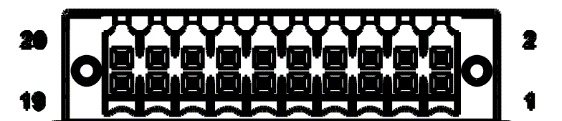

| PIN | NAAD | N44C | N4CC | N44D |
| :---: | :---: | :---: | :---: | :---: |
| 1 | AIN1+ | A_485_A | A_485_A | A_485_A |
| 2 | — | A_485_B | A_485_B | A_485_B |
| 3 | AIN1- | — | — | — |
| 4 | GND | GND | GND | GND |
| 5 | AIN2+ | B_485_A | CAN2_H | B_485_A |
| 6 | — | B_485_B | CAN2_L | B_485_B |
| 7 | AIN2- | — | — | — |
| 8 | GND | GND | GND | GND |
| 9 | — | CAN3_H | CAN3_H | — |
| 10 | — | CAN3_L | CAN3_L | — |
| 11 | DO0 | — | — | DO0 |
| 12 | DO1 | — | — | DO1 |
| 13 | DO2 | — | — | DO2 |
| 14 | DO3 | — | — | DO3 |
| 15 | DI0 | — | — | DI0 |
| 16 | DI1 | — | — | DI1 |
| 17 | DI2 | — | — | DI2 |
| 18 | DI3 | — | — | DI3 |
| 19 | DI_COM | — | — | DI_COM |
| 20 | GND | — | — | GND |

> 扩展接口具体支持情况取决于扩展模块型号。

## 2.3 指示灯与复位键

### 2.3.1 运行状态指示灯

| 标识 | 名称 | 状态定义 |
| :---: | :---: | --- |
| PWR | 电源指示灯 | 上电常亮 |
| STATUS | 系统运行状态指示灯 | 系统正常启动后闪烁；启动失败或恢复出厂尚未完成时长灭 |
| WARN | 警告指示灯 | 系统发生警告异常时闪烁（含恢复出厂尚未完成、拨号异常，需开启蜂窝功能） |
| User1 | 用户可编程指示灯 1 | 默认熄灭，可由用户编程控制 |
| User2 | 用户可编程指示灯 2 | 默认熄灭，可由用户编程控制 |
| User3 | 用户可编程指示灯 3 | 默认熄灭，可由用户编程控制 |
| User4 | 用户可编程指示灯 4 | 默认熄灭，可由用户编程控制 |
| NET | 蜂窝网连接状态指示灯 | 拨号成功后常亮 |

闪烁频率定义：

- **常亮/常灭**：至少保持约 3 s
- **慢闪**：约 1 Hz
- **快闪**：约 5 Hz

### 2.3.2 复位键

用于系统恢复出厂设置。

（设备恢复出厂的详细步骤请参见 §2.7）

## 2.4 机械安装

### 2.4.1 DIN 导轨

EC312 的 DIN 轨安装板附在设备后面板（采用 6 个 M3 螺钉固定）。

1. 将 DIN 轨安装板的上方挂钩卡入 DIN 轨支架的顶端。
2. 缓慢向 DIN 轨支架方向向前推动设备，使底端卡入到位。


### 2.4.2 壁挂

壁挂套件需单独购买。先将套件用螺钉（M3）固定在设备背面，再用螺钉将设备固定到墙面或柜体。拆卸时逆序松开墙面螺钉，再取下套件。

**步骤一：固定壁挂套件**


**步骤二：固定到墙面**


## 2.5 连接与布线

### 2.5.1 以太网

EC312 具有 **2 个 RJ45 以太网口**，支持 10M/100M 自适应速率。

RJ45 引脚说明：


### 2.5.2 电源与串口

**供电**

EC312 支持 **9～48 V DC** 供电。将适配器端子插入 DC 端口，PWR 灯长亮即表示正常上电。

**标配串口**


- **COM1**：RS-232 / RS-485（RX1 TX1 / A1 B1），同一时刻只能选择 RS-232 或 RS-485，不能同时接入。
- **COM2**：RS-485（A2 B2）

| 引脚 | COM1 RS-232 | COM1 RS-485 | COM2 RS-485 |
| :---: | :---: | :---: | :---: |
| A1 | — | A+ | — |
| B1 | — | B- | — |
| RX1 | RX | — | — |
| TX1 | TX | — | — |
| GND | 接地 | 接地 | — |
| A2 | — | — | A+ |
| B2 | — | — | B- |
| GND | — | — | 接地 |

**可扩展串口**

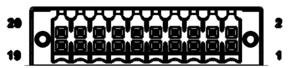

- **COM3**：RS-232 / RS-485（扩展接口 PIN1 / PIN2）
- **COM4**：RS-232 / RS-485（扩展接口 PIN5 / PIN6）

> 说明：可扩展串口具体支持情况取决于扩展模块型号。

**CAN 口**


EC312 具有 **3 路 CAN 总线接口**，支持 CAN 2.0A/B 标准，兼容 CAN FD，最高速率可达 5 Mbps。

- CAN1：扩展接口 PIN1 / PIN2
- CAN2：扩展接口 PIN5 / PIN6
- CAN3：扩展接口 PIN9 / PIN10

> 说明：CAN 接口扩展支持情况取决于扩展模块型号。

### 2.5.4 数字量输入

| 参数 | 描述 | 最小 | 类型 | 最大 | 单位 |
| :---: | :---: | :---: | :---: | :---: | :---: |
| Vds | 漏极-源极电压 | | | 48 | V |
| VIN Low | LOW 状态最高输入电压 | | | 3 | V |
| VIN High | HIGH 状态最低输入电压 | 10 | | 30 | V |

| 接口标识 | 功能 | 描述 |
| :---: | :---: | --- |
| GND | 电源参考地 | 4 路数字量输入 DI，湿接点状态"1"：+10～+30 V / -30～-10 VDC；湿接点状态"0"：0～+3 V / -3～0 V；隔离 3000 VDC |
| DICOM | 输入公共端 | |
| DI0 | 数字量输入 0 号接口 | |
| DI1 | 数字量输入 1 号接口 | |
| DI2 | 数字量输入 2 号接口 | |
| DI3 | 数字量输入 3 号接口 | |

仅支持湿节点接线方式：

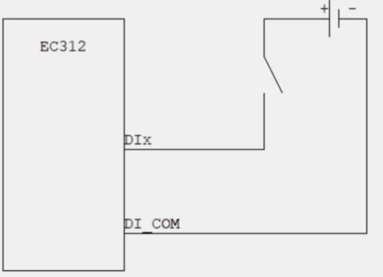

> 数字量输入接口支持情况取决于扩展模块型号。

### 2.5.5 数字量输出

| 接口标识 | 功能 | 描述 |
| :---: | :---: | --- |
| DO0 | 数字量输出 0 号接口 | 4 路 DO OD 输出，隔离 3000 VDC |
| DO1 | 数字量输出 1 号接口 | |
| DO2 | 数字量输出 2 号接口 | |
| DO3 | 数字量输出 3 号接口 | |
| GND | 接地端 | |

接线方式：

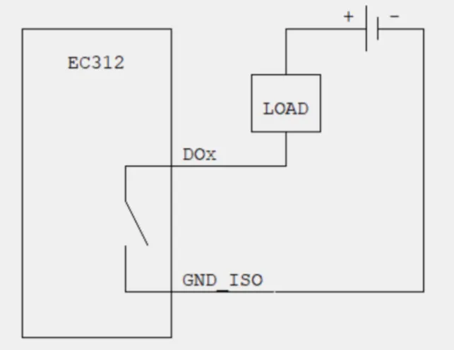

> 数字量输出接口支持情况取决于扩展模块型号。

### 2.5.6 蜂窝 SIM 与天线

**SIM 卡**

EC312 配备一个 SIM 卡座，位于左面板下方，支持 **2 个 NANO SIM 卡**。

> **警告：SIM 卡必须在断电情况下安装或拔出，不可热插拔。**

安装步骤：

1. 断电。
2. 用取卡针取出卡座。
3. 将 NANO SIM 卡插入卡座（上下两个卡槽）。
4. 推回卡座。


**天线**

EC312 共有 **5 个天线接口**，不同型号标配天线数量不同，详见《规格书》订购信息。

| 丝印 | 名称 |
| :---: | :---: |
| ANT1 | 4G LTE 主天线 / 5G 天线 |
| ANT2 | 4G LTE 分集接收天线 / 5G 天线 |
| GPS | GPS 天线 |
| Wi-Fi | Wi-Fi 天线 |
| Lora | LoRa 天线 |


### 2.5.7 USB 与 Micro SD

**USB**

EC312 提供 **1 个 USB 2.0 Host** 接口，主要用于扩展存储设备，**支持热插拔**。

> 注意：断开 USB 大容量存储设备前，须输入 **sync** 同步命令并退出挂载目录，以防数据丢失。

**Micro SD**

EC312 配备一个 SD 卡槽，位于正面板下方。使用前打开保护盖，将 SD 卡插入卡槽。


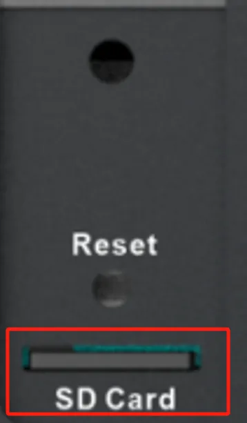

## 2.6 供电与环境（速查）

| 项目 | 规格 |
| :---: | :---: |
| 输入电压 | 9～48 VDC（双引脚端子，V+、V−） |
| 电源功耗 | 6 W |
| 工作温度 | -20～70 ℃（-4 °F～158 °F） |
| 存储温度 | -40～85 ℃（-40 °F～185 °F） |
| 环境湿度 | 5～95 %（无凝霜） |

## 2.7 首次登录与恢复出厂

### Web 登录

**步骤一：将 PC 和 EC312 互联**

将网线一端插入 EC312 网口，另一端插入 PC 网口，并将 PC IP 地址设置为设备接口同网段。

| 端口 | 默认 IP |
| :---: | :---: |
| ETH 1 | 192.168.3.100 |
| ETH 2 | 192.168.4.100 |


**步骤二：浏览器访问 Web**

EC312 支持基于 IEOS 的 Web 界面管理方式。IEOS 使用 **9100 端口**作为 HTTPS 连接端口，不支持 HTTP 访问（会自动跳转 HTTPS）。

登陆地址：`https://<默认IP>:9100`

| 项目 | 内容 |
| :---: | :---: |
| 初始账号 | adm |
| 初始密码 | 123456 |


> 并非所有型号都支持 Web 界面，具体支持情况见《规格书》订购信息。

**SSH 登录（可选）**

使用 PuTTY 等工具，以 SSH 方式连接。登录用户名在设备背板上。


### 恢复出厂（RESET）

（1）长按RESET按钮10-20s，看到警告灯为常亮状态。

（2）当警告灯常亮时，释放恢复出厂设置按钮。


## 2.8 相关文档

| 需求 | 去向 |
|------|------|
| 产品介绍、USB/SD 详解、配置与排障、扩展模块详情 | 《EC312 系列边缘计算机用户手册》 |
| 订购信息、天线型号、型号功能对照 | 《EC312 系列边缘计算机产品规格书》 |
| 软件与公告 | [映翰通官网](http://www.inhand.com.cn) |

## 2.9 法律信息

**版权声明**

© 2024 映翰通网络 保留所有权利。

**商标**

InHand 标志是映翰通网络的注册商标。

本手册中的所有其他商标或注册商标属于其各自的制造商。

**免责声明**

本公司保留对此手册更改的权利，产品后续相关变更时，恕不另行通知。对于任何因安装、使用不当而导致的直接、间接、有意或无意的损坏及隐患概不负责。
