# EC300边缘计算机用户手册

# 前置信息

本用户手册适用于EC300边缘计算机。使用产品前，建议完整阅读以下声明，以维护知识产权和法律合规性，并保持与产品最新信息的一致性。如有疑问或需获取书面许可，可联系技术支持团队。

- 版权声明

本用户手册包含受版权保护的内容，版权归北京映翰通网络技术股份有限公司及其许可者所有。未经书面许可，任何单位和个人不得擅自摘抄、复制本手册的部分或全部内容，且不得以任何形式传播。

- 免责声明

由于产品技术和规格不断更新，本公司不能承诺用户手册中的资料与实际产品完全一致。因此，不承担由于实际技术参数与用户手册不符而引起的任何争议。任何关于产品的改动恕不提前通知，本公司保留最终更改权和解释权。

- 版权信息

本用户手册内容受版权法律保护，版权归北京映翰通网络技术股份有限公司及其许可者所有，保留一切权利。未经书面许可，不得擅自使用、复制或传播本手册的内容。

## 图形界面约定

| 符号 | 含义 | 示例 |
|------|------|------|
| `< >` | 表示变量或参数，需替换为实际值 | `<IP地址>` 表示需填入具体IP |
| `" "` | 表示界面上的文字标签 | 点击"保存"按钮 |
| `→` | 表示菜单层级或操作顺序 | 【网络】→【蜂窝】 |
| `【 】` | 表示菜单或页面名称 | 进入【系统设置】页面 |

## 技术支持

**北京映翰通网络技术股份有限公司（总部）**

电话：010-8417 0010

地址：北京市朝阳区紫月路18号院3号楼5层

**成都办事处**

电话：028-8679 8244

地址：四川省成都市武侯区天府大道北段1777号中国太平金融大厦14层

**广州办事处**

电话：020-8562 9571

地址：广州市天河区棠东东路5号远洋新三板创意园B-130单元

**武汉办事处**

电话：027-8716 3566

地址：湖北省武汉市洪山区珞瑜东路2号巴黎豪庭11栋2001室

**上海办事处**

电话：021-5480 8501

地址：上海市普陀区顺义路18号1103室

## 如何使用本手册

**对号入座**

- 首次使用用户：建议按顺序阅读「认识设备」→「安装与首次使用」→「常用场景配置」→「功能说明与参数参考」
- 已有设备用户：可直接查阅「功能说明与参数参考」或「附录 故障处理」
- 云平台管理用户：可查阅「常用场景配置」中的设备远程管理平台相关章节

**按任务快速跳转**

| 任务 | 对应章节 | 预计用时 |
|------|----------|----------|
| 了解设备外观与接口 | [认识设备](#第1章-认识设备) | 约10分钟 |
| 完成设备安装与首次登录 | [安装与首次使用](#第2章-安装与首次使用) | 约15分钟 |
| 配置蜂窝网络上网 | [常用场景配置](#第3章-常用场景配置) | 约10分钟 |
| 配置Wi-Fi接入或热点 | [常用场景配置](#第3章-常用场景配置) | 约10分钟 |
| 查看功能参数与命令参考 | [功能说明与参数参考](#第4章-功能说明与参数参考) | 按需 |
| 排查连接或配置问题 | [附录 故障处理](#附录-故障处理) | 按需 |


# 第1章 认识设备

## 1.1 概述

EC300是基于Arm架构的边缘计算机，面向工业自动化及轻量级边缘应用场景设计。设备内置Linux系统，提供丰富的工业接口，包括以太网、串口、CAN总线、数字量输入输出、模拟量输入及USB等，并支持通过扩展模块进一步扩充接口能力。EC300可内置映翰通DeviceSupervisor™ Agent服务，实现数据采集、处理及上云，同时支持DeviceLive云管理，适用于智能制造、能源监控、交通运输等需要边缘计算与远程管理的场景。

## 1.2 包装清单

| 物品 | 数量 | 说明 |
| :--- | :--- | :--- |
| EC300主机 | 1台 | — |
| 电源适配器 | 1个 | 选配 |
| Wi-Fi天线 | 1个 | 标配（根据型号而定） |
| GPS天线 | 1个 | 标配（根据型号而定） |
| 蜂窝天线 | 1个 | 标配（根据型号而定） |
| 取卡针 | 1个 | — |
| 产品保修卡 | 1张 | — |

## 1.3 外观与接口

<p align="center">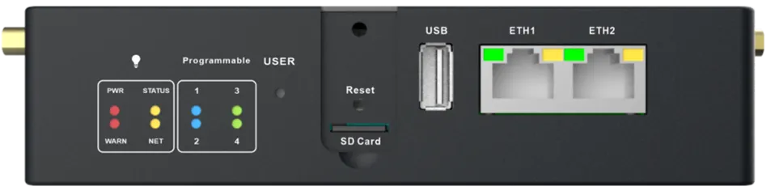</p>

<p align="center"><strong>图 1-1 EC300正面板</strong></p>

<p align="center">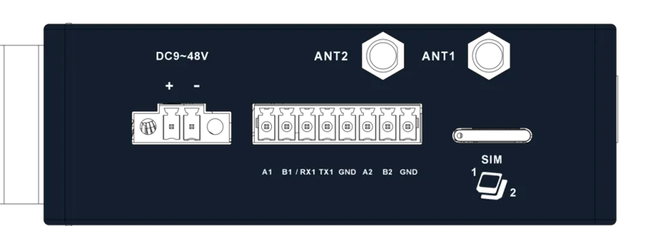</p>

<p align="center"><strong>图 1-2 EC300左侧面板</strong></p>

<p align="center"></p>

<p align="center"><strong>图 1-3 EC300右侧面板</strong></p>

<p align="center">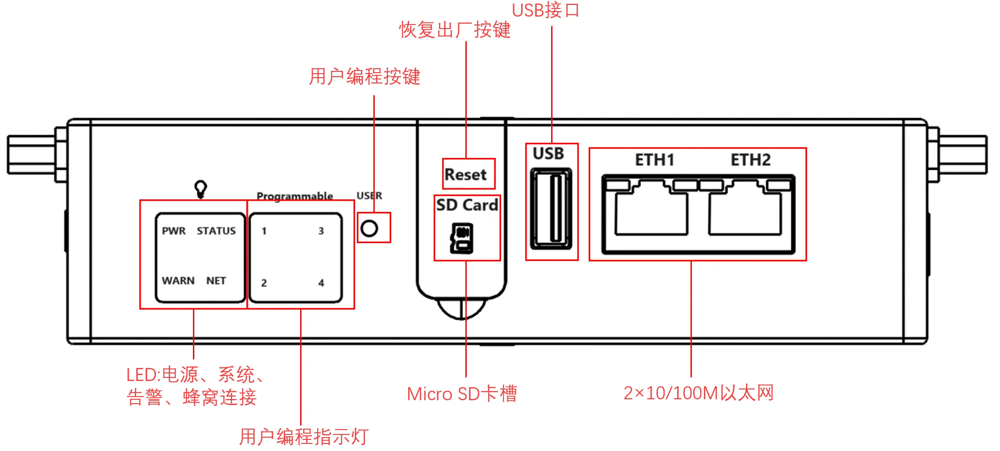</p>

<p align="center"><strong>图 1-4 EC312正面板（外观补充）</strong></p>

<p align="center">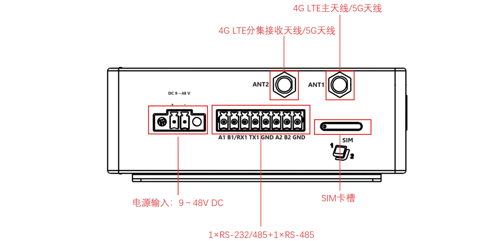</p>

<p align="center"><strong>图 1-5 EC312左面板（外观补充）</strong></p>

<p align="center">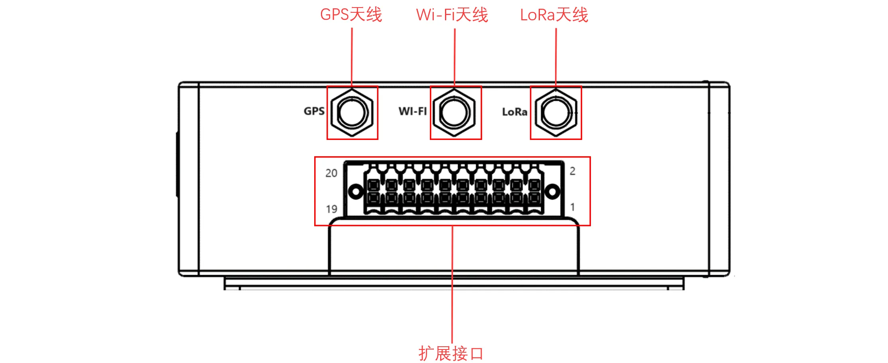</p>

<p align="center"><strong>图 1-6 EC312右面板（外观补充）</strong></p>

| 接口 | 位置 | 功能说明 |
| :--- | :--- | :--- |
| 以太网口 | 正面板 | 2个RJ45接口，支持10M/100M自适应速率 |
| 串口 | 扩展接口 | 最多4路串口：COM1（RS-232 / RS-485）、COM2（RS-485）为标配；COM3、COM4为扩展 |
| CAN | 扩展接口 | 最多3路可扩展CAN总线接口，支持CAN FD（可以理解为：CAN总线的高速升级版），最高速率5Mbps，兼容CAN 2.0 A/B标准 |
| DI（Digital Input，数字输入，可以理解为：检测开关状态的输入接口） | 扩展接口 | 4路数字量输入，湿接点，隔离3000VDC |
| DO（Digital Output，数字输出，可以理解为：控制外部设备开关的输出接口） | 扩展接口 | 4路数字量输出，OD输出，隔离3000VDC |
| AIN（Analog Input，可以理解为：接收连续变化模拟信号的输入接口） | 扩展接口 | 最多2路可扩展模拟电流输入，范围4–20mA，12位ADC，采样率1.6KHz |
| USB 2.0 Host | 侧面板 | 1个USB 2.0 Host接口 |
| SIM卡插槽 | 侧面板 | 2个SIM卡（Subscriber Identity Module，可以理解为：存储移动网络认证信息的身份模块）插槽，需断电安装 |
| MicroSD卡槽 | 侧面板 | 1个MicroSD卡槽，不支持热插拔，需断电操作 |
| 直流电源输入 | 侧面板 | 支持9–48V直流输入 |
| 天线接口 | 侧面板 | 5个天线接口：ANT1、ANT2、GPS、Wi-Fi、LoRa（不同型号标配天线数量不同） |
| 恢复出厂按键 | 侧面板 | 用于系统恢复出厂设置 |
| 用户可编程按键 | 侧面板 | 提供API接口，可由用户检测状态并实现自定义按键逻辑 |

<p align="center">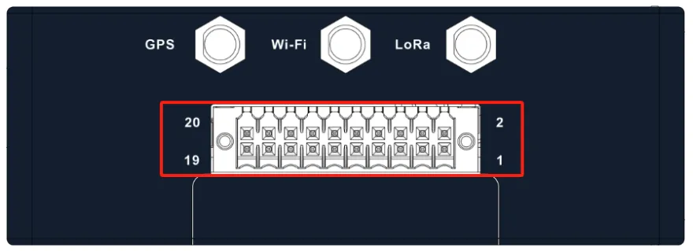</p>

<p align="center"><strong>图 1-7 扩展接口引脚定义</strong></p>

| PIN | NAAD | N44C | N4CC | N44D |
| :--- | :--- | :--- | :--- | :--- |
| 1 | AIN1+ | A_485_A | A_485_A | A_485_A |
| 2 | — | A_485_B | A_485_B | A_485_B |
| 3 | AIN1- | — | — | — |
| 4 | GND | GND | GND | GND |
| 5 | AIN2+ | B_485_A | CAN2_H | B_485_A |
| 6 | — | B_485_B | CAN2_L | B_485_B |
| 7 | AIN2- | — | — | — |
| 8 | GND | GND | GND | GND |
| 9 | — | CAN3_H | CAN3_H | — |
| 10 | — | CAN3_L | CAN3_L | — |
| 11 | DO0 | — | — | DO0 |
| 12 | DO1 | — | — | DO1 |
| 13 | DO2 | — | — | DO2 |
| 14 | DO3 | — | — | DO3 |
| 15 | DI0 | — | — | DI0 |
| 16 | DI1 | — | — | DI1 |
| 17 | DI2 | — | — | DI2 |
| 18 | DI3 | — | — | DI3 |
| 19 | DI_COM | — | — | DI_COM |
| 20 | GND | — | — | GND |

## 1.4 指示灯说明

EC300共有8个LED指示灯，用于指示电源及系统运行状态。

| 指示灯 | 状态 | 说明 |
| :--- | :--- | :--- |
| PWR（电源指示灯） | 常亮 | 设备已上电 |
| STATUS（系统运行状态指示灯） | 闪烁 | 系统正常启动后闪烁 |
| | 长灭 | 系统启动失败，或恢复出厂操作尚未完成 |
| WARN（警告指示灯） | 闪烁 | 系统发生警告异常，包括恢复出厂尚未完成、拨号异常（需开启蜂窝功能） |
| NET（蜂窝网连接状态指示灯） | 熄灭 | 未开启拨号功能 |
| | 闪烁 | 拨号中 |
| | 常亮 | 拨号成功 |
| User1（用户可编程指示灯1） | 默认熄灭 | 可由用户编程控制 |
| User2（用户可编程指示灯2） | 默认熄灭 | 可由用户编程控制 |
| User3（用户可编程指示灯3） | 默认熄灭 | 可由用户编程控制 |
| User4（用户可编程指示灯4） | 默认熄灭 | 可由用户编程控制 |

## 1.5 恢复出厂设置

有两种方法可以恢复出厂设置：

1、通过键入命令，系统会自动重启并恢复出厂设置。


2、通过按键恢复出厂设置：

（1）长按恢复出厂设置按钮10-20s，看到警告灯为常亮状态。

（2）当警告灯常亮时，释放恢复出厂设置按钮。

**注意：**

（1）系统复位是Arm计算机的一项重要功能。系统复位后，Arm计算机将恢复到默认状态，所有用户数据和配置将丢失。

（2）重置Arm计算机系统前，请确保关键数据已有效备份并传输到外部存储介质（如可移动磁盘）


# 第2章 安装与首次使用

## 2.1 安装前准备

### 2.1.1 环境要求

EC300边缘计算机的安装环境需满足以下基本要求：

- 稳定的安装平面（DIN轨、墙面或机柜）
- 可用的电源接口
- 用于首次配置的PC机（Linux或Windows系统）
- 以太网网线

### 2.1.2 工具准备

根据安装方式的不同，需准备相应的工具和配件：

- DIN轨安装：DIN轨安装板（出厂已附在设备后面板上，采用6个M3螺钉固定）
- 壁挂式安装：壁挂套件（需单独购买）、M3螺钉
- 电源连接：适配的电源线
- 首次配置：以太网网线、SSH客户端软件

### 2.1.3 安全注意事项

> **警告**：安装SIM卡前，必须先断开设备电源。带电插拔SIM卡可能导致设备损坏或数据丢失。

> **注意**：出于安全考虑，建议在首次登录后禁用默认的用户账户，并创建新的用户帐户。

## 2.2 安装指南

### 2.2.1 DIN轨安装

EC312（EC300系列）支持DIN轨安装。DIN轨安装板附在设备后面板上。安装步骤如下：

1. 将DIN轨安装板的上方挂钩卡入到DIN轨支架的顶端。
2. 缓慢向DIN轨支架方向推动设备，使DIN轨底端卡入到位。

<p align="center">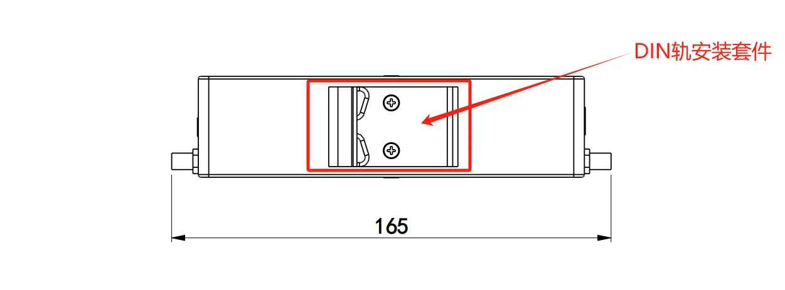</p>
<p align="center"><strong>图 2-1 DIN轨安装</strong></p>

### 2.2.2 壁挂式安装

EC312（EC300系列）可采用壁挂套件进行安装，套件需单独购买。安装步骤如下：

**步骤一**：使用螺钉（M3）将壁挂套件固定在EC312的背面板上。

<p align="center">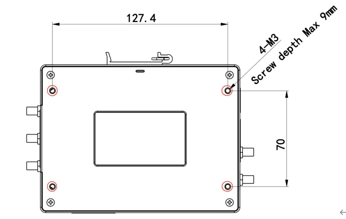</p>
<p align="center"><strong>图 2-2 固定壁挂套件</strong></p>

**步骤二**：当壁挂套件成功固定到EC312以后，采用螺钉将EC312固定在墙面或柜子上。

<p align="center">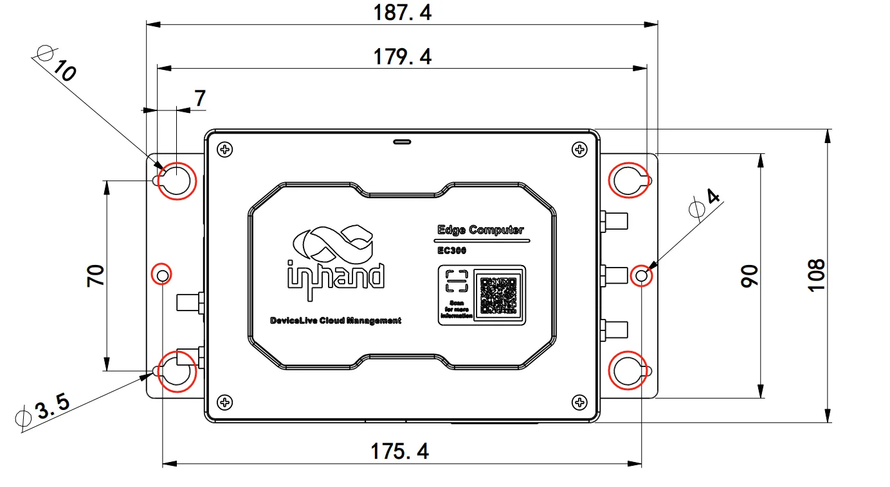</p>
<p align="center"><strong>图 2-3 壁挂安装完成</strong></p>

### 2.2.3 电源连接


<p align="center"><strong>图 2-4 电源连接示意</strong></p>

EC312支持9-48 VDC供电。将适配器端子插入到EC312的DC端口中，然后连接电源适配器。当PWR电源指示灯长亮则代表设备已经正常上电。

### 2.2.4 天线安装

EC300共有5个天线接口，不同型号标配的天线数量不同，具体型号对应的天线支持情况可参见《EC312系列边缘计算机产品规格书》中“订购信息”部分。

| **标识** |         **名称**          |
| :------: | :-----------------------: |
|   ANT1   |    4G LTE主天线/5G天线    |
|   ANT2   | 4G LTE分集接收天线/5G天线 |
|   GPS    |          GPS天线          |
|  Wi-Fi   |         Wi-Fi天线         |
|   Lora   |         Lora天线          |

如下所示产品型号为EC312-B-LQA3，仅支持一个4G天线接口。将天线拧入相应的SMA天线接口完成天线安装。


<p align="center"><strong>图 2-5 天线接口示意</strong></p>

### 2.2.5 SIM卡安装

EC312配备一个用于蜂窝通信的SIM卡座，位于左面板的下方。支持2个NANO SIM卡。安装步骤如下：

步骤一：EC312的SIM卡需要在断电的情况下进行安装，请确保安装前已经断开设备电源

步骤二：安装前需要采用取卡针（出厂自带）将SIM卡座取出


<p align="center"><strong>图 2-6 取SIM卡座</strong></p>

步骤三：插入NANO SIM卡，共有两个卡槽，分别位于抽屉式卡座的上方和下方

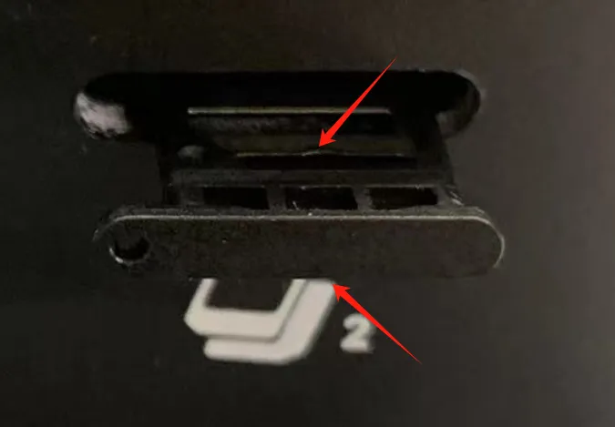
<p align="center"><strong>图 2-6 SIM卡槽示意</strong></p>

## 2.3 首次登录

首次配置EC300需要一台PC机，通过以太网网线连接到EC300并登录到命令行界面。

出厂默认的用户名和密钥：

- **Username**: edge
- **Password**: security@edge

EC300设备出厂默认创建了root用户，但登录被禁用。如需使用root用户，需手动修改系统配置，输入`sudo -s`切换至root用户。用户edge在sudo组中，因此可在edge用户下使用`sudo`来执行系统级命令。

> **注意**：当出现`command not found`提示时，输入`sudo -s`切换至root用户，或使用`sudo`命令来操作。

### 2.3.1 SSH连接

EC300支持通过以太网的SSH（Secure Shell，可以理解为：一种加密的远程登录协议）连接。使用以下默认IP地址连接到EC300：

| 端口 | 默认IP |
| --- | --- |
| ETH 1 | 192.168.3.100 |
| ETH 2 | 192.168.4.100 |

#### 2.3.1.1 Linux用户

以下步骤适用于在Linux PC上连接到EC300，不适用于在EC300设备本身上操作。在运行ssh命令之前，需确保将PC的以太网口IP地址配置在特定范围内：ETH1为192.168.3.0/24，ETH2为192.168.4.0/24。

在Linux PC上使用ssh命令访问EC300的ETH1端口：

<p align="center"></p>
<p align="center"><strong>图 2-4 Linux SSH连接命令</strong></p>

输入`yes`继续完成连接：

<p align="center">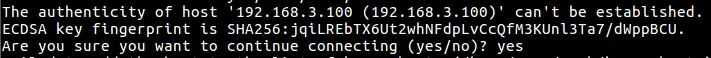</p>
<p align="center"><strong>图 2-5 确认SSH连接</strong></p>

当界面出现终端提示符`edge@edge-computer:~$`，可输入shell命令时，连接成功。

<p align="center"></p>
<p align="center"><strong>图 2-6 SSH连接成功</strong></p>

#### 2.3.1.2 Windows用户

以下步骤适用于在Windows PC上连接EC300，不适用于在EC300设备本身上操作。

在Windows PC上访问<http://www.chiark.greenend.org.uk/~sgtatham/putty/download.html>，下载PuTTY（免费软件），在Windows环境下以SSH方式建立与EC300的连接。下图是使用SSH连接的示例：

<p align="center"></p>
<p align="center"><strong>图 2-7 PuTTY SSH连接配置</strong></p>

### 2.3.2 Web管理界面登录

IEOS（可以理解为：映翰通自研的嵌入式网络管理系统）的登录步骤如下：

1. 将PC机的以太网口连接到EC300的ETH2端口。
2. 配置PC机的IP地址为192.168.4.0/24网段。
3. 在浏览器中访问默认地址：https://192.168.4.100:9100
4. 在登录页面输入用户名和密码：
   - **用户名**：adm
   - **初始密码**：123456

## 2.4 快速检查

安装和登录完成后，建议进行以下检查：

- [ ] 设备已稳固安装在DIN轨或墙面上
- [ ] 电源已正确连接，设备正常上电
- [ ] 指示灯状态正常
- [ ] PC机与EC300的以太网连接正常
- [ ] 可通过SSH成功登录到EC300命令行界面
- [ ] 可通过Web管理界面成功登录IEOS
- [ ] 网络连通性正常

<p align="center"></p>

<p align="center"><strong>图 2-8 PC与EC312连接</strong></p>

<p align="center">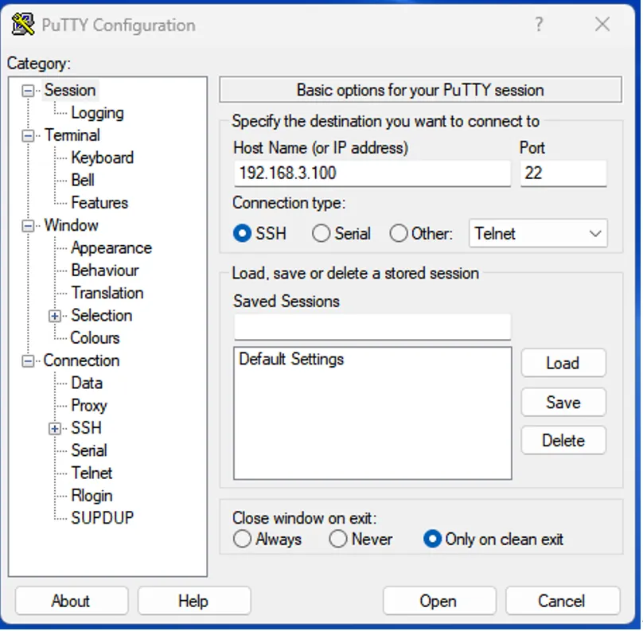</p>

<p align="center"><strong>图 2-9 PuTTY SSH连接示例</strong></p>

<p align="center"></p>

<p align="center"><strong>图 2-10 WEB登录示例（一）</strong></p>


# 第3章 常用场景配置

## 场景1：首次登录与以太网配置

**目标**：通过Web界面登录EC300并配置以太网接口参数。

**前提**：设备已上电，PC已通过网线连接到设备ETH口，PC网段已设置为对应范围（ETH1: 192.168.3.0/24，ETH2: 192.168.4.0/24）。

**预计用时**：约5分钟。

**操作步骤**：

1. 打开浏览器，访问IEOS（可以理解为：映翰通自研的嵌入式网络管理系统）的Web登录页面。以通过eth2的默认地址192.168.4.100为例，访问地址为：
   `https://192.168.4.100:9100`

   <p align="center"></p>
   <p align="center"><strong>图 3-1 IEOS登录页面</strong></p>

2. 输入初始用户名 `adm` 和初始密钥 `123456`，完成登录。

3. 进入【网络】→【以太网】页面，选择需要配置的以太网接口（如eth1）。

4. 如需配置静态IP（可以理解为：设备的固定网络地址，不随时间变化），在接口配置区域设置IP地址、子网掩码等参数，单击 "保存"。

   <p align="center"></p>
   <p align="center"><strong>图 3-2 配置eth1静态IP地址</strong></p>

5. 如需配置DHCP（Dynamic Host Configuration Protocol，可以理解为：自动为接入设备分配IP地址等网络参数的协议）Client，在接口配置区域启用DHCP Client功能，单击 "保存"。

   <p align="center">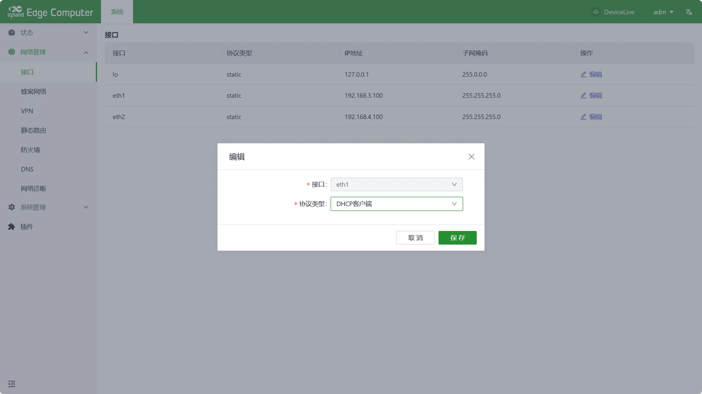</p>
   <p align="center"><strong>图 3-3 配置eth1 DHCP Client</strong></p>

6. 如需在eth1接口上启动DHCP Server功能，为下挂设备分配IP地址，在接口配置区域启用DHCP Server并配置相关参数，单击 "保存"。

   <p align="center"></p>
   <p align="center"><strong>图 3-4 配置eth1 DHCP Server</strong></p>

   DHCP Server配置参数说明：
   - **Enable DHCP Server**：DHCP Server功能的开关。
   - **Starting Address**：DHCP Server地址池起始基址，网段 + 起始地址 = 地址池的起始IP地址。
   - **Max Address Number**：地址池中的最大地址数量。
   - **Lease period**：租期时间。


## 场景2：蜂窝拨号上网

**目标**：通过4G/5G蜂窝网络接入互联网。

**前提**：已插入SIM卡并安装天线，设备已上电。

**预计用时**：约10分钟。

**操作步骤**：
1. 登录设备Web管理界面，进入【网络】→【蜂窝】。
2. 在蜂窝配置页面中，确认`Enabled`为开启状态（默认值：开启）。
3. 根据SIM卡类型配置拨号参数：
   - 若使用普通公网SIM卡，通常无需修改`Profiles`及其他参数。
   - 若使用专网SIM卡，在`Profiles`中添加拨号参数集，配置APN（Access Point Name，可以理解为：运营商网络的"门牌号"，用于指定移动数据网络的接入点）、用户名、密钥及认证方式；拨号参数集最多可添加10条记录。随后在`APN Profile`中选择对应参数集的Index（默认值：自动）。
4. `Network Mode`选择蜂窝网络制式（如LTE、WCDMA等）；若不确定，保持默认值`自动`。
5. 确认`Enable Default Route`为开启状态（默认值：开启），以便拨号成功后自动添加蜂窝口的默认路由。
6. （可选）如需使用双卡单拨（可以理解为：设备插入两张SIM卡，主卡拨号失败时自动切换到副卡的功能），开启`Dual SIM Enabled`（默认值：关闭），并配置以下参数：
   - `Main SIM`：选择主SIM卡（默认值：sim1）。
   - `Max Number of Dials`：设置当前SIM卡拨号失败达到指定次数后切换至另一张SIM卡。
   - `PIN Code`：SIM卡的PIN码。
7. （可选）建议开启ICMP探测以检测拨号假连接。配置以下参数：
   - `ICMP Detection Server Probes`：配置1~2个ICMP探测地址；未配置任何地址时，ICMP探测功能关闭。
   - `Detection Interval`：设置ICMP探测周期。
   - `Detection Timeout`：设置ICMP探测超时时间，即等待多久未收到响应则判定探测失败。
   - `Detection Max Retries`：设置最大探测次数，探测失败达到该值时触发重新拨号。取值范围：[1,5]。
   - `Detection Strict`：是否开启严格探测。关闭时，探测程序在每个周期检测蜂窝接口接收报文数量是否变化，有变化则跳过ICMP探测以节省流量；开启时，无论接收报文数量是否变化，均周期性发送ICMP探测报文（默认值：关闭）。
8. （可选）在高级配置中，可根据需要调整以下参数：
   - `Debug Mode enabled`：是否启用拨号调试日志（默认值：关闭）。
   - `Enable Infinitely Redial`：是否开启无限重拨。开启后，无论拨号失败多少次，系统均不会重启；关闭时，拨号失败达到一定次数后会重启系统尝试恢复（默认值：关闭）。
   - `Dial Interval`：拨号失败后进行下一次拨号前的等待时间。
   - `Signal Query Interval`：信号强度检测周期。
9. 点击保存或应用配置，等待设备拨号成功。

**验证方法**：
1. 在蜂窝配置页面查看拨号状态显示为成功。
2. 使用`ping`命令测试外网地址（如配置的ICMP探测地址），确认网络连通。

**常见问题**：
- 拨号状态显示成功但无法ping通目标地址（假连接）。建议开启ICMP探测功能，以便在出现假连接时自动重新拨号恢复。
- 未插入SIM卡或SIM卡欠费时，拨号将失败。若未开启无限重拨，系统可能在多次拨号失败后自动重启。

<p align="center"></p>
<p align="center"><strong>图 3-5 蜂窝拨号配置</strong></p>

<p align="center">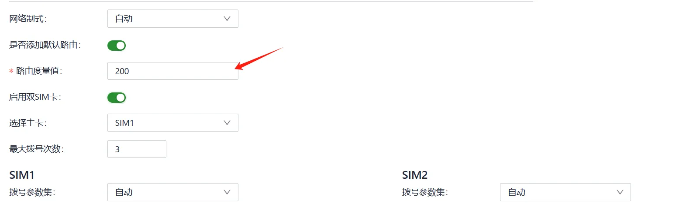</p>
<p align="center"><strong>图 3-6 双卡配置</strong></p>

<p align="center"></p>
<p align="center"><strong>图 3-7 ICMP探测配置</strong></p>

<p align="center"></p>
<p align="center"><strong>图 3-8 高级配置</strong></p>


## 场景3：Wi-Fi配置

**3.1 连接Wi-Fi热点（Station模式）**

**目标**：使EC300作为客户端连接到现有Wi-Fi网络。

**前提**：已获取目标Wi-Fi网络的SSID（Service Set Identifier，可以理解为：Wi-Fi网络的名称标识）及连接密码。

**预计用时**：约5分钟。

**操作步骤**：
1. 登录设备Web管理界面，进入【网络】→【Wi-Fi】。
2. 开启Wi-Fi使能开关。
3. 在Client SSID处输入需要连接的SSID（Service Set Identifier，可以理解为：Wi-Fi网络的名称标识），或通过扫描按钮获取附近可用的SSID。
4. 根据目标Wi-Fi网络的认证方式，选择Auth Method（认证方式），可选：无认证、WPA-PSK、WPA2-PSK、WPA-PSK/WPA2-PSK Mixed。
5. 选择Encrypt Mode（加密方式），可选：CCMP（Wi-Fi加密算法标准）、TKIP（Wi-Fi加密算法标准）、TKIP和CCMP。
6. 在WPA/WPA2 PSK Key处输入Wi-Fi密码。
7. 配置默认路由：
   - Enable Default Route：默认开启，Wi-Fi连接成功后会自动添加一条wlan口的默认路由。
   - Metric：设置Wi-Fi口默认路由的度量值。当蜂窝口、Wi-Fi和以太网口同时配置默认路由时，度量值最小的生效。
8. 保存配置并等待Wi-Fi连接成功。

<p align="center">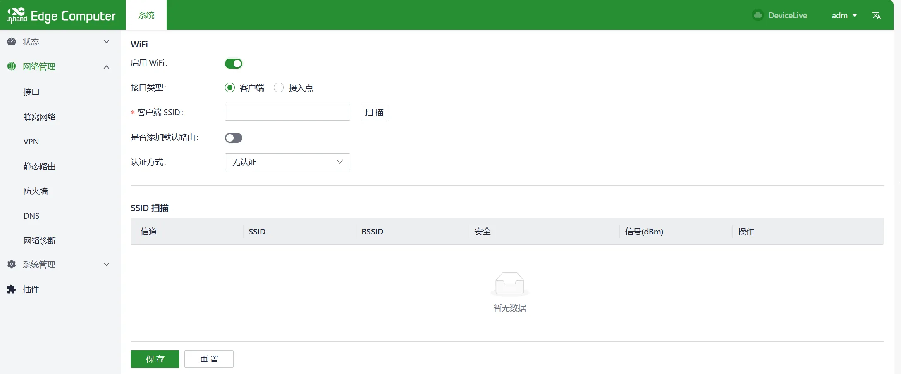</p>
<p align="center"><strong>图 3-9 Station模式配置界面</strong></p>

**3.2 开启Wi-Fi热点（AP模式）**

**目标**：使EC300发射Wi-Fi信号供其他设备连接。

**前提**：确认设备支持的无线频段及射频类型，并规划好AP的SSID（Service Set Identifier，可以理解为：Wi-Fi网络的名称标识）、密码及IP地址参数。

**预计用时**：约5分钟。

**操作步骤**：
1. 登录设备Web管理界面，进入【网络】→【Wi-Fi】。
2. 配置AP模式相关参数：
   - SSID Broadcast（SSID广播）：默认开启。开启时，附近设备可扫描到该SSID；关闭时，需手动输入SSID进行连接。
   - Band（无线频段）：选择2.4G（适用于更远覆盖范围）或5.8G（适用于高速数据传输）。
   - Radio Type（射频类型）：选择无线标准，如802.11a/n/ac（支持5G）或802.11b/g/n（支持2.4G）。
   - Channel（信道）：手动选择无线信号使用的信道，或使用默认通道。
   - SSID：设置Wi-Fi的网络名称（SSID）。
   - Auth Method（认证方式）：选择Open（无认证）、WPA-PSK、WPA2-PSK或WPA-PSK/WPA2-PSK Mixed。
   - Encryption Mode（加密方式）：选择AES或TKIP。
   - WEP Key（Wi-Fi密码）：设置Wi-Fi访问密码。
   - Bandwidth（无线带宽）：选择20MHz（适用于复杂环境，抗干扰能力强）或40MHz/80MHz（适用于高速传输，要求较低干扰）。
   - Stations Limit（最大客户端数）：设置允许连接到AP的最大客户端数量。
   - IP Address（IP地址）：设置Wi-Fi AP模式下的本地IP地址，默认`192.168.100.100`。
   - Subnet Mask（子网掩码）：设置子网划分参数，默认`255.255.255.0`。
3. 保存配置，等待AP生效后，其他设备即可搜索并连接该Wi-Fi热点。

<p align="center">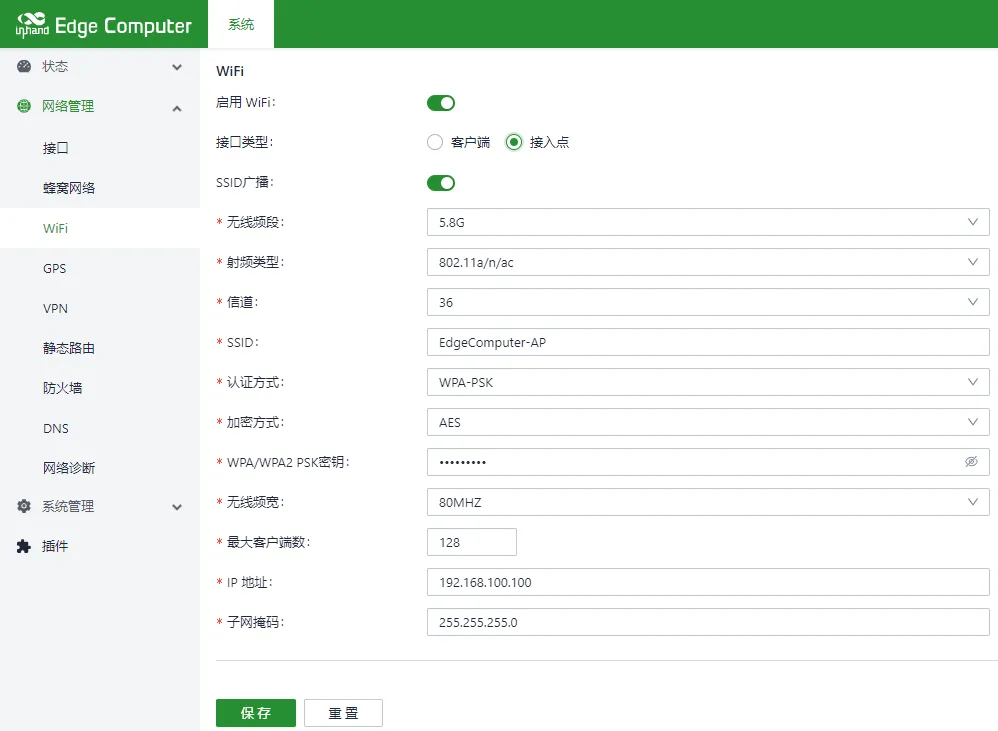</p>
<p align="center"><strong>图 3-10 AP模式配置界面</strong></p>


## 场景4：静态路由与防火墙配置

**4.1 配置静态路由**

**目标**：配置以太网静态路由，实现多链路环境下的路由选择。
**前提**：设备已接入以太网，且已了解各链路默认路由的Metric值规划。

**操作步骤**：

1. 登录设备Web管理界面，进入【网络】→【静态路由】。
2. 点击添加按钮，配置静态路由参数：
   - **Interface**：选择静态路由的出接口。
   - **Target**：填写目标网络地址。
   - **Netmask**：填写目标网络掩码。
   - **Gateway**：填写下一跳地址。
   - **Metric**：填写静态路由的度量值。
3. 点击保存并应用。

<p align="center"></p>
<p align="center"><strong>图 3-11 静态路由配置</strong></p>

> **注意**：当以太网、蜂窝、Wi-Fi同时配置了默认路由时，Metric值最小的默认路由生效。需确保各默认路由的Metric值互不相同。

**4.2 配置防火墙**

**目标**：配置设备的防火墙规则，控制报文的入站、出站、转发及端口转发行为。
**前提**：已了解网络拓扑及各接口所属区域划分。
**操作步骤**：

**基本设置**

1. 登录设备Web管理界面，进入【网络】→【防火墙】→【基本设置】。
2. 分别设置入站、出站和转发策略。

<p align="center"></p>
<p align="center"><strong>图 3-12 防火墙基本设置</strong></p>

3. 在区域配置中添加域规则。域基于接口划分，可添加局域和广域。

<p align="center"></p>
<p align="center"><strong>图 3-13 防火墙区域配置</strong></p>

<p align="center"></p>
<p align="center"><strong>图 3-14 防火墙区域规则</strong></p>

区域规则参数说明：
- **入站规则**：针对从该域收到且目标地址为设备本身的报文的控制策略，可选`接受`、`拒绝`或`丢弃`。
- **出站规则**：针对设备本身产生且通过该域发送出去的报文的控制策略，可选`接受`、`拒绝`或`丢弃`。
- **转发策略**：针对从该域收到且需要被转发的报文的控制策略，可选`接受`、`拒绝`或`丢弃`。
- **接口**：域中包含的接口。
- **IP动态伪装**：开启后，从域中对应接口发送出去的报文，源IP地址将转换为接口IP地址。

**端口转发**

4. 进入【网络】→【防火墙】→【端口转发】。

**DNAT规则**

DNAT（Destination NAT，可以理解为：将外部访问的目标地址转换为内网地址的端口转发技术）规则通常用于报文从广域网方向进入、访问局域网设备时使用。

<p align="center"></p>
<p align="center"><strong>图 3-15 DNAT规则配置</strong></p>

DNAT规则参数说明：
- **DNAT规则名称**：用于标识规则名称，可说明规则用途。
- **状态**：规则添加后可启用或禁用；Status为off时禁用该规则。
- **协议**：支持IP/UDP/TCP等协议类型。
- **源区域**：标识设备从哪个域（即哪个接口）收到报文。
- **源IP地址**：标识报文的源IP地址；不填则匹配所有报文。
- **内部IP地址**：标识需要访问的目标设备IP地址，通常为局域网内设备（如HTTP服务器）。
- **外部IP地址**：当一个域有多个IP地址时，用于标识源区域对应接口的IP地址；接口有多个IP地址时需选择一个。

> **示例**：当从`wan`域收到源地址为10.5.30.198、目的地址为192.168.3.100的报文时，将目的地址修改为`192.168.6.6`。

**SNAT规则**

SNAT（Source NAT，可以理解为：将内网设备发出的报文源地址转换为公网地址的技术）规则通常用于报文从局域网进入、需要将报文源IP地址修改为WAN口IP地址时使用。

<p align="center"></p>
<p align="center"><strong>图 3-16 SNAT规则配置</strong></p>

SNAT规则参数说明：
- **SNAT规则名称**：用于标识规则名称，可说明规则用途。
- **状态**：规则添加后可启用或禁用；Status为off时禁用该规则。
- **协议**：支持IP/UDP/TCP等协议类型。
- **源区域**：报文来自哪个域（即哪个接口），通常为局域网域。
- **源IP地址**：匹配报文的源IP地址；可不填写，即匹配所有源IP地址。
- **目标区域**：报文从哪个域发出去，通常为广域网域。
- **目标IP**：报文的目的IP地址；可不填写，即匹配所有报文。
- **SNAT IP地址**：将报文源IP修改后的IP地址。

> **示例**：将从`lan`域（eth2）进入、路由到`wan`域（eth1）发送的报文源IP地址，修改为eth1接口的IP地址（即10.5.30.193）。

**通信规则**

5. 进入【网络】→【防火墙】→【通信规则】。

<p align="center">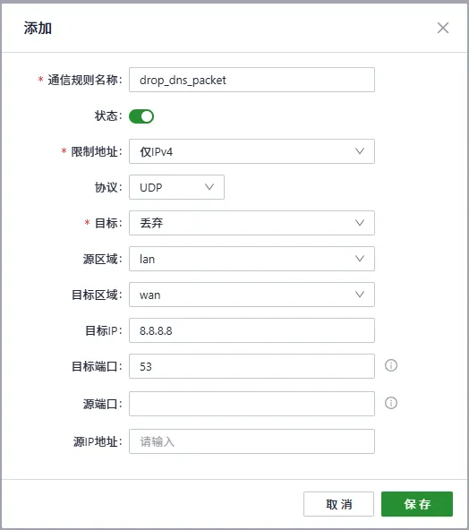</p>
<p align="center"><strong>图 3-17 通信规则配置</strong></p>

通信规则参数说明：
- **通信规则名称**：用于标识规则，可描述规则作用。
- **状态**：规则添加后可启用或禁用；Status为off时禁用该规则。
- **限制地址**：选择IP协议族，包括IPv4。
- **协议**：支持IP/UDP/TCP等协议类型。
- **目标**：目标处理动作，可选Drop、Accept或Reject。
- **源区域**：报文从哪个域进入设备。
- **目标区域**：报文经过哪个域从设备发出。
- **目标IP**：报文的目标地址；不配置时匹配所有目标地址。
- **目标端口**：报文的目标端口；不配置时匹配所有端口。
- **源端口**：报文的源端口；不配置时匹配所有源端口。
- **源IP地址**：报文的源IP地址；不配置时匹配所有源IP地址。

**MAC地址过滤**

6. 进入【网络】→【防火墙】→【MAC地址过滤】。

<p align="center"></p>
<p align="center"><strong>图 3-18 MAC地址过滤配置</strong></p>

MAC地址过滤功能用于控制EC下挂设备产生的报文是否可以被EC转发，但不会影响下挂设备对EC本身的访问。MAC地址列表中最多可以添加500条规则。

该功能包含三种模式：
- **无限制**：相当于关闭该功能，不会对MAC地址列表中的设备产生影响。
- **黑名单**：MAC地址列表中的设备产生的报文将被丢弃，其他MAC地址设备产生的报文可正常转发。
- **白名单**：只有MAC地址列表中的设备产生的报文可以被转发，其他MAC地址设备产生的报文将被丢弃。

MAC地址列表中每一条记录均可`启用`或`禁用`。当某条记录处于禁用状态时，该MAC地址对应的设备相当于不存在于`黑名单`或`白名单`中。

**自定义规则**

7. 进入【网络】→【防火墙】→【自定义规则】。
8. 在自定义防火墙输入框中，可输入Linux原生的iptables规则。

<p align="center"></p>
<p align="center"><strong>图 3-19 自定义防火墙规则</strong></p>

**4.3 配置DNS**

**目标**：配置DNS服务器地址及域名劫持功能。
**前提**：已获取可用的DNS服务器地址。
**操作步骤**：

1. 登录设备Web管理界面，进入【网络】→【DNS】。
2. 在**DNS Servers**中填写DNS服务器地址，最多支持配置4个。

<p align="center"></p>
<p align="center"><strong>图 3-20 DNS配置</strong></p>

3. 如需使用域名劫持功能，配置**Domain name hijacking**。该功能可实现IP地址与域名之间的绑定。

<p align="center"></p>
<p align="center"><strong>图 3-21 域名劫持配置</strong></p>

**4.4 网络诊断**

**目标**：使用ping、traceroute和nslookup功能诊断网络连通性。
**前提**：设备已接入网络，且已知待诊断的目标地址或域名。
**操作步骤**：

1. 登录设备Web管理界面，进入【网络】→【网络诊断】。
2. 选择诊断工具类型（ping、traceroute或nslookup），输入目标地址或域名。
3. 点击执行，查看诊断结果。

<p align="center">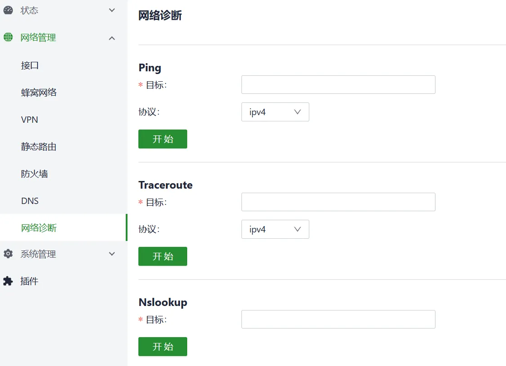</p>
<p align="center"><strong>图 3-22 网络诊断</strong></p>

> **说明**：网络诊断支持ping、traceroute和nslookup功能。ping基于ICMP（Internet Control Message Protocol，可以理解为：网络连通性测试协议）实现连通性测试。


## 场景5：OpenVPN配置

**5.1 配置OpenVPN服务器**

**目标**：在EC300上搭建OpenVPN服务器，供远程客户端安全接入。

**前提**：已获取CA证书、服务器公钥证书、服务器私钥证书、DH参数文件。

**预计用时**：约15分钟。

**操作步骤**：

1. 登录EC300 Web管理界面，进入【网络】→【OpenVPN】。
2. 选择服务器配置方式：
   - 手动配置
   - 导入配置

**手动配置**

3. 点击添加服务器，进入手动配置页面。

<p align="center"></p>
<p align="center"><strong>图 3-23 OpenVPN服务器手动配置</strong></p>

4. 配置基础参数：
   - **服务端名称**：唯一标识服务器端配置的字符串，只能包含英文字母和数字，并以字母开头，长度不超过64个字符。
   - **状态**：开启或关闭，用于控制OpenVPN服务器的启动或停止。
   - **接口类型**：目前只支持TUN模式。
   - **网络类型**：支持`p2p`、`net30`和`subnet`。`p2p`和`net30`用于建立点对点的连接，`subnet`用于建立虚拟局域网。
   - **虚拟网络**：`subnet`模式下，需要配置虚拟网络的网段信息；如果是`p2p`或`net30`，配置的则是本端IP地址和远端IP地址。
   - **网络掩码**：`subnet`模式下，需要配置虚拟网络的子网掩码信息。
   - **CA证书**：导入CA证书（Certificate Authority，可以理解为：用于验证通信双方身份可信度的根证书）文件。
   - **公钥证书**：导入服务器的公钥证书文件。
   - **私钥证书**：导入服务器的私钥证书文件。
   - **DH参数**：导入服务器的DH参数（Diffie-Hellman，用于密钥交换的数学参数）文件。
5. 展开高级设置，配置以下参数：
   - **服务器地址**：OpenVPN监听的IP地址，默认监听`0.0.0.0`，即监听所有IP地址。
   - **协议类型**：支持`udp`和`tcp`，默认`udp`。
   - **服务器端口**：服务器监听的端口号，默认`1194`。
   - **加密算法**：配置用于保证数据传输机密性的加密算法。
   - **哈希算法**：配置用于保证数据传输完整性的哈希算法。
   - **密钥保持**：启用密钥保持后，即使OpenVPN因网络异常出现短暂断开也能快速恢复，无需重新握手。
   - **隧道保持**：启用隧道保持后，可以防止隧道因短暂网络波动而关闭。
   - **LZO压缩**：是否启用LZO压缩（一种数据压缩算法）。
   - **客户端最大数量**：配置同时连接OpenVPN Server的客户端数量。
   - **用户**：指定运行OpenVPN进程的用户。
   - **用户组**：指定运行OpenVPN进程的用户组。
   - **日志级别**：取值范围`1~11`，数值越大，日志信息越详细；可以在日志页面，`ALL`类型日志中查看OpenVPN日志。
   - **连接检测时间间隔**：发送心跳包检测VPN（Virtual Private Network，可以理解为：在公共网络上建立的加密专用通信通道）连接是否存活的周期。
   - **连接检测超时时间**：如果在超时时间内未收到对方响应，判定连接已断开并尝试重启。
   - **允许客户端到客户端的通信**：是否允许客户端和客户端相互通信。
   - **推送到客户端**：可以推送路由和DNS等信息到客户端。
6. 点击保存，完成OpenVPN服务器配置。

**导入配置**

3. 点击导入配置，进入配置文件导入页面。

<p align="center"></p>
<p align="center"><strong>图 3-24 OpenVPN服务器导入配置</strong></p>

4. 配置基础参数：
   - **服务端名称**：唯一标识服务器端配置的字符串，只能包含英文字母和数字，并以字母开头，长度不超过64个字符。
   - **状态**：开启或关闭，用于控制OpenVPN服务器的启动或停止。
   - **接口类型**：目前只支持TUN模式。
   - **配置文件**：导入OpenVPN Server配置文件，配置文件中需要包含CA证书、服务器证书和服务器密钥等信息。
5. 点击保存，完成OpenVPN服务器配置。

**5.2 配置OpenVPN客户端**

**目标**：将EC300作为OpenVPN客户端，连接到远程OpenVPN服务器。

**前提**：已获取CA证书、客户端公钥证书、客户端私钥证书，已知服务器地址和端口。

**预计用时**：约10分钟。

**操作步骤**：

1. 登录EC300 Web管理界面，进入【网络】→【OpenVPN】。
2. 选择客户端配置方式：
   - 手动配置
   - 导入配置

**手动配置**

3. 点击添加客户端，进入手动配置页面。

<p align="center"></p>
<p align="center"><strong>图 3-25 OpenVPN客户端手动配置</strong></p>

4. 配置基础参数：
   - **客户端名称**：唯一标识客户端端配置的字符串，只能包含英文字母和数字，并以字母开头，长度不超过64个字符。
   - **状态**：开启或关闭，用于控制OpenVPN客户端的启动或停止。
   - **接口类型**：目前只支持TUN模式。
   - **网络类型**：支持`p2p`、`net30`和`subnet`。`p2p`和`net30`用于建立点对点的连接，`subnet`用于建立虚拟局域网。当网络类型是`p2p`或`net30`时，需要配置本端IP地址和远端IP地址。
   - **OpenVPN服务器**：配置OpenVPN服务器的IP地址、端口号以及协议信息，格式为：`ip port proto`，例如：`192.168.3.200 1194 udp`。最多可以配置10个服务器地址。OpenVPN客户端会按照顺序依次尝试建立连接，直到成功建立OpenVPN隧道。
   - **日志级别**：取值范围`1~11`，数值越大，日志信息越详细；可以在日志页面，`ALL`类型日志中查看OpenVPN日志。
   - **CA证书**：导入CA证书文件。
   - **公钥证书**：导入客户端的公钥证书文件。
   - **私钥证书**：导入客户端的私钥证书文件。
5. 展开高级设置，配置以下参数：
   - **加密算法**：配置用于保证数据传输机密性的加密算法。
   - **哈希算法**：配置用于保证数据传输完整性的哈希算法。
   - **密钥保持**：启用密钥保持后，即使OpenVPN因网络异常出现短暂断开也能快速恢复，无需重新握手。
   - **隧道保持**：启用隧道保持后，可以防止隧道因短暂网络波动而关闭。
   - **LZO压缩**：是否启用LZO压缩。
   - **用户**：指定运行OpenVPN进程的用户。
   - **用户组**：指定运行OpenVPN进程的用户组。
   - **连接检测时间间隔**：发送心跳包检测VPN连接是否存活的周期。
   - **连接检测超时时间**：如果在超时时间内未收到对方响应，判定连接已断开并尝试重启。
6. 点击保存，完成OpenVPN客户端配置。

**导入配置**

3. 点击导入配置，进入配置文件导入页面。

<p align="center"></p>
<p align="center"><strong>图 3-26 OpenVPN客户端导入配置</strong></p>

4. 配置基础参数：
   - **客户端名称**：唯一标识客户端端配置的字符串，只能包含英文字母和数字，并以字母开头，长度不超过64个字符。
   - **状态**：开启或关闭，用于控制OpenVPN客户端的启动或停止。
   - **接口类型**：目前只支持TUN模式。
   - **配置文件**：导入OpenVPN Client配置文件，配置文件中需要包含CA证书、客户端证书和客户端密钥等信息。
5. 点击保存，完成OpenVPN客户端配置。


## 场景6：云管理与系统维护

**6.1 对接DeviceLive云管理平台**

**目标**：将EC300接入映翰通DeviceLive远程管理平台。

**前提**：设备已连接互联网，已注册DeviceLive账号。

**预计用时**：约5分钟。

**操作步骤**：
1. 登录Web配置界面，进入【系统管理】→【基础配置】。
2. 在"云管理"区域，将Enabled开关设置为开启状态，启用对接DeviceLive平台功能。
<p align="center">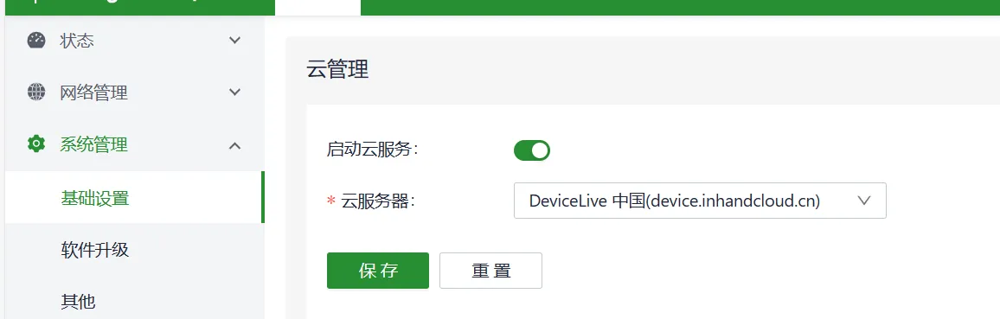</p>
<p align="center"><strong>图 3-27 云管理配置</strong></p>
3. 在Cloud Server下拉框中选择连接的平台地址：国内平台地址或海外平台地址。
4. （可选）配置时区和NTP client：在"时区和NTP client"区域，最多可配置10个NTP Server地址。设备将周期性依次向每个服务器地址发送同步请求，同步成功后将系统时间写入RTC（Real-Time Clock，可以理解为：设备内部的硬件实时时钟），并不再继续向后面的NTP服务器发送同步请求。
<p align="center"></p>
<p align="center"><strong>图 3-28 时区和NTP client配置</strong></p>
5. 点击页面底部的保存按钮，使配置生效。
6. （可选）手动同步时间：在【状态】→【设备信息】页面，当设备时间与本地时间（访问设备所使用的电脑的时间）相差超过3s时，会显示同步按钮，点击后可手动同步时间。
<p align="center">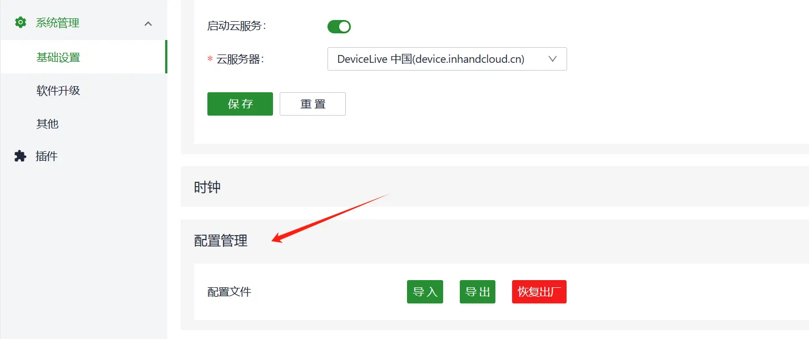</p>
<p align="center"><strong>图 3-29 设备信息页面</strong></p>

**6.2 固件升级**

**目标**：通过Web界面对EC300进行固件升级。

**前提**：已获取正确的固件文件。

**预计用时**：约10分钟。

**操作步骤**：
1. 登录Web配置界面，进入【系统管理】→【固件升级】。
2. 点击文件选择按钮，上传固件文件。
<p align="center"></p>
<p align="center"><strong>图 3-30 固件升级页面</strong></p>
3. （可选）如需升级后自动重启，将"自动重启"选项设置为开启；默认关闭，升级完成后需手动重启系统才能生效。
4. 点击升级按钮，等待升级完成。若开启了自动重启，升级成功后将自动重启系统。

**6.3 系统重启与重置**

**目标**：通过Web界面重启系统或将系统恢复出厂设置。

**前提**：已登录Web配置界面。

**预计用时**：约2分钟。

**操作步骤**：
1. 登录Web配置界面，进入【系统管理】→【其他】。
<p align="center">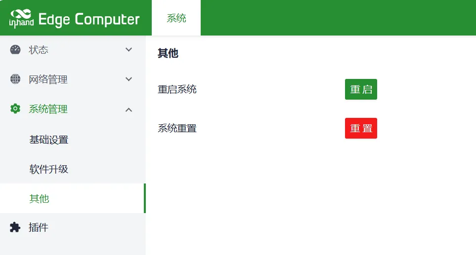</p>
<p align="center"><strong>图 3-31 系统重启与重置页面</strong></p>
2. 如需重启系统，点击"重启系统"按钮。
3. 如需恢复出厂设置，点击"重置系统"按钮。重置系统功能会将系统的配置状态和文件系统状态恢复到出厂时一致，用户安装的软件也会被清除，需谨慎使用。


## 场景7：Linux命令行网络管理

**7.1 关闭IEOS并使用Linux原生网络管理**

**目标**：关闭IEOS系统程序，改用Linux原生命令行进行网络配置。

**前提**：已通过SSH登录到EC300命令行界面。

**预计用时**：约5分钟。

**操作步骤**：
1. 停止IEOS守护进程：
   ```shell
   systemctl stop ieos_daemon
   ```
2. 禁止IEOS开机自启动（可选，若需长期关闭）：
   ```shell
   systemctl disable ieos_daemon
   ```

**说明**：关闭IEOS后，拨号、Wi-Fi等无线联网功能需通过Linux原生命令实现，且无法通过DeviceLive平台对设备进行远程管理。

**7.2 配置静态IP地址**

**目标**：通过修改网络接口配置文件，为以太网接口设置静态IP地址。

**前提**：IEOS已关闭，已登录EC300命令行界面。

**预计用时**：约5分钟。

**操作步骤**：
1. 使用vim编辑器打开目标接口的配置文件（以eth2为例）：
   ```shell
   vim /etc/network/interfaces.d/eth2
   ```
2. 在文件中配置静态IP地址、子网掩码、网关等参数。

   <p align="center"></p>
   <p align="center"><strong>图 3-32 配置eth2静态IP</strong></p>

3. 保存并退出编辑器后，重启网络服务使配置生效：
   ```shell
   /etc/init.d/networking restart
   ```

**7.3 配置动态IP地址（DHCP）**

**目标**：通过修改网络接口配置文件，将以太网接口设置为DHCP自动获取IP地址。

**前提**：IEOS已关闭，已登录EC300命令行界面。

**预计用时**：约5分钟。

**操作步骤**：
1. 使用vim编辑器打开目标接口的配置文件（以eth1为例）：
   ```shell
   vim /etc/network/interfaces.d/eth1
   ```
2. 将接口的`inet`配置项设置为`dhcp`。

   <p align="center"></p>
   <p align="center"><strong>图 3-33 配置eth1动态IP</strong></p>

3. 保存并退出编辑器后，重启网络服务使配置生效：
   ```shell
   /etc/init.d/networking restart
   ```


<p align="center">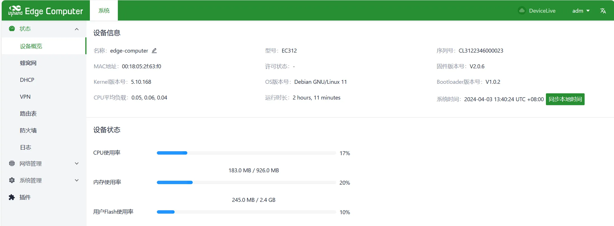</p>

<p align="center"><strong>图 3-34 设备信息状态页面</strong></p>

<p align="center"></p>

<p align="center"><strong>图 3-35 蜂窝拨号状态页面</strong></p>

<p align="center"></p>

<p align="center"><strong>图 3-36 Wi-Fi状态页面</strong></p>

<p align="center">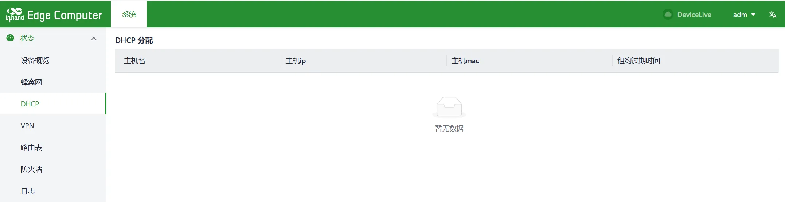</p>

<p align="center"><strong>图 3-37 DHCP Server状态页面</strong></p>

<p align="center"></p>

<p align="center"><strong>图 3-38 路由状态页面</strong></p>

<p align="center">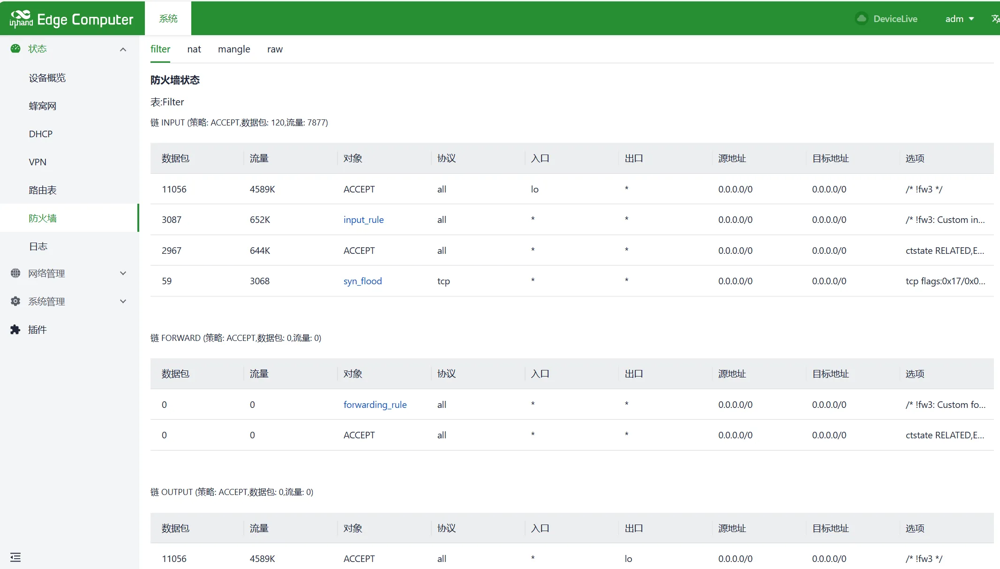</p>

<p align="center"><strong>图 3-39 防火墙状态页面</strong></p>

<p align="center">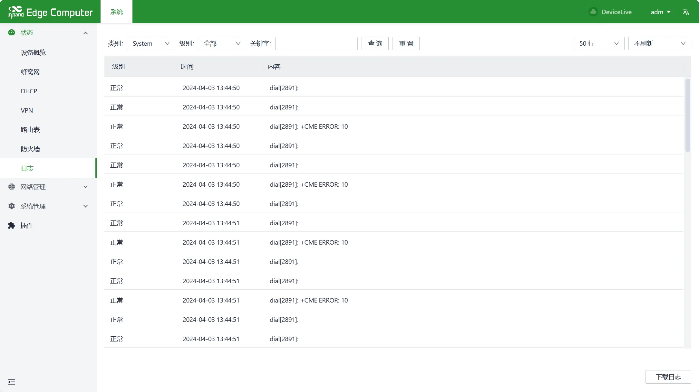</p>

<p align="center"><strong>图 3-40 日志信息页面</strong></p>

<p align="center"></p>

<p align="center"><strong>图 3-41 OpenVPN服务器状态页面</strong></p>

<p align="center"></p>

<p align="center"><strong>图 3-42 OpenVPN客户端状态页面</strong></p>

# 第4章 功能说明与参数参考

## 4.1 用户账户管理

**功能说明**

EC300支持通过命令行进行用户账户管理，包括创建用户、删除用户、修改密码以及锁定/解锁用户账户等操作。出于安全考虑，建议禁用默认用户账户并创建独立的用户账户。

> **注意**
>
> 出于安全考虑，建议禁用默认的用户账户，并创建独立的用户账户。

**入口**

用户账户管理通过SSH Console连接至EC300后，在命令行界面中执行相关命令完成。

**操作说明**

#### 4.1.1 切换到root用户

使用`sudo -s`命令可切换至root用户。出于安全考虑，不建议在root权限下执行所有命令。

> **提示**
>
> 点击以下链接可获取更多关于sudo命令的信息：[https://wiki.debian.org/sudo](https://wiki.debian.org/sudo)

> **注意**
>
> 在非root权限下使用管道或重定向操作时，可能出现"permission denied"提示。此时需使用`sudo su -c`命令替代`>`、`<`、`>>`、`<<`等重定向符号，并将完整命令置于单引号内。

#### 4.1.2 创建和删除用户账户

使用`useradd`和`userdel`命令可创建和删除用户账户。建议在主界面使用这些命令设置账户的相关访问权限。

以下示例展示如何在sudo组中创建test1用户（test1用户的默认登录环境为bash，其主目录为/home/test1）：

<p align="center"></p>

<p align="center"><strong>图 4-1 创建test1用户</strong></p>

修改test1用户的密码，使用`passwd`命令，输入新密码后重复输入新密码以确认更改：

<p align="center"></p>

<p align="center"><strong>图 4-2 修改test1用户密码</strong></p>

如需删除用户test1，使用`userdel`命令：

<p align="center"></p>

<p align="center"><strong>图 4-3 删除test1用户</strong></p>

#### 4.1.3 禁用默认的用户账户

> **注意**
>
> 在禁用默认账户之前，应首先创建一个用户账户。

使用`passwd`命令锁定默认用户账户，使edge用户无法登录：

<p align="center"></p>

<p align="center"><strong>图 4-4 锁定edge用户</strong></p>

对edge用户进行解除锁定：

<p align="center"></p>

<p align="center"><strong>图 4-5 解锁edge用户</strong></p>

**参数说明**

| 命令 | 功能 | 使用示例 |
|------|------|----------|
| `sudo -s` | 切换至root用户 | `sudo -s` |
| `useradd` | 创建用户账户 | `sudo useradd -m -s /bin/bash -G sudo test1` |
| `userdel` | 删除用户账户 | `sudo userdel test1` |
| `passwd` | 修改用户密码 | `sudo passwd test1` |
| `passwd -l` | 锁定用户账户 | `sudo passwd -l edge` |
| `passwd -u` | 解锁用户账户 | `sudo passwd -u edge` |
## 4.2 基于IEOS的web管理

IEOS（InHand Edge Operating System，可以理解为：映翰通自研的一套运行在Linux系统上的网络管理和系统管理程序）提供Web界面，用于对EC300设备进行网络管理和系统管理。通过IEOS Web界面，用户可进行以太网口IP地址、蜂窝拨号、DHCP Client/Server、静态路由、防火墙等网络配置，也可对系统时间、时区、固件升级和系统重启等进行操作。

IEOS采用状态和配置分离的设计方案，分为网络管理、系统管理和状态三大功能板块。网络管理菜单和系统管理菜单下只能进行网络和系统的相关配置，状态信息需统一到状态页面查看。

> **注意**：使用IEOS程序管理网络配置和系统配置时，若同时使用Linux原生命令，二者可能会相互影响，导致异常的运行状态。建议IEOS支持的配置均通过IEOS Web实现管理；IEOS不支持的配置（如VPN），可结合Linux原生命令实现配置目标。

设备出厂默认启用IEOS。若用户需要基于Linux原生命令行进行网络管理和系统管理，需先关闭IEOS。


### 4.2.1 登录Web

IEOS使用9100端口号作为HTTPS连接的端口，不支持通过HTTP访问；当用户使用HTTP访问Web时，会自动跳转到HTTPS。

以通过eth2的默认地址192.168.4.100为例，登录信息如下：

- 登录地址：`https://192.168.4.100:9100`
- 初始登录用户名：`adm`
- 初始登录密钥：`123456`

<p align="center"></p>

<p align="center"><strong>图 4-6 IEOS Web登录界面</strong></p>

> **注意**：IEOS程序启用时，会预留端口号范围9100 ~ 9200供内部通信使用。启用IEOS后，用户的程序应避开使用这些端口号，否则可能产生冲突导致功能异常。


### 4.2.2 网络管理

#### 4.2.2.1 以太网接口

以太网接口支持静态IP地址和DHCP Client两种配置方式。

**配置静态IP地址**

进入网络管理菜单下的以太网接口配置页面，选择eth1接口，配置静态IP地址参数后保存。

<p align="center"></p>

<p align="center"><strong>图 4-7 eth1接口静态IP配置</strong></p>

**配置DHCP Client**

进入网络管理菜单下的以太网接口配置页面，选择eth1接口，将地址获取方式设置为DHCP（Dynamic Host Configuration Protocol，可以理解为：网络中的"自动分配员"，自动为接入的设备分配IP地址等网络参数）Client后保存。

<p align="center"></p>

<p align="center"><strong>图 4-8 eth1接口DHCP Client配置</strong></p>

**配置DHCP Server**

在eth1接口上可启动DHCP Server功能，为eth1的下挂设备分配IP地址。

<p align="center"></p>

<p align="center"><strong>图 4-9 eth1接口DHCP Server配置</strong></p>

DHCP Server配置参数说明见表 4-1。

**表 4-1 DHCP Server配置参数**

| 参数 | 说明 |
|------|------|
| Enable DHCP Server | DHCP Server功能的开关 |
| Starting Address | DHCP Server地址池起始基址。网段 + 起始地址 = 地址池的起始IP地址。例如eth1网段为192.168.3.0/24，基址为1，则地址池起始地址为192.168.3.1/24 |
| Max Address Number | 地址池中的最大地址数量 |
| Lease period | 租期时间 |


#### 4.2.2.2 蜂窝拨号

进入网络管理菜单下的蜂窝拨号配置页面，进行蜂窝网络相关参数配置。

<p align="center"></p>

<p align="center"><strong>图 4-10 蜂窝拨号基本配置</strong></p>

蜂窝拨号基本配置参数说明见表 4-2。

**表 4-2 蜂窝拨号基本配置参数**

| 参数 | 说明 |
|------|------|
| Enabled | 蜂窝功能的开关，默认开启 |
| Profiles | 拨号参数集，用于专网卡拨号时配置APN（Access Point Name，可以理解为：运营商网络的"门牌号"，告诉设备应该通过哪个入口连接到移动网络）、用户名、密钥以及认证方式等信息。拨号参数集最多可添加10条记录 |
| Network Mode | 蜂窝的网络制式，可选择3G、4G等相关网络制式（如LTE、WCDMA等）。默认值为自动，程序自动选择最合适的网络制式 |
| Enable Default Route | 启用添加默认路由功能，开启后拨号成功会添加一条蜂窝口的默认路由，默认开启 |
| Metric | 蜂窝口默认路由的度量值。当蜂窝口、Wi-Fi和以太网口均配置默认路由时，度量值最小的生效 |

**双卡配置**

<p align="center"></p>

<p align="center"><strong>图 4-11 蜂窝拨号双卡配置</strong></p>

双卡配置参数说明见表 4-3。

**表 4-3 双卡配置参数**

| 参数 | 说明 |
|------|------|
| Dual SIM Enabled | 启用双卡功能。EC300支持双卡单拨，设备插入2张SIM卡后，若SIM1卡因欠费导致拨号失败，自动切换到SIM2卡拨号。默认关闭 |
| Main SIM | 主SIM卡，拨号时优先使用选中的SIM卡，拨号失败达到一定次数后切换到另一张SIM卡。默认先使用SIM1 |
| Max Number of Dials | 开启双卡单拨后，当前拨号SIM卡拨号达到指定次数后切换到另一张SIM卡 |
| APN Profile | SIM卡选用的拨号参数集，默认值为自动。专网卡通常需要配置拨号参数集并选择其Index |
| PIN Code | SIM卡的PIN码 |

**ICMP探测配置**

无线蜂窝网络可能出现拨号假连接现象，即拨号状态显示成功但无法ping通目标地址。IEOS蜂窝拨号支持ICMP（Internet Control Message Protocol，可以理解为：网络中的"诊断工具"，用于检测网络连通性和排查故障）探测以发现假连接。

<p align="center"></p>

<p align="center"><strong>图 4-12 蜂窝拨号ICMP探测配置</strong></p>

ICMP探测参数说明见表 4-4。

**表 4-4 ICMP探测参数**

| 参数 | 说明 |
|------|------|
| ICMP Detection Server Probes | ICMP探测地址，可配置2个探测地址。只要有1个地址探测成功，说明蜂窝未出现假连接。2个地址均未配置时，ICMP探测功能关闭 |
| Detection Interval | ICMP探测间隔时间 |
| Detection Timeout | ICMP探测超时时间，等待多久未收到探测响应报文则认为探测失败 |
| Detection Max Retries | 最大探测次数，探测失败达到该值时触发重新拨号。取值范围[1,5] |
| Detection Strict | 是否开启严格探测。关闭时，探测程序在每个探测周期检测蜂窝接口接收报文是否变化，有变化则不发送ICMP探测报文以节省流量；开启时，无论接收报文数量是否变化，均周期性发送ICMP探测报文。默认关闭 |

**高级配置**

<p align="center"></p>

<p align="center"><strong>图 4-13 蜂窝拨号高级配置</strong></p>

高级配置参数说明见表 4-5。

**表 4-5 蜂窝拨号高级配置参数**

| 参数 | 说明 |
|------|------|
| Debug Mode enabled | 是否启用debug功能，开启后日志中增加拨号相关调试信息，默认关闭 |
| Enable Infinitely Redial | 开启无限重拨。默认关闭，拨号失败一定次数后系统重启尝试恢复。若设备不插SIM卡时拨号失败导致系统反复重启，可开启无限重拨，此时无论拨号失败多少次系统均不会重启 |
| Dial Interval | 拨号间隔，某次拨号失败后等待多久进行下一次拨号 |
| Signal Query Interval | 信号查询间隔，拨号程序定期检测信号强度的周期。信号不好时可能产生假连接，重新拨号有一定概率可解决 |

#### 4.2.2.3 Wi-Fi

**功能说明**

本设备支持两种Wi-Fi工作模式：

- **Station模式（STA模式）**：设备作为客户端连接其他Wi-Fi热点，适用于通过现有无线网络接入互联网的场景。
- **Access Point模式（AP模式）**：设备自身发射Wi-Fi信号供其他终端设备连接，适用于为周边设备提供无线接入服务的场景。

用户可根据实际网络环境选择其中一种模式进行配置，两种模式不可同时启用。

**入口**

进入【网络】→【Wi-Fi】菜单，选择对应的工作模式标签页进行配置。

**操作说明**

**Station模式配置**

1. 进入【网络】→【Wi-Fi】→【Station】页面。
2. 将"Enable Wi-Fi"开关置为开启状态。
3. 在"Client SSID"字段输入待连接的Wi-Fi网络名称（SSID），或点击扫描按钮获取附近可用的SSID列表后选择。
4. 根据目标网络的认证要求，在"Auth Method"下拉框中选择认证方式：Open（无认证）、WPA-PSK、WPA2-PSK或WPA-PSK/WPA2-PSK Mixed。
5. 在"Encrypt Mode"下拉框中选择加密方式：CCMP、TKIP或TKIP和CCMP。
6. 在"WPA/WPA2 PSK Key"字段输入对应网络的连接密码。
7. （可选）配置"Enable Default Route"选项。该选项默认开启，开启后当Wi-Fi连接成功时，系统将自动添加一条wlan口的默认路由。
8. （可选）如需调整路由优先级，在"Metric"字段输入度量值。当蜂窝口、Wi-Fi口和以太网口均配置默认路由时，度量值最小的路由优先生效。
9. 点击"保存"按钮使配置生效。

**Access Point模式配置**

1. 进入【网络】→【Wi-Fi】→【Access Point】页面。
2. 在"SSID"字段设置Wi-Fi网络的名称（SSID）。
3. 在"SSID Broadcast"选项中选择是否广播SSID。默认开启，开启时附近设备可扫描到该SSID；关闭时需手动输入SSID进行连接。
4. 在"Band"下拉框中选择无线频段：2.4G或5.8G。
5. 在"Radio Type"下拉框中选择射频类型：
   - 802.11a/n/ac（适用于5G频段）
   - 802.11b/g/n（适用于2.4G频段）
6. 在"Channel"下拉框中选择无线信道，可手动指定或使用默认通道。
7. 在"Auth Method"下拉框中选择认证方式：Open、WPA-PSK、WPA2-PSK或WPA-PSK/WPA2-PSK Mixed。
8. 在"Encryption Mode"下拉框中选择加密方式：AES或TKIP。
9. 在"WEP Key"字段设置Wi-Fi访问密码。
10. 在"Bandwidth"下拉框中选择带宽：20MHz、40MHz或80MHz。
11. 在"Stations Limit"字段设置允许连接的最大客户端数量。
12. 在"IP Address"字段配置AP模式下的本地IP地址，默认值为`192.168.100.100`。
13. 在"Subnet Mask"字段配置子网掩码，默认值为`255.255.255.0`。
14. 点击"保存"按钮使配置生效。

**4.2.2.3.4 示意图**

<p align="center"></p>

<p align="center"><strong>图 4-14 Station模式配置界面</strong></p>

<p align="center"></p>

<p align="center"><strong>图 4-15 Access Point模式配置界面</strong></p>

**4.2.2.3.5 参数说明**

**Station模式参数**

| 参数 | 说明 | 默认值 |
|------|------|--------|
| Enable Wi-Fi | Wi-Fi功能使能开关 | 关闭 |
| Client SSID | 待连接的Wi-Fi网络名称（SSID），支持手动输入或扫描获取 | - |
| Enable Default Route | 是否启用默认路由功能，开启后Wi-Fi连接成功时自动添加wlan口默认路由 | 开启 |
| Metric | Wi-Fi口默认路由的度量值，数值越小优先级越高 | - |
| Auth Method | 认证方式，支持Open、WPA-PSK、WPA2-PSK、WPA-PSK/WPA2-PSK Mixed | - |
| Encrypt Mode | 加密方式，支持CCMP、TKIP、TKIP和CCMP | - |
| WPA/WPA2 PSK Key | 连接目标Wi-Fi网络所需的密钥信息 | - |

**Access Point模式参数**

| 参数 | 说明 | 默认值 |
|------|------|--------|
| SSID Broadcast | 是否广播SSID，开启时附近设备可扫描到该网络 | 开启 |
| Band | 无线频段，可选2.4G或5.8G | - |
| Radio Type | 射频类型，802.11a/n/ac（5G）或802.11b/g/n（2.4G） | - |
| Channel | 无线信号使用的信道，可手动选择或使用默认通道 | - |
| SSID | Wi-Fi网络名称（SSID） | - |
| Auth Method | 认证方式，支持Open、WPA-PSK、WPA2-PSK、WPA-PSK/WPA2-PSK Mixed | - |
| Encryption Mode | 加密方式，支持AES、TKIP | - |
| WEP Key | Wi-Fi访问密码 | - |
| Bandwidth | 无线带宽，可选20MHz、40MHz、80MHz | - |
| Stations Limit | 允许连接的最大客户端数量 | - |
| IP Address | AP模式下的本地IP地址 | 192.168.100.100 |
| Subnet Mask | 子网划分参数 | 255.255.255.0 |

#### 4.2.2.4 静态路由

静态路由用于配置以太网路由条目。当同时配置了以太网、蜂窝、Wi-Fi的默认路由时，Metric值最小的默认路由生效。需确保各默认路由的Metric值互不相同。

<p align="center"></p>

<p align="center"><strong>图 4-16 静态路由配置</strong></p>

静态路由配置完成后，参数说明见[表 4-6 静态路由参数说明](#表-4-1-静态路由参数说明)。


#### 4.2.2.5 防火墙

**防火墙基本设置**

防火墙基本设置用于配置入站、出站和转发策略。在【区域】配置中可添加域规则，域基于接口划分，可配置局域域和广域域。

<p align="center"></p>

<p align="center"><strong>图 4-17 防火墙基本设置</strong></p>

<p align="center"></p>

<p align="center"><strong>图 4-18 区域配置</strong></p>

<p align="center"></p>

<p align="center"><strong>图 4-19 区域规则</strong></p>

区域规则说明如下：

- **入站规则**：针对从该域收到且目标地址为设备本身的报文的控制策略，可选值为`接受`、`拒绝`和`丢弃`。
- **出站规则**：针对设备本身产生且通过该域发送出去的报文的控制策略，可选值为`接受`、`拒绝`和`丢弃`。
- **转发策略**：针对从该域收到且需要被转发的报文的控制策略，可选值为`接受`、`拒绝`和`丢弃`。
- **接口**：域中包含的接口。
- **IP动态伪装**：开启后，从域中对应接口发送出去的报文，无论源IP地址是多少，源IP地址均转换为接口IP地址。

**端口转发**

**DNAT规则**

DNAT规则通常用于报文从广域网方向进入，访问局域网设备时使用。

<p align="center"></p>

<p align="center"><strong>图 4-20 DNAT规则配置</strong></p>

DNAT规则配置完成后，参数说明见[表 4-7 DNAT规则参数说明](#表-4-2-dnat规则参数说明)。

示例规则含义：当从`wan`域收到源地址为10.5.30.198、目的地址为192.168.3.100的报文时，将目的地址修改为`192.168.6.6`。

**SNAT规则**

SNAT规则通常用于报文从局域网进入，需要将报文的源IP地址修改为WAN口IP地址时使用。

<p align="center"></p>

<p align="center"><strong>图 4-21 SNAT规则配置</strong></p>

SNAT规则配置完成后，参数说明见[表 4-8 SNAT规则参数说明](#表-4-3-snat规则参数说明)。

示例规则含义：将从`lan`域（eth2）进入、路由到`wan`域（eth1）发送的报文的源IP地址，修改为eth1接口的IP地址，即10.5.30.193。

**通信规则**

通信规则用于配置设备在不同区域之间的流量控制策略。

<p align="center"></p>

<p align="center"><strong>图 4-22 通信规则配置</strong></p>

通信规则配置完成后，参数说明见[表 4-9 通信规则参数说明](#表-4-4-通信规则参数说明)。

**MAC地址过滤**

MAC地址过滤功能用于控制EC下挂设备产生的报文是否可被EC转发，不影响下挂设备对EC本身的访问。MAC地址列表最多可添加500条规则。

<p align="center"></p>

<p align="center"><strong>图 4-23 MAC地址过滤</strong></p>

该功能包含三种模式：

- **无限制**：该功能处于关闭状态，不对MAC地址列表中的设备产生影响。
- **黑名单**：MAC地址列表中的设备产生的报文将被丢弃，其他MAC地址的设备产生的报文可被正常转发。
- **白名单**：仅MAC地址列表中的设备产生的报文可被转发，其他MAC地址的设备产生的报文将被丢弃。

MAC地址列表中的每条记录均可单独`启用`或`禁用`。当某条记录处于禁用状态时，该MAC地址对应的设备相当于不存在于`黑名单`或`白名单`中。

**自定义规则**

在自定义防火墙输入框中，用户可输入Linux原生的iptables规则。

<p align="center"></p>

<p align="center"><strong>图 4-24 自定义防火墙规则</strong></p>


#### 4.2.2.6 DNS

**功能说明**

DNS（Domain Name System，可以理解为：互联网的"电话簿"，将网站域名翻译成计算机能识别的IP地址）配置功能用于设置设备的DNS服务器地址及域名劫持规则。设备支持配置最多4个DNS服务器地址，并提供域名劫持功能，可实现IP地址与域名之间的绑定。

**入口**

进入【网络】→【DNS】菜单。

**操作说明**

**配置DNS服务器**

在DNS配置页面，用户可设置DNS服务器地址，最多支持配置4个。

<p align="center"></p>

<p align="center"><strong>图 4-25 DNS配置</strong></p>

**配置域名劫持**

域名劫持功能可实现IP地址和域名之间的绑定。

<p align="center"></p>

<p align="center"><strong>图 4-26 域名劫持配置</strong></p>

**参数说明**

| 参数 | 说明 |
|------|------|
| DNS Servers | DNS服务器地址，最多支持配置4个 |
| 域名劫持 | 实现IP地址和域名之间的绑定功能 |


#### 4.2.2.7 网络诊断

**功能说明**

网络诊断功能支持ping、traceroute和nslookup三种诊断工具，用于检测网络连通性和排查网络故障。

**入口**

进入【网络】→【网络诊断】菜单。

**操作说明**

在网络诊断页面，用户可选择ping、traceroute或nslookup功能进行网络诊断。

<p align="center"></p>

<p align="center"><strong>图 4-27 网络诊断</strong></p>


#### 4.2.2.9 OpenVPN

**功能说明**

OpenVPN是一种开源的VPN（Virtual Private Network，可以理解为：在公共网络上搭建的一条"专属秘密通道"，让远程设备能够安全地访问内部网络）解决方案。设备支持以服务器模式或客户端模式运行OpenVPN，并提供手动配置和导入配置文件两种配置方式。

**入口**

进入【VPN】→【OpenVPN】菜单。

**操作说明**

**4.4.3.1 配置OpenVPN服务器**

OpenVPN服务器支持通过Web页面手动配置，或导入配置文件的方式进行配置。

**手动配置**

<p align="center"></p>

<p align="center"><strong>图 4-28 OpenVPN服务器手动配置</strong></p>

**导入配置**

<p align="center"></p>

<p align="center"><strong>图 4-29 OpenVPN服务器导入配置</strong></p>

**4.4.3.2 配置OpenVPN客户端**

OpenVPN客户端同样支持手动配置和导入配置文件两种方式。

**手动配置**

<p align="center"></p>

<p align="center"><strong>图 4-30 OpenVPN客户端手动配置</strong></p>

**导入配置**

<p align="center"></p>

<p align="center"><strong>图 4-31 OpenVPN客户端导入配置</strong></p>

**参数说明**

**OpenVPN服务器参数**

| 参数 | 说明 |
|------|------|
| 服务端名称 | 唯一标识服务器端配置的字符串，只能包含英文字母和数字，并以字母开头，长度不超过64个字符 |
| 状态 | 开启或关闭，用于控制OpenVPN服务器的启动或停止 |
| 接口类型 | 目前只支持tun模式 |
| 网络类型 | 支持`p2p`、`net30`和`subnet`。`p2p`和`net30`用于建立点对点的连接，`subnet`用于建立虚拟局域网 |
| 虚拟网络 | `subnet`模式下，需配置虚拟网络的网段信息；`p2p`或`net30`模式下配置本端IP地址和远端IP地址 |
| 网络掩码 | `subnet`模式下，需配置虚拟网络的子网掩码信息 |
| CA证书 | 导入CA证书文件 |
| 公钥证书 | 导入服务器的公钥证书文件 |
| 私钥证书 | 导入服务器的私钥证书文件 |
| DH参数 | 导入服务器的DH参数文件 |
| 服务器地址 | OpenVPN监听的IP地址，默认监听0.0.0.0，即监听所有IP地址 |
| 协议类型 | 支持`udp`和`tcp`，默认`udp` |
| 服务器端口 | 服务器监听的端口号，默认`1194` |
| 加密算法 | 配置用于保证数据传输机密性的加密算法 |
| 哈希算法 | 配置用于保证数据传输完整性的哈希算法 |
| 密钥保持 | 启用后，即使OpenVPN因网络异常出现短暂断开也能快速恢复，无需重新握手 |
| 隧道保持 | 启用后，可防止隧道因短暂网络波动而关闭 |
| LZO压缩 | 是否启用LZO压缩 |
| 客户端最大数量 | 配置同时连接OpenVPN服务器的客户端数量 |
| 用户 | 指定运行OpenVPN进程的用户 |
| 用户组 | 指定运行OpenVPN进程的用户组 |
| 日志级别 | 取值范围1~11，数值越大，日志信息越详细；可在日志页面`ALL`类型日志中查看OpenVPN日志 |
| 连接检测时间间隔 | 发送心跳包检测VPN连接是否存活的周期 |
| 连接检测超时时间 | 如果在超时时间内未收到对方响应，判定连接已断开并尝试重启 |
| 允许客户端到客户端的通信 | 是否允许客户端和客户端相互通信 |
| 推送到客户端 | 可推送路由和DNS等信息到客户端 |

**OpenVPN服务器导入配置参数**

| 参数 | 说明 |
|------|------|
| 服务端名称 | 唯一标识服务器端配置的字符串，只能包含英文字母和数字，并以字母开头，长度不超过64个字符 |
| 状态 | 开启或关闭，用于控制OpenVPN服务器的启动或停止 |
| 接口类型 | 目前只支持tun模式 |
| 配置文件 | 导入OpenVPN服务器配置文件，配置文件中需包含CA证书、服务器证书和服务器密钥等信息 |

**OpenVPN客户端参数**

| 参数 | 说明 |
|------|------|
| 客户端名称 | 唯一标识客户端配置的字符串，只能包含英文字母和数字，并以字母开头，长度不超过64个字符 |
| 状态 | 开启或关闭，用于控制OpenVPN客户端的启动或停止 |
| 接口类型 | 目前只支持tun模式 |
| 网络类型 | 支持`p2p`、`net30`和`subnet`。`p2p`和`net30`用于建立点对点的连接，`subnet`用于建立虚拟局域网 |
| OpenVPN服务器 | 配置OpenVPN服务器的IP地址、端口号以及协议信息，格式为：ip port proto，例如`192.168.3.200 1194 udp`，最多可配置10个服务器地址。OpenVPN客户端会按顺序依次尝试建立连接，直到成功建立OpenVPN隧道 |
| 日志级别 | 取值范围1~11，数值越大，日志信息越详细；可在日志页面`ALL`类型日志中查看OpenVPN日志 |
| CA证书 | 导入CA证书文件 |
| 公钥证书 | 导入客户端的公钥证书文件 |
| 私钥证书 | 导入客户端的私钥证书文件 |
| 加密算法 | 配置用于保证数据传输机密性的加密算法 |
| 哈希算法 | 配置用于保证数据传输完整性的哈希算法 |
| 密钥保持 | 启用后，即使OpenVPN因网络异常出现短暂断开也能快速恢复，无需重新握手 |
| 隧道保持 | 启用后，可防止隧道因短暂网络波动而关闭 |
| LZO压缩 | 是否启用LZO压缩 |
| 用户 | 指定运行OpenVPN进程的用户 |
| 用户组 | 指定运行OpenVPN进程的用户组 |
| 连接检测时间间隔 | 发送心跳包检测VPN连接是否存活的周期 |
| 连接检测超时时间 | 如果在超时时间内未收到对方响应，判定连接已断开并尝试重启 |

**OpenVPN客户端导入配置参数**

| 参数 | 说明 |
|------|------|
| 客户端名称 | 唯一标识客户端配置的字符串，只能包含英文字母和数字，并以字母开头，长度不超过64个字符 |
| 状态 | 开启或关闭，用于控制OpenVPN客户端的启动或停止 |
| 接口类型 | 目前只支持tun模式 |
| 配置文件 | 导入OpenVPN客户端配置文件，配置文件中需包含CA证书、客户端证书和客户端密钥等信息 |

### 4.2.3 系统管理

#### 4.2.3.1 功能说明

系统管理模块提供设备的基础配置、固件升级、系统重启及恢复出厂设置等功能，用于维护设备的运行状态和管理配置数据。

#### 4.2.3.2 入口

进入【系统管理】菜单，包含以下子功能：

- 基础配置
- 固件升级
- 其他

#### 4.2.3.3 操作说明

**4.2.3.3.1 基础配置**

**云管理**

云管理功能用于配置设备与 DeviceLive 远程监控管理平台的对接参数。

<p align="center"></p>

<p align="center"><strong>图 4-32 云管理配置</strong></p>

| 参数 | 说明 |
|------|------|
| Enabled | 对接 DeviceLive 平台的使能开关。DeviceLive 为映翰通设备的远程监控和管理平台 |
| Cloud Server | DeviceLive 平台服务器地址，包含国内平台地址与海外平台地址两个选项，需根据实际部署区域选择连接的平台 |

**时区和 NTP Client**

时区和 NTP Client 功能用于配置设备的系统时间同步方式。最多可配置 10 个 NTP Server 地址，系统周期性依次向每个服务器地址发送同步请求，同步成功后将系统时间写入 RTC，不再继续向后续 NTP 服务器发送同步请求。

<p align="center"></p>

<p align="center"><strong>图 4-33 时区和 NTP Client 配置</strong></p>

除 NTP 自动同步外，在 Device Info 状态页面提供手动同步时间按钮。当设备时间与本地时间（访问设备所使用的电脑时间）相差超过 3 秒时，该同步按钮才会显示。

<p align="center"></p>

<p align="center"><strong>图 4-34 手动同步时间</strong></p>

基础配置页面同时支持配置的导入、导出以及恢复出厂设置操作。

**4.2.3.3.2 固件升级**

固件升级功能用于更新设备系统软件版本。

<p align="center"></p>

<p align="center"><strong>图 4-35 固件升级</strong></p>

自动重启选项默认处于关闭状态。升级固件后，需手动重启系统方可生效。若开启自动重启选项，固件升级成功后将自动重启系统。

**4.2.3.3.3 其他**

其他功能页面提供系统重启和系统重置两项操作。

<p align="center"></p>

<p align="center"><strong>图 4-36 系统重启与重置</strong></p>

| 功能 | 说明 |
|------|------|
| 重启系统 | 重新启动设备，配置数据保持不变 |
| 重置系统 | 将系统的配置状态和文件系统状态恢复至出厂状态，用户安装的软件将被清除。该操作需谨慎使用 |

#### 4.2.3.4 参数说明

| 参数 | 取值范围/选项 | 默认值 | 说明 |
|------|-------------|--------|------|
| Enabled | 开启 / 关闭 | - | DeviceLive 平台对接使能开关 |
| Cloud Server | 国内平台 / 海外平台 | - | DeviceLive 平台服务器地址选择 |
| NTP Server | 最多 10 个地址 | - | NTP 时间同步服务器地址列表 |
| 自动重启 | 开启 / 关闭 | 关闭 | 固件升级后是否自动重启系统 |

### 4.2.4 状态

#### 4.2.4.1 功能说明

状态查看功能用于显示设备运行过程中的各类实时信息，包括设备基本信息、蜂窝拨号状态、Wi-Fi状态、DHCP Server状态、路由状态、防火墙状态、日志信息以及OpenVPN状态。

#### 4.2.4.2 入口

进入【状态】菜单，可查看各子项状态信息。

#### 4.2.4.3 操作说明

**4.2.4.3.1 设备信息**

设备信息状态页面显示主机名、设备型号、序列号、固件版本、内核版本、文件系统版本以及CPU、内存和磁盘空间的使用概况。

<p align="center"></p>

<p align="center"><strong>图 4-37 设备信息状态页面</strong></p>

**4.2.4.3.2 蜂窝拨号状态信息**

蜂窝拨号状态页面显示当前拨号使用的SIM卡、IMEI、IMSI、ICCID、信号强度以及拨号获取的IP地址、DNS等信息。

<p align="center"></p>

<p align="center"><strong>图 4-38 蜂窝拨号状态页面</strong></p>

**4.2.4.3.3 Wi-Fi状态信息**

Wi-Fi状态页面显示Wi-Fi连接成功后获取的IP地址、网关以及DNS等信息。

<p align="center"></p>

<p align="center"><strong>图 4-39 Wi-Fi状态页面</strong></p>

**4.2.4.3.4 DHCP Server状态信息**

DHCP Server状态页面显示设备作为DHCP Server分配出去的IP地址、客户端主机名、客户端主机MAC以及过期时间。

<p align="center"></p>

<p align="center"><strong>图 4-40 DHCP Server状态页面</strong></p>

**4.2.4.3.5 路由状态信息**

路由状态页面显示IPv4直连路由、静态路由以及路由邻居等信息。

<p align="center"></p>

<p align="center"><strong>图 4-41 路由状态页面</strong></p>

**4.2.4.3.6 防火墙状态信息**

防火墙状态信息显示过滤规则、IP地址映射规则等信息。

<p align="center"></p>

<p align="center"><strong>图 4-42 防火墙状态页面</strong></p>

**4.2.4.3.7 日志信息**

日志页面可查看系统日志、用户日志以及设置查看的日志等级，包括Error、Info、Debug等级别。日志也可下载到本地。

<p align="center"></p>

<p align="center"><strong>图 4-43 日志信息页面</strong></p>

**4.2.4.3.8 OpenVPN状态信息**

**4.2.4.3.8.1 OpenVPN服务器状态信息**

在OpenVPN服务器状态页面可查看状态更新时间、已连接的OpenVPN客户端等信息。

<p align="center"></p>

<p align="center"><strong>图 4-44 OpenVPN服务器状态页面</strong></p>

**4.2.4.3.8.2 OpenVPN客户端状态信息**

在OpenVPN客户端状态页面可查看客户端获取的虚IP地址以及隧道连接时长等信息。

<p align="center"></p>

<p align="center"><strong>图 4-45 OpenVPN客户端状态页面</strong></p>

#### 4.2.4.4 参数说明

| 状态类别 | 显示内容 |
|---------|---------|
| 设备信息 | 主机名、设备型号、序列号、固件版本、内核版本、文件系统版本、CPU使用率、内存使用率、磁盘空间使用率 |
| 蜂窝拨号状态 | SIM卡信息、IMEI、IMSI、ICCID、信号强度、IP地址、DNS |
| Wi-Fi状态 | IP地址、网关、DNS |
| DHCP Server状态 | 已分配IP地址、客户端主机名、客户端主机MAC、过期时间 |
| 路由状态 | IPv4直连路由、静态路由、路由邻居 |
| 防火墙状态 | 过滤规则、IP地址映射规则 |
| 日志信息 | 系统日志、用户日志、日志等级（Error/Info/Debug）、日志下载 |
| OpenVPN服务器状态 | 状态更新时间、已连接客户端信息 |
| OpenVPN客户端状态 | 虚IP地址、隧道连接时长 |

## 4.3 基于Linux命令行管理

### 4.3.1 功能说明

EC300支持基于Linux的命令行进行网络配置和系统配置。使用Linux命令行管理时，需先关闭IEOS程序。关闭IEOS后，拨号、Wi-Fi等无线联网功能需通过Linux原生命令实现，且设备无法对接DeviceLive平台进行远程管理。

### 4.3.2 入口

通过SSH或串口登录设备后，在Shell环境中执行相关命令。

### 4.3.3 操作说明

#### 关闭IEOS程序

IEOS通过systemctl管理。关闭IEOS程序仅对本次启动生效，系统重启后IEOS程序仍会启动。

```shell
systemctl stop ieos_daemon
```

禁止IEOS程序开机启动：

```shell
systemctl disable ieos_daemon
```

> **注意**：关闭IEOS后，拨号、Wi-Fi等无线联网功能需用户基于Linux原生命令实现，且无法对接DeviceLive平台进行远程管理。

### 4.3.4 网络管理

#### 4.3.4.1 设置一个静态IP地址

通过修改对应网络配置文件对以太网接口的默认网关、地址、网络以及子网掩码进行设置。配置文件路径为 `/etc/network/interfaces.d/eth1` 或 `/etc/network/interfaces.d/eth2`。

以给eth2口设置静态IP为例：

<p align="center"></p>

<p align="center"><strong>图 4-46 设置eth2静态IP</strong></p>

修改接口IP配置后，执行以下命令重启网络服务使配置生效：

```shell
/etc/init.d/networking restart
```

#### 4.3.4.2 设置一个动态IP地址

通过修改对应网络配置文件，将inet设置为DHCP以自动获取IP地址。配置文件路径为 `/etc/network/interfaces.d/eth1` 或 `/etc/network/interfaces.d/eth2`。

以给eth1口设置动态IP为例：

<p align="center"></p>

<p align="center"><strong>图 4-47 设置eth1动态IP</strong></p>

修改接口IP配置后，执行以下命令重启网络服务使配置生效：

```shell
/etc/init.d/networking restart
```

### 4.3.5 系统管理

#### 4.3.5.1 查询固件版本

检查EC300的计算机固件版本：

<p align="center"></p>

<p align="center"><strong>图 4-48 查询固件版本</strong></p>

#### 4.3.5.2 查看可用磁盘空间

使用带有 `-h` 选项的 `df` 命令查看可用驱动器空间。系统将返回按文件系统分解的驱动器空间量。EC300用户可用的磁盘分区为 `/dev/mmcblk0p8`。

<p align="center">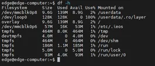</p>

<p align="center"><strong>图 4-49 查看可用磁盘空间</strong></p>

#### 4.3.5.3 调整时间

EC300有两个时间设置：系统时间和由硬件保持的RTC（实时时钟）时间。使用 `date` 命令查询或设置系统时间，使用 `hwclock` 命令查询或设置RTC时间。

使用以下命令设置系统时间：

```shell
date MMDDhhmmYYYY
```

参数说明：

| 参数 | 含义 |
|------|------|
| MM | 月 |
| DD | 日 |
| hh | 时 |
| mm | 分 |
| YYYY | 年 |

<p align="center"></p>

<p align="center"><strong>图 4-50 设置系统时间</strong></p>

将RTC时间设置为系统时间：

<p align="center"></p>

<p align="center"><strong>图 4-51 RTC时间同步</strong></p>

参考外部文档获取更多日期和时间信息：
- [Debian系统管理员手册 - 时间管理](https://www.debian.org/doc/manuals/system-administrator/ch-sysadmin-time.html)
- [Debian Wiki - DateTime](https://wiki.debian.org/DateTime)

#### 4.3.5.4 设置时区

#### 4.3.5.5 使用tzselect命令

执行 `tzselect` 命令后，进入地区选择界面。先选择大致的区域（按大洲大洋划分），输入大洲或大洋前面的数字：

<p align="center"></p>

<p align="center"><strong>图 4-52 tzselect选择区域</strong></p>

再选择该大洲或大洋下的国家：

<p align="center"></p>

<p align="center"><strong>图 4-53 tzselect选择国家</strong></p>

按照以上步骤获取到时区关键字（例如 Asia/Shanghai），执行以下命令设置时区：

<p align="center">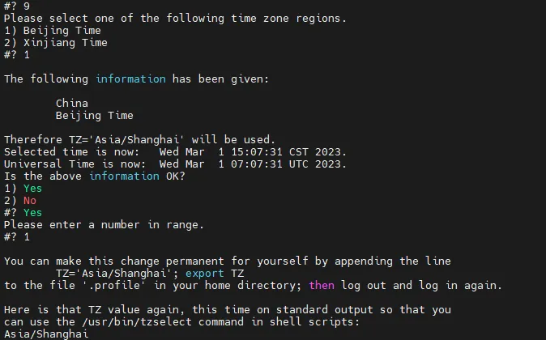</p>

<p align="center"><strong>图 4-54 设置时区</strong></p>

#### 4.3.5.6 使用localtime文件

`localtime` 文件存储在 `/etc/localtime` 中。若未为 `TZ` 环境变量设置值，该文件由GNU C库（glibc）使用。`localtime` 文件要么是 `/usr/share/zoneinfo/file` 的副本，要么是指向 `/usr/share/zoneinfo/file` 的符号链接。

若EC300找不到 `/usr/share/zoneinfo/` 文件，可从 [IANA时区数据库](https://www.iana.org/time-zones) 下载所需的时区信息文件，并在EC300中重新链接到 `localtime` 文件。

> **注意**：成功下载所需时区信息文件后，进行解压，之后使用 `zic` 命令编译生成对应的二进制文件，生成的时区文件为 `/usr/share/zoneinfo/自定义时区文件名`。

### 4.3.6 参数说明

| 命令/参数 | 功能说明 |
|-----------|----------|
| `systemctl stop ieos_daemon` | 停止IEOS程序（本次启动生效） |
| `systemctl disable ieos_daemon` | 禁止IEOS程序开机启动 |
| `vim /etc/network/interfaces.d/eth1` | 编辑eth1网络接口配置文件 |
| `vim /etc/network/interfaces.d/eth2` | 编辑eth2网络接口配置文件 |
| `/etc/init.d/networking restart` | 重启网络服务使配置生效 |
| `date MMDDhhmmYYYY` | 设置系统时间 |
| `hwclock --systohc` | 将系统时间写入RTC |
| `tzselect` | 交互式时区选择工具 |
| `ln -sf /usr/share/zoneinfo/时区 /etc/localtime` | 通过localtime文件设置时区 |
| `zic` | 编译时区信息文件 |

## 4.4 外设接口高级配置

### 功能说明

EC300提供串口、USB接口、micro SD卡接口、CAN总线接口、I/O接口、AIN接口及超级电容等外设接口，用于扩展存储、工业通信及信号采集等功能。

### 入口

外设接口通过系统命令行进行配置与调试，无需进入特定菜单。

### 操作说明

#### 4.4.1 串口

EC300配备4路串口，其中1路支持RS-485，3路支持RS-232或RS-485模式。各串口对应的设备节点如下：

| 串口 | 设备节点 |
|------|----------|
| COM1 | /dev/ttyS4 |
| COM2 | /dev/ttyS5 |
| COM3 | /dev/ttyS6 |
| COM4 | /dev/ttyS8 |

**查看与设置串口**

使用`stty`命令查看和设置串口参数。执行`sudo stty --help`可查看详细命令说明。

<p align="center"></p>

<p align="center"><strong>图 4-55 stty帮助信息（一）</strong></p>

<p align="center"></p>

<p align="center"><strong>图 4-56 stty帮助信息（二）</strong></p>

<p align="center"></p>

<p align="center"><strong>图 4-57 stty帮助信息（三）</strong></p>

<p align="center"></p>

<p align="center"><strong>图 4-58 stty帮助信息（四）</strong></p>

<p align="center"></p>

<p align="center"><strong>图 4-59 stty帮助信息（五）</strong></p>

**查看串口信息**

<p align="center">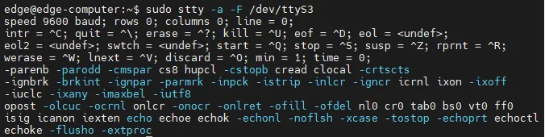</p>

<p align="center"><strong>图 4-60 查看串口信息</strong></p>

**设置COM1串口波特率**

<p align="center"></p>

<p align="center"><strong>图 4-61 设置COM1串口波特率</strong></p>

#### 4.4.2 USB接口

EC300提供1个USB 2.0 Host接口，主要用于扩展存储设备。EC300支持USB存储设备热插拔。

> **注意**：在断开USB大容量存储设备前，需执行`sync`命令同步数据，以防止数据丢失。断开存储设备时，需先从挂载目录退出。

#### 4.4.3 Micro SD卡

EC300支持micro SD存储卡，不支持热插拔。SD卡分区需格式化为FAT32格式，格式化方法如下：

- SD卡容量 <= 32GB：将SD卡插入读卡器，再将读卡器插入Windows系统电脑进行格式化。大部分Windows系统仅支持将容量小于32GB的SD卡格式化为FAT32文件系统，格式化时会自动创建一个分区；也可在Linux系统下格式化为FAT32文件系统，方法与SD卡容量 > 32GB时相同。
- SD卡容量 > 32GB：需在Linux系统下格式化为FAT32格式。将SD卡插入读卡器，再将读卡器插入Linux系统电脑或安装Linux虚拟机的电脑。

格式化步骤：

1. 执行`fdisk -l`查看SD卡对应的设备节点，示例中为`/dev/sda`。
2. 执行`fdisk /dev/sda`进行分区（`p`查看当前分区，`d`删除已有分区，`n`新建分区，`w`保存更改），创建分区`/dev/sda1`。
3. 执行`sudo mkfs.vfat -F 32 /dev/sda1`，将分区格式化为FAT32格式。
4. 格式化完成后，将SD卡从读卡器取下，在设备断电状态下插入设备。

挂载操作参考Linux mount手册。

#### 4.4.4 CAN总线接口

EC300配备3路CAN端口，支持CAN总线通信。

**配置CAN接口**

默认情况下，CAN端口已完成初始化。如需其他配置，使用`ip link`命令检查CAN设备状态。

配置步骤如下：

1. 使用`ip link set can* down`关闭CAN设备，其中`can*`从`can1`、`can2`或`can3`中选择。

<p align="center"></p>

<p align="center"><strong>图 4-62 关闭CAN设备</strong></p>

2. 配置比特率，以下为50k比特率示例：

<p align="center"></p>

<p align="center"><strong>图 4-63 配置CAN比特率</strong></p>

3. 重新开启设备：

<p align="center"></p>

<p align="center"><strong>图 4-64 开启CAN设备</strong></p>

#### 4.4.5 IO接口

EC300支持4路数字输入（DI）和4路数字输出（DO）。

| 端口号 | 设备描述文件 |
|--------|--------------|
| DI0 | /sys/class/gpio/gpio454/value |
| DI1 | /sys/class/gpio/gpio455/value |
| DI2 | /sys/class/gpio/gpio456/value |
| DI3 | /sys/class/gpio/gpio457/value |
| DO0 | /sys/class/gpio/gpio323/value |
| DO1 | /sys/class/gpio/gpio453/value |
| DO2 | /sys/class/gpio/gpio465/value |
| DO3 | /sys/class/gpio/gpio461/value |

**读取DI状态**

使用`cat`命令读取设备描述文件：

<p align="center"></p>

<p align="center"><strong>图 4-65 读取DI状态</strong></p>

**控制DO状态**

在root用户下，使用`echo 1 > "设备描述文件"`或`echo 0 > "设备描述文件"`控制DO状态：

<p align="center"></p>

<p align="center"><strong>图 4-66 控制DO状态</strong></p>

#### 4.4.6 AIN

EC300支持2路模拟输入（AIN）。接线定义参考2.3.6章节，硬件接口定义参考2.3.15章节。

| 端口号 | 设备描述文件 |
|--------|--------------|
| AIN1 | /dev/ain1 |
| AIN2 | /dev/ain2 |

使用`cat`命令读取AIN电流值：

<p align="center"></p>

<p align="center"><strong>图 4-67 读取AIN电流值</strong></p>

返回值为当前通道电流值，单位为微安（uA）。

#### 4.4.7 超级电容

**电容规格**

超级电容规格为10.8V/5F。

**掉电保持**

掉电保持模块可根据负载情况，在掉电后维持系统运行20-30秒。

**断电告警**

当外部电源断电后，系统向IP地址255.255.255.255的9107端口发送UDP广播报文`{"type":"power_down","sn":"<序列号>"}`。

**安全关机**

断电指外部电源持续断开超过0.5秒。系统在发送UDP广播报文后等待3秒，随后主动执行`poweroff`。

### 示意图

本节各子章节已包含相关操作示意图，详见4.9.3各小节。

### 参数说明

| 参数项 | 说明 |
|--------|------|
| 串口数量 | 4路（1路RS-485，3路RS-232/RS-485） |
| USB接口 | 1个USB 2.0 Host |
| micro SD卡 | 支持，需格式化为FAT32，不支持热插拔 |
| CAN总线 | 3路CAN端口 |
| DI输入 | 4路数字输入 |
| DO输出 | 4路数字输出 |
| AIN输入 | 2路模拟输入 |
| 超级电容规格 | 10.8V/5F |
| 掉电保持时间 | 20-30秒（视负载而定） |
| 断电判定时间 | 外部电源持续断开超过0.5秒 |
| 安全关机延时 | 发送UDP广播后等待3秒执行poweroff |
| 断电告警目标 | 255.255.255.255:9107（UDP广播） |

## 4.5 安全功能

EC300 集成多种安全机制，用于保障设备运行及数据访问的安全性。

### 4.5.1 功能说明

EC300 的安全机制主要包括以下三方面：

- **sudo 机制**：用于权限管理。根用户（root）被禁用，普通用户通过 sudo 获取执行特权命令的权限，从而降低因误操作导致系统损害的风险。
- **防火墙**：基于 Netfilter/iptables 的包过滤防火墙工具，可对流入、流出及流经设备的数据包进行精细化控制。
- **TPM 2.0**：可信平台模块（Trusted Platform Module），一种硬件安全模块，用于提供系统的安全与加密功能。EC300 已集成标准的 TPM 2.0 协议栈及相关工具。

### 4.5.2 入口

sudo 机制、防火墙及 TPM 2.0 均通过命令行界面进行配置与管理。用户需通过 SSH 或本地终端登录设备后执行相关命令。

### 4.5.3 操作说明

#### 4.5.3.1 sudo机制

sudo 允许经授权的用户以根用户或其他用户身份执行命令。使用该机制时，系统会提示输入当前用户的密码，无需知晓根用户密码即可获取相应特权。日常操作中，用户大部分时间以普通用户身份工作，仅在执行需要特权的命令时通过 sudo 提升权限。

#### 4.5.3.2 防火墙

iptables 作为 Linux 系统自带的包过滤防火墙工具，支持对数据包进行过滤、NAT 转换及流量控制等操作。用户可通过命令行配置规则，实现对进出设备网络流量的精细化管理。

#### 4.5.3.3 TPM2.0

TPM 2.0 是一种硬件安全模块，内置加密协处理器，支持存储加密密钥、数字证书及其他安全数据，并提供多种加密算法与安全协议。EC300 已集成标准的 TPM 2.0 协议栈和 TPM 2.0 工具，用户可通过命令行调用相关工具进行密钥管理、数据加密等操作。

### 4.5.4 参数说明

| 安全机制 | 说明 |
|---------|------|
| sudo 机制 | 基于最小权限原则，授权普通用户执行特权命令，降低误操作风险 |
| 防火墙（iptables） | 基于包过滤的防火墙，支持流入、流出及转发数据包的精细化控制 |
| TPM 2.0 | 硬件安全模块，支持加密密钥存储、数字证书管理及多种加密算法 |

## 4.6 编程指南

EC300提供JSON格式的设备信息描述文件，用于记录IO、LED、串口等外设的设备节点信息。需操作外设的用户程序可通过查询该描述文件获取设备节点路径。

设备描述信息文件路径为：`/tmp/ieos/etc/system_info.json`

以下为该文件的示例内容：

```json
{
 "device_info": {
   "model_info": {
     "model": "EC312",
     "pn": "H-LQA3-LC4D",
     "sn": "CL3124050000001",
     "oem": "inhand",
     "features": ";std;cell-LQA3;wlan;"
   },
   "software_info": {
     "boot_loader": "V1.0.2",
     "kernel": "5.10.168",
     "version": "V1.0.1-beta1",
     "os": "Debian GNU/Linux 11 (bullseye)"
   },
   "hardware_info": {
     "arch": "armv8",
     "soc": "AM6231",
     "interface": {
       "eth": [
         {
           "iface_name": "eth1",
           "iface_mac": "00:08:5f:17:04:00"
         },
         {
           "iface_name": "eth2",
           "iface_mac": "00:18:5f:17:04:02"
         }
       ],
       "wlan": [
         {
           "iface_name": "wlan0",
           "iface_mac": "f4:3c:3b:ca:e9:36"
         },
         {
           "iface_name": "wlan1",
           "iface_mac": "f6:3c:3b:ca:e9:36"
         }
       ]
     },
     "gpio": [
       {
         "gpio_name": "cellular_power",
         "dev_node": "/sys/class/gpio/gpio401"
       },
       {
         "gpio_name": "sim_switch",
         "dev_node": "/sys/class/gpio/gpio405"
       }
     ],
     "user_key": [
       {
         "user_key_name": "user1",
         "dev_node": "/dev/input/event2"
       }
     ],
     "uart": [
       {
         "uart_name": "com1",
         "dev_node": "/dev/ttyS4"
       },
       {
         "uart_name": "com2",
         "dev_node": "/dev/ttyS5"
       }
     ],
     "led": [
       {
         "led_name": "user1",
         "dev_node": "/sys/class/leds/user1"
       },
       {
         "led_name": "user2",
         "dev_node": "/sys/class/leds/user2"
       },
       {
         "led_name": "user3",
         "dev_node": "/sys/class/leds/user3"
       },
       {
         "led_name": "user4",
         "dev_node": "/sys/class/leds/user4"
       },
       {
         "led_name": "cell",
         "dev_node": "/sys/class/leds/cell"
       },
       {
         "led_name": "warn",
         "dev_node": "/sys/class/leds/warn"
       },
       {
         "led_name": "status",
         "dev_node": "/sys/class/leds/status"
       }
     ],
     "io": {
       "di": [
         {
           "di_name": "di1",
           "dev_node": "/sys/class/gpio/gpio454"
         },
         {
           "di_name": "di2",
           "dev_node": "/sys/class/gpio/gpio455"
         },
         {
           "di_name": "di3",
           "dev_node": "/sys/class/gpio/gpio456"
         },
         {
           "di_name": "di4",
           "dev_node": "/sys/class/gpio/gpio457"
         }
       ],
       "do": [
         {
           "do_name": "do1",
           "dev_node": "/sys/class/gpio/gpio323"
         },
         {
           "do_name": "do2",
           "dev_node": "/sys/class/gpio/gpio453"
         },
         {
           "do_name": "do3",
           "dev_node": "/sys/class/gpio/gpio465"
         },
         {
           "do_name": "do4",
           "dev_node": "/sys/class/gpio/gpio461"
         }
       ]
     }
   }
 }
}
```

### 4.6.1 IO编程指南

设备配备8个IO接口：DI1~DI4为4路数字输入管脚，DO1~DO4为4路数字输出管脚。

通过设备描述信息文件可获取各IO对应的设备节点路径。对IO接口进行编程时，直接操作对应设备节点下的value文件（路径格式为`/sys/class/gpio/gpioxxx/value`）。

**操作示例**

DO1输出高电平：

```shell
echo 1 > /sys/class/gpio/gpio323/value
```

查看DI1电平状态：

```shell
cat /sys/class/gpio/gpio454/value
```

**完整Shell脚本示例**

```shell
#!/bin/bash

gpio323="/sys/class/gpio/gpio323/value"
gpio453="/sys/class/gpio/gpio453/value"
gpio465="/sys/class/gpio/gpio465/value"
gpio461="/sys/class/gpio/gpio461/value"
# DO1输出高电平
if [ -f "$gpio323" ]; then
   echo 1 > /sys/class/gpio/gpio323/value
else
   echo "no file exit "$gpio323
fi

# DO1输出低电平
if [ -f "$gpio323" ]; then
   echo 0 > $gpio323
else
   echo "no file exit "$gpio323
fi

gpio454="/sys/class/gpio/gpio454/value"
gpio455="/sys/class/gpio/gpio455/value"
gpio456="/sys/class/gpio/gpio456/value"
gpio457="/sys/class/gpio/gpio457/value"
# 查看DI1电平
if [ -f "$gpio454" ]; then
   cat $gpio454
else
   echo "no file exit "$gpio454
fi
```

### 4.6.2 LED编程指南

设备提供USER1、USER2、USER3、USER4四个用户LED，可用于状态提示。LED位置以设备面板丝印为准。

通过设备描述信息文件可获取各LED对应的设备节点路径：

| LED名称 | 设备节点路径 |
|---------|-------------|
| user1 | /sys/class/leds/user1 |
| user2 | /sys/class/leds/user2 |
| user3 | /sys/class/leds/user3 |
| user4 | /sys/class/leds/user4 |

各LED设备节点目录下包含以下控制文件：

| 控制文件 | 功能说明 |
|---------|---------|
| brightness | 控制LED亮灭。写入1为常亮，写入0为常灭 |
| trigger | LED触发器。写入timer表示定时器触发，写入none表示取消触发器 |
| delay_on | LED点亮持续时间，单位为ms |
| delay_off | LED熄灭持续时间，单位为ms |

> **注意**：当trigger配置为timer时，brightness中的值将不再生效，自动变为0。

将文件路径中的user1替换为user2、user3或user4，即可控制对应LED。

**操作示例**

USER1常亮：

```shell
echo 1 > /sys/class/leds/user1/brightness
```

USER1闪烁（亮1秒、灭1秒）：

```shell
# 启动定时器
echo timer > /sys/class/leds/user1/trigger

# 亮1000ms
echo 1000 > /sys/class/leds/user1/delay_on

# 灭1000ms
echo 1000 > /sys/class/leds/user1/delay_off
```

**完整Shell脚本示例**

```shell
#!/bin/bash

USER1_BRIGTHNESS="/sys/class/leds/user1/brightness"
USER1_TRIGGER="/sys/class/leds/user1/trigger"
USER1_DELAY_ON="/sys/class/leds/user1/delay_on"
USER1_DELAY_OFF="/sys/class/leds/user1/delay_off"

# 点亮USER1灯
if [ -f "$USER1_BRIGTHNESS" ]; then
   echo 1 > $USER1_BRIGTHNESS
else
   echo "no file exit "$USER1_BRIGTHNESS
fi

# 设置USER1灯闪烁
if [ -f "$USER1_TRIGGER" ]; then
   echo timer > $USER1_TRIGGER
else
   echo "no file exit "$USER1_TRIGGER
fi

# 设置USER1灯亮1000ms
if [ -f "$USER1_DELAY_ON" ]; then
   echo 1000 > $USER1_DELAY_ON
else
   echo "no file exit "$USER1_DELAY_ON
fi

# 设置USER1灯灭1000ms
if [ -f "$USER1_DELAY_OFF" ]; then
   echo 1000 > $USER1_DELAY_OFF
else
   echo "no file exit "$USER1_DELAY_OFF
fi

# 关闭USER1闪烁
if [ -f "$USER1_TRIGGER" ]; then
   echo none > $USER1_TRIGGER
else
   echo "no file exit "$USER1_TRIGGER
fi
```

### 4.6.3 交叉编译

用户的C/C++程序可在开发机上使用交叉编译工具链进行编译，生成的目标文件上传至EC300设备后执行。

**交叉编译工具链**：gcc-linaro-6.3.1-2017.05-x86_64_aarch64-linux-gnu.tar.gz

**环境变量配置步骤**

1. 在开发机上将交叉编译工具链压缩包解压至`/opt`目录下（亦可解压至其他路径，步骤2中PATH环境变量需相应调整）。
2. 编辑`~/.bashrc`文件，在文件末尾添加：`PATH=$PATH:/opt/gcc-linaro-6.3.1-2017.05-x86_64_aarch64-linux-gnu/bin`
3. 执行`source ~/.bashrc`使环境变量在当前终端生效；新打开的终端自动生效。

**编译示例**

以Hello World程序为例，创建目录和文件：

```shell
mkdir ~/example
touch ~/example/hello.c
touch ~/example/Makefile
```

`~/example/hello.c`文件内容：

```c
#include <stdio.h>

int main(void) 
{
    printf("hello, world!\n");
    return 0;
}
```

`~/example/Makefile`文件内容：

```makefile
# 定义目标文件名和源文件名
TARGET  := hellworld
DIRS    := $(shell find . -maxdepth 3 -type d) 
SRCS    := $(foreach dir,$(DIRS),$(wildcard $(dir)/*.c))
OBJS    := $(SRCS:.c=.o)


CC=aarch64-linux-gnu-gcc

# 定义编译器和编译选项
CFLAGS  := -Wall -Wextra -g -Wno-unused-parameter

# 定义默认目标
all: $(TARGET)

# 定义目标文件的依赖关系和编译命令
$(TARGET): $(OBJS)
       $(CC) $(CFLAGS) $(LIBS) $^ -o $@ 

# 定义将源文件编译成目标文件的命令
%.o: %.c
       $(CC) $(CFLAGS) $(LIBS) -c $< -o $@

# 定义清除临时文件的命令
clean:
       rm -f $(TARGET) $(OBJS)

# 声明伪目标 ".PHONY"
.PHONY: all clean
```

在`~/example`目录下执行`make`，生成目标文件`helloworld`。

### 4.6.4 Watchdog编程

设备配备外部硬件看门狗，若60秒内未执行喂狗操作，设备将自动重启。

可通过命令`systemctl stop watchdog`禁用系统喂狗服务，在用户程序中自行实现喂狗逻辑。

**Watchdog程序示例**

```c
#include <fcntl.h>
#include <unistd.h>
#include <stdlib.h>
#include <stdio.h>
#include <string.h>
#include <signal.h>
#include <sys/types.h>
#include <sys/stat.h>

static int fd = 0;

/* 信号处理函数 */
void signal_handler(int signal)
{
    /* 关闭watchdog，关闭后如果不喂狗设备60秒后会重启 */
    write(fd, "V", 1);
    close(fd);
    exit(0);
}

int main(int argc, char **argv)
{
    /* 通过open来打开watchdog */
    fd = open("/dev/watchdog0", O_WRONLY);

    /* 注册Kill信号 */
    signal(SIGTERM, signal_handler);
    
    while (1) {
        /* 通过write来喂狗 */
        write(fd, "\0", 1); 

        /* 每10秒执行一次喂狗 */
        sleep(10);
    }
}
```


# 附录A 故障处理

下表汇总了 EC300 在使用过程中可能出现的异常现象、原因分析及排查建议。所有内容均来源于本手册正文相关章节。

| 现象 | 可能原因 | 排查/处理建议 | 对应章节 |
|------|---------|--------------|---------|
| PWR 指示灯不亮 | 设备未通电或电源连接异常 | 检查直流供电线路；EC300/EC312 支持 9–48 VDC 输入 | [第1章 认识设备](#第1章-认识设备) |
| STATUS 指示灯长灭 | 系统启动失败，或恢复出厂操作尚未完成 | 等待恢复出厂完成；若长时间无变化，可重新上电或执行恢复出厂操作 | [第1章 认识设备](#第1章-认识设备) |
| WARN 指示灯闪烁 | 恢复出厂尚未完成，或蜂窝拨号异常（需开启蜂窝功能） | 等待恢复出厂完成；若因拨号异常，检查 SIM 卡状态、拨号参数及信号强度 | [第1章 认识设备](#第1章-认识设备) |
| NET 指示灯熄灭 | 蜂窝拨号功能未开启 | 确认蜂窝功能已启用 | [第1章 认识设备](#第1章-认识设备) |
| NET 指示灯持续闪烁 | 拨号进行中或拨号失败 | 检查 SIM 卡是否欠费、插入是否正确；必要时启用 ICMP 探测以识别假连接 | [第1章 认识设备](#第1章-认识设备)、[第3章 常用场景配置](#第3章-常用场景配置) |
| 蜂窝拨号成功但无法连通目标地址（假连接） | 无线蜂窝网络出现假连接；信号不佳 | 重新拨号一次；蜂窝拨号支持 ICMP 探测，可在配置中开启并设置探测地址、间隔、超时及重试次数 | [第3章 常用场景配置](#第3章-常用场景配置) |
| 拨号失败后系统自动重启 | 未插 SIM 卡时拨号持续失败，且未开启无限重拨 | 插入有效 SIM 卡；或在蜂窝高级配置中开启 Enable Infinitely Redial | [第3章 常用场景配置](#第3章-常用场景配置) |
| 通过 SSH 无法登录 | 用户名/密钥错误，或使用了被禁用的 root 账户 | 使用出厂默认账户 edge / security@edge；root 默认被禁用，需使用 `sudo -s` 切换 | [第2章 安装与首次使用](#第2章-安装与首次使用) |
| 通过 Web 无法登录 IEOS | 使用了错误端口或协议，或账户信息错误 | IEOS 使用 HTTPS 9100 端口（如 https://192.168.4.100:9100）；默认账户为 adm / 123456 | [第2章 安装与首次使用](#第2章-安装与首次使用) |
| 执行命令提示 command not found 或 permission denied | 当前用户权限不足，或使用了管道/重定向导致权限问题 | 使用 `sudo -s` 切换至 root，或在命令前加 `sudo`；涉及管道/重定向时，使用 `sudo su -c` 包裹完整命令 | [第2章 安装与首次使用](#第2章-安装与首次使用)、[第4章 功能说明与参数参考](#第4章-功能说明与参数参考) |
| 用户程序出现端口冲突 | 用户程序占用了 IEOS 预留端口 | 用户程序应避开 9100–9200 端口范围 | [第2章 安装与首次使用](#第2章-安装与首次使用) |
| USB 存储设备断开时数据丢失 | 未执行同步命令即拔出设备 | 断开 USB 大容量存储设备前，执行 `sync` 命令；断开前退出挂载目录 | [第1章 认识设备](#第1章-认识设备)、[第4章 功能说明与参数参考](#第4章-功能说明与参数参考) |
| microSD 卡无法正常识别 | 使用了不支持的热插拔，或文件系统格式不正确 | 在断电状态下插拔 microSD 卡；使用 FAT32 文件系统格式化 | [第1章 认识设备](#第1章-认识设备)、[第4章 功能说明与参数参考](#第4章-功能说明与参数参考) |
| 固件升级后新功能未生效 | 升级后未重启系统 | 手动重启系统；或在升级页面开启"自动重启"选项 | [第3章 常用场景配置](#第3章-常用场景配置) |
| 设备时间与预期不一致，或手动同步按钮未显示 | NTP 服务器未同步成功，或本地时间与设备时间差异不足 3 秒 | 检查 NTP 服务器可达性；手动同步按钮仅在设备时间与本地时间相差超过 3 秒时显示 | [第3章 常用场景配置](#第3章-常用场景配置) |
| 需要恢复出厂设置 | 系统配置异常或需要清除用户数据 | 方法一：通过命令行执行恢复出厂命令，系统将自动重启；方法二：长按恢复出厂按键 10–20 秒，待 WARN 灯常亮后释放。恢复出厂前需备份关键数据 | [第4章 功能说明与参数参考](#第4章-功能说明与参数参考) |

# 附录B 命令行/高级参考

### 1 设备信息描述文件

EC300 提供一个 JSON 格式的设备信息描述文件，用于查询 IO、LED、串口等外设的设备节点信息。该文件路径为：

```
/tmp/ieos/etc/system_info.json
```

文件内容结构如下：

```json
{
  "device_info": {
    "model_info": {
      "model": "EC312",
      "pn": "H-LQA3-LC4D",
      "sn": "CL3124050000001",
      "oem": "inhand",
      "features": ";std;cell-LQA3;wlan;"
    },
    "software_info": {
      "boot_loader": "V1.0.2",
      "kernel": "5.10.168",
      "version": "V1.0.1-beta1",
      "os": "Debian GNU/Linux 11 (bullseye)"
    },
    "hardware_info": {
      "arch": "armv8",
      "soc": "AM6231",
      "interface": {
        "eth": [
          {
            "iface_name": "eth1",
            "iface_mac": "00:08:5f:17:04:00"
          },
          {
            "iface_name": "eth2",
            "iface_mac": "00:18:5f:17:04:02"
          }
        ],
        "wlan": [
          {
            "iface_name": "wlan0",
            "iface_mac": "f4:3c:3b:ca:e9:36"
          },
          {
            "iface_name": "wlan1",
            "iface_mac": "f6:3c:3b:ca:e9:36"
          }
        ]
      },
      "gpio": [
        {
          "gpio_name": "cellular_power",
          "dev_node": "/sys/class/gpio/gpio401"
        },
        {
          "gpio_name": "sim_switch",
          "dev_node": "/sys/class/gpio/gpio405"
        }
      ],
      "user_key": [
        {
          "user_key_name": "user1",
          "dev_node": "/dev/input/event2"
        }
      ],
      "uart": [
        {
          "uart_name": "com1",
          "dev_node": "/dev/ttyS4"
        },
        {
          "uart_name": "com2",
          "dev_node": "/dev/ttyS5"
        }
      ],
      "led": [
        {
          "led_name": "user1",
          "dev_node": "/sys/class/leds/user1"
        },
        {
          "led_name": "user2",
          "dev_node": "/sys/class/leds/user2"
        },
        {
          "led_name": "user3",
          "dev_node": "/sys/class/leds/user3"
        },
        {
          "led_name": "user4",
          "dev_node": "/sys/class/leds/user4"
        },
        {
          "led_name": "cell",
          "dev_node": "/sys/class/leds/cell"
        },
        {
          "led_name": "warn",
          "dev_node": "/sys/class/leds/warn"
        },
        {
          "led_name": "status",
          "dev_node": "/sys/class/leds/status"
        }
      ],
      "io": {
        "di": [
          {
            "di_name": "di1",
            "dev_node": "/sys/class/gpio/gpio454"
          },
          {
            "di_name": "di2",
            "dev_node": "/sys/class/gpio/gpio455"
          },
          {
            "di_name": "di3",
            "dev_node": "/sys/class/gpio/gpio456"
          },
          {
            "di_name": "di4",
            "dev_node": "/sys/class/gpio/gpio457"
          }
        ],
        "do": [
          {
            "do_name": "do1",
            "dev_node": "/sys/class/gpio/gpio323"
          },
          {
            "do_name": "do2",
            "dev_node": "/sys/class/gpio/gpio453"
          },
          {
            "do_name": "do3",
            "dev_node": "/sys/class/gpio/gpio465"
          },
          {
            "do_name": "do4",
            "dev_node": "/sys/class/gpio/gpio461"
          }
        ]
      }
    }
  }
}
```

### 2 IO 编程指南

EC300 提供 8 个 IO 接口：DI1~DI4 为 4 个输入管脚，DO1~DO4 为 4 个输出管脚。可通过查询 `/tmp/ieos/etc/system_info.json` 获取各 IO 对应的设备节点。

对 IO 接口进行编程时，直接操作 sysfs（Linux 系统中用于暴露内核对象信息的虚拟文件系统）中对应设备节点下的 `value` 文件即可。例如：

- DO1 输出高电平：

```shell
echo 1 > /sys/class/gpio/gpio323/value
```

- 读取 DI1 电平：

```shell
cat /sys/class/gpio/gpio454/value
```

完整 Shell 脚本示例：

```shell
#!/bin/bash

gpio323="/sys/class/gpio/gpio323/value"
gpio453="/sys/class/gpio/gpio453/value"
gpio465="/sys/class/gpio/gpio465/value"
gpio461="/sys/class/gpio/gpio461/value"

if [ -f "$gpio323" ]; then
   echo 1 > /sys/class/gpio/gpio323/value
else
   echo "no file exit "$gpio323
fi

if [ -f "$gpio323" ]; then
   echo 0 > $gpio323
else
   echo "no file exit "$gpio323
fi

gpio454="/sys/class/gpio/gpio454/value"
gpio455="/sys/class/gpio/gpio455/value"
gpio456="/sys/class/gpio/gpio456/value"
gpio457="/sys/class/gpio/gpio457/value"

if [ -f "$gpio454" ]; then
   cat $gpio454
else
   echo "no file exit "$gpio454
fi
```

### 3 LED 编程指南

EC300 提供 USER1、USER2、USER3、USER4 四个用户可编程 LED，用于状态提示。各 LED 对应的 sysfs 设备节点如下（以 USER1 为例）：

- `/sys/class/leds/user1/brightness`：控制 LED 亮灭，写入 1 为常亮，写入 0 为常灭。
- `/sys/class/leds/user1/trigger`：LED 触发器，写入 `timer` 启用定时器触发，写入 `none` 取消触发器。
- `/sys/class/leds/user1/delay_on`：LED 点亮持续时间，单位为 ms。
- `/sys/class/leds/user1/delay_off`：LED 熄灭持续时间，单位为 ms。

若配置 `trigger` 为 `timer`，则 `brightness` 中的值将不再生效，会自动变为 0。将路径中的 `user1` 替换为 `user2`、`user3` 或 `user4`，即可控制对应 LED。

示例：

- USER1 常亮：

```shell
echo 1 > /sys/class/leds/user1/brightness
```

- USER1 闪烁（亮 1 秒，灭 1 秒）：

```shell
echo timer > /sys/class/leds/user1/trigger
echo 1000 > /sys/class/leds/user1/delay_on
echo 1000 > /sys/class/leds/user1/delay_off
```

完整 Shell 脚本示例：

```shell
#!/bin/bash

USER1_BRIGTHNESS="/sys/class/leds/user1/brightness"
USER1_TRIGGER="/sys/class/leds/user1/trigger"
USER1_DELAY_ON="/sys/class/leds/user1/delay_on"
USER1_DELAY_OFF="/sys/class/leds/user1/delay_off"

if [ -f "$USER1_BRIGTHNESS" ]; then
   echo 1 > $USER1_BRIGTHNESS
else
   echo "no file exit "$USER1_BRIGTHNESS
fi

if [ -f "$USER1_TRIGGER" ]; then
   echo timer > $USER1_TRIGGER
else
   echo "no file exit "$USER1_TRIGGER
fi

if [ -f "$USER1_DELAY_ON" ]; then
   echo 1000 > $USER1_DELAY_ON
else
   echo "no file exit "$USER1_DELAY_ON
fi

if [ -f "$USER1_DELAY_OFF" ]; then
   echo 1000 > $USER1_DELAY_OFF
else
   echo "no file exit "$USER1_DELAY_OFF
fi

if [ -f "$USER1_TRIGGER" ]; then
   echo none > $USER1_TRIGGER
else
   echo "no file exit "$USER1_TRIGGER
fi
```

### 4 交叉编译指南

用户自己的 C/C++ 程序可以通过在开发机器上使用交叉编译工具链进行交叉编译（可以理解为：在一种架构的计算机上编译出另一种架构可执行程序的过程），然后将目标文件上传到 EC300 设备上执行。

交叉编译工具压缩包：

```
gcc-linaro-6.3.1-2017.05-x86_64_aarch64-linux-gnu.tar.gz
```

#### 配置交叉编译工具链环境变量

1. 在开发机上将 `gcc-linaro-6.3.1-2017.05-x86_64_aarch64-linux-gnu.tar.gz` 解压到 `/opt` 路径下（也可以解压到其他路径，步骤 2 中设置 PATH 环境变量时做相应调整）。
2. 编辑 `~/.bashrc` 文件，在文件最后添加一行：

```shell
PATH=$PATH:/opt/gcc-linaro-6.3.1-2017.05-x86_64_aarch64-linux-gnu/bin
```

3. 执行 `source ~/.bashrc` 使环境变量在当前终端生效；新打开的终端会自动生效。

#### 编译示例

以经典的 hello world 程序为例，创建如下目录和文件：

```shell
mkdir ~/example
touch ~/example/hello.c
touch ~/example/Makefile
```

`~/example/hello.c` 文件内容：

```c
#include <stdio.h>

int main(void)
{
    printf("hello, world!\n");
    return 0;
}
```

`~/example/Makefile` 文件内容：

```makefile
TARGET  := hellworld
DIRS    := $(shell find . -maxdepth 3 -type d)
SRCS    := $(foreach dir,$(DIRS),$(wildcard $(dir)/*.c))
OBJS    := $(SRCS:.c=.o)

CC=aarch64-linux-gnu-gcc

CFLAGS  := -Wall -Wextra -g -Wno-unused-parameter

all: $(TARGET)

$(TARGET): $(OBJS)
	$(CC) $(CFLAGS) $(LIBS) $^ -o $@

%.o: %.c
	$(CC) $(CFLAGS) $(LIBS) -c $< -o $@

clean:
	rm -f $(TARGET) $(OBJS)

.PHONY: all clean
```

在 `~/example` 目录下执行 `make`，生成目标文件 `helloworld`。

### 5 Watchdog 编程

EC300 配备一个外部硬件 Watchdog（看门狗，可以理解为：用于监测系统运行状态并在异常时自动重启的硬件机制）。若 60 秒没有喂狗，设备将自动重启。

可通过以下命令禁用系统的喂狗服务，以便在用户程序中自行实现喂狗：

```shell
systemctl stop watchdog
```

Watchdog 编程示例（C 语言）：

```c
#include <fcntl.h>
#include <unistd.h>
#include <stdlib.h>
#include <stdio.h>
#include <string.h>
#include <signal.h>
#include <sys/types.h>
#include <sys/stat.h>

static int fd = 0;

/* 信号处理函数 */
void signal_handler(int signal)
{
    /* 关闭watchdog，关闭后如果不喂狗设备60秒后会重启 */
    write(fd, "V", 1);
    close(fd);
    exit(0);
}

int main(int argc, char **argv)
{
    /* 通过open来打开watchdog */
    fd = open("/dev/watchdog0", O_WRONLY);

    /* 注册Kill信号 */
    signal(SIGTERM, signal_handler);

    while (1) {
        /* 通过write来喂狗 */
        write(fd, "\0", 1);

        /* 每10秒执行一次喂狗 */
        sleep(10);
    }
}
```