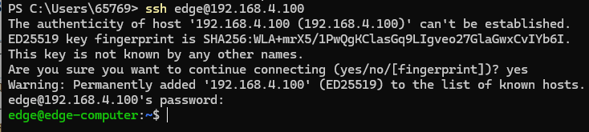
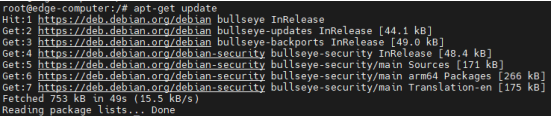
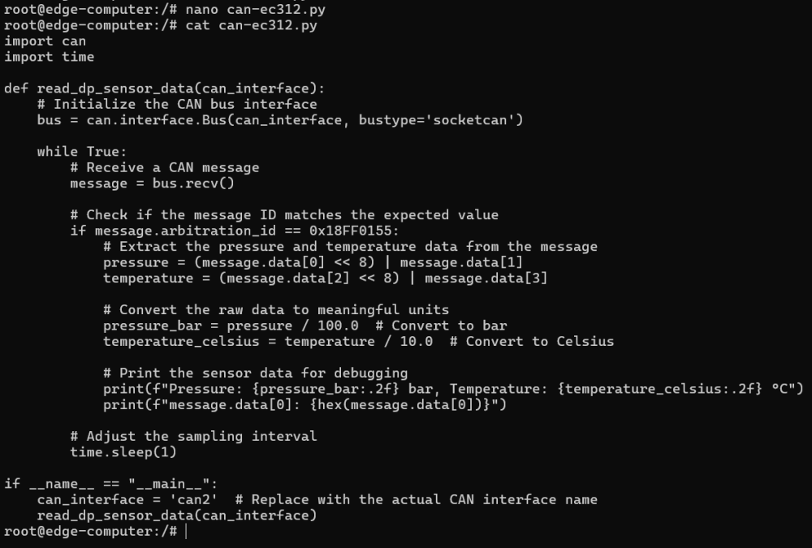
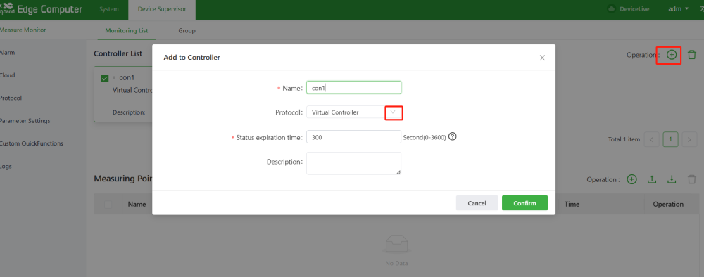
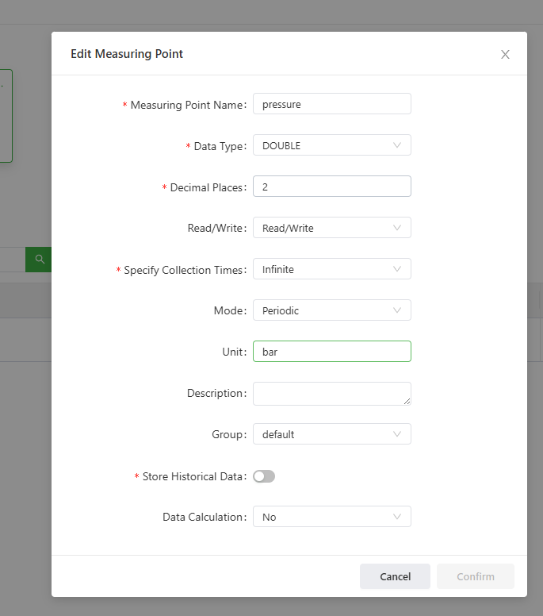
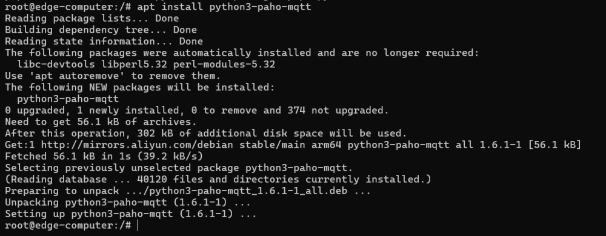
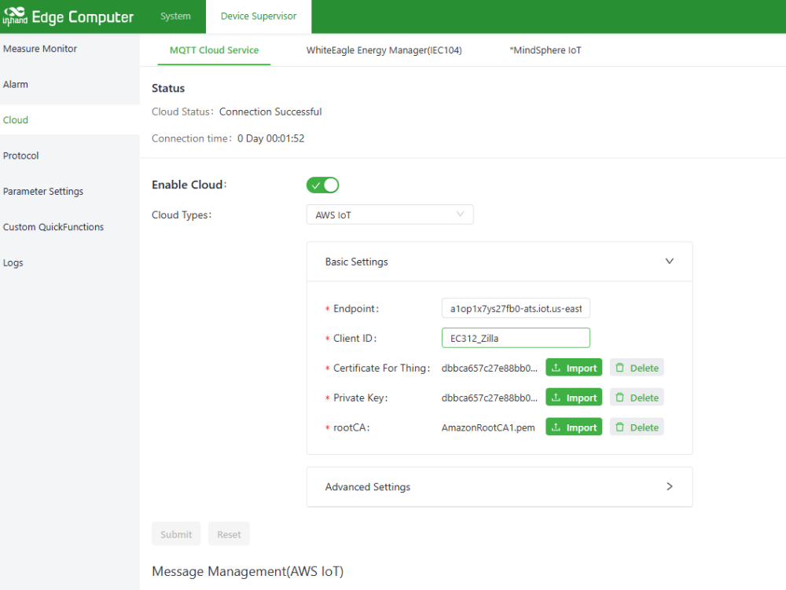
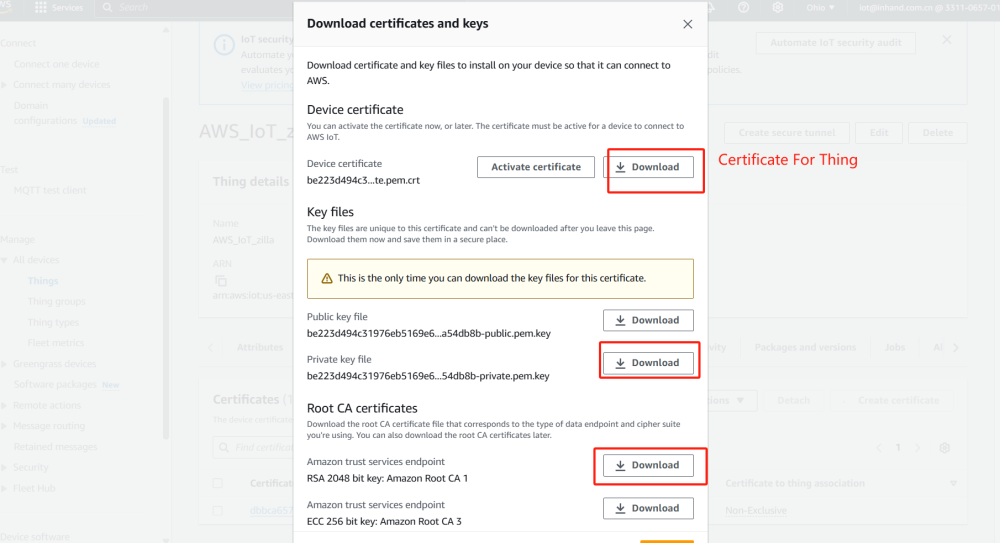
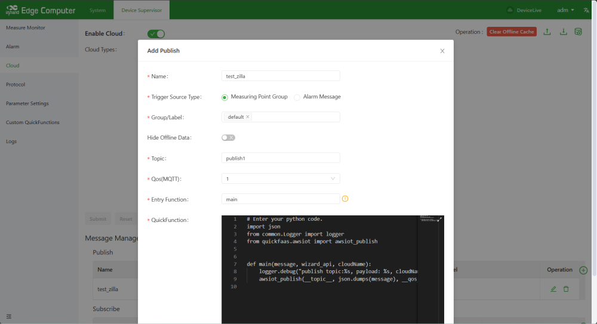

# EC312 CAN-to-AWS 配置手册

## 1. 文档信息

- **产品型号：** InHand EC312 边缘计算网关
- **所用插件：** Device Supervisor (DSA)
- **云平台：** AWS IoT Core
- **参考案例：** 将 CAN ID 为 `0x18FF0155` 的差压（DP）传感器接入 AWS IoT
- **日期：** 2026-05-21

> 整体数据流向：**Python 应用接收 CAN 数据并发布到内部 MQTT 代理，随后写入虚拟控制器。接下来登录 EC312 Web UI，在 Device Supervisor (DSA) 中配置虚拟控制器和云连接器，将数据发布到 AWS。**


---

## 2. 前提条件

1. EC312 已上电（DC 9–36 V），且可通过 LAN 口访问。
2. 笔记本电脑已连接到 **EC312 ETH2**（LAN），并配置为同一子网（默认 LAN 为 `192.168.4.0/24`）。
3. 已插入 SIM 卡（设备断电时插入）。
4. 已准备好 AWS 账户，具备在 AWS IoT Core 中创建 **Thing**、**Policy** 并下载 **X.509 证书** 的权限。
5. SSH 客户端（例如 MobaXterm、PuTTY，或 macOS/Linux 上的 `ssh`）。
6. 用于访问 EC312 Web UI 的浏览器。

默认出厂凭证：

| 项目 | 数值 |
|---|---|
| LAN IP | `192.168.2.1`（路由器）/ `192.168.4.100`（边缘 OS） |
| Web 用户名 | `adm` |
| Web 密码 | `123456` *(或随机密码，请参见设备标签)* |
| SSH 用户 | `edge` |
| SSH 密码 | `security@edge` |

> **首次登录后请修改所有默认密码。**

---

## 3. 第一部分 — 在 EC312 边缘 OS 上读取 CAN 总线（Python）

### 3.1 使用 SSH 连接

将 PC 连接至 **EC312 ETH2**，然后通过 SSH 登录边缘 OS：

```bash
ssh edge@192.168.4.100
# 密码：security@edge
```



### 3.2 切换为 root

```bash
sudo -s
# 密码：security@edge
```


### 3.3 确认网络连通性

```bash
ping 8.8.8.8 -c 4
```


### 3.4 更新 APT 源

```bash
apt-get update
```



### 3.5 安装 pip

```bash
apt-get install -y python3-pip
```


### 3.6 安装 `python-can`

```bash
pip3 install python-can
apt install python3-can
```


### 3.7 编写第一个测试脚本

将文件保存为 `can-ec312.py`：

```python
import can
import time

def read_dp_sensor_data(can_interface):
    """
    Reads data from a differential pressure (DP) sensor over CAN,
    decodes pressure & temperature and prints them.
    """
    bus = can.interface.Bus(can_interface, bustype='socketcan')

    while True:
        message = bus.recv()

        # Filter by arbitration ID (0x18FF0155 in this case)
        if message.arbitration_id == 0x18FF0155:
            pressure    = (message.data[0] << 8) | message.data[1]
            temperature = (message.data[2] << 8) | message.data[3]

            pressure_bar       = pressure / 100.0
            temperature_celsius = temperature / 10.0

            print(f"Pressure: {pressure_bar:.2f} bar, "
                  f"Temperature: {temperature_celsius:.2f} °C")
            print(f"Raw Pressure Data (message.data[0]): {hex(message.data[0])}")

        time.sleep(1)

if __name__ == "__main__":
    can_interface = 'can2'  # adjust if your CAN port is different
    read_dp_sensor_data(can_interface)
```

### 3.8 将 CAN 传感器连接到 `CAN2`

将差压传感器（或其他 CAN 设备）接线到 EC312 的 `CAN2` 端口：



### 3.9 运行 Python 脚本

```bash
python3 ./can-ec312.py
```

控制台应打印出解码后的压力和温度值。


---

## 4. 第二部分 — 在 Device Supervisor 中创建虚拟控制器

登录 EC312 Web UI（`https://<EC312_LAN_IP>`）并打开 **Device Supervisor (DSA)**。参考：
<https://help.inhand.com/portal/zh/kb/articles/dsa>

### 4.1 创建虚拟控制器



### 4.2 添加测量标签

添加一个名为 `pressure` 的标签（作为示例）。该标签代表 Python 应用通过 MQTT 写入的数值。




### 4.3 记录控制器的 **Service ID（服务 ID）**

每个虚拟控制器都有独立的 **driver service ID（驱动服务 ID）**。在 MQTT 主题中需要将其作为 `{driverServiceId}` 使用。


---

## 5. 第三部分 — 通过内部 MQTT 将 CAN 数据写入虚拟控制器

修改 Python 脚本，使其连接到 Device Supervisor 的 **内部 MQTT 代理**，并通过南向主题发布数据。参考：
<https://help.inhand.com/portal/zh/kb/articles/dsa#21_Connect_to_the_internal_MQTT_Broker>

内部 MQTT 代理（固定配置）：

| 项目 | 数值 |
|---|---|
| 主机 | `127.0.0.1` |
| 端口 | `9105` |
| 用户名 | `inhand` |
| 密码 | `inhand` |
| 南向写入主题 | `ds2/eventbus/south/read/{driverServiceId}` |




### 5.1 更新后的 Python 脚本（含 MQTT）

```python
import can
import time
import json
import paho.mqtt.client as mqtt

# --- MQTT Configuration ---
MQTT_SERVER       = "127.0.0.1"
MQTT_PORT         = 9105
MQTT_USERNAME     = "inhand"
MQTT_PASSWORD     = "inhand"
MQTT_TOPIC        = "ds2/eventbus/south/read/{driverServiceId}"
DRIVER_SERVICE_ID = "exampleServiceId"   # <-- replace with the real service ID

mqtt_client = mqtt.Client()
mqtt_client.username_pw_set(MQTT_USERNAME, MQTT_PASSWORD)
mqtt_client.connect(MQTT_SERVER, MQTT_PORT, keepalive=60)

def read_dp_sensor_data(can_interface):
    bus = can.interface.Bus(can_interface, bustype='socketcan')

    while True:
        try:
            message = bus.recv()
            if message and message.arbitration_id == 0x18FF0155:
                pressure    = (message.data[0] << 8) | message.data[1]
                temperature = (message.data[2] << 8) | message.data[3]

                pressure_bar        = pressure / 100.0
                temperature_celsius = temperature / 10.0

                payload = {
                    "controllers": [
                        {
                            "name": "con1",
                            "version": "d3b0c5fc05cb72e7759c95f346e29f8d",
                            "health": 1,
                            "timestamp": int(time.time()),
                            "measures": [
                                {
                                    "name": "pressure",
                                    "health": 1,
                                    "timestamp": int(time.time()),
                                    "timestampMsec": int(time.time() * 1000),
                                    "value": pressure_bar
                                }
                            ]
                        }
                    ]
                }

                mqtt_topic   = MQTT_TOPIC.format(driverServiceId=DRIVER_SERVICE_ID)
                mqtt_payload = json.dumps(payload)
                mqtt_client.publish(mqtt_topic, mqtt_payload, qos=1)

            time.sleep(1)
        except KeyboardInterrupt:
            print("Exiting...")
            break
        except Exception as e:
            print(f"Error during processing: {e}")

if __name__ == "__main__":
    can_interface = 'can2'
    read_dp_sensor_data(can_interface)
```

> 如需安装 MQTT 库：`pip3 install paho-mqtt`


### 5.2 在虚拟控制器中验证

打开 Device Supervisor → 虚拟控制器，确认 `pressure` 标签已更新为内部 MQTT 总线推送的数值。


---

## 6. 第四部分 — 将 Device Supervisor 连接到 AWS IoT Core

AWS IoT 配置参考：
<https://help.inhand.com/portal/zh/kb/articles/dsa#AWS_IoT_Instructions>

### 6.1 准备 AWS 环境

在 AWS IoT Core 控制台中：

1. 创建一个 **Thing（物）**。
2. 创建或附加一个 **Policy（策略）**，允许在将使用的主题上执行 `iot:Connect`、`iot:Publish`、`iot:Subscribe`、`iot:Receive`。（详细步骤见下方 6.2 节。）
3. 生成并下载 X.509 **证书**、**私钥** 和 **Amazon 根 CA**。
4. 记录 AWS IoT **终端节点**（Settings → Device data endpoint），例如 `xxxxxxxxxxxxxx-ats.iot.<region>.amazonaws.com`。（也可以从 **AWS IoT Core** → **Connect** → **Domain configurations** 中复制域名，作为设备连接 AWS IoT Core 的终端节点。）

### 6.2 创建 AWS IoT Policy（策略）

**控制台操作步骤**

1. 登录 **AWS Management Console**，打开 **IoT Core** 服务。
2. 左侧导航 → **Manage → Security → Policies**（某些区域为 **Security → Policies**）。
3. 点击右上角 **Create policy**。
4. 在 **Policy properties** 中：
   - **Policy name** — 例如 `EC312_CAN_AWS_Policy`。
   - **Policy document** — 切换到 **JSON** 编辑器（比默认的 Builder 模式更清晰）。
5. 粘贴以下 JSON（将主题名称替换为自己的），然后点击 **Create**。
6. 创建完成后，将策略附加到设备证书：
   **Manage → All devices → Things → *你的 Thing* → Certificates → 选择证书 → Actions → Attach policy →** 选择刚创建的策略。

> **重要：** 策略附加到 **证书**，而不是 Thing。一个证书可以附加多个策略。

**推荐策略 JSON（最小权限）**

```json
{
  "Version": "2012-10-17",
  "Statement": [
    {
      "Effect": "Allow",
      "Action": "iot:Connect",
      "Resource": "arn:aws:iot:<region>:<account-id>:client/${iot:Connection.Thing.ThingName}"
    },
    {
      "Effect": "Allow",
      "Action": "iot:Publish",
      "Resource": [
        "arn:aws:iot:<region>:<account-id>:topic/ec312/pressure"
      ]
    },
    {
      "Effect": "Allow",
      "Action": "iot:Subscribe",
      "Resource": [
        "arn:aws:iot:<region>:<account-id>:topicfilter/ec312/cmd"
      ]
    },
    {
      "Effect": "Allow",
      "Action": "iot:Receive",
      "Resource": [
        "arn:aws:iot:<region>:<account-id>:topic/ec312/cmd"
      ]
    }
  ]
}
```

替换占位符：

| 占位符 | 数值 |
|---|---|
| `<region>` | AWS 区域 — 例如 `us-east-1`、`ap-southeast-1`。AWS 中国区域需将 ARN 前缀改为 `aws-cn:`（例如 `arn:aws-cn:iot:cn-northwest-1:…`）。 |
| `<account-id>` | 你的 12 位 AWS 账户 ID（控制台右上角用户名下方）。 |
| `ec312/pressure` | **发布**主题 — 必须与 DSA 中设置的 *Publish topic* 一致。 |
| `ec312/cmd` | 下行命令的 **订阅** 主题。如果不需要下行，删除 Subscribe/Receive 语句。 |

**需要避免的关键陷阱**

- **Publish / Receive** 使用 `topic/<name>`（精确主题资源）。
- **Subscribe** 使用 `topicfilter/<name>` — 即使订阅的是精确主题名也是如此。此处使用 `topic/` 会返回 `not authorized`。
- `iot:Connect` 资源使用 `${iot:Connection.Thing.ThingName}`，强制设备使用与 Thing 名称相同的 Client ID 连接。请确保 DSA 中的 **Client ID** 字段与 AWS 中的 Thing 名称一致，否则连接会被拒绝。（或者放宽为 `client/*`，但生产环境不推荐。）
- TLS 要求设备时间正确。EC312 必须能正常通过 NTP 或蜂窝网络同步时间，否则证书握手会失败。

**宽松策略 JSON（仅用于测试）**

如果只是想先验证链路是否通，可以使用下面的通配策略，验证通过后再收紧为上方的最小权限版本：

```json
{
  "Version": "2012-10-17",
  "Statement": [
    {
      "Effect": "Allow",
      "Action": ["iot:Connect", "iot:Publish", "iot:Subscribe", "iot:Receive"],
      "Resource": "*"
    }
  ]
}
```

> 生产环境不要保留宽松策略 — 在管道验证通过后，请切换到上方的最小权限版本。

### 6.3 在 DSA 中配置 AWS IoT

在 EC312 Web UI 中进入 **Device Supervisor → Cloud / Northbound → AWS IoT**：



填写以下字段：

| 字段 | 数值 |
|---|---|
| Endpoint（终端节点） | 上方复制的 AWS IoT 数据终端节点 |
| Client ID / Thing name（客户端 ID / Thing 名称） | 在 AWS 中注册的 Thing 名称 |
| Port（端口） | `8883` |
| CA certificate（CA 证书） | Amazon 根 CA |
| Client certificate（客户端证书） | 为该 Thing 生成的设备证书 |
| Client private key（客户端私钥） | 对应的私钥 |
| Publish topic（发布主题） | 例如 `ec312/pressure` |
| Subscribe topic（订阅主题，可选） | 例如 `ec312/cmd` |




---

## 7. 第五部分 — 发布到 AWS 并验证

### 7.1 从 EC312 发布

EC312 侧配置的发布主题（本示例）：



### 7.2 在 AWS 上订阅

在 AWS IoT Core → **MQTT test client** 中，订阅相同主题并查看来自 EC312 的实时消息：


如果数值与 Python 应用在 SSH 控制台中打印的一致，说明端到端管道（CAN → Python → 内部 MQTT → 虚拟控制器 → AWS IoT）已正常工作。

---

## 8. 可选 — 加固与运维

### 8.1 修改默认 Web 密码

进入 `System → Admin Access → User`：修改 `adm` 的密码。应用并保存。

### 8.2 限制远程管理

进入 `System → Admin Access`：选择启用哪些服务（HTTPS / SSH）、使用哪个端口，以及是否允许远程（WAN）访问。

### 8.3 启用 Device Manager（云端运维）

进入 `Services → Device Remote Management Platform`：

1. 启用。
2. 服务类型：选择 **Device Manager**。
3. 服务器：根据项目选择 **China** 或 **International**。
4. 账户：填入你的 InHand Device Manager 账户。

### 8.4 备份配置

进入 `Services → Configuration Management → Router Config → Backup Config` 进行备份。
通过 **Import Config** 按钮恢复配置（恢复后需重启生效）。

### 8.5 设置 Python 应用开机自启

将脚本配置为 systemd 服务，使其在重启后自动运行：

```ini
# /etc/systemd/system/can-aws.service
[Unit]
Description=EC312 CAN to AWS bridge
After=network-online.target

[Service]
User=root
ExecStart=/usr/bin/python3 /root/can-ec312.py
Restart=on-failure
RestartSec=5

[Install]
WantedBy=multi-user.target
```

```bash
systemctl enable can-aws
systemctl start can-aws
systemctl status can-aws
```

---

## 9. 故障排查

| 现象 | 检查项 |
|---|---|
| 无法打开 Web UI | 是否同一子网？IP 是否冲突？尝试恢复出厂设置。 |
| 蜂窝网络无法拨号 | SIM 卡是否插好？APN 是否正确？信号值是否在 21–30 之间？ |
| 信号正常但无法访问 AWS | EC312 的 LAN IP / 网关 / DNS 是否正确？SIM 白名单是否允许访问 AWS 终端节点？ |
| `can.interface.Bus` 抛出 `OSError` | `can2` 是否已启用？执行 `ip link show can2` — 如需启用，运行 `ifconfig can2 up`。 |
| 未收到 CAN 帧 | 仲裁 ID 是否正确？终端电阻是否缺失？波特率是否匹配？ |
| 内部 MQTT 代理发布失败 | 用户名/密码是否为 `inhand`？端口是否为 `9105`？Service ID 是否与控制器一致？ |
| AWS IoT 连接被拒绝 | 证书 / 策略 / 终端节点是否正确？EC312 时间是否已同步（TLS 需要有效时钟）？ |

---

## 10. 安全注意事项

- 在工业 / 车辆现场正确接地设备。
- 上电状态下不要热插拔串口 / CAN 线缆。
- 每次修改后备份配置。
- 定期修改默认密码。
- 仅授权人员可操作网关。

---
