# EC3000 快速安装手册

---

## 第一部分：快速装机（图文整体流程）

> **您需要先做：** 开箱 → 固定设备 → 接电源与网线 →（若用蜂窝）**断电**装 SIM、接天线 → 上电 → PC 同网段 → HDMI 或 SSH 登录系统。  
> **再做：** 翻到下方 **第二部分**，按需查阅装箱、灯义、壁挂、各接口引脚等。

---

### 必读摘要（接线、上电前）

| 项目 | 要求 |
|------|------|
| 供电 | **9～36 V DC**，直流输入接口；**PWR 红灯常亮**表示已上电。 |
| SIM 卡 | **须断电**安装或拔出；**不可热插拔**。 |
| 天线 | 按壳体**丝印**拧紧；标配数量因型号而异（见《规格书》订购信息）。 |
| USB 存储 | 断开前执行 **sync** 命令，从 `/media/*` 目录退出后再拔。 |
| 接地 | 使用绿黄双色接地线（**16 AWG**）搭配接地螺丝接地。 |

---

### 步骤 1：对照实物，确认面板与接口区域

打开包装后，请先对照设备实物确认各面板布局。

前面板有 **PWR / STATUS / USER / 4G-5G** 指示灯、**2 个网口**、**4 个串口**、**CAN 口**、**数字量输入/输出**、**USB**、**HDMI** 等接口；侧面板有 **天线接口**、**SIM 卡槽**、**直流电源输入**、**接地螺丝**、**RESET 针孔**、**ON/OFF 开关**等。

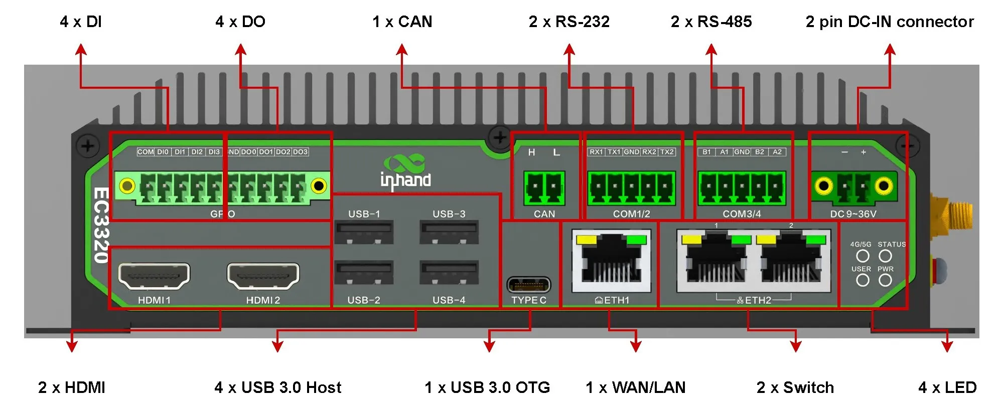

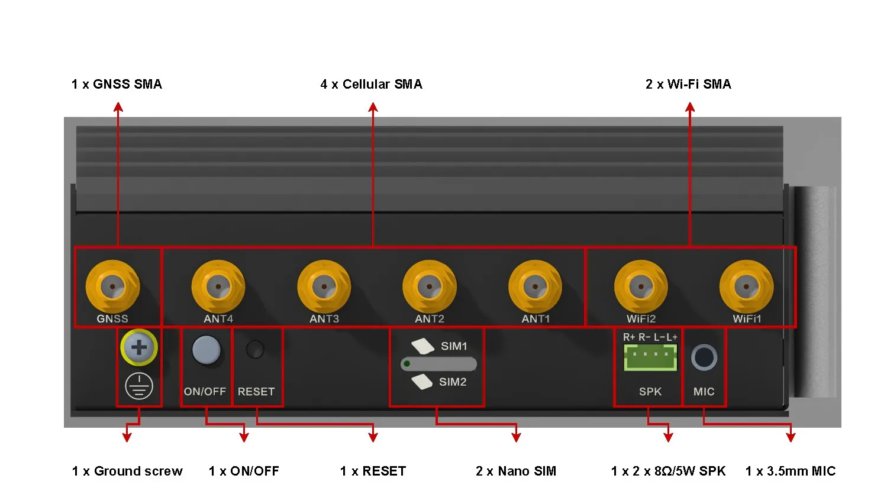

> 各接口详细引脚定义见 §2.5；指示灯含义见 §2.3。

---

### 步骤 2：将设备固定到导轨或柜内

将 EC3000 的 DIN 导轨安装板上方挂钩卡入导轨顶端，再缓慢向前推，使底端卡入到位即可。

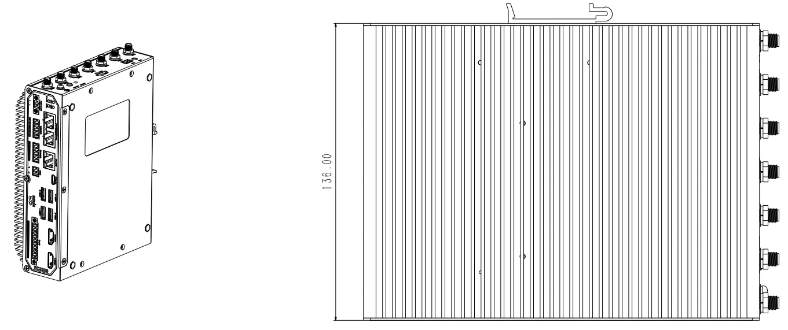

> 如需壁挂安装，详见 §2.4.3；拆卸方式见 §2.4.2。

---

### 步骤 3：连接电源与以太网

将 DC 电源线接入侧面板的直流输入接口，再将网线接入 **ETH1** 或 **ETH2** 网口。

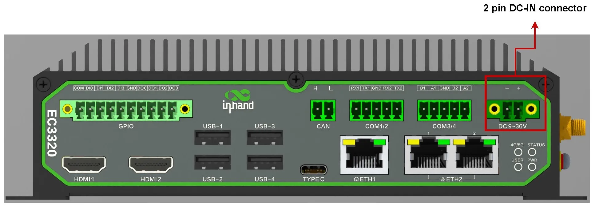

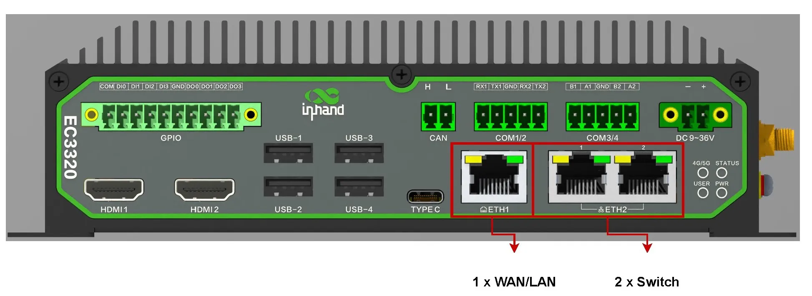

> 供电参数详见 §2.6；网口 LED 行为详见 §2.5.1；串口引脚详见 §2.5.2。

---

### 步骤 4：（若使用蜂窝）断电装 SIM，并接好天线

**务必在断电状态下操作。** 用配件盒中的取卡针按压 SIM 卡槽旁小孔，取出托盘，放入 Nano SIM 卡后推回插槽。按壳体丝印将蜂窝天线、Wi-Fi 天线、GNSS 天线拧紧到对应接口。

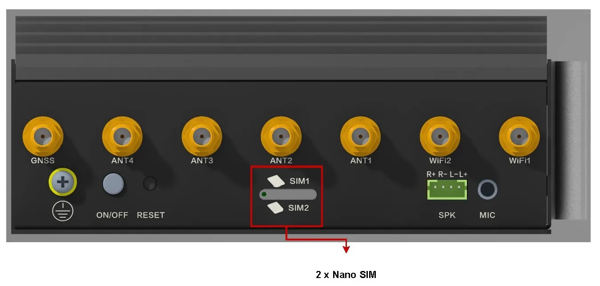

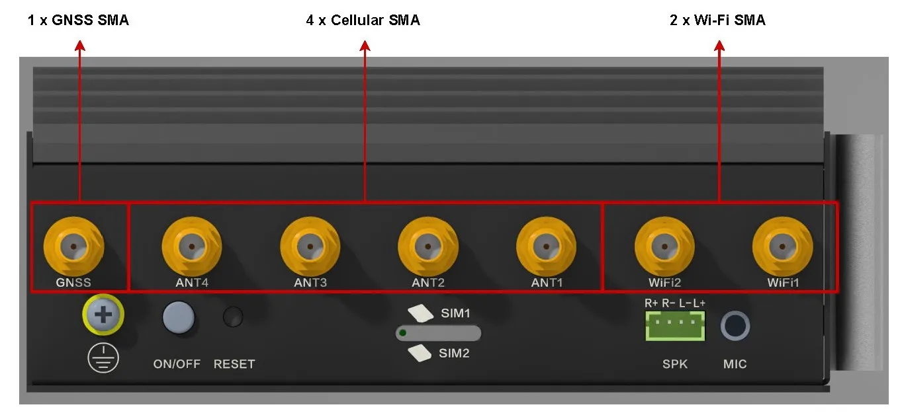

> 天线丝印与名称对照表见 §2.5.6；SIM 卡安装详情见 §2.5.6。

---

### 步骤 5：上电，确认设备已就绪

接通电源后，观察前面板指示灯：

- **PWR 红灯常亮** → 系统已开机
- **STATUS 绿灯约 1 Hz 慢闪** → 系统运行正常
- **4G/5G 绿灯常亮** → 蜂窝网络已连接（若使用蜂窝）

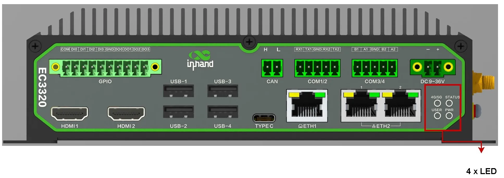

> 各指示灯完整含义与闪烁频率定义见 §2.3。

---

### 步骤 6：PC 登录系统（HDMI 或 SSH）

**方式一：HDMI 直连**

通过 **HDMI1** 或 **HDMI2** 接口将设备与显示器连接，将键盘及鼠标接入设备的 USB 3.0 Host 接口。给设备上电后等待启动完成。查看设备底面铭牌，查找系统默认用户名和密码。

在登录界面选择 **System User** 对应的账户，输入密码后登录。

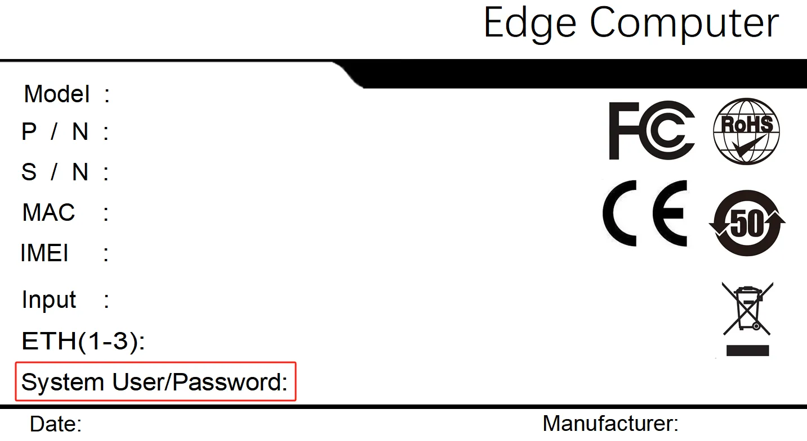

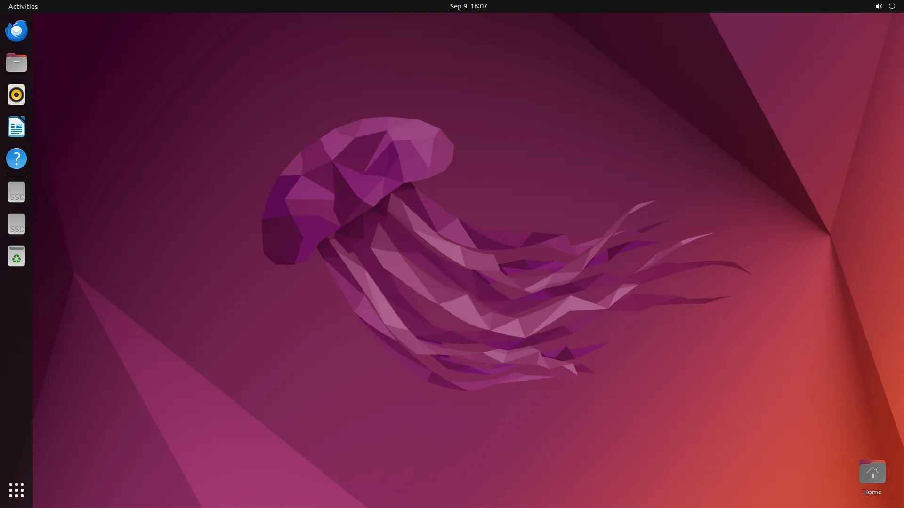

**方式二：SSH 远程连接**

使用 SSH 连接设备前，需保证设备网络可访问。查看设备底面铭牌，查找系统默认以太网地址，将 PC 配置为与设备同一网段。

打开 SSH 终端工具（以 MobaXterm 为例），输入设备地址点击连接。

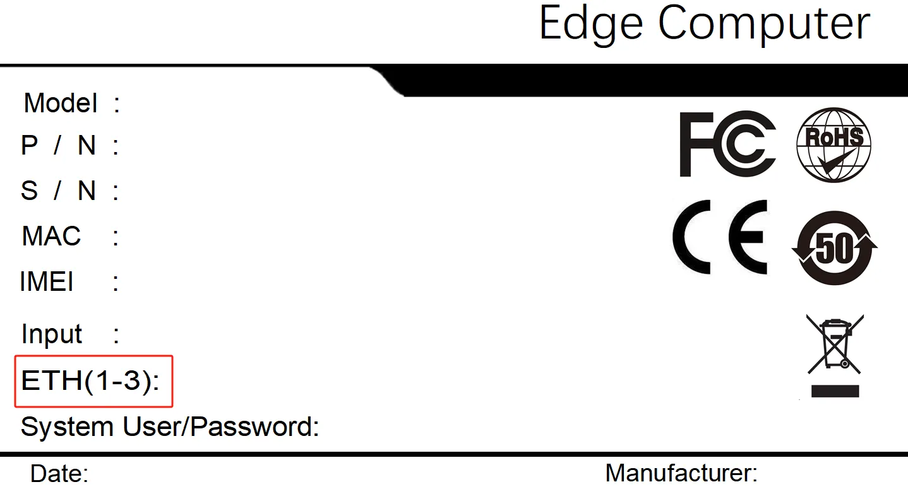

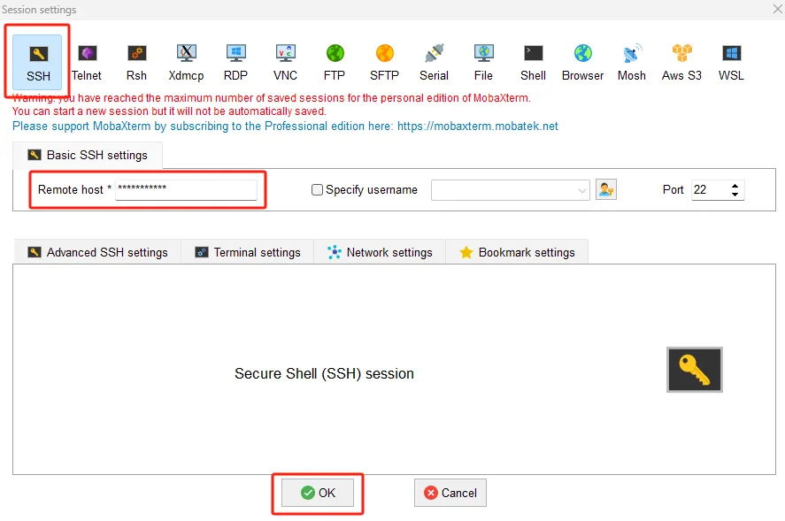

根据提示内容，输入默认账户和密码。

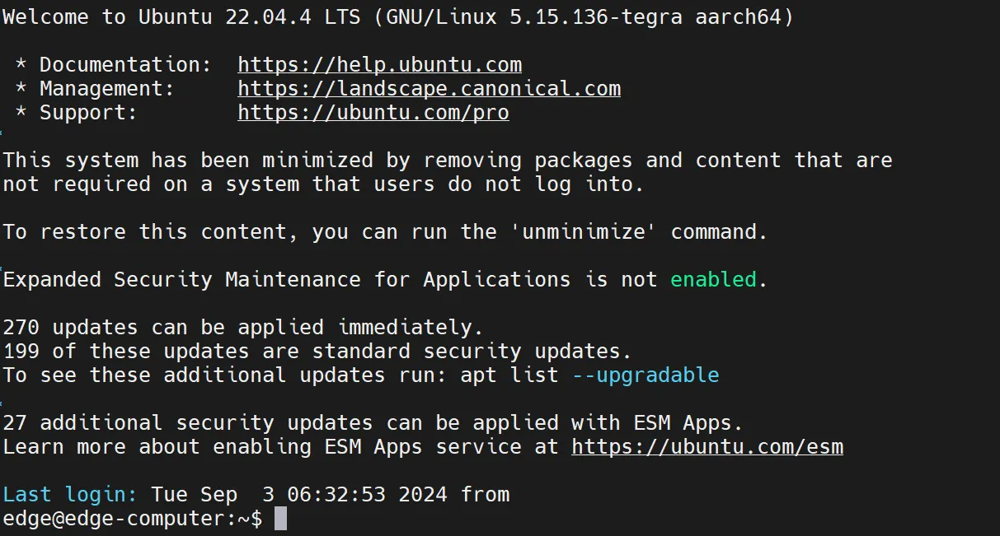

> 首次登录与恢复出厂的详细说明见 §2.7。

---

### 装完自检

- ☐ 设备已固定（导轨或壁挂）。  
- ☐ 电源、网线已接好；若用蜂窝，SIM 与天线已就位。  
- ☐ **PWR 红灯常亮**且 **STATUS 绿灯慢闪**。  
- ☐ HDMI 或 SSH 已能正常登录系统。

如无法登录或灯态异常，请检查接线与供电。恢复出厂操作见 §2.7。

---

## 第二部分：详细说明

### 2.1 装箱清单

**标准配件**

| 序号 | 名称 | 数量 | 单位 | 备注 |
| :---: | --- | :---: | :---: | --- |
| 1 | EC3000 主机 | 1 | 台 | — |
| 2 | 取卡针 | 1 | 个 | — |
| 3 | 产品保修卡 | 1 | 张 | — |

**可选配件**

| 序号 | 名称 | 数量 | 单位 | 备注 |
| :---: | --- | :---: | :---: | --- |
| 1 | 电源适配器 | 1 | 个 | 选配 |
| 2 | Wi-Fi 天线 | 1 | 个 | 标配（根据型号而定） |
| 3 | GNSS 天线 | 1 | 个 | 标配（根据型号而定） |
| 4 | 蜂窝天线 | 1 | 个 | 标配（根据型号而定） |

> 具体型号对应的天线支持情况可参见《EC3000 系列边缘计算机产品规格书》中"订购信息"部分。

---

### 2.2 产品结构与标识

#### 2.2.1 前面板

前面板包含：PWR / STATUS / USER / 4G-5G 指示灯、2 个以太网接口、4 个串行接口、1 个 CAN 接口、4 个数字量输入、4 个数字量输出、4 个 USB 3.0 Host Type-A 接口、2 个 HDMI 接口。

#### 2.2.2 侧面板

侧面板包含：直流电源输入接口、SIM 卡槽、系统接地螺丝、RESET 针孔按键、ON/OFF 开关机按键、7 个天线接口。

#### 2.2.3 其他接口

**USB 3.0 OTG Type-C**

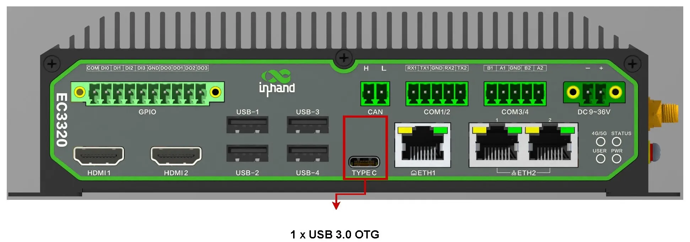

EC3000 提供 1 个 USB 3.0 OTG Type-C 接口。

**麦克风接口**

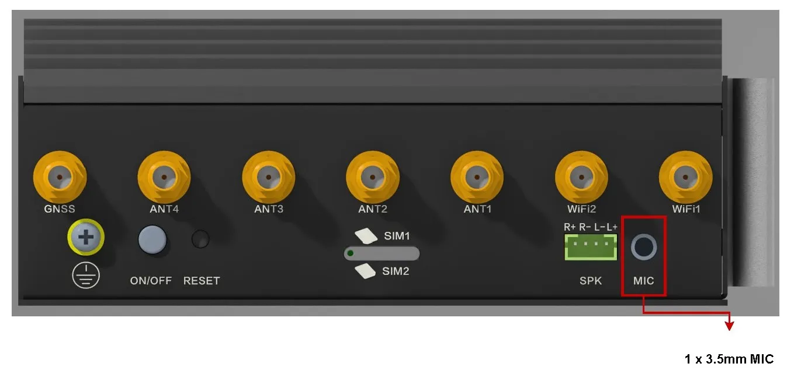

提供 1 个麦克风接口，支持 3.5 mm 标准音频输入。

**扬声器接口**

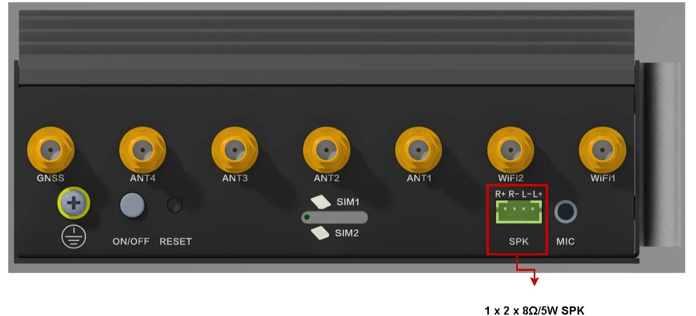

提供 1 个扬声器输出接口 **SPK**，支持 **2 × 8 Ω / 5 W**。

**HDMI 接口**

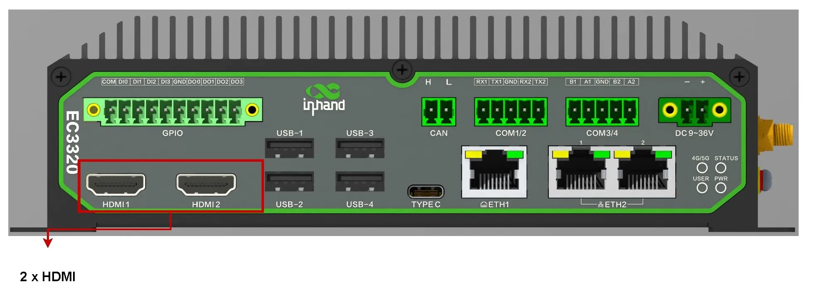

提供 2 个 HDMI 接口供外接屏幕使用，最高分辨率 **4096 × 2304 @ 60 Hz**（4K @ 60 Hz）。

**接地螺丝**

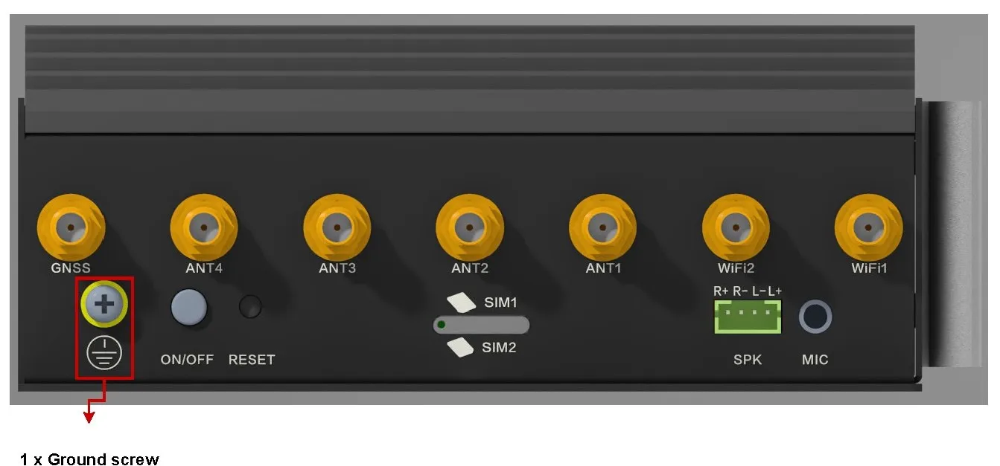

提供 1 个系统接地螺丝，请使用绿黄双色的接地线（**16 AWG**）并搭配系统接地螺丝接地。

**扩展插槽**

EC3000 支持以下扩展：

- 1 × M.2 M-KEY 2242/2280（Hailo-8 AI 模组 / NVMe SSD）
- 1 × M.2 B-KEY 2242（SATA3.0 SSD）

---

### 2.3 指示灯与复位键

#### 2.3.1 运行状态指示灯

| 标识 | 名称 | 定义 |
| --- | --- | --- |
| PWR | 电源指示灯 | 红色 LED。亮起表示系统处于开机状态；熄灭表示系统处于关机状态。 |
| STATUS | 系统运行状态指示灯 | 绿色 LED。约 **1 Hz 慢闪** 表示系统运行正常；熄灭表示系统未运行。 |
| USER | 用户可编程指示灯 | 绿色 LED。可由用户编程实现 LED 状态逻辑。 |
| 4G/5G | 蜂窝网连接状态指示灯 | 绿色 LED。常亮表示蜂窝网络连接成功；闪烁表示蜂窝网络未连接。 |

> **闪烁频率定义**：常亮/常灭指至少保持约 3 s；慢闪约 1 Hz；快闪约 5 Hz。

#### 2.3.2 蜂窝信号状态灯

EC3000 的 **4G/5G** 指示灯仅指示蜂窝网络连接状态，无信号格数分级显示。

| 灯态 | 含义 |
| --- | --- |
| 常亮 | 蜂窝网络连接成功 |
| 闪烁 | 蜂窝网络未连接 |

#### 2.3.3 复位键与开关机键

**RESET 针孔按键**

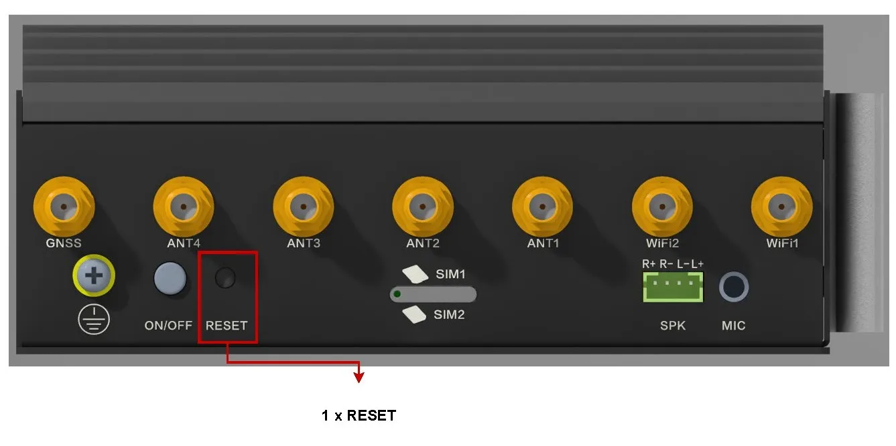

RESET 按键用于硬件恢复出厂，位于右面板（见 §2.2.2）。恢复出厂的详细步骤见 §2.7。

**ON/OFF 开关机按键**

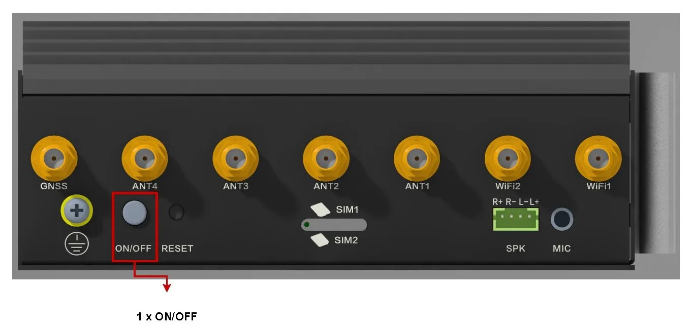

- 系统正常运行时**轻触** ON/OFF 按键，系统将提示是否关机，在显示器上点击确认将关闭系统（倒计时 60 秒内未选择将强制关机）。
- 系统正常运行时**长按** ON/OFF 按键 6 秒以上将强制关机。
- 系统关闭时**轻触** ON/OFF 按键，系统将启动。

---

### 2.4 机械安装

#### 2.4.1 DIN 导轨

EC3000 的 DIN 导轨安装板附在下面板上。

1. 将 DIN 导轨安装板的上方挂钩卡入到 DIN 轨支架的顶端。
2. 缓慢向 DIN 轨支架方向向前推动设备，使得 DIN 轨底端卡入到位。

#### 2.4.2 壁挂

EC3000 可以采用壁挂套件进行安装，套件需要单独购买。

先将套件用螺钉固定在设备的下面板上，再用螺钉将设备固定到墙面或柜体。

1. 使用螺钉将壁挂套件固定在 EC3000 的下面板上。
2. 当壁挂套件成功固定到 EC3000 以后，使用螺钉将 EC3000 固定在墙面或柜子上。

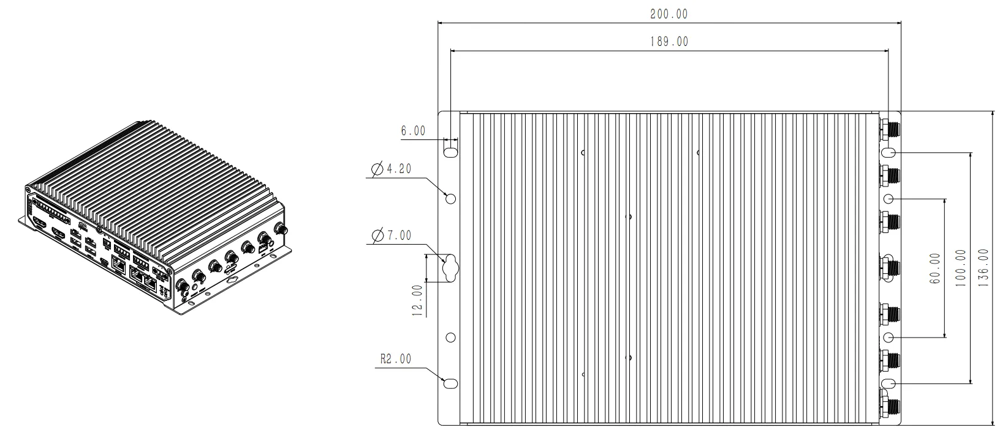

---

### 2.5 连接与布线

#### 2.5.1 以太网

EC3000 提供 2 个以太网接口。ETH1 为独立以太网接口，ETH2 接口为 2 个交换口。

每个网口上方各有 2 个 LED 灯：

**绿色 LED（速率指示）**

| 状态 | 含义 |
| --- | --- |
| OFF | 1. 无连接 2. 速率 10 Mbps 3. 速率 100 Mbps |
| ON | 速率 1000 Mbps |
| Blinking | — |

**橙色 LED（通信指示）**

| 状态 | 含义 |
| --- | --- |
| OFF | 1. 无连接 2. 端口无数据活动 |
| ON | — |
| Blinking | 端口有数据活动 |

> 在网络 Link up 后，且接口速率为 1000 Mbps 时绿色 LED 亮起；在网络 Link up 时若有数据通信则橙色 LED 闪烁。

---

#### 2.5.2 电源与串口

**直流电源输入**

EC3000 支持的电压范围为 **9 V DC 至 36 V DC**。

**串口**

EC3000 支持 4 路串口，前 2 路为 RS-232，后 2 路为 RS-485。

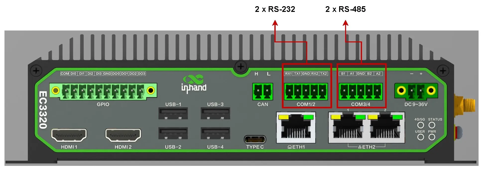

|  | RS-232 | RS-485 |
| :---: | :---: | :---: |
| COM1 | RX1 TX1 GND |  |
| COM2 | RX2 TX2 GND |  |
| COM3 |  | B1 A1 GND |
| COM4 |  | B2 A2 GND |

---

#### 2.5.3 CAN 总线

EC3000 具有 1 路 CAN 总线接口，支持 **CAN 2.0A/B** 标准，最高速率 **1 Mbps**。

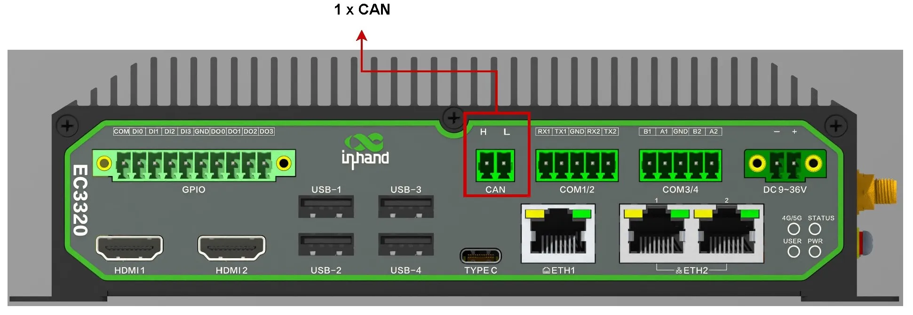

---

#### 2.5.4 数字量输入

EC3000 有 4 个隔离式数字量输入接口，支持干湿接点。

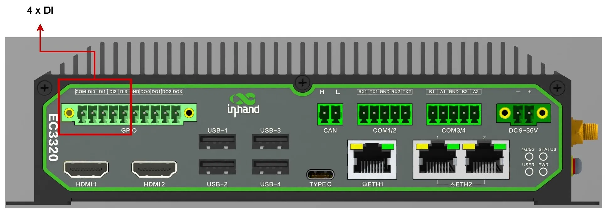

接线方式：

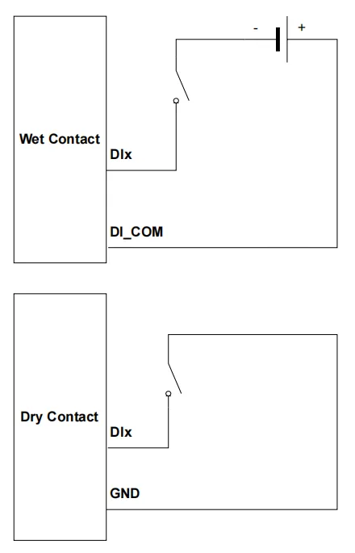

| 项目 | 规格 |
| --- | --- |
| 输入通道数 | 4 |
| 光隔离 | 2500 VDC |
| 输入电压（干接点） | Logic 1：Open Logic 0：Close to ground |
| 输入电压（湿接点） | VIH(max.) = 60 VDC VIH(min.) = 5 VDC VIL(max.) = 2 VDC |

---

#### 2.5.5 数字量输出

EC3000 有 4 个隔离式数字量输出接口，为开漏输出模式。

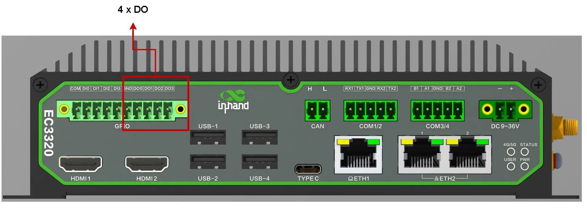

接线方式：

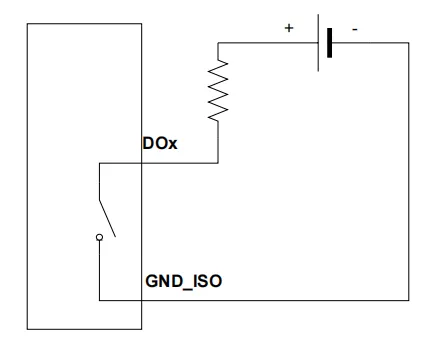

| 项目 | 规格 |
| --- | --- |
| 输出通道数 | 4 |
| 光隔离 | 500 VDC |
| 供电电压 | Sink 40 VDC |
| 灌电流 | 0.2 A max./Channel |

---

#### 2.5.6 蜂窝 SIM 与天线

**SIM 卡**

EC3000 有 1 个 SIM 卡槽，支持 2 张 Nano SIM 卡。当使用蜂窝网功能时请至少插入 1 张可用 SIM 卡。**SIM 卡需要在断电状态下安装。**

取出配件盒子中的取卡针，按压对应取卡针孔取出对应 SIM 卡托盘。将 SIM 卡安装到 SIM 卡托盘中，将托盘按压回插槽即可完成 SIM 卡的安装。

**天线**

EC3000 共有 7 个天线接口，不同型号标配的天线数量不同。

| 标识 | 名称 |
| --- | --- |
| WiFi1 | Wi-Fi 天线 |
| WiFi2 | Wi-Fi 天线 |
| ANT1 | 4G LTE 主天线 / 5G 天线 |
| ANT2 | 4G LTE 分集接收天线 / 5G 天线 |
| ANT3 | 5G 天线 |
| ANT4 | 5G 天线 |
| GNSS | GNSS 天线 |

> 具体型号对应的天线支持情况可参见《EC3000 系列边缘计算机产品规格书》中"订购信息"部分。

---

#### 2.5.7 USB

EC3000 提供 4 个 USB 3.0 Host Type-A 接口，每路 USB 可提供最大功率 **5 W（5 V / 1 A）**。

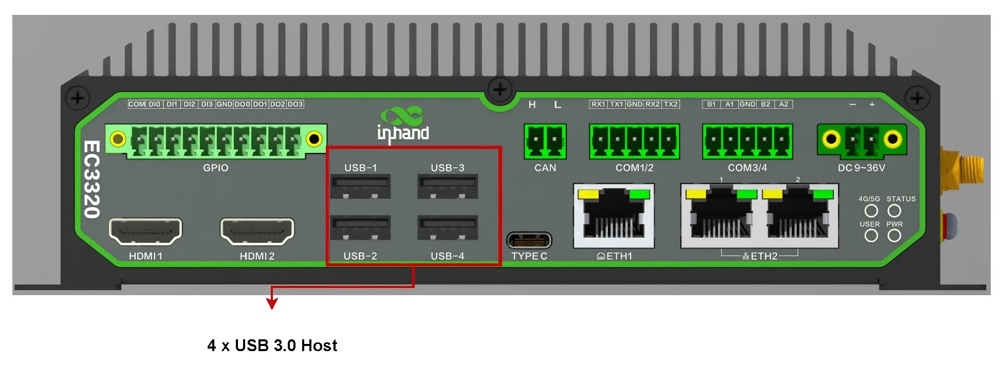

USB 3.0 OTG Type-C 接口见 §2.2.3。

> **注意**：在断开 USB 大容量存储设备之前，请记住输入 **sync** 同步命令，以防止数据丢失。当您断开存储设备的连接时，请从 `/media/*` 目录下退出。如果您留在 `/media/usb*` 中，则自动卸载过程将会失败。如果发生这种情况，请键入 `umount /media/usb*` 以手动卸载设备。

---

### 2.6 供电与环境（速查）

| 项目 | 规格 |
| --- | --- |
| 输入电压 | 9～36 V DC |
| 空闲功率 | 5 W |
| 满载功率 | 30 W |
| 工作温度 | -20～60 ℃ |
| 存储温度 | -40～85 ℃ |
| 工作湿度 | 95% @ 40 ℃（无凝结） |

---

### 2.7 首次登录与恢复出厂

#### 2.7.1 HDMI 直连登录

通过 HDMI1 或 HDMI2 接口将设备和显示器连接，将键盘及鼠标接入设备 USB 3.0 Host 接口，给设备上电后等待设备启动完成。查看设备底面铭牌，查找系统默认用户名和密码。

登录界面选择 **System User** 对应的账户，输入密码后登录。

#### 2.7.2 SSH 远程登录

使用 SSH 连接设备，需要保证设备网络可以访问。查看设备底面铭牌，查找系统默认以太网地址并配置主机和设备在同一个网段。

打开 SSH 终端工具（MobaXterm 为例），输入设备地址点击连接。

根据提示内容，输入默认账户和密码。

> 默认以太网地址详见设备底面铭牌，原文未给出具体默认值。

#### 2.7.3 恢复出厂

RESET 针孔按键位于右面板（见 §2.2.2）。

1. **运行中恢复**：在系统正常运行时按住 RESET 约 10 秒，等待 STATUS 灯由闪烁变为常亮后松开，设备将进入系统重置状态（恢复为出厂状态）。
2. **上电前恢复**：在上电之前按住 RESET 键，然后上电，持续按住约 5 秒，直到 STATUS 灯长亮后 5 秒内松开，设备将进入系统重置状态（恢复为出厂状态）。

---

### 2.8 相关文档

| 需求 | 去向 |
|------|------|
| 产品介绍、USB 详解、配置与排障 | 《EC3000 用户手册》 |
| 订购信息、天线型号、技术规格 | 《EC3000 系列边缘计算机产品规格书》 |
| 软件下载与公告 | [映翰通官网](http://www.inhand.com.cn) |

---

### 2.9 法律信息

**版权声明**

© 2024 映翰通网络 保留所有权利。

**商标**

InHand 标志是映翰通网络的注册商标。

本手册中的所有其他商标或注册商标属于其各自的制造商。

**免责声明**

本公司保留对此手册更改的权利，产品后续相关变更时，恕不另行通知。对于任何因安装、使用不当而导致的直接、间接、有意或无意的损坏及隐患概不负责。
