# EC3000用户手册

## 前置信息

### 声明

首先非常感谢您选择本公司产品！在使用前，请您仔细阅读本用户手册，遵守以下声明，将有助于维护知识产权和法律合规性，以确保您的使用体验与产品的最新信息相一致。如有任何疑问或需要获取书面许可，请随时联系我们的技术支持团队。

- 版权声明

本用户手册包含受版权保护的内容，版权归北京映翰通网络技术股份有限公司及其许可者所有。未经书面许可，任何单位和个人不得擅自摘抄、复制本手册的部分或全部内容，且不得以任何形式传播。

- 免责声明

由于产品技术和规格不断更新，本公司不能承诺用户手册中的资料与实际产品完全一致。因此，不承担由于实际技术参数与用户手册不符而引起的任何争议。任何关于产品的改动恕不提前通知，本公司保留最终更改权和解释权。

- 版权信息

本用户手册内容受版权法律保护，版权归北京映翰通网络技术股份有限公司及其许可者所有，保留一切权利。未经书面许可，不得擅自使用、复制或传播本手册的内容。

### 图形界面约定

| 符号 | 含义 | 示例 |
|------|------|------|
| `< >` | 表示变量或参数，需替换为实际值 | `<IP地址>` 表示需填入具体IP |
| `" "` | 表示界面上的文字标签 | 点击"保存"按钮 |
| `→` | 表示菜单层级或操作顺序 | 【网络】→【蜂窝】 |
| `【 】` | 表示菜单或页面名称 | 进入【系统设置】页面 |

### 技术支持

**北京映翰通网络技术股份有限公司（总部）**

电话：010-8417 0010

地址：北京市朝阳区紫月路18号院3号楼5层

**成都办事处**

电话：028-8679 8244

地址：四川省成都市武侯区天府大道北段1777号中国太平金融大厦14层

**广州办事处**

电话：020-8562 9571

地址：广州市天河区棠东东路5号远洋新三板创意园B-130单元

**武汉办事处**

电话：027-8716 3566

地址：湖北省武汉市洪山区珞瑜东路2号巴黎豪庭11栋2001室

**上海办事处**

电话：021-5480 8501

地址：上海市普陀区顺义路18号1103室

### 如何使用本手册

**对号入座**

- 首次使用用户：建议按顺序阅读「认识设备」→「安装与首次使用」→「常用场景配置」→「功能说明与参数参考」
- 已有设备用户：可直接查阅「功能说明与参数参考」或「附录 故障处理」
- 云平台管理用户：可查阅「常用场景配置」中的设备远程管理平台（如适用）

**按任务快速跳转**

| 任务 | 对应章节 | 预计用时 |
|------|----------|----------|
| 了解设备外观与接口 | [认识设备](#第1章-认识设备) | 约5分钟 |
| 安装设备并首次上电 | [安装与首次使用](#第2章-安装与首次使用) | 约15分钟 |
| 通过HDMI连接登录设备 | [场景1：通过HDMI连接并登录设备](#场景1通过hdmi连接并登录设备) | 约5分钟 |
| 通过SSH远程连接设备 | [场景2：通过SSH远程连接设备](#场景2通过ssh远程连接设备) | 约5分钟 |
| 配置以太网接口 | [场景3：配置以太网接口](#场景3配置以太网接口) | 约5分钟 |
| 配置Wi-Fi客户端连接 | [场景4：配置Wi-Fi客户端连接](#场景4配置wi-fi客户端连接) | 约5分钟 |
| 配置蜂窝网络接入互联网 | [场景5：配置蜂窝网络接入互联网](#场景5配置蜂窝网络接入互联网) | 约10分钟 |
| 升级系统固件 | [场景6：系统固件升级](#场景6系统固件升级) | 约10分钟 |
| 查看功能参数与操作说明 | [功能说明与参数参考](#第4章-功能说明与参数参考) | 按需 |
| 排查常见故障 | [附录 故障处理](#附录-故障处理) | 按需 |

---

## 第1章 认识设备

### 1.1 概述

EC3000系列边缘AI计算机搭载RK3588平台，可选配Hailo-8 AI加速模组，提供6 TOPS INT8算力，适用于边缘AI推理与计算场景。设备集成ARM Cortex-A76（4核）与Cortex-A55（4核）处理器，最高主频2.4GHz，配备8GB内存及64GB板载eMMC存储。系统提供丰富的工业接口：2路RS-232串口、2路RS-485串口、1路CAN 2.0接口、4路隔离式数字量输入、4路隔离式数字量输出、2路千兆以太网接口、4路USB 3.0 Host、1路USB 3.0 OTG、2路HDMI输出、1路麦克风输入、1路扬声器输出，并支持双Nano SIM蜂窝网络、Wi-Fi/BLE及GNSS。设备采用DC 9-36V宽电压供电，支持导轨安装与壁挂安装，工作温度范围为-20℃至60℃，适用于工业物联网、智能边缘计算等场景。

### 1.2 包装清单

| 物品 | 数量 | 说明 |
|------|------|------|
| EC3000主机 | 1台 | — |
| 电源适配器 | 1个 | 选配 |
| Wi-Fi天线 | 1个 | 标配（根据型号而定） |
| GNSS天线 | 1个 | 标配（根据型号而定） |
| 蜂窝天线 | 1个 | 标配（根据型号而定） |
| 取卡针 | 1个 | — |
| 产品保修卡 | 1张 | — |

### 1.3 外观与接口

<p align="center">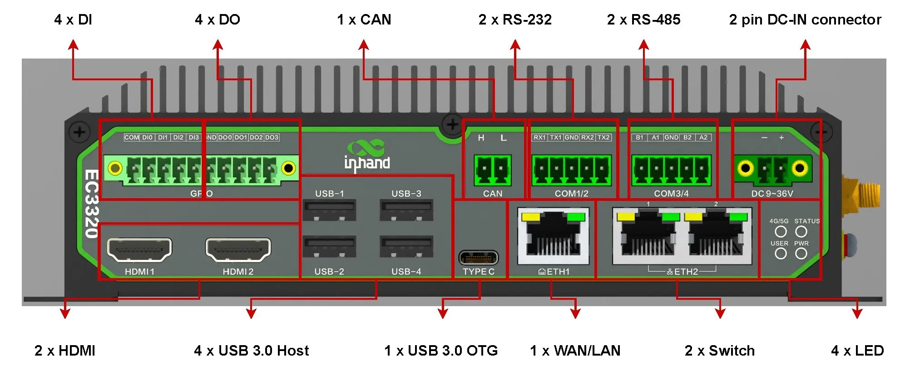</p>
<p align="center"><strong>图 1-1 设备前面板</strong></p>

<p align="center">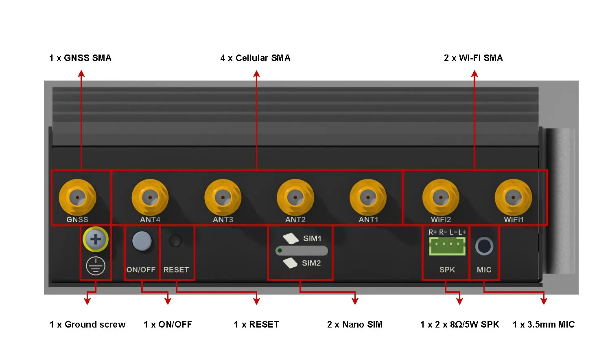</p>
<p align="center"><strong>图 1-2 设备侧面板</strong></p>

<p align="center">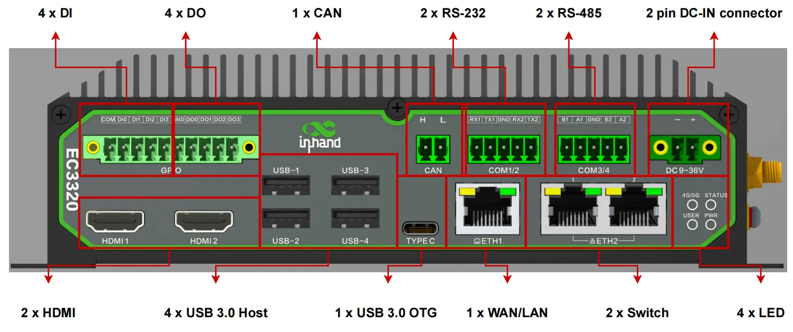</p>
<p align="center"><strong>图 1-3 系统接口信息</strong></p>

| 接口 | 位置 | 功能说明 |
|------|------|----------|
| PWR电源指示灯 | 前面板 | 红色LED，指示系统开机状态 |
| STATUS系统运行状态指示灯 | 前面板 | 绿色LED，闪烁（1Hz）表示系统运行正常 |
| 4G/5G网络状态指示灯 | 前面板 | 绿色LED，指示蜂窝网络连接状态 |
| USER可编程灯 | 前面板 | 绿色LED，可由用户编程控制 |
| 直流电源输入 | 前面板 | DC 9-36V，建议功率≥36W |
| RS-232串口（COM1/COM2） | 前面板 | 2路RS-232，5PIN工业端子 |
| RS-485串口（COM3/COM4） | 前面板 | 2路RS-485，5PIN工业端子 |
| 以太网接口（ETH1/ETH2） | 前面板 | 2路10/100/1000Mbps，ETH1为独立接口，ETH2为2个交换口 |
| USB 3.0 Host | 前面板 | 4路Type-A接口，每路最大功率5W（5V/1A） |
| USB 3.0 OTG | 前面板 | 1路Type-C接口 |
| CAN 2.0 | 前面板 | 1路CAN接口，支持CAN 2.0A/B，最高速率1Mbps |
| HDMI | 前面板 | 2路HDMI输出，最高分辨率4096×2304@60Hz |
| 数字量输入（DI0-DI3） | 前面板 | 4路隔离式数字量输入，支持干湿节点 |
| 数字量输出（DO0-DO3） | 前面板 | 4路隔离式数字量输出，开漏输出模式 |
| 麦克风接口 | 右面板 | 3.5mm标准音频输入 |
| 扬声器输出（SPK） | 右面板 | 支持2×8Ω/5W |
| SIM卡槽 | 右面板 | 支持2个Nano SIM卡 |
| RESET针孔按键 | 右面板 | 系统重置，恢复出厂状态 |
| ON/OFF开关按键 | 右面板 | 系统开/关机控制 |
| 接地螺丝 | 右面板 | 系统接地，建议16AWG绿黄双色接地线 |
| SMA天线接口 | 右面板 | 7个SMA接头，用于GNSS、蜂窝、Wi-Fi |
| 扩展接口 | 内部 | M.2 M-KEY 2242/2280（Hailo-8 AI模组/NVMe SSD）、M.2 B-KEY 2242（SATA3.0 SSD） |

### 1.4 指示灯说明

<p align="center">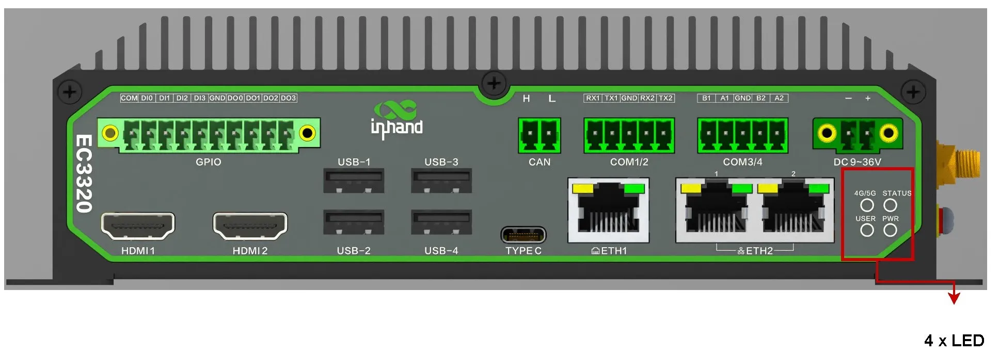</p>

<p align="center"><strong>图 1-4 指示灯位置</strong></p>

| 指示灯 | 状态 | 含义 |
|--------|------|------|
| PWR | 常亮 | 系统处于开机状态 |
| | 熄灭 | 系统处于关机状态 |
| STATUS | 绿色闪烁（1Hz） | 系统运行正常 |
| | 熄灭 | 系统未运行 |
| 4G/5G | 绿色常亮 | 蜂窝网络连接成功 |
| | 绿色闪烁 | 蜂窝网络未连接 |
| USER | — | 由用户编程实现LED状态逻辑，无固定状态定义 |

以太网接口指示灯说明：

| 指示灯 | 状态 | 含义 |
|--------|------|------|
| Green LED | 熄灭 | 未连接，或速率为10/100Mbps |
| | 绿色常亮 | 速率为1000Mbps |
| Orange LED | 熄灭 | 未连接或无数据通信 |
| | 橙色闪烁 | 有数据通信 |

### 1.5 恢复出厂设置

设备提供三种恢复出厂设置方式：

**页面重置**

1. 登录IEOS Web管理界面。
2. 进入【系统管理】→【其他】。
3. 选择"系统重置"，点击"重置"按钮。

**按键重置**

1. 在系统正常运行时，按住RESET针孔按键10秒，等待STATUS灯由闪烁变为常亮后松开，设备进入系统重置状态。
2. 或在设备上电前按住RESET键，此后上电并持续按住约5秒，直到STATUS灯长亮后5秒内松开，设备进入系统重置状态。

> **注意**：按键重置功能默认启用，可通过命令 `sudo update resetkey <enable/disable>` 禁用或启用。使用 `sudo update resetkey` 可查看当前启用状态。

**命令重置**

1. 通过SSH或本地终端登录设备。
2. 执行以下命令：

```
sudo update reset
```

### 1.6 默认设置

| 参数 | 默认值 | 说明 |
|------|--------|------|
| IEOS Web用户名 | adm | IEOS Web管理初始账户 |
| IEOS Web密码 | 123456 | IEOS Web管理初始密码 |
| 系统默认用户名 | 见设备底面铭牌 | System User账户名 |
| 系统默认密码 | 见设备底面铭牌 | System User密码 |
| 默认以太网地址 | 见设备底面铭牌 | ETH1接口默认IP地址 |
| IEOS管理程序 | 启用 | 出厂默认启用IEOS，接管网络与系统管理 |

---

## 第2章 安装与首次使用

### 2.1 安装前准备

**环境要求**

| 项目 | 要求 |
|------|------|
| 输入电压 | DC 9-36V |
| 功率 | 建议≥36W |
| 工作温度 | -20℃~60℃ |
| 工作湿度 | 95%@40℃（无凝结） |
| 存储温度 | -40℃~85℃ |

**工具准备**

| 工具 | 说明 |
|------|------|
| 电源适配器 | DC 9-36V，建议功率≥36W |
| 导轨或壁挂套件 | 根据安装方式选配 |
| HDMI线及显示器 | 用于HDMI方式连接 |
| 键盘、鼠标 | 用于HDMI方式操作 |
| 网线 | 用于SSH或网络配置 |
| 蜂窝/Wi-Fi/GNSS天线 | 根据型号功能选配 |
| Nano SIM卡 | 如需蜂窝功能，准备运营商SIM卡 |
| 接地线 | 16AWG绿黄双色接地线 |

> **警告**：电源连接前需确认电压符合设备规格要求（DC 9-36V），否则可能导致设备损坏。

> **注意**：SIM卡安装需在断电状态下进行。

> **注意**：设备安装须由专业人员操作，只使用铜导体，需选择合适的线径。

### 2.2 安装指南

#### 2.2.1 DIN导轨安装

DIN导轨安装板附在EC3000的下面板上，安装步骤如下：

1. 将DIN导轨安装板的上方挂钩卡入DIN轨支架的顶端。
2. 缓慢向DIN轨支架方向推动设备，使DIN轨底端卡入到位。

<p align="center"></p>

<p align="center"><strong>图 2-1 DIN导轨安装</strong></p>

#### 2.2.2 壁挂式安装

EC3000可采用壁挂套件进行安装，套件需单独购买。

1. 使用螺钉将壁挂套件固定在EC3000的下面板上。
2. 使用螺钉将EC3000固定在墙面或柜子上。

<p align="center">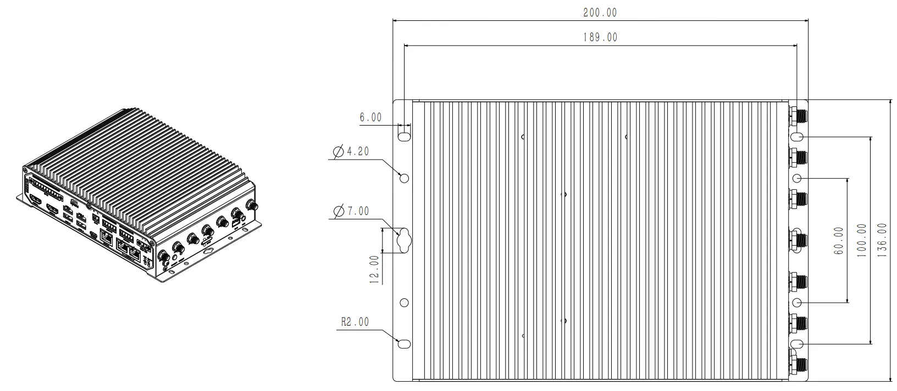</p>

<p align="center"><strong>图 2-2 壁挂式安装</strong></p>

#### 2.2.3 电源连接

1. 将DC电源线连接至前面板的直流电源输入接口。
2. 确认电压范围为9VDC至36VDC，建议功率≥36W。
3. 上电后，PWR指示灯应红色常亮，STATUS指示灯应绿色闪烁（1Hz）。

<p align="center">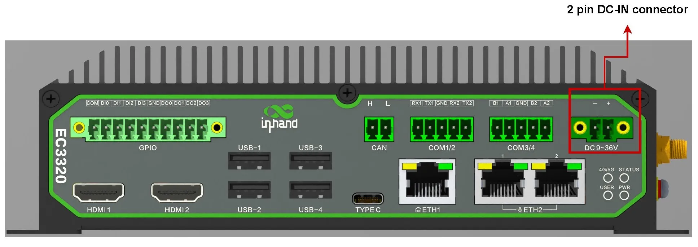</p>

<p align="center"><strong>图 2-3 直流电源输入接口</strong></p>

> **注意**：系统运行允许的电压范围为9VDC至36VDC，建议电源功率≥36W。

#### 2.2.4 SIM卡安装

1. 确保设备处于断电状态。
2. 使用取卡针按压SIM卡槽取卡针孔，取出SIM卡托盘。
3. 将Nano SIM卡安装到托盘中（最多2张）。
4. 将托盘按压回插槽。

<p align="center">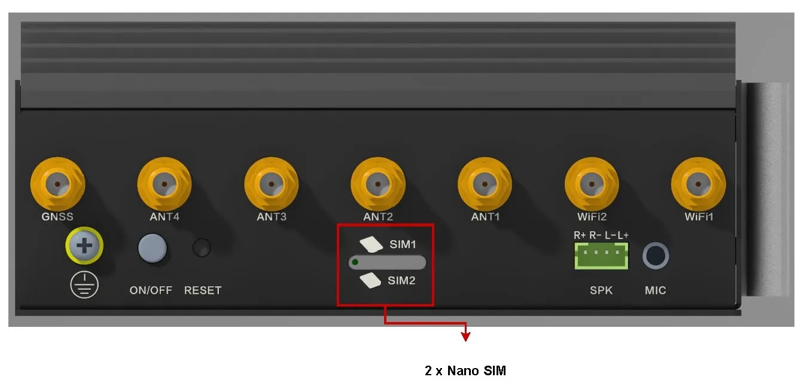</p>

<p align="center"><strong>图 2-4 SIM卡安装</strong></p>

> **注意**：SIM卡安装必须在断电状态下进行。

#### 2.2.5 首次访问

**方式一：通过HDMI连接**

1. 通过HDMI1或HDMI2接口将设备与显示器连接。
2. 将键盘及鼠标接入设备的USB 3.0 Host接口。
3. 给设备上电，等待系统启动完成。
4. 在登录界面选择System User对应的账户，输入密码后登录。

<p align="center"></p>

<p align="center"><strong>图 2-5 连接HDMI和外设</strong></p>

<p align="center"></p>

<p align="center"><strong>图 2-6 登录界面</strong></p>

<p align="center"></p>

<p align="center"><strong>图 2-7 登录成功</strong></p>

**方式二：通过SSH连接**

1. 使用网线将PC与设备ETH1接口连接。
2. 查看设备底面铭牌，获取默认以太网地址。
3. 将PC的IP地址配置为与设备同一网段。
4. 打开SSH终端工具，输入设备地址并连接。
5. 根据提示输入默认账户和密码。

<p align="center"></p>

<p align="center"><strong>图 2-8 设备底面铭牌</strong></p>

<p align="center">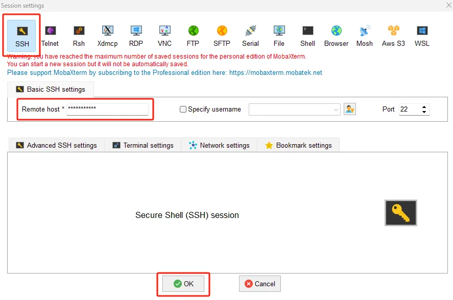</p>

<p align="center"><strong>图 2-9 SSH终端工具</strong></p>

<p align="center"></p>

<p align="center"><strong>图 2-10 SSH登录</strong></p>

<p align="center"></p>

<p align="center"><strong>图 2-11 SSH密码输入</strong></p>

**方式三：IEOS Web管理界面**

1. 通过网线将PC与设备连接，并配置同网段IP地址。
2. 在浏览器地址栏输入 `https://<设备IP>:9100`。
3. 输入用户名 `adm` 和密码 `123456`，点击"Login"登录。

> **注意**：IEOS使用9100端口作为HTTPS连接端口，不支持HTTP访问；使用HTTP访问时将自动跳转至HTTPS。

> **重要说明**：使用IEOS程序管理网络配置和系统配置时，若同时使用Linux原生命令，二者可能相互影响，导致异常运行状态。建议IEOS支持的配置都通过IEOS Web实现管理。

### 2.3 快速检查

完成安装后，建议按以下清单进行验证：

- [ ] 设备已牢固安装于DIN轨或墙面
- [ ] 电源线已正确连接，电压在9-36VDC范围内
- [ ] PWR指示灯红色常亮，STATUS指示灯绿色闪烁
- [ ] 如使用蜂窝功能，SIM卡已正确安装，天线已连接
- [ ] 可通过HDMI或SSH成功登录设备
- [ ] 设备底面铭牌信息清晰可辨

---

## 第3章 常用场景配置

### 场景1：配置以太网接口

**目标**：配置以太网接口IP地址。

**前提**：设备已上电，已通过IEOS Web界面登录设备。

**预计用时**：约5分钟。

**操作步骤**：

1. 在桌面系统中点击"Show Applications"→"Firefox Web Browser"，或通过外部网络访问设备配置页面，在浏览器地址栏输入 `https://<IP地址>:9100`。
2. 输入用户名 `adm` 和密码 `123456`，点击"Login"登录。
3. 进入【网络】→【接口】菜单，选择对应的以太网接口。
4. 点击"操作"→"编辑"。
5. 如需静态地址，选择协议类型为"静态地址"，填写IP地址、子网掩码和网关，点击"保存"。
6. 如需动态地址，选择协议类型为"DHCP客户端"，点击"保存"。
7. 保存后网络将重置，等待连接恢复。

**验证方法**：

1. 进入【状态】菜单，查看网络连接状态，确认IP地址配置正确。
2. 使用ping命令测试网络连通性。

**常见问题**：

- 无法访问Web界面：确认PC与设备在同一网段，检查IP地址是否正确。
- 配置保存后网络断开：确认配置的IP地址与当前网段一致，避免IP冲突。
- DHCP客户端无法获取地址：检查网络中是否存在可用的DHCP服务器。

---

### 场景2：配置Wi-Fi客户端连接

**目标**：连接到已有的Wi-Fi网络。

**前提**：设备支持Wi-Fi功能，已知目标Wi-Fi的SSID和密码，已通过IEOS Web界面登录设备。

**预计用时**：约5分钟。

**操作步骤**：

1. 登录IEOS Web界面，进入【网络】→【WiFi】菜单。
2. 点击"启用Wi-Fi"。
3. 点击"扫描"，查看可用的Wi-Fi网络列表。
4. 点击目标Wi-Fi的"操作"→"连接"。
5. 输入客户端SSID和WPA/WPA2 PSK密钥。
6. 在"网络类型"中选择静态IP或动态地址。
7. 点击"保存"。

**验证方法**：

1. 进入【状态】→【WiFi】页面，确认已获取IP地址、网关及DNS。
2. 使用网络诊断工具测试互联网连通性。

**常见问题**：

- 扫描不到目标网络：确认设备与目标AP距离在有效范围内，检查天线是否安装。
- 连接失败：检查SSID和密码是否正确，确认加密方式匹配。
- 连接成功但无法上网：检查网关和DNS配置是否正确。

---

### 场景3：配置蜂窝网络接入互联网

**目标**：通过4G/5G蜂窝网络接入互联网。

**前提**：已插入SIM卡并安装天线，设备已上电，已通过IEOS Web界面登录设备。

**预计用时**：约10分钟。

**操作步骤**：

1. 登录IEOS Web界面，进入【网络】→【蜂窝网络】菜单。
2. 点击"启用蜂窝网络"。
3. 点击"网络制式"，选择需要的网络模式（自动/WCDMA/LTE/5G/5G SA/5G NSA）。
4. 如需添加默认路由，点击"是否添加默认路由"，在"路由度量值"中输入2-255之间的数值。
5. 如需使用双SIM卡，点击"启用双SIM卡"，选择主卡，配置最大拨号次数。
6. 配置SIM1和SIM2的APN参数及PIN Code（APN参数需从运营商获取）。
7. 点击"保存"，等待连接建立。

**验证方法**：

1. 进入【状态】→【蜂窝网】页面，确认显示拨号成功及IP地址。
2. 使用网络诊断工具ping外网地址，确认网络连通。

**常见问题**：

- 无法拨号成功：检查SIM卡是否正确插入、APN参数是否正确、天线是否安装。
- 拨号成功但无法上网：检查默认路由配置，或尝试重新拨号。
- 信号弱或无信号：检查天线连接是否牢固，调整设备位置。

---

### 场景4：系统固件升级

**目标**：升级设备系统固件。

**前提**：设备已上电，已通过IEOS Web界面登录设备，已获取正确的固件镜像文件。

**预计用时**：约10分钟。

**操作步骤**：

1. 登录IEOS Web界面，进入【系统管理】→【软件升级】菜单。
2. 选择"升级固件版本"→"升级"。
3. 点击"选择文件"，上传固件镜像文件。
4. 点击"升级"，等待升级过程完成。
5. 升级完成后，设备将自动重启。

**验证方法**：

1. 设备重启后，登录系统，通过版本查询命令或界面确认版本号已更新。
2. 检查系统运行状态，确认无异常。

**常见问题**：

- 升级失败：确认固件镜像文件与设备型号匹配，重新尝试升级。
- 升级后无法启动：尝试恢复出厂设置或联系技术支持。

---

## 第4章 功能说明与参数参考

### 4.1 用户账户管理

EC3000基于Ubuntu 22.04系统，可使用Linux原生命令进行用户账户管理。点击"Show Applications"→"Terminal"或鼠标右键点击"Open in Terminal"打开终端，执行下述命令。

#### 4.1.1 创建账户

创建前需确认账户是否存在。对已存在的账户再次创建将提示 `The user 'username' already exists`。

```
id <用户名>
sudo adduser <用户名>
```

<p align="center"></p>

<p align="center"><strong>图 4-1 创建用户</strong></p>

#### 4.1.2 删除账户

删除前需确认账户是否存在。删除不存在的账户将提示 `The user 'username' does not exist`。

```
id <用户名>
sudo deluser <用户名>
```

<p align="center"></p>

<p align="center"><strong>图 4-2 删除用户</strong></p>

#### 4.1.3 禁用和启用账户

禁用/启用前需确认账户是否存在。账户不存在将提示 `The user 'username' does not exist`。

```
id <用户名>
sudo passwd -l <用户名>    # 禁用
sudo passwd -u <用户名>    # 启用
sudo passwd -S <用户名>    # 查询状态（L禁用/P启用）
```

<p align="center">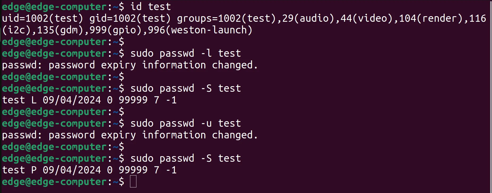</p>

<p align="center"><strong>图 4-3 禁用和启用账户</strong></p>

**账户管理高级扩展**

可参考以下文档获取更多信息：

1. [Ubuntu Manpage: adduser, addgroup](https://manpages.ubuntu.com/manpages/xenial/en/man8/adduser.8.html)
2. [Ubuntu Manpage: deluser, delgroup](https://manpages.ubuntu.com/manpages/focal/en/man8/deluser.8.html)
3. [Ubuntu Manpage: passwd](https://manpages.ubuntu.com/manpages/bionic/man1/passwd.1.html)
4. [Ubuntu Manpage: usermod](https://manpages.ubuntu.com/manpages/trusty/en/man8/usermod.8.html)

### 4.2 基于IEOS的Web管理

IEOS（InHand Edge Operating System）是映翰通自研的一套运行在Linux系统上的网络管理和系统管理程序。IEOS提供Web界面，用户可通过Web进行以太网口IP地址、蜂窝拨号、Wi-Fi Station、DHCP Client/Server、静态路由、防火墙等网络配置，也可对系统时间、时区、固件升级和系统重启等进行操作。另外，IEOS支持对接映翰通设备管理平台DeviceLive，用户可通过DeviceLive平台对EC3000设备进行远程监控和管理。

IEOS采用状态和配置分离的设计方案，分为网络管理、系统管理和状态三大功能板块。网络管理菜单和系统管理菜单下只能进行网络和系统的相关配置，状态信息需统一到状态页面查看。

> **重要说明**：使用IEOS程序管理网络配置和系统配置时，若同时使用Linux原生命令，二者可能相互影响，导致异常运行状态。建议IEOS支持的配置都通过IEOS Web实现管理，IEOS不支持的配置（如VPN）可结合Linux原生命令实现配置目标。

使用Linux命令行进行网络配置和系统配置时，需先关闭IEOS程序。关闭方式如下：

```
systemctl disable ieos_daemon
reboot
```

> **注意**：关闭IEOS之后，拨号、Wi-Fi等无线联网功能需用户基于Linux原生命令实现，且无法对接DeviceLive平台进行远程管理。

**登录Web管理界面**

IEOS使用9100端口作为HTTPS连接端口，不支持HTTP访问；使用HTTP访问时将自动跳转至HTTPS。

| 项目 | 默认值 |
|------|--------|
| 登录地址 | `https://<设备IP>:9100` |
| 初始用户名 | adm |
| 初始密码 | 123456 |

1. 在桌面系统中点击"Show Applications"→"Firefox Web Browser"，或通过外部网络访问设备配置页面，在浏览器地址栏输入 `https://<IP地址>:9100`。

<p align="center">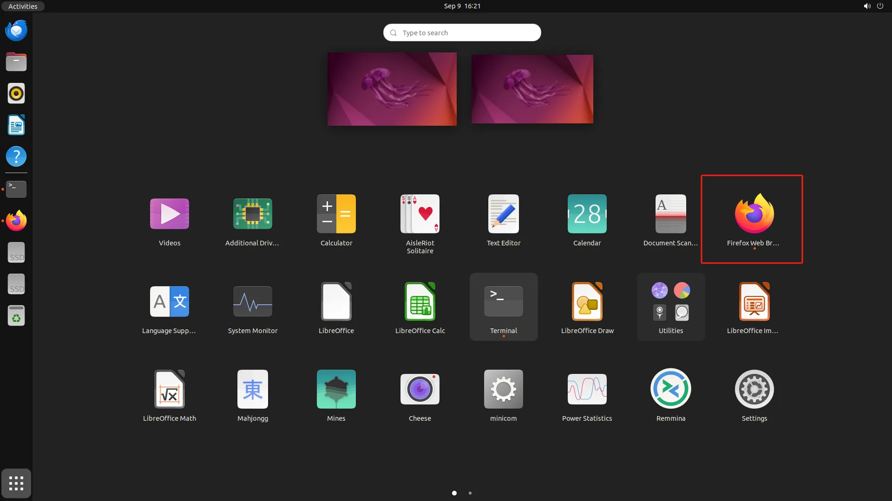</p>

<p align="center"><strong>图 4-4 IEOS Web访问</strong></p>

<p align="center"></p>

<p align="center"><strong>图 4-5 浏览器访问</strong></p>

2. 输入用户名和密码后点击"Login"登录设备。

<p align="center"></p>

<p align="center"><strong>图 4-6 IEOS登录界面</strong></p>

3. 登录成功后进入IEOS管理主界面。

<p align="center"></p>

<p align="center"><strong>图 4-7 IEOS网络接口页面</strong></p>

#### 4.2.1 网络管理

##### 4.2.1.1 以太网设置

登录IEOS Web界面后，进入【网络】→【接口】菜单，选择对应的以太网接口进行配置。

**配置静态IP地址**

点击以太网接口中"操作"→"编辑"，选择协议类型为"静态地址"，在IP地址栏中填写静态IP，子网掩码栏中填写掩码，点击"保存"。此时网络将重置。

<p align="center"></p>

<p align="center"><strong>图 4-8 以太网静态IP配置</strong></p>

**配置DHCP客户端**

点击以太网接口中"操作"→"编辑"，选择协议类型为"DHCP客户端"，点击"保存"。此时网络将重置。

<p align="center">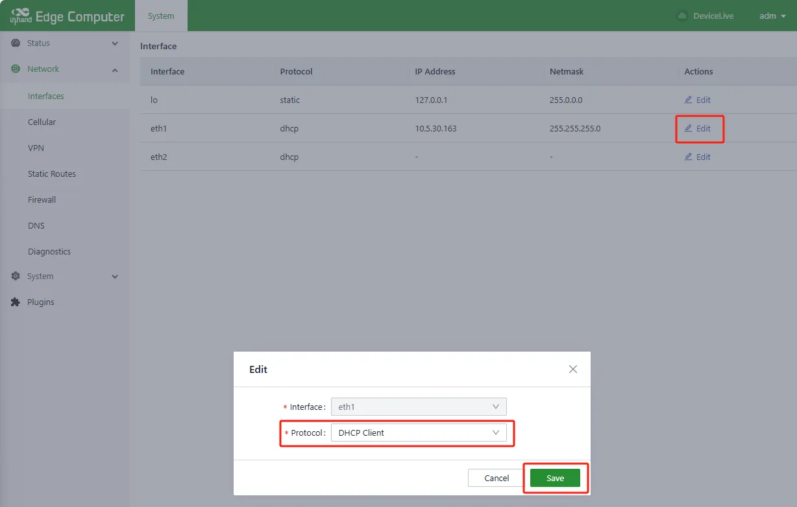</p>

<p align="center"><strong>图 4-9 DHCP客户端配置</strong></p>

##### 4.1.1.2 Wi-Fi设置

登录IEOS Web界面后，进入【网络】→【WiFi】菜单进行配置。

<p align="center">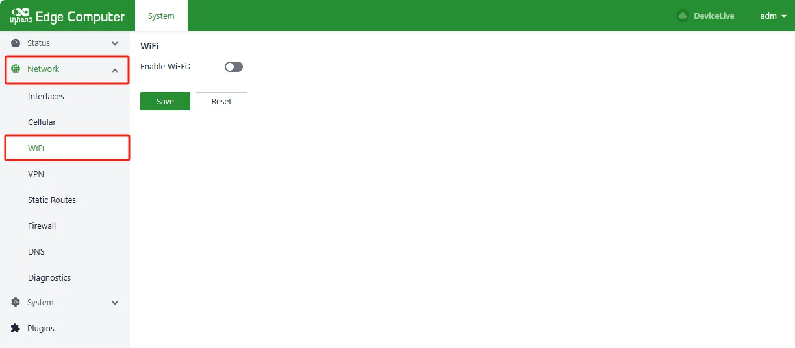</p>

<p align="center"><strong>图 4-10 Wi-Fi设置页面</strong></p>

**扫描Wi-Fi网络**

点击WiFi页面中"启用Wi-Fi"，点击"扫描"。

<p align="center"></p>

<p align="center"><strong>图 4-11 Wi-Fi扫描</strong></p>

**连接Wi-Fi网络**

点击扫描出的Wi-Fi"操作"→"连接"，输入客户端SSID和WPA/WPA2 PSK密钥，在"网络类型"中选择静态IP或动态地址，点击"保存"。

<p align="center">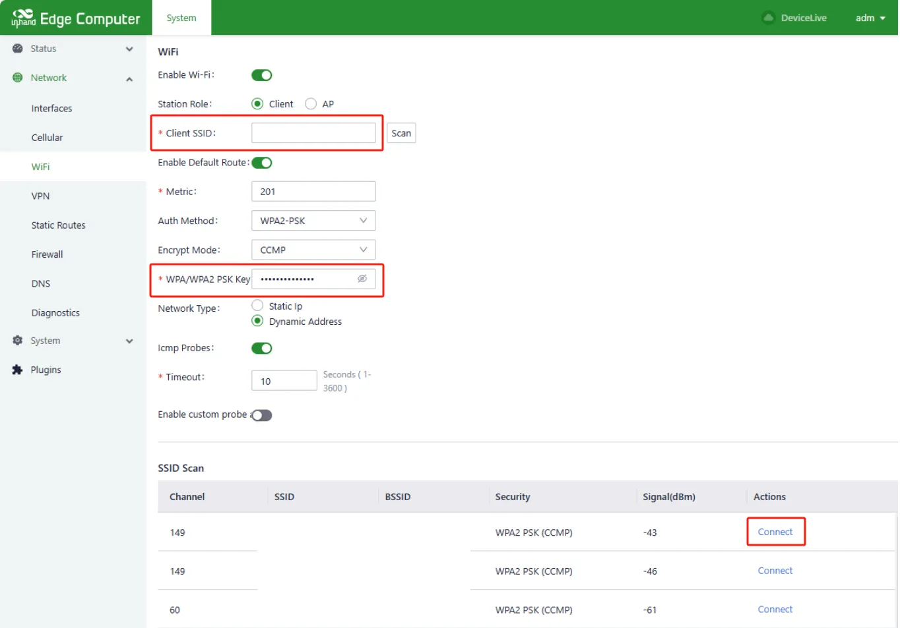</p>

<p align="center"><strong>图 4-12 Wi-Fi连接配置</strong></p>

**状态查询**

点击【状态】→【WiFi】页面可查看Wi-Fi状态。

<p align="center"></p>

<p align="center"><strong>图 4-13 Wi-Fi状态</strong></p>

##### 4.1.1.3 蜂窝网络设置

登录IEOS Web界面后，进入【网络】→【蜂窝网络】菜单进行配置。

**启用蜂窝网络**

点击"启用蜂窝网络"。

<p align="center">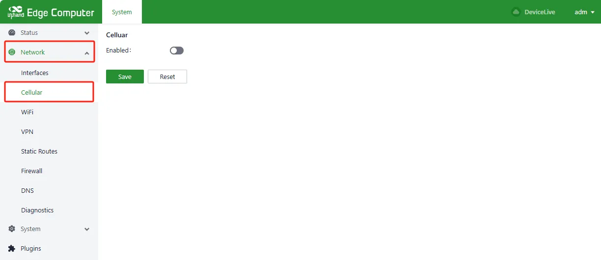</p>

<p align="center"><strong>图 4-14 蜂窝网络设置</strong></p>

**网络制式选择**

点击"网络制式"，可选模式包含自动（Auto）、WCDMA、LTE、5G、5G SA及5G NSA。

<p align="center"></p>

<p align="center"><strong>图 4-15 蜂窝网络制式选择</strong></p>

**添加默认路由**

点击"是否添加默认路由"，在"路由度量值"中可输入2-255之间的数值。

<p align="center">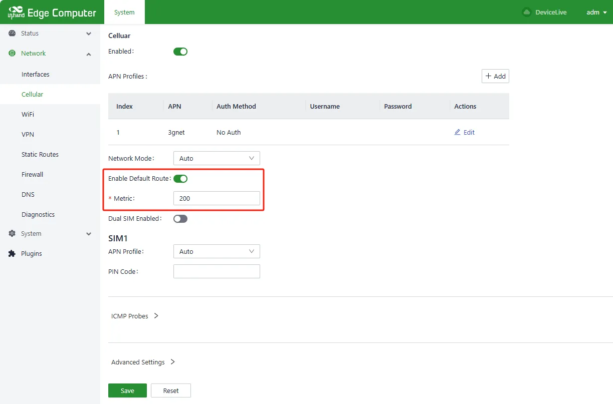</p>

<p align="center"><strong>图 4-16 蜂窝网络默认路由</strong></p>

**SIM卡选择及设置**

点击"启用双SIM卡"，从SIM1或SIM2中选择主卡，配置最大拨号次数，配置SIM1和SIM2的APN参数及PIN Code。

<p align="center"></p>

<p align="center"><strong>图 4-17 SIM卡设置</strong></p>

**状态查询**

点击【状态】→【蜂窝网】页面可查看蜂窝网状态。

<p align="center"></p>

<p align="center"><strong>图 4-18 蜂窝网络状态</strong></p>

#### 4.2.2 系统管理

##### 4.2.2.1 基础配置

**设置时区**

登录IEOS Web界面，进入【系统管理】→【基础设置】→【时钟】→【时区】，选择对应时区并点击"保存"。

<p align="center"></p>

<p align="center"><strong>图 4-19 时区设置</strong></p>

##### 4.2.2.2 固件升级

登录IEOS Web界面，进入【系统管理】→【软件升级】菜单，选择"升级固件版本"→"升级"，选择升级镜像文件后点击"升级"，等待升级结束。

<p align="center">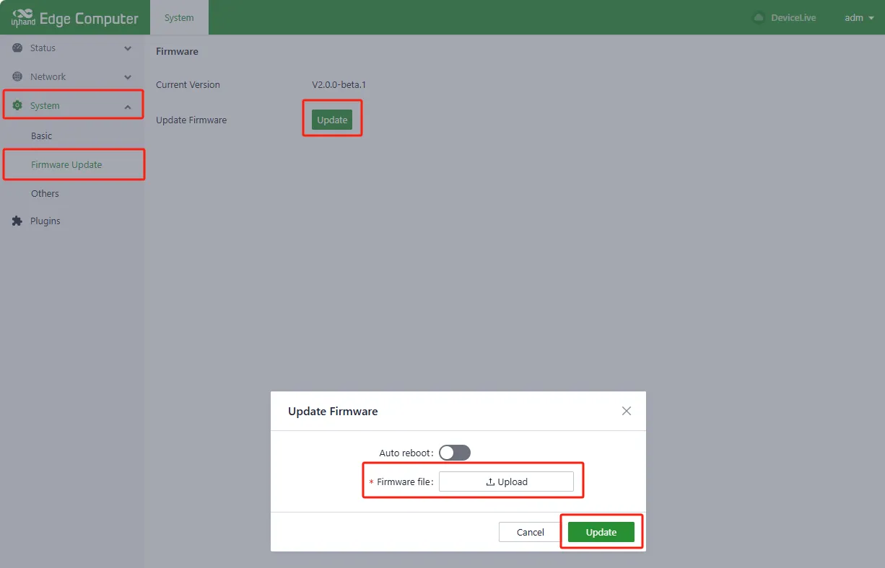</p>

<p align="center"><strong>图 4-20 系统更新</strong></p>


##### 4.2.2.3 其他

**页面重置**

登录IEOS Web界面，进入【系统管理】→【其他】菜单，选择"系统重置"→"重置"。

<p align="center">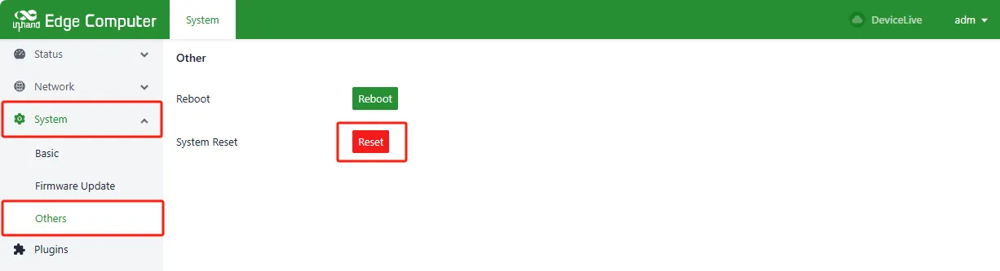</p>

<p align="center"><strong>图 4-21 页面重置</strong></p>


### 4.3 外设接口高级配置

#### 4.3.1 CAN设置

打开Terminal，输入下述命令配置CAN接口：

```
sudo ip link set can0 up type can bitrate 1000000 fd off
```

<p align="center"></p>

<p align="center"><strong>图 4-22 CAN接口配置</strong></p>

#### 4.3.2 串口管理

设备支持2个RS-232和2个RS-485串口，对应设备节点如下：

| 串口 | 设备节点 |
|------|----------|
| COM1 | /dev/ttyCOM1 |
| COM2 | /dev/ttyCOM2 |
| COM3 | /dev/ttyCOM3 |
| COM4 | /dev/ttyCOM4 |

#### 4.3.3 数字量输入/输出管理

设备支持4个隔离式数字量输入以及4个隔离式数字量输出，对应的GPIO节点如下：

| 类型 | 通道 | GPIO节点 |
|------|------|----------|
| DI | DI0 | /sys/class/gpio/gpio498/value |
| | DI1 | /sys/class/gpio/gpio497/value |
| | DI2 | /sys/class/gpio/gpio496/value |
| | DI3 | /sys/class/gpio/gpio495/value |
| DO | DO0 | /sys/class/gpio/gpio494/value |
| | DO1 | /sys/class/gpio/gpio493/value |
| | DO2 | /sys/class/gpio/gpio499/value |
| | DO3 | /sys/class/gpio/gpio500/value |

### 4.4 安全功能
#### 4.4.1 TPM 2.0

设备支持可信任平台模块2.0（TPM 2.0），并预装tpm2-tools工具，可直接使用指令操作TPM 2.0模块实现安全功能。

可参考以下资源获取更多信息：

1. [tpm2-tools官方文档](https://tpm2-tools.readthedocs.io/en/latest/)
2. [tpm2-tools GitHub](https://github.com/tpm2-software/tpm2-tools/tree/master/man)

### 4.5 编程指南

EC3000支持Hailo-8 AI模组扩展，用户可参考以下资源进行边缘AI应用开发：

1. [Journey Develop a SW for Hailo-8](https://hailo.ai/developer-zone/journey-develop-a-sw-for-hailo-8/)
2. [Hailo AI Demos](https://hailo.ai/resources/type/demos/)

### 4.6 版本查询

点击"Show Applications"→"Terminal"或鼠标右键点击"Open in Terminal"打开终端，输入下述命令查询版本信息。

```
sudo ecversion       # 仅查询版本号
sudo ecversion -all  # 查询详细版本信息
```

<p align="center">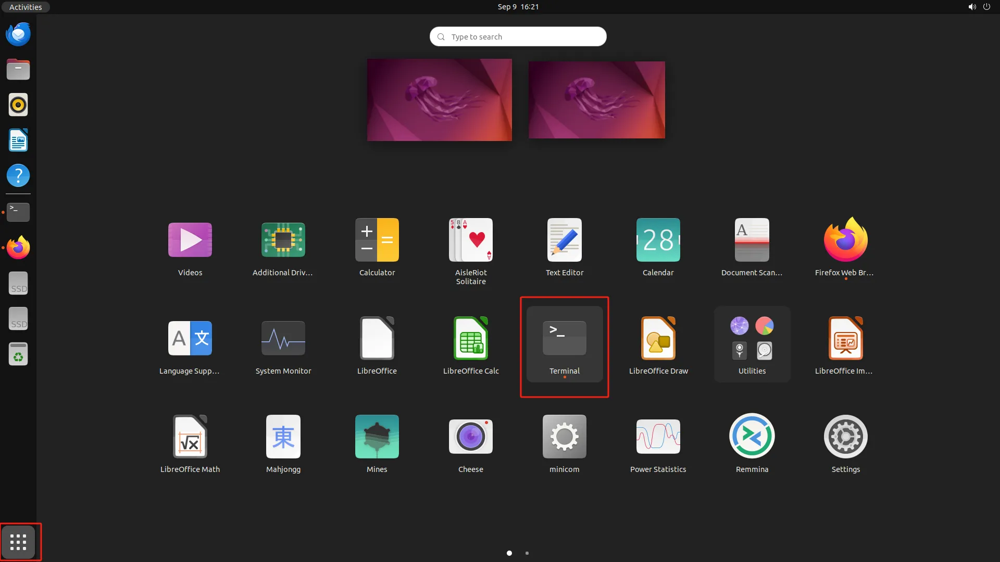</p>

<p align="center"><strong>图 4-23 版本查询</strong></p>

<p align="center"></p>

<p align="center"><strong>图 4-24 详细版本信息</strong></p>

---

## 附录 故障处理

### 1 网络连接问题

| 现象 | 可能原因 | 排查步骤 | 对应章节 |
|------|----------|----------|----------|
| 无法连接蜂窝网络 | SIM卡未插入或接触不良 | 1. 检查SIM卡是否正确插入<br>2. 重新插拔SIM卡 | [SIM卡安装](#224-sim卡安装) |
| 无法连接蜂窝网络 | APN参数配置错误 | 1. 核对APN参数是否正确<br>2. 联系运营商获取正确APN | [蜂窝网络设置](#44-蜂窝网络设置) |
| 无法连接蜂窝网络 | 信号弱或无信号 | 1. 检查天线是否连接<br>2. 调整设备位置 | [蜂窝网络设置](#44-蜂窝网络设置) |
| 无法访问IEOS Web界面 | IP地址错误 | 1. 确认电脑与设备在同一网段<br>2. 检查设备默认IP | [首次访问](#225-首次访问) |
| 无法访问IEOS Web界面 | 浏览器兼容性问题 | 1. 更换浏览器（推荐Chrome）<br>2. 清除浏览器缓存 | [首次访问](#225-首次访问) |
| Wi-Fi连接失败 | SSID或密码错误 | 1. 核对SSID和密码<br>2. 确认加密方式匹配 | [Wi-Fi设置](#43-wi-fi设置) |
| Wi-Fi连接失败 | 信号弱 | 1. 检查天线是否安装<br>2. 调整设备与AP距离 | [Wi-Fi设置](#43-wi-fi设置) |
| 以太网无法通信 | IP地址冲突 | 1. 检查IP是否与局域网内其他设备冲突<br>2. 更换IP地址 | [以太网设置](#42-以太网设置) |
| 以太网无法通信 | 网线未连接 | 1. 检查网线是否插紧<br>2. 更换网线测试 | [以太网设置](#42-以太网设置) |

### 2 系统运行问题

| 现象 | 可能原因 | 排查步骤 | 对应章节 |
|------|----------|----------|----------|
| STATUS指示灯熄灭 | 设备未上电 | 1. 检查电源线连接<br>2. 检查电源电压是否在9-36VDC范围内 | [电源连接](#223-电源连接) |
| STATUS指示灯熄灭 | 系统未运行 | 1. 检查电源功率是否≥36W<br>2. 尝试重新上电 | [电源连接](#223-电源连接) |
| 无法登录系统 | 用户名或密码错误 | 1. 核对用户名和密码<br>2. 查看设备底面铭牌确认默认账户 | [默认设置](#16-默认设置) |
| 无法登录系统 | 账户被禁用 | 1. 使用其他账户登录<br>2. 执行 `sudo passwd -u <用户名>` 启用账户 | [账户管理](#49-账户管理) |
| 系统升级失败 | 固件镜像不匹配 | 1. 确认固件镜像与设备型号匹配<br>2. 重新下载正确镜像 | [系统更新](#411-系统更新) |
| 系统异常 | IEOS与Linux命令冲突 | 1. 确认未同时使用IEOS Web和Linux原生命令修改同一配置<br>2. 统一使用IEOS Web管理 | [IEOS Web管理](#41-ieos-web管理) |

### 3 外设问题

| 现象 | 可能原因 | 排查步骤 | 对应章节 |
|------|----------|----------|----------|
| 串口无法通信 | 设备节点错误 | 1. 确认使用正确的设备节点（/dev/ttyCOM1~COM4）<br>2. 检查串口参数配置 | [串口管理](#47-串口管理) |
| USB存储设备数据丢失 | 未执行sync命令 | 1. 断开存储设备前执行 `sync` 命令<br>2. 退出 /media/* 目录后再断开设备 | [USB接口](#13-外观与接口) |
| DI/DO无响应 | GPIO路径错误 | 1. 确认使用正确的GPIO节点路径<br>2. 检查接线是否正确 | [数字量输入输出管理](#48-数字量输入输出管理) |

---

## 附录 安全注意事项

1. 设备应在规定的温度和湿度范围内使用（工作温度：-20℃~60℃，工作湿度：95%@40℃无凝结）。
2. 请勿在易燃易爆环境中使用本设备。
3. 电源连接前请确认电压符合设备规格要求（DC 9-36V），建议功率≥36W。
4. 设备安装须由专业人员操作，只使用铜导体，需选择合适的线径。
5. SIM卡安装必须在断电状态下进行。
6. 在断开USB大容量存储设备之前，需执行 `sync` 命令同步数据，防止数据丢失。
7. 断开存储设备连接时，需从 `/media/*` 目录退出。如留在 `/media/usb*` 中，自动卸载过程将失败，此时需执行 `umount /media/usb*` 手动卸载。

> **警告**：非专业人员请勿打开设备外壳，存在触电风险。
