# EC5000 快速安装手册

---

## 第一部分：快速装机（图文整体流程）

> **您需要先做：** 开箱 → 固定设备 → 接电源与网线 →（若用蜂窝）装 SIM、接天线 → 上电 → PC/显示器准备 → 登录系统。  
> **再做：** 翻到下方 **第二部分**，按需查阅装箱、灯义、壁挂、各接口引脚等。

### 必读摘要（接线、上电前）

| 项目 | 要求 |
|------|------|
| 供电 | **9～36 V DC**，端子见 §2.5.2；**PWR 红灯常亮**表示已上电。 |
| 接地 | 请使用绿黄双色接地线（**16AWG**）并搭配系统接地螺丝接地。 |
| USB 满载 | 多个 USB 满负载工作时，请选择 **120 W（或以上）** 电源适配器。 |

---

### 步骤 1：对照实物，确认面板与接口区域

找到 EC5000 主机，对照下图确认前面板和侧面板上的接口位置。您将看到电源指示灯、系统状态灯、以太网口、串口、USB 口、天线接口、SIM 卡槽等。

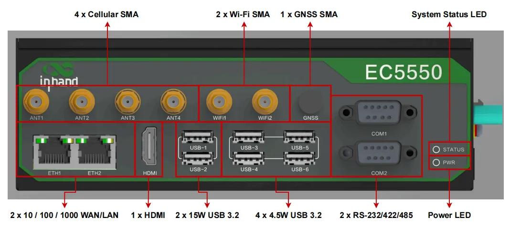

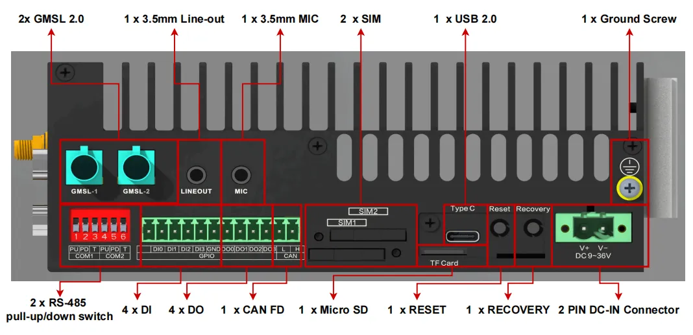

各接口的详细定义见 §2.2 与 §2.5。

---

### 步骤 2：将设备固定到导轨或柜内

根据安装环境，选择 DIN 导轨安装或壁挂安装。

**DIN 导轨安装**：将安装板上方挂钩卡入 DIN 轨顶端，再向前推使底端卡入到位。

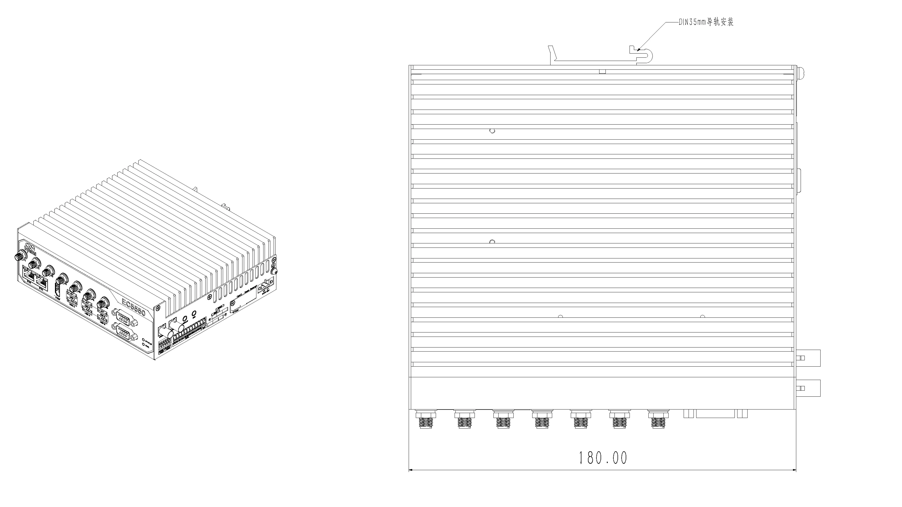

**壁挂安装**：先用螺钉将壁挂套件固定在设备下面板，再用螺钉将设备固定到墙面或柜子。

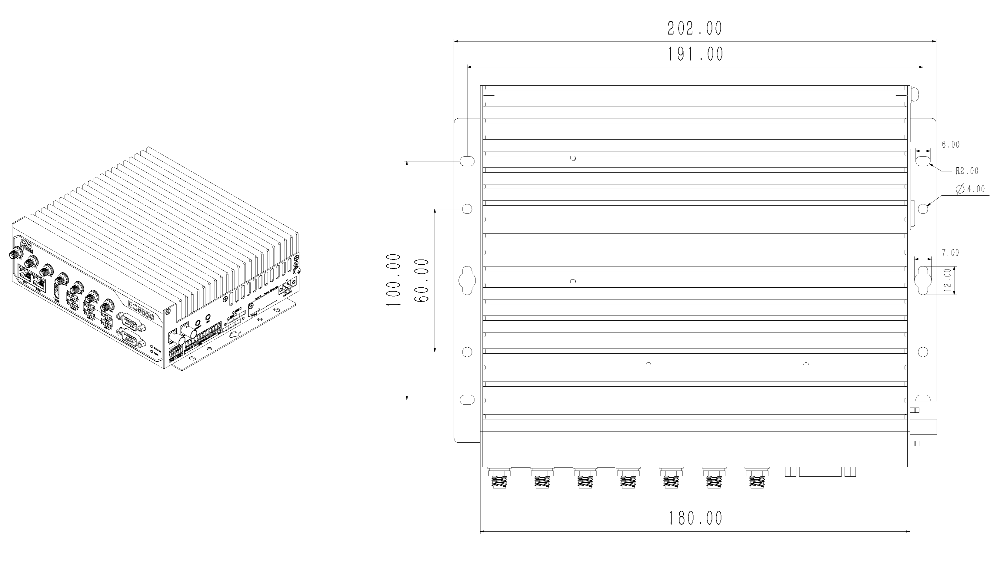

详细安装方式见 §2.4。

---

### 步骤 3：连接电源与以太网

1. 将 DC 电源线接入设备的直流输入端子（**9～36 V DC**）。
2. 用网线将 PC 或上级网络接入任一以太网口。

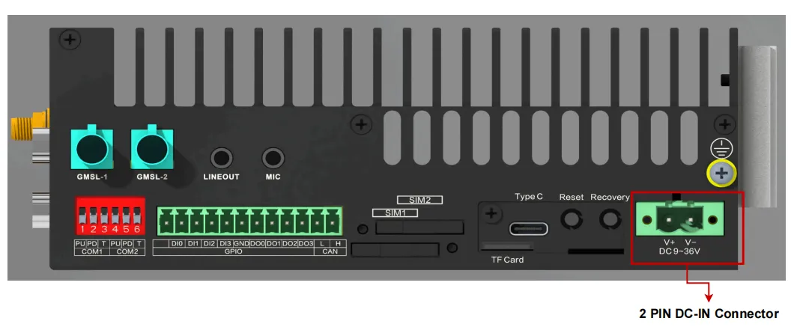

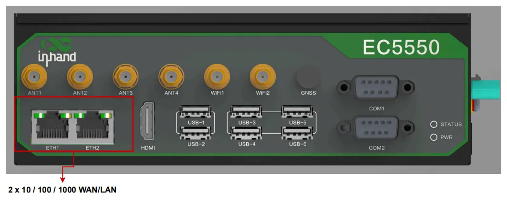

如需接地，请使用绿黄双色接地线（16AWG）搭配系统接地螺丝接地。电源端子与以太网引脚定义见 §2.5.2 与 §2.5.1。

---

### 步骤 4：（若使用蜂窝）装 SIM，并接好天线

若设备型号支持蜂窝功能且您需要使用，请准备 SIM 卡：

1. 将 SIM 卡插入卡槽（SIM1 或 SIM2）。
2. 按壳体丝印将蜂窝天线拧紧到对应 SMA 接口。

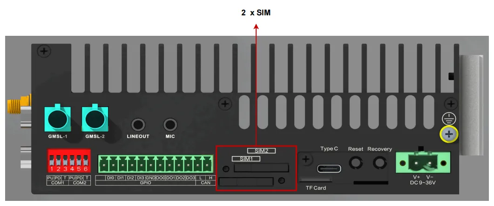

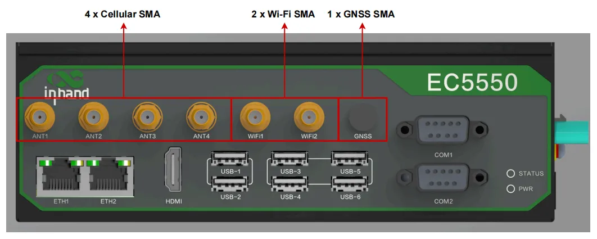

不同型号配备的天线种类及个数不同，具体支持情况可参见《EC5000系列边缘AI计算机产品规格书》中“订购信息”部分。天线丝印与名称对照见 §2.5.6，SIM 卡要求见 §2.5.6。

---

### 步骤 5：上电，确认设备已就绪

接通电源后，观察前面板指示灯：

- **PWR（红色）常亮**：系统已开机。
- **STATUS（绿色）闪烁（约 1 Hz）**：系统运行正常。

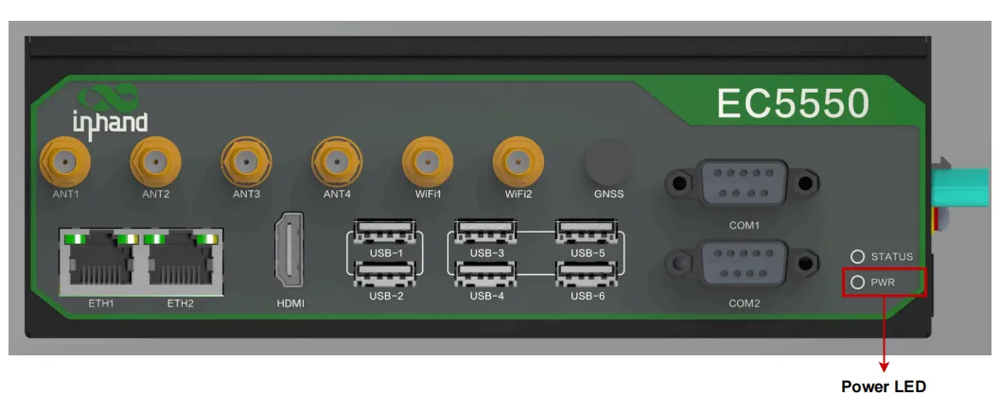

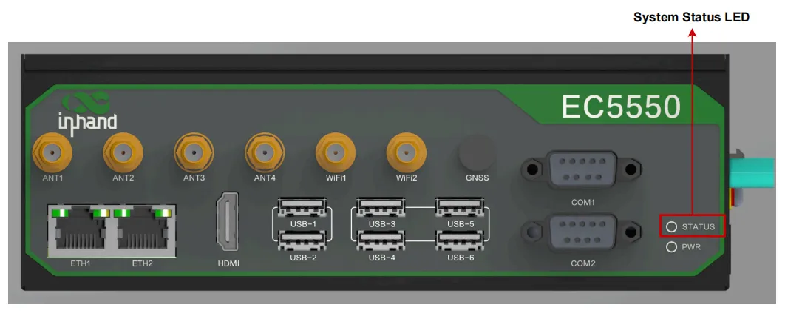

指示灯详细含义见 §2.3。若灯态异常，请参阅《EC5000用户手册》进行排障。

---

### 步骤 6：PC 登录系统

EC5000 支持两种方式登录系统，请选择适合您的一种。

**方式一：通过 HDMI 连接显示器访问**

将 HDMI 线接入设备与显示器，把键盘和鼠标接入 USB 3.2 接口。查看设备底面铭牌，获取系统默认用户名和密码，在登录界面选择对应账户并输入密码。

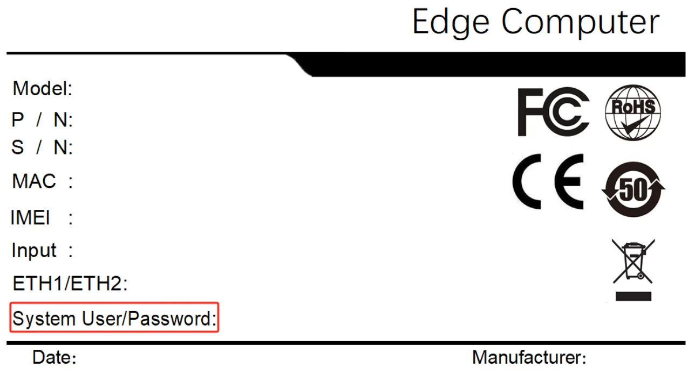

**方式二：通过 SSH 连接**

1. 查看设备底面铭牌，获取系统默认以太网地址，将 PC 配置到同一网段。
2. 打开 SSH 终端工具，输入设备地址并连接。
3. 按提示输入默认账户和密码。

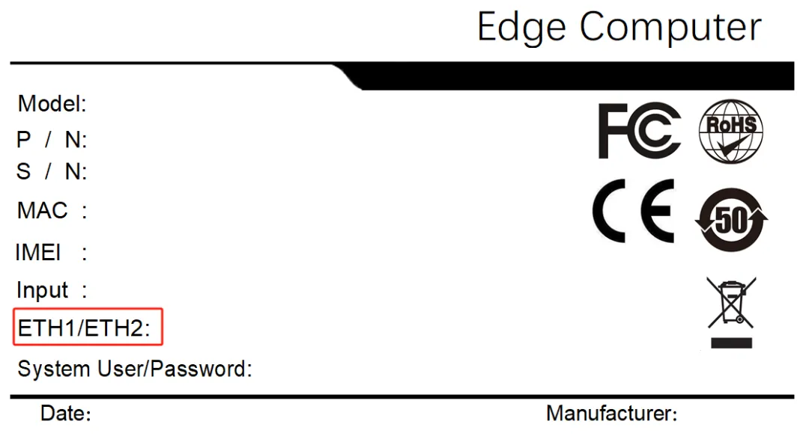

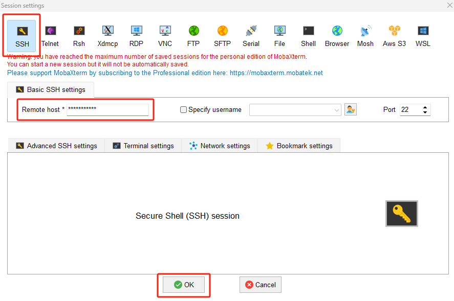

详细登录步骤与账号信息见 §2.7。

---

### 装完自检

- ☐ 设备已固定（导轨或壁挂）。
- ☐ 电源、网线已接好；若用蜂窝，SIM 与天线已就位。
- ☐ **PWR 红灯常亮**且 **STATUS 绿灯闪烁**。
- ☐ 已通过 HDMI 或 SSH 成功登录系统。

若登录失败，请检查网段配置、线缆连接，或参考 §2.7 恢复出厂设置。

---

## 第二部分：详细说明

### 2.1 装箱清单

| 序号 | 名称 | 数量 | 单位 | 备注 |
| --- | --- | --- | --- | --- |
| 1 | EC5000主机 | 1 | 台 | — |
| 2 | 电源适配器 | 1 | 个 | 选配 |
| 3 | Wi-Fi天线 | 1 | 个 | 标配（根据型号而定） |
| 4 | GNSS天线 | 1 | 个 | 标配（根据型号而定） |
| 5 | 蜂窝天线 | 1 | 个 | 标配（根据型号而定） |
| 6 | 取卡针 | 1 | 个 | — |
| 7 | 产品保修卡 | 1 | 张 | — |

---

### 2.2 产品结构与标识

#### 2.2.1 前面板

#### 2.2.2 侧面板

#### 2.2.3 内部扩展

EC5000 支持以下扩展：

- 1 x M.2 B-Key 3042/3052 (LTE/5G)
- 1 x M.2 E-Key 2230 (WiFi/BT)
- 1 x M.2 M-Key 2242 (NVMe 128GB built-in)

---

### 2.3 指示灯与复位键

#### 2.3.1 运行状态指示灯

| 指示灯 | 颜色 | 状态 | 含义 |
| --- | --- | --- | --- |
| PWR | 红色 | 常亮 | 系统处于开机状态 |
| PWR | 红色 | 熄灭 | 系统处于关机状态 |
| STATUS | 绿色 | 闪烁（约 1 Hz） | 系统运行正常 |
| STATUS | 绿色 | 熄灭 | 系统未运行 |

> **闪烁频率定义**：常亮/常灭指至少保持约 3 s；慢闪约 1 Hz；快闪约 5 Hz。

#### 2.3.2 以太网口指示灯

| LED | 状态 | 含义 |
| --- | --- | --- |
| Green | OFF | 无连接，或速率为 10 Mbps / 100 Mbps |
| Green | ON | 速率为 1000 Mbps |
| Orange | OFF | 无连接，或端口无数据通信 |
| Orange | Blinking | 端口有数据通信 |

#### 2.3.3 Recovery 与 Reset 按键

Recovery 按键和 Reset 按键位于可拆卸挡板下（见 §2.2 侧面板示意图）。

**Recovery 按键**：

- 系统正常运行时按住 10 秒，等待系统状态灯由闪烁变为常亮后松开，设备进入系统重置状态（恢复出厂）。
- 系统上电前或运行中按住 Recovery 按键并重启系统，则进入烧录模式。

**Reset 按键**：

- 系统正常运行时按住 3 秒内松开：系统重启并使能硬件看门狗。
- 系统正常运行时按住 3 秒后松开：系统重启并禁用硬件看门狗。

> 系统烧录前请禁用硬件看门狗，防止硬件看门狗重启系统导致烧写失败。

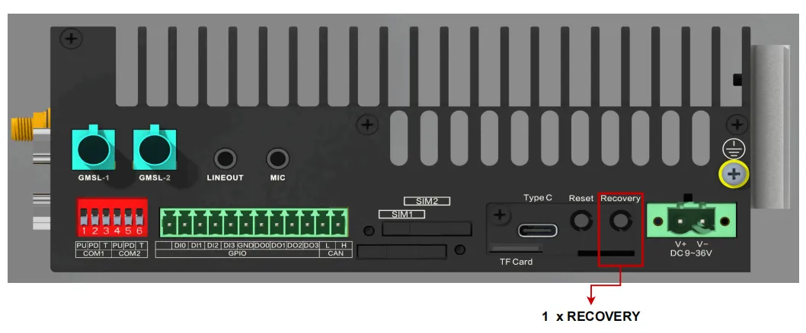

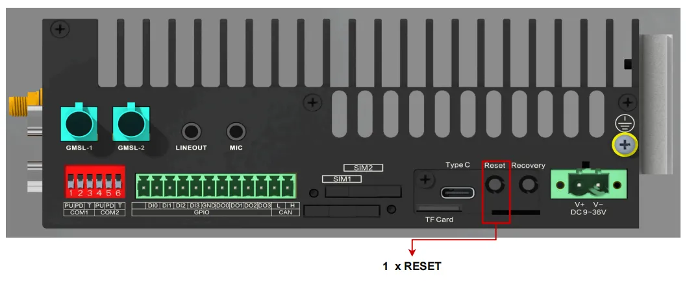

---

### 2.4 机械安装

#### 2.4.1 DIN 导轨

DIN 轨安装板附在 EC5000 的下面板上，安装步骤如下：

1. 将 DIN 轨安装板的上方挂钩卡入到 DIN 轨支架的顶端。
2. 缓慢向 DIN 轨支架方向向前推动设备，使得 DIN 轨底端卡入到位。

#### 2.4.2 壁挂

先将套件用螺钉固定在设备的下面板上，再用螺钉将设备固定到墙面或柜体。拆卸时逆序松开墙面螺钉，再取下套件。

1. 使用螺钉将壁挂套件固定在 EC5000 的下面板上。
2. 当壁挂套件成功固定到 EC5000 以后，使用螺钉将 EC5000 固定在墙面或柜子上。

---

### 2.5 连接与布线

#### 2.5.1 以太网

EC5000 提供 2 个以太网接口，其上方各有 2 个 LED 灯，用于指示网络连接速率与数据通信情况。灯义见 §2.3.2。

#### 2.5.2 电源与串口

**供电**

EC5000 支持的电压范围为 **9 V DC 至 36 V DC**。

**接地**

EC5000 提供 1 个系统接地螺丝，请使用绿黄双色的接地线（**16AWG**）并搭配系统接地螺丝接地。

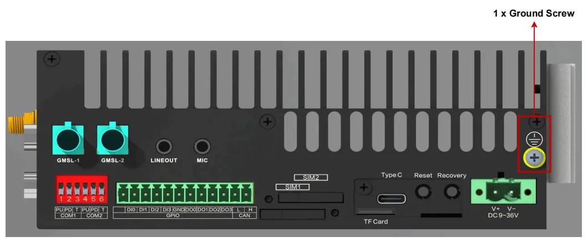

**串口**

EC5000 提供 2 个 RS-232/422/485 串口，接口形式为 DB9-F。

| DB9-F | RS-232 | RS-422 | RS-485 |
| --- | --- | --- | --- |
| 1 |  |  |  |
| 2 | RXD | RX+ |  |
| 3 | TXD | TX- | Data- |
| 4 |  |  |  |
| 5 | Ground | | |
| 6 |  |  |  |
| 7 |  | TX+ | Data+ |
| 8 |  | RX- |  |
| 9 |  |  |  |

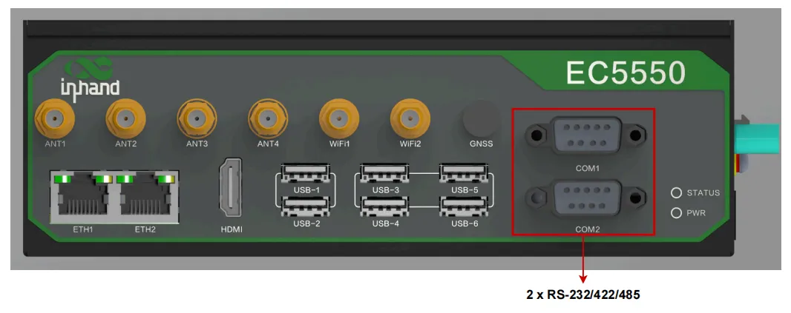

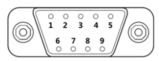

#### 2.5.3 RS-485 拨码开关

EC5000 提供 1 个 RS-485 上下拉拨码开关，可以控制 RS-485 总线（对应 COM1/COM2）的上拉、下拉电阻。上下拉电阻用于增强总线抗干扰能力、解决兼容性问题，但启用后会减少总线可接入设备数量。

| 开关 | ON | OFF |
| --- | --- | --- |
| PU | 使能上拉 | 禁用上拉 |
| PD | 使能下拉 | 禁用下拉 |
| T | 使能终端匹配电阻 | 禁用终端匹配电阻 |

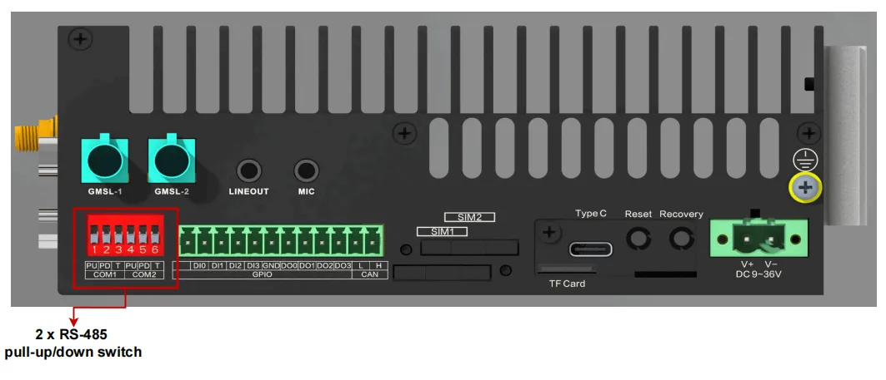

#### 2.5.4 数字量输入

EC5000 提供 4 个隔离式数字量输入接口，支持干湿接点。

| 参数 | 规格 |
| --- | --- |
| 输入通道数 | 4 |
| 光隔离 | 2500 V DC |
| 干接点 | Logic 1: Open Logic 0: Close to ground |
| 湿接点 | VIH(max.) = 60 V DC VIH(min.) = 5 V DC VIL(max.) = 2 V DC |

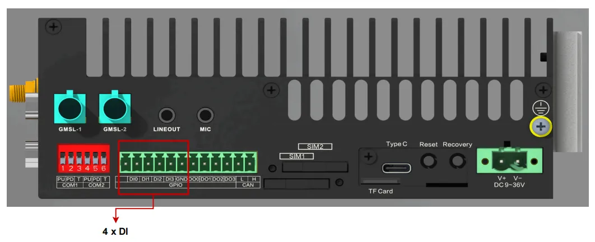

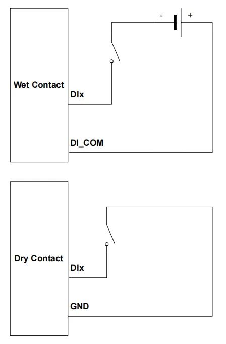

#### 2.5.5 数字量输出

EC5000 提供 4 个隔离式数字量输出接口，为开漏输出模式。

| 参数 | 规格 |
| --- | --- |
| 输出通道数 | 4 |
| 光隔离 | 500 V DC |
| 供电电压 | Sink 40 V DC |
| 灌电流 | 0.2 A max./Channel |

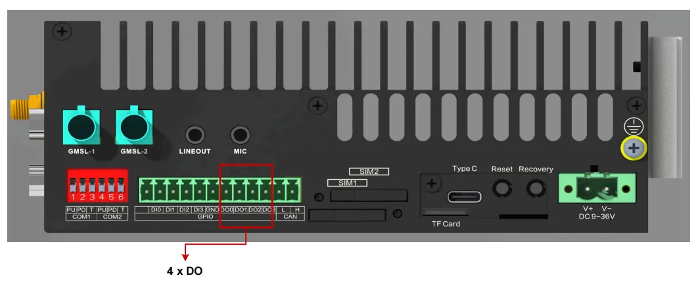

#### 2.5.6 蜂窝 SIM 与天线

**SIM 卡**

EC5000 提供 2 个 SIM 卡槽（SIM1/SIM2），支持标准 SIM 卡。

**天线**

EC5000 提供最多 7 个 SMA 接口，不同型号配备的 4G/5G/Wi-Fi/GNSS 天线种类及个数不同。

| 天线类型 | 说明 |
| --- | --- |
| 蜂窝天线 | 根据型号配置，标配数量见订购信息 |
| Wi-Fi 天线 | 根据型号配置，标配数量见订购信息 |
| GNSS 天线 | 根据型号配置，标配数量见订购信息 |

用户可根据自身需求进行设备选型，具体型号天线的支持情况可参见《EC5000系列边缘AI计算机产品规格书》中“订购信息”部分。

#### 2.5.7 USB 与 Micro SD

**USB 3.2**

EC5000 提供 2 个最大功率 15 W 的 USB 3.2 Gen 2 Type-A 接口，4 个最大功率 4.5 W 的 USB 3.2 Gen 2 Type-A 接口。

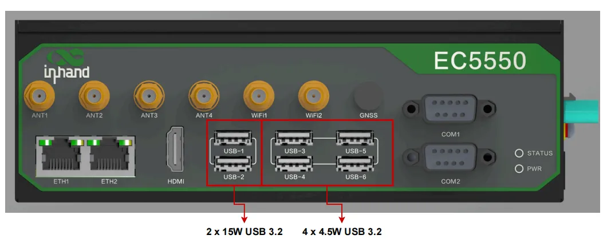

**USB 2.0 Type-C**

EC5000 可拆卸窗挡板下有 USB 2.0 Type-C 接口，用于在烧录模式下连接至主机烧录系统。

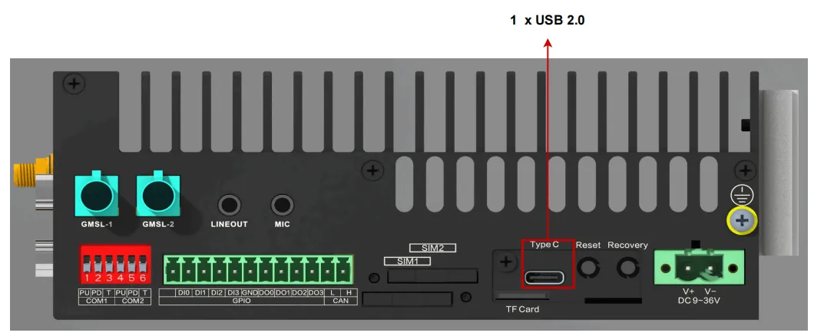

**Micro SD（TF 卡槽）**

EC5000 可拆卸窗挡板下有 TF 卡槽，支持 Micro SD 存储卡，当有额外存储空间需求时，请于本卡槽插入至少 8 GB 以上容量的 Micro SD 卡以供后续使用。

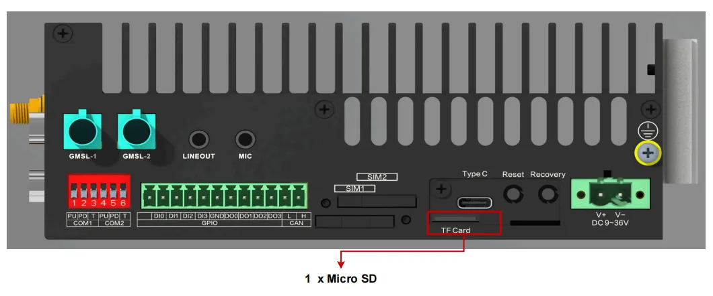

#### 2.5.8 CAN FD 接口

EC5000 提供 1 个 CAN FD 接口（板载 120 Ω 电阻），最大支持 5 Mbps 通信速率。

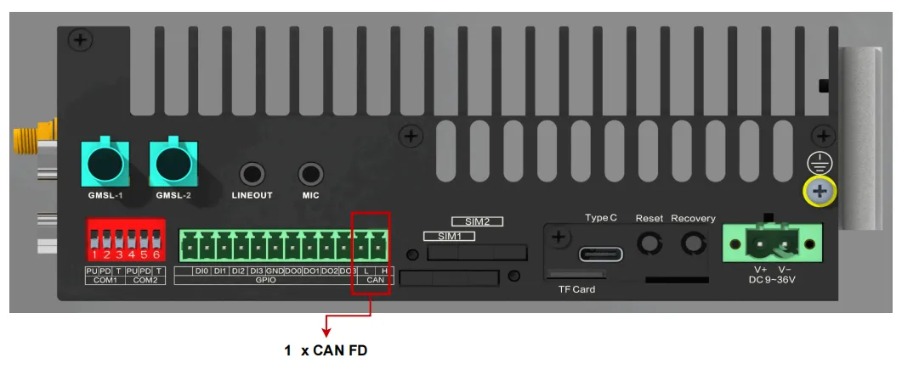

#### 2.5.9 GMSL 2.0 接口

EC5000 提供 2 个 GMSL 2.0 接口，支持对接 2 路 GMSL 摄像头。

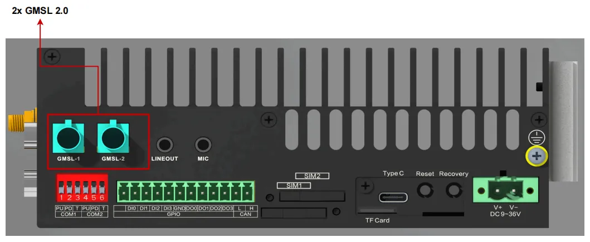

#### 2.5.10 HDMI 与音频接口

**HDMI**

EC5000 提供 1 个 HDMI 接头供外接屏幕使用，最高分辨率为 3840 x 2160 @ 60 Hz。

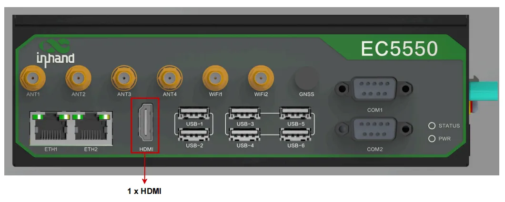

**Line-out**

EC5000 提供 1 个线性输出 Line-out 接口，支持 3.5 mm 标准音频输出。

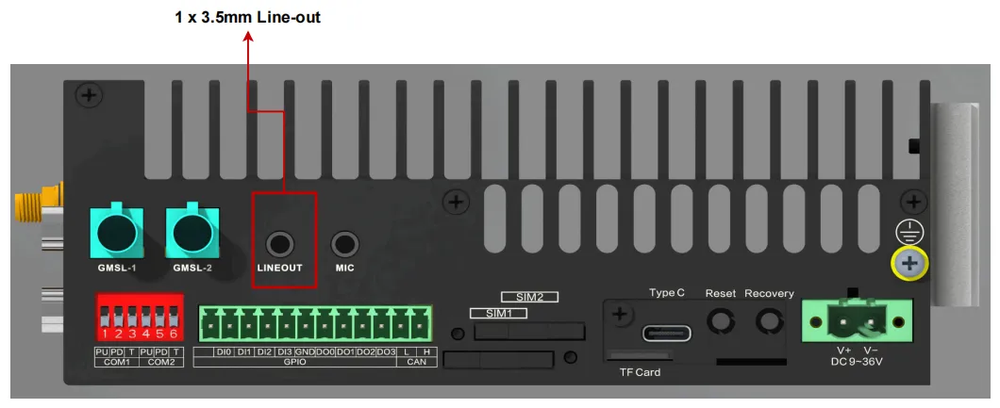

**麦克风**

EC5000 提供 1 个麦克风接口，支持 3.5 mm 标准音频输入。

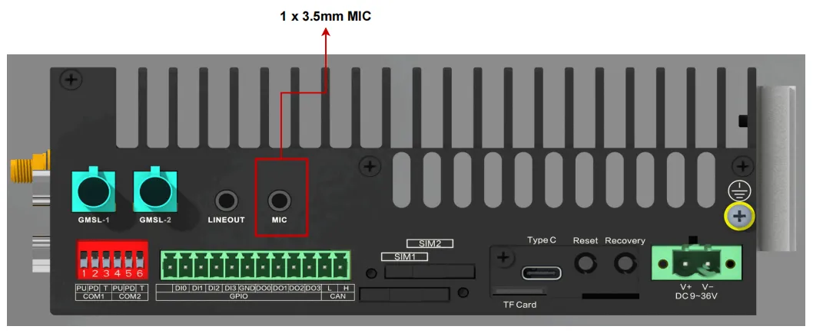

---

### 2.6 供电与环境

| 项目 | 规格 |
| :--- | --- |
| 输入电压 | 9-36 VDC |
| 功率 | 空闲功率：10 W 满载功率：60 W |
| 工作温度 | -20-60 ℃ |
| 存储温度 | -40-85 ℃ |
| 工作湿度 | 95% @ 40 ℃（无凝结） |

---

### 2.7 首次登录与恢复出厂

#### 2.7.1 通过 HDMI 连接显示器访问

1. 通过 HDMI 2.0 接口将设备和显示器连接，将键盘及鼠标接入设备 USB 3.2 接口，给设备上电后等待设备启动完成。
2. 查看设备底面铭牌，查找系统默认用户名和密码。
3. 登录界面选择 System User 所对应的账户，输入密码后登录。

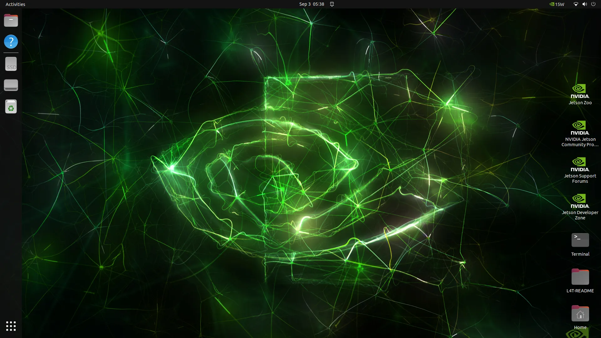

#### 2.7.2 通过 SSH 连接

1. 使用 SSH 连接设备，需要保证设备网络可以访问。查看设备底面铭牌，查找系统默认以太网地址并配置主机和设备在同一个网段。
2. 打开 SSH 终端工具（以 Mobaxterm 为例），输入设备地址点击连接。
3. 根据提示内容，输入默认账户和密码。

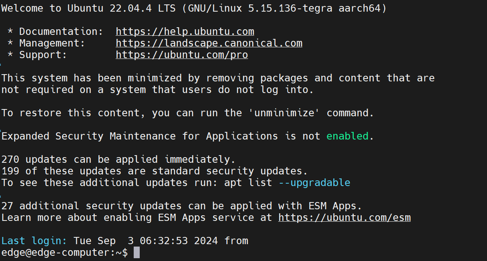

#### 2.7.3 恢复出厂（Recovery 按键）

Recovery 按键位于可拆卸挡板下（见 §2.2）。

1. 确保系统处于正常运行状态。
2. 按住 Recovery 按键 10 秒，等待系统状态灯由闪烁变为常亮。
3. 松开按键，设备将进入系统重置状态（恢复为系统出厂状态）。

---

### 2.8 相关文档

| 需求 | 去向 |
|------|------|
| 产品介绍、USB/SD 详解、配置与排障 | 《EC5000 用户手册》 |
| 订购与天线型号 | 《EC5000 系列边缘 AI 计算机产品规格书》 |
| 软件与公告 | [映翰通官网](http://www.inhand.com.cn) |

---

### 2.9 法律信息

**版权声明**

© 2024 映翰通网络 保留所有权利。

**商标**

InHand 标志是映翰通网络的注册商标。

本手册中的所有其他商标或注册商标属于其各自的制造商。

**免责声明**

本公司保留对此手册更改的权利，产品后续相关变更时，恕不另行通知。对于任何因安装、使用不当而导致的直接、间接、有意或无意的损坏及隐患概不负责。
