# EC5000系列边缘AI计算机 用户手册

## 前置信息

### 声明

首先非常感谢您选择本公司产品！在使用前，请您仔细阅读本用户手册，遵守以下声明，将有助于维护知识产权和法律合规性，以确保您的使用体验与产品的最新信息相一致。如有任何疑问或需要获取书面许可，请随时联系我们的技术支持团队。

- 版权声明

本用户手册包含受版权保护的内容，版权归北京映翰通网络技术股份有限公司及其许可者所有。未经书面许可，任何单位和个人不得擅自摘抄、复制本手册的部分或全部内容，且不得以任何形式传播。

- 免责声明


由于产品技术和规格不断更新，本公司不能承诺用户手册中的资料与实际产品完全一致。因此，不承担由于实际技术参数与用户手册不符而引起的任何争议。任何关于产品的改动恕不提前通知，本公司保留最终更改权和解释权

- 版权信息

本用户手册内容受版权法律保护，版权归北京映翰通网络技术股份有限公司及其许可者所有，保留一切权利。未经书面许可，不得擅自使用、复制或传播本手册的内容。

### 图形界面约定

本文档使用以下符号和格式约定，以便于理解和操作：

| 符号 | 含义 | 示例 |
|------|------|------|
| `< >` | 表示变量或参数，需替换为实际值 | `<IP地址>` 表示需填入具体IP |
| `" "` | 表示界面上的文字标签 | 点击"保存"按钮 |
| `→` | 表示菜单层级或操作顺序 | 【网络】→【蜂窝】 |
| `【 】` | 表示菜单或页面名称 | 进入【系统设置】页面 |
| `>` | 表示多级菜单层级 | 【设置】>【网络】>【以太网】 |
| **粗体** | 表示界面上的按钮名称、选项卡或重要提示 | 点击**确定**按钮 |

### 技术支持

**北京映翰通网络技术股份有限公司（总部）**

电话：010-8417 0010

地址：北京市朝阳区紫月路18号院3号楼5层

**成都办事处**

电话：028-8679 8244

地址：四川省成都市武侯区天府大道北段1777号中国太平金融大厦14层

**广州办事处**

电话：020-8562 9571

地址：广州市天河区棠东东路5号远洋新三板创意园B-130单元

**武汉办事处**

电话：027-8716 3566

地址：湖北省武汉市洪山区珞瑜东路2号巴黎豪庭11栋2001室

**上海办事处**

电话：021-5480 8501

地址：上海市普陀区顺义路18号1103室

### 如何使用本手册

**a) 对号入座**

- 首次使用用户：建议按顺序阅读「认识设备」→「安装与首次使用」→「常用场景配置」→「功能说明与参数参考」
- 已有设备用户：可直接查阅「功能说明与参数参考」或「附录 故障处理」
- 云平台管理用户：可查阅「常用场景配置」中的设备远程管理平台（如适用）

**b) 按任务快速跳转**

| 任务 | 对应章节 | 预计用时 |
|------|----------|----------|
| 了解设备接口与指示灯 | [认识设备](#第1章-认识设备) | 约10分钟 |
| 安装设备并首次启动 | [安装与首次使用](#第2章-安装与首次使用) | 约20分钟 |
| 配置网络连接（以太网/蜂窝/Wi-Fi） | [常用场景配置](#第3章-常用场景配置) | 约10~15分钟 |
| 配置IEOS Web管理 | [常用场景配置](#场景5配置ieos-web管理) | 约15分钟 |
| 配置串口与外设 | [常用场景配置](#场景6配置串口与外设) | 约10分钟 |
| 查询功能参数与操作说明 | [功能说明与参数参考](#第4章-功能说明与参数参考) | 按需 |
| 排查设备故障 | [附录 故障处理](#附录-故障处理) | 按需 |

---

## 第1章 认识设备

### 1.1 概述

EC5000系列边缘AI计算机搭载NVIDIA Jetson Orin NX或Orin Nano模组，面向边缘AI运算应用场景设计。系统提供2个千兆以太网接口、1个HDMI视频输出接口、6个USB 3.2接口、2个RS-232/422/485可切换串行接口、2个GMSL 2.0视频接口、4路隔离式数字量输入与4路隔离式数字量输出、1路CAN FD接口、2个SIM卡槽，并支持4G/5G蜂窝网络、Wi-Fi/蓝牙无线通信以及TPM 2.0安全模块。该设备适用于工业视觉检测、智能交通、边缘推理等需本地AI算力的场景。

### 1.2 包装清单

| 物品 | 数量 | 说明 |
|------|------|------|
| EC5000主机 | 1台 | — |
| 电源适配器 | 1个 | 选配 |
| Wi-Fi天线 | 1个 | 标配（根据型号而定） |
| GNSS天线 | 1个 | 标配（根据型号而定） |
| 蜂窝天线 | 1个 | 标配（根据型号而定） |
| 取卡针 | 1个 | — |
| 产品保修卡 | 1张 | — |

### 1.3 外观与接口

EC5000采用紧凑型工业结构设计，标准尺寸为180.0 x 160.0 x 60.0 mm，参考重量约1.65 kg（不含包材及电源适配器）。设备面板布局如下所示。

<p align="center">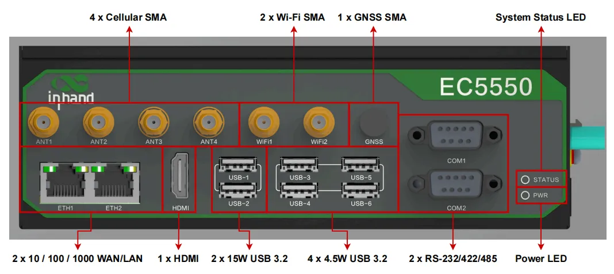</p>

<p align="center"><strong>图 1-1 EC5000前面板</strong></p>

<p align="center">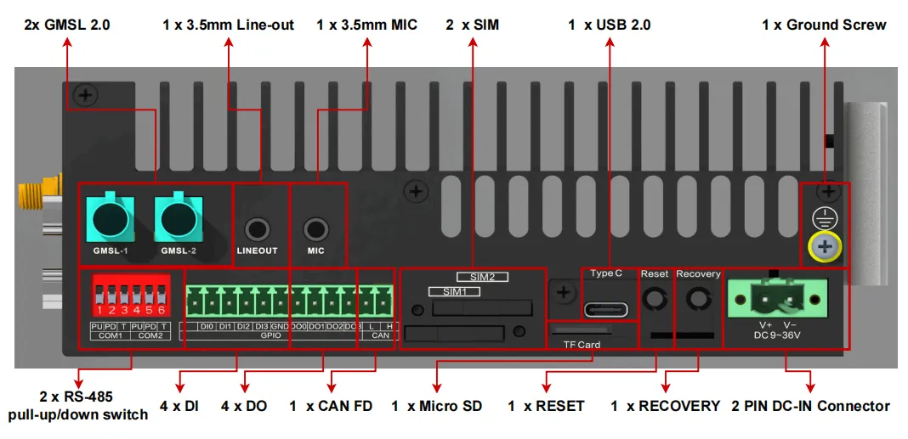</p>

<p align="center"><strong>图 1-2 EC5000侧面板</strong></p>

#### 1.3.1 接口总览

| 接口 | 位置 | 功能说明 |
|------|------|----------|
| 电源指示灯 | 前面板 | 红色LED，指示系统开机状态 |
| 系统状态灯 | 前面板 | 绿色LED，指示系统运行状态 |
| 以太网接口（x2） | 前面板 | 10/100/1000 Mbps自适应，带状态指示灯 |
| HDMI接口 | 前面板 | HDMI 2.0，最高分辨率3840 x 2160 @60Hz |
| USB 3.2 Type-A（x6） | 前面板 | 2个最大功率15W，4个最大功率4.5W |
| SMA天线接口（x7） | 前面板 | 蜂窝/Wi-Fi/GNSS天线 |
| RS-232/422/485串口（x2） | 右面板 | DB9接口，可切换工作模式 |
| 直流电源输入 | 右面板 | 9~36 VDC |
| 系统接地螺丝 | 右面板 | 16AWG接地线连接点 |
| Recovery按键 | 右面板（可拆卸挡板下） | 系统重置/烧录模式 |
| Reset按键 | 右面板（可拆卸挡板下） | 系统重启/硬件看门狗控制 |
| USB 2.0 Type-C | 右面板（可拆卸挡板下） | 系统烧写 |
| TF卡槽 | 右面板（可拆卸挡板下） | Micro SD扩展存储 |
| SIM卡槽（x2） | 右面板 | SIM1/SIM2，标准SIM卡 |
| CAN FD接口 | 右面板 | 板载120Ω电阻，最高5Mbps |
| 数字量输出（x4） | 右面板 | 隔离式开漏输出 |
| 数字量输入（x4） | 右面板 | 隔离式，支持干湿接点 |
| RS-485拨码开关 | 右面板 | 上拉/下拉/终端匹配电阻控制 |
| GMSL 2.0接口（x2） | 右面板 | FAKRA连接器，对接GMSL摄像头 |
| Line-out音频输出 | 右面板 | 3.5mm标准音频输出 |
| 麦克风音频输入 | 右面板 | 3.5mm标准音频输入 |

#### 1.3.2 电源指示灯

前面板设有电源开/关指示灯（红色LED），该灯可指示系统开机状态，LED亮起表示系统处于开机状态，LED熄灭表示系统处于关机状态。

<p align="center">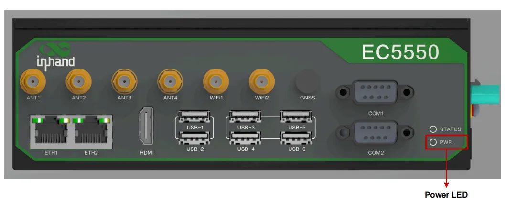</p>

<p align="center"><strong>图 1-3 电源指示灯</strong></p>

#### 1.3.3系统状态灯

前面板设有系统状态灯（绿色LED），该灯可指示系统运行状态，LED闪烁（频率1Hz）时表示系统运行正常，LED熄灭表示系统未运行。

<p align="center">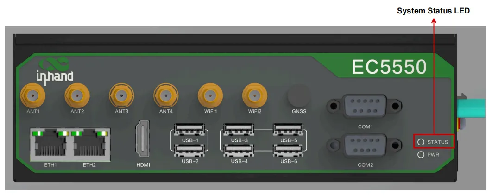</p>

<p align="center"><strong>图 1-4 系统状态灯</strong></p>

#### 1.3.4 串口

EC5000提供2个RS-232/422/485串口，采用DB9接口，功能定义说明如下。

<p align="center">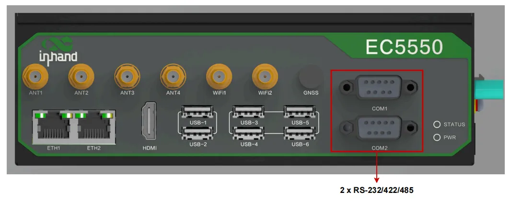</p>

<p align="center"><strong>图 1-5 串口DB9接口定义</strong></p>

<p align="center"></p>

<p align="center"><strong>图 1-6 串口接口位置</strong></p>

| DB9-F | RS-232 | RS-422 | RS-485 |
|-------|--------|--------|--------|
| 1 |  |  |  |
| 2 | RXD | RX+ |  |
| 3 | TXD | TX- | Data- |
| 4 |  |  |  |
| 5 | Ground | | |
| 6 |  |  |  |
| 7 |  | TX+ | Data+ |
| 8 |  | RX- |  |
| 9 |  |  |  |

#### 1.3.5 USB 3.2接口

EC5000提供2个最大功率15W的USB3.2 Gen 2 Type-A接口，以及4个最大功率4.5W的USB3.2 Gen 2 Type-A接口。当多个USB满负载工作时，需根据总负载情况选择120W（或以上）电源适配器。

<p align="center">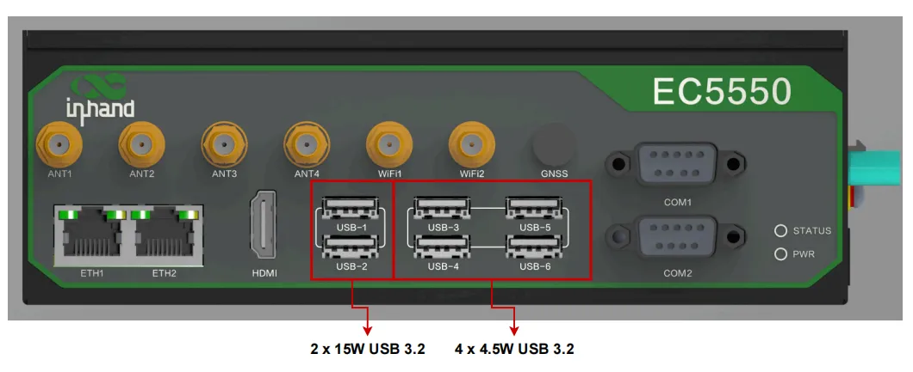</p>

<p align="center"><strong>图 1-7 USB 3.2接口</strong></p>

#### 1.3.6 HDMI接口

EC5000提供1个HDMI接头供外接屏幕使用，最高分辨率为3840 x 2160 @60Hz。

<p align="center">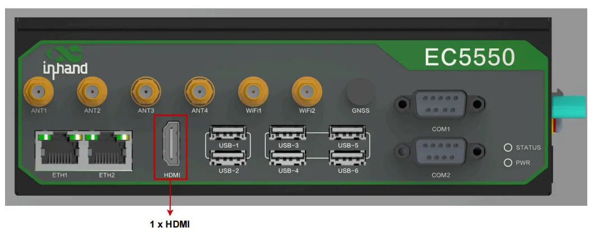</p>

<p align="center"><strong>图 1-8 HDMI接口</strong></p>

#### 1.3.7 以太网接口

EC5000提供2个以太网接口，其上方各有2个LED灯。绿色LED灯表示网络连接速率，在网络Link up后，且接口速率为1000Mbps时绿色LED亮起，否则绿色LED熄灭；橙色LED表示网络通信情况，在网络Link up时若有数据通信则橙色LED闪烁，否则橙色LED熄灭。

<p align="center">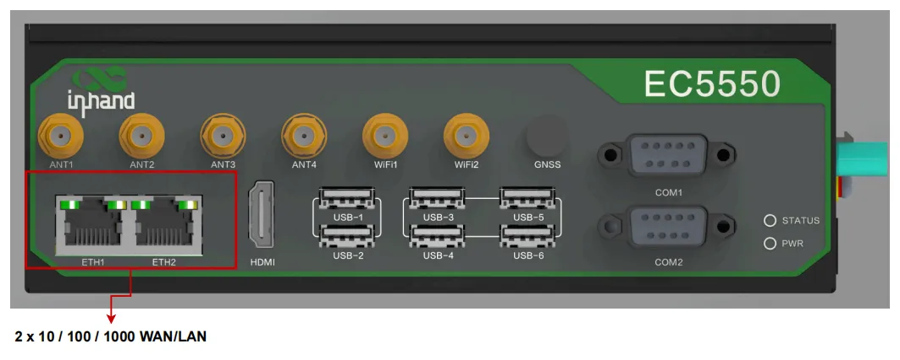</p>

<p align="center"><strong>图 1-9 以太网接口</strong></p>

| Green LED | | |
|-----------|---|---|
| OFF | ON | Blinking |
| 1. No connection<br>2. Speed 10Mbps<br>3. Speed 100Mbps | Speed 1000Mbps | - |
| Orange LED | | |
| OFF | ON | Blinking |
| 1. No connection<br>2. No activity on this port | - | Activity on this port |

#### 1.3.8 SMA接口

EC5000最多提供7个SMA接口，不同型号配备的4G/5G/Wi-Fi/GNSS天线种类及个数不同。具体型号天线的支持情况可参见《EC5000系列边缘AI计算机产品规格书》中"订购信息"部分。

<p align="center">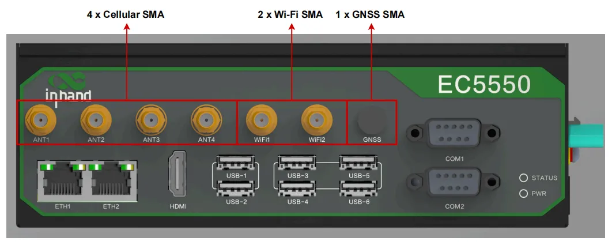</p>

<p align="center"><strong>图 1-10 SMA天线接口</strong></p>

#### 1.3.9 接地螺丝

EC5000提供1个系统接地螺丝，需使用绿黄双色的接地线（16AWG）并搭配系统接地螺丝接地。

<p align="center">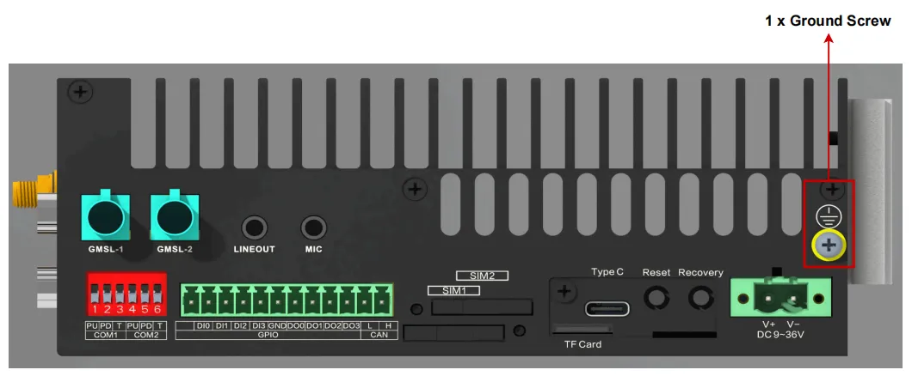</p>

<p align="center"><strong>图 1-11 接地螺丝</strong></p>

#### 1.3.10 直流电源输入接口

系统运行允许的电压范围为9V<sub>DC</sub>至36V<sub>DC</sub>；系统运行允许的电流范围为15A至5.6A。安装须由专业人员执行，只使用铜导体，并选择合适的线径。

<p align="center">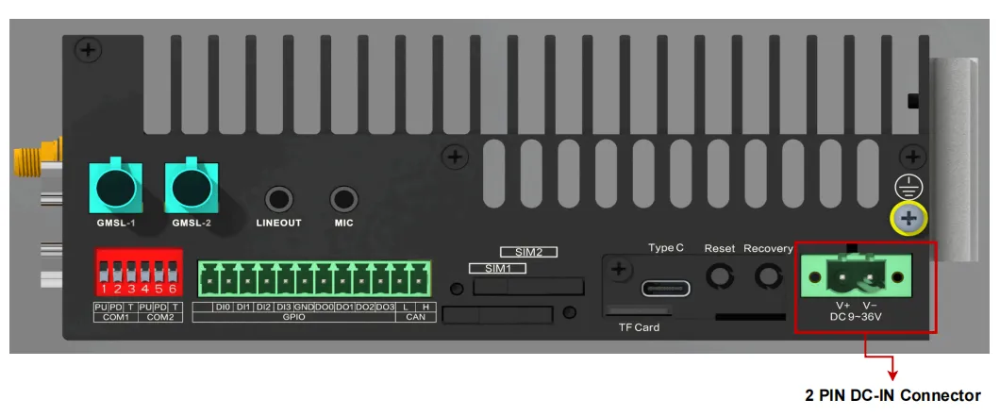</p>

<p align="center"><strong>图 1-12 直流电源输入接口</strong></p>

#### 1.3.11 Recovery轻触开关按键

EC5000可拆卸挡板下有Recovery轻触开关按键。在系统正常运行时按住Recovery 10秒，等待系统状态灯由闪烁变为常亮后松开，设备将进入系统重置状态（恢复为系统出厂状态）。在系统上电前或系统运行中按住Recovery按键，并重启系统（按Reset重启、reboot重启或掉电重启），则系统进入烧录模式。

<p align="center">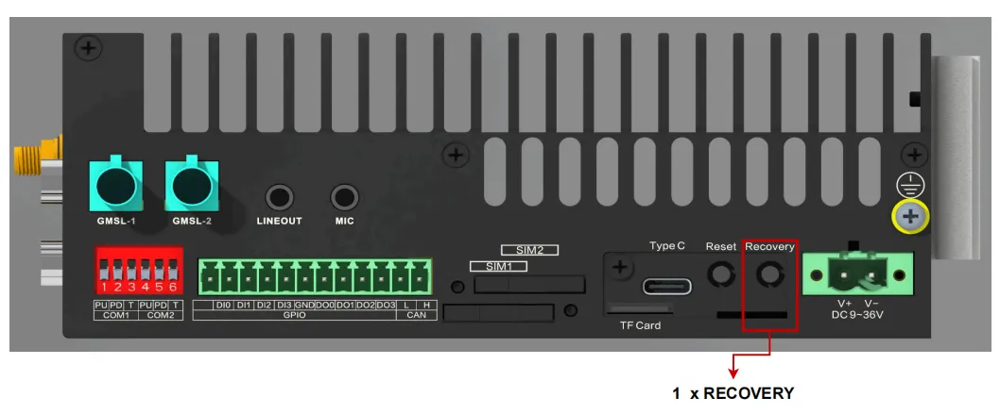</p>

<p align="center"><strong>图 1-13 Recovery轻触开关按键</strong></p>

#### 1.3.12 Reset轻触开关按键

EC5000可拆卸挡板下有Reset轻触开关按键。在系统正常运行时按住Reset 3秒内松开，则系统重启并使能硬件看门狗；按住Reset 3秒后松开，则系统重启并禁用硬件看门狗。在系统烧录前需禁用硬件看门狗，防止硬件看门狗重启系统导致烧写失败。

<p align="center">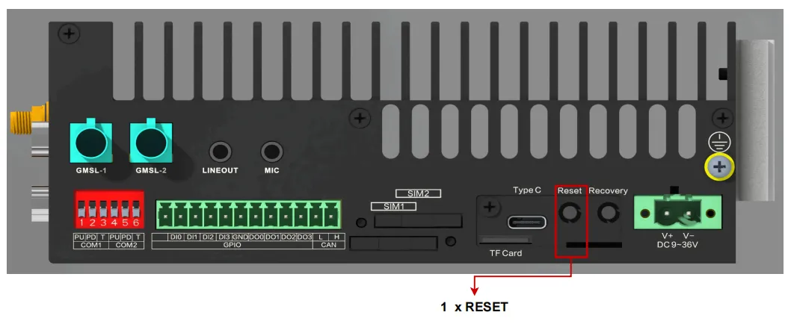</p>

<p align="center"><strong>图 1-14 Reset轻触开关按键</strong></p>

#### 1.3.13 USB 2.0 Type-C接口

EC5000可拆卸窗挡板下有USB 2.0 Type-C接口，用于在烧录模式下连接至主机烧录系统。

<p align="center">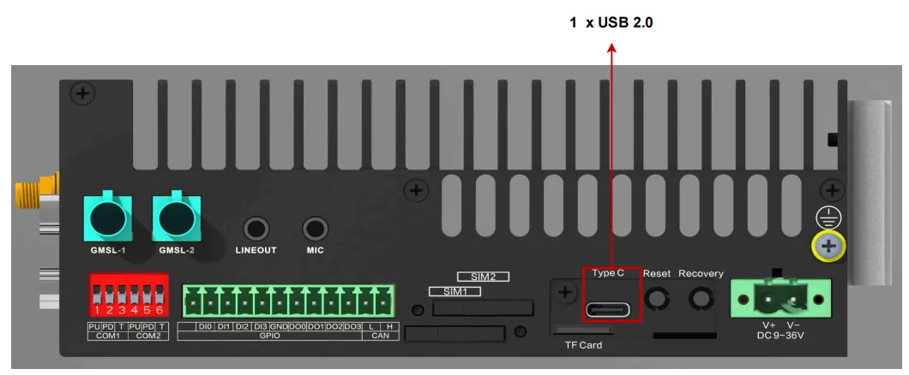</p>

<p align="center"><strong>图 1-15 USB 2.0 Type-C接口</strong></p>

#### 1.3.14 TF卡槽

EC5000可拆卸窗挡板下有TF卡槽，支持Micro SD存储卡。当有额外存储空间需求时，需在本卡槽插入至少8GB以上容量的Micro SD卡。

<p align="center">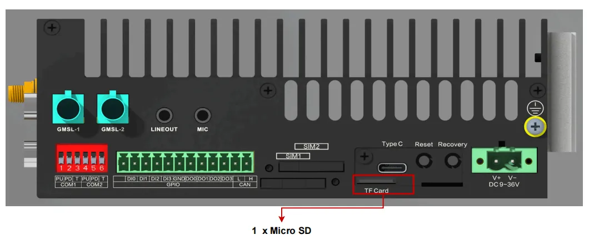</p>

<p align="center"><strong>图 1-16 TF卡槽</strong></p>

#### 1.3.15 SIM卡槽

EC5000提供2个SIM卡槽（SIM1/SIM2），支持标准SIM卡。当使用蜂窝网功能时需至少插入1张可用SIM卡。

<p align="center">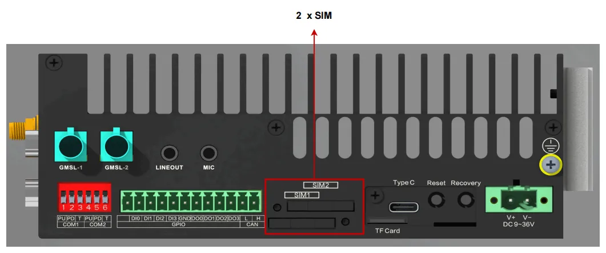</p>

<p align="center"><strong>图 1-17 SIM卡槽</strong></p>

#### 1.3.16 CAN FD接口

EC5000提供1个CAN FD接口（板载120Ω电阻），最大支持5Mbps通信速率。

<p align="center">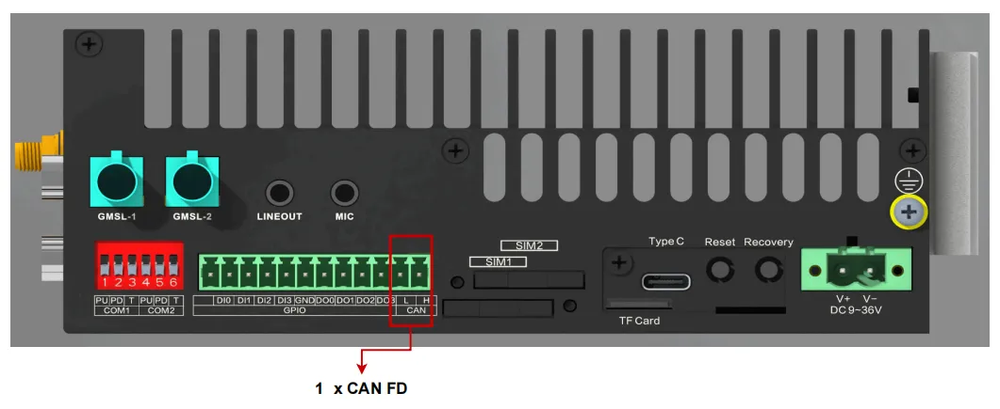</p>

<p align="center"><strong>图 1-18 CAN FD接口</strong></p>

#### 1.3.17 数字量输出接口

EC5000提供4个隔离式数字量输出接口，为开漏输出模式。

<p align="center">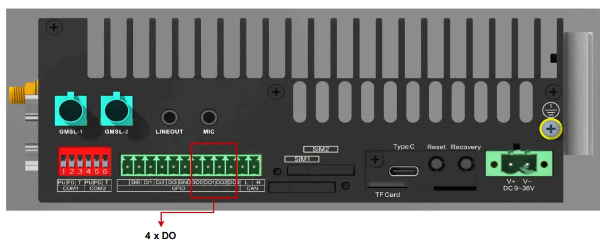</p>

<p align="center"><strong>图 1-19 数字量输出接口</strong></p>

接线方式如下：

<p align="center">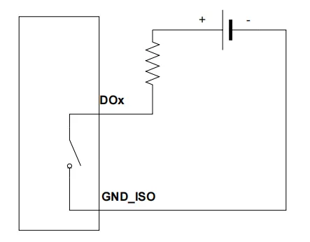</p>

<p align="center"><strong>图 1-20 数字量输出接线方式</strong></p>

| 参数 | 规格 |
|------|------|
| Number of Output Channels | 4 |
| Optical Isolation | 500 V<sub>DC</sub> |
| Supply Voltage | Sink 40 V<sub>DC</sub> |
| Sink Current | 0.2 A max./Channel |

#### 1.3.18 数字量输入接口

EC5000提供4个隔离式数字量输入接口，支持干湿接点。

<p align="center">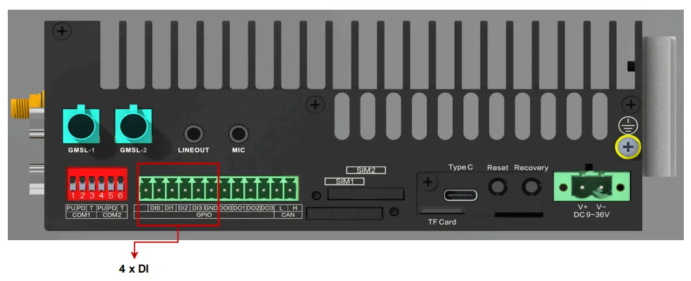</p>

<p align="center"><strong>图 1-21 数字量输入接口</strong></p>

接线方式如下：

<p align="center">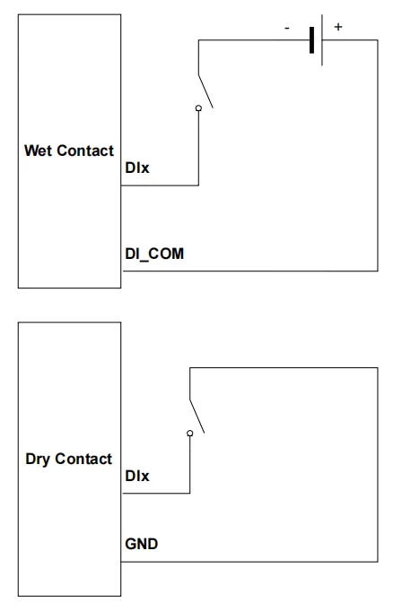</p>

<p align="center"><strong>图 1-22 数字量输入接线方式</strong></p>

| 参数 | 规格 |
|------|------|
| Number of Input Channels | 4 |
| Optical Isolation | 2500 V<sub>DC</sub> |
| Input Voltage (Dry contact) | Logic 1: Open<br>Logic 0: Close to ground |
| Input Voltage (Wet contact) | VIH(max.) = 60 V<sub>DC</sub><br>VIH(min.) = 5 V<sub>DC</sub><br>VIL(max.) = 2 V<sub>DC</sub> |

#### 1.3.19 RS-485 Pull-up/down拨码开关

EC5000提供1个RS-485上下拉拨码开关，可以控制RS-485总线（对应COM1/COM2）的上拉、下拉电阻以及终端匹配电阻。

<p align="center">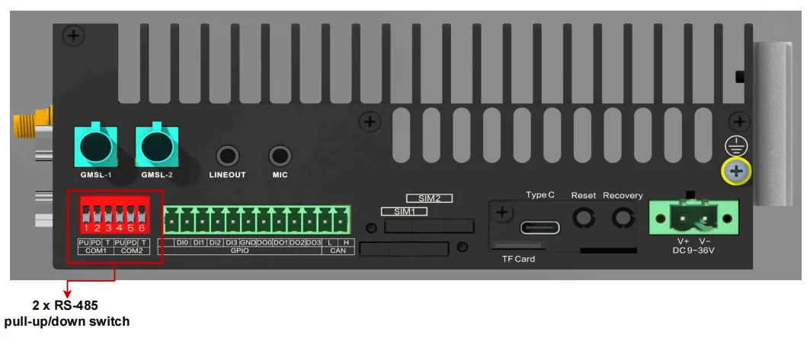</p>

<p align="center"><strong>图 1-23 RS-485 Pull-up/down拨码开关</strong></p>

| 开关 | 功能 |
|------|------|
| PU | ON: 使能上拉<br>OFF: 禁用上拉 |
| PD | ON: 使能下拉<br>OFF: 禁用下拉 |
| T | ON: 使能终端匹配电阻<br>OFF: 禁用终端匹配电阻 |

#### 1.3.20 GMSL 2.0接口

EC5000提供2个GMSL 2.0接口，支持对接2路GMSL摄像头。

<p align="center">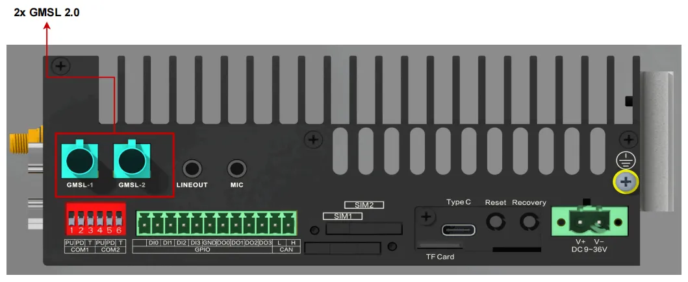</p>

<p align="center"><strong>图 1-24 GMSL 2.0接口</strong></p>

#### 1.3.21 线性输出Line-out接口

EC5000提供1个线性输出Line-out接口，支持3.5mm标准音频输出。

<p align="center">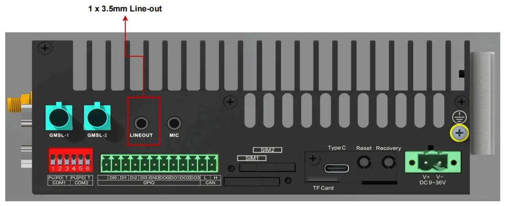</p>

<p align="center"><strong>图 1-25 线性输出Line-out接口</strong></p>

#### 1.3.22 麦克风接口

EC5000提供1个麦克风接口，支持3.5mm标准音频输入。

<p align="center">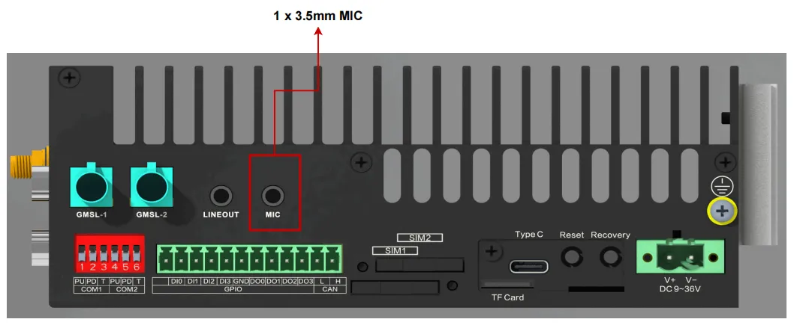</p>

<p align="center"><strong>图 1-26 麦克风接口</strong></p>

#### 1.3.23 扩展接口

EC5000支持以下扩展接口：

- 1 x M.2 B-Key 3042/3052（LTE/5G）
- 1 x M.2 E-Key 2230（Wi-Fi/BT）
- 1 x M.2 M-Key 2242（NVMe 128GB built-in）

### 1.4 指示灯说明

| 指示灯 | 状态 | 含义 |
|--------|------|------|
| 电源指示灯（红色） | 常亮 | 系统处于开机状态 |
|  | 熄灭 | 系统处于关机状态 |
| 系统状态灯（绿色） | 闪烁（1Hz） | 系统运行正常 |
|  | 熄灭 | 系统未运行 |
| 以太网Green LED | 常亮 | 网络Link up，速率1000Mbps |
|  | 熄灭 | 无连接或速率10/100Mbps |
| 以太网Orange LED | 闪烁 | 该端口有数据通信 |
|  | 熄灭 | 无连接或无数据通信 |

### 1.5 恢复出厂设置

EC5000可通过以下方式恢复出厂设置：

1. **Recovery按键重置**：在系统正常运行时按住Recovery按键10秒，等待系统状态灯由闪烁变为常亮后松开，设备将进入系统重置状态（恢复为系统出厂状态）。也可在上电后系统启动期间，状态灯快速闪烁3秒时按住Recovery键，持续按住约5秒，直到状态灯长亮后5秒内松开，设备进入系统重置状态。
2. **命令行重置**：打开Terminal，执行命令 `sudo update reset` 进行系统重置。

> **注意**：系统重置会将系统的配置状态和文件系统状态恢复到出厂状态，用户安装的软件也会被清除。此功能默认启用，可通过命令 `sudo update resetkey <enable/disable>` 进行控制。

### 1.6 默认设置

| 参数 | 默认值 |
|------|--------|
| 以太网eth2默认IP地址 | 192.168.4.100 |
| IEOS Web登录地址 | https://192.168.4.100:9100 |
| IEOS初始用户名 | adm |
| IEOS初始密码 | 123456 |
| 系统默认用户名 | System User（详见设备底面铭牌） |
| 系统默认密码 | 详见设备底面铭牌 |
| IEOS默认状态 | 启用 |
| 蜂窝功能 | 开启 |
| Wi-Fi Station | 关闭 |
| 硬件看门狗 | 可通过Reset按键控制 |


## 第2章 安装与首次使用

### 2.1 安装前准备

#### 2.1.1 环境要求

| 项目 | 要求 |
|------|------|
| 输入电压 | 9~36 VDC |
| 工作温度 | -20 ~ 60℃ |
| 工作湿度 | 95%@40℃（无凝结） |
| 存储温度 | -40 ~ 85℃ |
| 安装方式 | DIN导轨安装或壁挂安装 |

#### 2.1.2 工具与物料准备

- 兼容的电源适配器（建议功率 >= 65W，12V/120W或以上当多个USB满负载工作时）
- 16AWG绿黄双色接地线
- DIN导轨或壁挂套件（壁挂套件需单独购买）
- 网线（如需通过以太网访问）
- 显示器及HDMI线（如需通过HDMI访问）
- USB键盘鼠标（如需通过HDMI访问）

> **警告**：电源连接前需确认电压符合设备规格要求。设备须由专业人员安装，只使用铜导体，并选择合适的线径。
>
> **注意**：设备应在规定的温度和湿度范围内使用。请勿在易燃易爆环境中使用本设备。

### 2.2 安装指南

#### 2.2.1 DIN导轨安装

EC5000的DIN轨安装板附在设备下面板上，安装步骤如下：

1. 将DIN轨安装板的上方挂钩卡入到DIN轨支架的顶端。
2. 缓慢向DIN轨支架方向向前推动设备，使DIN轨底端卡入到位。

<p align="center">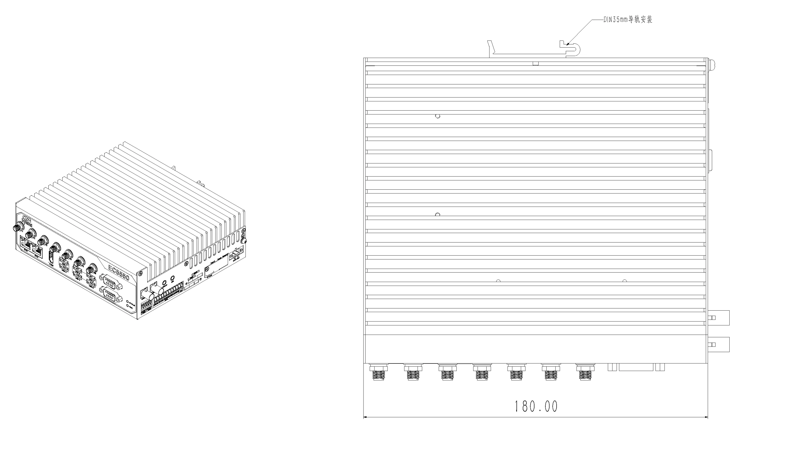</p>

<p align="center"><strong>图 2-1 DIN导轨安装</strong></p>

#### 2.2.2 壁挂式安装

EC5000可采用壁挂套件进行安装，套件需单独购买，安装步骤如下：

1. 使用螺钉将壁挂套件固定在EC5000的下面板上。
2. 当壁挂套件成功固定到EC5000后，使用螺钉将EC5000固定在墙面或柜子上。

<p align="center">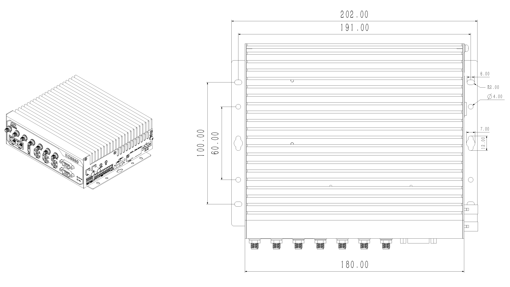</p>

<p align="center"><strong>图 2-2 壁挂式安装</strong></p>

#### 2.2.3 挂耳安装

<p align="center">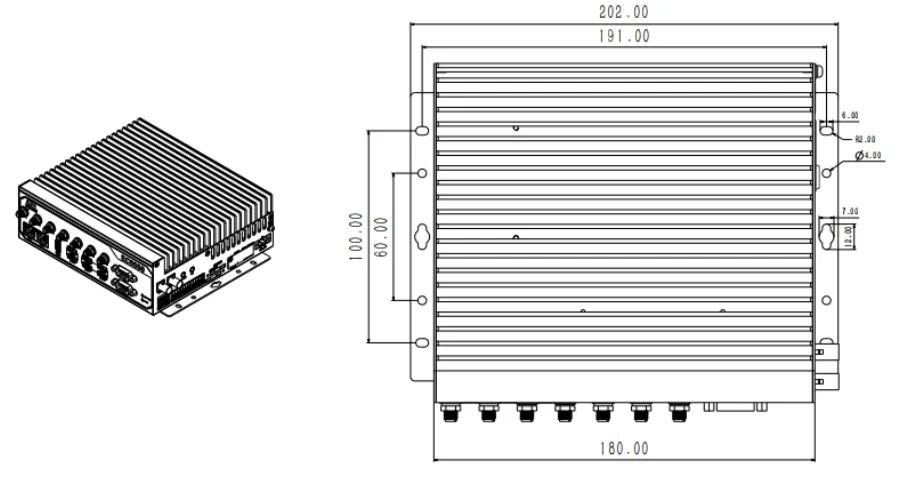</p>

<p align="center"><strong>图 2-3 挂耳安装</strong></p>

#### 2.2.4 电源连接

1. 将16AWG绿黄双色接地线连接至设备右面板的系统接地螺丝。
2. 将符合9~36 VDC规格的电源线连接至设备右面板的直流电源输入接口。
3. 上电后观察前面板电源指示灯，确认红色LED亮起，系统状态灯绿色LED开始闪烁（1Hz）。

#### 2.2.5 首次访问系统

EC5000支持两种方式访问系统：HDMI本地访问和SSH远程访问。

**方式一：通过HDMI连接显示器访问**

1. 通过HDMI 2.0接口将设备和显示器连接，将键盘及鼠标接入设备USB 3.2接口。
2. 给设备上电后等待设备启动完成。
3. 查看设备底面铭牌，查找系统默认用户名和密码。

<p align="center">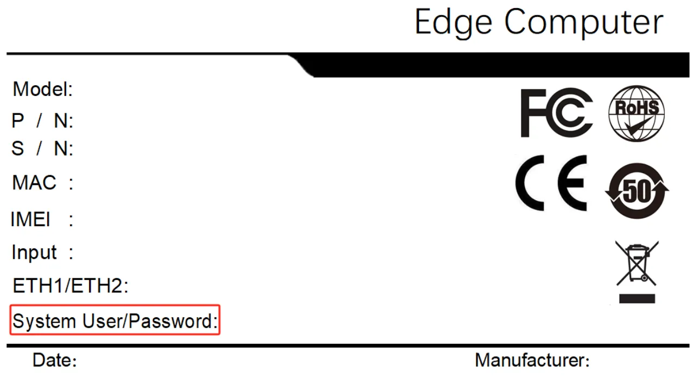</p>

<p align="center"><strong>图 2-4 设备底面铭牌</strong></p>

4. 在登录界面选择System User所对应的账户，输入密码后登录。

<p align="center"></p>

<p align="center"><strong>图 2-5 系统登录界面</strong></p>

<p align="center"></p>

<p align="center"><strong>图 2-6 系统登录成功</strong></p>

**方式二：通过SSH连接访问**

1. 使用网线将设备与主机连接，查看设备底面铭牌，查找系统默认以太网地址并配置主机和设备在同一网段。

<p align="center">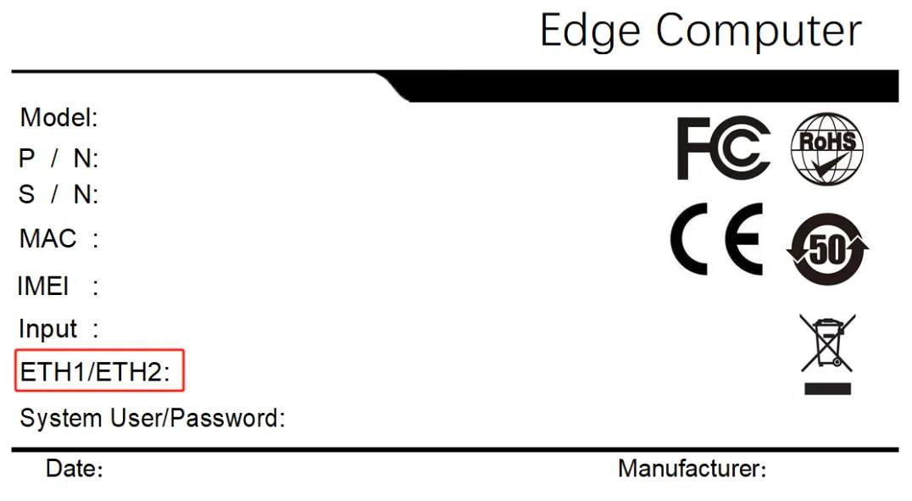</p>

<p align="center"><strong>图 2-7 设备网络地址铭牌</strong></p>

2. 打开SSH终端工具（以MobaXterm为例），输入设备地址后点击连接。

<p align="center"></p>

<p align="center"><strong>图 2-8 SSH终端连接</strong></p>

3. 根据提示内容，输入默认账户和密码。

<p align="center"></p>

<p align="center"><strong>图 2-9 SSH登录输入账户</strong></p>

<p align="center">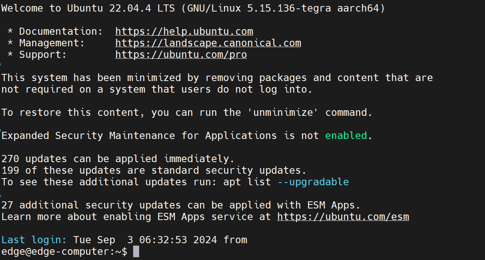</p>

<p align="center"><strong>图 2-10 SSH登录成功</strong></p>

#### 2.2.6 首次登录IEOS Web管理

EC5000出厂默认启用IEOS系统程序，提供Web管理界面。

1. 确保PC与设备eth2接口处于同一网段（eth2默认IP：192.168.4.100）。
2. 在浏览器地址栏输入 `https://192.168.4.100:9100`。
3. 输入初始用户名 `adm` 和初始密码 `123456`，点击登录。

> **注意**：IEOS使用9100端口号作为HTTPS连接端口，不支持HTTP访问。IEOS启用后会预留端口号范围9100~9200供内部通信使用，用户程序应避开使用这些端口号。

<p align="center"></p>

<p align="center"><strong>图 2-11 IEOS登录页面</strong></p>

### 2.3 快速检查

设备安装及首次启动完成后，建议按以下清单进行快速检查：

- [ ] 电源指示灯红色LED常亮，系统状态灯绿色LED以1Hz频率闪烁
- [ ] 设备无异常发热、异响或异味
- [ ] 通过HDMI或SSH可正常登录系统
- [ ] IEOS Web管理界面可正常访问（https://192.168.4.100:9100）
- [ ] 各接口无物理损坏，挡板安装牢固
- [ ] 接地线已可靠连接

---

## 第3章 常用场景配置

### 场景1：首次启动与系统登录

**目标**：完成设备上电启动，并通过HDMI或SSH方式登录系统。

**前提**：设备已完成物理安装，电源、接地、天线（如使用蜂窝/Wi-Fi/GNSS）已正确连接。

**预计用时**：约10分钟。

**操作步骤**：

1. 确认电源电压在9~36 VDC范围内，给设备上电。
2. 观察前面板指示灯：电源指示灯红色常亮，系统状态灯绿色以1Hz频率闪烁，表示系统运行正常。
3. **HDMI方式登录**：
   1. 通过HDMI 2.0接口连接显示器，将键盘鼠标接入USB 3.2接口。
   2. 等待系统启动完成后，在登录界面选择System User对应账户，输入密码后登录。
4. **SSH方式登录**：
   1. 将PC与设备以太网接口连接，配置PC与设备默认IP处于同一网段。
   2. 打开SSH终端工具，输入设备IP地址，按提示输入默认账户和密码完成登录。

**验证方法**：

1. 登录成功后，桌面或终端可正常操作。
2. 在Terminal执行命令 `sudo ecversion`，可查询到系统版本信息。

**常见问题**：

- 无法看到登录界面：检查HDMI连接是否牢固，显示器是否切换至正确输入源。
- SSH连接超时：检查PC与设备是否在同一网段，确认设备IP地址正确。

### 场景2：配置以太网连接

**目标**：通过IEOS Web管理界面配置以太网接口，实现设备与网络的连接。

**前提**：已通过网线将设备与PC或上级网络连接，且可访问IEOS Web管理界面。

**预计用时**：约5分钟。

**操作步骤**：

1. 登录IEOS Web管理界面，进入【网络】->【以太网】。
2. 如需配置静态IP地址：
   1. 选择对应以太网接口，点击"编辑"按钮。
   2. 将IPv4 Method设置为Static，填写Address、Netmask、Gateway及DNS。
   3. 点击"保存"使配置生效。
3. 如需配置DHCP Client：
   1. 选择对应以太网接口，将IPv4 Method设置为DHCP。
   2. 点击"保存"使配置生效。
4. 如需在接口上启动DHCP Server功能：
   1. 进入对应接口配置页面，启用DHCP Server。
   2. 配置Starting Address、Max Address Number及Lease period。
   3. 点击"保存"。

**验证方法**：

1. 在IEOS【状态】->【设备信息】页面查看网络接口IP地址是否获取正确。
2. 通过Terminal执行 `ping <网关地址>`，确认网络层连通性。

**常见问题**：

- 配置保存后未生效：部分配置需重启网络接口或重启系统生效。
- 无法访问Web界面：确认PC与设备eth2接口处于同一网段，且使用HTTPS协议及9100端口。

### 场景3：配置蜂窝网络联网

**目标**：通过4G/5G蜂窝网络接入互联网。

**前提**：已插入SIM卡并安装蜂窝天线，设备已上电，IEOS Web管理界面可正常访问。

**预计用时**：约10分钟。

**操作步骤**：

1. 将SIM卡插入SIM1/SIM2卡槽，安装蜂窝天线。
2. 登录IEOS Web管理界面，进入【网络】->【蜂窝】。
3. 在基本配置中确认Enabled开关为开启状态。
4. 如使用专网卡，需在Profiles中添加拨号参数集（APN、用户名、密码、认证方式），并在APN Profile中选择对应参数集Index。
5. 配置Network Mode（通常选择"自动"即可）。
6. 确认Enable Default Route已开启，以便拨号成功后添加默认路由。
7. （建议）开启ICMP探测功能以检测拨号假连接：
   1. 配置ICMP Detection Server Probes（至少1个可达地址）。
   2. 设置Detection Interval、Detection Timeout及Detection Max Retries。
   3. 保存配置。
8. 如需使用双卡单拨功能，开启Dual SIM Enabled，配置Main SIM及Max Number of Dials。
9. 点击"保存"，等待拨号成功。

**验证方法**：

1. 在IEOS【状态】->【蜂窝拨号状态信息】页面查看IMEI、IMSI、信号强度及获取的IP地址。
2. 通过Terminal执行 `ping 8.8.8.8`，确认蜂窝网络连通性。

**常见问题**：

- 拨号失败无信号：检查SIM卡是否正确插入、天线是否连接、APN参数是否与运营商一致。
- 拨号成功但无法上网：可能是拨号假连接，开启ICMP探测功能后可自动恢复。
- 双卡切换异常：确认两张SIM卡均可用，且Max Number of Dials设置合理。

### 场景4：配置Wi-Fi Station联网

**目标**：通过Wi-Fi接入现有无线网络。

**前提**：设备配备Wi-Fi模组，且可访问IEOS Web管理界面。

**预计用时**：约5分钟。

**操作步骤**：

1. 登录IEOS Web管理界面，进入【网络】->【Wi-Fi Station】。
2. 开启Enable Wi-Fi开关。
3. 在Client SSID中输入需要连接的无线网络名称，或通过"扫描"按钮获取附近可用SSID。
4. 选择Auth Method（如WPA2-PSK）及Encrypt Mode（如CCMP）。
5. 输入WPA/WPA2 PSK Key。
6. 确认Enable Default Route按需开启，并设置合理的Metric值。
7. 点击"保存"，等待Wi-Fi连接建立。

**验证方法**：

1. 在IEOS【状态】->【Wi-Fi Station状态信息】页面查看获取的IP地址、网关及DNS。
2. 通过Terminal执行 `ping <网关地址>` 或访问互联网，确认连通性。

**常见问题**：

- 扫描不到目标SSID：检查Wi-Fi天线是否安装，确认目标网络在设备信号覆盖范围内。
- 连接失败：核对SSID、密码及认证加密方式是否与目标网络一致。

### 场景5：配置IEOS Web管理

**目标**：通过IEOS Web界面完成设备基础系统管理配置（云管理、时区、固件升级）。

**前提**：可正常访问IEOS Web管理界面。

**预计用时**：约15分钟。

**操作步骤**：

1. **配置云管理（DeviceLive）**：
   1. 进入【系统管理】->【基础配置】->【云管理】。
   2. 开启Enabled开关，选择Cloud Server（国内平台或海外平台）。
   3. 点击"保存"。
2. **配置时区与NTP**：
   1. 进入【系统管理】->【基础配置】->【时区和NTP client】。
   2. 选择正确的时区，配置NTP Server地址（最多10个）。
   3. 点击"保存"。
3. **固件升级**：
   1. 进入【系统管理】->【固件升级】。
   2. 上传升级镜像文件，点击"升级"。
   3. 如需升级后自动重启，开启自动重启选项；否则手动重启系统使升级生效。
4. **配置备份与恢复**：
   1. 进入【系统管理】->【基础配置】->【配置导入导出】。
   2. 点击"导出"备份当前配置；点击"导入"恢复已保存的配置。
   3. 点击"重置"可将系统恢复出厂（该操作会清除用户安装的软件）。

**验证方法**：

1. 在【状态】->【设备信息】页面确认固件版本、系统时间正确。
2. 若启用云管理，在DeviceLive平台查看设备是否在线。

**常见问题**：

- 固件升级失败：确认镜像文件与设备型号匹配，升级过程中勿断电。
- NTP时间不同步：检查设备网络连通性，确认NTP服务器可达。

### 场景6：配置串口与外设

**目标**：完成串口工作模式切换及数字量输入输出控制。

**前提**：已通过SSH或HDMI登录设备系统。

**预计用时**：约10分钟。

**操作步骤**：

1. **串口模式切换**：
   1. 打开Terminal。
   2. 执行命令查询或切换串口模式，例如将COM1切换为RS-485模式：
      ```
      sudo uart_mode COM1 485
      ```
   3. COM1对应设备节点 `/dev/ttyCOM1`，COM2对应 `/dev/ttyCOM2`。
2. **数字量输入读取**：
   1. DI0~DI3对应GPIO路径 `/sys/class/gpio/gpio308` ~ `/sys/class/gpio/gpio311`。
   2. 通过读取对应GPIO value文件获取输入状态。
3. **数字量输出控制**：
   1. DO0~DO3对应GPIO路径 `/sys/class/gpio/gpio312` ~ `/sys/class/gpio/gpio315`。
   2. 通过向对应GPIO value文件写入1或0控制输出状态。
4. **CAN FD配置**：
   
   1. 打开Terminal，执行命令启动CAN接口：
      ```
      sudo ip link set can0 up type can bitrate 1000000 dbitrate 5000000 restart-ms 1000 fd on
      ```

**验证方法**：

1. 串口模式切换后，通过 `ls -l /dev/ttyCOM1` 确认设备节点存在。
2. 数字量输入输出可通过读取/写入GPIO值验证。
3. CAN FD可通过 `ip link show can0` 查看接口状态为UP。

**常见问题**：

- 串口通信异常：确认串口模式（RS-232/422/485）与对端设备一致，检查RS-485拨码开关状态。
- CAN FD无法启动：确认波特率参数正确，检查CAN总线终端电阻。

---


## 第4章 功能说明与参数参考

### 4.1 用户账户管理

#### 4.1.1创建账户

打开桌面Terminal或点击鼠标右键点击Open in Terminal，并输入下述命令，根据提示输入密码以及账户信息，创建前请确认账户是否存在，对于已经存在的账户，再次创建将提示The user 'username' already exists 。

```json
## 查询test账户是否存在
id test
## 创建test账户
sudo adduser test
```

<p align="center">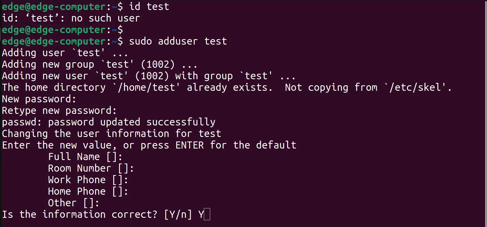</p>

<p align="center"><strong>图 4-1 创建账户</strong></p>

#### 4.1.2 删除账户

打开桌面Terminal或点击鼠标右键点击Open in Terminal，并输入下述命令删除账户，删除账户前请确认账户是否存在，如果删除不存在的账户将提示The user 'username' does not exist。

```json
## 查询test账户是否存在
id test
## 删除test账户
sudo deluser test
```

<p align="center">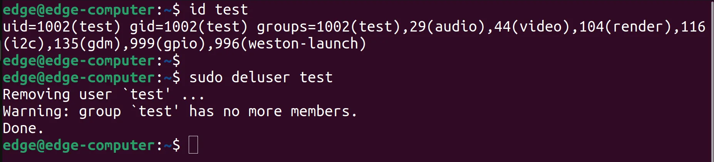</p>

<p align="center"><strong>图 4-2 删除账户</strong></p>

#### 4.1.3 禁用和启用账户

打开桌面Terminal或点击鼠标右键点击Open in Terminal，并输入下述命令禁用/启用账户，禁用/启用账户前请确认账户是否存在，如果账户不存在将提示The user 'username' does not exist。

```json
## 查询test账户是否存在
id test
## 禁用test账户
sudo passwd -l test
## 启用test账户
sudo passwd -u test
## 查询test账户状态（L禁用/P启用）
sudo passwd -S test
```

<p align="center"></p>

<p align="center"><strong>图 4-3 禁用和启用账户</strong></p>

**账户管理高级扩展**

参考：

1. [Ubuntu Manpage: adduser, addgroup - add a user or group to the system](https://manpages.ubuntu.com/manpages/xenial/en/man8/adduser.8.html?_gl=1*1jz4dhl*_gcl_au*MTkwNTc0MDUwMC4xNzI1MzQ3ODI1&_ga=2.97338463.1940871822.1725347824-1111823313.1715413709)
2. [Ubuntu Manpage: deluser, delgroup - remove a user or group from the system](https://manpages.ubuntu.com/manpages/focal/en/man8/deluser.8.html?_gl=1*2hnawf*_gcl_au*MTkwNTc0MDUwMC4xNzI1MzQ3ODI1&_ga=2.165044991.1940871822.1725347824-1111823313.1715413709)
3. [Ubuntu Manpage: passwd - change user password](https://manpages.ubuntu.com/manpages/bionic/man1/passwd.1.html?_gl=1*1rjws9d*_gcl_au*MTkwNTc0MDUwMC4xNzI1MzQ3ODI1&_ga=2.211133397.1940871822.1725347824-1111823313.1715413709)
4. [Ubuntu Manpage: usermod - modify a user account](https://manpages.ubuntu.com/manpages/trusty/en/man8/usermod.8.html?_gl=1*2hnawf*_gcl_au*MTkwNTc0MDUwMC4xNzI1MzQ3ODI1&_ga=2.165044991.1940871822.1725347824-1111823313.1715413709)

### 4.2 基于IEOS的Web管理

EC5000基于Ubuntu22.04系统，因此可以使用Linux原生的命令进行网络管理和系统管理；为了便于用户配置，映翰通开发了一套IEOS系统程序，提供web界面，用户可以方便的通过web进行网络管理和系统管理，但需要注意的是，当启用IEOS功能后，IEOS会接管网络管理和系统管理，此时通过Linux原生命令进行网络管理和系统管理可能会失效；设备出厂默认启用IEOS，如果用户需要基于Linux原生的命令行进行网络管理和系统管理，需要先关闭IEOS。

IEOS是映翰通自研的一套运行在Linux系统上的网络管理和系统管理程序，IEOS提供web界面，用户可以通过web进行以太网口ip地址，蜂窝拨号，Wi-Fi Station，DHCP Client/Server，静态路由，防火墙等网络配置；也可以对系统时间，时区，固件升级和系统重启等进行操作；另外IEOS还支持对接映翰通的设备管理平台DeviceLive，用户可以通过DeviceLive平台对EC5000设备进行远程监控和管理。

IEOS采用状态和配置分离的设计方案，分为网络管理，系统管理和状态三大功能板块。网络管理菜单和系统管理菜单下只能进行网络和系统的相关配置，状态信息需要统一到状态页面查看。

重要说明：使用IEOS程序管理网络配置和系统配置的时候，如果同时使用Linux原生命令，二者可能会相互影响，导致异常的运行状态。建议IEOS支持的配置都通过IEOS web来实现管理，IEOS不支持的配置，比如VPN，可以结合Linux原生命令一起实现配置目标。

#### 4.2.1 登录Web

考虑到用户的程序可能会需要使用HTTP/HTTPS标准端口号80/443，IEOS使用9100端口号做为HTTPS连接的端口，不支持通过HTTP访问；当用户使用HTTP访问web的时候，会自动跳转到通过HTTPS。本文档以通过eth2的默认地址192.168.4.100为例来进行说明。用户可以在桌面系统中点击Show Applications->Firefox Web Browser，输入https://127.0.0.1:9100登入，也可通过外部网络访问设备配置页面。

本文档以通过eth2的默认地址192.168.4.100为例来进行说明。

登陆地址：https://192.168.4.100:9100

初始登陆用户名是adm，登录密码是123456。

重要说明：IEOS程序启用时，会预留一些端口号供内部通信使用，预留端口号范围9100 ~ 9200，启用IEOS后，客户的程序应该避开使用这些端口号，否则可能会产生冲突导致功能异常。

<p align="center"></p>

<p align="center"><strong>图 4-4 IEOS登录页面</strong></p>

#### 4.2.2 网络管理

##### 4.2.2.1配置以太网接口

给eth1接口配置静态IP地址

<p align="center">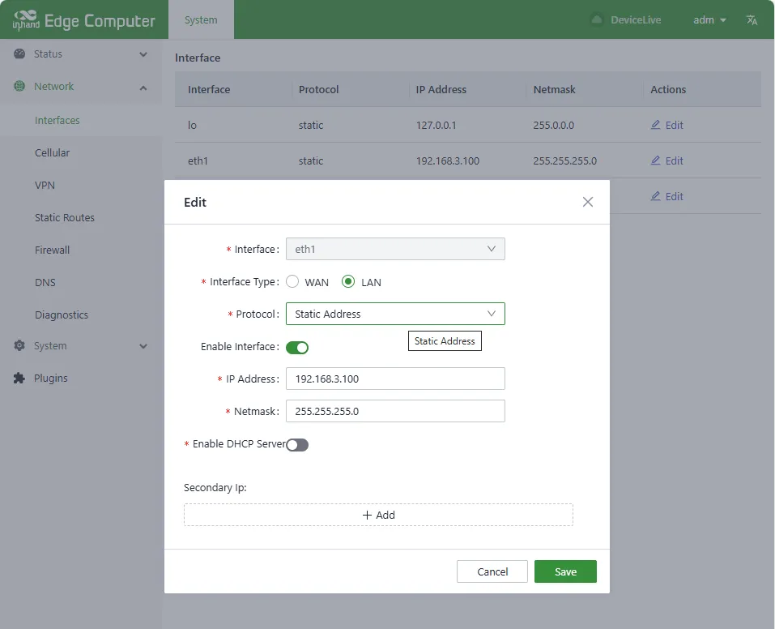</p>

<p align="center"><strong>图 4-5 以太网静态IP配置</strong></p>

给eth1接口配置DHCP Client

<p align="center">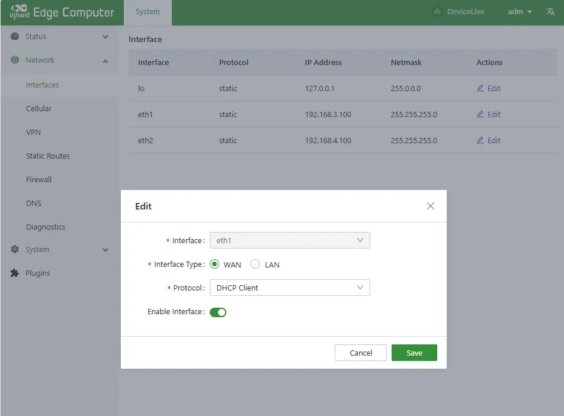</p>

<p align="center"><strong>图 4-6 以太网DHCP配置</strong></p>

在eth1接口上启动dhcp server功能，给eth1的下挂设备分配地址

<p align="center">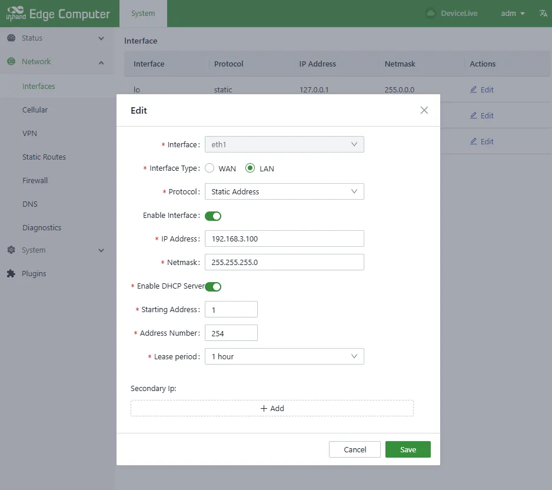</p>

<p align="center"><strong>图 4-7 DHCP Server配置</strong></p>

DHCP Server配置参数说明：

**Enable DHCP Server**：DHCP Server功能的开关

**Starting Address**：DHCP Server地址池起始基址，网段 + 起始地址 = 地址池的起始ip地址。在截图中，eth1的网段是192.168.3.0/24，基址是1，则地址池的起始地址是192.168.3.1/24.

**Max Address Number**：地址池中的最大地址数量.

**Lease period**：租期时间

##### 4.2.2.2 配置蜂窝拨号

<p align="center">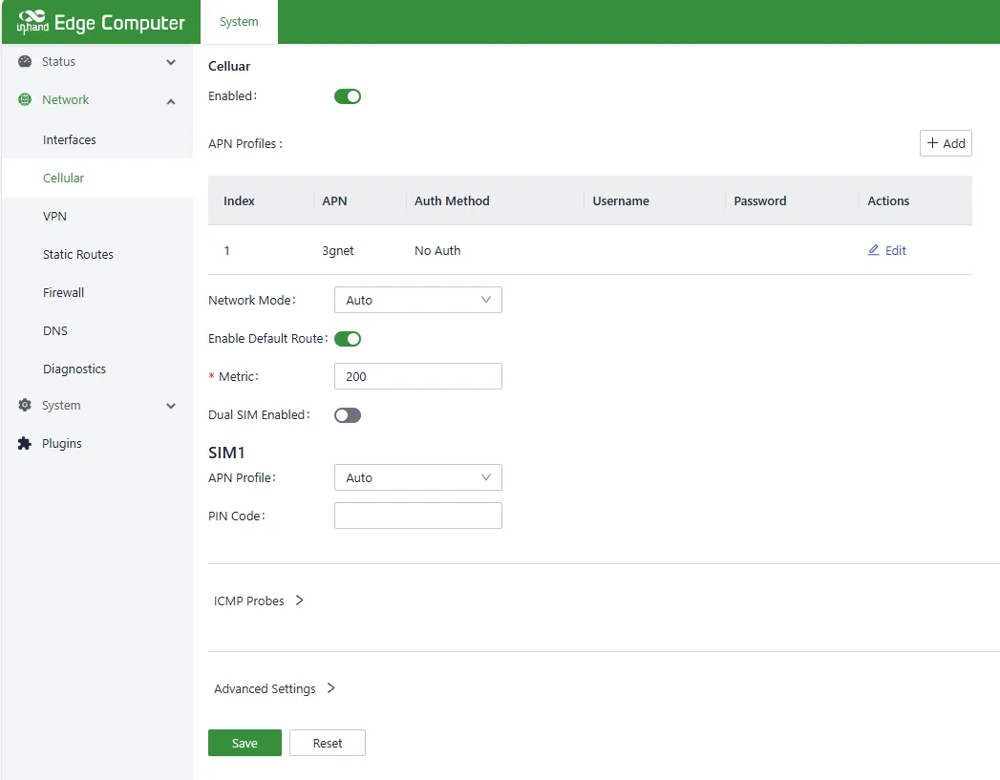</p>

<p align="center"><strong>图 4-8 蜂窝拨号基本配置</strong></p>

蜂窝网参数说明：

**Enabled**: 蜂窝功能的开关；默认是开启的状态。

**Profiles**：拨号参数集，用于专网卡拨号时配置APN，用户名，密码以及认证方式等信息。如果不是专网卡，通常不需要修改这里的配置。拨号参数集最多可以添加10条记录。

**Network Mode**：蜂窝的网络制式，可以选择3G，4G等相关网络制式，比如LTE，WCDMA等。如果不清楚选哪种网络制式，则选择自动；程序会自动选择一个最合适的网络制式。默认值是自动。

**Enable Default Route**：启用添加默认路由功能，开启后，当拨号成功后，会添加一条蜂窝口的默认路由。默认是开启的。

**Metric**：蜂窝口默认路由的度量值，当蜂窝口，Wi-Fi和以太网口都配置了默认路由的时候，度量值最小的生效。

<p align="center">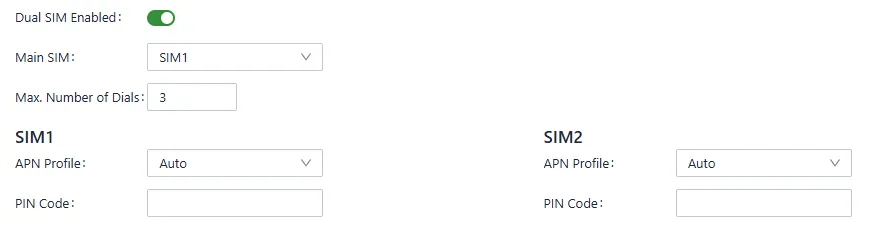</p>

<p align="center"><strong>图 4-9 蜂窝拨号高级配置</strong></p>

**Dual SIM Enabled**：启用双卡功能。EC5000为了提高网络的可靠性，支持双卡单拨。设备上需要插入2张sim卡，开启该功能后，如果sim1卡因为欠费导致拨号失败，会自动切换到sim2卡进行拨号。默认是关闭的。

**Main SIM**：主sim卡，拨号时会优先使用选中的sim卡进行拨号，拨号失败达到一定次数时，再切换到另外一张sim卡进行拨号，默认先使用sim1进行拨号。

**Max Number of Dials**: 开启双卡单拨功能后，当前拨号sim卡拨号达到指定次数，切换到另外一张sim卡进行拨号。

**APN Profile**: sim卡选用的拨号参数集，默认值是自动。通常专网卡需要配置拨号参数集，并在此处选择拨号参数集的Index。

**PIN Code**：sim卡的PIN码。

<p align="center">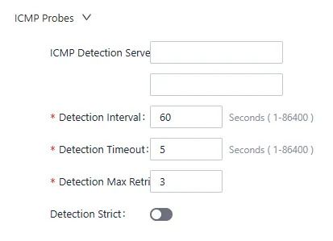</p>

<p align="center"><strong>图 4-10 蜂窝ICMP探测配置</strong></p>

无线蜂窝网络比较复杂，有些时候会出现拨号假连接的情况，即拨号状态是成功的，但却ping不通目标地址；发生这些状况的时候，重新拨号一次就可以恢复正常。IEOS蜂窝拨号支持ICMP探测以发现假连接。建议使用蜂窝联网的客户开启ICMP探测，这样出现假连接的时候也可以快速恢复。

ICMP探测参数：

**ICMP Detection Server Probes**：ICMP探测地址；可以配置2个探测地址，只要有1个地址探测成功，则说明蜂窝没有出现假连接。2个地址都没有配置的时候，ICMP探测功能处于关闭状态。

**Detection Interval**：间隔多久进行一次ICMP探测。

**Detection Timeout**：ICMP探测超时时间，等待多久没有收到探测响应报文，则认为此次探测失败

**Detection Max Retries**：最大探测次数；当探测失败达到这个值的时候，触发重新拨号。取值范围[1,5]

**Detection Strict**：是否开启严格探测。关闭严格探测时，探测程序在每个探测周期会检测蜂窝接口接收的报文是否发生变化，如果有变化，说明蜂窝网络是通的，则不会发送ICMP报文进行探测，这样可以节省一些流量；如果开启探测，则无论蜂窝接口接收报文的数量是否发生变化，都会周期性的发送ICMP探测报文。默认是关闭的。

<p align="center">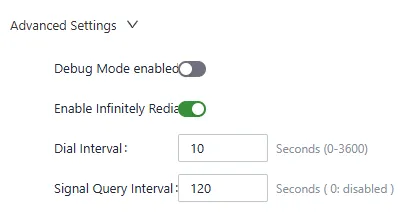</p>

<p align="center"><strong>图 4-11 蜂窝拨号高级设置</strong></p>

高级配置中是一些不常用的设置选项。

**Debug Mode enabled**：是否启用debug功能，开启后，日志中会增加一些拨号相关的调试信息，默认关闭。

**Enable Infinitely Redial**：开启无限重拨。某些情况下，拨号会处于异常状态，通过重启系统可以恢复正常；默认无限重拨是关闭的，当拨号失败一定次数后，会重启系统尝试恢复。由于拨号默认是开启的，有些客户在不插sim卡的情况下，拨号失败，系统会重启，针对这种情况，可以开启无限重拨；这样无论拨号失败多少次，系统都不会重启。

**Dial Interval**：拨号间隔；但某次拨号失败时，进行下一次拨号之前等待的时间。

**Signal Query Interval**：信号查询间隔。信号不好时，可能会产生假连接的问题；这时重新拨号有一定概率可以解决假连接的问题。拨号程序会定期检测信号强度，这里配置的是信号检测周期。

##### 4.2.2.3 配置Wi-Fi

<p align="center">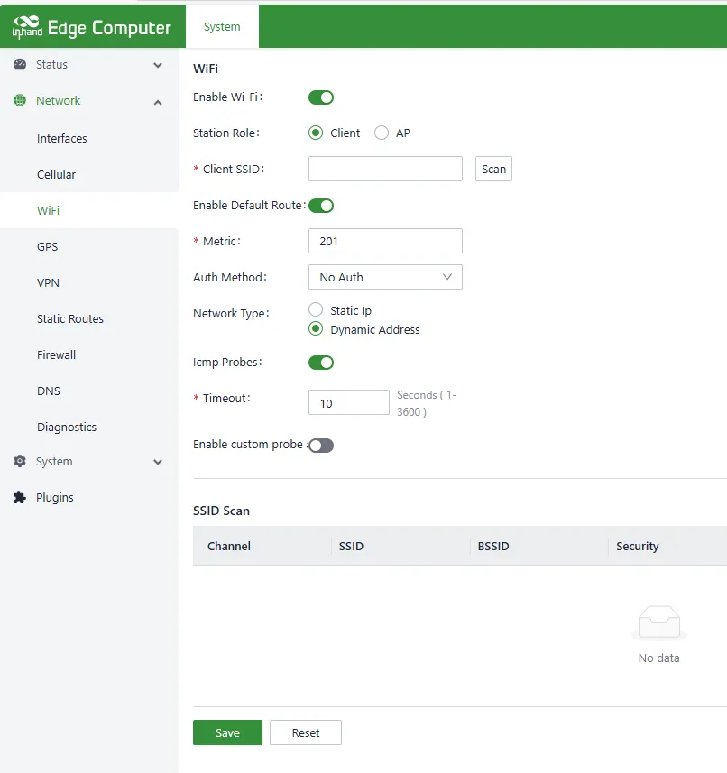</p>

<p align="center"><strong>图 4-12 Wi-Fi Station配置</strong></p>

**Enable Wi-Fi**：使能开关；默认关闭

**Client SSID**：需要连接的ssid，可以手动输入；也可以通过扫描按钮获取附近可连的ssid

**Enable Default Route**：是否启用添加默认路由功能，开启后，当wifi连接成功后，会添加一条wlan口的默认路由。默认是开启的。

**Metric**：wifi口默认路由的度量值，当蜂窝口，Wi-Fi和以太网口都配置了默认路由的时候，度量值最小的生效。

**Auth Method**：认证方式，支持无认证，WPA-PSK，WPA2-PSK，WPA-PSK/WPA2-PSK Mixed

**Encrypt Mode**：加密方式；支持CCMP，TKIP，TKIP和CCMP

**WPA/WPA2 PSK Key**：密钥信息

##### 4.2.2.4 配置静态路由

这里配置的是以太网的静态路由，当同时配置了以太网，蜂窝，wifi的默认路由时，metric值最小的那一条默认路由生效。需要保证默认路由的Metric值是不同的。

<p align="center">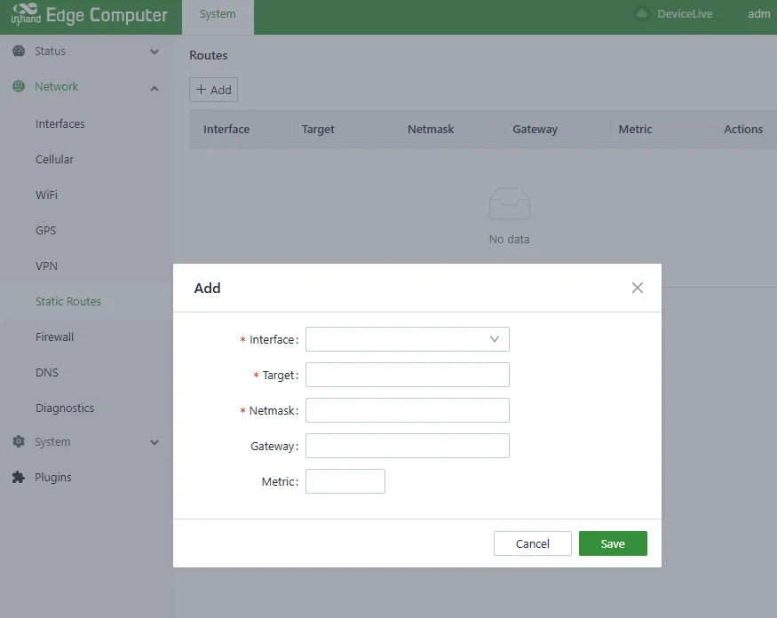</p>

<p align="center"><strong>图 4-13 静态路由配置</strong></p>

静态路由配置参数：

**Interface**：静态路由的出接口

**Target**：目标网络

**Netmask**：目标网络掩码

**Gateway**：下一跳地址

**Metric**：静态路由的度量值

##### 4.2.2.5  配置防火墙

<p align="center">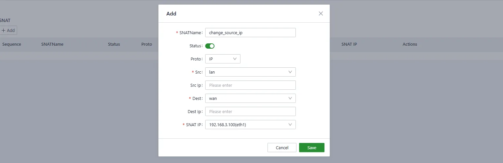</p>

<p align="center"><strong>图 4-14 防火墙SNAT配置</strong></p>

SNAT Name: 用于配置SNAT规则的名称，可以用于说明SNAT规则的目的。

Status：添加规则后，可以启用/禁用该规则；当Status为off的时候，则禁用规则。

Proto：支持IP/UDP/TCP等协议类型

Src：报文来自于哪个域，即来自哪个接口，通常是局域网域。

Src IP：匹配报文的源IP地址；可以不填写，即匹配所有源IP地址。

Dest：报文从哪个域发出去，通常是广域网域

Dest Ip：报文的目的IP地址；可以不填写，即匹配所有报文

SNAT IP：将报文的源ip修改后的IP地址。

截图中规则的含义是：将从lan域(eth2)进入的，路由到wan域(eth1)发送处于的报文的源IP地址，修改为eth1接口的ip地址，即192.168.3.100.

- Comm rules

通信规则用于过滤报文转发

<p align="center">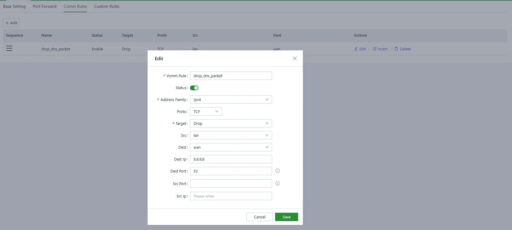</p>

<p align="center"><strong>图 4-15 防火墙通信规则</strong></p>

Comm Rule: 用于标识规则，可以描述规则的目标。

Status： 添加规则后，可以启用/禁用该规则；当Status为off的时候，则禁用规则。

Proto：支持IP/UDP/TCP等协议类型

Target：目标处理动作，可以Drop，Accept或Reject

Src：报文从哪个域进入设备

Dest：报文经过哪个域从设备发出

Dest IP: 报文的目标地址；不配置时匹配所有目标地址

Dest Port：报文的目标端口；不配置时匹配所有端口

Src IP：报文的源IP地址；不配置时匹配所有源IP地址

Src Port：报文的源端口；不配置时匹配所有源端口

- MAC Address filtering

<p align="center">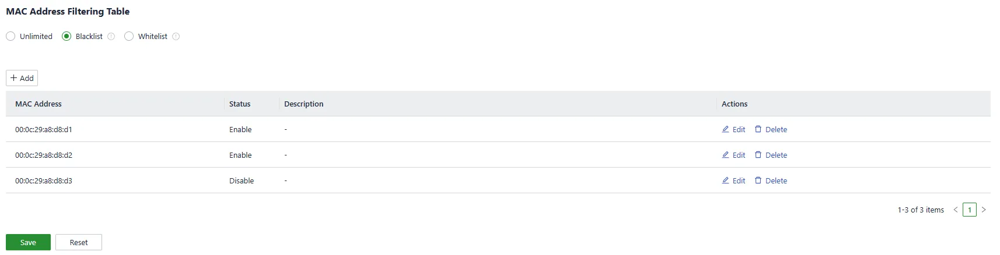</p>

<p align="center"><strong>图 4-16 防火墙MAC地址过滤</strong></p>

MAC地址过滤功能用于控制设备下挂设备产生的报文是否可以被设备转发，但不会影响下挂设备对设备本身的访问。MAC地址列表中最多可以添加500条规则。

该功能包含三种模式：Unlimited, Blacklist和 Whitelist。当模式为Unlimited时，相当于该功能是关闭的，不会对MAC地址列表中的设备产生影响；当模式为Blacklist时，MAC地址列表中的设备产生的报文将被丢弃，其他MAC地址的设备产生的报文可以被正常转发；当模式为Whitelist是，只有MAC地址列表中的设备产生的报文可以被转发，其他MAC地址的设备产生的报文会被丢弃。

MAC地址列表中每一个记录都可以启用/禁用，当某个记录处于禁用状态时，该MAC地址对应的设备相当于不存在于Blacklist或 whitelist中。

- Custom Rules

在自定义防火墙输入框中，用户可以输入Linux原生的iptables规则。

<p align="center">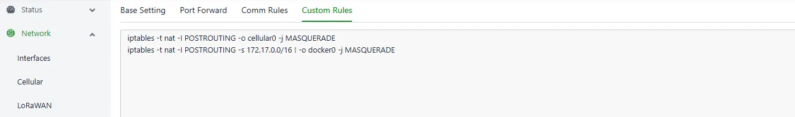</p>

<p align="center"><strong>图 4-17 防火墙自定义规则</strong></p>

##### 4.2.2.6 配置DNS

<p align="center">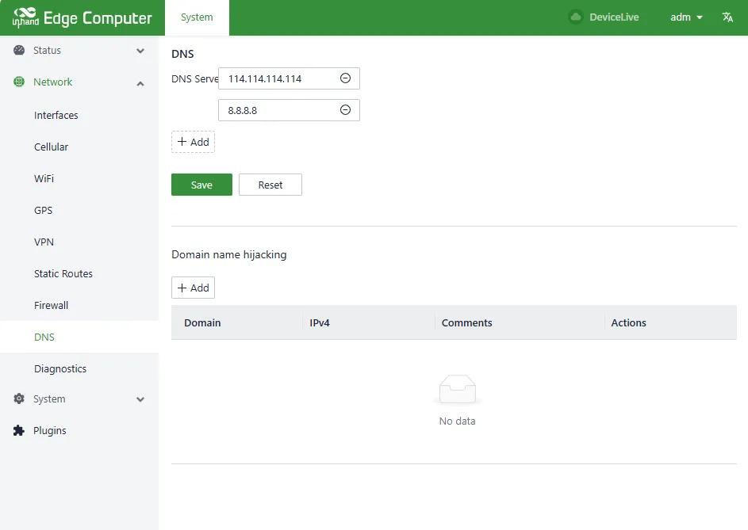</p>

<p align="center"><strong>图 4-18 DNS配置</strong></p>

**DNS Servers**：DNS Server地址，最多支持配置4个

**Domain name hijacking：**域名劫持功能，可以实现IP地址和域名之间的绑定。

<p align="center"></p>

<p align="center"><strong>图 4-19 域名劫持配置</strong></p>

##### 4.2.2.7 网络诊断

网络诊断支持ping，traceroute和nslookup功能。

<p align="center">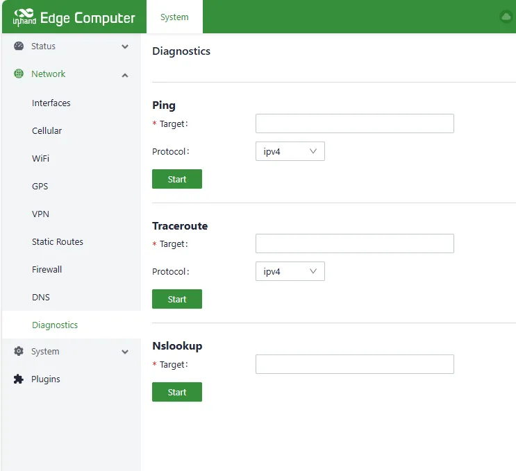</p>

<p align="center"><strong>图 4-20 网络诊断</strong></p>

##### 4.2.2.8 配置OpenVPN

**配置OpenVPN服务器**

OpenVPN的配置，可以通过web页面手动配置，也可以通过导入配置文件的方式进行配置。

1. 手动配置

<p align="center"></p>

<p align="center"><strong>图 4-21 OpenVPN服务器手动配置</strong></p>

**服务端名称**：唯一标识服务器端配置的字符串，只能包含英文字母和数字，并以字母开头，长度不超过64个字符。

**状态**：开启或关闭，用于控制OpenVPN服务器的启动或停止.

**接口类型**：目前只支持tun模式。

**网络类型**：支持p2p，net30和subnet。p2p和 net30用于建立点对点的连接，subnet用于建立虚拟局域网。

**虚拟网络**：subnet模式下，需要配置虚拟网络的网段信息；如果是p2p或 net30配置的则是本端IP地址和远端IP地址。

**网络掩码**：subnet模式下，需要配置虚拟网络的子网掩码信息。

**CA证书**：此处需要导入CA证书文件

**公钥证书**：此处需要导入服务器的公钥证书文件

**私钥证书**：此处需要导入服务器的私钥证书文件

**DH参数**：此处需要导入服务器的DH参数文件

高级设置中可以配置一些改动频率比较低的参数。

**服务器地址**：OpenVPN监听的IP地址，默认监听0.0.0.0，即监听所有IP地址

**协议类型**：支持udp和 tcp，默认udp。

**服务器端口**：服务器监听的端口号，默认1194。

**加密算法**：配置用于保证数据传输机密性的加密算法。

**哈希算法**：配置用于保证数据传输完整性的哈希算法。

**密钥保持**：启用密钥保持后，即使OpenVPN因网络异常出现短暂断开也能快速恢复，无需重新握手。

**隧道保持**：启用隧道保持后，可以防止隧道因短暂网络波动而关闭。

**LZO压缩**：是否启用LZO压缩。

**客户端最大数量**：配置同时连接OpenVPN Server的客户端数量。

**用户**：指定运行 OpenVPN 进程的用户

**用户组**：指定运行 OpenVPN 进程的用户组

**日志级别**：取值范围 1~11，数值越大，日志信息越详细；可以在日志页面，ALL类型日志中查看OpenVPN日志。

**连接检测时间间隔**：发送心跳包检测VPN连接是否存活的周期

**连接检测超时时间**：如果在超时时间内未收到对方响应，判定连接已断开并尝试重启

**允许客户端到客户端的通信**：是否允许客户端和客户端相互通信

**推送到客户端**：可以推送路由和DNS等信息到客户端。

1. 导入配置

<p align="center">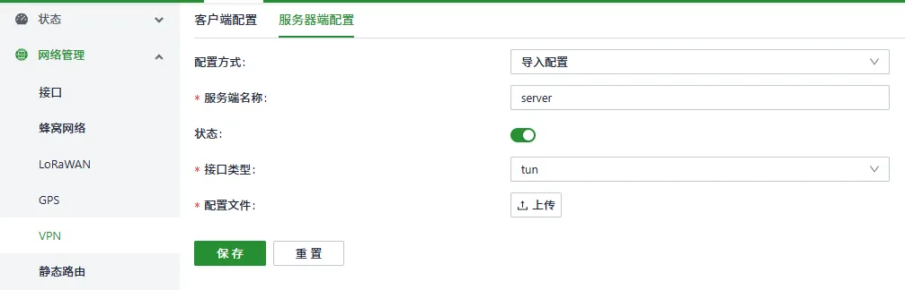</p>

<p align="center"><strong>图 4-22 OpenVPN服务器导入配置</strong></p>

**服务端名称**：唯一标识服务器端配置的字符串，只能包含英文字母和数字，并以字母开头，长度不超过64个字符.

**状态**：开启或关闭，用于控制OpenVPN服务器的启动或停止.

**接口类型**：目前只支持tun模式。

**配置文件**：导入OpenVPN Server配置文件，配置文件中需要包含CA证书，服务器证书和服务器密钥等信息。

**配置OpenVPN客户端**

1. 手动配置

<p align="center">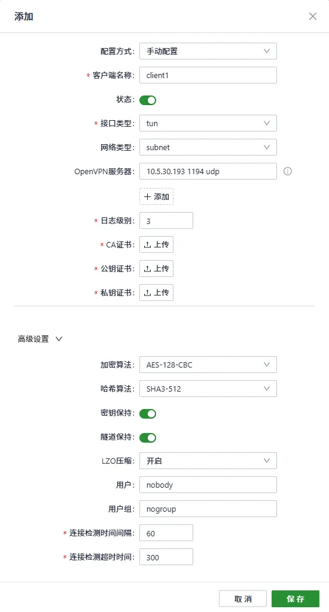</p>

<p align="center"><strong>图 4-23 OpenVPN客户端手动配置</strong></p>

**客户端名称**：唯一标识服务器端配置的字符串，只能包含英文字母和数字，并以字母开头，长度不超过64个字符。

**状态**：开启或关闭，用于控制OpenVPN服务器的启动或停止.

**接口类型**：目前只支持tun模式。

**网络类型**：支持p2p，net30和subnet。p2p和 net30用于建立点对点的连接，subnet用于建立虚拟局域网。当网络类型是p2p或 net30时，需要配置本端IP地址和远端IP地址。

**OpenVPN服务器**：配置OpenVPN服务器的IP地址，端口号以及协议信息，格式为：ip port proto，例如：

192.168.3.200 1194 udp，最多可以配置10个服务器地址。OpenVPN客户端会按照顺序一次尝试建立连接，直到成功建立OpenVPN隧道。

**日志级别**：取值范围 1~11，数值越大，日志信息越详细；可以在日志页面，ALL类型日志中查看OpenVPN日志。

**CA证书**：此处需要导入CA证书文件

**公钥证书**：此处需要导入客户端的公钥证书文件

**私钥证书**：此处需要导入客户端的私钥证书文件

高级设置中可以配置一些改动频率比较低的参数。

**加密算法**：配置用于保证数据传输机密性的加密算法。

**哈希算法**：配置用于保证数据传输完整性的哈希算法。

**密钥保持**：启用密钥保持后，即使OpenVPN因网络异常出现短暂断开也能快速恢复，无需重新握手。

**隧道保持**：启用隧道保持后，可以防止隧道因短暂网络波动而关闭。

**LZO压缩**：是否启用LZO压缩。

**用户**：指定运行 OpenVPN 进程的用户

**用户组**：指定运行 OpenVPN 进程的用户组

**连接检测时间间隔**：发送心跳包检测VPN连接是否存活的周期

**连接检测超时时间**：如果在超时时间内未收到对方响应，判定连接已断开并尝试重启

1. 导入配置

<p align="center"></p>

<p align="center"><strong>图 4-24 OpenVPN客户端导入配置</strong></p>

**客户端名称**：唯一标识客户端端配置的字符串，只能包含英文字母和数字，并以字母开头，长度不超过64个字符.

**状态**：开启或关闭，用于控制OpenVPN客户端的启动或停止.

**接口类型**：目前只支持tun模式。

**配置文件**：导入OpenVPN Client配置文件，配置文件中需要包含CA证书，客户端证书和客户端密钥等信息。


#### 4.2.3 系统管理

##### 4.2.3.1 基础配置

云管理

<p align="center"></p>

<p align="center"><strong>图 4-25 云管理配置</strong></p>

**Enabled**： 对接DeviceLive平台的使能开关; DeviceLive是映翰通设备的远程监控和管理平台；

**Cloud Server**：DeviceLive平台有2个地址；一个是国内平台的地址，另外一个是海外平台地址；这里选择连接哪个平台。

时区和NTP client

<p align="center">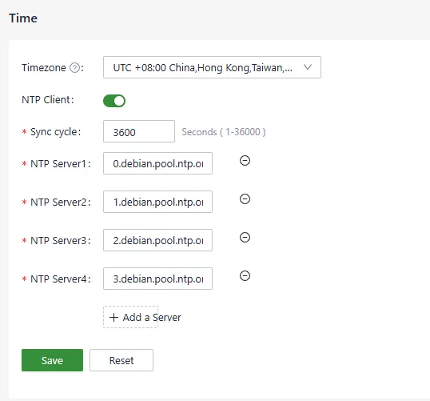</p>

<p align="center"><strong>图 4-26 时区和NTP配置</strong></p>

最多可以配置10个NTP Server地址，程序周期性的依次向每个服务器地址发送同步请求，同步成功后，将系统时间写入RTC，并不再继续向后面的NTP服务器发送同步请求。

除了使用NTP同步时间，在Device Info状态页面有一个同步按钮可以手动同步时间，但只有当设备时间和本地时间(访问设备所使用的电脑的时间)相差超过3s时，才会显示这个同步按钮。

<p align="center">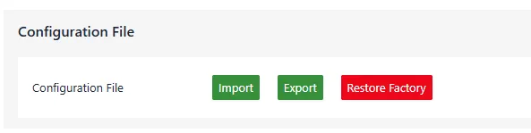</p>

<p align="center"><strong>图 4-27 配置导入导出</strong></p>

这里支持配置的导入，导出以及恢复出厂。

##### 4.2.3.2 固件升级

<p align="center">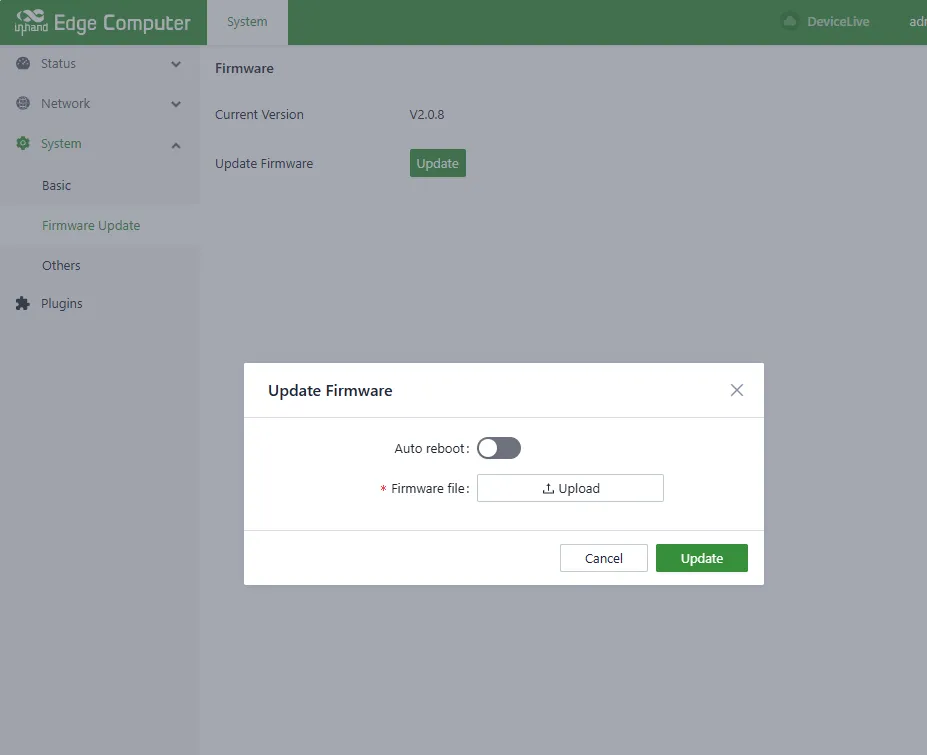</p>

<p align="center"><strong>图 4-28 固件升级</strong></p>

自动重启选项默认是关闭的，升级固件之后，需要手动重启系统才能生效；开启自动重启选项后，升级固件成功后会自动重启系统。

##### 4.2.3.3 其他

<p align="center">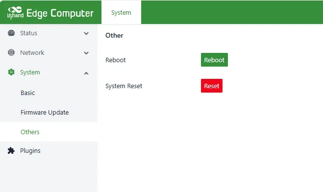</p>

<p align="center"><strong>图 4-29 重启和重置</strong></p>

这个页面有重启系统和重置系统2个功能。重置系统需要慎重使用，重置系统功能会将系统的配置状态和文件系统状态恢复到和出厂时一致，也就是说用户安装的软件也会被清除。

#### 4.2.4 状态

##### 4.2.4.1 设备信息

设备信息状态页面显示主机名，设备型号，序列号，固件版本，内核版本，文件系统版本以及CPU，内存和磁盘空间的使用概况。

<p align="center">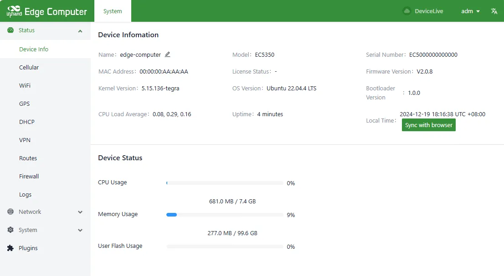</p>

<p align="center"><strong>图 4-30 设备信息状态</strong></p>

##### 4.2.4.2 蜂窝拨号状态

蜂窝拨号状态页面显示当前拨号使用的sim卡，IMEI，IMSI，ICCID，信号强度，以及拨号获取的IP地址，DNS等信息。

<p align="center"></p>

<p align="center"><strong>图 4-31 蜂窝拨号状态信息</strong></p>

##### 4.2.4.3 Wi-Fi状态

Wi-Fi状态页面显示Wi-Fi连接成功后获取的IP地址，网关以及DNS等信息。

<p align="center"></p>

<p align="center"><strong>图 4-32 Wi-Fi Station状态信息</strong></p>

##### 4.2.4.4 DHCP Server状态

DHCP Server状态页面显示设备做为DHCP Server，分配出去的IP地址，客户端主机名，客户端主机mac以及过期时间。

<p align="center">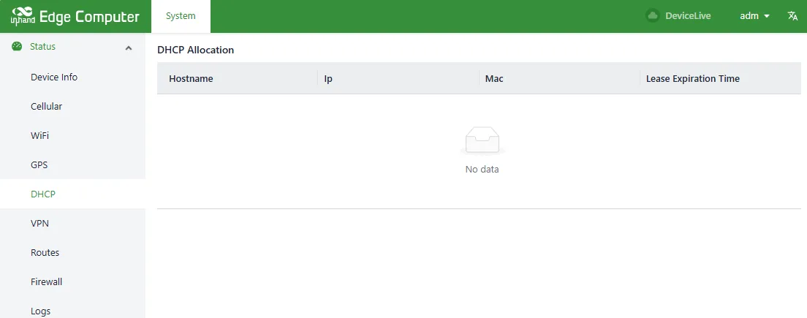</p>

<p align="center"><strong>图 4-33 DHCP Server状态信息</strong></p>

##### 4.2.4.5 路由状态

路由状态页面显示IPv4直连路由，静态路由以及路由邻居等信息。

<p align="center"></p>

<p align="center"><strong>图 4-34 路由状态信息</strong></p>

##### 4.2.4.6 防火墙状态

防火墙状态信息显示过滤规则，IP地址映射规则等信息。

<p align="center">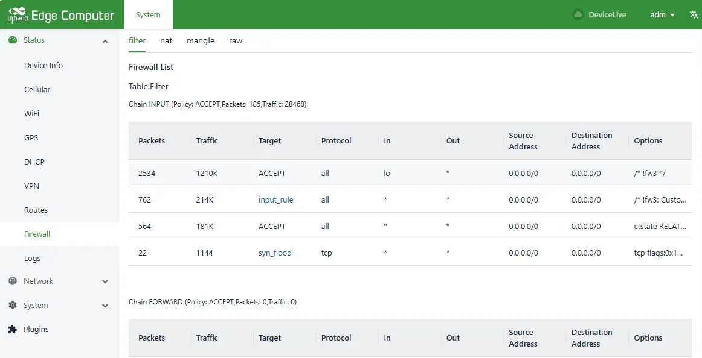</p>

<p align="center"><strong>图 4-35 防火墙状态信息</strong></p>

##### 4.2.4.7 日志信息

日志页面可以查看系统日志，用户日志以及设置查看的日志等级，包括Error，Info，Debug等级别。日志也可以下载到本地。

<p align="center">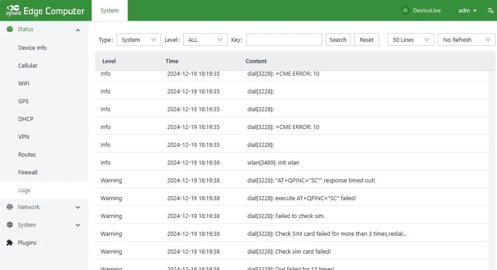</p>

<p align="center"><strong>图 4-36 日志信息</strong></p>

##### 4.2.4.8 OpenVPN状态信息

**OpenVPN服务器状态信息**

在OpenVPN服务器状态页面可以查看状态更新时间，已连接的OpenVPN客户端等信息。

<p align="center"></p>

<p align="center"><strong>图 4-37 OpenVPN服务器状态信息</strong></p>

**OpenVPN客户端状态信息**

在OpenVPN客户端状态页面可以查看客户端获取的虚IP地址以及隧道连接时长等信息。

<p align="center"></p>

<p align="center"><strong>图 4-38 OpenVPN客户端状态信息</strong></p>


### 4.3 Ubuntu图形界面管理

使用Linux命令行进行网络配置和系统配置的时候，首先需要关闭IEOS程序。IEOS是通过systemctl来管理的，

关闭IEOS的方式如下：

```shell
systemctl stop ieos_daemon
```

这种关闭只针对本次启动生效，系统重启后，IEOS程序依然会启动，禁止IEOS程序开机启动的方式如下：

```shell
systemctl disable ieos_daemon
```

重要说明：关闭IEOS之后，拨号，Wi-Fi等无线联网功能需要用户基于Linux原生命令来实现，而且也无法实现对接DeviceLive平台对设备进行远程管理。

#### 4.3.1 以太网设置

##### 4.3.1.1 设置管理

点击桌面右上角网络图标，选择Ethernet ->Wired Settings或点击桌面左下角Show Applications->Settings->Network->Ethernet，请根据实际情况选择设置eth1/eth2。

<p align="center">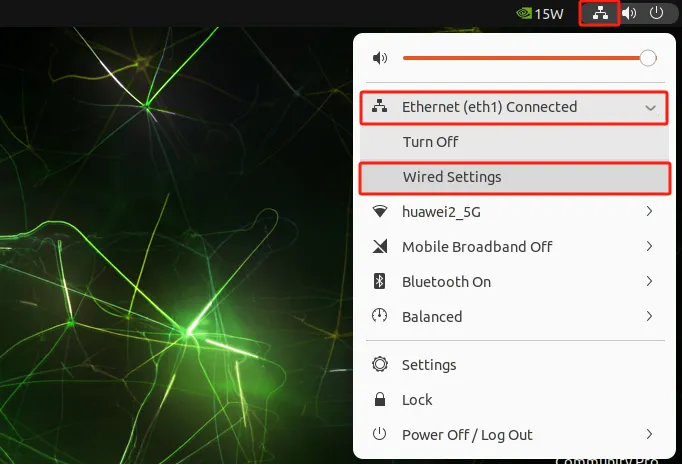</p>

<p align="center"><strong>图 4-39 Ubuntu以太网设置1</strong></p>

<p align="center"></p>

<p align="center"><strong>图 4-40 Ubuntu以太网设置2</strong></p>

##### 4.3.1.2 开/关管理

点击Ethernet设置中Turn On/Turn Off或滑动按钮可关闭或打开网络。

<p align="center">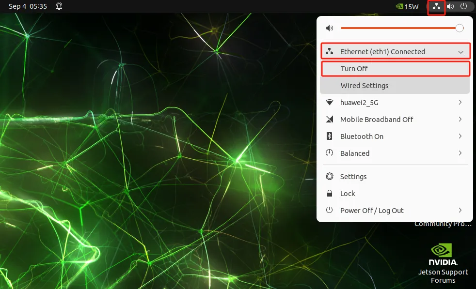</p>

<p align="center"><strong>图 4-41 Ubuntu以太网开关1</strong></p>

<p align="center">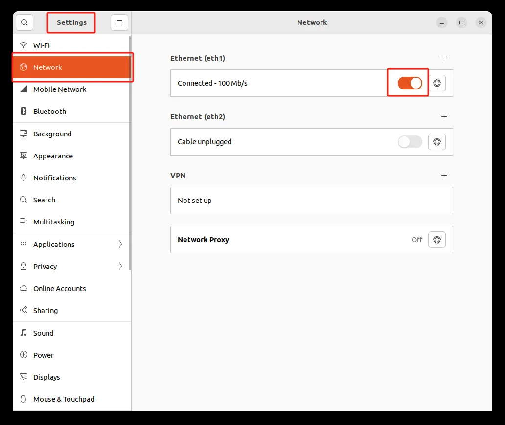</p>

<p align="center"><strong>图 4-42 Ubuntu以太网开关2</strong></p>

##### 4.3.1.3 静态配置

点击设置按键，选择IPv4/IPv6，Method选中Manual，根据网络情况填写Address、Netmask、Gateway、DNS和Routes，点击Apply保存。保存后请重新开关网络使配置生效。

<p align="center">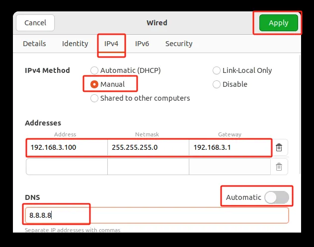</p>

<p align="center"><strong>图 4-43 Ubuntu静态配置</strong></p>

##### 4.3.1.4 动态配置

点击设置按键，选择IPv4/IPv6，Method选中Automaitc(DHCP)，点击Apply保存。保存后请重新开关网络使配置生效。

<p align="center">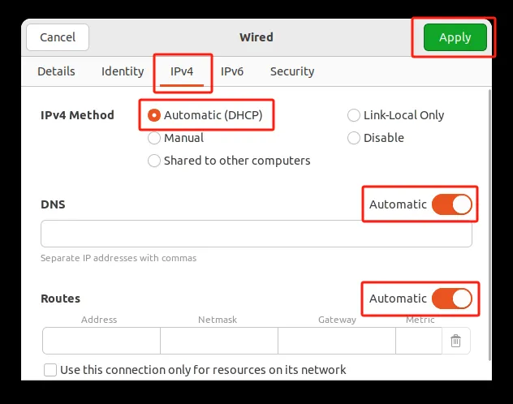</p>

<p align="center"><strong>图 4-44 Ubuntu动态配置</strong></p>

#### 4.3.2 Wi-Fi设置

##### 4.3.2.1 设置管理

点击桌面右上角网络图标，选择Wi-Fi->Wi-Fi Settings或点击桌面左下角Show Applications->Settings->Wi-Fi。

<p align="center">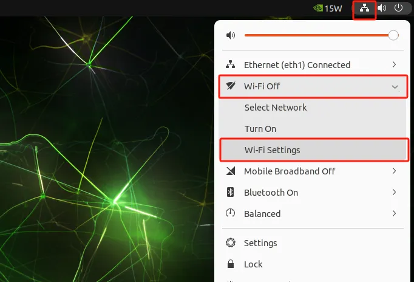</p>

<p align="center"><strong>图 4-45 Ubuntu Wi-Fi设置1</strong></p>

<p align="center"></p>

<p align="center"><strong>图 4-46 Ubuntu Wi-Fi设置2</strong></p>

##### 4.3.2.2 开/关管理

点击Wi-Fi设置中Turn On/Turn Off或滑动按钮可关闭或打开网络。

<p align="center">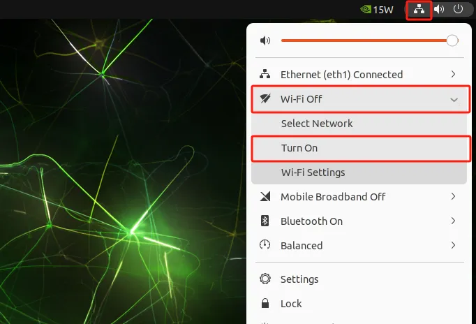</p>

<p align="center"><strong>图 4-47 Ubuntu Wi-Fi开关1</strong></p>

<p align="center">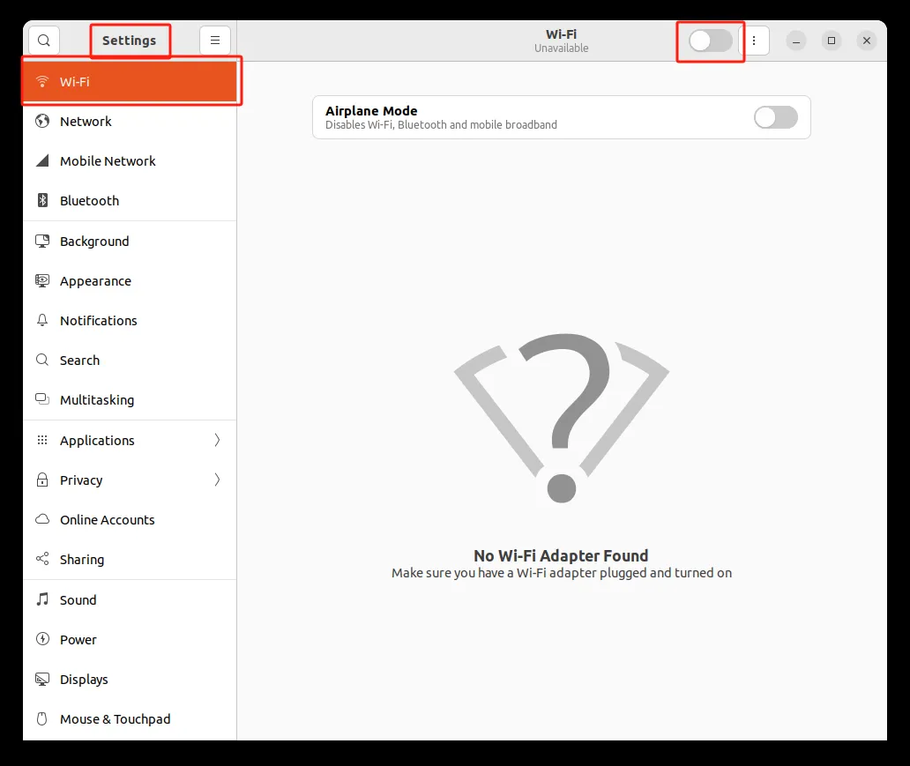</p>

<p align="center"><strong>图 4-48 Ubuntu Wi-Fi开关2</strong></p>

##### 4.3.2.3 扫描

可通过Wi-Fi->Select Network开启扫描，或开启Wi-Fi Setting功能后将自动扫描周边可见Wi-Fi SSID。

<p align="center">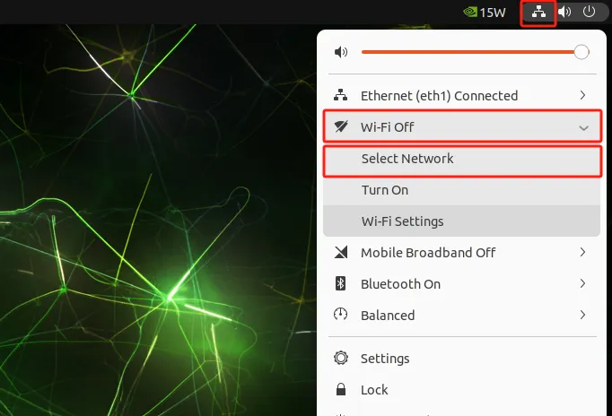</p>

<p align="center"><strong>图 4-49 Ubuntu Wi-Fi扫描1</strong></p>

<p align="center">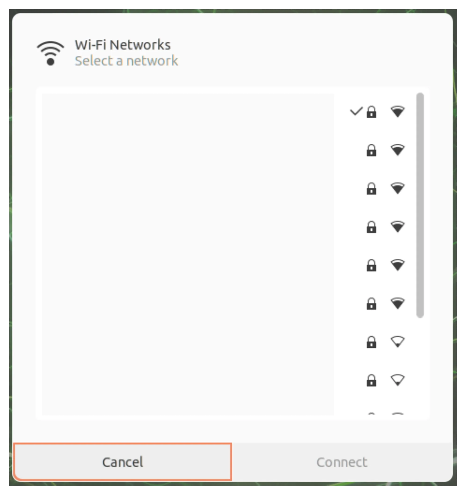</p>

<p align="center"><strong>图 4-50 Ubuntu Wi-Fi扫描2</strong></p>

<p align="center">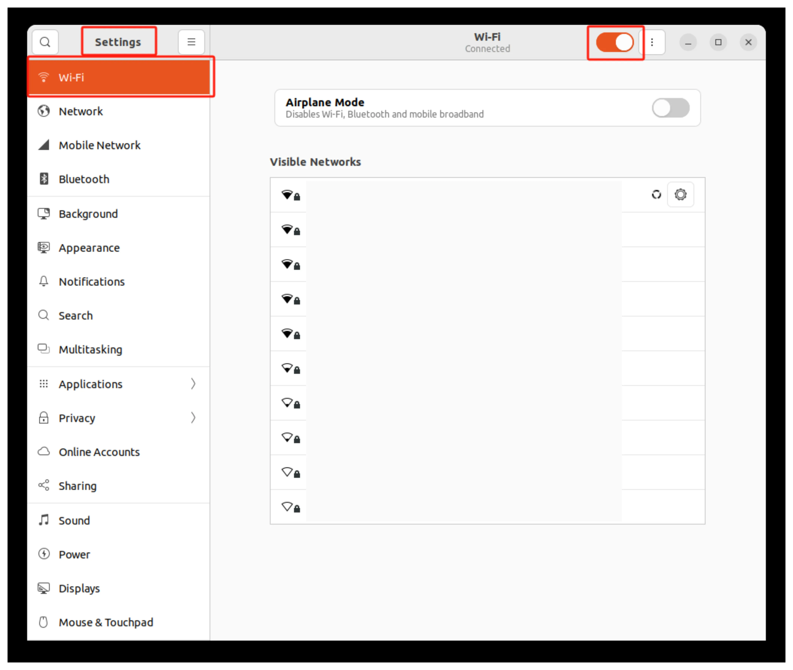</p>

<p align="center"><strong>图 4-51 Ubuntu Wi-Fi扫描3</strong></p>

##### 4.3.2.4 连接

点击Wi-Fi网络右边设置按键，输入密码后点击Connect即可连接至网络。

<p align="center">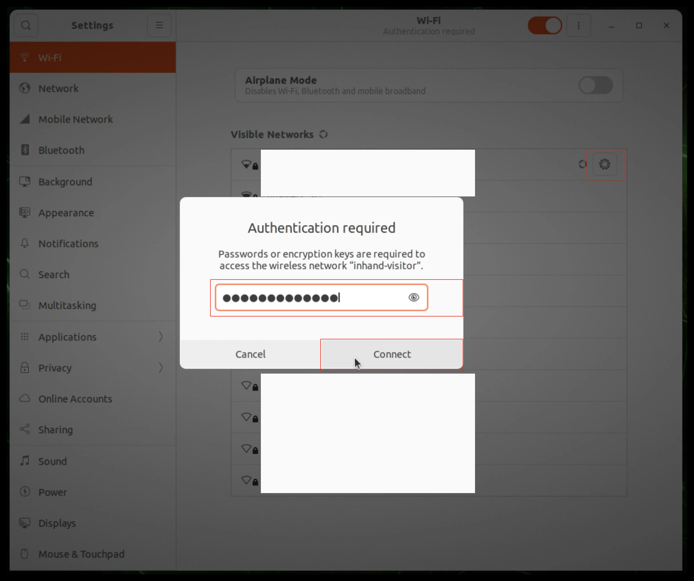</p>

<p align="center"><strong>图 4-52 Ubuntu Wi-Fi连接</strong></p>

#### 4.3.3 蜂窝网络设置

##### 4.3.3.1配置蜂窝ECM模式

将SIM卡插入SIM1/SIM2，接入蜂窝天线，打开Terminal依次输入以下命令。

```json
## 使用115200波特率接入蜂窝AT命令接口
sudo sdebug /dev/ttyUSB2 115200
## 配置蜂窝ECM模式
AT+QCFG="usbnet",1
## 保存并重启蜂窝模组
AT+CFUN=1,1
```

<p align="center">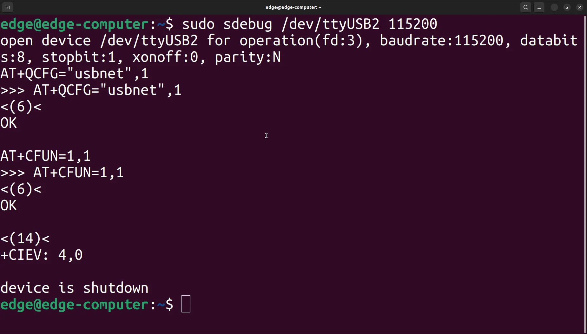</p>

<p align="center"><strong>图 4-53 配置蜂窝ECM模式</strong></p>

##### 4.3.3.2 切换SIM卡

打开Terminal输入下述命令切换SIM卡。

```json
## 切换至root用户
sudo -s
## 切换至SIM1
echo 0 > /sys/class/gpio/PG.06/value
## 切换至SIM2
echo 1 > /sys/class/gpio/PG.06/value
```

<p align="center">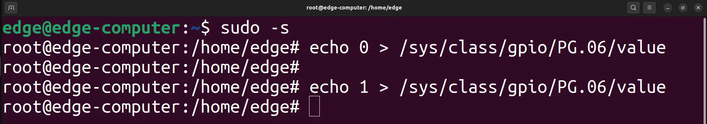</p>

<p align="center"><strong>图 4-54 切换SIM卡</strong></p>

#### 4.3.4 CAN FD设置

打开Terminal输入下述命令配置CAN接口。

```json
## Link up CAN接口
sudo ip link set can0 up type can bitrate 1000000 dbitrate 5000000 restart-ms 1000 fd on
```

<p align="center">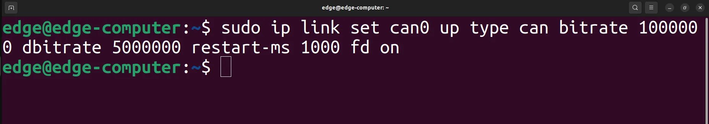</p>

<p align="center"><strong>图 4-55 CAN FD设置</strong></p>

#### 4.3.5 蓝牙设置

##### 4.3.5.1 设置管理

点击桌面右上角网络图标，选择Bluetooth ->Bluetooth Settings或点击桌面左下角Show Applications->Settings->Bluetooth。

<p align="center">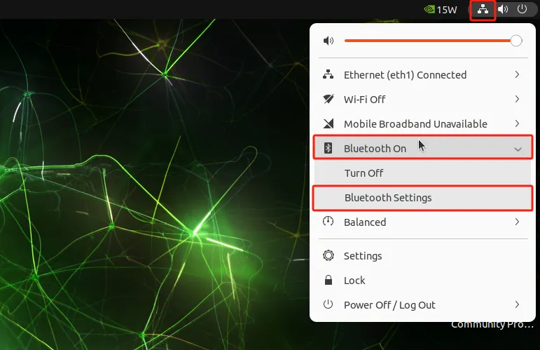</p>

<p align="center"><strong>图 4-56 Ubuntu蓝牙设置1</strong></p>

<p align="center">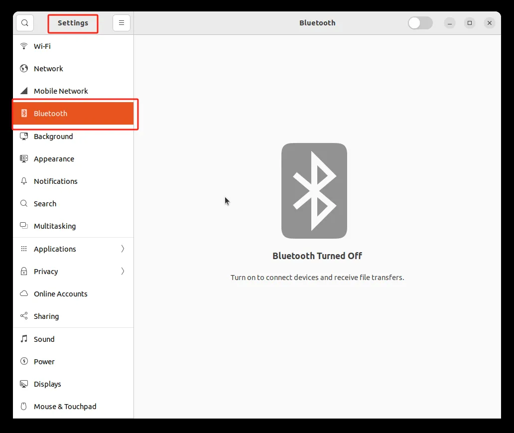</p>

<p align="center"><strong>图 4-57 Ubuntu蓝牙设置2</strong></p>

##### 4.3.5.2 开/关管理

点击Bluetooth设置中Turn On/Turn Off或滑动按钮可关闭或打开蓝牙。

<p align="center">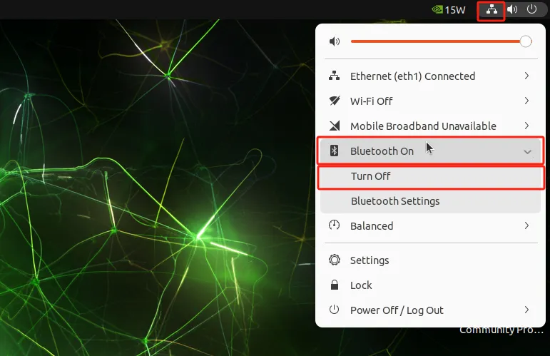</p>

<p align="center"><strong>图 4-58 Ubuntu蓝牙开关1</strong></p>

<p align="center">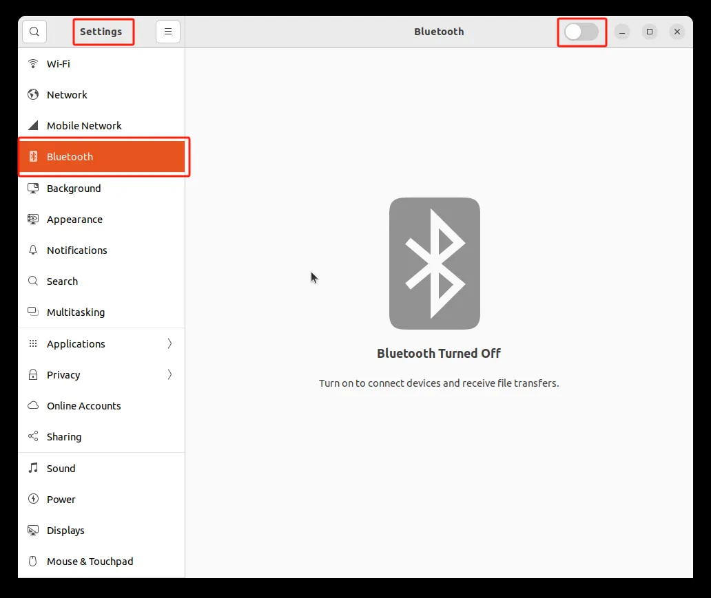</p>

<p align="center"><strong>图 4-59 Ubuntu蓝牙开关2</strong></p>

##### 4.3.5.3 蓝牙连接

打开蓝牙开关后，将自动扫描周边蓝牙设备点击蓝牙设备名称即可连接（需要输入PIN码的蓝牙设备请输入PIN码）。

<p align="center">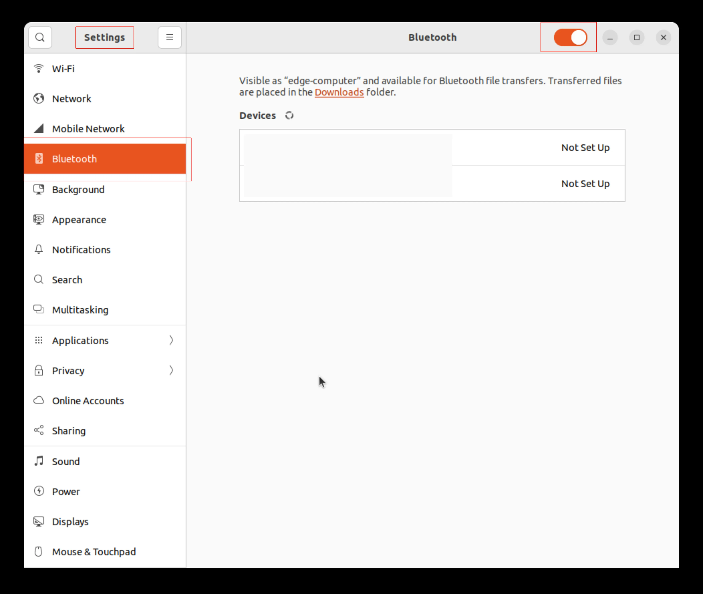</p>

<p align="center"><strong>图 4-60 Ubuntu蓝牙连接</strong></p>

#### 4.3.6 时间设置

点击桌面左下角Show Applications->Settings->Data & Time。

<p align="center">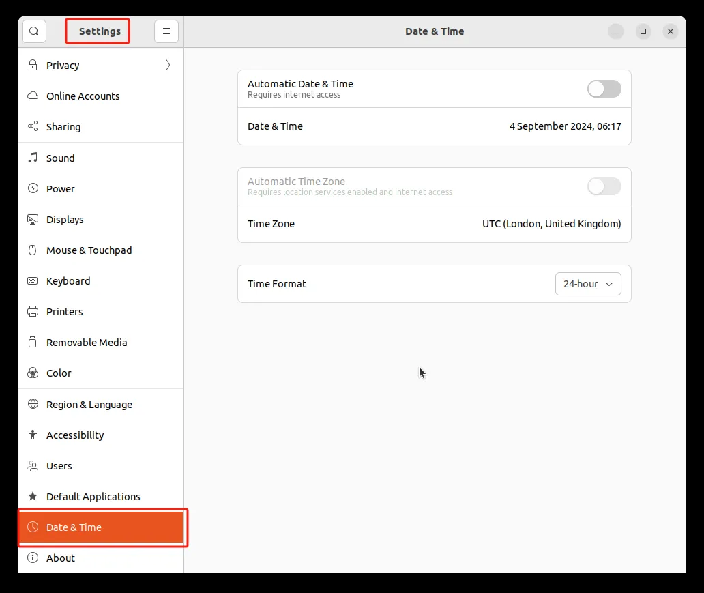</p>

<p align="center"><strong>图 4-61 Ubuntu时间设置</strong></p>

##### 4.3.6.1 设置时区

在设置页面点击Time Zone选择或输入系统时区。

##### 4.3.6.2 调整时间

系统默认自动对时，当设备接入网络后自动获取网络时间，如果需要手动设置时间请关闭Automatic Date & Time并手动设置Date & Time。

<p align="center">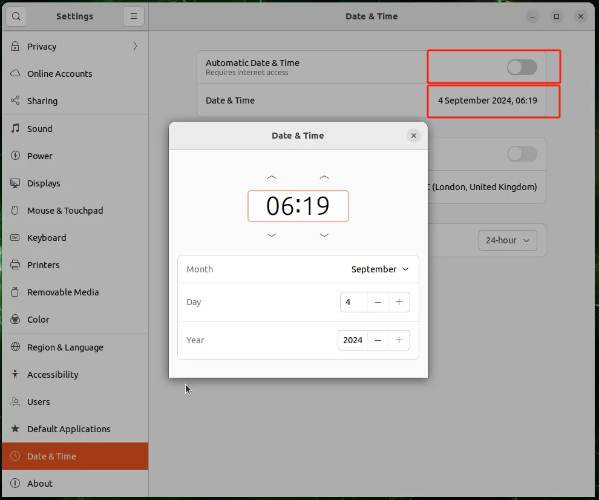</p>

<p align="center"><strong>图 4-62 Ubuntu调整时间</strong></p>

##### 4.3.6.3 网络设置高级扩展

参考：

1. [Network Manager | Ubuntu](https://ubuntu.com/core/docs/networkmanager)
2. [Bluez Prerequisites | Ubuntu](https://ubuntu.com/core/docs/bluez/check-installation)


### 4.4 外设配置

#### 4.4.1 串口管理

设备支持2个RS-232/422/485可选串口，分别对应设备节点/dev/ttyCOM1和/dev/ttyCOM2，打开Terminal，使用uart_mode命令可以切换串口工作模式。

| 表7 串口映射 | |
| --- | --- |
| COM1 | /dev/ttyCOM1 |
| COM2 | /dev/ttyCOM2 |

| 表8 串口工作模式切换 | | |
| --- | --- | --- |
| uart_mode | COM1 | 485<br/>422<br/>232 |
| | COM2 | 485<br/>422<br/>232 |

例如配置COM1工作在RS-485模式，请输入下述命令。

```json
sudo uart_mode COM1 485
```

<p align="center">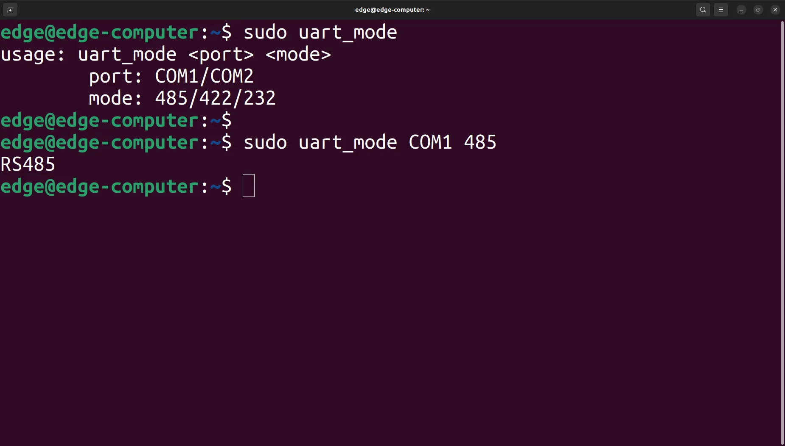</p>

<p align="center"><strong>图 4-63 串口模式切换</strong></p>

#### 4.4.2 数字量输入/输出管理

设备支持4个隔离式数字量输入以及4个隔离式数字量输出。

| 表9 数字量输入/输出 | | |
| --- | --- | --- |
| DI | DI0 | /sys/class/gpio/gpio308 |
| | DI1 | /sys/class/gpio/gpio309 |
| | DI2 | /sys/class/gpio/gpio310 |
| | DI3 | /sys/class/gpio/gpio311 |
| | | |
| DO | DO0 | /sys/class/gpio/gpio312 |
| | DO1 | /sys/class/gpio/gpio313 |
| | DO2 | /sys/class/gpio/gpio314 |
| | DO3 | /sys/class/gpio/gpio315 |

#### 4.4.3 音频输入/输出

**音频输入**

设备支持麦克风音频输入

使用示例：

- 连接麦克风，执行命令`arecord -d 3 -D hw:APE,0 -c 2 -r 48000 -f S16_LE test.wav`录音

**音频输出**

设备支持LINE OUT音频输出

使用示例：

- 连接扬声器，执行命令`aplay -D hw:APE,0 test.wav`播放音频

#### 4.4.4 GMSL

先将GMSL摄像头连接到GMSL接口，给设备上电

执行初始化脚本`gmsl_init.sh`，选择连接的摄像头型号

<p align="center">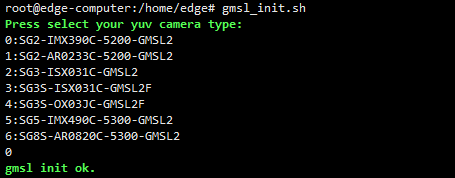</p>

<p align="center"><strong>图 4-64 GMSL初始化</strong></p>

播放摄像头视频流：`gmsl_play.sh 0/1`（0对应GMSL_CAM0，1对应GMSL_CAM1）

从摄像头GMSL_CAM0获取一帧图像`gmsl_capture.py 0 5 cam0.jpg`

从摄像头GMSL_CAM0录制10秒视频`gmsl_record.py 0 10 cam0.avi`

> **注意**：GMSL摄像头不支持热插拔，连接时需要给设备断电，GMSL_CAM0接口对应/dev/video0，GMSL_CAM1接口对应/dev/video1

### 4.5 高级功能

#### 4.5.1 系统更新

将系统升级镜像拷贝至可移动存储介质或通过网络传输至设备内，输入下述命令可执行系统更新操作，系统更新时间较长请耐心等待。

```json
sudo update ota <update file>
```

<p align="center"></p>

<p align="center"><strong>图 4-65 系统更新</strong></p>

### 4.6 安全

#### 4.6.1 硬件看门狗

设备有一个硬件看门狗，可以通过以下命令禁用或启用（硬件版本号为V1.2支持）

```shell
echo 0 > /sys/bus/i2c/drivers/xic/1-0020/wdogstatus #禁用
echo 1 > /sys/bus/i2c/drivers/xic/1-0020/wdogstatus #启用
cat /sys/bus/i2c/drivers/xic/1-0020/wdogstatus #查看状态
```

#### 4.6.2 TPM2.0

设备支持可信任平台模块2.0（TPM2.0），并预装tpm2-tools工具，可以直接使用指令操作TPM2.0模块实现安全功能。

参考：

1. [tpm2-tools](https://tpm2-tools.readthedocs.io/en/latest/)
2. [tpm2-tools/man at master · tpm2-software/tpm2-tools (github.com)](https://github.com/tpm2-software/tpm2-tools/tree/master/man)

### 4.7 编程指南

参考：

1. [Jetson - Embedded AI Computing Platform | NVIDIA Developer](https://developer.nvidia.com/embedded-computing)
2. [Jetson Software | NVIDIA Developer](https://developer.nvidia.com/embedded/develop/software)
3. [Jetson Software Getting Started | NVIDIA Developer](https://developer.nvidia.com/embedded/learn/getting-started-jetson)
4. [NVIDIA Developer Forums - NVIDIA Developer Forums](https://forums.developer.nvidia.com/)


## 第5章 典型应用

### 案例1：工业边缘AI视觉检测

**场景描述**：在工厂产线部署EC5000作为边缘AI推理节点，通过GMSL接口连接工业摄像头，利用NVIDIA Jetson Orin的AI算力对产线产品进行实时视觉检测和质量判断。

**设备角色**：本设备作为边缘AI推理网关，负责采集摄像头视频流、执行AI模型推理、输出检测结果，并通过蜂窝网络或以太网将结果上报至云端平台。

**配置步骤**：

1. 将GMSL摄像头连接至EC5000的GMSL接口（注意断电操作，不支持热插拔）。
2. 给设备上电，通过HDMI或SSH登录系统。
3. 执行初始化脚本 `gmsl_init.sh`，选择对应的摄像头型号。
4. 验证视频流：执行 `gmsl_play.sh 0` 播放摄像头画面。
5. 部署AI推理程序，调用NVIDIA Jetson的GPU资源进行模型推理。
6. 配置网络（以太网或蜂窝），确保设备可与云端平台通信。
7. （可选）配置IEOS云管理，接入DeviceLive平台进行远程监控。

**参考章节**：
- [GMSL接口说明](#gmsl-20接口)
- [系统接口与规格](#41-产品规格)
- [配置蜂窝网络联网](#场景3配置蜂窝网络联网)
- [配置IEOS Web管理](#场景5配置ieos-web管理)

### 案例2：工业数据采集与远程管理

**场景描述**：在工业现场部署EC5000，通过串口（RS-485/232）连接PLC或传感器，通过数字量输入输出采集开关量信号，利用CAN FD接入车载或工业控制总线，并通过4G/5G蜂窝网络将数据回传至远程监控中心。

**设备角色**：本设备作为边缘数据采集网关，负责汇集现场串口、DI/DO、CAN总线数据，进行边缘预处理，并通过蜂窝网络或VPN隧道与远程平台交互。

**配置步骤**：

1. 根据现场设备接口类型，配置EC5000串口工作模式（RS-232/422/485）。
2. 连接数字量输入/输出线缆，确认隔离式输入输出参数匹配。
3. 配置CAN FD接口波特率，接入现场CAN总线网络。
4. 插入SIM卡并安装蜂窝天线，配置蜂窝拨号参数。
5. 登录IEOS Web管理界面，启用云管理（DeviceLive）功能。
6. （可选）配置OpenVPN客户端，建立与数据中心的安全隧道。

**参考章节**：
- [串口管理](#451-串口管理)
- [数字量输入/输出管理](#452-数字量输入输出管理)
- [CAN FD设置](#444-can-fd设置)
- [配置蜂窝网络联网](#场景3配置蜂窝网络联网)
- [配置OpenVPN隧道](#场景5配置ieos-web管理)

---

## 附录 故障处理

### 1 启动与登录问题

| 现象 | 可能原因 | 排查步骤 | 对应章节 |
|------|----------|----------|----------|
| 电源指示灯不亮 | 电源未连接或电压不符 | 1. 检查电源线是否连接牢固<br>2. 确认输入电压在9~36VDC范围内 | [电源连接](#电源连接) |
| 电源指示灯不亮 | 电源适配器功率不足 | 1. 检查电源适配器规格<br>2. 如多USB满负载，需使用120W以上适配器 | [电源规格](#电源规格) |
| 系统状态灯不闪烁 | 系统启动失败 | 1. 检查Recovery按键是否被卡住<br>2. 尝试断电重启<br>3. 执行系统重置或重新烧录系统 | [恢复出厂设置](#15-恢复出厂设置) |
| 无法通过HDMI登录 | HDMI连接异常 | 1. 检查HDMI线连接<br>2. 确认显示器输入源正确 | [首次访问系统](#首次访问系统) |
| SSH连接超时 | IP地址配置错误 | 1. 确认PC与设备在同一网段<br>2. 检查设备底面铭牌默认IP | [通过SSH连接访问](#方式二通过ssh连接访问) |
| SSH连接超时 | 网络线缆未连接 | 1. 检查网线连接状态<br>2. 观察以太网指示灯状态 | [以太网接口](#以太网接口) |

### 2 网络连接问题

| 现象 | 可能原因 | 排查步骤 | 对应章节 |
|------|----------|----------|----------|
| 无法连接蜂窝网络 | SIM卡未插入或接触不良 | 1. 检查SIM卡是否正确插入<br>2. 重新插拔SIM卡 | [SIM卡槽](#sim卡槽) |
| 无法连接蜂窝网络 | APN参数配置错误 | 1. 核对APN参数是否正确<br>2. 联系运营商获取正确APN | [配置蜂窝拨号](#配置蜂窝拨号) |
| 无法连接蜂窝网络 | 信号弱或无信号 | 1. 检查天线是否连接<br>2. 调整设备位置或更换天线 | [SMA接口](#sma接口) |
| 无法连接蜂窝网络 | 蜂窝模组未配置ECM模式 | 1. 通过AT命令检查蜂窝模组模式<br>2. 配置为ECM模式并重启模组 | [配置蜂窝ECM模式](#配置蜂窝ecm模式) |
| 拨号成功但无法上网 | 拨号假连接 | 1. 在IEOS中开启ICMP探测<br>2. 检查探测地址是否可达 | [配置蜂窝拨号](#配置蜂窝拨号) |
| Wi-Fi连接失败 | SSID或密码错误 | 1. 核对SSID和密码<br>2. 确认认证加密方式一致 | [配置Wi-Fi Station](#配置wi-fi-station) |
| Wi-Fi连接失败 | 信号弱 | 1. 检查Wi-Fi天线是否安装<br>2. 调整设备与AP的距离 | [配置Wi-Fi Station联网](#场景4配置wi-fi-station联网) |
| 以太网无法通信 | IP地址配置错误 | 1. 确认IP地址、子网掩码、网关正确<br>2. 检查DHCP Server地址池是否耗尽 | [配置以太网接口](#配置以太网接口) |

### 3 Web访问问题

| 现象 | 可能原因 | 排查步骤 | 对应章节 |
|------|----------|----------|----------|
| 无法打开IEOS Web界面 | IP地址或端口错误 | 1. 确认使用https协议<br>2. 确认端口为9100<br>3. 确认访问的是eth2默认IP | [登录Web](#431-登录web) |
| 无法打开IEOS Web界面 | IEOS程序未运行 | 1. 通过SSH登录检查ieos_daemon状态<br>2. 执行systemctl start ieos_daemon | [登录Web](#431-登录web) |
| IEOS配置保存后未生效 | 网络接口未重启 | 1. 重新开关对应网络接口<br>2. 或重启系统使配置生效 | [配置以太网接口](#配置以太网接口) |
| IEOS与Linux命令冲突 | 同时使用了IEOS和原生命令 | 1. 统一使用IEOS Web管理网络<br>2. 如需使用原生命令，先关闭IEOS | [Ubuntu图形界面管理](#44-ubuntu图形界面管理) |

### 4 外设工作异常

| 现象 | 可能原因 | 排查步骤 | 对应章节 |
|------|----------|----------|----------|
| 串口通信异常 | 串口模式不匹配 | 1. 确认串口模式与对端设备一致<br>2. 使用uart_mode命令切换模式 | [串口管理](#451-串口管理) |
| 串口通信异常 | RS-485终端电阻未匹配 | 1. 检查RS-485拨码开关状态<br>2. 确认总线两端终端电阻已启用 | [RS-485拨码开关](#rs-485-pull-updown拨码开关) |
| GMSL摄像头无画面 | 热插拔导致 | 1. GMSL不支持热插拔，需断电后连接<br>2. 重新执行gmsl_init.sh | [GMSL](#454-gmsl) |
| CAN FD无法通信 | 波特率不一致 | 1. 确认CAN FD波特率与总线一致<br>2. 检查can0接口状态为UP | [CAN FD设置](#444-can-fd设置) |
| 数字量输入无响应 | 接线错误或电压不符 | 1. 检查干湿接点接线方式<br>2. 确认输入电压在规格范围内 | [数字量输入接口](#数字量输入接口) |

---

## 附录 安全注意事项

1. 设备应在规定的温度和湿度范围内使用（工作温度：-20 ~ 60℃，工作湿度：95%@40℃无凝结）。
2. 请勿在易燃易爆环境中使用本设备。
3. 电源连接前需确认电压符合设备规格要求（9~36 VDC）。
4. 设备须由专业人员安装，只使用铜导体，并选择合适的线径。
5. 系统运行允许的电流范围为15A至5.6A，需确保供电回路具备足够容量。
6. 接地线需使用16AWG绿黄双色线，并可靠连接至系统接地螺丝。
7. 当多个USB满负载工作时，需根据总负载情况选择120W（或以上）电源适配器。
8. 系统重置功能会将用户安装的软件清除，操作前需备份重要数据。
9. GMSL摄像头不支持热插拔，连接或断开时需给设备断电。

> **警告**：非专业人员请勿打开设备外壳，存在触电风险。

---

## 附录 命令行/高级参考

### 1 常用命令

| 命令 | 功能 | 示例 |
|------|------|------|
| `sudo ecversion` | 查询系统版本号 | `sudo ecversion` |
| `sudo ecversion -all` | 查询详细版本信息 | `sudo ecversion -all` |
| `sudo uart_mode` | 切换串口工作模式 | `sudo uart_mode COM1 485` |
| `sudo adduser` | 创建系统账户 | `sudo adduser test` |
| `sudo deluser` | 删除系统账户 | `sudo deluser test` |
| `sudo passwd -l` | 禁用账户 | `sudo passwd -l test` |
| `sudo passwd -u` | 启用账户 | `sudo passwd -u test` |
| `sudo update ota` | 系统更新 | `sudo update ota <file>` |
| `sudo update reset` | 系统重置 | `sudo update reset` |
| `sudo update resetkey` | 查看/控制重置按键功能 | `sudo update resetkey enable` |
| `id <user>` | 查询账户是否存在 | `id test` |

### 2 蜂窝AT命令

| 命令 | 功能 |
|------|------|
| `AT+QCFG="usbnet",1` | 配置蜂窝ECM模式 |
| `AT+CFUN=1,1` | 保存并重启蜂窝模组 |

### 3 CAN FD配置示例

```
sudo ip link set can0 up type can bitrate 1000000 dbitrate 5000000 restart-ms 1000 fd on
```

### 4 硬件看门狗控制

```shell
# 禁用看门狗
echo 0 > /sys/bus/i2c/drivers/xic/1-0020/wdogstatus
# 启用看门狗
echo 1 > /sys/bus/i2c/drivers/xic/1-0020/wdogstatus
# 查看状态
cat /sys/bus/i2c/drivers/xic/1-0020/wdogstatus
```

### 5 音频命令示例

```
# 录音
arecord -d 3 -D hw:APE,0 -c 2 -r 48000 -f S16_LE test.wav
# 播放
aplay -D hw:APE,0 test.wav
```

### 6 IEOS控制命令

```shell
# 停止IEOS
systemctl stop ieos_daemon
# 禁用IEOS开机启动
systemctl disable ieos_daemon
```

---

## FAQ 常见问题解答

### 问题1：EC5000与普通工控机区别？

1. EC5000搭载NVIDIA Jetson Orin NX/Orin Nano模组，具备40~100 TOPS AI算力，支持边缘AI推理。
2. 集成工业级通信接口（RS-232/422/485、CAN FD、DI/DO、GMSL），适应工业现场环境。
3. 支持4G/5G蜂窝网络、Wi-Fi、蓝牙及GNSS无线通信，便于移动或偏远场景部署。
4. 内置IEOS网络管理系统和DeviceLive云管理平台支持，降低运维复杂度。
5. 工业级宽温设计（-20~60℃），支持DIN导轨和壁挂安装。

### 问题2：无法通过IEOS Web管理网络？

1. 确认IEOS程序正在运行：通过SSH执行 `systemctl status ieos_daemon`。
2. 确认访问地址和端口正确：`https://<设备IP>:9100`。
3. 确认PC与设备处于同一网段，且网络连通。
4. 若需使用Linux原生命令管理网络，需先关闭IEOS：`systemctl stop ieos_daemon`。
5. 注意：IEOS与Linux原生命令同时操作网络可能导致配置冲突。

### 问题3：如何恢复出厂设置？

1. 物理按键恢复：按住Recovery按键10秒，待系统状态灯由闪烁变为常亮后松开。
2. 命令恢复：在Terminal执行 `sudo update reset`。
3. 注意：恢复出厂会清除用户安装的软件和数据，操作前请备份。

### 问题4：蜂窝网络无法联网？

1. 物理环境：检查SIM卡是否插到正确的卡槽位，蜂窝天线是否全部安装。
2. APN设置：确保APN的配置信息与运营商提供的一致（专网卡通常需要配置）。
3. 检查设备连通性：登录到设备本地界面，通过系统自带的ICMP工具或Terminal ping 8.8.8.8测试是否连通。
4. 判断SIM卡是否正常：取出SIM卡，安装在手机中查看是否可以正常联网。
5. 重启：尝试将设备断电，等待几秒钟，然后重新连接电源，重试网络连接。
6. 恢复出厂：将设备恢复出厂，然后重新尝试。

### 问题5：GMSL摄像头无法识别？

1. 确认GMSL摄像头不支持热插拔，连接时必须断电。
2. 确认摄像头型号与初始化脚本支持的型号匹配。
3. 执行 `gmsl_init.sh` 选择正确型号后，使用 `gmsl_play.sh 0` 验证视频流。
4. GMSL_CAM0对应/dev/video0，GMSL_CAM1对应/dev/video1。

