# EC942 快速安装手册

---

## 第一部分：快速装机（图文整体流程）

> **您需要先做：** 开箱 → 固定设备 → 接电源与网线 →（若用蜂窝或扩展存储）**断电**装 SIM / Micro SD、接天线 → 上电 → PC 同网段 → 浏览器打开 Web。  
> **再做：** 翻到下方 **第二部分**，按需查阅装箱、灯义、壁挂、各接口引脚等。

### 必读摘要（接线、上电前）

| 项目 | 要求 |
|------|------|
| 供电 | **9～48 V DC**，端子 **V+ / V−**（或电源适配器）；**PWR 灯常亮**表示已上电。 |
| SIM / Micro SD | **须断电**安装或拔出；**不可热插拔**。 |
| 蜂窝 / WiFi / GNSS 天线 | 按壳体**丝印**拧紧；标配数量因型号而异（见《规格书》订购信息）。 |

### 步骤 1：对照实物，确认面板与接口区域

请对照设备实物，熟悉各面板布局。

**右面板**上分布有电源接口、网口、串口、天线接口、SIM / Micro SD 卡槽等。  
**前面板**上有 PWR、STATUS、WARN、Error、SIM1/2、User1/2、4G/5G、L1~L3 等指示灯。

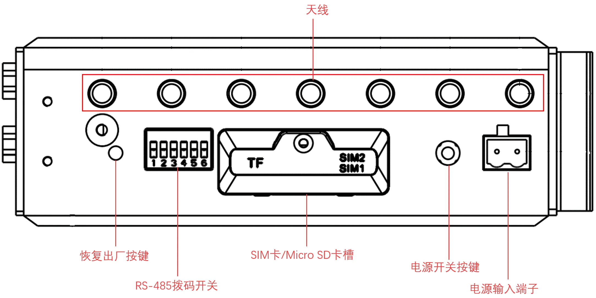

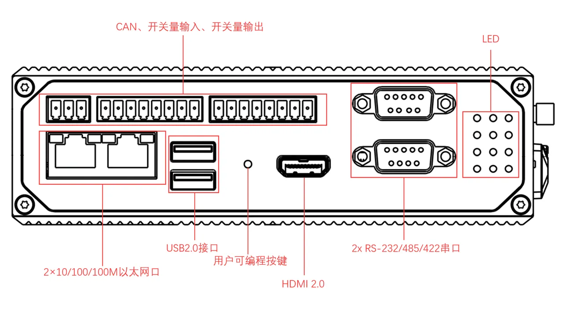

> 各接口的详细引脚定义见 §2.5。

### 步骤 2：将设备固定到导轨或柜内

您可以选择 **DIN 导轨安装** 或 **壁挂安装**。

**DIN 导轨安装**：将设备背板的 DIN 轨安装板对准导轨，上方卡入槽位后向内侧推，直至底端卡入到位。

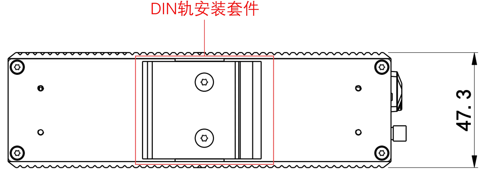

**壁挂安装**（需另购壁挂套件）有两种方式，详见 §2.4。

### 步骤 3：连接电源与以太网

1. 将电源适配器端子（或 V+/V− 端子）插入设备电源接口。  
2. 将网线一端插入 **ETH 1** 或 **ETH 2**，另一端接入 PC 或交换机。

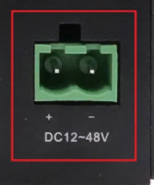

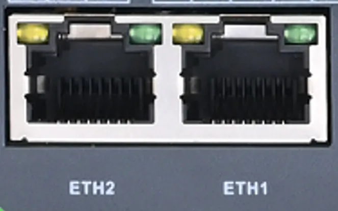

> 网口引脚定义详见 §2.5.1；电源规格详见 §2.6。

### 步骤 4：（若使用蜂窝或扩展存储）断电装 SIM / Micro SD，并接好天线

**必须先断开电源，严禁热插拔。**

1. 拧下卡槽保护盖的螺钉，取下保护盖。  
2. 将 SIM 卡按压插入对应卡槽；如需扩展存储，将 Micro SD 卡按压插入 SD 卡槽。  
3. 装回保护盖并拧紧螺钉。  
4. 按壳体丝印将天线逐一拧入对应接口。

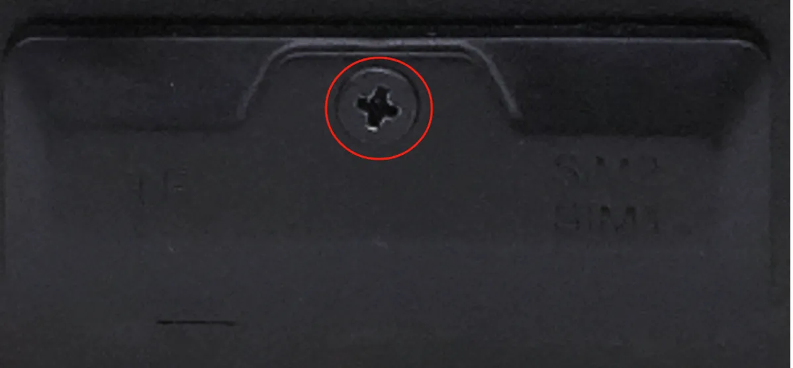

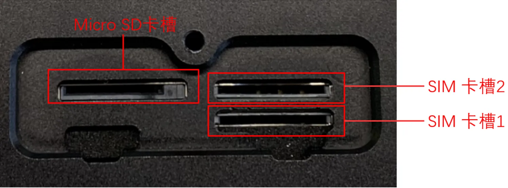

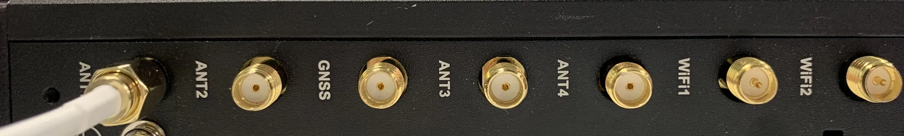

> 天线丝印与名称对照、SIM 卡槽详情见 §2.5.7。

### 步骤 5：上电，确认设备已就绪

接通电源后，观察前面板 **PWR** 灯：

- **PWR 常亮** → 设备已正常上电。

待系统启动完成后，**STATUS** 灯开始闪烁，表示设备已就绪。

> 指示灯详细含义与异常灯态见 §2.3。

### 步骤 6：PC 与浏览器登录 Web

1. 将 PC 网口与设备 **ETH 1** 或 **ETH 2** 用网线直连。  
2. 将 PC 网卡 IP 设为与设备接口**同网段**。

| 端口角色 | 默认 IP |
| :---: | :---: |
| ETH 1 | 192.168.3.100 |
| ETH 2 | 192.168.4.100 |

3. 打开浏览器，输入对应网口的登录地址（例如 ETH 2）：  
   `https://192.168.4.100:9100`

4. 输入初始账号密码完成登录。

| 项目 | 默认值 |
| --- | --- |
| 初始账号 | adm |
| 初始密码 | 123456 |

> 若浏览器提示证书告警，请选择继续访问。SSH 命令行管理方式见 §2.7。

### 装完自检

- ☐ 设备已固定（导轨或壁挂）。  
- ☐ 电源、网线已接好；若用蜂窝，SIM 与天线已就位。  
- ☐ **PWR 常亮**且 **STATUS 闪烁**。  
- ☐ 浏览器已能打开 Web 登录页并完成登录。

**排障提示**：若无法登录，请检查 PC IP 是否与设备同网段、网线是否插紧。  
如需恢复出厂设置，请参见 §2.7 的恢复出厂说明。

---

## 第二部分：详细说明

### 2.1 装箱清单

**标准配件**

| 序号 | 名称 | 数量 | 单位 | 备注 |
| --- | --- | :---: | :---: | --- |
| 1 | EC942主机 | 1 | 台 | — |
| 2 | 产品保修卡 | 1 | 张 | — |

**可选配件**

| 序号 | 名称 | 数量 | 单位 | 备注 |
| --- | --- | :---: | :---: | --- |
| 1 | 电源适配器 | 1 | 个 | 选配 |
| 2 | WiFi天线 | 1 | 根 | 标配（根据型号而定） |
| 3 | GNSS 天线 | 1 | 根 | 标配（根据型号而定） |
| 4 | 蜂窝天线 | 1 | 根 | 标配（根据型号而定） |

> 具体标配数量及型号支持情况请查看《EC942系列边缘计算机产品规格书》中“订购信息”部分。

### 2.2 产品结构与标识

#### 2.2.1 右面板

右面板分布有电源接口、以太网口、串口、USB 口、CAN 口、数字量 IO 端子、天线接口、SIM / Micro SD 卡槽等。

#### 2.2.2 前面板

前面板布置 PWR、STATUS、WARN、Error、SIM1、SIM2、User1、User2、4G/5G 及 L1~L3 指示灯。

### 2.3 指示灯与复位键

#### 2.3.1 运行状态指示灯

EC942 共有 12 个 LED 灯，指示电源及系统运行状态。

| 标识 | 名称 | 定义 |
| --- | --- | --- |
| PWR | 电源指示灯 | 上电常亮 |
| STATUS | 系统运行状态指示灯 | 当系统正常启动后，STATUS 闪烁；如果系统启动阶段发生异常导致系统启动失败，或者恢复出厂操作尚未完成时，STATUS 长灭。 |
| WARN | 警告指示灯 | 当系统发生警告异常时，WARN 灯闪烁。警告异常包括：恢复出厂尚未完成、拨号异常（需开启蜂窝功能）。 |
| Error | 错误指示灯 | 当系统发生错误时，Error 灯闪烁。错误包括：恢复出厂尚未完成。 |
| SIM1 | SIM1 卡指示灯 | 选中 SIM 卡 1 进行拨号时常亮，选择 SIM 卡 2 拨号或者关闭拨号时，长灭。 |
| SIM2 | SIM2 卡指示灯 | 选中 SIM 卡 2 进行拨号时常亮，选择 SIM 卡 1 拨号或者关闭拨号时，长灭。 |
| User1 | 用户可编程指示灯 1 | 默认熄灭，可由用户编程控制 |
| User2 | 用户可编程指示灯 2 | 默认熄灭，可由用户编程控制 |
| 4G/5G | 蜂窝网连接状态指示灯 | 拨号成功后常亮 |
| L1 | 蜂窝网信号强度 | 见蜂窝网信号强度指示灯说明 |
| L2 | 蜂窝网信号强度 | |
| L3 | 蜂窝网信号强度 | |

#### 2.3.2 蜂窝信号强度灯

| LED | 无信号 | 信号弱（RSSI < -90） | 信号中等（-90 <= RSSI < -70） | 信号强（RSSI >= -70） |
| --- | --- | --- | --- | --- |
| L1 | 灭 | 亮 | 亮 | 亮 |
| L2 | 灭 | 灭 | 亮 | 亮 |
| L3 | 灭 | 灭 | 灭 | 亮 |

#### 2.3.3 复位键

> 恢复出厂步骤的灯态变化及注意事项见 §2.7。

### 2.4 机械安装

#### 2.4.1 DIN 导轨

DIN 轨的安装板附在 EC942 后面板上（采用 6 个 M3 的螺钉固定）。

1. 将 DIN 轨上方卡入到支架上方的槽位中。  
2. 缓慢向支架方向向前推动设备使得 DIN 轨底端卡入到位。

#### 2.4.2 壁挂

壁挂套件需单独购买。先将套件用螺钉固定在设备上，再用螺钉将设备固定到墙面或柜体。拆卸时逆序松开墙面螺钉，再取下套件。

**方式一：将壁挂套件安装在 EC942 的后面板上**

步骤一：使用螺钉将壁挂套件固定在 EC942 的后面板上。

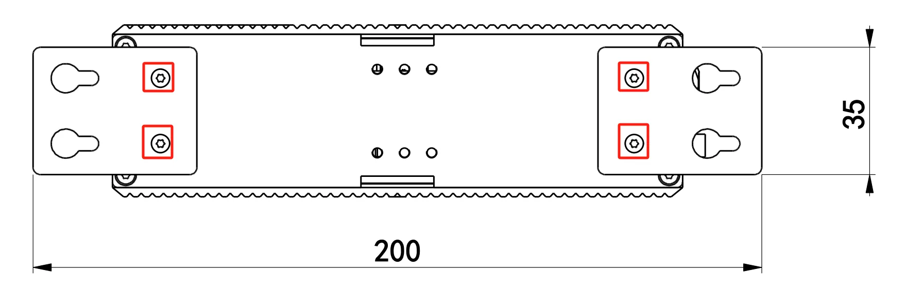

步骤二：当壁挂套件成功固定到 EC942 以后，采用 4 个螺钉将设备固定到墙面或者柜子上。

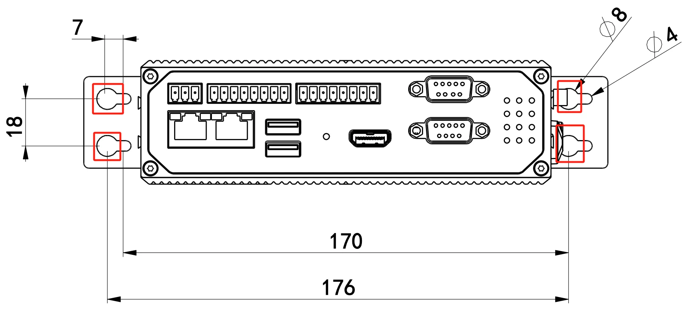

**方式二：将壁挂安装套件安装在左、右面板上**

步骤一：将壁挂安装套件采用螺钉分别固定到左面板和右面板上。

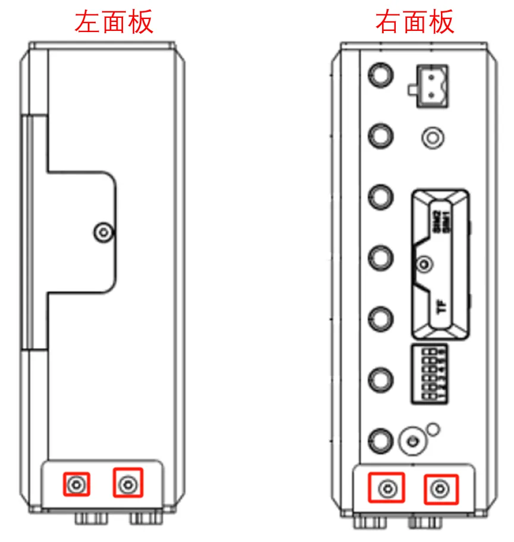

固定完成后如图所示：

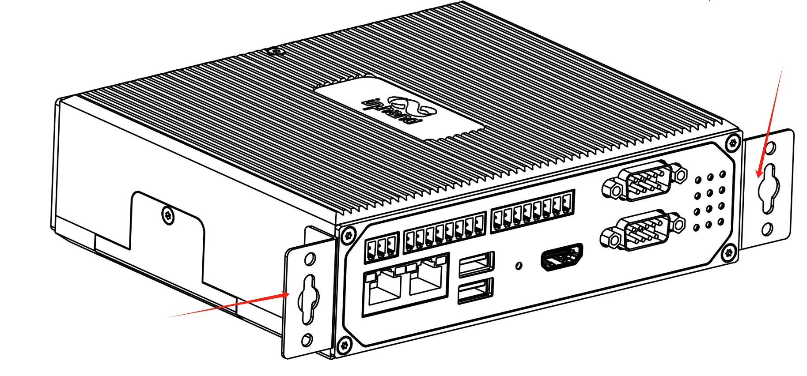

步骤二：当壁挂安装套件成功安装到 EC942 面板以后，采用螺钉将 EC942 固定到墙面或者柜子上。

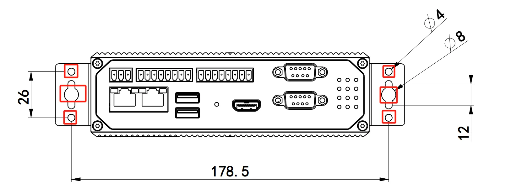

### 2.5 连接与布线

#### 2.5.1 以太网

EC942 有 2 个 RJ45 以太网口，支持 10M/100M/1000M 自适应速率。

| RJ45 引脚号 | 10M/100M | 1000M |
| --- | --- | --- |
| 1 | TX+ | TRD(0)+ |
| 2 | TX- | TRD(0)- |
| 3 | RX+ | TRD(1)+ |
| 4 | — | TRD(2)+ |
| 5 | — | TRD(2)- |
| 6 | RX- | TRD(1)- |
| 7 | — | TRD(3)+ |
| 8 | — | TRD(3)- |

#### 2.5.2 电源与串口

**供电**

EC942 支持 **9～48 V DC** 供电（双引脚端子，V+、V−），亦可使用电源适配器。当 PWR 电源指示灯长亮则代表设备已经正常上电。

**串口**

EC942 支持两路 DB9 串口，支持 RS-232 或 RS-485 或 RS-422 通讯，软件可配置。

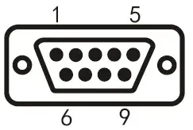

| DB9 引脚号 | 引脚名称 | 引脚定义 |
| --- | --- | --- |
| 1 | — | — |
| 2 | RS-232 RxD/RS-422 TxD+ | RS-232 接收 / RS-422 发送正 |
| 3 | RS-232 TxD/RS-485 B/RS-422 RxD- | RS-232 发送 / RS-485 信号 B / RS-422 接收负 |
| 4 | — | — |
| 5 | GND | RS-232 接地 |
| 6 | — | — |
| 7 | RS-485 A/RxD+ | RS-485 信号 A / RS-422 接收正 |
| 8 | RS-422 TxD- | RS-422 发送负 |
| 9 | — | — |

#### 2.5.3 RS-485 拨码开关

拨码开关控制着 485 总线的上拉、下拉电阻，可以选择上下拉电阻以提升 485 总线带载设备数量。

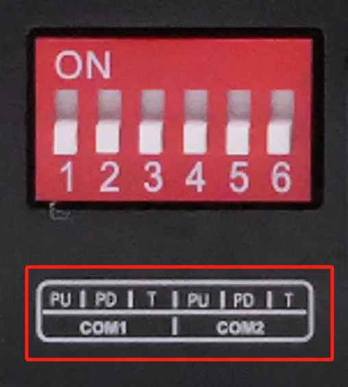

| 标识 | 功能说明 |
| --- | --- |
| PU | ON -- 使能上拉电阻；OFF -- 禁用上拉电阻 |
| PD | ON -- 使能下拉电阻；OFF -- 禁用下拉电阻 |
| T | ON -- 使能终端匹配电阻；OFF -- 禁用终端匹配电阻 |

> 上下拉电阻用于抗干扰、解决兼容性问题；启用后会减少总线可接入设备数量。

#### 2.5.4 数字量输入

接线方式如下：

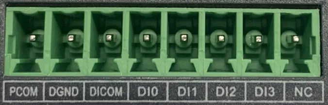

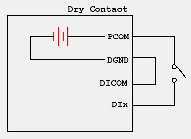

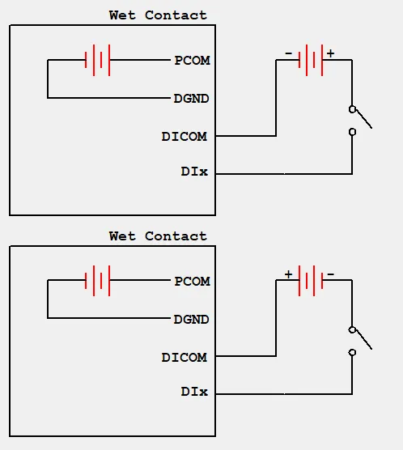

**说明**：并非所有型号的 EC942 都支持数字量输入/输出接口，具体支持情况请查看《EC942系列边缘计算机产品规格书》中“订购信息”部分。

#### 2.5.5 数字量输出

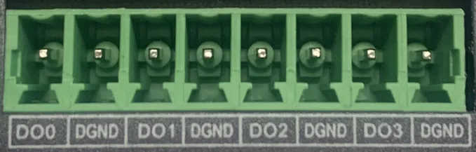

| 接口标识 | 功能 | 描述 |
| :---: | :---: | --- |
| DO0 | 数字量输出 0 号接口 | 4 路数字量输出 DO，隔离 3000VDC |
| DGND | 接地端 | |
| DO1 | 数字量输出 1 号接口 | |
| DGND | 接地端 | |
| DO2 | 数字量输出 2 号接口 | |
| DGND | 接地端 | |
| DO3 | 数字量输出 3 号接口 | |
| DGND | 接地端 | |

接线方式如下：

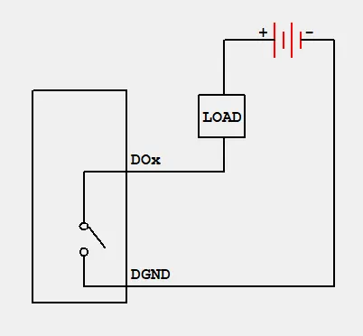

**说明**：并非所有型号的 EC942 都支持数字量输入/输出接口，具体支持情况请查看《EC942系列边缘计算机产品规格书》中“订购信息”部分。

#### 2.5.6 CAN 口

EC942 具有 1 路 CAN 总线接口，支持 CAN 2.0A/B 标准。它兼容 CAN FD，最高速率可达 5 Mbps。

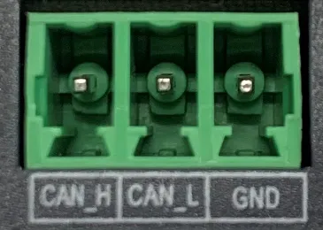

| 标识 | 功能 |
| --- | --- |
| CAN_H | CAN 高电平数据线 |
| CAN_L | CAN 低电平数据线 |
| GND | 接地 |

**说明**：并非所有型号的 EC942 都支持 CAN 接口，具体支持情况请查看《EC942系列边缘计算机产品规格书》中“订购信息”部分。

#### 2.5.7 蜂窝 SIM 与天线

**SIM 卡**

EC942 支持 2 个用于蜂窝通信的 SIM 卡插槽。SIM 卡不支持热插拔，需要在断电的情况下进行插拔。安装前需要先移除螺丝钉和保护盖。将 SIM 卡按压插入卡槽即可。

 

**天线**

EC942 共有 7 个天线接口，不同型号标配的天线数量不同。具体型号对应的天线支持情况可参见《EC942系列边缘计算机产品规格书》中“订购信息”部分。

| 标识 | 名称 |
| :---: | :---: |
| ANT1 | 4G LTE 主天线 / 5G 天线 |
| ANT2 | 4G LTE 分集接收天线 / 5G 天线 |
| GNSS | GNSS 天线 |
| ANT3 | 5G 天线 |
| ANT4 | 5G 天线 |
| WiFi1 | WiFi 天线 |
| WiFi2 | WiFi 天线 |

下图所示产品型号为 EC942-H-LQA8-B，支持 7 个天线接口。将所需天线拧入到对应的 SMA 天线接口完成天线安装即可，如 ANT1 所示。

#### 2.5.8 USB 与 Micro SD

**USB**

EC942 提供两个 USB 2.0 Host 接口，主要用于扩展存储设备、接鼠标和键盘。

EC942 支持 USB 存储设备热插拔。它会自动挂载所有的分区。EC942 会把所有 USB 存储设备分区挂载到 `/mnt/` 路径下，挂载文件夹的命名格式为 `usb_<node>_<num>`。其中，`<node>` 是分区的设备节点名称，`<num>` 可以是 0~9 的数字。

**注意**：在断开 USB 大容量存储设备之前，请记住输入 sync 同步命令，以防止数据丢失。当您断开存储设备的连接时，请从 `/media/*` 目录下退出。如果您留在 `/media/usb*` 中，则自动卸载过程将会失败。如果发生这种情况，请键入 `umount /media/usb*` 以手动卸载设备。

**Micro SD**

EC942 支持 1 个用于扩展设备容量的 Micro SD 卡插槽。Micro SD 卡不支持热插拔，需要在断电的情况下进行插拔。插入 SD 卡并且给设备上电后，系统会自动挂载所有的分区，挂载到 `/mnt/` 路径下，挂载文件夹的命名格式为 `sd_<node>_<num>`。

#### 2.5.9 mSATA 硬盘接口

EC942 支持 mSATA 硬盘，出厂默认不配备 mSATA 硬盘，如果用户有大容量的存储需求，需要自购 mSATA 硬盘，也可咨询映翰通进行 mSATA 的购买。

安装步骤如下所示：

步骤一：使用螺丝刀打开硬盘的保护外壳，拆开后如下图所示：

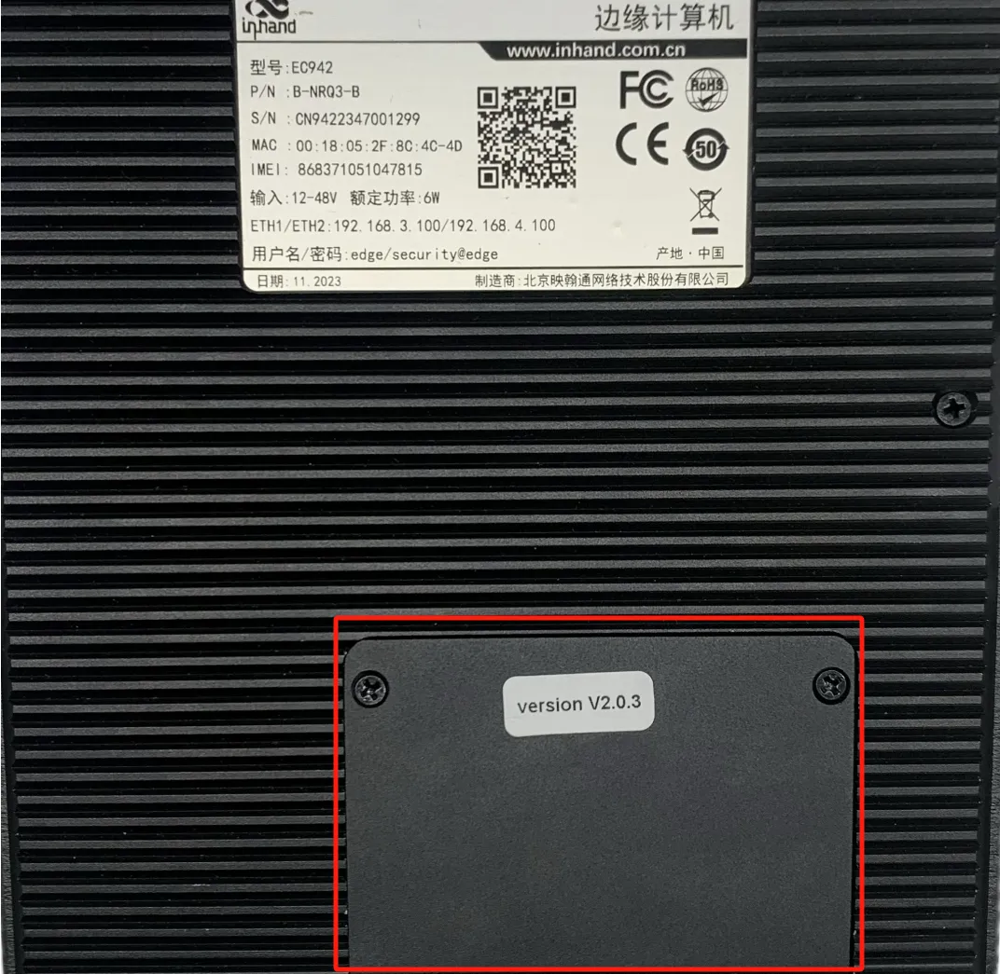  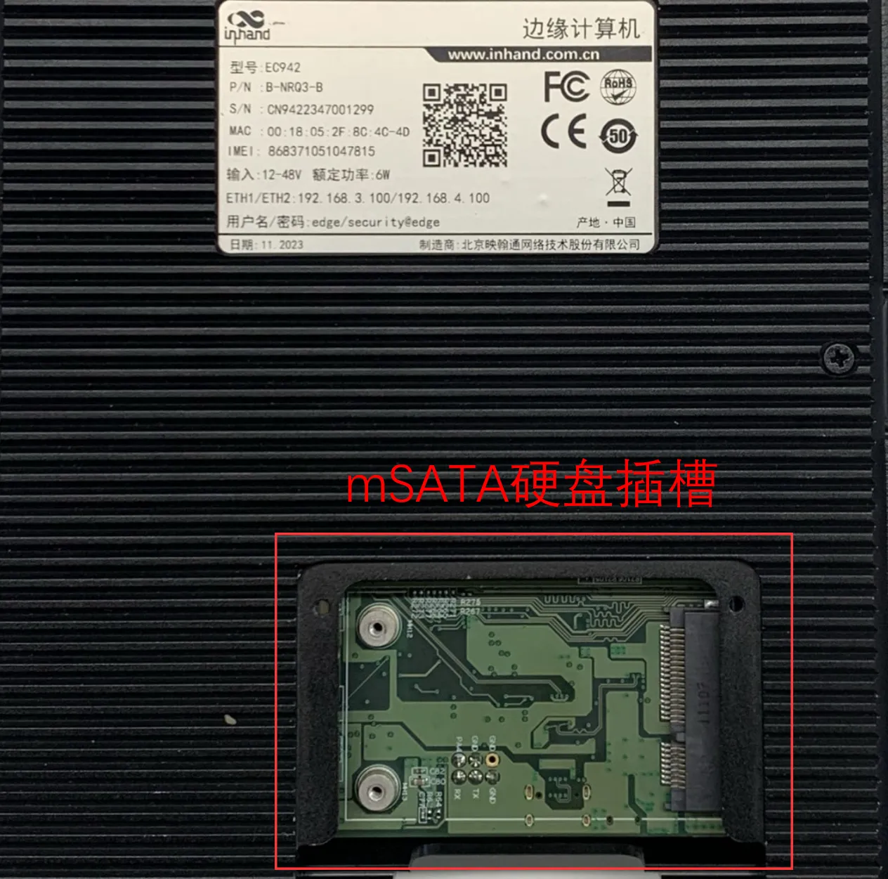

步骤二：将硬盘对准插槽，向右推并卡入到位；取出螺钉（M2）对硬盘的左边进行固定。

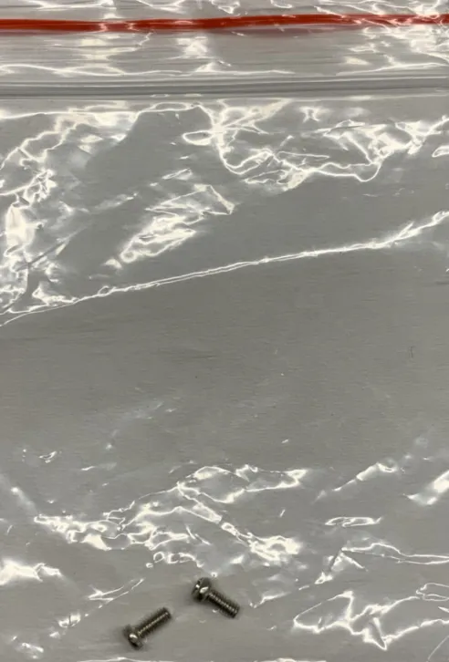  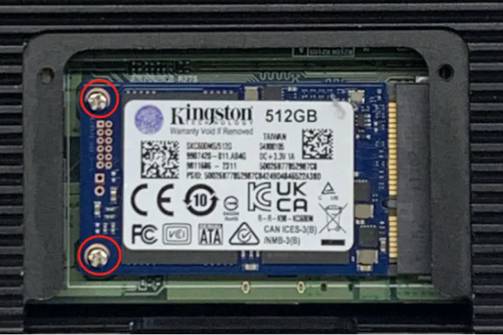

第三步：将拆卸下来的保护外壳重新安装回 EC942。

### 2.6 供电与环境

| 项目 | 规格 |
| :---: | --- |
| 输入电压 | 9-48 VDC（双引脚端子，V+、V−） |
| 功率 | 待机功率：120 mA - 200 mA @ 12V 工作功率：150 mA - 320 mA @ 12V 峰值功率：< 320 mA @ 12.0V > |
| 工作温度 | -20～70 ℃（-4～158 ℉） |
| 存储温度 | -40～85 ℃（-40～185 ℉） |
| 环境湿度 | 5～95%（无凝霜） |

### 2.7 首次登录与恢复出厂

#### 2.7.1 Web 登录

1. 将 EC942 和 PC 用网线互联，将 PC 的 IP 地址设置为设备接口同网段地址。  
2. 打开浏览器，输入对应网口地址。以下以 ETH 2 为例：

| 端口角色 | 默认 IP |
| :---: | :---: |
| ETH 1 | 192.168.3.100 |
| ETH 2 | 192.168.4.100 |

登录地址（ETH 2）：`https://192.168.4.100:9100`

3. 输入账号密码登录。

| 项目 | 默认值 |
| --- | --- |
| 初始账号 | adm |
| 初始密码 | 123456 |

若浏览器提示证书告警，请选择继续访问。

**说明**：并非所有 EC942 的型号都支持 WEB 界面管理功能，具体支持情况可查看《EC942系列边缘计算机产品规格书》中“订购信息”部分。

#### 2.7.2 SSH 登录

点击链接 [http://www.chiark.greenend.org.uk/~sgtatham/putty/download.html](http://www.chiark.greenend.org.uk/~sgtatham/putty/download.html)，下载 PuTTY（免费的软件），在 Windows 环境下以 SSH 命令的方式来建立与边缘计算机 EC300 的连接。登录的默认用户名在设备的背板上。

下图是使用 SSH 连接的示例：

#### 2.7.3 恢复出厂

  \- 长按恢复出厂设置按键10~20秒，看到WARN灯长亮。

  \- WARN灯长亮后，松开恢复出厂设置按键。

  \- 松开按键后，ERROR灯闪烁几次，系统开始重启并执行恢复出厂设置。

  \- 系统重启后，WARN灯和ERROR灯闪烁，STATUS熄灭；约30秒后，WARN和ERROR灯停止闪烁，同时STATUS开始闪烁，表示恢复出厂设置完成。

| LED | 状态 |
| --- | --- |
| WARN | 闪烁 |
| ERROR | 闪烁 |
| STATUS | 熄灭 |

执行恢复出厂设置后，系统会进行一次重启，重启完成后，恢复出厂并没有完成，此时 WARN 灯和 ERROR 闪烁，STATUS 熄灭。在这个状态下不能对设备断电，否则可能会导致一些文件丢失而影响系统功能。这个状态会持续 30 秒，当恢复出厂完成后，WARN 和 ERROR 熄灭，STATUS 闪烁。

### 2.8 相关文档

| 需求 | 去向 |
|------|------|
| 产品介绍、USB/SD 详解、用户可编程按键与指示灯 API、配置与排障 | 《EC942用户手册》 |
| 订购信息、型号差异、天线型号、CAN/DI/DO/WEB 支持情况 | 《EC942系列边缘计算机产品规格书》 |
| 软件与公告 | [映翰通官网](http://www.inhand.com.cn) |

### 2.9 法律信息

**版权声明**

© 2024 映翰通网络 保留所有权利。

**商标**

InHand 标志是映翰通网络的注册商标。

本手册中的所有其他商标或注册商标属于其各自的制造商。

**免责声明**

本公司保留对此手册更改的权利，产品后续相关变更时，恕不另行通知。对于任何因安装、使用不当而导致的直接、间接、有意或无意的损坏及隐患概不负责。
