# EC942系列边缘计算机用户手册

---

## 前置信息

### 声明

首先非常感谢您选择本公司产品！在使用前，请您仔细阅读本用户手册，遵守以下声明，将有助于维护知识产权和法律合规性，以确保您的使用体验与产品的最新信息相一致。如有任何疑问或需要获取书面许可，请随时联系我们的技术支持团队。

- 版权声明

本用户手册包含受版权保护的内容，版权归北京映翰通网络技术股份有限公司及其许可者所有。未经书面许可，任何单位和个人不得擅自摘抄、复制本手册的部分或全部内容，且不得以任何形式传播。

- 免责声明

由于产品技术和规格不断更新，本公司不能承诺用户手册中的资料与实际产品完全一致。因此，不承担由于实际技术参数与用户手册不符而引起的任何争议。任何关于产品的改动恕不提前通知，本公司保留最终更改权和解释权

- 版权信息

本用户手册内容受版权法律保护，版权归北京映翰通网络技术股份有限公司及其许可者所有，保留一切权利。未经书面许可，不得擅自使用、复制或传播本手册的内容。

### 图形界面约定

| 符号 | 含义 | 示例 |
|------|------|------|
| `< >` | 表示变量或参数，需替换为实际值 | `<IP地址>` 表示需填入具体IP |
| `" "` | 表示界面上的文字标签 | 点击"保存"按钮 |
| `→` | 表示菜单层级或操作顺序 | 【网络】→【蜂窝】 |
| `【 】` | 表示菜单或页面名称 | 进入【系统设置】页面 |

### 技术支持

**北京映翰通网络技术股份有限公司（总部）**

电话：010-8417 0010

地址：北京市朝阳区紫月路18号院3号楼5层

**成都办事处**

电话：028-8679 8244

地址：四川省成都市武侯区天府大道北段1777号中国太平金融大厦14层

**广州办事处**

电话：020-8562 9571

地址：广州市天河区棠东东路5号远洋新三板创意园B-130单元

**武汉办事处**

电话：027-8716 3566

地址：湖北省武汉市洪山区珞瑜东路2号巴黎豪庭11栋2001室

**上海办事处**

电话：021-5480 8501

地址：上海市普陀区顺义路18号1103室

### 如何使用本手册

**对号入座**

- 首次使用用户：建议按顺序阅读「认识设备」→「安装与首次使用」→「常用场景配置」→「功能说明与参数参考」
- 已有设备用户：可直接查阅「功能说明与参数参考」或「附录 故障处理」
- 云平台管理用户：可查阅「常用场景配置」中的设备远程管理平台

**按任务快速跳转**

| 任务 | 对应章节 | 预计用时 |
|------|----------|----------|
| 了解设备外观与接口 | [认识设备](#第1章-认识设备) | 约10分钟 |
| 完成硬件安装与首次上电 | [安装与首次使用](#第2章-安装与首次使用) | 约15分钟 |
| 配置蜂窝网络接入互联网 | [场景1：蜂窝联网](#场景1蜂窝联网) | 约5分钟 |
| 配置Wi-Fi连接上游网络 | [场景2：Wi-Fi Station接入](#场景2wi-fi-station接入) | 约5分钟 |
| 配置OpenVPN远程接入 | [场景4：OpenVPN远程接入](#场景4openvpn远程接入) | 约10分钟 |
| 查看功能参数与Web配置 | [功能说明与参数参考](#第4章-功能说明与参数参考) | 按需 |
| 排查设备故障 | [附录 故障处理](#附录-故障处理) | 按需 |

---

## 第1章 认识设备

### 1.1 概述

EC942系列边缘计算机是映翰通公司面向工业物联网领域推出的一款轻量级AI加速边缘计算机。该产品搭载ARM Cortex-A55@2.0GHz四核处理器，标配4GB RAM和16GB eMMC，提供强劲的计算平台。产品采用发行版Linux系统，向用户提供灵活多样的二次开发环境。支持安全特性如Secure Boot和TPM2.0，保障软件及数据安全。可内置映翰通DeviceSupervisor Agent（简称DSA）服务，实现数据采集、处理及上云，并支持DeviceLive云管理。

本手册适用于基于Arm架构的边缘计算机EC940系列，并涵盖适用于所有支持型号的说明。

### 1.2 包装清单

| 物品 | 数量 | 说明 |
|------|------|------|
| EC942主机 | 1 台 | — |
| 电源适配器 | 1 个 | 选配 |
| Wi-Fi天线 | 1 根 | 标配（根据型号而定） |
| GNSS天线 | 1 根 | 标配（根据型号而定） |
| 蜂窝天线 | 1 根 | 标配（根据型号而定） |
| 产品保修卡 | 1 张 | — |

### 1.3 外观与接口

EC942的面板布局如下所示。

**右面板**

<p align="center">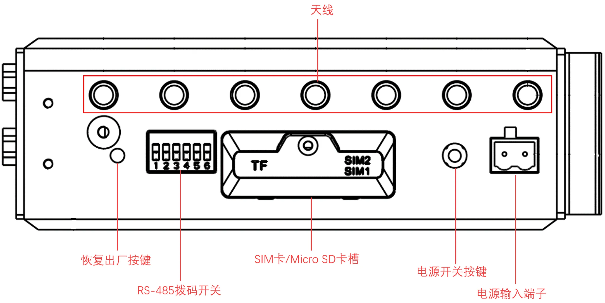</p>

<p align="center"><strong>图 1-1 EC942右面板</strong></p>

**前面板**

<p align="center">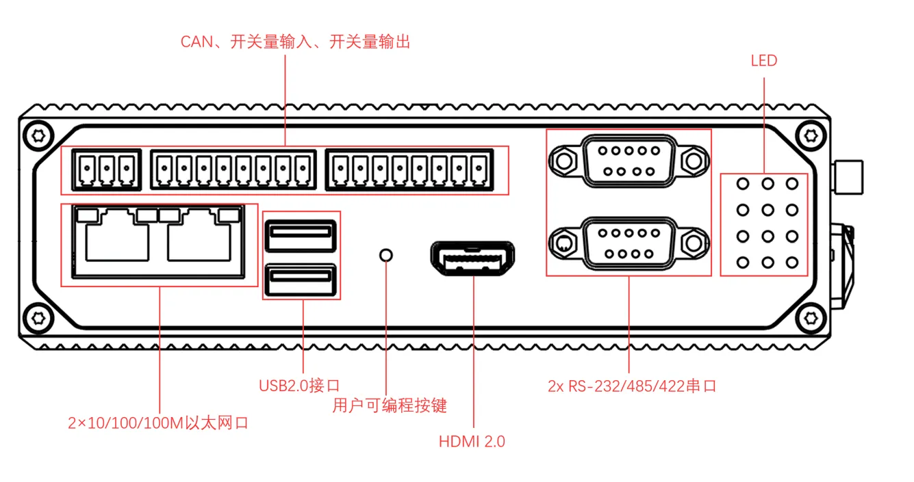</p>

<p align="center"><strong>图 1-2 EC942前面板</strong></p>

**接口说明**

| 接口 | 位置 | 功能说明 |
|------|------|----------|
| 以太网口（ETH1/ETH2） | 前面板 | 2个RJ45接口，支持10M/100M/1000M自适应 |
| 串口（COM1/COM2） | 右面板 | 2路DB9串口，支持RS-232/RS-485/RS-422，软件可配置 |
| CAN口 | 右面板 | 1路CAN总线接口，支持CAN 2.0A/B，兼容CAN FD |
| 数字量输入（DI0~DI3） | 右面板 | 4路数字量输入，隔离3000VDC |
| 数字量输出（DO0~DO3） | 右面板 | 4路数字量输出，隔离3000VDC |
| USB接口 | 右面板 | 2个USB 2.0 Host接口 |
| 直流电源输入 | 右面板 | 9~48VDC供电端子 |
| SIM卡槽 | 前面板 | 2个SIM卡插槽，支持蜂窝通信 |
| Micro SD卡槽 | 前面板 | 1个Micro SD卡插槽，用于扩展存储 |
| 天线接口 | 前面板/右面板 | 蜂窝天线（ANT1~ANT4）、GNSS天线、Wi-Fi天线（WiFi1~WiFi2） |
| mSATA硬盘接口 | 内部 | 支持mSATA硬盘扩展（需拆机安装） |

> **注意**：并非所有型号的EC942均支持CAN接口、数字量输入/输出接口及Wi-Fi功能，具体支持情况请查看《EC942系列边缘计算机产品规格书》中"订购信息"部分。

### 1.4 指示灯说明

EC942配置12个LED灯，分别对电源及系统运行状态进行指示。

| 指示灯 | 状态 | 含义 |
|--------|------|------|
| PWR | 常亮 | 设备已上电 |
| STATUS | 闪烁 | 系统正常启动后STATUS闪烁 |
|  | 常灭 | 系统启动失败，或恢复出厂操作尚未完成 |
| WARN | 闪烁 | 系统发生警告异常（恢复出厂尚未完成、拨号异常） |
| Error | 闪烁 | 系统发生错误（恢复出厂尚未完成） |
| SIM1 | 常亮 | 选中SIM卡1进行拨号 |
|  | 常灭 | 选择SIM卡2拨号或关闭拨号 |
| SIM2 | 常亮 | 选中SIM卡2进行拨号 |
|  | 常灭 | 选择SIM卡1拨号或关闭拨号 |
| User1 | 默认熄灭 | 用户可编程控制 |
| User2 | 默认熄灭 | 用户可编程控制 |
| 4G/5G | 常亮 | 蜂窝拨号成功 |
| L1 | 灭/亮 | 与L2、L3组合指示蜂窝信号强度 |
| L2 | 灭/亮 | 与L1、L3组合指示蜂窝信号强度 |
| L3 | 灭/亮 | 与L1、L2组合指示蜂窝信号强度 |

**蜂窝网信号强度指示灯说明**

| LED | 无信号 | 信号弱（RSSI < -90） | 信号中等（-90 <= RSSI < -70） | 信号强（RSSI >= -70） |
|-----|--------|----------------------|------------------------------|----------------------|
| L1 | 灭 | 亮 | 亮 | 亮 |
| L2 | 灭 | 灭 | 亮 | 亮 |
| L3 | 灭 | 灭 | 灭 | 亮 |

**恢复出厂设置过程指示灯状态**

| LED | 状态 |
|-----|------|
| WARN | 闪烁 |
| ERROR | 闪烁 |
| STATUS | 熄灭 |

执行恢复出厂设置后，系统会进行一次重启，重启完成后恢复出厂尚未完成，此时WARN灯和ERROR闪烁，STATUS熄灭。在此状态下不能对设备断电，否则可能导致文件丢失而影响系统功能。该状态持续约30秒，恢复出厂完成后WARN和ERROR熄灭，STATUS恢复闪烁。

### 1.5 恢复出厂设置

EC942支持两种恢复出厂设置方式：

1. **命令行方式**

   登录设备命令行界面，执行恢复出厂命令，系统会自动重启并恢复出厂设置。

<p align="center"></p>

<p align="center"><strong>图 1-3 恢复出厂命令（factory_reset）</strong></p>

2. **按键方式**

   - 长按恢复出厂设置按键10~20秒，看到WARN灯长亮。
   - WARN灯长亮后，松开恢复出厂设置按键。
   - 松开按键后，ERROR灯闪烁几次，系统开始重启并执行恢复出厂设置。
   - 系统重启后，WARN灯和ERROR灯闪烁，STATUS熄灭；约30秒后，WARN和ERROR灯停止闪烁，同时STATUS开始闪烁，表示恢复出厂设置完成。

### 1.6 默认设置

| 项目 | 默认值 |
|------|--------|
| ETH1 IP地址 | 192.168.3.100 |
| ETH2 IP地址 | 192.168.4.100 |
| SSH登录用户名 | edge |
| SSH登录密码 | security@edge |
| Web管理地址 | https://192.168.4.100:9100 |
| Web登录用户名 | adm |
| Web登录密码 | 123456 |
| 操作系统 | Debian GNU/Linux 10 (buster) |

> **注意**：出于安全考虑，建议禁用默认用户账户，并创建新的用户账户。

---

## 第2章 安装与首次使用

### 2.1 安装前准备

**环境要求**

| 项目 | 规格 |
|------|------|
| 输入电压 | 9~48 VDC |
| 工作温度 | -20~70℃（-4~158℉） |
| 存储温度 | -40~85℃（-40~185℉） |
| 环境湿度 | 5~95%（无凝霜） |

**工具准备**

- 十字螺丝刀（用于安装壁挂套件、mSATA硬盘）
- DIN导轨（如采用导轨安装方式）
- 网线（用于连接PC进行初始配置）
- SIM卡（如需使用蜂窝网络功能）
- 蜂窝天线、Wi-Fi天线、GNSS天线（根据型号配置）

> **注意**：SIM卡和Micro SD卡均不支持热插拔，需在断电状态下进行插拔操作。

### 2.2 安装指南

#### 2.2.1 DIN轨安装

DIN轨安装板附在EC942后面板上（采用6个M3螺钉固定），安装步骤如下：

1. 将DIN轨上方卡入到支架上方的槽位中。
2. 缓慢向支架方向推动设备，使DIN轨底端卡入到位。

<p align="center">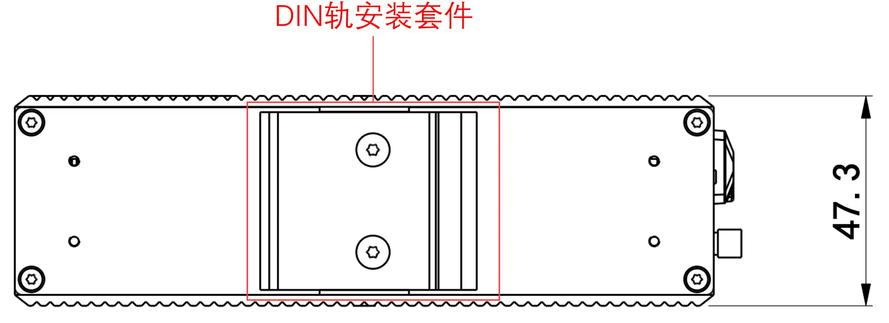</p>

<p align="center"><strong>图 2-1 DIN轨安装</strong></p>

#### 2.2.2 壁挂式安装

EC942可采用壁挂套件进行安装，套件需单独购买。共有两种壁挂方式。

**壁挂安装方式一：将壁挂套件安装在EC942的后面板上**

步骤一：使用螺钉将壁挂套件固定在EC942的后面板上。

<p align="center">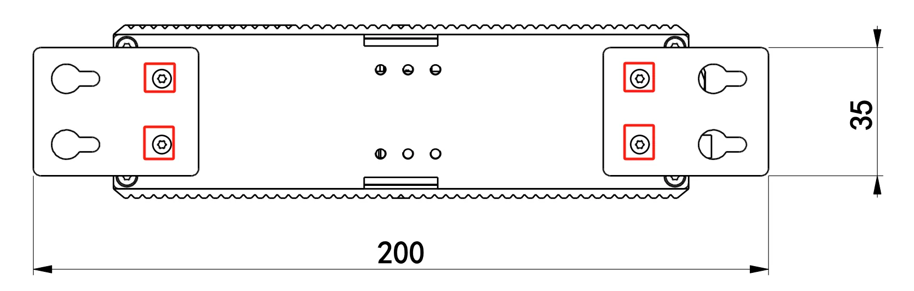</p>

<p align="center"><strong>图 2-2 壁挂安装方式一（固定套件）</strong></p>

步骤二：壁挂套件固定到EC942后，采用4个螺钉将设备固定到墙面或柜子上。

<p align="center"></p>

<p align="center"><strong>图 2-3 壁挂安装方式一（固定到墙面）</strong></p>

**壁挂安装方式二：将壁挂安装套件安装在左、右面板上**

步骤一：将壁挂安装套件采用螺钉分别固定到左面板和右面板上。

<p align="center">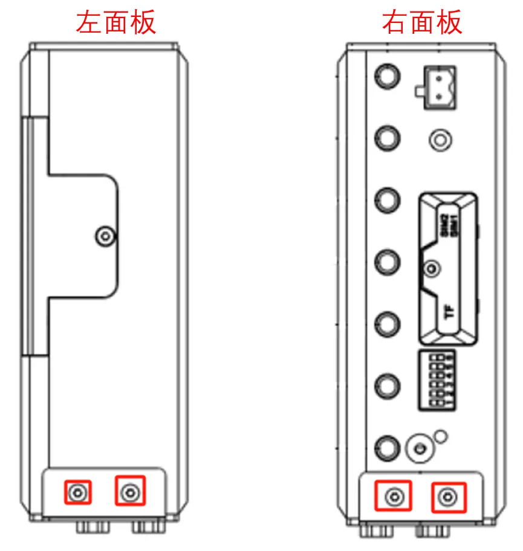</p>

<p align="center"><strong>图 2-4 壁挂安装方式二（固定套件）</strong></p>

固定完成后示意：

<p align="center"></p>

<p align="center"><strong>图 2-5 壁挂安装方式二（安装完成示意）</strong></p>

步骤二：壁挂安装套件安装到EC942面板后，采用螺钉将EC942固定到墙面或柜子上。

<p align="center">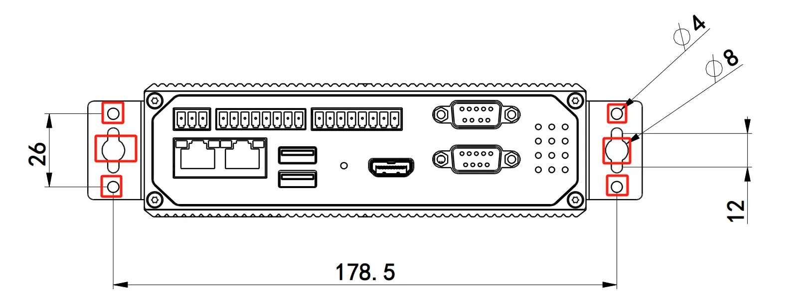</p>

<p align="center"><strong>图 2-6 壁挂安装方式二（固定到墙面）</strong></p>

#### 2.2.3 电源连接

EC942支持9~48VDC供电。将出厂自带的电源适配器取出后，将适配器端子插入到EC942的DC端口中，然后连接电源适配器。当PWR电源指示灯长亮则代表设备已正常上电。

<p align="center"></p>

<p align="center"><strong>图 2-7 直流电源输入接口</strong></p>

#### 2.2.4 天线安装

EC942共有7个天线接口，不同型号标配的天线数量不同。具体型号对应的天线支持情况可参见《EC942系列边缘计算机产品规格书》中"订购信息"部分。

| 标识 | 名称 |
|:----:|:----:|
| ANT1 | 4G LTE主天线/5G天线 |
| ANT2 | 4G LTE分集接收天线/5G天线 |
| GNSS | GNSS天线 |
| ANT3 | 5G天线 |
| ANT4 | 5G天线 |
| WiFi1 | Wi-Fi天线 |
| WiFi2 | Wi-Fi天线 |

将所需天线拧入到对应的SMA天线接口完成天线安装。

<p align="center">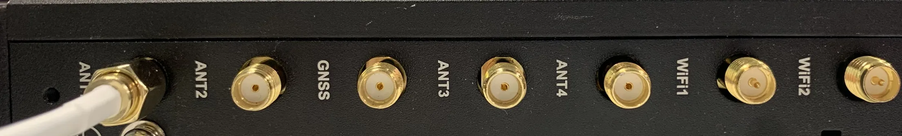</p>

<p align="center"><strong>图 2-8 天线接口</strong></p>

#### 2.2.5 SIM卡与Micro SD卡安装

EC942支持2个用于蜂窝通信的SIM卡插槽和1个用于扩展设备容量的Micro SD卡插槽。SIM卡和Micro SD卡均不支持热插拔，需在断电情况下进行插拔。

安装前需先移除螺钉和保护盖。将SIM卡或Micro SD卡按压插入卡槽即可。插入SD卡并且给设备上电后，系统会自动挂载所有分区，挂载到/mnt/路径下，挂载文件夹的命名格式为`sd_<node>_<num>`。

<p align="center">
    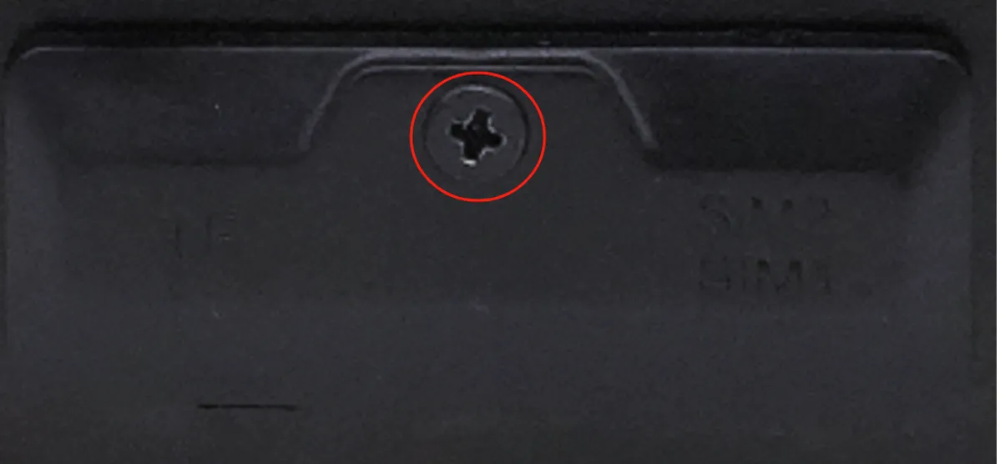
    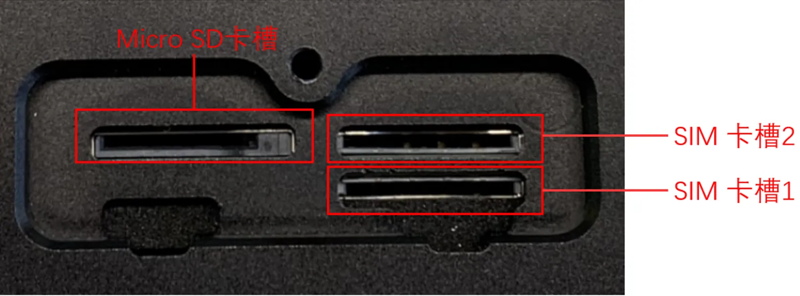</p>

<p align="center"><strong>图 2-9 SIM卡与Micro SD卡槽</strong></p>

#### 2.2.6 mSATA硬盘安装（可选）

EC942支持mSATA硬盘，出厂默认不配备mSATA硬盘。如有大容量存储需求，需自购mSATA硬盘。

步骤一：使用螺丝刀打开硬盘的保护外壳。

<p align="center">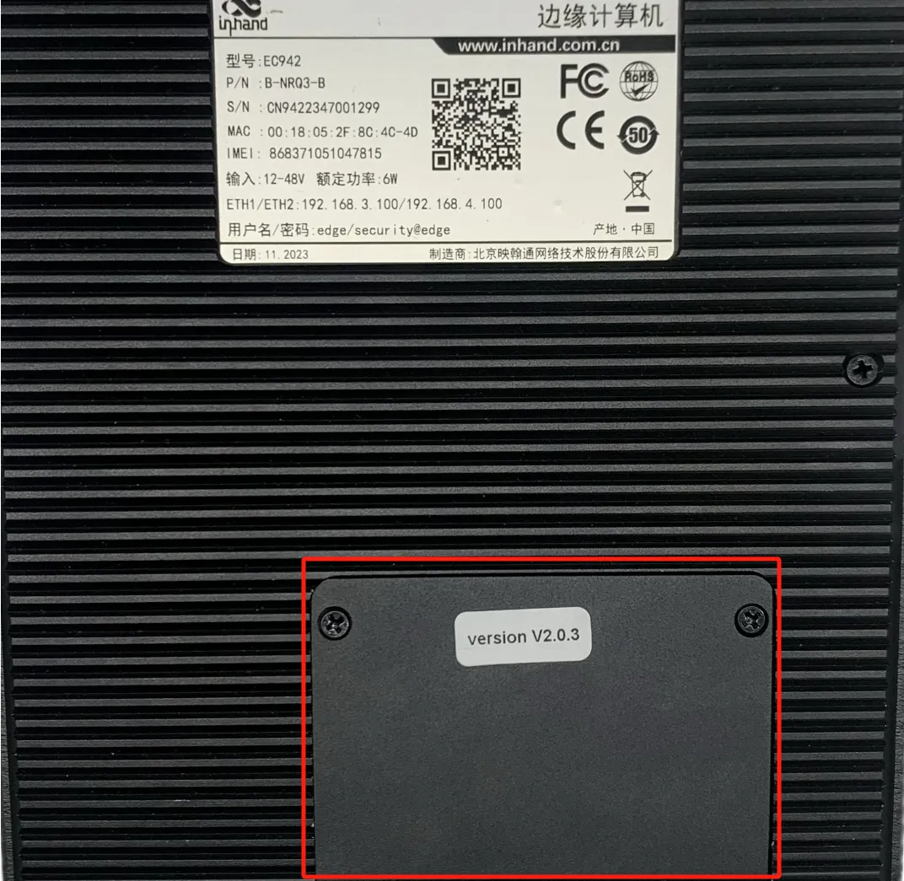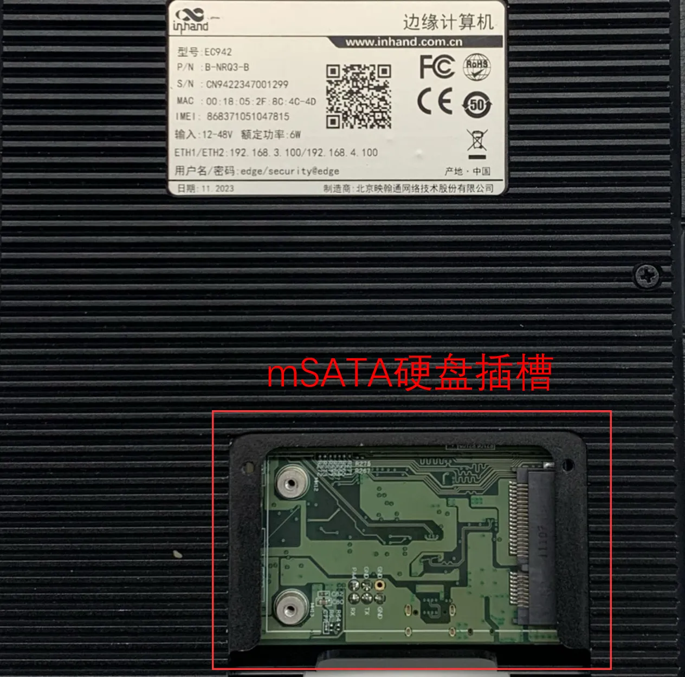</p>

<p align="center"><strong>图 2-10 mSATA硬盘安装（打开保护壳）</strong></p>

步骤二：将硬盘对准插槽，向右推并卡入到位；使用螺钉（M2）对硬盘左边进行固定。

<p align="center">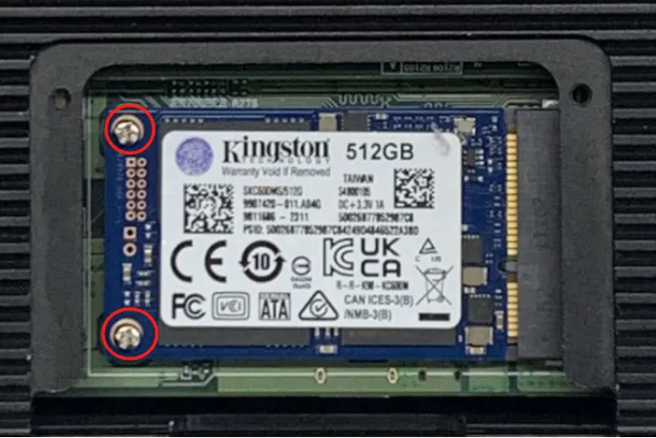</p>

<p align="center"><strong>图 2-11 mSATA硬盘安装（插入并固定）</strong></p>

步骤三：将拆卸下来的保护外壳重新安装回EC942。

#### 2.2.7 首次访问设备

**方式一：SSH命令行连接**

1. 将网线一端插入EC942的任一网口，另一端插入电脑网口。
2. 将电脑IP地址设置为设备接口同网段地址（ETH1：192.168.3.0/24，ETH2：192.168.4.0/24）。
3. 使用SSH客户端（如PuTTY）连接设备默认IP地址，默认用户名和密码见[1.6 默认设置](#16-默认设置)。

<p align="center"></p>

<p align="center"><strong>图 2-12 SSH连接示例</strong></p>

**方式二：Web界面管理**

EC942支持基于IEOS的Web界面管理方式。在浏览器中输入设备对应网口的IP地址和端口号（如https://192.168.4.100:9100），使用默认账号密码登录。

<p align="center"></p>

<p align="center"><strong>图 2-13 Web登录界面</strong></p>

> **注意**：并非所有EC942型号均支持Web界面管理功能，具体支持情况可查看《EC942系列边缘计算机产品规格书》中"订购信息"部分。

### 2.3 快速检查

安装完成后，按照以下清单进行验证：

- [ ] 设备已正确固定（DIN轨或壁挂）
- [ ] 电源已连接，PWR指示灯常亮
- [ ] 天线已正确安装到对应接口
- [ ] 如需蜂窝功能，SIM卡已正确插入
- [ ] 电脑与设备通过网线连接，且IP地址在同一网段
- [ ] 可通过SSH或Web界面正常登录设备
- [ ] STATUS指示灯正常闪烁，表示系统运行正常

---

## 第3章 常用场景配置

### 场景1：蜂窝联网

**目标**：通过4G/5G蜂窝网络接入互联网。

**前提**：已插入SIM卡并安装天线，设备已上电，可通过Web界面或命令行访问设备。

**预计用时**：约5分钟。

**操作步骤**：

1. 将SIM卡插入对应卡槽，安装蜂窝天线到ANT1~ANT4接口。
2. 登录IEOS Web管理界面，进入【网络】→【蜂窝】菜单。
3. 确认"启用蜂窝网络"开关处于开启状态。
4. 如使用专网卡，配置拨号参数集（APN、用户名、密码、认证方式）。
5. 根据需求选择网络制式（3G/4G/5G或自动）。
6. 确认"是否添加默认路由"已启用（默认开启）。
7. 如需双卡备份，开启"启用双SIM卡"功能，配置主卡和最大拨号次数。
8. 建议开启ICMP探测功能，配置探测服务器地址以检测拨号假连接。
9. 点击"保存"并等待拨号建立。

**验证方法**：

1. 查看4G/5G指示灯，确认拨号成功后常亮。
2. 在Web界面的【状态】→【蜂窝拨号状态信息】页面查看获取的IP地址、DNS等信息。
3. 使用网络诊断工具ping外网地址（如8.8.8.8），确认网络连通。

**常见问题**：

- 网络连接失败：检查SIM卡是否正确插入、APN参数是否正确、天线是否安装到位。
- 拨号假连接（状态成功但无法上网）：检查ICMP探测是否开启，或尝试手动重新拨号。
- 信号弱：调整设备位置或天线方向，参考L1/L2/L3信号强度指示灯判断信号质量。

---

### 场景2：Wi-Fi Station接入

**目标**：将EC942作为Wi-Fi客户端接入上游无线网络。

**前提**：设备支持Wi-Fi功能，已安装Wi-Fi天线，已知目标Wi-Fi网络的SSID和密码。

**预计用时**：约5分钟。

**操作步骤**：

1. 将Wi-Fi天线安装到WiFi1/WiFi2接口。
2. 登录IEOS Web管理界面，进入【网络】→【Wi-Fi Station】菜单。
3. 开启"启用Wi-Fi"开关。
4. 在"客户端SSID"中输入目标Wi-Fi网络的SSID，或通过"扫描"按钮获取附近可用网络。
5. 选择正确的认证方式（无认证、WPA-PSK、WPA2-PSK、WPA-PSK/WPA2-PSK Mixed）。
6. 选择加密方式（CCMP、TKIP或两者）。
7. 输入"WPA/WPA2 PSK密钥"。
8. 确认"是否添加默认路由"设置（默认开启）。
9. 点击"保存"并等待Wi-Fi连接建立。

**验证方法**：

1. 在Web界面的【状态】→【Wi-Fi Station状态信息】页面查看获取的IP地址、网关及DNS。
2. 使用网络诊断工具ping外网地址，确认网络连通。

**常见问题**：

- 无法连接Wi-Fi：检查SSID和密码是否正确，确认Wi-Fi信号强度是否足够。
- 无法上网：检查"是否添加默认路由"是否启用，或检查路由度量值设置是否合理。

---

### 场景3：以太网配置

**目标**：配置EC942以太网接口的IP地址及网络参数。

**前提**：设备已通过网线连接到管理电脑，可访问Web界面或命令行。

**预计用时**：约5分钟。

**操作步骤**：

1. 登录IEOS Web管理界面，进入【网络】→【以太网】菜单。
2. 选择需要配置的接口（eth1或eth2）。
3. 如需配置静态IP：
   - 将协议类型设置为"静态地址"。
   - 填写IP地址、子网掩码、网关。
   - 点击"保存"。
4. 如需配置DHCP Client：
   - 将协议类型设置为"DHCP客户端"。
   - 点击"保存"，等待自动获取IP地址。
5. 如需启动DHCP Server（为下挂设备分配地址）：
   - 在对应接口启用DHCP Server功能。
   - 配置起始分配地址、最大地址分配数量、租期。
   - 点击"保存"。

**验证方法**：

1. 在Web界面的【状态】→【路由状态信息】页面查看接口IP配置。
2. 在【状态】→【DHCP Server状态信息】页面查看地址分配情况（如启用了DHCP Server）。
3. 从下挂设备ping设备网关地址，确认网络连通。

**常见问题**：

- 无法获取IP地址：检查网线连接、确认DHCP服务器是否正常工作。
- 下挂设备无法上网：检查DHCP Server地址池是否与接口网段匹配，检查网关和DNS配置。

---

### 场景4：OpenVPN远程接入

**目标**：通过OpenVPN建立安全的远程接入隧道。

**前提**：已具备OpenVPN服务器环境或已知OpenVPN服务器信息，设备已接入互联网。

**预计用时**：约10分钟。

**操作步骤**：

1. 登录IEOS Web管理界面，进入【网络】→【OpenVPN】菜单。
2. 如需配置OpenVPN服务器：
   - 点击"添加服务器"，选择手动配置或导入配置。
   - 手动配置时，填写服务端名称、虚拟网络、网络掩码。
   - 导入CA证书、公钥证书、私钥证书及DH参数。
   - 配置高级参数（协议类型、端口、加密算法等）。
   - 点击"保存"。
3. 如需配置OpenVPN客户端：
   - 点击"添加客户端"，选择手动配置或导入配置。
   - 手动配置时，填写客户端名称、OpenVPN服务器地址（格式：IP 端口 协议）。
   - 导入CA证书、公钥证书、私钥证书。
   - 配置高级参数。
   - 点击"保存"。
4. 在状态栏开启该OpenVPN配置。

**验证方法**：

1. 在Web界面的【状态】→【OpenVPN状态信息】页面查看连接状态。
   - 服务器状态：查看已连接的客户端信息。
   - 客户端状态：查看获取的虚IP地址及隧道连接时长。
2. 通过VPN隧道ping对端虚拟IP地址，确认隧道连通。

**常见问题**：

- 无法建立连接：检查服务器地址和端口是否正确，确认证书是否匹配，检查防火墙是否放行了OpenVPN端口。
- 隧道建立后无法通信：检查虚拟网络网段配置，确认是否开启了"允许客户端到客户端的通信"。

---

### 场景5：设备远程管理（DeviceLive）

**目标**：将EC942接入映翰通DeviceLive云平台，实现远程监控和管理。

**前提**：设备已通过蜂窝网络或以太网接入互联网，已注册DeviceLive平台账号。

**预计用时**：约5分钟。

**操作步骤**：

1. 登录IEOS Web管理界面，进入【系统】→【基础配置】→【云管理】菜单。
2. 开启"启动云服务"开关。
3. 在"云服务器"中选择对应的平台地址（国内平台或海外平台）。
4. 点击"保存"。
5. 登录DeviceLive平台，在设备列表中查看设备是否在线。

**验证方法**：

1. 在DeviceLive平台查看设备状态为"在线"。
2. 通过DeviceLive平台远程查看设备信息、蜂窝拨号状态等。

**常见问题**：

- 设备无法上线：检查设备网络连通性，确认所选云服务器地址正确，检查DeviceLive平台账号权限。

---

## 第4章 功能说明与参数参考

### 4.1 用户账户管理

EC942设备出厂默认创建root用户，但登录被禁用。默认登录用户为edge，该用户在sudo组中，可使用sudo执行系统级命令。

> **注意**：出于安全考虑，建议禁用默认用户账户，并创建新的用户账户。在禁用默认账户之前，应先创建一个新用户账户。

#### 4.1.1 切换到root用户

如需使用root用户，可手动修改系统配置，输入`sudo -s`切换至root用户。

#### 4.1.2 创建和删除用户账户

**创建用户账户**

使用`useradd`命令创建用户账户。以下示例在sudo组中创建test1用户（默认登录环境为bash，主目录为/home/test1）：

```shell
sudo useradd -m -s /bin/bash -G sudo test1
```

<p align="center"></p>

<p align="center"><strong>图 4-1 创建用户账户</strong></p>

使用`passwd`命令修改密码：

```shell
sudo passwd test1
```

<p align="center"></p>

<p align="center"><strong>图 4-2 修改用户密码</strong></p>

**删除用户账户**

使用`userdel`命令删除用户：

```shell
sudo userdel test1
```

<p align="center"></p>

<p align="center"><strong>图 4-3 删除用户账户</strong></p>

#### 4.1.3 禁用默认用户账户

使用`passwd`命令锁定默认用户账户（如edge），使其无法登录：

```shell
sudo passwd -l edge
```

<p align="center"></p>

<p align="center"><strong>图 4-4 锁定用户账户</strong></p>

解除锁定：

```shell
sudo passwd -u edge
```

<p align="center"></p>

<p align="center"><strong>图 4-5 解锁用户账户</strong></p>

### 4.2 基于IEOS的Web管理

EC942基于Debian 10系统，可使用Linux原生命令进行网络管理和系统管理。为便于配置，映翰通开发了IEOS系统程序，提供Web界面进行网络和系统管理。当启用IEOS功能后，IEOS会接管网络管理和系统管理，此时通过Linux原生命令进行网络管理和系统管理可能会失效。设备出厂默认启用IEOS。

> **注意**：使用IEOS程序管理网络配置和系统配置时，如果同时使用Linux原生命令，二者可能会相互影响，导致异常运行状态。建议IEOS支持的配置都通过IEOS Web实现管理，IEOS不支持的配置可结合Linux原生命令实现。

#### 4.2.1 登录Web

考虑到用户的程序可能会需要使用HTTP/HTTPS标准端口号80/443，IEOS使用9100端口号作为HTTPS连接的端口，不支持通过HTTP访问；当用户使用HTTP访问Web时，会自动跳转到HTTPS。以通过eth2的默认地址192.168.4.100为例进行说明。用户在浏览器中输入192.168.4.100:9100后跳转到登录页面。

> **注意**：IEOS程序启用时，会预留端口号范围9100~9200供内部通信使用。启用IEOS后，用户程序应避开使用这些端口号，否则可能产生冲突导致功能异常。

<p align="center"></p>

<p align="center"><strong>图 4-6 IEOS登录页面</strong></p>

IEOS采用状态和配置分离的设计方案，分为网络管理、系统管理和状态三大功能板块。网络管理菜单和系统管理菜单下只能进行网络和系统的相关配置，状态信息需统一到状态页面查看。

#### 4.2.2 网络管理

##### 4.2.2.1 以太网接口

进入【网络】→【以太网】菜单，可对eth1和eth2接口进行配置。

**配置静态IP地址**

选择对应接口，将协议类型设置为"静态地址"，填写IP地址、子网掩码和网关，点击"保存"。

<p align="center"></p>

<p align="center"><strong>图 4-7 以太网静态IP配置</strong></p>

**配置DHCP Client**

选择对应接口，将协议类型设置为"DHCP客户端"，点击"保存"，接口将自动从DHCP服务器获取IP地址。

<p align="center"></p>

<p align="center"><strong>图 4-8 以太网DHCP客户端配置</strong></p>

**启动DHCP Server**

在接口上启动DHCP Server功能，为下挂设备分配IP地址。

<p align="center"></p>

<p align="center"><strong>图 4-9 DHCP Server配置</strong></p>

DHCP Server配置参数说明：

| 参数 | 说明 |
|------|------|
| 启用DHCP Server | DHCP Server功能的开关 |
| 起始分配地址 | 地址池起始基址，网段+起始地址=地址池起始IP地址 |
| 最大地址分配数量 | 地址池中的最大地址数量 |
| 租期 | 租期时间 |

##### 4.2.2.2 蜂窝拨号

进入【网络】→【蜂窝】菜单进行蜂窝网络配置。

<p align="center">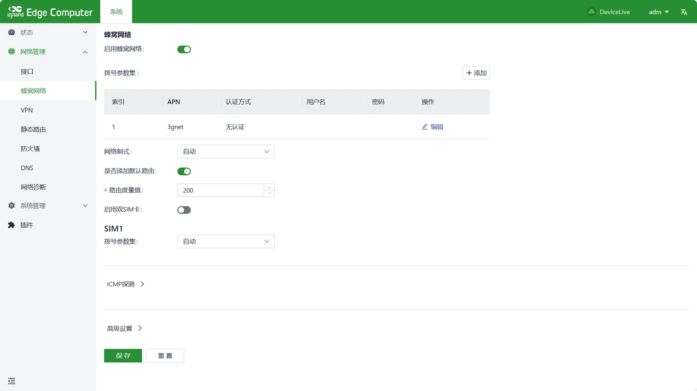</p>

<p align="center"><strong>图 4-10 蜂窝拨号基本配置</strong></p>

蜂窝网参数说明：

| 参数 | 说明 |
|------|------|
| 启用蜂窝网络 | 蜂窝功能的开关，默认开启 |
| 拨号参数集 | 用于专网卡拨号时配置APN、用户名、密码及认证方式，最多可添加10条记录 |
| 网络制式 | 蜂窝网络制式选择（3G/4G/5G/LTE/WCDMA等），默认自动 |
| 是否添加默认路由 | 拨号成功后添加蜂窝口默认路由，默认开启 |
| 路由度量值 | 蜂窝口默认路由的度量值，多出口时度量值最小者生效 |

<p align="center"></p>

<p align="center"><strong>图 4-11 双SIM卡配置</strong></p>

双SIM卡参数说明：

| 参数 | 说明 |
|------|------|
| 启用双SIM卡 | 启用双卡单拨功能，默认关闭。SIM1拨号失败达到次数后自动切换到SIM2 |
| 选择主卡 | 拨号时优先使用的SIM卡 |
| 最大拨号次数 | 当前SIM卡拨号达到该次数后切换到另一张SIM卡 |
| 拨号参数集 | SIM卡选用的拨号参数集Index |
| PIN Code | SIM卡的PIN码 |

<p align="center">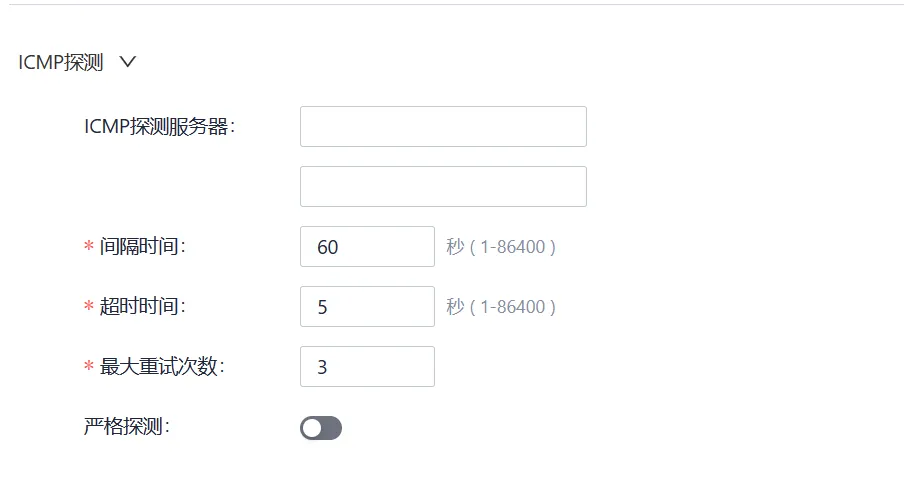</p>

<p align="center"><strong>图 4-12 拨号参数集配置</strong></p>

**ICMP探测配置**

无线蜂窝网络较复杂，有时会出现拨号假连接（拨号状态成功但ping不通目标地址）。IEOS蜂窝拨号支持ICMP探测以发现假连接，建议开启。

<p align="center"></p>

<p align="center"><strong>图 4-13 ICMP探测配置</strong></p>

ICMP探测参数说明：

| 参数 | 说明 |
|------|------|
| ICMP探测服务器 | ICMP探测地址，可配置2个，任意1个成功即判定网络正常 |
| 间隔时间 | ICMP探测周期 |
| 超时时间 | 等待探测响应的超时时间 |
| 最大重试次数 | 探测失败达到该值时触发重新拨号，取值范围[1,5] |
| 严格探测 | 关闭时若接口接收报文变化则不发送ICMP；开启时周期性发送ICMP探测报文 |

**高级配置参数说明**

| 参数 | 说明 |
|------|------|
| 启用调试模式 | 开启后日志增加拨号调试信息，默认关闭 |
| 启用无限重拨 | 开启后无论拨号失败多少次均不重启系统 |
| 重拨间隔 | 拨号失败后进行下一次拨号前等待的时间 |
| 信号查询间隔 | 定期检测信号强度的周期 |

##### 4.2.2.3 Wi-Fi

<a id="wi-fi-station配置"></a>

进入【网络】→【Wi-Fi Station】菜单进行Wi-Fi客户端配置。

<p align="center">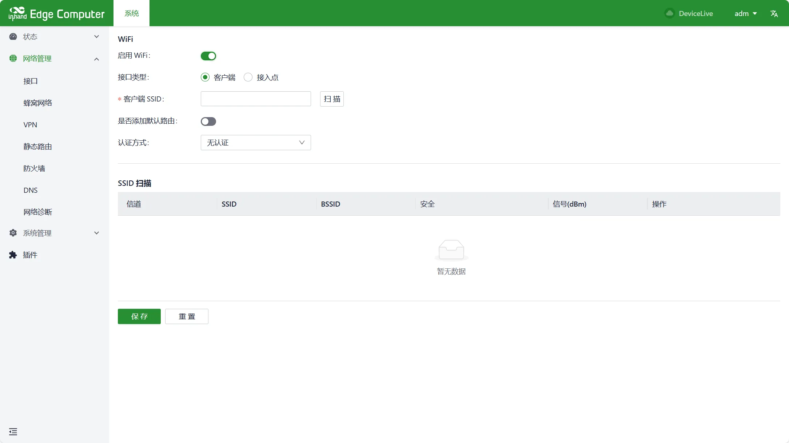</p>

<p align="center"><strong>图 4-14 Wi-Fi Station配置</strong></p>

Wi-Fi Station参数说明：

| 参数 | 说明 |
|------|------|
| 启用Wi-Fi | 使能开关，默认关闭 |
| 客户端SSID | 需连接的SSID，可手动输入或通过扫描获取 |
| 是否添加默认路由 | Wi-Fi连接成功后添加默认路由，默认开启 |
| 路由度量值 | Wi-Fi口默认路由的度量值 |
| 认证方式 | 支持无认证、WPA-PSK、WPA2-PSK、WPA-PSK/WPA2-PSK Mixed |
| 加密方式 | 支持CCMP、TKIP、TKIP和CCMP |
| WPA/WPA2 PSK密钥 | Wi-Fi连接密钥 |

##### 4.2.2.4 静态路由

进入【网络】→【静态路由】菜单配置以太网静态路由。当同时配置以太网、蜂窝、Wi-Fi的默认路由时，Metric值最小者生效。需保证各默认路由的Metric值不同。

<p align="center">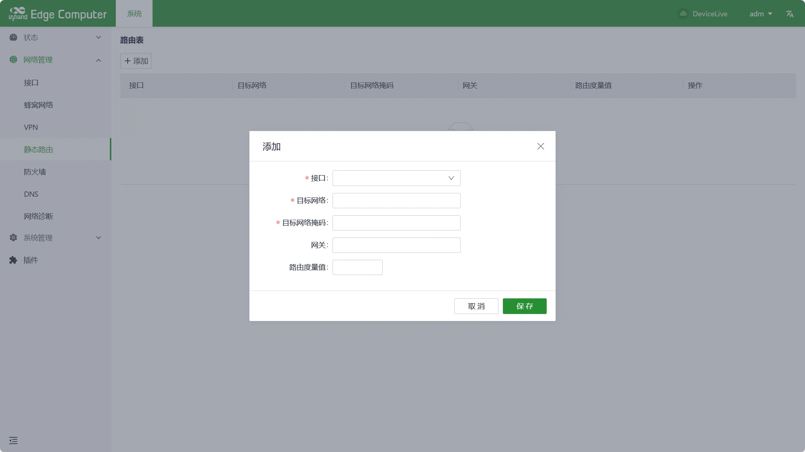</p>

<p align="center"><strong>图 4-15 静态路由配置</strong></p>

静态路由配置参数：

| 参数 | 说明 |
|------|------|
| 接口 | 静态路由的出接口 |
| 目标网络 | 目标网络地址 |
| 目标网络掩码 | 目标网络掩码 |
| 网关 | 下一跳地址 |
| 路由度量值 | 静态路由的度量值 |

##### 4.2.2.5 防火墙

进入【网络】→【防火墙】菜单进行防火墙配置。

**基本设置**

分别设置入站、出站和转发策略。在区域配置中可以添加域规则，域基于接口，可添加局域和广域。

<p align="center"></p>

<p align="center"><strong>图 4-16 防火墙基本设置</strong></p>

<p align="center">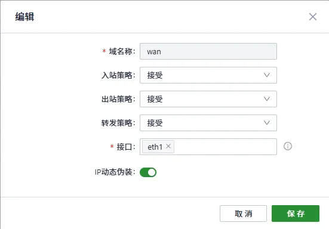</p>

<p align="center"><strong>图 4-17 区域配置</strong></p>

<p align="center"></p>

<p align="center"><strong>图 4-18 区域配置详情</strong></p>

区域配置参数：

| 参数 | 说明 |
|------|------|
| 入站规则 | 针对从该域收到且目标为设备本身的报文的控制策略（接受/拒绝/丢弃） |
| 出站规则 | 针对设备本身产生且通过该域发送的报文的控制策略（接受/拒绝/丢弃） |
| 转发策略 | 针对从该域收到且需转发的报文的控制策略（接受/拒绝/丢弃） |
| 接口 | 域中包含的接口 |
| IP动态伪装 | 开启后，从域中对应接口发出的报文源IP转换为接口IP地址 |

**端口转发（DNAT）**

DNAT规则用于报文从广域网方向进入、访问局域网下设备时使用。

<p align="center"></p>

<p align="center"><strong>图 4-19 DNAT规则配置</strong></p>

DNAT参数说明：

| 参数 | 说明 |
|------|------|
| DNAT规则名称 | 规则名称，用于说明规则目的 |
| 状态 | 启用/禁用规则 |
| 协议 | 支持IP/UDP/TCP等 |
| 源区域 | 设备从哪个域（接口）收到报文 |
| 源IP地址 | 报文源IP地址，不填则匹配所有 |
| 内部IP地址 | 需访问的目标设备IP地址（通常为局域网设备） |
| 外部IP地址 | 接口多个IP时选择对应的IP地址 |

**源地址转换（SNAT）**

SNAT规则用于报文从局域网进入、需将源IP地址修改为WAN口IP地址时使用。

<p align="center">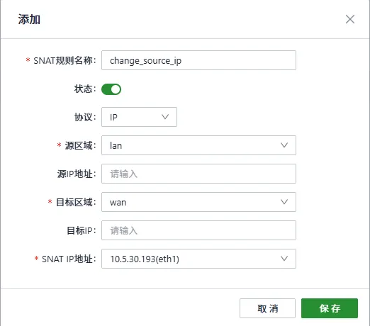</p>

<p align="center"><strong>图 4-20 SNAT规则配置</strong></p>

SNAT参数说明：

| 参数 | 说明 |
|------|------|
| SNAT规则名称 | 规则名称 |
| 状态 | 启用/禁用规则 |
| 协议 | 支持IP/UDP/TCP等 |
| 源区域 | 报文来源域（通常为局域网） |
| 源IP地址 | 匹配报文源IP，不填则匹配所有 |
| 目标区域 | 报文发出域（通常为广域网） |
| 目标IP | 报文目的IP地址，不填则匹配所有 |
| SNAT IP地址 | 修改后的源IP地址 |

**通信规则**

<p align="center"></p>

<p align="center"><strong>图 4-21 通信规则配置</strong></p>

通信规则参数说明：

| 参数 | 说明 |
|------|------|
| 通信规则名称 | 规则标识 |
| 状态 | 启用/禁用规则 |
| 限制地址 | IP协议族（IPv4） |
| 协议 | 支持IP/UDP/TCP等 |
| 目标 | 处理动作（Drop/Accept/Reject） |
| 源区域 | 报文进入设备的域 |
| 目标区域 | 报文发出设备的域 |
| 目标IP | 报文目标地址，不配置时匹配所有 |
| 目标端口 | 报文目标端口，不配置时匹配所有 |
| 源端口 | 报文源端口，不配置时匹配所有 |
| 源IP地址 | 报文源IP地址，不配置时匹配所有 |

**MAC地址过滤**

<p align="center"></p>

<p align="center"><strong>图 4-22 MAC地址过滤</strong></p>

MAC地址过滤用于控制EC942下挂设备产生的报文是否可被转发，但不影响下挂设备对EC942本身的访问。MAC地址列表最多可添加500条规则。

该功能包含三种模式：

- **无限制**：功能关闭，不对MAC地址列表中的设备产生影响
- **黑名单**：列表中的设备产生的报文被丢弃，其他设备正常转发
- **白名单**：仅列表中的设备产生的报文可被转发，其他设备被丢弃

MAC地址列表中每个记录均可单独启用/禁用。

**自定义规则**

在自定义防火墙输入框中，可输入Linux原生的iptables规则。

<p align="center">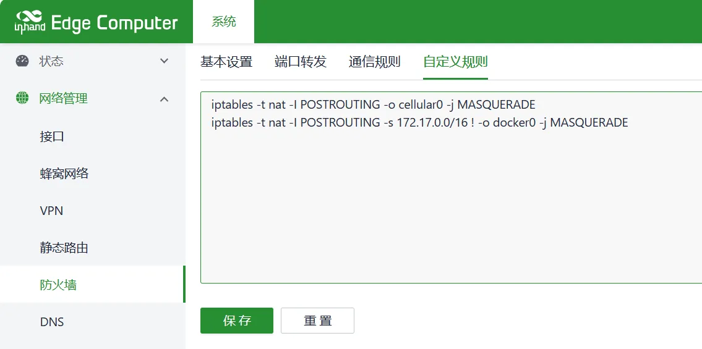</p>

<p align="center"><strong>图 4-23 防火墙自定义规则</strong></p>

##### 4.2.2.6 DNS

进入【网络】→【DNS】菜单进行DNS配置。

<p align="center"></p>

<p align="center"><strong>图 4-24 DNS配置</strong></p>

DNS参数说明：

| 参数 | 说明 |
|------|------|
| 域名服务器 | DNS Server地址，最多支持配置4个 |
| 自定义劫持域名 | 域名劫持功能，实现IP地址和域名之间的绑定 |

<p align="center"></p>

<p align="center"><strong>图 4-25 域名劫持配置</strong></p>

##### 4.2.2.7 网络诊断

进入【网络】→【网络诊断】菜单，支持ping、traceroute和nslookup功能。

<p align="center"></p>

<p align="center"><strong>图 4-26 网络诊断</strong></p>

##### 4.2.2.8 OpenVPN

进入【网络】→【OpenVPN】菜单进行OpenVPN配置。支持通过Web页面手动配置或导入配置文件。

**OpenVPN服务器配置**

手动配置：

<p align="center">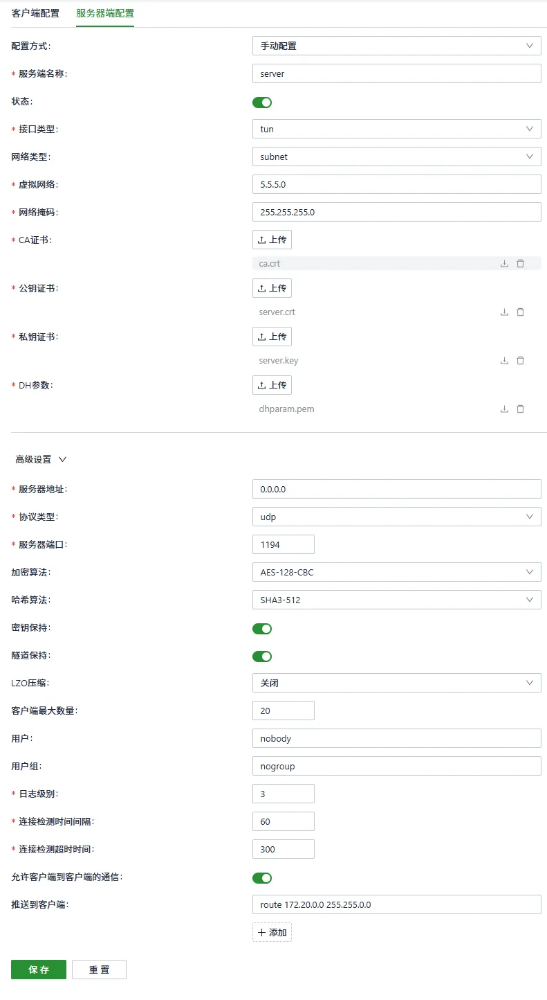</p>

<p align="center"><strong>图 4-27 OpenVPN服务器手动配置</strong></p>

OpenVPN服务器参数说明：

| 参数 | 说明 |
|------|------|
| 服务端名称 | 唯一标识，只能包含英文字母和数字，以字母开头，长度不超过64个字符 |
| 状态 | 开启/关闭服务器 |
| 接口类型 | 目前只支持tun模式 |
| 网络类型 | 支持p2p、net30（点对点）和subnet（虚拟局域网） |
| 虚拟网络 | subnet模式下配置虚拟网络网段；p2p/net30下配置本端和远端IP |
| 网络掩码 | subnet模式下配置子网掩码 |
| CA证书/公钥证书/私钥证书/DH参数 | 需导入对应的证书文件 |

高级设置参数：

| 参数 | 说明 |
|------|------|
| 服务器地址 | OpenVPN监听IP，默认0.0.0.0（监听所有IP） |
| 协议类型 | 支持udp/tcp，默认udp |
| 服务器端口 | 默认1194 |
| 加密算法 | 保证数据传输机密性的加密算法 |
| 哈希算法 | 保证数据传输完整性的哈希算法 |
| 密钥保持 | 网络异常短暂断开时可快速恢复，无需重新握手 |
| 隧道保持 | 防止隧道因短暂网络波动关闭 |
| LZO压缩 | 是否启用LZO压缩 |
| 客户端最大数量 | 同时连接的客户端数量 |
| 日志级别 | 取值范围1~11，数值越大日志越详细 |
| 连接检测时间间隔 | 发送心跳包检测VPN连接存活周期 |
| 连接检测超时时间 | 超时未收到响应则判定连接断开 |
| 允许客户端到客户端的通信 | 是否允许客户端间相互通信 |
| 推送到客户端 | 可推送路由和DNS等信息到客户端 |

导入配置：

<p align="center"></p>

<p align="center"><strong>图 4-28 OpenVPN服务器导入配置</strong></p>

**OpenVPN客户端配置**

手动配置：

<p align="center"></p>

<p align="center"><strong>图 4-29 OpenVPN客户端手动配置</strong></p>

OpenVPN客户端参数说明：

| 参数 | 说明 |
|------|------|
| 客户端名称 | 唯一标识，只能包含英文字母和数字，以字母开头，长度不超过64个字符 |
| 状态 | 开启/关闭客户端 |
| 接口类型 | 目前只支持tun模式 |
| 网络类型 | 支持p2p、net30和subnet |
| OpenVPN服务器 | 格式为"ip port proto"，如"192.168.3.200 1194 udp"，最多配置10个 |

导入配置：

<p align="center"></p>

<p align="center"><strong>图 4-30 OpenVPN客户端导入配置</strong></p>

#### 4.2.3 系统管理

##### 4.2.3.1 基础配置

进入【系统】→【基础配置】→【时区和NTP client】菜单进行配置。

<p align="center">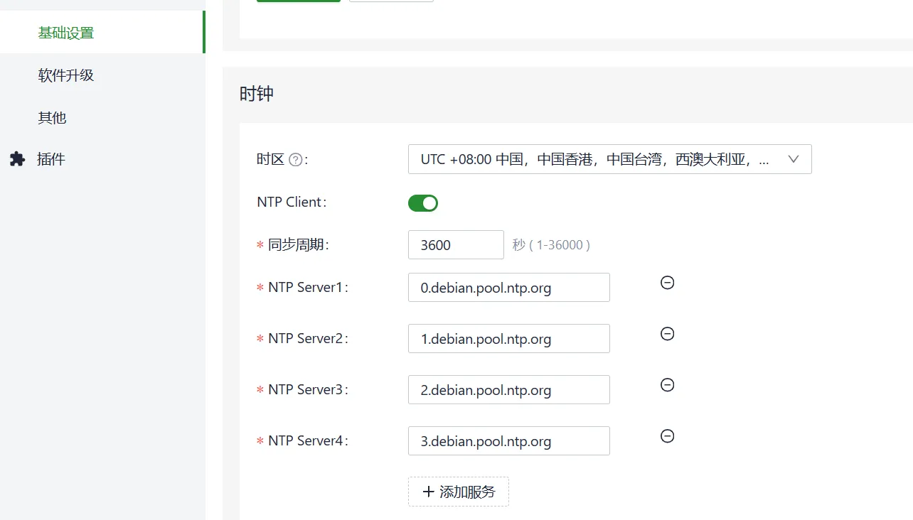</p>

<p align="center"><strong>图 4-31 时区和NTP配置</strong></p>

最多可配置10个NTP Server地址，程序周期性依次向每个服务器发送同步请求，同步成功后将系统时间写入RTC，不再继续向后发送请求。

除使用NTP同步外，在【状态】→【设备信息】页面有一个同步按钮可手动同步时间。仅当设备时间与本地时间（访问设备所用电脑的时间）相差超过3秒时才会显示该按钮。

<p align="center">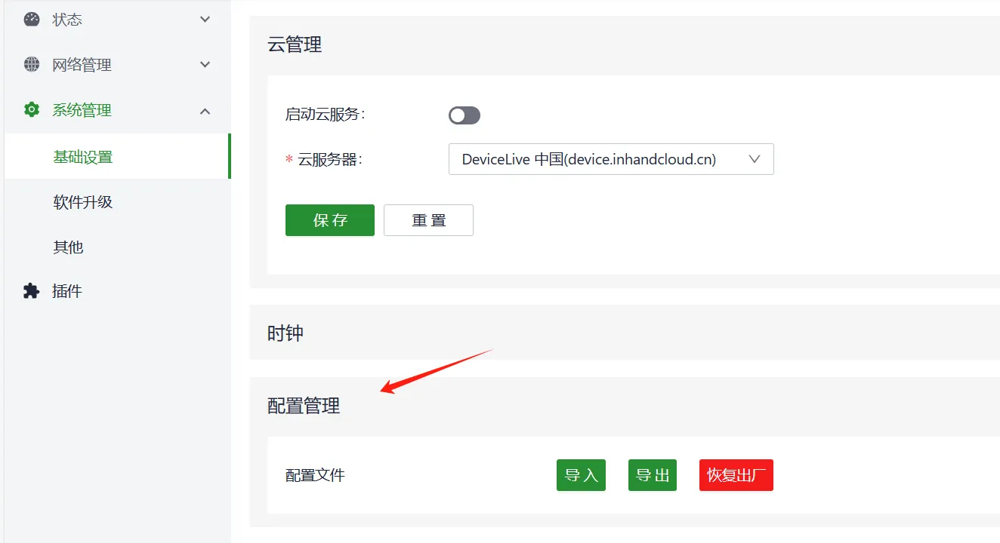</p>

<p align="center"><strong>图 4-32 手动同步时间</strong></p>

##### 4.2.3.2 固件升级

进入【系统】→【固件升级】菜单进行固件升级。

<p align="center"></p>

<p align="center"><strong>图 4-33 固件升级</strong></p>

自动重启选项默认关闭，升级固件后需手动重启系统才能生效；开启自动重启选项后，升级成功会自动重启系统。

**系统升级**

准备一个U盘(micro SD卡)。如果该U盘(SD卡)有多个分区，请使用第一个分区。建议不做多个分区。U盘(SD卡)分区需要格式为FAT32格式。本文档以升级EC942-V2.0.0.img为例进行说明。

- 在U盘（SD卡）根目录下创建一个空的ec900\_img目录，将inhand发布的EC942-V2.0.0.img文件和md5.txt文件放到ec900\_img目录下。

- 确认md5.txt文件中仅有EC942-V2.0.0.img一行的md5哈希值。EC942不支持多个img镜像ota升级。

- 在电脑上正常退出U盘（SD卡）。注意不要直接拔u盘，要在桌面选择“退出”或“弹出”操作。

- 将U盘（SD卡）插入目标EC942设备。目标设备会自动校验EC942-V2.0.0.img文件，并进行OTA升级。升级过程中WARN和ERROR灯会有相应的显示。等WARN和ERROR恢复正常后，升级操作即完成。因为img文件较大，升级时间较长，请耐心等候。

- 升级结束后，EC942会把升级中的关键信息写入ec900\_img目录下的日志文件。请查看相关文件。

##### 4.2.3.3 其他

进入【系统】→【其他】菜单，可进行系统重启和重置操作。

<p align="center"></p>

<p align="center"><strong>图 4-34 系统重启和重置</strong></p>

> **注意**：重置系统需慎重使用。该功能会将系统配置状态和文件系统状态恢复到出厂状态，用户安装的软件也会被清除。

#### 4.2.4 状态

IEOS提供统一的状态查看页面，用于查看网络和系统的运行状态。

##### 4.2.4.1 设备信息

【状态】→【设备信息】页面显示主机名、设备型号、序列号、固件版本、内核版本、文件系统版本以及CPU、内存和磁盘空间的使用概况。

<p align="center"></p>

<p align="center"><strong>图 4-35 设备信息</strong></p>

##### 4.2.4.2 蜂窝拨号状态

【状态】→【蜂窝拨号状态信息】页面显示当前拨号使用的SIM卡、IMEI、IMSI、ICCID、信号强度以及拨号获取的IP地址、DNS等信息。

<p align="center">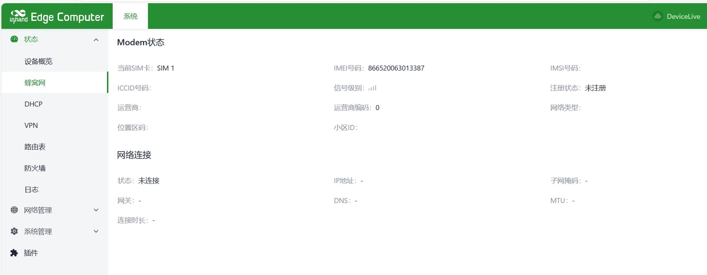</p>

<p align="center"><strong>图 4-36 蜂窝拨号状态</strong></p>

##### 4.2.4.3 Wi-Fi状态

【状态】→【Wi-Fi Station状态信息】页面显示Wi-Fi连接成功后获取的IP地址、网关及DNS等信息。

<p align="center"></p>

<p align="center"><strong>图 4-37 Wi-Fi Station状态</strong></p>

##### 4.2.4.4 DHCP Server状态

【状态】→【DHCP Server状态信息】页面显示设备作为DHCP Server分配出去的IP地址、客户端主机名、MAC地址及过期时间。

<p align="center">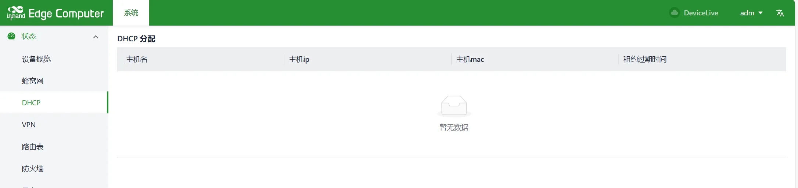</p>

<p align="center"><strong>图 4-38 DHCP Server状态</strong></p>

##### 4.2.4.5 路由状态

【状态】→【路由状态信息】页面显示IPv4直连路由、静态路由及路由邻居等信息。

<p align="center">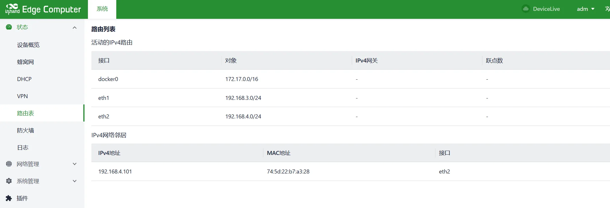</p>

<p align="center"><strong>图 4-39 路由状态</strong></p>

##### 4.2.4.6 防火墙状态

【状态】→【防火墙状态信息】显示过滤规则、IP地址映射规则等信息。

<p align="center">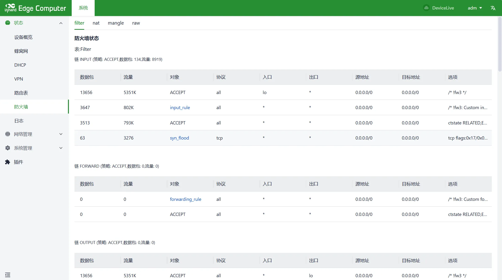</p>

<p align="center"><strong>图 4-40 防火墙状态</strong></p>

##### 4.2.4.7 日志信息

【状态】→【日志信息】页面可查看系统日志、用户日志以及设置日志等级（Error、Info、Debug等级别）。日志可下载到本地。

<p align="center">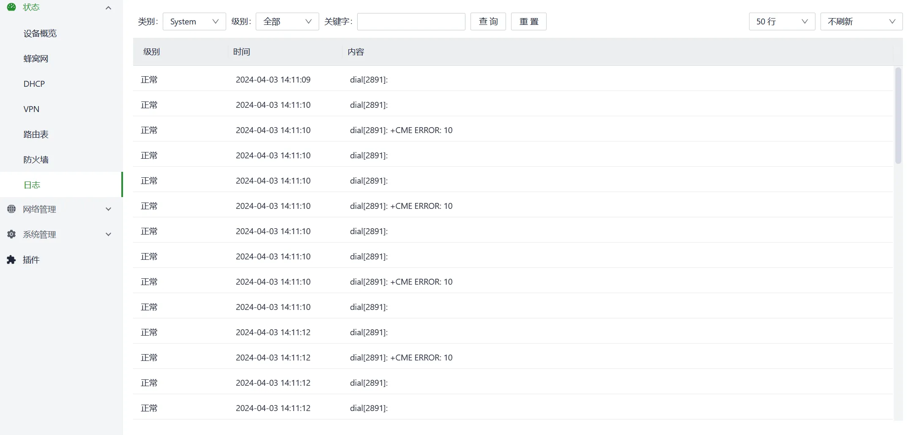</p>

<p align="center"><strong>图 4-41 日志信息</strong></p>

##### 4.2.4.8 OpenVPN状态

**OpenVPN服务器状态**

【状态】→【OpenVPN服务器状态信息】页面可查看状态更新时间、已连接的OpenVPN客户端等信息。

<p align="center"></p>

<p align="center"><strong>图 4-42 OpenVPN服务器状态</strong></p>

**OpenVPN客户端状态**

【状态】→【OpenVPN客户端状态信息】页面可查看客户端获取的虚IP地址及隧道连接时长等信息。

<p align="center"></p>

<p align="center"><strong>图 4-43 OpenVPN客户端状态</strong></p>

### 4.3 基于Linux命令行管理

使用Linux命令行进行网络配置时，需先关闭IEOS程序。IEOS通过systemctl管理。

关闭IEOS（本次启动生效）：

```shell
systemctl stop ieos_daemon
```

禁止IEOS开机启动：

```shell
systemctl disable ieos_daemon
```

> **注意**：关闭IEOS后，拨号、Wi-Fi等无线联网功能需基于Linux原生命令实现，且无法对接DeviceLive平台进行远程管理。

#### 4.3.1 网络管理

##### 4.3.1.1 设置一个静态IP地址

通过修改对应网络配置文件设置静态IP：

```shell
vim /etc/network/interfaces.d/eth1
```

配置示例：

```
auto eth1
iface eth1 inet static
    address 192.168.3.100
    netmask 255.255.255.0
    gateway 192.168.3.1
```

修改配置后执行以下命令使配置生效：

```shell
/etc/init.d/networking restart
```

<p align="center">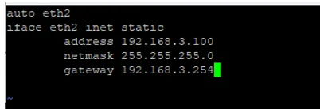</p>

<p align="center"><strong>图 4-44 静态IP配置示例</strong></p>

##### 4.3.1.2 设置一个动态IP地址

将配置文件中的inet设置为dhcp：

```shell
vim /etc/network/interfaces.d/eth1
```

配置示例：

```
auto eth1
iface eth1 inet dhcp
```

<p align="center">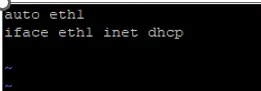</p>

<p align="center"><strong>图 4-45 DHCP配置示例</strong></p>

修改配置后重启网络服务使配置生效：

```shell
/etc/init.d/networking restart
```

#### 4.3.2 系统管理

##### 4.3.2.1 查询固件版本

要检查EC942的计算机固件版本，请键入：

<p align="center">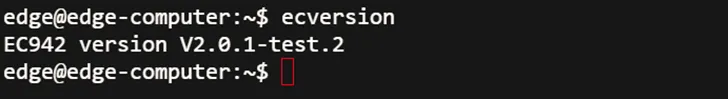</p>

<p align="center"><strong>图 4-46 查询固件版本</strong></p>

加上-a的选项可以看到完整的版本信息：

<p align="center"></p>

<p align="center"><strong>图 4-47 查询固件版本详细信息</strong></p>

##### 4.3.2.2 查看可用磁盘空间

要确定可用驱动器空间的量，请使用带有-h选项的df命令。系统将返回按文件系统分解的驱动器空间量。EC942产品，用户可用的磁盘分区是/dev/mmcblk0p8。下面是一个示例：

<p align="center">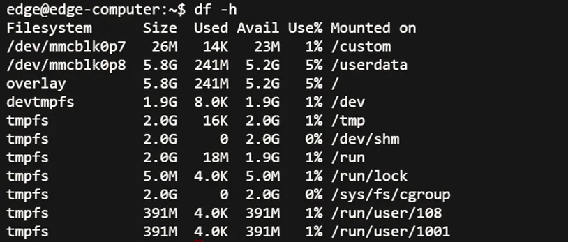</p>

<p align="center"><strong>图 4-48 查看磁盘空间</strong></p>

##### 4.3.2.3 查询产品型号信息

devinfo工具可以查看产品的型号信息

<p align="center">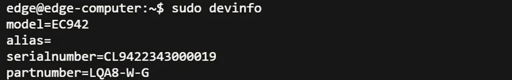</p>

<p align="center"><strong>图 4-49 查询产品型号</strong></p>

##### 4.3.2.4 调整时间

EC942有两个时间设置。一个是系统时间，另一个是由EC942的硬件所保持的RTC（实时时钟）时间。使用date命令来查询当前的系统时间或设置一个新的系统时间。使用hwclock命令查询当前的RTC时间或设置一个新的RTC时间。

使用命令date MMDDhhmmYYYY来设置系统时间：

MM： 月

DD： 日

hh： 时

mm： 分

YYYY： 年

<p align="center"></p>

<p align="center"><strong>图 4-50 设置系统时间</strong></p>

使用以下命令可以将RTC时间设置为系统时间

<p align="center">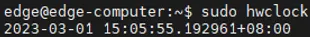</p>

<p align="center"><strong>图 4-51 同步RTC时间</strong></p>

点击以下的链接来获取更多有关日期和时间的详细信息：

<https://www.debian.org/doc/manuals/system-administrator/ch-sysadmin-time.html>

<https://wiki.debian.org/DateTime>

##### 4.3.2.5 设置时区

有两种方法可以配置EC942的时区。一个是使用命令tzselect。另一个是使用/etc/localtime文件。

**使用tzselect命令**

当键入tzselect命令后，会进入到选择地区的界面先选择大致的区域（按大洲大洋划分）输入大洲或大洋前面的数字

<p align="center">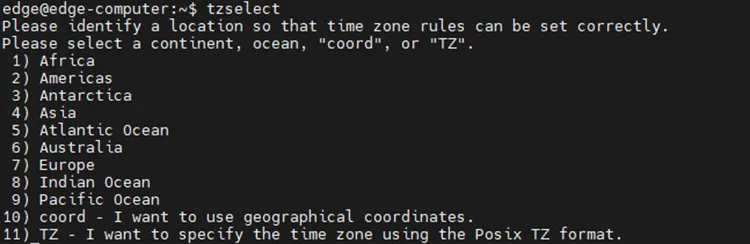</p>

<p align="center"><strong>图 4-52 tzselect选择地区</strong></p>

再选择该大洲或大洋下的国家

<p align="center"></p>

<p align="center"><strong>图 4-53 tzselect选择国家</strong></p>

按照以上步骤获取到中国时区关键字Asia/Shanghai，执行以下命令设置时区

<p align="center">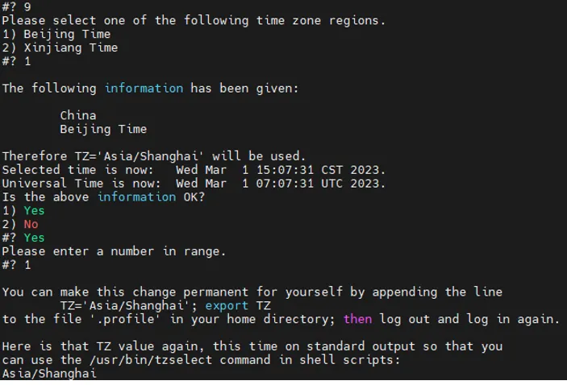</p>

<p align="center"><strong>图 4-54 设置时区命令示例</strong></p>

**使用localtime文件**

本地时区存储在/etc/localtime中，如果没有为TZ环境变量设置值，则被GNU库用于C（glibc）。此文件或者是/usr/share/zoneinfo/file的副本，或者是指向它的符号链接。若EC942无法找到/usr/share/zoneinfo/文件，请从该网站上下载您所需要的时区信息文件（<https://www.iana.org/time-zones>），并在EC942中重新链接到本地时间文件。

**注意**

成功下载所需要的时区信息文件后，进行解压，之后使用zic命令编译生成对应的二进制文件，生成的时区文件为“/usr/share/zoneinfo/自定义时区文件名”。

### 4.4 外设接口高级配置

#### 4.4.1 串口

EC942有2个串口，每个串口均支持RS-232、RS-422和RS-485多种串口模式。默认串口模式为RS-232，使用`ih_uart_ctl`命令可切换串口模式。

| 串口 | 设备节点 |
|------|----------|
| COM1 | /dev/ttyS3 |
| COM2 | /dev/ttyS4 |

DB9引脚定义：

| DB9引脚号 | 引脚名称 | 引脚定义 |
|:---------:|----------|----------|
| 1 | — | — |
| 2 | RS-232 RxD/RS-422 TxD+ | RS-232接收/RS-422发送正 |
| 3 | RS-232 TxD/RS-485 B/RS-422 RxD- | RS-232发送/RS-485信号B/RS-422接收负 |
| 4 | — | — |
| 5 | GND | RS-232接地 |
| 6 | — | — |
| 7 | RS-485 A/RxD+ | RS-485信号A/RS-422接收正 |
| 8 | RS-422 TxD- | RS-422发送负 |
| 9 | — | — |

<p align="center">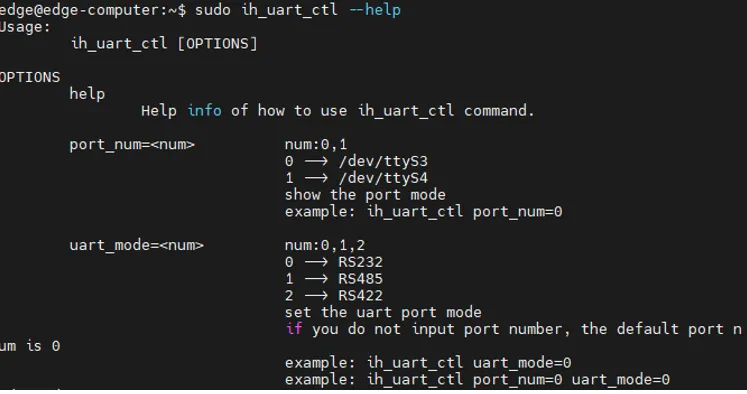</p>

<p align="center"><strong>图 4-55 串口模式切换</strong></p>

**更改串口设置**

使用`stty`命令查看和设置串口参数。

```shell
sudo stty --help
```

<p align="center">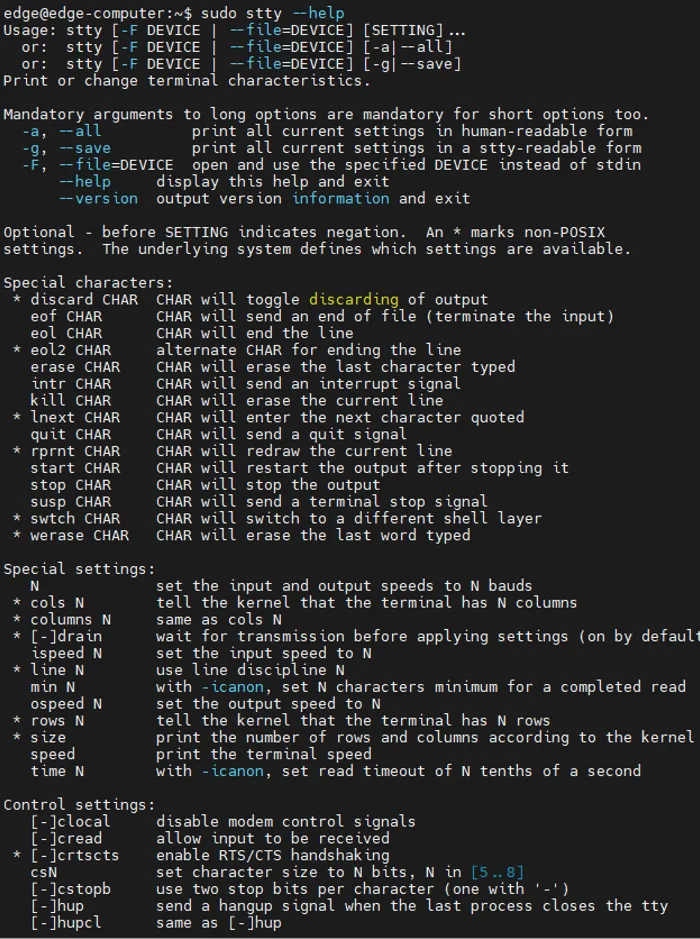</p>

<p align="center"><strong>图 4-56 stty帮助信息</strong></p>

<p align="center">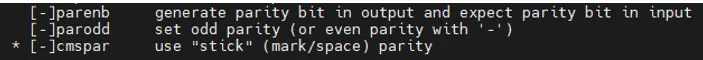</p>

<p align="center"><strong>图 4-57 stty帮助信息（续）</strong></p>

<p align="center">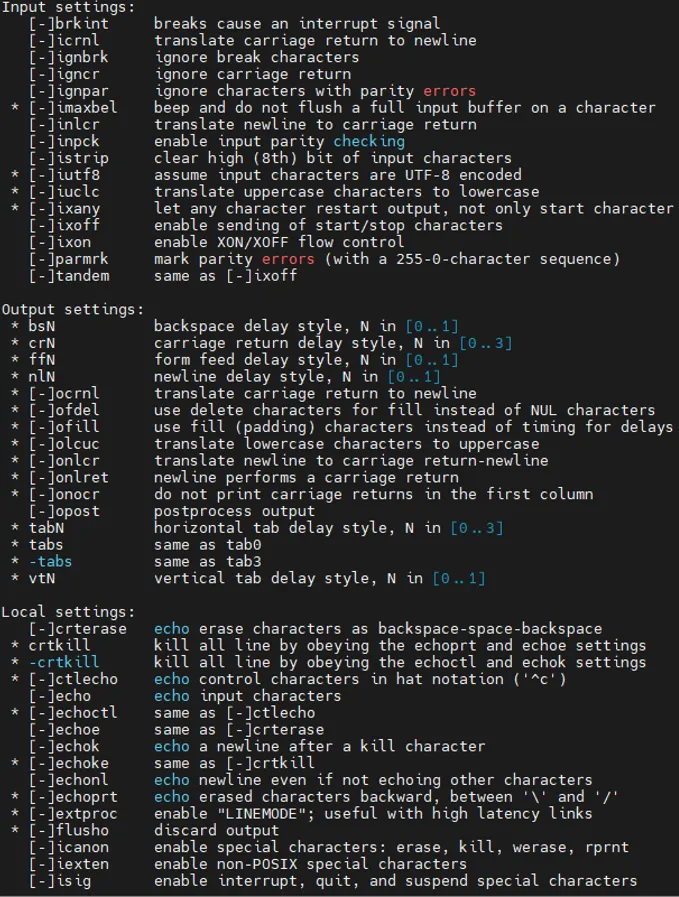</p>

<p align="center"><strong>图 4-58 stty帮助信息（续）</strong></p>

<p align="center"></p>

<p align="center"><strong>图 4-59 stty帮助信息（续）</strong></p>

<p align="center">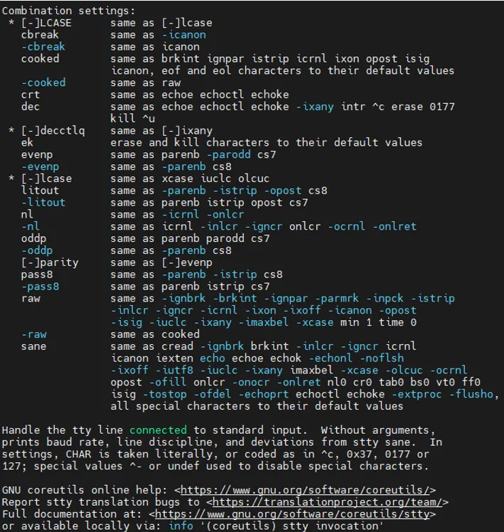</p>

<p align="center"><strong>图 4-60 stty帮助信息（续）</strong></p>

**查看串口信息**

```shell
sudo stty -F /dev/ttyS3 -a
```

<p align="center">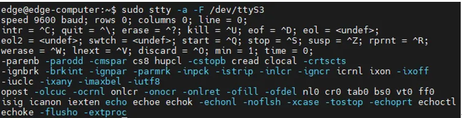</p>

<p align="center"><strong>图 4-61 查看串口信息</strong></p>

**设置串口波特率**

设置COM1波特率为115200：

```shell
sudo stty -F /dev/ttyS3 115200
```

<p align="center"></p>

<p align="center"><strong>图 4-62 设置COM1波特率</strong></p>

设置COM2波特率为115200：

```shell
sudo stty -F /dev/ttyS4 115200
```

<p align="center"></p>

<p align="center"><strong>图 4-63 设置COM2波特率</strong></p>

> **注意**：关于stty命令的详细信息可参考 [GNU Coreutils文档](http://www.gnu.org/software/coreutils/manual/coreutils.html)。

#### 4.4.2 USB接口

EC942提供两个USB 2.0 Host接口，主要用于扩展存储设备、连接鼠标和键盘。

EC942支持USB存储设备热插拔，会自动挂载所有分区到/mnt/路径下，挂载文件夹命名格式为`usb_<node>_<num>`。

<p align="center">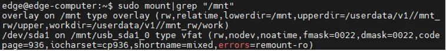</p>

<p align="center"><strong>图 4-64 USB接口</strong></p>

> **注意**：在断开USB大容量存储设备之前，需输入`sync`命令同步数据，以防止数据丢失。断开存储设备连接时，需从/media/*目录下退出。如停留在/media/usb*中，自动卸载过程将会失败。此时可执行`umount /media/usb*`手动卸载设备。

#### 4.4.3 Micro SD卡

EC942支持micro SD存储卡，不支持热插拔。插入SD卡并上电后，系统会自动挂载所有分区到/mnt/路径下，挂载文件夹命名格式为`sd_<node>_<num>`。

SD卡分区需格式化为FAT32格式：

- SD卡容量 ≤ 32GB：可在Windows系统中格式化，或使用Linux系统的`mkfs.vfat -F 32`命令。
- SD卡容量 > 32GB：需在Linux系统中格式化。

Linux下格式化步骤：

1. 执行`fdisk -l`查看SD卡对应的设备节点（如/dev/sda）。
2. 执行`fdisk /dev/sda`进行分区（p查看当前分区，d删除已有分区，n新建分区，w保存更改）。
3. 执行`sudo mkfs.vfat -F 32 /dev/sda1`将分区格式化为FAT32格式。
4. 格式化后，在设备断电情况下插入SD卡。

<p align="center">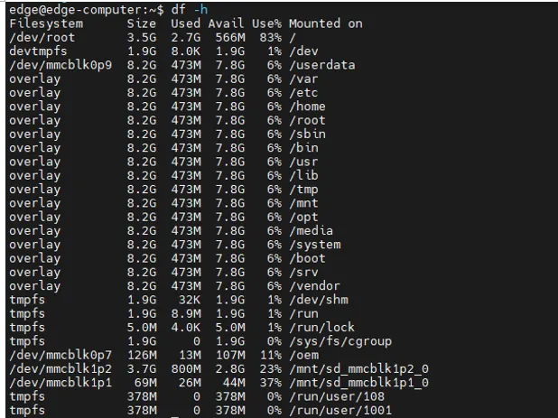</p>

<p align="center"><strong>图 4-65 Micro SD卡挂载</strong></p>

#### 4.4.4 mSATA硬盘

EC942支持mSATA硬盘扩展。出厂默认不配备mSATA硬盘，如有大容量存储需求，需自购mSATA硬盘。

**硬盘安装**

安装步骤参见[2.2.6 mSATA硬盘安装](#226-msata硬盘安装可选)。

**自动挂载配置**

1. 登录系统，执行`sudo fdisk -l`，找到硬盘分区（如/dev/sda1）。

<p align="center">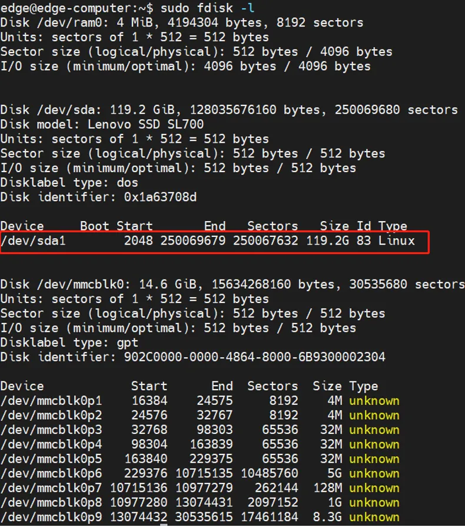</p>

<p align="center"><strong>图 4-66 查看硬盘分区</strong></p>

2. 将分区格式化为需要的文件系统，如ext4：

```shell
sudo mkfs.ext4 /dev/sda1
```

<p align="center">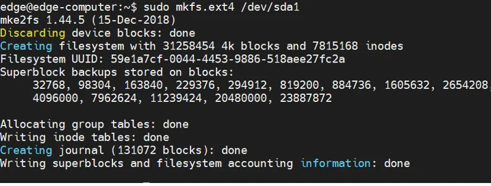</p>

<p align="center"><strong>图 4-67 格式化硬盘分区</strong></p>

3. 创建挂载点，如/mnt/sda1。
4. 编辑`/etc/fstab`文件，在末尾添加：

```
/dev/sda1 /mnt/sda1 ext4 defaults,nofail,x-systemd.device-timeout=10s 0 0
```

其中/dev/sda1、/mnt/sda1和ext4需根据实际情况配置。

#### 4.4.5 CAN总线接口

EC942具有1路CAN总线接口，支持CAN 2.0A/B标准，兼容CAN FD，最高速率可达5Mbps。

CAN引脚定义：

| 标识 | 功能 |
|------|------|
| CAN_H | CAN高电平数据线 |
| CAN_L | CAN低电平数据线 |
| GND | 接地 |

**配置CAN接口**

默认情况下CAN端口已初始化。使用`ip link`命令检查CAN设备状态：

```shell
ip link show can0
```

<p align="center"></p>

<p align="center"><strong>图 4-68 查看CAN设备</strong></p>

配置CAN设备时，先关闭设备：

```shell
sudo ip link set can0 down
```

<p align="center"></p>

<p align="center"><strong>图 4-69 关闭CAN设备</strong></p>

配置比特率（以50k为例）：

```shell
sudo ip link set can0 type can bitrate 50000
```

<p align="center">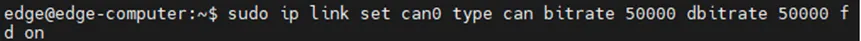</p>

<p align="center"><strong>图 4-70 配置CAN比特率</strong></p>

重新开启设备：

```shell
sudo ip link set can0 up
```

<p align="center"></p>

<p align="center"><strong>图 4-71 开启CAN设备</strong></p>

#### 4.4.6 IO接口

EC942支持4路数字量输入（DI0~DI3）和4路数字量输出（DO0~DO3）。

**数字量输入接口**

| 接口标识 | 功能 | 描述 |
|:--------:|------|------|
| PCOM | 电源公共端 | 4路数字量输入DI，干接点状态"1"：闭合；"0"：断开<br/>湿接点状态"1"：+10~+30V/-30~-10VDC<br/>湿接点状态"0"：0~+3V/-3~0V<br/>隔离3000VDC |
| DGND | 电源参考地 | — |
| DICOM | 输入公共端 | — |
| DI0~DI3 | 数字量输入0~3号接口 | — |
| NC | 无 | — |

数字量输入接线示意：

<p align="center">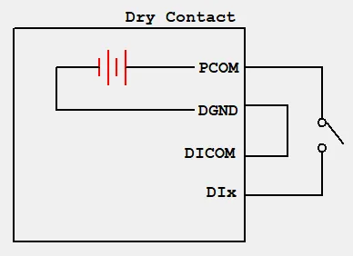</p>

<p align="center"><strong>图 4-72 数字量输入接线示意</strong></p>

<p align="center">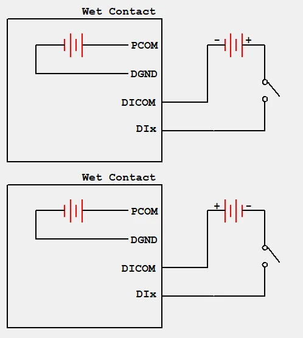</p>

<p align="center"><strong>图 4-73 数字量输入接线示意（续）</strong></p>

**数字量输出接口**

| 接口标识 | 功能 | 描述 |
|:--------:|------|------|
| DO0~DO3 | 数字量输出0~3号接口 | 4路数字量输出DO，隔离3000VDC |
| DGND | 接地端 | — |

数字量输出接线示意：

<p align="center">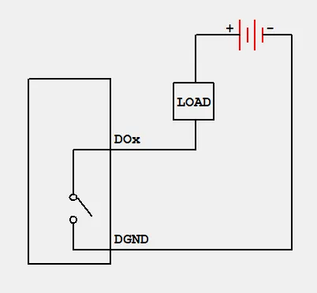</p>

<p align="center"><strong>图 4-74 数字量输出接线示意</strong></p>

**IO调试命令**

使用`dio_mgmt`命令控制IO的输入输出。

```shell
dio_mgmt
```

<p align="center"></p>

<p align="center"><strong>图 4-75 dio_mgmt帮助信息</strong></p>

设置某位IO口为高或低：

```shell
dio_mgmt set DO0 HIGH
dio_mgmt set DO0 LOW
```

<p align="center"></p>

<p align="center"><strong>图 4-76 设置IO电平</strong></p>

查看对应IO口的电平信息：

```shell
dio_mgmt show DI0
dio_mgmt show DO0
```

#### 4.4.7 GPS

EC942部分型号内部集成GPS模块，数据串口节点为/dev/ttyS9。

查看GPS详细信息有两种方式：

**方式一：输出原始NMEA数据**

使用stty设置串口节点后，通过cat输出源数据：

```shell
stty -F /dev/ttyS9 9600
cat /dev/ttyS9
```

<p align="center">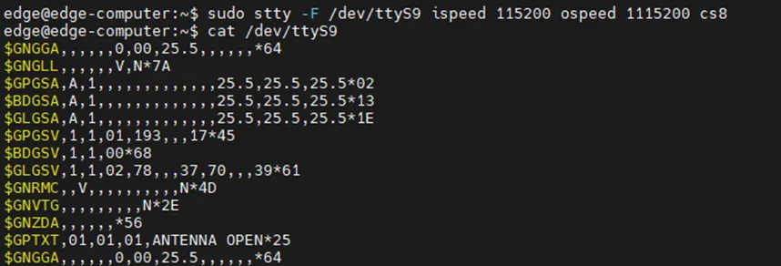</p>

<p align="center"><strong>图 4-77 GPS原始数据</strong></p>

**方式二：输出解析后的信息**

使用`gnss`命令直接输出解析后的时间、经纬度等信息：

```shell
gnss
```

<p align="center"></p>

<p align="center"><strong>图 4-78 GPS解析信息</strong></p>

#### 4.4.8 开关机按键

EC942配有开关机按键用于开关机操作。

**关闭设备**

- 长按开关机按键8秒进行关机。
- 或使用Linux命令关闭设备：

```shell
sudo shutdown -h now
```

<p align="center"></p>

<p align="center"><strong>图 4-79 关机命令</strong></p>

**启动设备**

短按开关机键，系统执行开机操作。

### 4.5 安全功能

#### 4.5.1 sudo机制

EC942中root用户被禁止使用。Sudo是一个允许授权用户以root用户或其他用户身份执行命令的程序。使用sudo比直接使用root会话更安全：

- 无需知道root密码（sudo会提示当前用户密码），可授予普通用户特权
- 通过sudo运行需要特权的命令，其余时间作为无特权用户工作，降低错误操作造成的损害
- 某些系统级命令不能直接对用户使用

<p align="center">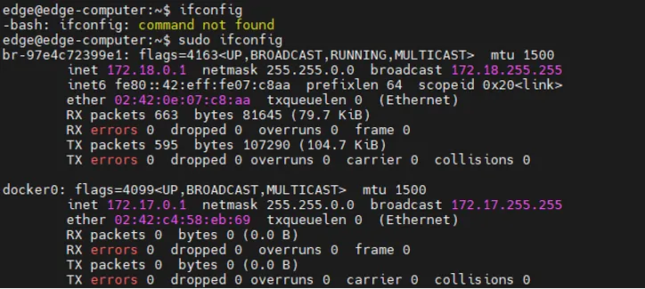</p>

<p align="center"><strong>图 4-80 sudo使用示例</strong></p>

> **注意**：在非root权限下使用管道或重定向（如`>`、`<`、`>>`、`<<`等）时可能得到"permission denied"提示，此时需使用`sudo su -c`并包含完整命令的单引号。

#### 4.5.2 防火墙

Netfilter/iptables是Linux系统自带的基于包过滤的防火墙工具，功能强大，可对流入、流出及流经设备的数据包进行精细控制。IEOS Web界面中的防火墙功能基于iptables实现。

#### 4.5.3 TPM2.0

TPM（Trusted Platform Module，可信平台模块）是一种硬件安全模块，旨在提供计算机系统的安全和加密功能。它包含加密协处理器，用于存储加密密钥、数字证书和其他安全数据，支持多种加密算法和安全协议。EC942已集成标准的TPM2.0协议栈和TPM2.0工具供用户使用。

### 4.6 编程指南

EC942提供了一个JSON格式的设备信息描述文件，操作IO、LED、串口等外设时，可通过查询该文件获取外设的设备节点信息。

设备描述信息文件路径：`/tmp/ieos/etc/system_info.json`

#### 4.6.1 IO编程

根据设备描述信息文件，IO设备节点如下：

- DI0~DI3：`/sys/class/gpio/gpio487` ~ `/sys/class/gpio/gpio490`
- DO0~DO3：`/sys/class/gpio/gpio491` ~ `/sys/class/gpio/gpio494`

操作IO接口时，直接读写设备节点下的value值即可。

设置DO0输出高电平：

```shell
echo 1 > /sys/class/gpio/gpio491/value
```

查看DI0电平：

```shell
cat /sys/class/gpio/gpio487/value
```

完整shell脚本示例：

```shell
#!/bin/bash

gpio491="/sys/class/gpio/gpio491/value"
gpio492="/sys/class/gpio/gpio492/value"

if [ -f "$gpio491" ]; then
    echo 1 > $gpio491
else
    echo "no file exit "$gpio491
fi

if [ -f "$gpio492" ]; then
    echo 0 > $gpio492
else
    echo "no file exit "$gpio492
fi

gpio487="/sys/class/gpio/gpio487/value"

if [ -f "$gpio487" ]; then
    cat $gpio487
else
    echo "no file exit "$gpio487
fi
```

#### 4.6.2 LED编程

EC942提供USER1和USER2两个用户可编程LED。

根据设备描述信息文件，LED设备节点为：

- USER1：`/sys/class/leds/user1`
- USER2：`/sys/class/leds/user2`

LED控制文件说明：

| 文件 | 功能 |
|------|------|
| brightness | 控制LED亮灭，写入1为常亮，0为常灭 |
| trigger | LED触发器，写入timer表示定时器触发，写入none表示取消触发器 |
| delay_on | LED亮的时间，单位为ms |
| delay_off | LED灭的时间，单位为ms |

> **注意**：若配置了trigger为定时触发，brightness中的值将不再生效，自动变为0。

设置USER1常亮：

```shell
echo 1 > /sys/class/leds/user1/brightness
```

设置USER1闪烁（1秒亮、1秒灭）：

```shell
echo timer > /sys/class/leds/user1/trigger
echo 1000 > /sys/class/leds/user1/delay_on
echo 1000 > /sys/class/leds/user1/delay_off
```

关闭USER1闪烁：

```shell
echo none > /sys/class/leds/user1/trigger
```

#### 4.6.3 交叉编译

用户C/C++程序可通过在开发机上使用交叉编译工具链进行交叉编译，然后将目标文件上传到EC942设备执行。

交叉编译工具：`gcc-linaro-6.3.1-2017.05-x86_64_aarch64-linux-gnu`

**配置环境变量**

1. 在开发机上将交叉编译工具链解压到/opt路径下（也可解压到其他路径）。
2. 编辑`~/.bashrc`文件，在末尾添加：

```shell
PATH=$PATH:/opt/gcc-linaro-6.3.1-2017.05-x86_64_aarch64-linux-gnu/bin
```

3. 执行`source ~/.bashrc`使环境变量在当前终端生效；新打开的终端自动生效。

**编译示例**

以hello world程序为例，创建目录和文件：

```shell
mkdir ~/example
touch ~/example/hello.c
touch ~/example/Makefile
```

hello.c内容：

```c
#include <stdio.h>

int main(void)
{
    printf("hello, world!\n");
    return 0;
}
```

Makefile内容：

```makefile
TARGET  := helloworld
DIRS    := $(shell find . -maxdepth 3 -type d)
SRCS    := $(foreach dir,$(DIRS),$(wildcard $(dir)/*.c))
OBJS    := $(SRCS:.c=.o)

CC=aarch64-linux-gnu-gcc

CFLAGS  := -Wall -Wextra -g -Wno-unused-parameter

all: $(TARGET)

$(TARGET): $(OBJS)
	$(CC) $(CFLAGS) $(LIBS) $^ -o $@

%.o: %.c
	$(CC) $(CFLAGS) $(LIBS) -c $< -o $@

clean:
	rm -f $(TARGET) $(OBJS)

.PHONY: all clean
```

在~/example目录下执行`make`，生成目标文件`helloworld`。

## 第5章 典型应用

### 案例1：工业远程监控与数据采集

**场景描述**

某工厂需对分散在多个车间的PLC和传感器进行统一监控。EC942部署于各车间现场，通过串口或以太网连接PLC，利用内置的DeviceSupervisor Agent采集设备数据，经蜂窝网络上传至DeviceLive云平台，实现远程实时监控和运维管理。

**设备角色**

EC942作为边缘网关，承担以下角色：
- 通过串口/以太网采集现场PLC和传感器数据
- 运行DeviceSupervisor Agent进行数据预处理
- 通过蜂窝网络将数据上传至DeviceLive云平台
- 作为本地网络路由器，为现场维护人员提供Web管理入口

**配置步骤**

1. **硬件安装**
   1. 将EC942安装到车间机柜DIN导轨上。
   2. 连接12~48VDC电源，确认PWR指示灯常亮。
   3. 安装蜂窝天线到ANT1~ANT4接口。
   4. 插入SIM卡到SIM1卡槽。
   5. 使用网线或串口线连接PLC到EC942。

2. **蜂窝网络配置**
   1. 登录IEOS Web界面，进入【网络】→【蜂窝】。
   2. 确认"启用蜂窝网络"已开启。
   3. 如使用专网卡，配置拨号参数集（APN、用户名、密码）。
   4. 开启ICMP探测功能，配置探测服务器地址。
   5. 点击"保存"，等待拨号成功（4G/5G指示灯常亮）。

3. **云管理平台接入**
   1. 进入【系统】→【基础配置】→【云管理】。
   2. 开启"启动云服务"。
   3. 选择对应的云服务器地址（国内/海外）。
   4. 点击"保存"。
   5. 登录DeviceLive平台，确认设备状态为"在线"。

4. **串口数据采集配置**
   1. 确认PLC与EC942串口（COM1/COM2）物理连接正确。
   2. 使用`stty`命令配置串口参数（波特率、数据位、停止位）与PLC匹配。
   3. 部署DeviceSupervisor Agent采集程序，配置采集协议和寄存器地址。
   4. 验证数据采集是否正常。

**验证方法**

1. 在DeviceLive平台查看设备在线状态和数据上报情况。
2. 在IEOS【状态】→【蜂窝拨号状态信息】页面确认蜂窝网络正常。
3. 在EC942本地使用`cat /dev/ttyS3`验证串口数据接收。
4. 检查DeviceSupervisor Agent日志，确认数据采集和上传无异常。

**参考章节**

- [蜂窝拨号配置](#蜂窝拨号配置)
- [设备远程管理（DeviceLive）](#场景5设备远程管理devicelive)
- [串口配置](#441-串口)
- [固件升级](#423-固件升级)

---

## 附录 故障处理

### 1 网络连接问题

| 现象 | 可能原因 | 排查步骤 | 对应章节 |
|------|----------|----------|----------|
| 无法连接蜂窝网络 | SIM卡未插入或接触不良 | 1. 检查SIM卡是否正确插入<br>2. 重新插拔SIM卡 | [SIM卡安装](#225-sim卡与micro-sd卡安装) |
| 无法连接蜂窝网络 | APN参数配置错误 | 1. 核对APN参数是否正确<br>2. 联系运营商获取正确APN | [蜂窝拨号配置](#蜂窝拨号配置) |
| 无法连接蜂窝网络 | 信号弱或无信号 | 1. 检查天线是否连接<br>2. 调整设备位置或天线方向 | [天线安装](#224-天线安装) |
| 无法连接蜂窝网络 | 蜂窝功能未启用 | 1. 登录Web界面检查"启用蜂窝网络"开关<br>2. 确认拨号参数集配置正确 | [蜂窝拨号配置](#蜂窝拨号配置) |
| 蜂窝拨号假连接 | ICMP探测未开启 | 1. 开启ICMP探测功能<br>2. 配置有效的探测服务器地址 | [蜂窝拨号配置](#蜂窝拨号配置) |
| 无法连接Wi-Fi | SSID或密码错误 | 1. 核对SSID和密码<br>2. 确认认证方式和加密方式与目标网络匹配 | [Wi-Fi Station配置](#wi-fi-station配置) |
| 无法连接Wi-Fi | Wi-Fi功能未启用 | 1. 检查"启用Wi-Fi"开关是否开启<br>2. 确认Wi-Fi天线已安装 | [Wi-Fi Station配置](#wi-fi-station配置) |
| 无法获取IP地址 | 网线连接异常 | 1. 检查网线连接<br>2. 确认接口指示灯正常 | [以太网接口配置](#以太网接口配置) |
| 无法获取IP地址 | DHCP服务器异常 | 1. 确认上游DHCP服务器正常工作<br>2. 尝试配置静态IP地址 | [以太网接口配置](#以太网接口配置) |

### 2 Web访问问题

| 现象 | 可能原因 | 排查步骤 | 对应章节 |
|------|----------|----------|----------|
| 无法打开Web界面 | IP地址错误 | 1. 确认电脑与设备在同一网段<br>2. 检查设备默认IP地址 | [首次访问设备](#227-首次访问设备) |
| 无法打开Web界面 | 端口号错误 | 1. 确认使用https协议和9100端口<br>2. 检查URL格式为https://IP:9100 | [登录Web](#登录web) |
| 无法打开Web界面 | IEOS未运行 | 1. 检查IEOS进程状态<br>2. 如IEOS被关闭，可通过命令`systemctl start ieos_daemon`启动 | [登录Web](#登录web) |
| 无法打开Web界面 | 浏览器兼容性问题 | 1. 更换浏览器（推荐Chrome）<br>2. 清除浏览器缓存 | [首次访问设备](#227-首次访问设备) |
| 登录失败 | 用户名或密码错误 | 1. 确认使用正确的用户名和密码<br>2. 如密码遗忘，需恢复出厂设置 | [默认设置](#16-默认设置) |

### 3 SSH连接问题

| 现象 | 可能原因 | 排查步骤 | 对应章节 |
|------|----------|----------|----------|
| SSH连接失败 | 网络不通 | 1. 确认电脑IP与设备接口同网段<br>2. 检查网线连接 | [首次访问设备](#227-首次访问设备) |
| SSH连接失败 | 用户名或密码错误 | 1. 确认使用正确的SSH登录凭据<br>2. 检查是否锁定了用户账户 | [用户账户管理](#421-用户账户管理) |
| 命令执行提示权限不足 | 未使用sudo | 1. 在命令前添加`sudo`<br>2. 使用`sudo -s`切换至root用户 | [sudo机制](#451-sudo机制) |

### 4 系统启动问题

| 现象 | 可能原因 | 排查步骤 | 对应章节 |
|------|----------|----------|----------|
| STATUS指示灯常灭 | 系统启动失败 | 1. 检查电源连接是否正常<br>2. 确认输入电压在9~48VDC范围内<br>3. 尝试恢复出厂设置 | [恢复出厂设置](#15-恢复出厂设置) |
| WARN和ERROR同时闪烁 | 恢复出厂尚未完成 | 1. 保持设备供电，等待约30秒<br>2. 等待STATUS恢复闪烁 | [恢复出厂设置](#15-恢复出厂设置) |
| 升级后无法启动 | 升级文件损坏 | 1. 重新准备正确的img文件和md5.txt<br>2. 通过U盘/SD卡重新升级 | [固件升级](#423-固件升级) |

### 5 外设接口问题

| 现象 | 可能原因 | 排查步骤 | 对应章节 |
|------|----------|----------|----------|
| 串口通信异常 | 串口模式不匹配 | 1. 使用`ih_uart_ctl`检查当前串口模式<br>2. 切换为与对端设备匹配的模式 | [串口配置](#441-串口) |
| 串口通信异常 | 波特率不一致 | 1. 使用`stty`检查并设置正确的波特率<br>2. 确认数据位、停止位、校验位一致 | [串口配置](#441-串口) |
| USB存储无法识别 | 文件系统不支持 | 1. 确认USB存储分区格式为FAT32/EXT4<br>2. 检查dmesg日志查看识别信息 | [USB接口](#442-usb接口) |
| USB存储数据丢失 | 未正确卸载 | 1. 断开前执行`sync`命令<br>2. 执行`umount /media/usb*`手动卸载 | [USB接口](#442-usb接口) |
| Micro SD卡无法识别 | 分区格式错误 | 1. 确认分区格式为FAT32<br>2. 检查是否在断电状态下插入 | [Micro SD卡](#443-micro-sd卡) |
| CAN通信异常 | 比特率不匹配 | 1. 使用`ip link show can0`检查配置<br>2. 重新配置与对方设备一致的比特率 | [CAN总线接口](#445-can总线接口) |
| IO控制无效 | 设备节点错误 | 1. 查看`/tmp/ieos/etc/system_info.json`确认设备节点<br>2. 检查IO编号和方向是否正确 | [IO接口](#446-io接口) |
| GPS无数据 | 模块未就绪 | 1. 确认设备型号支持GPS功能<br>2. 检查GNSS天线是否安装<br>3. 确认在开阔地带测试 | [GPS](#447-gps) |

---

## 附录 命令行参考

### 1 常用命令

| 命令 | 功能 | 示例 |
|------|------|------|
| `ssh` | 远程登录设备 | `ssh edge@192.168.4.100` |
| `sudo -s` | 切换至root用户 | `sudo -s` |
| `useradd` | 创建用户账户 | `sudo useradd -m -s /bin/bash -G sudo test1` |
| `userdel` | 删除用户账户 | `sudo userdel test1` |
| `passwd` | 修改/锁定用户密码 | `sudo passwd test1` |
| `systemctl` | 管理系统服务 | `sudo systemctl stop ieos_daemon` |
| `ip` | 网络接口配置 | `sudo ip link set can0 up` |
| `stty` | 串口参数配置 | `sudo stty -F /dev/ttyS3 115200` |
| `dio_mgmt` | IO接口控制 | `sudo dio_mgmt set DO0 HIGH` |
| `gnss` | 查看GPS信息 | `sudo gnss` |
| `df` | 查看磁盘空间 | `df -h` |
| `date` | 查看/设置系统时间 | `sudo date MMDDhhmmYYYY` |
| `hwclock` | 查看/设置RTC时间 | `sudo hwclock --systohc` |
| `tzselect` | 交互式选择时区 | `tzselect` |
| `shutdown` | 关机 | `sudo shutdown -h now` |

### 2 使用示例

**示例1：恢复出厂设置**

```shell
sudo factory_reset
```

<p align="center"></p>

<p align="center"><strong>图 6-1 恢复出厂设置命令</strong></p>

**示例2：查看固件版本**

```shell
cat /etc/inhand/version
```

或查看完整版本信息：

```shell
cat /etc/inhand/version -a
```

<p align="center"></p>

<p align="center"><strong>图 6-2 查看固件版本</strong></p>

<p align="center"></p>

<p align="center"><strong>图 6-3 查看完整版本信息</strong></p>

**示例3：查看磁盘空间**

```shell
df -h
```

<p align="center"></p>

<p align="center"><strong>图 6-4 查看磁盘空间</strong></p>

**示例4：查看产品型号**

```shell
devinfo
```

<p align="center"></p>

<p align="center"><strong>图 6-5 查看产品型号</strong></p>

**示例5：调整系统时间**

设置系统时间：

```shell
sudo date 042812302026
```

（格式：月日时分年，即2026年4月28日12时30分）

<p align="center"></p>

<p align="center"><strong>图 6-6 设置系统时间</strong></p>

将RTC时间设置为系统时间：

```shell
sudo hwclock --systohc
```

<p align="center"></p>

<p align="center"><strong>图 6-7 同步RTC时间</strong></p>

---

## 附录 安全注意事项

1. 设备应在规定的温度和湿度范围内使用，工作温度范围为-20~70℃，环境湿度为5~95%（无凝霜）。
2. 请勿在易燃易爆环境中使用本设备。
3. 电源连接前需确认电压符合设备规格要求（9~48VDC）。
4. SIM卡和Micro SD卡不支持热插拔，插拔操作前需断开设备电源。
5. USB存储设备断开连接前，需执行`sync`命令同步数据，防止数据丢失。
6. 恢复出厂设置过程中（WARN和ERROR闪烁期间）严禁断电，否则可能导致文件丢失。
7. 固件升级过程中请勿断电或拔出U盘/SD卡，否则可能导致系统损坏。

> **警告**：非专业人员请勿打开设备外壳，存在触电风险。

---

> **文档版本**：V2.0 Rewritten<br>
> **适用产品**：EC942系列边缘计算机<br>
> **适用系统版本**：Debian 10，IEOS V2.0.0及以上版本

