# EC954 快速安装手册

---

## 第一部分：快速装机（图文整体流程）

> **您需要先做：** 开箱 → 固定设备 → 接电源与网线 →（若用蜂窝）**断电**装 SIM、接天线 → 上电 → PC 同网段 → 浏览器打开 Web。  
> **再做：** 翻到下方 **第二部分**，按需查阅装箱、灯义、壁挂、各接口引脚等。

### 必读摘要

| 项目 | 要求 |
|------|------|
| 供电 | **12～48 V DC**，端子 **V+ / V−**（或规格适配器）；**PWR 红灯常亮**表示已上电。 |
| SIM / Micro SD | **须断电**安装或拔出；**不可热插拔**。 |
| 蜂窝 / WLAN / GNSS 天线 | 按壳体**丝印**拧紧；标配数量因型号而异（见《规格书》订购信息）。 |
| 恢复出厂警告 | 恢复出厂过程中若 **WARN 与 ERR 闪烁、STATUS 熄灭**，**严禁断电**，否则可能导致文件丢失。 |

### 步骤 1：对照实物，确认面板与接口区域

取出 EC954，对照下图确认前面板与后面板的接口布局。

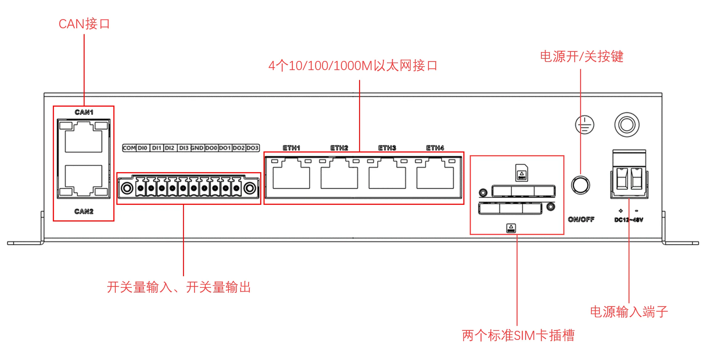

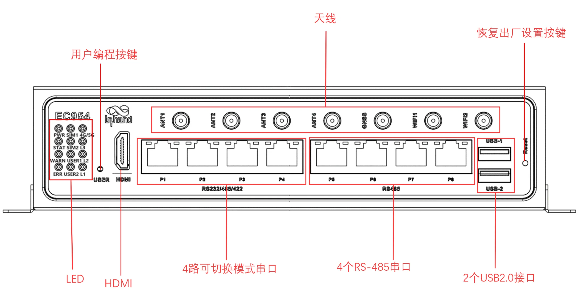

确认您能在后面板上找到电源端子、以太网口、串口、天线接口、SIM 卡槽等位置。各接口的详细引脚定义请见 §2.5。

### 步骤 2：将设备固定到导轨或柜内

EC954 标配 DIN 导轨卡扣，您可以直接将设备卡入标准 35 mm DIN 导轨。

1. 将 DIN 导轨安装板的上方挂钩卡入 DIN 导轨支架的顶端。  
2. 缓慢向 DIN 轨方向推动设备，直到底端卡入到位。

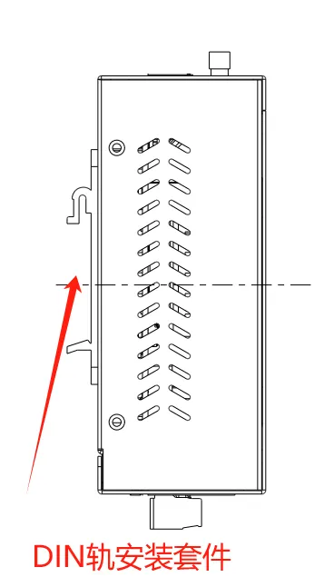

若机柜无 DIN 导轨，可使用壁挂套件（需另购）。壁挂方式见 §2.4.3。

### 步骤 3：连接电源与以太网

将电源适配器端子插入 EC954 的 **DC** 端口，或直接将现场 **12～48 V DC** 接到端子的 **V+ / V−**。然后将网线插入任一网口（建议先接 **ETH 2** 用于 Web 登录）。

<p ></p>

> **注意：** 接线完成后先**不要上电**，如果您需要使用蜂窝网络，请继续步骤 4。

电源与串口端子的详细引脚定义见 §2.5.2；以太网引脚定义见 §2.5.1。

### 步骤 4：断电装 SIM，并接好天线

**确保设备未上电。** 取出配件中的取卡针，按压对应取卡针孔取出 SIM 卡托盘，将 SIM 卡放入托盘后推回插槽。EC954 支持 **2 个 SIM 卡插槽**。

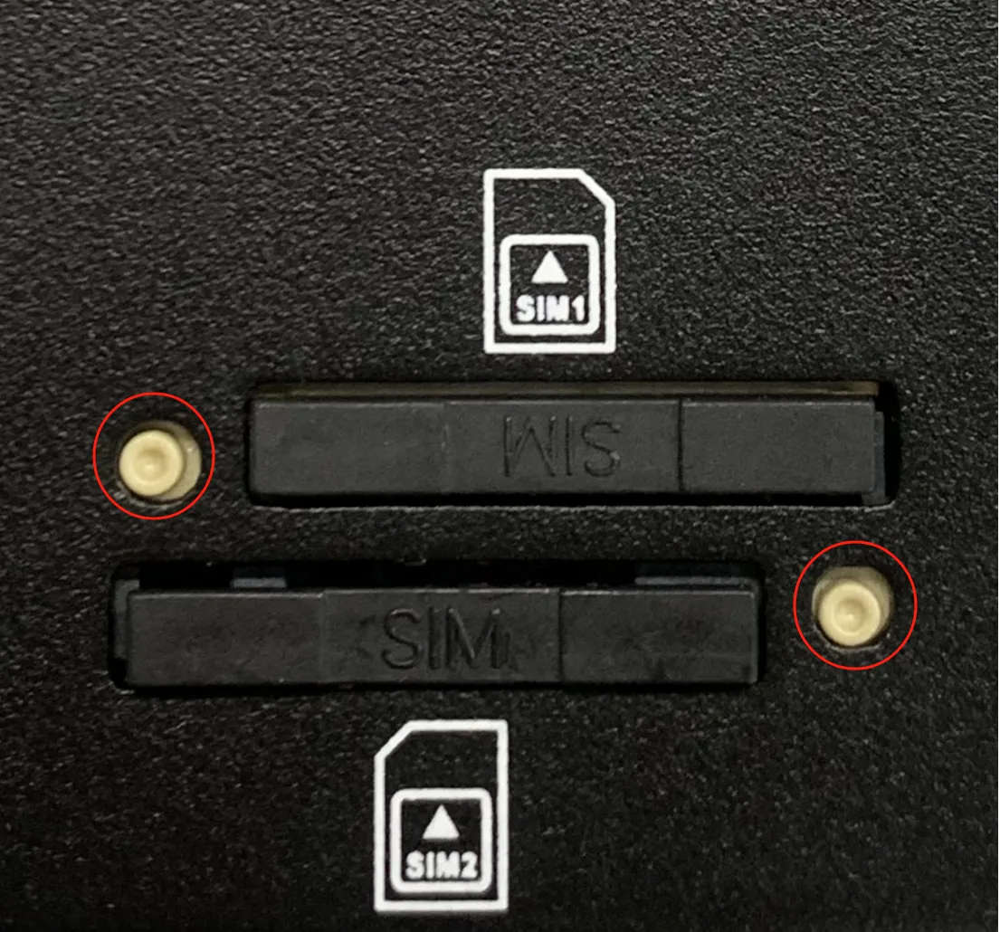

按壳体丝印将天线拧紧到对应的 SMA 接口。以 EC954-FQ58-B 为例，该型号支持 2 个蜂窝天线、2 个 WiFi 天线、1 个 GNSS 天线。


> **警告：** SIM 卡**不可热插拔**，必须在断电状态下操作。天线丝印与名称对照见 §2.5.6。

### 步骤 5：上电，确认设备已就绪

接通电源后，观察前面板指示灯（位置见步骤 1 配图）：

- **PWR** 红灯**常亮** → 设备已正常上电。  
- **STATUS** 灯**闪烁** → 系统正常启动完成。

若 STATUS 长灭，表示系统启动异常或恢复出厂尚未完成。所有指示灯含义见 §2.3。

### 步骤 6：PC 与浏览器登录 Web

将 PC 网线接入 EC954 的网口，并将 PC 的 IP 地址设为与设备同网段。各网口默认 IP 如下：

| 端口角色 | 默认 IP |
| :---: | :---: |
| ETH 1 | 192.168.3.100 |
| ETH 2 | 192.168.4.100 |
| ETH 3 | 192.168.5.100 |
| ETH 4 | 192.168.6.100 |

以 ETH 2 为例，在浏览器地址栏输入：

```
https://192.168.4.100:9100
```

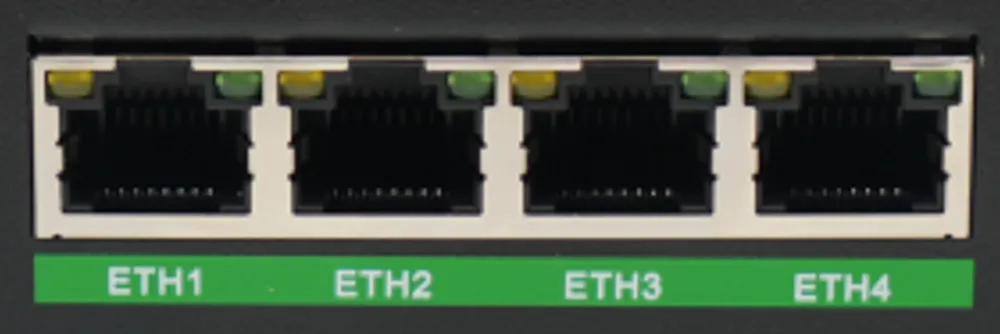

首次登录账号为 **adm**，密码为 **123456**。若浏览器提示证书告警，请选择继续访问。


> **注意：** 并非所有 EC954 型号都支持 Web 界面管理，具体支持情况请查看《EC954 系列边缘计算机产品规格书》中“订购信息”部分。  
> 首次登录与恢复出厂的详细说明见 §2.7。

### 装完自检

- ☐ 设备已固定（导轨或壁挂）。  
- ☐ 电源、网线已接好；若用蜂窝，SIM 与天线已就位。  
- ☐ **PWR 常亮**且 **STATUS 闪烁**。  
- ☐ 浏览器已能打开 Web 登录页并完成登录。

若无法登录，请检查 PC IP 是否与设备同网段，或尝试更换网口。如需恢复出厂设置，操作方法见 §2.7。

---

## 第二部分：详细说明

### 2.1 装箱清单

**标准配件**

| 序号 | 名称 | 数量 | 单位 | 备注 |
| --- | --- | --- | --- | --- |
| 1 | EC954 主机 | 1 | 台 | — |
| 2 | 取卡针 | 1 | 个 | — |
| 3 | 产品保修卡 | 1 | 张 | — |

**可选配件**

| 序号 | 名称 | 数量 | 单位 | 备注 |
| --- | --- | --- | --- | --- |
| 1 | 电源适配器 | 1 | 个 | 选配 |
| 2 | Wi-Fi 天线 | 1 | 个 | 标配（根据型号而定） |
| 3 | GNSS 天线 | 1 | 个 | 标配（根据型号而定） |
| 4 | 蜂窝天线 | 1 | 个 | 标配（根据型号而定） |
| 5 | 壁挂套件 | 1 | 套 | 需另购 |

### 2.2 产品结构与标识

#### 前面板


前面板布置有电源指示灯、系统状态指示灯、蜂窝信号强度指示灯及用户可编程指示灯等。各灯详细含义见 §2.3。

#### 后面板


后面板布置有电源端子、以太网口、串口、CAN 口、数字量 IO、USB、天线接口等。

### 2.3 指示灯与复位键

#### 2.3.1 运行状态指示灯

EC954 共有 12 个 LED 灯，用于指示电源及系统运行状态。

| 标识 | 名称 | 定义 |
| --- | --- | --- |
| PWR | 电源指示灯 | 上电常亮 |
| STAT | 系统运行状态指示灯 | 系统正常启动后闪烁；若启动阶段异常导致启动失败，或恢复出厂操作尚未完成，则长灭 |
| WARN | 警告指示灯 | 系统发生警告异常、系统升级或恢复出厂尚未完成时闪烁 |
| ERR | 错误指示灯 | 系统发生严重错误、系统升级或恢复出厂尚未完成时闪烁 |
| SIM1 | SIM1 卡指示灯 | 选中 SIM 卡 1 拨号时常亮；选中 SIM 卡 2 拨号或关闭拨号时长灭 |
| SIM2 | SIM2 卡指示灯 | 选中 SIM 卡 2 拨号时常亮；选中 SIM 卡 1 拨号或关闭拨号时长灭 |
| USER1 | 用户可编程指示灯 1 | 默认熄灭，可由用户编程控制 |
| USER2 | 用户可编程指示灯 2 | 默认熄灭，可由用户编程控制 |
| 4G/5G | 蜂窝网连接状态指示灯 | 拨号成功后常亮 |
| L1 | 蜂窝网信号强度 | 见 §2.3.2 |
| L2 | 蜂窝网信号强度 | 见 §2.3.2 |
| L3 | 蜂窝网信号强度 | 见 §2.3.2 |

> **恢复出厂过程灯态：** 执行恢复出厂后，系统会重启。重启完成后恢复出厂尚未完成，此时 **WARN 闪烁、ERR 闪烁、STATUS 熄灭**。此状态下**严禁断电**，否则可能导致文件丢失而影响系统功能。该状态持续约 30 s，恢复完成后 WARN 和 ERR 熄灭，STATUS 恢复闪烁。

#### 2.3.2 蜂窝信号强度灯

| LED | 无信号 | 信号弱（RSSI < -90） | 信号中等（-90 ≤ RSSI < -70） | 信号强（RSSI ≥ -70） |
| --- | --- | --- | --- | --- |
| L1 | 灭 | 亮 | 亮 | 亮 |
| L2 | 灭 | 灭 | 亮 | 亮 |
| L3 | 灭 | 灭 | 灭 | 亮 |

#### 2.3.3 复位键

> 恢复出厂的详细操作步骤见 §2.7。

### 2.4 机械安装

#### 2.4.1 DIN 导轨

DIN 导轨安装板位于 EC954 的下面板，安装步骤如下：

1. 将 DIN 导轨安装板的上方挂钩卡入 DIN 轨支架的顶端。  
2. 缓慢向 DIN 轨支架方向推动设备，使得 DIN 轨底端卡入到位。


#### 2.4.3 壁挂

EC954 可采用壁挂套件进行安装，套件需单独购买。

**方式一：将壁挂套件固定到设备**

使用螺钉将壁挂套件固定在 EC954 的下面板。

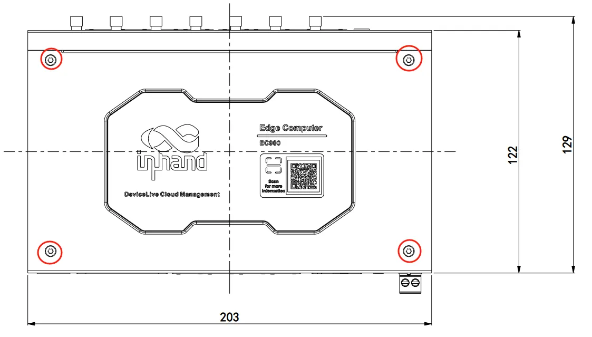

**方式二：将设备固定到墙面或柜体**

壁挂套件固定到设备后，使用螺钉将 EC954 固定到墙面或柜子上。

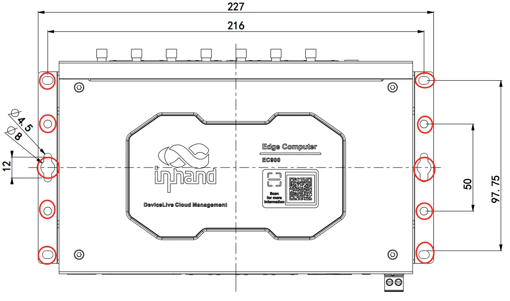

### 2.5 连接与布线

#### 2.5.1 以太网

EC954 有 **4 个 RJ45 以太网口**，支持 **10 M / 100 M / 1000 M** 自适应速率。

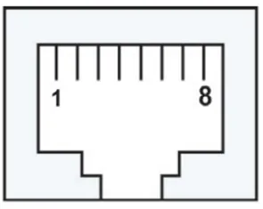

| RJ45 引脚号 | 10 M / 100 M | 1000 M |
| --- | --- | --- |
| 1 | TX+ | TRD(0)+ |
| 2 | TX- | TRD(0)- |
| 3 | RX+ | TRD(1)+ |
| 4 | — | TRD(2)+ |
| 5 | — | TRD(2)- |
| 6 | RX- | TRD(1)- |
| 7 | — | TRD(3)+ |
| 8 | — | TRD(3)- |

#### 2.5.2 电源与串口

**供电**

EC954 支持 **12～48 V DC** 供电。将电源适配器端子插入 DC 端口，或将现场直流电源接入端子的 **V+ / V−**。当 **PWR** 电源指示灯长亮则代表设备已正常上电。

**串口**

EC954 支持 **8 路串口**。前 4 路支持 RS-232、RS-485 或 RS-422 通讯，软件可配置；后 4 路固定为 RS-485。

前四路串口引脚说明如下：


| RJ45 引脚号 | RS-232 | RS-422 | RS-485 |
| --- | --- | --- | --- |
| 1 | DSR | — | — |
| 2 | RTS | TxD+ | — |
| 3 | GND | GND | GND |
| 4 | TxD | TxD- | — |
| 5 | RxD | RxD+ | Data+ |
| 6 | DCD | RxD- | Data- |
| 7 | CTS | — | — |
| 8 | DTR | — | — |

#### 2.5.3 CAN 总线接口

EC954 具有 **2 路 CAN 总线接口**，支持 CAN 2.0 A/B 标准。CAN2 兼容 CAN FD，最高速率可达 **5 Mbps**。

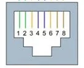

| RJ45 引脚号 | 标识 | 功能 |
| :---: | :---: | :---: |
| 1 | CAN_H | CAN 高电平数据线 |
| 2 | CAN_L | CAN 低电平数据线 |

#### 2.5.4 数字量输入

EC954 提供 **4 路数字量输入（DI）**，干接点方式。

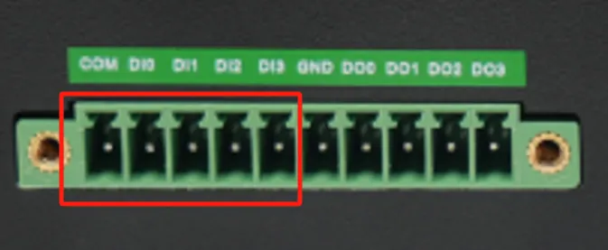

| 接口标识 | 功能 | 描述 |
| :---: | :---: | --- |
| COM | DI 公共端 | 4 路数字量输入 DI，干接点状态  
"1"：闭合；干接点状态 "0"：断开  
隔离：3000 VDC |
| DI0 | 数字量输入 0 号接口 | |
| DI1 | 数字量输入 1 号接口 | |
| DI2 | 数字量输入 2 号接口 | |
| DI3 | 数字量输入 3 号接口 | |

#### 2.5.5 数字量输出

EC954 提供 **4 路数字量输出（DO）**。

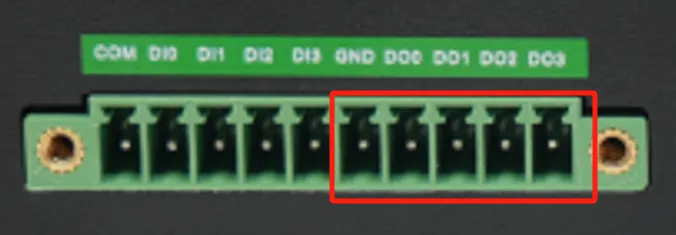

| 接口标识 | 功能 | 描述 |
| :---: | :---: | --- |
| GND | DO 接地端 | 4 路数字量输出 DO，隔离 3000 VDC |
| DO0 | 数字量输出 0 号接口 | |
| DO1 | 数字量输出 1 号接口 | |
| DO2 | 数字量输出 2 号接口 | |
| DO3 | 数字量输出 3 号接口 | |

#### 2.5.6 蜂窝 SIM 与天线

**SIM 卡**

EC954 支持 **2 个 SIM 卡插槽**。SIM 卡需要在**断电状态**下安装。使用取卡针按压取卡针孔取出 SIM 卡托盘，将 SIM 卡安装到托盘中后按压回插槽。


> **警告：** SIM 卡**不可热插拔**。

**天线接口**

EC954 共有 **7 个天线接口**，不同型号标配天线数量不同。具体型号对应的天线支持情况可参见《EC954 系列边缘计算机产品规格书》中“订购信息”部分。

| 标识 | 名称 |
| --- | --- |
| ANT1 | 4G LTE 主天线 / 5G 天线 |
| ANT2 | 4G LTE 分集接收天线 / 5G 天线 |
| GNSS | GNSS 天线 |
| ANT3 | 5G 天线 |
| ANT4 | 5G 天线 |
| WiFi1 | WiFi 天线 |
| WiFi2 | WiFi 天线 |

下图所示产品型号为 EC954-FQ58-B，支持 2 个蜂窝天线、2 个 WiFi 天线、1 个 GNSS 天线。


#### 2.5.7 USB 与 Micro SD

**USB**

EC954 提供 **两个 USB 2.0 Host 接口**，主要用于扩展存储设备、接鼠标和键盘。支持 USB 存储设备**热插拔**，会自动挂载所有分区。

EC954 将所有 USB 存储设备分区挂载到 `/mnt/` 路径下，挂载文件夹命名格式为 `usb_<node>_<num>`。其中，`<node>` 为分区设备节点名称，`<num>` 为 0~9 的数字。

> **注意：** 在断开 USB 大容量存储设备之前，请输入 `sync` 同步命令，以防止数据丢失。断开时请从 `/media/*` 目录下退出。若停留在 `/media/usb*` 中，自动卸载过程将会失败。若发生失败，请键入 `umount /media/usb*` 以手动卸载设备。

**Micro SD**

EC954 有一个 **Micro SD 卡槽**，**不支持热插拔**，需要在断电情况下操作。安装时请先移除保护外壳，将 Micro SD 卡安装到位于左面板的卡槽中。

  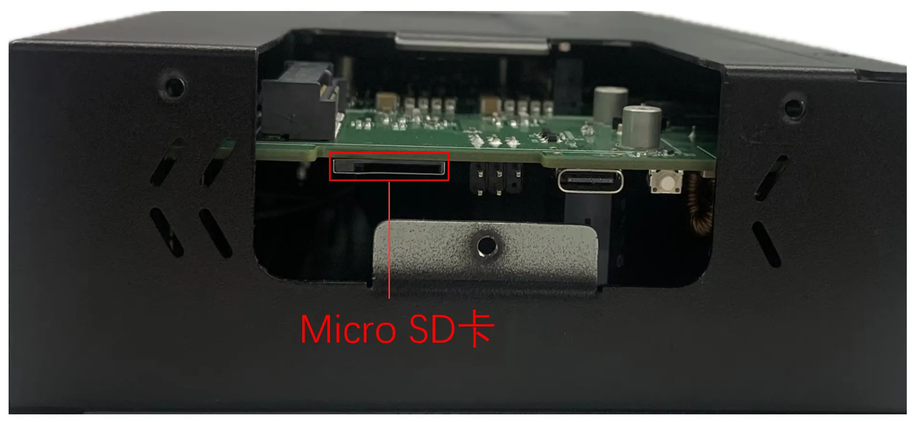

Micro SD 卡会自动挂载所有分区，挂载到 `/mnt/` 路径下，挂载文件夹命名格式为 `sd_<node>_<num>`。其中，`<node>` 为分区设备节点名称，`<num>` 为 0~9 的数字。

#### 2.5.8 扩展存储（mSATA）

EC954 支持 **mSATA 硬盘**，出厂默认不配备。若有大容量存储需求，需自购 mSATA 硬盘，也可咨询映翰通购买。

安装步骤如下：

**步骤一：** 使用螺丝刀打开硬盘保护外壳。

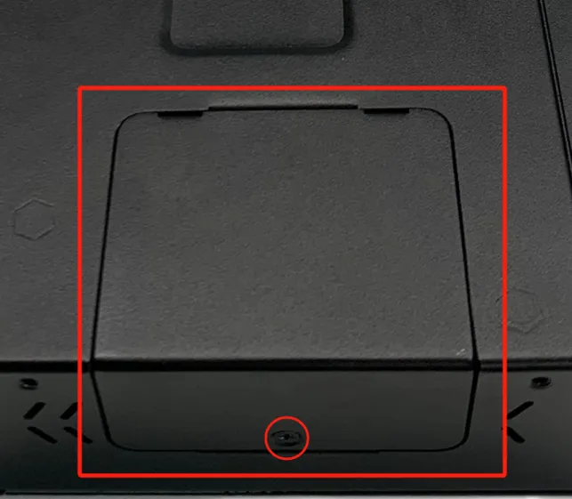  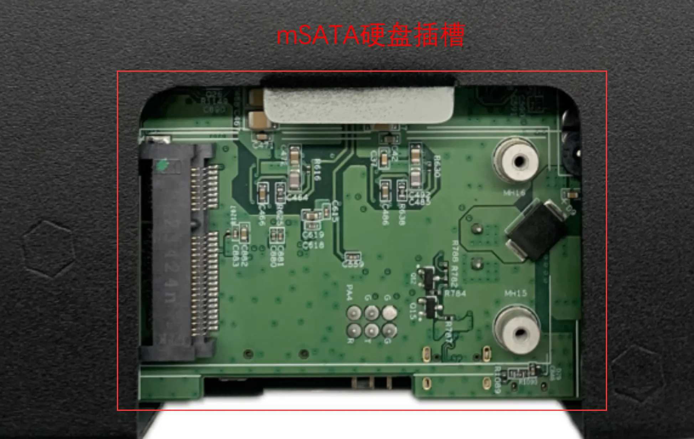

**步骤二：** 将硬盘对准插槽，向右推并卡入到位；取出螺钉（M2）对硬盘右侧进行固定。


 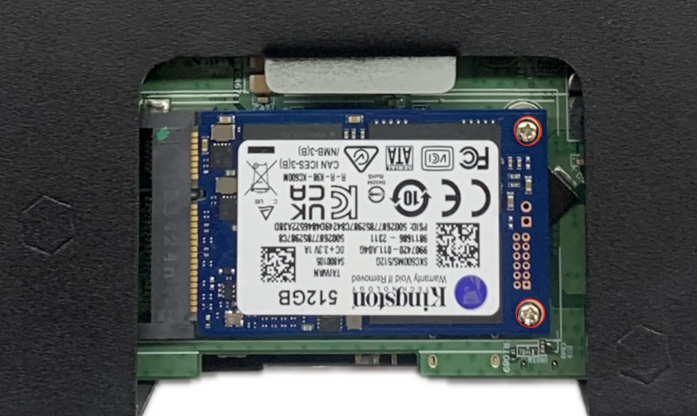

**步骤三：** 将拆卸下来的保护外壳重新安装回 EC954。

### 2.6 供电与环境

| 项目 | 规格 |
| :--- | --- |
| 输入电压 | 12～48 VDC（双引脚端子，V+、V−） |
| 待机功率 | 120 mA ~ 200 mA @ 12 V |
| 工作功率 | 150 mA ~ 320 mA @ 12 V |
| 峰值功率 | 320 mA @ 12 V |
| 工作温度 | -20 ~ 70 ℃（-4 ~ 158 ℉） |
| 存储温度 | -40 ~ 85 ℃（-40 ~ 185 ℉） |
| 环境湿度 | 5 ~ 95%（无凝霜） |

### 2.7 首次登录与恢复出厂

#### Web 登录

将 PC 和 EC954 进行互联：将网线一端插入 EC954 的任一网口，另一端插入电脑网口，同时将电脑的 IP 地址设置为设备接口同网段地址。

各网口默认 IP 如下：

| 端口 | 默认 IP |
| :---: | :---: |
| ETH 1 | 192.168.3.100 |
| ETH 2 | 192.168.4.100 |
| ETH 3 | 192.168.5.100 |
| ETH 4 | 192.168.6.100 |

EC954 支持基于 IEOS 的 Web 界面管理方式。IEOS 是映翰通自研的一套运行在 Linux 系统上的网络管理和系统管理程序。以 ETH 2 为例，登录参数如下：

- 登录地址：`https://192.168.4.100:9100`
- 初始登录账号：**adm**
- 初始登录密码：**123456**


> **注意：** 并非所有 EC954 型号都支持 Web 界面管理功能，具体支持情况可查看《EC954 系列边缘计算机产品规格书》中“订购信息”部分。

#### SSH 登录

EC954 也支持通过 SSH 进行命令行管理。在 Windows 环境下可使用 PuTTY 等工具建立 SSH 连接。

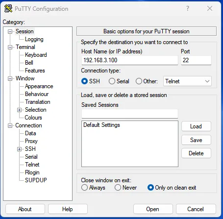

登录的默认用户名在设备的背板上。

#### 恢复出厂（RESET）

1. 长按恢复出厂设置按键10-20秒，看到WARN灯长亮。
2. WARN灯长亮后，松开恢复出厂设置按键。
3. 松开按键后，ERR灯闪烁几次，系统开始重启并执行恢复出厂设置。
4. 系统重启后，WARN灯和ERR灯闪烁，STAT灯熄灭；约30秒后，WARN灯和ERR灯停止闪烁，STAT灯开始闪烁，表示恢复出厂设置完成。

执行恢复出厂设置后，系统会进行一次重启。重启完成后，恢复出厂并没有完成，此时 **WARN 灯和 ERR 灯闪烁，STATUS 熄灭**。此状态下**不能对设备断电**，否则可能会导致文件丢失而影响系统功能。该状态持续约 30 s，恢复出厂完成后，WARN 和 ERR 熄灭，STATUS 恢复闪烁。

### 2.8 相关文档

| 需求 | 去向 |
|------|------|
| 产品介绍、USB/SD 详解、配置与排障 | 《EC954 用户手册》 |
| 订购信息、天线型号、Web 支持情况 | 《EC954 系列边缘计算机产品规格书》 |
| 软件与公告 | [映翰通官网](http://www.inhand.com.cn) |

### 2.9 法律信息

**版权声明**

© 2024 映翰通网络 保留所有权利。

**商标**

InHand 标志是映翰通网络的注册商标。

本手册中的所有其他商标或注册商标属于其各自的制造商。

**免责声明**

本公司保留对此手册更改的权利，产品后续相关变更时，恕不另行通知。对于任何因安装、使用不当而导致的直接、间接、有意或无意的损坏及隐患概不负责。
