# EC954边缘计算机用户手册

## 前置信息

### 声明

首先非常感谢您选择本公司产品！在使用前，请您仔细阅读本用户手册，遵守以下声明，将有助于维护知识产权和法律合规性，以确保您的使用体验与产品的最新信息相一致。如有任何疑问或需要获取书面许可，请随时联系我们的技术支持团队。

- 版权声明

本用户手册包含受版权保护的内容，版权归北京映翰通网络技术股份有限公司及其许可者所有。未经书面许可，任何单位和个人不得擅自摘抄、复制本手册的部分或全部内容，且不得以任何形式传播。

- 免责声明

由于产品技术和规格不断更新，本公司不能承诺用户手册中的资料与实际产品完全一致。因此，不承担由于实际技术参数与用户手册不符而引起的任何争议。任何关于产品的改动恕不提前通知，本公司保留最终更改权和解释权。

- 版权信息

本用户手册内容受版权法律保护，版权归北京映翰通网络技术股份有限公司及其许可者所有，保留一切权利。未经书面许可，不得擅自使用、复制或传播本手册的内容。

### 图形界面约定

| 符号 | 含义 | 示例 |
|------|------|------|
| `< >` | 表示变量或参数，需替换为实际值 | `<IP地址>` 表示需填入具体IP |
| `" "` | 表示界面上的文字标签 | 点击"保存"按钮 |
| `→` | 表示菜单层级或操作顺序 | 【网络】→【蜂窝】 |
| `【 】` | 表示菜单或页面名称 | 进入【系统设置】页面 |

### 技术支持

**北京映翰通网络技术股份有限公司（总部）**

电话：010-8417 0010

地址：北京市朝阳区紫月路18号院3号楼5层

**成都办事处**

电话：028-8679 8244

地址：四川省成都市武侯区天府大道北段1777号中国太平金融大厦14层

**广州办事处**

电话：020-8562 9571

地址：广州市天河区棠东东路5号远洋新三板创意园B-130单元

**武汉办事处**

电话：027-8716 3566

地址：湖北省武汉市洪山区珞瑜东路2号巴黎豪庭11栋2001室

**上海办事处**

电话：021-5480 8501

地址：上海市普陀区顺义路18号1103室

### 如何使用本手册

**对号入座**

- 首次使用用户：建议按顺序阅读「认识设备」→「安装与首次使用」→「常用场景配置」→「功能说明与参数参考」
- 已有设备用户：可直接查阅「功能说明与参数参考」或「附录 故障处理」
- 云平台管理用户：可查阅「常用场景配置」中的设备远程管理相关内容
- 二次开发用户：可查阅「功能说明与参数参考」中的编程指南及外设接口配置

**按任务快速跳转**

| 任务 | 对应章节 | 预计用时 |
|------|----------|----------|
| 完成硬件安装与首次上电 | [安装与首次使用](#第2章-安装与首次使用) | 约15分钟 |
| 首次连接并访问设备 | [安装与首次使用](#第2章-安装与首次使用) | 约10分钟 |
| 配置以太网接口 | [常用场景配置](#第3章-常用场景配置) | 约5分钟 |
| 配置蜂窝网络拨号 | [常用场景配置](#第3章-常用场景配置) | 约5分钟 |
| 配置Wi-Fi Station | [常用场景配置](#第3章-常用场景配置) | 约5分钟 |
| 配置OpenVPN | [常用场景配置](#第3章-常用场景配置) | 约10分钟 |
| 升级系统固件 | [常用场景配置](#第3章-常用场景配置) | 约20分钟 |
| 查询外设接口参数 | [功能说明与参数参考](#第4章-功能说明与参数参考) | 按需 |
| IO/LED编程开发 | [功能说明与参数参考](#第4章-功能说明与参数参考) | 按需 |
| 排查设备故障 | [附录 故障处理](#附录a-故障处理) | 按需 |

---

## 第1章 认识设备

### 1.1 概述

EC954是一款基于ARM架构的高性能多接口边缘计算机，属于EC950系列产品。该设备搭载ARM Cortex-A55@2.0GHz四核处理器，最高可扩展26 TOPS AI算力，并支持TensorRT/cuDNN/VisionWorks/OpenCV AI框架。设备采用Debian 11发行版Linux系统，提供灵活多样的二次开发环境。EC954支持Secure Boot和TPM2.0安全特性，可内置映翰通DeviceSupervisor™ Agent（DSA）服务，实现数据采集、处理及上云，并支持DeviceLive云管理平台远程管理。

### 1.2 包装清单

| 物品 | 数量 | 说明 |
|------|------|------|
| EC954主机 | 1台 | — |
| 电源适配器 | 1个 | 选配 |
| Wi-Fi天线 | 1个 | 标配（根据型号而定） |
| GNSS天线 | 1个 | 标配（根据型号而定） |
| 蜂窝天线 | 1个 | 标配（根据型号而定） |
| 取卡针 | 1个 | — |
| 产品保修卡 | 1张 | — |

### 1.3 外观与接口

#### 1.3.1 前面板

<p align="center">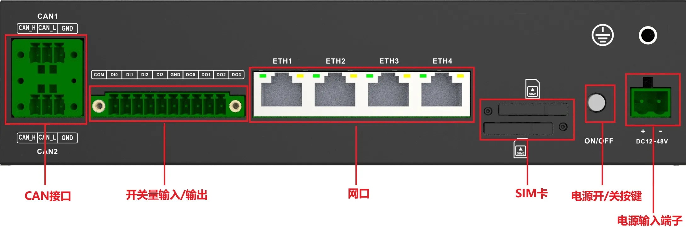</p>

<p align="center"><strong>图 1-1 EC954前面板</strong></p>

#### 1.3.2 后面板

<p align="center">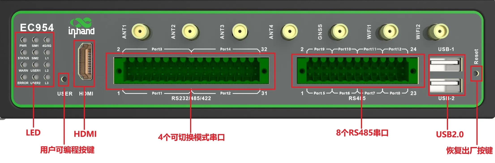</p>

<p align="center"><strong>图 1-2 EC954后面板</strong></p>

#### 1.3.3 接口说明

| 接口 | 位置 | 功能说明 |
|------|------|----------|
| ETH 1~ETH 4 | 前面板 | 4个RJ45以太网口，支持10M/100M/1000M自适应 |
| P1~P4（串口） | 前面板 | 4路可配置串口，支持RS-232/RS-485/RS-422 |
| P5~P12（串口） | 前面板 | 8路固定RS-485串口 |
| CAN1~CAN2 | 前面板 | 2路CAN总线接口，支持CAN 2.0A/B，CAN2兼容CAN FD |
| DI0~DI3 | 前面板 | 4路数字量输入接口，干接点，隔离3000VDC |
| DO0~DO3 | 前面板 | 4路数字量输出接口，隔离3000VDC |
| USB 1~USB 2 | 前面板 | 2个USB 2.0 Host接口 |
| 用户可编程按键 | 前面板 | 支持API检测状态，实现自定义按键逻辑 |
| DC电源 | 后面板 | 12~48VDC直流输入 |
| SIM1~SIM2 | 侧面板 | 2个SIM卡插槽 |
| Micro SD | 左侧面板 | 1个Micro SD卡槽 |
| mSATA | 内部 | mSATA硬盘扩展接口 |
| ANT1~ANT4 | 后面板 | 蜂窝天线接口（4G/5G） |
| GNSS | 后面板 | GNSS天线接口 |
| WiFi1~WiFi2 | 后面板 | Wi-Fi天线接口 |
| 恢复出厂按键 | 后面板 | 长按10-20s恢复出厂设置 |
| 开关机按键 | 后面板 | 短按开机，长按8s关机 |

### 1.4 指示灯说明

<p align="center">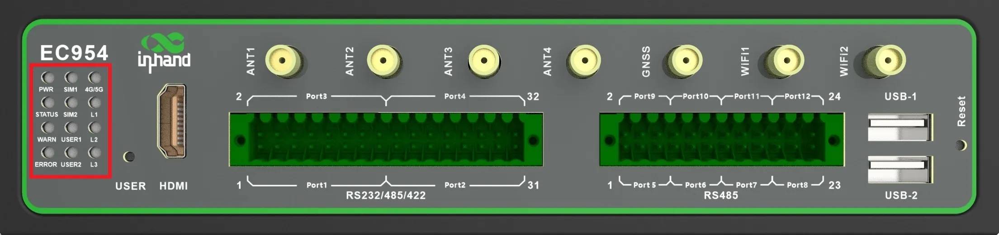</p>

<p align="center"><strong>图 1-3 EC954指示灯位置</strong></p>

EC954配备12个LED指示灯，用于指示电源及系统运行状态。

| 指示灯 | 状态 | 含义 |
|--------|------|------|
| PWR | 常亮 | 设备已上电 |
| STAT | 闪烁 | 系统正常启动并运行中 |
|  | 常灭 | 系统启动失败或恢复出厂尚未完成 |
| WARN | 闪烁 | 系统发生警告异常、系统升级或恢复出厂尚未完成 |
| ERR | 闪烁 | 系统发生严重错误、系统升级或恢复出厂尚未完成 |
| SIM1 | 常亮 | 选中SIM卡1进行拨号 |
|  | 常灭 | 选中SIM卡2拨号或关闭拨号 |
| SIM2 | 常亮 | 选中SIM卡2进行拨号 |
|  | 常灭 | 选中SIM卡1拨号或关闭拨号 |
| USER1 | 默认熄灭 | 用户可编程控制 |
| USER2 | 默认熄灭 | 用户可编程控制 |
| 4G/5G | 常亮 | 蜂窝拨号成功 |
| L1 | 亮 | 蜂窝信号弱/中等/强（RSSI ≥ -90） |
|  | 灭 | 无信号 |
| L2 | 亮 | 蜂窝信号中等/强（RSSI ≥ -70） |
|  | 灭 | 无信号或信号弱 |
| L3 | 亮 | 蜂窝信号强（RSSI ≥ -70） |
|  | 灭 | 无信号或信号弱/中等 |

**蜂窝网信号强度指示灯组合**

| LED | 无信号 | 信号弱（RSSI < -90） | 信号中等（-90 ≤ RSSI < -70） | 信号强（RSSI ≥ -70） |
|-----|--------|----------------------|------------------------------|----------------------|
| L1 | 灭 | 亮 | 亮 | 亮 |
| L2 | 灭 | 灭 | 亮 | 亮 |
| L3 | 灭 | 灭 | 灭 | 亮 |

**恢复出厂过程指示灯状态**

| 指示灯 | 状态 |
|--------|------|
| WARN | 闪烁 |
| ERR | 闪烁 |
| STAT | 熄灭 |

执行恢复出厂设置后，系统会进行一次重启。重启完成后，恢复出厂尚未完成，此时WARN灯和ERR灯闪烁，STAT灯熄灭。该状态下不能对设备断电，否则可能导致文件丢失。该状态持续约30秒，恢复出厂完成后，WARN和ERR灯熄灭，STAT灯恢复闪烁。

### 1.5 恢复出厂设置

EC954支持以下两种方式恢复出厂设置：

1. **命令行方式**
   登录设备后，执行以下命令：
   ```
   sudo factory_reset
   ```
   系统会自动重启并恢复出厂设置。

2. **按键方式**
   1. 长按恢复出厂设置按键10-20秒，看到WARN灯长亮。
   2. WARN灯长亮后，松开恢复出厂设置按键。
   3. 松开按键后，ERR灯闪烁几次，系统开始重启并执行恢复出厂设置。
   4. 系统重启后，WARN灯和ERR灯闪烁，STAT灯熄灭；约30秒后，WARN灯和ERR灯停止闪烁，STAT灯开始闪烁，表示恢复出厂设置完成。

### 1.6 默认设置

| 参数项 | 默认值 |
|--------|--------|
| ETH 1 IP地址 | 192.168.3.100 |
| ETH 2 IP地址 | 192.168.4.100 |
| ETH 3 IP地址 | 192.168.5.100 |
| ETH 4 IP地址 | 192.168.6.100 |
| SSH登录用户名 | edge |
| SSH登录密码 | security@edge |
| Web管理地址 | https://192.168.4.100:9100 |
| Web登录账号 | adm |
| Web登录密码 | 123456 |
| IEOS管理 | 默认启用 |
| 蜂窝网络 | 默认开启 |
| 双SIM卡 | 默认关闭 |
| Wi-Fi Station | 默认关闭 |
| DHCP Server | 默认关闭 |

> **注意**：并非所有EC954型号均支持Web界面管理功能，具体支持情况可查看《EC954系列边缘计算机产品规格书》中"订购信息"部分。

---

## 第2章 安装与首次使用

### 2.1 安装前准备

**环境要求**

| 项目 | 规格 |
|------|------|
| 输入电压 | 12～48 VDC |
| 待机功率 | 120mA-200mA@12V |
| 工作功率 | 150mA-320mA@12V |
| 峰值功率 | 320mA@12V |
| 工作温度 | -20℃～70℃ |
| 存储温度 | -40℃～85℃ |
| 环境湿度 | 5%～95%（无凝露） |

**工具准备**

- 十字螺丝刀
- DIN导轨或壁挂套件（壁挂套件需单独购买）
- 网线
- 电源适配器（选配）

> **警告**：安装前请确认供电电压符合设备规格要求，错误的电压可能导致设备损坏。
> 
> **注意**：SIM卡和Micro SD卡不支持热插拔，需在断电状态下安装。

### 2.2 安装指南

#### 2.2.1 DIN导轨安装

EC954的下面板附带DIN导轨安装板，安装步骤如下：

1. 将DIN导轨安装板的上方挂钩卡入DIN轨支架的顶端。
2. 缓慢向DIN轨支架方向推动设备，使DIN导轨底端卡入到位。

<p align="center">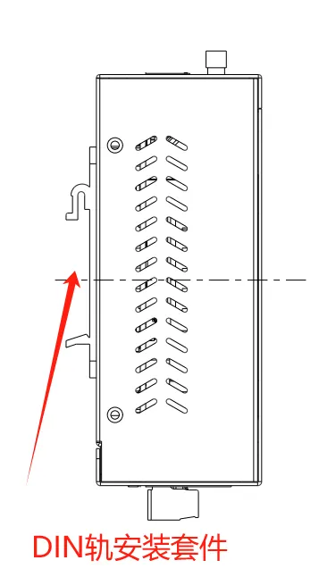</p>

<p align="center"><strong>图 2-1 DIN导轨安装示意图</strong></p>

#### 2.2.2 壁挂式安装

EC954可采用壁挂套件进行安装，壁挂套件需单独购买。安装步骤如下：

1. 使用螺钉将壁挂套件固定在EC954的下面板上。

<p align="center">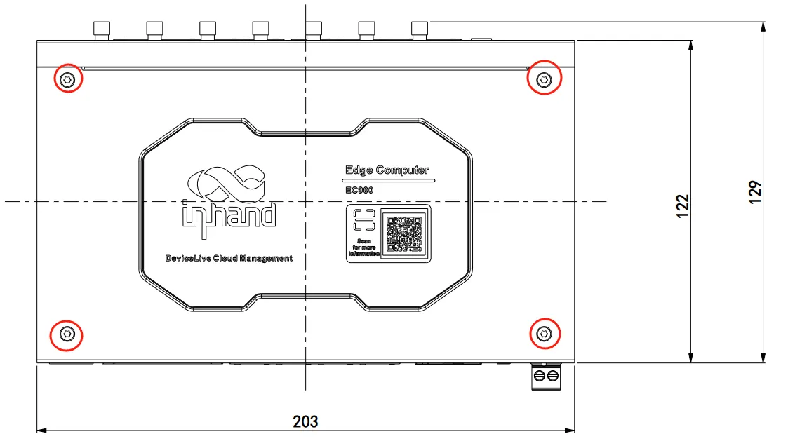</p>

<p align="center"><strong>图 2-2 壁挂套件固定</strong></p>

2. 壁挂套件固定完成后，使用螺钉将EC954固定在墙面或柜体上。

<p align="center">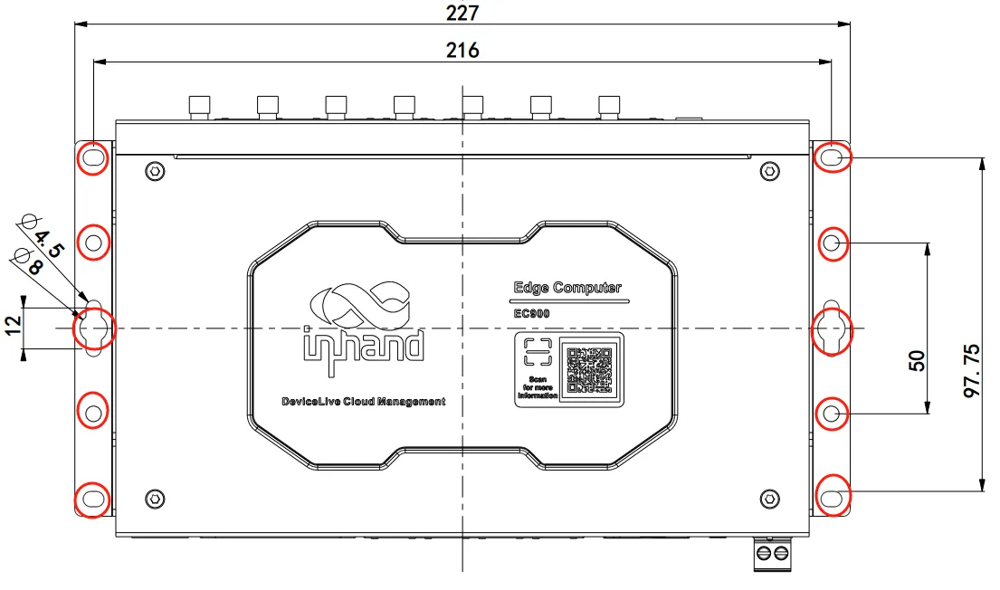</p>

<p align="center"><strong>图 2-3 壁挂安装</strong></p>

#### 2.2.3 天线安装

EC954共有7个天线接口，不同型号标配的天线数量不同。具体型号对应的天线支持情况可参见《EC954系列边缘计算机产品规格书》中"订购信息"部分。

| 标识 | 名称 |
|------|------|
| ANT1 | 4G LTE主天线/5G天线 |
| ANT2 | 4G LTE分集接收天线/5G天线 |
| GNSS | GNSS天线 |
| ANT3 | 5G天线 |
| ANT4 | 5G天线 |
| WiFi1 | Wi-Fi天线 |
| WiFi2 | Wi-Fi天线 |

将所需天线拧入对应的SMA天线接口完成安装。

<p align="center"></p>

<p align="center"><strong>图 2-4 天线安装</strong></p>

#### 2.2.4 SIM卡安装

EC954支持2个SIM卡插槽，SIM卡需在断电状态下安装。

1. 取出配件盒中的取卡针，按压取卡针孔取出SIM卡托盘。
2. 将SIM卡安装到托盘中，注意SIM卡缺口方向。
3. 将托盘按压回插槽完成安装。

<p align="center">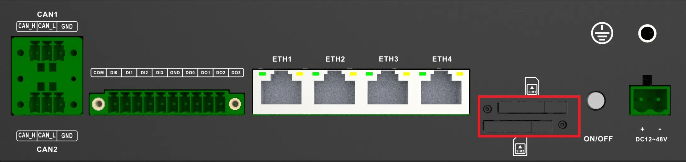</p>

<p align="center"><strong>图 2-5 SIM卡安装</strong></p>

#### 2.2.5 Micro SD卡安装

EC954的Micro SD卡不支持热插拔，需在断电状态下操作。

1. 移除保护外壳。
2. 将Micro SD卡安装到位于EC954左侧面板的SD卡槽中。

<p align="center">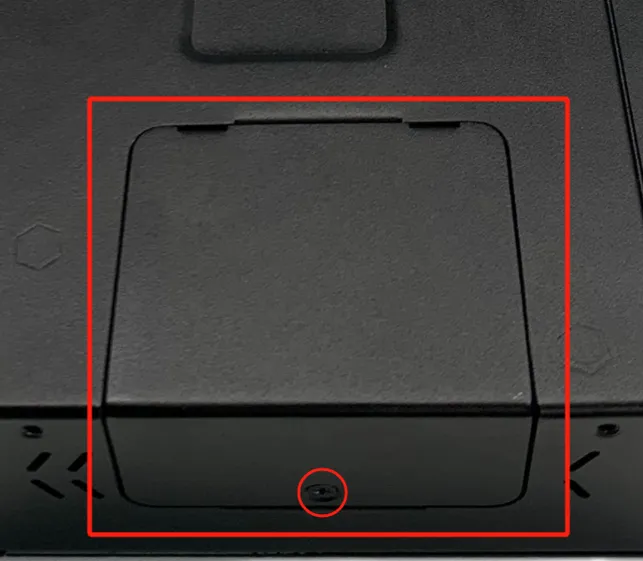</p>

<p align="center"><strong>图 2-6 Micro SD卡安装（1）</strong></p>

<p align="center">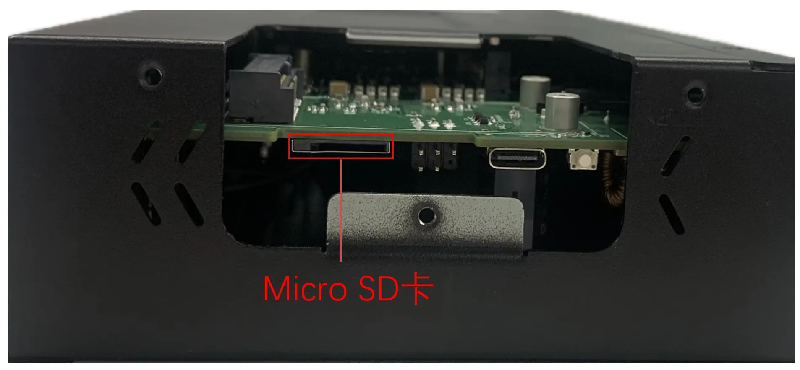</p>

<p align="center"><strong>图 2-7 Micro SD卡安装（2）</strong></p>

#### 2.2.6 mSATA硬盘安装

EC954支持mSATA硬盘扩展，出厂默认不配备mSATA硬盘。如有大容量存储需求，需自购mSATA硬盘或咨询映翰通购买。

安装步骤如下：

1. 使用螺丝刀打开硬盘保护外壳。

<p align="center"></p>

<p align="center"><strong>图 2-8 mSATA硬盘安装（打开外壳）</strong></p>

<p align="center">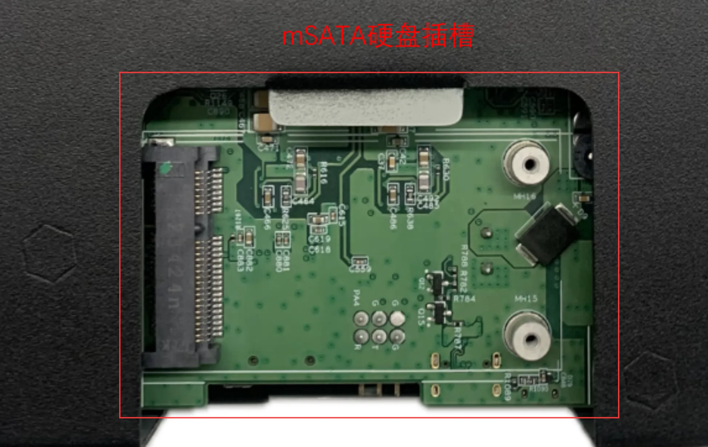</p>

<p align="center"><strong>图 2-9 mSATA硬盘安装（拆卸外壳）</strong></p>

2. 将硬盘对准插槽，向右推并卡入到位；使用螺钉（M2）对硬盘右侧进行固定。

<p align="center"></p>

<p align="center"><strong>图 2-10 mSATA硬盘安装（插入硬盘）</strong></p>

<p align="center">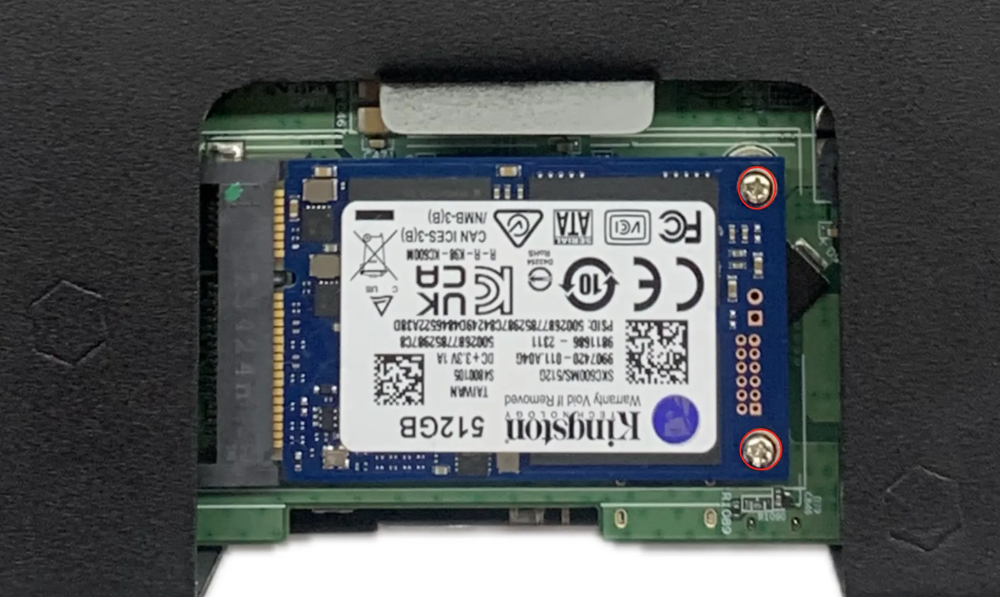</p>

<p align="center"><strong>图 2-11 mSATA硬盘安装（固定硬盘）</strong></p>

3. 将拆卸下来的保护外壳重新安装回EC954。

#### 2.2.7 电源连接

EC954支持12～48VDC供电。

1. 将电源适配器端子插入EC954的DC端口。
2. 连接电源适配器。
3. 当PWR电源指示灯常亮，表示设备已正常上电。

<p align="center">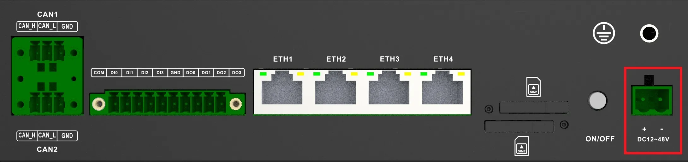</p>

<p align="center"><strong>图 2-12 直流电源接口</strong></p>

#### 2.2.8 首次访问设备

设备上电后，可通过以下两种方式访问EC954：

**方式一：SSH命令行连接**

1. 将网线一端插入EC954的任一网口，另一端连接电脑网口。
2. 将电脑IP地址设置为与设备接口同网段。

<p align="center">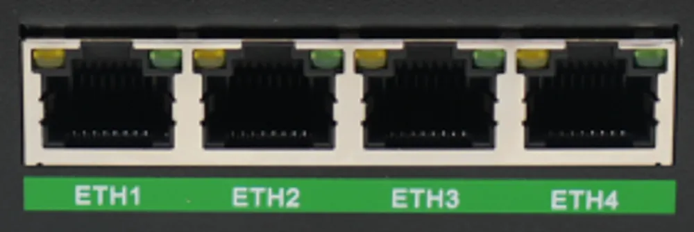</p>

<p align="center"><strong>图 2-13 网口连接示意图</strong></p>

3. Windows用户可下载PuTTY（免费软件），通过SSH方式建立连接。登录的默认用户名在设备背板上。

<p align="center">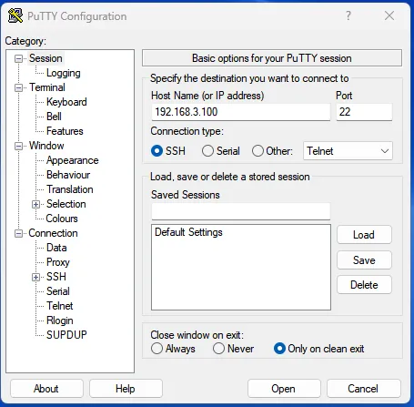</p>

<p align="center"><strong>图 2-14 PuTTY SSH连接示例</strong></p>

4. Linux用户可直接使用ssh命令访问：
   ```
   ssh edge@192.168.4.100
   ```

**方式二：Web界面连接**

1. 通过网线将电脑与EC954连接，并配置同网段IP。
2. 在浏览器中输入 `https://192.168.4.100:9100`。
3. 输入初始登录账号 `adm` 和密码 `123456`。

<p align="center"></p>

<p align="center"><strong>图 2-15 IEOS Web登录界面</strong></p>

> **注意**：IEOS使用9100端口号作为HTTPS连接端口，不支持HTTP访问；当用户使用HTTP访问Web时，会自动跳转到HTTPS。IEOS启用时会预留端口号范围9100～9200供内部通信使用，用户程序应避开使用这些端口号。

### 2.3 快速检查

安装完成后，请按以下清单进行必检项确认：

- [ ] 设备已正确固定在DIN导轨或墙面上
- [ ] 电源连接正确，PWR指示灯常亮
- [ ] 天线已安装到对应接口（如使用蜂窝/Wi-Fi/GNSS功能）
- [ ] SIM卡已正确安装（如使用蜂窝功能）
- [ ] 网线已连接，电脑IP与设备同网段
- [ ] 可通过SSH或Web方式正常登录设备
- [ ] STAT指示灯正常闪烁，表示系统运行正常

---

## 第3章 常用场景配置

### 场景1：设备首次连接与访问

**目标**：通过网线将PC与EC954连接，使用SSH或Web方式首次访问设备。

**前提**：设备已完成安装并上电，PWR指示灯常亮，STAT指示灯闪烁。

**预计用时**：约10分钟。

**操作步骤**：
1. 将网线一端插入EC954的任一网口（ETH 1～ETH 4），另一端插入电脑网口。
2. 将电脑IP地址配置为与设备对应网口同网段：
   - ETH 1：192.168.3.0/24
   - ETH 2：192.168.4.0/24
   - ETH 3：192.168.5.0/24
   - ETH 4：192.168.6.0/24
3. 方式A（SSH）：使用PuTTY或Linux终端，通过SSH连接设备默认IP。
   - 用户名：`edge`
   - 密码：`security@edge`
4. 方式B（Web）：在浏览器输入 `https://<设备IP>:9100`，使用账号 `adm` 和密码 `123456` 登录。

**验证方法**：
1. SSH方式：终端出现 `edge@edge-computer:~$` 提示符，表示连接成功。
2. Web方式：浏览器成功加载IEOS登录页面，输入账号密码后进入管理界面。

**常见问题**：
- 无法连接设备：检查网线连接、电脑IP是否与设备同网段、防火墙是否阻断。
- Web页面无法打开：确认使用HTTPS协议及9100端口；确认型号是否支持Web管理。

### 场景2：以太网口网络配置

**目标**：通过IEOS Web界面配置以太网接口的静态IP或DHCP Client。

**前提**：已通过Web方式登录IEOS管理界面。

**预计用时**：约5分钟。

**操作步骤**：
1. 进入IEOS Web管理界面，选择【网络管理】→【以太网】。
2. 配置静态IP：选择对应接口，设置IP地址、子网掩码、网关。

<p align="center">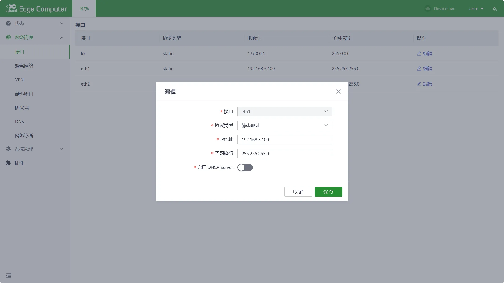</p>

<p align="center"><strong>图 3-1 以太网静态IP配置</strong></p>

3. 配置DHCP Client：选择对应接口，启用DHCP Client功能。

<p align="center"></p>

<p align="center"><strong>图 3-2 DHCP Client配置</strong></p>

4. 点击"保存"使配置生效。

**验证方法**：
1. 进入【状态】→【设备信息】查看接口IP是否生效。
2. 使用ping命令测试网络连通性。

### 场景3：蜂窝网络拨号配置

**目标**：通过4G/5G蜂窝网络接入互联网。

**前提**：已插入SIM卡并安装蜂窝天线，设备已上电，已通过Web登录IEOS。

**预计用时**：约5分钟。

**操作步骤**：
1. 进入IEOS Web管理界面，选择【网络管理】→【蜂窝】。
2. 确认"启用蜂窝网络"开关已开启（默认开启）。

<p align="center">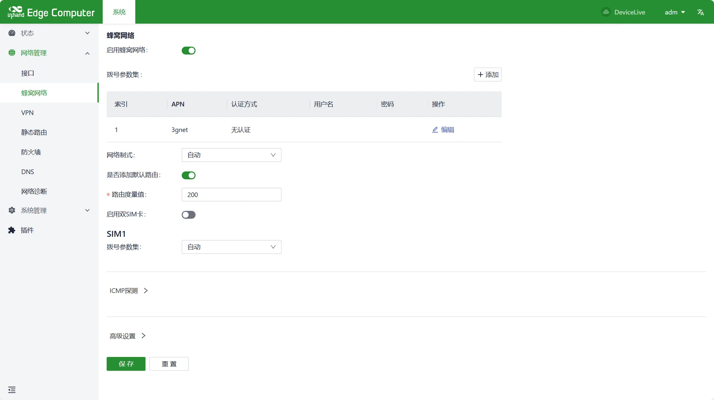</p>

<p align="center"><strong>图 3-3 蜂窝拨号配置</strong></p>

3. 如需使用专网卡，配置拨号参数集（APN、用户名、密码、认证方式）。
4. 配置网络制式（默认"自动"，程序自动选择最优网络）。
5. 如需使用双SIM卡功能，启用"启用双SIM卡"，配置主卡及最大拨号次数。

<p align="center"></p>

<p align="center"><strong>图 3-4 双SIM卡配置</strong></p>

6. 建议开启ICMP探测功能，配置探测服务器地址、间隔时间、超时时间及最大重试次数，用于检测并恢复假连接。

<p align="center"></p>

<p align="center"><strong>图 3-5 ICMP探测配置</strong></p>

7. 点击"保存"并等待连接建立。

**验证方法**：
1. 检查4G/5G指示灯是否常亮。
2. 进入【状态】→【蜂窝拨号状态】查看IMEI、IMSI、信号强度及获取的IP地址。
3. 使用网络诊断工具ping公网地址（如8.8.8.8）确认连通性。

**常见问题**：
- 拨号失败：检查SIM卡是否正确插入、APN参数是否与运营商提供的一致、天线是否安装。
- 假连接（拨号成功但无法上网）：确认ICMP探测已开启；尝试手动重新拨号或重启设备。

### 场景4：Wi-Fi Station配置

**目标**：将EC954作为Wi-Fi客户端接入无线网络。

**前提**：设备型号支持Wi-Fi功能，已通过Web登录IEOS。

**预计用时**：约5分钟。

**操作步骤**：
1. 进入IEOS Web管理界面，选择【网络管理】→【Wi-Fi Station】。
2. 开启"启用Wi-Fi"开关。

<p align="center">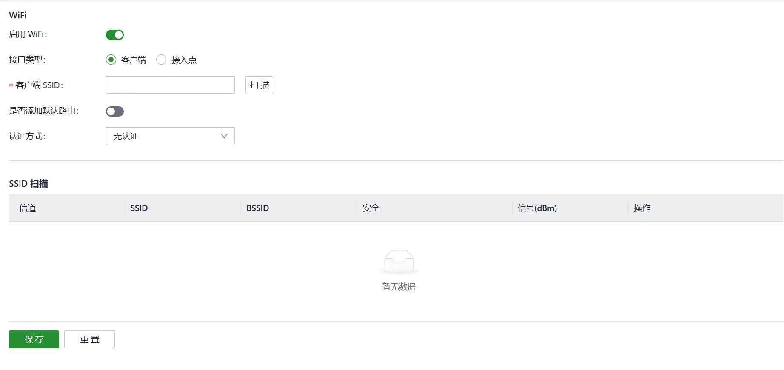</p>

<p align="center"><strong>图 3-6 Wi-Fi Station配置</strong></p>

3. 输入目标无线网络的SSID，或通过"扫描"按钮获取附近可连接的热点列表。
4. 选择认证方式（无认证/WPA-PSK/WPA2-PSK/WPA-PSK/WPA2-PSK Mixed）。
5. 选择加密方式（CCMP/TKIP/TKIP和CCMP），输入WPA/WPA2 PSK密钥。
6. 配置是否添加默认路由及路由度量值。
7. 点击"保存"使配置生效。

**验证方法**：
1. 进入【状态】→【Wi-Fi Station状态】查看获取的IP地址、网关及DNS信息。
2. 使用ping命令测试网络连通性。

**常见问题**：
- 无法连接Wi-Fi：检查SSID和密码是否正确、信号强度是否足够、认证加密方式是否匹配。

### 场景5：OpenVPN配置

**目标**：通过OpenVPN建立安全的远程访问隧道。

**前提**：已通过Web登录IEOS，已准备CA证书及相关密钥文件。

**预计用时**：约10分钟。

**操作步骤**：
1. 进入IEOS Web管理界面，选择【网络管理】→【OpenVPN】。
2. 配置OpenVPN服务器（如需作为服务端）：
   - 设置服务端名称、状态、接口类型（仅支持tun）、网络类型（p2p/net30/subnet）。
   - 配置虚拟网络、网络掩码。
   - 导入CA证书、公钥证书、私钥证书及DH参数文件。

<p align="center"></p>

<p align="center"><strong>图 3-7 OpenVPN服务器配置</strong></p>

3. 或配置OpenVPN客户端（如需作为客户端）：
   - 设置客户端名称、状态、接口类型（tun）、网络类型。
   - 配置OpenVPN服务器地址（格式：`IP 端口 协议`，如 `192.168.3.200 1194 udp`）。
   - 导入CA证书、客户端公钥证书、客户端私钥证书。

<p align="center"></p>

<p align="center"><strong>图 3-8 OpenVPN客户端配置</strong></p>

4. 高级设置中可配置加密算法、哈希算法、密钥保持、隧道保持等参数。
5. 点击"保存"启动OpenVPN服务。

**验证方法**：
1. 进入【状态】→【OpenVPN状态】查看隧道连接状态。
2. 服务端状态页可查看已连接的客户端信息；客户端状态页可查看虚IP地址及连接时长。

**常见问题**：
- 隧道无法建立：检查证书文件是否正确导入、服务器地址和端口是否可达、防火墙是否放通。

### 场景6：固件升级与系统维护

**目标**：通过U盘或Micro SD卡对EC954进行OTA固件升级。

**前提**：已准备FAT32格式的U盘或Micro SD卡，已下载正确的固件镜像文件。

**预计用时**：约20分钟。

**操作步骤**：
1. 在U盘（或Micro SD卡）根目录下创建空的 `ec900_img` 目录。
2. 将固件镜像文件（如 `EC954-V2.0.0.img`）和对应的 `md5.txt` 文件放入 `ec900_img` 目录。
3. 确认 `md5.txt` 文件中仅包含该镜像文件一行的MD5哈希值。EC954不支持多个img镜像同时OTA升级。
4. 在电脑上正常退出U盘（选择"弹出"操作，不要直接拔插）。
5. 将U盘（或Micro SD卡）插入EC954设备。
6. 设备自动校验镜像文件并进行OTA升级。升级过程中WARN和ERR指示灯会有相应显示。
7. 等待WARN和ERR指示灯恢复正常，升级即完成。
8. 查看 `ec900_img` 目录下的日志文件，确认升级结果。

**验证方法**：
1. 升级完成后重启设备。
2. 登录设备执行 `sudo showver` 或进入Web【状态】→【设备信息】查看固件版本。

**常见问题**：
- 升级失败：检查U盘格式是否为FAT32、md5.txt是否正确、镜像文件是否完整。
- 升级后无法启动：尝试重新执行升级流程，或联系技术支持。

### 场景7：外设接口配置

**目标**：配置串口、CAN总线、数字量IO等外设接口。

**前提**：已通过SSH登录设备命令行，了解外设连接需求。

**预计用时**：约10分钟。

**操作步骤**：
1. **串口模式切换**（前4路串口）：
   使用 `ih_uart_ctl` 命令切换串口模式。
   ```
   sudo ih_uart_ctl
   ```

<p align="center">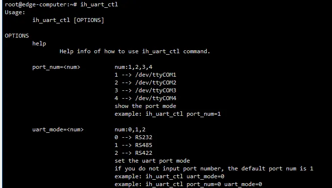</p>

<p align="center"><strong>图 3-9 串口模式切换命令</strong></p>

2. **CAN总线配置**：
   检查CAN设备状态：
   ```
   ip link show can0
   ```
   配置CAN比特率（以125k为例）：
   ```
   sudo ip link set can0 down
   sudo ip link set can0 type can bitrate 125000
   sudo ip link set can0 up
   ```

3. **数字量IO控制**：
   使用 `dio_mgmt` 命令查看和控制IO状态。
   ```
   sudo dio_mgmt show DIO0
   sudo dio_mgmt set DO0 HIGH
   ```

**验证方法**：
1. 串口：使用 `stty` 命令查看串口参数是否正确。
2. CAN：使用CAN工具发送/接收测试帧。
3. IO：使用 `dio_mgmt show` 命令读取输入电平，确认输出状态。

---

## 第4章 功能说明与参数参考

### 4.1 用户账户管理

EC954出厂默认用户名 `edge`，密码 `security@edge`。设备出厂默认创建了root用户但登录被禁用。如需使用root用户，可手动修改系统配置，输入 `sudo -s` 切换至root用户。用户 `edge` 在sudo组中，可在edge用户下使用 `sudo` 执行系统级命令。

> **注意**：出于安全考虑，建议禁用默认的用户账户，并创建自己的用户账户。

#### 4.1.1 切换到root用户


```
sudo -s
```

> **提示**：当出现 `command not found` 时，输入 `sudo -s` 切换至root用户或使用 `sudo` 命令操作。

> **注意**：在非root权限下使用管道或重定向行为时可能得到 `permission denied` 提示，此时需使用 `sudo su -c` 来取代 `>`、`<`、`>>`、`<<` 等命令，需包含完整命令的单引号。

#### 4.1.2 创建和删除用户账户


使用 `useradd` 和 `userdel` 命令创建和删除用户账户。以下示例在sudo组中创建test1用户（默认登录环境为bash，主目录为 `/home/test1`）：

<p align="center"></p>

<p align="center"><strong>图 4-1 创建用户账户</strong></p>

修改test1密码：

<p align="center"></p>

<p align="center"><strong>图 4-2 修改用户密码</strong></p>

删除用户test1：

<p align="center"></p>

<p align="center"><strong>图 4-3 删除用户账户</strong></p>

#### 4.1.3 禁用默认的用户账户


> **注意**：在禁用默认账户之前，应首先创建一个用户账户。

使用 `passwd` 命令锁定默认用户账户：

<p align="center"></p>

<p align="center"><strong>图 4-4 锁定用户账户</strong></p>

解除锁定：

<p align="center"></p>

<p align="center"><strong>图 4-5 解锁用户账户</strong></p>

### 4.2 基于IEOS的Web管理

IEOS是映翰通自研的一套运行在Linux系统上的网络管理和系统管理程序，提供Web界面服务。IEOS采用状态和配置分离的设计方案，分为网络管理、系统管理和状态三大功能板块。

> **重要说明**：使用IEOS管理网络配置和系统配置时，如果同时使用Linux原生命令，二者可能相互影响，导致异常运行状态。建议IEOS支持的配置均通过IEOS Web实现管理；IEOS不支持的配置（如VPN）可结合Linux原生命令实现。

#### 4.2.1 登录Web

IEOS使用9100端口号作为HTTPS连接端口，不支持HTTP访问；用户使用HTTP访问Web时会自动跳转到HTTPS。以通过eth2的默认地址192.168.4.100为例进行说明。用户在浏览器中输入192.168.4.100:9100后跳转到登录页面。

<p align="center"></p>

<p align="center"><strong>图 4-6 IEOS登录界面</strong></p>

> **重要说明**：IEOS程序启用时，会预留端口号范围9100～9200供内部通信使用。启用IEOS后，用户程序应避开使用这些端口号，否则可能产生冲突导致功能异常。

#### 4.2.2 网络管理

##### 4.2.2.1 以太网接口

**配置静态IP地址**

给eth1接口配置静态IP地址：

<p align="center"></p>

<p align="center"><strong>图 4-7 以太网静态IP配置</strong></p>

**配置DHCP Client**

给eth1接口配置DHCP Client：

<p align="center"></p>

<p align="center"><strong>图 4-8 DHCP Client配置</strong></p>

**配置DHCP Server**

在eth1接口上启动DHCP Server功能，为eth1的下挂设备分配地址：

<p align="center">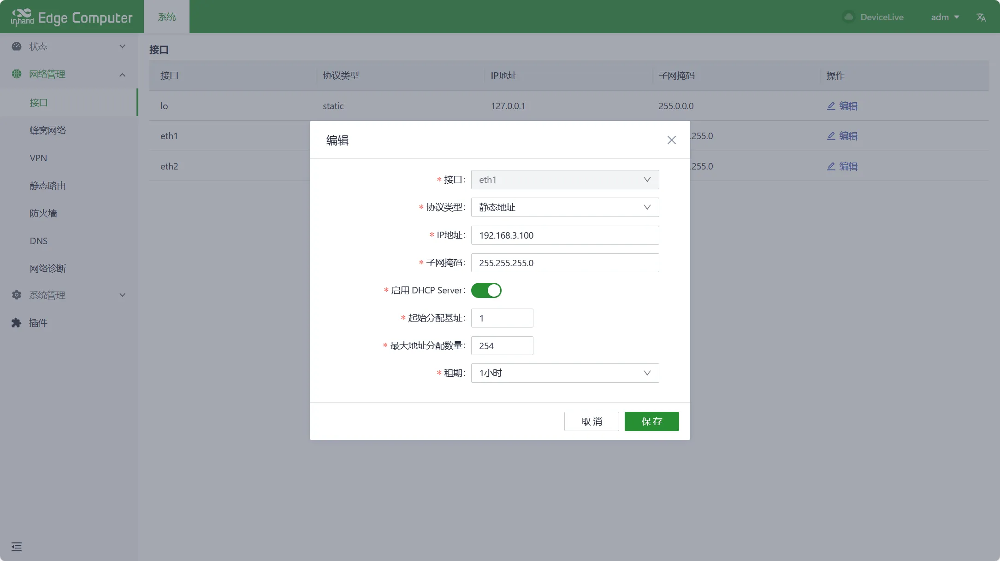</p>

<p align="center"><strong>图 4-9 DHCP Server配置</strong></p>

DHCP Server配置参数说明：

| 参数 | 说明 |
|------|------|
| 启用DHCP Server | DHCP Server功能的开关 |
| 起始分配地址 | DHCP Server地址池起始基址。网段+起始地址=地址池的起始IP地址。例如eth1网段为192.168.3.0/24，基址为1，则起始地址为192.168.3.1/24 |
| 最大地址分配数量 | 地址池中的最大地址数量 |
| 租期 | 租期时间 |

##### 4.2.2.2 蜂窝拨号

<p align="center"></p>

<p align="center"><strong>图 4-10 蜂窝拨号配置</strong></p>

蜂窝网参数说明：

| 参数 | 说明 |
|------|------|
| 启用蜂窝网络 | 蜂窝功能的开关；默认开启 |
| 拨号参数集 | 用于专网卡拨号时配置APN、用户名、密码及认证方式等信息。拨号参数集最多可添加10条记录 |
| 网络制式 | 可选择3G、4G等相关网络制式（如LTE、WCDMA等），默认"自动" |
| 是否添加默认路由 | 开启后，拨号成功会添加蜂窝口的默认路由，默认开启 |
| 路由度量值 | 蜂窝口默认路由的度量值。多链路同时配置默认路由时，度量值最小的生效 |

**双SIM卡配置**

<p align="center"></p>

<p align="center"><strong>图 4-11 双SIM卡配置</strong></p>

| 参数 | 说明 |
|------|------|
| 启用双SIM卡 | 启用双卡单拨功能。设备插入2张SIM卡后，主卡拨号失败达到一定次数时自动切换到另一张SIM卡。默认关闭 |
| 选择主卡 | 拨号时优先使用的SIM卡，默认先使用SIM1 |
| 最大拨号次数 | 当前拨号SIM卡拨号达到指定次数后切换到另一张SIM卡 |
| 拨号参数集 | SIM卡选用的拨号参数集Index |
| PIN Code | SIM卡的PIN码 |

**ICMP探测配置**

<p align="center"></p>

<p align="center"><strong>图 4-12 ICMP探测配置</strong></p>

| 参数 | 说明 |
|------|------|
| ICMP探测服务器 | ICMP探测地址；可配置2个探测地址，只要1个探测成功即判定网络正常。未配置时ICMP探测关闭 |
| 间隔时间 | 探测周期 |
| 超时时间 | 等待探测响应的超时时间 |
| 最大重试次数 | 探测失败达到该值时触发重新拨号。取值范围[1,5] |
| 严格探测 | 关闭时，探测程序会检测蜂窝接口接收报文是否变化，有变化则不发送ICMP报文以节省流量；开启时则周期性发送ICMP探测报文。默认关闭 |

**高级配置**

<p align="center"></p>

<p align="center"><strong>图 4-13 蜂窝高级配置</strong></p>

| 参数 | 说明 |
|------|------|
| 启用调试模式 | 开启后日志中增加拨号相关调试信息，默认关闭 |
| 启用无限重拨 | 开启后无论拨号失败多少次均不会重启系统。默认关闭，拨号失败一定次数后会重启系统尝试恢复 |
| 重拨间隔 | 拨号失败后进行下一次拨号前的等待时间 |
| 信号查询间隔 | 拨号程序定期检测信号强度的周期 |

##### 4.2.2.3 Wi-Fi

<p align="center"></p>

<p align="center"><strong>图 4-14 Wi-Fi Station配置</strong></p>

| 参数 | 说明 |
|------|------|
| 启用Wi-Fi | 使能开关，默认关闭 |
| 客户端SSID | 需要连接的SSID，可手动输入或通过扫描获取附近热点 |
| 是否添加默认路由 | 开启后Wi-Fi连接成功会添加wlan口默认路由，默认开启 |
| 路由度量值 | Wi-Fi口默认路由的度量值 |
| 认证方式 | 支持无认证、WPA-PSK、WPA2-PSK、WPA-PSK/WPA2-PSK Mixed |
| 加密方式 | 支持CCMP、TKIP、TKIP和CCMP |
| WPA/WPA2 PSK密钥 | 密钥信息 |

##### 4.2.2.4 静态路由

当同时配置了以太网、蜂窝、Wi-Fi的默认路由时，metric值最小的那条默认路由生效。需保证默认路由的Metric值互不相同。

<p align="center"></p>

<p align="center"><strong>图 4-15 静态路由配置</strong></p>

| 参数 | 说明 |
|------|------|
| 接口 | 静态路由的出接口 |
| 目标网络 | 目标网络 |
| 目标网络掩码 | 目标网络掩码 |
| 网关 | 下一跳地址 |
| 路由度量值 | 静态路由的度量值 |

##### 4.2.2.5 防火墙

- **基本设置**

<p align="center"></p>

<p align="center"><strong>图 4-16 防火墙基本设置</strong></p>

分别设置入站、出站和转发策略。

在【区域】配置中可以添加域规则，域是基于接口的，可添加局域和广域。

<p align="center"></p>

<p align="center"><strong>图 4-17 防火墙区域配置</strong></p>

<p align="center"></p>

<p align="center"><strong>图 4-18 防火墙区域配置详情</strong></p>

| 参数 | 说明 |
|------|------|
| 入站规则 | 针对从该域收到且目标地址是设备本身的报文的控制策略，可选"接受"、"拒绝"、"丢弃" |
| 出站规则 | 针对设备本身产生且通过该域发送出去的报文的控制策略 |
| 转发策略 | 针对从该域收到且需要被转发的报文的控制策略 |
| 接口 | 域中包含的接口 |
| IP动态伪装 | 开启后，从域中对应接口发送出去的报文源IP地址会转换为接口IP地址 |

- **端口转发**

DNAT规则通常用于报文从广域网方向进入，访问局域网下的设备时使用。

<p align="center">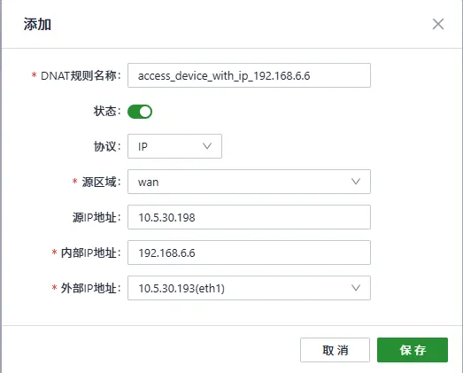</p>

<p align="center"><strong>图 4-19 DNAT规则配置</strong></p>

| 参数 | 说明 |
|------|------|
| DNAT规则名称 | 用于标识DNAT规则，可说明规则目的 |
| 状态 | 启用/禁用规则；Status为off时禁用 |
| 协议 | 支持IP/UDP/TCP等协议类型 |
| 源区域 | 设备从哪个域（即哪个接口）收到报文 |
| 源IP地址 | 报文的源IP地址；不填则匹配所有 |
| 内部IP地址 | 需要访问的目标设备的IP地址，通常是局域网内设备 |
| 外部IP地址 | 当接口有多个IP地址时，选择对应的接口IP地址 |

SNAT规则通常用于报文从局域网进入，需要将报文的源IP地址修改为WAN口IP地址时使用。

<p align="center"></p>

<p align="center"><strong>图 4-20 SNAT规则配置</strong></p>

| 参数 | 说明 |
|------|------|
| SNAT规则名称 | 用于标识SNAT规则，可说明规则目的 |
| 状态 | 启用/禁用规则 |
| 协议 | 支持IP/UDP/TCP等协议类型 |
| 源区域 | 报文来自哪个域（通常是局域网域） |
| 源IP地址 | 匹配报文的源IP地址；可不填 |
| 目标区域 | 报文从哪个域发出去（通常是广域网域） |
| 目标IP | 报文的目的IP地址；可不填 |
| SNAT IP地址 | 将报文源IP修改后的IP地址 |

- **通信规则**

<p align="center"></p>

<p align="center"><strong>图 4-21 通信规则配置</strong></p>

| 参数 | 说明 |
|------|------|
| 通信规则名称 | 用于标识规则，可描述规则作用 |
| 状态 | 启用/禁用规则 |
| 限制地址 | 选择IP协议族，包括IPv4 |
| 协议 | 支持IP/UDP/TCP等协议类型 |
| 目标 | 目标处理动作，可选Drop、Accept或Reject |
| 源区域 | 报文从哪个域进入设备 |
| 目标区域 | 报文经过哪个域从设备发出 |
| 目标IP | 报文的目标地址；不配置时匹配所有 |
| 目标端口 | 报文的目标端口；不配置时匹配所有 |
| 源端口 | 报文的源端口；不配置时匹配所有 |
| 源IP地址 | 报文的源IP地址；不配置时匹配所有 |

- **MAC地址过滤**

<p align="center">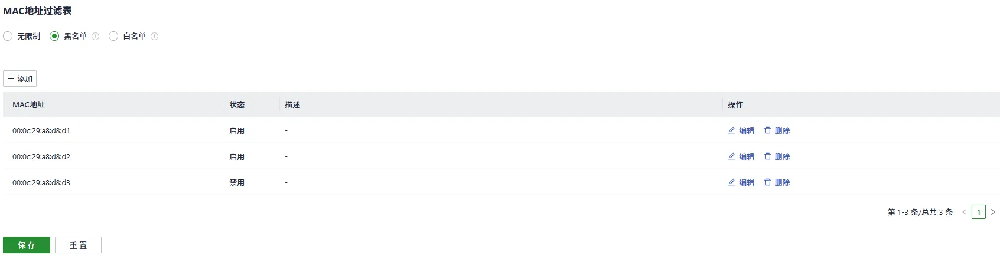</p>

<p align="center"><strong>图 4-22 MAC地址过滤配置</strong></p>

MAC地址过滤功能用于控制EC954下挂设备产生的报文是否可以被转发，但不会影响下挂设备对EC954本身的访问。MAC地址列表中最多可添加500条规则。

该功能包含三种模式：
- `无限制`：功能关闭，不对MAC地址列表中的设备产生影响
- `黑名单`：MAC地址列表中的设备产生的报文将被丢弃，其他设备正常转发
- `白名单`：仅MAC地址列表中的设备产生的报文可以被转发，其他设备报文被丢弃

MAC地址列表中每条记录均可单独启用/禁用。

- **自定义规则**

在自定义防火墙输入框中，用户可输入Linux原生的iptables规则。

<p align="center"></p>

<p align="center"><strong>图 4-23 自定义防火墙规则</strong></p>

##### 4.2.2.6 DNS

<p align="center">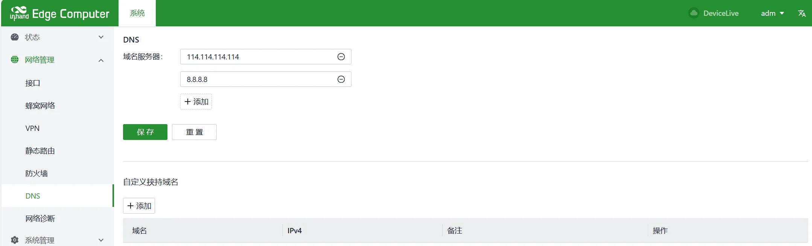</p>

<p align="center"><strong>图 4-24 DNS配置</strong></p>

| 参数 | 说明 |
|------|------|
| 域名服务器 | DNS Server地址，最多支持配置4个 |
| 自定义挟持域名 | 域名劫持功能，可实现IP地址和域名之间的绑定 |

<p align="center"></p>

<p align="center"><strong>图 4-25 域名劫持配置</strong></p>

##### 4.2.2.7 网络诊断

网络诊断支持ping、traceroute和nslookup功能。

<p align="center"></p>

<p align="center"><strong>图 4-26 网络诊断</strong></p>

##### 4.2.2.8 OpenVPN

**OpenVPN服务器**

OpenVPN的配置可通过Web页面手动配置，也可通过导入配置文件的方式进行配置。

**手动配置**

<p align="center"></p>

<p align="center"><strong>图 4-27 OpenVPN服务器手动配置</strong></p>

| 参数 | 说明 |
|------|------|
| 服务端名称 | 唯一标识服务器端配置的字符串，只能包含英文字母和数字，并以字母开头，长度不超过64个字符 |
| 状态 | 开启或关闭，控制OpenVPN服务器的启动或停止 |
| 接口类型 | 目前只支持tun模式 |
| 网络类型 | 支持p2p、net30和subnet。p2p和net30用于建立点对点连接，subnet用于建立虚拟局域网 |
| 虚拟网络 | subnet模式下配置虚拟网络的网段信息；p2p或net30模式下配置本端IP地址和远端IP地址 |
| 网络掩码 | subnet模式下配置虚拟网络的子网掩码 |
| CA证书 | 导入CA证书文件 |
| 公钥证书 | 导入服务器的公钥证书文件 |
| 私钥证书 | 导入服务器的私钥证书文件 |
| DH参数 | 导入服务器的DH参数文件 |

高级设置参数：

| 参数 | 说明 |
|------|------|
| 服务器地址 | OpenVPN监听的IP地址，默认0.0.0.0（监听所有IP地址） |
| 协议类型 | 支持udp和tcp，默认udp |
| 服务器端口 | 服务器监听的端口号，默认1194 |
| 加密算法 | 保证数据传输机密性的加密算法 |
| 哈希算法 | 保证数据传输完整性的哈希算法 |
| 密钥保持 | 启用后OpenVPN因网络异常短暂断开也能快速恢复，无需重新握手 |
| 隧道保持 | 启用后可防止隧道因短暂网络波动而关闭 |
| LZO压缩 | 是否启用LZO压缩 |
| 客户端最大数量 | 同时连接OpenVPN Server的客户端数量 |
| 用户/用户组 | 指定运行OpenVPN进程的用户/用户组 |
| 日志级别 | 取值范围1~11，数值越大日志越详细 |
| 连接检测时间间隔 | 发送心跳包检测VPN连接是否存活的周期 |
| 连接检测超时时间 | 超时时间内未收到响应则判定连接已断开并尝试重启 |
| 允许客户端到客户端的通信 | 是否允许客户端之间相互通信 |
| 推送到客户端 | 可推送路由和DNS等信息到客户端 |

**导入配置**

<p align="center"></p>

<p align="center"><strong>图 4-28 OpenVPN服务器导入配置</strong></p>

| 参数 | 说明 |
|------|------|
| 服务端名称 | 唯一标识服务器端配置的字符串 |
| 状态 | 开启或关闭 |
| 接口类型 | 目前只支持tun模式 |
| 配置文件 | 导入OpenVPN Server配置文件，需包含CA证书、服务器证书和服务器密钥等信息 |

**OpenVPN客户端**

**手动配置**

<p align="center"></p>

<p align="center"><strong>图 4-29 OpenVPN客户端手动配置</strong></p>

| 参数 | 说明 |
|------|------|
| 客户端名称 | 唯一标识客户端配置的字符串，只能包含英文字母和数字，并以字母开头，长度不超过64个字符 |
| 状态 | 开启或关闭，控制OpenVPN客户端的启动或停止 |
| 接口类型 | 目前只支持tun模式 |
| 网络类型 | 支持p2p、net30和subnet。p2p或net30时需配置本端IP地址和远端IP地址 |
| OpenVPN服务器 | 配置OpenVPN服务器的IP地址、端口号及协议信息，格式为：`ip port proto`，最多可配置10个服务器地址。客户端按顺序尝试连接直到成功 |
| CA证书 | 导入CA证书文件 |
| 公钥证书 | 导入客户端的公钥证书文件 |
| 私钥证书 | 导入客户端的私钥证书文件 |

高级设置参数：

| 参数 | 说明 |
|------|------|
| 加密算法 | 保证数据传输机密性的加密算法 |
| 哈希算法 | 保证数据传输完整性的哈希算法 |
| 密钥保持 | 启用后网络异常短暂断开可快速恢复 |
| 隧道保持 | 启用后可防止隧道因短暂网络波动而关闭 |
| LZO压缩 | 是否启用LZO压缩 |
| 用户/用户组 | 指定运行OpenVPN进程的用户/用户组 |
| 连接检测时间间隔 | 发送心跳包检测VPN连接是否存活的周期 |
| 连接检测超时时间 | 超时时间内未收到响应则判定连接已断开并尝试重启 |

**导入配置**

<p align="center">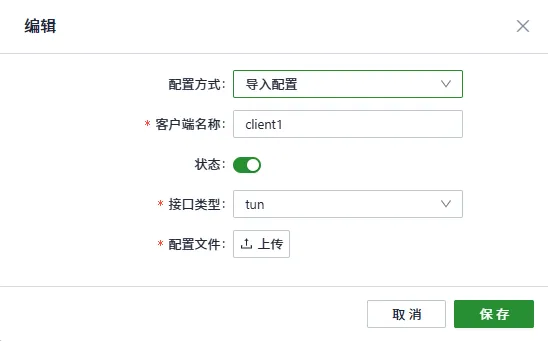</p>

<p align="center"><strong>图 4-30 OpenVPN客户端导入配置</strong></p>

| 参数 | 说明 |
|------|------|
| 客户端名称 | 唯一标识客户端配置的字符串 |
| 状态 | 开启或关闭 |
| 接口类型 | 目前只支持tun模式 |
| 配置文件 | 导入OpenVPN Client配置文件，需包含CA证书、客户端证书和客户端密钥等信息 |

#### 4.2.3 系统管理

##### 4.2.3.1 基础配置

**云管理**

<p align="center"></p>

<p align="center"><strong>图 4-31 云管理配置</strong></p>

| 参数 | 说明 |
|------|------|
| 启动云服务 | 对接DeviceLive平台的使能开关。DeviceLive是映翰通设备的远程监控和管理平台 |
| 云服务器 | DeviceLive平台地址选择，支持国内平台和海外平台 |

**时区和NTP Client**

<p align="center"></p>

<p align="center"><strong>图 4-32 时区和NTP配置</strong></p>

最多可配置10个NTP Server地址，程序周期性依次向每个服务器地址发送同步请求，同步成功后将系统时间写入RTC，并不再继续向后面的NTP服务器发送同步请求。

除使用NTP同步时间外，在【状态】→【设备信息】页面有一个同步按钮可手动同步时间。仅当设备时间与本地时间（访问设备所使用的电脑的时间）相差超过3秒时，才会显示该同步按钮。

<p align="center">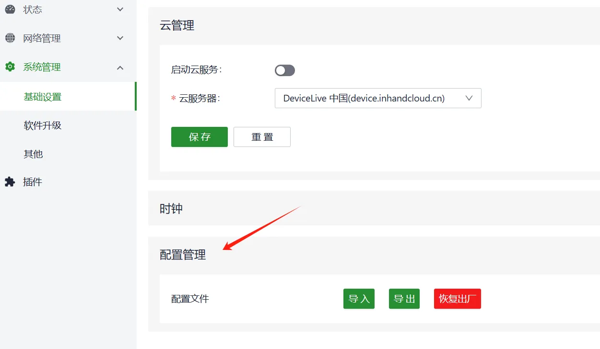</p>

<p align="center"><strong>图 4-33 手动同步时间</strong></p>

该页面同时支持配置的导入、导出以及恢复出厂功能。

##### 4.2.3.2 固件升级

<p align="center">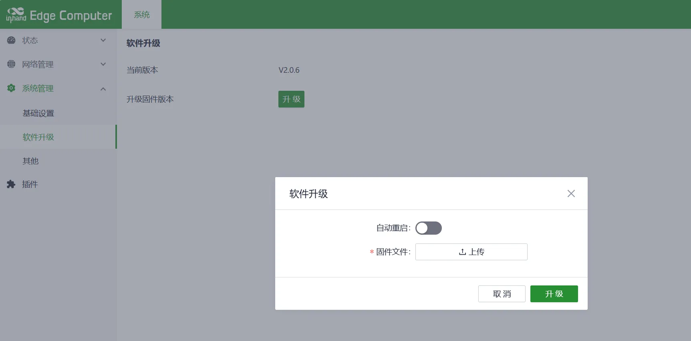</p>

<p align="center"><strong>图 4-34 固件升级</strong></p>

自动重启选项默认关闭，升级固件后需手动重启系统才能生效；开启自动重启选项后，升级成功会自动重启系统。

##### 4.2.3.3 其他

<p align="center"></p>

<p align="center"><strong>图 4-35 重启与重置</strong></p>

该页面包含重启系统和重置系统两个功能。重置系统需慎重使用，该功能会将系统的配置状态和文件系统状态恢复到出厂时一致，用户安装的软件也会被清除。

#### 4.2.4 状态

##### 4.2.4.1 设备信息

设备信息状态页面显示主机名、设备型号、序列号、固件版本、内核版本、文件系统版本以及CPU、内存和磁盘空间的使用概况。

<p align="center"></p>

<p align="center"><strong>图 4-36 设备信息</strong></p>

##### 4.2.4.2 蜂窝拨号状态

蜂窝拨号状态页面显示当前拨号使用的SIM卡、IMEI、IMSI、ICCID、信号强度以及拨号获取的IP地址、DNS等信息。

<p align="center">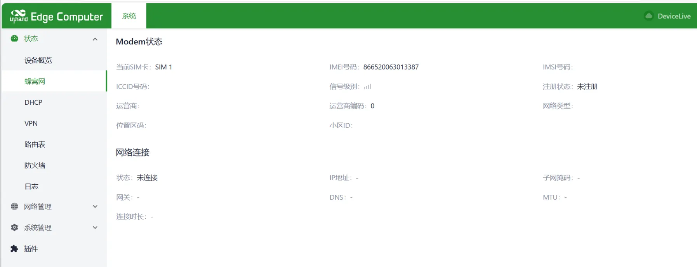</p>

<p align="center"><strong>图 4-37 蜂窝拨号状态</strong></p>

##### 4.2.4.3 Wi-Fi状态

Wi-Fi状态页面显示Wi-Fi连接成功后获取的IP地址、网关以及DNS等信息。

<p align="center"></p>

<p align="center"><strong>图 4-38 Wi-Fi Station状态</strong></p>

##### 4.2.4.4 DHCP Server状态

DHCP Server状态页面显示设备作为DHCP Server分配出去的IP地址、客户端主机名、客户端主机MAC以及过期时间。

<p align="center"></p>

<p align="center"><strong>图 4-39 DHCP Server状态</strong></p>

##### 4.2.4.5 路由状态

路由状态页面显示IPv4直连路由、静态路由以及路由邻居等信息。

<p align="center"></p>

<p align="center"><strong>图 4-40 路由状态</strong></p>

##### 4.2.4.6 防火墙状态

防火墙状态信息显示过滤规则、IP地址映射规则等信息。

<p align="center"></p>

<p align="center"><strong>图 4-41 防火墙状态</strong></p>

##### 4.2.4.7 日志信息

日志页面可查看系统日志、用户日志以及设置查看的日志等级（包括Error、Info、Debug等级别）。日志也可下载到本地。

<p align="center"></p>

<p align="center"><strong>图 4-42 日志信息</strong></p>

##### 4.2.4.8 OpenVPN状态

**OpenVPN服务器状态**

OpenVPN服务器状态页面可查看状态更新时间、已连接的OpenVPN客户端等信息。

<p align="center">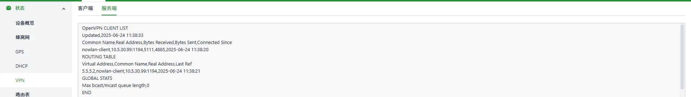</p>

<p align="center"><strong>图 4-43 OpenVPN服务器状态</strong></p>

**OpenVPN客户端状态**

OpenVPN客户端状态页面可查看客户端获取的虚IP地址以及隧道连接时长等信息。

<p align="center">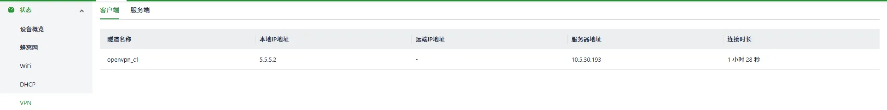</p>

<p align="center"><strong>图 4-44 OpenVPN客户端状态</strong></p>

### 4.3 基于Linux命令行管理

使用Linux命令行进行网络配置和系统配置时，需先关闭IEOS程序。IEOS通过systemctl管理：

```
systemctl stop ieos_daemon
```

该关闭仅针对本次启动生效，系统重启后IEOS依然会启动。禁止IEOS开机启动：

```
systemctl disable ieos_daemon
```

> **重要说明**：关闭IEOS后，拨号、Wi-Fi等无线联网功能需基于Linux原生命令实现，且无法对接DeviceLive平台进行远程管理。

#### 4.3.1 网络管理

##### 4.3.1.1 设置一个静态IP地址

通过修改 `/etc/network/interfaces.d/eth1` 或 `/etc/network/interfaces.d/eth2` 配置文件设置以太网接口参数：

<p align="center"></p>

<p align="center"><strong>图 4-45 静态IP配置（命令行）</strong></p>

修改接口IP配置后，执行以下命令重启网络服务使配置生效：
```
sudo /etc/init.d/networking restart
```

##### 4.3.1.2 设置一个动态IP地址

修改对应接口配置文件，将 `inet` 后设置为 `dhcp`：

<p align="center"></p>

<p align="center"><strong>图 4-46 DHCP配置（命令行）</strong></p>

修改后执行以下命令使配置生效：
```
sudo /etc/init.d/networking restart
```

#### 4.3.2 系统管理

##### 4.3.2.1 查询固件版本

```
sudo showver
```

<p align="center"></p>

<p align="center"><strong>图 4-47 查询固件版本</strong></p>

加上 `-a` 选项可查看完整版本信息：

<p align="center">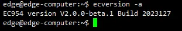</p>

<p align="center"><strong>图 4-48 查询完整版本信息</strong></p>

##### 4.3.2.2 查看可用磁盘空间

使用 `df -h` 命令查看磁盘空间。EC954用户可用的磁盘分区为 `/dev/mmcblk0p8`。

<p align="center"></p>

<p align="center"><strong>图 4-49 查看可用磁盘空间</strong></p>

##### 4.3.2.3 查询产品型号信息

使用 `devinfo` 工具查看产品型号信息：

<p align="center">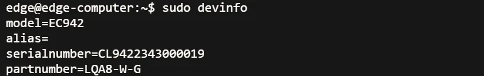</p>

<p align="center"><strong>图 4-50 查询产品型号信息</strong></p>

##### 4.3.2.4 调整时间

EC954有两个时间设置：系统时间和RTC（实时时钟）时间。

使用 `date` 命令查询或设置系统时间：
```
date MMDDhhmmYYYY
```

<p align="center"></p>

<p align="center"><strong>图 4-51 设置系统时间</strong></p>

将RTC时间设置为系统时间：
```
sudo hwclock --systohc
```

<p align="center"></p>

<p align="center"><strong>图 4-52 同步RTC时间</strong></p>

##### 4.3.2.5 设置时区

本地时区可通过交互命令配置，或直接维护 `/etc/localtime` 与时区数据库文件。

##### 4.3.2.6 使用 tzselect 命令

输入 `tzselect` 后选择大致区域（按大洲大洋划分）：

<p align="center"></p>

<p align="center"><strong>图 4-53 tzselect选择区域</strong></p>

再选择该大洲或大洋下的国家：

<p align="center"></p>

<p align="center"><strong>图 4-54 tzselect选择国家</strong></p>

获取到时区关键字后，执行以下命令设置时区（以中国时区为例）：

<p align="center"></p>

<p align="center"><strong>图 4-55 设置时区</strong></p>

##### 4.3.2.7 使用 localtime 文件

本地时区存储在 `/etc/localtime` 中。该文件可以是 `/usr/share/zoneinfo/` 下对应文件的副本或符号链接。若EC954无法找到 `/usr/share/zoneinfo/` 文件，可从 [IANA Time Zone Database](https://www.iana.org/time-zones) 下载所需时区信息文件，在设备中重新链接到本地时间文件。

> **注意**：成功下载所需时区信息文件后，进行解压，之后使用 `zic` 命令编译生成对应的二进制文件，生成的时区文件为 `/usr/share/zoneinfo/自定义时区文件名`。

### 4.4 外设接口高级配置

#### 4.4.1 串口

EC954共有12个串口。前4个串口（P1～P4）支持RS-232、RS-422和RS-485多种串口模式，默认模式为RS-485，使用 `ih_uart_ctl` 命令可切换串口模式。后8个串口（P5～P12）固定为RS-485模式。

对应设备节点：
- P1：`/dev/ttyCOM1`
- P2：`/dev/ttyCOM2`
- P3：`/dev/ttyCOM3`
- P4：`/dev/ttyCOM4`

<p align="center"></p>

<p align="center"><strong>图 4-56 ih_uart_ctl命令</strong></p>

**全功能串口（P1～P4）引脚定义**

| 引脚号 | RS-232 | RS-422 | RS-485 |
|--------|--------|--------|--------|
| 1 | DSR | - | - |
| 3 | RTS | TXD+ | - |
| 5 | TXD | TXD- | - |
| 7 | RXD | RXD+ | Data+ |
| 9 | DCD | RXD- | Data- |
| 11 | CTS | - | - |
| 13 | DTR | - | - |
| 15 | GND | GND | GND |

P2～P4引脚定义与P1类似，引脚号依次递增（P2从17开始，P3从2开始，P4从18开始），各模式功能定义相同。详见原产品规格书。

**RS-485串口（P5～P12）引脚定义**

每个RS-485串口使用3个引脚：Data+、Data-、GND。

**更改串口设置**

使用 `stty` 命令查看和设置串口参数：

<p align="center">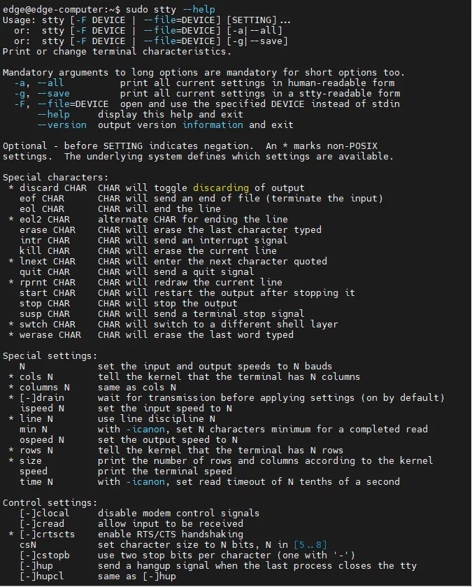</p>

<p align="center"><strong>图 4-57 stty命令帮助（1）</strong></p>

<p align="center"></p>

<p align="center"><strong>图 4-58 stty命令帮助（2）</strong></p>

<p align="center"></p>

<p align="center"><strong>图 4-59 stty命令帮助（3）</strong></p>

<p align="center"></p>

<p align="center"><strong>图 4-60 stty命令帮助（4）</strong></p>

<p align="center"></p>

<p align="center"><strong>图 4-61 stty命令帮助（5）</strong></p>

**查看串口信息**

<p align="center"></p>

<p align="center"><strong>图 4-62 查看串口信息</strong></p>

**设置串口波特率**

```
sudo stty -F /dev/ttyCOM1 ispeed 9600 ospeed 9600 cs8
sudo stty -F /dev/ttyCOM2 ispeed 9600 ospeed 9600 cs8
sudo stty -F /dev/ttyCOM3 ispeed 9600 ospeed 9600 cs8
sudo stty -F /dev/ttyCOM4 ispeed 9600 ospeed 9600 cs8
```

> **注意**：关于 `stty` 命令的详细信息可参考 [GNU Coreutils Manual](http://www.gnu.org/software/coreutils/manual/coreutils.html)。

#### 4.4.2 USB接口

EC954提供两个USB 2.0 Host接口，主要用于扩展存储设备、接鼠标和键盘。

EC954支持USB存储设备热插拔，会自动挂载所有分区。USB存储设备分区挂载到 `/mnt/` 路径下，挂载文件夹命名格式为 `usb_<node>_<num>`。其中 `<node>` 为分区设备节点名称，`<num>` 为0～9的数字。

<p align="center"></p>

<p align="center"><strong>图 4-63 USB存储挂载</strong></p>

> **注意**：在断开USB大容量存储设备之前，需输入 `sync` 同步命令以防止数据丢失。断开存储设备连接时，需从 `/media/*` 目录下退出。若停留在 `/media/usb*` 中，自动卸载过程将会失败。若发生这种情况，可输入 `umount /media/usb*` 手动卸载设备。

#### 4.4.3 Micro SD卡

Micro SD卡分区需格式化为FAT32格式。

- SD卡容量 ≤ 32GB：可在Windows系统下直接格式化为FAT32；也可在Linux系统下格式化。
- SD卡容量 > 32GB：需在Linux下格式化为FAT32。

Linux下格式化步骤：
1. 执行 `fdisk -l` 查看SD卡对应的设备节点（示例中为 `/dev/sda`）。
2. 执行 `fdisk /dev/sda` 进行分区（`p` 查看当前分区，`d` 删除已有分区，`n` 创建新分区，`w` 保存更改），创建分区如 `/dev/sda1`。
3. 执行 `sudo mkfs.vfat -F 32 /dev/sda1` 将分区格式化为FAT32。
4. 格式化完成后，在设备断电的情况下将SD卡插入设备。

EC954支持micro SD存储卡但不支持热插拔。设备会自动挂载所有分区到 `/mnt/` 路径下，挂载文件夹命名格式为 `sd_<node>_<num>`。

<p align="center"></p>

<p align="center"><strong>图 4-64 Micro SD卡挂载</strong></p>

#### 4.4.4 mSATA硬盘

1. 登录系统，执行 `sudo fdisk -l`，查找硬盘分区（如 `/dev/sda1`）。

<p align="center"></p>

<p align="center"><strong>图 4-65 fdisk查看分区</strong></p>

2. 将分区格式化为所需文件系统（如ext4）：

<p align="center"></p>

<p align="center"><strong>图 4-66 格式化分区</strong></p>

3. 创建挂载点（如 `/mnt/sda1`）。
4. 编辑 `/etc/fstab` 文件，在末尾添加：
   ```
   /dev/sda1 /mnt/sda1 ext4 defaults,nofail,x-systemd.device-timeout=1s 0 0
   ```
   - `/dev/sda1`：设备分区，需根据实际情况配置
   - `/mnt/sda1`：挂载点，需根据实际情况配置
   - `ext4`：文件系统格式，需根据实际情况配置
   - `defaults,nofail,x-systemd.device-timeout=1s 0 0`：固定配置，推荐使用该配置

<p align="center"></p>

<p align="center"><strong>图 4-67 fstab配置</strong></p>

#### 4.4.5 CAN总线接口

EC954的CAN端口支持两个CAN总线，CAN1对应设备 `can0`，CAN2对应设备 `can1`。

**配置CAN1接口**

默认情况下CAN端口将被初始化。使用 `ip link` 命令检查CAN设备状态：

<p align="center">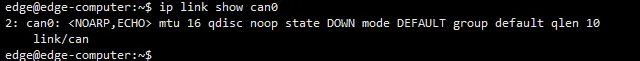</p>

<p align="center"><strong>图 4-68 CAN1设备状态</strong></p>

配置CAN设备：
```
sudo ip link set can0 down
sudo ip link set can0 type can bitrate 125000
sudo ip link set can0 up
```

**配置CAN2接口**

检查CAN2设备状态：

<p align="center"></p>

<p align="center"><strong>图 4-69 CAN2设备状态</strong></p>

配置CAN2设备（CAN FD模式示例）：
```
sudo ip link set can1 down
sudo ip link set can1 type can bitrate 125000 dbitrate 1250000 fd on
sudo ip link set can1 up
```

#### 4.4.6 IO接口

EC954支持4路DI和4路DO。使用 `dio_mgmt` 命令控制IO的输入输出。

<p align="center">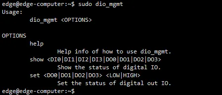</p>

<p align="center"><strong>图 4-70 dio_mgmt命令用法</strong></p>

设置IO口电平：
```
dio_mgmt set DIO<number> <HIGH/LOW>
```

<p align="center"></p>

<p align="center"><strong>图 4-71 设置IO电平</strong></p>

读取IO口电平：
```
dio_mgmt show DIO<number>
```

#### 4.4.7 GPS

EC954部分型号内部集成GPS模块，数据串口节点为 `/dev/ttyS9`。

查看GPS详细信息有两种方式：

1. 使用 `stty` 设置串口节点后，通过 `cat` 直接输出原始数据：

<p align="center"></p>

<p align="center"><strong>图 4-72 GPS原始数据输出</strong></p>

2. 使用 `gnss` 命令直接输出解析后的时间、经纬度等信息：

<p align="center"></p>

<p align="center"><strong>图 4-73 gnss解析数据输出</strong></p>

#### 4.4.8 开关机按键

**关闭设备**

1. 通过长按开关机按键8秒进行关机。
2. 或使用Linux命令关闭设备上运行的所有软件并停止系统：

<p align="center"></p>

<p align="center"><strong>图 4-74 关机命令</strong></p>

> **注意**：运行 `poweroff` 命令后，CPU、RAM和存储设备等主要组件将掉电。

**启动设备**

短按开关机键，系统执行开机操作。

### 4.5 安全功能

#### 4.5.1 sudo机制

在EC954中，为获得更好的安全性，root用户被禁止使用。Sudo是一个让系统管理员允许被授权用户作为root用户或其他用户执行命令的程序。最基础的准则是给予尽可能少的特权完成工作。

使用sudo比使用root身份更安全：
- 无需知道root密码（sudo会提示当前用户的密码），可授予普通用户特权
- 通过sudo运行需要特权的命令，其余时间作为无特权用户工作，降低错误操作可能造成的损害
- 有些系统级命令不能直接对用户使用

<p align="center"></p>

<p align="center"><strong>图 4-75 sudo命令示例</strong></p>

#### 4.5.2 防火墙

Netfilter/iptables是Linux系统自带的基于包过滤的防火墙工具，功能强大且使用灵活，可对流入、流出及流经服务器的数据包进行精细控制。

#### 4.5.3 TPM2.0

TPM（Trusted Platform Module，可信平台模块）是一种硬件安全模块，旨在提供计算机系统的安全和加密功能。它是一个安全微控制器，包含加密协处理器，用于存储加密密钥、数字证书和其他安全数据，支持多种加密算法和安全协议。EC954已集成标准的TPM2.0协议栈和TPM2.0工具供用户使用。

### 4.6 编程指南

EC954提供了一个JSON格式的设备信息描述文件，需要操作IO、LED、串口等外设的用户，可通过查询设备描述信息文件获取这些外设的设备节点信息。

设备描述信息文件路径：`/tmp/ieos/etc/system_info.json`

#### 4.6.1 IO编程

设备上共8个IO接口：DI0～DI3为4个输入管脚，DO0～DO3为4个输出管脚。

根据设备描述信息文件可获取IO设备节点：
- DI0～DI3：`/sys/class/gpio/gpio487`～`/sys/class/gpio/gpio490`
- DO0～DO3：`/sys/class/gpio/gpio491`～`/sys/class/gpio/gpio494`

对IO接口编程时，直接操作后台设备节点下面的value值即可（`/sys/class/gpio/gpioxxx/value`）。

DO0输出高电平：
```shell
echo 1 > /sys/class/gpio/gpio491/value
```

查看DI0电平：
```shell
cat /sys/class/gpio/gpio487/value
```

完整shell脚本示例：
```shell
#!/bin/bash

gpio491="/sys/class/gpio/gpio491/value"
gpio492="/sys/class/gpio/gpio492/value"
gpio493="/sys/class/gpio/gpio493/value"
gpio494="/sys/class/gpio/gpio494/value"

if [ -f "$gpio491" ]; then
   echo 1 > /sys/class/gpio/gpio491/value
else
   echo "no file exit "$gpio491
fi

if [ -f "$gpio492" ]; then
   echo 0 > $gpio492
else
   echo "no file exit "$gpio492
fi

gpio487="/sys/class/gpio/gpio487/value"
gpio488="/sys/class/gpio/gpio488/value"
gpio489="/sys/class/gpio/gpio489/value"
gpio490="/sys/class/gpio/gpio490/value"

if [ -f "$gpio487" ]; then
   cat $gpio487
else
   echo "no file exit "$gpio487
fi
```

#### 4.6.2 LED编程

设备上用户可使用USER1和USER2两个灯进行状态提示。

根据设备描述信息文件可获取LED设备节点：
- USER1：`/sys/class/leds/user1`
- USER2：`/sys/class/leds/user2`

控制文件说明：
- `brightness`：控制LED亮或灭。写入1为常亮，写入0为常灭
- `trigger`：LED触发器。写入 `timer` 表示定时器触发，写入 `none` 表示取消触发器
- `delay_on`：LED亮的时间，单位为ms
- `delay_off`：LED灭的时间，单位为ms

若配置trigger为定时触发，brightness中的值将不再生效，会自动变为0。

USER1常亮：
```shell
echo 1 > /sys/class/leds/user1/brightness
```

USER1闪烁（1秒周期）：
```shell
echo timer > /sys/class/leds/user1/trigger
echo 1000 > /sys/class/leds/user1/delay_on
echo 1000 > /sys/class/leds/user1/delay_off
```

#### 4.6.3 交叉编译

用户自己的C/C++程序可通过在开发机器上使用交叉编译工具链进行交叉编译，然后将目标文件上传到EC954设备上执行。

交叉编译工具压缩包：`gcc-linaro-6.3.1-2017.05-x86_64_aarch64-linux-gnu.tar.gz`

配置环境变量方法：
1. 在开发机上将交叉编译工具链解压到 `/opt` 路径下（也可解压到其他路径，步骤2中做相应调整）。
2. 编辑 `~/.bashrc` 文件，在文件最后添加一行：
   ```
   PATH=$PATH:/opt/gcc-linaro-6.3.1-2017.05-x86_64_aarch64-linux-gnu/bin
   ```
3. 执行 `source ~/.bashrc` 使环境变量在当前终端生效；新打开的终端自动生效。

以经典的hello world程序为例：

`~/example/hello.c`：
```c
#include <stdio.h>

int main(void)
{
    printf("hello, world!\n");
    return 0;
}
```

`~/example/Makefile`：
```makefile
TARGET  := hellworld
DIRS    := $(shell find . -maxdepth 3 -type d)
SRCS    := $(foreach dir,$(DIRS),$(wildcard $(dir)/*.c))
OBJS    := $(SRCS:.c=.o)

CC=aarch64-linux-gnu-gcc
CFLAGS  := -Wall -Wextra -g -Wno-unused-parameter

all: $(TARGET)

$(TARGET): $(OBJS)
	$(CC) $(CFLAGS) $(LIBS) $^ -o $@

%.o: %.c
	$(CC) $(CFLAGS) $(LIBS) -c $< -o $@

clean:
	rm -f $(TARGET) $(OBJS)

.PHONY: all clean
```

在 `~/example` 目录下执行 `make`，生成目标文件。

#### 4.6.4 AI算力卡

EC954部分型号内置了Hailo-8算力模组，系统预装了版本号为4.16.0的驱动和软件包，用户可参考Hailo官网文档进行开发：[https://hailo.ai/developer-zone](https://hailo.ai/developer-zone)

#### 4.6.5 编译内核模块

**在设备上直接编译**

1. 使用 `sudo -s` 切换到root用户
2. 安装编译环境：
   ```
   apt-get update
   apt-get install -y build-essential
   ln -s /usr/bin/python3 /usr/bin/python
   ```
3. 创建 `hello.c`：
   ```c
   #include <linux/module.h>
   #include <linux/kernel.h>
   
   int init_module(void) {
       printk(KERN_INFO "Hello, world - this is the kernel speaking\n");
       return 0;
   }
   
   void cleanup_module(void) {
       printk(KERN_INFO "Goodbye, world - leaving the kernel\n");
   }
   
   MODULE_LICENSE("GPL");
   ```
4. 创建 `Makefile`：
   ```makefile
   obj-m += hello.o
   
   all:
    make -C /lib/modules/$(shell uname -r)/build M=$(PWD) modules
   
   clean:
    make -C /lib/modules/$(shell uname -r)/build M=$(PWD) clean
   ```
5. 执行 `make` 编译模块，生成 `hello.ko`
6. 执行 `insmod hello.ko` 安装模块

**交叉编译**

1. 安装编译环境：
   - 已测试系统：Ubuntu 22.04
   - 解压交叉编译工具链：`tar -xf gcc-arm-10.3-2021.07-x86_64-aarch64-none-linux-gnu.tar.gz -C /opt/`
   - 创建目录：`mkdir linux-headers`
   - 解压内核编译环境：`tar -xf linux-headers.tar -C linux-headers`
2. 创建 `hello.c`（同上）
3. 创建 `Makefile`：
   ```makefile
   obj-m += hello.o
   
   all:
    make -C linux-headers M=$(PWD) CROSS_COMPILE=/opt/gcc-arm-10.3-2021.07-x86_64-aarch64-none-linux-gnu/bin/aarch64-none-linux-gnu- ARCH=arm64 modules
   
   clean:
    make -C linux-headers M=$(PWD) CROSS_COMPILE=/opt/gcc-arm-10.3-2021.07-x86_64-aarch64-none-linux-gnu/bin/aarch64-none-linux-gnu- ARCH=arm64 clean
   ```
4. 执行 `make` 编译模块，生成 `hello.ko`，将此文件传输到设备中安装

### 4.7 系统升级

#### 4.7.1 离线系统升级（U盘/SD卡）

准备一个U盘或Micro SD卡。若该存储设备有多个分区，请使用第一个分区。建议不做多个分区。U盘/SD卡分区需格式化为FAT32格式。以下以升级 `EC954-V2.0.0.img` 为例说明。

1. 在U盘（SD卡）根目录下创建空的 `ec900_img` 目录，将固件镜像文件和 `md5.txt` 文件放入该目录。
2. 确认 `md5.txt` 文件中仅有该镜像文件一行的MD5哈希值。EC954不支持多个img镜像同时OTA升级。
3. 在电脑上正常退出U盘（SD卡），不要直接拔插。
4. 将U盘（SD卡）插入目标EC954设备。设备自动校验镜像文件并进行OTA升级。升级过程中WARN和ERR灯会有相应显示。WARN和ERR灯恢复正常后，升级完成。
5. 升级结束后，EC954会把升级中的关键信息写入 `ec900_img` 目录下的日志文件。

---

## 第5章 典型应用

### 案例1：工业远程数据采集与上云

**场景描述**

在工业现场，EC954作为边缘网关，通过串口或CAN总线连接PLC、传感器等现场设备，采集生产数据并进行边缘计算处理，再通过蜂窝网络或以太网上传至DeviceLive云平台，实现远程监控和设备管理。

**设备角色**

EC954作为边缘计算网关，负责现场设备数据采集、协议转换、边缘预处理及数据上云。

**配置步骤**

1. 完成EC954硬件安装，连接蜂窝天线和以太网线。
2. 将PLC/传感器通过串口或CAN总线连接到EC954对应接口。
3. 登录IEOS Web管理界面，配置以太网接口或蜂窝网络，确保设备可访问互联网。
4. 进入【系统管理】→【基础配置】→【云管理】，开启云服务并选择对应DeviceLive平台地址。
5. 在设备上部署DeviceSupervisor Agent应用程序，配置数据采集点和上报策略。
6. 登录DeviceLive平台，查看设备在线状态、采集数据及远程下发指令。

**参考章节**

- [安装与首次使用](#第2章-安装与首次使用)
- [场景3：蜂窝网络拨号配置](#场景3蜂窝网络拨号配置)
- [场景4：Wi-Fi Station配置](#场景4wi-fi-station配置)
- [4.4.1 串口](#441-串口)
- [4.4.5 CAN总线接口](#445-can总线接口)
- [4.2.3.1 云管理](#4231-基础配置)

### 案例2：远程安全访问组网

**场景描述**

企业分支机构的EC954通过OpenVPN与总部OpenVPN服务器建立加密隧道，实现分支机构与总部之间的安全数据传输和远程管理。同时，利用EC954的防火墙功能对进出流量进行精细化控制，保障网络安全。

**设备角色**

EC954作为OpenVPN客户端，通过蜂窝或以太网接入互联网，与总部OpenVPN服务器建立VPN隧道；同时作为分支机构的边缘路由器，为下挂设备提供网络接入和安全防护。

**配置步骤**

1. 完成EC954硬件安装和网络接入配置（蜂窝或以太网）。
2. 进入IEOS Web管理界面，选择【网络管理】→【OpenVPN】。
3. 配置OpenVPN客户端：
   - 设置客户端名称、状态为开启
   - 配置OpenVPN服务器地址（格式：`IP 端口 协议`）
   - 导入CA证书、客户端公钥证书、客户端私钥证书
4. 在高级设置中配置加密算法、哈希算法、密钥保持和隧道保持等参数。
5. 点击"保存"启动OpenVPN客户端。
6. 进入【网络管理】→【防火墙】，配置区域规则、通信规则和端口转发策略。
7. 进入【状态】→【OpenVPN客户端状态】查看隧道连接状态，确认虚IP地址和连接时长。

**参考章节**

- [场景3：蜂窝网络拨号配置](#场景3蜂窝网络拨号配置)
- [场景5：OpenVPN配置](#场景5openvpn配置)
- [4.2.2.5 防火墙](#4225-防火墙)
- [4.2.4.8 OpenVPN状态](#4248-openvpn状态)

---

## 附录A 故障处理

### 1 网络连接问题

| 现象 | 可能原因 | 排查步骤 | 对应章节 |
|------|----------|----------|----------|
| 无法连接蜂窝网络 | SIM卡未插入或接触不良 | 1. 检查SIM卡是否正确插入<br>2. 重新插拔SIM卡 | [SIM卡安装](#2224-sim卡安装) |
| 无法连接蜂窝网络 | APN参数配置错误 | 1. 核对APN参数是否正确<br>2. 联系运营商获取正确APN | [蜂窝网络配置](#场景3蜂窝网络拨号配置) |
| 无法连接蜂窝网络 | 信号弱或无信号 | 1. 检查天线是否连接<br>2. 调整设备位置 | [天线安装](#2223-天线安装) |
| 无法连接蜂窝网络 | 蜂窝功能未启用 | 1. 进入IEOS【网络管理】→【蜂窝】<br>2. 确认"启用蜂窝网络"已开启 | [蜂窝拨号](#4222-蜂窝拨号) |
| Wi-Fi无法连接 | SSID或密码错误 | 1. 核对SSID和密码<br>2. 确认认证加密方式匹配 | [Wi-Fi Station配置](#场景4wi-fi-station配置) |
| Wi-Fi无法连接 | 信号强度不足 | 1. 检查设备与AP之间的距离<br>2. 移除遮挡物 | [Wi-Fi Station配置](#场景4wi-fi-station配置) |
| 以太网无法通信 | IP地址配置错误 | 1. 确认电脑与设备在同一网段<br>2. 检查IP地址、子网掩码和网关 | [以太网配置](#场景2以太网口网络配置) |
| 以太网无法通信 | 网线连接异常 | 1. 检查网线是否插紧<br>2. 更换网线测试 | [网口连接](#2228-首次访问设备) |

### 2 Web访问问题

| 现象 | 可能原因 | 排查步骤 | 对应章节 |
|------|----------|----------|----------|
| 无法打开Web界面 | IP地址错误 | 1. 确认电脑与设备在同一网段<br>2. 检查设备默认IP | [首次访问Web](#2228-首次访问设备) |
| 无法打开Web界面 | 浏览器兼容性问题 | 1. 更换浏览器（推荐Chrome）<br>2. 清除浏览器缓存 | [首次访问Web](#2228-首次访问设备) |
| 无法打开Web界面 | 端口号错误 | 1. 确认使用HTTPS协议<br>2. 确认端口号为9100 | [登录Web](#421-登录web) |
| 无法打开Web界面 | 该型号不支持Web管理 | 1. 查看产品规格书"订购信息"<br>2. 确认型号是否支持IEOS | [默认设置](#16-默认设置) |
| Web登录失败 | 账号密码错误 | 1. 确认使用正确的账号密码<br>2. 尝试恢复出厂设置 | [首次访问Web](#2228-首次访问设备) |

### 3 SSH连接问题

| 现象 | 可能原因 | 排查步骤 | 对应章节 |
|------|----------|----------|----------|
| SSH连接失败 | IP地址不在同一网段 | 1. 确认电脑IP与设备接口同网段<br>2. 检查子网掩码配置 | [首次访问设备](#2228-首次访问设备) |
| SSH连接失败 | 用户名密码错误 | 1. 确认用户名edge和密码security@edge<br>2. 检查是否修改过密码 | [默认设置](#16-默认设置) |
| SSH连接失败 | 防火墙阻断 | 1. 检查电脑防火墙设置<br>2. 检查设备防火墙入站规则 | [防火墙](#4225-防火墙) |

### 4 系统问题

| 现象 | 可能原因 | 排查步骤 | 对应章节 |
|------|----------|----------|----------|
| 系统无法启动 | 电源异常 | 1. 检查电源适配器和电压<br>2. 检查DC端子连接 | [电源连接](#2227-电源连接) |
| 系统无法启动 | 文件系统损坏 | 1. 尝试恢复出厂设置<br>2. 联系技术支持 | [恢复出厂设置](#15-恢复出厂设置) |
| 升级失败 | U盘格式不正确 | 1. 确认U盘为FAT32格式<br>2. 确认使用第一个分区 | [离线系统升级](#472-系统升级) |
| 升级失败 | md5校验失败 | 1. 确认md5.txt内容正确<br>2. 重新下载固件镜像 | [离线系统升级](#472-系统升级) |
| 指示灯异常 | 系统启动失败 | 1. 观察STAT灯状态<br>2. 尝试恢复出厂设置 | [指示灯说明](#14-指示灯说明) |

---

## 附录B 安全注意事项

1. 设备应在规定的温度和湿度范围内使用（工作温度-20℃～70℃，环境湿度5%～95%无凝露）。
2. 请勿在易燃易爆环境中使用本设备。
3. 电源连接前请确认电压符合设备规格要求（12～48VDC）。
4. SIM卡和Micro SD卡不支持热插拔，插拔前必须断电。
5. 恢复出厂设置过程中，当WARN和ERR灯闪烁、STAT灯熄灭时，不能对设备断电，否则可能导致文件丢失。
6. 在断开USB大容量存储设备前，需执行 `sync` 命令同步数据，防止数据丢失。
7. 出于安全考虑，建议创建新的用户账户后禁用默认的edge账户。
8. 非专业人员请勿随意修改系统核心配置文件。

> **警告**：非专业人员请勿打开设备外壳，存在触电风险。

---

## 附录C 命令行参考

### 1 常用命令

| 命令 | 功能 | 示例 |
|------|------|------|
| `sudo -s` | 切换到root用户 | `sudo -s` |
| `showver` | 查询固件版本 | `sudo showver` / `sudo showver -a` |
| `devinfo` | 查询产品型号信息 | `sudo devinfo` |
| `df -h` | 查看磁盘空间 | `sudo df -h` |
| `date` | 查询/设置系统时间 | `sudo date MMDDhhmmYYYY` |
| `hwclock` | 查询/设置RTC时间 | `sudo hwclock --systohc` |
| `tzselect` | 交互式选择时区 | `sudo tzselect` |
| `ip link` | 查看/配置网络接口 | `sudo ip link show can0` |
| `stty` | 查看/设置串口参数 | `sudo stty -F /dev/ttyCOM1` |
| `ih_uart_ctl` | 切换串口模式 | `sudo ih_uart_ctl` |
| `dio_mgmt` | 控制数字量IO | `sudo dio_mgmt show DIO0` |
| `gnss` | 查看GPS解析信息 | `sudo gnss` |
| `factory_reset` | 恢复出厂设置 | `sudo factory_reset` |
| `poweroff` | 关机 | `sudo poweroff` |
| `systemctl` | 管理系统服务 | `sudo systemctl stop ieos_daemon` |
| `useradd` | 创建用户 | `sudo useradd -m -s /bin/bash -G sudo test1` |
| `userdel` | 删除用户 | `sudo userdel test1` |
| `passwd` | 修改/锁定密码 | `sudo passwd -l edge` |

### 2 使用示例

**示例1：查看网络接口状态**

```
# ip link show eth1
2: eth1: <BROADCAST,MULTICAST,UP,LOWER_UP> mtu 1500 qdisc pfifo_fast state UP mode DEFAULT group default qlen 1000
    link/ether 00:33:44:11:00:01 brd ff:ff:ff:ff:ff:ff
```

**示例2：查看串口信息**

```
# sudo stty -F /dev/ttyCOM1
speed 9600 baud; line = 0;
-brkint -imaxbel
```

**示例3：设置CAN比特率**

```
# sudo ip link set can0 down
# sudo ip link set can0 type can bitrate 125000
# sudo ip link set can0 up
```

**示例4：查看设备信息**

```
# sudo devinfo
model: EC954
pn: IO-FQ58
sn: EC9540000011111
```

---

## FAQ

### 问题1：EC954与普通工控机有何区别？

1. EC954是一款边缘计算机，搭载ARM Cortex-A55四核处理器，支持多种工业接口（串口、CAN、DI/DO），并内置蜂窝网络、Wi-Fi、GNSS等无线通信能力。
2. EC954预装Debian 11 Linux系统，支持二次开发，同时集成IEOS网络管理系统，提供Web图形化管理界面。
3. EC954支持DeviceLive云管理平台远程管理，具备Secure Boot和TPM2.0安全特性，部分型号内置AI算力模组。
4. 普通工控机通常依赖固定网络连接，无内置无线通信能力，也无统一的远程云管理平台。

### 问题2：4G/5G无法联网？

1. 物理环境：检查SIM卡是否插到正确卡槽，蜂窝天线是否全部安装。
2. APN设置：确保APN配置信息与运营商提供的一致。
3. 检查设备连通性：登录设备本地界面，通过系统自带ICMP工具ping 8.8.8.8测试是否连通。若可连通，检查电脑与路由器的连通性。
4. 判断SIM卡是否正常：取出SIM卡安装在手机中查看是否可以正常联网。
5. 重启：尝试将设备断电，等待数秒后重新连接电源，重试网络连接。
6. 恢复出厂：将设备恢复出厂设置后重新尝试。

### 问题3：如何关闭IEOS使用Linux原生命令管理网络？

1. 登录设备命令行。
2. 执行 `sudo systemctl stop ieos_daemon` 停止IEOS（仅本次生效）。
3. 执行 `sudo systemctl disable ieos_daemon` 禁止IEOS开机启动。
4. 此后可使用Linux原生命令（如修改 `/etc/network/interfaces.d/eth1`）管理网络。
5. 关闭IEOS后，拨号、Wi-Fi等无线联网功能需自行基于Linux命令实现，且无法对接DeviceLive平台。

### 问题4：USB设备无法自动挂载？

1. 确认USB设备格式是否被系统支持（推荐FAT32/exFAT/ext4）。
2. 检查 `/mnt/` 目录下是否已生成 `usb_<node>_<num>` 文件夹。
3. 若未自动挂载，可尝试手动挂载：
   ```
   sudo mount /dev/sda1 /mnt/usb_manual
   ```
4. 断开USB设备前务必执行 `sync` 命令，并从 `/media/*` 目录退出。

### 问题5：串口通信异常？

1. 确认串口模式是否正确（P1～P4需使用 `ih_uart_ctl` 设置为对应模式：RS-232/RS-422/RS-485）。
2. 检查波特率、数据位、停止位、校验位等参数是否与对端设备一致。
3. 使用 `stty` 命令查看当前串口参数：
   ```
   sudo stty -F /dev/ttyCOM1
   ```
4. 确认接线是否正确，参考 [4.4.1 串口](#441-串口) 中的引脚定义表。
