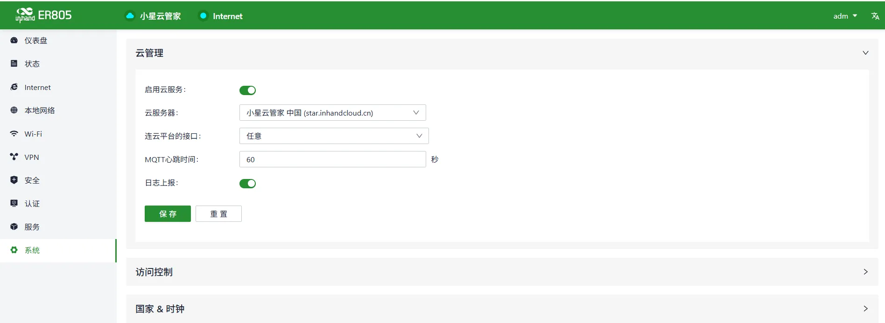
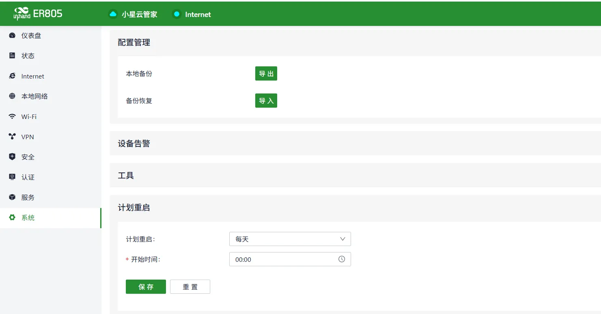
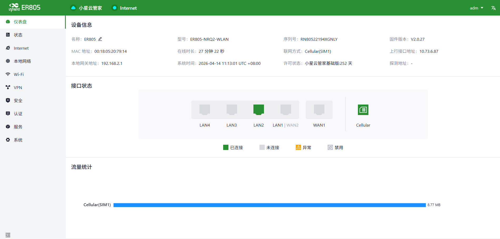

# 配置指导手册

## 一、文档信息

- 文档名称：配置手册
- 产品型号：**ER805**
- 固件版本：**V2.0.1**
- 适用场景：设备联网
- 编写日期：2026年03月25日

## 二、网关概述

### 2.1 产品简介

ER805是一款多功能的边缘接入路由器，支持5G/4G蜂窝和有线宽带接入，配备千兆网口和千兆Wi-Fi，可支持各种数字终端的网络接入，以满足各类商业门店、企业办公的联网需求，确保不间断的数字化门店运营和生产力。ER805多链路切换策略和双SIM设计，可实现多链路备份，确保网络不中断，具有优异的网络性能和高可用性。
方案同时提供小星云管家SaaS平台，帮您实现网络集中配置、设备远程升级、故障远程诊断、终端及应用的一站式动态管理，网络可视化在线洞察，让门店及办公网络尽在掌握。

### 2.2 主要功能

- 4/5G上网
- 远程配置、远程诊断、远程升级
- 宽温工业级设计

### 2.3 典型应用拓扑

移动电子设备 → 以太网 → ER805 → 5G  → 服务器

## 三、硬件说明

### 3.1 外观与接口

- 电源接口：DC 9–36V
- 网口：LAN ×4路+1WAN
- 无线：4/5G
- 指示灯：PWR、网络、WIFI
- 复位键：恢复出厂设置

### 3.2 接线说明

### 3.2.1 电源接线

- 正极：V+
- 负极：V-
- 注意：防反接、防雷、接地

### 3.2.2 以太网接线

直连 / 交叉自适应，建议超五类及以上网线。

## 四、出厂默认参数

- 默认 IP：192.168.10.1
- 子网掩码：255.255.255.0
- Web 用户名：**adm**
- Web 密码：123456

## 五、前期准备

- 电脑设置与网关同网段 IP
- 网线连接电脑与网关 LAN 口
- 路由器上电，等待 RUN 灯常亮
- 浏览器输入设备 IP 进入配置页面

## 六、网络配置

### 6.1 **本地网络配置**

### 6.2 4G 无线网络配置

- 插入 5G SIM 卡
- 开启移动网络
- APN：自动
- 信号强度查看

## 七、开启小星云平台

**配置定时重启**

## 八、配置备份与恢复

- 导出配置文件
- 恢复出厂配置

## 九、状态监控与诊断

### 9.1 运行状态

- 设备在线状态
- 网络流量、信号强度

### 9.2 日志查看

- 系统日志

## 十、常见问题与排查

- 无法打开 Web
  - 检查网段、网线、IP 是否冲突
  - 复位网关重试

## 十一、安全注意事项

- 工业现场可靠接地
- LAN口地址要修改成本地子网的网关
- 配置完成后备份
- 远程密码定期修改
- 禁止非授权人员操作
  