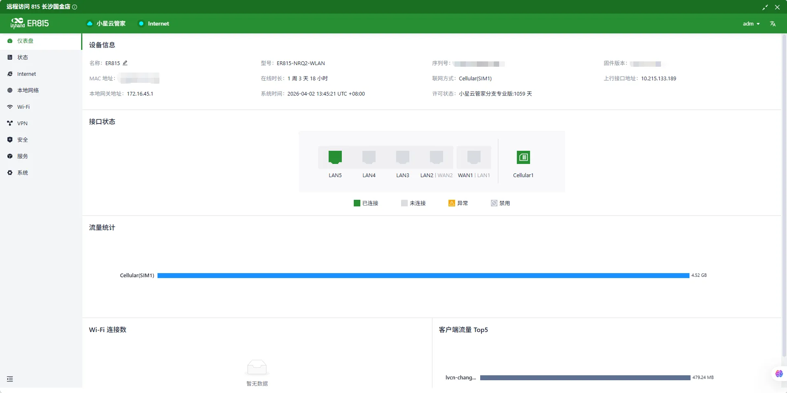
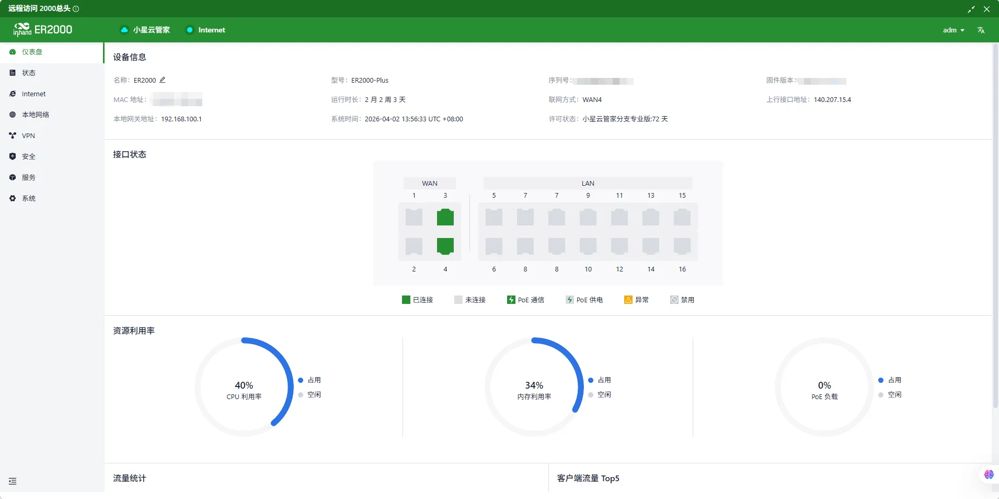
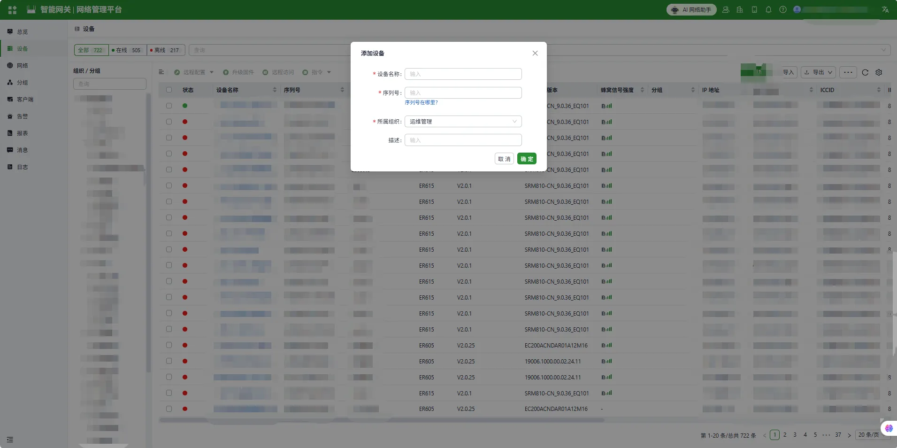
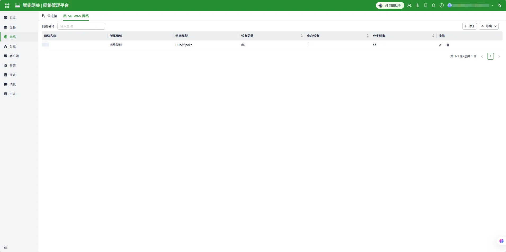
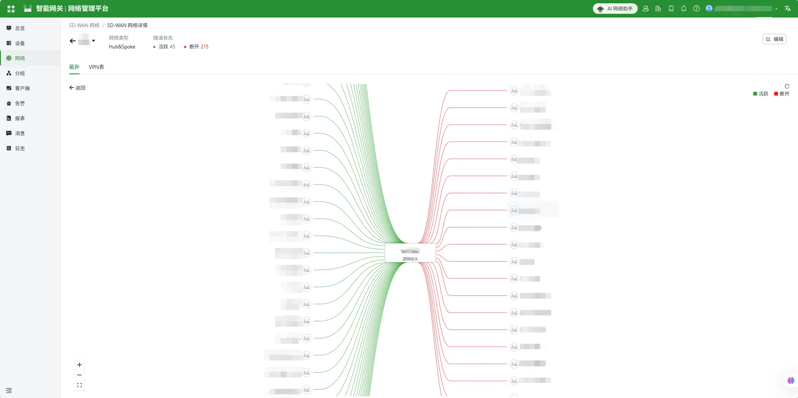

# 企业分支联网配置手册

## 一、文档信息

- **文档名称**：企业分支联网配置手册

- **产品型号**：ER815、ER2000

- **固件版本**：V2.0.2（ER815）、V2.0.4（ER2000）

- **适用场景**：设备联网，SD-WAN组网

- **编写日期**：2026年3月30日

## 二、网关概述

### 2.1 产品简介

在此场景下路由器产品主要用于企业分支联网场景下现场**设备联网**、**分支端与中心端搭建SD-WAN组网**

### 2.2 主要功能

- 为现场设备提供网络

- 分支端与中心端搭建SD-WAN组网

- 远程配置、远程诊断、远程升级

- 宽温工业级设计

### 2.3 典型应用拓扑

## 三、硬件说明

## 3.1 外观与接口

- 电源接口：12V/3A DC（EC815）、100-240V（ER2000）

- 网口：ER815 LAN ×5路（WAN/LAN 可配置×2）、ER2000 WAN:1×10G SFP+, 1×GbE SFP,2×GbE RJ45 (PoE)、LAN：2×10G SFP+, 2×GbE Combo, 8×GbE RJ45(PoE)

- 无线：ER815:4G/5G/Wi-Fi（可选）

- 指示灯：PWR、RUN、NET、信号强度

- 复位键：恢复出厂设置

## 3.2 接线说明

#### 3.2.1 电源接线

- 正极：V+

- 负极：V-

- 注意：防反接、防雷、接地

#### 3.2.2 以太网接线

直连 / 交叉自适应，建议超五类及以上网线。

## 四、出厂默认参数

- 默认 IP：192.168.2.1

- 子网掩码：255.255.255.0

- Web 用户名：adm

- Web 密码：随机密码，需对应设备铭牌

## 五、前期准备

1. 电脑设置与网关同网段 IP

2. 网线连接电脑与网关 LAN 口

3. 网关上电，等待 RUN 灯常亮

4. 浏览器输入网关 IP 进入配置页面

## 六、网络配置

### 6.1 ER815配置

1. 插入 SIM 卡（支持 NB-IoT/4G）

2. 开启移动网络

3. APN：自动 / 手动填写

4. 信号强度查看

   5.设置vlan地址为172.16.45.1/24

   6.配置连接小星云平台

### 6.2 ER2000配置

1.连接有线网络至ER2000 wan1口

2.设置本地vlan地址为192.168.100.1

3.提供至wan口网络需映射至公网（需客户自行提供此项）

4.配置连接小星云平台

## 七、小星云平台配置

搭建SD-WAN网络需要搭配使用Inhand小星云平台，设备需购买平台专业版许可证

1.用户自行注册小星云平台账号

2.添加ER815和ER2000设备

3.添加SD-WAN网络

4.编辑SD-WAN网络

5.连接成功效果如图

## 八、相同配置可导入配置文件

配置文件见config目录
