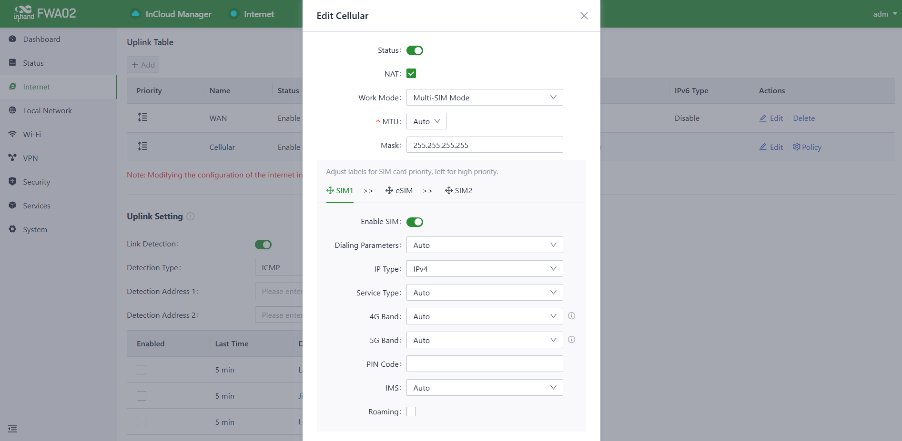
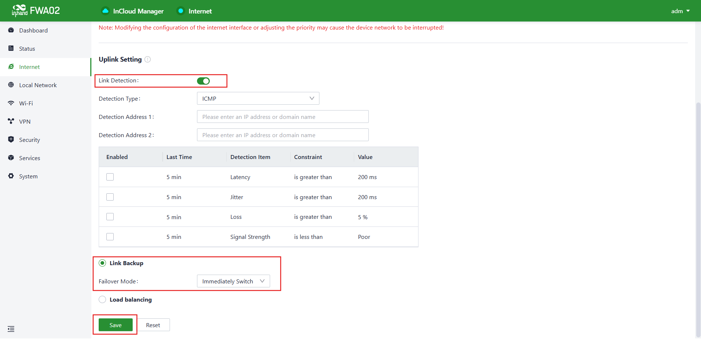

# 零售门店联网方案 — 故障转移配置指南

## 1. 文档信息

- **产品型号：** FWA02（5G 固定无线接入路由器）
- **固件版本：** V1.0 或更高版本
- **适用场景：** 连锁零售门店联网，WAN + 5G 蜂窝备份故障转移
- **文档日期：** 2026 年 4 月 27 日

---

## 2. 路由器概述

### 2.1 产品介绍

InHand FWA02 是一款面向分布式零售环境即插即用部署的 5G 固定无线接入（Fixed Wireless Access，FWA）路由器。它支持有线 WAN 连接与 5G/4G 蜂窝备份之间的双链路故障转移（failover），可保障 POS 交易、视频监控和数据同步等业务不中断。

### 2.2 关键特性（故障转移相关）

- 有线 WAN 作为主链路，自动切换至 5G/4G 蜂窝备份
- 双 Nano SIM + eSIM，可灵活选择蜂窝备份链路的运营商
- 实时链路质量监测：时延（latency）、抖动（jitter）、丢包率（packet loss）及蜂窝信号强度
- 30 秒以内的故障检测与切换

### 2.3 典型应用拓扑

*图 1 — 每个零售门店部署一台 FWA02，连接店内所有设备。有线 WAN 承载正常流量；当有线链路劣化或中断时，5G 蜂窝链路自动启用。总部和 InCloud Manager 也可通过互联网访问该设备。*

---

## 3. 硬件说明

### 3.1 接口

| 接口 | 说明 |
|-----------|-------------|
| **ETH 1 / ETH 2** | 2 × 2.5 GbE RJ45，WAN/LAN 可切换 |
| **SIM 1 / SIM 2** | Nano SIM 卡槽（支持热插拔），主备蜂窝卡 |
| **eSIM** | 嵌入式 SIM（Embedded SIM），预置运营商配置文件 |
| **USB** | Type-C，USB 2.0，支持 HOST 和 SLAVE 模式 |
| **电源** | 圆形接口，12 V 2 A |
| **复位** |  recessed 按钮，恢复出厂默认设置 |
| **电源开关** | 硬件开/关按钮 |
| **天线** | 6 × 外置 Sub-6 GHz 蜂窝天线；4 × 内置 Wi-Fi 天线 |

### 3.2 LED 指示灯（故障转移相关）

| 指示灯 | 状态 | 含义 |
|-----------|--------|---------|
| **系统（System）** | 绿色常亮 | 设备正常运行 |
| | 闪烁 | 正在启动或升级中 |
| **蜂窝（Cellular）** | 绿色常亮 | 蜂窝已连接 |
| | 闪烁 | 蜂窝正在注册 |
| | 熄灭 | 无 SIM 卡 / 无信号 |
| **信号（Signal）** | 1–5 格 | 蜂窝信号强度 |
| **WAN** | 绿色常亮 | WAN 链路已连接 |
| | 熄灭 | WAN 链路中断 |

---

## 4. 出厂默认参数

| 参数 | 默认值 |
|-----------|---------------|
| **LAN IP 地址** | 192.168.1.1 |
| **子网掩码** | 255.255.255.0 |
| **DHCP 服务器** | 已启用（地址池：192.168.1.100–199） |
| **Web UI 用户名** | adm |
| **Web UI 密码** | 印于设备标签上 |
| **ETH 1** | WAN 模式（默认） |
| **ETH 2** | LAN 模式（默认） |

> **注意：** 设备底部的标签上印有默认的 Web UI 密码。首次登录后请立即修改。

---

## 5. 配置前准备

开始配置前，请确认以下事项：

1. 将 SIM 卡插入 SIM 1（以及可选的 SIM 2）卡槽
2. 使用网线将可用的宽带调制解调器或 ISP 接入设备连接至 **ETH 1（WAN）**
3. 使用网线将 PC 连接至 **ETH 2（LAN）**
4. 使用 12 V 电源适配器为 FWA02 上电；等待 **系统（System）** LED 变为绿色常亮（约 60 秒）
5. 将 PC 设置为自动获取 IP 地址（DHCP），或配置 192.168.1.0/24 网段的静态 IP
6. 打开支持的浏览器（Chrome、Firefox 或 Edge），访问 `http://192.168.1.1`
7. 使用设备标签上的凭证登录

---

## 6. 故障转移配置

### 6.1 背景与需求

每个零售门店需要：
- 一条用于日常高带宽业务的 **主用有线 WAN** 连接
- 一条在有线链路中断时自动启用的 **自动 5G/4G 蜂窝故障转移** 链路
- 对链路质量进行持续监测，以便在业务受到影响之前触发切换

在 FWA02 上，WAN 和 Cellular 接口均作为 **Internet** 菜单下 **上行链路表（Uplink Table）** 中的条目出现。故障转移行为则通过同一页面的 **上行链路设置（Uplink Setting）** 区域进行定义。

### 6.2 步骤 1 — 查看上行链路表

1. 登录路由器 Web UI，地址为 `http://192.168.1.1`
2. 在左侧导航栏中点击 **Internet**
3. **上行链路表（Uplink Table）** 会列出所有可用上行链路。默认情况下应看到两条：

| 优先级 | 名称 | 状态 | 接口类型 | IPv4 类型 |
|----------|------|--------|----------------|-----------|
| 1 | **WAN** | 启用 | WAN | DHCP |
| 2 | **Cellular** | 启用 | Cellular：SIM1、eSIM、SIM2 | 自动、自动、自动 |

4. 上行链路表中的行顺序决定了故障转移优先级 — 最上方条目为主用上行链路，下方条目为备用。可通过每行左侧的优先级手柄（☷）拖动排序。WAN 应位于顶部，Cellular 在其下方。

*图 2 — **Internet** 页面上的上行链路表。WAN 列为首要上行链路，Cellular 作为备份。点击每行的 **编辑（Edit）** 可调整各上行链路设置。*

### 6.3 步骤 2 — 配置 WAN 上行链路（主链路）

1. 在 **Internet** 页面，点击 **WAN** 行中的 **编辑（Edit）**
2. 根据 ISP 类型设置 **IPv4 类型**：

| ISP 类型 | 设置 |
|----------|---------|
| DHCP（大多数宽带） | 选择 **DHCP** |
| 静态 IP | 选择 **Static**，输入 IP、掩码、网关和 DNS |
| PPPoE（光纤/DSL） | 选择 **PPPoE**，输入 ISP 提供的用户名和密码 |

3. 点击 **保存（Save）**，并确认 **WAN** LED 变为绿色常亮
4. 确认页面顶部的指示器显示 **● Internet**（绿色圆点）

### 6.4 步骤 3 — 配置 Cellular 上行链路（备份链路）

1. 在 **Internet** 页面，点击 **Cellular** 行中的 **编辑（Edit）**
2. 对打算使用的每个 SIM 卡槽（SIM1、eSIM、SIM2）设置 APN：
   - 对于大多数运营商：将 **APN** 保持为 **Auto**，或输入运营商指定 APN（例如 Verizon 使用 `vzwinternet`，T-Mobile 使用 `fast.t-mobile.com`）
   - 对于专用 MVPN：输入运营商客户经理提供的 APN
3. 将 **拨号号码（Dial number）** 保持为 `*99#`（默认）
4. 点击 **保存（Save）**
5. 确认 **蜂窝（Cellular）** LED 变为绿色常亮，且 **信号（Signal）** 指示至少显示 2 格

> **双 SIM 卡：** Cellular 上行链路原生将 SIM1、eSIM 和 SIM2 归为一组。可点击 Cellular 行的 **策略（Policy）** 设置当活动 SIM 卡失去信号时，各 SIM 卡的尝试顺序。

### 6.5 步骤 4 — 配置链路检测与故障转移

**Internet** 页面下方的 **上行链路设置（Uplink Setting）** 区域用于控制 FWA02 如何监测链路健康状态，以及当主链路劣化时如何响应。

1. 在 **Internet** 页面下滚至 **Uplink Setting**
2. 将 **链路检测（Link Detection）** 开关设为 **ON**
3. 配置检测参数：

| 字段 | 推荐值 | 说明 |
|-------|-------------------|-------------|
| **检测类型（Detection Type）** | ICMP | 使用 ping 进行链路健康检查 |
| **检测地址 1（Detection Address 1）** | `8.8.8.8` | 主 ping 远端目标 |
| **检测地址 2（Detection Address 2）** | `1.1.1.1` | 备用目标 — 两个地址均失败时才判定链路中断 |

4. 在 **检测项（Detection Item）** 表中，启用应触发故障转移的指标。建议的基准配置：

| 检测项 | 约束条件 | 阈值 | 持续时长 |
|----------------|------------|-------|-----------|
| **Latency（时延）** | 大于 | 200 ms | 5 分钟 |
| **Jitter（抖动）** | 大于 | 200 ms | 5 分钟 |
| **Loss（丢包）** | 大于 | 5 % | 5 分钟 |
| **Signal Strength（信号强度）** | 小于 | 差（Poor） | 5 分钟 |

5. 在页面底部的模式选择器中，选择 **链路备份（Link Backup）**（不要选择 **负载均衡（Load balancing）**）
6. 将 **故障转移模式（Failover Mode）** 设为 **立即切换（Immediately Switch）**，以便 WAN 被判定中断后路由器立即切换至 Cellular
7. 点击 **保存（Save）**

*图 3 — **上行链路设置** 页面。**链路检测** 已启用，运行模式选择为 **链路备份（Link Backup）**，**故障转移模式** 设为 **立即切换（Immediately Switch）**。点击 **保存** 应用。*

**结果：** 当有线 WAN 链路中断，或其质量越过任一已启用检测阈值时，FWA02 会立即将所有流量通过 Cellular 上行链路转发。当 WAN 恢复并通过检测后，流量会按照上行链路表中的优先级顺序自动回切至 WAN。

---

## 7. 验证 — WAN 故障转移测试

完成所有配置步骤后，按以下方式验证故障转移行为：

1. 确认正常运行：打开 **Dashboard**，确认 **WAN** 为当前活动上行链路，**Cellular** 处于 **待机（Standby）** 状态
2. 从 ETH 1 上拔下 WAN 网线
3. 在约 15–30 秒内，确认 Dashboard 上 **WAN** 状态变为 **已断开（Disconnected）**，**Cellular** 成为 **活动（Active）** 上行链路
4. 从门店 LAN 中的设备上，确认互联网访问仍然保持（例如 ping `8.8.8.8` 或打开浏览器）
5. 重新插回 WAN 网线
6. 待检测再次通过后，确认 **WAN** 恢复为 **活动（Active）**，**Cellular** 恢复为 **待机（Standby）**

---

## 8. 故障排查

### 8.1 无法访问 Web UI

| 现象 | 操作 |
|---------|--------|
| 浏览器无法访问 `192.168.1.1` | 确认 PC 已连接至 ETH 2（LAN），并设置为 DHCP 或 192.168.1.0/24 网段的静态 IP |
| 忘记 Web UI 密码 | 按住 Reset 按钮 10 秒恢复出厂默认设置，然后使用设备标签上的凭证登录 |

### 8.2 WAN 链路无法上线

| 现象 | 操作 |
|---------|--------|
| WAN LED 熄灭 | 检查 FWA02 ETH 1 与 ISP 调制解调器/接入设备之间的网线 |
| WAN LED 亮但无法上网 | 确认 WAN 的 IPv4 类型与 ISP 要求一致（DHCP / 静态 / PPPoE） |
| PPPoE 拨号失败 | 确认 ISP 用户名和密码正确；联系 ISP 确认服务状态 |

### 8.3 蜂窝无法连接

| 现象 | 操作 |
|---------|--------|
| 蜂窝 LED 熄灭 | 确认 SIM 卡已完全插入，可重新插拔；确认 SIM 卡已激活 |
| 蜂窝 LED 闪烁但无连接 | 确认 APN 设置与运营商匹配；确认 SIM 卡的数据套餐已激活 |
| 信号较弱（≤1 格） | 将 FWA02 靠近窗户或外墙摆放；检查天线是否已完全拧紧 |

### 8.4 故障转移未触发

| 现象 | 操作 |
|---------|--------|
| WAN 已中断但流量未切换至 Cellular | 确认 **链路检测（Link Detection）** 已启用，且 **Uplink Setting** 中选择了 **链路备份（Link Backup）** 模式；确认检测地址在蜂窝路径上可达 |
| 故障转移速度过慢 | 降低检测项表中的阈值，或缩短 **Last Time** 观察窗口 |
| 恢复后流量未回切至 WAN | 确认上行链路表中 WAN 行位于优先级 1；检查 WAN LED 为绿色常亮，且页面顶部 Internet 指示器为绿色 |
