# IG101 快速安装手册

---

# 第一部分：快速装机（图文整体流程）

> **您需要先做：** 开箱 → 用螺钉将设备固定到墙面或柜体 → 接好电源 → **断电**装 SIM、按丝印拧紧天线 → 上电 → 用 USB Type-C 将设备连到 PC，按《InGateway101 快速使用手册》登录 Web。
> **再做：** 翻到下方 **第二部分**，按需查阅装箱、灯义、壁挂、各接口引脚等。

## 必读摘要（接线、上电前）

| 项目 | 要求 |
|------|------|
| 供电 | **12V DC（输入范围 7～38 V DC）**，端子 **V+ / V−**；**PWR 红灯常亮**表示已正常上电。 |
| SIM 卡 | **须断电安装/拔出**；**不支持热插拔**。 |
| Micro SD | **须断电安装/拔出**；**不支持热插拔**。 |
| 蜂窝天线 | 按壳体接口位置拧紧；标配 **1 条 4G LTE 吸盘天线**。 |
| 工作环境 | 工作温度 **-20-70℃**，环境湿度 **5-95%（无凝霜）**。 |

---

## 步骤 1：对照实物，确认面板与接口区域

请先对照下图，确认设备正面板、上面板、下面板的接口与指示灯位置。

**正面板：**

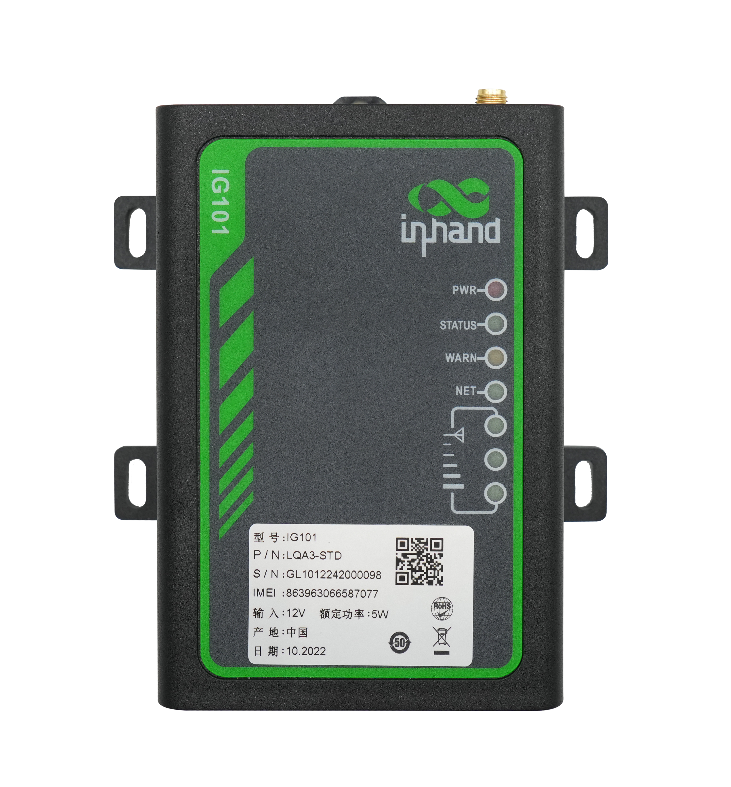

**上面板：**

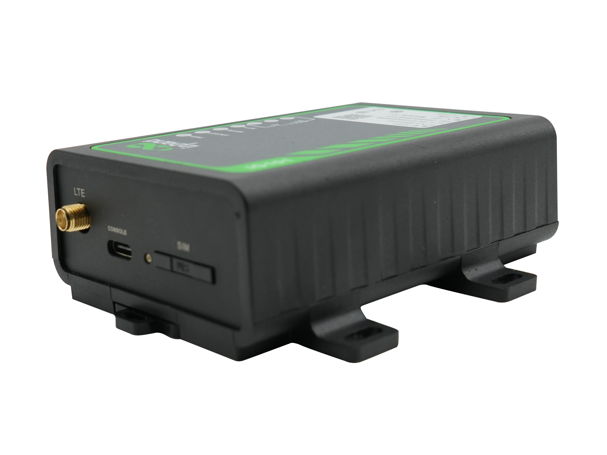

**下面板：**

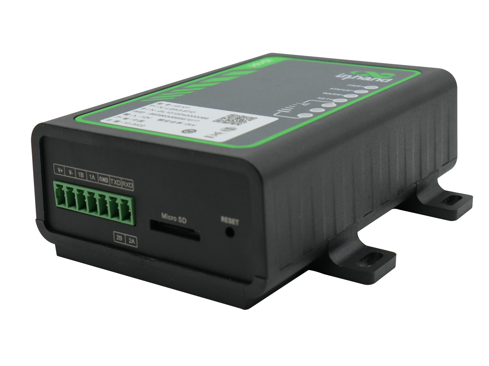

> 面板各分区详细标识见 **§2.2**；指示灯/复位键见 **§2.3**。

---

## 步骤 2：将设备固定到墙面或柜内

采用螺钉将设备固定到墙面或者柜子上。

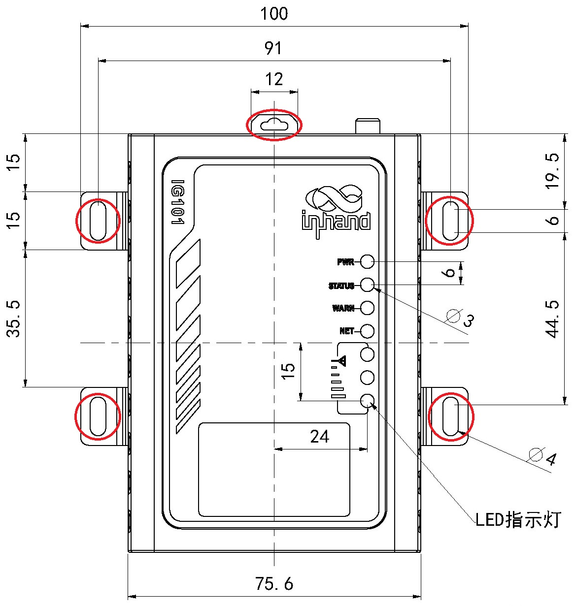

> 壁挂安装详细方式见 **§2.4**。

---

## 步骤 3：连接电源

将电源适配器端子插入 IG101 的 DC 端口，然后接通电源。当 **PWR 电源指示灯长亮**则代表设备已经正常上电。

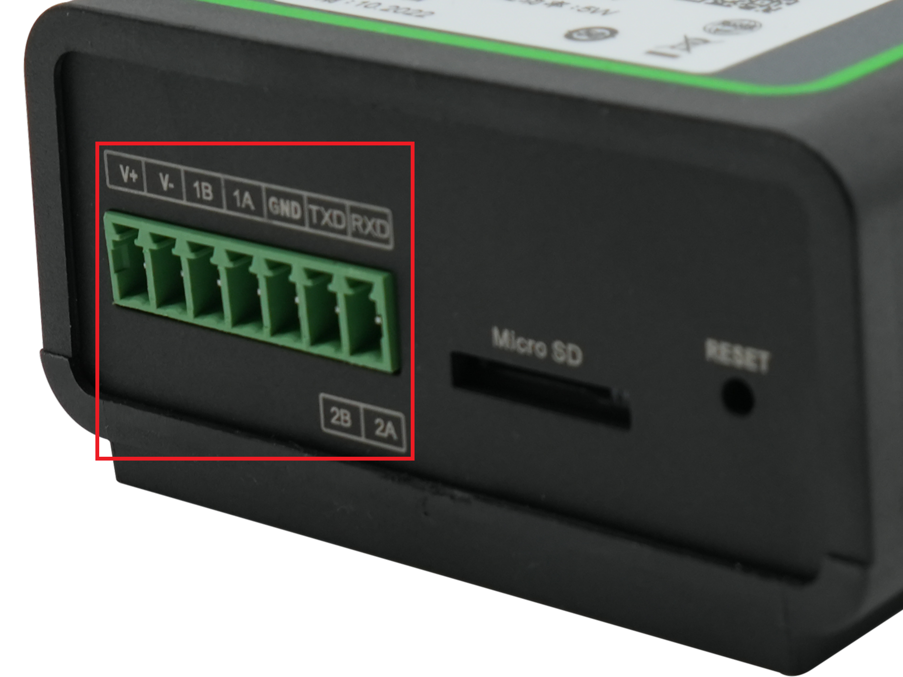

> 电源/串口 7 针端子引脚定义见 **§2.5.2**；供电与环境规格见 **§2.6**。

---

## 步骤 4：断电装 SIM，并接好天线

> ⚠️ **SIM 卡不支持热插拔，请先断开电源再操作。**

1. 使用取卡针弹出 Micro SIM 卡座，装入 SIM 卡后回插到位。
2. 将 4G LTE 吸盘天线拧紧到设备的蜂窝天线接口。

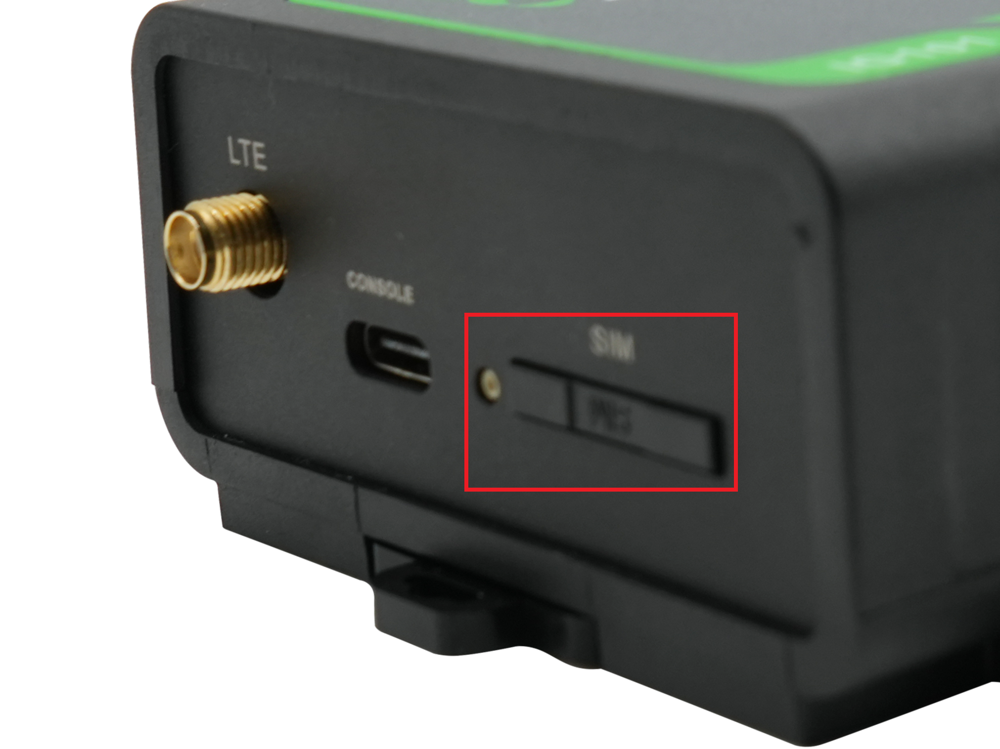

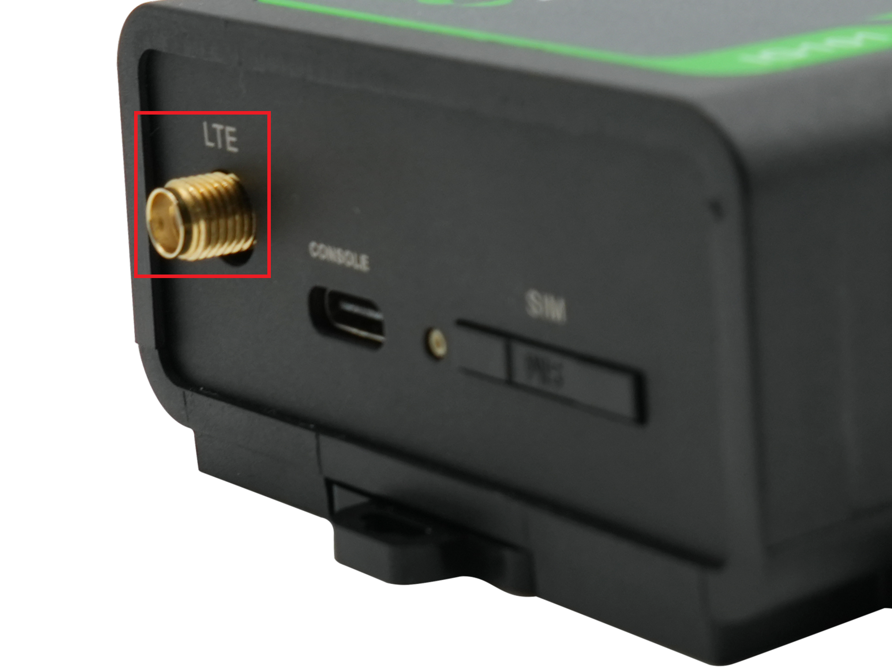

> SIM 卡座/天线接口详细说明见 **§2.5.3**。

---

## 步骤 5：上电，确认设备已就绪

接通电源后观察指示灯：

- **PWR 常亮** → 已上电
- **STATUS 慢闪** → 开机成功
- **NET 快闪 → 亮 → 慢闪** → 拨号中 → 拨号成功 → 平台连接成功
- **信号灯**：3 颗常亮表示信号良好（20≤CSQ≤31）

> 指示灯组合状态详表见 **§2.3**。

---

## 步骤 6：PC 与浏览器登录 Web

通过 USB Type-C 线将 IG101 连接到 PC，使用浏览器登录设备 Web 配置页面。

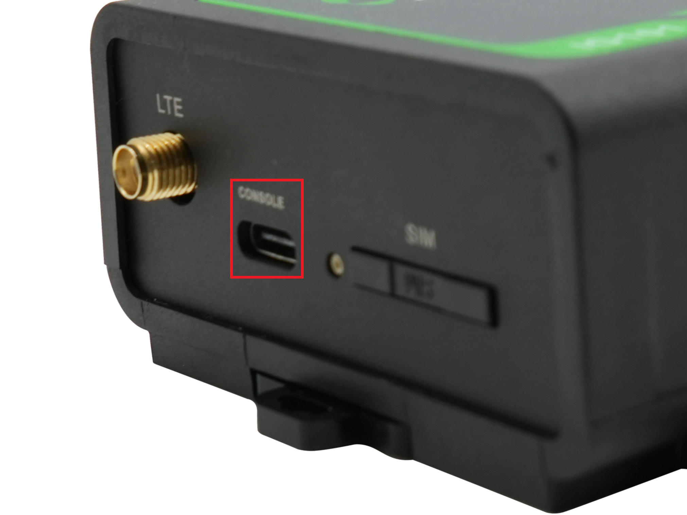

> 详细配置步骤详见《InGateway101 快速使用手册》。  
> 默认 IP 与登录账号密码（原稿未详，待补充）。

---

## 装完自检

- ☐ 设备已用螺钉固定到墙面或柜体。
- ☐ 电源已接好；若用蜂窝，SIM 与天线已就位。
- ☐ **PWR 常亮**且 **STATUS 慢闪**。
- ☐ NET 灯按"快闪 → 亮 → 慢闪"顺序变化，确认蜂窝拨号与平台连接正常。
- ☐ 已通过 USB Type-C 与 PC 建立连接，可访问 Web 配置页。

> 如设备无法正常工作，可通过 RESET 键进行硬件恢复出厂，详见 **§2.7**。

---

# 第二部分：详细说明

## 2.1 装箱清单

### 标准配件

| 序号 | 名称 | 数量 | 单位 | 备注 |
| --- | --- | --- | --- | --- |
| 1 | IG101 | 1 | 台 | IG502 边缘计算网关 |
| 2 | 蜂窝天线 | 1 | 个 | 4G LTE 吸盘天线 |
| 3 | 工业端子 | 1 | 个 | 7 针工业端子 |
| 4 | 取卡针 | 1 | 个 |  |
| 5 | 产品保修卡 | 1 | 张 | 保修期为 1 年 |
| 6 | 合格证 | 1 | 张 | IG502 边缘计算网关合格证 |

### 可选配件

| 序号 | 名称 | 数量 | 单位 | 备注 |
| --- | --- | --- | --- | --- |
| 1 | 电源适配器 | 1 | 个 | 12V 2A 电源适配器 |

---

## 2.2 产品结构与标识

IG101 的面板布局如下。

### 2.2.1 正面板


### 2.2.2 上面板


### 2.2.3 下面板


---

## 2.3 指示灯与复位键

### 2.3.1 运行状态指示灯

| **PWR** | **STATUS** | **WARN** | **NET** | **说明** |
| :---: | :---: | :---: | :---: | :---: |
| 电源指示灯<br/>（红色） | 状态指示灯<br/>（绿色） | 告警指示灯<br/>（黄色） | 网络指示灯<br/>（绿色） |  |
| 亮 | 灭 | 灭 | 灭 | 开机 |
| 亮 | 慢闪 | 灭 | 灭 | 开机成功 |
| 亮 | 慢闪 | 灭 | 快闪 | 正在拨号 |
| 亮 | 慢闪 | 灭 | 亮 | 拨号成功 |
| 亮 | 慢闪 | 灭 | 慢闪 | 平台连接成功 |
| 亮 | 慢闪 | 慢闪 | 灭 | 复位成功 |
| 亮 | 慢闪 | 快闪 | 灭 | 正在升级 |

**闪烁频率定义：**

- **常亮 / 常灭**：至少保持 3 秒
- **慢闪**：约 1 Hz
- **快闪**：约 5 Hz

### 2.3.2 蜂窝信号强度指示灯

| **信号灯 1**<br/>**（绿色）** | **信号灯 2**<br/>**（绿色）** | **信号灯 3**<br/>**（绿色）** | **说明** |
| :---: | :---: | :---: | --- |
| 灭 | 灭 | 灭 | 未检测到信号 |
| 亮 | 灭 | 灭 | 信号状况 1≤CSQ≤9（信号有问题，请检查天线是否安装完好、SIM 卡是否正确识别、该地区信号是否良好） |
| 亮 | 亮 | 灭 | 信号状况 10≤CSQ≤19（信号基本正常，设备可正常使用） |
| 亮 | 亮 | 亮 | 信号状况 20≤CSQ≤31（信号良好） |

### 2.3.3 复位键

IG101 配备 **1 个 RESET 按键**，用于硬件恢复出厂。按键位置参见 §2.2 面板示意图。

恢复出厂的详细步骤见 **§2.7**。

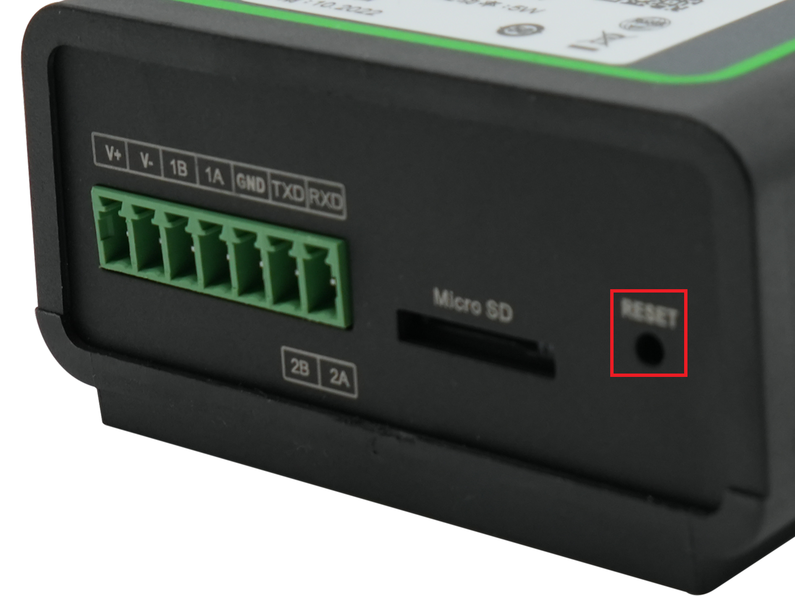

---

## 2.4 机械安装

### 2.4.1 壁挂安装

采用螺钉将设备固定到墙面或者柜子上。


> DIN 导轨安装方式：（原稿未详，待补充）

---

## 2.5 连接与布线（按功能分组）

### 2.5.1 电源

IG101 支持 **12V DC（输入范围 7～38 V DC）** 供电。将适配器端子插入 IG101 的 DC 端口，然后连接电源适配器。当 **PWR 电源指示灯长亮**则代表设备已经正常上电。


### 2.5.2 串口

IG502 有 **2 路串口**：一路串口支持 **RS-485**，一路串口支持 **RS-232 或 RS-485**。

电源、串口共用 **7 PIN 端子**，接口引脚说明如下：

| **引脚** | **名称** | **定义** |
| --- | --- | --- |
| 1 | V+ | 电源正极 |
| 2 | V− | 电源负极 |
| 3 | B | RS485− |
| 4 | A | RS485+ |
| 5 | GND | 信号地 |
| 6 | TXD | 串口 RS232 发送或 RS485− |
| 7 | RXD | 串口 RS232 接收或 RS485+ |

### 2.5.3 蜂窝 SIM 与天线

#### SIM 卡座

IG101 配备 **1 个用于蜂窝通信的 Micro SIM 卡座**，SIM 卡安装**不支持热插拔**，需要在断电的情况下进行操作。


#### 天线接口

IG101 配备 **1 个蜂窝天线接口**，标配 **1 条 4G LTE 吸盘天线**。


### 2.5.4 USB 与 Micro SD

#### USB 接口

IG502 提供 **1 个 USB TYPE-C 接口**，用于网关配置。网关配置步骤详见《InGateway101 快速使用手册》。


#### Micro SD 卡

IG101 有 **1 个 Micro SD 卡**槽，SD 卡**不支持热插拔**，需要在断电的情况下操作。

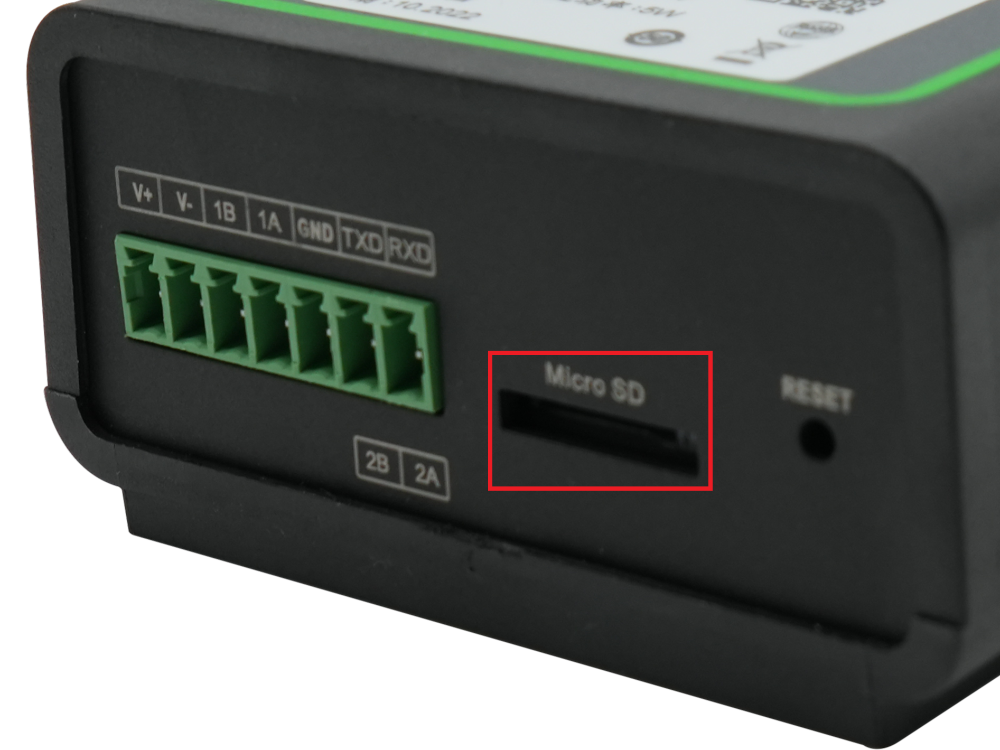

**多分区挂载规则：**

如果一个 micro SD 存储设备有多个分区，IG101 可以自动挂载前 9 个分区，其余的分区需要手动挂载。IG101 会把所有 micro SD 存储设备分区挂载到 `/mnt/sd` 路径下，挂载文件夹的命名格式为 `mmcblk0p<num>`。其中 `<num>` 可以是 1~9 的数字。通过开发者模式进入 Linux 后台执行 `df -h` 命令可以看到具体的挂载情况。

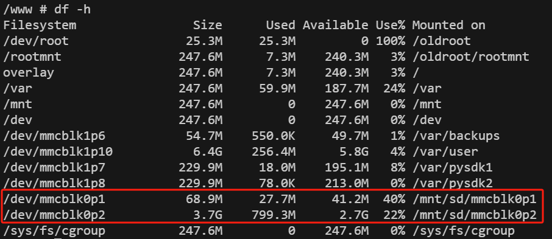

**Web 页面分区显示建议：**

Web 的概览页面只显示第一个分区的容量和使用情况，为了方便在 Web 页面查看 SD 卡使用情况，建议只创建一个分区，并将该分区格式化为 FAT32 文件系统。

**FAT32 格式化方法：**

- **SD 卡容量 ≤ 32GB**：SD 卡插入读卡器，然后将读卡器插入使用 Windows 系统的电脑。大部分 Windows 系统只支持将容量小于 32GB 的 SD 卡格式化为 FAT32 系统，格式化的时候会自动创建一个分区；也可以在 Linux 系统下格式化为 FAT32 文件系统，方法同"SD 卡容量 > 32GB"。
- **SD 卡容量 > 32GB**：SD 卡容量大于 32GB 时，需要在 Linux 下格式化 FAT32 格式。SD 卡插入读卡器，然后将读卡器插入使用 Linux 系统的电脑或者安装虚拟机 Linux 虚拟机的电脑。
  
  a. 执行 `fdisk -l` 查看 SD 卡对应的设备节点，示例中是 `/dev/sda`
  
  b. 执行 `fdisk /dev/sda` 进行分区（`p` 查看当前分区，`d` 删除已有分区，`n` 新创建分区，`w` 保存更改），创建分区
  
  ```
  /dev/sda1
  ```
  
  c. 执行 `sudo mkfs.vfat -F 32 /dev/sda1` 将分区格式化为 FAT32 格式。

---

## 2.6 供电与环境

| **项目** | **规格** |
| :---: | :--- |
| 输入电压 | 7-38 V DC（双引脚端子，V+、V−） |
| 工作功耗 | 电源功率 ＞ 8W |
| 工作温度 | -20-70 ℃ |
| 存储温度 | -40-85 ℃ |
| 环境湿度 | 5~95%（无凝霜） |

---

## 2.7 首次登录与恢复出厂

### 2.7.1 Web 登录

通过 USB Type-C 线将 IG101 连接到 PC，使用浏览器登录设备 Web 配置页面。详细配置步骤详见《InGateway101 快速使用手册》。

- 默认 IP：（原稿未详，待补充）
- 默认账号 / 密码：（原稿未详，待补充）

### 2.7.2 恢复出厂（RESET）

IG101 配备 **1 个复位按钮**用于系统恢复出厂。RESET 键的位置参见 §2.2 面板示意图。采用硬件方式恢复出厂的步骤如下：

1. **步骤 1**：设备上电后 10s 内长按 RESET 键不松开。
2. **步骤 2**：当 ERR 灯变红后，松开 RESET 键。
3. **步骤 3**：几秒之后当 ERR 灯熄灭，再次按住 RESET 键不松开。
4. **步骤 4**：当看到 ERR 灯闪烁时松开 RESET 键；等待 ERR 灯熄灭，表明恢复出厂设置成功。


---

## 2.8 相关文档

| 需求 | 去向 |
|------|------|
| 产品介绍、网关配置步骤、USB/SD 详细操作 | 《InGateway101 快速使用手册》 |
| 订购信息、天线型号、详细技术规格 | 《IG101 产品规格书》（原稿未详，待补充） |
| 软件下载与产品公告 | [www.inhand.com.cn](http://www.inhand.com.cn) |

---

## 2.9 法律信息

### 软件许可声明

本手册中描述的软件是根据许可协议提供的，只能按照该协议的条款使用。

### 版权声明

© 2024 映翰通网络 保留所有权利。

### 商标

InHand 标志是映翰通网络的注册商标。

本手册中的所有其他商标或注册商标属于其各自的制造商。

### 免责声明

本公司保留对此手册更改的权利，产品后续相关变更时，恕不另行通知。对于任何因安装、使用不当而导致的直接、间接、有意或无意的损坏及隐患概不负责。

### 产品说明

InGateway101（简称 IG101）是映翰通针对工业物联网领域推出的紧凑型边缘网关，利用移动运营商的 4G 网络提供便捷的互联网接入，是您低成本实现设备联网的最佳选择。该系列网关可定制边缘计算功能，实现数据预处理，减少数据流量并提升安全性和智能化。易部署且具备完善的远程管理功能，在设备信息化建设中具有突出表现。
