# IG502 快速安装手册

---

# 第一部分：快速装机（图文整体流程）

> **您需要先做：** 开箱 → 固定设备 → 接电源与网线 →（若用蜂窝）**断电**装 SIM、接天线 → 上电 → PC 同网段 → 浏览器打开 Web。
> **再做：** 翻到下方 **第二部分**，按需查阅装箱、灯义、壁挂、各接口引脚等。

---

## 必读摘要（接线、上电前）

| 项目 | 要求 |
|------|------|
| 供电 | **12～48 V DC**，端子 **V+ / V−**（或规格适配器）；**PWR 红灯常亮**表示已上电。 |
| SIM / Micro SD | **须断电**安装或拔出；**不可热插拔**。 |
| 蜂窝 / WLAN / GPS 天线 | 按壳体**丝印**拧紧；标配数量因型号而异（见《规格书》订购信息）。 |
| USB 存储 | 支持热插拔；断开前须执行 `sync` 并退出挂载目录，否则卸载会失败。 |

---

## 步骤 1：对照实物，确认面板与接口区域

IG502 分为**带 IO 接口**与**不带 IO 接口**两种型号，请根据实物确认您手中的设备变型。

- **带 IO 接口的 IG502**

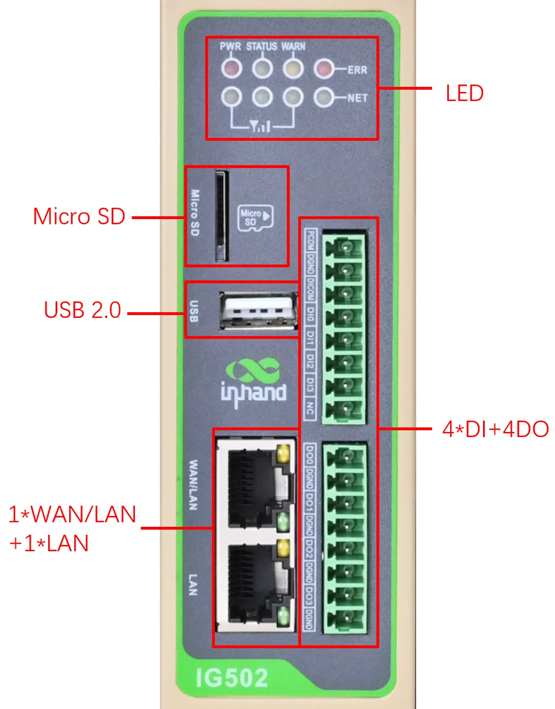

- **不带 IO 接口的 IG502**

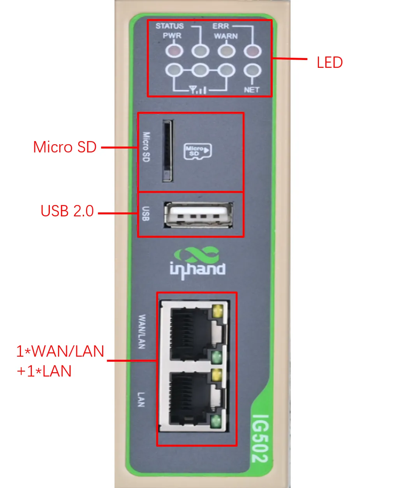

上面板布局如下：

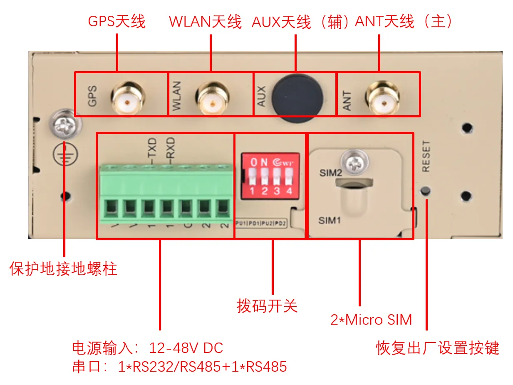

> 各接口的详细引脚定义与参数见 §2.2、§2.5。

---

## 步骤 2：将设备固定到导轨或柜内

IG502 标配 DIN 导轨安装配件，也可选购壁挂套件。以下是 DIN 导轨的快速装法：

1. 选定安装位置，确保设备周围留有足够空间。
2. 将 DIN 卡轨座的上部卡在 DIN 轨上，在设备下端向上稍用力，按箭头方向转动设备，将 DIN 卡轨座卡在 DIN 轨上。
3. 确认设备已可靠安装到 DIN 轨。


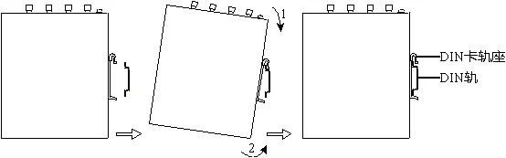

> DIN 导轨拆卸步骤及三种壁挂安装方式见 §2.4。

---

## 步骤 3：连接电源与以太网

**连接电源**

IG502 支持 **12～48 V DC** 供电，使用 7 针工业端子中的 **V+**（正极）和 **V−**（负极）接线。将电源线接好后插入设备 DC 端口。

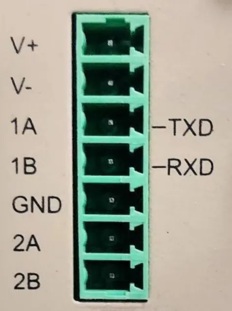

**连接以太网**

IG502 提供 2 个 RJ45 网口，支持 10M/100M 自适应。将网线一端插入设备任一网口，另一端连接 PC 或交换机。

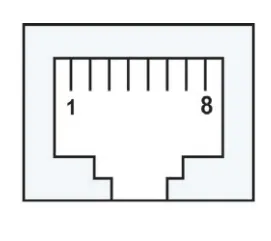

> 电源与串口引脚定义见 §2.5.2；RJ45 引脚定义见 §2.5.1。

---

## 步骤 4：（若使用蜂窝）断电装 SIM，并接好天线

**重要：安装或拔出 SIM 卡前，必须先断开设备电源，不可热插拔。**

IG502 配备 **2 个 Micro SIM 卡座**，位于上面板。请按卡座方向正确插入 SIM 卡。

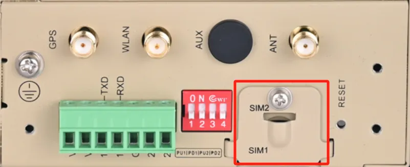

**接天线**

IG502 共有 4 个天线接口，按壳体丝印拧紧对应天线：

| 丝印 | 天线 |
| :---: | :---: |
| GPS | GPS 天线 |
| WLAN | WAN 天线 |
| AUX | AUX 天线（辅助天线） |
| ANT | ANT（主天线） |

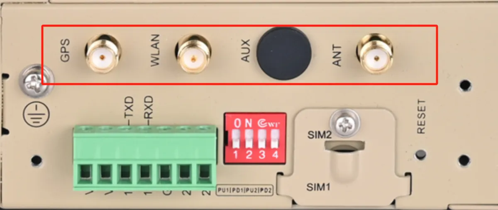

> 不同型号标配的天线数量不同，订购信息请查阅《IG502 系列边缘网关产品规格书》。详细说明见 §2.5.6。

---

## 步骤 5：上电，确认设备已就绪

接通电源后，观察前面板指示灯：

- **PWR 红灯常亮** → 设备已上电
- **STATUS 绿灯慢闪** → 开机成功，设备就绪

若正在拨号，NET 灯会快闪；拨号成功后 NET 灯常亮。

> 完整灯态表与闪烁频率定义见 §2.3。

---

## 步骤 6：PC 与浏览器登录 Web

**1. 将 PC 与 IG502 互联**

将网线一端插入 IG502 的网口，另一端插入 PC 网口，并将 PC 的 IP 地址设置为与设备接口同网段。

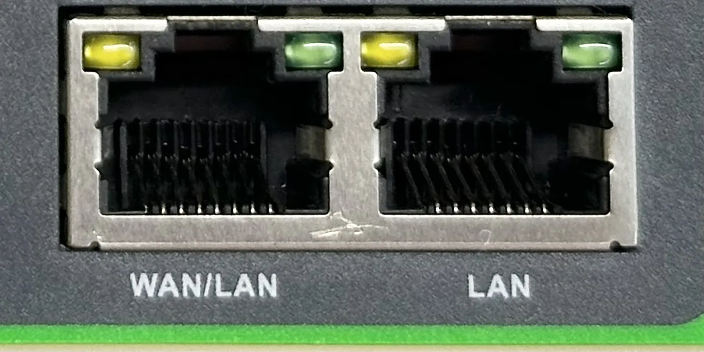

**2. 默认 IP 速查**

| 端口角色 | 默认 IP |
| :---: | :---: |
| WAN/LAN | 192.168.1.1 |
| LAN | 192.168.2.1 |

**3. 浏览器登录**

以网线插入 LAN 口为例，在浏览器地址栏输入：

```
https://192.168.2.1
```

- **初始登录账号**：`adm`
- **初始登录密码**：查看设备面板上的铭牌获取初始密码信息

首次访问会出现证书告警提示，请选择继续前往。


> 登录步骤的完整闭环说明及恢复出厂方法见 §2.7。

---

## 装完自检

- ☐ 设备已固定（导轨或壁挂）。
- ☐ 电源、网线已接好；若用蜂窝，SIM 与天线已就位。
- ☐ **PWR 常亮**且 **STATUS 慢闪**。
- ☐ 浏览器已能打开 Web 登录页并完成登录。

**排障提示**：若无法登录 Web，请检查 PC IP 是否与设备同网段，并确认网线连接正常。若需恢复出厂设置，参见 §2.7 的 RESET 操作步骤。

---

# 第二部分：详细说明

## 2.1 装箱清单

**标准配件**

| 序号 | 名称 | 数量 | 单位 | 备注 |
| --- | --- | --- | --- | --- |
| 1 | IG502 | 1 | 台 | IG502 边缘计算网关 |
| 2 | GPS 天线 | — | 个 | 天线的个数以及种类根据实际型号而定 |
| 3 | WLAN 天线 | — | 个 | |
| 4 | 蜂窝天线 | — | 个 | |
| 5 | 导轨安装配件 | 1 | 套 | 固定网关 |
| 6 | 工业端子 | 1 | 个 | 7 针工业端子 |
| 7 | 网线 | 1 | 根 | 1.5 m 网线 |
| 8 | 产品保修卡 | 1 | 张 | 保修期为 1 年 |
| 9 | 合格证 | 1 | 张 | IG502 边缘计算网关合格证 |

**可选配件**

| 序号 | 名称 | 数量 | 单位 | 备注 |
| --- | --- | --- | --- | --- |
| 1 | 电源适配器 | 1 | 个 | 12 V 2 A 电源适配器 |
| 2 | 壁挂安装套件 | 1 | 套 | IG502 共有 3 种壁挂安装方式，可根据实际部署场景选择合适的壁挂方式进行安装，相应配件物料号可查看《IG502 系列边缘网关产品规格书》中“产品尺寸”部分 |

---

## 2.2 产品结构与标识

### 2.2.1 正面板

IG502 分为带 IO 接口、不带 IO 接口的型号，其正面板分别如下所示。

- **带 IO 接口的 IG502**


- **不带 IO 接口的 IG502**


### 2.2.2 上面板


---

## 2.3 指示灯与复位键

### 2.3.1 运行状态指示灯

| PWR | STATUS | WARN | ERR | NET | 说明 |
| :---: | :---: | :---: | :---: | :---: | :--- |
| **电源指示灯**（红色） | **状态指示灯**（绿色） | **告警指示灯**（黄色） | **错误指示灯**（红色） | **网络指示灯**（绿色） | |
| 亮 | 灭 | 灭 | 灭 | 灭 | 开机 |
| 亮 | 慢闪 | 灭 | 灭 | 灭 | 开机成功 |
| 亮 | 慢闪 | 灭 | 灭 | 快闪 | 正在拨号 |
| 亮 | 慢闪 | 灭 | 灭 | 亮 | 拨号成功 |
| 亮 | 慢闪 | 慢闪 | 慢闪 | 灭 | 复位成功 |
| 亮 | 慢闪 | 快闪 | 快闪 | 灭 | 升级 |

**闪烁频率定义：**

- **常亮 / 常灭**：至少保持约 3 s
- **慢闪**：约 1 Hz
- **快闪**：约 5 Hz

### 2.3.2 蜂窝信号强度灯

| 信号状态指示灯 1（绿色） | 信号状态指示灯 2（绿色） | 信号状态指示灯 3（绿色） | 说明 |
| :---: | :---: | :---: | --- |
| 灭 | 灭 | 灭 | 未检测到信号 |
| 亮 | 灭 | 灭 | 信号状况 1≤CSQ≤9（说明信号状况有问题，请检查天线是否安装完好，SIM 卡是否正确识别，以及该地区信号状况是否良好） |
| 亮 | 亮 | 灭 | 信号状况 10≤CSQ≤19（说明信号状态基本正常，设备可以正常使用） |
| 亮 | 亮 | 亮 | 信号状况 20≤CSQ≤31（说明信号状态良好） |

### 2.3.3 复位键

IG502 有一个复位按钮（RESET），位于设备正面板（见 §2.2 示意图）。RESET 键用于硬件恢复出厂设置，详细操作步骤见 §2.7。

---

## 2.4 机械安装

### 2.4.1 DIN 导轨：安装

DIN 轨的安装板附在 IG502 的后面板上，如下图所示：


安装步骤如下：

1. 选定设备的安装位置，确保有足够的空间。
2. 将 DIN 卡轨座的上部卡在 DIN 轨上，在设备的下端向上稍微用力按箭头所示转动设备，即可将 DIN 卡轨座卡在 DIN 轨上，确认设备可靠地安装到 DIN 轨上。


### 2.4.2 DIN 导轨：拆卸

拆卸 IG502 的方法为：

1. 如下图箭头 1 所示，向下压设备使设备下端有空隙脱离 DIN 轨。
2. 将设备按箭头 2 的方向转动，并同时向外移动设备的下端，待下端脱离 DIN 轨后向上抬设备，即可从 DIN 轨上取下设备。

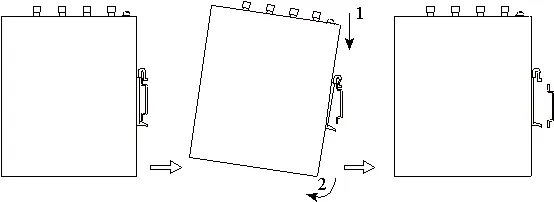

### 2.4.3 壁挂

IG502 可以采用壁挂套件进行安装，套件需要单独购买。共有三种壁挂方式，步骤分别如下所示。

先将套件用螺钉固定在设备上，再用螺钉将设备固定到墙面或柜体。拆卸时逆序松开墙面螺钉，再取下套件。

**方式一：将壁挂套件安装在 IG502 的上、下面板上（挂耳安装）**

步骤一：将壁挂安装套件采用螺钉分别固定到上面板和下面板上

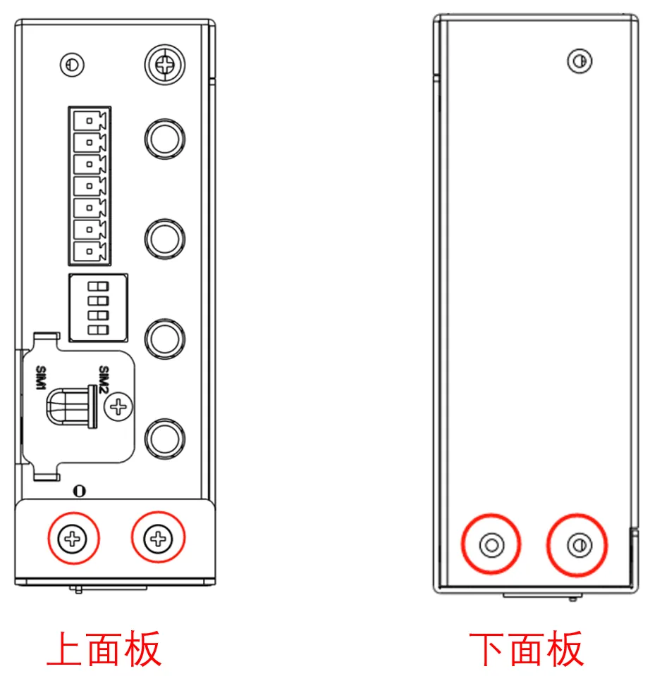

固定完成后如下图所示：

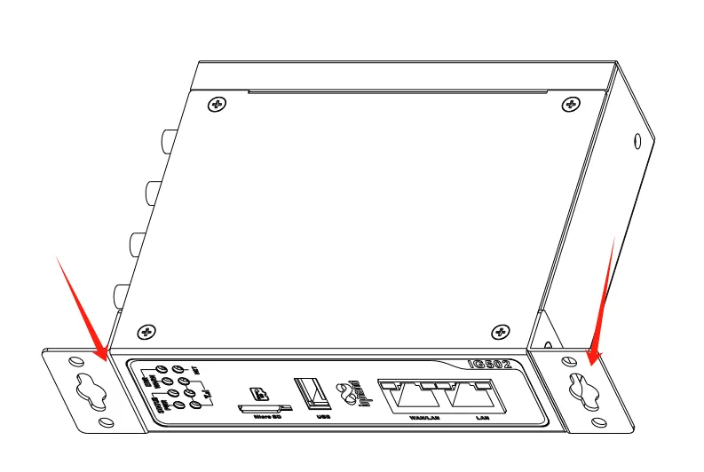

步骤二：当壁挂安装套件固定到设备以后，采用螺钉将设备固定到墙面或者柜子上

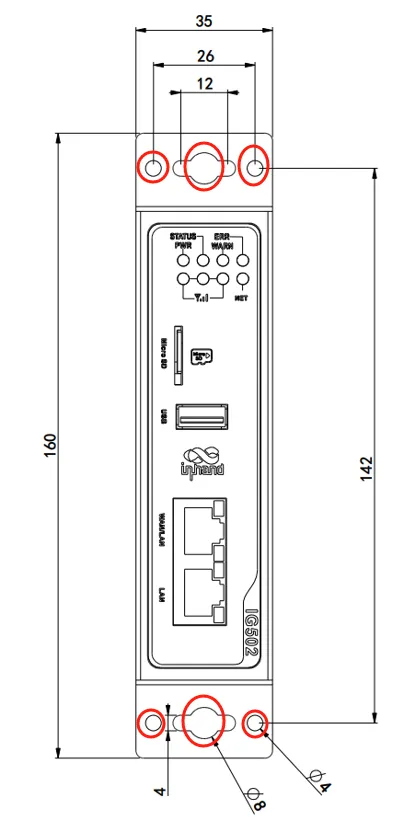

**方式二：将壁挂套件安装在 IG502 的后面板上（背面挂耳）**

步骤一：将壁挂安装套件采用螺钉分别固定到设备的后面板上

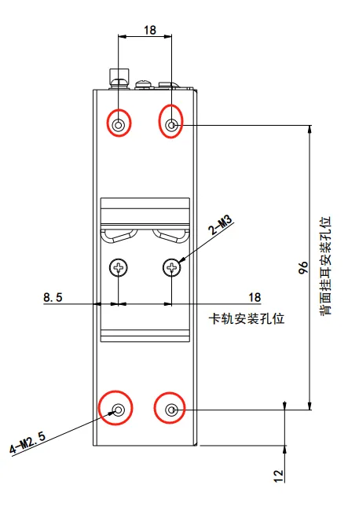

固定完成后如下图所示：

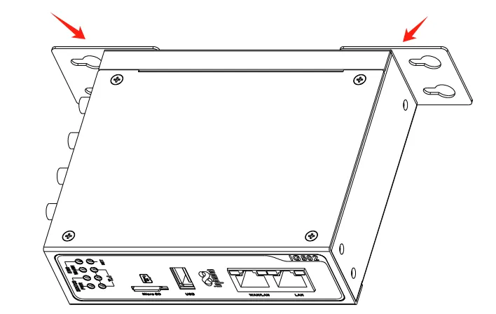

步骤二：当壁挂安装套件固定到设备以后，采用螺钉将设备固定到墙面或者柜子上

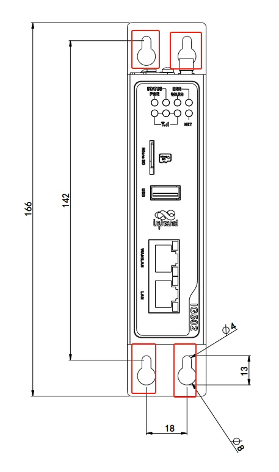

**方式三：将壁挂套件安装在 IG502 的上、下面板（大面挂耳）**

步骤一：将壁挂安装套件采用螺钉分别固定到设备的上下面板上

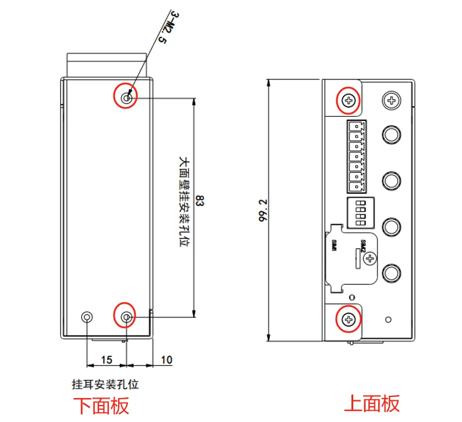

固定完成后如下图所示：

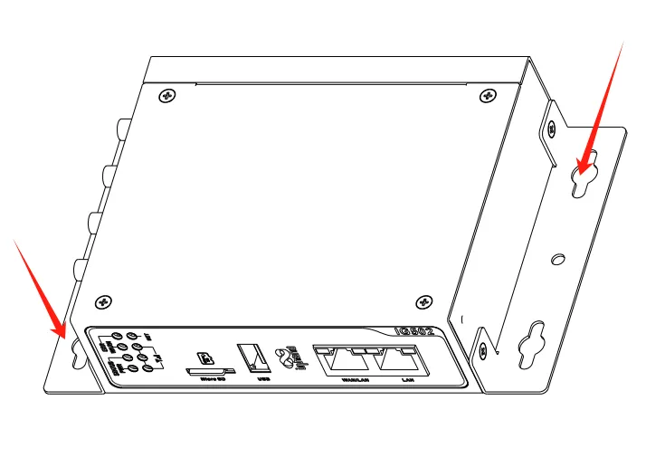

步骤二：当壁挂安装套件固定到设备以后，采用螺钉将设备固定到墙面或者柜子上

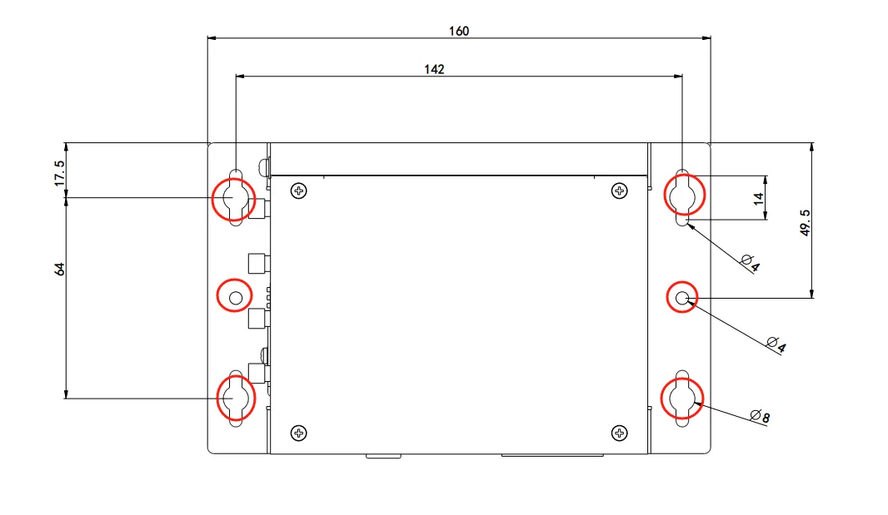

---

## 2.5 连接与布线

### 2.5.1 以太网

IG502 有 2 个 RJ45 以太网口，支持 10M/100M 自适应速率。


**RJ45 引脚定义**

| RJ45 引脚号 | 10M/100M |
| --- | --- |
| 1 | TX+ |
| 2 | TX- |
| 3 | RX+ |
| 4 | — |
| 5 | — |
| 6 | RX- |
| 7 | — |
| 8 | — |

### 2.5.2 电源与串口

**供电**

IG502 支持 **12～48 V DC** 供电。将适配器端子插入到 IG502 的 DC 端口中，然后连接电源适配器。当 PWR 电源指示灯长亮则代表设备已经正常上电。

**串口**

IG502 有 2 个串口，一路串口支持 RS-485，一路串口支持 RS-232 或 RS-485 模式。

- **当接口组合为 RS232+RS485 时：**
  - RS232 串口对应的设备节点：`/dev/ttyO1`
  - RS485 串口对应的设备节点：`/dev/ttyO3`

- **当接口组合为 RS485+RS485 时：**
  - RS485-1 串口对应的设备节点：`/dev/ttyO1`
  - RS485-2 串口对应的设备节点：`/dev/ttyO3`


**7 针端子引脚定义**

| 引脚 | 名称 | 定义 |
| --- | --- | --- |
| 1 | V+ | 电源正极 |
| 2 | V− | 电源负极 |
| 3 | TXD 或 1A | 串口 RS232 发送或第一路 RS485+ |
| 4 | RXD 或 1B | 串口 RS232 接收或第一路 RS485− |
| 5 | GND | 串口 RS232 信号地 |
| 6 | 2A | 第二路 RS485+ |
| 7 | 2B | 第二路 RS485− |

### 2.5.3 RS-485 拨码开关

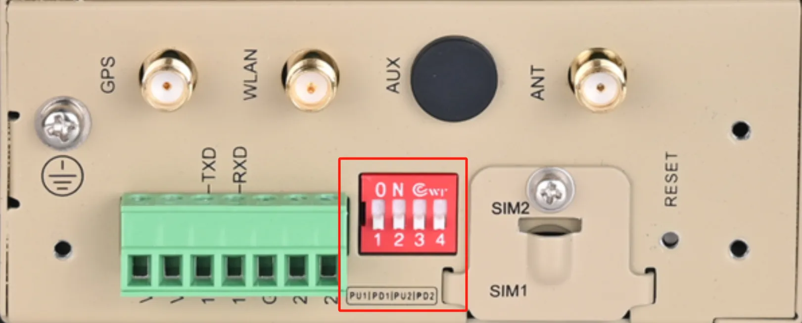

可通过该 4 位拨码开关分别实现 RS-485 接口 COM1 和 COM2 的 A/B 的上/下拉电阻的使能选择；通过使能 RS-485 接口 A/B 的上/下拉电阻可提高 RS-485 总线的抗干扰能力及解决因接口芯片兼容性导致的乱码问题。

**ON/OFF 功能对照表**

| 标识 | 描述 |
| :---: | --- |
| PU1 | ON：使能 COM1 RS-485 A 上拉电阻；OFF：未使能 COM1 RS-485 A 上拉电阻（默认） |
| PD1 | ON：使能 COM1 RS-485 B 下拉电阻；OFF：未使能 COM1 RS-485 B 下拉电阻（默认） |
| PU2 | ON：使能 COM2 RS-485 A 上拉电阻；OFF：未使能 COM2 RS-485 A 上拉电阻（默认） |
| PD2 | ON：使能 COM2 RS-485 B 下拉电阻；OFF：未使能 COM2 RS-485 B 下拉电阻（默认） |

> **注意**：使能 RS-485 上/下拉电阻，会减少 RS-485 总线允许最大的接入设备数量。

### 2.5.4 数字量输入


| 引脚 | 名称 | 定义 | 说明 |
| --- | --- | --- | --- |
| 1 | PCOM | 干接点接入端 | 4 路数字量/脉冲输入 DI，2 路干接点控制接口；干接点状态“1”：闭合，干接点状态“0”：断开；湿接点状态“1”：+10～+30 V / −30～−10 V DC，湿接点状态“0”：0～+3 V / −3～0 V DC；隔离 3000 VDC；支持脉冲信号计数器功能，最高支持 100 Hz 脉冲信号（32 位计数器 + 1 位溢出标记） |
| 2 | DGND | 干接点接地端 | |
| 3 | DICOM | 输入公共端 | |
| 4 | DI0 | 数字量/脉冲 输入 0 号接口 | |
| 5 | DI1 | 数字量/脉冲 输入 1 号接口 | |
| 6 | DI2 | 数字量/脉冲 输入 2 号接口 | |
| 7 | DI3 | 数字量/脉冲 输入 3 号接口 | |
| 8 | NC | 无 | |

### 2.5.5 数字量输出


| 引脚 | 名称 | 定义 | 说明 |
| --- | --- | --- | --- |
| 1 | DO0 | 数字量/脉冲 输出 0 号接口 | 3 路数字量/脉冲输出 DO，1 路数字量输出；隔离 3000 VDC |
| 2 | DGND | 接地端 | |
| 3 | DO1 | 数字量/脉冲 输出 1 号接口 | |
| 4 | DGND | 接地端 | |
| 5 | DO2 | 数字量/脉冲 输出 2 号接口 | |
| 6 | DGND | 接地端 | |
| 7 | DO3 | 数字量 输出 3 号接口 | |
| 8 | DGND | 接地端 | |

### 2.5.6 蜂窝 SIM 与天线

**SIM 卡**

IG502 配备 2 个用于蜂窝通信的 Micro SIM 卡座，位于上面板。**SIM 卡安装不支持热拔插，需要在断电的情况下进行操作。**


**天线**

IG502 共有 4 个天线接口，不同型号标配的天线数量不同。具体型号对应的天线支持情况可参见《IG502 系列边缘网关产品规格书》中“订购信息”部分。


**丝印与名称对照表**

| 标识 | 名称 |
| :---: | :---: |
| GPS | GPS 天线 |
| WLAN | WAN 天线 |
| AUX | AUX 天线（辅助天线） |
| ANT | ANT（主天线） |

### 2.5.7 USB 与 Micro SD

**USB**

IG502 提供一个 USB 2.0 Host 接口，主要用于扩展存储设备。


IG502 支持 USB 存储设备热插拔。如果一个 USB 存储设备有多个分区，IG502 可以自动挂载前 9 个分区，其余的分区需要手动挂载。IG502 会把所有 USB 存储设备分区挂载到 `/mnt/usb` 路径下，挂载文件夹的命名格式为 `sda_<num>`。其中 `<num>` 可以是 1～9 的数字。通过开发者模式进入 Linux 后台执行 `df -h` 命令可以看到具体的挂载情况。

> **在断开 USB 大容量存储设备之前，请记住输入 `sync` 同步命令，以防止数据丢失。当您断开存储设备的连接时，请从 `/mnt/usb/sda_<num>` 目录下退出。如果您留在 `/mnt/usb/sda_<num>` 中，则自动卸载过程将会失败。如果发生这种情况，请键入 `umount /mnt/usb/sda_<num>` 以手动卸载设备。**

**Micro SD**

IG502 有一个 Micro SD 卡槽，**SD 卡不支持热插拔，需要在断电的情况下操作。**


如果一个 Micro SD 存储设备有多个分区，IG502 可以自动挂载前 9 个分区，其余的分区需要手动挂载。IG502 会把所有 Micro SD 存储设备分区挂载到 `/mnt/sd` 路径下，挂载文件夹的命名格式为 `mmcblk0p<num>`。其中 `<num>` 可以是 1～9 的数字。通过开发者模式进入 Linux 后台执行 `df -h` 命令可以看到具体的挂载情况。


Web 的概览页面只显示第一个分区的容量和使用情况，为了方便在 Web 页面查看 SD 卡使用情况，建议只创建一个分区，并将该分区格式化为 FAT32 文件系统。

- **SD 卡容量 ≤ 32 GB**：SD 卡插入读卡器，然后将读卡器插入使用 Windows 系统的电脑。大部分 Windows 系统只支持将容量小于 32 GB 的 SD 卡格式为 FAT32 系统，格式化的时候会自动创建一个分区；也可以在 Linux 系统下格式化为 FAT32 文件系统，方法同 SD 卡容量 > 32 GB。

- **SD 卡容量 > 32 GB**：SD 卡容量大于 32 GB 时，需要在 Linux 下格式化 FAT32 格式。SD 卡插入读卡器，然后将读卡器插入使用 Linux 系统的电脑或者安装虚拟机 Linux 虚拟机的电脑。
  1. 执行 `fdisk -l` 查看 SD 卡对应的设备节点，示例中是 `/dev/sda`
  2. 执行 `fdisk /dev/sda` 进行分区（`p` 查看当前分区，`d` 删除已有分区，`n` 新创建分区，`w` 保存更改），创建分区 `/dev/sda1`
  3. 执行 `sudo mkfs.vfat -F 32 /dev/sda1` 将分区格式化为 FAT32 格式。

---

## 2.6 供电与环境（速查）

| 项目 | 规格 |
| :---: | :--- |
| **输入电压** | 12～48 VDC（双引脚端子，V+、V−） |
| **工作功耗** | 250 mA @ 12 V |
| **工作温度** | −25～70 ℃（−13～158 ℉） |
| **存储温度** | −40～85 ℃（−40～185 ℉） |
| **环境湿度** | 5～95%（无凝霜） |

---

## 2.7 首次登录与恢复出厂

### Web 登录

使用以下默认 IP 地址连接到 IG502。

| 端口 | 默认 IP |
| :---: | :---: |
| WAN/LAN | 192.168.1.1 |
| LAN | 192.168.2.1 |

**步骤一：将 IG502 和 PC 互联**

将网线一端插入到 IG502 的任一网口中，另外一端插入到电脑的网口，同时将电脑的 IP 地址设置为设备接口同网段地址。


**步骤二：通过 Web 对 IG502 进行网络管理和系统管理**

IG502 支持基于 IEOS 的 WEB 界面管理方式。IEOS 是映翰通自研的一套运行在 Linux 系统上的网络管理和系统管理程序，IEOS 可提供 Web 界面服务。以网线网口插入到 LAN 口为例，设备登录信息如下：

- **登录地址**：`https://192.168.2.1`
- **初始登录账号**：`adm`
- **初始登录密码**：查看设备面板上的铭牌获取初始密码信息

下图是使用 Web 连接的示例：


### 恢复出厂（RESET）

有一个复位按钮用于系统恢复出厂（位置见 §2.2 正面板示意图），采用硬件方式恢复出厂设备的步骤如下：

1. 设备上电后 10 s 内长按 RESET 键不松开。
2. 当 ERR 灯变红后，松开 RESET 键。
3. 几秒之后当 ERR 灯熄灭，再次按住 RESET 键不松开。
4. 当看到 ERR 灯闪烁时松开 RESET 键；等待 ERR 灯熄灭，表明恢复出厂设置成功。

---

## 2.8 相关文档

| 需求 | 去向 |
|------|------|
| 产品介绍、USB/SD 详解、配置与排障 | 《IG502 用户手册》 |
| 订购与天线型号 | 《IG502 系列边缘网关产品规格书》 |
| 软件与公告 | [映翰通官网](http://www.inhand.com.cn) |

---

## 2.9 法律信息

**版权声明**

© 2024 映翰通网络 保留所有权利。

**商标**

InHand 标志是映翰通网络的注册商标。本手册中的所有其他商标或注册商标属于其各自的制造商。

**免责声明**

本公司保留对此手册更改的权利，产品后续相关变更时，恕不另行通知。对于任何因安装、使用不当而导致的直接、间接、有意或无意的损坏及隐患概不负责。
