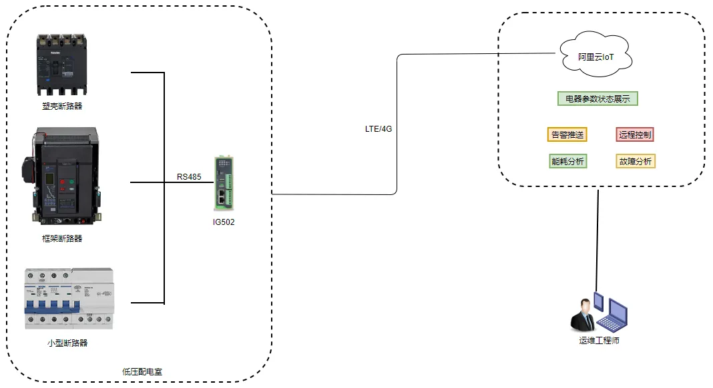

# 智能低压配电联网解决方案

## 一、方案概述

### 1.1 项目背景

某电器企业专注于低压配电设备的研发制造，为客户提供智能低压配电整体解决方案。随着智能电网和数字化转型的推进，低压配电系统的智能化、网络化需求日益增长。

### 1.2 建设目标

- 实现低压配电系统的智能化管理
- 实时监测配电设备运行状态
- 提升配电系统的安全性和可靠性
- 降低运维成本，实现远程监控

### 1.3 适用场景

- 智能配电系统
- 低压开关柜监控
- 配电房无人值守
- 智慧楼宇配电

## 二、需求分析

### 2.1 设备现状

- 设备类型：智能断路器、配电仪表、漏电保护器等
- 通信接口：以太网、RS485、4G
- 通信协议：Modbus、MQTT等
- 部署环境：配电房、开关柜
- 数量规模：分布式部署

### 2.2 核心需求

1. **实时监控需求**：实时监测电压、电流、功率等电气参数
2. **安全保护需求**：漏电保护、过载保护、短路保护
3. **远程管理需求**：远程监控和控制配电设备
4. **故障预警需求**：异常报警，提前发现潜在问题
5. **能耗管理需求**：电能计量和能耗分析

## 三、总体架构设计

本方案采用智能配电设备+边缘网关+云平台的架构，实现低压配电系统的智能化管理。

### 3.1 四层架构

1. **感知层**：智能断路器、配电仪表、传感器等现场设备
2. **网络层**：边缘网关，支持多协议接入和数据传输
3. **平台层**：配电管理平台，数据存储和分析
4. **应用层**：监控大屏、移动端APP、运维管理

### 3.2 数据流

现场设备 → 边缘网关 → 云平台 → 应用端

## 四、网络与接入方案

### 4.1 联网方式选型

支持有线以太网、4G/5G无线等多种接入方式。

### 4.2 边缘网关选型要点

- 支持多种工业协议接入
- 支持Modbus等配电设备常用协议
- 支持数据本地预处理
- 工业级设计，适应配电房环境

## 五、协议与数据采集方案

### 5.1 支持协议

- **工业协议**：Modbus RTU/TCP、DLT645
- **物联网协议**：MQTT
- **网络协议**：以太网、4G/5G

### 5.2 北向协议支持

- 支持云平台接入
- 支持标准API接口

## 六、方案亮点总结

1. **智能化配电**：实现低压配电系统的智能化管理

2. **实时监控**：实时监测电气参数和设备状态

3. **安全保护**：完善的漏电、过载、短路保护功能

4. **远程运维**：远程监控和控制，降低维护成本

5. **能耗分析**：电能计量和能耗分析，优化用电
