# 低压智能配电案例配置指导手册

## 一、文档信息

- 产品型号：IG502
- 固件版本：V2.3.1
- SDK版本：1.4.8
- APP版本：V3.4.0
- 适用场景：工业数据采集、设备联网、边缘采集上云
- 编写日期：2026年3月31日

## 二、网关概述

### 2.1 产品简介

InGateway502（简称IG502）是面向工业物联网领域推出的高性价比边缘网关。IG502尺寸小巧，接口丰富，具备便捷的
全球蜂窝接入能力。支持用户使用Python二次开发，可内置映翰通DeviceSupervisor™ Agent服务，支持上百种数据采
集协议，轻松实现设备数据采集、处理及上云，同时支持映翰通DeviceLive云管理，帮助企业加快数字化进程。

### 2.2 主要功能

- 支持串口及网口采集
- 支持DLT645协议解析，支持Modbus RTU协议，支持IEC101和104协议
- 支持MQTT数据上报
- 支持边缘计算、本地缓存
- 支持远程配置、远程诊断、远程升级
- 工业级设计

### 2.3 典型应用拓扑

现场仪表 → RS485 → IG502网关 → MQTT（json） → 能源管理平台

## 三、硬件说明

### 3.1 外观与接口

- 电源接口：DC 9–36V
- 串口：RS485 ×2路
- 网口：LAN ×2路
- 无线：4G/5G/Wi-Fi（可选）
- 指示灯：PWR、STATUS、WARN、NET、信号强度
- 复位键：恢复出厂设置

### 3.2 接线说明

#### 3.2.1 电源接线

- 正极：V+
- 负极：V-
- 注意：防反接、防雷、接地


#### 3.2.2 RS485 接线

- A → 1A/2A
- B → 1B/2B
- 屏蔽层单端接地
- A、B 前边的数字代表的是对应的串口号（如果是单485的型号，1A和1B看上面的TXD和RXD，代表的是232串口）
- 拨码开关代表的是串口的上下拉电阻，如果在现场出现通信异常可以将开关调到ON位置


#### 3.2.3 以太网接线

IG502有2个RJ45以太网口，支持10M/100M自适应速率。RJ45的引脚说明如下：
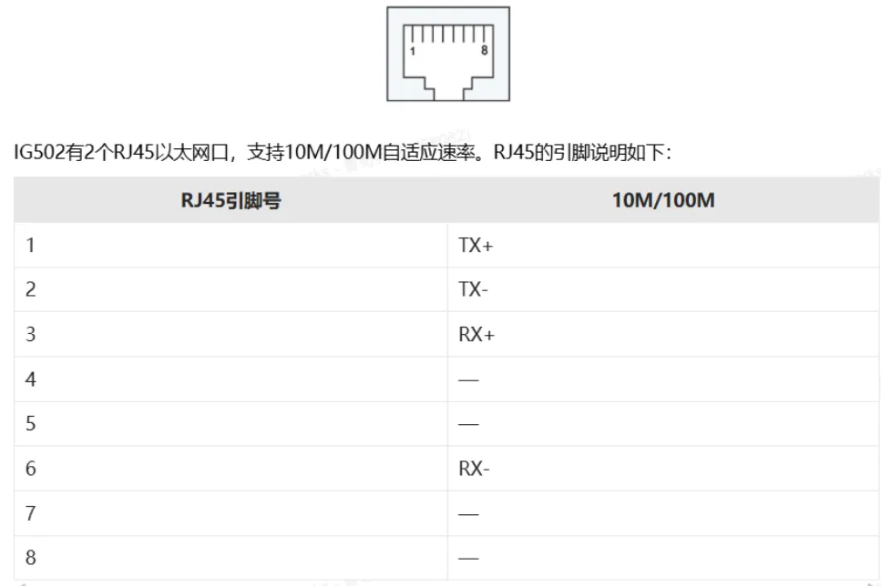

## 四、出厂默认参数

- 默认 IP：192.168.2.1
- 子网掩码：255.255.255.0
- Web 用户名：adm
- Web 密码：123456
- 串口默认参数：9600,8,N,1

## 五、前期准备

1. 电脑设置与网关LAN口同网段 IP，网关LAN口是：192.168.2.1。
2. 网线连接电脑与网关 LAN 口连接
3. 网关上电，等待 RUN 灯常亮
4. 确保电脑安装正常使用的浏览器

## 六、网络配置

### 6.1 LAN 口配置（静态 ）

1. 进入【网络设置】→【LAN】
2. 选择静态 IP
3. 设置 IP、子网掩码、网关、DNS
4. 保存并应用
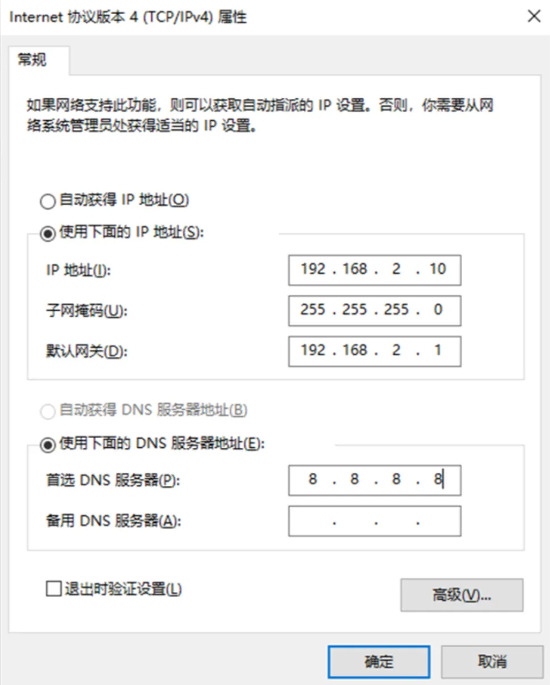

### 6.2 4G 无线网络配置（可选）

1. 插入 SIM 卡（4G）
2. 在面板上查看信号强度指示灯，信号强度从弱到强，对应1-3个灯亮起

## 七、设备与协议配置（核心）

### 7.1 支持协议列表

- Modbus RTU / TCP
- PLC 协议：西门子、三菱、欧姆龙、施耐德、台达、信捷等
- 仪表协议：DL/T645、CJ/T188 等
- 自定义协议

### 7.2 添加采集设备

1. 进入【边缘计算】→【设备监控】→【测点监控】→【添加控制器】
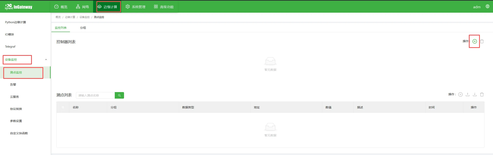
2. 名称这里示例为断路器首字母-DLQ，选择协议类型，根据设备的协议选择对应的协议类型，这里使用的是ModbusRTU协议。
3. 设置设备的Modbus的从站地址（站号）
4. 通讯凡是选择RS485接口，串口参数按照设备通信参数设置，这里是默认设置。
5. 设置轮询周期单位默认是秒
6. 确认，保存
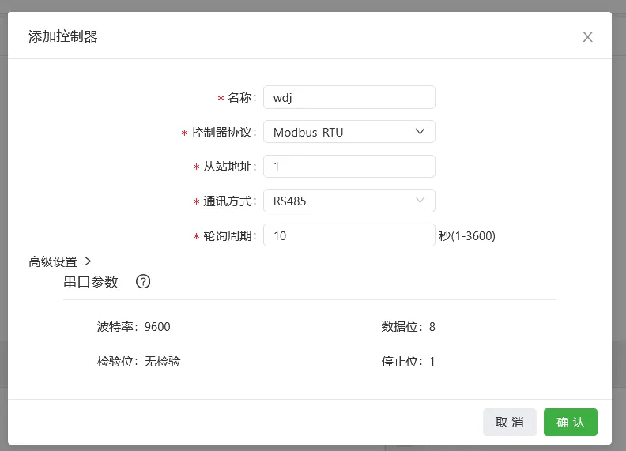

### 7.3 添加采集点位

1. 进入【点位配置】→【添加点位】
2. 点位名称：`[根据需求填写这里按照平台需求写的]`
3. 地址：4X(03功能码对应的是4X，04功能码对应的是3X)，后面是具体的寄存器地址这里示例写的23
4. 数据类型：int16/uint16/int32/float 等
5. 读写权限：读取/写入/读写
6. 上传模式：周期上传/变化上传/不上传
7. 单位：该字段不上报仅作为本地展示。
8. 描述：该字段仅作为展示不上传
9. 所属分组：和数据上报关联，默认是默认分组
10. 数据运算：根据需要进行数据运算，如：偏移缩放等规则设定
11. 保存
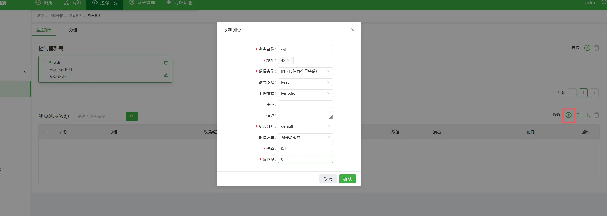
查看读取结果：
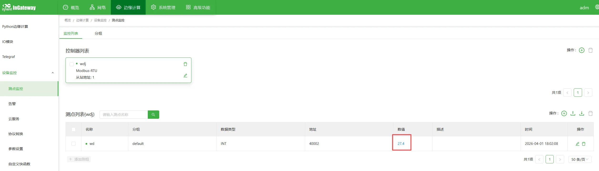

### 7.4 点位表导入 / 导出

支持 csv文件 批量导入、导出备份配置。
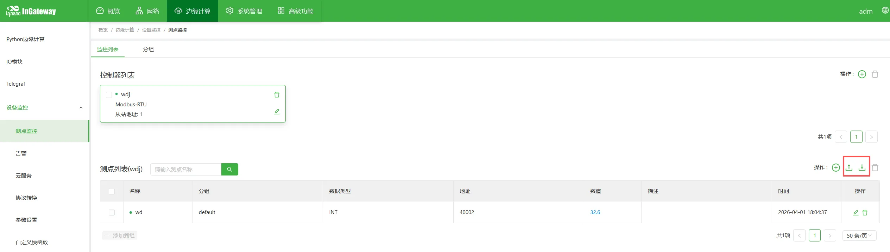

## 八、数据上传配置

### 8.1 MQTT 上传

1. 进入【云服务】→【MQTT云服务】
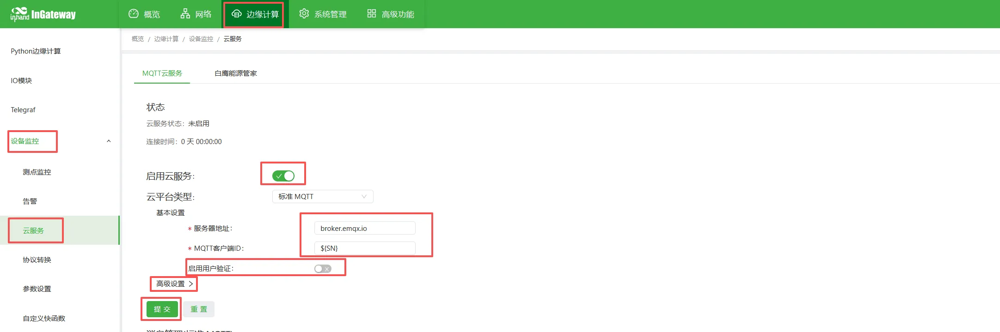
2. 启用云服务
3. 服务器地址：`xxx.xxx.xxx.xxx`
4. 客户端ID `${SN}` 这里引用网关的SN、用户名 `gatewayXXX`、密码`XXXXXXXXX`
5. 主题与脚本设定：
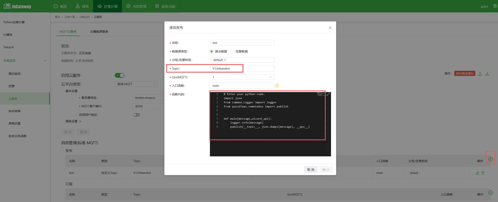
   - 上报
     主题：`[v1/XXXXX/XXXXX/upload]`

     ```python
        # Enter your python code.
        import json
        from common.Logger import logger
        from quickfaas.remotebus import publish


        def main(message,wizard_api):
            logger.info(message)
            publish(__topic__, json.dumps(message), __qos__)
     ```

   - 订阅主题：`[v1/XXXXX/XXXXX/cmd]`
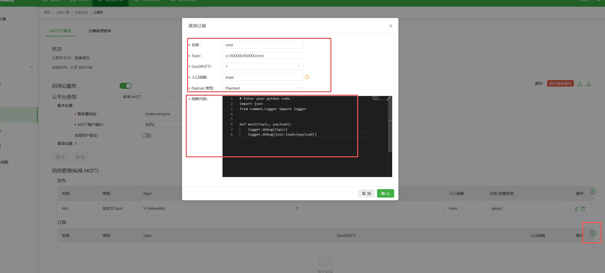

     ```python
        # Enter your python code.
        import json
        from common.Logger import logger

        def main(topic, payload):
            logger.debug(topic)
            logger.debug(json.loads(payload))
     ```

6. 查看日志数据是否成功上报

   - 进入【边缘计算】→【python边缘计算】→【App状态】→【日志下边的小放大镜】
   - 查看上传日志，确认数据是否成功上报，也可以看到订阅的指令。
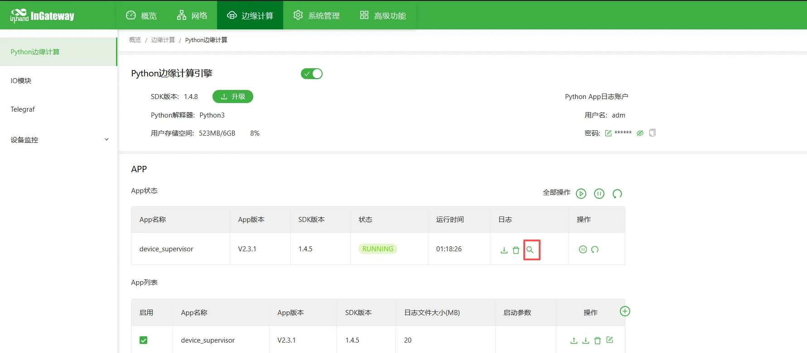

这部分的脚本为初始脚本，如果需要定制的功能可以使用定制化的python脚本程序实现。

## 九、远程管理

### 9.1 远程接入

- deviceMange远程配置
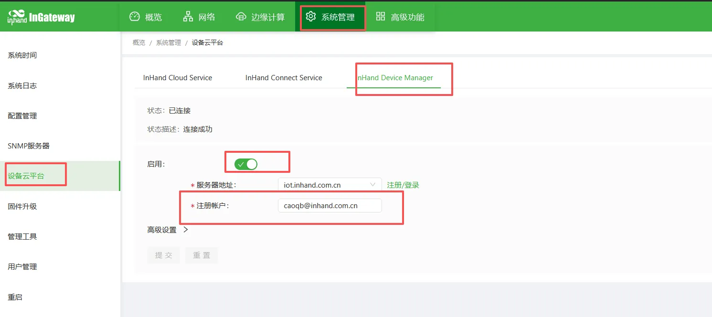

### 9.2 配置备份与恢复

- 导入导出APP配置：
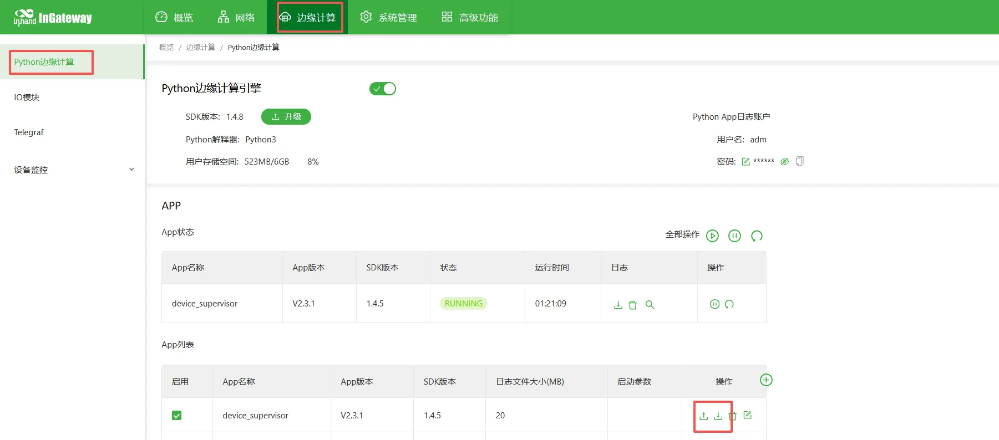
- 导入导出网关配置：
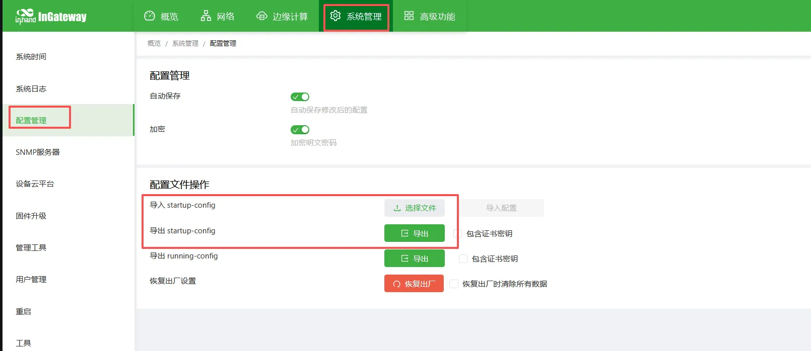

## 十、常见问题与排查

1. 无法打开 Web 界面

   - 检查网段、网线、IP 是否冲突
   - 网关恢复出厂设置重试

2. 串口收不到数据

   - 检查接线 A/B
   - 核对波特率、站号、寄存器地址
   - 用串口工具测试设备是否正常

3. 网关采集不到数据

   - 检查点位地址、数据类型
   - 查看采集日志
   - 检查设备是否支持该协议

4. MQTT 连接失败

   - 网络是否通
   - 服务器地址、端口、用户名、密码
   - 防火墙 / 端口是否开放

## 十一、安全注意事项

- 工业现场可靠接地
- 避免带电热插拔串口
- 配置完成后备份
- 远程密码定期修改
- 禁止非授权人员操作
