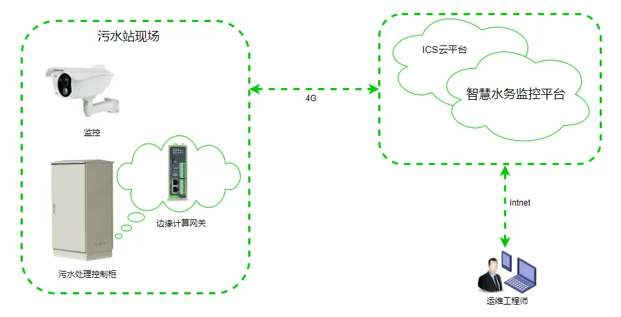

# 农村污水处理联网解决方案

## 一、方案概述

### 1.1 项目背景

某自动化企业专注于水务自动化领域，为农村污水处理提供整体解决方案。随着乡村振兴战略的推进，农村污水治理成为重要工作，需要建立智能化的污水处理监控体系。

### 1.2 建设目标

- 实现农村污水处理站的远程监控
- 实时监测污水处理设备运行状态
- 提升污水处理效率和管理水平
- 降低运维成本，实现无人值守

### 1.3 适用场景

- 农村污水处理站
- 村镇污水治理
- 小型污水厂监控
- 分布式污水处理设施

## 二、需求分析

### 2.1 设备现状

- 设备类型：PLC控制器、水泵、传感器、仪表等
- 通信接口：以太网、RS485、4G
- 通信协议：Modbus、MQTT等
- 部署环境：农村污水处理站点，分布分散
- 数量规模：多个村镇站点

### 2.2 核心需求

1. **远程监控需求**：实时监测污水处理设备运行状态
2. **水质监测需求**：监测进出水水质参数
3. **故障报警需求**：设备故障自动报警
4. **数据采集需求**：采集流量、压力、液位等数据
5. **运维管理需求**：设备远程维护和升级

## 三、总体架构设计

本方案采用边缘网关+云平台的架构，现场污水处理设备通过边缘网关接入网络，数据上传至云平台进行统一管理和分析。

### 3.1 四层架构

1. **感知层**：水泵、传感器、PLC、仪表等现场设备
2. **网络层**：边缘网关，支持4G/有线接入
3. **平台层**：污水处理云平台
4. **应用层**：监控中心、移动端APP、运维管理

### 3.2 数据流

现场设备 → 边缘网关 → 云平台 → 监控中心

## 四、网络与接入方案

### 4.1 联网方式选型

采用4G无线接入为主，支持有线备份，适应农村偏远地区的网络环境。

### 4.2 边缘网关选型要点

- 支持多种工业协议接入
- 支持4G/有线双网备份
- 支持数据本地缓存和断网续传
- 工业级设计，适应户外环境

## 五、协议与数据采集方案

### 5.1 支持协议

- **工业协议**：Modbus RTU/TCP、PLC协议
- **物联网协议**：MQTT
- **网络协议**：4G、以太网

### 5.2 北向协议支持

- 支持云平台接入
- 支持远程运维管理

## 六、方案亮点总结

1. **远程监控**：实现农村污水处理站的远程实时监控

2. **无人值守**：支持自动运行和远程维护，降低人力成本

3. **水质保障**：实时监测水质参数，确保达标排放

4. **故障预警**：设备异常自动报警，及时处理问题

5. **集中管理**：多站点集中监控，提高管理效率
