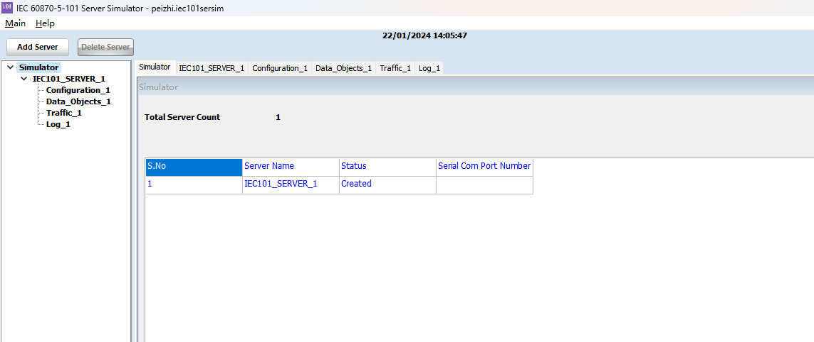
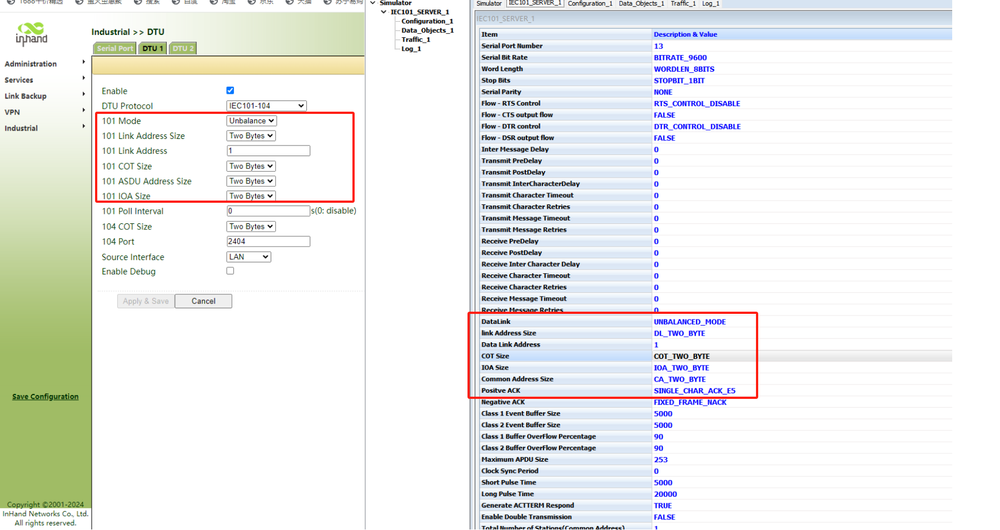
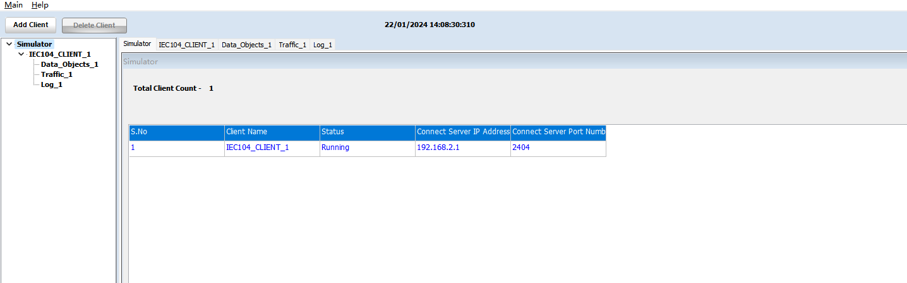
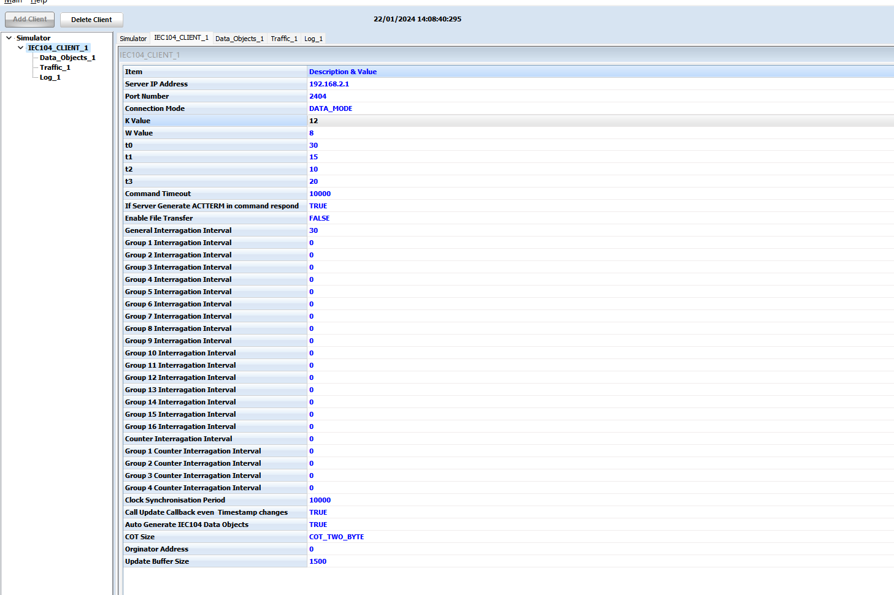
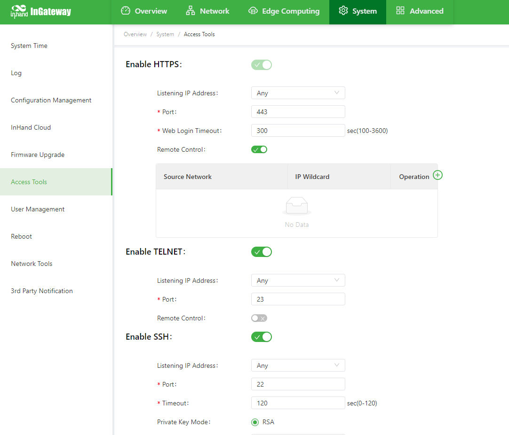
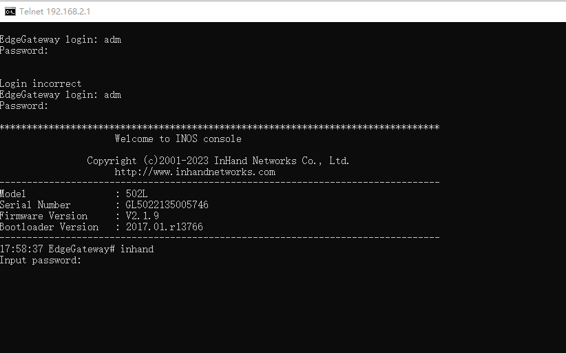
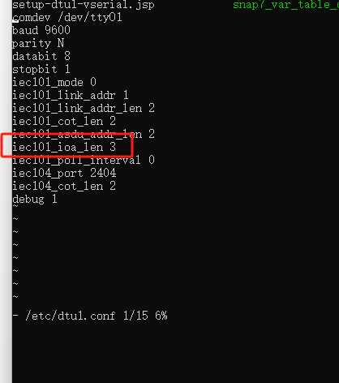

# IG502 — IEC 60870-5-101 转 IEC 60870-5-104 转换配置指南

**产品型号：** IG502（InGateway 502）
---

## 1. 文档信息

| 项目 | 值 |
|------|-------|
| 产品 | 映翰通 IG502 边缘网关 |
| 应用 | IEC 60870-5-101（串行） ↔ IEC 60870-5-104（TCP/IP）协议转换 |
| 典型用例 | 智能电网、配电自动化、变电站改造、可再生能源电站、水/气 SCADA |

---

## 2. 参考网络

本手册通篇使用的参考组网如下：

- **PC 1** — 运行 IEC 60870-5-101 *服务器* 模拟器（充当现场 RTU/IED）。通过 RS-485 线连接到 IG502 的 RS-485 端口。
- **IG502** — 网关。在 RS-485 侧作为 IEC 101 客户端（IEC 101 Client），在 LAN 口侧作为 IEC 104 服务器（IEC 104 Server）。
- **PC 2** — 运行 IEC 60870-5-104 *客户端* 模拟器（充当 SCADA 主站）。通过网线连接到 IG502 的 LAN 口。

**测试目标：** PC 2 上的 IEC 104 客户端能够端到端读取 PC 1 上 IEC 101 服务器生成的数据点。


在生产部署中，PC 1 替换为真实的 RS-485 侧 RTU/IED，PC 2 替换为以太网或蜂窝网络上的真实 SCADA 前端。

---

## 3. 硬件概述

### 3.1 IG502 概览

- 电源输入：DC 9–36 V，反接保护
- 以太网：2× RJ45（可配置 WAN / LAN）
- 串口：RS-232 和 / 或 RS-485（视型号而定）
- 无线：4G / 5G / Wi-Fi（视型号而定）
- 指示灯：电源、状态、蜂窝、信号、Wi-Fi
- 复位按钮：长按恢复出厂默认
- 安装方式：DIN 导轨 / 壁挂

### 3.2 本应用接线

| 端口 | 连接对象 | 说明 |
|------|-----------|-------|
| 电源 | DC 9–36 V 供电 | 注意极性 |
| RS-485（A / B） | IEC 101 设备的 RS-485（A / B） | 共地；多站时菊花链；总线两端接 120 Ω 终端电阻 |
| LAN / WAN（RJ45） | SCADA 网络交换机 / PC | 默认为 LAN；可改为 WAN |
| 蜂窝天线（MAIN） | 4G / 5G 天线 | 使用蜂窝回传时接入 |
| GND | 机柜接地 | 变电站 / 户外安装必须可靠接地 |

## 4. 出厂默认值

| 参数 | 默认值 |
|-----------|---------|
| LAN IP | 192.168.2.1 |
| 子网掩码 | 255.255.255.0 |
| Web 用户名 | adm |
| Web 密码 | 123456  *(后续批次：随机密码 — 见设备标签)* |
| Telnet / SSH | 默认禁用 |

## 5. 安装前检查清单

1. 将 PC 网卡设置为 IG502 LAN 子网地址（例如 192.168.2.100 / 255.255.255.0）。
2. 使用网线将 PC 连接到 IG502 的 LAN 口。
3. 为 IG502 上电；等待状态指示灯常亮。
4. 打开现代浏览器（Chrome / Edge / Firefox），访问 `http://192.168.2.1`。
5. 使用 `adm / 123456`（或标签密码）登录。

## 6. 网络配置（摘要）

LAN、WAN 和蜂窝网络的完整配置流程请参见标准 IG502 用户手册。以下仅列出与 IEC 转换相关的关键项。

- **LAN IP：** 与 SCADA 前端保持在同一子网（本手册中的 PC 2）。示例采用默认 192.168.2.1。
- **蜂窝（若用作上行链路）：** 在设备断电状态下插入 SIM 卡；在 *Network → Cellular* 下配置 APN。确认信号指示灯为绿色（RSSI 21–30）。
- **防火墙 / 端口转发：** 确保允许 SCADA 主站到 IG502 的入站 TCP **2404** 端口。

有关基础 Web 配置流程（修改 LAN IP、蜂窝拨号、信号指示灯说明），请参见本文件夹中的现有 *Configuration Manual*。

## 7. IEC 101 ↔ IEC 104 转换 — 分步配置

这是本手册的核心内容。IG502 通过 **Industrial → DTU** 下的 **DTU 1** 模块实现协议转换。

### 7.1 启用 DTU 并选择 IEC101-104 协议

1. 登录 IG502 Web 界面。
2. 进入 **Industrial → DTU → DTU 1**。
3. 勾选 **Enable**（启用）。
4. 将 **DTU Protocol** 设置为 `IEC101-104`。


### 7.2 配置 IEC 101（串行）侧

这些参数必须与串行总线上的 IEC 101 从站（或模拟器）保持一致。

| 字段 | 推荐值 / 默认值 | 说明 |
|-------|-----------------------|-------------|
| 101 Mode（101 模式） | Unbalance（非平衡） | 典型多站 RS-485 轮询拓扑使用 `Unbalance`（非平衡）；点对点使用 `Balance`（平衡）。必须与设备一致。 |
| 101 Link Address Size（链路地址长度） | Two Bytes（2 字节） | 多数现场设备使用 2 字节；部分老旧 RTU 使用 1 字节。必须一致。 |
| 101 Link Address（链路地址） | 1 | 从站链路地址。必须与设备一致。 |
| 101 COT Size（传送原因长度） | Two Bytes（2 字节） | IEC 101 通常使用 2 字节。 |
| 101 ASDU Address Size（ASDU 地址长度） | Two Bytes（2 字节） | 公共 ASDU 地址（站地址）长度。 |
| 101 IOA Size（信息对象地址长度） | Two Bytes（2 字节） | 信息对象地址（IOA）长度。Web 界面提供 One/Two Bytes 选项。**如需 3 字节，请参见 §7.6。** |
| 101 Poll Interval（轮询间隔） | 0（禁用）或 1–60 s | 0 表示不生成后台轮询，依赖自发数据；设置数值（如 5–10 s）则主动轮询。 |

串口参数（波特率、校验、数据位、停止位）在 **Serial Port**（串口）子页中设置（默认：9600, N, 8, 1），必须与有线总线保持一致。

### 7.3 配置 IEC 104（TCP）侧

| 字段 | 推荐值 / 默认值 | 说明 |
|-------|-----------------------|-------------|
| 104 COT Size（传送原因长度） | Two Bytes（2 字节） | 标准 IEC 104。 |
| 104 Port（104 端口） | 2404 | 标准 IEC 104 监听端口。 |
| Source Interface（源接口） | LAN | IG502 监听 IEC 104 客户端的接口。可按需选择 LAN、WAN 或 Cellular。 |
| Enable Debug（启用调试） | Off（生产环境） / On（调试阶段） | 启用详细的 DTU 日志，可通过日志页面或 SSH 查看。 |

### 7.4 应用并保存

点击页面底部的 **Apply & Save**（应用并保存）。IG502 将重启 DTU 模块；无需整机重启。

### 7.5 使用模拟器验证（建议用于调试阶段）

**PC 1 — IEC 101 服务器模拟器：**



将模拟器上的帧格式长度与 IG502 完全对齐（链路地址、COT、ASDU、IOA）：



添加要发布的数据对象 — 单点、双点、步位置、位串、测量浮点、单/双命令、设定点命令：


**PC 2 — IEC 104 客户端模拟器：**

将客户端指向 IG502 的 LAN IP 和端口 2404：



确认 K/W 定时器及命令超时与 SCADA 标准一致（下图默认值适用于大多数场景）：



**预期结果：** IEC 101 侧配置的每个对象都会出现在 IEC 104 侧，并带有正确的 Type ID（类型标识）、COT（传送原因）、值、品质标志（GD）以及最新时标。


### 7.6 可选 — 将 IEC 101 IOA 长度设置为 3 字节（CLI 覆盖）

Web 界面的 IOA 长度选项为 One Byte（1 字节） / Two Bytes（2 字节）。若现场设备在 IEC 101 侧需要 **3 字节 IOA**，则必须通过 CLI 编辑 DTU 配置文件来设置。

**步骤 1.** 在 IG502 上启用 Telnet（或 SSH）。

进入 **System → Access Tools**，开启 Telnet（或 SSH），并应用。



**步骤 2.** 应用配置。


**步骤 3.** 临时禁用 DTU 1 实例。


**步骤 4.** 通过 Telnet 连接到 IG502（`telnet 192.168.2.1`），使用 `adm` 及常规密码登录；第二次提示输入特权密码（默认为 `inhand`）。



**步骤 5.** 编辑 DTU 配置文件：

```
vi /etc/dtu1.conf
```

找到 `iec101_ioa_len` 行，并将其值改为 `3`：

```
comdev    /dev/tty01
baud      9600
parity    N
databit   8
stopbit   1
iec101_mode          0
iec101_link_addr     1
iec101_link_addr_len 2
iec101_cot_len       2
iec101_asdu_addr_len 2
iec101_ioa_len       3        # <-- 改为 3
iec101_poll_interval 0
iec104_port          2404
iec104_cot_len       2
debug                1
```

保存并退出（`:wq`）。



**步骤 6.** 使用修改后的文件启动 IEC 10x 服务：

```
iec10x -c /etc/dtu1.conf
```

此时 DTU 在 101 侧使用 3 字节 IOA 运行，而 104 侧仍保持标准 3 字节 IOA。

> ⚠️ **注意：** 若之后从 Web 界面重新启用 DTU 1，GUI 会覆盖 `/etc/dtu1.conf`。任何 UI 变更后，请重新执行步骤 3–6 以保持 3 字节 IOA 设置。

---

## 8. 验证检查清单

离开现场前，请确认：

- [ ] IG502 状态指示灯常亮；若使用蜂窝，信号指示灯为绿色。
- [ ] DTU 1 页面显示 `Enabled`（已启用），协议为 `IEC101-104`。
- [ ] 帧格式参数（链路地址、COT、ASDU、IOA）与现场设备一致。
- [ ] IG502 上的流量计数器或调试日志显示 IEC 101 轮询 / 应答成功。
- [ ] SCADA 主站能够打开到 IG502 的 TCP/2404 会话，并发出 `STARTDT act` / 收到 `STARTDT con`。
- [ ] 总召唤返回所有预期的数据对象，且数值和品质标志正确。
- [ ] 命令（C_SC、C_DC、C_SE）往返到达 IEC 101 设备，并返回 `ActCon` + `ActTerm`。

---

## 9. 故障排查

| 现象 | 可能原因 | 处理措施 |
|---------|-------------|--------|
| SCADA 主站无数据 | 帧格式不匹配（链路/COT/ASDU/IOA 长度或地址） | 对照现场设备文档重新核对 §7.2 的值 |
| 有数据但数值错误 / IOA 偏移 | IOA 长度不匹配 | 检查 §7.2；若需 3 字节 IOA，执行 §7.6 |
| IEC 104 会话建立后数秒断开 | t1 / t2 / t3 / W / K 不匹配，或 NAT 空闲超时 | 对齐主站与 IG502 的定时器；关闭中间防火墙的激进 NAT 超时 |
| 串口完全没有活动 | 串口选错、波特率/校验/停止位错误、RS-485 A/B 接反 | 确认接线及 **Industrial → DTU → Serial Port** 下的串口参数 |
| SCADA 无法访问 2404 | 防火墙 / VPN 路由 | 允许到 IG502 的入站 TCP 2404；从 SCADA 主机执行 `telnet <IG502_IP> 2404` 验证 |
| 4G 拨号失败 | SIM 卡未插好、APN 错误、信号弱 | **断电后**重新插拔 SIM 卡，设置 APN，检查天线 |
| 忘记 Web 密码 | — | 长按复位按钮恢复出厂默认，重新配置 |

---

## 10. 安全注意事项

- 变电站 / 户外部署时，确保机柜可靠接地。
- 设备上电时请勿热插拔串口连接器。
- 调试完成后备份配置（**Services → Configuration Management → Backup Configuration**）。
- 投产前修改默认 Web 密码，并定期轮换。
- 将 Telnet / SSH 访问限制在可信网络；生产环境优先使用 SSH 而非 Telnet。

---

## 11. 附录 A — IEC 101 / 104 常用类型标识

| Type ID（类型标识） | Symbol（符号） | 含义 |
|---------|--------|---------|
| 1 | M_SP_NA_1 | 单点信息（Single-point information） |
| 3 | M_DP_NA_1 | 双点信息（Double-point information） |
| 5 | M_ST_NA_1 | 步位置（Step position） |
| 7 | M_BO_NA_1 | 32 位位串（Bitstring of 32 bits） |
| 13 | M_ME_NC_1 | 测量值，短浮点数（Measured value, short floating point） |
| 45 | C_SC_NA_1 | 单命令（Single command） |
| 46 | C_DC_NA_1 | 双命令（Double command） |
| 50 | C_SE_NC_1 | 设定点命令，短浮点数（Set-point command, short floating point） |

以上为 §7.5 验证流程中使用的 8 个类型标识；IG502 支持 IEC 60870-5-101/104 定义的全部监测 / 控制 / 参数 / 系统类型标识。

---

## 12. 附录 B — 默认 DTU 配置文件参考

```
# /etc/dtu1.conf — 典型默认值
comdev               /dev/tty01     # IG502 用于 RS-485 的串口设备
baud                 9600
parity               N
databit              8
stopbit              1
iec101_mode          0              # 0 = 非平衡（unbalance），1 = 平衡（balance）
iec101_link_addr     1
iec101_link_addr_len 2
iec101_cot_len       2
iec101_asdu_addr_len 2
iec101_ioa_len       2              # 3 字节 IOA 时改为 3（参见 §7.6）
iec101_poll_interval 0              # 秒；0 表示禁用主动轮询
iec104_port          2404
iec104_cot_len       2
debug                1
```

---
