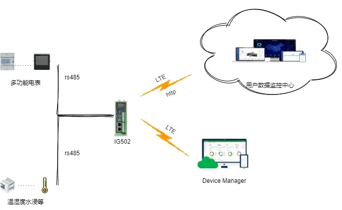

# 数字化工厂项目方案

# 一、方案概述

## 1.1 项目背景

随着智慧工厂的推进，现场存在大量温度、湿度、水浸、电表等传感器仪表设备，设备分散且数据孤岛，无法远程监控相关数据，运维成本高

## 1.2 建设目标

- 设备全量联网，统一接入管理

- 数据实时采集、标准化、上云 / 入平台

- 支持远程配置、远程诊断、远程升级

- 实现告警、联动、可视化、报表分析

- 提升运维效率，降低人工巡检成本

- 安全稳定、易扩展、易维护

## 1.3 适用场景

- 仪表 / 传感器联网（电表、水表、气表、温湿度）
- 智慧园区 

# 二、需求分析

## 2.1 设备现状

- 设备类型：2 种（仪表 / 传感器）
- 通信接口：RS485
- 通信协议：Modbus RTU/TCP、HTTP、
- 部署环境：室内 / 室外 

# 三、总体架构设计

## 3.1 四层架构

1.感知层：传感器、仪表

2.网络层：边缘网关、4G/5G

3.平台层：物联网平台（HTTP/ 云平台）、数据存储、边缘计算

4.应用层：监控大屏、Web 管理后台、APP、告警系统

## 3.2 数据流

设备→ 边缘网关 → 协议解析 → 边缘计算 / 本地缓存 → 云平台 → 应用展示 / 控制下发

## 3.3 方案拓扑

# 四、网络与接入方案

## 4.1 联网方式选型

蜂窝

## 4.2 边缘网关选型要点

- 支持多协议（Modbus、DLT等）

- 多串口（RS485/RS232）、网口、4G/5G

- 边缘计算、本地缓存、断网续传

- 工业级宽温、防尘、抗干扰

- 远程管理、远程升级、远程配置

# 五、协议与数据采集方案

## 5.1 南向需支持协议

- 工业协议：Modbus RTU/TCP

- 仪表协议：DL/T645

## 5.2 北向需支持协议

- HTTP

- 网关侧需解析HTTP报文格式

# 六、方案亮点总结

1. 一站式：接入 + 网络 + 平台 + 应用全栈解决方案

2. 高兼容：多设备、多协议、多网络统一接入

3. 高可靠：边缘缓存、断网续传、双链路备份

4. 易扩展：支持批量扩容、二次开发、API 对接

5. 低成本：减少人工巡检，提升运维效率

6. 安全合规：传输加密、权限管理、操作审计
