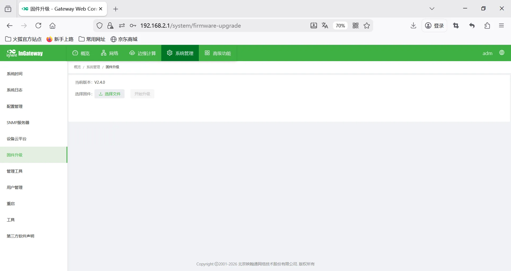
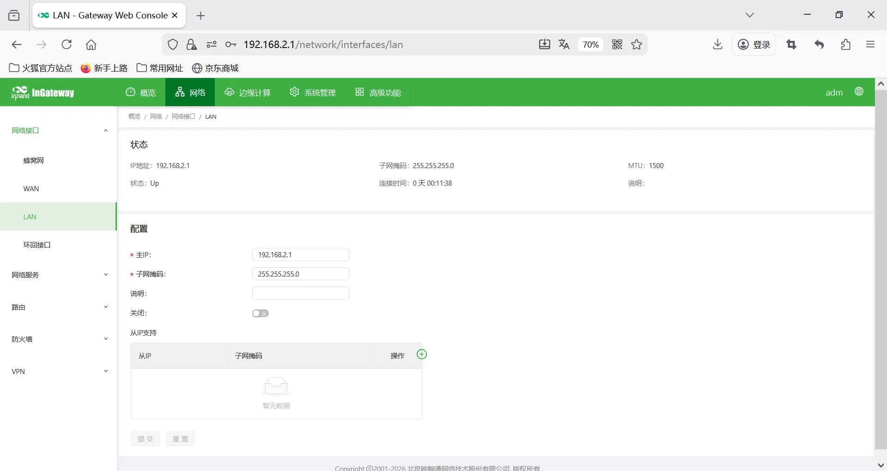
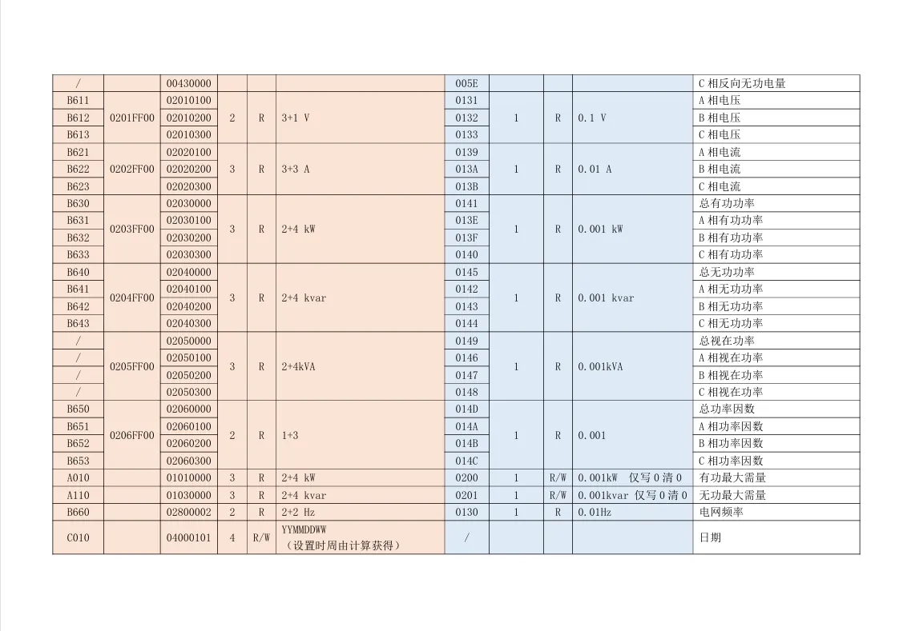
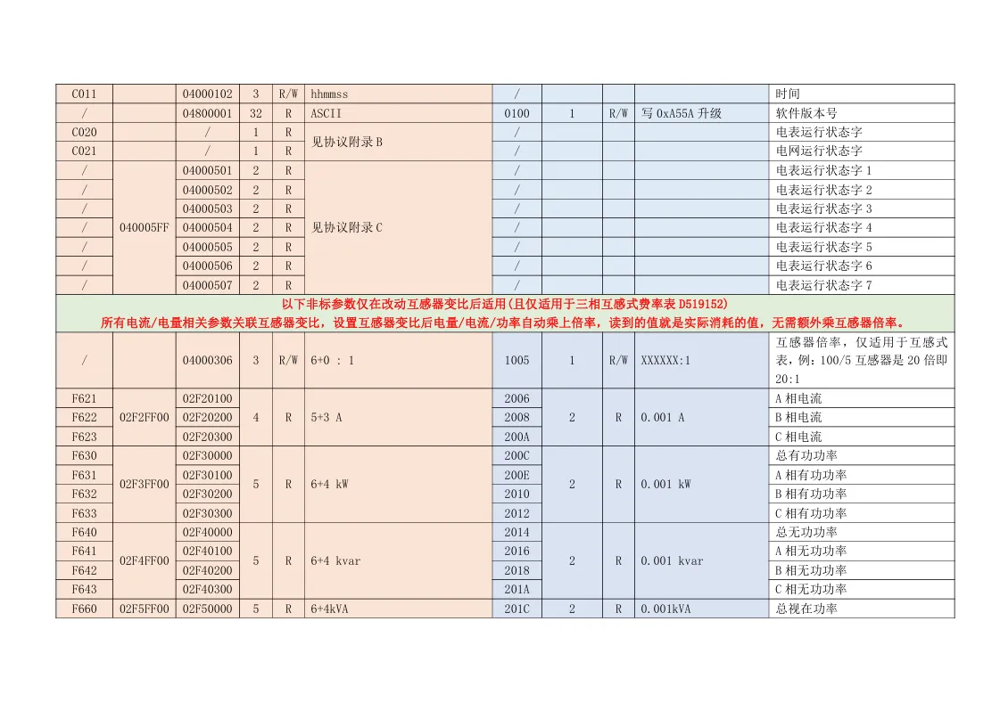
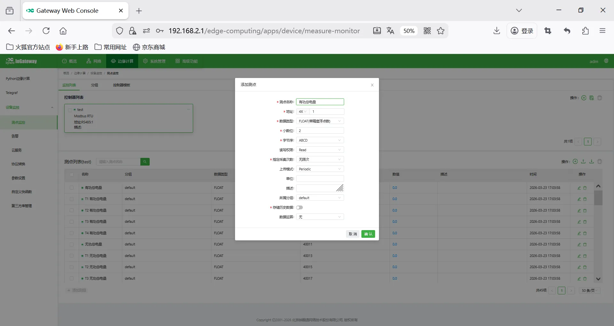
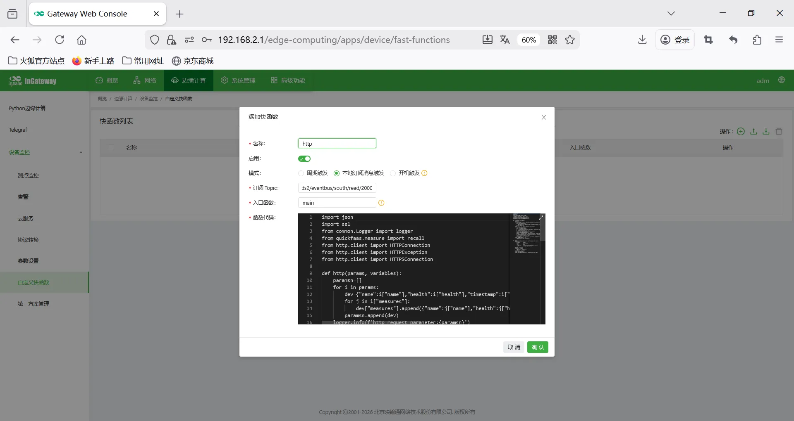
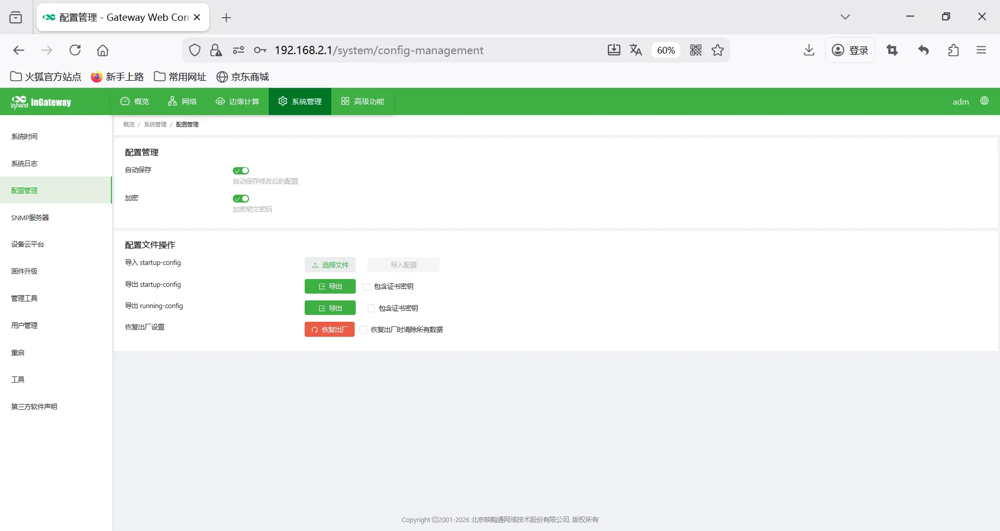

# 数字化工厂改造网关配置手册模板

## 一、文档信息

- **文档名称**：数字化工厂改造网关配置手册
- **产品型号**：IG502
- **固件版本**：V2.4.0、DSA V3.4.0
- **适用场景**：电表数据采集、设备联网、边缘采集上云
- **编写日期**：2026年3月20日



 

## 二、网关概述

### 2.1 产品简介

本数采网关用于工业现场**PLC、仪表、传感器、变频器、伺服**等设备的数据采集，支持多协议解析、边缘计算、断网续传、远程管理、数据上云。

### 2.2 主要功能

- 多串口 / 网口采集
- 主流工业协议解析
- MQTT/Modbus TCP 数据上传
- 边缘计算、本地缓存
- 远程配置、远程诊断、远程升级
- 宽温工业级设计

### 2.3 典型应用拓扑

设备 → RS485 / 以太网 → 数采网关 → 4G / 以太网 → 云平台 / 上位机 / SCADA

## 三、硬件说明

## 3.1 外观与接口

- 电源接口：DC 9–36V
- 串口：RS232 / RS485 
- 网口：LAN ×2路（WAN/LAN 可配置）
- 无线：4G/5G/Wi-Fi（可选）
- 指示灯：PWR、RUN、NET、信号强度
- 复位键：恢复出厂设置

## 3.2 接线说明

#### 3.2.1 电源接线

- 正极：V+
- 负极：V-
- 注意：防反接、防雷、接地

#### 3.2.2 RS485 接线

- A → A
- B → B
- 屏蔽层单端接地
- 终端电阻：120Ω（远距离需加）

#### 3.2.3 以太网接线

直连 / 交叉自适应，建议超五类及以上网线。

## 四、出厂默认参数

- 默认 IP：192.168.2.1
- 子网掩码：255.255.255.0
- Web 用户名：adm
- Web 密码：123456
- 串口默认参数：9600,8,N,1



## 五、前期准备

1. 电脑设置与网关同网段 IP
2. 网线连接电脑与网关 LAN 口
3. 网关上电，等待 RUN 灯常亮
4. 浏览器输入网关 IP 进入配置页面

 


## 六、网络配置

1. 插入 SIM 卡（支持 NB-IoT/4G）

2. 开启移动网络

3. APN：自动 / 手动填写

4. 信号强度查看


## 七、串口配置

1. 进入【串口配置】→【COM1/COM2…】
2. 模式选择：采集模式
3. 波特率：9600
4. 数据位：8
5. 校验位：None
6. 停止位：1
7. 保存生效

 

## 八、设备与协议配置

### 8.1 查看终端设备协议点表文档（厂家提供）







### 8.2 添加采集设备

1. 进入【数据采集配置】→【添加设备】
2. 选择Modbus RTU
3. 选择串口
4. 设置设备地址1
5. 设置超时、重试次数
6. 保存


### 8.3 添加采集点位

1. 进入【点位配置】→【添加点位】
2. 点位名称：自定义
3. 寄存器功能码：03(4x)
4. 地址偏移：0
5. 数据类型：int16/uint16/int32/float 等
6. 采集间隔：100ms
7. 系数、单位、量程
8. 告警上下限（可选）
9. 保存




### 8.4 点位表导入 / 导出

支持 Excel 批量导入、导出备份。

## 九、数据上传配置

### HTTP 上传

自定义快函数中通过代码配置 URL、请求方式、Header、Body 模板。



实例代码

```python
# data=[{"name": "ED002092", "health": 1, "timestamp": 1773107297, "timestampMsec": 1773107297383, "measures": [{"name": "pl", "health": 1, "timestamp": 1773107293, "timestampMsec": 1773107293724, "value": 49.960000000000001}]}]

import json
import ssl
from common.Logger import logger
from quickfaas.measure import recall
from http.client import HTTPConnection
from http.client import HTTPException
from http.client import HTTPSConnection

def http(params, variables):
    paramsn=[]
    for i in params:
        dev={"name":i["name"],"health":i["health"],"timestamp":i["timestamp"],"measures":[]}
        for j in i["measures"]:
            dev["measures"].append({"name":j["name"],"health":j["health"],"timestamp":j["timestamp"],"value":j["value"]})
        paramsn.append(dev)
    logger.info(f'http request parameter:{paramsn}')
    try:
        url = variables["url"]
        port = variables["port"]
        h1 = HTTPSConnection(host=url, port=port, context=ssl.SSLContext(),timeout=3)
        if variables["schema"] == "http":
            h1 = HTTPConnection(host=url, port=port)
        body = json.dumps(paramsn)
        logger.info(f'Send HttpBody --> {body}')
        headers = {"Content-Type": "application/json", "x-api-key": variables["x-api-key"]}
        h1.request(method="POST", url=variables["path"], body=body, headers=headers)
        result = h1.getresponse().read()
        h1.close()
        logger.debug(f'http reponse is :{str(result, "UTF-8")}')
    except HTTPException as err:
        logger.error(f'http error:{err}')

def main():
    logger.info("Report measure to platform pass http start")
    variables = {
        "schema":       "http",
        "url":          "***.***.***.***",
        "port":         8080,
        "x-api-key":    "***************************",
        "path":         "dvcRep/reportingforjz"
    }
    measures = recall()
    if measures is None:
        logger.warn("No measures !")
        return
    http(measures, variables)
    logger.info(measures)
    logger.info("Report measure to platform pass http end")
```

## 十、导入网关配置和DSA配置

配置文件见config目录




