# IG532 快速安装手册

---

## 第一部分：快速装机（图文整体流程）

> **您需要先做：** 开箱 → 固定设备 → 接电源与网线 →（若用蜂窝）**断电**装 SIM、接天线 → 上电 → PC 同网段 → 浏览器打开 Web。
> **再做：** 翻到下方 **第二部分**，按需查阅装箱、灯义、壁挂、各接口引脚等。

### 必读摘要（接线、上电前）

| 项目 | 要求 |
|------|------|
| 供电 | **12～48 V DC**，双引脚端子 **V+ / V−**（可选配 12 V 2 A 适配器）；**PWR 红灯长亮**表示已正常上电。 |
| SIM 卡 | **须断电**安装或拔出；**不支持热拔插**（详见 §2.5.6）。 |
| Micro SD | **须断电**安装或拔出；**不支持热插拔**（详见 §2.5.7）。 |
| USB 存储 | 支持热插拔；拔出前先 `sync`，并退出 `/mnt/usb/sda_<num>` 目录，否则需手动 `umount`（详见 §2.5.7）。 |
| 蜂窝 / Lora 天线 | 按壳体**丝印**（Lora、ANT1、ANT2）拧入对应 SMA 接口；标配数量因型号而异，见《IG532 系列边缘网关产品规格书》订购信息。 |

---

### 步骤 1：对照实物，确认面板与接口区域

对照下图核对 IG532 的正面板与上面板，找到电源端子、以太网口、Console、串口、SIM 卡座、天线接口和指示灯的位置。

**正面板**

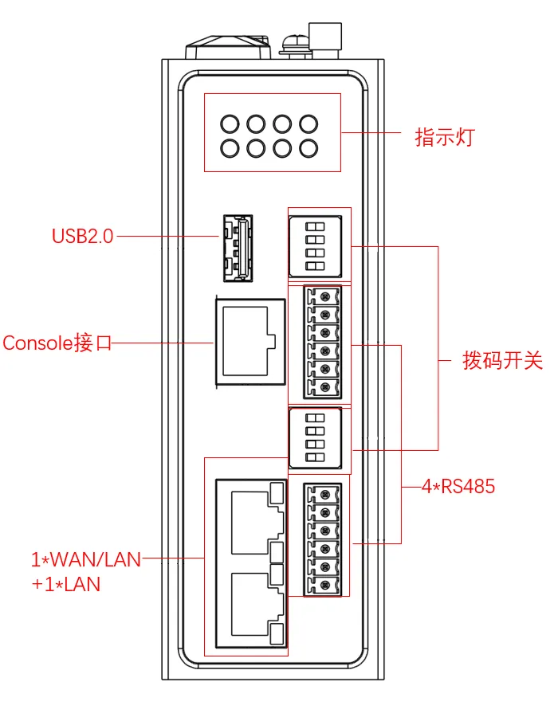

**上面板**

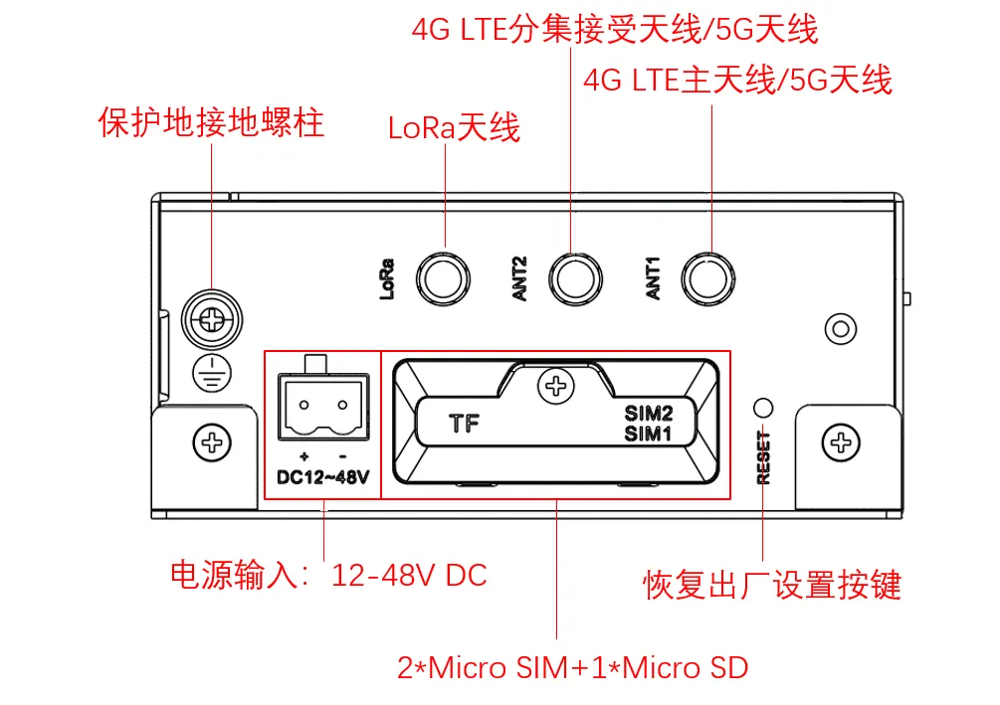

> 指示灯组合含义见 §2.3；各接口引脚见 §2.5。

---

### 步骤 2：将设备固定到导轨或柜内

IG532 后面板自带 DIN 卡轨座，可直接卡入 DIN 轨；也可购买可选壁挂套件，按"挂耳 / 背面挂耳 / 大面挂耳"三种方式之一固定到墙面或柜体。

> DIN 轨安装与拆卸的详细步骤见 §2.4.1 / §2.4.2；壁挂三种方式见 §2.4.3。

---

### 步骤 3：连接电源与以太网

1. 将电源适配器或现场电源（**12–48 V DC**）的 V+ / V− 接入 IG532 的 DC 双引脚端子。
2. 将随机网线一端接入 IG532 的 **WAN/LAN** 或 **LAN** 口，另一端接入 PC 网口。

> 接口位置见 §2.2；以太网/Console 引脚见 §2.5.1；串口与拨码开关见 §2.5.2 / §2.5.3。

---

### 步骤 4：（若使用蜂窝）断电装 SIM，并接好天线

> **请先确认设备已断电**，再进行 SIM 卡安装或拔出；SIM 卡座不支持热拔插。

1. 在上面板找到抽屉式 SIM 卡座（共 2 个），按需装入 SIM 卡。
2. 按壳体丝印将 **Lora 天线**、**ANT1**（4G LTE 主天线 / 5G 天线）、**ANT2**（4G LTE 分集接收天线 / 5G 天线）拧入对应的 SMA 接口。

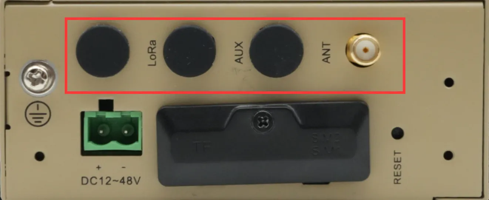

> SIM 卡座与天线丝印对照表见 §2.5.6；标配天线数量因型号而异，详见《IG532 系列边缘网关产品规格书》订购信息。

---

### 步骤 5：上电，确认设备已就绪

接通电源后观察指示灯：

- **PWR 红灯长亮**：设备已正常上电。
- **STATUS 绿灯慢闪**：开机成功。
- 若使用蜂窝：**NET 快闪**表示正在拨号，**NET 长亮**表示拨号成功。
- 信号灯 1/2/3 同时亮表示信号良好（CSQ 20~31）。

> 完整灯态组合见 §2.3.1；蜂窝信号灯含义见 §2.3.2。

---

### 步骤 6：PC 与浏览器登录 Web

1. 将 PC 的 IP 地址设置为与所接 IG532 网口同网段。
2. 打开浏览器，按所接网口访问对应默认 IP：

| 端口 | 默认 IP |
| :---: | :---: |
| WAN/LAN | 192.168.1.1 |
| LAN | 192.168.2.1 |

3. 使用初始账号 **adm** 登录，初始密码请查看设备面板上的铭牌。

> Web 管理由 IEOS（映翰通自研、运行于 Linux 系统）提供。完整登录说明与恢复出厂方法见 §2.7。

---

### 装完自检

- ☐ 设备已固定（导轨或壁挂三种方式之一）。
- ☐ 电源、网线已接好；若用蜂窝，SIM 已**断电**装入、天线已按丝印拧紧。
- ☐ **PWR 红灯长亮**且 **STATUS 绿灯慢闪**。
- ☐ 浏览器已能打开 Web 登录页（`https://192.168.1.1` 或 `https://192.168.2.1`），并以 `adm` + 铭牌初始密码完成登录。

> 若任一项未通过：检查 §2.3 灯态、§2.5 接口连接；如需硬件恢复出厂，按 §2.7 RESET 流程操作。

---

## 第二部分：详细说明

### 2.1 装箱清单

**标准配件**

| 序号 | 名称 | 数量 | 单位 | 描述 |
| --- | --- | --- | --- | --- |
| 1 | IG532 | 1 | 台 | IG532 边缘计算网关 |
| 2 | GPS 天线 | — | 个 | 天线的个数以及种类根据实际型号而定 |
| 3 | WLAN 天线 | — | 个 | |
| 4 | 蜂窝天线 | — | 个 | |
| 5 | 导轨安装配件 | 1 | 套 | 固定网关 |
| 6 | 工业端子 | 1 | 个 | 7 针工业端子 |
| 7 | 网线 | 1 | 根 | 1.5 m 网线 |
| 8 | 产品资料 | 1 | 份 | 二维码扫描查看快速安装手册、用户手册 |
| 9 | 产品保修卡 | 1 | 张 | 保修期为 1 年 |
| 10 | 合格证 | 1 | 张 | IG532 边缘计算网关合格证 |

**可选配件**

| 序号 | 名称 | 数量 | 单位 | 描述 |
| --- | --- | --- | --- | --- |
| 1 | 电源适配器 | 1 | 个 | 12 V 2 A 电源适配器 |
| 2 | 壁挂安装套件 | 1 | 套 | IG532 支持挂耳的壁挂安装方式，相关挂耳物料号可查看《IG532 系列边缘网关产品规格书》中"产品尺寸"部分 |

---

### 2.2 产品结构与标识

#### 2.2.1 正面板

#### 2.2.2 上面板

---

### 2.3 指示灯与复位键

#### 2.3.1 运行状态指示灯

| **PWR** 电源（红色） | **STATUS** 状态（绿色） | **WARN** 告警（黄色） | **ERR** 错误（红色） | **NET** 网络（绿色） | 说明 |
| :---: | :---: | :---: | :---: | :---: | :---: |
| 亮 | 灭 | 灭 | 灭 | 灭 | 开机 |
| 亮 | 慢闪 | 灭 | 灭 | 灭 | 开机成功 |
| 亮 | 慢闪 | 灭 | 灭 | 快闪 | 正在拨号 |
| 亮 | 慢闪 | 灭 | 灭 | 亮 | 拨号成功 |
| 亮 | 慢闪 | 慢闪 | 慢闪 | 灭 | 复位成功 |
| 亮 | 慢闪 | 快闪 | 快闪 | 灭 | 升级 |

#### 2.3.2 蜂窝信号强度灯

| 信号状态指示灯 1 （绿色） | 信号状态指示灯 2 （绿色） | 信号状态指示灯 3 （绿色） | 说明 |
| :---: | :---: | :---: | --- |
| 灭 | 灭 | 灭 | 未检测到信号 |
| 亮 | 灭 | 灭 | 信号状况 1≤CSQ≤9（信号有问题，请检查天线是否安装完好、SIM 卡是否正确识别，以及该地区信号状况） |
| 亮 | 亮 | 灭 | 信号状况 10≤CSQ≤19（信号状态基本正常，设备可以正常使用） |
| 亮 | 亮 | 亮 | 信号状况 20≤CSQ≤31（信号状态良好） |

#### 2.3.3 复位键

RESET 键位于设备面板（位置详见 §2.2），用于硬件恢复出厂。详细步骤见 §2.7。

---

### 2.4 机械安装

#### 2.4.1 DIN 导轨：安装

DIN 卡轨座附在 IG532 的后面板上。

1. 选定设备的安装位置，确保有足够的空间。
2. 将 DIN 卡轨座的上部卡在 DIN 轨上，在设备的下端向上稍微用力按箭头 2 所示转动设备，即可将 DIN 卡轨座卡在 DIN 轨上，确认设备可靠地安装到 DIN 轨上。

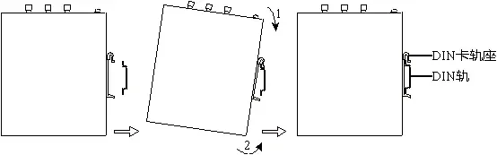

#### 2.4.2 DIN 导轨：拆卸

1. 如下图箭头 1 所示，向下压设备使设备下端有空隙脱离 DIN 轨。
2. 将设备按箭头 2 的方向转动，并同时向外移动设备的下端，待下端脱离 DIN 轨后向上抬设备，即可从 DIN 轨上取下设备。

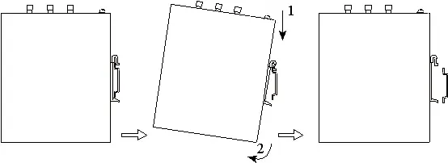

#### 2.4.3 壁挂

> IG532 壁挂套件需单独购买。共有三种壁挂方式：先将套件用螺钉固定在设备上，再用螺钉将设备固定到墙面或柜体；拆卸时逆序松开墙面螺钉，再取下套件。

**方式一：将壁挂套件安装在 IG532 的上、下面板上（挂耳安装）**

步骤一：将壁挂安装套件采用螺钉分别固定到上面板和下面板上。

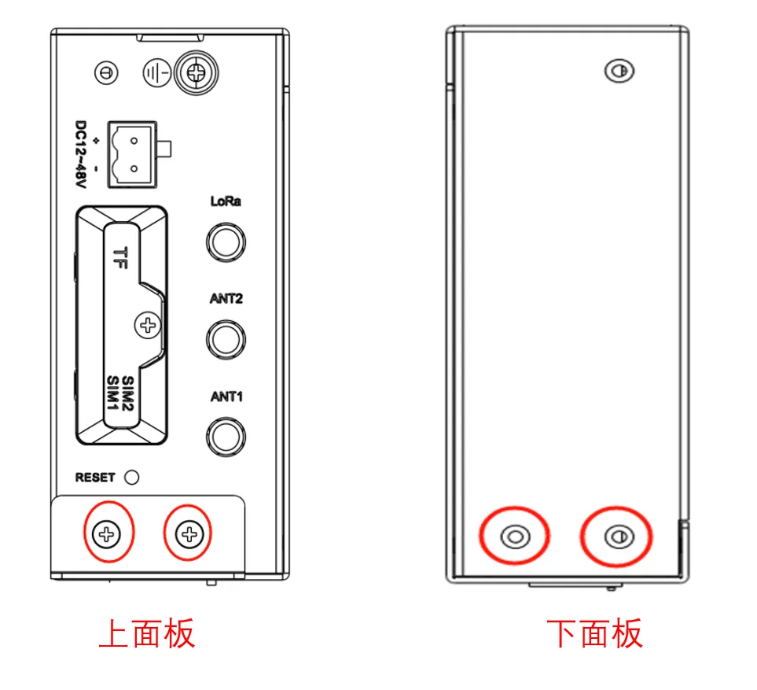

固定完成后如下图所示：

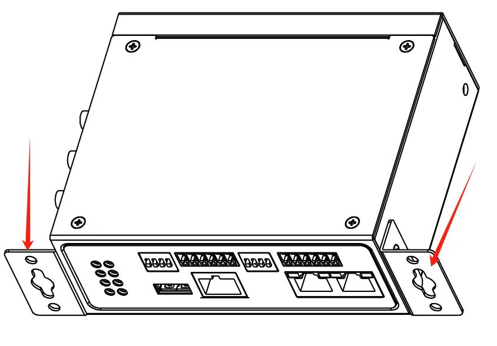

步骤二：当壁挂安装套件固定到设备以后，采用螺钉将设备固定到墙面或者柜子上。

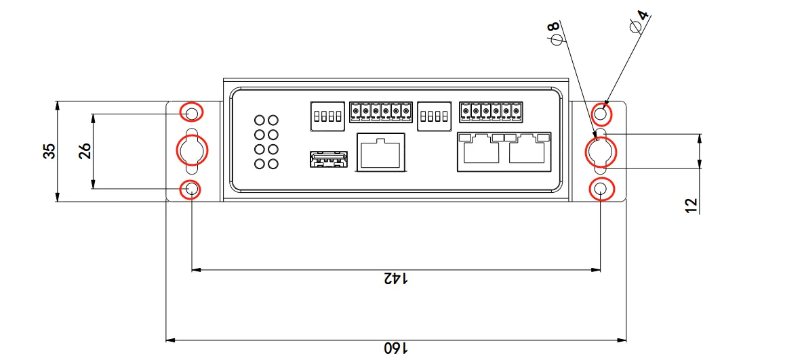

**方式二：将壁挂套件安装在 IG532 的后面板上（背面挂耳）**

步骤一：将壁挂安装套件采用螺钉分别固定到设备的后面板上。

固定完成后如下图所示：

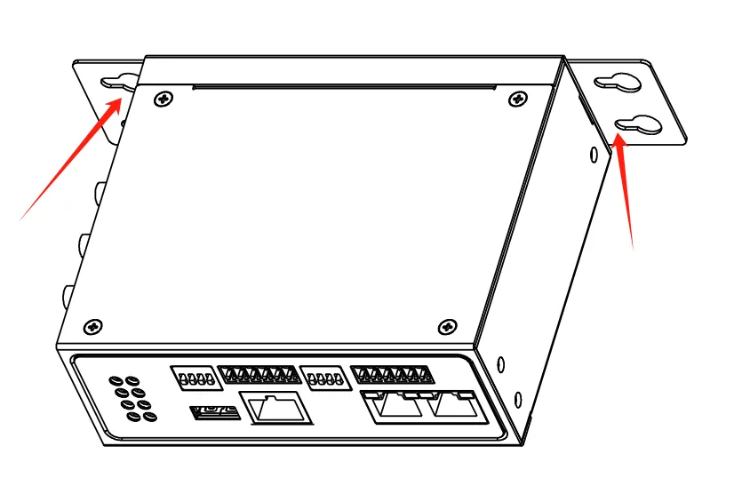

步骤二：当壁挂安装套件固定到设备以后，采用螺钉将设备固定到墙面或者柜子上。

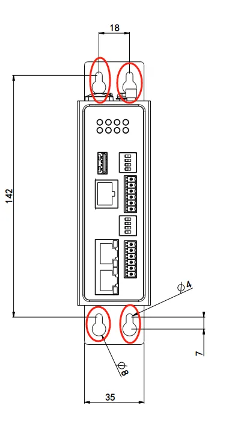

**方式三：将壁挂套件安装在 IG532 的上、下面板（大面挂耳）**

步骤一：将壁挂安装套件采用螺钉分别固定到设备的上下面板上。

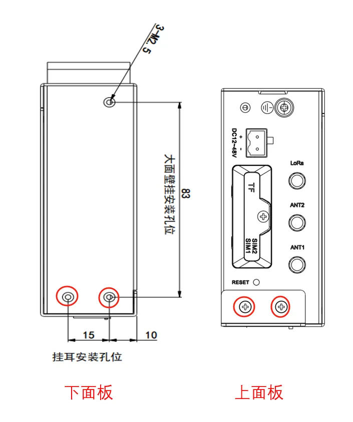

固定完成后如下图所示：

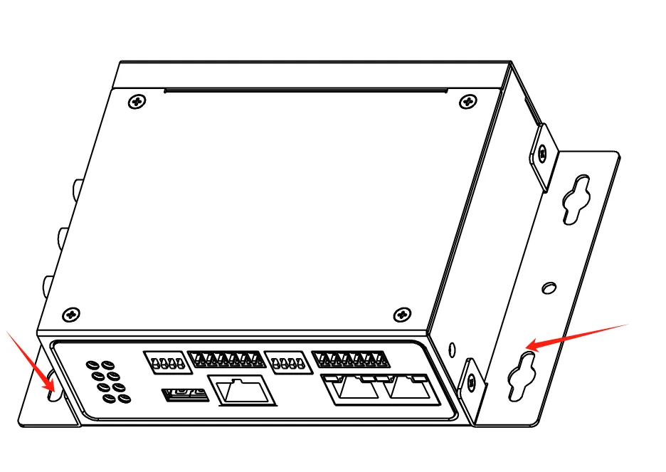

步骤二：当壁挂安装套件固定到设备以后，采用螺钉将设备固定到墙面或者柜子上。

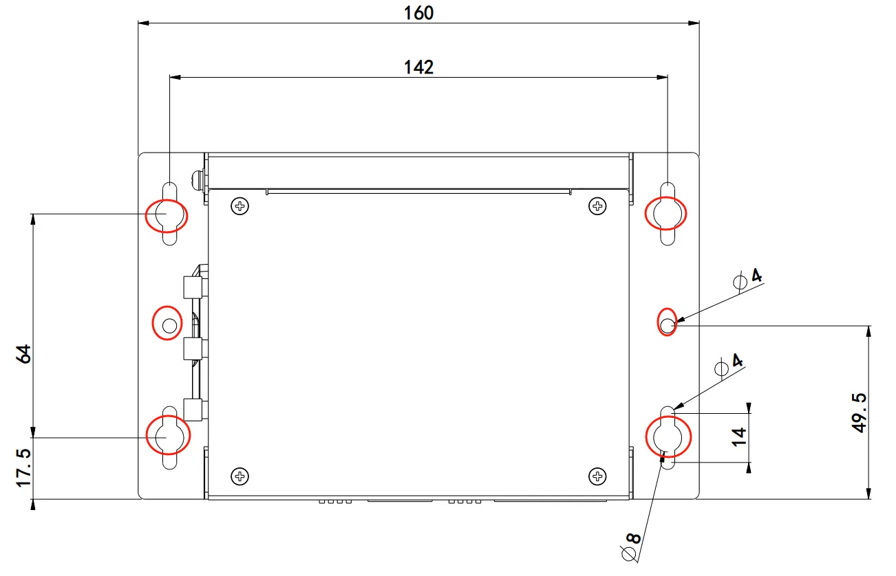

---

### 2.5 连接与布线（按功能分组）

#### 2.5.1 以太网与 Console

IG532 有 2 个 RJ45 以太网口，1×WAN/LAN 和 1×LAN，支持 10M/100M 自适应速率；另带 1 个 RJ45 的 Console 接口，采用 RS-232 通信标准。

**RJ45 以太网引脚（10M/100M）**

| RJ45 引脚号 | 10M/100M |
| --- | --- |
| 1 | TX+ |
| 2 | TX- |
| 3 | RX+ |
| 4 | — |
| 5 | — |
| 6 | RX- |
| 7 | — |
| 8 | — |

**RJ45 Console 引脚**

| RJ45 引脚号 | 名称 | 定义 |
| --- | --- | --- |
| 1 | CTS | 清除发送 |
| 2 | DSR | 数据设备准备 |
| 3 | RxD | 数据接收 |
| 4 | GND | 地线 |
| 5 | GND | 地线 |
| 6 | TxD | 数据发送 |
| 7 | DTR | 数据终端准备 |
| 8 | RTS | 请求发送 |

#### 2.5.2 电源与串口

**供电**：IG532 支持 12–48 V DC 供电。将适配器端子插入到 IG532 的 DC 端口中，然后连接电源适配器。当 **PWR 电源指示灯长亮**则代表设备已经正常上电。

**串口**：IG532 支持四路 RS-485 串口。

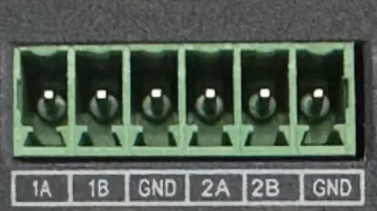

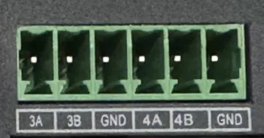

| 引脚 | COM1 RS-485 | COM2 RS-485 | COM3 RS-485 | COM4 RS-485 |
| :---: | --- | --- | --- | --- |
| 1A | 第一路 RS485+ | — | — | — |
| 1B | 第一路 RS485- | — | — | — |
| GND | 接地 | — | — | — |
| 2A | — | 第二路 RS485+ | — | — |
| 2B | — | 第二路 RS485- | — | — |
| GND | — | 接地 | — | — |
| 3A | — | — | 第三路 RS485+ | — |
| 3B | — | — | 第三路 RS485- | — |
| GND | — | — | 接地 | — |
| 4A | — | — | — | 第四路 RS485+ |
| 4B | — | — | — | 第四路 RS485- |
| GND | — | — | — | 接地 |

#### 2.5.3 RS-485 拨码开关

通过两个 4 位的拨码开关分别实现 4 个 RS-485 接口的 A/B 的上/下拉电阻的使能选择；**使能 RS-485 接口 A/B 的上/下拉电阻可提高 RS-485 总线的抗干扰能力及解决因接口芯片兼容性导致的乱码问题**。

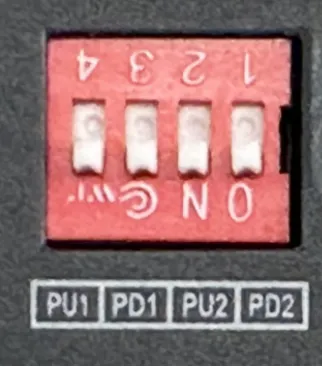

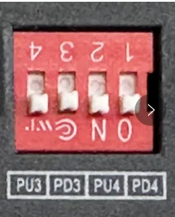

| 标识 | 描述 |
| --- | --- |
| PU1 | ON：使能 COM1 RS-485 A 上拉电阻 OFF：未使能 COM1 RS-485 A 上拉电阻（默认） |
| PD1 | ON：使能 COM1 RS-485 B 下拉电阻 OFF：未使能 COM1 RS-485 B 下拉电阻（默认） |
| PU2 | ON：使能 COM2 RS-485 A 上拉电阻 OFF：未使能 COM2 RS-485 A 上拉电阻（默认） |
| PD2 | ON：使能 COM2 RS-485 B 下拉电阻 OFF：未使能 COM2 RS-485 B 下拉电阻（默认） |
| PU3 | ON：使能 COM3 RS-485 A 上拉电阻 OFF：未使能 COM3 RS-485 A 上拉电阻（默认） |
| PD3 | ON：使能 COM3 RS-485 B 下拉电阻 OFF：未使能 COM3 RS-485 B 下拉电阻（默认） |
| PU4 | ON：使能 COM4 RS-485 A 上拉电阻 OFF：未使能 COM4 RS-485 A 上拉电阻（默认） |
| PD4 | ON：使能 COM4 RS-485 B 下拉电阻 OFF：未使能 COM4 RS-485 B 下拉电阻（默认） |

> **备注**：使能 RS-485 上/下拉电阻会减少 RS-485 总线允许最大的接入设备数量。

#### 2.5.6 蜂窝 SIM 与天线

**SIM 卡座**：IG532 配备 2 个用于蜂窝通信的抽屉式卡座，位于上面板。**SIM 卡安装不支持热拔插，需要在断电的情况下进行操作。**

**天线**：IG532 共有 3 个天线接口，不同型号标配的天线数量不同；具体型号对应的天线支持情况可参见《IG532 系列边缘网关产品规格书》中"订购信息"部分。

| 标识 | 名称 |
| :---: | :---: |
| Lora 天线 | Lora 天线 |
| ANT1 | 4G LTE 主天线 / 5G 天线 |
| ANT2 | 4G LTE 分集接收天线 / 5G 天线 |

将所需天线拧入到对应的 SMA 天线接口完成天线安装即可。

#### 2.5.7 USB 与 Micro SD

**USB**：IG532 提供一个 USB 2.0 Host 接口，主要用于扩展存储设备。

IG532 支持 USB 存储设备热插拔。如果一个 USB 存储设备有多个分区，IG532 可以自动挂载前 9 个分区，其余的分区需要手动挂载。IG532 会把所有 USB 存储设备分区挂载到 `/mnt/usb` 路径下，挂载文件夹的命名格式为 `sda_<num>`。其中 `<num>` 可以是 1~9 的数字。通过开发者模式进入 Linux 后台执行 `df -h` 命令可以看到具体的挂载情况。

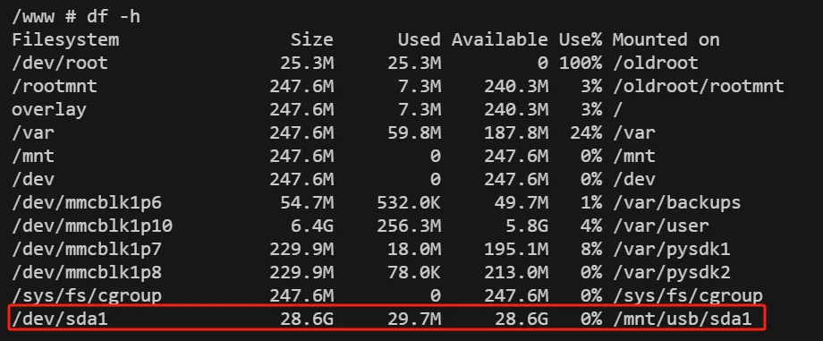

**注意**：在断开 USB 大容量存储设备之前，请记住输入 `sync` 同步命令，以防止数据丢失。当您断开存储设备的连接时，请从 `/mnt/usb/sda_<num>` 目录下退出。如果您留在 `/mnt/usb/sda_<num>` 中，则自动卸载过程将会失败。如果发生这种情况，请键入 `umount /mnt/usb/sda_<num>` 以手动卸载设备。

**Micro SD**：IG532 有一个 Micro SD 卡，**SD 卡不支持热插拔，需要在断电的情况下操作。**

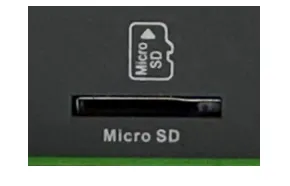

如果一个 micro SD 存储设备有多个分区，IG532 可以自动挂载前 9 个分区，其余的分区需要手动挂载。IG532 会把所有 micro SD 存储设备分区挂载到 `/mnt/sd` 路径下，挂载文件夹的命名格式为 `mmcblk0p<num>`。其中 `<num>` 可以是 1~9 的数字。通过开发者模式进入 Linux 后台执行 `df -h` 命令可以看到具体的挂载情况。

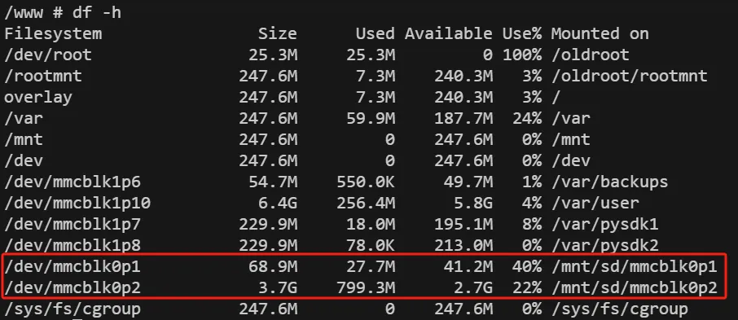

Web 的概览页面只显示第一个分区的容量和使用情况，为了方便在 Web 页面查看 SD 卡使用情况，建议只创建一个分区，并将该分区格式化为 FAT32 文件系统。

- **SD 卡容量 ≤ 32 GB**：SD 卡插入读卡器，然后将读卡器插入使用 Windows 系统的电脑。大部分 Windows 系统只支持将容量小于 32 GB 的 SD 卡格式为 FAT32 系统，格式化的时候会自动创建一个分区；也可以在 Linux 系统下格式化为 FAT32 文件系统，方法同 SD 卡容量 > 32 GB。
- **SD 卡容量 > 32 GB**：SD 卡容量大于 32 GB 时，需要在 Linux 下格式化 FAT32 格式。SD 卡插入读卡器，然后将读卡器插入使用 Linux 系统的电脑或者安装虚拟机 Linux 虚拟机的电脑。

  a. 执行 `fdisk -l` 查看 SD 卡对应的设备节点，示例中是 `/dev/sda`。
  b. 执行 `fdisk /dev/sda` 进行分区（`p` 查看当前分区，`d` 删除已有分区，`n` 新创建分区，`w` 保存更改），创建分区 `/dev/sda1`。
  c. 执行 `sudo mkfs.vfat -F 32 /dev/sda1` 将分区格式化为 FAT32 格式。

---

### 2.6 供电与环境（速查）

| 项目 | 规格 |
| :---: | --- |
| 输入电压 | 12-48 VDC（双引脚端子，V+、V-） |
| 待机功耗 | 200 mA @ 12 V |
| 工作功耗 | 250 mA @ 12 V |
| 峰值功耗 | 500 mA @ 12 V |
| 工作温度 | -25–70 ℃（-13–158 ℉） |
| 存储温度 | -40–85 ℃（-40–185 ℉） |
| 环境湿度 | 5–95 %（无凝霜） |

---

### 2.7 首次登录与恢复出厂

#### 2.7.1Web 登录

使用以下默认 IP 地址连接到 IG532：

| 端口 | 默认 IP |
| :---: | :---: |
| WAN/LAN | 192.168.1.1 |
| LAN | 192.168.2.1 |

**步骤一：将 IG532 和 PC 互联**

将网线一端插入到 IG532 的任一网口中，另外一端插入到电脑的网口，同时将电脑的 IP 地址设置为设备接口同网段地址。

**步骤二：通过 Web 对 IG532 进行网络管理和系统管理**

IG532 支持基于 IEOS 的 Web 界面管理方式。IEOS 是映翰通自研的一套运行在 Linux 系统上的网络管理和系统管理程序，IEOS 可提供 Web 界面服务。以网线网口插入到 LAN 口为例，设备登录信息如下：

- **登录地址**：<https://192.168.2.1>
- **初始登录账号**：adm
- **初始登录密码**：查看设备面板上的铭牌获取初始密码信息

#### 2.7.2 恢复出厂（RESET）

RESET 键位置详见 §2.2。采用硬件方式恢复出厂设备步骤如下：

1. 设备上电后 10 s 内长按 RESET 键不松开。
2. 当 ERR 灯变红后，松开 RESET 键。
3. 几秒之后当 ERR 灯熄灭，再次按住 RESET 键不松开。
4. 当看到 ERR 灯闪烁时松开 RESET 键；等待 ERR 灯熄灭，表明恢复出厂设置成功。

---

### 2.8 相关文档

| 需求 | 去向 |
| --- | --- |
| 产品介绍、Python 二次开发、DeviceSupervisor™ Agent、配置与排障 | 《IG532 用户手册》 |
| 订购信息、天线型号、产品尺寸、挂耳物料号 | 《IG532 系列边缘网关产品规格书》 |
| 软件与公告 | [www.inhand.com.cn](http://www.inhand.com.cn) |

---

### 2.9 法律信息

**版权声明**

© 2024 映翰通网络 保留所有权利。

**商标**

InHand 标志是映翰通网络的注册商标。

本手册中的所有其他商标或注册商标属于其各自的制造商。

**免责声明**

本公司保留对此手册更改的权利，产品后续相关变更时，恕不另行通知。对于任何因安装、使用不当而导致的直接、间接、有意或无意的损坏及隐患概不负责。
