# IG902 快速安装手册

---

## 第一部分：快速装机（图文整体流程）

> **您需要先做：** 开箱 → 固定设备 → 接电源与网线 →（若用蜂窝）**断电**装 SIM、接天线 → 上电 → PC 同网段 → 浏览器打开 Web。
> **再做：** 翻到下方 **第二部分**，按需查阅装箱、灯义、壁挂、各接口引脚等。

### 必读摘要（接线、上电前）

| 项目 | 要求 |
|------|------|
| 供电 | **12～48 V DC**，端子 **V+ / V−**；**PWR 红灯常亮**表示已正常上电。可选 12 V 2A 电源适配器。 |
| SIM / Micro SD | **须断电**安装或拔出；**不可热插拔**。 |
| USB 存储 | 支持热插拔；**断开前需 `sync` 同步**并退出挂载目录，否则可能丢数据。 |
| 蜂窝 / WLAN / GPS 天线 | 按壳体**丝印**拧入对应 SMA 接口；标配数量因型号而异（见《IG902 系列边缘网关产品规格书》订购信息）。 |
| 环境 | 工作温度 **−25 ～ 70 ℃**；环境湿度 **5 ～ 95 %（无凝霜）**。 |

### 步骤 1：对照实物，确认面板与接口区域

打开包装，按 §2.1 装箱清单核对配件。设备分为带 IO 与不带 IO 两种型号，请以实物为准。

**正面板（带 IO 型号）**：

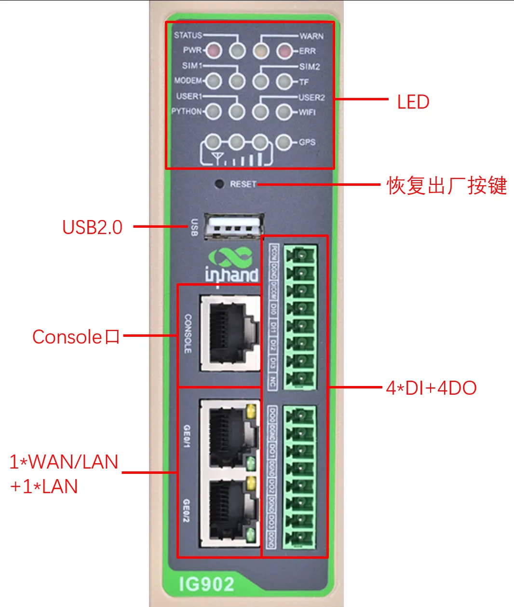

**上面板**（SIM 卡座、Micro SD、天线接口位于此面）：

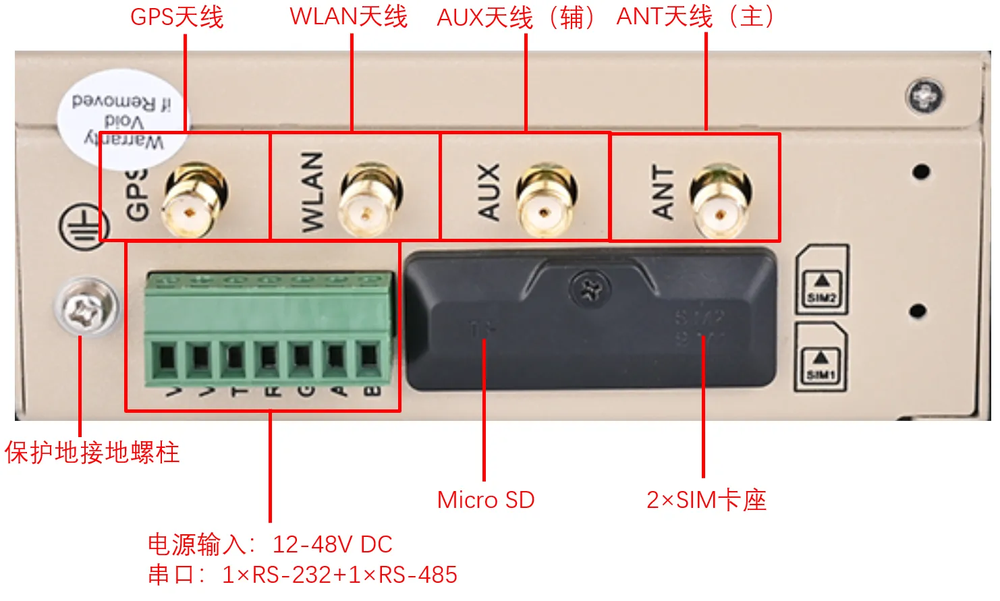

详细面板与标识说明见 §2.2；指示灯含义见 §2.3。

### 步骤 2：将设备固定到导轨或柜内

IG902 支持两种安装方式，按现场场景任选其一：

- **DIN 导轨安装**：卡轨座已附在后面板上，将上部卡入 DIN 轨后向上按压下端卡紧即可。详见 §2.4.1。
- **壁挂安装**（需可选壁挂套件）：先用螺丝刀将壁挂安装板固定到设备背面，再用螺钉将其固定到墙面或柜体。详见 §2.4.3。

### 步骤 3：连接电源与以太网

1. **接电源**：将随机配的 7 PIN 工业端子按 §2.5.2 的引脚定义把电源线接到 **V+ / V−**，端子插入正面板的电源/串口接口；电源输入需为 **12～48 V DC**。
2. **接以太网**：用网线将 PC 网口连到 IG902 的 **GE0/1** 或 **GE0/2**（默认 IP 见步骤 6）。

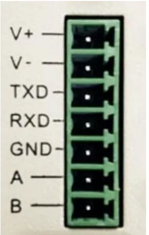

> 同一 7 PIN 端子还包含 RS-232（TXD/RXD/GND）与 RS-485（A/B），如需接串口设备可一并接入。引脚定义详见 §2.5.2。

### 步骤 4：（若使用蜂窝）断电装 SIM，并接好天线

> ⚠ **务必确认设备已断电**，再进行 SIM 卡安装。

1. 拆除上面板的保护外壳。
2. 将 SIM 卡插入抽屉式 **SIM1 / SIM2** 卡座；卡座位于上面板。
3. 将所需天线按上面板 **丝印**（GPS / WLAN / AUX / ANT）拧入对应 SMA 接口。不同型号支持的天线接口不同，参见《IG902 系列边缘网关产品规格书》订购信息。

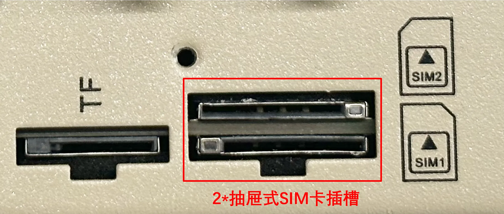

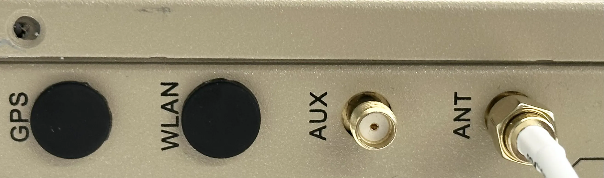

SIM 卡座与天线接口详细说明见 §2.5.5。

### 步骤 5：上电，确认设备已就绪

将 12 V 2A 适配器（或 12～48 V DC 电源）接入工业端子的 V+ / V−，给设备上电。观察前面板灯态：

- **PWR 红灯常亮** → 已正常上电；
- **STATUS 绿灯闪烁** → 系统启动成功；
- 若使用蜂窝：**MODEM 灯闪烁**表示正在拨号，**MODEM 灯常亮**表示拨号成功；
- 信号状态灯反映蜂窝信号强度，三格全亮代表信号良好（20–31 ASU）。

完整灯义见 §2.3。

### 步骤 6：PC 与浏览器登录 Web

1. 将网线一端插入 IG902 的任一以太网口，另一端插入 PC 网口；将 PC IP 设为与所选接口同一网段。

   | 端口 | 默认 IP |
   | :---: | :---: |
   | GE0/1 | 192.168.1.1 |
   | GE0/2 | 192.168.2.1 |

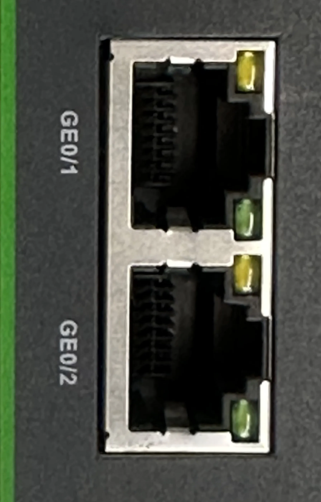

2. 在浏览器中打开 **<https://192.168.2.1>**（以接入 GE0/2 为例）。
3. 使用默认账号 **adm** 登录；初始密码请查看设备面板上的铭牌。

   

详细登录与恢复出厂操作见 §2.7。

### 装完自检

- ☐ 设备已固定（DIN 导轨或壁挂）。
- ☐ 7 PIN 端子已正确接入电源（V+ / V−）；网线已连接 GE0/1 或 GE0/2。
- ☐ 若使用蜂窝：SIM 已断电安装到位，天线已按丝印拧紧。
- ☐ **PWR 常亮**且 **STATUS 闪烁**；若用蜂窝，**MODEM 常亮**代表拨号成功。
- ☐ 浏览器已能打开 <https://192.168.1.1> 或 <https://192.168.2.1> 并完成登录。

> 若 Web 无法访问：检查 PC IP 是否与设备同网段、网线是否接到对应端口；必要时按 §2.7 的 RESET 步骤恢复出厂后重试。

---

## 第二部分：详细说明

### 2.1 装箱清单

**标准配件**

| 序号 | 名称 | 数量 | 单位 | 备注 |
| --- | --- | --- | --- | --- |
| 1 | IG902 | 1 | 台 | IG902 边缘计算网关 |
| 2 | GPS 天线 | — | 个 | 天线的个数以及种类根据实际型号而定 |
| 3 | WLAN 天线 | — | 个 | |
| 4 | 蜂窝天线 | — | 个 | |
| 5 | 导轨安装配件 | 1 | 套 | 固定网关 |
| 6 | 工业端子 | 1 | 个 | 7 针工业端子 |
| 7 | 网线 | 1 | 根 | 1.5 m 网线 |
| 8 | 产品资料 | 1 | 份 | 二维码扫描查看快速安装手册、用户手册 |
| 9 | 产品保修卡 | 1 | 张 | 保修期为 1 年 |
| 10 | 合格证 | 1 | 张 | IG902 边缘计算网关合格证 |

**可选配件**

| 序号 | 名称 | 数量 | 单位 | 备注 |
| --- | --- | --- | --- | --- |
| 1 | 电源适配器 | 1 | 个 | 12 V 2A 电源适配器 |
| 2 | 壁挂安装套件 | 1 | 套 | IG902 支持背面挂耳的壁挂安装方式，若部署场景适用这种安装方式，则设备出厂时会配备相应的配件 |

### 2.2 产品结构与标识

#### 2.2.1 正面板

IG902 分为带 IO 接口、不带 IO 接口的型号，带 IO 接口的正面板如下图所示：

#### 2.2.2 上面板

### 2.3 指示灯与复位键

#### 2.3.1 运行状态指示灯

| **PWR** | **STATUS** | **WARN** | **MODEM** | **ERR** | **说明** |
| :---: | :---: | :---: | :---: | :---: | :---: |
| 电源指示灯（红色） | 状态指示灯（绿色） | 警报指示灯（黄色） | MODEM 指示灯（绿色） | 错误指示灯（红色） | |
| 亮 | 灭 | 灭 | 灭 | 灭 | 开机状态 |
| 亮 | 闪 | 灭 | 灭 | 灭 | 开机成功 |
| 亮 | 闪 | 灭 | 闪 | 灭 | 正在拨号 |
| 亮 | 闪 | 灭 | 亮 | 灭 | 拨号成功 |
| 亮 | 闪 | 闪 | 灭 | 闪 | 复位成功 |

| 标识 | 名称 | 说明 |
| :---: | :---: | --- |
| SIM1 | SIM1 状态指示灯（绿色） | 亮—SIM1 功能开启；灭—SIM1 功能关闭。**备注**：默认情况下，在"开机状态"和"开机成功"时都是 SIM 卡 1 指示灯亮，后续则是实际使用的 SIM 卡对应指示灯亮 |
| SIM2 | SIM2 状态指示灯（绿色） | 亮—SIM2 功能开启；灭—SIM2 功能关闭 |
| WLAN | WLAN 状态指示灯（绿色） | 亮—WLAN 功能开启；闪—数据传输；灭—WLAN 功能关闭 |
| GPS | GPS 状态指示灯（绿色） | 亮—GPS 定位成功；闪—GPS 功能开启；灭—GPS 功能关闭 |
| TF | TF 状态指示灯（绿色） | 亮—识别到 TF；灭—未识别到 TF |
| USER1 | 用户可编程指示灯 1（绿色） | 默认熄灭，可由用户编程控制 |
| USER2 | 用户可编程指示灯 2（绿色） | 默认熄灭，可由用户编程控制 |
| PYTHON | PYTHON 指示灯（绿色） | 亮—PYTHON 功能正常开启；灭—PYTHON 功能关闭 |

#### 2.3.2 蜂窝信号状态指示灯

| 信号灯 1（绿色） | 信号灯 2（绿色） | 信号灯 3（绿色） | 说明 |
| :---: | :---: | :---: | --- |
| 灭 | 灭 | 灭 | 未检测到信号 |
| 亮 | 灭 | 灭 | 信号状况 1–9 ASU（信号状况有问题，请检查天线是否安装完好、SIM 卡是否正确识别，以及该地区信号状况是否良好） |
| 亮 | 亮 | 灭 | 信号状况 10–19 ASU（信号状态基本正常，设备可以正常使用） |
| 亮 | 亮 | 亮 | 信号状况 20–31 ASU（信号状态良好） |

#### 2.3.3 复位键（RESET）

RESET 键用于硬件恢复出厂，位于正面板（参见 §2.2.1 示意图）。恢复出厂的详细步骤见 §2.7。

### 2.4 机械安装

#### 2.4.1 DIN 导轨：安装

DIN 轨的安装板附在 IG902 后面板上，如下图所示：

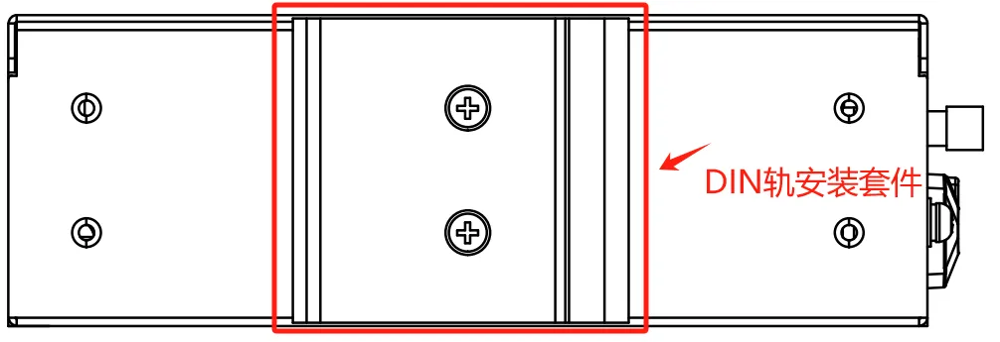

安装步骤：

1. 选定设备的安装位置，确保有足够的空间。
2. 将 DIN 卡轨座的上部卡在 DIN 轨上，在设备的下端向上稍微用力按箭头 2 所示转动设备，即可将 DIN 卡轨座卡在 DIN 轨上，确认设备可靠地安装到 DIN 轨上，如下图所示：

#### 2.4.2 DIN 导轨：拆卸

1. 如下图箭头 1 所示，向下压设备使设备下端有空隙脱离 DIN 轨。
2. 将设备按箭头 2 的方向转动，并同时向外移动设备的下端，待下端脱离 DIN 轨后向上抬设备，即可从 DIN 轨上取下设备。

#### 2.4.3 壁挂安装与拆卸

> 共性原则：先将壁挂安装板用螺钉固定在设备后面，再用螺钉将设备固定到墙面或柜体。拆卸时逆序松开墙面螺钉，再取下安装板。

**壁挂安装**：

1. 选定设备的安装位置，确保有足够的空间。
2. 用螺丝刀把壁挂安装板安装在设备的后面，如下图所示：

   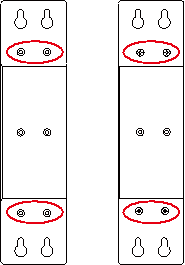

3. 取出螺钉（与壁挂安装板配套包装），用螺丝刀将螺钉固定在安装位置上，然后下拉设备使设备处于稳定状态，如下图所示：

   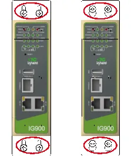

**壁挂拆卸**：用一只手扶住设备，另外一只手把设备上端起固定作用的螺钉卸掉，即可把设备从安装位置拆卸掉。

### 2.5 连接与布线

#### 2.5.1 以太网

IG902 有 2 个 RJ45 以太网口，支持 10M/100M/1000M 自适应速率。RJ45 的引脚说明如下：

| RJ45 引脚号 | 10M/100M | 1000M |
| --- | --- | --- |
| 1 | TX+ | TRD(0)+ |
| 2 | TX− | TRD(0)− |
| 3 | RX+ | TRD(1)+ |
| 4 | — | TRD(2)+ |
| 5 | — | TRD(2)− |
| 6 | RX− | TRD(1)− |
| 7 | — | TRD(3)+ |
| 8 | — | TRD(3)− |

**Console 接口**：IG902 带有 1 个 RJ45 的 Console 接口，接口采用 RS-232 通信标准。

| RJ45 引脚号 | 名称 | 定义 |
| --- | --- | --- |
| 1 | CTS | 清除发送 |
| 2 | DSR | 数据设备准备 |
| 3 | RxD | 数据接收 |
| 4 | GND | 地线 |
| 5 | GND | 地线 |
| 6 | TxD | 数据发送 |
| 7 | DTR | 数据终端准备 |
| 8 | RTS | 请求发送 |

#### 2.5.2 电源与串口

IG902 支持 12–48 V DC 供电。将适配器端子插入到 IG902 的 DC 端口中，然后连接电源适配器。当 **PWR 电源指示灯长亮**则代表设备已经正常上电。

IG902 支持 2 路串口，一路 RS-232 串口，一路 RS-485 串口。

电源、串口采用 7 PIN 端子，接口引脚说明如下：

| 引脚 | 名称 | 定义 |
| --- | --- | --- |
| 1 | V+ | 电源正极 |
| 2 | V− | 电源负极 |
| 3 | TXD | 串口 RS-232 发送 |
| 4 | RXD | 串口 RS-232 接受 |
| 5 | GND | 串口 RS-232 信号地 |
| 6 | A | 串口 RS-485+ |
| 7 | B | 串口 RS-485− |

#### 2.5.3 数字量输入

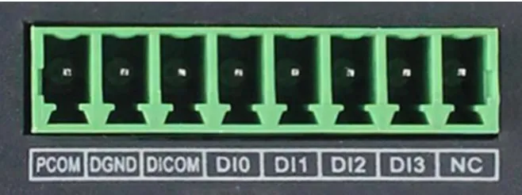

| 引脚 | 名称 | 定义 | 说明 |
| --- | --- | --- | --- |
| 1 | PCOM | 干接点接入端 | 干接点状态"1"：闭合；干接点状态"0"：断开；湿接点状态"1"：+10 ～ +30 V / −30 ～ −10 V DC；湿接点状态"0"：0 ～ +3 V / −3 ～ 0 V；隔离 3000 V DC；支持脉冲信号计数器功能，最高支持 100 Hz 脉冲信号 |
| 2 | DGND | 干接点接地端 | |
| 3 | DICOM | 输入公共端 | |
| 4 | DI0 | 数字量/脉冲 输入 0 号接口 | |
| 5 | DI1 | 数字量/脉冲 输入 1 号接口 | |
| 6 | DI2 | 数字量/脉冲 输入 2 号接口 | |
| 7 | DI3 | 数字量/脉冲 输入 3 号接口 | |
| 8 | NC | 无 | |

#### 2.5.4 数字量输出

| 引脚 | 名称 | 定义 | 说明 |
| --- | --- | --- | --- |
| 1 | DO0 | 数字量/脉冲 输出 0 号接口 | 隔离 3000 V DC |
| 2 | DGND | 接地端 | |
| 3 | DO1 | 数字量/脉冲 输出 1 号接口 | |
| 4 | DGND | 接地端 | |
| 5 | DO2 | 数字量/脉冲 输出 2 号接口 | |
| 6 | DGND | 接地端 | |
| 7 | DO3 | 数字量 输出 3 号接口 | |
| 8 | DGND | 接地端 | |

#### 2.5.5 蜂窝 SIM 与天线

**SIM 卡座**：IG902 配备 2 个用于蜂窝通信的抽屉式 SIM 卡座，位于上面板。

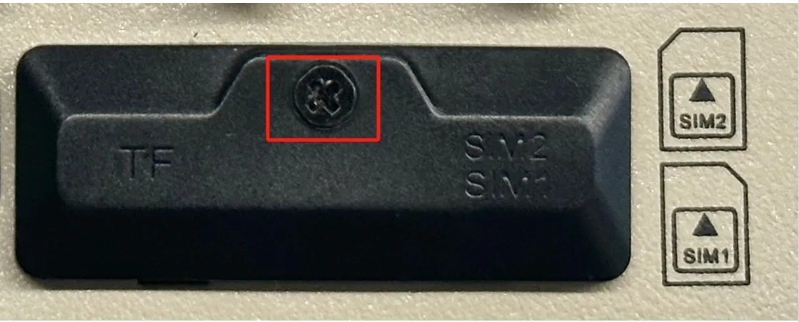

安装步骤：

1. **断电**：IG902 的 SIM 卡需要在断电的情况下进行安装，请确保安装前已经断开设备电源。
2. **拆壳**：安装前需要拆除保护外壳。
3. **插卡**：将 SIM 卡插入到抽屉式 SIM 卡插槽中。

**天线接口**：IG902 共有 4 个天线接口，不同型号标配的天线数量不同。具体型号对应的天线支持情况可参见《IG902 系列边缘网关产品规格书》中"订购信息"部分。

| 壳体丝印 | 名称 |
| :---: | :---: |
| GPS | GPS 天线 |
| WLAN | WLAN 天线 |
| AUX | AUX 天线（辅助天线） |
| ANT | ANT（主天线） |

下图所示产品型号为 IG902-B-LQA8，支持 AUX、ANT 两个天线接口。将所需天线拧入到对应的 SMA 天线接口完成天线安装即可，如下图 ANT 所示。

#### 2.5.6 USB 与 Micro SD

**USB 接口**：IG902 提供一个 USB 2.0 Host 接口，主要用于扩展存储设备。

IG902 支持 USB 存储设备**热插拔**。如果一个 USB 存储设备有多个分区，IG902 可以自动挂载前 9 个分区，其余的分区需要手动挂载。IG902 会把所有 USB 存储设备分区挂载到 `/mnt/usb` 路径下，挂载文件夹的命名格式为 `sda_<num>`。其中 `<num>` 可以是 1～9 的数字。通过开发者模式进入 Linux 后台执行 `df -h` 命令可以看到具体的挂载情况。

**注意**：在断开 USB 大容量存储设备之前，请记住输入 `sync` 同步命令，以防止数据丢失。当您断开存储设备的连接时，请从 `/mnt/usb/sda_<num>` 目录下退出。如果您留在 `/mnt/usb/sda_<num>` 中，则自动卸载过程将会失败。如果发生这种情况，请键入 `umount /mnt/usb/sda_<num>` 以手动卸载设备。

**Micro SD**：IG902 有一个 Micro SD 卡，SD 卡**不支持热插拔**，需要在断电的情况下操作。

要安装 Micro SD 卡，请先移除保护外壳。将 Micro SD 卡安装到 IG902 的 SD 卡槽中。

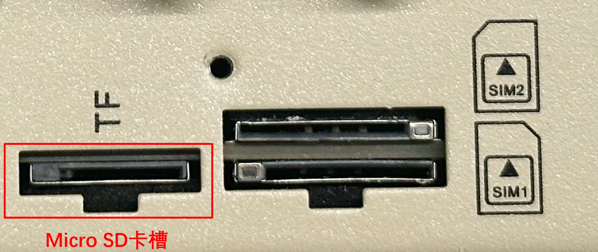

如果一个 micro SD 存储设备有多个分区，IG902 可以自动挂载前 9 个分区，其余的分区需要手动挂载。IG902 会把所有 micro SD 存储设备分区挂载到 `/mnt/sd` 路径下，挂载文件夹的命名格式为 `mmcblk0p<num>`。其中 `<num>` 可以是 1～9 的数字。通过开发者模式进入 Linux 后台执行 `df -h` 命令可以看到具体的挂载情况。

Web 的概览页面只显示第一个分区的容量和使用情况，为了方便在 Web 页面查看 SD 卡使用情况，建议只创建一个分区，并将该分区格式化为 FAT32 文件系统。

- **SD 卡容量 ≤ 32 GB**：SD 卡插入读卡器，然后将读卡器插入使用 Windows 系统的电脑。大部分 Windows 系统只支持将容量小于 32 GB 的 SD 卡格式为 FAT32 系统，格式化的时候会自动创建一个分区；也可以在 Linux 系统下格式化为 FAT32 文件系统，方法同 SD 卡容量 > 32 GB。
- **SD 卡容量 > 32 GB**：SD 卡容量大于 32 GB 时，需要在 Linux 下格式化 FAT32 格式。SD 卡插入读卡器，然后将读卡器插入使用 Linux 系统的电脑或者安装虚拟机 Linux 虚拟机的电脑。

  a. 执行 `fdisk -l` 查看 SD 卡对应的设备节点，示例中是 `/dev/sda`。

  b. 执行 `fdisk /dev/sda` 进行分区（`p` 查看当前分区，`d` 删除已有分区，`n` 新创建分区，`w` 保存更改），创建分区 `/dev/sda1`。

  c. 执行 `sudo mkfs.vfat -F 32 /dev/sda1` 将分区格式化为 FAT32 格式。

### 2.6 供电与环境（速查）

| 项目 | 规格 |
| :---: | :--- |
| 输入电压 | 12–48 V DC（双引脚端子，V+、V−） |
| 工作温度 | −25 ～ 70 ℃（−13 ～ 158 ℉） |
| 存储温度 | −40 ～ 85 ℃（−40 ～ 185 ℉） |
| 环境湿度 | 5 ～ 95 %（无凝霜） |

### 2.7 首次登录与恢复出厂

#### 2.7.1 Web 登录

使用以下默认 IP 地址连接到 IG902：

| 端口 | 默认 IP |
| :---: | :---: |
| GE0/1 | 192.168.1.1 |
| GE0/2 | 192.168.2.1 |

**步骤一：将 IG902 和 PC 互联**

将网线一端插入到 IG902 如下图所示的任一网口中，另外一端插入到电脑的网口，同时将电脑的 IP 地址设置为设备接口同网段地址。

**步骤二：通过 Web 对 IG902 进行网络管理和系统管理**

IG902 支持基于 IEOS 的 Web 界面管理方式。IEOS 是映翰通自研的一套运行在 Linux 系统上的网络管理和系统管理程序，IEOS 可提供 Web 界面服务。以网线网口插入到 GE0/2 为例，设备登录信息如下：

- **登录地址**：<https://192.168.2.1>
- **初始登录账号**：adm
- **初始登录密码**：查看设备面板上的铭牌获取初始密码信息

下图是使用 Web 连接的示例：

#### 2.7.2 恢复出厂（RESET）

通过正面板的 RESET 按键（位置参见 §2.2.1）采用硬件方式恢复出厂，步骤如下：

1. 设备上电后 10 s 内长按 RESET 键不松开。
2. 当 **ERR 灯变红**后，松开 RESET 键。
3. 几秒之后当 **ERR 灯熄灭**，再次按住 RESET 键不松开。
4. 当看到 **ERR 灯闪烁**时松开 RESET 键；等待 ERR 灯熄灭，表明恢复出厂设置成功。

### 2.8 相关文档

| 需求 | 去向 |
| --- | --- |
| 产品详细介绍、Python 二次开发、DeviceSupervisor / DeviceLive 使用 | 《IG902 用户手册》 |
| 订购信息、各型号天线/接口支持矩阵 | 《IG902 系列边缘网关产品规格书》 |
| 软件下载与公告 | [www.inhand.com.cn](http://www.inhand.com.cn) |

### 2.9 法律信息

**版权声明**

© 2024 映翰通网络 保留所有权利。

**商标**

InHand 标志是映翰通网络的注册商标。

本手册中的所有其他商标或注册商标属于其各自的制造商。

**免责声明**

本公司保留对此手册更改的权利，产品后续相关变更时，恕不另行通知。对于任何因安装、使用不当而导致的直接、间接、有意或无意的损坏及隐患概不负责。
