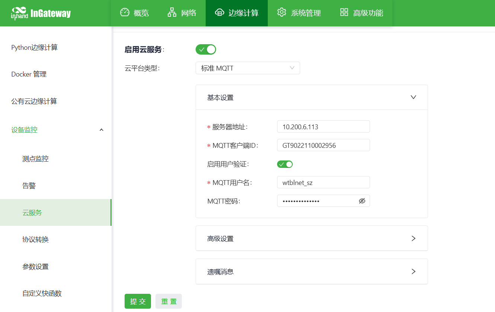

# 二次供水设施远程管理系统配置指导手册

## 一、文档信息

- 文档名称：IG902网关配置手册
- 产品型号：IG902
- 固件版本：V2.1.13
- **APP版本：2.6.1**
- 适用场景：工业数据采集、设备联网、边缘采集上云
- 编写日期：2026年03月25日

## 二、网关概述

### 2.1 产品简介

本数采网关用于工业现场PLC、仪表、传感器、变频器、伺服等设备的数据采集，支持多协议解析、边缘计算、断网续传、远程管理、数据上云。

### 2.2 主要功能

- 网口采集
- 主流工业协议解析
- MQTT数据上传
- 边缘计算、本地缓存
- 远程配置、远程诊断、远程升级
- 宽温工业级设计

### 2.3 典型应用拓扑

设备 → 以太网 → 数采网关 → 4G / 以太网 → 云平台

## 三、硬件说明

### 3.1 外观与接口

- 电源接口：DC 12–48V
- 串口：RS232 *1+ RS485+*1路
- 网口：LAN ×2路（或1WAN+1LAN 可配置）
- 无线：4G/5G/Wi-Fi（可选）
- 指示灯：PWR、RUN、COM、NET、信号强度
- 复位键：恢复出厂设置

### 3.2 接线说明

### 3.2.1 电源接线

- 正极：V+
- 负极：V-
- 注意：防反接、防雷、接地

### 3.2.2 RS485 接线

- A → 485+
- B → 485-
- 屏蔽层单端接地
- 终端电阻：120Ω（远距离需加）

### 3.2.3 以太网接线

直连 / 交叉自适应，建议超五类及以上网线。

## 四、出厂默认参数

- 默认 IP：**192.168.2.1**
- 子网掩码：255.255.255.0
- Web 用户名：**adm**
- Web 密码：123456
- 串口默认参数：9600,8,N,1

## 五、前期准备

- 电脑设置与网关同网段 IP
- 网线连接电脑与网关 LAN 口
- 网关上电，等待 RUN 灯常亮
- 浏览器输入网关 IP 进入配置页面

## 六、网络配置

### 6.1 LAN 口配置（静态 / DHCP）

- 进入【网络设置】→【LAN】
- 选择静态 IP / DHCP
- 设置 IP、子网掩码、网关、DNS
- 保存并应用

### 6.2 4G 无线网络配置（可选）

- 插入 SIM 卡
- 开启移动网络
- APN：自动 / 手动填写
- 信号强度查看
- 启用网络备份（有线优先，4G 备份）

## 七、串口配置

### 7.1 串口参数设置

- 进入【串口配置】→【COM1/COM2…】
- 模式选择：采集模式
- 波特率：**9600**
- 数据位：8
- 校验位：None
- 停止位：1
- 流控：无
- 保存生效

## 八、设备与协议配置

### 8.1 支持协议列表

- Modbus RTU / TCP
- PLC 协议：西门子、三菱、欧姆龙、施耐德、台达、信捷等
- 仪表协议：DL/T645、CJ/T188 等
- 自定义协议

### 8.2 添加采集设备

- 进入【数据采集配置】→【添加设备】


### 8.3 添加采集点位

- 进入【点位配置】→【添加点位】


### 8.4 点位表导入/导出


支持 Excel 批量导入、导出备份。

## 九、数据上传配置

### 9.1 MQTT 上传（常用上云方式）

- 进入【上传配置】→【MQTT】
- 使能 MQTT
- 服务器地址：10.200.6.113:1883
- 客户端 ID：GT9022110002956（网关SN）
- 用户名：wtblnet_sz
- 密码：sas@SZ#kj_we3e




- 数据格式：JSON / 自定义。

```python
# 发布格式
from collections import OrderedDict
import time
from common.Logger import logger
import json

def main(data_collect, wizard_api):
    global_argv = wizard_api.get_global_parameter()
    msg = OrderedDict()
    msg["cmdId"] = global_argv["cmdId"]
    msg["gatewaySn"] = global_argv["gateway_sn"]
    for device, value_dict in data_collect["values"].items():
        for name, value in value_dict.items():
            if "gq" == device and value["status"] == 1:
                msg["devId"] = global_argv["devId"]
                msg["devNo"] = global_argv["devNo"]
                msg["Time"] = time.strftime("%Y-%m-%d %H:%M:%S", time.localtime(data_collect["timestamp"]))
                msg[name] = value["raw_data"]
            if "zq" == device and value["status"] == 1:
                msg["devId"] = global_argv["devId1"]
                msg["devNo"] = global_argv["devNo"]
                msg["Time"] = time.strftime("%Y-%m-%d %H:%M:%S", time.localtime(data_collect["timestamp"]))
                msg[name] = value["raw_data"]
            if "dq" == device and value["status"] == 1:
                msg["devId"] = global_argv["devId2"]
                msg["devNo"] = global_argv["devNo"]
                msg["Time"] = time.strftime("%Y-%m-%d %H:%M:%S", time.localtime(data_collect["timestamp"]))
                msg[name] = value["raw_data"]
            msg[name] = value["raw_data"]
            if "cgq" == device and value["status"] == 1:
                msg["devId"] = global_argv["devId3"]
                msg["devNo"] = global_argv["devNo"]
                msg["Time"] = time.strftime("%Y-%m-%d %H:%M:%S", time.localtime(data_collect["timestamp"]))
                msg[name] = value["raw_data"]
            msg[name] = value["raw_data"]
    res = json.dumps(msg).replace(": ", ":").replace(", ", ",")
    logger.info(res)
return res
订阅格式：
from common.Logger import logger
from quickfaas.remotebus import publish
import json
import time
from collections import OrderedDict
from quickfaas.measure import recall2
from quickfaas.measure import write_plc_values
from quickfaas.global_dict import get_global_parameter

def main(topic, payload, wizard_api): #定义订阅主函数
    logger.info(topic) #打印订阅主题，假定topic为request/v1
    logger.info(payload) #打印订阅数据
    global_parameter = get_global_parameter()
    payload = json.loads(payload) #反序列化订阅数据

    if payload["cmdId"] == 87:
        data_dict = {payload["varId"]: eval(payload["writeValue"])}
        logger.info(data_dict)
        write_plc_values(data_dict)
        userdata = ["/sys/"+global_parameter["topic"]+"/up",data_dict]
        write_plc_values(data_dict, callback = write_ack, userdata = userdata, timeout = 60) #调用send_message_to_partner方法，将message字典中的数据下发至指定变量；调用ack方法并发送ack_tail给ack方法
    elif payload["cmdId"] == 85:
        acl_tail = None 
        if "devId" in payload:
            ack_tail = str(payload["devId"])
        recall2(callback = read_ack, userdata = ack_tail, timeout = 10)

def write_ack(send_result, ack_tail): #定义ack方法
    global_parameter = get_global_parameter()
    sn = global_parameter["gateway_sn"]
    if not send_result and isinstance(send_result, tuple): #检测下发是否超时
        resp_data = {"cmdId":88, "gwSn":sn, "flag":1, "msg": "failed"} #定义下发超时的响应数据
    else:
        resp_data = {"cmdId":88, "gwSn":sn, "flag":1, "msg": "success"} #定义下发未超时的响应数据
    resp_data = json.dumps(resp_data).replace(": ", ":").replace(", ", ",")
    logger.info(resp_data)
    publish("/sys/"+global_parameter["topic"]+"/up", resp_data, 1) #调用mqtt_publish将响应数据发送给MQTT服务器

def read_ack(read_result, ack_tail): #定义ack方法
    global_argv = get_global_parameter()
    global_parameter = get_global_parameter()
    sn = global_parameter["gateway_sn"]
    logger.info(ack_tail)
    logger.info(global_parameter["devId"])
    logger.info(read_result)
    if not read_result and isinstance(read_result, tuple): #检测下发是否超时
        pass
        #resp_data = {"cmdId":88, "gwSn":sn, "flag":1, "msg": "failed"} #定义下发超时的响应数据
    else:
        resp_data = OrderedDict()
        resp_data["varList"] = []
        resp_data["devId"] = ack_tail
        resp_data["cmdId"] = 86
        resp_data["gatewaySn"] = global_argv["gateway_sn"]
        resp_data["flag"] = 1
        resp_data["msg"] = "success"
        read_time = time.strftime("%Y-%m-%d %H:%M:%S", time.localtime(read_result["timestamp"]))
        #if ack_tail:
        for device, value_dict in read_result["values"].items():
            if int(ack_tail) == int(global_parameter["devId"]) and "gq" == device:
                for name, value in value_dict.items():
                    dvar = {"varName": name, "varValue": value["raw_data"], "readTime": read_time, "varId": name, "isWarn": 0}
                    resp_data["varList"].append(dvar)
                break
            elif int(ack_tail) == int(global_parameter["devId1"]) and "zq" == device:
                for name, value in value_dict.items():
                    dvar = {"varName": name, "varValue": value["raw_data"], "readTime": read_time, "varId": name, "isWarn": 0}
                    resp_data["varList"].append(dvar)
                break
            elif int(ack_tail) == int(global_parameter["devId2"]) and "dq" == device:
                for name, value in value_dict.items():
                    dvar = {"varName": name, "varValue": value["raw_data"], "readTime": read_time, "varId": name, "isWarn": 0}
                    resp_data["varList"].append(dvar)
            elif int(ack_tail) == int(global_parameter["devId3"]) and "cgq" == device:
                for name, value in value_dict.items():
                    dvar = {"varName": name, "varValue": value["raw_data"], "readTime": read_time, "varId": name, "isWarn": 0}
                    resp_data["varList"].append(dvar)
                break
        #else:
            #for device, value_dict in read_result["values"].items():
                #for name, value in value_dict.items():
                    #dvar = {"varName": name, "varValue": value["raw_data"], "readTime": read_time, "varId": name, "isWarn": 0}
                    #resp_data["varList"].append(dvar)
    resp_data = json.dumps(resp_data).replace(": ", ":").replace(", ", ",")
    logger.info(resp_data)
    publish("/sys/"+global_parameter["topic"]+"/up", resp_data, 1)
```

测试连接 → 保存

### 9.2 配置备份与恢复

- 导出配置文件

## 十、状态监控与诊断

### 10.1 运行状态

- 设备在线状态
- 采集点位实时值
- 串口收发包统计
- 网络流量、信号强度
- CPU、内存、温度

### 10.2 日志查看

- 系统日志
- 采集日志
- 上传日志
- 告警日志

## 十一、常见问题与排查

- 无法打开 Web
  - 检查网段、网线、IP 是否冲突
  - 复位网关重试
- 设备在线但无数据
  - 检查点位地址、数据类型
  - 查看采集日志
  - 检查设备是否支持该协议
- MQTT 连接失败
  - 网络是否通
  - 服务器地址、端口、用户名、密码
  - 防火墙 / 端口是否开放

## 十二、安全注意事项

- 工业现场可靠接地
- 避免带电热插拔串口
- 配置完成后备份
- 远程密码定期修改
- 禁止非授权人员操作

## 十三、附录

### 13.1 术语解释

- RTU、TCP、MQTT、边缘计算、点位、寄存器、站号、采集间隔
