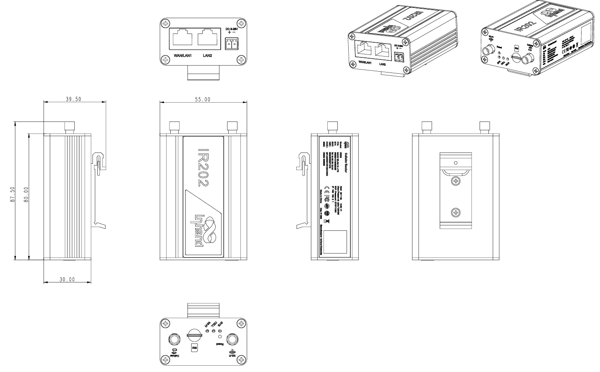

  

    

      

        
      

      

        

          极简型工业路由器
        

      

    

    

      

        IR202-Lite 工业路由器
      

      

        
· 4G

        
· Wi-Fi

        
· 安全

        
· 云管理

      

    

  

## 1. 产品概述

映翰通 InRouter202-Lite（IR202-Lite）是一款极简型工业无线路由器，集成 4G 无线广域网与 Wi-Fi 无线局域网，提供不间断的多种网络接入能力。凭借完备的安全策略与快捷无线连接，为物联网终端设备提供便捷、可靠且安全的互联网连接。IR202-Lite 可接入映翰通 Device Manager 设备云管理平台，实现统一远程管理；人性化 Web 配置界面降低使用门槛。产品设计满足无人值守现场通信需求，采用软硬件看门狗及多级链路检测机制，保障通信稳定可靠。

### 1.1 功能与优势

<table>
  <colgroup>
    <col style="width: 20%;" />
    <col style="width: 80%;" />
  </colgroup>
  <tr>
    <th align="left">价值维度</th>
    <th align="left">描述</th>
  </tr>
  <tr>
    <td align="left"><strong>多元接入</strong></td>
    <td align="left">支持蜂窝、有线与 Wi-Fi 接入互联网；LTE CAT4 下行 150 Mbps / 上行 50 Mbps；Wi-Fi 支持 AP/客户端模式，速率最高 150 Mbps</td>
  </tr>
  <tr>
    <td align="left"><strong>工业级设计</strong></td>
    <td align="left">金属外壳，防护等级 IP30；EMC 各项指标达 2 级；导轨安装；工作温度 -20°C ~ +70°C；供电 9~26 V DC</td>
  </tr>
  <tr>
    <td align="left"><strong>稳定连接</strong></td>
    <td align="left">链路层检测，掉线自动重拨；VPN 通道检测维持连接稳定性；内嵌硬件看门狗，设备故障自修复</td>
  </tr>
  <tr>
    <td align="left"><strong>安全防护</strong></td>
    <td align="left">支持 IPsec VPN 保障传输安全；SPI 全状态包检测、SSH、入侵保护、DDoS 防御、IP-MAC 绑定等防火墙能力</td>
  </tr>
  <tr>
    <td align="left"><strong>云管理</strong></td>
    <td align="left">集成 Device Manager 平台，统一管理上万分布式站点，实时掌握现场设备状态</td>
  </tr>
  <tr>
    <td align="left"><strong>小巧易部署</strong></td>
    <td align="left">尺寸 87.5 × 55 × 39.5 mm，低功耗设计，适合柜内与狭小空间安装</td>
  </tr>
</table>

### 1.2 应用场景

<table>
  <colgroup>
    <col style="width: 22%;" />
    <col style="width: 22%;" />
    <col style="width: 28%;" />
    <col style="width: 28%;" />
  </colgroup>
  <tr>
    <th align="left">场景</th>
    <th align="left">典型客户</th>
    <th align="left">关键需求</th>
    <th align="left">价值主张</th>
  </tr>
  <tr>
    <td align="left"><strong>梯联网</strong></td>
    <td align="left">电梯厂商、维保服务商</td>
    <td align="left">运行状态监测、故障上报、远程运维</td>
    <td align="left">为电梯物联网终端提供稳定 4G 回传与安全通道</td>
  </tr>
  <tr>
    <td align="left"><strong>安防监控</strong></td>
    <td align="left">安防集成商、物业、园区</td>
    <td align="left">视频/告警回传、现场设备联网</td>
    <td align="left">蜂窝 + Wi-Fi 灵活组网，守护公共安全</td>
  </tr>
  <tr>
    <td align="left"><strong>充电桩</strong></td>
    <td align="left">充电运营商、能源服务商</td>
    <td align="left">计费数据上云、远程运维、链路可靠</td>
    <td align="left">宽温宽压工业设计，适配户外柜体环境</td>
  </tr>
  <tr>
    <td align="left"><strong>活动与临时组网</strong></td>
    <td align="left">赛事、展会、临时工地</td>
    <td align="left">快速开站、多终端接入、可迁移部署</td>
    <td align="left">小巧易装，LTE + Wi-Fi 快速提供现场网络</td>
  </tr>
</table>

### 1.3 产品尺寸

  

    
    
尺寸图

  

**注：**

1. 所有尺寸单位为毫米。
2. 尺寸（长 × 宽 × 高）：87.5 × 55 × 39.5 mm。
3. 所有尺寸为近似值，仅供参考。

## 2. 系统架构

### 2.1 解决方案组件

IR202-Lite 解决方案由两个核心组件组成：

工业路由器 IR202-Lite 与外置天线（蜂窝 / Wi-Fi，视型号配置）

### 2.2 部署

典型单站点标准配置如下：

| 组件 | 数量 | 描述 |
| :--- | :--- | :--- |
| IR202-Lite 主机 | 1 | 导轨安装，部署于机柜或现场箱体 |
| 4G 天线 | 1 | SMA 接口蜂窝天线 |
| Wi-Fi 天线 | 0/1 | RP-SMA 接口（WLAN 型号） |
| SIM 卡 | 1 | Nano-SIM；可选焊接 eSIM |
| 电源 | 1 | DC 9~26 V，2 PIN 工业端子，防过流 / 防反接 |
| 以太网连接 | 2 | 1 × WAN/LAN + 1 × LAN，10/100 Mbps RJ45 |

## 3. 硬件规格

### 3.1 硬件概述

| 参数 | 规格 |
| :--- | :--- |
| **处理器** | 580 MHz 工业级 CPU |
| **内存** | 64 MB DDR2 |
| **存储** | 16 MB SPI Flash |
| **蜂窝网络** | LTE CAT4，下行 150 Mbps / 上行 50 Mbps（具体频段见订购信息） |
| **SIM 卡槽** | 1 × SIM；可选焊接 eSIM |
| **以太网端口** | 2 × 10/100 Mbps 快速以太网，RJ45，1 × WAN/LAN + 1 × LAN 1.5 KV 网络隔离变压保护 |
| **Wi-Fi** | IEEE 802.11 b/g/n，2.4 GHz，最大传输速率 150 Mbps（可选） |
| **Wi-Fi 发射功率** | 802.11b：16 dBm ±2 dBm（11 Mbps） 802.11g：16 dBm ±2 dBm（54 Mbps） 802.11n @2.4 GHz：16 dBm ±2 dBm（HT20/HT40 MCS7） |
| **Wi-Fi 覆盖范围** | 视距 30 米（实际距离视现场环境而定） |
| **天线接口** | 4G：1 × SMA；Wi-Fi：1 × RP-SMA（WLAN 型号） |
| **电源** | DC 9~26 V，防过流保护，防反接，2 × PIN 工业端子 |
| **功耗** | 待机 1.2 W；工作 1.4 W；峰值 1.6 W |
| **复位按钮** | 针孔式复位按键 |
| **外壳** | 金属外壳 |
| **安装** | 导轨安装 |
| **防护等级** | IP30 |
| **工作温度** | -20°C ~ +70°C |
| **存储温度** | -40°C ~ +85°C |
| **环境湿度** | 5% ~ 95%（无凝霜） |
| **尺寸** | 87.5 × 55 × 39.5 mm |

### 3.2 接口概述

**以太网端口（×2）**

- 10/100 Mbps 自适应 RJ45
- 1 × WAN/LAN 可切换 + 1 × LAN
- 1.5 KV 网络隔离变压保护

**电源接口（×1）**

- 2 PIN 工业端子
- DC 9~26 V，防过流、防反接

**天线接口**

- 4G：1 × SMA
- Wi-Fi：1 × RP-SMA（WLAN 型号）

**SIM / 复位**

- 1 × SIM 卡槽，可选焊接 eSIM
- 针孔式复位按键，用于恢复出厂设置

### 3.3 环境与可靠性规格

| 测试项目 | 标准 | 等级/结果 |
| :--- | :--- | :--- |
| **ESD（静电放电）** | EN61000-4-2 | 2 级 |
| **辐射抗扰度** | EN61000-4-3 | 2 级 |
| **EFT（电快速瞬变）** | EN61000-4-4 | 2 级 |
| **浪涌** | EN61000-4-5 | 2 级 |
| **传导抗扰度** | EN61000-4-6 | 2 级 |
| **振荡波** | EN61000-4-12 | 2 级 |
| **工频磁场** | EN61000-4-8 | 水平/垂直 400 A/m（≥ 2 级） |
| **冲击** | IEC60068-2-27 | 符合 |
| **振动** | IEC60068-2-6 | 符合 |
| **自由跌落** | IEC60068-2-32 | 符合 |

### 3.4 主要硬件优势

| 优势 | 描述 |
| :--- | :--- |
| **工业级宽温宽压** | -20°C ~ +70°C 工作温度，9~26 V DC 供电，适配柜内与户外箱体环境 |
| **金属外壳 + IP30** | 坚固防护，适合工业现场部署 |
| **低功耗设计** | 典型工作功耗约 1.4 W，峰值仅 1.6 W，利于长期无人值守运行 |
| **导轨安装** | 标准导轨安装，便于机柜快速部署 |
| **EMC 2 级** | 静电、浪涌、EFT 等关键 EMC 项目达 2 级，提升现场抗干扰能力 |
| **小巧紧凑** | 87.5 × 55 × 39.5 mm，节省安装空间 |

## 4. 软件功能

### 4.1 网络协议

<table>
  <colgroup>
    <col style="width: 28%;" />
    <col style="width: 72%;" />
  </colgroup>
  <tr>
    <th align="left">协议类别</th>
    <th align="left">支持的协议</th>
  </tr>
  <tr>
    <td align="left"><strong>网络接入</strong></td>
    <td align="left">APN、VPDN</td>
  </tr>
  <tr>
    <td align="left"><strong>认证</strong></td>
    <td align="left">CHAP、PAP</td>
  </tr>
  <tr>
    <td align="left"><strong>网络制式</strong></td>
    <td align="left">GSM/EDGE、WCDMA、TDD LTE / FDD LTE（具体频段见订购信息）</td>
  </tr>
  <tr>
    <td align="left"><strong>局域网协议</strong></td>
    <td align="left">ARP、Ethernet</td>
  </tr>
  <tr>
    <td align="left"><strong>广域网协议</strong></td>
    <td align="left">静态 IP、DHCP、PPPoE</td>
  </tr>
  <tr>
    <td align="left"><strong>路由</strong></td>
    <td align="left">静态路由</td>
  </tr>
  <tr>
    <td align="left"><strong>IP 应用</strong></td>
    <td align="left">IPv4、Ping、Trace、DHCP Server、DHCP Relay、DHCP Client、DNS Relay、Telnet</td>
  </tr>
  <tr>
    <td align="left"><strong>NAT</strong></td>
    <td align="left">支持网络地址转换</td>
  </tr>
</table>

### 4.2 网络安全

<table>
  <colgroup>
    <col style="width: 28%;" />
    <col style="width: 72%;" />
  </colgroup>
  <tr>
    <th align="left">安全功能</th>
    <th align="left">描述</th>
  </tr>
  <tr>
    <td align="left"><strong>防火墙</strong></td>
    <td align="left">全状态包检测（SPI）、防范 DoS 攻击；过滤多播 / Ping 探测包；访问控制列表（ACL）；内容过滤、端口映射、虚拟 IP 映射、IP-MAC 绑定</td>
  </tr>
  <tr>
    <td align="left"><strong>访问控制</strong></td>
    <td align="left">SSH、入侵保护（禁 Ping）、攻击防御</td>
  </tr>
  <tr>
    <td align="left"><strong>VPN 支持</strong></td>
    <td align="left">IPsec VPN（IKE v1）</td>
  </tr>
  <tr>
    <td align="left"><strong>管理安全</strong></td>
    <td align="left">Web / Telnet / SSH 配置访问</td>
  </tr>
</table>

### 4.3 链路管理与备份

**链路探测**
- 发送心跳包检测，断线自动连接
- 链路层检测，掉线自动重拨

**设备自愈**
- 内嵌硬件看门狗
- 设备运行自检，故障自修复，保障高可用性

**VPN 通道检测**
- 维持 VPN 通道连接稳定性
- 保障数据传输连续性

### 4.4 Wi-Fi 功能（可选）

**Wi-Fi 工作模式**

- AP 模式：作为接入点供客户端连接
- 客户端模式：连接外部 Wi-Fi 网络

**Wi-Fi 安全**

- 开放系统、共享密钥认证
- WPA / WPA2 认证
- TKIP / AES 加密

### 4.5 系统管理

**配置与升级**
- 配置方式：Telnet、Web、SSH
- 升级方式：Web 升级、Device Manager 升级

**日志与告警**
- 本地系统日志、远程日志
- 系统重启、LAN 端口上下线、流量告警、SIM 卡故障等告警

**短信与按需拨号**
- 短信功能：状态查询、重启
- 按需拨号、短信激活

**流量管理**
- 流量阈值设定
- 流量统计与流量告警

**维护工具**
- Ping、路由跟踪、网速测试
- 状态查询：系统状态、Modem 状态、网络连接状态、路由状态

## 5. 云管理

### 5.1 Device Manager 平台集成

IR202-Lite 可接入映翰通 Device Manager 远程设备管理云平台，通过统一云平台实时管理上万分布式站点设备，随时随地掌控现场设备状态，让管理更轻松、更高效、更经济。

### 5.2 云管理功能

| 功能 | 描述 |
| :--- | :--- |
| **实时监控** | 实时设备状态、蜂窝网络质量可视化 |
| **远程诊断** | 无需现场接入即可进行远程故障排查 |
| **批量管理** | 同时配置、升级多台设备 |
| **OTA 更新** | 通过 Device Manager 进行固件升级 |
| **告警管理** | 关键事件即时通知 |
| **流量管理** | 流量统计、阈值与告警联动上云 |
| **用户体验计划** | 可加入映翰通云平台用户体验计划，享受高效便捷服务 |

> **说明：** 设备初次登录时会提示是否加入用户体验计划；同意后默认接入映翰通云平台，用户可在「设备服务 > 用户体验计划」菜单中修改。

## 6. 订货指南

### 6.1 型号代码结构

**型号编号：** IR202-\<WMNN\>-\<WLAN/NA\>-Lite

- \<WMNN\>：无线通讯类型 & 模块
- \<WLAN/NA\>：WLAN = 支持 Wi-Fi；NA = 无 Wi-Fi

<table>
  <colgroup>
    <col style="width: 48%;" />
    <col style="width: 12%;" />
    <col style="width: 40%;" />
  </colgroup>
  <tr>
    <th align="left">型号</th>
    <th align="left">区域</th>
    <th align="left">网络制式</th>
  </tr>
  <tr>
    <td align="left"><strong>IR202-CNC4-&lt;WLAN/NA&gt;-Lite</strong></td>
    <td align="left"><strong>中国</strong></td>
    <td align="left"><strong>LTE FDD</strong> B1/B3/B5/B8 <strong>LTE TDD</strong> B34/B38/B39/B40/B41 <strong>WCDMA</strong> B1/B5/B8 <strong>GSM/EDGE</strong> B3/B8</td>
  </tr>
</table>

**示例：** IR202-CNC4-WLAN-Lite 表示 IR202 系列无线路由器，支持 IPsec VPN，支持 FDD、TDD、WCDMA 和 GSM 网络，支持 Wi-Fi AP & Client 模式。

### 6.2 包装内容

**标准包装**

- IR202-Lite 工业路由器 × 1
- 快速入门指南 × 1

**可选配件**
- 4G 天线
- Wi-Fi 天线（WLAN 型号）
- 电源线 / 适配器
- 导轨安装配件

### 6.3 认证

| 认证类型 | 说明 |
| :--- | :--- |
| **FCC** | 美国联邦通信委员会认证，适用于北美市场电磁兼容与射频合规 |
| **IC** | 加拿大创新、科学与经济发展部（ISED）认证，适用于加拿大市场 |
| **PTCRB** | 北美蜂窝终端型号认证，满足运营商入网测试要求 |
| **Verizon** | 美国 Verizon 运营商网络认证 |
| **AT&T** | 美国 AT&T 运营商网络认证 |
| **T-Mobile** | 美国 T-Mobile 运营商网络认证 |
| **CE** | 欧盟合格评定标志，适用于欧洲市场 |
| **SRRC** | 中国无线电发射设备型号核准 |
| **CTA** | 中国电信设备进网许可证 |

## 7. 安装与部署

### 7.1 安装方式

**导轨安装**
- 标准导轨安装设计
- 适合工业机柜快速部署与拆卸

### 7.2 安装步骤

| 步骤 | 任务 |
| :--- | :--- |
| 1 | 将 IR202-Lite 主机固定于导轨 |
| 2 | 连接外置天线（4G / Wi-Fi） |
| 3 | 插入 SIM 卡 |
| 4 | 连接电源（DC 9~26 V） |
| 5 | 连接以太网设备（WAN/LAN、LAN） |
| 6 | 上电并通过 Web 完成初始配置 |
| 7 | （可选）接入 Device Manager 云平台 |

**总安装时间：** 约 10–20 分钟

### 7.3 安装注意事项

- 确保天线位置以获得最佳信号接收
- 连接前确认电源电压（9~26 V DC）
- 布线远离强干扰源与热源
- 插入前确认 SIM 卡方向
- 首次上电后建议通过 Web 完成基础网络安全配置

# 8. 联系我们

- **官网：** [映翰通官网](https://www.inhand.com.cn)
- **版权声明：** ©映翰通网络 保留所有权利

