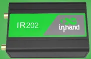

# 充电桩联网解决方案

## 一、方案概述

### 1.1 项目背景

某公司主要为新能源汽车充电桩设备提供联网的需求，使其充电桩可正常连接充电桩管理平台等应用，该应用需要高性价比并且非常稳定的设备，需要通过最新的安全测试，我们提供符合要求的安全路由器-IR202。

### 1.2 目标

- 为充电桩设备提供安全并且稳定的网络

- 对硬件和要求有一定的出场预制设置

- 支持远程配置、远程诊断、远程升级

- 安全稳定、易扩展、易维护

### 1.3 适用场景

- 充电桩设备联网

- 充电站/ 充电桩设备厂家 

## 二、需求分析

### 2.1 设备现状

- 设备类型：充电桩设备

- 通信接口：Ethernet

- 通信协议：TCP

- 部署环境：室外

### 2.2 核心需求

1. 接入需求：以太网口

2. 网络需求：4G、高稳定

3. 远程需求：远程调试、远程控制、远程维护

## 三、总体架构设计

### 3.1 架构

1.设备层：充电桩设备

2.网络层：IR202路由器

3.平台层：设备管理平台、充电桩管理平台

### 3.2 数据流

设备→ 工业路由器IR202 → 4G → 云平台

## 四、网络与接入方案

### 4.1 联网方式选型

蜂窝物联网卡

### 4.2 路由器选型要点

- 网口、4G

- 工业级宽温、防尘、抗干扰

- 远程管理、远程升级、远程配置

## 五、方案亮点总结

1. 一站式：接入 + 网络 + 平台 + 应用全栈解决方案
2. 高兼容：多设备、多协议、多网络统一接入
3. 高可靠：双链路备份
4. 低成本：减少人工巡检，提升运维效率
5. 
