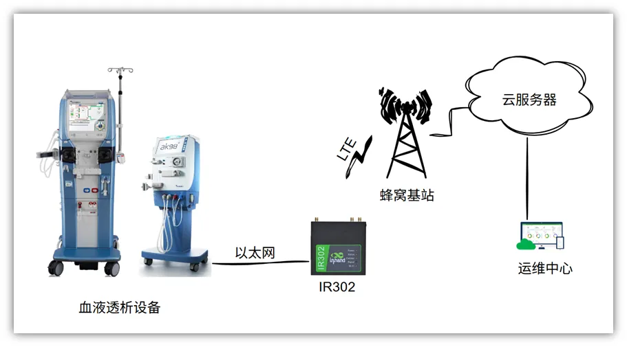

# 医疗设备联网解决方案

## 一、方案概述

### 1.1 项目背景

某公司在药物输注、肾科、生物科技、麻醉、营养等领域非常擅长， 目前主要是针对血液透析设备进行联网的需求，该应用需要高性价比并且非常稳定的设备，需要通过最新的安全测试，我们提供符合要求的安全路由器-IR302。

### 1.2 目标

- 为医疗设备提供安全并且稳定的网络

- 对硬件和要求有一定的出场预制设置

- 支持远程配置、远程诊断、远程升级

- 安全稳定、易扩展、易维护

### 1.3 适用场景

- 医疗设备联网（CT、床旁监护仪、核磁设备、血液透析设备、血液分析仪等）

- 医院/ 医疗设备厂家 / 养老机构

- 医疗设备物联网

## 二、需求分析

### 2.1 设备现状

- 设备类型：医疗设备

- 通信接口：Ethernet

- 通信协议：TCP

- 部署环境：室内

### 2.2 核心需求

1. 接入需求：以太网口

2. 数据需求：周期上推数据

3. 网络需求：4G、高稳定

4. 远程需求：远程调试、远程控制、远程维护

5. 安全需求：EMC、数据加密、配置加密

## 三、总体架构设计

### 3.1 架构

1.设备层：血液透析设备

2.网络层：IR302路由器

3.平台层：医疗数据云存储

### 3.2 数据流

设备→ 工业路由器IR302 → 4G → 云平台

## 四、网络与接入方案

### 4.1 联网方式选型

该项目使用联通定制的蜂窝网络

### 4.2 路由器选型要点

- 网口、4G/5G

- 工业级宽温、防尘、抗干扰

- 软硬件件安全需要检测

- 远程管理、远程升级、远程配置

## 五、方案亮点总结

1. 一站式：接入 + 网络 + 平台 + 应用全栈解决方案
2. 高兼容：多设备、多协议、多网络统一接入
3. 高可靠：边缘缓存、断网续传、双链路备份
4. 易扩展：支持批量扩容、二次开发、API 对接
5. 低成本：减少人工巡检，提升运维效率
6. 安全合规：传输加密、权限管理、操作审计
