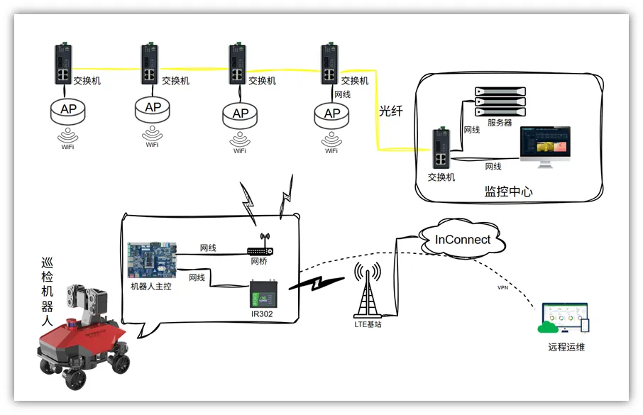

# 巡检机器人联网解决方案

## 一、方案概述

### 1.1 项目背景

某机器人企业专注于智能巡检机器人的研发制造，为客户提供自动化巡检解决方案。随着工业自动化和智能化的发展，巡检机器人在电力、数据中心、工厂等场景的应用越来越广泛，需要稳定可靠的网络支持。

### 1.2 建设目标

- 实现巡检机器人的远程控制和监控
- 实时传输巡检数据和视频图像
- 提升巡检效率和安全性
- 降低人工巡检成本

### 1.3 适用场景

- 电力机房巡检
- 数据中心巡检
- 工厂车间巡检
- 安防巡逻

## 二、需求分析

### 2.1 设备现状

- 设备类型：巡检机器人、摄像头、传感器、控制器
- 通信接口：Wi-Fi、4G/5G
- 通信协议：以太网标准协议
- 部署环境：机房、车间、园区
- 数量规模：多台机器人

### 2.2 核心需求

1. **实时控制需求**：实时控制机器人运动和操作
2. **视频传输需求**：实时传输高清巡检视频
3. **数据采集需求**：采集温湿度、烟雾等环境数据
4. **远程运维需求**：远程维护和升级机器人系统
5. **网络稳定性需求**：移动场景下的网络稳定性

## 三、总体架构设计

本方案采用巡检机器人+无线通信+云平台的架构，实现机器人的远程控制和数据管理。

### 3.1 四层架构

1. **感知层**：巡检机器人、摄像头、各类传感器
2. **网络层**：4G、Wi-Fi通信
3. **平台层**：机器人管理平台、云平台
4. **应用层**：远程控制、视频监控、数据分析

### 3.2 数据流

双链路，一条通向本地监控中心，另一条通到远程运维工程师

    巡检机器人（视频/数据） →  4/5G/WiFi通信  →  本地监控中心

            ↓

        4/5G通信    →   Inconnect  →  远程运维工程师

## 四、网络与接入方案

### 4.1 联网方式选型

采用4G/5G+Wi-Fi的混合组网方式，满足机器人在移动场景下的网络需求。

### 4.2 路由器选型要点

- 支持4G/5G高速网络
- 支持建立远程维护通道
- 安全加密传输数据
- 低延迟、高带宽

## 五、协议与数据采集方案

### 5.1 支持协议

- **网络协议**：4G/5G、Wi-Fi
- **视频协议**：RTSP、H.264/H.265
- **控制协议**：机器人控制协议

### 5.2 北向协议支持

- 支持云平台接入
- 支持远程控制协议

## 六、方案亮点总结

1. **移动巡检**：支持机器人在移动场景下的稳定通信

2. **实时视频**：高清视频实时传输，远程查看现场情况

3. **智能分析**：巡检数据智能分析，自动生成报告

4. **远程运维**：远程维护和升级，降低维护成本

5. **多场景适用**：适用于机房、工厂、园区等多种场景
