# 巡检机器人联网案例配置指导手册

## 一、文档信息

- 产品型号：IR302
- 固件版本：V3.5.107
- 适用场景：工业设备联网、医疗设备联网、自助终端联网、收银机联网等
- 编写日期：2026年4月2日
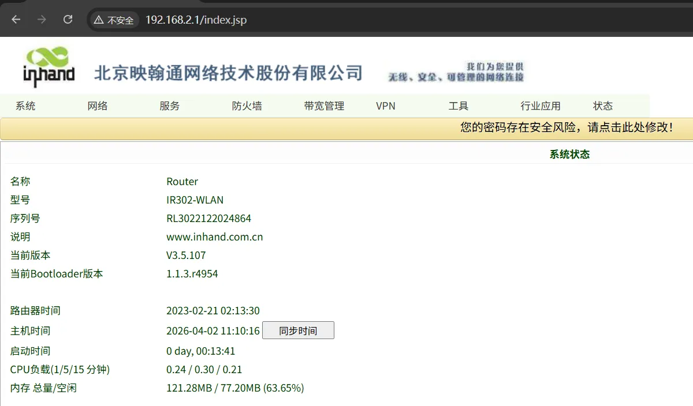

## 二、路由器概述

### 2.1 产品简介

InRouter302（简称IR302）系列产品是一款集成了4G网络、Wi-Fi和虚拟专用网等多种技术的物联网无线路由器，提供简单、可靠和安全的互联网连接。产品设计考虑到无人值守现场通信的要求，采用了软、硬件看门狗和多级链路检测机制，以确保通信的稳定性和可靠性。
IR302系列产品支持映翰通的Device Manager“设备云”管理平台，使用户能够实现远程智能化设备管理。IR302系列产品适用于各种工业和商业物联网应用，为数字化物联网提供了高效和可靠的解决方案。

### 2.2 主要功能

- 支持ICS平台，可以为设备提供远程维护通道
- 支持4G网络，可以为下联设备提供更新服务的通道
- 支持远程配置、远程诊断、远程升级
- 工业级化设计

### 2.3 典型应用拓扑

巡检机器人 → IR302路由器 → 4G → ICS平台 → 巡检机器人远程服务中心

## 三、硬件说明

### 3.1 外观与接口

- 电源接口：DC 9–36V，防反接、防过流保护
- 网口：RJ45 ×2路 ,WAN/LAN
- 无线：4G/Wi-Fi（可选）
- 指示灯：Power、Status、cellular、Signal、Wi-Fi
- 复位键：恢复出厂设置

### 3.2 接口说明

- 正极：V+
- 负极：V-
- 注意：防反接、防雷、接地
- MAIN → 4G天线
- WiFi → WiFi天线
- AUX → 4G增强天线（仅北美型号）
- WAN/LAN → 以太网口(可以设置为WAN模式)
- LAN2 → 以太网LAN接口
- 地线：接地，用于防止静电和噪声干扰

## 四、出厂默认参数

- 默认 IP：192.168.2.1
- 子网掩码：255.255.255.0
- Web 用户名：adm
- Web 密码：123456（部分批次是随机密码。参考铭牌上的密码）

## 五、前期准备

1. 电脑设置与网关LAN口同网段 IP，网关LAN口是：192.168.2.1。
2. 网线连接电脑与网关 LAN 口连接
3. 网关上电，等待 Status 灯亮
4. 确保电脑安装正常使用的浏览器

## 六、网络配置

### 6.1 LAN 口配置（静态 ）

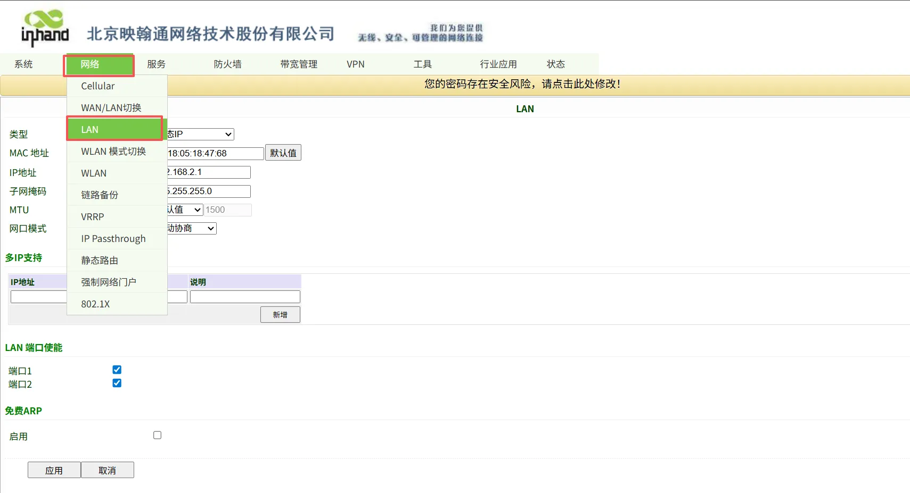

1. 进入【网络设置】→【LAN】
2. 配置合适的 IP地址，一般是需要和设备地址在同一网段并且作为设备的网关地址。
3. 选择应用
4. 应用之后需要用最新设置的地址登录设备

### 6.2 4G 无线网络配置

1. 插入 SIM 卡（注意要在断电的情况下安装SIM卡）
2. 进入【网络】→【cellular】
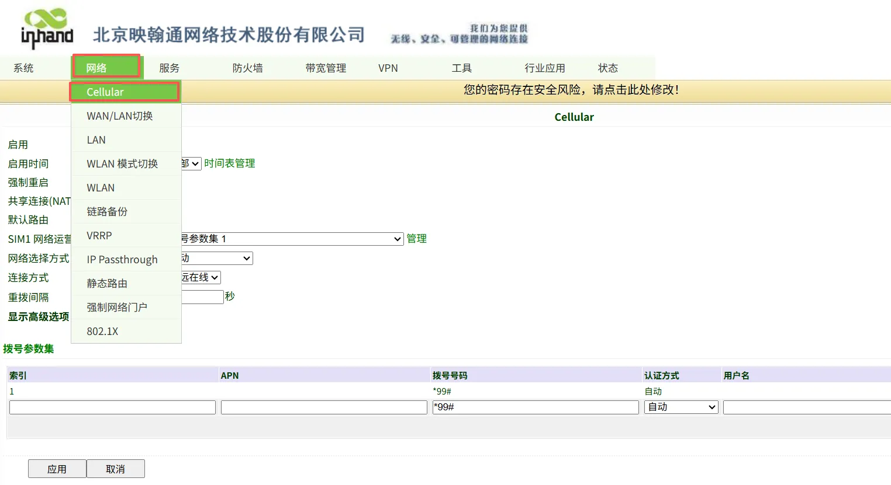
3. 如果是专网卡或者定制卡，则需要配置APN（案例为标准物联网卡，不需要设置APN）
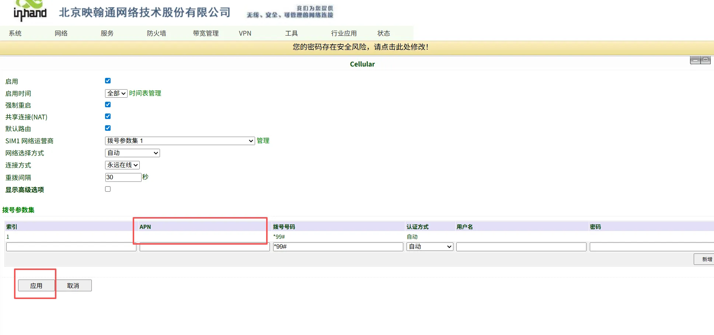
4. 在面板上查看Signal指示灯，红色-差（信号值0~10），黄色-中（信号值11~20），绿色-好（信号值21~30）

## 七、路由器用户管理配置

### 7.1 修改用户名密码

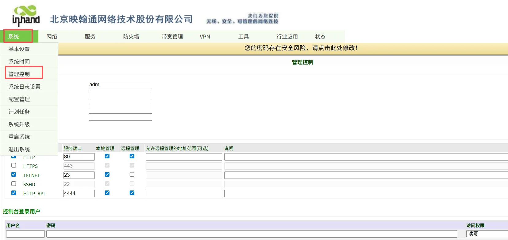

1. 进入【系统设置】→【管理控制】
2. 输入用户名，旧密码，新密码
3. 选择应用，保存配置

### 7.3 修改本地管理方式

1. 进入【系统设置】→【管理控制】
2. 在管理功能里面选择，服务类型、端口参数、远程管理和本地管理等
3. 选择应用，保存配置
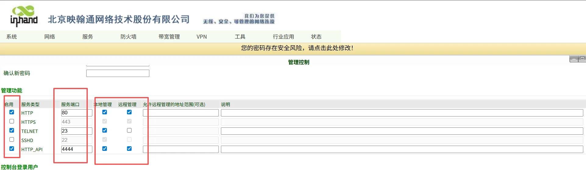

### 7.4 开启远程管理平台

#### 7.4.1 路由器中开启ICS平台

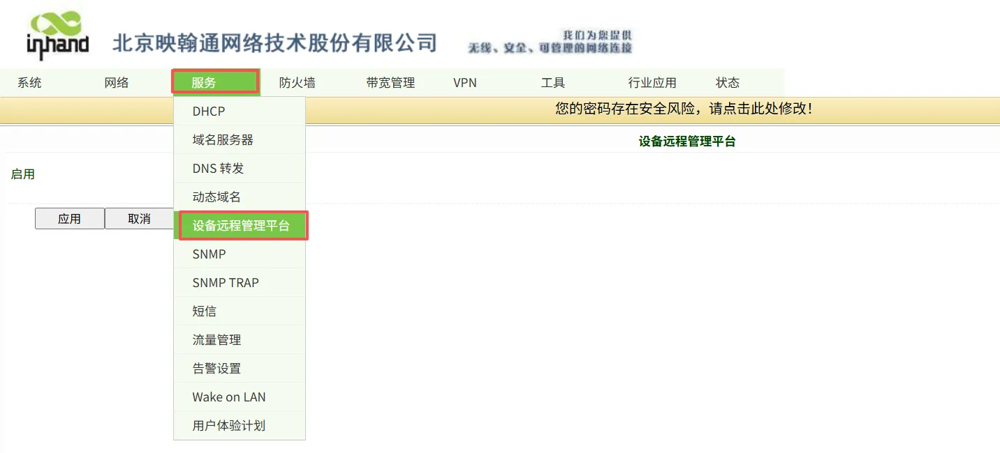

1. 进入【服务】→【设备远程管理平台】
2. 勾选启用
3. 服务类型选择ICS平台
4. 服务器选择国内或者国外，根据项目需求选择
5. 注册账户写自己在这个平台注册的账户
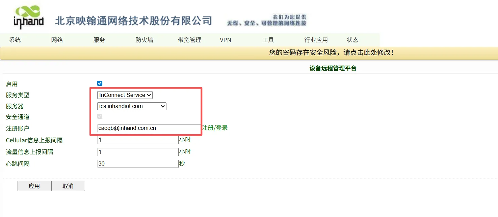

#### 7.4.2 ICS平台中设置

1. 进入ICS平台，登录后，点击【设备管理】，添加设备
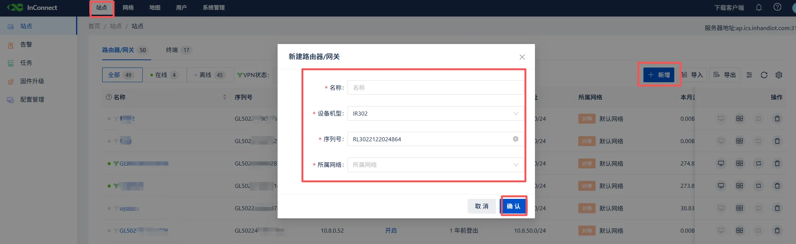
2. 设置好之后点击该设备进入终端设置页面
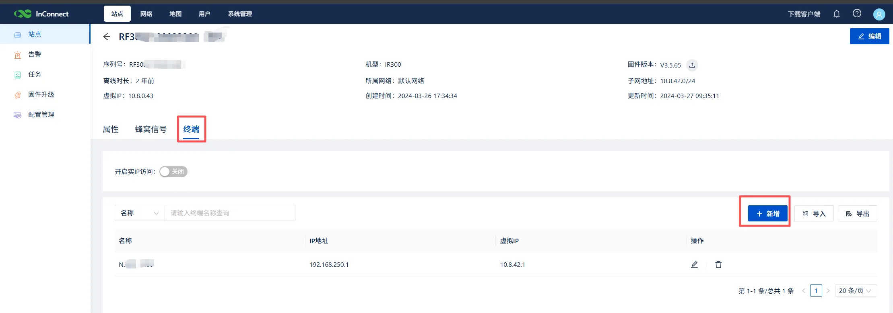
3. 添加并设置终端。

#### 7.4.3 配置远程维护中心的电脑

1. 电脑登录ICS平台，在平台右上角找到客户端下载
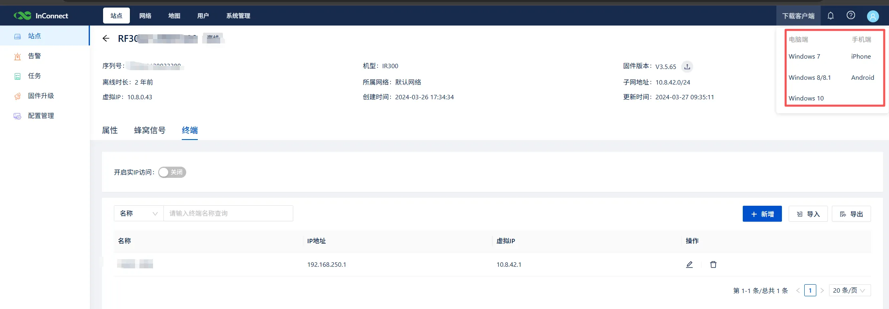
2. 配置远程维护中心的电脑下载并且安装客户端软件
3. 从平台下载Ovpn的配置文件
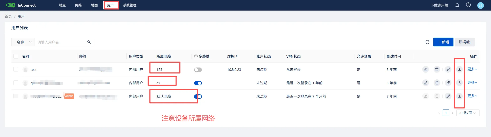
4. 打开客户端软件，导入Ovpn的配置文件
5. 可以测试连接远程设备，确认是否成功连接

### 7.5 配置备份与恢复

#### 备份配置

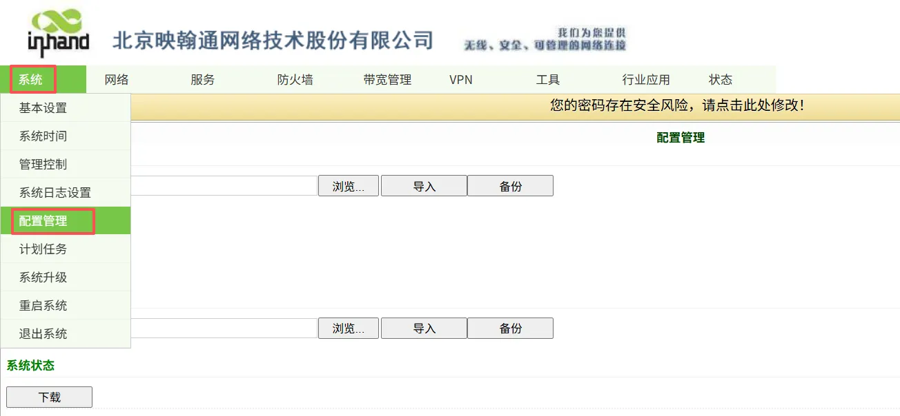

1. 进入【服务】→【配置管理】
2. 在router配置中点击备份配置
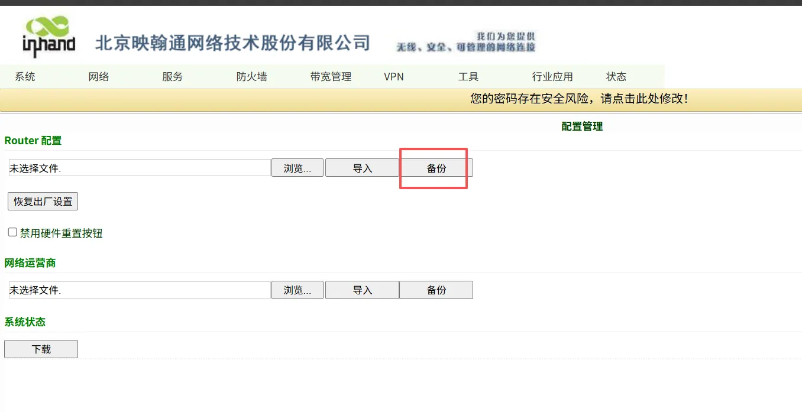

#### 导入配置

1. 进入【服务】→【配置管理】
2. 在router配置中点击导入配置
3. 导入配置后重启生效
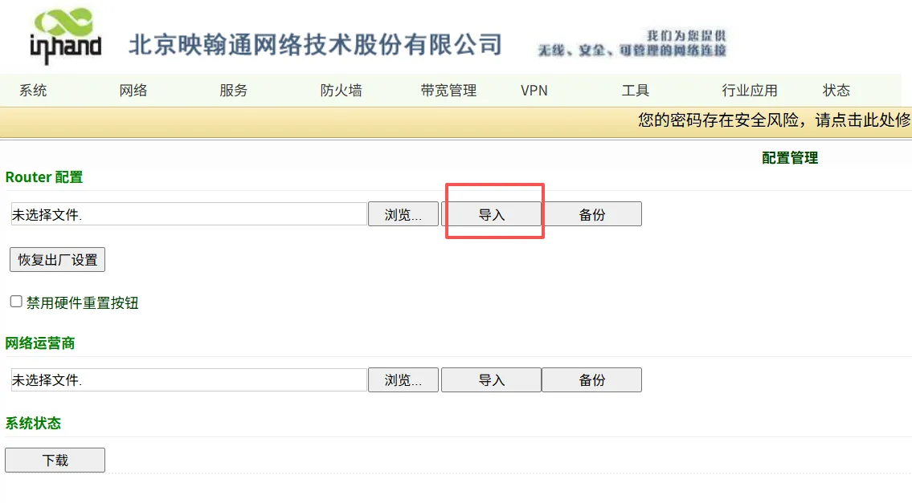

#### 附件中的配置文件信息

1. /configs/config-IR302.dat ：配置文件，包含默认的用户名：adm；密码123456；LANip地址：192.168.2.1。
2. ICS平台配置文件，包含ICS平台的账户：caoqb@inhand.com.cn 。
3. 如果需要使用该配置文件建议导入后修改对应参数，如用户名密码、网络参数、以及ICS平台账户等。

## 八、常见问题与排查

1. 无法打开 Web 界面
   - 检查网段、网线、IP 是否冲突
   - 网关恢复出厂设置重试

2. 蜂窝网无法正常拨号
   - 检查SIM卡是否正常
   - 检查APN是否正确
   - 检查是否4G网络是否正常（建议信号值21~30）

3. 信号拨号正常无法访问服务器
   - 检查下联设备是否设置正确的IP地址
   - 网关地址是否正确
   - 是否设置DNS服务器
   - 确认一下这张卡是否是白名单卡，是否将服务器地址添加到白名单中

## 九、安全注意事项

- 工业现场可靠接地
- 避免带电热插拔串口
- 配置完成后备份
- 远程密码定期修改
- 禁止非授权人员操作
