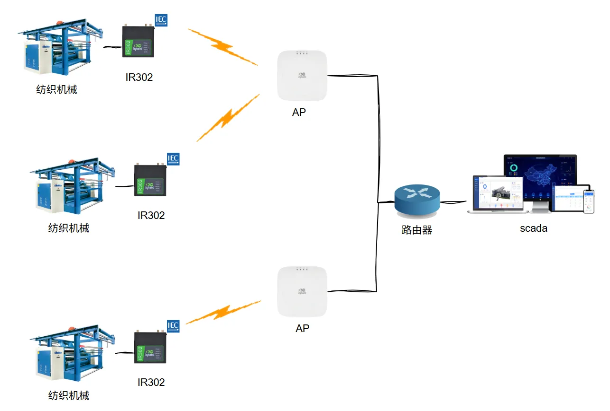

# 纺织厂数字化改造组网案例

## 一、方案概述

### 1.1 项目背景

随着工业数字化的成熟，很多工厂初建都直接规划了数字化。某大型纺织工厂，有很多老的产线，现在也需要进行数字化改造，希望产线尽可能不停产，减少布线，本地化组态展示的方式实完成数字化改造。

### 1.2 目标

- 为厂区纺织各阶段设备提供网络连接
- 使用WiFi无线的方式，避免停机停产
- 需要稳定，无人值守运行
- 可以大屏展示整个厂区的生产数据。

### 1.3 适用场景

- 旧产线数字化改造
- 生化培养设备，智能化联网
- 新建数字化产线的WiFi无线方案

## 二、需求分析

### 2.1 设备现状

- 设备类型：纺织机械（PLC）
- 通信接口：Ethernet/RS485
- 通信协议: TCP
- 部署环境：室内

### 2.2 核心需求

1. 接入需求：以太网口、RS485
2. 数据需求：上位机主动采集数据
3. 网络需求：WiFi，稳定自动重连
4. 安全需求：EMC、隔绝外网

## 三、总体架构设计

### 3.1 架构

1.设备层：纺织设备
2.网络层：工业路由器IR302
3.平台层：本地Scada系统

### 3.2 数据流

设备 → 工业路由器IR302 → wifi → 本地Scada系统

## 四、网络与接入方案

### 4.1 联网方式选型

该项目使用WiFi无线网络。需要支持以太网口和串口。

### 4.2 路由器选型要点

- 支持WiFi 客户端模式
- 支持Modbus网校功能
- 工业级宽温、防尘、抗干扰
- 软硬件件安全需要检测

## 五、方案亮点总结

1. 一站式：接入 + 网络 + 平台 + 应用全栈解决方案
2. 高兼容：多设备、多协议、多网络统一接入
3. 高可靠：边缘缓存、断网续传、双链路备份
4. 易扩展：支持批量扩容、二次开发、API 对接
5. 低成本：减少人工巡检，提升运维效率
6. 安全合规：传输加密、权限管理、操作审计
