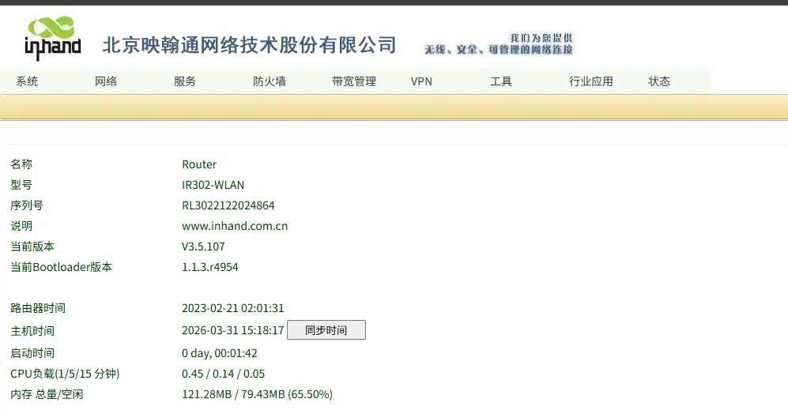
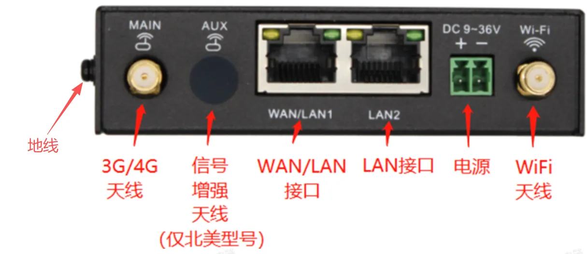
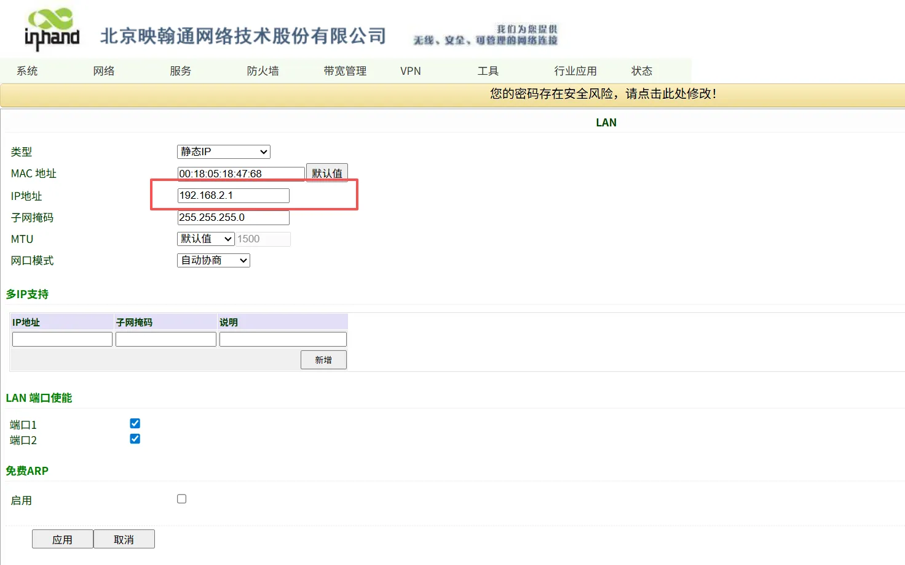
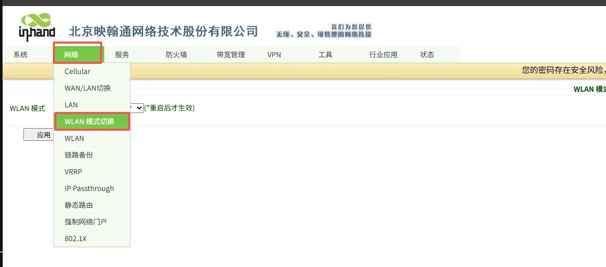
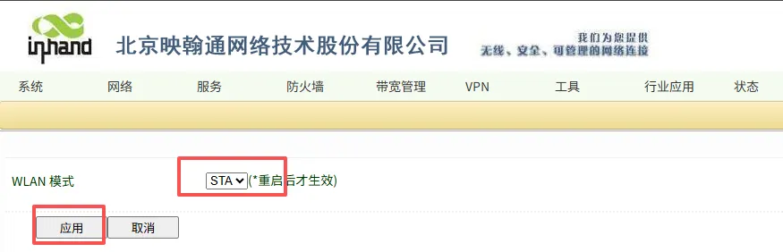
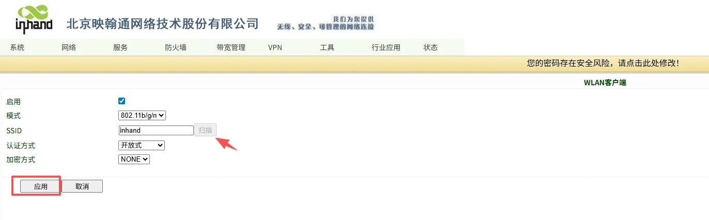
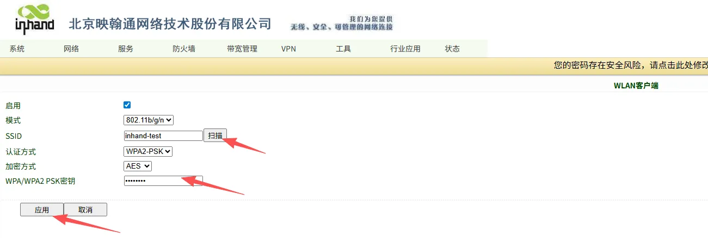
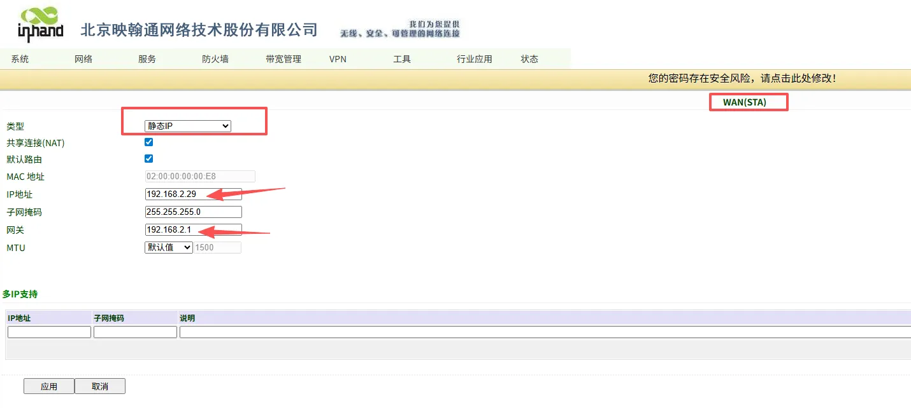
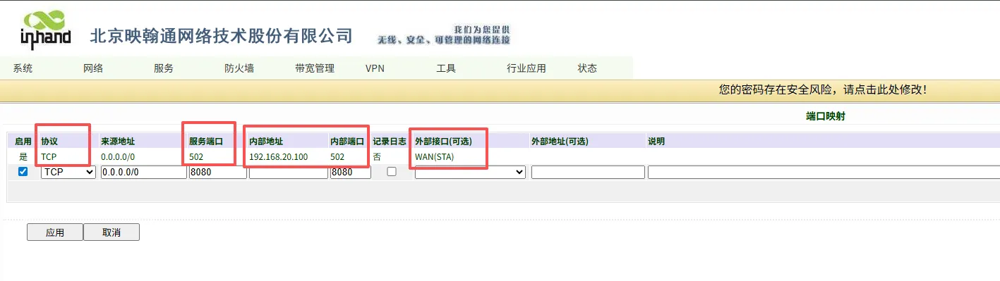

# 医疗设备联网案例配置指导手册

## 一、文档信息

- 产品型号：IR302-EN00-WLAN
- 固件版本：V3.5.107
- 适用场景：工业设备联网、医疗设备联网、生化培养设备联网
- 编写日期：2026年3月31日

## 二、路由器概述

### 2.1 产品简介

InRouter302（简称IR302）系列产品是一款集成了4G网络、Wi-Fi和虚拟专用网等多种技术的物联网无线路由器，提供简单、可靠和安全的互联网连接。产品设计考虑到无人值守现场通信的要求，采用了软、硬件看门狗和多级链路检测机制，以确保通信的稳定性和可靠性。同时，IR302系列产品支持映翰通的Device Manager“设备云”管理平台，使用户能够实现远程智能化设备管理。IR302系列产品适用于各种工业和商业物联网应用，为数字化物联网提供了高效和可靠的解决方案。

### 2.2 主要功能

- 支持为网口串口设备提供网络连接
- 支持4G网络、Wi-Fi、有线网络等多种连接方式
- 支持多种VPN协议，如OpenVPN、IpSec、L2TP等
- 支持远程配置、远程诊断、远程升级
- 工业级化设计

### 2.3 典型应用拓扑

医疗设备 → IR302路由器 → 4G → 医疗设备云平台

## 三、硬件说明

### 3.1 外观与接口

- 电源接口：DC 9–36V，防反接、防过流保护
- 串口：1路RS232（可选）
- 网口：RJ45 ×2路 ,WAN/LAN
- 无线：4G/Wi-Fi（可选）
- 指示灯：Power、Status、cellular、Signal、Wi-Fi
- 复位键：恢复出厂设置

### 3.2 接口说明

- 正极：V+
- 负极：V-
- 注意：防反接、防雷、接地
- MAIN → 4G天线
- WiFi → WiFi天线
- AUX → 4G增强天线（仅北美型号）
- WAN/LAN → 以太网口(可以设置为WAN模式)
- LAN2 → 以太网LAN接口
- 地线：接地，用于防止静电和噪声干扰

## 四、出厂默认参数

- 默认 IP：192.168.2.1
- 子网掩码：255.255.255.0
- Web 用户名：adm
- Web 密码：123456（部分批次是随机密码。参考铭牌上的密码）

## 五、前期准备

1. 电脑设置与网关LAN口同网段 IP，网关LAN口是：192.168.2.1。
2. 网线连接电脑与网关 LAN 口连接
3. 网关上电，等待 Status 灯亮
4. 确保电脑安装正常使用的浏览器

## 六、网络配置

### 6.1 LAN 口配置（静态 ）

   

1. 进入【网络设置】→【LAN】
2. 配置合适的 IP地址，一般是需要和设备地址在同一网段并且作为设备的网关地址。
3. 选择应用
4. 应用之后需要用最新设置的地址登录设备
   

### 6.2 4G 无线网络配置

1. 登录路由器选择【网络】→【WLAN模式切换】→【将模式改为STA模式】→【应用】（注意：修改后重启生效）
   
2. 进入【网络】→【WLAN客户端】
   
3. 设置WLAN客户端，输入SSID和密码，或者扫描网络，选择要连接的网络
   
4. 进入【网络】→【WLAN（STA）】,默认是禁用，设置成静态ip设置正确的ip地址子网掩码和网关地址
   
5. 网口设备设置端口映射，将WAN（STA）的502 端口映射到192.168.20.100:502端口，用于Modbus采集数据。（具体端口号根据PLC协议所使用的端口设置）
   
6. 串口设备设置DTU功能，【服务】→【DTU功能】，启用DTU功能，协议设置为Modbus网桥功能。

## 七、路由器用户管理配置

### 7.1 修改用户名密码

1. 进入【系统设置】→【管理控制】
2. 输入用户名，旧密码，新密码
3. 选择应用，保存配置

### 7.2 配置备份与恢复

#### 备份配置

1. 进入【服务】→【配置管理】
2. 在router配置中点击备份配置

#### 导入配置

1. 进入【服务】→【配置管理】
2. 在router配置中点击导入配置
3. 导入配置后重启生效(附件中的配置文件中的LAN口地址是192.168.20.1)

## 十、常见问题与排查

1. 无法打开 Web 界面
   - 检查网段、网线、IP 是否冲突
   - 网关恢复出厂设置重试

2. 无法搜索到WiFi信号
   - 检查天线是否安装正确
   - 检查AP是否正常
   - 查看WiFi频段是否为路由器支持的频段（2.4GHz）

3. 无法正常连接WiFi
   - 检查WiFi密码是否正确
   - 确认WiFi认证方式路由器是否支持
   - 检查路由器是否有接入黑白名单限制

## 十一、安全注意事项

- 工业现场可靠接地
- 避免带电热插拔串口
- 配置完成后备份
- 远程密码定期修改
- 禁止非授权人员操作
