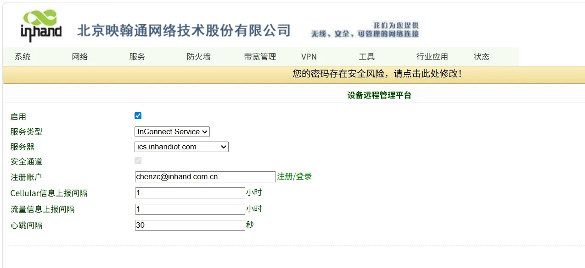
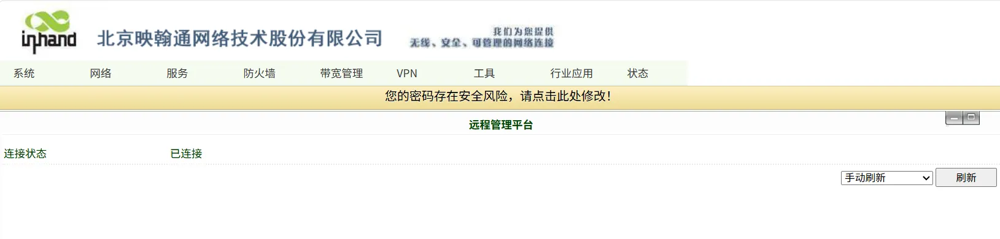

# 配置指导手册

## 一、文档信息

- 文档名称：配置手册
- 产品型号：**IR302**
- 固件版本：**V**3.5.96
- 适用场景：设备联网
- 编写日期：2026年03月25日

## 二、网关概述

### 2.1 产品简介

InRouter302（简称IR302）系列产品是一款集成了4G网络、Wi-Fi和虚拟专用网等多种技术的物联网无线路由器，提供简单、可靠和
安全的互联网连接。产品设计考虑到无人值守现场通信的要求，采用了软、硬件看门狗和多级链路检测机制，以确保通信的稳定性和可
靠性。同时，IR302系列产品支持映翰通的Device Manager“设备云”管理平台，使用户能够实现远程智能化设备管理。IR302系列产
品适用于各种工业和商业物联网应用，为数字化物联网提供了高效和可靠的解决方案。

### 2.2 主要功能

- 4G上网
- 远程配置、远程诊断、远程升级
- 宽温工业级设计

### 2.3 典型应用拓扑

设备 → 以太网 → IR302路由器 → 4G →云平台

## 三、硬件说明

### 3.1 外观与接口

- 电源接口：DC 9–36V
- 网口：LAN ×1路+1WAN
- 无线：4G
- 指示灯：Power、status、cellular、Signal
- 复位键：恢复出厂设置

### 3.2 接线说明

#### 3.2.1 电源接线

- 正极：V+
- 负极：V-
- 注意：防反接、防雷、接地

#### 3.2.2 以太网接线

直连 / 交叉自适应，建议超五类及以上网线。

## 四、出厂默认参数

- 默认 IP：192.168.2.1
- 子网掩码：255.255.255.0
- Web 用户名：**adm**
- Web 密码：123456

## 五、前期准备

- 电脑设置与网关同网段 IP
- 网线连接电脑与网关 LAN 口
- 路由器上电，等待 RUN 灯常亮
- 浏览器输入设备 IP 进入配置页面

## 六、网络配置

### 6.1 本地网络配置

- 插入4G SIM 卡
- 开启移动网络
- APN：自动 / 手动填写
- 信号强度查看

<<<<<<< HEAD
## 七、开启ics平台，填写账号

=======
## 七、开启ics平台，填写账号。

>>>>>>> da613768f354d102a6ebe004924724b89d409e50
## 八、配置备份与恢复

- 导出配置文件
- 恢复出厂配置

## 九、状态监控与诊断

### 9.1 运行状态

- 设备在线状态

- 网络流量、信号强度

### 9.2 日志查看

- 系统日志

## 十、常见问题与排查

- 无法打开 Web
  - 检查网段、网线、IP 是否冲突
  - 复位网关重试

## 十、安全注意事项

- 工业现场可靠接地
- LAN口地址要修改成本地子网的网关
- 配置完成后备份
- 远程密码定期修改
- 禁止非授权人员操作
