# Always-Online 连接配置指南

## 1. 文档信息

- **产品型号：** 映翰通（InHand）IR302 工业级蜂窝路由器
- **功能：** 链路备份（Link Backup，WAN / 蜂窝 / Wi-Fi 自动故障转移）
- **参考案例：** 以太网 WAN 作为主链路（Main Link），4G 蜂窝作为备份链路（Backup Link），通过 ICMP 探测 `8.8.8.8`，使用热备份（Hot failover）模式
> **整体流程：** 在 IR302 上至少启用两条上行链路（WAN + 蜂窝、WAN + Wi-Fi 或 蜂窝 + Wi-Fi）。然后启用 **链路备份（Link Backup）**，选择一条 **主链路（Main Link）** 和一条 **备份链路（Backup Link）**，设置一个 **ICMP 探测目标**，并选择一种 **备份模式（Backup mode）**（热备份 / 冷备份 / 负载均衡）。路由器将根据探测结果自动监控并切换默认路由。

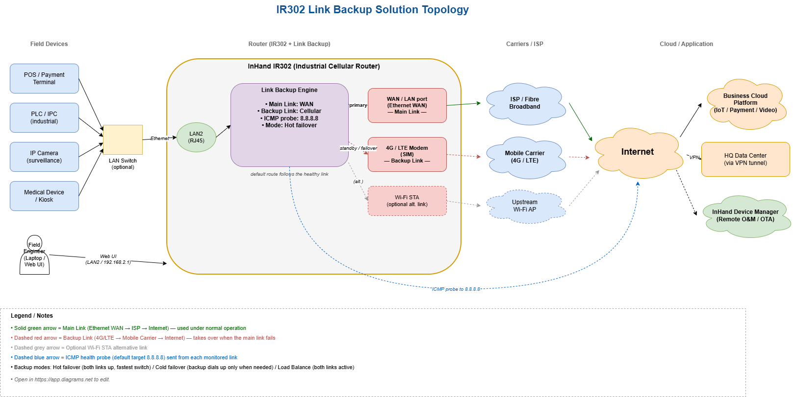

---

## 2. 前提条件

1. IR302 已上电（DC 9–36 V），并可通过 LAN 口访问。
2. 一台笔记本电脑已连接到 **IR302 LAN2** 端口，并配置到同一子网（默认 LAN 为 `192.168.2.0/24`）。
3. 如使用蜂窝作为链路之一，请已插入 **SIM 卡**（设备须断电时插入）。
4. 如使用以太网作为链路之一，已将 **以太网上行链路** 接入 `WAN/LAN` 端口（并设置为 WAN 模式）。
5. 如使用 Wi-Fi STA 作为链路之一，需准备好 **上游 Wi-Fi 凭据**（SSID + 密码）。
6. 准备一个用于访问 IR302 Web 界面的浏览器。

默认凭据（出厂设置）：

| 项目 | 值 |
|---|---|
| LAN IP | `192.168.2.1` |
| 子网掩码 | `255.255.255.0` |
| Web 用户名 | `adm` |
| Web 密码 | `123456` *（或随机密码，请查看设备标签）* |

> **首次登录后请修改所有默认密码。**

---

## 3. 第一部分：登录 IR302 Web 界面

1. 使用以太网线将 PC 连接到 IR302 的 **LAN2** 端口。
2. 将 PC IP 设置为与 `192.168.2.1` 同一子网（例如 `192.168.2.100/24`）。
3. 打开浏览器，访问 `http://192.168.2.1`。
4. 使用默认凭据（`adm` / `123456`）或设备标签上的随机密码登录。

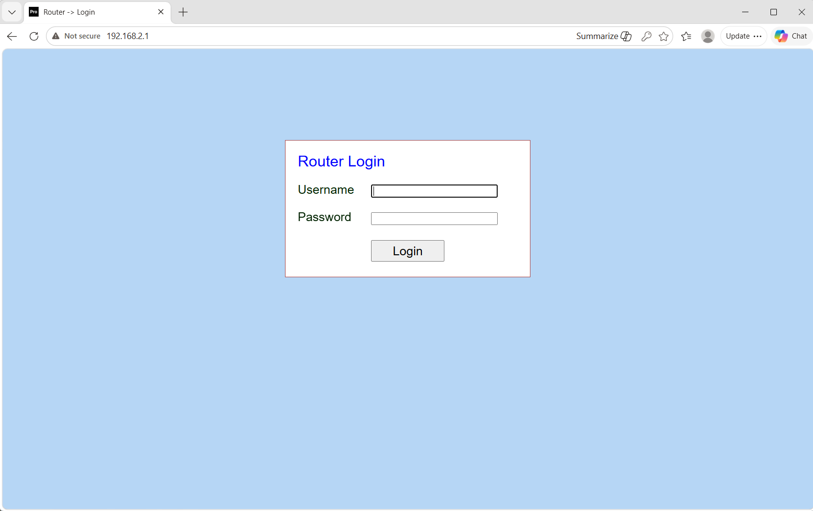

---

## 4. 第二部分：启用上行链路

在启用链路备份之前，必须分别配置并确认两条上行链路均已单独在线。进入 **Status → Network Connections**，确认您计划使用的每条链路都显示为活动状态。

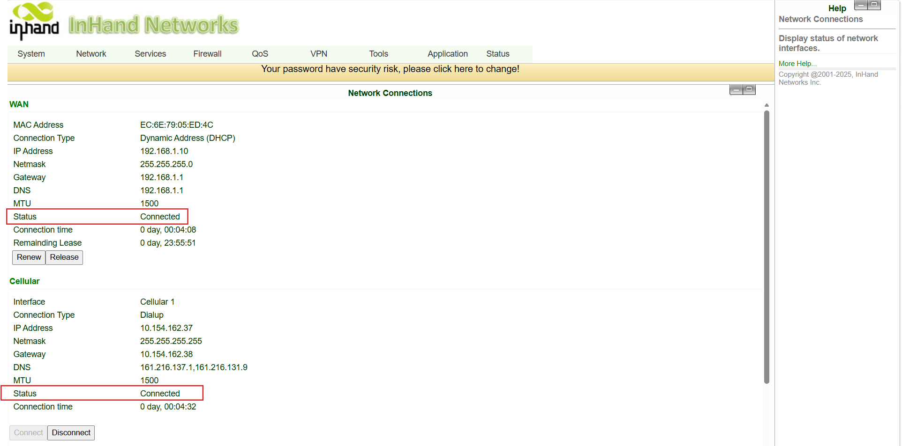

### 4.1 以太网 WAN

1. 进入 **Network → WAN/LAN Switch**。
2. 将 `WAN/LAN` 端口设置为 **WAN** 模式。
3. 根据运营商（ISP）提供的方式选择 **DHCP**、**Static** 或 **PPPoE**；应用设置。
4. 将运营商网线插入 `WAN/LAN` 端口。
5. 在 **Status → Network Connections** 中确认 WAN 链路已获取 IP 并处于在线状态。

### 4.2 4G 蜂窝

1. 设备断电，插入 SIM 卡，然后重新上电。
2. 进入 **Network → Cellular**。
3. 对于公共物联网（IoT）SIM 卡，通常无需设置 APN。对于私有/定制 SIM 卡，请填写运营商提供的 APN、用户名和密码。
4. 应用设置并等待蜂窝链路上线。
5. 查看前面板的 **信号（Signal）** 指示灯：红色 = 信号差（0–10），黄色 = 中等（11–20），绿色 = 良好（21–30）。建议达到绿色。
6. 在 **Status → Network Connections** 中确认蜂窝链路已获取 IP。

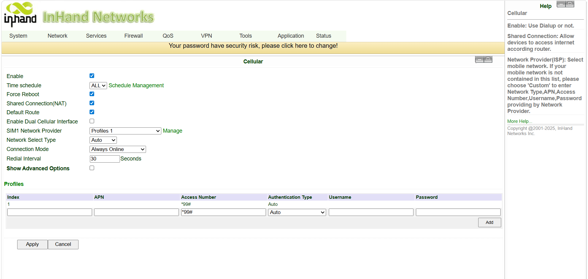

### 4.3 Wi-Fi STA（可选）

如需使用 Wi-Fi 作为链路之一，IR302 的 Wi-Fi 必须设置为 **STA（客户端）** 模式，而不是 AP 模式。

1. 进入 **Network → Switch WLAN Mode**，从 **AP 切换为 STA**，应用设置并 **重启** 设备。

2. 启用 **WAN(STA)** 模式，根据运营商提供的方式选择 **DHCP**、**Static** 或 **PPPoE**；应用设置。
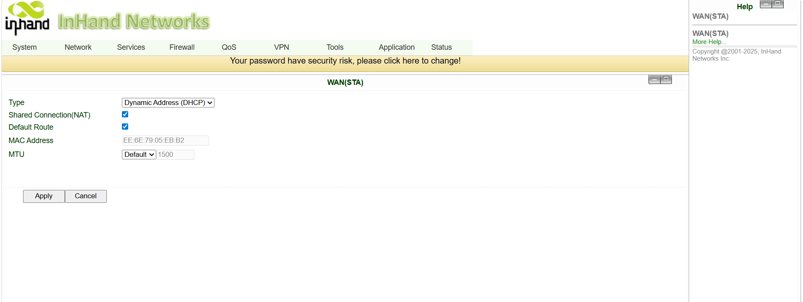
3. 进入 **Network → WLAN Client**，扫描并选择上游 SSID，输入 Wi-Fi 密码，应用设置。
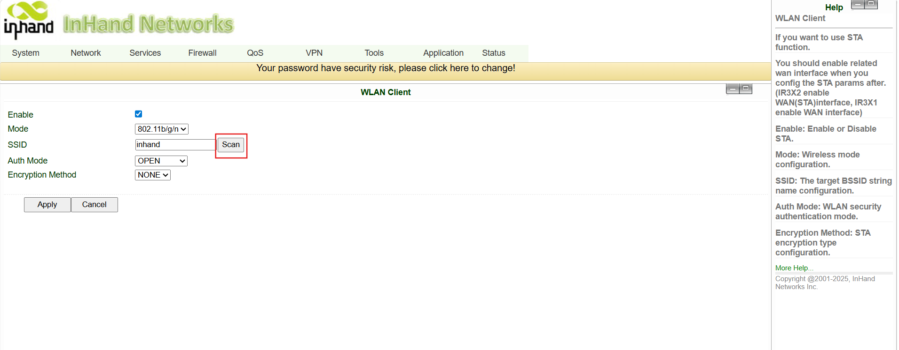
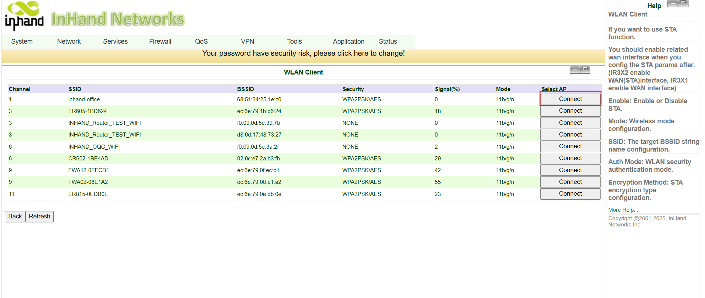

4. 在 **Status → Network Connections** 中确认 Wi-Fi STA 已从上游 Wi-Fi 获取到 IP。
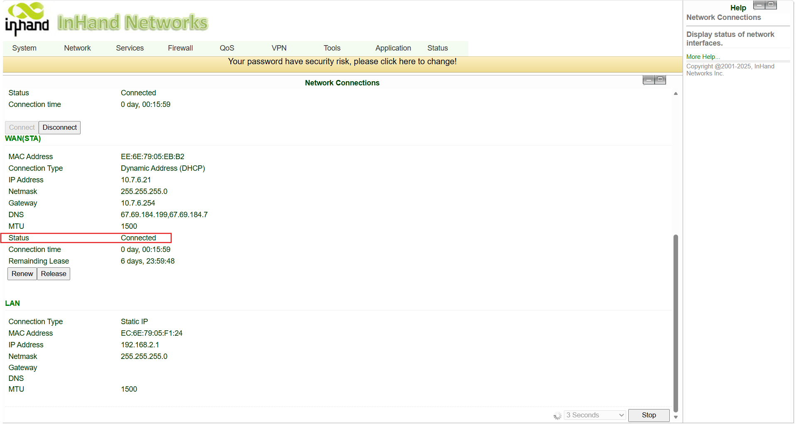

---

## 5. 第三部分：启用链路备份

1. 进入 **Network → Link Backup**。
2. 勾选 **Enable**。
3. 选择 **Main Link** 和 **Backup Link**。
4. 点击 **Apply**。

### 5.1 配置主链路、备份链路与探测

仍停留在 **Network → Link Backup** 页面，填写以下参数。

| 字段 | 值（本案例） | 说明 |
|---|---|---|
| Main Link（主链路） | `WAN` | 正常运行时的首选上行链路 |
| Backup Link（备份链路） | `Cellular` | 主链路故障时接管 |
| ICMP detection server（ICMP 探测服务器） | `8.8.8.8` | 任何长期在线的公网 IP；也可替换为客户总部/自有服务器 |
| Backup mode（备份模式） | `Hot failover` | 详见下文 6.1 节 |

点击 **Apply** 保存。

### 5.2 选择备份模式

IR302 支持三种备份模式：

| 模式 | 行为 | 适用场景 |
|---|---|---|
| **Hot failover（热备份）** | 路由器始终保持 **两条链路同时在线**。主链路故障时，流量会 **立即** 切换到已在线的备份链路。备份链路会保持少量数据以维持连接。 | 需要 **最快故障切换** 的场景（如支付、报警、医疗、关键控制）。 |
| **Cold failover（冷备份）** | 仅主链路在线。备份链路仅在主链路中断时 **才拨号上线**。主链路正常时 **蜂窝流量为零**。故障切换会多花数秒，因为备份链路需要拨号。 | 相比节省几秒切换时间，更重视 **降低 SIM 数据费用** 的场景。 |
| **Load Balance（负载均衡）** | 路由器 **同时使用两条链路**，并将出站流量分发到两条链路上。 | 吞吐量聚合、双 SIM 绑定等场景。 |

> 对于大多数固定站点（有线 WAN + 4G 备份），推荐使用 **Hot failover** 作为默认模式。

---

## 7. 第五部分：验证默认路由

1. 进入 **Status → Route Table**。
2. 默认路由（`0.0.0.0/0`）应指向 **Main Link** 接口（本案例中为 WAN 接口）。

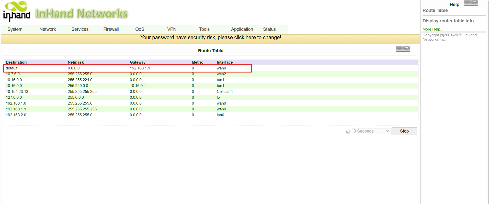

---

## 8. 第六部分：测试故障切换

通过模拟主链路中断来测试故障切换：

1. 断开 `WAN/LAN` 端口的以太网线（或拔掉上游 ISP 网线）。
2. 等待数秒，让 ICMP 探测判定 WAN 链路中断。
3. 进入 **Status → Route Table**。
4. 默认路由应切换为指向 **Backup Link**（蜂窝）。此时所有 LAN 设备的出站流量均通过 4G 转发。

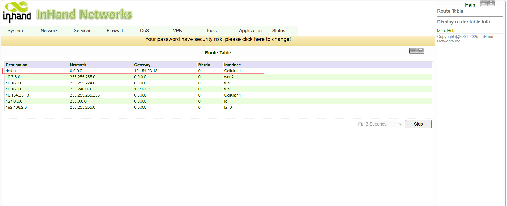

### 8.1 测试回切

1. 将 `WAN/LAN` 端口的以太网线重新接回。
2. 等待 WAN 恢复在线并通过 ICMP 探测。
3. 再次进入 **Status → Route Table**。
4. 默认路由应自动切换回 **Main Link**（WAN）。无需手动操作。

---

## 9. 可选：加固与运维

### 9.1 修改默认 Web 密码

1. 进入 **System → Admin Access**（或 **System Settings → Management**）。
2. 输入用户名、旧密码和新的强密码。
3. 应用并保存。

### 9.2 限制/开放远程管理

1. 进入 **System → Admin Access**。
2. 在 Management 部分，选择服务类型（HTTPS / SSH）、端口，以及是否允许远程（WAN）管理。
3. 应用并保存。

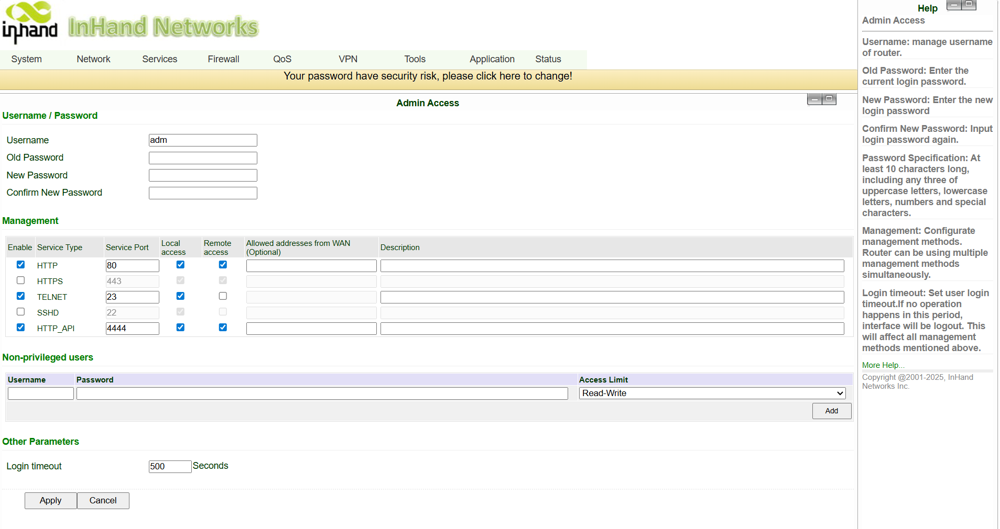

### 9.3 启用设备管理器（Device Manager，云端运维）

1. 进入 **Services → Device Remote Management Platform**。
2. 勾选 **Enable**。
3. 服务类型：选择 **Device Manager**。
4. 服务器：根据项目所在地区选择 **China** 或 **International**。
5. 账户：填写已注册的映翰通设备管理器（InHand Device Manager）账户。
6. 应用并保存。

### 9.4 备份配置

1. 进入 **System → Configuration Management**。
2. 在 **Router Configuration** 中，点击 **Backup** 下载备份文件。
3. 如需恢复，点击 **Import Config** 并重启设备以应用。

---

## 10. 故障排查

| 现象 | 检查项 |
|---|---|
| 无法打开 Web 界面 | 是否在同一子网 `192.168.2.1`？是否存在 IP 冲突？网线是否正常？尝试恢复出厂设置。 |
| 蜂窝无法拨号 | SIM 卡是否插好？APN 是否正确（私有 SIM）？信号值是否 ≥ 21？ |
| WAN 无法上线 | 网线是否接入 `WAN/LAN` 端口？端口是否设为 WAN 模式？IP 模式是否正确（DHCP / Static / PPPoE）？ |
| Wi-Fi STA 无法连接 | Wi-Fi 是否设为 **STA**（而非 AP）模式？SSID / 密码是否正确？信号是否足够强？ |
| 故障切换未发生 | **Link Backup → Enable** 是否已勾选并应用？ICMP 目标是否可从已知正常的链路可达？SIM 是否被允许访问 `8.8.8.8`？ |
| 未回切到主链路 | 主链路是否真正通过了 ICMP 探测？尝试从 WAN 侧 ping 探测目标。 |
| 两条链路均在线但流量卡在备份链路 | 检查 **Status → Route Table** — 默认路由应与活动链路一致。可重新应用链路备份配置。 |
| 信号良好但无法访问服务器 | LAN 设备的网关 / DNS 是否设置正确？SIM 白名单是否允许访问该服务器端点？ |

---

## 11. 安全注意事项

- 在工业、户外或车载场景下，请正确接地设备。
- 设备上电时请勿热插拔串口线缆。
- 每次修改配置后请备份配置。
- 定期修改默认密码。
- 仅限授权人员操作网关。

---
