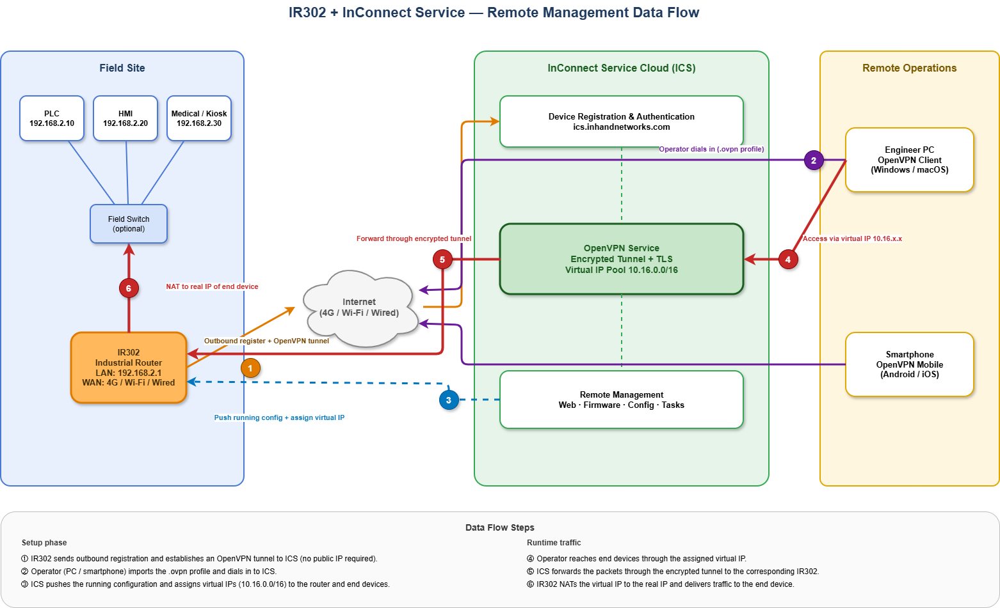

# 终端设备远程管理

## 1. 方案概述

### 1.1 项目背景

随着工业物联网（Industrial IoT）、智慧园区、智慧工厂以及智能运维（O&M）的快速发展，越来越多的传感器、仪表、可编程逻辑控制器（PLC）、控制器、自助服务终端、医疗设备等终端设备被部署在分散的现场站点。这些设备通常具有以下特点：

- 地理分布广，物理位置难以到达；
- 位于运营商级网络地址转换（CGNAT）或私有网络之后，没有公网 IP 地址；
- 以数据孤岛形式运行，缺乏统一的远程监控或远程服务通道；
- 维护成本高昂，每次现场维护都需要派遣人员到场。

本方案利用 InHand **InRouter302（IR302）** 工业 4G 路由器与 **InHand Connect Service（InConnect / ICS）** 云平台，构建统一、安全、即插即用的远程访问基础设施。该方案支持集中化设备接入、实时数据交换、远程控制、状态监控、告警处理以及云端数据集成，为上层业务应用提供稳定的物联网基础。

### 1.2 建设目标

- 将所有现场终端设备接入网络，并在同一平台下进行统一管理。
- 采集实时数据，并将其转发至标准云平台或企业平台。
- 支持远程配置、远程诊断以及远程固件升级。
- 提供告警、自动化、可视化以及报表功能。
- 降低现场巡检成本，提升运维效率。
- 提供安全、可靠、易于扩展且易于维护的解决方案。

### 1.3 适用场景

- 工业设备联网——数控机床、风机、水泵、空气压缩机、生产线。
- 仪表/传感器联网——电表、水表、气表、温湿度传感器。
- 智慧园区、智能楼宇、机房以及基站。
- 智慧农业、环境监测、能源管理。
- 移动资产、车辆以及工程机械联网。
- 医疗设备联网、自助服务终端（Kiosk）、POS 终端、自动售货机。

## 2. 数据流拓扑

下图展示了远程工程师如何通过 ICS 访问现场 PLC/人机界面（HMI）：

图中所示步骤如下：

1. IR302 向 ICS 发起出向注册并建立 OpenVPN 隧道——现场站点无需公网 IP，也无需端口映射。
2. 远程工程师（PC 或智能手机）导入 `.ovpn` 配置文件并拨入 ICS。
3. ICS 推送运行配置，并为路由器及其下游设备分配虚拟 IP（10.16.0.0/16）。
4. 工程师通过分配的虚拟 IP 访问现场设备，所有流量均由 OpenVPN + 传输层安全协议（TLS）加密。
5. ICS 将数据包通过隧道转发至对应的 IR302。
6. IR302 将虚拟 IP 网络地址转换（NAT）为设备的真实 IP，并将流量送达 PLC/HMI/医疗终端。

## 3. 网络方案

| 方式 | 使用场景 | 说明 |
|------|----------|------|
| 4G 蜂窝网络（推荐） | 无有线网络、移动资产、临时部署等场景 | 使用物联网 SIM 卡；建议信号强度为 21–30 |
| 有线 WAN | 具备稳定宽带或光纤的站点 | 延迟最低、吞吐量最佳 |
| Wi-Fi 上行 | 办公室、零售门店、已有 Wi-Fi 的自助服务终端 | IR302 支持 Wi-Fi 作为 WAN（视型号而定） |
| 双链路备份 | 关键业务站点 | 蜂窝网络作为有线 WAN 的备份 |

## 4. InConnect 服务提供的访问模式

- **虚拟 IP 访问**——ICS 自动将每个下游设备映射到 10.16.0.0/16 下的虚拟 IP，避免 IP 冲突。
- **真实 IP 访问**——保留设备在现场的原始 IP，适用于工程工具中已硬编码目标地址的场景。
- **Mesh 网络**——隔离多租户或多项目的访问权限；可按网络启用。
- **星型网络**——用于远程办公场景，员工可通过 ICS 访问企业内部网络服务器。

## 5. 方案亮点

1. **一站式交付**——网关、连接、云平台及应用由单一厂商提供完整技术栈。
2. **高兼容性**——支持多设备、多协议、多网络统一接入。
3. **高可靠性**——支持边缘缓存、断网时的存储转发机制以及双链路备份。
4. **易于扩展**——支持批量接入、表现层状态转移应用程序接口（REST API），便于二次开发。
5. **运营成本低**——大幅减少现场巡检，缩短平均修复时间（MTTR）。
6. **安全合规**——传输采用 TLS 加密，支持基于角色的访问控制、审计日志，现场站点无需公网 IP。
7. **零公网 IP 依赖**——IR302 始终主动发起出向连接；可在 CGNAT、私有 LTE 接入点名称（APN）以及受管控的企业网络内部正常工作。
