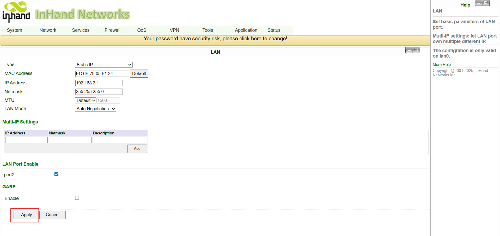
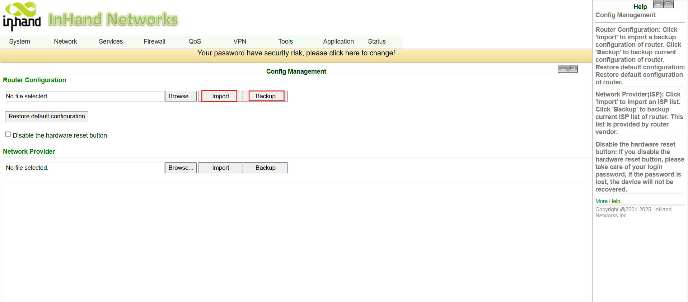
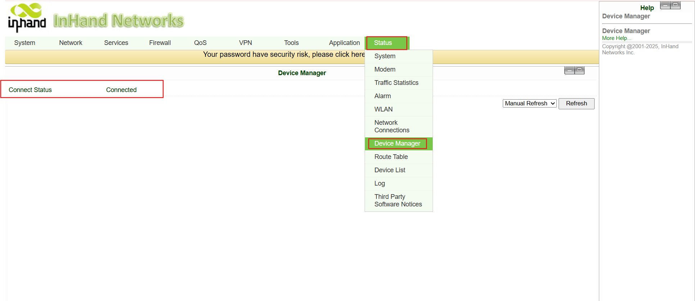
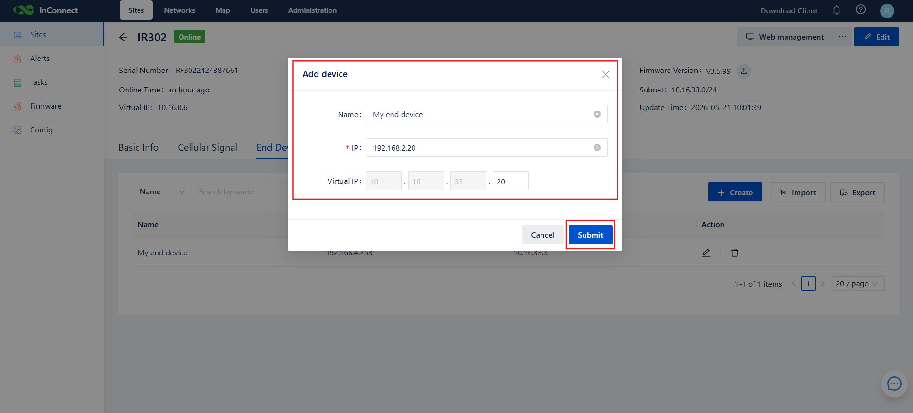

# 终端设备远程管理 - 配置指南

## 1. 文档信息

- 产品型号：IR302
- 配套平台：InConnect Service（ICS）
- 平台地址：`ics.inhandnetworks.com`
- 适用场景：工业 / 医疗 / 自助服务终端 / POS 终端联网及远程运维（O&M，Operation and Maintenance）

## 2. 路由器概述

### 2.1 产品介绍

InRouter302（IR302）是一款工业级物联网（IoT，Internet of Things）无线路由器，集成 4G 蜂窝网络、Wi-Fi 和 VPN（Virtual Private Network，虚拟专用网络）技术，提供简单、可靠、安全的互联网接入。该设备适用于无人值守的现场通信，内置软硬件看门狗及多级链路检测机制，确保连接稳定；并支持对接 InHand **Device Manager / InConnect Service** 云平台，实现端到端远程管理，适用于工业及商业物联网部署。

### 2.2 主要特性

- 为以太网和串口设备提供互联网接入
- 多链路上行：4G、Wi-Fi、有线以太网
- 支持远程配置、远程诊断、远程升级和远程管理

### 2.3 拓扑结构

## 3. 硬件说明

### 3.1 外观与接口

- 电源输入：DC 9–36 V，具备反接和过流保护
- 串口：1× RS232（可选）
- 以太网：2× RJ45，WAN/LAN 可切换
- 无线：4G / Wi-Fi（可选）
- 指示灯：Power、Status、Cellular、Signal、Wi-Fi
- 复位按钮：恢复出厂默认设置

### 3.2 接口说明

- 正极：V+
- 负极：V−
- 说明：具备反接 / 防雷 / 接地保护
- MAIN → 4G 主天线
- WiFi → Wi-Fi 天线
- AUX → 4G 辅助天线（仅北美型号）
- WAN/LAN → 以太网接口（可切换为 WAN 模式）
- LAN2 → 以太网 LAN 接口（用于连接下游设备）
- 接地：连接至大地，防止静电和噪声干扰

## 4. 出厂默认值

- 默认 IP：`192.168.2.1`
- 子网掩码：`255.255.255.0`
- Web 用户名：`adm`
- Web 密码：`123456`（部分批次设备采用随机密码，印在设备铭牌上）
- ICS 服务器（默认）：`ics.inhandnetworks.com`

## 5. 部署前检查清单

1. 将 PC 的 IP 设置为与 IR302 的 LAN 处于同一网段（网关为 `192.168.2.1`）。
2. 使用以太网线将 PC 连接到 IR302 的 LAN 接口。
3. 为路由器上电，等待 Status 指示灯变为常亮。
4. 确保 PC 上已安装可用的浏览器（推荐使用 Chrome）。
5. 提前在 `https://ics.inhandnetworks.com` 注册账号，并确认可以登录。
6. 准备好需要管理的现场设备，记录其真实 IP，并将其网关设置为 IR302 的 LAN IP。

## 6. 网络配置

### 6.1 LAN 配置（静态）

1. 进入 **Network Settings → LAN**。
2. 设置一个与下游设备同网段、并作为其网关的 IP 地址。
3. 点击 **Apply**。
4. 应用完成后，使用新的 LAN IP 重新登录。

### 6.2 4G 蜂窝网络配置

1. 关闭路由器电源，插入 SIM 卡。
2. 进入 **Network → Cellular**。
3. 若使用定制 SIM 卡，需配置 APN（Access Point Name，接入点名称）；标准物联网 SIM 卡通常无需配置 APN。
4. 查看前面板 Signal 指示灯：红色表示信号弱（0–10）、黄色表示信号中等（11–20）、绿色表示信号良好（21–30）。

## 7. 路由器用户管理

### 7.1 修改用户名与密码（可选）

1. 进入 **System Settings → Admin**。
2. 输入用户名、旧密码和新密码。
3. 点击 **Apply** 并保存配置。

### 7.2 启用远程管理平台（InConnect Service）

1. 进入 **Services → Device Manager**。
2. 勾选 **Enable**。
3. 将 **Service Type** 设置为 **InConnect Service**。
4. 将 **Server** 设置为所在区域的服务端点（如 `ics.inhandnetworks.com`）。
5. 在 **Registered Account** 中填写注册 ICS 时使用的邮箱。
6. 点击 **Apply** 并保存。

### 7.4 配置备份与恢复（可选）

#### 备份配置

1. 进入 **Services → Configuration Management**。
2. 在 Router Configuration 下，点击 **Backup**。

#### 导入配置

1. 进入 **Services → Configuration Management**。
2. 在 Router Configuration 下，点击 **Import**。
3. 导入的配置在重启后生效。

## 8. 在 InConnect Service 中添加路由器

### 8.1 添加路由器

1. 登录 ICS，进入 **Sites → Routers**，点击 **Add**。
2. 在 **Create Router** 对话框中填写：
   - 自定义名称（例如 `Test`）
   - 路由器序列号（印在设备铭牌上，也可在路由器 Web 状态页面查看）
   - 路由器型号：选择 **IR302**
3. 点击 **OK**。
4. 路由器添加成功后，ICS 会自动为其分配一个虚拟 IP（10.16.x.x）。

> 型号必须选择正确，否则连接将失败。

### 8.2 验证连接状态

1. 在路由器 Web 界面的 **Services → Device Manager** 中，应显示 **Connected**。

2. 在 ICS 中：
   - 路由器在线状态为绿色 → 路由器已上线。
   - VPN 状态为绿色 → OpenVPN 隧道已建立。
   - 若 VPN 仍处于离线状态，请在 **Routers / Gateways** 页面的操作列点击 **Send running Config**。

## 9. 添加下游终端设备

1. 在 ICS 的 **Sites** 页面，选择 **End Devices → Add**。
2. 输入设备名称及其实际 IP（例如 PLC 的 IP 为 `192.168.2.215`）。
3. 选择父站点（即刚添加的 IR302）。
4. 点击 **Submit**。ICS 会自动将设备映射到一个虚拟 IP（例如 `10.16.46.1`）。
5. 每台 IR302 最多支持 254 台下游设备。

## 10. 远程客户端访问（OpenVPN）

### 10.1 Windows

1. 登录 ICS，下载 OpenVPN 客户端并安装。
2. 在 **Users** 列表中下载您的 `.ovpn` 配置文件。
3. 以管理员身份运行 **OpenVPN GUI**。右键点击托盘图标 → **Import file**，导入配置文件。
4. 点击 **Connect**。隧道建立后，托盘图标变为绿色。
5. 打开命令提示符，ping 路由器的虚拟 IP（例如 `10.16.0.3`）。
   - 若 ping 成功，说明已连接。
   - 若 ping 失败，请在 Windows Defender 防火墙中允许 ICMP，或临时关闭防火墙。

### 10.2 Android / iOS

1. 扫描 ICS 中的二维码下载 OpenVPN 移动端客户端。
2. 将 `.ovpn` 配置文件发送到手机。
3. 在客户端中：**FILE → select profile → IMPORT → ADD**，然后启用该配置文件。
4. 隧道建立后，使用 ping 工具验证虚拟 IP 是否可达。

## 11. 网络隔离（可选）

### 11.1 Mesh 网络 — 设备到设备访问

1. 进入 **Networks → +**，创建一个网络并选择 **Mesh Network**。
2. 打开 **Device-to-Device Access** 开关。
3. 添加成员（路由器站点 + 用户），点击 **Submit**。

> 同一 Mesh 中的用户和站点可以相互通信；不同 Mesh 之间互相隔离，这是避免多个项目之间真实 IP 冲突的简洁方式。

### 11.2 Star 网络 — 远程办公

1. 进入 **Networks → +**，选择 **Star Network**，填写中心 IP。
2. 添加用户和站点，然后提交。

> 当员工需要通过 ICS 通道访问公司内网服务器时，请使用 Star 网络。

## 12. 高级远程管理

- **Remote Web** — 在 ICS 上点击路由器名称，即可启动远程 Web 会话，无需配置端口转发。
- **Remote configuration delivery** — 将已备份的路由器配置批量推送到多台 IR302。
- **Remote firmware upgrade** — 将固件上传至 ICS，然后触发或按计划批量升级。
- **Tasks** — 自动化升级和配置下发；查看执行状态和日志。
- **Consumption & billing** — 查看每台设备的流量及计费信息。

## 13. 故障排查

1. **无法打开 Web 管理界面**
   - 检查子网设置、网线连接和 IP 冲突。
   - 恢复出厂默认设置后重试。

2. **蜂窝网络无法拨号**
   - 确认 SIM 卡状态正常。
   - 确认 APN 配置正确。
   - 确认蜂窝网络覆盖良好（Signal 指示灯为绿色，建议信号值 21–30）。

3. **蜂窝网络已连接，但无法访问服务器**
   - 确认下游设备的 IP 和网关配置正确。
   - 确认 DNS 已配置。
   - 若 SIM 卡为白名单卡，请将 `ics.inhandnetworks.com`（或 `.eu` 域名）加入允许列表。

4. **IR302 在 ICS 上一直显示 "Registering"，无法变为 "Connected"**
   - 确认 ICS 中填写的序列号与设备完全一致。
   - 确认路由器能够解析并访问 ICS 服务器。
   - 确认路由器上的 **Registered Account** 与 ICS 登录邮箱一致。

5. **设备在线但 VPN 离线（绿色 + 灰色）**
   - 在 ICS 的 Routers/Gateways 操作列中点击 **Send running Config**。
   - 检查 SIM 运营商是否屏蔽了 OpenVPN（UDP 1194）。

6. **OpenVPN 客户端已连接，但虚拟 IP 不可达**
   - 关闭 Windows Defender 防火墙或允许 ICMP。
   - 确认 ICS 上路由器状态和 VPN 状态均为绿色。
   - 确认用户与站点属于同一个 Mesh 网络。

7. **通过虚拟 IP 无法访问下游设备**
   - 确认设备的网关指向 IR302 的 LAN IP。
   - 某些设备会屏蔽 ICMP — 请改测实际服务端口（如 Web / Telnet / Modbus）。
   - 在 ICS 中重新核对设备的实际 IP。

## 14. 安全注意事项

- 在工业环境中，请正确接地。
- 上电状态下请勿热插拔串口或 SIM 卡。
- 首次登录后请修改 IR302 默认密码，并定期更换。
- 为 ICS 账号启用双因素认证（2FA，Two-Factor Authentication）或绑定手机号；强制使用强密码策略。
- 使用 ICS 的 **External User** 功能邀请承包商，不要共享主账号。
- 每次重大变更后，备份路由器配置。
- 限制现场操作和远程客户端的使用权限，仅授权人员可访问。
