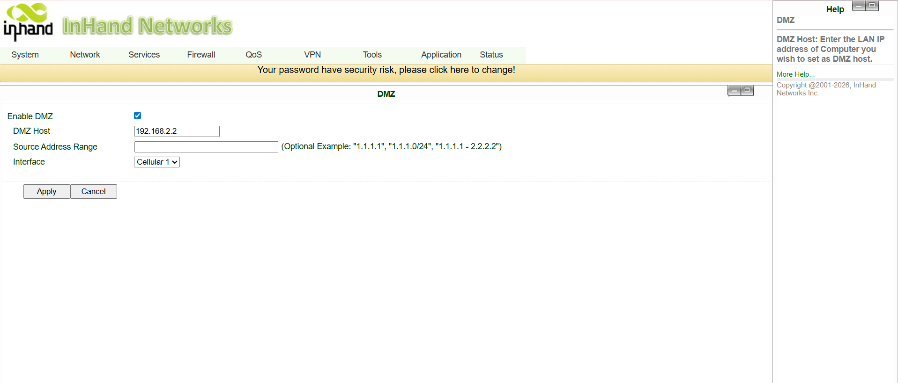

# 通过 VZW MVPN 实现远程设备管理配置指南

## 1. 文档信息

- 产品型号：IR305（同样适用于 IR302、IR315 等其他 IR 系列设备）
- 固件版本：V1.0.118
- 适用场景：工业设备联网、医疗设备联网、自助终端联网、POS/收银机联网等
- 文档日期：2026 年 4 月 5 日

## 2. 路由器概述

### 2.1 产品介绍

InRouter305（IR305）是一款面向物联网应用设计的工业级蜂窝路由器。它支持包括 4G LTE 在内的多种 WAN 连接方式，可为多站点部署提供稳定、安全的通信。IR305 适用于多个远程设备需要通过共享网络骨干网相互通信的场景。

### 2.2 主要功能

- 支持同一局域网（LAN）内的多台路由器相互访问终端设备
- 支持 DMZ（Demilitarized Zone，非军事区）配置，用于流量转发
- 支持远程配置、诊断和固件升级
- 工业级设计，适用于无人值守环境

### 2.3 典型应用拓扑

多台路由器连接到同一上行网络。每台路由器下挂一台服务器或终端设备。所有下行设备需要能够通过路由器的 WAN IP 相互访问。

## 3. 硬件说明

### 3.1 接口

- 电源：DC 9–36V，具备反接保护和过流保护
- 网口：5 个 10/100Mbps 快速以太网端口，RJ45，支持 WAN/LAN/VLAN 口，1.5KV 网络隔离变压器保护
- 无线：4G LTE
- 指示灯：PWR、SYS、Wi-Fi、NET
- 复位按钮：恢复出厂默认设置

### 3.2 接口说明

- WAN：上行网络接口（连接共享局域网或蜂窝网络）
- LAN：下行接口（连接本地终端设备）
- 天线接口：4G：SMA x 1；Wi-Fi：RP-SMA x 2；GPS（可选）：SMA x 1（注：北美型号为 2 个 SMA 4G 天线接口；GPS 型号为 1 个 RP-SMA Wi-Fi 天线接口和 1 个 SMA GPS 天线接口）

## 4. 出厂默认参数

- 默认 IP：192.168.2.1
- 子网掩码：255.255.255.0
- Web 用户名：adm
- Web 密码：123456（部分设备使用随机密码，请以设备标签为准）

## 5. 配置前准备

1. 将 PC 设置为与路由器 LAN IP 同一网段（网关：192.168.2.1）
2. 通过网线将 PC 连接到路由器的 LAN 口
3. 上电路由器，等待状态指示灯亮起
4. 确保 PC 上安装了受支持的 Web 浏览器

## 6. 网络配置

### 6.1 背景与需求

多台路由器部署在同一个 Verizon SIM 卡（VZW MVPN）专用网络中。每台路由器下挂一台下行设备（服务器、PLC 或终端）。目标是使所有下行设备能够通过路由器的蜂窝 WAN IP 地址相互访问。

网络地址示例：

| 设备 | WAN IP | LAN IP | 下行设备 IP |
|---|---|---|---|
| IR305-1 | 192.168.11.1/24 | 192.168.2.1/24 | 192.168.2.2/24 |
| IR305-2 | 192.168.11.2/24 | 192.168.2.1/24 | 192.168.2.2/24 |
| IR305-N | 192.168.11.N/24 | 192.168.2.1/24 | 192.168.2.2/24 |

### 6.2 解决方案 — DMZ 配置

DMZ（Demilitarized Zone，非军事区）可将 WAN 接口上的所有入站流量直接转发到指定的下行主机。

配置步骤：

1. 登录路由器 Web 界面
2. 进入 **防火墙** → **DMZ**
3. 勾选 **启用 DMZ**
4. 设置 **DMZ 主机** 为下行设备 IP 地址（例如 `192.168.2.2`）
5. **源地址范围** 留空，以允许所有来源
6. **接口** 选择 `所有 WAN` 或当前使用的具体 WAN 接口
7. 点击 **应用** 保存

配置参数：

| 参数 | 说明 | 值类型 | 默认值 |
|---|---|---|---|
| DMZ 主机 | 放置到 DMZ 区域的主机 IP 地址 | IP 地址 | 空 |
| 源地址范围 | 限制仅转发特定源 IP 的流量（可选） | IP 范围 | 空 |
| 接口 | 应用 DMZ 的上行 WAN 接口 | 接口 | 所有 WAN |

结果：配置完成后，所有到达路由器 WAN IP 的流量将直接转发到 DMZ 主机。

## 7. 验证

应用 DMZ 配置后，请验证连通性：

1. 在连接到 IR305-1 的服务器上，打开浏览器并访问 `http://192.168.11.2`
2. 如果 IR305-2 后方下游设备的页面成功加载，说明配置生效
3. 重复测试其他路由器的 WAN IP，确认所有终端设备均可访问

## 8. 故障排查

1. 无法访问路由器 Web 界面
   - 检查 PC 是否与路由器 LAN IP 处于同一网段
   - 检查网线连接
   - 尝试恢复出厂默认设置后重试

2. DMZ 不转发流量
   - 确认下游设备 IP 正确，且可从路由器 LAN 侧访问
   - 确认 **接口** 字段设置为正确的 WAN 接口
   - 检查是否有防火墙规则阻止了流量

3. 下游设备无法相互访问
   - 确认所有路由器已连接到 Verizon 专用网络并已获取分配的 IP 地址
   - 确认每台路由器的蜂窝 WAN IP 唯一且可达
   - 检查下游设备是否使用路由器 LAN IP 作为默认网关
