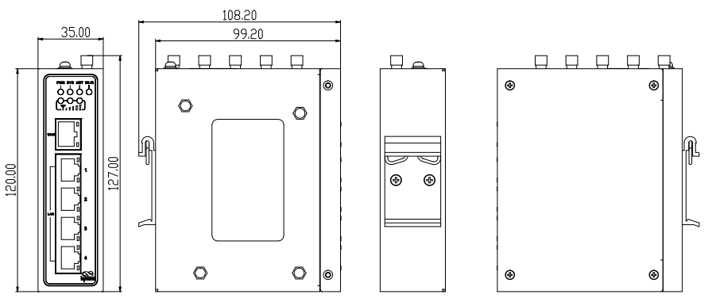

  

    

      
    

    

      5G经济型多网口工业路由器，安全联网与云端运维
    

  

  

    

      InRouter315 工业路由器
    

    

      

        
· 5G

        
· Wi-Fi

      

      

        
· 云管理

        
· 丰富工业接口

      

    

  

# 1. 产品概述

**InRouter315（IR315）系列是一款面向工业物联网场景的5G经济型多网口工业路由器，集成蜂窝、Wi-Fi、VPN与云管理能力。**

IR315 提供不间断的多种网络接入能力，以其全面的安全性和无线服务特性，实现多达万级的设备联网，为工业现场设备提供数据的高速通路。产品设计完全满足无人值守现场通信的需求，采用软硬件看门狗及多级链路检测机制保证通信的稳定性和可靠性，同时支持映翰通 Device Manager"设备云"管理平台，方便用户远程管理，充分保证设备管理的智能化。

## 核心技术指标

|技术指标|规格|
|---------|------|
|蜂窝网络|5G NR（SA/NSA）或 LTE（按型号）；双 Nano SIM；支持 PDP 配置（IPv4/IPv4V6）|
|VPN|IPSec（IKEv2、AES256-SHA512）、PPTP、L2TP、GRE、DMVPN、OpenVPN、WireGuard、ZeroTier|
|Wi-Fi（可选）|2.4 GHz，IEEE 802.11 b/g/n，最高 300 Mbps|
|防火墙与访问控制|SPI 状态检测、DoS 防护、ACL、内容过滤（域名自动刷新）、802.1x、IP-MAC 绑定、MAC 地址过滤等|
|云管理与网管|Device Manager/ICS平台；SNMP v1/v2c/v3（支持自定义通信端口），SNMP TRAP|
|动态路由与高可用|静态/OSPF 路由；VRRP（支持虚拟 MAC）、链路在线检测、双 SIM 切换、SIM 切换策略、内嵌看门狗|
|以太网接口|5 × 10/100 Mbps RJ45，支持 WAN/LAN/VLAN，1.5KV 网络隔离变压保护|
|串口与 IO（可选）|1×RS232+1×RS485 或 4×IO（按型号）|
|供电|DC 9~36 V，防过流/防反接，2PIN 工业端子|
|尺寸与重量|127 × 108.2 × 35 mm；454 g|
|工作温度|常规：-35 ~ 70 ℃；拓展：-40 ~ 75 ℃|
|防护等级|IP30|

# 2. 核心特性

## 2.1 多网络接入

- **蜂窝网络：** 支持 5G NR（SA/NSA）或 LTE（按型号），覆盖全球主流运营商频段，适配多样现场网络环境
- **有线网络：** 5 × 10/100 Mbps RJ45 以太网端口，支持 WAN/LAN/VLAN 灵活配置，1.5KV 网络隔离变压保护
- **Wi-Fi 接入：** 2.4 GHz IEEE 802.11 b/g/n，最高 300 Mbps，支持 AP/Client/WDS 三种工作模式
- **双 SIM 卡槽：** 抽屉式卡座支持 2 × Nano SIM，双卡热备份，保障网络连续性

## 2.2 可靠在线

- **双 SIM 切换：** 支持信号阈值、丢包率阈值、拨号失败次数等多种触发条件的 SIM 切换策略
- **VRRP 热备份：** 支持虚拟路由器冗余协议（虚拟 MAC），主备网关无缝切换
- **多级链路检测：** ICMP 探测、链路在线检测，支持热备份/冷备份/负载均衡模式
- **内嵌看门狗：** 软硬件看门狗双重保障，自动恢复异常系统

## 2.3 安全防护

- **多种 VPN：** 支持 IPSec（IKEv2、AES256-SHA512）、PPTP、L2TP、GRE、DMVPN、OpenVPN、WireGuard、ZeroTier
- **防火墙体系：** SPI 状态检测、DoS 防护、ACL、端口映射、虚拟 IP 映射、DMZ、NAT
- **访问控制：** 802.1x 认证、IP-MAC 绑定、MAC 地址过滤、设备本地访问控制
- **用户安全：** 用户权限管理、PAM 认证参数配置、登录失败锁定、系统密码保护机制

## 2.4 云端运维

- **Device Manager 平台：** 批量管理分布式设备，支持 JWT 安全注册、公私钥注册
- **SNMP 网管：** SNMP v1/v2c/v3，支持自定义通信端口，SNMP TRAP
- **远程管理：** 支持 HTTP/HTTPS API，可通过云平台远程查看设备信息、配置参数
- **状态上报：** 支持蜂窝信号参数（RSRP、RSRQ、SINR、RSSI 等）上报至云平台

## 2.5 工业扩展

- **丰富接口：** 五网口设计，可选 RS232+RS485 串口或 4×IO（DI/DO 可配置）
- **GNSS 定位：** 部分型号支持 GPS/北斗定位功能
- **工业级设计：** 金属外壳无风扇散热，导轨安装，IP30 防护等级
- **宽温运行：** 常规 -35 ~ 70 ℃，拓展型号支持 -40 ~ 75 ℃

# 3. 典型应用场景

## 3.1 智能制造

IR315 可为工厂自动化生产线、PLC、工业机器人等设备提供稳定的网络接入，通过串口/IO 采集设备数据，经蜂窝网络或 VPN 安全传输至企业 MES/ERP 系统，实现设备远程监控与预测性维护。

## 3.2 智慧能源

适用于配电自动化、充电桩监控、光伏电站监测等场景。IR315 支持国网加密（IEC101/IEC104），满足电力行业通信安全要求；双 SIM 切换与 VRRP 机制保障电力通信的连续性与可靠性。

## 3.3 智能交通

适用于智能信号灯、电子警察、车载监控、物流车队管理等场景。支持 GNSS 定位功能，可实时上报车辆位置信息；宽温设计与抗振特性适应车载与户外恶劣环境。

## 3.4 智慧零售

适用于自助售货机、智能快递柜、数字标牌等场景。通过 Device Manager 平台批量管理分布广泛的终端设备，Portal 认证功能支持商用 Wi-Fi 接入，降低现场运维成本。

## 3.5 环境监测

适用于大气监测、水质监测、噪声监测等环保场景。DTU 功能支持串口设备透明传输，Modbus RTU 转 TCP 网桥方便接入各类传感器，远程日志与告警功能便于及时发现异常。

# 4. 产品创新点

## 4.1 产品创新点汇总

| 创新方向 | 创新点 | 核心能力/价值 |
|---------|--------|--------------|
| 多模蜂窝通信 | 智能拨号方式适配 | 支持 QMI / PPP / ECM 多种拨号，按模组与网络环境自动选择最优方式 |
| | 双 SIM 智能切换 | 支持按信号质量、ICMP 探测、丢包率、拨号失败次数等策略自动切卡 |
| | 5G / RedCap 支持 | 支持 NRQ2、NRR0、NRR2 等 5G 模组及 NRF2/NRF4 等 RedCap 模组 |
| | 全球运营商适配 | 自动匹配 Verizon / AT&T / T-Mobile 等运营商 APN、BAND、IMS 配置 |
| 链路可靠性 | 链路备份与热备份 | 主备链路自动切换，支持热备份 + 策略路由，切换时主动上报告警 |
| | 负载均衡 | 多链路负载均衡优化，提升带宽利用率与业务连续性 |
| VPN 技术矩阵 | 全协议 VPN 支持 | 支持 IPSec（IKEv1/v2）、OpenVPN（TAP/TUN）、L2TP、PPTP、GRE |
| | 现代 VPN 协议 | 新增 WireGuard、ZeroTier，满足灵活组网需求 |
| | 增强隧道管理 | 支持对端域名、多远程子网、单条隧道独立启停控制 |
| 工业物联网协议 | 工业串口 / DTU | RS232/RS485 独立配置，DTU 支持 TCP/UDP/域名/多通道/DC 协议 |
| | 国网加密 | 支持 IEC101/IEC104/DC 协议国密加密，定型 305NRQ2-SEC |
| | I/O 边缘控制 | 4 路数字 I/O、继电器输出、I/O 状态上报云平台、告警触发 |
| 云平台管理 | 多云平台适配 | 支持 InHand DM、InConnect、Smart-EMS、ICS 等平台接入 |
| | 安全注册认证 | 支持 MQTT/MQTTS、JWT 注册、公私钥认证、远程固件升级 |
| | 网络诊断观测 | 内置 TCPDUMP、ping、traceroute、Qlog；蜂窝信号/ GNSS 参数上报 |
| 安全加固 | 固件安全 | 固件签名验证、系统密码保护、PAM 认证、登录失败锁定 |
| | 漏洞修复 | 持续修复 CVE、Talos、Fortinet、CISA 等披露漏洞 |
| | 软件组件升级 | OpenSSL、OpenVPN、curl、tcpdump、dnsmasq、mosquitto、busybox 等持续更新 |
| 网络安全接入 | 接入控制 | 防火墙、NAT、虚拟 IP 映射、802.1X、Portal、MAC 过滤、Wi-Fi 黑白名单 |
| | 权限与加密 | 用户权限管理、HTTPS API、Wi-Fi 密码加密、SSH 登录 banner |
| 工业可靠性 | 高可用设计 | 硬件看门狗、离线流量 72 小时缓存、NTP/GPS 时间同步 |
| | 配置完整性 | 配置导入导出校验、最大支持 128KB 配置文件 |
| 运维与部署 | FCT 工厂测试 | 支持 Wi-Fi、GNSS、I/O、网口、AT 指令、版本查询等工厂测试 |
| | 运维命令增强 | factory 模式支持 nvram / show / info version / net test / 恢复出厂 |
| WLAN 能力 | 多模式 Wi-Fi | 支持 AP / AP Client / WDS、2.4GHz、信道自动选择、特殊字符 SSID |
| | 企业级接入 | Radius 认证、Wi-Fi 用户隔离、密码显示/隐藏、校准数据备份 |
| 网络管理 | 灵活二层/三层 | VLAN 支持 IP 地址池与多 IP、静态路由优先级、DHCP 静态绑定 200 条 |
| | DDNS 增强 | 支持 HTTPS 方式更新 DDNS |
| 全球化与 OEM | 多 OEM 定制 | 支持 Global / InHand / Welotec / Blank / Blank_China 等 OEM |
| | 合规适配 | 支持美国 TAA 法案需求、自动替换 logo/域名/SSID/告警页面 |

## 4.2 差异化优势

- **全球频段覆盖：** 支持中国、欧洲、北美、澳洲、日本等全球主流频段，通过 CE/FCC/PTCRB/RCM/MIC 等认证
- **多 VPN 并行：** 同时支持 8 种 VPN 协议，满足不同行业安全接入需求
- **云边协同：** Device Manager + InConnect 双平台支持，实现设备全生命周期管理
- **工业级可靠性：** 通过 IEC 62443-4-2 网络安全认证与 EN18031 法规认证
- **灵活定制：** 支持 OEM/ODM 定制，包括 logo、域名、SSID、证书等白标方案

# 5. 硬件规格

## 5.1 产品尺寸

  

    
    
正视图

  

  

    
    
接口图

  

  

    
    
侧视图

  

  
注意：

  
1.所有尺寸单位为毫米（mm）。

  
2.所有尺寸均为近似值，仅供参考。

  
3.图示尺寸不得用于生产加工。

  
4.尺寸需符合零件及制造公差要求。

  
5.尺寸如有变更，恕不另行通知。

## 5.2 硬件参数表

| 类别/参数 | 规格 |
|--------------------------|------|
| **CPU与存储** | |
| CPU | 580 MHz |
| RAM | 128 MB DDR2 |
| Flash | 64 MB SPI |
| **连接与接口** | |
| 以太网端口 | 5 × 10/100 Mbps RJ45，支持 WAN/LAN/VLAN，1.5KV 网络隔离变压保护 |
| 电源接口 | DC 9~36V，防过流/防反接，2PIN 工业端子 |
| I/O口（可选） | 4 × IO（DI/DO 可配置） |
| 串口（可选） | 1 × RS232 + 1 × RS485 |
| 复位按键 | 针孔式复位按键 |
| SIM卡座 | 抽屉式卡座 ×1，支持 2 × Nano SIM |
| 天线接头 | 5G: SMA ×2；4G: SMA ×1（海外 4G 型号为 SMA ×2）；Wi-Fi: RP-SMA ×2 |
| 接地端子 | 支持 |
| LED指示灯 | 电源、系统、网络、Wi-Fi、信号 |
| GNSS（可选） | 部分型号支持（参见订购信息 <G/NA>） |
| **Wi-Fi** | |
| 无线频率 | 2.4 GHz |
| 最大传输速率 | 300 Mbps |
| 协议 | IEEE 802.11 b/g/n |
| 工作模式 | AP / Client / WDS |
| 发射功率 | 802.11b: 16 dBm ±2 dBm (11 Mbps)； 802.11g: 16 dBm ±2 dBm (54 Mbps)； 802.11n @2.4 GHz: 16 dBm ±2 dBm (HT20 MCS7)； 802.11n @2.4 GHz: 16 dBm ±2 dBm (HT40 MCS7) |
| 传输距离 | 视距约 50 米（受现场环境影响） |
| Wi-Fi 性能测试 | 测试条件：AP: IR305LQ20-WLAN / STA: 小米10S，WPA2-PSK AES，信道11，40MHz |
| 1m | 吸盘天线：91.26 Mbps（信号-36 dBm）；胶棒天线：90.22 Mbps（信号-25 dBm） |
| 5m | 吸盘天线：90.25 Mbps（信号-47 dBm）；胶棒天线：90.30 Mbps（信号-38 dBm） |
| 10m | 吸盘天线：90.96 Mbps（信号-54 dBm）；胶棒天线：90.74 Mbps（信号-45 dBm） |
| 30m | 吸盘天线：1.28 Mbps（信号-62 dBm）；胶棒天线：7.20 Mbps（信号-64 dBm） |
| **设备功率** | |
| 待机功率 | 120~200 mA@12V |
| 工作功率 | 150~320 mA@12V |
| 峰值功率 | 320 mA@12V |
| **机械规格** | |
| 产品尺寸（W × D × H） | 127 × 108.2 × 35 mm |
| 产品重量 | 454 g |
| 安装方式 | 导轨 |
| 防护等级 | IP30 |
| 外壳与散热 | 金属壳，无风扇散热 |
| **环境与认证** | |
| 存储温度 | -40~85 ℃ |
| 工作温度 | 常规：-35 ~ 70 ℃ 拓展：-40 ~ 75 ℃ |
| 环境湿度 | 5~95%（无凝霜） |
| 物理特性 | 防震 IEC60068-2-27 振动 IEC60068-2-6 跌落 IEC60068-2-32 |
| EMC指标 | EN61000-4-2，level 3，静电 EN61000-4-3，level 3，辐射电场 EN61000-4-4，level 3，脉冲电场 EN61000-4-5，level 3，浪涌 EN61000-4-6，level 3，传导骚扰抗扰度 EN61000-4-8，>level 2，工频磁场抗扰度，水平方向/垂直方向 400A/m EN61000-4-12，level 3，震荡波抗扰度 |
| 认证 | CE, E-MARK, FCC, IC, PTCRB, AT&T, Verizon, T-Mobile, RCM, IMDA, MIC&JATE, SRRC, UL, C1D2, IEC 62443-4-2, EN18031 |

# 6. 网络连接能力

## 6.1 蜂窝网络

| 参数 | 规格 |
|------|------|
| 网络制式 | GSM/GPRS/EDGE、UMTS/HSPA+/EVDO/TD-SCDMA、TDD LTE/FDD LTE、5G NR（SA/NSA） |
| SIM 卡 | 双 Nano SIM，抽屉式卡座 |
| 拨号方式 | PPP、QMI、ECM（按型号） |
| PDP 配置 | 支持 IPv4/IPv4V6 |
| 网络接入 | APN、VPDN |
| 接入认证 | CHAP/PAP |
| 连接方式 | 永远在线、按需拨号、手工拨号 |
| 双卡切换 | 支持信号阈值、丢包率阈值、拨号失败次数等触发条件的 SIM 切换策略 |
| 运营商配置 | 内置全球主流运营商 APN 配置，支持 T-Mobile、AT&T、Verizon 等 |
| 信号上报 | 支持 RSRP、RSRQ、SINR、RSSI、RSCP、Ec/Io、PCI、BAND 等参数上报 |

## 6.2 有线网络

| 参数 | 规格 |
|------|------|
| 以太网端口 | 5 × 10/100 Mbps RJ45 |
| 端口角色 | 支持 WAN/LAN/VLAN 灵活配置 |
| 隔离保护 | 1.5KV 网络隔离变压保护 |
| WAN 协议 | 静态 IP、DHCP、PPPoE |
| VLAN | 支持 Access/Trunk 模式，VLAN IP 地址池配置 |
| 免费 ARP | 支持 GARP 广播，可配置广播次数（1-10）与超时时间（1-60秒） |
| IP 穿透 | 支持 IP Passthrough 功能，将 WAN 口地址分发给 LAN 口设备 |

## 6.3 Wi-Fi 网络

| 参数 | 规格 |
|------|------|
| 无线频率 | 2.4 GHz |
| 协议标准 | IEEE 802.11 b/g/n |
| 最大速率 | 300 Mbps |
| 工作模式 | AP / Client / WDS |
| 频宽 | 20 MHz / 40 MHz |
| 认证方式 | 开放式、WEP、WPA-PSK、WPA2-PSK、WPA/WPA2 等 |
| 加密方式 | NONE、WEP、TKIP、AES |
| 安全特性 | Wi-Fi 密码加密显示、Wi-Fi 用户隔离、AP 黑白名单 |
| 发射功率 | 16 dBm ±2 dBm |
| 天线接口 | RP-SMA ×2 |

## 6.4 链路备份与冗余

| 功能 | 说明 |
|------|------|
| 链路备份 | 支持蜂窝/WAN 互为备份，热备份/冷备份/负载均衡三种模式 |
| VRRP | 虚拟路由器冗余协议，支持虚拟 MAC，优先级选举 |
| ICMP 探测 | 支持探测服务器、间隔时间、超时时间、最大重试次数配置 |
| 负载均衡 | ICMP 探测成功后，通过相应链路传播数据 |

## 6.5 路由能力

| 功能 | 说明 |
|------|------|
| 静态路由 | 支持目的网络、子网掩码、网关、接口配置，支持优先级 |
| OSPF | 开放最短路径优先动态路由协议，支持路由 ID 与网络宣告 |
| NAT | 网络地址转换，支持端口映射、虚拟 IP 映射 |
| 动态域名 | DDNS，支持 HTTPS 更新 |

# 7. 软件功能

## 7.1 VPN 与数据安全

| VPN 类型 | 功能说明 |
|----------|----------|
| IPSec VPN | 支持 IKEv1/IKEv2，AES256-SHA512 加密算法，最多 10 条隧道，支持对端域名配置 |
| PPTP | 支持客户端/服务器模式 |
| L2TP | 支持 L2TP over IPSec，支持 NAT 穿越 |
| GRE | 通用路由封装隧道 |
| DMVPN | 动态多点 VPN |
| OpenVPN | 支持 TAP/TUN模式，TLS-auth/tls-crypt 选项，AES-256-GCM/SHA256 加密 |
| WireGuard | 新一代高性能 VPN 协议，支持连接状态检测 |
| ZeroTier | 支持虚拟局域网组网，最多配置多条隧道 |
| 证书管理 | 支持 CA 证书、PKCS12 证书导入导出 |

## 7.2 防火墙与访问控制

| 功能 | 说明 |
|------|------|
| SPI 防火墙 | 状态检测包过滤 |
| DoS 防护 | 拒绝服务攻击防护 |
| ACL | 访问控制列表，支持源/目的地址、端口、协议配置 |
| 内容过滤 | 支持域名过滤，域名自动刷新机制 |
| 端口映射 | 支持协议、源地址、服务端口、内部端口、外部接口配置 |
| 虚拟 IP 映射 | 支持来源地址范围配置 |
| DMZ | 非军事区主机配置 |
| NAT | 支持源地址、目的地址、端口、接口配置 |
| IP-MAC 绑定 | 静态绑定 IP 与 MAC 地址 |
| 802.1x | 端口级接入认证 |
| MAC 地址过滤 | 支持黑白名单模式 |
| 设备访问控制 | 支持接口、协议、源地址、端口配置 |

## 7.3 设备管理与运维

| 功能 | 说明 |
|------|------|
| Device Manager | 映翰通设备云平台，支持批量管理、远程配置、固件升级 |
| InConnect | 支持设备远程接入与 NAT 规则下发 |
| SNMP | SNMP v1/v2c/v3，支持自定义通信端口 |
| SNMP TRAP | 告警信息主动上报 |
| HTTP API | 支持 HTTP/HTTPS API，远程查询与配置 |
| SSH/Telnet | 远程命令行管理 |
| Console | 本地串口控制台管理 |
| 配置管理 | 支持配置导入导出、恢复出厂设置 |
| 系统升级 | 支持 Web 升级与 Device Manager 远程升级 |
| 固件签名 | 系统固件增加签名验证，防止固件篡改 |

## 7.4 日志与告警

| 功能 | 说明 |
|------|------|
| 系统日志 | 本地/远程/串口日志输出，支持用户自定义远程日志前缀 |
| 远程日志 | 支持 Syslog 服务器（UDP 514 端口） |
| 流量告警 | 月流量/24小时/小时流量阈值告警，流量超限上报至云平台 |
| 系统告警 | 系统重启、LAN 上下线、SIM 故障、信号质量异常告警 |
| 状态上报 | 支持系统、Modem、网络连接、路由状态、GPIO 引脚状态上报 |
| 短信告警 | 支持 SMS 查询和设置 APN/SIM/运营商，远程状态查询与重启 |

## 7.5 工业协议与接口

| 功能 | 说明 |
|------|------|
| DTU | TCP/UDP 透明传输，DCTCP/DCUDP 模式，支持域名配置 |
| 串口流量统计 | 支持 RS232/RS485 串口流量统计，TCP 连接状态显示 |
| Modbus 网桥 | Modbus RTU 转 Modbus TCP |
| 国网加密 | 支持 IEC101/IEC104 电力协议加密（特定型号） |
| I/O 控制 | 4 × IO（DI/DO 可配置），支持边缘触发状态上报 |
| SMART-EMS | 支持蜂窝 IP 地址上报，连接失败可选不重启 |

## 7.6 网络服务

| 功能 | 说明 |
|------|------|
| DHCP | 服务器/Client，支持静态绑定（最多 200 条），地址池范围自动校验 |
| DNS | DNS 代理、DNS 转发，支持自定义域名服务器 |
| DDNS | 支持 HTTPS 更新 |
| NTP | NTP 服务器功能，GPS 时间同步 |
| Portal | 强制网络门户认证 |
| QoS | 带宽限制，IP 限速 |
| SIP ALG | SIP 应用层网关 |
| 计划任务 | 定时重启，支持高级选项配置多条规则 |
| 网络抓包 | 内置 TCPDUMP 抓包工具，支持接口、抓包个数、专家选项配置 |
| 维护工具 | Ping、路由跟踪（Trace）、网速测试、ARPING |

# 8. 订购信息

## 8.1 型号规则

**Model code:** IR315-<WMNN>-<WLAN/NA>-<S/NA>-<G/NA>

<WMNN>: 无线通讯类型 & 模块  
<WLAN/NA>: Wi-Fi  
<S/NA>: 串口/IO  
<G/NA>: GNSS

## 8.2 产品型号

### 快速选型表

| 型号 | 区域 | 蜂窝网络 | Wi-Fi | 串口/IO | GNSS |
|------|------|----------|-------|---------|------|
| IR315-NRQ2-<WLAN/NA>-<S/NA> | 中国 | 5G NR SA/NSA | 可选 | 可选 | — |
| IR315-LQ20-<WLAN/NA>-S | 中国 | CAT4 | 可选 | S | — |
| IR315-FQ58-<WLAN/NA>-<S/NA> | 欧洲/亚太/澳新 | CAT4 | 可选 | 可选 | — |
| IR315-FQ58-WLAN-<S/NA>-G | 欧洲/亚太 | CAT4 | 标配 | 可选 | 支持 |
| IR315-FQ78-<WLAN/NA>-<S/NA> | 澳洲/新西兰 | CAT4 | 可选 | 可选 | — |
| IR315-FQ78-WLAN-G | 澳洲/新西兰 | CAT4 | 标配 | IO | 支持 |
| IR315-FQ88-<WLAN/NA>-S | 日本 | CAT4 | 可选 | S | — |
| IR315-FQ38-<WLAN/NA> | 北美 | CAT4 | 可选 | IO | — |
| IR315-FF39-<WLAN/NA>-<S/NA> | 北美 | CAT6 | 可选 | 可选 | — |
| IR315-FF39-WLAN-<S/NA>-G | 北美 | CAT6 | 标配 | 可选 | 支持 |
| IR315-EN00-<WLAN/NA>-S | 全球 | 无蜂窝 | 可选 | S | — |

> **注：**
> - `可选` = 该位置可选配（如 `<WLAN/NA>` 可选 WLAN 或 NA，`<S/NA>` 可选 S 或 NA）
> - `S` = 1×RS232 + 1×RS485；`IO` = 4×IO
> - `—` = 不支持

### 频段规格详情

| 模块 | 区域 | 5G NR | LTE-FDD | LTE-TDD | WCDMA | GSM |
|------|------|-------|---------|---------|-------|-----|
| NRQ2 | 中国 | NSA: n41/n77/n78/n79 SA: n1/n3/n5*/n8/n28/n41/n77/n78/n79 | B1/B3/B5/B8 | B34/B38/B39/B40/B41 | B1/B5/B8 | — |
| LQ20 | 中国 | — | B1/B3/B5/B8 | B34/B38/B39/B40/B41 | B1/B5/B8 | B3/B8 |
| FQ58 | 欧洲/亚太/澳新 | — | B1/B3/B5/B7/B8/B20/B28 | B38/B40/B41 | B1/B5/B8 | B3/B8 |
| FQ78 | 澳洲/新西兰 | — | B1/B2/B3/B4/B5/B7/B8/B28 | B40 | B1/B2/B5/B8 | B2/B3/B5/B8 |
| FQ88 | 日本 | — | B1/B3/B8/B18/B19/B26 | B41 | B1/B6/B8/B19 | — |
| FQ38 | 北美 | — | B2/B4/B5/B12/B13/B14/B66/B71 | — | B2/B4/B5 | — |
| FF39 | 北美 | — | B2/B4/B5/B7/B12/B13/B14/B17/B25/B26/B29/B30/B66/B71 | B41/B42/B43/B46/B48 | B2/B4/B5 | — |
| EN00 | 全球 | — | — | — | — | — |

# 9. 联系我们

- **官网：** [映翰通官网](https://www.inhand.com.cn)
- **版权声明：** ©映翰通网络 保留所有权利