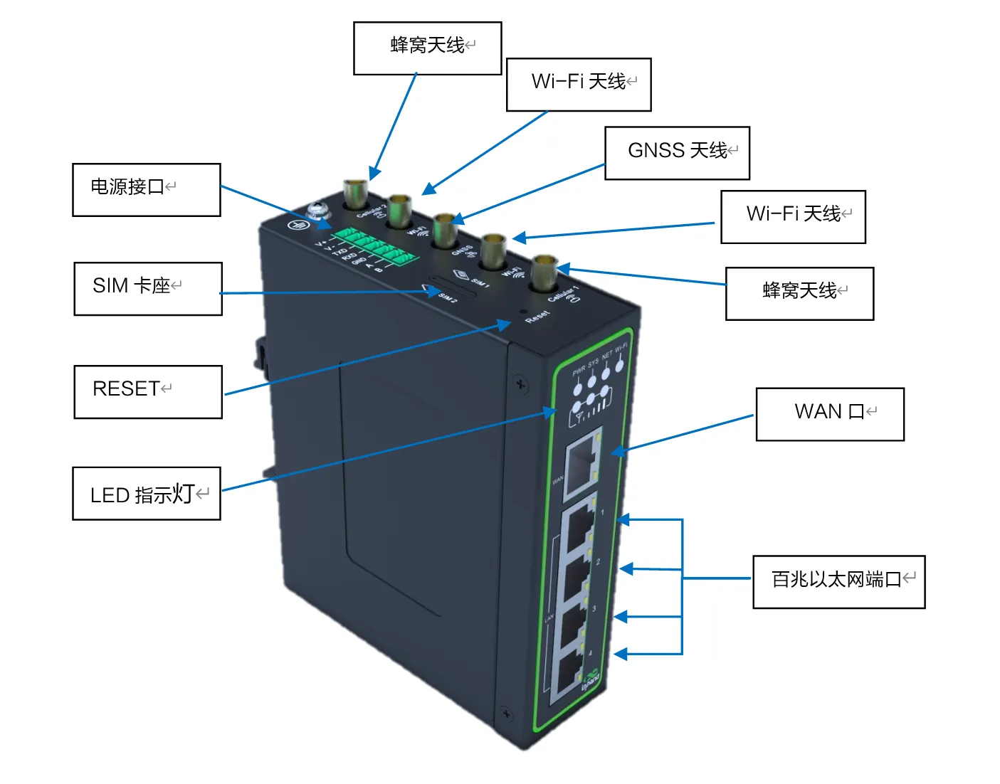
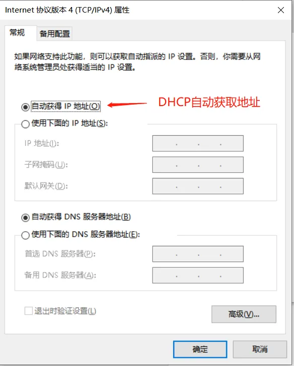
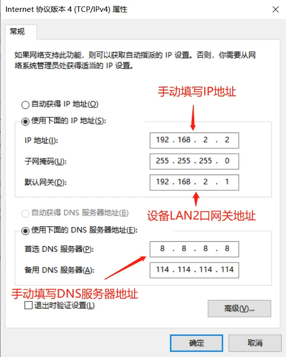
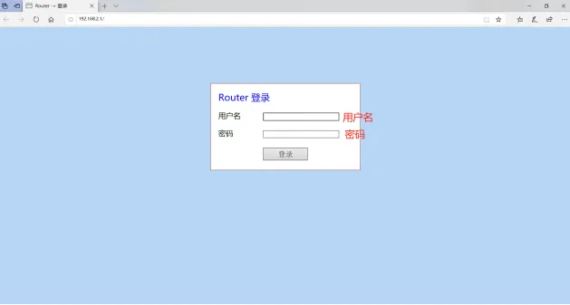
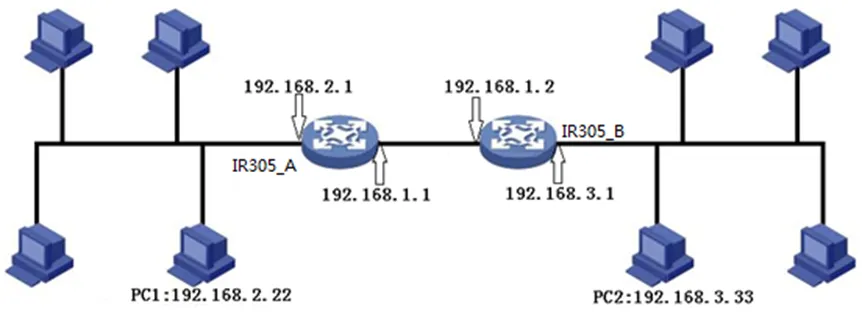
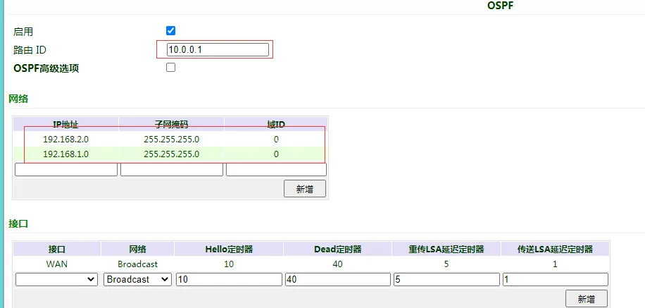
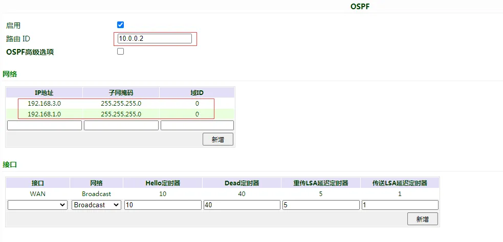
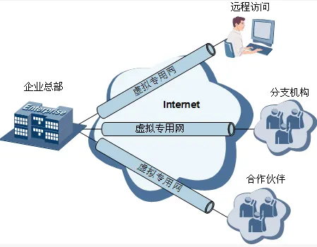
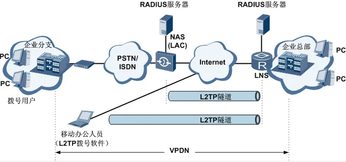

# 北京映翰通工业路由器IR315系列产品用户手册

## 声明

首先非常感谢您选择本公司产品！在使用前，请您仔细阅读本用户手册，遵守以下声明，将有助于维护知识产权和法律合规性，以确保您的使用体验与产品的最新信息相一致。如有任何疑问或需要获取书面许可，请随时联系我们的技术支持团队。

- 版权声明

本用户手册包含受版权保护的内容，版权归北京映翰通网络技术股份有限公司及其许可者所有。未经书面许可，任何单位和个人不得擅自摘抄、复制本手册的部分或全部内容，且不得以任何形式传播。

- 免责声明

由于产品技术和规格不断更新，本公司不能承诺用户手册中的资料与实际产品完全一致。因此，不承担由于实际技术参数与用户手册不符而引起的任何争议。任何关于产品的改动恕不提前通知，本公司保留最终更改权和解释权

- 版权信息

本用户手册内容受版权法律保护，版权归北京映翰通网络技术股份有限公司及其许可者所有，保留一切权利。未经书面许可，不得擅自使用、复制或传播本手册的内容。

## 图形界面约定

| 符号 | 含义 | 示例 |
|------|------|------|
| `< >` | 表示变量或参数，需替换为实际值 | `<IP地址>` 表示需填入具体IP |
| `" "` | 表示界面上的文字标签 | 点击"保存"按钮 |
| `→` | 表示菜单层级或操作顺序 | 【网络】→【蜂窝】 |
| `【 】` | 表示菜单或页面名称 | 进入【系统设置】页面 |
|  | 提醒操作中应注意的事项，不当的操作可能会导致数据丢失或者设备损坏 | - |
|  | 对操作内容的描述进行必要的补充和说明 | - |

## 技术支持

**北京映翰通网络技术股份有限公司（总部）**

电话：010-8417 0010

地址：北京市朝阳区紫月路18号院3号楼5层

**成都办事处**

电话：028-8679 8244

地址：四川省成都市武侯区天府大道北段1777号中国太平金融大厦14层

**广州办事处**

电话：020-8562 9571

地址：广州市天河区棠东东路5号远洋新三板创意园B-130单元

**武汉办事处**

电话：027-8716 3566

地址：湖北省武汉市洪山区珞瑜东路2号巴黎豪庭11栋2001室

**上海办事处**

电话：021-5480 8501

地址：上海市普陀区顺义路18号1103室

## 如何使用本手册

### 对号入座

- 首次使用用户：建议按顺序阅读「认识设备」→「安装与首次使用」→「常用场景配置」→「功能说明与参数参考」
- 已有设备用户：可直接查阅「功能说明与参数参考」或「附录 故障处理」
- 云平台管理用户：可查阅「常用场景配置」中的设备远程管理平台

### 按任务快速跳转

| 任务 | 对应章节 | 预计用时 |
|------|----------|----------|
| 认识设备外观与接口 | [认识设备](#第1章-认识设备) | 约10分钟 |
| 完成设备安装与首次登录 | [安装与首次使用](#第2章-安装与首次使用) | 约15分钟 |
| 配置蜂窝网络上网 | [常用场景配置](#第3章-常用场景配置) | 约5分钟 |
| 配置VPN隧道 | [常用场景配置](#第3章-常用场景配置) | 约10分钟 |
| 查看功能参数说明 | [功能说明与参数参考](#第4章-功能说明与参数参考) | 按需 |
| 排查设备故障 | [附录 故障处理](#附录-故障处理) | 按需 |

---

# 第1章 认识设备

## 1.1 概述

InRouter315是集4G网络、Wi-Fi、虚拟专用网等技术于一体的物联网无线路由器产品，提供不间断的多种网络接入能力，以其全面的安全性和无线服务特性，实现多达万级的设备联网，为设备联网提供数据的高速通路。产品设计完全满足了无人值守现场通信的需求，采用软硬件看门狗及多级链路检测机制保证通信的稳定性和可靠性，同时支持映翰通Device Manager"设备云"管理平台，方便用户远程管理，充分保证了设备管理的智能化。

InRouter315凭借着经济高性能普遍用于物联网各行业应用，让数字化物联网更便捷、更高效。

## 1.2 包装清单

### 标准配件

| 物品 | 数量 | 说明 |
|------|------|------|
| IR315 | 1台 | IR315系列工业级路由器 |
| 导轨 | 1个 | DIN35导轨 |
| 电源端子 | 1个 | 7PIN工业端子 |
| 网线 | 1根 | 1.5m网线 |
| 电源适配器 | 1个 | 12VDC电源适配器 |
| 蜂窝天线 | 1根/2根 | 吸盘天线（仅带蜂窝功能的产品提供，LQ20系列型号为1根，其余型号为2根） |
| Wi-Fi天线 | 2根 | 吸盘天线（仅带Wi-Fi功能的产品提供） |
| 产品保修卡 | 1张 | 保修期为1年 |
| 合格证 | 1张 | IR300系列工业级路由器合格证 |

### 可选配件

| 物品 | 数量 | 说明 |
|------|------|------|
| 壁挂安装配件 | 1套 | 固定设备 |

## 1.3 外观与接口

<p align="center"></p>

<p align="center"><strong>图 1-1 IR315外观与接口</strong></p>

| 接口 | 位置 | 功能说明 |
|------|------|----------|
| 电源接口 | 设备底部 | 7PIN工业端子，支持9~36V DC供电 |
| LAN口 | 设备底部 | 4个10/100M以太网LAN口 |
| WAN口 | 设备底部 | 1个10/100M以太网WAN口 |
| SIM卡槽 | 设备侧面 | 弹出式SIM卡座，支持标准SIM卡 |
| 蜂窝天线接口 | 设备顶部 | SMA-J接口，连接蜂窝天线 |
| Wi-Fi天线接口 | 设备顶部 | SMA-J接口，连接Wi-Fi天线（仅WLAN型号） |
| 接地螺柱 | 设备侧面 | 保护接地，提高整机抗干扰能力 |
| Reset按钮 | 设备侧面 | 恢复出厂设置按键 |
| Console口 | 设备底部 | RS232串口（仅带串口型号支持） |

## 1.4 指示灯说明

| 指示灯 | 状态 | 含义 |
|--------|------|------|
| PWR | 常灭 | 设备未上电 |
|  | 红色常亮 | 设备上电 |
| SYS | 绿色常灭 | 系统故障 |
|  | 绿色闪烁 | 系统升级 |
|  | 绿色常亮 | 系统正常 |
| NET | 绿色常灭 | 网络未连接 |
|  | 绿色闪烁 | 网络连接中 |
|  | 绿色常亮 | 网络已连接 |
| Wi-Fi | 绿色常灭 | Wi-Fi未启动 |
|  | 绿色闪烁 | Wi-Fi正在连接 |
|  | 绿色常亮 | Wi-Fi正常工作 |
| 信号 | 绿色常亮3颗 | 拨号成功，信号值≥20 |
|  | 绿色常亮2颗 | 拨号成功，19≥信号值≥10 |
|  | 绿色常亮1颗 | 拨号成功，信号值≤9 |

## 1.5 恢复出厂设置

Reset键恢复出厂设置方法：

1. 给设备通电后立即按住RESET按钮，直至SYS指示灯变为常亮。
2. 松开RESET按钮，等待SYS指示灯熄灭。
3. 再次按住RESET按钮，直至SYS指示灯开始闪烁，然后松开RESET按钮。此时设备将恢复为默认设置并正常重启。

## 1.6 默认设置

| 参数 | 默认值 |
|------|--------|
| LAN口IP地址 | 192.168.2.1 |
| 子网掩码 | 255.255.255.0 |
| Web登录用户名 | adm |
| Web登录密码 | 123456 |
| DHCP服务器 | 启用 |
| DHCP地址池起始 | 192.168.2.2 |
| DHCP地址池结束 | 192.168.2.100 |


---

# 第2章 安装与首次使用

## 2.1 安装前准备

### 环境要求

- PC一台：
  - 操作系统：Windows 2000、Windows NT、Windows XP、Windows 7
  - CPU：PII 233以上
  - 内存：32M以上
  - 硬盘：64G以上
  - 以太网口：至少一个（10M/100M）
  - IE版本：5.0以上
  - 分辨率：640*480以上
- SIM卡一张：确保该卡已开通数据服务，且未欠费停机
- 电源：220V AC（可与产品附带直流电源配合使用）；9~36V DC（纹波 < 100 mV）
- 固定环境：尽量确保路由器放置于水平平面上，安装于振动频率较小的环境

> **注意**：设备的安装操作必须在设备断电状态下进行！

> **注意**：请确认设备在3G/4G网络覆盖范围内，并且现场无信号屏蔽。现场必须具有220V AC或9~36V DC供电环境。首次安装必须在北京映翰通公司认可合格的工程师指导下进行。

## 2.2 安装指南

### 2.2.1 SIM卡安装

IR315采用弹出式卡座，将SIM卡插针插入卡座左侧圆孔并按下，弹出卡座，将SIM卡放入卡座，再将卡座按回卡槽。

> **注意**：为防止SIM卡损坏，请安装SIM卡时先给设备断电。

### 2.2.2 天线安装

用手轻轻转动金属SMA-J接口可活动部分到不能转动（此时看不到天线连接线外螺纹）即可，不要握住黑色胶套用力拧天线。

### 2.2.3 保护地接地安装

具体步骤如下：

1. 将接地螺钉拧下来。
2. 将机柜地线的接地环套进接地螺钉上。
3. 将接地螺钉拧紧。

> **注意**：为提高路由器的整机抗干扰能力，路由器在使用时必须接地，根据使用环境将地线接到路由器接地螺柱上。

### 2.2.4 供电电源安装

安装完天线后，将9~36V DC电源接上设备，此时观察设备面板上PWR LED是否点亮，如果LED没有点亮请立即联系映翰通技术支持。

### 2.2.5 网络连接与Web登录

完成硬件安装后，通过网线将PC与IR315的一个LAN口相连。在登录路由器的Web设置页面前，需确保管理计算机已安装了以太网卡。

#### 自动获取IP地址（推荐）

将PC设置成"自动获得IP地址"和"自动获得DNS服务器地址"（计算机系统的缺省配置），由设备自动为PC分配IP地址。

<p align="center"></p>

<p align="center"><strong>图 2-1 自动获取IP地址设置</strong></p>

#### 设置静态IP地址

设备LAN口初始IP地址为：192.168.2.1，子网掩码均为255.255.255.0，请将PC的IP地址与设备的LAN口IP地址设置在同一网段内，例如设置为：192.168.2.2。

<p align="center"></p>

<p align="center"><strong>图 2-2 设置静态IP地址</strong></p>

#### 取消代理服务器

如果当前PC使用代理服务器访问因特网，则必须取消代理服务。操作步骤如下：

1. 在浏览器窗口中，选择"工具→Internet选项"。
2. 选择"连接"页签，单击<局域网设置>按钮，进入"局域网（LAN）设置"窗口界面。请确认未选中"为LAN使用代理服务器"选项；若已选中，请取消并单击<确定>。

#### 登录Web设置页面

打开IE或者其它浏览器，在地址栏中输入IR315设备的IP地址，出厂默认为http://192.168.2.1。连接建立后，在弹出的登录界面输入用户名和密码（默认用户名和密码请见产品铭牌）。

<p align="center"></p>

<p align="center"><strong>图 2-3 Web登录界面</strong></p>

> **注意**：为了安全起见，建议在首次登录后修改默认的登录密码，并保管好密码信息。

## 2.3 快速检查

安装完成后，按以下清单逐项检查：

- [ ] 设备已正确安装导轨或壁挂固定
- [ ] SIM卡已正确插入卡槽（如需蜂窝功能）
- [ ] 蜂窝天线已安装到位（如需蜂窝功能）
- [ ] Wi-Fi天线已安装到位（如需Wi-Fi功能）
- [ ] 保护地线已可靠接地
- [ ] 电源已正确连接，PWR指示灯红色常亮
- [ ] SYS指示灯绿色常亮，表示系统正常
- [ ] PC与设备LAN口通过网线连接
- [ ] PC可正常访问设备Web管理界面（http://192.168.2.1）


---

# 第3章 常用场景配置

## 场景1：蜂窝联网

**目标**：通过4G蜂窝网络接入互联网。

**前提**：已插入SIM卡并安装天线，设备已上电，PWR指示灯红色常亮，SYS指示灯绿色常亮。

**预计用时**：约5分钟。

**操作步骤**：

1. 插入SIM卡并安装蜂窝天线。
2. 登录设备Web管理界面，进入【网络】→【Cellular】菜单。
3. 在"拨号端口"界面，确认"启用"已勾选，"连接方式"选择"永远在线"。
4. 根据运营商选择"SIM1网络运营商"，或选择"定制"后手动配置APN参数。
5. 点击"保存"并等待NET指示灯变为绿色常亮。

**验证方法**：

1. 观察NET指示灯，确认其变为绿色常亮。
2. 进入【状态】→【网络连接】，查看拨号端口是否获取到IP地址。
3. 使用设备自带的PING探测工具，ping 8.8.8.8测试外网连通性。

**常见问题**：

- 网络连接失败：检查SIM卡是否正确插入、APN参数是否正确、SIM卡是否欠费停机。
- 信号弱：调整设备位置或天线方向，确保处于4G网络覆盖范围内。
- 拨号不成功：检查天线是否安装到位，或尝试恢复出厂设置后重新配置。

## 场景2：有线WAN接入

**目标**：通过有线WAN端口接入互联网。

**前提**：已准备好可用的有线宽带线路，设备已上电并完成LAN口连接。

**预计用时**：约5分钟。

**操作步骤**：

1. 将宽带网线接入IR315的WAN口。
2. 登录设备Web管理界面，进入【网络】→【WAN】菜单。
3. 根据接入方式选择配置类型：
   - **DHCP动态地址**：选择动态地址，勾选"启用"，点击"保存"。
   - **静态IP**：选择静态IP，填写IP地址、子网掩码、网关，点击"保存"。
   - **PPPoE拨号**：选择ADSL拨号，填写用户名和密码，点击"保存"。
4. 进入【状态】→【网络连接】查看WAN口连接状态。

**验证方法**：

1. 进入【状态】→【网络连接】，确认WAN口已获取IP地址。
2. 使用PING探测工具测试外网连通性。
3. 通过LAN口连接的PC可正常访问互联网。

**常见问题**：

- WAN口无法获取IP：确认网线连接正常，上层设备（光猫/交换机）工作正常。
- PPPoE拨号失败：核对用户名和密码是否正确，确认宽带账号未欠费。

## 场景3：WLAN AP配置

**目标**：将设备配置为无线接入点（AP），为其他无线设备提供网络接入。

**前提**：设备为带Wi-Fi功能的型号（IR315-xxx-WLAN），Wi-Fi天线已安装。

**预计用时**：约5分钟。

**操作步骤**：

1. 确认设备已通过蜂窝或有线方式接入互联网。
2. 登录设备Web管理界面，进入【网络】→【WLAN模式切换】，确认工作模式为AP。
3. 进入【网络】→【WLAN（AP模式）】菜单。
4. 勾选"启用"，配置SSID名称、认证方式和加密方式。
5. 点击"保存"使配置生效。

**验证方法**：

1. 使用手机或电脑搜索配置的SSID，确认可以搜索到。
2. 输入密码后连接成功，可正常访问互联网。
3. 进入【状态】→【WLAN状态】查看AP工作状态。

**常见问题**：

- 搜索不到SSID：检查Wi-Fi天线是否安装，确认WLAN功能已启用，SSID广播已开启。
- 连接后无法上网：确认设备本身已通过蜂窝或有线方式接入互联网。

## 场景4：IPSec VPN配置

**目标**：通过IPSec VPN隧道与远端网络建立安全连接。

**前提**：已知对端VPN设备的公网IP地址或域名，双方已协商好IKE策略和IPSec策略。

**预计用时**：约10分钟。

**操作步骤**：

1. 登录设备Web管理界面，进入【VPN设置】→【IPSec基本参数】，配置日志等级。
2. 进入【VPN设置】→【IPSec隧道配置】，点击"新增"按钮。
3. 配置基本参数：隧道名称、对端地址、IKE版本、启动方法。
4. 配置第一阶段参数：IKE策略、IKE生命周期、认证方式、共享密钥。
5. 配置第二阶段参数：IPSec策略、IPSec生命周期、本地子网和对端子网。
6. 配置连接检测参数（可选）：DPD时间间隔、ICMP探测服务器。
7. 点击"保存"使配置生效。

**验证方法**：

1. 进入【状态】→【网络连接】查看IPSec隧道状态。
2. 在设备下端的PC上ping对端子网内的IP地址，确认可以ping通。
3. 检查系统日志中是否有IPSec协商成功的记录。

**常见问题**：

- 隧道无法建立：核对对端地址、共享密钥是否一致，IKE策略和IPSec策略是否匹配。
- 能建立隧道但无法通信：检查本地子网和对端子网配置是否正确，确认防火墙规则未阻止VPN流量。

## 场景5：链路备份

**目标**：配置主备链路自动切换，保障通信可靠性。

**前提**：设备同时具有蜂窝和有线WAN接入能力，两条链路均可独立上网。

**预计用时**：约5分钟。

**操作步骤**：

1. 登录设备Web管理界面，分别配置好主链路（如WAN口）和备份链路（如Cellular拨号）。
2. 进入【网络】→【链路备份】菜单。
3. 勾选"启用"，选择"主链路"和"备份链路"。
4. 设置ICMP探测服务器地址（如8.8.8.8）。
5. 选择备份模式：热备份、冷备份或负载均衡。
6. 配置ICMP探测间隔、超时时间和最大重试次数。
7. 点击"保存"使配置生效。

**验证方法**：

1. 断开主链路，观察设备是否自动切换至备份链路。
2. 恢复主链路，观察设备是否切换回主链路。
3. 检查网络连通性是否中断。

**常见问题**：

- 链路不切换：检查ICMP探测服务器是否可达，探测间隔和超时设置是否合理。
- 负载均衡不生效：确认两条链路均处于在线状态。

## 场景6：VRRP热备份

**目标**：通过VRRP协议实现网关冗余，保障局域网内设备不间断访问外网。

**前提**：已有两台IR315设备，均通过各自链路接入互联网，且处于同一局域网内。

**预计用时**：约10分钟。

**操作步骤**：

1. 登录主设备Web管理界面，进入【网络】→【VRRP】菜单。
2. 勾选"启用VRRP-I"，配置虚拟组标识号、优先级（建议设高值如200）。
3. 配置虚拟IP地址（如192.168.2.254），选择认证方式。
4. 配置监视接口（如WAN口或Cellular口）。
5. 登录备份设备，同样启用VRRP-I，使用相同的虚拟组标识号和虚拟IP。
6. 备份设备的优先级设为较低值（如100）。
7. 点击"保存"使配置生效。

**验证方法**：

1. 将局域网内PC的默认网关设为虚拟IP地址。
2. PC可正常访问互联网。
3. 断开主设备的上行链路，观察PC是否仍可正常访问互联网（网关自动切换至备份设备）。

**常见问题**：

- VRRP不生效：检查两台设备的虚拟组标识号和虚拟IP是否一致，网络是否互通。
- 无法ping通虚拟IP：检查防火墙设置，确认VRRP协议报文未被阻止。


---

# 第4章 功能说明与参数参考

## 4.1 系统

### 4.1.1 基本设置

在这里，可以设置路由器WEB配置界面的语言；自定义路由器主机名称。

单击导航树中"系统>>基本设置"菜单，进入"基本配置"页面即可进行配置。

表4-1-1 基本设置参数说明

| **基本设置** | | |
| --- | --- | --- |
| 功能描述：选择路由器配置界面的显示语言和设置个性化的名称。 | | |
| **参数名称** | **说明** | **缺省值** |
| 界面语言 | WEB配置页面的语言配置 | 中文 |
| 主机名 | 给路由器连接的主机或设备设置一个名称以方便查看 | Router |

### 4.1.2 系统时间

为了保证本设备与其它设备协调工作，用户需要将系统时间配置准确。系统时间用于配置和查看系统时间，以及系统时区，其目的是对网络所有具有时钟的设备进行时钟同步，使网络内所有设备的时钟保持一致，从而使设备能够提供基于统一时间的多种应用。

单击导航树中"系统>>系统时间"菜单，进入"系统时间"界面，在主机时间部分点击"同步时间"按钮可直接将主机时间设置成网关的系统时间。

表4-1-2系统时间参数说明

| **系统时间** | | |
| --- | --- | --- |
| 功能描述：设置当地时区和设置NTP自动更新时间。 | | |
| **参数名称** | **说明** | **缺省值** |
| 路由器时间 | 显示路由器当前时间 | 2021-xx-xx 08:00:00 |
| 主机时间 | 显示PC机当前时间 | 当前时间 |
| 时区 | 设置路由器所在时区 | 定制 |
| 设置时区字符串 | 设置路由器锁在时区字符串 | CST-8 |
| 自动更新时间 | 选择是否自动更新时间，可以选择启动时、每1/2/…小时等不同时间自动更新时间 | 禁用 |

### 4.1.3 管理控制

管理服务包含HTTP、HTTPS、TELNET、SSHD、HTTP_API和控制台六种形式。

1. HTTP：HTTP超文本传输协议用来在Internet上传递Web页面信息。在设备上能使HTTP服务后，用户就可以通过HTTP协议登录设备，利用Web功能访问并控制设备。
2. HTTPS：HTTPS超文本传输协议的安全版本，是支持SSL协议的HTTP协议，提高了安全性。
3. TELNET：Telnet协议通过网络提供远程登录和虚拟终端功能。以服务器、客户端（Server/Client）模式工作，Telnet客户端向Telnet服务器发起请求，Telnet服务器提供Telnet服务。设备支持Telnet客户端和Telnet服务器功能。
4. SSHD：SSHD服务可允许其他设备使用SSH协议远程访问设备的终端。
5. HTTP_API：用户可以通过HTTP_API向路由器发送HTTP请求，远程查看路由器信息，设置路由器的参数而无需登录路由器。关于HTTP_API的具体使用方法请咨询技术支持。
6. 控制台：控制台接入端口就是console串口，用于用户通过终端对设备进行初始配置和后续管理等，与telnet功能一样。

单击导航树中"系统>>管理控制"菜单，进入"管理控制"界面，即可进行配置。

表4-1-3 管理控制参数说明

| **管理控制** | | | | |
| --- | --- | --- | --- | --- |
| 功能描述：1.修改路由器的用户名密码。2.设置路由器的配置方式，有以下4种方式：http，https，telnet，控制台。3.设置登录超时时间。 | | | | |
| **参数名称** | | **说明** | **缺省值** | |
| **用户名/密码** | | | | |
| 用户名 | | 设置登录WEB配置的用户名 | adm | |
| 旧密码 | | 原来登录WEB配置的密码 | 123456 | |
| 新密码 | | 设置新的登录WEB配置的密码 | 空 | |
| 确认密码 | | 再次确认新的登录密码以确认 | 空 | |
| **管理功能** | | | | |
| 服务端口 | | HTTP/HTTPS/TELNET/SSHD/HTTP_API/控制台的服务端口 | 80/443/23/22/4444 | |
| 本地管理 | | 启用—允许本地局域网使用相应服务（如HTTP）对路由器进行管理禁用—本地局域网不能使用相应服务（如HTTP）对路由器进行管理 | 启用 | |
| 远程管理 | | 启用—允许远程主机使用相应服务（如HTTP）对路由器进行管理禁用—远程主机不能使用相应服务（如HTTP）对路由器进行管理 | 启用 | |
| 允许远程管理的地址范围（可选） | | 设置允许远程管理的地址范围（仅限HTTP/HTTPS/TELNET） | 可以设置此时的控制服务的主机，例如192.168.2.1/30或者192.168.2.1-192.168.2.10 | |
| 说明 | | 便于记录管理功能各项参数的意义（不影响路由器配置） | 空 | |
| **控制台登录用户（设置好一组用户名和密码要点击新增按钮）** | | | | |
| 用户名 | | 配置控制登录用户名，用户自定义 | 无 | |
| 密码 | | 配置控制登录密码，用户自定义 | 无 | |
| **其他参数** | | | | |
| 登录超时 | | 设置登录超时时间（登录时间超时后路由器会自动断开配置界面） | 500秒 | |

> **注意**：1. "用户名/密码"配置部分可以更改该用户名和密码，但是不能新建用户名，即Web登陆方式只能用这一个用户名。2. "控制台登录用户"配置部分我们可以新建多个用户名，即采用串口或者TELNET控制台登陆方式可以用多个用户名。

### 4.1.4 系统日志设置

通过"系统日志设置"界面，可以设置远程日志服务器，网关会把所有的系统日志上传到远程日志服务器，这需要主机上的远程日志软件（如：Kiwi Syslog Daemon）的配合。

Kiwi Syslog Daemon是一个用于Windows的免费日志服务器软件。它可以接收、记录、显示来自开启syslog的主机（如网关，交换机，Unix主机等）的日志。下载并安装Kiwi Syslog Daemon后，通过"File>>Setup>>Input>>UDP"界面设置必要参数。

单击导航树种"系统>>系统日志设置"菜单，进入"系统日志设置"界面进行相应配置。

表4-1-4系统日志设置参数说明

| **系统日志设置** | | |
| --- | --- | --- |
| 功能描述：配置远程日志服务器IP地址及端口号，路由器日志将被远程日志服务器记录。 | | |
| **参数名称** | **说明** | **缺省值** |
| 发送到远程日志服务器 | 点选启用日志服务器 | 禁用 |
| 日志服务器地址、端口（UDP） | 设置远程日志服务器的地址/端口号 | 空：514 |
| 输出至调试串口（仅限于带串口型号） | 将日志输出至console口 | 禁用 |

### 4.1.5 配置管理

这里可以把参数备份，也可以导入想要的参数，同时可以使设备恢复出厂设置。

单击导航树中"系统>>配置管理"菜单，进入"配置管理"界面即可进行配置。

表4-1-5配置管理参数说明

| **配置管理** | | |
| --- | --- | --- |
| 功能描述：设置配置管理参数。 | | |
| **参数名称** | **说明** | **缺省值** |
| 浏览 | 从主机选择将要导入到路由器的配置文件 | 无 |
| 导入 | 将配置文件导入到路由器 | 无 |
| 备份 | 备份配置文件到主机 | 无 |
| 恢复出厂设置 | 点选以恢复出厂设置（恢复出厂设置后需重新启动系统才能生效） | 无 |
| 禁用硬件重置按钮 | 启用后将无法通过Reset键恢复出厂设置 | 禁用 |
| 网络运营商（ISP） | 用于配置全球各大运营商的APN，用户名，密码等参数 | 无 |

### 4.1.6 计划任务

开启此功能后，设备将按照设定时间定时重启。

单击导航树中"系统>>计划任务"菜单，进入"计划任务"界面即可进行设置。

表4-1-6计划任务参数说明

| **计划任务** | | |
| --- | --- | --- |
| 功能描述：设置设备定时重启。 | | |
| **参数名称** | **说明** | **缺省值** |
| 启用 | 开启/关闭计划任务功能 | 禁用 |
| 时/分 | 配置每天定时重启的时间 | 0:00 |
| 天 | 每天重启 | Everyday |
| 显示高级选项 | 启用后将配置更详细的定时重启规则，可配置多条重启规则，指定时间，或按一定间隔重启设备。启用后会禁用之前的每天定时重启功能 | 禁用 |
| 拨号后重启设备 | 配置后，当设备拨号成功一段时间后会自动重启，空表示此功能不生效 | 无 |

> **注意**：应该确保导入的配置的合法性与有序性。当导入配置时，系统会过滤格式不合法的命令，然后将正确的配置存储，在系统重启后顺序执行这些配置。如果导入的配置内容不是按照有效的顺序排列，将导致系统不能进入期望状态。

> **注意**：为了不影响当前的系统运行，当执行导入配置和恢复出厂配置后，重启设备，新的配置才能生效。

### 4.1.7 系统升级

升级过程共分为两个阶段，第一阶段将升级文件写入备份固件区，即系统升级一节所描述的过程；第二阶段将备份固件区中的文件拷贝到主固件区，此阶段将在系统重启时执行。在软件升级的过程中，请不要在Web 上进行任何操作，否则可能会导致软件升级中断。

单击导航树中"系统>>系统升级"菜单，进入"系统升级"界面即可进行配置。

如需升级系统：第一步，点击"浏览"，选择升级文件；第二步，点击"升级"，在弹出窗口中选择"确定"；第三步，升级成功后，重启设备即可生效。

### 4.1.8 重启系统

设备重启前请保存配置，否则重启后，未保存的配置将会全部丢失。

如需重启系统，点击"系统>>重启系统"，然后点击"确定"重启系统即可。

### 4.1.9 退出系统

如需退出系统，点击"系统>>退出系统"，然后点击"确定"退出系统即可。


## 4.2 网络

### 4.2.1 Cellular

设备装入SIM卡，通过拨号接口往外拨号，实现路由器的无线网络连接功能。设备默认自动拨号，天线、电源、SIM卡安装完成后等待几分钟即可联网。如果有特殊需求可单击导航树中的"网络>>Cellular"菜单，进入"拨号端口"界面进行配置。

注：带有*的参数表示仅IR315-NRQ2-`<WLAN/空>`-`<S/空>`型号支持

表4-2-1-1拨号端口参数说明

| **拨号端口** | | |
| --- | --- | --- |
| 功能描述：配置PPP拨号的参数。通常用户只需设置基本配置，不用设置高级选项。 | | |
| **参数名称** | **说明** | **缺省值** |
| 启用 | 点选启用PPP拨号 | 启用 |
| 启用时间 | 设置拨号启用的时间阶段表 | 全部 |
| PPPoE桥接 | 启用后路由器会通过WAN口建立PPP连接，一般情况请禁用 | 禁用 |
| 共享连接（NAT） | 启用—连接到Router的本地设备可以通过Router上网。禁用—连接到Router的本地设备不能通过Router上网。 | 启用 |
| 默认路由 | 点选启用默认路由 | 启用 |
| SIM1网络运营商 | 用于选择为当前SIM卡提供服务的运营商 | 定制 |
| 网络选择方式 | 选择网络类型，选择并固定使用某一网络制式 | 自动 |
| 5G组网模式* | 选择5G组网模式 | NSA/SA |
| 连接方式 | 可选择永远在线、按需拨号、手工拨号 | 永远在线 |
| 重拨间隔 | 设置登录失败时，重新拨号的时间 | 30秒 |
| 显示高级选项 | 点选显示高级选项（以下为高级选项参数） | 禁用 |
| 启用双SIM卡 | 启用第二张SIM卡 | 未启用 |
| SIM2网络运营商 | 选择第二张SIM卡提供服务的供应商 | 拨号参数集1 |
| SIM2绑定ICCID | 绑定SIM卡2的ICCID | 空 |
| SIM PIN码 | 填写第二张SIM卡的PIN码 | 空 |
| 选择主卡 | 设置主卡 | SIM卡1 |
| 最大拨号次数 | 拨号尝试的最大次数，若达到最大次数后仍为拨号成功，路由器会切换SIM卡 | 5 |
| 信号阈值 | 蜂窝信号的阈值，若当前信号强度低于此阈值，路由器会切换SIM卡 | 0（禁用） |
| 最小连接时间 | 拨号连接的最小连接时间 | 0（禁用） |
| 初始化命令 | 用于初始化拨号参数 | AT |
| 绑定ICCID | 将设备与SIM卡的ICCID绑定 | 空 |
| PIN码 | 用于设置PIN码 | 空 |
| 拨号超时时间 | 一次拨号尝试中判定拨号失败的尝试时间 | 120 |
| MTU | 设置最大传输单元 | 1500 |
| 使用分配的DNS服务器 | 使用分配的DNS服务器解析 | 启用 |
| 连接检测间隔 | 设置连接检测的间隔 | 55秒 |
| 启用调试模式 | 点选启用调试模式 | 禁用 |
| 启用modem调试模式 | 点选启用modem调试模式 | 禁用 |
| ICMP探测模式 | 设置ICMP探测模式，设备会通过ICMP探测拨号链路是否正常，若ICMP探测失败会重启拨号。忽略流量模式：无论是否有数据流量通过拨号接口，设备都会进行ICMP探测监控流量模式：如果有数据流量通过拨号接口，设备不会进行ICMP探测 | 忽略流量模式 |
| ICMP探测服务器 | 设置ICMP探测服务器，空表示不启用ICMP探测 | 空 |
| ICMP探测间隔时间 | 设置ICMP探测间隔时间 | 30秒 |
| ICMP探测超时时间 | 设置ICMP探测超时时间（探测超时时间自动重启） | 20秒 |
| ICMP探测最大重试次数 | 设置ICMP探测失败时的最大重试次数（达到最大次数后会重新拨号） | 5 |

表4-2-1-2拨号端口-时间表参数说明

| **拨号端口**---**时间表管理** | | |
| --- | --- | --- |
| 功能描述：根据规定时间，自动上下线。 | | |
| **参数名称** | **说明** | **缺省值** |
| 时间表名称 | schedule 1 | schedule1 |
| 周日~周六 | 点击启用 | 空 |
| 时间范围1 | 设置时间范围 1 | 9:00-12:00 |
| 时间范围2 | 设置时间范围 2 | 14:00-18:00 |
| 时间范围3 | 设置时间范围 3 | 0:00-0:00 |
| 说明 | 设置说明内容 | 空 |

### 4.2.2 WAN

设置WAN端口连接网络的方式。WAN端口类型支持静态IP、DHCP动态地址（推荐)、ADSL（PPPoE）拨号三种有线接入。其中：

1. DHCP采用客户端/服务器通信模式，由客户端向服务器提出配置申请，服务器返回为客户端分配的IP地址等相应的配置信息，以实现IP地址等信息的动态配置。
2. PPPoE是基于以太网的点对点协议。用户需要在保持原接入方式的基础上，安装一个PPPoE客户端。通过PPPoE协议，远端接入设备能够实现对每个接入用户的控制和计费。

设备WAN端口默认情况下为禁用状态。

单击导航树种的"网络>>WAN"菜单，进入"WAN"界面即可进行配置。

表4-2-2-1 WAN端口静态IP参数说明

| **WAN端口-静态IP** | | |
| --- | --- | --- |
| 功能描述：可通过用固定IP的有线接入Internet。 | | |
| **参数名称** | **说明** | **缺省值** |
| 共享连接（NAT） | 启用—连接到Router的本地设备可以通过Router上网。禁用—连接到Router的本地设备不能通过Router上网。 | 启用 |
| 默认路由 | 点选启用默认路由 | 启用 |
| MAC地址 | 设备的MAC地址 | 设备的硬件MAC地址 |
| IP地址 | 设置WAN端口的IP地址 | 192.168.1.29 |
| 子网掩码 | 设置WAN端口的子网掩码 | 255.255.255.0 |
| 网关 | 设置WAN端口的网关 | 192.168.1.1 |
| MTU | 最大传输单元，可选择默认值/手工设置 | 默认值（1500） |
| **多IP支持（最多可设定8个额外的IP地址）** | | |
| IP地址 | 设置LAN端口额外的IP地址 | 空 |
| 子网掩码 | 设置子网掩码 | 空 |
| 说明 | 便于记录额外IP地址的意义 | 空 |

表4-2-2-2 WAN端口动态地址（DHCP）参数说明

| **WAN端口-动态地址（DHCP）** | | |
| --- | --- | --- |
| 功能描述：支持DHCP，可自动获得其他路由器分配的地址。 | | |
| **参数名称** | **说明** | **缺省值** |
| 共享连接（NAT） | 是否运行LAN端口通过WAN端口的IP地址访问外部网络 | 启用 |
| 默认路由 | 点选启用设备访问外网的默认路由 | 启用 |
| MAC地址 | 设备的MAC地址 | 设备的硬件MAC地址 |
| MTU | 最大传输单元，可选择默认值/手工设置 | 默认值（1500） |

表4-2-2-3 WAN端口ADSL拨号（PPPoE）参数说明

| **WAN端口-ADSL拨号（PPPoE）** | | | |
| --- | --- | --- | --- |
| 功能描述：设置ADSL拨号参数。 | | | |
| **参数名称** | **说明** | **缺省值** | |
| 共享连接（NAT） | 启用—连接到Router的本地设备可以通过Router上网。禁用—连接到Router的本地设备不能通过Router上网。 | 启用 | |
| 默认路由 | 点选启用默认路由 | 启用 | |
| MAC地址 | 设备的MAC地址 | 设备的硬件MAC地址 | |
| MTU | 最大传输单元，可选择默认值/手工设置 | 默认值（1492） | |
| **ADSL拨号（PPPoE）设置** | | | |
| 用户名 | 设置拨号用户名 | | 空 |
| 密码 | 设置拨号密码 | | 空 |
| 静态IP | 点击启用静态IP | | 禁用 |
| 连接方式 | 设置拨号连接方式（永远在线、按需拨号、手工拨号） | | 永远在线 |
| **高级选项参数** | | | |
| 服务名称 | 设置服务名称 | | 空 |
| 发送队列长度 | 设置发送队列长度 | | 3 |
| 启用IP包头压缩 | 点选启用IP包头压缩 | | 禁用 |
| 使用分配的DNS服务器 | 点击启用使分配的DNS服务器 | | 启用 |
| 连接检测间隔 | 设置连接检测间隔 | | 55秒 |
| 连接检测最大重试次数 | 设置连接检测最大重试次数 | | 10 |
| 启用调试模式 | 勾选启用调试模式 | | 禁用 |
| 专家选项 | 设置专家选项 | | 空 |
| ICMP探测服务器 | 设置ICMP探测服务器 | | 空 |
| ICMP探测间隔时间 | 设置ICMP探测间隔时间 | | 30秒 |
| ICMP探测超时时间 | 设置ICMP探测超时时间 | | 20秒 |
| ICMP探测最大重试次数 | 设置ICMP探测最大重试次数 | | 3 |

### 4.2.3 VLAN

虚拟局域网（VLAN）是一组逻辑上的设备和用户，这些设备和用户并不受物理位置的限制，可以根据功能、部门及应用等因素将它们组织起来，就好像它们在同一个网段中一样相互通信。目前设备VLAN端口支持Access 和Trunk两种链路类型。Access类型的端口只能属于1个VLAN，一般用于连接计算机的端口；Trunk类型的端口可以允许多个VLAN通过，可以接收和发送多个VLAN报文。Trunk口可以用于交换机之间的连接，也可以用于连接用户的计算机。

单击导航树中的"网络>>VLAN"菜单，即可进行配置。

表4-2-3 VLAN参数说明

| **VLAN** | | |
| --- | --- | --- |
| 功能描述：为路由器LAN口配置网段等VLAN参数 | | |
| **参数名称** | **说明** | **缺省值** |
| VLAN号 | 设备VLAN的编号 | 1 |
| LAN1~LAN4 | 设置LAN端口是否加入VLAN | LAN1~LAN4均启用 |
| 主IP地址/子网掩码 | 设置VLAN的IP地址和子网掩码 | 192.168.2.1/255.255.255.0 |
| **端口模式** | | |
| MAC地址 | 设备的MAC地址 | 设备的硬件MAC地址 |
| 启用 | 启用后可配置Trunk模式 | 启用 |
| 速率和双工 | 配置LAN端口的速率和双工类型 | 自动协商 |
| 模式 | 配置LAN端口的模式，Access或Trunk | Access |
| 本征VLAN | 流量在经过本征VLAN时不带有VLAN标签 | 1 |

### 4.2.4 WLAN模式切换

WLAN即无线局域网。WLAN接口有接入点和客户端两种类型。

单击导航树中的"网络>>WLAN模式切换"菜单，即可进行WLAN模式切换。（设备作为AP时，需确保设备本身已经通过有线、蜂窝的方式接入Internet）

### 4.2.5 WLAN（AP模式）

设备WLAN工作在AP 模式即可为其它无线网络设备提供网络接入点，使其进行正常网络通讯。

单击导航树中的"网络>>WLAN模式切换"菜单，即可进入"WLAN模式切换"界面进行配置，设备的WLAN默认工作模式为AP。

表4-2-5 WLAN (AP模式)参数说明

| WLAN | | |
| --- | --- | --- |
| 功能描述：支持WI-FI功能，为客户现场提供无线局域网接入和无线用户身份认证服务。 | | |
| **参数名称** | **说明** | **缺省值** |
| 启用 | 启用WLAN | 禁用 |
| SSID广播 | 广播设备的SSID，便于其他设备连接路由器 | 开启 |
| 模式 | 六种类型可选：802.11g/n、802.11g、802.11n、802.11b、802.11b/g 、802.11b/g/n | 802.11b/g/n |
| SSID | 用户自定义SSID名称 | inhand |
| 认证方式 | 支持开放式、共享式、自动选择WEP、WPA-PSK、WPA、WPA2-PSK、WPA2、WPA/WPA2、WPAPSK/WPA2PSK | 开放式 |
| 加密方式 | 根据不同认证方式，支持NONE、WEP、AES、TKIP | NONE |
| 无线频宽 | 无线局域网广播的频率带宽 | 20MHz |
| 启用WDS | 启用WDS，扩展无线局域网覆盖范围 | 禁用 |

### 4.2.6 WLAN客户端（STA模式）

设备WLAN工作在STA模式时，可通过连接网络接入点设备进行正常的网络通讯。

单击导航树中的"网络>>WLAN客户端"，进入"WLAN端口"界面，接口类型选用"客户端"，并配置相关参数。（此时应关闭"网络>>拨号接口"菜单中的拨号接口。）

在WLAN接口类型处选择客户端时，SSID扫描功能才能开启。在"SSID扫描"界面，会显示所有可用的SSID名称，并可以显示设备作为客户端的连接状态。

表4-2-6 WLAN客户端参数说明

| **WLAN客户端** | | |
| --- | --- | --- |
| 功能描述：支持WI-FI功能，作为客户端接入无线局域网。 | | |
| **参数名称** | **说明** | **缺省值** |
| 模式 | 支持802.11b/g/n等多种模式 | 802.11b/g/n |
| SSID | 选择要连接的接入点SSID名称 | inhand |
| 认证方式 | 与要连接的接入点保持一致 | 开放式 |
| 加密方式 | 与要连接的接入点保持一致 | NONE |


### 4.2.7 链路备份

单击导航树中的"网络>>链路备份"即可进行配置。

表4-2-7-1 链路备份参数说明

| **链路备份** | | |
| --- | --- | --- |
| 功能描述：系统运行时优先启用主链路进行通信，当由于某种原因使得主链路断开连接时，系统自动切换至备份链路，以保障设备通信正常进行。 | | |
| **参数名称** | **说明** | **缺省值** |
| 启用 | 点选启用链路备份 | 禁用 |
| 主链路 | 可选WAN端口或拨号接口 | WAN端口 |
| ICMP探测服务器 | 设置ICMP探测服务器 | 空 |
| ICMP探测间隔时间 | 设置ICMP探测间隔时间 | 10秒 |
| ICMP探测超时时间 | 设置ICMP探测超时时间 | 3秒 |
| ICMP探测最大重试次数 | 设置ICMP探测最大重试次数 | 3 |
| 备份链路 | 可选拨号端口或WAN端口 | 拨号端口 |
| 备份模式 | 可选热备份或冷备份 | 热备份 |

表4-2-7-2 链路备份-备份模式参数说明

| **链路备份-备份模式** | |
| --- | --- |
| 功能描述：选择链路备份的方式。 | |
| **参数名称** | **说明** |
| 热备份 | 主链路与备份链路同时在线，当前链路断线时切换链路 |
| 冷备份 | 主链路断开连接时，备份链路才上线 |
| 负载均衡 | ICMP探测成功后，通过相应的链路传播数据 |

### 4.2.8 VRRP

虚拟路由器冗余协议(VRRP)将可以承担网关功能的一组路由器加入到备份组中，形成一台虚拟路由器，由VRRP的选举机制决定哪台路由器承担转发任务，局域网内的主机只需将虚拟路由器配置为缺省网关。

VRRP将局域网内的一组路由器划分在一起，由多个路由器组成，功能上相当于一台虚拟路由器。根据不同网段的VLAN接口IP，可以虚拟成多个虚拟路由器。每个虚拟路由器都有一个ID号，最多可以虚拟255个。

VRRP具有以下特点：

1. 虚拟路由器具有IP地址，称虚拟IP地址。局域网内的主机仅需要知道这个虚拟路由器的IP地址，并将其设置为缺省路由的下一跳地址。
2. 网络内的主机通过这个虚拟路由器与外部网络进行通信。
3. 组内路由器根据优先级，选举出一个路由器，承担网关功能。其他路由器作为Backup路由器，当网关路由器发生故障时，取代网关路由器继续履行网关职责，从而保证网络内的主机不间断地与外部网络进行通信。

VRRP的监视接口功能更好地扩充了备份功能：不仅能在某路由器的接口出现故障时提供备份功能，还能在路由器的其它接口（如连接上行链路的接口）不可用时提供备份功能。

当连接上行链路的接口处于Down或Removed状态时，路由器主动降低自己的优先级，使得备份组内其它路由器的优先级高于这个路由器，以便优先级最高的路由器成为网关，承担转发任务。

单击导航树中"网络>>VRRP"菜单，进入"VRRP"配置界面即可进行配置。

表4-2-8 热备份（VRRP）参数说明

| **热备份（VRRP）** | | |
| --- | --- | --- |
| 功能描述：配置热备份参数。 | | |
| **参数名称** | **说明** | **缺省值** |
| 启用VRRP-I | 点选启用热备份（VRRP）功能 | 禁用 |
| 虚拟组标识号 | 选择路由器组的标识号（范围为1-255） | 1 |
| 优先级 | 选择一个优先级（范围为1-254） | 20（数值越大，优先级越高） |
| 广播间隔 | 设置广播间隔 | 60秒 |
| 虚拟IP | 设置一个虚拟IP | 空 |
| 认证方式 | 可选择无认证/密码认证 | 无（选择密码认证时需填入密码） |
| 虚拟MAC | 设置一个虚拟MAC | 禁用 |
| 监视接口 | 设置一个监视接口 | 无 |
| VRRP-II | 配置同上 | 禁用 |

### 4.2.9 IP Passthrough

IP穿透功能，将WAN口获取的地址分发给LAN口下端设备。外部访问路由器下行设备时路由器将数据透传给下行设备。点击导航栏"网络>>IP Passthrough"进行设置。（只有一个设备可获取WAN口地址并通过其地址上网，LAN口需设置为静态IP类型）

表4-2-9 IP Passthrough参数说明

| **IP Passthrough(IP 穿透)** | | |
| --- | --- | --- |
| 功能描述：LAN口设备获取WAN口地址，常用于外部访问路由器下行设备。 | | |
| **参数名称** | **说明** | **缺省值** |
| 使能IP Passthrough | 点选启用IP Passthrough功能 | 禁用 |
| 模式 | 选择工作模式（DHCP Dynamic/DHCP fix MAC) | DHCP Dynamic |
| 固定MAC地址 | 手动设置固定MAC地址 | 00：00：00：00：00：00 |
| DHCP有效期 | DHCP租约有效时间，过期后重新获取。 | 2分钟 |

### 4.2.10 静态路由

设置去往目的网段及其子网掩码、网关的静态路由，默认有一条去往任意网段的默认路由。

单击导航树中的"网络>>静态路由"菜单，进入"静态路由"界面即可进行配置。

表4-2-10静态路由参数说明

| **静态路由** | | |
| --- | --- | --- |
| 功能描述：增加/删除Router额外的静态路由。用户一般不需要设置此项。 | | |
| **参数名称** | **说明** | **缺省值** |
| 目的网络 | 设置目的网络的IP地址 | 空 |
| 子网掩码 | 设置目的网络的子网掩码 | 255.255.255.0 |
| 网关 | 设置目的网络的网关 | 空 |
| 接口 | 可选择LAN / CELLULAR / WAN | 空 |
| 说明 | 描述标记静态路由的名称或作用（不支持中文字符） | 空 |

### 4.2.11 OSPF

OSPF（开放最短路径优先协议）是一个基于链路状态的内部路由器协议，主要用于规模较大的网络中。

OSPF配置示例：两个局域网之间使用OSPF建立动态路由，使其可以相互通信，拓扑图如下图所示。

<p align="center"></p>

<p align="center"><strong>图 4-1 OSPF动态路由拓扑</strong></p>

1. 配置IR315_A。点击"网络>>OSPF"，"路由ID"自定义填写但保证与IR315_B在一个网段。在"网络"表中配置IR315_A，宣告该设备的路由条目。

<p align="center"></p>

<p align="center"><strong>图 4-2 OSPF配置（IR315_A）</strong></p>

2. 配置IR315_B。

<p align="center"></p>

<p align="center"><strong>图 4-3 OSPF配置（IR315_B）</strong></p>

配置完成后，如果PC1和PC2可以相互通信，OSPF添加成功。


## 4.3 服务

### 4.3.1 DHCP

DHCP采用客户端/服务器通信模式，由客户端向服务器提出配置申请，服务器返回为客户端分配的IP地址等相应的配置信息，以实现IP地址等信息的动态配置。

- 设备作为DHCP服务器的职责是当工作站登录进来时分配IP地址，并且确保分配给每个工作站的IP地址不同，DHCP服务器极大地简化了以前需要用手工来完成的一些网络管理任务。
- 设备作为DHCP客户端，登录到DHCP服务器后接收DHCP服务器分配的IP地址，所以设备的以太网接口需要配置为自动方式。

单击导航树中的"服务>>DHCP服务"菜单，进入"DHCP服务"界面即可配置。

表4-3-1 DHCP服务参数说明

| **DHCP服务** | | |
| --- | --- | --- |
| 功能描述：如果连接Router的主机使用了自动获得IP地址，那么就需要开启此服务。静态指定DHCP分配，可使某台主机获得指定的IP地址。 | | |
| **参数名称** | **说明** | **缺省值** |
| 启用DHCP | 点选启用DHCP服务，动态分配IP地址 | 启用 |
| 起始 | 设置动态分配的起始IP地址 | 192.168.2.2 |
| 结束 | 设置动态分配的结束IP地址 | 192.168.2.100 |
| 有效期 | 设置动态分配的IP的有效期 | 60分钟 |
| DNS | 设置DNS服务器 | 192.168.2.1 |
| Windows名称服务器 | 设置Windows名称服务器 | 空 |
| 域名选项 | 开启后路由器会为接入客户端分配域名 | inhand-router.com |
| **静态指定DHCP分配（最多可设置20个静态指定DHCP）** | | |
| MAC地址 | 设置一个静态指定DHCP的MAC地址（不能与其他MAC相同，防止冲突） | 00:00:00:00:00:00 |
| IP地址 | 设置一个静态指定的IP地址 | 192.168.2.2 |
| 主机 | 设置主机名称 | 空 |

### 4.3.2 域名服务器

域名系统（DNS，Domain Name System）是一种用于TCP/IP应用程序的分布式数据库，提供域名与IP地址之间的转换。通过域名系统，用户进行某些应用时，可以直接使用便于记忆的、有意义的域名，而由网络中的DNS服务器将域名解析为正确的IP地址。设备通过DNS服务器进行动态域名解析。

手动设置域名服务器，如果为空就使用拨号获得的DNS。一般在WAN口使用静态IP的时候才需要设置此项。

单击导航树中的"网络>>域名服务"菜单，进入"域名服务"界面配置即可。

表4-3-2域名服务器参数说明

| **域名服务器（DNS设置）** | | |
| --- | --- | --- |
| 功能描述：配置域名服务器参数。 | | |
| **参数名称** | **说明** | **缺省值** |
| 首选域名服务器 | 设置首选域名服务器 | 0.0.0.0 |
| 备选域名服务器 | 设置备选域名服务器 | 0.0.0.0 |
| 关闭本机DNS转发 | 路由器不会转发本机DNS服务器地址 | 禁用 |

### 4.3.3 DNS转发

设备作为DNS代理，在DNS客户端和DNS服务器之间转发DNS请求和应答报文，代替DNS客户端进行域名解析。

单击导航树中"服务>>DNS转发"菜单，进入"DNS转发"界面进行配置即可。

表4-3-3 DNS转发参数说明

| **DNS转发服务** | | |
| --- | --- | --- |
| 功能描述：如果连接Router的主机使用了自动获得DNS服务器地址，那么就需要开启此服务。 | | |
| **参数名称** | **说明** | **缺省值** |
| 启用DNS转发服务 | 点选以启用DNS服务 | 启用（开启DHCP服务后DNS自动打开） |
| **指定[IP地址<=>域名]对（可指定20个IP地址<=>域名对）** | | |
| IP地址 | 设置指定IP地址<=>域名的IP地址 | 空 |
| 主机 | 设置指定IP地址<=>域名的域名名称 | 空 |
| 说明 | 便于记录IP地址<=>域名的意义 | 空 |

开启DHCP功能后，会默认开启DNS转发功能并且不能关闭；要把DNS转发关闭需要先关闭DHCP服务器。

### 4.3.4 动态域名

DDNS动态域名服务是将用户的动态IP地址映射到一个固定的域名解析服务上，用户每次连接网络时，客户端程序就会把该主机的动态IP地址传送给位于服务商主机上的服务器程序，服务器程序负责提供DNS服务并实现动态域名解析。也就是说DDNS捕获用户每次变化的IP地址，然后将其与域名相对应，这样其他上网用户就可以通过域名来进行交流。最终客户只需要记住动态域名商给予的域名，而不用关心他们是如何实现的。

DDNS功能作为DDNS的客户端工具，需要与DDNS服务器协同工作。在使用该功能之前，需要先在对应网站如（www.3322.org）申请注册一个域名。
IR315的DDNS服务类型包括：QDNS(3322)-Dynamic、QDNS(3322)-Static、DynDNS-Dynamic、DynDNS-Static、DynDNS-Custom、No-IP.com。

单击导航树中的"网络>>动态域名"菜单，进入"动态域名"界面即可进行配置。

表4-3-4-1 动态域名参数说明

| **动态域名** | | |
| --- | --- | --- |
| 功能描述：设置动态域名绑定。 | | |
| **参数名称** | **说明** | **缺省值** |
| 当前地址 | 显示路由器当前的WAN口IP | 空 |
| 服务类型 | 选择提供动态域名的服务商 | 禁用 |

表4-3-4-2 动态域名主要参数说明

| **开启动态域名功能** | | |
| --- | --- | --- |
| 功能描述：设置动态域名绑定。（以QDNS服务类型的配置为例进行说明） | | |
| **参数名称** | **说明** | **缺省值** |
| 服务类型 | QDNS（3322）-Dynamic | 禁用 |
| URL | 域名服务商的地址，引导客户前往对应服务商注册申请 | http://www.3322.org/ |
| 用户名 | 申请注册动态域名的用户名 | 空 |
| 密码 | 申请注册动态域名的密码 | 空 |
| 主机名 | 申请注册动态域名的主机名 | 空 |
| 通配符 | 点选启用通配符 | 禁用 |
| MX | 设置MX | 空 |
| 备份MX | 点选启用备份MX | 禁用 |
| 强制更新 | 点选启用强制更新 | 禁用 |

### 4.3.5 设备远程管理平台

网管平台是通过一个软件平台管理设备。启用云网管平台后，可以通过软件平台对设备进行管理操作，使网络高效正常运行。网管平台支持的功能有：查询设备运行状态、升级设备软件、重启设备、对设备下发配置参数等。

配置网管平台功能，能够让路由器设备连接到网管平台上。单击导航树中的"服务>>设备远程管理平台"菜单，进入"设备远程管理平台"界面。

表4-3-5 设备远程管理平台

| **设备远程管理平台** | | |
| --- | --- | --- |
| 功能描述：配置网管平台功能，能够实现路由器设置可以连接到网管平台上。 | | |
| **参数名称** | **说明** | **缺省值** |
| 启用 | 是否启用远程管理平台 | 禁用 |
| 服务类型 | 工作模式为设备管理（Device Manager）、InConnect Service、自定义 | 设备管理 |
| 服务器 | DM服务器地址，国内：iot.inhand.com.cn；海外：iot.inhandnetworks.com | iot.inhand.com.cn |
| | InConnect服务器地址,国内：ics.inhandiot.com；海外：ics.inhandnetworks.com | ics.inhandiot.com |
| | 自定义 | 空 |
| 安全通道 | 通过加密协议连接服务器，加密传输，保障数据安全 | 未启用 |
| 注册账户 | 在映翰通DM/InConnect官网注册的用户 | 空 |
| 现场名称（选填） | 对管理账号所属局点的名称 | 空 |
| Cellualr信息上报间隔 | Cellular相关信息向平台上报的时间间隔 | 1小时 |
| 流量信息上报间隔 | 设备产生的流量数据上报的时间间隔 | 1小时 |
| 心跳间隔 | 设备的心跳时长 | 30S |

### 4.3.6 SNMP

单击导航树中的"服务>>简单网络管理协议"菜单，进入"SNMP"界面即可进行配置。

表4-3-6 SNMP参数说明

| **简单网络管理协议** | | |
| --- | --- | --- |
| 功能描述：为网管设备提供简单的网络管理协议。 | | |
| **参数名称** | **说明** | **缺省值** |
| 启用SNMP功能 | 点选启用SNMP功能 | 未启用 |
| SNMP版本 | V1，V2c，V3 | V1 |
| 联系信息 | 描述设备的联系信息 | 空 |
| 位置信息 | 描述设备的位置信息 | 空 |
| 共同体名管理 | | |
| 共同体名 | 设置SNMP协议共同体名称 | 空 |
| 访问权限 | 设置访问的权限等级（只读/读写） | 只读 |
| MIB视图 | 设置SNMP的MIB视图 | Default View |

### 4.3.7 SNMP TRAP

设置SNMP TRAP（追踪SNMP的报文信息），对SNMP协议的监管。（该功能需开启SNMP协议才可以使用）

表4-3-7 SNMP TRAP说明

| **SNMP TRAP** | | |
| --- | --- | --- |
| 功能描述：追踪SNMP协议的报文信息。 | | |
| **参数名称** | **说明** | **缺省值** |
| 信号上报的阈值 | 设置追踪信号上报的峰值 | 10 |
| SNMP TRAP配置 | 设置针对目的地址、安全名、UDP端口号的SNMP TRAP信息 | 空 |

### 4.3.8 I/O

查看并配置路由器的I/O。

1. DI：输入电压0-30V，0-3V为低，10-30V为高，最大输入电压30V。
2. DO：湿接点输出，电阻上拉，低电平0V，高电平13V。

仅IR315-`<WMNN>`-`<WLAN/空>`型号支持I/O功能。

表4-3-8 I/O说明

| **I/O** | | |
| --- | --- | --- |
| 功能描述：查看并配置设备的I/O和继电器 | | |
| **参数名称** | **说明** | **缺省值** |
| I/O模式 | 设置I/O的工作模式 | 输出 |
| I/O默认输出电平 | I/O模式为输出时设置输出电平 | 低电平 |
| 干/湿接点 | I/O模式为输入时设置输入类型 | 湿接点 |
| 输入触发上报 | 当DI输入触发时上报 | 禁用 |
| 触发边沿 | 触发条件 | 下降沿 |

### 4.3.9 DTU RS232/RS485

配置DTU功能，设备能够将对应串口的数据转发到用户配置的服务器。

仅IR315-<WMNN>-`<WLAN/空>`-`<S/空>`型号支持DTU功能。

表4-3-9 DTU说明

| **DTU RS232/RS485** | | |
| --- | --- | --- |
| 功能描述：将RS232/RS485上的数据转发至服务器。 | | |
| **参数名称** | **说明** | **缺省值** |
| 启用 | 启用串口的DTU功能 | 禁用 |
| **串口基本配置** | | |
| 串口类型 | 硬件串口类型，不可更改 | RS232或RS485 |
| 波特率 | 设置串口的波特率 | 115200 |
| 数据位 | 设置串口的数据位 | 8 |
| 校验位 | 设置串口的校验位 | 无校验 |
| 停止位 | 设置串口的停止位 | 1 |
| 软件流控 | 配置启用软件流控，避免数据丢失 | 禁用 |
| **DTU 配置** | | |
| 功能描述：配置转发数据的协议（以透明传输为例） | | |
| DTU协议 | 配置DTU的传输协议 | 透明传输 |
| 协议 | 配置协议类型，TCP/UDP | TCP |
| 工作模式 | 配置路由器与服务器的连接方式 | 客户端 |
| 串口分帧间隔 | 配置串口分帧间隔 | 100毫秒 |
| 串口缓存帧个数 | 配置缓存帧个数 | 4 |
| 心跳间隔 | 配置路由器检验连接存活的周期 | 60 |
| 心跳重连次数 | 当心跳检测失败时重连的次数 | 5 |
| 多中心策略 | 如果连接了多个中心，配置数据上报的策略 | 并发 |
| 最小重连间隔 | 配置发起重新连接的最小间隔 | 15 |
| 最大重连间隔 | 配置发起重新连接的最大间隔 | 180 |
| DTU标识 | 设备连接服务器时的标识名 | 空 |
| 源地址 | 设备发起连接使用的源地址，该项为空表示使用路由器WAN地址 | 空 |
| 源端口 | 设备发起连接使用的源端口，该项为空表示使用随机可用的端口 | 空 |
| 上报DTU ID间隔 | 配置上报DTU ID的间隔 | 0 |
| DTU串口流量统计 | 统计串口流量，显示在流量状态页面中 | 禁用 |
| **多中心** | | |
| 功能描述：路由器可将数据转发至多个中心（以透明传输为例） | | |
| 服务器地址 | 配置接收数据的服务器地址 | 空 |
| 服务器端口 | 配置接收数据的服务器端口 | 空 |

### 4.3.10 短信

配置短信功能，能够实现短信重启和手工拨号。手机号码配置为允许后点击"应用并保存"，就可以通过该手机号发送特定指令重启设备，或者发送自定义连接或断开指令使设备连接网络或断开。

单击导航树中的"服务>>短信"菜单，进入"短信"界面即可进行配置。

表4-3-10 短信参数说明

| **短信** | | |
| --- | --- | --- |
| 功能描述：配置短信功能，能够实现以短信形式管理路由器设备。 | | |
| **参数名称** | **说明** | **缺省值** |
| 启用 | 点选启用短信功能 | 禁用 |
| 状态查询 | 用户自定义英文查询指令，可查询路由器设备当前工作状态 | 空 |
| 重启 | 用户自定义英文查询指令，可重启路由器 | 空 |
| **短信访问控制** | | |
| 默认策略 | 选择来访的处理方式 | 放行 |
| 手机号码 | 填写可访问的手机号码 | 空 |
| 处理方式 | 放行或阻止 | 放行 |
| 说明 | 对短信控制描述说明 | 空 |

### 4.3.11 流量管理

该功能主要用于提供拨号接口的流量统计，如果阈值设置为0，则只进行流量统计，设置的匹配规则不生效，该功能需配合开启NTP时钟使用。开启高级功能后，当流量超过设置的阈值，设备会阻塞除了管理接口以外的所有接口。（如果选择关闭接口，当流量超出阈值时会直接断开）

表4-3-11 流量管理说明

| **流量管理** | | |
| --- | --- | --- |
| 功能描述：统计拨号接口的流量 | | |
| **参数名称** | **说明** | **缺省值** |
| 启用 | 点选启用流量统计功能 | 禁用 |
| 每月起始日期 | 设置统计周期的起始日 | 1 |
| 月流量阈值 | 设置以月为周期的流量峰值 | 0 MB |
| 每月流量超过阈值后 | 设置流量超过阈值后的行为，1、只发送告警2、阻塞管理以外的所有流量（DM不受影响）3、关闭接口（断开拨号） | 只发送告警 |
| 过去24小时流量阈值 | 设置过去24小时流量的峰值0 | 0 KB |
| 过去24小时流量超过阈值后行为 | 设置流量超过阈值后的行为，1、只发送告警2、阻塞管理以外的所有流量（DM不受影响）3、关闭接口（断开拨号） | 阻塞除管理外的所有流量 |
| 流量超限上报 | 发送流量超限告警到TCP服务器，需要与行业应用/status report配合使用。一般情况下无需使用 | 禁用 |
| **高级选项（以下为高级选项内容）** | | |
| 自定义 | 自定义时间段的流量阈值、行为 | |

### 4.3.12 告警设置

选择路由器接收的告警类型，可选内容包括：系统服务异常、内存不足、WAN/LAN1 链路Up/Down、LAN2 链路Up/Down、Cellular Up/Down、流量告警、流量断开告警、SIM/UIM卡故障、信号质量异常，默认告警选项为空。

### 4.3.13 用户体验计划

映翰通"用户体验计划"旨在改善产品的用户体验，提升客户服务的质量。客户可以选择是否参与"用户体验计划。"

表4-3-13 用户体验计划说明

| **用户体验计划** | | |
| --- | --- | --- |
| 功能描述：参与映翰通"用户体验计划" | | |
| **参数名称** | **说明** | **缺省值** |
| 用户体验计划 | 点选启用或禁用用户体验计划 | 禁用 |


## 4.4 防火墙

路由器的防火墙功能实现了根据报文的内容特征（比如：协议类型、源/目的IP地址等），来对入站方向（从因特网发向局域网的方向）和出站方向（从局域网发向因特网的方向）的数据流执行相应的控制，保证了路由器和局域网内主机的安全运行。

防火墙设置包括基本设置、访问控制、设备访问控制、内容过滤、端口映射、虚拟IP映射、DMZ设置、MAC-IP绑定、NAT。

### 4.4.1 基本设置

单击导航树中的"防火墙>>基本设置"菜单，进入"基本设置"界面进行配置即可。

表4-4-1 防火墙—基本配置参数说明

| **防火墙基本配置** | | |
| --- | --- | --- |
| 功能描述：设置基本的防火墙规则。 | | |
| **参数名称** | **说明** | **缺省值** |
| 默认处理策略 | 可选择放行/阻止 | 放行 |
| 过滤来自Internet的PING探测 | 点选开启过滤PING探测 | 禁用 |
| 过滤多播 | 点选开启过滤多播功能 | 启用 |
| 防范DoS攻击 | 点选开启防范DoS攻击 | 启用 |
| SIP ALG | 点选开启SIP ALG功能 | 禁用 |

### 4.4.2 访问控制

通过配置一些匹配规则，对指定数据流执行允许或禁止通过，达到对网络接口数据的过滤。当路由器的端口接收到报文后，即根据当前端口上应用的规则对报文的字段进行分析，在识别出特定的报文之后，根据预先设定的策略允许或禁止相应的数据包通过。

单击导航树中"防火墙>>访问控制"菜单，进入"访问控制"界面进行配置即可。

表4-4-2 访问控制参数说明

| **防火墙访问控制** | | |
| --- | --- | --- |
| 功能描述：对经过Router的网络包的协议，源/目的地址，源/目的端口进行控制，提供一个安全的内网环境。 | | |
| **参数名称** | **说明** | **缺省值** |
| 启用 | 点选启用访问控制 | 启用 |
| 协议 | 可选择全部/TCP/UDP/ICMP | 全部 |
| 来源地址 | 设置访问控制的来源地址 | 0.0.0.0/0 |
| 来源端口 | 设置访问控制的来源端口 | 不可用 |
| 目的地址 | 设置目的地址 | 空 |
| 目的端口 | 设置访问控制的目的端口 | 不可用 |
| 处理方式 | 可选择放行/阻止 | 放行 |
| 记录日志 | 点选启用记录日志，系统将会记录关于访问控制方面日志 | 禁用 |
| 说明 | 便于记录访问控制各项参数意义 | 空 |

### 4.4.3 设备访问控制

通过配置一些匹配规则，对访问路由器本身的数据流量进行过滤和访问控制。

单击导航树中"防火墙>>设备访问控制"菜单，进入"设备访问控制"界面进行配置即可。

表4-4-3 设备访问控制参数说明

| **防火墙访问控制** | | |
| --- | --- | --- |
| 功能描述：对访问路由器的网络包的协议，源/目的地址，源/目的端口进行控制，防止对路由器的恶意攻击。 | | |
| **参数名称** | **说明** | **缺省值** |
| 启用 | 点选启用访问控制 | 启用 |
| 协议 | 可选择全部/TCP/UDP/ICMP | 全部 |
| 来源地址 | 设置访问控制的来源地址 | 0.0.0.0/0 |
| 来源端口 | 设置访问控制的来源端口 | 不可用 |
| 目的地址 | 设置目的地址 | 空 |
| 目的端口 | 设置访问控制的目的端口 | 不可用 |
| 接口 | 设置访问控制的来源接口 | All WANs |
| 处理方式 | 可选择放行/阻止 | 放行 |
| 记录日志 | 点选启用记录日志，系统将会记录关于访问控制方面日志 | 禁用 |
| 说明 | 便于记录访问控制各项参数意义 | 空 |

### 4.4.4 内容过滤

通过配置匹配规则，一般用于禁止访问网站设置。

单击导航树中"防火墙>>内容过滤"菜单，进入"内容过滤"界面即可进行配置。

表4-4-4 内容过滤参数说明

| **内容过滤** | | |
| --- | --- | --- |
| 功能描述：设置防火墙内容过滤相关配置，一般用于设置禁止访问的网站。 | | |
| **参数名称** | **说明** | **缺省值** |
| 启用 | 点选启用内容过滤 | 启用 |
| URL | 设置需过滤的网址 | 空 |
| 处理方式 | 可选择放行/阻止 | 放行 |
| 记录日志 | 点选启用记录日志，系统将会记录关于内容过滤方面日志 | 禁用 |
| 说明 | 便于记录内容过滤各项参数的意义 | 空 |

### 4.4.5 端口映射

端口映射又称虚拟服务器。设置端口映射，可让外网主机能访问到内网IP地址所对应的主机的特定端口。

单击导航树中"防火墙>>端口映射"菜单，进入"端口映射"界面即可进行配置。

表4-4-5 防火墙—端口映射参数说明

| **端口映射（最多可设定50个端口映射）** | | |
| --- | --- | --- |
| 功能描述：配置端口映射参数。 | | |
| **参数名称** | **说明** | **缺省值** |
| 启用 | 点选启用端口映射 | 启用 |
| 协议 | 可选择TCP/UDP/TCP&UDP | TCP |
| 来源地址 | 设置端口映射的来源地址 | 0.0.0.0/0 |
| 服务端口 | 设置端口映射的服务端口号 | 8080 |
| 内部地址 | 设置端口映射的内部地址 | 空 |
| 内部端口 | 设置端口映射的内部端口 | 8080 |
| 记录日志 | 点选启用记录日志，系统将会记录关于端口映射日志 | 禁用 |
| 外部接口（可选） | 设置端口映射的外部接口名称 | 空 |
| 外部地址（可选） | 设置端口映射的外部地址/隧道名称 | 空 |
| 说明 | 便于记录每条端口映射规则的意义 | 空 |

### 4.4.6 虚拟IP映射

路由器和内网主机的IP地址都可以与一个虚拟IP一一对应。在不改变内网IP分配的情况下，外网可以通过虚拟IP来访问内网主机。此项通常结合VPN一起使用。

单击导航树中"防火墙>>虚拟IP映射"菜单，进入"虚拟IP映射"界面即可进行配置。

表4-4-6 防火墙—虚拟IP地址参数说明

| **虚拟IP地址** | | |
| --- | --- | --- |
| 功能描述：配置虚拟IP地址参数。 | | |
| **参数名称** | **说明** | **缺省值** |
| 路由器的虚拟IP地址 | 设置路由器的虚拟IP地址 | 空 |
| 来源地址范围 | 设置来源地址范围 | 空 |
| 启用 | 点选启用虚拟IP地址 | 启用 |
| 虚拟IP | 设置虚拟IP映射的虚拟IP地址 | 空 |
| 真实IP | 设置虚拟IP映射的真实IP地址 | 空 |
| 记录日志 | 点选启用记录日志，系统将会记录虚拟IP地址相关日志 | 禁用 |
| 说明 | 便于记录每条虚拟IP地址规则的意义 | 空 |

### 4.4.7 DMZ

DMZ相当于映射了DMZ内设备的所有端口，外网设备可以通过访问路由器某端口从而访问DMZ访问内部设备的对应端口。

路由器本身的服务会占用某些端口(如HTTP、HTTPs服务端口)，通过这些端口的数据不会转发到DMZ内部。

单击导航树中"防火墙>>DMZ"菜单，进入"DMZ"界面即可进行配置。

表4-4-7 防火墙—DMZ设置参数说明

| **DMZ设置** | | |
| --- | --- | --- |
| 功能描述：配置DMZ设置。 | | |
| **参数名称** | **说明** | **缺省值** |
| 启用DMZ | 点选启用DMZ | 禁用 |
| DMZ主机 | 设置DMZ主机地址 | 空 |
| 来源地址范围 | 输入来源地址范围 | 空 |
| 接口 | 设置来源地址的接口 | All WANs |

### 4.4.8 MAC-IP绑定

当防火墙基本配置中默认处理策略设为禁止时，只有MAC-IP规定的主机才能访问外网。

单击导航树"防火墙>>MAC-IP绑定"菜单，进入"MAC-IP绑定"界面即可进行配置。

表4-4-8 防火墙—MAC-IP绑定设置参数说明

| **MAC-IP绑定（最多可设定20个MAC-IP地址绑定）** | | |
| --- | --- | --- |
| 功能描述：配置MAC-IP参数。 | | |
| **参数名称** | **说明** | **缺省值** |
| MAC地址 | 设置绑定的MAC地址 | 00:00:00:00:00:00 |
| IP地址 | 设置绑定的IP地址 | 192.168.2.2 |
| 说明 | 便于记录每条MAC-IP绑定配置的意义 | 空 |

### 4.4.9 NAT

NAT即网络地址转换功能，包括源地址转换（SNAT）和目的地址转换(DNAT)。

1. 源NAT指内网访问外网时，目的地址不变将源地址转换成跟目的地址同一网段的地址进行通信；
2. 目的NAT指外网访问内网时，源地址不变，将内网的目的地址进行转换也称端口映射。配置选项中，0.0.0.0/0表示任意地址，空表示所有端口或接口。

表4-4-9 NAT参数说明

| **NAT设置** | | |
| --- | --- | --- |
| 功能描述：配置NAT的参数信息。 | | |
| **参数名称** | **说明** | **缺省值** |
| 启用NAT功能 | 点选启用NAT功能 | 启用 |
| 类型 | 设置NAT的源目类型 | SNAT |
| 协议 | 选择地址转换的协议类型 | TCP |
| 源地址 | 设置源地址 | 0.0.0.0/0 |
| 源端口 | 设置进行地址转换的端口 | 空 |
| 目的地址 | 设置目的地址 | 0.0.0.0/0 |
| 目的端口 | 设置进行目的转换的端口 | 空 |
| 接口 | 设置转发目地址的接口 | 空 |
| 转换地址 | 进行转换的地址 | 0.0.0.0/0 |
| 转换端口 | 设置进行地址转换的端口 | 空 |
| 记录日志 | 启用后将记录NAT相关日志 | 禁用 |
| 说明 | 描述NAT规则的说明 | 空 |

## 4.5 带宽管理

为了保证局域网内所有用户都能正常使用网络资源，可以通过IP流量限制功能对局域网内指定主机的流量进行限制。带宽管理支持为用户提供专用带宽，为不同业务提供不同的服务质量等，完善了网络的服务能力。用户可以根据业务需要保证不同业务的不同需求。

### 4.5.1 IP限速

通过配置IP限速以达到限制IP速度的目的。

点击导航树中"带宽管理>>IP限速"菜单，进入"IP限速"界面即可进行配置。

表4-5-1 IP限速参数说明

| **IP限速** | | |
| --- | --- | --- |
| 功能描述：配置IP限速参数。 | | |
| **参数名称** | **说明** | **缺省值** |
| 启用 | 点选启用IP限速 | 禁用 |
| 下载总带宽 | 设置下载总带宽 | 1000kbit/s |
| 上传总带宽 | 设置上传总带宽 | 1000kbit/s |
| 流量控制接口 | 选择执行流量控制的接口 | CELLULAR |
| **单点下载带宽** | | |
| 启用 | 点选启用单点下载带宽 | 启用 |
| IP地址 | 设置需限速的IP地址 | 空 |
| 保证速率（kbit/s） | 设置速率 | 1000kbit/s |
| 优先级 | 可选择最高/高/中等/低/最低 | 中等 |
| 说明 | 便于记录每条IP限速配置的意义 | 空 |


## 4.6 VPN

VPN是指依靠Internet服务提供商（ISP）和网络服务提供商(NSP)在公共网络中建立的虚拟私人专用通信网络。"虚拟"是一种逻辑上的网络。

VPN具有以下两个基本特征：

1. 专用（Private）： VPN资源不被网络中非该VPN的用户所使用；且VPN能够提供足够的安全保证，确保VPN内部信息不受外部侵扰。
2. 虚拟（Virtual）：VPN用户内部的通信是通过公共网络进行的，而这个公共网络同时也可以被其他非VPN用户使用，VPN用户获得的只是一个逻辑意义上的专网。这个公共网络称为VPN骨干网（VPN Backbone）。

通过VPN将远程用户、公司分支机构、合作伙伴同公司总部网络建立可信的安全连接，实现数据的安全传输，如下图所示：

<p align="center"></p>

<p align="center"><strong>图 4-4 VPN基本原理</strong></p>

VPN的基本原理是利用隧道技术，把VPN报文封装在隧道中，利用VPN骨干网建立专用数据传输通道，实现报文的透明传输。

隧道技术使用一种协议封装另外一种协议报文，而封装协议本身也可以被其他封装协议所封装或承载。对用户来说，隧道是其公共电话交换网PSTN/综合业务数字网ISDN链路的逻辑延伸，在使用上实际与物理链路相同。

VPN设置包括：IPSec基本参数、IPSec隧道配置、GRE隧道配置、L2TP客户端配置、PPTP客户端配置、OpenVPN配置、OpenVPN高级配置、证书管理。

### 4.6.1 IPSec基本参数

IPSec是IETF制定的一组开放的网络安全协议，在IP层通过数据来源认证、数据加密、数据完整性和抗重放功能来保证通信双方Internet上传输数据的安全性。IPSec包括认证头协议(AH)、封装安全荷载协议(ESP)、因特网密钥交换协议(IKE)，用于保护主机与主机之间、主机与网关之间、网关与网关之间的一个或多个数据流。其中，AH和ESP这两个安全协议用于提供安全服务，IKE协议用于密钥交换。

IPSec通过在IPSec对等体间建立双向安全联盟，形成一个安全互通的IPSec隧道，实现Internet上数据的安全传输。

单击导航树中"VPN设置>>IPSec基本参数"菜单，进入"IPSec基本参数"界面即可进行配置。

表4-6-1 IPSec基本参数参数说明

| **IPSec基本参数** | | |
| --- | --- | --- |
| 功能描述：配置IPsec日志的日志等级 | | |
| **参数名称** | **说明** | **缺省值** |
| 日志等级 | 配置IPSec日志信息在系统日志中的打印情况。标准：部分关键日志调试：包含调试日志数据：全部IPsec日志 | 标准 |

### 4.6.2 IPSec隧道配置

单击导航树中"VPN设置>>IPSec隧道配置"菜单，进入"IPSec隧道配置"界面，点击"新增"按钮，即可进行配置。

表4-6-2 IPSec隧道配置参数说明

| **IPSec隧道配置** | | |
| --- | --- | --- |
| 功能描述：配置IPSec隧道 | | |
| **参数名称** | **说明** | **缺省值** |
| 显示高级选项 | 点选启用高级选项 | 禁用（开启后打开高级选项） |
| **基本参数** | | |
| 隧道名称 | 用户自定义隧道名称 | IPSec_tunnel_1 |
| 对端地址 | 设置对端IP地址或域名 | 0.0.0.0 |
| IKE版本 | 设置IKE版本，IKEv1/IKEv2 | IKEv1 |
| 启动方法 | 可选择：自动启动/流量激活/被动响应/手工启动 | 自动启动 |
| 链路失败时重启WAN | 点选启用 | 启用 |
| 协商模式（IKEv1） | 可选择：主模式/野蛮模式 | 主模式 |
| IPSec协议（高级选项） | 可选择：ESP/AH | ESP |
| IPSec模式（高级选项） | 可选择：隧道模式/传输模式 | 隧道模式 |
| VPN over IPSec（高级选项） | 可选择：L2TP over IPSec/GRE over IPSec/None | None |
| 隧道类型 | 可选择：主机-主机/主机-子网/子网-主机/子网-子网 | 子网-子网 |
| 本地子网地址 | 设置本地子网IP地址 | 192.168.2.1 |
| 本地子网掩码 | 设置本地子网掩码 | 255.255.255.0 |
| 对端子网地址 | 设置对端子网IP地址 | 0.0.0.0 |
| 对端子网掩码 | 设置对端子网掩码 | 255.255.255.0 |
| **第一阶段参数** | | |
| IKE策略 | 提供多种策略可供选择 | 3DES-MD5-DH2 |
| IKE生命周期 | 设置IKE生命周期 | 86400秒 |
| 本地标识类型 | 可选择：IP地址/User FQDN/FQDN。根据选择的标识类型填入相应标识（UserFQDN应为标准邮箱格式） | IP地址 |
| 对端标识类型 | 可选择：IP地址/User FQDN/FQDN | IP地址 |
| 认证方式 | 可选择：共享密钥/数字证书 | 共享密钥 |
| 密钥 | 设置IPSec VPN 协商密钥 | 空 |
| **XAUTH参数（高级选项）** | | |
| XAUTH模式 | 点选启用XAUTH模式 | 禁用 |
| XATUTH用户名 | 用户自定义XAUTH用户名 | 空 |
| XATUTH密码 | 用户自定义XATUTH密码 | 空 |
| MODECFG | 点选启用MODECFG | 禁用 |
| **第二阶段参数** | | |
| IPSec策略 | 提供多种策略可供选择 | 3DES-MD5-96 |
| IPSec生命周期 | 设置IPSec生命周期 | 3600秒 |
| 完美向前加密（PFS）（高级选项） | 可选择：禁用/Group 1/Group 2/Group 5 | 禁用（此项配置需与服务端匹配） |
| **连接检测参数（高级选项）** | | |
| 连接检测（DPD）时间间隔 | 设置时间间隔 | 60秒 |
| 连接检测（DPD）超时时间 | 设置超时时间 | 180秒 |
| ICMP探测服务器 | 设置ICMP探测服务器 | 空 |
| ICMP探测本地地址 | 设置ICMP探测本地地址 | 空 |
| ICMP探测间隔时间 | 设置ICMP探测间隔时间 | 60秒 |
| ICMP探测超时时间 | 设置ICMP探测超时时间 | 5秒 |
| ICMP探测最大重试次数 | 设置ICMP探测最大重试次数 | 10 |

> **注意**：加密算法的安全性由高到低依次是：AES、3DES、DES，安全性高的加密算法实现机制复杂，但运算速度慢。对于普通的安全要求，DES 算法就可以满足需要。

### 4.6.3 GRE隧道配置

简单来说，GRE可以作为VPN的三层隧道协议，GRE隧道提供了一条通路使封装的数据报文能够在这个通路上传输，在隧道的两段分别对数据报进行封装及解封装。GRE隧道应用组网如下图所示：

<p align="center"></p>

<p align="center"><strong>图 4-5 GRE隧道应用组网</strong></p>

采用GRE隧道传输主要用在一下几种情况：

1. GRE隧道可以像真实的网络接口那样传递多播数据包，而单独使用IPSec，则无法对多播传输进行加密。
2. 采用的某种协议无法进行路由。
3. 需要用一个IP地址不同的网络将另外两个类似的网络连接起来。

GRE应用举例：与IPSec结合，保护组播数据

GRE可以封装并传输组播数据，而IPSec目前只能对单播数据进行加密保护。对于组播数据需要在IPSec隧道中传输的情况，可以先建立GRE隧道，对组播数据进行GRE封装，再对封装后的报文进行IPSec加密，从而实现组播数据在IPSec隧道中的加密传输。如下图所示：

<p align="center"></p>

<p align="center"><strong>图 4-6 GRE over IPSec组网</strong></p>

单击导航树中"VPN>>GRE隧道配置"菜单，进入"GRE隧道配置"界面即可进行配置。

表4-6-3 GRE隧道配置参数说明

| **GRE隧道配置** | | |
| --- | --- | --- |
| 功能描述：配置GRE隧道。 | | |
| **参数名称** | **说明** | **缺省值** |
| 启用 | 点选启用GRE | 启用 |
| 名称 | 用户自定义GRE隧道名称 | tun0 |
| 网络类型 | 设置隧道的类型 | 点对点 |
| 本地虚拟IP | 设置本地虚拟IP | 0.0.0.0 |
| 对端地址 | 设置对端IP地址 | 0.0.0.0 |
| 对端虚拟IP | 设置对端虚拟IP | 0.0.0.0 |
| 对端子网地址 | 设置对端子网IP地址 | 0.0.0.0 |
| 对端子网掩码 | 设置对端子网掩码 | 255.255.255.0 |
| 密钥 | 设置GRE隧道密钥 | 空 |
| MTU | 设置数据的最大传输单元 | 1500 |
| NAT | 点选启用NAT | 禁用 |
| 说明 | 便于记录GRE隧道每条配置的意义 | 空 |

### 4.6.4 L2TP客户端配置

二层隧道协议（L2TP）是虚拟私有拨号网隧道协议的一种，扩展了点到点协议的应用，是远程拨号用户接入企业总部网络的一种重要VPN技术。

主要用途：企业驻外机构和出差人员可从远程经由公共网络，通过虚拟隧道实现和企业总部之间的网络连接。

L2TP典型组网图如下所示：

<p align="center"></p>

<p align="center"><strong>图 4-7 L2TP典型组网</strong></p>

单击导航树中"VPN>>L2TP客户端配置"菜单，进入"L2TP客户端配置"界面，单击"新增"按钮即可进行配置。

表4-6-4 L2TP客户端配置参数说明

| **L2TP客户端配置** | | |
| --- | --- | --- |
| 功能描述：配置L2TP客户端参数 | | |
| **参数名称** | **说明** | **缺省值** |
| 启用 | 点选启用L2TP客户端 | 禁用 |
| 隧道名称 | 用户自定义L2TP客户端隧道名称 | L2TP_tunnel_1 |
| L2TP服务器 | 设置L2TP服务器地址 | 空 |
| 用户名 | 设置服务器的用户名 | 空 |
| 密码 | 设置服务器的密码 | 空 |
| 服务器名称 | 设置服务器名称 | l2tpserver |
| 启动方法 | 可选择：自动启动/流量激活/手工启动/L2TPOverIPSec | 自动启动 |
| 认证方法 | 可选择：CHAP/PAP | CHAP |
| 启用Challenge secrets | 点选启用Challenge sevrets | 禁用 |
| Challenge secret（启用之后） | 设置Challenge secret | 空 |
| 本地IP地址 | 设置本地IP地址 | 空 |
| 远端IP地址 | 设置远端IP地址 | 空 |
| 远端子网 | 设置远端子网地址 | 空 |
| 远端子网掩码 | 设置远端子网掩码 | 255.255.255.0 |
| 连接检测时间间隔 | 设置检测时间间隔 | 60秒 |
| 连接检测最大失败次数 | 设置最大失败次数 | 5 |
| 启用NAT | 点选启用NAT | 禁用 |
| MTU | 设置最大传输单元 | 1500 |
| MRU | 设置最大接收单元 | 1500 |
| 启用调试模式 | 点选启用调试模式 | 禁用 |
| 专家选项（建议不填） | 设置专家选项，建议不填 | 空 |

### 4.6.5 PPTP客户端配置

单击导航树中"VPN>>PPTP客户端配置"菜单，进入"PPTP客户端配置"界面，点击"新增"按钮即可进行配置。

表4-6-5 PPTP客户端配置参数说明

| **PPTP客户端配置** | | |
| --- | --- | --- |
| 功能描述：配置PPTP客户端参数。 | | |
| **参数名称** | **说明** | **缺省值** |
| 启用 | 点选启用PPTP客户端 | 禁用 |
| 隧道名称 | 用户自定义隧道名称 | PPTP_tunnel_1 |
| PPTP服务器 | 设置PPTP服务器地址 | 空 |
| 用户名 | 设置PPTP服务器用户名 | 空 |
| 密码 | 设置PPTP服务器密码 | 空 |
| 启动方法 | 可选择：自动启动/流量激活/手工启动 | 自动启动 |
| 认证方式 | 可选择：Auto/CHAP/PAP/MS-CHAPv1/MS-CHAPv2 | Auto |
| 本地IP地址 | 设置本地IP地址 | 空 |
| 远端IP地址 | 设置远端IP地址 | 空 |
| 远端子网 | 设置远端子网地址 | 空 |
| 远端子网掩码 | 设置远端子网掩码 | 255.255.255.0 |
| 连接检测时间间隔 | 设置检测时间间隔 | 60秒 |
| 连接检测最大失败次数 | 设置连接检测最大失败次数 | 5 |
| 启用NAT | 点选启用NAT | 禁用 |
| 启用MPPE | 点选启用MPPE | 禁用 |
| 启用MPPC | 点选启用MPPC | 禁用 |
| MTU | 设置最大传输单元参数 | 1500 |
| MRU | 设置最大接收单元参数 | 1500 |
| 启用调试模式 | 点选启用调试模式 | 禁用 |
| 专家选项（建议不填） | 设置专家选项，建议不填 | 空 |


### 4.6.6 OpenVPN配置

OpenVPN使用了OpenSSL加密库，以及SSLv3/TLSv1协议，允许参与建立VPN的单点使用预设的私钥、第三方证书或者用户名/密码来进行身份验证。

在OpenVPN中，如果用户访问一个远程的虚拟地址（属于虚拟网卡配用的地址系列，区别于真实地址），则操作系统会通过路由机制将数据包（TUN模式）或数据帧（TAP模式）发送到虚拟网卡上，服务程序接收该数据并进行相应的处理后，通过SOCKET从外网上发送出去，远程服务程序通过SOCKET从外网上接收数据，并进行相应处理后，发送给虚拟网卡，则应用软件可以接收到，完成了一个单向传输的过程，反之亦然。

单击导航树中"VPN>>OpenVPN配置"菜单，进入"OpenVPN配置"界面，点击"新增"按钮即可进行配置。

表4-6-6 OpenVPN配置参数说明

| **OpenVPN配置** | | |
| --- | --- | --- |
| 功能描述：配置OpenVPN参数。 | | |
| **参数名称** | **说明** | **缺省值** |
| 隧道名称 | OpenVPN隧道名称，系统不可更改 | OpenVPN_T_1 |
| 启用 | 点选启用 | 启用 |
| 工作模式 | 可选择：客户端/服务器 | 客户端 |
| 协议 | 可选择：UDP/TCP | UDP |
| 端口号 | 设置端口号 | 1194 |
| OPENVPEN服务器 | 设置OPENVPN服务器地址 | 空 |
| 认证方式 | 可选择：无、预共享密钥、用户名/密码、数字证书（多客户端）、数字证书、用户名+数字证书 | 无 |
| 本地IP地址 | 设置本地IP地址 | 空 |
| 远端IP地址 | 设置远端IP地址 | 空 |
| 远端子网 | 设置远端子网地址 | 空 |
| 远端子网掩码 | 设置远端子网掩码 | 255.255.255.0 |
| 连接检测时间间隔 | 设置检测时间间隔 | 60秒 |
| 连接检测超时时间 | 设置连接检测超时时间 | 300秒 |
| 启用NAT | 点选启用NAT | 禁用 |
| 启用LZO压缩 | 点选启用LZO压缩 | 禁用 |
| 更新DNS | 点选启用更新DNS | 禁用 |
| 加密算法 | 可选择：Blowfish(128)/DES(128)/3DES(192)/AES(128)/AES(192)/AES(256) | Blowfish(128) |
| HMAC | 点选配置HMAC算法 | SHA1 |
| MTU | 设置最大传输单元参数 | 1500 |
| 最大分包大小 | 设置最大分包大小 | 空 |
| 调试等级 | 可选择：错误/警告/信息/调试 | 警告 |
| 接口类型 | 可选择：TUN/TAP | TUN |
| 专家选项（建议不填） | 配置专家选项，建议不填 | 空 |

### 4.6.7 OpenVPN高级配置

单击导航树中"VPN>>OpenVPN高级配置"菜单，进入"OpenVPN高级配置"界面即可进行配置。

表4-6-7 OpenVPN高级配置参数说明

| **OpenVPN高级配置** | | |
| --- | --- | --- |
| 功能描述：配置OpenVPN高级配置参数 | | |
| **参数名称** | **说明** | **缺省值** |
| 启用客户端互访功能（限服务器模式） | 点选启用 | 禁用 |
| **客户端管理** | | |
| 启用 | 点选启用客户端管理 | 启用 |
| 隧道名称 | 设置隧道名称 | OpenVPN_T_1 |
| 用户名/证书名 | 设置客户端用户名/证书名 | 空 |
| 密码 | 设置客户端密码 | 空 |
| 客户端IP（IP第4位为4n+1） | 设置客户端IP地址 | 空 |
| 本地静态路由 | 设置本地静态路由 | 空 |
| 远端静态路由 | 设置远端静态路由 | 空 |

### 4.6.8 WireGuard隧道配置

WireGuard是一种简单而快速的新一代VPN，旨在采用先进的加密技术为用户提供更加高效、安全的VPN服务。

单击导航树中"VPN>>WireGuard隧道配置"菜单，进入"WireGuard"VPN状态界面，单机"新增"按钮进行配置。

表4-6-8 WireGuard VPN参数说明

| **WireGuard隧道配置** | | |
| --- | --- | --- |
| 功能描述：配置WireGuard隧道参数。 | | |
| **参数名称** | **说明** | **缺省值** |
| 隧道协议 | 配置WireGuard隧道名称 | WireGuard_tun_1 |
| 启用 | 启用/禁用隧道 | 启用 |
| 地址 | 配置本地虚拟接口地址和掩码，采用CIDR格式，如192.168.2.1/24 | 空 |
| 共享连接（NAT） | 启用—连接到Router的本地设备可以通过Router上网。禁用—连接到Router的本地设备不能通过Router上网。 | 启用 |
| 侦听端口 | VPN监听端口，如果为空，系统会默认监听51820端口，多条VPN隧道端口不能相同 | 51820 |
| 私钥 | 由WireGuard生成的私钥 | 空 |
| MTU | 配置VPN的MTU | 1500 |
| **对端参数** | | |
| 名称 | 配置VPN隧道名称 | 空 |
| 端点 | 隧道对端地址和端口，如1.2.3.4/51820 | 空 |
| 允许IP | 配置本地可以使用该隧道的IP地址 | 0.0.0.0/0（全部） |
| 公钥 | 由WireGuard生成的公钥，对应本地私钥 | 空 |
| 预共享密钥（可选） | 由WireGuard生成的预共享密钥，可增加隧道安全性 | 空 |
| 持续性保活间隔 | 开启NAT时，发送心跳包的间隔 | 25 |
| **WireGuard密钥生成工具** | | |
| 点击"生成"按钮，生成WireGuard私钥和公钥，或填入私钥后点击"生成"按钮生成WireGuard公钥。私钥用于配置本地隧道私钥，公钥用于配置对端隧道公钥。 | | |

### 4.6.9 ZeroTier隧道配置

ZeroTier VPN可支持用户建立能够让各种设备互联互通的VPN网络。ZeroTier VPN网络有两种类型：

1. Planet：使用ZeroTier提供的服务器，用户需要在https://www.zerotier.com/注册并创建网络。
2. Moon：使用用户自建服务器的私有网络。

单击导航树中"VPN>>ZeroTier 隧道配置"菜单，进入ZeroTier VPN配置界面。

表4-6-9 证书管理参数说明

| **ZeroTier VPN** | | |
| --- | --- | --- |
| 功能描述：配置ZeroTier VPN参数。 | | |
| **参数名称** | **说明** | **缺省值** |
| 启用 | 点选启用或关闭VPN | 禁用 |
| 隧道名称 | 配置隧道名称 | 空 |
| 网络类型 | 选择网络类型，planet或moon | planet |
| 网络ID | 配置用于连接到服务器的16位网络ID | 空 |

### 4.6.10 证书管理

单击导航树中"VPN>>证书"菜单，进入"证书管理"界面即可进行配置。

表4-6-10证书管理参数说明

| **证书管理** | | |
| --- | --- | --- |
| 功能描述：配置证书管理参数。 | | |
| **参数名称** | **说明** | **缺省值** |
| 启用简单证书申请协议 | 点选启用 | 禁用 |
| 证书保护密钥 | 设置证书保护密钥 | 空 |
| 证书保护密钥确认 | 进行证书保护密钥确认 | 空 |
| **启用简单证书申请协议后配置** | | |
| 强制重新申请 | 点选启用强制重新申请 | 禁用 |
| 请求状态 | 系统为"正准备重亲发起申请"，不可更改 | 正准备重新发起申请 |
| 服务器URL | 设置服务器网址 | 空 |
| 证书名 | 设置证书名称 | 空 |
| FQDN | 设置全称域名 | 空 |
| 单位名1 | 设置单位名 | 空 |
| 单位名2 | 设置单位名 | 空 |
| 域名 | 设置域名 | 空 |
| 序列号 | 输入序列号 | 空 |
| 认证密码 | 输入认证密码 | 空 |
| 认证密码确认 | 确认认证密码 | 空 |
| 证书保护密钥 | 设置证书保护密钥 | 空 |
| 证书保护密钥确认 | 确认证书保护密钥 | 空 |
| 主机地址 | 设置主机地址 | 空 |
| RSA密钥长度 | 设置RSA密钥长度 | 1024位 |
| 查询时间间隔 | 设置查询时间间隔 | 60秒 |
| 查询超时时间 | 设置查询超时时间 | 3600秒 |


## 4.7 工具

### 4.7.1 PING探测

单击导航树中"工具>>PING探测"菜单，进入"PING探测"界面即可进行配置。

表4-7-1 PING探测参数说明

| **PING探测** | | |
| --- | --- | --- |
| 功能描述：提供从路由器PING外网的功能。 | | |
| **参数名称** | **说明** | **缺省值** |
| 主机 | 需要PING探测的目的主机地址 | 空 |
| 次数 | 设置PING探测的次数 | 4 |
| 包大小 | 设置PING探测的包大小 | 32字节 |
| 专家选项 | 可使用PING的高级参数 | 空 |

### 4.7.2 路由探测

单击导航树中"工具>>路由探测"菜单，进入"路由探测"界面即可进行配置。

表4-7-2 路由探测参数说明

| **路由探测** | | |
| --- | --- | --- |
| 功能描述：用于检测网络的路由故障 | | |
| **参数名称** | **说明** | **缺省值** |
| 主机 | 需要探测的目的主机地址 | 空 |
| 最大跳数 | 设置路由探测的最大跳数 | 20 |
| 超时时间 | 设置路由探测的超时时间 | 3秒 |
| 协议 | 可选择：ICMP/UDP | UDP |
| 专家选项 | 可使用路由探测的高级参数 | 空 |

### 4.7.3 网速测试

单击导航树中"工具>>网速测试"菜单，进入"网速测试"界面即可进行配置。

通过下载测试文件/上传本地文件，然后点击导航树中"状态>>系统日志"查看日志中当前网络速度。

### 4.7.4 网络抓包

单击导航树中"工具>>网络抓包"菜单，使用"网络抓包"功能。

表4-7-4网络抓包参数说明

| **网络抓包** | | |
| --- | --- | --- |
| 功能描述：用于获取经过目标接口的数据包 | | |
| **参数名称** | **说明** | **缺省值** |
| 接口 | 网络抓包的目标接口 | ANY |
| 抓包个数 | 设置抓包的数据包数量 | 10 |
| 专家选项 | 可配置网络抓包的高级参数 | 空 |

## 4.8 行业应用

针对海外市场部分客户的特殊应用功能。

### 4.8.1 Smart ATM

点击导航树"行业应用>>Smart ATM",设置智能ATM云服务。

表4-8-1 Smart ATM参数说明

| **Smart ATM 参数说明** | | |
| --- | --- | --- |
| 功能描述：用于配置对接智能ATM云平台参数 | | |
| **参数名称** | **说明** | **缺省值** |
| Smart ATM云服务 | 启用Smart ATM云服务 | 禁用 |
| 服务器 | 默认服务器地址(选择编辑显示更多服务器参数信息) | Iot.inhand.com.cn |
| 启用SSL代理 | 开启SSL代理功能 | 禁用 |
| 多中心 | 高级选项（以下为具体内容） | 禁用 |
| 协议 | 配置监听协议类型 Standard 1/3、Visa Framed Standard 3 | |
| TLS Encrytion | 启用TLS 加密功能 | 启用 |
| 嗅探TID | 探测TID | 启用 |
| 匹配TID | 匹配RID | 空 |
| 监听TCP端口 | 监听TCP端口号 | 空 |
| 服务器IP地址/主机名 | 填写服务器IP地址/主机名称 | 空 |
| 服务器TCP端口 | 服务器对应的TCP端口号 | 空 |
| 备用服务器IP地址/主机名 | 备用服务器的IP地址/主机名称 | 空 |
| 备用服务器TCP端口 | 备用服务器TCP端口号 | 空 |
| 上行TCP源端口 | 监听的上线TCP源端口号 | 0 表示任意 |

### 4.8.2 Status Report

检测设备当前状态信息，将设备状态上报平台。

表4-8-2 Smart ATM参数说明

| **Status Report 参数说明** | | |
| --- | --- | --- |
| 功能描述：检测设备当前状态信息，上报给平台 | | |
| **参数名称** | **说明** | **缺省值** |
| 状态上报服务 | 启用状态上报服务 | 禁用 |
| 服务器 | 填写上报的服务器地址 | 空 |
| 服务器端口 | 填写上报的服务器端口号 | 空 |
| 用户名 | 上报状态信息报文中的用户名 | test |
| 用户密码 | 上报状态信息报文中的用户密码 | test |
| 状态信息上报间隔 | 状态信息上报间隔时间 | 60分钟 |
| 协议 | 设置上报状态信息的协议类型 | TCP |
| 日志功能 | 设置日志中是否开启上报信息内容 | 关闭 |
| HTTP API | 设置HTTP API服务功能开关 | 启用 |
| 显示路由器上报参数设置 | 以下为显示具体内容 | 禁用 |
| 名称 | 显示路由器名称 | 禁用 |
| 序列号 | 显示路由器序列号 | 启用 |
| IP地址 | 显示路由器IP地址 | 启用 |
| 信号强度 | 显示路由器信号强度 | 启用 |
| 终端ID | 显示路由器终端ID | 禁用 |
| MNC、MCC、Cell ID、LAC | 显示路由器具体参数信息 | 禁用 |
| 系统启动时间 | 显示路由器的启动时间 | 禁用 |
| 当前软件版本 | 显示路由器的固件版本 | 禁用 |
| UTC时间戳 | 上报UTC的时间戳 | 禁用 |
| 高级配置 | 输入nvram名称，多个以","隔开 | 空 |

### 4.8.3 Smart-EMS

提供智能EMS云服务功能

表4-8-3 Smart EMS参数说明

| **Status EMS 参数说明** | | |
| --- | --- | --- |
| 功能描述：设置智能EMS功能。 | | |
| **参数名称** | **说明** | **缺省值** |
| Server URL | 填写服务器地址 | 空 |
| Username | 填写用户名称 | 空 |
| Password | 填写用户密码 | 空 |
| Contact Interval | 与平台交互上报的时间间隔 | 空 （小时） |
| Send running config | 启用发送运行配置 | 禁用 |
| Write Startup | 启用写入配置功能 | 启用 |

## 4.9 状态

### 4.9.1 系统状态

单击"状态>>系统状态"菜单，进入"系统状态"界面进行配置即可。

本页显示的是系统状态，包括：名称、型号、序列号、说明、当前版本、当前Bootloder版本、路由器时间、主机时间（点选同步时间可使路由器时间与主机时间同步）、启动时间、CPU负载以及内存状态等基本信息。

### 4.9.2 Modem状态

单击"状态>>Modem状态"菜单，进入"Modem状态"界面进行配置即可。

本页显示的是拨号端口的基本信息，包括：状态、信号级别、注册状态、IMEI(ESN)号码、IMSI号码、网络类型、PLMN码、位置区码、小区ID信息。

### 4.9.3 流量状态

显示Cellular流量统计信息，点击导航栏"状态>>流量状态"界面进行查看

本页显示的时Cellular最近一个月收发流量、流量状态，最近24小时接收流量、流量状态。

### 4.9.4 告警状态

显示设备当前告警信息，点击导航栏"状态>>告警状态"界面进行查看

本页按序号显示告警信息，包括告警的状态、等级、日期、内容。

### 4.9.5 WLAN状态

点击导航栏"状态>>WLAN状态"界面查看WLAN的状态信息

本页显示WLAN的信道、SSID、安全、信号、模式、状态等。

### 4.9.6 网络连接

单击"状态>>网络连接"菜单，进入"网络连接"界面可查询网络连接状态。

本页显示的是拨号端口以及LAN端口的基本信息。

- 拨号端口包括：连接类型、IP地址、子网掩码、网关、DNS、MTU、状态以及连接时间。
- LAN端口包括：MAC地址、IP地址、子网掩码、MTU以及DNS信息。

### 4.9.7 设备管理平台

点击"状态>>设备平台管理"菜单，进入"设备平台管理"界面查看平台连接状态信息。

### 4.9.8 路由状态

单击"状态>>路由状态"菜单，进入"路由状态"界面可查询路由状态。

本页显示活动路由表，包括目的网络、子网掩码、网关、跳数以及接口信息。

### 4.9.9 设备列表

单击"状态>>设备列表"菜单，进入"设备列表"界面可查询设备列表。

本页显示设备列表，包括接口、MAC地址、IP地址、主机以及有效期（点选MAC地址超链接到IEEE查询地址合法性）信息。

### 4.9.10 系统日志

单击"状态>>系统日志"菜单，进入"系统日志"界面可查看系统日志。

本页显示系统日志，包括选择查看日志行数（可选20/50/…/全部）、日志信息的级别（分为信息、调试、警告）、时间、模块、内容。可以选择清除日志、下载日志文件、下载系统诊断记录（本页刷新率可选择5/10/…。默认为1min）

### 4.9.11 第三方软件声明

单击"状态>>第三方软件声明"菜单，进入"第三方软件声明"界面查看路由器系统使用的第三方软件及版本信息。


---

# 第5章 典型应用

## 案例1：OSPF动态路由配置

**场景描述**：两个局域网之间使用OSPF建立动态路由，使其可以相互通信。适用于企业多分支机构之间需要通过动态路由协议自动学习路由的场景。

**网络拓扑**：

<p align="center"></p>

<p align="center"><strong>图 5-1 OSPF动态路由网络拓扑</strong></p>

**设备角色**：本设备作为OSPF路由器，负责与对端OSPF路由器交换路由信息，实现两个局域网之间的动态路由学习。

**配置步骤**：

1. 配置IR315_A。登录Web界面，进入【网络】→【OSPF】，"路由ID"自定义填写但保证与IR315_B在一个网段。在"网络"表中配置IR315_A，宣告该设备的路由条目。

<p align="center"></p>

<p align="center"><strong>图 5-2 OSPF配置（IR315_A）</strong></p>

2. 配置IR315_B。同样进入【网络】→【OSPF】，配置与IR315_A匹配的路由ID和网络宣告。

<p align="center"></p>

<p align="center"><strong>图 5-3 OSPF配置（IR315_B）</strong></p>

3. 配置完成后，如果PC1和PC2可以相互通信，OSPF添加成功。

**参考章节**：
- [OSPF功能说明](#4211-ospf)
- [静态路由](#4210-静态路由)

## 案例2：GRE over IPSec VPN配置

**场景描述**：企业总部与分支机构之间需要建立安全的VPN隧道传输数据，同时需要支持组播业务。通过GRE over IPSec方案，既保证了数据传输的安全性，又支持组播数据的传输。

**网络拓扑**：

<p align="center"></p>

<p align="center"><strong>图 5-4 GRE over IPSec VPN网络拓扑</strong></p>

**设备角色**：本设备作为VPN网关，负责与对端VPN网关建立GRE over IPSec隧道，实现两端局域网的安全互通。

**配置步骤**：

1. 登录设备Web管理界面，进入【VPN设置】→【IPSec隧道配置】，点击"新增"创建IPSec隧道。
2. 配置IPSec基本参数：对端地址、IKE策略、共享密钥等，确保与对端设备配置匹配。
3. 进入【VPN设置】→【GRE隧道配置】，点击"新增"创建GRE隧道。
4. 配置GRE参数：本地虚拟IP、对端地址、对端虚拟IP、对端子网。
5. 在GRE隧道的高级选项中，选择"GRE over IPSec"模式。
6. 点击"保存"使配置生效。

**验证方法**：

1. 进入【状态】→【网络连接】查看IPSec和GRE隧道状态是否均为"已连接"。
2. 在本地PC上ping对端子网内的IP地址，确认可以ping通。
3. 测试组播业务是否正常传输。

**参考章节**：
- [IPSec隧道配置](#462-ipsec隧道配置)
- [GRE隧道配置](#463-gre隧道配置)


---

# 附录 故障处理

## 1 网络连接问题

| 现象 | 可能原因 | 排查步骤 | 对应章节 |
|------|----------|----------|----------|
| 无法连接蜂窝网络 | SIM卡未插入或接触不良 | 1. 检查SIM卡是否正确插入<br>2. 重新插拔SIM卡 | [SIM卡安装](#221-sim卡安装) |
| 无法连接蜂窝网络 | APN参数配置错误 | 1. 核对APN参数是否正确<br>2. 联系运营商获取正确APN | [蜂窝联网](#场景1蜂窝联网) |
| 无法连接蜂窝网络 | 信号弱或无信号 | 1. 检查天线是否连接<br>2. 调整设备位置 | [天线安装](#222-天线安装) |
| 无法连接蜂窝网络 | SIM卡欠费停机 | 1. 联系运营商确认SIM卡状态<br>2. 充值或更换SIM卡 | [SIM卡安装](#221-sim卡安装) |
| WAN口无法获取IP | 网线连接异常 | 1. 确认网线连接正常<br>2. 检查上层设备（光猫/交换机）工作正常 | [有线WAN接入](#场景2有线wan接入) |
| PPPoE拨号失败 | 用户名或密码错误 | 1. 核对用户名和密码是否正确<br>2. 确认宽带账号未欠费 | [有线WAN接入](#场景2有线wan接入) |
| 无法ping通对端VPN | VPN参数配置不匹配 | 1. 核对共享密钥、IKE策略<br>2. 确认本地子网和对端子网配置正确 | [IPSec VPN配置](#场景4ipsec-vpn配置) |

## 2 Web访问问题

| 现象 | 可能原因 | 排查步骤 | 对应章节 |
|------|----------|----------|----------|
| 无法打开Web界面 | IP地址错误 | 1. 确认电脑与设备在同一网段<br>2. 检查设备默认IP | [登录Web设置页面](#2255-登录web设置页面) |
| 无法打开Web界面 | 浏览器兼容性问题 | 1. 更换浏览器（推荐Chrome）<br>2. 清除浏览器缓存 | [登录Web设置页面](#2255-登录web设置页面) |
| 无法打开Web界面 | 代理服务器未取消 | 1. 检查IE代理设置<br>2. 取消"为LAN使用代理服务器" | [取消代理服务器](#2253-取消代理服务器) |
| 无法打开Web界面 | PC防火墙阻止 | 1. 检查PC防火墙设置<br>2. 暂时关闭防火墙测试 | [登录Web设置页面](#2255-登录web设置页面) |

## 3 设备异常问题

| 现象 | 可能原因 | 排查步骤 | 对应章节 |
|------|----------|----------|----------|
| 电源指示灯不亮 | 保险管烧坏 | 1. 检查保险管是否烧坏<br>2. 更换保险管 | [供电电源安装](#224-供电电源安装) |
| 电源指示灯不亮 | 电源连接错误 | 1. 检查电源电压范围<br>2. 确认正负极连接正确 | [供电电源安装](#224-供电电源安装) |
| 网络指示灯不亮 | 网线问题 | 1. 检查PC与路由器是否用网络交叉线连接<br>2. 检查网络电缆是否正常 | [网络连接与Web登录](#225-网络连接与web登录) |
| 频繁重新启动 | 电源电压异常 | 1. 检查电源电压是否正常<br>2. 检查模块是否正常 | [供电电源安装](#224-供电电源安装) |
| 频繁重新启动 | SIM卡或拨号问题 | 1. 检查SIM卡是否开通数据业务<br>2. 检查拨号参数是否正确<br>3. 检查信号是否正常 | [蜂窝联网](#场景1蜂窝联网) |
| 升级固件失败 | 网络不通 | 1. 本地升级时确认PC和路由器在同一网段<br>2. 远程升级时确认路由器已连上Internet | [系统升级](#417-系统升级) |
| 忘记配置IP | 配置丢失 | 1. 使用Reset键将设备硬件恢复出厂<br>2. 重新配置相关参数 | [恢复出厂设置](#15-恢复出厂设置) |

## 4 VPN问题

| 现象 | 可能原因 | 排查步骤 | 对应章节 |
|------|----------|----------|----------|
| VPN建立后下端设备ping不通中心 | 防火墙未关闭 | 1. 确认客户端下端设备上防火墙已经关闭 | [IPSec VPN配置](#场景4ipsec-vpn配置) |
| VPN建立后两端ping不通 | 共享连接未打开 | 1. 确认"网络→WAN端口"或"网络→拨号端口"中的"共享连接"选项已经打开 | [IPSec VPN配置](#场景4ipsec-vpn配置) |


---

# 附录 命令行/高级参考

## 1 常用命令

| 命令 | 功能 | 示例 |
|------|------|------|
| `help` | 获取命令帮助 | `help` 或 `help show` |
| `enable` | 切换到特权用户级别 | `enable password` |
| `disable` | 退出特权用户级别 | `disable` |
| `end` / `!` | 退出当前视图，返回前一视图 | `end` |
| `exit` | 退出当前视图，返回前一视图（普通视图则退出控制台） | `exit` |
| `show version` | 显示路由器的型号、软件版本等信息 | `show version` |
| `show system` | 显示路由器系统信息 | `show system` |
| `show clock` | 显示路由器的系统时间 | `show clock` |
| `show modem` | 显示路由器的MODEM状态 | `show modem` |
| `show log` | 显示路由器的系统日志 | `show log lines 50` |
| `show users` | 显示路由器的用户列表 | `show users` |
| `show startup-config` | 显示路由器的启动配置 | `show startup-config` |
| `show running-config` | 显示路由器的运行配置 | `show running-config` |
| `show interface` | 显示路由器的接口状态信息 | `show interface` |
| `show ip` | 显示路由器的IP状态信息 | `show ip` |
| `show route` | 显示路由器的路由表 | `show route` |
| `show arp` | 显示路由器的ARP表 | `show arp` |
| `ping` | 对指定主机执行ICMP探测 | `ping 192.168.1.1 count 4` |
| `telnet` | telnet登录到指定主机 | `telnet 192.168.2.2` |
| `traceroute` | 对指定主机执行路由探测 | `traceroute www.example.com` |
| `configure terminal` | 切换到配置视图 | `configure terminal` |
| `hostname` | 显示或设置路由器主机名 | `hostname MyRouter` |
| `clock timezone` | 设置路由器时区 | `clock timezone CST -8` |
| `clock set` | 设置路由器日期和时间 | `clock set 2009-10-5 10:01:02` |
| `ntp server` | 设置网络时间服务器 | `ntp server pool.ntp.org` |
| `config export` | 导出系统配置 | `config export` |
| `config import` | 导入系统配置 | `config import` |
| `reboot` | 重启系统 | `reboot` |
| `enable username` | 更改超级用户用户名 | `enable username admin` |
| `enable password` | 更改超级用户密码 | `enable password` |
| `username` | 设置用户名、密码 | `username abc password 123` |

## 2 使用示例

### 示例1：查看系统版本

```
# show version

型号: 显示设备当前出厂型号
序列号: 显示设备当前出厂序列号
说明: www.inhand.com.cn
当前版本: 显示设备当前版本
当前Bootloader版本: 显示设备当前版本
```

### 示例2：查看系统状态

```
# show system

00:00:38 up 0 min, load average: 0.00, 0.00, 0.00
```

### 示例3：查看Modem状态

```
# show modem

Modem类型
状态
厂商
产品名称
信号级别
注册状态
IMSI号码
网络类型
```

### 示例4：查看系统日志

```
# show log

显示最新的100条日志记录。
```

### 示例5：查看用户列表

```
# show users

 User:
---
- adm
---
```

其中带 * 号的用户为超级用户。

### 示例6：查看接口状态

```
# show interface

显示所有接口的状态。
```

### 示例7：查看路由表

```
# show route

显示系统的路由表。
```

### 示例8：PING探测

```
# ping www.example.com

执行对指定主机的探测并显示探测结果。
```

### 示例9：设置主机名

```
(config)# hostname MyRouter

设置路由器的主机名为MyRouter。
```

### 示例10：设置时区

```
(config)# clock timezone CST -8

设置路由器的时区为东八区，时区名为CST（中国标准时间）。
```

### 示例11：设置NTP服务器

```
(config)# ntp server pool.ntp.org

设置网络时间服务器地址为 pool.ntp.org。
```

### 示例12：添加普通用户

```
(config)# username abc password 123

增加一个普通用户，用户名为abc，密码为123。
```

